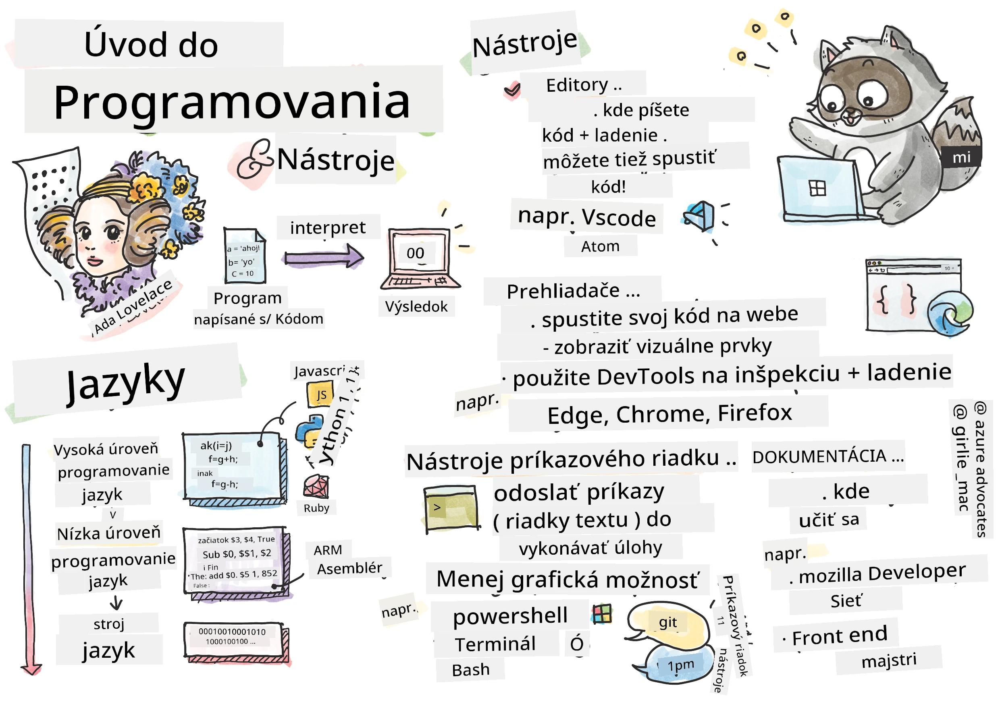
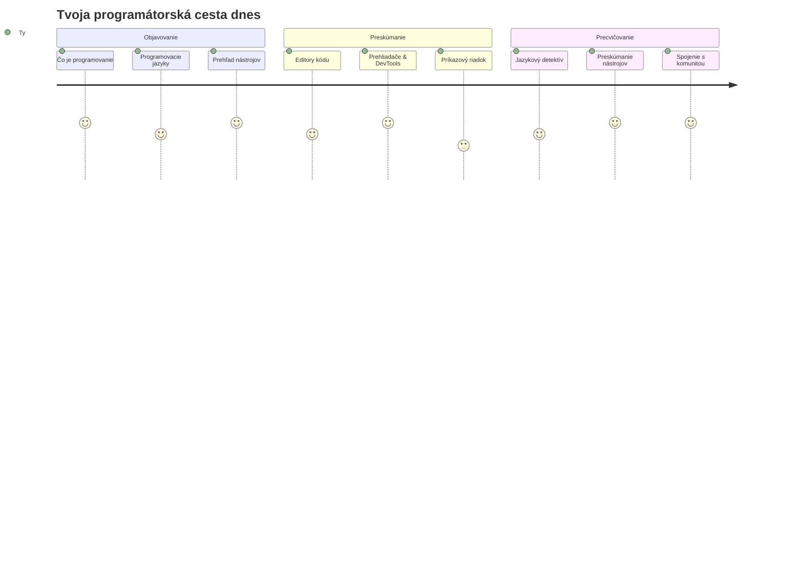
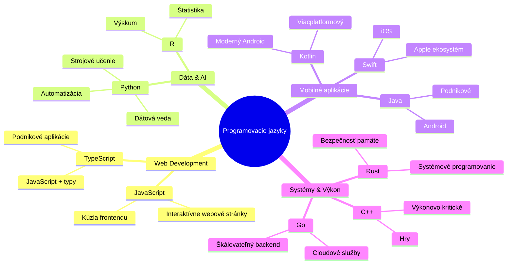
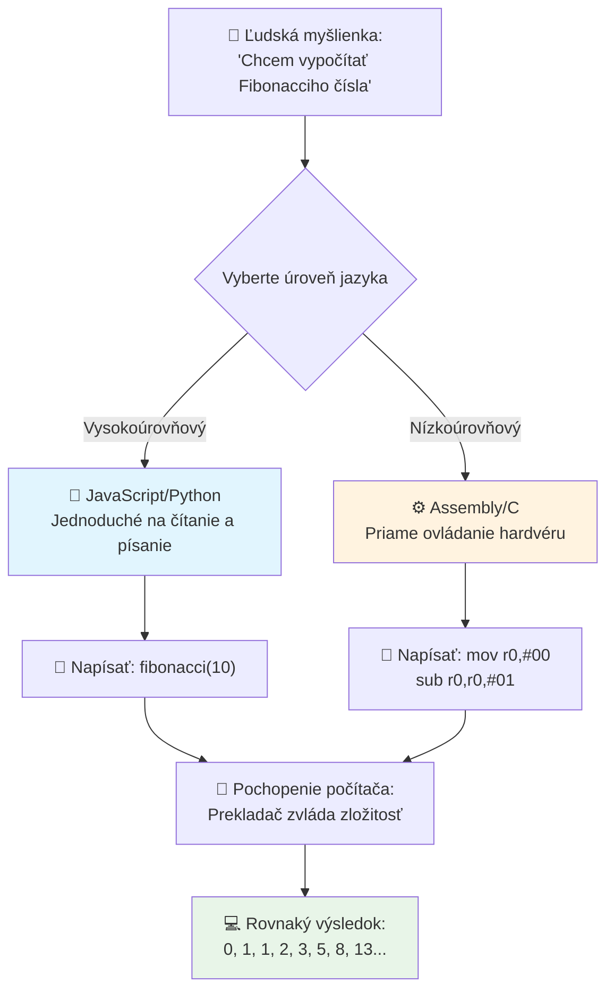
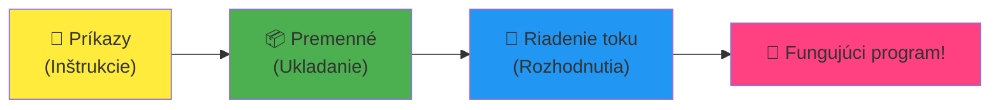
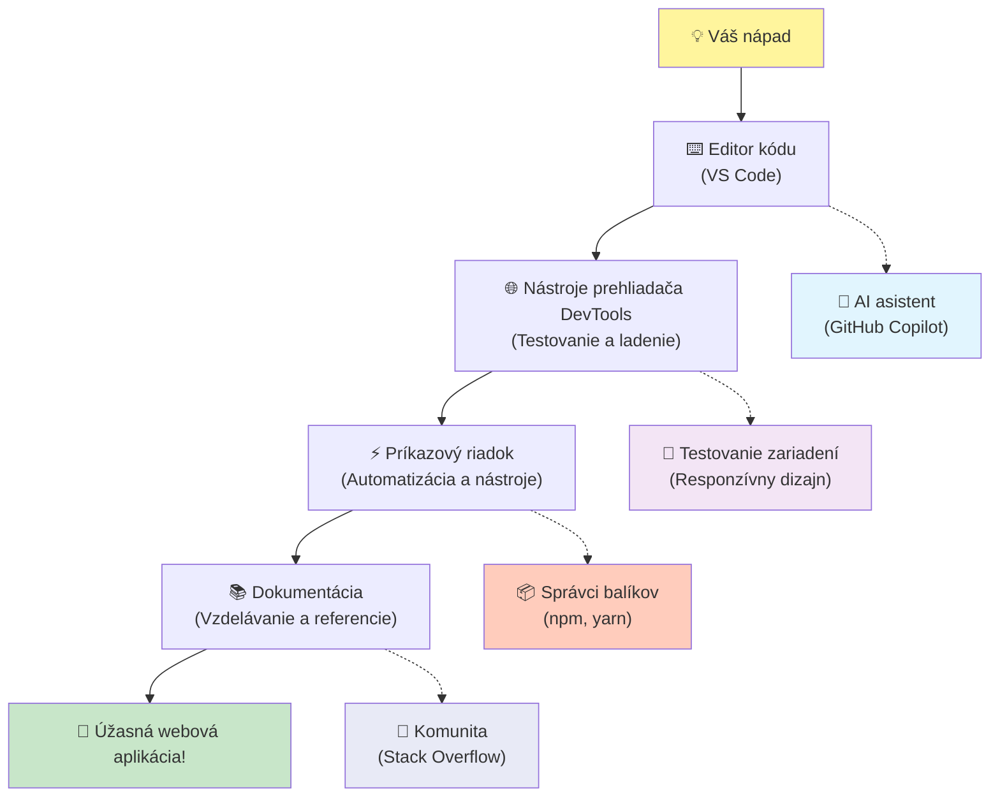
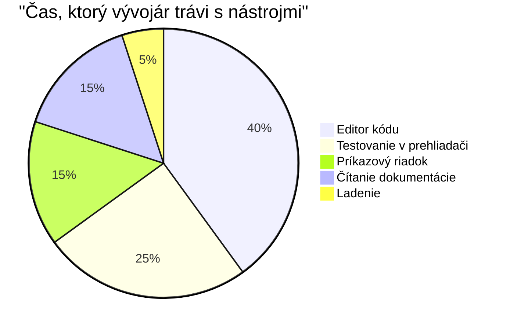
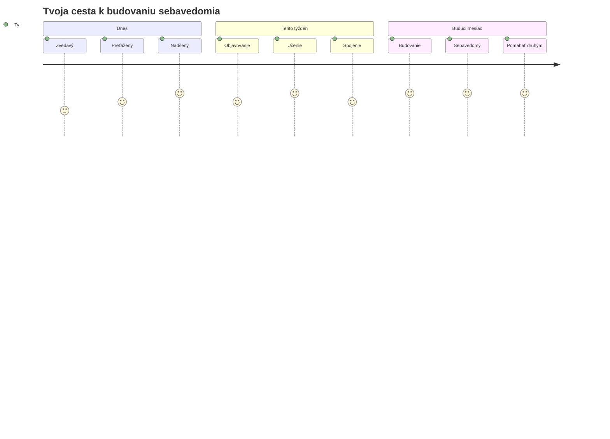

# Úvod do programovacích jazykov a moderných nástrojov pre vývojárov
 
Ahoj, budúci vývojár! 👋 Môžem ti povedať niečo, čo mi dodnes každý deň pripomína zimomriavky? Chystáš sa zistiť, že programovanie nie je len o počítačoch – je to o skutočných super schopnostiach, ktoré ti umožnia priviesť tvoje najdivokejšie nápady k životu!

Poznáš ten moment, keď používaš svoju obľúbenú aplikáciu a všetko do seba dokonale zapadá? Keď ťukneš tlačidlo a stane sa niečo úplne magické, čo ťa prinúti povedať „wow, ako to spravili?“ No niekto presne ako ty – pravdepodobne sediaci v obľúbenej kaviarni o 2 ráno s tretím espressom – napísal kód, ktorý túto mágiu vytvoril. A toto ťa úplne ohromí: na konci tejto lekcie nielenže pochopíš, ako to spravili, ale budeš mať obrovskú túžbu to sám vyskúšať!

Chápem, že programovanie môže teraz pôsobiť zastrašujúco. Keď som začínal, úprimne som si myslel, že musíš byť nejaký matematický génius alebo programovať od piatich rokov. Ale toto úplne zmenilo môj pohľad: programovanie je presne ako učiť sa viesť rozhovory v novom jazyku. Začneš s „ahoj“ a „ďakujem“, potom prejdeš k objednaniu kávy a skôr než sa nadaneš, vedieš hlboké filozofické diskusie! Len v tomto prípade vedieš rozhovory s počítačmi, a úprimne? Sú to najtrpezlivejší konverzační partneri, akých kedy stretneš – nikdy nesúdia tvoje chyby a vždy sú nadšení skúsiť to znova!

Dnes preskúmame neuveriteľné nástroje, ktoré robia moderný webový vývoj nielen možným, ale aj závislosť vytvárajúcim. Hovorím o tých istých editoroch, prehliadačoch a pracovných postupoch, ktoré denne používajú vývojári v Netflixe, Spotify a tvojom obľúbenom nezávislom štúdiu. A tu príde čas na radostný tanec: väčšina týchto profesionálnych, priemyselných nástrojov je úplne zadarmo!


> Sketchnote od [Tomomi Imura](https://twitter.com/girlie_mac)


```mermaid
journey
    title Tvoja programátorská cesta dnes
    section Objavovanie
      Čo je programovanie: 5: Ty
      Programovacie jazyky: 4: Ty
      Prehľad nástrojov: 5: Ty
    section Preskúmanie
      Editory kódu: 4: Ty
      Prehliadače & DevTools: 5: Ty
      Príkazový riadok: 3: Ty
    section Precvičovanie
      Jazykový detektív: 4: Ty
      Preskúmanie nástrojov: 5: Ty
      Spojenie s komunitou: 5: Ty
```
## Pozrime sa, čo už vieš!

Predtým, než sa pustíme do zábavy, zaujímalo by ma – čo už vieš o tomto svete programovania? A počuj, ak sa na tieto otázky pozeráš a myslíš si „toto mi je úplne neznáme,“ to nie je len v poriadku, to je dokonalé! To znamená, že si na tom správnom mieste. Mysli na tento kvíz ako na rozcvičku pred tréningom – len zahrievame mozgové svaly!

[Vyplň kvíz pred lekciou](https://ff-quizzes.netlify.app/web/)


## Dobrodružstvo, na ktoré sa spolu chystáme

Dobre, mám naozaj veľkú radosť z toho, čo dnes preskúmame! Úprimne, prial by som si vidieť tvoju tvár, keď ti niektoré z týchto konceptov konečne zapadnú. Tu je úžasná cesta, ktorou sa spolu vydáme:

- **Čo programovanie vlastne je (a prečo je to to najúžasnejšie na svete!)** – Objavíme, ako je kód doslova neviditeľná mágia, ktorá poháňa všetko okolo teba, od budíka, ktorý nejako vie, že je pondelok ráno, až po algoritmus, ktorý dokonale kurátoriuje tvoje odporúčania na Netflixe
- **Programovacie jazyky a ich úžasné osobnosti** – Predstav si, že vstúpiš na párty, kde má každý človek úplne iné superschopnosti a spôsoby riešenia problémov. Taký je svet programovacích jazykov a budeš ich milovať spoznávať!
- **Základné stavebné prvky, ktoré robia digitálnu mágiu možnou** – Predstav si to ako ultimátne kreatívne LEGO. Keď pochopíš, ako tieto kúsky do seba zapadajú, uvedomíš si, že môžeš postaviť prakticky čokoľvek, na čo si len pomyslíš
- **Profesionálne nástroje, ktoré ti dajú pocit, že si práve dostal čarodejnícku paličku** – Nezveličujem – tieto nástroje ti skutočne dajú pocit, že máš superschopnosti, a najlepšie na tom je? Sú to tie isté nástroje, ktoré používajú profesionáli!

> 💡 **Vec na zapamätanie**: Ani nepremýšľaj o tom, že by si sa dnes snažil všetko nasilu zapamätať! Teraz chcem len, aby si pocítil iskru nadšenia z toho, čo je možné. Detaily sa prirodzene udomácnia, keď to spolu precvičíme – takto sa skutočne učí!

> Túto lekciu môžeš absolvovať na [Microsoft Learn](https://learn.microsoft.com/en-us/learn/modules/web-development-101/introduction-programming/?WT.mc_id=academic-77807-sagibbon)!

## Tak čo presne *je* programovanie?

Dobre, poďme sa pustiť do miliónovej otázky: čo je programovanie, naozaj?

Poviem ti príbeh, ktorý úplne zmenil môj pohľad. Minulý týždeň som sa snažil vysvetliť mame, ako používať náš nový diaľkový ovládač od smart TV. Chytil som sa pri tom, ako hovorím niečo ako „Stlač červené tlačidlo, ale nie to veľké červené tlačidlo, malé červené tlačidlo naľavo... nie, tvoj druhý ľavý... dobre, teraz ho podrž na dve sekundy, nie jednu, nie tri...“ Znie to povedome? 😅

To je programovanie! Je to umenie dávať neuveriteľne podrobné, krok za krokom inštrukcie niečomu, čo je veľmi výkonné, ale potrebuje, aby mu bolo všetko napísané úplne presne. Len namiesto vysvetľovania tvojej mame (ktorá sa môže spýtať „ktoré červené tlačidlo?!“) vysvetľuješ počítaču (ktorý jednoducho urobí presne to, čo povieš, aj keď to, čo si povedal, nie je úplne to, čo si mal na mysli).

Čo ma úplne ohromilo, keď som sa to naučil: počítače sú v jadre vlastne dosť jednoduché. Doslova rozumejú len dvom veciam – 1 a 0, čo je v podstate „áno“ a „nie“ alebo „zapnuté“ a „vypnuté.“ To je všetko! Ale tu prichádza magia – nemusíme hovoriť v 1 a 0 ako v Matrixe. Prichádzajú na pomoc **programovacie jazyky**. Sú ako najlepší prekladateľ na svete, ktorý vezme tvoje bežné ľudské myšlienky a premení ich na jazyk počítača.

A toto mi každý ráno znovu spôsobuje zimomriavky: doslova VŠETKO digitálne vo tvojom živote začalo niekým podobným ako si ty, pravdepodobne v pyžame s šálkou kávy, píšucim kód na svojom laptope. Ten Instagram filter, ktorý ťa nechá vyzerať dokonalo? Niekto to zakódoval. Odporúčanie, ktoré ťa priviedlo k tvojej novej obľúbenej pesničke? Vývojár vytvoril ten algoritmus. Aplikácia, ktorá ti pomôže rozdeliť účet za večeru s priateľmi? Áno, niekto si povedal „to je otravné, určite by som to mohol opraviť“ a potom... to urobil!

Keď sa naučíš programovať, nezdobávaš si len novú zručnosť – stávaš sa súčasťou tohto neuveriteľného spoločenstva riešiteľov problémov, ktorí trávia dni premýšľaním „Čo keby som mohol vytvoriť niečo, čo niekomu deň trochu zlepší?“ Úprimne, existuje niečo lepšie?

✅ **Lov na zaujímavosť**: Tu je niečo super zaujímavé, čo si vyhľadaj, keď budeš mať voľnú chvíľku – kto bol podľa teba prvým programátorom na svete? Dám ti nápovedu: možno to nie je ten, koho očakávaš! Príbeh za touto osobou je absolútne fascinujúci a ukazuje, že programovanie vždy bolo o kreatívnom riešení problémov a myslení mimo zaužívaných postupov.

### 🧠 **Čas na kontrolu: Ako sa cítiš?**

**Zastav sa na chvíľu a zamysli sa:**
- Má pre teba teraz zmysel predstava „dávania inštrukcií počítačom“?
- Vieš si predstaviť nejakú každodennú úlohu, ktorú by si chcel automatizovať pomocou programovania?
- Aké otázky ti víria v hlave o tom celom programovaní?

> **Pamätaj**: Je úplne normálne, ak sa niektoré pojmy teraz javia rozmazané. Učenie sa programovania je ako učenie sa nového jazyka – trvá to, kým si tvoj mozog vytvorí tie nové nervové spoje. Robíš to skvelo!

## Programovacie jazyky sú ako rôzne hudobné žánre

Dobre, toto bude znieť čudne, ale vydrž so mnou – programovacie jazyky sú veľmi podobné rôznym druhom hudby. Premysli si to: máš jazz, ktorý je jemný a improvizačný, rock, ktorý je silný a priamočiary, klasiku, ktorá je elegentná a štruktúrovaná, a hip-hop, ktorý je kreatívny a expresívny. Každý štýl má svoju atmosféru, svoje komunitné fanúšikovské jadro a každý je vhodný na iné nálady a príležitosti.

Programovacie jazyky fungujú úplne rovnako! Nepoužil by si ten istý jazyk na vytvorenie zábavnej mobilnej hry, aký by si použil na spracovanie obrovského množstva klimatických dát, rovnako ako by si nezačal hrať death metal na joge (no, väčšina jogových tried určite nie! 😄).

Ale toto ma vždy úplne ohromí: tieto jazyky sú ako mať najtrpezlivejšieho, brilantného prekladateľa na svete sediaceho priamo vedľa teba. Môžeš vyjadriť svoje nápady spôsobom, ktorý je prirodzený pre ľudský mozog, a ony sa postarajú o všetku neuveriteľne zložitú prácu prevodu do 1 a 0, ktorým počítače skutočne „hovoria“. Je to ako mať kamaráta, ktorý dokonale ovláda „ľudskú kreativitu“ aj „počítačovú logiku“ – nikdy sa neunaví, nikdy nepotrebuje pauzu na kávu a nikdy ťa nesúdi, keď sa pýtaš tú istú otázku dvakrát!

### Populárne programovacie jazyky a ich použitie


```mermaid
mindmap
  root((Programovacie jazyky))
    Web Development
      JavaScript
        Kúzla frontendu
        Interaktívne webové stránky
      TypeScript
        JavaScript + typy
        Podnikové aplikácie
    Dáta & AI
      Python
        Dátová veda
        Strojové učenie
        Automatizácia
      R
        Štatistika
        Výskum
    Mobilné aplikácie
      Java
        Android
        Podnikové
      Swift
        iOS
        Apple ekosystém
      Kotlin
        Moderný Android
        Viacplatformový
    Systémy & Výkon
      C++
        Hry
        Výkonovo kritické
      Rust
        Bezpečnosť pamäte
        Systémové programovanie
      Go
        Cloudové služby
        Škálovateľný backend
```
| Language | Best For | Why It's Popular |
|----------|----------|------------------|
| **JavaScript** | Web development, user interfaces | Runs in browsers and powers interactive websites |
| **Python** | Data science, automation, AI | Easy to read and learn, powerful libraries |
| **Java** | Enterprise applications, Android apps | Platform-independent, robust for large systems |
| **C#** | Windows applications, game development | Strong Microsoft ecosystem support |
| **Go** | Cloud services, backend systems | Fast, simple, designed for modern computing |

### Vysokoúrovňové vs. nízkoúrovňové jazyky

Ok, toto bol úprimne koncept, ktorý mi rozbil mozog, keď som začínal, tak ti poviem analógiu, ktorá mi to konečne vysvetlila – a naozaj dúfam, že pomôže aj tebe!

Predstav si, že navštíviš krajinu, kde nehovoríš jazykom, a zúfalo potrebuješ nájsť najbližšie WC (všetci sme to už zažili, nie? 😅):

- **Nízkoúrovňové programovanie** je ako naučiť sa miestny dialekt tak dobre, že vieš konverzovať so starou mamou predávajúcou ovocie na rohu, používaš kultúrne referencie, miestny slang a vnútorné žarty, ktoré pochopí iba niekto, kto tam vyrastal. Super pôsobivé a neuveriteľne efektívne... ak práve plynule ovládaš ten dialekt! Ale dosť ohromujúce, keď sa len snažíš nájsť toaletu.

- **Vysokoúrovňové programovanie** je ako mať toho úžasného miestneho kamaráta, ktorý ťa dokonale chápe. Môžeš povedať „Skutočne potrebujem nájsť toaletu“ v obyčajnej slovenčine a on zariadi celý kultúrny preklad a dá ti smer, ktorý dá zmysel tvojmu nelokálnemu mozgu.

V programátorskom svete:
- **Nízkoúrovňové jazyky** (napr. Assembly alebo C) ti umožňujú viesť neuveriteľne detailné rozhovory so skutočným hardvérom počítača, ale musíš myslieť ako stroj, čo je... no, povedzme, že to je veľký mentálny presun!
- **Vysokoúrovňové jazyky** (ako JavaScript, Python alebo C#) ti umožňujú myslieť ako človek, zatiaľ čo sa postarajú o všetku reč stroja za scénou. Navyše majú neuveriteľne vítajúce komunity plné ľudí, ktorí si pamätajú, aké to bolo byť začiatočníkom a naozaj chcú pomôcť!

Hádaj, ktoré ti navrhnem začať používať? 😉 Vysokoúrovňové jazyky sú ako pomocné kolieska na bicykli, ktoré si v skutočnosti nechceš nikdy dať dole, pretože robia celý zážitok omnoho zábavnejším!


```mermaid
flowchart TB
    A["👤 Ľudská myšlienka:<br/>'Chcem vypočítať Fibonacciho čísla'"] --> B{Vyberte úroveň jazyka}
    
    B -->|Vysokoúrovňový| C["🌟 JavaScript/Python<br/>Jednoduché na čítanie a písanie"]
    B -->|Nízkoúrovňový| D["⚙️ Assembly/C<br/>Priame ovládanie hardvéru"]
    
    C --> E["📝 Napísať: fibonacci(10)"]
    D --> F["📝 Napísať: mov r0,#00<br/>sub r0,r0,#01"]
    
    E --> G["🤖 Pochopenie počítača:<br/>Prekladač zvláda zložitosť"]
    F --> G
    
    G --> H["💻 Rovnaký výsledok:<br/>0, 1, 1, 2, 3, 5, 8, 13..."]
    
    style C fill:#e1f5fe
    style D fill:#fff3e0
    style H fill:#e8f5e8
```
### Ukážem ti, prečo sú vysokoúrovňové jazyky oveľa priateľskejšie

Dobre, chystám sa ti ukázať niečo, čo dokonale demonštruje, prečo som sa zamiloval do vysokoúrovňových jazykov, ale najprv – potrebujem sľub. Keď uvidíš ten prvý ukážkový kód, nepanikár! Má vyzerať zastrašujúco. Presne to chcem ukázať!

Pozrieme sa na ten istý úkon napísaný v dvoch úplne odlišných štýloch. Obe vytvárajú niečo, čo sa nazýva Fibonacciho postupnosť – je to nádherný matematický vzor, kde každé číslo je súčtom dvoch predchádzajúcich: 0, 1, 1, 2, 3, 5, 8, 13... (Zaujímavosť: tento vzor nájdeš doslova všade v prírode – spirály slnečnicových semien, vzory šišiek, dokonca spôsob, akým sa tvoria galaxie!)

Pripravený vidieť rozdiel? Poďme na to!

**Vysokoúrovňový jazyk (JavaScript) – priateľský pre človeka:**

```javascript
// Krok 1: Základné nastavenie Fibonacciho postupnosti
const fibonacciCount = 10;
let current = 0;
let next = 1;

console.log('Fibonacci sequence:');
```

**Čo tento kód robí:**
- **Deklaruje** konštantu, ktorá určuje, koľko Fibonacciho čísel chceme vygenerovať
- **Inicializuje** dve premenné na sledovanie aktuálneho a nasledujúceho čísla v postupnosti
- **Nastaví** počiatočné hodnoty (0 a 1), ktoré definujú Fibonacciho vzor
- **Zobrazí** hlavičkovú správu na identifikáciu nášho výstupu

```javascript
// Krok 2: Vygenerujte postupnosť pomocou slučky
for (let i = 0; i < fibonacciCount; i++) {
  console.log(`Position ${i + 1}: ${current}`);
  
  // Vypočítajte nasledujúce číslo v postupnosti
  const sum = current + next;
  current = next;
  next = sum;
}
```

**Rozpis toho, čo sa tu deje:**
- **Prechádza** každú pozíciu v našej postupnosti pomocou `for` slučky
- **Zobrazí** každé číslo s jeho pozíciou pomocou formátovania s template literálmi
- **Vypočíta** ďalšie Fibonacciho číslo sčítaním aktuálnej a nasledujúcej hodnoty
- **Aktualizuje** naše sledovacie premenné, aby prešlo na ďalšiu iteráciu

```javascript
// Krok 3: Moderný funkcionálny prístup
const generateFibonacci = (count) => {
  const sequence = [0, 1];
  
  for (let i = 2; i < count; i++) {
    sequence[i] = sequence[i - 1] + sequence[i - 2];
  }
  
  return sequence;
};

// Príklad použitia
const fibSequence = generateFibonacci(10);
console.log(fibSequence);
```

**Vo vyššie uvedenom sme:**
- **Vytvorili** znovupoužiteľnú funkciu pomocou modernej syntaxe šípkových funkcií
- **Vytvorili** pole na uloženie celej postupnosti namiesto zobrazovania po jednom
- **Použili** indexovanie poľa na vypočítanie každého nového čísla z predchádzajúcich hodnôt
- **Vrátili** kompletnú postupnosť pre flexibilné použitie v iných častiach nášho programu

**Nízkoúrovňový jazyk (ARM Assembly) – priateľský k počítaču:**

```assembly
 area ascen,code,readonly
 entry
 code32
 adr r0,thumb+1
 bx r0
 code16
thumb
 mov r0,#00
 sub r0,r0,#01
 mov r1,#01
 mov r4,#10
 ldr r2,=0x40000000
back add r0,r1
 str r0,[r2]
 add r2,#04
 mov r3,r0
 mov r0,r1
 mov r1,r3
 sub r4,#01
 cmp r4,#00
 bne back
 end
```

Všimni si, ako verzia v JavaScripte číta takmer ako anglické inštrukcie, zatiaľ čo verzia v Assembly používa kryptické príkazy, ktoré priamo ovládajú procesor počítača. Obe dosiahnu presne ten istý výsledok, ale vysokoúrovňový jazyk je oveľa jednoduchší na pochopenie, písanie a údržbu.

**Kľúčové rozdiely, ktoré si všimneš:**
- **Čitateľnosť**: JavaScript používa popisné mená ako `fibonacciCount` zatiaľ čo Assembly používa kryptické štítky ako `r0`, `r1`
- **Komentáre**: Vysokoúrovňové jazyky podporujú vysvetľujúce komentáre, ktoré robia kód samodokumentujúcim sa
- **Štruktúra**: Logický tok JavaScriptu zodpovedá tomu, ako ľudia premýšľajú o problémoch krok za krokom
- **Údržba**: Aktualizácia JavaScriptovej verzie pre rôzne požiadavky je jednoduchá a prehľadná

✅ **O Fibonacciho postupnosti**: Tento absolútne nádherný číselný vzor (kde každé číslo sa rovná súčtu dvoch predchádzajúcich: 0, 1, 1, 2, 3, 5, 8...) sa objavuje doslova *všade* v prírode! Nájdete ho v špirálach slnečníc, vzoroch šišiek, v tom, ako sa zakrivujú lastúry náutilu, a dokonca aj v tom, ako rastú konáre stromov. Je to dosť ohromujúce, ako môžu matematika a kód pomôcť pochopiť a znovu vytvárať vzory, ktoré príroda používa na tvorbu krásy!


## Stavebné bloky, ktoré umožňujú, aby sa tá mágia stala

Tak dobre, teraz keď ste videli, ako vyzerajú programovacie jazyky v akcii, poďme rozobrať základné časti, ktoré tvoria doslova každý napísaný program. Považujte ich za nevyhnutné ingrediencie vo vašom obľúbenom recepte – keď pochopíte, čo každá robí, budete schopní čítať a písať kód v takmer ľubovoľnom jazyku!

Je to trochu ako učiť sa gramatiku programovania. Pamätáte sa do školy, keď ste sa učili o podstatných menách, slovesách a ako skladať vety? Programovanie má svoju vlastnú verziu gramatiky, a úprimne, je oveľa logickejšie a zhovievavejšie než anglická gramatika! 😄

### Príkazy: Krok za krokom inštrukcie

Začnime so **príkazmi** – tie sú ako jednotlivé vety v rozhovore s vaším počítačom. Každý príkaz hovorí počítaču urobiť jednu konkrétnu vec, akoby ste dávali smernice: "Zatoč tu doľava," "Zastav na červenej," "Zaparkuj na tom mieste."

Na tom, čo mám na príkazoch rád, je to, aké čitateľné zvyčajne sú. Pozrite sa na toto:

```javascript
// Základné príkazy, ktoré vykonávajú jednotlivé akcie
const userName = "Alex";                    
console.log("Hello, world!");              
const sum = 5 + 3;                         
```

**Tu je, čo tento kód robí:**
- **Deklarovať** konštantnú premennú na uloženie mena používateľa
- **Zobraziť** uvítaciu správu v konzole
- **Vypočítať** a uložiť výsledok matematickej operácie

```javascript
// Príkazy, ktoré interagujú s webovými stránkami
document.title = "My Awesome Website";      
document.body.style.backgroundColor = "lightblue";
```

**Krok za krokom, čo sa deje:**
- **Upraviť** názov webovej stránky, ktorý sa zobrazuje na karte prehliadača
- **Zmeniť** farbu pozadia celého tela stránky

### Premenné: Pamäťový systém vášho programu

Dobre, **premenné** sú jeden z mojich najobľúbenejších konceptov na výučbu, pretože sú tak podobné veciam, ktoré už každý deň používate!

Premyslite si zoznam kontaktov v telefóne. Nezapamätávate si čísla všetkých – namiesto toho uložíte "Mama", "Najlepší priateľ" alebo "Pizzeria, ktorá rozváža do 2:00" a necháte telefón, aby si zapamätal skutočné čísla. Premenné fungujú presne rovnako! Sú ako označené nádoby, kde si váš program môže uložiť informácie a neskôr ich načítať pomocou mena, ktoré má zmysel.

Tu je to naozaj skvelé: premenné sa môžu počas behu programu meniť (odtiaľ názov "premenná" – vidíte, čo urobili?). Rovnako ako možno aktualizujete kontakt na pizzu, keď nájdete niečo lepšie, premenné možno zmeniť, keď sa program dozvie nové informácie alebo keď sa situácie zmenia!

Ukážem vám, aké to môže byť prekvapivo jednoduché:

```javascript
// Krok 1: Vytvorenie základných premenných
const siteName = "Weather Dashboard";        
let currentWeather = "sunny";               
let temperature = 75;                       
let isRaining = false;                      
```

**Pochopenie týchto konceptov:**
- **Uložiť** nemenné hodnoty do premenných `const` (napr. názov stránky)
- **Použiť** `let` pre hodnoty, ktoré sa môžu počas programu meniť
- **Priradiť** rôzne dátové typy: reťazce (text), čísla a booleovské hodnoty (true/false)
- **Vybrať** popisné mená, ktoré vysvetľujú, čo každá premenná obsahuje

```javascript
// Krok 2: Práca s objektmi na zoskupovanie súvisiacich údajov
const weatherData = {                       
  location: "San Francisco",
  humidity: 65,
  windSpeed: 12
};
```

**V predchádzajúcom príklade sme:**
- **Vytvorili** objekt na zoskupenie súvisiacich informácií o počasí
- **Usporiadali** viacero údajov pod jedno meno premennej
- **Použili** páry kľúč-hodnota na jasné označenie každej informácie

```javascript
// Krok 3: Používanie a aktualizácia premenných
console.log(`${siteName}: Today is ${currentWeather} and ${temperature}°F`);
console.log(`Wind speed: ${weatherData.windSpeed} mph`);

// Aktualizácia zmeniteľných premenných
currentWeather = "cloudy";                  
temperature = 68;                          
```

**Poďme pochopiť každú časť:**
- **Zobraziť** informácie pomocou template literálov so syntaxou `${}`
- **Pristupovať** k vlastnostiam objektu pomocou bodovej notácie (`weatherData.windSpeed`)
- **Aktualizovať** premenné deklarované pomocou `let`, aby odrážali meniace sa podmienky
- **Kombinovať** viacero premenných na vytváranie zmysluplných správ

```javascript
// Krok 4: Moderná destrukturalizácia pre čistejší kód
const { location, humidity } = weatherData; 
console.log(`${location} humidity: ${humidity}%`);
```

**Čo potrebujete vedieť:**
- **Extrahovať** konkrétne vlastnosti z objektov pomocou destrukturovania priradením
- **Vytvoriť** nové premenné automaticky s rovnakými menami ako kľúče objektu
- **Zjednodušiť** kód vyhnutím sa opakovaného používania bodovej notácie

### Riadenie toku: Naučiť váš program rozmýšľať

Dobre, tu programovanie začína byť úplne ohromujúce! **Riadenie toku** je v podstate učenie vášho programu, ako robiť múdre rozhodnutia, presne tak, ako to robíte vy každý deň bez rozmýšľania.

Predstavte si toto: dnes ráno ste pravdepodobne prešli niečím ako "Ak prší, zoberiem si dáždnik. Ak je zima, oblečiem si bundu. Ak meškám, vynechám raňajky a zoberiem si kávu cestou." Váš mozog prirodzene nasleduje túto if-then logiku desiatky krát každý deň!

Práve toto spôsobuje, že programy pôsobia inteligentne a živé namiesto toho, aby iba nasledovali nejaký nudný, predvídateľný skript. Dokážu sa pozrieť na situáciu, vyhodnotiť, čo sa deje, a primerane zareagovať. Je to ako dať programu mozog, ktorý sa dokáže prispôsobiť a robiť rozhodnutia!

Chcete vidieť, ako krásne to funguje? Ukážem vám:

```javascript
// Krok 1: Základná podmienená logika
const userAge = 17;

if (userAge >= 18) {
  console.log("You can vote!");
} else {
  const yearsToWait = 18 - userAge;
  console.log(`You'll be able to vote in ${yearsToWait} year(s).`);
}
```

**Tento kód robí:**
- **Skontrolovať**, či vek používateľa spĺňa požiadavku na hlasovanie
- **Spustiť** rôzne bloky kódu na základe výsledku podmienky
- **Vypočítať** a zobraziť, ako dlho zostáva do dosiahnutia veku oprávnenosti na hlasovanie, ak je používateľ mladší ako 18
- **Poskytnúť** konkrétnu, užitočnú spätnú väzbu pre každú situáciu

```javascript
// Krok 2: Viaceré podmienky s logickými operátormi
const userAge = 17;
const hasPermission = true;

if (userAge >= 18 && hasPermission) {
  console.log("Access granted: You can enter the venue.");
} else if (userAge >= 16) {
  console.log("You need parent permission to enter.");
} else {
  console.log("Sorry, you must be at least 16 years old.");
}
```

**Rozobratie toho, čo sa tu deje:**
- **Kombinovať** viacero podmienok pomocou operátora `&&` (and)
- **Vytvoriť** hierarchiu podmienok pomocou `else if` pre viaceré scenáre
- **Zvládnuť** všetky možné prípady s posledným `else` vyjadrením
- **Poskytnúť** jasnú, konštruktívnu spätnú väzbu pre každú odlišnú situáciu

```javascript
// Krok 3: stručný podmienený výraz pomocou ternárneho operátora
const votingStatus = userAge >= 18 ? "Can vote" : "Cannot vote yet";
console.log(`Status: ${votingStatus}`);
```

**Čo si treba zapamätať:**
- **Používajte** ternárny operátor (`? :`) pre jednoduché podmienky s dvoma možnosťami
- **Zapíšte** najprv podmienku, potom `?`, potom výsledok pre true, potom `:`, potom výsledok pre false
- **Použite** tento vzor, keď potrebujete priradiť hodnoty na základe podmienok

```javascript
// Krok 4: Zaobchádzanie s viacerými konkrétnymi prípadmi
const dayOfWeek = "Tuesday";

switch (dayOfWeek) {
  case "Monday":
  case "Tuesday":
  case "Wednesday":
  case "Thursday":
  case "Friday":
    console.log("It's a weekday - time to work!");
    break;
  case "Saturday":
  case "Sunday":
    console.log("It's the weekend - time to relax!");
    break;
  default:
    console.log("Invalid day of the week");
}
```

**Tento kód vykonáva nasledovné:**
- **Porovnať** hodnotu premennej s viacerými konkrétnymi prípadmi
- **Zoskupiť** podobné prípady (pracovné dni vs. víkendy)
- **Spustiť** príslušný blok kódu, keď sa nájde zhoda
- **Zahrnúť** prípad `default` na spracovanie neočakávaných hodnôt
- **Použiť** príkazy `break`, aby sa zabránilo pokračovaniu kódu do nasledujúceho prípadu

> 💡 **Analógia zo skutočného sveta**: Predstavte si riadenie toku ako najtrpezlivejší GPS na svete, ktorý vám dáva pokyny. Môže povedať "Ak je na Main Street zápcha, choďte diaľnicou namiesto toho. Ak je diaľnica zablokovaná stavebnými prácami, skúste scenickú trasu." Programy používajú presne rovnaký typ podmienennej logiky, aby sa inteligentne prispôsobili rôznym situáciám a vždy poskytli používateľom čo najlepší zážitok.

### 🎯 **Kontrolný test: Ovládnutie stavebných blokov**

**Pozrime sa, ako vám idú základy:**
- Dokážete vlastnými slovami vysvetliť rozdiel medzi premennou a príkazom?
- Premyslite si reálny scenár, kde by ste použili if-then rozhodnutie (ako v našom príklade s hlasovaním)
- Čo je jedna vec o programovacej logike, ktorá vás prekvapila?

**Rýchle povzbudenie:**

```mermaid
flowchart LR
    A["📝 Príkazy<br/>(Inštrukcie)"] --> B["📦 Premenné<br/>(Ukladanie)"] --> C["🔀 Riadenie toku<br/>(Rozhodnutia)"] --> D["🎉 Fungujúci program!"]
    
    style A fill:#ffeb3b
    style B fill:#4caf50
    style C fill:#2196f3
    style D fill:#ff4081
```
✅ **Čo príde ďalej**: Budeme sa úžasne baviť pri hlbšom ponore do týchto konceptov, keď budeme pokračovať v tejto neuveriteľnej ceste spolu! Teraz sa len sústreďte na to, aby ste cítili vzrušenie z všetkých úžasných možností, ktoré vás čakajú. Špecifické zručnosti a techniky si prirodzene osvojíte pri spoločnom cvičení – sľubujem, že to bude oveľa zábavnejšie, než by ste čakali!

## Nástroje remesla

Dobre, toto je úprimne moment, keď som tak nadšený, že sa to sotva viem ovládať! 🚀 Chystáme sa hovoriť o neuveriteľných nástrojoch, ktoré vám dajú pocit, akoby ste práve dostali kľúče k digitálnej vesmírnej lodi.

Viete, ako má šéfkuchár dokonale vyvážené nože, ktoré sa cítia ako predĺženie jeho rúk? Alebo ako má hudobník tú jednu gitaru, ktorá akoby spievala hneď, ako sa jej dotkne? No, vývojári majú svoju verziu týchto magických nástrojov, a tu je to, čo vám úplne vyrazí dych – väčšina z nich je úplne zadarmo!

Prakticky poskakujem na stoličke pri pomyslení, že sa s vami o ne podelím, pretože úplne zreformovali spôsob, akým vytvárame softvér. Hovoríme o AI-poháňaných asistentoch na písanie kódu, ktorí vám môžu pomôcť napísať kód (Naozaj, nepreháňam!), cloudových prostrediach, kde môžete vytvárať celé aplikácie doslova odkiaľkoľvek s Wi-Fi, a nástrojoch na ladenie tak sofistikovaných, že sú ako röntgenové videnie pre vaše programy.

A tu je časť, pri ktorej sa mi stále zimomrie: toto nie sú "nástroje pre začiatočníkov", ktoré prerastiete. Sú to presne tie isté profesionálne nástroje, ktoré práve teraz používajú vývojári v Google, Netflixe a v tom indie štúdiu aplikácií, ktoré máte radi. Pri ich používaní sa budete cítiť ako ozajstný profík!


```mermaid
graph TD
    A["💡 Váš nápad"] --> B["⌨️ Editor kódu<br/>(VS Code)"] 
    B --> C["🌐 Nástroje prehliadača DevTools<br/>(Testovanie a ladenie)"]
    C --> D["⚡ Príkazový riadok<br/>(Automatizácia a nástroje)"]
    D --> E["📚 Dokumentácia<br/>(Vzdelávanie a referencie)"]
    E --> F["🚀 Úžasná webová aplikácia!"]
    
    B -.-> G["🤖 AI asistent<br/>(GitHub Copilot)"]
    C -.-> H["📱 Testovanie zariadení<br/>(Responzívny dizajn)"]
    D -.-> I["📦 Správci balíkov<br/>(npm, yarn)"]
    E -.-> J["👥 Komunita<br/>(Stack Overflow)"]
    
    style A fill:#fff59d
    style F fill:#c8e6c9
    style G fill:#e1f5fe
    style H fill:#f3e5f5
    style I fill:#ffccbc
    style J fill:#e8eaf6
```
### Editory kódu a IDE: Vaši noví digitálni najlepší priatelia

Porozprávajme sa o editoroch kódu – tieto sa čoskoro stanú vaším novým obľúbeným miestom, kde sa zdržiavate! Považujte ich za svoje osobné útočisko na kódovanie, kde strávite väčšinu času tvorbou a dolaďovaním svojich digitálnych výtvorov.

Ale tu je to, čo je na moderných editoroch úplne magické: nie sú to len šikovné textové editory. Sú ako mať najbystrejšieho, podporného mentora pre kódovanie, ktorý sedí vedľa vás 24/7. Chytajú vaše preklepy ešte predtým, ako si ich všimnete, navrhujú vylepšenia, ktoré z vás robia génia, pomáhajú vám pochopiť, čo každý kus kódu robí, a niektoré z nich dokonca dokážu predpovedať, čo sa chystáte napísať a ponúknuť dokončenie vašich myšlienok!

Pamätám si, keď som prvýkrát objavil automatické dopĺňanie – doslova som mal pocit, že žijem v budúcnosti. Začnete niečo písať a editor vás osloví: "Hej, nechceli ste použiť túto funkciu, ktorá robí presne to, čo potrebujete?" Je to ako mať čitateľa myšlienok ako vášho kódovacieho parťáka!

**Čo robí tieto editory tak neuveriteľnými?**

Moderné editory kódu ponúkajú pôsobivú škálu funkcií navrhnutých na zvýšenie vašej produktivity:

| Funkcia | Čo robí | Prečo to pomáha |
|---------|--------------|--------------|
| **Zvýraznenie syntaxe** | Zafarbuje rôzne časti vášho kódu | Uľahčuje čítanie kódu a odhaľovanie chýb |
| **Automatické dopĺňanie** | Navrhuje kód počas písania | Urýchľuje kódovanie a znižuje preklepy |
| **Nástroje na ladenie** | Pomáhajú nájsť a opraviť chyby | Šetria hodiny odstraňovania problémov |
| **Rozšírenia** | Pridávajú špecializované funkcie | Prispôsobte si editor pre ľubovoľnú technológiu |
| **AI asistenti** | Navrhujú kód a vysvetlenia | Zrýchľujú učenie a produktivitu |

> 🎥 **Video zdroj**: Chcete vidieť tieto nástroje v akcii? Pozrite si toto [video Nástroje remesla](https://youtube.com/watch?v=69WJeXGBdxg) pre komplexný prehľad.

#### Odporúčané editory pre webový vývoj

**[Visual Studio Code](https://code.visualstudio.com/?WT.mc_id=academic-77807-sagibbon)** (Zdarma)
- Najpopulárnejší medzi webovými vývojármi
- Vynikajúci ekosystém rozšírení
- Vstavaný terminál a integrácia s Gitom
- **Povinné rozšírenia**:
  - [GitHub Copilot](https://marketplace.visualstudio.com/items?itemName=GitHub.copilot) - Návrhy kódu poháňané AI
  - [Live Share](https://marketplace.visualstudio.com/items?itemName=MS-vsliveshare.vsliveshare) - Spolupráca v reálnom čase
  - [Prettier](https://marketplace.visualstudio.com/items?itemName=esbenp.prettier-vscode) - Automatické formátovanie kódu
  - [Code Spell Checker](https://marketplace.visualstudio.com/items?itemName=streetsidesoftware.code-spell-checker) - Zachytí preklepy vo vašom kóde

**[JetBrains WebStorm](https://www.jetbrains.com/webstorm/)** (Platené, zadarmo pre študentov)
- Pokročilé nástroje na ladenie a testovanie
- Inteligentné dokončovanie kódu
- Vstavaná správa verzií

**Cloudové IDE** (Rôzne ceny)
- [GitHub Codespaces](https://github.com/features/codespaces) - Plný VS Code vo vašom prehliadači
- [Replit](https://replit.com/) - Skvelé na učenie a zdieľanie kódu
- [StackBlitz](https://stackblitz.com/) - Okamžitý full-stack webový vývoj

> 💡 **Tip na začiatok**: Začnite s Visual Studio Code – je zadarmo, široko používané v odvetví a má obrovskú komunitu vytvárajúcu užitočné návody a rozšírenia.


### Webové prehliadače: Vaše tajné laboratórium pre vývoj

Dobre, pripravte sa, že vám to úplne vyrazí dych! Viete, ako používate prehliadače na rolovanie cez sociálne médiá a sledovanie videí? Ukazuje sa, že celý čas skrývali toto neuveriteľné tajné laboratórium pre vývojárov, ktoré len čakalo, kým ho objavíte!

Kedykoľvek kliknete pravým tlačidlom na webovú stránku a vyberiete "Skontrolovať prvok", otvárate skrytý svet nástrojov pre vývojárov, ktoré sú úprimne mocnejšie než niektoré drahé programy, za ktoré som zvykol platiť stovky dolárov. Je to ako zistiť, že vaša obyčajná kuchyňa skrýva za tajným panelom profesionálne kuchárske laboratórium!
Prvýkrát, keď mi niekto ukázal browser DevTools, strávil som asi tri hodiny len klikajúc a hovoriac "POČKAJ, TO TO TIEŽ VIE?!" Môžeš v reálnom čase doslova upravovať akúkoľvek webstránku, vidieť presne, ako rýchlo sa všetko načítava, otestovať, ako tvoja stránka vyzerá na rôznych zariadeniach, a dokonca ladiť JavaScript ako úplný profesionál. Je to úplne ohromujúce!

**Tu je dôvod, prečo sú prehliadače tvojou tajnou zbraňou:**

Keď vytváraš webovú stránku alebo webovú aplikáciu, potrebuješ vidieť, ako vyzerá a správa sa v reálnom svete. Prehliadače nielen zobrazujú tvoju prácu, ale tiež poskytujú podrobnú spätnú väzbu o výkone, prístupnosti a možných problémoch.

#### Browser Developer Tools (DevTools)

Moderné prehliadače obsahujú komplexné vývojové sady:

| Kategória nástroja | Čo robí | Príklad použitia |
|---------------|--------------|------------------|
| **Inšpektor prvkov** | Zobraziť a upravovať HTML/CSS v reálnom čase | Upraviť štýly a vidieť okamžité výsledky |
| **Konzola** | Zobraziť chybové hlásenia a testovať JavaScript | Ladiť problémy a experimentovať s kódom |
| **Sieťový monitor** | Sledovať, ako sa zdroje načítavajú | Optimalizovať výkon a časy načítania |
| **Kontrola prístupnosti** | Testovať inkluzívny dizajn | Zabezpečiť, aby tvoja stránka fungovala pre všetkých používateľov |
| **Simulátor zariadení** | Náhľad na rôznych veľkostiach obrazovky | Testovať responzívny dizajn bez viacerých zariadení |

#### Odporúčané prehliadače na vývoj

- **[Chrome](https://developers.google.com/web/tools/chrome-devtools/)** - Priemyselný štandard DevTools s rozsiahou dokumentáciou
- **[Firefox](https://developer.mozilla.org/docs/Tools)** - Vynikajúce nástroje pre CSS Grid a prístupnosť
- **[Edge](https://docs.microsoft.com/microsoft-edge/devtools-guide-chromium/?WT.mc_id=academic-77807-sagibbon)** - Postavený na Chromiu s vývojárskymi zdrojmi Microsoftu

> ⚠️ **Dôležitý tip pre testovanie**: Vždy testuj svoje weby v rôznych prehliadačoch! To, čo funguje dokonale v Chrome, môže vyzerať inak v Safari alebo Firefox. Profesionálni vývojári testujú vo všetkých hlavných prehliadačoch, aby zabezpečili konzistentný používateľský zážitok.


### Command Line Tools: Your Gateway to Developer Superpowers

Dobre, buďme tu úplne úprimní o príkazovom riadku, pretože chcem, aby si to počul od niekoho, kto to naozaj chápe. Keď som ho prvýkrát videl – len to strašidelné čierne okno s blikajúcim textom – doslova som si myslel, "Nie, určite nie! Toto vyzerá ako niečo z hackovacieho filmu z 80. rokov, a ja na to určite nie som dosť múdry!" 😅

Ale tu je to, čo by som si prial, aby mi vtedy niekto povedal, a čo ti hovorím práve teraz: príkazový riadok nie je strašidelný – je to vlastne ako viesť priamy rozhovor s tvojím počítačom. Predstav si to ako rozdiel medzi objednávaním jedla cez peknú aplikáciu s obrázkami a menu (čo je príjemné a jednoduché) a vstúpením do tvojej obľúbenej miestnej reštaurácie, kde kuchár presne vie, čo máš rád, a dokáže pripraviť niečo perfektné len na základe toho, že povieš "prekvap ma niečím úžasným."

Príkazový riadok je miesto, kde sa vývojári cítia ako absolútni kúzelníci. Napíšeš pár zdanlivo magických slov (dobre, sú to len príkazy, ale pôsobia magicky!), stlačíš Enter a BUM – vytvoril si celé projektové štruktúry, nainštaloval silné nástroje z celého sveta alebo nasadil svoju aplikáciu na internet, aby ju videli milióny ľudí. Keď ochutnáš túto moc, je to úprimne dosť návykové!

**Prečo sa príkazový riadok stane tvojím obľúbeným nástrojom:**

Zatiaľ čo grafické rozhrania sú skvelé pre mnohé úlohy, príkazový riadok vyniká v automatizácii, presnosti a rýchlosti. Mnohé vývojárske nástroje fungujú najmä cez príkazové rozhranie a naučiť sa ich efektívne používať môže dramaticky zlepšiť tvoju produktivitu.

```bash
# Krok 1: Vytvorte a prejdite do adresára projektu
mkdir my-awesome-website
cd my-awesome-website
```

**Čo tento kód robí:**
- **Vytvorí** nový adresár s názvom "my-awesome-website" pre tvoj projekt
- **Prejdi** do novo vytvoreného adresára, aby si začal pracovať

```bash
# Krok 2: Inicializujte projekt s package.json
npm init -y

# Nainštalujte moderné vývojové nástroje
npm install --save-dev vite prettier eslint
npm install --save-dev @eslint/js
```

**Krok za krokom, toto sa deje:**
- **Inicializuj** nový Node.js projekt s predvolenými nastaveniami pomocou `npm init -y`
- **Nainštaluj** Vite ako moderný build nástroj pre rýchly vývoj a produkčné zostavy
- **Pridaj** Prettier pre automatické formátovanie kódu a ESLint pre kontrolu kvality kódu
- **Použi** prepínač `--save-dev`, aby boli tieto závislosti označené len pre vývoj

```bash
# Krok 3: Vytvorte štruktúru projektu a súbory
mkdir src assets
echo '<!DOCTYPE html><html><head><title>My Site</title></head><body><h1>Hello World</h1></body></html>' > index.html

# Spustite vývojový server
npx vite
```

**V vyššie uvedenom sme:**
- **Zorganizovali** projekt vytvorením samostatných priečinkov pre zdrojový kód a prostriedky
- **Vygenerovali** základný HTML súbor s patričnou štruktúrou dokumentu
- **Spustili** vývojový server Vite pre live reloading a hot module replacement

#### Základné nástroje príkazového riadku pre webový vývoj

| Nástroj | Účel | Prečo ho potrebuješ |
|------|---------|-----------------|
| **[Git](https://git-scm.com/)** | Riadenie verzií | Sledovať zmeny, spolupracovať s ostatnými, zálohovať svoju prácu |
| **[Node.js & npm](https://nodejs.org/)** | JavaScript runtime & správa balíčkov | Spúšťať JavaScript mimo prehliadačov, inštalovať moderné vývojárske nástroje |
| **[Vite](https://vitejs.dev/)** | Nástroj na build & dev server | Bleskurýchly vývoj s hot module replacement |
| **[ESLint](https://eslint.org/)** | Kvalita kódu | Automaticky nájsť a opraviť problémy v tvojom JavaScripte |
| **[Prettier](https://prettier.io/)** | Formátovanie kódu | Udržiavať kód konzistentne naformátovaný a čitateľný |

#### Platformovo špecifické možnosti

**Windows:**
- **[Windows Terminal](https://docs.microsoft.com/windows/terminal/?WT.mc_id=academic-77807-sagibbon)** - Moderný, bohatý na funkcie terminál
- **[PowerShell](https://docs.microsoft.com/powershell/?WT.mc_id=academic-77807-sagibbon)** 💻 - Výkonné skriptovacie prostredie
- **[Command Prompt](https://learn.microsoft.com/windows-server/administration/windows-commands/windows-commands)** 💻 - Tradičný Windows príkazový riadok

**macOS:**
- **[Terminal](https://support.apple.com/guide/terminal/)** 💻 - Vstavaná terminálová aplikácia
- **[iTerm2](https://iterm2.com/)** - Vylepšený terminál s pokročilými funkciami

**Linux:**
- **[Bash](https://www.gnu.org/software/bash/)** 💻 - Štandardný Linux shell
- **[KDE Konsole](https://docs.kde.org/trunk5/en/konsole/konsole/index.html)** - Pokročilý emulátor terminálu

> 💻 = Predinštalované v operačnom systéme

> 🎯 **Cesta učenia**: Začni so základnými príkazmi ako `cd` (zmena adresára), `ls` alebo `dir` (zobraziť súbory), a `mkdir` (vytvoriť priečinok). Precvičuj moderné príkazy pracovného toku ako `npm install`, `git status`, a `code .` (otvorí aktuálny adresár vo VS Code). Ako sa budeš cítiť istejšie, prirodzene si osvojíš pokročilejšie príkazy a techniky automatizácie.


### Dokumentácia: Tvoj vždy dostupný učiteľ

Dobre, prezradím ti malé tajomstvo, ktoré ťa urobí oveľa pokojnejším, ak si začiatočník: aj najskúsenejší vývojári trávia veľkú časť svojho času čítaním dokumentácie. A nie je to preto, že by nevedeli, čo robia – je to vlastne známka múdrosti!

Mysli na dokumentáciu ako na prístup k najtrpezlivejším, najpovolanejším učiteľom na svete, ktorí sú k dispozícii 24/7. Uviazneš na probléme o 2 ráno? Dokumentácia je tam s teplým virtuálnym objatím a presne s odpoveďou, ktorú potrebuješ. Chceš sa naučiť o nejakej skvelej novej funkcii, o ktorej všetci hovoria? Dokumentácia ťa prevedie krok za krokom s príkladmi. Snažíš sa pochopiť, prečo niečo funguje tak, ako funguje? Hádaš – dokumentácia je pripravená to vysvetliť tak, aby ti to konečne „kliklo“!

Tu je niečo, čo mi úplne zmenilo perspektívu: svet webového vývoja sa hýbe neuveriteľne rýchlo a nikto (myslím absolútne nikto!) si všetko nepamätá. Videl som seniorných vývojárov s viac ako 15 rokmi skúseností, ktorí vyhľadávajú základnú syntax, a vieš čo? Nie je to trápne – je to múdre! Nejde o dokonalú pamäť; ide o to vedieť, kde rýchlo nájsť spoľahlivé odpovede a pochopiť, ako ich aplikovať.

**Tu sa deje skutočná mágia:**

Profesionálni vývojári trávia značnú časť svojho času čítaním dokumentácie – nie preto, že by nevedeli, čo robia, ale preto, že prostredie webového vývoja sa vyvíja tak rýchlo, že zostať aktuálny vyžaduje neustále učenie. Skvelá dokumentácia ti pomáha pochopiť nielen *ako* niečo použiť, ale aj *prečo* a *kedy* to použiť.

#### Základné zdroje dokumentácie

**[Mozilla Developer Network (MDN)](https://developer.mozilla.org/docs/Web)**
- Zlatý štandard pre dokumentáciu webových technológií
- Obsiahle návody pre HTML, CSS a JavaScript
- Obsahuje informácie o kompatibilite prehliadačov
- Obsahuje praktické príklady a interaktívne ukážky

**[Web.dev](https://web.dev)** (by Google)
- Najlepšie postupy pre moderný webový vývoj
- Návody na optimalizáciu výkonu
- Zásady prístupnosti a inkluzívneho dizajnu
- Prípadové štúdie z reálnych projektov

**[Microsoft Developer Documentation](https://docs.microsoft.com/microsoft-edge/#microsoft-edge-for-developers)**
- Zdroje pre vývoj v prehliadači Edge
- Návody pre Progressive Web App
- Poznatky o cross-platformovom vývoji

**[Frontend Masters Learning Paths](https://frontendmasters.com/learn/)**
- Štruktúrované vzdelávacie osnovy
- Videokurzy od odborníkov z odvetvia
- Praktické cvičenia s kódovaním

> 📚 **Študijná stratégia**: Nesnaž sa memorovať dokumentáciu – namiesto toho sa nauč, ako v nej efektívne vyhľadávať. Ulož si často používané referencie do záložiek a precvičuj používanie vyhľadávacích funkcií, aby si rýchlo našiel konkrétne informácie.

### 🔧 **Kontrola ovládania nástrojov: Čo s tebou najviac rezonuje?**

**Venuj tomu chvíľu na premyslenie:**
- Ktorý nástroj sa tešíš vyskúšať ako prvý? (Nie je zlá odpoveď!)
- Stále sa ti príkazový riadok zdá strašidelný, alebo ťa zaujíma?
- Vieš si predstaviť použitie DevTools v prehliadači na nazretie za oponu tvojich obľúbených webov?


```mermaid
pie title "Čas, ktorý vývojár trávi s nástrojmi"
    "Editor kódu" : 40
    "Testovanie v prehliadači" : 25
    "Príkazový riadok" : 15
    "Čítanie dokumentácie" : 15
    "Ladenie" : 5
```
> **Zaujímavý postreh**: Väčšina vývojárov trávi približne 40% svojho času v kódovom editore, ale všimni si, koľko času ide na testovanie, učenie sa a riešenie problémov. Programovanie nie je len o písaní kódu – je to o tvorbe zážitkov!

✅ **Na zamyslenie**: Tu je niečo zaujímavé na premýšľanie – ako si myslíš, že nástroje na vytváranie webov (vývoj) sa môžu líšiť od nástrojov na navrhovanie ich vzhľadu (dizajn)? Je to ako rozdiel medzi architektom, ktorý navrhuje pekný dom, a dodávateľom, ktorý ho skutočne postaví. Obe sú kľúčové, ale potrebujú iné náradie! Takéto uvažovanie ti naozaj pomôže vidieť väčší obraz toho, ako sa weby rodia.

## Výzva GitHub Copilot Agenta 🚀

Použi režim Agenta na splnenie nasledujúcej výzvy:

**Popis:** Preskúmaj funkcie moderného kódového editora alebo IDE a ukáž, ako môže zlepšiť tvoj pracovný tok ako webového vývojára.

**Podnet:** Vyber kódový editor alebo IDE (napr. Visual Studio Code, WebStorm alebo cloudové IDE). Uveď tri funkcie alebo rozšírenia, ktoré ti pomáhajú písať, ladiť alebo udržiavať kód efektívnejšie. Pre každú uveď krátke vysvetlenie, ako to zlepšuje tvoj pracovný tok.

---

## 🚀 Výzva

**Dobre, detektív, pripravený na svoj prvý prípad?**

Teraz, keď máš tento úžasný základ, mám pre teba dobrodružstvo, ktoré ti pomôže vidieť, aký neuveriteľne rôznorodý a fascinujúci svet programovania naozaj je. A počúvaj – nejde o písanie kódu zatiaľ, takže žiadny tlak! Predstav si, že si detektív programovacích jazykov pri svojom úplne prvom vzrušujúcom prípade!

Tvoja misia, ak sa rozhodneš ju prijať:
1. **Staň sa prieskumníkom jazykov**: Vyber tri programovacie jazyky z úplne odlišných svetov – možno jeden na tvorbu webov, jeden na vytváranie mobilných aplikácií a jeden na spracovanie dát pre vedcov. Nájdite príklady toho istého jednoduchého úlohy napísanej v každom jazyku. Sľubujem, že budeš úplne ohromený, ako veľmi sa môžu líšiť, hoci robia presne to isté!
2. **Odhaľ ich pôvodné príbehy**: Čím je každý jazyk výnimočný? Tu je zaujímavý fakt – každý jediný programovací jazyk bol vytvorený preto, lebo niekto si povedal: "Vieš čo? Musí existovať lepší spôsob, ako vyriešiť tento konkrétny problém." Dokážeš zistiť, aké problémy to boli? Niektoré z týchto príbehov sú naozaj fascinujúce!
3. **Zoznám sa s komunitami**: Pozri sa, aká priateľská a vášnivá je komunita každého jazyka. Niektoré majú milióny vývojárov, ktorí si vymieňajú vedomosti a pomáhajú si navzájom, iné sú menšie, ale neuveriteľne zovreté a podporujúce. Budeš milovať, keď uvidíš rôzne osobnosti, ktoré tieto komunity majú!
4. **Nasleduj svoj inštinkt**: Ktorý jazyk sa ti teraz zdá najprístupnejší? Nestresuj sa tým, že urobíš "dokonalú" voľbu – len počúvaj svoje inštinkty! Naozaj tu nie je zlá odpoveď a vždy môžeš neskôr preskúmať ďalšie.

**Bonusová detektívna práca**: Skús zistiť, aké veľké weby alebo aplikácie sú postavené v každom jazyku. Zaručujem, že budeš šokovaný, keď zistíš, čo poháňa Instagram, Netflix alebo tú mobilnú hru, ktorú nemôžeš prestať hrať!

> 💡 **Pamätaj**: Nemáš sa dnes stať expertom v žiadnom z týchto jazykov. Len spoznávaš okolie, než sa rozhodneš, kde chceš založiť "podnik". Dávaj si čas, bav sa pri tom a nechaj sa viesť zvedavosťou!

## Oslávme, čo si objavil!

Fíha, dnes si vstrebala toľko neuveriteľných informácií! Som naozaj nadšený, aby som videl, koľko z tejto úžasnej cesty si si osvojil. A pamätaj – toto nie je test, kde musíš mať všetko dokonalé. Je to skôr oslava všetkých skvelých vecí, ktoré si sa naučil o tomto fascinujúcom svete, do ktorého sa chystáš ponoriť!

[Take the post-lesson quiz](https://ff-quizzes.netlify.app/web/)

## Revízia a samostatné štúdium

**Daj si čas na preskúmanie a bav sa pri tom!**
You've covered a lot of ground today, and that's something to be proud of! Now comes the fun part – exploring the topics that sparked your curiosity. Remember, this isn't homework – it's an adventure!

**Ponorte sa hlbšie do toho, čo vás nadchýna:**

**Vyskúšajte programovacie jazyky na vlastnej koži:**
- Navštívte oficiálne webové stránky 2-3 jazykov, ktoré upútali vašu pozornosť. Každý má svoju osobnosť a príbeh!
- Vyskúšajte niektoré online kódovacie ihriská ako [CodePen](https://codepen.io/), [JSFiddle](https://jsfiddle.net/), alebo [Replit](https://replit.com/). Nebojte sa experimentovať – nič nerozbijete!
- Prečítajte si, ako vznikol váš obľúbený jazyk. Naozaj, niektoré z týchto príbehov o pôvode sú fascinujúce a pomôžu vám pochopiť, prečo jazyky fungujú tak, ako fungujú.

**Zoznámte sa lepšie s novými nástrojmi:**
- Stiahnite si Visual Studio Code, ak ste tak ešte neurobili – je zadarmo a určite si ho obľúbite!
- Strávte pár minút prehliadaním trhu rozšírení. Je to ako obchod s aplikáciami pre váš kódovací editor!
- Otvorte nástroje vývojára vo vašom prehliadači a len sa po nich preklikávajte. Nemusíte všetko hneď rozumieť – len si zvykajte na to, čo tam je.

**Pridajte sa ku komunite:**
- Sledujte niektoré vývojárske komunity na [Dev.to](https://dev.to/), [Stack Overflow](https://stackoverflow.com/), alebo [GitHub](https://github.com/). Programátorská komunita je neuveriteľne vítajúca k nováčikom!
- Sledujte niektoré videá vhodné pre začiatočníkov na YouTube. Je tam veľa skvelých tvorcov, ktorí si pamätajú, aké to je začínať.
- Zvážte účasť na miestnych meetupoch alebo online komunitách. Verte mi, vývojári radi pomáhajú nováčikom!

> 🎯 **Počúvaj, toto chcem, aby si si zapamätal**: Neočakáva sa od teba, že sa zo dňa na deň staneš kódovacím kúzelníkom! Teraz sa len zoznamuješ s týmto úžasným novým svetom, ktorého súčasťou sa chystáš stať. Dávaj si načas, užívaj si tú cestu a pamätaj – každý jeden vývojár, ktorého obdivuješ, sedel kedysi presne tam, kde teraz sedíš ty, cítil sa nadšený a možno trochu preťažený. To je úplne normálne a znamená to, že to robíš správne!


## Úloha

[Prečítanie dokumentácie](assignment.md)

> 💡 **Malé popostrčenie k tvojej úlohe**: Veľmi rád by som videl, ako preskúmaš niektoré nástroje, o ktorých sme ešte nehovorili! Preskoč editory, prehliadače a nástroje príkazového riadku, o ktorých sme už hovorili – existuje celý úžasný vesmír skvelých vývojárskych nástrojov čakajúcich na objavenie. Hľadaj také, ktoré sa aktívne udržiavajú a majú žijúce, nápomocné komunity (tieto majú zvyčajne najlepšie tutoriály a najpodpornejších ľudí, keď sa nevyhnutne zasekneš a budeš potrebovať priateľskú ruku).

---

## 🚀 Tvoja programátorská časová os

### ⚡ **Čo môžeš urobiť v nasledujúcich 5 minútach**
- [ ] Označ si 2-3 webové stránky programovacích jazykov, ktoré ťa zaujali
- [ ] Stiahni si Visual Studio Code, ak si to ešte nespravil
- [ ] Otvor DevTools v prehliadači (F12) a klikaj po akejkoľvek stránke
- [ ] Pridaj sa do jednej programátorskej komunity (Dev.to, Reddit r/webdev, alebo Stack Overflow)

### ⏰ **Čo môžeš zvládnuť za hodinu**
- [ ] Dokonči kvíz po lekcii a zamysli sa nad svojimi odpoveďami
- [ ] Nastav VS Code s rozšírením GitHub Copilot
- [ ] Vyskúšaj príklad "Hello World" v 2 rôznych programovacích jazykoch online
- [ ] Pozri si video "Deň v živote vývojára" na YouTube
- [ ] Začni svoje detektívne pátranie po programovacích jazykoch (z výzvy)

### 📅 **Tvoje týždenné dobrodružstvo**
- [ ] Dokonči zadanie a preskúmaj 3 nové vývojárske nástroje
- [ ] Sleduj 5 vývojárov alebo programátorských účtov na sociálnych sieťach
- [ ] Skús vytvoriť niečo malé v CodePen alebo Replit (napr. len "Hello, [Tvoje meno]!")
- [ ] Prečítaj si jeden vývojársky blog o niekoho programátorskej ceste
- [ ] Pridaj sa na virtuálny meetup alebo si pozri programátorské prednášky
- [ ] Začni sa učiť vybraný jazyk pomocou online tutoriálov

### 🗓️ **Tvoja mesačná premena**
- [ ] Postav svoj prvý malý projekt (aj jednoduchá webová stránka sa ráta!)
- [ ] Prispievaj do open-source projektu (začni opravami dokumentácie)
- [ ] Mentoruj niekoho, kto práve začína svoju programátorskú cestu
- [ ] Vytvor si vlastné portfólio vývojára (webovú stránku)
- [ ] Spoj sa s miestnymi komunitami vývojárov alebo študijnými skupinami
- [ ] Začni plánovať svoj ďalší vzdelávací míľnik

### 🎯 **Záverečné zamyslenie**

**Skôr než budeš pokračovať, zober si chvíľu na oslavu:**
- Čo je jedna vec o programovaní, ktorá ťa dnes nadchla?
- Ktorý nástroj alebo koncept chceš preskúmať najskôr?
- Ako sa cítiš pri začiatkoch tejto programátorskej cesty?
- Akú jednu otázku by si teraz položil vývojárovi?


```mermaid
journey
    title Tvoja cesta k budovaniu sebavedomia
    section Dnes
      Zvedavý: 3: Ty
      Preťažený: 4: Ty
      Nadšený: 5: Ty
    section Tento týždeň
      Objavovanie: 4: Ty
      Učenie: 5: Ty
      Spojenie: 4: Ty
    section Budúci mesiac
      Budovanie: 5: Ty
      Sebavedomý: 5: Ty
      Pomáhať druhým: 5: Ty
```
> 🌟 **Pamätaj**: Každý expert bol kedysi začiatočník. Každý skúsený vývojár sa kedysi cítil presne tak, ako sa cítiš teraz – nadšený, možno trochu preťažený, a určite zvedavý na to, čo je možné. Si v úžasnej spoločnosti a táto cesta bude neuveriteľná. Vitaj v nádhernom svete programovania! 🎉

---

<!-- CO-OP TRANSLATOR DISCLAIMER START -->
**Vylúčenie zodpovednosti**:
Tento dokument bol preložený pomocou AI prekladateľskej služby [Co-op Translator](https://github.com/Azure/co-op-translator). Aj keď sa usilujeme o presnosť, berte prosím na vedomie, že automatické preklady môžu obsahovať chyby alebo nepresnosti. Originálny dokument v jeho pôvodnom jazyku by mal byť považovaný za autoritatívny zdroj. Pri kritických informáciách sa odporúča profesionálny ľudský preklad. Za akékoľvek nedorozumenia alebo nesprávne výklady vyplývajúce z použitia tohto prekladu nepreberáme zodpovednosť.
<!-- CO-OP TRANSLATOR DISCLAIMER END -->