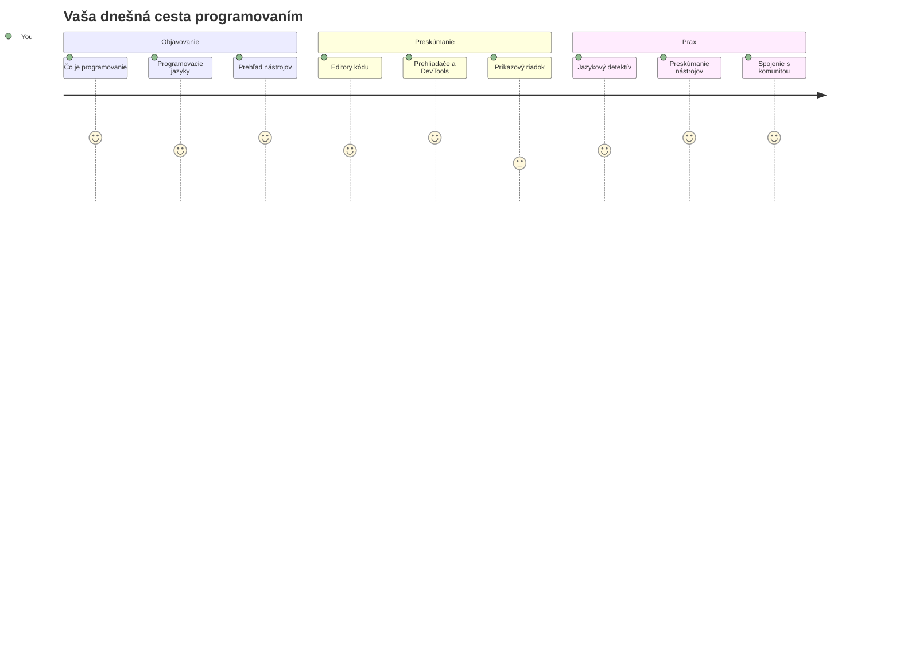
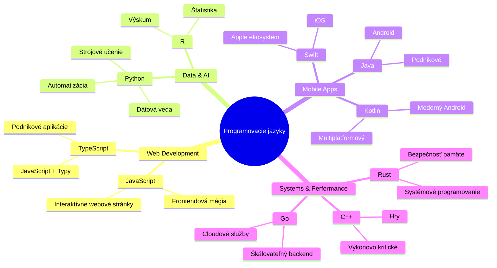
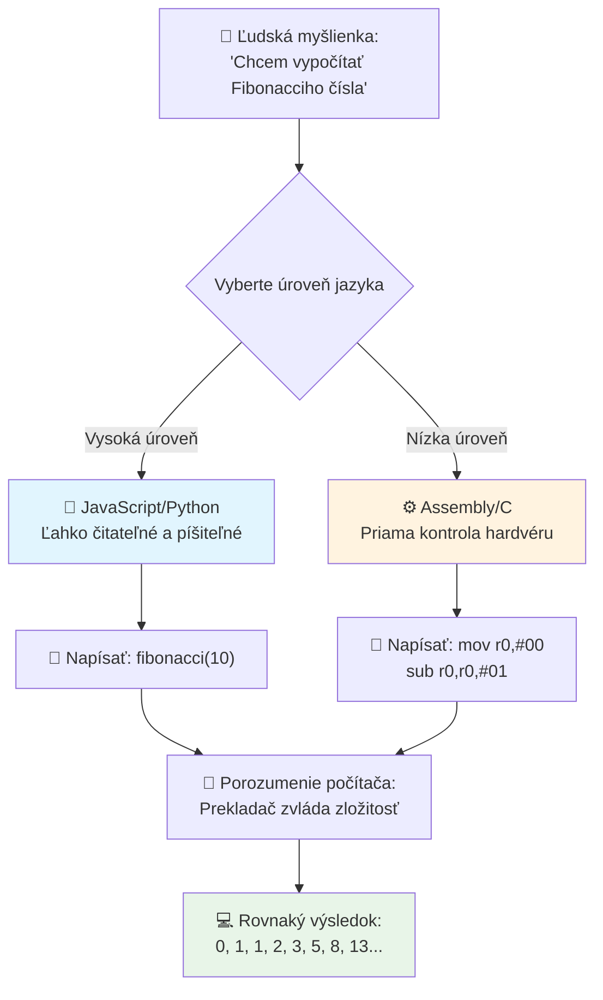
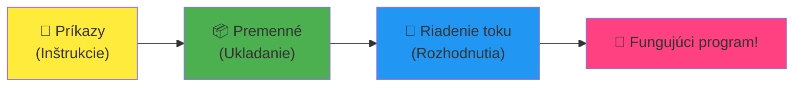
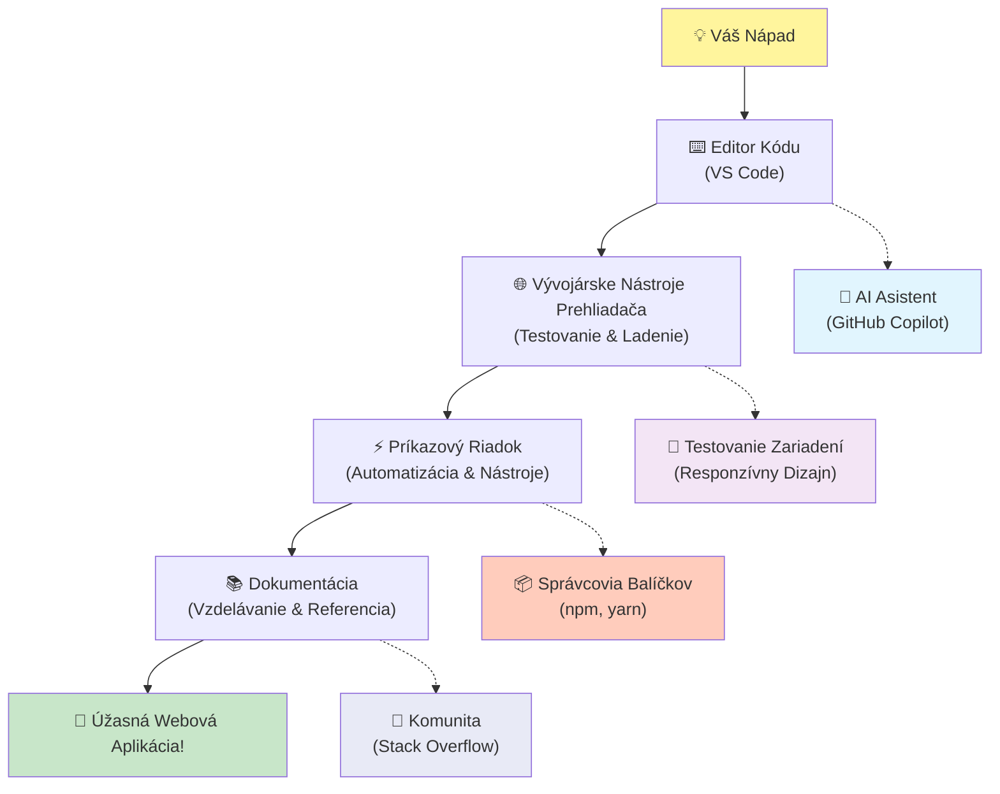
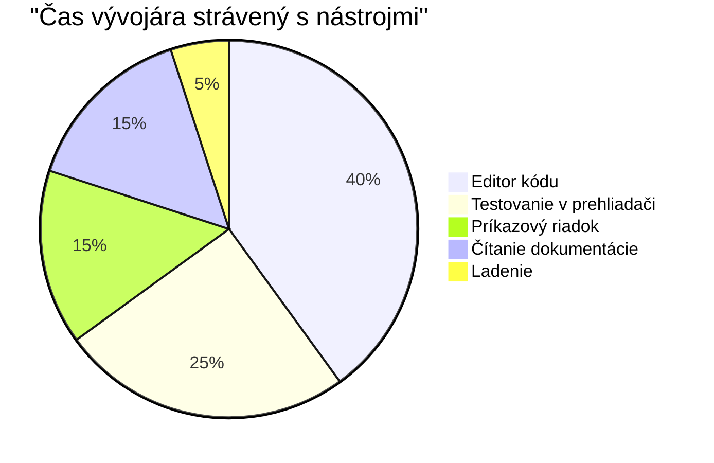
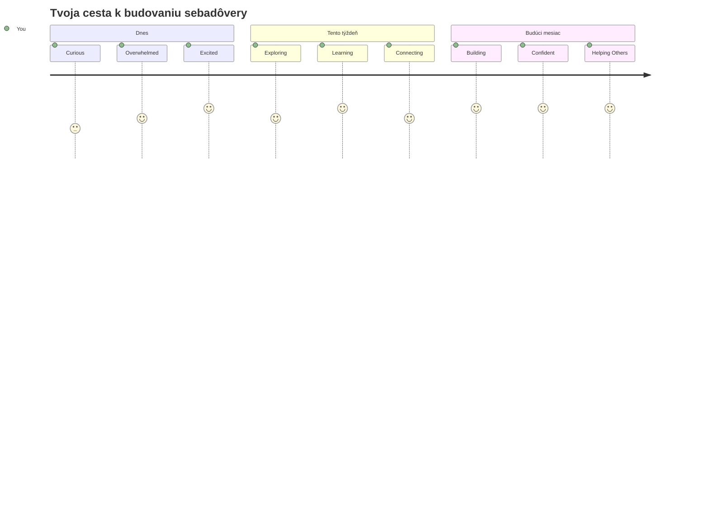

# Úvod do programovacích jazykov a moderných vývojárskych nástrojov
 
Ahoj, budúci vývojár! 👋 Môžem ti povedať niečo, čo mi každý deň spôsobuje zimomriavky? Chystáš sa objaviť, že programovanie nie je len o počítačoch – je to o skutočných super schopnostiach prebudiť tvoje najdivokejšie nápady k životu!

Vieš ten moment, keď používaš svoju obľúbenú aplikáciu a všetko na seba dokonale nadväzuje? Keď klikneš na tlačidlo a stane sa niečo úplne magické, čo ťa donúti povedať „wau, ako TO urobili?“ Nuž, niekto presne ako ty – pravdepodobne sediaci vo svojej obľúbenej kaviarni o druhej ráno pri treťom espresse – napísal kód, ktorý túto mágiu vytvoril. A tu je niečo, čo ťa úplne ohromí: na konci tejto lekcie nielen pochopíš, ako to urobili, ale budeš sa veľmi chcieť do toho pustiť sám!

Pozri, úplne chápem, ak sa ti programovanie teraz zdá zastrašujúce. Keď som začínal, úprimne som si myslel, že musíš byť nejaký matematik génius alebo kódovať od svojich piatich rokov. Ale toto mi úplne zmenilo pohľad: programovanie je presne ako učenie sa viesť rozhovory v novom jazyku. Začínaš s „ahoj“ a „ďakujem“, potom si objednáš kávu a skôr než sa spamätáš, vedieš hlboké filozofické diskusie! Lenže v tomto prípade vedieš rozhovory s počítačmi, a úprimne? Sú to najtrpezlivejší partneri na rozhovor, akých kedy stretneš – nikdy ti nevyčítajú chyby a vždy majú radosť skúsiť to znova!

Dnes si preskúmame neuveriteľné nástroje, ktoré robia moderný vývoj webu nielen možným, ale doslova návykovým. Hovorím o rovnakých editoroch, prehliadačoch a pracovných postupoch, ktoré používajú vývojári v Netflixe, Spotify a tvojom obľúbenom indie štúdiu každý deň. A tu je časť, čo ťa rozveselí: väčšina z týchto profesionálnych, priemyselných štandardných nástrojov je úplne zadarmo!


> Sketchnote od [Tomomi Imura](https://twitter.com/girlie_mac)


```mermaid
journey
    title Vaša dnešná cesta programovaním
    section Objavovanie
      Čo je programovanie: 5: You
      Programovacie jazyky: 4: You
      Prehľad nástrojov: 5: You
    section Preskúmanie
      Editory kódu: 4: You
      Prehliadače a DevTools: 5: You
      Príkazový riadok: 3: You
    section Prax
      Jazykový detektív: 4: You
      Preskúmanie nástrojov: 5: You
      Spojenie s komunitou: 5: You
```
## Poďme sa pozrieť, čo už vieš!

Predtým než sa pustíme do zábavy, som zvedavý – čo už vieš o tomto svete programovania? A počúvaj, ak sa pozeráš na tieto otázky a myslíš si „o tom nič netuším,“ to nie je len v poriadku, to je perfektné! To znamená, že si presne tam, kde máš byť. Predstav si tento kvíz ako rozcvičku pred tréningom – len zahrievame tie mozgové svaly!

[Zúčastni sa prednáškového kvízu](https://ff-quizzes.netlify.app/web/)


## Dobrodružstvo, na ktoré sa spolu vydáme

Dobre, som naozaj nadšený z toho, čo dnes preskúmame! Úprimne, prial by som si vidieť tvoj výraz, keď ti niektoré z týchto konceptov zaklikajú. Tu je úžasná cesta, na ktorú sa spolu vydávame:

- **Čo je programovanie vlastne (a prečo je to najúžasnejšia vec vôbec!)** – Objavíme, ako je kód doslova neviditeľná mágia poháňajúca všetko okolo teba, od budíka, ktorý nejako vie, že je pondelok ráno, až po algoritmus, ktorý dokonale vyberá tvoje odporúčania na Netflixe
- **Programovacie jazyky a ich úžasné osobnosti** – Predstav si, že vstúpiš na párty, kde má každý úplne iné super schopnosti a spôsoby riešenia problémov. Taký je svet programovacích jazykov a budeš ich mať rád!
- **Základné stavebné kocky, ktoré vytvárajú digitálnu mágiu** – Predstav si ich ako ultimátnu kreatívnu LEGO sadu. Keď pochopíš, ako sa tieto kúsky skladajú dohromady, uvedomíš si, že môžeš postaviť hocičo, na čo si len pomyslíš
- **Profesionálne nástroje, ktoré ťa prinútia cítiť sa, akoby si dostal čarodejnícku paličku** – Nie som dramatický – tieto nástroje ťa skutočne budú nútiť cítiť sa ako keby si mal super schopnosti, a čo je najlepšie? Sú to tie isté, ktoré používajú profesionáli!

> 💡 **Tu je vec:** Nesnaž sa dnes všetko naučiť naspamäť! Teraz chcem len, aby si pocítil iskru nadšenia z toho, čo je možné. Detaily si zapamätáš prirodzene, ako budeme spoločne cvičiť – takto prebieha skutočné učenie!

> Túto lekciu môžeš absolvovať aj na [Microsoft Learn](https://learn.microsoft.com/en-us/learn/modules/web-development-101/introduction-programming/?WT.mc_id=academic-77807-sagibbon)!

## Čo vlastne programovanie *je*?

Dobre, poďme vyriešiť otázku za milión dolárov: čo je programovanie naozaj?

Poviem ti príbeh, ktorý úplne zmenil môj pohľad na to. Minulý týždeň som sa snažil vysvetliť mame, ako používať náš nový diaľkový ovládač k smart TV. Zachytil som sa, že hovorím veci ako „Stlač červené tlačidlo, ale nie veľké červené, malé červené naľavo... nie, tvoj druhý ľavý... dobre, teraz drž dve sekundy, nie jednu, nie tri...“ Znie to povedome? 😅

To je programovanie! Je to umenie dávať neuveriteľne podrobné, krok za krokom inštrukcie niečomu, čo je veľmi výkonné, ale potrebuje, aby bolo všetko dokonale vysvetlené. Lenže namiesto vysvetľovania mame (ktorá sa môže opýtať „ktoré červené tlačidlo?!“) vysvetľuješ počítaču (ktorý presne robí to, čo povieš, aj keď to nie je presne to, čo si myslel).

Tu ma úplne ohromilo, keď som sa to prvýkrát naučil: počítače sú v podstate veľmi jednoduché. Rozumejú len dvom veciam – 1 a 0, čo je v podstate „áno“ a „nie“ alebo „zapnuté“ a „vypnuté.“ To je všetko! Ale tu prichádza mágia – nemáme hovoriť v 1 a 0 ako vo filme Matrix. Preto prichádzajú na scénu **programovacie jazyky**. Sú ako najlepší prekladateľ na svete, ktorý prekladá tvoje úplne normálne ľudské myšlienky do jazyka počítača.

A toto mi stále každé ráno spôsobuje zimomriavky: doslova *všetko* digitálne vo tvojom živote začalo u niekoho ako ty, pravdepodobne sediaceho v pyžame s pohárom kávy, píšuceho kód na svojom laptope. Ten Instagram filter, čo ťa robí dokonalým? Niektorý niekto ho naprogramoval. Odporúčanie, ktoré ťa priviedlo k novej obľúbenej pesničke? Developer vytvoril ten algoritmus. Aplikácia, ktorá ti pomáha medziľudsky rozdeliť účty za večeru? Áno, niekto si povedal „to je otravné, ja to spravím lepšie“ a potom... to spravil!

Keď sa naučíš programovať, neosvojíš si len novú zručnosť – staneš sa súčasťou úžasnej komunity riešiteľov problémov, ktorí trávia dni tým, že rozmýšľajú: „Čo keby som mohol vytvoriť niečo, čo niekomu trochu zlepší deň?“ Úprimne, je niečo lepšie?

✅ **Zábavný fakt:** Tu je niečo super na vyhľadanie, keď budeš mať chvíľku voľna – kto podľa teba bol prvý programátor na svete? Dám ti nápovedu: možno to nie je ten, koho očakávaš! Príbeh tejto osoby je úplne fascinujúci a ukazuje, že programovanie vždy znamenalo kreatívne riešenie problémov a myslenie mimo štandardných rámcov.

### 🧠 **Kontrola: Ako sa cítiš?**

**Zastav sa na chvíľu a zamysli sa:**
- Dá ti teraz zmysel idea „dávať inštrukcie počítačom“?
- Vieš si predstaviť nejakú každodennú úlohu, ktorú by si chcel programovaním automatizovať?
- Aké otázky ti behajú hlavou ohľadom celého programovania?

> **Pamätaj:** Je úplne normálne, ak sa ti niektoré koncepty zdajú teraz nejasné. Učenie sa programovania je ako učenie nového jazyka – tvoj mozog si musí vytvoriť nové neurónové spoje. Robíš to super!

## Programovacie jazyky sú ako rôzne chute mágie

Dobre, toto bude znieť čudne, ale vydrž so mnou – programovacie jazyky sú veľmi podobné rôznym druhom hudby. Premysli si to: máš jazz, ktorý je hladký a improvizačný, rock, čo je silný a priamočiary, klasickú hudbu, ktorá je elegantná a štruktúrovaná, a hip-hop, čo je kreatívny a expresívny. Každý štýl má svoju atmosféru, svoju komunitu zapálených fanúšikov a každý je perfektný na rôzne nálady a príležitosti.

Programovacie jazyky fungujú úplne rovnako! Nepoužil by si ten istý jazyk na vytvorenie zábavnej mobilnej hry, aký by si použil na spracovanie obrovského množstva klimatických dát, rovnako ako by si nehral death metal na jogovej hodine (no, aspoň na väčšine jogových hodín 😄).

Ale tu je niečo, čo ma zakaždým úplne dostane: tieto jazyky sú ako mať najtrpezlivejšieho, najbystrejšieho tlmočníka sveta sedieť hneď vedľa teba. Môžeš vyjadriť svoje myšlienky spôsobom, ktorý je pre tvoj ľudský mozog prirodzený, a oni zvládnu všetko neuveriteľne zložité preložiť do 1 a 0, ktorým počítače naozaj rozumejú. Je to ako mať priateľa, ktorý je dokonale plynulý v „ľudskej tvorivosti“ aj „počítačovej logike“ – a nikdy nie je unavený, nikdy nepotrebuje pauzu na kávu a nikdy ti nevyčíta, že sa pýtaš na to isté dvakrát!

### Populárne programovacie jazyky a ich použitie


```mermaid
mindmap
  root((Programovacie jazyky))
    Web Development
      JavaScript
        Frontendová mágia
        Interaktívne webové stránky
      TypeScript
        JavaScript + Typy
        Podnikové aplikácie
    Data & AI
      Python
        Dátová veda
        Strojové učenie
        Automatizácia
      R
        Štatistika
        Výskum
    Mobile Apps
      Java
        Android
        Podnikové
      Swift
        iOS
        Apple ekosystém
      Kotlin
        Moderný Android
        Multiplatformový
    Systems & Performance
      C++
        Hry
        Výkonovo kritické
      Rust
        Bezpečnosť pamäte
        Systémové programovanie
      Go
        Cloudové služby
        Škálovateľný backend
```
| Jazyk | Najlepšie pre | Prečo je populárny |
|----------|----------|------------------|
| **JavaScript** | Vývoj webu, používateľské rozhrania | Beží v prehliadačoch a poháňa interaktívne weby |
| **Python** | Dáta, automatizácia, AI | Ľahko čitateľný a naučiteľný, silné knižnice |
| **Java** | Podnikové aplikácie, Android aplikácie | Nezávislý na platforme, robustný pre veľké systémy |
| **C#** | Windows aplikácie, vývoj hier | Silná podpora Microsoft ekosystému |
| **Go** | Cloudové služby, backend systémy | Rýchly, jednoduchý, navrhnutý pre moderné výpočty |

### Jazyky na vysokej úrovni vs. nízkej úrovni

Dobre, toto bola úprimne koncepcia, ktorá mi keď som začínal, úplne rozsypala mozog, tak sa podelím o analógiu, ktorá mi to konečne vysvetlila – a dúfam, že pomôže aj tebe!

Predstav si, že navštíviš krajinu, kde nehovoríš jazykom a zúfalo potrebuješ nájsť najbližšie WC (všetci sme tam už boli, že? 😅):

- **Programovanie nízkej úrovne** je ako naučiť sa miestny dialekt tak dobre, aby si mohol rozprávať s babičkou predávajúcou ovocie na rohu, používať kultúrne odkazy, miestne slangy a vnútorné vtipy, ktoré rozumie len niekto, kto tam vyrastal. Super pôsobivé a veľmi efektívne... keď vieš plynule hovoriť! Ale dosť náročné, keď sa iba snažíš nájsť WC.

- **Programovanie vysokej úrovne** je ako mať úžasného miestneho kamaráta, ktorý ťa jednoducho chápe. Povieš „Naozaj potrebujem nájsť toaletu“ v obyčajnej angličtine a on spraví celý kultúrny preklad a dá ti presné smerovanie, ktoré tvoj ne-miestoverständlich mozog pochopí.

V programovaní platí:
- **Jazyky nízkej úrovne** (ako Assembly alebo C) ti umožňujú viesť neuveriteľne podrobné rozhovory so skutočným hardvérom počítača, ale musíš myslieť ako stroj, čo je... povedzme veľký mentálny presun!
- **Jazyky vysokej úrovne** (ako JavaScript, Python alebo C#) ti umožňujú myslieť ako človek, zatiaľ čo oni zvládajú všetku strojnú reč v pozadí. Plus majú neuveriteľne priateľské komunity plné ľudí, ktorí si pamätajú, aké to bolo byť nováčikom a skutočne chcú pomôcť!

Tipneš si, s ktorými jazykmi ti navrhnem začať? 😉 Jazyky vysokej úrovne sú ako tréningové kolieska, ktoré nikdy vlastne nechceš odložiť, pretože celý zážitok robia oveľa príjemnejším!


```mermaid
flowchart TB
    A["👤 Ľudská myšlienka:<br/>'Chcem vypočítať Fibonacciho čísla'"] --> B{Vyberte úroveň jazyka}
    
    B -->|Vysoká úroveň| C["🌟 JavaScript/Python<br/>Ľahko čitateľné a píšiteľné"]
    B -->|Nízka úroveň| D["⚙️ Assembly/C<br/>Priama kontrola hardvéru"]
    
    C --> E["📝 Napísať: fibonacci(10)"]
    D --> F["📝 Napísať: mov r0,#00<br/>sub r0,r0,#01"]
    
    E --> G["🤖 Porozumenie počítača:<br/>Prekladač zvláda zložitosť"]
    F --> G
    
    G --> H["💻 Rovnaký výsledok:<br/>0, 1, 1, 2, 3, 5, 8, 13..."]
    
    style C fill:#e1f5fe
    style D fill:#fff3e0
    style H fill:#e8f5e8
```
### Ukážem ti prečo sú jazyky vysokej úrovne také priateľské

Dobre, chystám sa ti ukázať niečo, čo dokonale ilustruje, prečo som sa zamiloval do jazykov vysokej úrovne, ale najskôr – sľúb mi niečo. Keď uvidíš prvý kód, nepanikár! Má vyzerať zastrašujúco. Presne o tom hovorím!

Pozrieme sa na úplne rovnaký úkol napísaný v dvoch úplne odlišných štýloch. Oba vytvárajú tzv. Fibonacciho postupnosť – je to krásny matematický vzorec, kde každé číslo je súčtom dvoch predchádzajúcich: 0, 1, 1, 2, 3, 5, 8, 13... (Zábavný fakt: tento vzorec nájdeš doslova všade v prírode – špirály slnečnicových semien, vzory šišiek, dokonca formovanie galaxií!)

Pripravený vidieť rozdiel? Poďme na to!

**Jazyk vysokej úrovne (JavaScript) – priateľský pre ľudí:**

```javascript
// Krok 1: Základné nastavenie Fibonacciho</code>
const fibonacciCount = 10;
let current = 0;
let next = 1;

console.log('Fibonacci sequence:');
```

**Čo tento kód robí:**
- **Deklaruje** konštantu na určenie, koľko Fibonacciho čísel chceme vytvoriť
- **Inicializuje** dve premenné, ktoré sledujú aktuálne a nasledujúce číslo v postupnosti
- **Nastaví** počiatočné hodnoty (0 a 1), ktoré definujú Fibonacciho vzorec
- **Zobrazí** hlavičkovú správu pre identifikáciu výstupu

```javascript
// Krok 2: Vygenerujte postupnosť pomocou slučky
for (let i = 0; i < fibonacciCount; i++) {
  console.log(`Position ${i + 1}: ${current}`);
  
  // Vypočítajte ďalšie číslo v postupnosti
  const sum = current + next;
  current = next;
  next = sum;
}
```

**Čo sa tu deje po krokoch:**
- **Prejde** každý prvok postupnosti pomocou cyklu `for`
- **Zobrazí** každé číslo s jeho pozíciou pomocou formátovania textového reťazca
- **Vypočíta** ďalšie Fibonacciho číslo sčítaním aktuálneho a nasledujúceho
- **Aktualizuje** premenné sledovania, aby prešiel na ďalšiu iteráciu

```javascript
// Krok 3: Moderný funkčný prístup
const generateFibonacci = (count) => {
  const sequence = [0, 1];
  
  for (let i = 2; i < count; i++) {
    sequence[i] = sequence[i - 1] + sequence[i - 2];
  }
  
  return sequence;
};

// Príklad použitia
const fibSequence = generateFibonacci(10);
console.log(fibSequence);
```

**V tomto kóde sme:**
- **Vytvorili** znovupoužiteľnú funkciu pomocou modernej syntaxe šípky
- **Vytvorili** pole na uloženie celej postupnosti namiesto zobrazenia po jednom
- **Použili** indexovanie poľa na výpočet každého nového čísla z predchádzajúcich hodnôt
- **Vracia** celú postupnosť pre flexibilné použitie v iných častiach programu

**Jazyk nízkej úrovne (ARM Assembly) – priateľský pre počítač:**

```assembly
 area ascen,code,readonly
 entry
 code32
 adr r0,thumb+1
 bx r0
 code16
thumb
 mov r0,#00
 sub r0,r0,#01
 mov r1,#01
 mov r4,#10
 ldr r2,=0x40000000
back add r0,r1
 str r0,[r2]
 add r2,#04
 mov r3,r0
 mov r0,r1
 mov r1,r3
 sub r4,#01
 cmp r4,#00
 bne back
 end
```

Všimni si, ako verzia JavaScriptu číta takmer ako anglické inštrukcie, zatiaľ čo Assembly verzia používa kryptické príkazy, ktoré priamo ovládajú procesor počítača. Obe vykonávajú tú istú úlohu, ale jazyk vysokej úrovne je oveľa ľahší na pochopenie, písanie a údržbu pre ľudí.

**Kľúčové rozdiely, ktoré si všimneš:**
- **Čitateľnosť**: JavaScript používa opisné názvy ako `fibonacciCount`, zatiaľ čo Assembly používa kryptické označenia ako `r0`, `r1`
- **Komentáre**: Vyššie programovacie jazyky podporujú vysvetľujúce komentáre, ktoré robia kód samodokumentujúcim
- **Štruktúra**: Logický tok JavaScriptu zodpovedá tomu, ako ľudia rozmýšľajú o problémoch krok za krokom
- **Údržba**: Aktualizácia verzie JavaScriptu pre rôzne požiadavky je priamočiara a jasná

✅ **O Fibonacciho postupnosti**: Tento absolútne nádherný číselný vzor (kde každé číslo je súčtom tých dvoch pred ním: 0, 1, 1, 2, 3, 5, 8...) sa objavuje doslova *všade* v prírode! Nájdete ho v špirále slnečnice, v usporiadaní šišiek, v krivkách ulít naplavo a dokonca aj v raste vetiev stromov. Je dosť ohromujúce, ako matematika a kód môžu pomôcť pochopiť a znovu vytvoriť vzory, ktoré príroda používa na vytváranie krásy!


## Stavebné kamene, ktoré vytvárajú magické výsledky

Dobre, teraz keď ste videli, ako vyzerajú programovacie jazyky v praxi, rozoberme si základné časti, ktoré tvoria doslova každý napísaný program. Predstavte si ich ako základné ingrediencie vo vašom obľúbenom recepte – keď pochopíte, čo každá robí, budete schopní čítať a písať kód v takmer akomkoľvek jazyku!

Je to niečo ako učenie sa gramatiky programovania. Pamätáte si, keď ste sa v škole učili o podstatných menách, slovesách a o tom, ako skladať vety? Programovanie má vlastnú verziu gramatiky a úprimne, je oveľa logickejšia a zhovievavejšia ako anglická gramatika! 😄

### Príkazy: Pokyny krok za krokom

Začnime s **príkazmi** – tie sú ako jednotlivé vety v rozhovore s vaším počítačom. Každý príkaz hovorí počítaču, aby vykonal jednu konkrétnu vec, niečo ako dávanie pokynov: "Zatoč tu doľava," "Zastav na červenej," "Zaparkuj na tom mieste."

Čo na príkazoch milujem, je to, aké sú obyčajne čitateľné. Pozrite sa na toto:

```javascript
// Základné príkazy, ktoré vykonávajú jednotlivé akcie
const userName = "Alex";                    
console.log("Hello, world!");              
const sum = 5 + 3;                         
```

**Tento kód robí toto:**
- **Deklaruje** konštantnú premennú pre uloženie mena používateľa
- **Zobrazuje** privítaciu správu v konzole
- **Vypočíta** a uloží výsledok matematickej operácie

```javascript
// Príkazy, ktoré komunikujú s webovými stránkami
document.title = "My Awesome Website";      
document.body.style.backgroundColor = "lightblue";
```

**Krok za krokom, toto sa deje:**
- **Upravuje** názov stránky, ktorý sa zobrazí na záložke prehliadača
- **Mení** farbu pozadia celého tela stránky

### Premenné: Pamäťový systém vášho programu

Dobre, **premenné** sú úprimne jedno z mojich úplne najobľúbenejších tém učiť, pretože sú tak veľmi podobné veciam, ktoré používate každý deň!

Predstavte si na chvíľu zoznam kontaktov v telefóne. Nepamätáte si telefónne čísla na všetkých – namiesto toho si uložíte "Mamička", "Najlepší kamarát" alebo "Pizzéria, ktorá rozváža do 2 rána" a necháte telefón, aby si pamätal skutočné čísla. Premenné fungujú presne tak isto! Sú ako označené nádoby, kde váš program môže uložiť informácie a neskôr ich vyhľadať podľa názvu, ktorý dáva zmysel.

To, čo je na tom naozaj úžasné: premenné sa môžu počas behu programu meniť (odtiaľ ten názov "premenná" – vidíte, čo spravili?). Rovnako ako možno aktualizujete kontakt v pizzérii, keď objavíte lepšiu, premenné môžu byť aktualizované, keď sa program dozvie nové informácie alebo sa situácia zmení!

Ukážem vám, aké to môže byť nádherne jednoduché:

```javascript
// Krok 1: Vytváranie základných premenných
const siteName = "Weather Dashboard";        
let currentWeather = "sunny";               
let temperature = 75;                       
let isRaining = false;                      
```

**Pochopenie týchto konceptov:**
- **Ukladať** nemenné hodnoty v `const` premenných (napríklad názov stránky)
- **Používať** `let` pre hodnoty, ktoré sa môžu počas programu meniť
- **Priradiť** rôzne dátové typy: reťazce (text), čísla a booleovské hodnoty (pravda/nepravda)
- **Vybrať** opisné názvy, ktoré vysvetľujú, čo každá premenná obsahuje

```javascript
// Krok 2: Práca s objektmi na zoskupenie súvisiacich údajov
const weatherData = {                       
  location: "San Francisco",
  humidity: 65,
  windSpeed: 12
};
```

**Vyššie sme:**
- **Vytvorili** objekt na zoskupenie súvisiacich informácií o počasí
- **Usporiadali** viacero dát pod jedným názvom premennej
- **Použili** páry kľúč-hodnota na jasné označenie každej informácie

```javascript
// Krok 3: Používanie a aktualizácia premenných
console.log(`${siteName}: Today is ${currentWeather} and ${temperature}°F`);
console.log(`Wind speed: ${weatherData.windSpeed} mph`);

// Aktualizácia meniteľných premenných
currentWeather = "cloudy";                  
temperature = 68;                          
```

**Pochopenie každej časti:**
- **Zobraziť** informácie pomocou šablónových literálov so syntaxou `${}`
- **Pristupovať** k vlastnostiam objektu cez bodkovú notáciu (`weatherData.windSpeed`)
- **Aktualizovať** premenné deklarované cez `let` na základe meniacich sa podmienok
- **Kombinovať** viacero premenných na tvorbu zmysluplných správ

```javascript
// Krok 4: Moderné rozkladanie pre čistejší kód
const { location, humidity } = weatherData; 
console.log(`${location} humidity: ${humidity}%`);
```

**Čo by ste mali vedieť:**
- **Extrahovať** konkrétne vlastnosti z objektov pomocou destrukturalizácie
- **Vytvoriť** nové premenné automaticky s rovnakými názvami ako kľúče objektu
- **Zjednodušiť** kód vyhnutím sa opakovanej bodkovej notácii

### Riadenie toku: Naučte váš program myslieť

Dobre, toto je miesto, kde programovanie naozaj začína ohromovať! **Riadenie toku** je vlastne učenie vášho programu, ako robiť múdre rozhodnutia, presne tak, ako to robíte vy každý deň bez rozmýšľania.

Predstavte si toto: dnes ráno ste pravdepodobne prešli niečím ako "Ak prší, vezmem si dáždnik. Ak je zima, oblečiem si bundu. Ak meškám, vynechám raňajky a vezmem si kávu na cestu." Váš mozog prirodzene nasleduje túto if-then logiku desiatky krát denne!

Toto robí programy inteligentnými a živými, namiesto toho, aby len slepo nasledovali nejaký nudný, predvídateľný scenár. Dokážu sa pozrieť na situáciu, vyhodnotiť, čo sa deje, a primerane zareagovať. Je to ako dať vášmu programu mozog, ktorý sa dokáže prispôsobiť a rozhodovať!

Chcete vidieť, ako krásne to funguje? Pozrite sa:

```javascript
// Krok 1: Základná podmienená logika
const userAge = 17;

if (userAge >= 18) {
  console.log("You can vote!");
} else {
  const yearsToWait = 18 - userAge;
  console.log(`You'll be able to vote in ${yearsToWait} year(s).`);
}
```

**Tento kód robí toto:**
- **Skontroluje**, či vek používateľa spĺňa požiadavku na hlasovanie
- **Vykoná** rôzne bloky kódu podľa výsledku podmienky
- **Vypočíta** a zobrazí čas do dosiahnutia veku spôsobilosti hlasovať, ak je pod 18
- **Poskytne** špecifickú, užitočnú spätnú väzbu pre každú situáciu

```javascript
// Krok 2: Viacero podmienok s logickými operátormi
const userAge = 17;
const hasPermission = true;

if (userAge >= 18 && hasPermission) {
  console.log("Access granted: You can enter the venue.");
} else if (userAge >= 16) {
  console.log("You need parent permission to enter.");
} else {
  console.log("Sorry, you must be at least 16 years old.");
}
```

**Rozbor toho, čo sa deje:**
- **Kombinuje** viacero podmienok pomocou operátora `&&` (a)
- **Vytvára** hierarchiu podmienok pomocou `else if` pre viacero scénarov
- **Zaobchádza** so všetkými možnosťami pomocou záverečného `else`
- **Poskytuje** jasnú, praktickú spätnú väzbu pre každú situáciu

```javascript
// Krok 3: Stručný podmienkový výraz s ternárnym operátorom
const votingStatus = userAge >= 18 ? "Can vote" : "Cannot vote yet";
console.log(`Status: ${votingStatus}`);
```

**Dôležité si zapamätať:**
- **Používať** ternárny operátor (`? :`) pre jednoduché podmienky s dvoma možnosťami
- **Napísať** podmienku, potom `?`, následne výsledok pre pravdu, potom `:`, výsledok pre nepravdu
- **Použiť** tento vzor, keď potrebujete priradiť hodnoty na základe podmienok

```javascript
// Krok 4: Riešenie viacerých konkrétnych prípadov
const dayOfWeek = "Tuesday";

switch (dayOfWeek) {
  case "Monday":
  case "Tuesday":
  case "Wednesday":
  case "Thursday":
  case "Friday":
    console.log("It's a weekday - time to work!");
    break;
  case "Saturday":
  case "Sunday":
    console.log("It's the weekend - time to relax!");
    break;
  default:
    console.log("Invalid day of the week");
}
```

**Tento kód robí nasledovné:**
- **Porovná** hodnotu premennej s viacerými špecifickými prípadmi
- **Zoskupí** podobné prípady dohromady (pracovné dni vs. víkendy)
- **Vykoná** príslušný blok kódu, keď nájde zhodu
- **Obsahuje** `default` prípad na spracovanie neočakávaných hodnôt
- **Používa** `break`, aby zabránil pokračovaniu kódu do ďalšieho prípadu

> 💡 **Reálna analógia**: Predstavte si riadenie toku ako trpezlivý GPS, ktorý vám dáva pokyny. Môže povedať: "Ak je na Main Street dopravná zápcha, choď po diaľnici. Ak je diaľnica zablokovaná výstavbou, skúste panoramatickú cestu." Programy používajú rovnaký typ podmienkovej logiky na inteligentnú reakciu na rôzne situácie a vždy poskytujú používateľom ten najlepší zážitok.

### 🎯 **Kontrola konceptov: Majstrovstvo stavebných kameňov**

**Pozrime sa, ako to zvládate so základmi:**
- Dokážete vlastnými slovami vysvetliť rozdiel medzi premennou a príkazom?
- Premyslite si reálnu situáciu, kde by ste použili rozhodnutie typu if-then (napríklad naše hlasovacie príklad)
- Čo vás v logike programovania najviac prekvapilo?

**Rýchle povzbudenie:**

```mermaid
flowchart LR
    A["📝 Príkazy<br/>(Inštrukcie)"] --> B["📦 Premenné<br/>(Ukladanie)"] --> C["🔀 Riadenie toku<br/>(Rozhodnutia)"] --> D["🎉 Fungujúci program!"]
    
    style A fill:#ffeb3b
    style B fill:#4caf50
    style C fill:#2196f3
    style D fill:#ff4081
```
✅ **Čo príde ďalej**: Budeme sa skutočne zabávať pri hlbšom ponore do týchto konceptov počas pokračovania tejto neuveriteľnej cesty! Pre teraz sa len zamerajte na to, aby ste cítili nadšenie z množstva úžasných možností pred vami. Konkrétne zručnosti a techniky prídu prirodzene, keď budeme spolu cvičiť – sľubujem, že to bude oveľa zábavnejšie, ako ste čakali!

## Nástroje remesla

Dobre, toto je skutočne miesto, kde sa neviem dočkať, som z toho taký nadšený! 🚀 Priblížime si neuveriteľné nástroje, ktoré vám dajú pocit, že máte práve kľúče od digitálnej vesmírnej lode.

Viete, ako kuchár má tie perfektne vyvážené nože, ktoré sú ako predĺžením jeho ruky? Alebo ako hudobník má tú svoju gitaru, ktorá akoby spievala od momentu, keď sa jej dotkne? Nuž, vývojári majú svoju vlastnú verziu týchto magických nástrojov a tu je to, čo vás úplne prekvapí – väčšina z nich je úplne zadarmo!

Doslova sa vrtím na stoličke, keď si predstavujem, že sa s vami o to podelím, lebo tieto nástroje úplne zmenili spôsob, akým tvoríme software. Hovoríme o AI-asistovaných programovacích pomocníkoch, ktorí vám môžu pomôcť písať kód (nie som si ju žartoval!), cloudových prostrediach, kde môžete budovať celé aplikácie doslova odkiaľkoľvek s Wi-Fi, a debugovacích nástrojoch tak sofistikovaných, že sú ako mať röntgenové videnie pre vaše programy.

A toto je časť, ktorá mi stále dáva zimomriavky: nie sú to "nástroje pre začiatočníkov", ktorým čoskoro prerastiete cez hlavu. Sú to úplne rovnaké profesionálne nástroje, aké používajú vývojári v Google, Netflixe a v tom indie štúdiu, ktoré milujete, práve v tejto chvíli. Budete sa cítiť ako profík, keď ich budete používať!


```mermaid
graph TD
    A["💡 Váš Nápad"] --> B["⌨️ Editor Kódu<br/>(VS Code)"] 
    B --> C["🌐 Vývojárske Nástroje Prehliadača<br/>(Testovanie & Ladenie)"]
    C --> D["⚡ Príkazový Riadok<br/>(Automatizácia & Nástroje)"]
    D --> E["📚 Dokumentácia<br/>(Vzdelávanie & Referencia)"]
    E --> F["🚀 Úžasná Webová Aplikácia!"]
    
    B -.-> G["🤖 AI Asistent<br/>(GitHub Copilot)"]
    C -.-> H["📱 Testovanie Zariadení<br/>(Responzívny Dizajn)"]
    D -.-> I["📦 Správcovia Balíčkov<br/>(npm, yarn)"]
    E -.-> J["👥 Komunita<br/>(Stack Overflow)"]
    
    style A fill:#fff59d
    style F fill:#c8e6c9
    style G fill:#e1f5fe
    style H fill:#f3e5f5
    style I fill:#ffccbc
    style J fill:#e8eaf6
```
### Editory kódu a IDE: Vaši noví digitálni najlepší priatelia

Povedzme si o editoroch kódu – tieto sa stanú vašimi úplne novými obľúbenými miestami na tvorbu! Predstavte si ich ako vaše osobné útočisko kódovania, kde strávite väčšinu svojho času vytváraním a zdokonaľovaním digitálnych diel.

Ale tu je to, čo je na moderných editoroch úplne magické: nie sú to len pekné textové editory. Sú ako najbystrejší, najpodpornejší mentor programovania sediaci pri vás 24 hodín denne. Opravujú vaše preklepy skôr, ako si ich vôbec všimnete, navrhujú zlepšenia, aby ste vyzerali ako génius, pomáhajú vám pochopiť, čo každý kúsok kódu robí, a niektoré vám dokonca dokážu predpovedať, čo chcete napísať, a ponúknu vám dokončenie!

Pamätám si, keď som objavil automatické dokončovanie – doslova som mal pocit, že žijem v budúcnosti. Začnete písať niečo a editor povie: "Hej, chcel si použiť túto funkciu, ktorá robí presne to, čo potrebuješ?" Je to ako mať čitateľa myšlienok ako kamaráta na kódovanie!

**Čo robí tieto editory tak úžasnými?**

Moderné editory kódu ponúkajú ohromujúci súbor funkcií na zvýšenie produktivity:

| Funkcia | Čo robí | Prečo pomáha |
|---------|---------|--------------|
| **Zvýraznenie syntaxe** | Farebne oddeľuje časti kódu | Uľahčuje čítanie kódu a hľadanie chýb |
| **Automatické dokončovanie** | Navrhuje kód počas písania | Urýchľuje kódovanie a znižuje preklepy |
| **Nástroje na ladenie** | Pomáhajú nájsť a opraviť chyby | Šetria hodiny hľadania chýb |
| **Rozšírenia** | Pridávajú špecializované funkcie | Prispôsobujú editor pre akúkoľvek technológiu |
| **AI asistenti** | Navrhujú kód a vysvetlenia | Urýchľujú učenie a produktivitu |

> 🎥 **Video zdroj**: Chcete vidieť tieto nástroje v akcii? Pozrite si toto [Video Nástrojov remesla](https://youtube.com/watch?v=69WJeXGBdxg) pre komplexný prehľad.

#### Odporúčané editory pre vývoj webu

**[Visual Studio Code](https://code.visualstudio.com/?WT.mc_id=academic-77807-sagibbon)** (zadarmo)
- Najpopulárnejší medzi webovými vývojármi
- Výborný ekosystém rozšírení
- Integrovaný terminál a správa Git
- **Povinné rozšírenia**:
  - [GitHub Copilot](https://marketplace.visualstudio.com/items?itemName=GitHub.copilot) - AI poháňané návrhy kódu
  - [Live Share](https://marketplace.visualstudio.com/items?itemName=MS-vsliveshare.vsliveshare) - Spolupráca v reálnom čase
  - [Prettier](https://marketplace.visualstudio.com/items?itemName=esbenp.prettier-vscode) - Automatické formátovanie kódu
  - [Code Spell Checker](https://marketplace.visualstudio.com/items?itemName=streetsidesoftware.code-spell-checker) - Odhaľuje preklepy v kóde

**[JetBrains WebStorm](https://www.jetbrains.com/webstorm/)** (platené, zadarmo pre študentov)
- Pokročilé nástroje na ladenie a testovanie
- Inteligentné dokončovanie kódu
- Integrovaná verzovací kontrola

**Cloudové IDE** (rôzne ceny)
- [GitHub Codespaces](https://github.com/features/codespaces) - Plný VS Code vo vašom prehliadači
- [Replit](https://replit.com/) - Skvelé na učenie a zdieľanie kódu
- [StackBlitz](https://stackblitz.com/) - Okamžitý full-stack webový vývoj

> 💡 **Tip na začiatok**: Začnite s Visual Studio Code – je zadarmo, široko používaný v priemysle a má obrovskú komunitu vytvárajúcu užitočné tutoriály a rozšírenia.


### Webové prehliadače: Vaša tajná vývojárska laboratórium

Dobre, pripravte sa nechať kompletne ohromiť! Viete, ako ste používali prehliadače na prechádzanie sociálnych sietí a pozeranie videí? Ukazuje sa, že celý čas ukrývali toto neuveriteľné tajné vývojárske laboratórium, len čakajúce na to, kým ho objavíte!

Vždy, keď kliknete pravým tlačidlom myši na webovú stránku a vyberiete "Inšpektovať prvok," otvárate skrytý svet vývojárskych nástrojov, ktoré sú úprimne výkonnejšie než niektorý drahý softvér, za ktorý som platil stovky dolárov. Je to ako objaviť, že vaša stará kuchyňa skrýva profesionálnu laboratórium šéfkuchára za tajným panelom!
Prvýkrát, keď mi niekto ukázal prehliadačové DevTools, som strávil asi tri hodiny len klikajúc a hovoril som si: „POČKAJ, ŽE TO TO MÔŽE AJ TAKTO?!“ Doslova môžete upravovať akúkoľvek webovú stránku v reálnom čase, vidieť presne, ako rýchlo sa všetko načítava, testovať, ako vaša stránka vyzerá na rôznych zariadeniach, a dokonca ladíte JavaScript ako úplný profesionál. Je to proste neuveriteľné!

**Prečo sú prehliadače vašou tajnou zbraňou:**

Keď vytvárate webovú stránku alebo webovú aplikáciu, potrebujete vidieť, ako vyzerá a správa sa v reálnom svete. Prehliadače nielen zobrazujú vašu prácu, ale poskytujú aj podrobné informácie o výkonnosti, prístupnosti a potenciálnych problémoch.

#### Vývojárske nástroje prehliadača (DevTools)

Moderné prehliadače obsahujú komplexné sady nástrojov pre vývoj:

| Kategória nástrojov | Čo robí | Príklad použitia |
|---------------------|---------|------------------|
| **Inspektor prvkov** | Zobrazuje a upravuje HTML/CSS v reálnom čase | Upraviť štýl a vidieť okamžité výsledky |
| **Konzola** | Zobrazuje chybové hlásenia a testuje JavaScript | Ladenie problémov a experimentovanie s kódom |
| **Sieťový monitor** | Sleduje načítavanie zdrojov | Optimalizovať výkon a dobu načítania |
| **Kontrola prístupnosti** | Testuje inkluzívny dizajn | Zabezpečiť, že stránka funguje pre všetkých používateľov |
| **Simulátor zariadení** | Náhľad na rôzne veľkosti obrazoviek | Testovanie responzívneho dizajnu bez viacerých zariadení |

#### Odporúčané prehliadače na vývoj

- **[Chrome](https://developers.google.com/web/tools/chrome-devtools/)** – priemyselný štandard DevTools s rozsiahlymi dokumentáciami
- **[Firefox](https://developer.mozilla.org/docs/Tools)** – vynikajúce nástroje pre CSS Grid a prístupnosť
- **[Edge](https://docs.microsoft.com/microsoft-edge/devtools-guide-chromium/?WT.mc_id=academic-77807-sagibbon)** – postavený na Chromium s Microsoftovými zdrojmi pre vývojárov

> ⚠️ **Dôležitá rada pri testovaní**: Vždy testujte svoje weby vo viacerých prehliadačoch! Čo funguje perfektne v Chrome, môže vyzerať inak v Safari alebo Firefoxe. Profesionálni vývojári testujú vo všetkých hlavných prehliadačoch, aby zabezpečili konzistentný používateľský zážitok.

### Nástroje príkazového riadku: Vaša brána k super schopnostiam vývojára

Dobre, poďme si úprimne povedať pár vecí o príkazovom riadku, pretože chcem, aby ste to počuli od niekoho, kto tomu naozaj rozumie. Keď som ho prvýkrát videl – čierna obrazovka so blikajúcim textom – doslova som si hovoril: „Nie, určite nie! Vyzerá to ako z nejakej hackerovskej 80-tych filmovej scény a ja rozhodne nie som dosť šikovný na toto!“ 😅

Ale tu je vec, ktorú by som si prial, aby mi niekto vtedy povedal a čo vám hovorím práve teraz: príkazový riadok nie je strašidelný – je to vlastne ako mať priamy rozhovor so svojim počítačom. Predstavte si, že je to rozdiel medzi objednaním jedla cez peknú aplikáciu s obrázkami a menu (čo je pekné a jednoduché) a tým, že vojdete do svojej obľúbenej miestnej reštaurácie, kde kuchár presne vie, čo máte radi a dokáže pripraviť niečo perfektné len na základe vášho „prekvapte ma niečím úžasným“.

Príkazový riadok je miesto, kde sa vývojári cítia ako čarodejníci. Napíšete pár zdanlivo magických slov (dobre, sú to len príkazy, ale pôsobia magicky!), stlačíte enter a BAM – vytvorili ste celú štruktúru projektu, nainštalovali výkonné nástroje z celého sveta alebo nasadili svoju aplikáciu na internet pre milióny ľudí na zobrazenie. Keď prvýkrát pocítite tú moc, je to úprimne dosť návykové!

**Prečo sa príkazový riadok stane vaším obľúbeným nástrojom:**

Zatiaľ čo grafické rozhrania sú super pre mnohé úlohy, príkazový riadok exceluje v automatizácii, presnosti a rýchlosti. Mnoho vývojárskych nástrojov funguje primárne cez príkazový riadok, a naučiť sa ich efektívne používať môže výrazne zlepšiť vašu produktivitu.

```bash
# Krok 1: Vytvorte a prejdite do adresára projektu
mkdir my-awesome-website
cd my-awesome-website
```

**Čo tento kód robí:**
- **Vytvorí** nový adresár s názvom "my-awesome-website" pre váš projekt
- **Prezrie** sa do novo vytvoreného adresára, aby ste mohli začať pracovať

```bash
# Krok 2: Inicializujte projekt s package.json
npm init -y

# Nainštalujte moderné vývojové nástroje
npm install --save-dev vite prettier eslint
npm install --save-dev @eslint/js
```

**Krok za krokom, čo sa deje:**
- **Inicializuje** nový Node.js projekt s predvolenými nastaveniami pomocou `npm init -y`
- **Nainštaluje** Vite ako moderný build nástroj pre rýchly vývoj a produkčné zostavenia
- **Pridá** Prettier pre automatické formátovanie kódu a ESLint pre kontrolu kvality kódu
- **Použije** príznak `--save-dev` na označenie týchto závislostí ako iba pre vývoj

```bash
# Krok 3: Vytvorte štruktúru projektu a súbory
mkdir src assets
echo '<!DOCTYPE html><html><head><title>My Site</title></head><body><h1>Hello World</h1></body></html>' > index.html

# Spustite vývojový server
npx vite
```

**Čo sme dosiahli:**
- **Usporiadali** sme projekt vytvorením samostatných priečinkov pre zdrojový kód a zdroje
- **Vygenerovali** základný HTML súbor s správnou štruktúrou dokumentu
- **Spustili** Vite vývojový server pre živé obnovenie a výmenu modulov za behu

#### Kľúčové nástroje príkazového riadku pre webový vývoj

| Nástroj | Účel | Prečo ho potrebujete |
|---------|-------|---------------------|
| **[Git](https://git-scm.com/)** | Riadenie verzií | Sledujte zmeny, spolupracujte a zálohujte prácu |
| **[Node.js & npm](https://nodejs.org/)** | Runtime JavaScriptu a správa balíkov | Spúšťajte JavaScript mimo prehliadačov, inštalujte moderné nástroje |
| **[Vite](https://vitejs.dev/)** | Build nástroj a vývojový server | Bleskurýchly vývoj s hot module replacement |
| **[ESLint](https://eslint.org/)** | Kvalita kódu | Automaticky nájde a opraví chyby v JavaScript kóde |
| **[Prettier](https://prettier.io/)** | Formátovanie kódu | Udržiavajte kód konzistentne naformátovaný a čitateľný |

#### Možnosti pre rôzne platformy

**Windows:**
- **[Windows Terminal](https://docs.microsoft.com/windows/terminal/?WT.mc_id=academic-77807-sagibbon)** – moderný, bohato vybavený terminál
- **[PowerShell](https://docs.microsoft.com/powershell/?WT.mc_id=academic-77807-sagibbon)** 💻 – výkonné prostredie pre skripty
- **[Command Prompt](https://docs.microsoft.com/windows-server/administration/windows-commands/?WT.mc_id=academic-77807-sagibbon)** 💻 – tradičný príkazový riadok Windows

**macOS:**
- **[Terminal](https://support.apple.com/guide/terminal/)** 💻 – vstavaná terminálová aplikácia
- **[iTerm2](https://iterm2.com/)** – rozšírený terminál s pokročilými funkciami

**Linux:**
- **[Bash](https://www.gnu.org/software/bash/)** 💻 – štandardný Linux shell
- **[KDE Konsole](https://docs.kde.org/trunk5/en/konsole/konsole/index.html)** – pokročilý terminálový emulátor

> 💻 = Predinštalované v operačnom systéme

> 🎯 **Cesta učenia**: Začnite so základnými príkazmi ako `cd` (zmena adresára), `ls` alebo `dir` (zobrazenie súborov) a `mkdir` (vytvorenie priečinka). Cvičte moderné príkazy pracovného postupu ako `npm install`, `git status` a `code .` (otvára aktuálny adresár vo VS Code). Ako si budete viac istí, prirodzene si osvojíte aj pokročilejšie príkazy a automatizačné techniky.

### Dokumentácia: Váš vždy dostupný učiteľ

Dobre, prezradím vám malý tajný tip, ktorý vám spraví oveľa lepšie pocity z toho, že ste začiatočník: aj tí najskúsenejší vývojári trávia obrovské množstvo času čítaním dokumentácie. A nie je to preto, že by nevedeli, čo robia – je to vlastne znak múdrosti!

Dokumentácia je ako prístup k najtrpezlivejším a najpovolanejším učiteľom na svete, ktorí sú vám k dispozícii 24/7. Máte problém o druhej ráno? Dokumentácia je tu s virtuálnym teplým objatím a presne tou odpoveďou, ktorú potrebujete. Chcete sa dozvedieť o nejakej novej úžasnej funkcii, o ktorej všetci hovoria? Dokumentácia vám poskytne podrobné príklady krok za krokom. Snažíte sa pochopiť, prečo niečo funguje tak, ako funguje? Tušili ste to – dokumentácia vám to vysvetlí spôsobom, ktorý úplne pochopíte!

Niečo, čo mi úplne zmenilo uhol pohľadu: svet webového vývoja sa pohybuje neuveriteľne rýchlo a nikto (myslím skutočne nikto!) nemá všetko z hlavy. Pozeral som senior vývojárov s 15+ rokmi praxe, ako si vyhľadávajú základnú syntax, a viete čo? Nije to trápne – je to múdre! Nejde o perfektnú pamäť; ide o vedomie, kde rýchlo nájsť spoľahlivé odpovede a vedieť ich aplikovať.

**Tu sa deje tá pravá mágia:**

Profesionálni vývojári trávia veľkú časť času čítaním dokumentácie – nie preto, že by nevedeli, čo robia, ale preto, že oblasť webového vývoja sa vyvíja tak rýchlo, že zostať v obraze vyžaduje neustále učenie. Skvelá dokumentácia vám pomôže pochopiť nie len *ako* niečo použiť, ale aj *prečo* a *kedy* to použiť.

#### Kľúčové zdroje dokumentácie

**[Mozilla Developer Network (MDN)](https://developer.mozilla.org/docs/Web)**
- Zlatý štandard pre dokumentáciu webových technológií
- Komplexné návody pre HTML, CSS a JavaScript
- Obsahuje informácie o kompatibilite prehliadačov
- Ponúka praktické príklady a interaktívne ukážky

**[Web.dev](https://web.dev)** (od Google)
- Najlepšie postupy moderného webového vývoja
- Návody na optimalizáciu výkonu
- Princípy prístupnosti a inkluzívneho dizajnu
- Prípady použitia z reálnych projektov

**[Microsoft Developer Documentation](https://docs.microsoft.com/microsoft-edge/#microsoft-edge-for-developers)**
- Zdroje pre vývoj v Edge prehliadači
- Návody na progresívne webové aplikácie
- Postrehy o multiplatformovom vývoji

**[Frontend Masters Learning Paths](https://frontendmasters.com/learn/)**
- Štruktúrované učebné plány
- Video kurzy od odborníkov z praxe
- Praktické cvičenia s kódom

> 📚 **Študijná taktika**: Nesnažte sa dokumentáciu pamätať naspamäť – radšej sa naučte, ako v nej efektívne vyhľadávať. Vytvorte si záložky často používaných odkazov a cvičte vyhľadávanie presných informácií.

### 🔧 **Kontrola ovládania nástrojov: Čo na vás najviac zapôsobilo?**

**Zamyslite sa:**
- Ktorý nástroj chcete vyskúšať ako prvý? (Nie je správna ani nesprávna odpoveď!)
- Stále sa vám príkazový riadok zdá zastrašujúci, alebo ste už zvedaví?
- Viete si predstaviť, že by ste používali DevTools na „nahliadnutie za oponu“ vašich obľúbených webov?


```mermaid
pie title "Čas vývojára strávený s nástrojmi"
    "Editor kódu" : 40
    "Testovanie v prehliadači" : 25
    "Príkazový riadok" : 15
    "Čítanie dokumentácie" : 15
    "Ladenie" : 5
```
> **Zaujímavý postreh**: Väčšina vývojárov trávi asi 40 % svojho času v editore kódu, ale všimnite si, koľko času ide na testovanie, učenie sa a riešenie problémov. Programovanie nie je len o písaní kódu – je to o tvorbe zážitkov!

✅ **Na zamyslenie**: Tu je niečo zaujímavé – ako si myslíte, že sa líšia nástroje na vývoj webu (vývoj) od nástrojov na dizajn vzhľadu? Je to ako rozdiel medzi architektom, ktorý navrhuje krásny dom, a stavebným dodávateľom, ktorý ho naozaj postaví. Obidve sú dôležité, ale potrebujú rôzne sady nástrojov! Takéto myslenie vám pomôže vidieť širší obraz toho, ako weby ožívajú.

## Výzva GitHub Copilot Agenta 🚀

Použite režim Agenta na splnenie nasledujúcej výzvy:

**Popis:** Preskúmajte funkcie moderného kódového editora alebo IDE a ukážte, ako môže zlepšiť váš pracovný proces ako webového vývojára.

**Úloha:** Vyberte si kódový editor alebo IDE (napríklad Visual Studio Code, WebStorm alebo cloudové IDE). Uveďte tri funkcie alebo rozšírenia, ktoré vám pomáhajú efektívnejšie písať, ladiť alebo spravovať kód. Ku každej krátko vysvetlite, ako zlepšuje váš pracovný proces.

---

## 🚀 Výzva

**Dobre, detektív, pripravený na svoj prvý prípad?**

Teraz, keď máte tento úžasný základ, mám pre vás dobrodružstvo, ktoré vám pomôže vidieť, aký neuveriteľne rozmanitý a fascinujúci je programátorský svet. A počúvajte – ešte to nie je o písaní kódu, tak žiadny stres! Predstavte si, že ste detektív programovacích jazykov na svojom úplne prvom vzrušujúcom prípade!

**Vaša misia, ak sa rozhodnete ju prijať:**
1. **Staňte sa prieskumníkom jazykov**: Vyberte si tri programovacie jazyky z úplne odlišných svetov – napríklad jeden na tvorbu webov, jeden na mobilné aplikácie a jeden na vedeckú prácu s dátami. Nájdite príklady toho istého jednoduchého úlohy vo všetkých troch jazykoch. Sľubujem, že budete úplne ohromení, ako veľmi sa môžu líšiť, pritom robia presne to isté!

2. **Odhaľte ich pôvodné príbehy**: Čo robí každý jazyk špeciálnym? Tu je zaujímavosť – každý programovací jazyk vznikol, pretože niekto si povedal: „Vieš čo? Musí byť lepší spôsob, ako vyriešiť tento konkrétny problém.“ Dokážete zistiť, aké problémy to boli? Niektoré z týchto príbehov sú naozaj fascinujúce!

3. **Spoznajte komunity**: Pozrite sa, ako priateľská a vášnivá je komunita každého jazyka. Niektoré majú milióny vývojárov, ktorí si vymieňajú znalosti a pomáhajú si navzájom, iné sú menšie, ale veľmi zblížené a podporné. Určite vás bude baviť vidieť rozdielne osobnosti týchto komunít!

4. **Nasledujte svoj pocit**: Ktorý jazyk vám teraz pripadá najprístupnejší? Nezabúdajte, že neexistuje „správna“ voľba – stačí počúvať svoju intuíciu! A vždy môžete skúmať aj iné jazyky neskôr.

**Bonusová detektívna úloha:** Skúste zistiť, ktoré veľké weby alebo aplikácie sú postavené v každom z týchto jazykov. Garantujem, že budete šokovaní, keď zistíte, čo poháňa Instagram, Netflix alebo tú mobilnú hru, ktorú nemôžete prestať hrať!

> 💡 **Pamätajte:** Nemusíte sa dnes stať expertom v žiadnom z týchto jazykov. Len spoznávate okolie, predtým než si vyberiete, kde chcete „postaviť svoj obchod“. Dajte si na čas, bavte sa a nechajte svoje zvedavé ja viesť vás!

## Oslávme, čo ste objavili!

Sakra, dnes ste nasali toľko úžasných informácií! Úprimne sa teším, koľko z tejto úžasnej cesty vám zostalo v pamäti. A nezabudnite – toto nie je test, kde musíte byť dokonalí. Je to skôr oslava všetkého toho super, čo ste sa o tomto fascinujúcom svete, do ktorého sa chystáte ponoriť, dozvedeli!

[Prejdite si kvíz po lekcii](https://ff-quizzes.netlify.app/web/)

## Prehľad a samostatné štúdium

**Dajte si čas na preskúmanie a bavte sa pri tom!**
Dnes ste toho prešli naozaj veľa, a to je niečo, na čo môžete byť hrdí! Teraz prichádza zábavná časť – skúmanie tém, ktoré vo vás vzbudili zvedavosť. Pamätajte, že toto nie je domáca úloha – je to dobrodružstvo!

**Ponorte sa hlbšie do toho, čo vás nadchýna:**

**Vyskúšajte si programovacie jazyky prakticky:**
- Navštívte oficiálne webové stránky 2-3 jazykov, ktoré vás zaujali. Každý má svoju vlastnú osobnosť a príbeh!
- Vyskúšajte online kódovacie hračkárske prostredia ako [CodePen](https://codepen.io/), [JSFiddle](https://jsfiddle.net/) alebo [Replit](https://replit.com/). Nebojte sa experimentovať – nič nepokazíte!
- Prečítajte si, ako váš obľúbený jazyk vznikol. Naozaj, niektoré z týchto príbehov pôvodu sú fascinujúce a pomôžu vám pochopiť, prečo jazyky fungujú tak, ako fungujú.

**Zozoznámte sa s novými nástrojmi:**
- Stiahnite si Visual Studio Code, ak ste tak ešte nespravili – je zadarmo a bude sa vám páčiť!
- Strávte pár minút prehliadaním marketplace rozšírení. Je to ako obchod s aplikáciami pre váš kódový editor!
- Otvorte si vývojárske nástroje vo vašom prehliadači a klikajte. Nemusíte všetko rozumieť – len sa zoznámte s tým, čo tam je.

**Pridajte sa ku komunite:**
- Sledujte niektoré vývojárske komunity na [Dev.to](https://dev.to/), [Stack Overflow](https://stackoverflow.com/) alebo [GitHub](https://github.com/). Programátorská komunita je nesmierne priateľská k nováčikom!
- Pozerajte videá na YouTube určené pre začiatočníkov. Existuje veľa skvelých tvorcov, ktorí si pamätajú, aké to je začínať.
- Zvážte účasť na miestnych stretnutiach alebo online komunitách. Verte, vývojári radi pomáhajú nováčikom!

> 🎯 **Počúvajte, toto si chcem, aby ste si zapamätali**: Neočakáva sa od vás, že sa zo dňa na deň stanete kúzelníkom programovania! Práve teraz sa iba zoznamujete s týmto úžasným novým svetom, ktorého súčasťou sa čoskoro stanete. Dajte si čas, užite si cestu a pamätajte – každý jeden vývojár, ktorého obdivujete, sedel raz presne tam, kde ste teraz vy, cítil sa nadšene a možno aj trochu preťažený. To je úplne normálne a znamená to, že to robíte správne!


## Úloha

[Reading the Docs](assignment.md)

> 💡 **Malý impulz pre vašu úlohu**: Veľmi rád by som vás videl objavovať niektoré nástroje, o ktorých sme ešte nehovorili! Vynechajte editory, prehliadače a príkazové nástroje, o ktorých sme už hovorili – existuje celý tento úžasný vesmír skvelých vývojárskych nástrojov, ktoré čakajú, aby ste ich objavili. Hľadajte tie, ktoré sú aktívne udržiavané a majú živé, užitočné komunity (tie majú zvyčajne tie najlepšie návody a najpodpornejších ľudí, keď sa zaseknete a potrebujete pomocnú ruku).

---

## 🚀 Váš časový plán programovacej cesty

### ⚡ **Čo môžete urobiť v nasledujúcich 5 minútach**
- [ ] Pridať do záložiek 2-3 webové stránky programovacích jazykov, ktoré vás zaujali
- [ ] Stiahnuť Visual Studio Code, ak ste tak ešte nespravili
- [ ] Otvoriť vo vašom prehliadači DevTools (F12) a kliknúť okolo akéhokoľvek webu
- [ ] Pridať sa do jednej programátorskej komunity (Dev.to, Reddit r/webdev alebo Stack Overflow)

### ⏰ **Čo môžete dosiahnuť v tomto hodine**
- [ ] Dokončiť kvíz po lekcii a zamyslieť sa nad odpoveďami
- [ ] Nastaviť VS Code s rozšírením GitHub Copilot
- [ ] Vyskúšať si príklad "Hello World" v 2 rôznych programovacích jazykoch online
- [ ] Pozrieť si video "Deň v živote vývojára" na YouTube
- [ ] Začať vašu detektívnu prácu so zvoleným programovacím jazykom (z výzvy)

### 📅 **Vaše týždenné dobrodružstvo**
- [ ] Dokončiť úlohu a preskúmať 3 nové vývojárske nástroje
- [ ] Sledovať 5 vývojárov alebo účtov o programovaní na sociálnych sieťach
- [ ] Pokúsiť sa vytvoriť niečo drobné v CodePen alebo Replit (aj len "Hello, [Vaše Meno]!")
- [ ] Prečítať si jeden vývojársky blog o niečej programátorskej ceste
- [ ] Pridať sa na virtuálne stretnutie alebo pozrieť programátorskú prednášku
- [ ] Začať sa učiť váš zvolený jazyk cez online tutoriály

### 🗓️ **Vaša mesačná premena**
- [ ] Vytvoriť svoj prvý malý projekt (aj jednoduchá webstránka sa počíta!)
- [ ] Prispieť do open-source projektu (začnite opravou dokumentácie)
- [ ] Mentorovať niekoho, kto práve začína s programovaním
- [ ] Vytvoriť si vlastnú webovú stránku portfólia
- [ ] Spojiť sa s miestnymi vývojárskymi komunitami alebo študijnými skupinami
- [ ] Začať plánovať svoju ďalšiu vzdelávaciu métu

### 🎯 **Záverečné reflexné overenie**

**Predtým, než budete pokračovať, dajte si chvíľu na oslavu:**
- Čo je jedna vec o programovaní, ktorá vás dnes nadchla?
- Ktorý nástroj alebo koncept chcete preskúmať ako prvý?
- Ako sa cítite na začiatku tejto programátorskej cesty?
- Akú jednu otázku by ste chceli práve teraz položiť vývojárovi?


```mermaid
journey
    title Tvoja cesta k budovaniu sebadôvery
    section Dnes
      Curious: 3: You
      Overwhelmed: 4: You
      Excited: 5: You
    section Tento týždeň
      Exploring: 4: You
      Learning: 5: You
      Connecting: 4: You
    section Budúci mesiac
      Building: 5: You
      Confident: 5: You
      Helping Others: 5: You
```
> 🌟 **Pamätajte**: Každý odborník bol raz začiatočník. Každý senior vývojár sa kedysi cítil presne tak, ako sa cítite vy – nadšene, možno trochu preťažený, a určite zvedavý, čo je možné. Ste v úžasnej spoločnosti a táto cesta bude neuveriteľná. Vitajte v nádhernom svete programovania! 🎉

---

<!-- CO-OP TRANSLATOR DISCLAIMER START -->
**Zrieknutie sa zodpovednosti**:  
Tento dokument bol preložený pomocou AI prekladateľskej služby [Co-op Translator](https://github.com/Azure/co-op-translator). Aj keď sa snažíme o presnosť, mali by ste mať na vedomí, že automatizované preklady môžu obsahovať chyby alebo nepresnosti. Originálny dokument v jeho pôvodnom jazyku by mal byť považovaný za autoritatívny zdroj. Pre dôležité informácie sa odporúča profesionálny ľudský preklad. Nezodpovedáme za akékoľvek nedorozumenia alebo nesprávne výklady vyplývajúce z použitia tohto prekladu.
<!-- CO-OP TRANSLATOR DISCLAIMER END -->