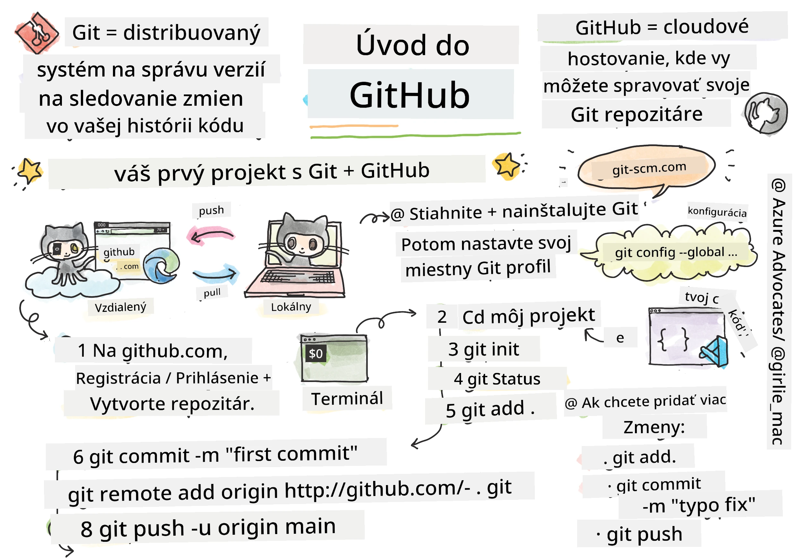
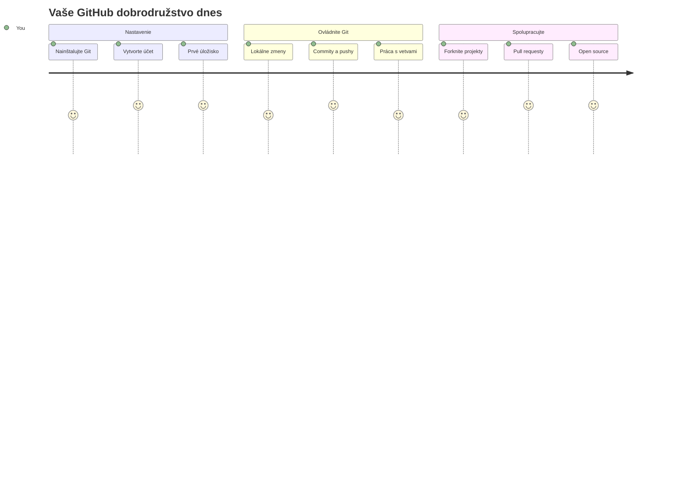
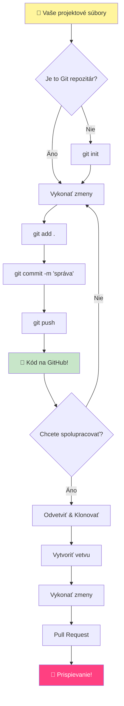
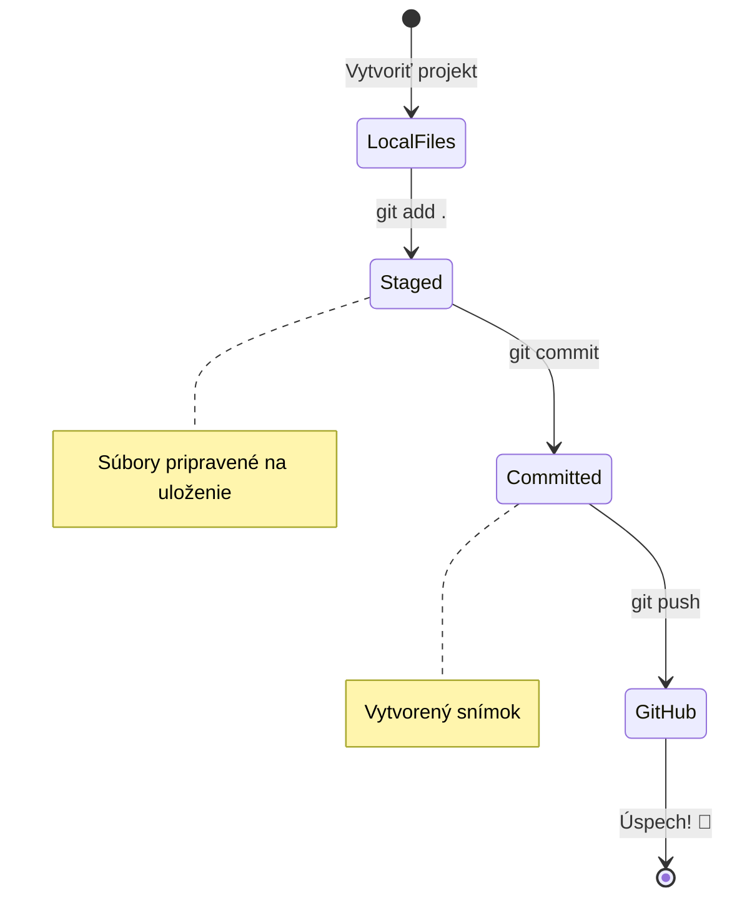
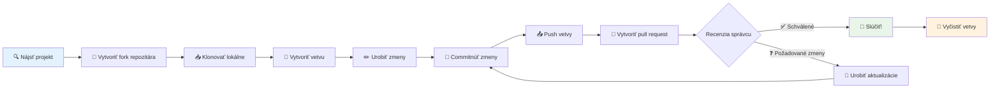
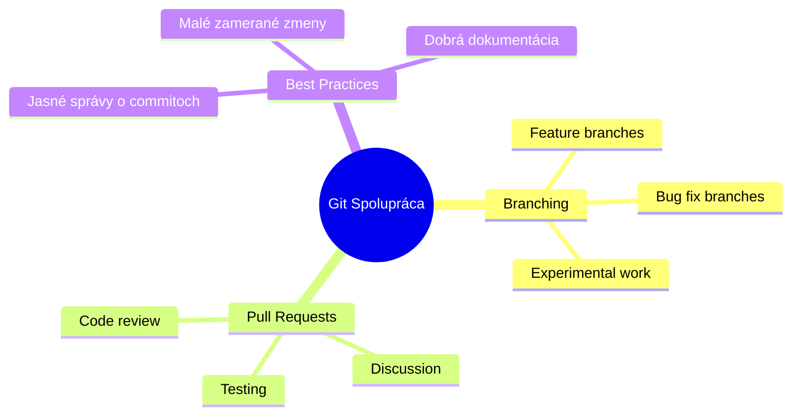
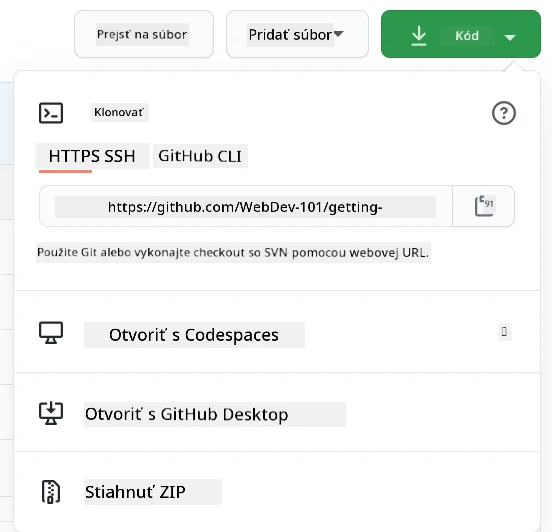
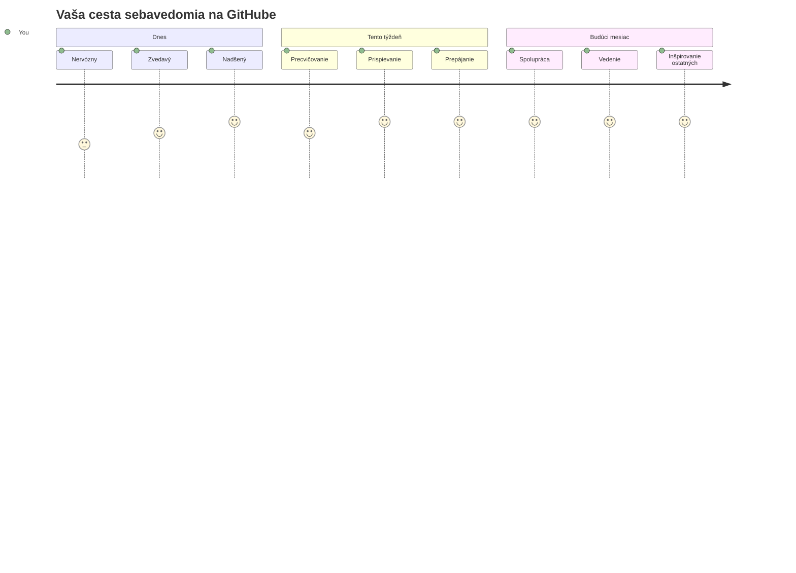

# Úvod do GitHubu

Ahoj, budúci vývojár! 👋 Pripravený sa pripojiť k miliónom programátorov po celom svete? Opravdu sa teším, že ti môžem predstaviť GitHub – predstav si to ako sociálnu sieť pre programátorov, lenže namiesto zdieľania fotiek svojho obeda zdieľame kód a spoločne tvoríme úžasné veci!

Čo ma úplne ohromuje: každá aplikácia na tvojom telefóne, každá webová stránka, ktorú navštíviš, a väčšina nástrojov, ktoré sa naučíš používať, bola vytvorená tímami vývojárov spolupracujúcich na platformách ako je GitHub. Tá hudobná aplikácia, ktorú miluješ? Niekto ako ty na nej prispel. Tá hra, ktorú nevieš pustiť z rúk? Áno, pravdepodobne bola vytvorená vďaka spolupráci na GitHube. A teraz SA TY naučíš, ako byť súčasťou tejto úžasnej komunity!

Vieme, že to môže byť spočiatku veľa – ja si pamätám, ako som prvýkrát hľadel na svoju prvú GitHub stránku so slovami „Čo k tomu všetkému vlastne patrí?“ Ale počuj toto: každý jeden vývojár začal presne tam, kde si teraz ty. Na konci tejto lekcie budeš mať svoj vlastný GitHub repozitár (predstav si to ako tvoju osobnú vitrínu projektov v cloude) a budeš vedieť, ako uložiť svoju prácu, zdieľať ju s ostatnými a dokonca prispievať do projektov, ktoré používajú milióny ľudí.

Túto cestu prejdeme spolu, krok za krokom. Bez naháňania, bez stresu – len ty, ja a niekoľko fakt skvelých nástrojov, ktoré sa stanú tvojimi novými najlepšími priateľmi!


> Sketchnote od [Tomomi Imura](https://twitter.com/girlie_mac)


## Prednáškový kvíz
[Prednáškový kvíz](https://ff-quizzes.netlify.app)

## Úvod

Predtým ako sa pustíme do naozaj vzrušujúcich vecí, pripravme tvoj počítač na trochu GitHub mágie! Predstav si to ako organizovanie svojich umeleckých potrieb pred vytvorením majstrovského diela – mať správne nástroje pripravené robí všetko omnoho hladšie a oveľa zábavnejšie.

Povediem ťa osobne cez každý krok nastavenia, a sľubujem, že to nie je tak desivé, ako to na prvý pohľad vyzerá. Ak ti niečo hneď nedá zmysel, to je úplne normálne! Ja si pamätám, ako som si nastavoval svoje prvé vývojové prostredie a cítil som sa, akoby som sa snažil čítať staroveké hieroglyfy. Každý vývojár bol presne tam, kde si teraz ty, a pýtal sa, či to robí správne. Spoiler alert: ak si tu a učíš sa, už to robíš správne! 🌟

V tejto lekcii si ukážeme:

- sledovanie práce, ktorú robíš na svojom počítači
- spoluprácu na projektoch s inými
- ako prispievať do open source softvéru

### Predpoklady

Pripravme tvoj počítač na GitHub mágiu! Neboj sa – toto nastavenie potrebuješ spraviť len raz a potom budeš pripravený na celú svoju cestu kódovania.

Dobre, začnime od základov! Najprv skontrolujeme, či už máš na počítači nainštalovaný Git. Git je v podstate ako mať super-rozumného asistenta, ktorý si pamätá každý jeden tvoj kúsok zmeny v kóde – oveľa lepší než stále panické stláčanie Ctrl+S každé dve sekundy (všetci sme si tým prešli!).

Pozrime sa, či už máš Git nainštalovaný, takto zadaj tento kúzelný príkaz do terminálu:
`git --version`

Ak Git ešte nemáš, nič sa nedeje! Stačí, keď prejdeš na [download Git](https://git-scm.com/downloads) a stiahneš si ho. Keď ho máš nainštalovaný, musíme ťa s Gitom patrične zoznámiť:

> 💡 **Prvé nastavenie:** Tieto príkazy povedia Gitu, kto si. Táto informácia sa pripojí ku každému tvojmu commitu, takže si vyber meno a email, ktoré chceš verejne používať.

```bash
git config --global user.name "your-name"
git config --global user.email "your-email"
```

Pre kontrolu, či je Git nakonfigurovaný, môžeš zadať:
```bash
git config --list
```

Budeš tiež potrebovať GitHub účet, editor kódu (napríklad Visual Studio Code) a otvoriť si terminál (alebo príkazový riadok).

Prejdi na [github.com](https://github.com/) a vytvor si účet, ak ho ešte nemáš, alebo sa prihlás a vyplň svoj profil.

💡 **Moderný tip:** Zváž nastavenie [SSH kľúčov](https://docs.github.com/en/authentication/connecting-to-github-with-ssh) alebo použitie [GitHub CLI](https://cli.github.com/) pre jednoduchšie prihlasovanie bez hesiel.

✅ GitHub nie je jediný repozitár kódu na svete; existujú aj iné, ale GitHub je najznámejší

### Príprava

Budeš potrebovať priečinok s tvojím kódovým projektom lokálne na počítači (notebook alebo PC) a verejný repozitár na GitHube, ktorý ti bude slúžiť ako príklad toho, ako prispieť do projektov iných.

### Ako udržať svoj kód v bezpečí

Povedzme si na chvíľu o bezpečnosti – neboj sa, nebudeme ťa zastrašovať! Mysli na tieto bezpečnostné praktiky ako na zamykanie auta alebo domu. Sú to jednoduché návyky, ktoré sa stanú druhou prirodzenosťou a ochránia tvoju tvrdú prácu.

Ukážeme ti moderné, bezpečné spôsoby práce s GitHubom už od začiatku. Takto si vybuduješ dobré návyky, ktoré ti poslúžia počas celej tvojej vývojárskej kariéry.

Pri práci s GitHubom je dôležité dodržiavať najlepšie bezpečnostné praktiky:

| Oblasť bezpečnosti | Najlepšia prax | Prečo je to dôležité |
|--------------------|----------------|---------------------|
| **Autentifikácia** | Používaj SSH kľúče alebo osobné prístupové tokeny | Heslá sú menej bezpečné a sú postupne rušené |
| **Dvojfaktorová autentifikácia** | Zapni 2FA na svojom GitHub účte | Pridáva ďalšiu vrstvu ochrany účtu |
| **Bezpečnosť repozitárov** | Nikdy necommituj citlivé informácie | API kľúče a heslá by nikdy nemali byť v verejných repozitároch |
| **Správa závislostí** | Zapni Dependabot pre aktualizácie | Udržiava tvoje závislosti bezpečné a aktuálne |

> ⚠️ **Kritické bezpečnostné upozornenie:** Nikdy necommituj API kľúče, heslá alebo iné citlivé údaje do žiadneho repozitára. Používaj premenné prostredia a súbory `.gitignore` na ochranu citlivých dát.

**Moderné nastavenie autentifikácie:**

```bash
# Vygenerujte SSH kľúč (moderný algoritmus ed25519)
ssh-keygen -t ed25519 -C "your_email@example.com"

# Nastavte Git na používanie SSH
git remote set-url origin git@github.com:username/repository.git
```

> 💡 **Profesionálny tip:** SSH kľúče eliminujú potrebu opakovane zadávať heslá a sú bezpečnejšie než tradičné metódy autentifikácie.

---

## Správa kódu ako profík

Tak toto je moment, keď to dostáva naozaj vzrušujúce! 🎉 Naučíme sa sledovať a spravovať kód ako profesionáli a úprimne, je to jedna z mojich obľúbených vecí na učení, pretože to úplne mení hru.

Predstav si, že píšeš úžasný príbeh a chceš sledovať každý návrh, každú brilantnú úpravu a každý „počkať, toto je geniálne!“ moment po ceste. Presne toto Git robí s tvojím kódom! Je ako mať najúžasnejší zápisník na cestovanie časom, ktorý si pamätá VŠETKO – každý stlačený kláves, každú zmenu, každý „ups, to všetko pokazilo“ moment, ktorý môžeš okamžite vrátiť späť.

Úprimne – spočiatku to môže vyzerať zahlcujúco. Keď som začínal, myslel som si „Prečo nemôžem len normálne uložiť svoje súbory?“ Ale ver mi: keď ti Git začne dávať zmysel (a určite dá!), zažiješ ten moment, keď si povieš „Ako som kedy mohol kódovať bez toho?“ Je to ako objaviť, že vieš lietať, keď si doteraz iba chodil pešo!

Povedzme, že máš na počítači priečinok s projektom a chceš začať sledovať svoj pokrok pomocou git-u – systému na správu verzií. Niektorí ľudia prirovnávajú používanie git-u k písaniu milostného listu svojmu budúcemu ja. Keď si po dňoch, týždňoch alebo mesiacoch prečítaš správy ku commitom, budeš vedieť, prečo si urobil dané rozhodnutie, alebo môžeš "vrátiť späť" zmenu – za predpokladu, že píšeš dobré správy commitov.


### Úloha: Vytvor si svoj prvý repozitár!

> 🎯 **Tvoja misia (a ja sa na to tak teším!)**: Spolu vytvoríme tvoj úplne prvý GitHub repozitár! Keď skončíme, budeš mať svoj vlastný kúsok internetu, kde bude tvoj kód žiť, a spravíš svoj prvý "commit" (to je vývojársky výraz pre uloženie práce naozaj múdrym spôsobom). 
>
> Toto je naozaj špeciálny moment – práve sa oficiálne pridávaš k globálnej komunite vývojárov! Ja si stále pamätám ten pocit z môjho prvého repozitára a ten úžas, ktorý som cítil!

Prejdem s tebou túto dobrodružnú cestu krok po kroku. Neponáhľaj sa – za rýchlosť nedostaneš žiadnu cenu a sľubujem, že každý jeden krok bude dávať zmysel. Pamätaj, každý superhviezdny programátor, ktorého obdivuješ, kedysi sedel presne tam, kde si ty, práve pred vytvorením svojho prvého repozitára. Nie je to super?

> Pozri si video
> 
> [](https://www.youtube.com/watch?v=9R31OUPpxU4)

**Poďme na to spolu:**

1. **Vytvor si repozitár na GitHube**. Choď na GitHub.com a nájdi ten jasne zelený tlačidlo **New** (alebo ikonu **+** v pravom hornom rohu). Klikni a vyber **New repository**.

   Tu je, čo máš urobiť:
   1. Daj svojmu repozitáru meno – niečo, čo pre teba dáva zmysel!
   1. Pridaj popis, ak chceš (pomáha ostatným pochopiť, o čom je tvoj projekt)
   1. Rozhodni sa, či chceš, aby bol verejný (vidí ho každý) alebo súkromný (len pre teba)
   1. Odporúčam zaškrtnúť políčko na pridanie README súboru – je to ako úvodná stránka tvojho projektu
   1. Klikni na **Create repository** a oslavuj – práve si vytvoril svoj prvý repo! 🎉

2. **Choď do svojho projektového priečinka**. Teraz otvor svoj terminál (neboj, nie je to také strašidelné, ako to vyzerá!). Musíme povedať tvojmu počítaču, kde sú tvoje projektové súbory. Napíš tento príkaz:

   ```bash
   cd [name of your folder]
   ```

   **Čo tu robíme:**
   - V podstate hovoríme „Hej počítač, choď so mnou do môjho projektového priečinka“
   - Je to ako otvoriť si konkrétny priečinok na pracovnej ploche, ale robíme to textovými príkazmi
   - Nahraď `[name of your folder]` skutočným názvom svojho projektového priečinka

3. **Zmeň svoj priečinok na Git repozitár**. Tu sa deje mágia! Napíš:

   ```bash
   git init
   ```

   **Čo sa práve stalo (docela cool veci!):**
   - Git práve vytvoril skrytý priečinok `.git` v tvojom projekte – nevidíš ho, ale je tam!
   - Tvoj bežný priečinok je teraz „repozitár“, ktorý môže sledovať každú tvoju zmenu
   - Predstav si to ako dať svojmu priečinku superschopnosti pamätať si všetko

4. **Pozri, čo sa deje**. Poďme sa pozrieť, čo si Git momentálne myslí o tvojom projekte:

   ```bash
   git status
   ```

   **Ako rozumieť tomu, čo ti Git hovorí:**
   
   Môžeš vidieť niečo takéto:

   ```output
   Changes not staged for commit:
   (use "git add <file>..." to update what will be committed)
   (use "git restore <file>..." to discard changes in working directory)

        modified:   file.txt
        modified:   file2.txt
   ```

   **Nepadni na zem! Toto to znamená:**
   - Súbory **červené** sú súbory, ktoré majú zmeny, ale ešte nie sú pripravené na uloženie
   - Súbory **zelené** (keď ich vidíš) sú pripravené na uloženie
   - Git je nápomocný tým, že ti povie presne, čo môžeš robiť ďalej

   > 💡 **Profesionálny tip:** Príkaz `git status` je tvoj najlepší kamarát! Používaj ho vždy, keď si neistý, čo sa deje. Je to ako spýtať sa Gitu „Hej, aká je momentálna situácia?“

5. **Priprav svoje súbory na uloženie** (toto sa nazýva „staging“):

   ```bash
   git add .
   ```

   **Čo sme práve urobili:**
   - Povedali sme Gitu „Hej, chcem zahrnúť VŠETKY svoje súbory do ďalšieho ukladania“
   - `.` znamená „všetko v tomto priečinku“
   - Teraz sú tvoje súbory „staged“ a pripravené na ďalší krok

   **Chceš byť selektívnejší?** Môžeš pridať len konkrétne súbory:

   ```bash
   git add [file or folder name]
   ```

   **Prečo by si to chcel?**
   - Niekedy chceš ukladať súvisiace zmeny spolu
   - Pomáha ti to organizovať prácu do logických častí
   - Je jednoduchšie pochopiť, čo sa zmenilo a kedy

   **Zmenil si názor?** Žiadny problém! Môžeš files unstage-ovať takto:

   ```bash
   # Zrušiť pridanie všetkého
   git reset
   
   # Zrušiť pridanie len jedného súboru
   git reset [file name]
   ```

   Neboj sa – týmto nevymažeš svoju prácu, len odstrániš súbory zo „staged“ oblasti pripravených na uloženie.

6. **Ulož svoju prácu natrvalo** (sprav svoj prvý commit!):

   ```bash
   git commit -m "first commit"
   ```

   **🎉 Gratulujem! Práve si spravil svoj prvý commit!**
   
   **Čo sa práve stalo:**
   - Git vytvoril „snímku“ všetkých tvojich staged súborov práve v tomto momente
   - Tvoja správa ku commit-u „first commit“ vysvetľuje, čo tento bod uloženia znamená
   - Git tejto snímke pridelil jedinečné ID, takže ju vždy vieš nájsť spätne
   - Oficiálne si začal sledovať históriu svojho projektu!

   > 💡 **Budúce správy commitov:** Pre ďalšie commity buď popisnejší! Namiesto „updated stuff“ skúšaj napríklad „Pridaj kontaktný formulár na domovskú stránku“ alebo „Oprav chybu v navigačnom menu“. Tvoje budúce ja ti poďakuje!

7. **Pripoj svoj lokálny projekt k GitHubu**. Momentálne projekt existuje len na tvojom počítači. Poďme ho pripojiť k tvojmu GitHub repozitáru, aby si ho mohol zdieľať so svetom!

   Najprv choď na stránku svojho GitHub repozitára a skopíruj URL. Potom sa vráť sem a zadaj:

   ```bash
   git remote add origin https://github.com/username/repository_name.git
   ```
   
   (Nahraď tú URL skutočnou URL tvojho repozitára!)

   **Čo sme práve urobili:**
   - Vytvorili sme spojenie medzi tvojím lokálnym projektom a tvojím GitHub úložiskom
   - "Origin" je len prezývka pre tvoje GitHub úložisko – je to ako pridať kontakt do tvojho telefónu
   - Teraz tvoj lokálny Git vie, kam poslať tvoj kód, keď ho chceš zdieľať

   💡 **Jednoduchší spôsob**: Ak máš nainštalovaný GitHub CLI, môžeš to spraviť jedným príkazom:
   ```bash
   gh repo create my-repo --public --push --source=.
   ```

8. **Odošli svoj kód na GitHub** (ten veľký moment!):

   ```bash
   git push -u origin main
   ```

   **🚀 Toto je ono! Nahrávaš svoj kód na GitHub!**
   
   **Čo sa deje:**
   - Tvoje commity cestujú z tvojho počítača na GitHub
   - Príznak `-u` nastavuje trvalé spojenie, takže budúce push-nutia budú jednoduchšie
   - "main" je názov tvojej hlavnej vetvy (ako hlavná zložka)
   - Po tomto už stačí len napísať `git push` pre ďalšie nahrávania!

   💡 **Rýchla poznámka**: Ak sa tvoja vetva volá inak (napríklad "master"), použi namiesto toho ten názov. Môžeš si to overiť príkazom `git branch --show-current`.

9. **Tvoj nový denný rytmus programovania** (tu to začne byť návykové!):

   Odteraz, kedykoľvek urobíš zmeny v projekte, máš jednoduchý trojstupňový tanec:

   ```bash
   git add .
   git commit -m "describe what you changed"
   git push
   ```

   **Toto sa stane tvojím programovacím tlkotom:**
   - Urob úžasné zmeny v kóde ✨
   - Zaindexuj ich pomocou `git add` („Hej Git, venuj pozornosť týmto zmenám!“)
   - Ulož ich pomocou `git commit` spolu s popisnou správou (budúci ty ti poďakuje!)
   - Podeľ sa o ne so svetom pomocou `git push` 🚀
   - Opakuj – vážne, toto sa stane tak prirodzené ako dýchanie!

   Tento pracovný postup milujem, pretože je to ako mať viaceré body uloženia v video hre. Urobil si zmenu, ktorú miluješ? Commitni ju! Chceš skúsiť niečo riskantné? Žiadny problém – vždy sa môžeš vrátiť k poslednému commitu, ak sa niečo pokazí!

   > 💡 **Tip**: Možno chceš tiež prijať `.gitignore` súbor, aby si zabránil, že na GitHub sa dostanú súbory, ktoré nechceš sledovať – napríklad ten súbor s poznámkami, ktorý máš uložený v rovnakej zložke, ale nemá miesto v public repozitári. Šablóny pre `.gitignore` súbory nájdeš na [.gitignore templates](https://github.com/github/gitignore) alebo si môžeš vytvoriť vlastný pomocou [gitignore.io](https://www.toptal.com/developers/gitignore).

### 🧠 **Prvé odovzdanie do repozitára: Ako to na teba pôsobilo?**

**Vezmi si chvíľu na oslavu a zamyslenie:**
- Ako si sa cítil, keď si prvýkrát videl svoj kód na GitHub?
- Ktorý krok bol najzložitejší a ktorý naopak prekvapivo jednoduchý?
- Vieš vysvetliť rozdiel medzi `git add`, `git commit` a `git push` vlastnými slovami?


> **Pamätaj**: Aj skúsení vývojári niekedy zabudnú presné príkazy. Rozbehnutie tohto pracovného postupu na automatizmus vyžaduje prax - darí sa ti to skvele!

#### Moderné Git pracovné postupy

Zváž prijať tieto moderné praktiky:

- **Conventional Commits**: Používaj štandardizovaný formát správ commitov ako `feat:`, `fix:`, `docs:`, a pod. Viac sa dozvieš na [conventionalcommits.org](https://www.conventionalcommits.org/)
- **Atomic commits**: Každý commit nech predstavuje jednu logickú zmenu
- **Frequent commits**: Commity často so zmysluplnými správami namiesto veľkých, vzácnych commitov

#### Správy commitov

Skvelý predmet správy commitu dokončuje nasledujúcu vetu:
Ak sa použije, tento commit <tvoj predmet tu>

Pre predmet použi imperatív prítomného času: "change" nie "changed" ani "changes". 
Rovnako v tele (voliteľné) používaj imperatív prítomného času. V tele vysvetli dôvod zmeny a zariadiť porovnanie s predchádzajúcim správaním. Vysvetľuješ "prečo", nie "ako".

✅ Venuj pár minút prehliadaniu GitHubu. Nájdeš skutočne dobrú správu commitu? Nájdeš veľmi minimalistickú? Aká informácia je podľa teba najdôležitejšia a najviac užitočná v správe commitu?

## Práca s ostatnými (Zábavná časť!)

Drž si klobúk, pretože TU sa GitHub stáva úplne magickým! 🪄 Ovládol si správu vlastného kódu, ale teraz sa pustíme do mojej úplne obľúbenej časti – spolupráce s úžasnými ľuďmi z celého sveta.

Predstav si toto: Zobudíš sa zajtra a uvidíš, že niekto v Tokiu vylepšil tvoj kód, zatiaľ čo si spal. Potom niekto v Berlíne opraví chybu, na ktorej si zasekol. Do popoludnia vývojár v São Paule pridal funkciu, na ktorú si nikdy ani nepomyslel. Nie je to sci-fi – to je jednoducho utorok v GitHub svete!

Čo ma naozaj nadchýna, je, že pracovné postupy spolupráce, ktoré sa chystáš naučiť? Sú PRESNE tie isté pracovné postupy, ktoré tímy v Google, Microsoft a tvojich obľúbených startupoch používajú každý deň. Neučíš sa len cool nástroj – učíš sa tajný jazyk, ktorý umožňuje celému softvérovému svetu spolupracovať.

Vážne, keď pocítiš tú radosť z toho, že ti niekto zlučuje tvoj prvý pull request, pochopíš, prečo sú vývojári tak zapálení pre open source. Je to ako byť súčasťou najväčšieho, najkreatívnejšieho tímového projektu na svete!

> Pozri video
>
> [](https://www.youtube.com/watch?v=bFCM-PC3cu8)

Hlavným dôvodom, prečo veci ukladať na GitHub bolo umožniť spoluprácu s ostatnými vývojármi.


Vo svojom repozitári prejdite na `Insights > Community`, aby ste videli, ako váš projekt porovnáva s odporúčanými komunitnými štandardmi.

Chcete, aby váš repozitár vyzeral profesionálne a prívetivo? Choďte do svojho repozitára a kliknite na `Insights > Community`. Táto skvelá funkcia vám ukáže, ako váš projekt porovnáva to, čo GitHub komunita považuje za "dobré praktiky repozitára."

> 🎯 **Nechajte svoj projekt zažiariť**: Dobré usporiadanie repozitára s peknou dokumentáciou je ako mať čistý, prívetivý výklad. Ukazuje ľuďom, že si vážite svoju prácu a povzbudzuje ostatných, aby prispievali!

**Tu je, čo robí repozitár úžasným:**

| Čo pridať | Prečo je to dôležité | Čo to robí pre teba |
|-------------|-------------------|---------------------|
| **Popis** | Prvý dojem záleží! | Ľudia okamžite vedia, čo tvoj projekt robí |
| **README** | Predná stránka tvojho projektu | Ako priateľský sprievodca pre nových návštevníkov |
| **Pravidlá prispievania** | Ukazuje, že vítame pomoc | Ľudia vedia presne, ako ti môžu pomôcť |
| **Kódex správania** | Vytvára priateľské prostredie | Každý sa cíti vítaný zapojiť sa |
| **Licencia** | Právna jasnosť | Iní vedia, ako môžu tvoj kód používať |
| **Bezpečnostná politika** | Ukazuje, že si zodpovedný | Demonštruje profesionálne praktiky |

> 💡 **Profesionálny tip**: GitHub poskytuje šablóny pre všetky tieto súbory. Pri vytváraní nového repozitára zaškrtni políčka na automatické generovanie týchto súborov.

**Moderné funkcie GitHubu na preskúmanie:**

🤖 **Automatizácia & CI/CD:**
- **GitHub Actions** pre automatizované testovanie a nasadzovanie
- **Dependabot** pre automatické aktualizácie závislostí

💬 **Komunita & Správa projektov:**
- **GitHub Discussions** na komunitné rozhovory mimo issues
- **GitHub Projects** na kanban štýl správy projektov
- **Pravidlá ochrany vetiev** na presadzovanie štandardov kvality kódu


Všetky tieto zdroje pomáhajú pri zapojení nových členov tímu. A toto sú typické veci, na ktoré sa noví prispievatelia pozerajú, ešte predtým, než začnú študovať tvoj kód, aby zistili, či je tvoj projekt pre nich správnym miestom na trávenie času.

✅ README súbory, aj keď ich príprava trvá, sú často zanedbávané zaneprázdnenými správcami. Nájdeš príklad zvlášť podrobného README? Poznámka: existujú [nástroje na tvorbu dobrých README](https://www.makeareadme.com/), ktoré by si možno chcel vyskúšať.

### Úloha: Zlúč nejaký kód

Pravidlá prispievania pomáhajú ľuďom prispieť do projektu. Vysvetľujú, aké typy príspevkov očakávaš a ako proces funguje. Prispievatelia budú potrebovať prejsť sériou krokov, aby mohli prispieť do tvojho repa na GitHub:

1. **Fork tvojho repozitára** Pravdepodobne budeš chcieť, aby ľudia _forkli_ tvoj projekt. Fork znamená vytvoriť replikáciu tvojho repozitára na ich GitHub profile.
1. **Klonovanie**. Odtiaľ klonujú projekt do svojho lokálneho počítača.
1. **Vytvorenie vetvy**. Budeš chcieť, aby vytvorili _vetvu_ pre svoju prácu.
1. **Zameraj svoju zmenu na jednu oblasť**. Požiadaj prispievateľov, aby sa sústredili na jeden príspevok naraz – takto je vyššia pravdepodobnosť, že ich prácu budeš môcť _zlúčiť_. Predstav si, že napíšu opravu chyby, pridajú novú funkciu a aktualizujú niekoľko testov – čo ak chceš, alebo môžeš implementovať len 2 z 3, alebo len 1 z 3 zmien?

✅ Predstav si situáciu, kde sú vetvy obzvlášť kritické pre písanie a doručovanie kvalitného kódu. Na aké použitia si spomenieš?

> Pamätaj, buď tou zmenou, ktorú chceš vidieť vo svete, a vytváraj vetvy aj pre svoju vlastnú prácu. Každý commit, ktorý urobíš, bude vykonaný na vetve, na ktorej si momentálne „checknutý“. Použi `git status`, aby si videl, ktorá to je.

Prejdime si pracovný tok prispievateľa. Predpokladaj, že prispievateľ už _forkol_ a _klonoval_ repozitár, takže má pripravený Git repozitár na svojom lokálnom počítači:

1. **Vytvor vetvu**. Použi príkaz `git branch` na vytvorenie vetvy, ktorá bude obsahovať zmeny, ktoré chce prispieť:

   ```bash
   git branch [branch-name]
   ```

   > 💡 **Moderný prístup**: Vetvu môžeš vytvoriť a zároveň prepnúť na ňu jedným príkazom:
   ```bash
   git switch -c [branch-name]
   ```

1. **Prepni sa na pracovnú vetvu**. Prepni sa na určenú vetvu a aktualizuj pracovný adresár pomocou `git switch`:

   ```bash
   git switch [branch-name]
   ```

   > 💡 **Moderná poznámka**: `git switch` je moderný náhradník príkazu `git checkout` pri zmene vetiev. Je jasnejší a bezpečnejší pre začiatočníkov.

1. **Rob prácu**. V tejto chvíli chceš pridať svoje zmeny. Nezabudni Git o tom informovať nasledujúcimi príkazmi:

   ```bash
   git add .
   git commit -m "my changes"
   ```

   > ⚠️ **Kvalita správy commitu**: Uisti sa, že svojmu commitu dáš dobrý názov, pre seba aj pre správcu repozitára, v ktorom pomáhaš. Buď konkrétny, čo si zmenil!

1. **Zlúč svoju prácu s vetvou `main`**. V určitom momente skončíš prácu a chceš zlúčiť svoju prácu s vetvou `main`. Táto vetva sa mohla medzitým zmeniť, preto sa najprv uisti, že ju aktualizuješ na najnovšiu verziu pomocou nasledujúcich príkazov:

   ```bash
   git switch main
   git pull
   ```

   V tejto chvíli chceš zabezpečiť, aby sa prípadné _konflikty_, situácie, keď Git nevie ľahko _zlúčiť_ zmeny, vyriešili vo tvojej pracovnej vetve. Preto spusti tieto príkazy:

   ```bash
   git switch [branch_name]
   git merge main
   ```

   Príkaz `git merge main` prinesie do tvojej vetvy všetky zmeny z `main`. Dúfajme, že môžeš pokračovať bez problémov. Ak nie, VS Code ti ukáže, kde je Git _zmätený_, a ty len upravíš dané súbory tak, aby bol obsah správny.

   💡 **Moderná alternatíva**: Zváž použiť `git rebase` pre čistejšiu históriu:
   ```bash
   git rebase main
   ```
   Tento príkaz zopakuje tvoje commity na vrchu najnovšej vetvy main a vytvorí lineárnu históriu.

1. **Odošli svoju prácu na GitHub**. Odoslanie práce na GitHub znamená dve veci. Push tvojej vetvy do tvojho repozitára a potom otvorenie PR, Pull Requestu.

   ```bash
   git push --set-upstream origin [branch-name]
   ```

   Tento príkaz vytvorí vetvu v tvojom forknutom repozitári.

### 🤝 **Kontrola schopností spolupráce: Si pripravený pracovať s ostatnými?**

**Poďme zistiť, ako sa cítiš v spolupráci:**
- Dáva ti teraz zmysel koncept forku a pull requestov?
- Čo je jedna vec o práci s vetvami, ktorú by si chcel viac nacvičiť?
- Ako pohodlne sa cítiš prispievať do projektu niekoho iného?


> **Zvýšenie sebavedomia**: Každý vývojár, ktorého obdivuješ, bol raz nervózny pri svojom prvom pull requeste. GitHub komunita je neuveriteľne prívetivá k nováčikom!

1. **Otvoriť PR**. Ďalej chceš otvoriť PR. Urobíš to tak, že prejdeš do fork-ovaného repozitára na GitHub. Uvidíš tam upozornenie, kde sa ťa pýta, či chceš vytvoriť nový PR, klikneš na to a dostaneš sa do rozhrania, kde môžeš zmeniť nadpis správy commitu, pridať vhodnejší popis. Teraz správca repozitára, ktorý si forkol, uvidí tento PR a _držme palce_, že ocení a _zlúči_ tvoj PR. Teraz si prispievateľ, hurá :)

   💡 **Moderný tip**: PR môžeš vytvoriť aj pomocou GitHub CLI:
   ```bash
   gh pr create --title "Your PR title" --body "Description of changes"
   ```

   🔧 **Najlepšie praktiky pre PR**:
   - Prepoj súvisiace issues pomocou kľúčových slov ako "Fixes #123"
   - Pridaj screenshoty pre zmeny v UI
   - Požiadaj o konkrétnych recenzentov
   - Používaj draft PR pre rozpracované práce
   - Uisti sa, že všetky CI kontroly prešli pred požiadavkou na recenziu
1. **Vyčistenie**. Považuje sa za dobrú prax _vyčistiť_ po úspešnom zlúčení PR. Chcete vyčistiť ako svoju lokálnu vetvu, tak aj vetvu, ktorú ste odoslali na GitHub. Najskôr ju vymažeme lokálne nasledujúcim príkazom:

   ```bash
   git branch -d [branch-name]
   ```

   Nezabudnite potom navštíviť stránku pre forknuté repo na GitHub a odstrániť vzdialenú vetvu, ktorú ste tam práve odoslali.

`Pull request` sa zdá byť trochu zábavným výrazom, pretože v skutočnosti chcete svoje zmeny poslať do projektu. Ale správca (vlastník projektu) alebo jadrový tím musí vaše zmeny zvážiť predtým, než ich zlúči s "hlavnou" vetvou projektu, takže v skutočnosti požadujete rozhodnutie o zmene od správcu.

Pull request je miesto, kde sa porovnávajú a diskutujú rozdiely zavedené vo vetve s recenziami, komentármi, integrovanými testami a ďalším. Dobrý pull request dodržiava približne rovnaké pravidlá ako správa ku commitu. Môžete pridať referenciu na issue v issue trackeri, napríklad keď vaša práca rieši daný problém. To sa robí použitím `#` nasledovaného číslom vášho issue. Napríklad `#97`.

🤞Palce držíme, aby všetky kontroly prešli a majiteľ projektu zlúčil vaše zmeny do projektu🤞

Aktualizujte svoju aktuálnu lokálnu pracovnú vetvu so všetkými novými commitmi z príslušnej vzdialenej vetvy na GitHub:

`git pull`

## Prispievanie do open source (Vaša príležitosť zanechať stopu!)

Ste pripravení na niečo, čo vám úplne vyrazí dych? 🤯 Poďme hovoriť o prispievaní do open source projektov – a už len keď na to myslím, mám zimomriavky!

Toto je vaša šanca stať sa súčasťou niečoho naozaj výnimočného. Predstavte si, že zlepšujete nástroje, ktoré milióny vývojárov používajú každý deň, alebo opravujete chybu v aplikácii, ktorú vaši priatelia milujú. To nie je len sen – to je to, čo prispievanie do open source znamená!

Čo mi vždy dáva zimomriavky: každý jeden nástroj, s ktorým ste sa učili – váš kódovací editor, frameworky, ktoré preskúmame, dokonca aj prehliadač, v ktorom toto čítate – začal tým, že niekto presne ako vy urobil svoj prvý príspevok. Ten geniálny vývojár, ktorý vytvoril vašu obľúbenú VS Code rozšírenie? Bol tiež začiatočník, ktorý klikol na "create pull request" s trasúcimi sa rukami, presne ako sa chystáte urobiť vy.

A tu je tá najkrajšia časť: komunita open source je ako najväčšie internetové objatie. Väčšina projektov aktívne hľadá nováčikov a má issues označené "good first issue" špeciálne pre ľudí ako ste vy! Správcovia sa naozaj tešia vždy, keď vidia nových prispievateľov, pretože si pamätajú svoje prvé kroky.

```mermaid
flowchart TD
    A[🔍 Preskúmajte GitHub] --> B[🏷️ Nájdite "dobrý prvý problém"]
    B --> C[📖 Prečítajte si pravidlá prispievania]
    C --> D[🍴 Vytvorte fork repozitára]
    D --> E[💻 Nastavte lokálne prostredie]
    E --> F[🌿 Vytvorte vetvu pre funkciu]
    F --> G[✨ Urobte svoj príspevok]
    G --> H[🧪 Otestujte svoje zmeny]
    H --> I[📝 Napíšte jasný commit]
    I --> J[📤 Pushnite a vytvorte PR]
    J --> K[💬 Zapojte sa do spätnej väzby]
    K --> L[🎉 Zlúčené! Ste prispievateľ!]
    L --> M[🌟 Nájdite ďalší problém]
    
    style A fill:#e1f5fe
    style L fill:#c8e6c9
    style M fill:#fff59d
```
Učíte sa tu nie len kódovať – pripravujete sa stať sa členom globálnej rodiny staviteľov, ktorí každé ráno vstávajú s otázkou „Ako môžeme digitálny svet urobiť o trochu lepším?“ Vitajte v klube! 🌟

Najskôr nájdeme repozitár (alebo **repo**) na GitHub, ktorý vás zaujíma a ku ktorému by ste chceli prispieť zmenou. Budete chcieť jeho obsah skopírovať do svojho počítača.

✅ Dobrou cestou, ako nájsť 'začiatočníkom priateľské' repozitáre, je [vyhľadávanie podľa značky 'good-first-issue'](https://github.blog/2020-01-22-browse-good-first-issues-to-start-contributing-to-open-source/).



Existuje niekoľko spôsobov, ako kód skopírovať. Jedným zo spôsobov je „klonovať“ obsah repozitára pomocou HTTPS, SSH alebo pomocou GitHub CLI (Command Line Interface).

Otvorte svoj terminál a naklonujte repozitár takto:
```bash
# Používanie HTTPS
git clone https://github.com/ProjectURL

# Používanie SSH (vyžaduje nastavenie SSH kľúča)
git clone git@github.com:username/repository.git

# Používanie GitHub CLI
gh repo clone username/repository
```

Pre prácu na projekte prejdite do správneho priečinka:
`cd ProjectURL`

Projekt môžete otvoriť aj celkový spôsobom:
- **[GitHub Codespaces](https://github.com/features/codespaces)** – GitHub cloudové vývojové prostredie so VS Code v prehliadači
- **[GitHub Desktop](https://desktop.github.com/)** – GUI aplikácia pre Git operácie
- **[GitHub.dev](https://github.dev)** – Stlačte klávesu `.` na akomkoľvek GitHub repozitári, aby sa vám otvoril VS Code v prehliadači
- **VS Code** s rozšírením GitHub Pull Requests

Nakoniec môžete kód stiahnuť v zipovanej zložke.

### Niekoľko ďalších zaujímavostí o GitHub

Na GitHube môžete označiť hviezdičkou, sledovať a/alebo „forknúť“ akýkoľvek verejný repozitár. Nájdete svoje hviezdičkované repá v rozbaľovacom menu vpravo hore. Je to ako záložka, ale pre kód.

Projekty majú tracker issue, väčšinou na GitHub v záložke "Issues", ak nie je uvedené inak, kde ľudia diskutujú o problémoch súvisiacich s projektom. A tabuľka Pull Requests je miesto, kde sa diskutujú a recenzujú zmeny, ktoré sú práve v procese.

Projekty môžu mať aj diskusie vo fórach, mailing listoch alebo chat kanáloch ako Slack, Discord alebo IRC.

🔧 **Moderné GitHub funkcie**:
- **GitHub Discussions** – Vstavané fórum pre komunitné konverzácie
- **GitHub Sponsors** – Finančná podpora správcov  
- **Záložka Security** – Nahlasovanie zraniteľností a bezpečnostné oznámenia
- **Záložka Actions** – Zobrazenie automatizovaných workflow a CI/CD pipeline
- **Záložka Insights** – Analýzy o prispievateľoch, commitoch a zdraví projektu
- **Záložka Projects** – Vstavané GitHub nástroje pre riadenie projektov

✅ Pozrite si svoje nové GitHub repo a vyskúšajte niektoré veci, ako upraviť nastavenia, pridať informácie do repozitára, vytvoriť projekt (napr. Kanban board) a nastaviť GitHub Actions pre automatizáciu. Veľa sa dá robiť!

---

## 🚀 Výzva

Dobre, je čas otestovať vaše nový GitHub super schopnosti! 🚀 Tu je výzva, ktorá vám všetko krásne vysvetlí a spraví pocit skvelým:

Zoberte si kamaráta (alebo člena rodiny, ktorý sa vždy pýta, čo to vlastne robíte s tým „počítačovým svetom“) a vydajte sa spolu na spoločné programátorské dobrodružstvo! Tu sa deje tá pravá mágia – vytvorte projekt, nechajte ho forkovať, spravte vetvy a spojte zmeny ako profesionáli, ktorými sa stávate.

Nebudem klamať – pravdepodobne sa pri tom aj zasmejete (najmä keď obaja budete chcieť meniť ten istý riadok), možno si aj podrbete hlavu z nepochopenia, ale určite zažijete tie úžasné „aha!“ momenty, ktoré stoja za celú námahu učenia. Plus, niečo je naozaj výnimočné na tom, keď môžete s niekým zdieľať svoje prvé úspešné zlúčenie – je to ako malá oslava toho, ako ďaleko ste sa dostali!

Nemáte ešte programátorského parťáka? Žiadny problém! GitHub komunita je plná neuveriteľne priateľských ľudí, ktorí si pamätajú, aké to bolo byť nováčikom. Hľadajte repozitáre s označením "good first issue" – v podstate hovoria „Hej začiatočníci, poďte sa učiť s nami!“ Ako skvelé je to?

## Kvíz po prednáške
[Post-lecture quiz](https://ff-quizzes.netlify.app/web/en/)

## Revízia a pokračovanie v učení

Uf! 🎉 Pozrite sa na seba – práve ste zvládli základy GitHub ako absolútny šampión! Ak sa vám teraz hlava trochu preplnila, je to úplne normálne a úprimne dobrý znak. Práve ste sa naučili nástroje, s ktorými mi trvalo týždne, než som s nimi začal byť pohodlný.

Git a GitHub sú neuveriteľne silné (vážne silné) a každý vývojár, ktorého poznám – vrátane tých, ktorí teraz pôsobia ako čarodejníci – musel trocha trénovať a potkýnať sa, než to všetko pochopil. Fakt, že ste prešli touto lekciou, znamená, že ste už na ceste stať sa majstrom jedných z najdôležitejších nástrojov v arzenáli vývojára.

Tu je niekoľko fantastických zdrojov, ktoré vám pomôžu trénovať a stať sa ešte lepšími:

- [Sprievodca prispievaním do open source softvéru](https://opensource.guide/how-to-contribute/#how-to-submit-a-contribution) – cesta, ako urobiť rozdiel
- [Git cheat sheet](https://training.github.com/downloads/github-git-cheat-sheet/) – majte po ruke pre rýchle odkazy!

A pamätajte: prax robí pokrok, nie dokonalosť! Čím viac používate Git a GitHub, tým prirodzenejšie to bude. GitHub vytvoril úžasné interaktívne kurzy, ktoré vám umožnia trénovať v bezpečnom prostredí:

- [Úvod do GitHubu](https://github.com/skills/introduction-to-github)
- [Komunikujte pomocou Markdown](https://github.com/skills/communicate-using-markdown)  
- [GitHub Pages](https://github.com/skills/github-pages)
- [Riešenie konfliktov pri zlučovaní](https://github.com/skills/resolve-merge-conflicts)

**Cítite sa dobrodružne? Skúste moderné nástroje:**
- [Dokumentácia GitHub CLI](https://cli.github.com/manual/) – keď chcete pôsobiť ako kúzelník z príkazového riadku
- [Dokumentácia GitHub Codespaces](https://docs.github.com/en/codespaces) – kódujte v cloude!
- [Dokumentácia GitHub Actions](https://docs.github.com/en/actions) – automatizujte všetko
- [Najlepšie praktiky Git](https://www.atlassian.com/git/tutorials/comparing-workflows) – posuňte svoj pracovný proces na ďalšiu úroveň

## Výzva GitHub Copilot Agent 🚀

Použite režim Agenta na dokončenie nasledujúcej výzvy:

**Popis:** Vytvorte spolupracovný webový vývojársky projekt, ktorý demonštruje kompletný GitHub workflow, ktorý ste sa naučili v tejto lekcii. Táto výzva vám pomôže precvičiť vytvorenie repozitára, kolaboračné funkcie a moderné Git workflow v reálnom svete.

**Úloha:** Vytvorte nový verejný GitHub repozitár pre jednoduchý projekt „Web Development Resources“. Repozitár by mal obsahovať dobre štruktúrovaný súbor README.md, ktorý obsahuje užitočné webové vývojárske nástroje a zdroje, usporiadané podľa kategórií (HTML, CSS, JavaScript atď.). Nastavte repozitár podľa správnych komunitných štandardov vrátane licencie, smerníc pre prispievanie a kódexu správania. Vytvorte aspoň dve vetvy s funkciami: jednu pre pridanie CSS zdrojov a druhú pre JavaScript zdroje. Robte commity do každej vetvy s popisnými správami ku commitu, potom vytvorte pull requesty na zlúčenie zmien späť do hlavnej vetvy. Aktivujte GitHub funkcie ako Issues, Discussions a nastavte jednoduchý GitHub Actions workflow pre automatické kontroly.

## Zadanie

Vašou misiou, ak sa rozhodnete ju prijať: dokončite kurz [Introduction to GitHub](https://github.com/skills/introduction-to-github) na GitHub Skills. Tento interaktívny kurz vám umožní precvičiť všetko, čo ste sa naučili, v bezpečnom a riadenom prostredí. A navyše dostanete pekný odznak, keď ho dokončíte! 🏅

**Cítite sa pripravení na ďalšie výzvy?**
- Nastavte autentifikáciu SSH pre svoj GitHub účet (už žiadne heslá!)
- Vyskúšajte používať GitHub CLI pre každodenné Git operácie
- Vytvorte repozitár s GitHub Actions workflow
- Preskúmajte GitHub Codespaces otvorením tohto repozitára v cloudovom editore

---

## 🚀 Váš časový plán zvládnutia GitHub

### ⚡ **Čo môžete urobiť v nasledujúcich 5 minútach**
- [ ] Označte tento repozitár hviezdičkou a 3 ďalšie projekty, ktoré vás zaujímajú
- [ ] Nastavte dvojfaktorovú autentifikáciu na svojom GitHub účte
- [ ] Vytvorte jednoduché README pre svoj prvý repozitár
- [ ] Sledujte 5 vývojárov, ktorých práca vás inšpiruje

### 🎯 **Čo môžete dosiahnuť za hodinu**
- [ ] Dokončiť kvíz po lekcii a zamyslieť sa nad svojou GitHub cestou
- [ ] Nastaviť SSH kľúče pre autentifikáciu bez hesla
- [ ] Vytvoriť svoj prvý zmysluplný commit s dobrou správou
- [ ] Preskúmať záložku „Explore“ na GitHub a objaviť trendy projekty
- [ ] Precvičiť fork repozitára a urobiť malú zmenu

### 📅 **Vaše týždňové GitHub dobrodružstvo**
- [ ] Dokončiť GitHub Skills kurzy (Úvod do GitHub, Markdown)
- [ ] Vytvoriť svoj prvý pull request do open source projektu
- [ ] Nastaviť GitHub Pages stránku na prezentáciu svojej práce
- [ ] Zapájať sa do GitHub Discussions o projektoch, ktoré vás zaujímajú
- [ ] Vytvoriť repozitár so správnymi komunitnými štandardmi (README, licencia atď.)
- [ ] Vyskúšať GitHub Codespaces pre cloudový vývoj

### 🌟 **Vaša mesačná transformácia**
- [ ] Prispieť do 3 rôznych open source projektov
- [ ] Mentorovať niekoho nového v GitHub (odhaliť vedomosti ďalej!)
- [ ] Nastaviť automatizované workflow pomocou GitHub Actions
- [ ] Vybudovať portfólio prezentujúce vaše GitHub príspevky
- [ ] Zúčastniť sa Hacktoberfestu alebo podobných komunitných akcií
- [ ] Stať sa správcom vlastného projektu, do ktorého prispievajú iní

### 🎓 **Záverečná GitHub kontrola majstrovstva**

**Oslávte, ako ďaleko ste prišli:**
- Čo je vaše obľúbené na používaní GitHub?
- Ktorá kolaboratívna funkcia vás najviac nadchla?
- Ako seba hodnotíte v prispievaní do open source teraz?
- Na aký prvý projekt chcete prispieť?


> 🌍 **Vitajte v globálnej komunite vývojárov!** Teraz máte nástroje na spoluprácu s miliónmi vývojárov po celom svete. Váš prvý príspevok sa môže zdať malý, ale pamätajte – každý veľký open source projekt začal niekým, kto urobil svoj prvý commit. Otázka nie je, či zanecháte stopu, ale ktorý úžasný projekt prvý získa váš jedinečný pohľad! 🚀

Pamätajte: každý expert bol raz začiatočník. Máte to vo svojich rukách! 💪

---

<!-- CO-OP TRANSLATOR DISCLAIMER START -->
**Zrieknutie sa zodpovednosti**:
Tento dokument bol preložený pomocou AI prekladateľskej služby [Co-op Translator](https://github.com/Azure/co-op-translator). Aj keď sa snažíme o presnosť, berte prosím na vedomie, že automatizované preklady môžu obsahovať chyby alebo nepresnosti. Originálny dokument v jeho pôvodnom jazyku by mal byť považovaný za autoritatívny zdroj. Pre kritické informácie sa odporúča profesionálny ľudský preklad. Nie sme zodpovední za akékoľvek nepochopenia alebo nesprávne výklady vzniknuté z použitia tohto prekladu.
<!-- CO-OP TRANSLATOR DISCLAIMER END -->