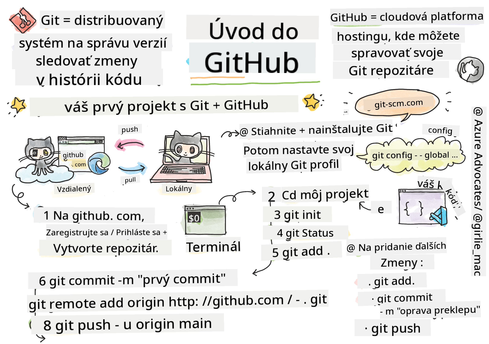

<!--
CO_OP_TRANSLATOR_METADATA:
{
  "original_hash": "05666cecb8983a72cf0ce1d18932b5b7",
  "translation_date": "2025-08-27T23:05:17+00:00",
  "source_file": "1-getting-started-lessons/2-github-basics/README.md",
  "language_code": "sk"
}
-->
# Úvod do GitHubu

Táto lekcia pokrýva základy GitHubu, platformy na hosťovanie a správu zmien vo vašom kóde.


> Sketchnote od [Tomomi Imura](https://twitter.com/girlie_mac)

## Kvíz pred lekciou
[Kvíz pred lekciou](https://ff-quizzes.netlify.app/web/quiz/3)

## Úvod

V tejto lekcii sa naučíte:

- sledovať prácu, ktorú robíte na svojom počítači
- pracovať na projektoch s ostatnými
- ako prispievať do open source softvéru

### Predpoklady

Predtým, než začnete, musíte skontrolovať, či máte nainštalovaný Git. V termináli zadajte:  
`git --version`

Ak Git nie je nainštalovaný, [stiahnite Git](https://git-scm.com/downloads). Potom nastavte svoj lokálny Git profil v termináli:
* `git config --global user.name "vaše-meno"`
* `git config --global user.email "váš-email"`

Na kontrolu, či je Git už nakonfigurovaný, môžete zadať:
`git config --list`

Budete tiež potrebovať účet na GitHub, editor kódu (napríklad Visual Studio Code) a otvorený terminál (alebo príkazový riadok).

Prejdite na [github.com](https://github.com/) a vytvorte si účet, ak ho ešte nemáte, alebo sa prihláste a vyplňte svoj profil.

✅ GitHub nie je jediným úložiskom kódu na svete; existujú aj iné, ale GitHub je najznámejší.

### Príprava

Budete potrebovať priečinok s projektom kódu na vašom lokálnom počítači (notebook alebo PC) a verejné úložisko na GitHub, ktoré bude slúžiť ako príklad, ako prispievať do projektov ostatných.

---

## Správa kódu

Predstavte si, že máte lokálny priečinok s projektom kódu a chcete začať sledovať svoj pokrok pomocou git - systému na správu verzií. Niektorí ľudia prirovnávajú používanie git k písaniu milostného listu svojmu budúcemu ja. Čítaním vašich commit správ o dni, týždne alebo mesiace neskôr si budete môcť spomenúť, prečo ste urobili určité rozhodnutie, alebo "vrátiť" zmenu - samozrejme, ak píšete dobré "commit správy".

### Úloha: Vytvorte úložisko a commitnite kód  

> Pozrite si video
> 
> [](https://www.youtube.com/watch?v=9R31OUPpxU4)

1. **Vytvorte úložisko na GitHub**. Na GitHub.com, v záložke úložísk alebo z navigačného panela vpravo hore, nájdite tlačidlo **new repo**.

   1. Dajte svojmu úložisku (priečinku) názov.
   1. Vyberte **create repository**.

1. **Prejdite do pracovného priečinka**. V termináli prepnite do priečinka (tiež známeho ako adresár), ktorý chcete začať sledovať. Zadajte:

   ```bash
   cd [name of your folder]
   ```

1. **Inicializujte git úložisko**. Vo vašom projekte zadajte:

   ```bash
   git init
   ```

1. **Skontrolujte stav**. Na kontrolu stavu vášho úložiska zadajte:

   ```bash
   git status
   ```

   Výstup môže vyzerať nejako takto:

   ```output
   Changes not staged for commit:
   (use "git add <file>..." to update what will be committed)
   (use "git checkout -- <file>..." to discard changes in working directory)

        modified:   file.txt
        modified:   file2.txt
   ```

   Typicky príkaz `git status` vám povie veci ako, ktoré súbory sú pripravené na _uloženie_ do úložiska alebo majú zmeny, ktoré by ste mohli chcieť zachovať.

1. **Pridajte všetky súbory na sledovanie**  
   Toto sa tiež nazýva staging súborov/pridávanie súborov do staging oblasti.

   ```bash
   git add .
   ```

   Argument `git add` plus `.` označuje, že všetky vaše súbory a zmeny sú pripravené na sledovanie.

1. **Pridajte vybrané súbory na sledovanie**

   ```bash
   git add [file or folder name]
   ```

   Toto nám pomáha pridať iba vybrané súbory do staging oblasti, keď nechceme commitnúť všetky súbory naraz.

1. **Odstráňte všetky súbory zo staging oblasti**

   ```bash
   git reset
   ```

   Tento príkaz nám pomáha odstrániť všetky súbory zo staging oblasti naraz.

1. **Odstráňte konkrétny súbor zo staging oblasti**

   ```bash
   git reset [file or folder name]
   ```

   Tento príkaz nám pomáha odstrániť iba konkrétny súbor zo staging oblasti, ktorý nechceme zahrnúť do ďalšieho commitu.

1. **Uložte svoju prácu**. V tomto bode ste pridali súbory do tzv. _staging oblasti_. Miesta, kde Git sleduje vaše súbory. Aby ste zmenu urobili trvalou, musíte _commitnúť_ súbory. Na to vytvoríte _commit_ pomocou príkazu `git commit`. _Commit_ predstavuje bod uloženia v histórii vášho úložiska. Zadajte nasledujúce na vytvorenie _commit_:

   ```bash
   git commit -m "first commit"
   ```

   Tento commit uloží všetky vaše súbory a pridá správu "first commit". Pre budúce commit správy budete chcieť byť viac popisní vo vašom opise, aby ste vyjadrili, aký typ zmeny ste urobili.

1. **Pripojte svoje lokálne Git úložisko s GitHubom**. Git úložisko je dobré na vašom počítači, ale v určitom bode budete chcieť mať zálohu svojich súborov niekde inde a tiež pozvať ostatných ľudí, aby s vami pracovali na vašom úložisku. Jedným z takých skvelých miest je GitHub. Pamätajte, že sme už vytvorili úložisko na GitHub, takže jediná vec, ktorú musíme urobiť, je pripojiť naše lokálne Git úložisko s GitHubom. Príkaz `git remote add` to urobí. Zadajte nasledujúci príkaz:

   > Poznámka: Predtým, než zadáte príkaz, prejdite na stránku vášho GitHub úložiska, aby ste našli URL úložiska. Použijete ho v nasledujúcom príkaze. Nahraďte ```https://github.com/username/repository_name.git``` vašou GitHub URL.

   ```bash
   git remote add origin https://github.com/username/repository_name.git
   ```

   Tento príkaz vytvorí _remote_, alebo pripojenie, nazvané "origin", ktoré ukazuje na GitHub úložisko, ktoré ste vytvorili skôr.

1. **Odošlite lokálne súbory na GitHub**. Doteraz ste vytvorili _pripojenie_ medzi lokálnym úložiskom a GitHub úložiskom. Pošlite tieto súbory na GitHub pomocou nasledujúceho príkazu `git push`, takto: 

   > Poznámka: Názov vašej vetvy môže byť predvolene odlišný od ```main```.

   ```bash
   git push -u origin main
   ```

   Tento príkaz odošle vaše commity vo vašej "main" vetve na GitHub.

2. **Pridajte ďalšie zmeny**. Ak chcete pokračovať v robení zmien a ich odosielaní na GitHub, budete potrebovať použiť nasledujúce tri príkazy:

   ```bash
   git add .
   git commit -m "type your commit message here"
   git push
   ```

   > Tip: Možno budete chcieť prijať súbor `.gitignore`, aby ste zabránili súborom, ktoré nechcete sledovať, aby sa zobrazovali na GitHub - napríklad ten súbor s poznámkami, ktorý uchovávate v rovnakom priečinku, ale nemá miesto vo verejnom úložisku. Šablóny pre súbory `.gitignore` nájdete na [.gitignore templates](https://github.com/github/gitignore).

#### Commit správy

Skvelý predmet commit správy dokončí nasledujúcu vetu:  
Ak sa použije, tento commit <vaša predmetová správa tu>

Pre predmet použite imperatívny, prítomný čas: "zmeniť" nie "zmenené" ani "zmeny".  
Rovnako ako v predmete, aj v tele (voliteľné) použite imperatívny, prítomný čas. Telo by malo obsahovať motiváciu pre zmenu a porovnať ju s predchádzajúcim správaním. Vysvetľujete `prečo`, nie `ako`.

✅ Venujte pár minút prehliadaniu GitHubu. Nájdete naozaj skvelú commit správu? Nájdete naozaj minimálnu? Aké informácie si myslíte, že sú najdôležitejšie a najužitočnejšie na vyjadrenie v commit správe?

### Úloha: Spolupracujte

Hlavným dôvodom, prečo veci umiestňujeme na GitHub, je umožniť spoluprácu s ostatnými vývojármi.

## Práca na projektoch s ostatnými

> Pozrite si video
>
> [](https://www.youtube.com/watch?v=bFCM-PC3cu8)

Vo vašom úložisku prejdite na `Insights > Community`, aby ste videli, ako váš projekt porovnáva s odporúčanými komunitnými štandardmi.

   Tu sú niektoré veci, ktoré môžu zlepšiť vaše GitHub úložisko:
   - **Popis**. Pridali ste popis pre váš projekt?
   - **README**. Pridali ste README? GitHub poskytuje pokyny na písanie [README](https://docs.github.com/articles/about-readmes/?WT.mc_id=academic-77807-sagibbon).
   - **Pravidlá prispievania**. Má váš projekt [pravidlá prispievania](https://docs.github.com/articles/setting-guidelines-for-repository-contributors/?WT.mc_id=academic-77807-sagibbon)?
   - **Kódex správania**. Má váš projekt [kódex správania](https://docs.github.com/articles/adding-a-code-of-conduct-to-your-project/)?
   - **Licencia**. Možno najdôležitejšie, má váš projekt [licenciu](https://docs.github.com/articles/adding-a-license-to-a-repository/)?

Všetky tieto zdroje budú prospešné pri onboardingu nových členov tímu. A to sú typicky veci, na ktoré sa noví prispievatelia pozerajú predtým, než sa pozrú na váš kód, aby zistili, či je váš projekt správnym miestom, kde by mali tráviť svoj čas.

✅ README súbory, aj keď ich príprava zaberá čas, sú často zanedbávané zaneprázdnenými správcami. Nájdete príklad obzvlášť popisného README? Poznámka: existujú [nástroje na vytváranie dobrých README](https://www.makeareadme.com/), ktoré by ste mohli vyskúšať.

### Úloha: Zlúčte kód

Dokumenty o prispievaní pomáhajú ľuďom prispievať do projektu. Vysvetľujú, aké typy príspevkov hľadáte a ako proces funguje. Prispievatelia budú musieť prejsť sériou krokov, aby mohli prispievať do vášho úložiska na GitHub:

1. **Forkovanie vášho úložiska**. Pravdepodobne budete chcieť, aby ľudia _forkovali_ váš projekt. Forkovanie znamená vytvorenie repliky vášho úložiska na ich GitHub profile.
1. **Klonovanie**. Odtiaľ si projekt naklonujú na svoj lokálny počítač.
1. **Vytvorenie vetvy**. Budete chcieť, aby si vytvorili _vetvu_ pre svoju prácu.
1. **Zameranie zmeny na jednu oblasť**. Požiadajte prispievateľov, aby sa sústredili na jeden príspevok naraz - tým sa zvýši šanca, že ich prácu budete môcť _zlúčiť_. Predstavte si, že opravia chybu, pridajú novú funkciu a aktualizujú niekoľko testov - čo ak chcete, alebo môžete implementovať iba 2 z 3, alebo 1 z 3 zmien?

✅ Predstavte si situáciu, kde sú vetvy obzvlášť kritické pre písanie a dodávanie dobrého kódu. Aké prípady použitia vás napadajú?

> Poznámka: Buďte zmenou, ktorú chcete vidieť vo svete, a vytvorte vetvy aj pre svoju vlastnú prácu. Akékoľvek commity, ktoré urobíte, budú urobené na vetve, na ktorej ste aktuálne "checked out". Použite `git status`, aby ste videli, na ktorej vetve sa nachádzate.

Prejdime si workflow prispievateľa. Predpokladajme, že prispievateľ už _forkoval_ a _klonoval_ úložisko, takže má Git úložisko pripravené na prácu na svojom lokálnom počítači:

1. **Vytvorenie vetvy**. Použite príkaz `git branch` na vytvorenie vetvy, ktorá bude obsahovať zmeny, ktoré chcú prispieť:

   ```bash
   git branch [branch-name]
   ```

1. **Prepnite na pracovnú vetvu**. Prepnite na špecifikovanú vetvu a aktualizujte pracovný adresár pomocou `git switch`:

   ```bash
   git switch [branch-name]
   ```

1. **Pracujte**. V tomto bode chcete pridať svoje zmeny. Nezabudnite o tom informovať Git pomocou nasledujúcich príkazov:

   ```bash
   git add .
   git commit -m "my changes"
   ```

   Uistite sa, že dávate svojmu commit dobrý názov, pre vaše dobro, ako aj pre správcu úložiska, na ktorom pomáhate.

1. **Zlúčte svoju prácu s vetvou `main`**. V určitom bode ste hotoví s prácou a chcete zlúčiť svoju prácu s tou vo vetve `main`. Vetva `main` sa medzitým mohla zmeniť, takže sa uistite, že ju najskôr aktualizujete na najnovšiu pomocou nasledujúcich príkazov:

   ```bash
   git switch main
   git pull
   ```

   V tomto bode sa chcete uistiť, že akékoľvek _konflikty_, situácie, kde Git nemôže ľahko _zlúčiť_ zmeny, sa objavia vo vašej pracovnej vetve. Preto spustite nasledujúce príkazy:

   ```bash
   git switch [branch_name]
   git merge main
   ```

   Tento príkaz prinesie všetky zmeny z `main` do vašej vetvy a dúfajme, že môžete pokračovať. Ak nie, VS Code vám ukáže, kde je Git _zmätený_ a jednoducho upravíte dotknuté súbory, aby ste určili, ktorý obsah je najpresnejší.

1. **Odošlite svoju prácu na GitHub**. Odoslanie vašej práce na GitHub znamená dve veci. Pushnutie vašej vetvy do vášho úložiska a potom otvorenie PR, Pull Request.

   ```bash
   git push --set-upstream origin [branch-name]
   ```

   Vyššie uvedený príkaz vytvorí vetvu vo vašom forkovanom úložisku.

1. **Otvorte PR**. Ďalej chcete otvoriť PR. Urobíte to tak, že prejdete na forkované úložisko na GitHub. Uvidíte indikáciu na GitHub, kde sa vás opýta, či chcete vytvoriť nový PR, kliknete na to a budete presmerovaní na rozhranie, kde môžete zmeniť názov commit správy, dať jej vhodnejší popis. Teraz správca úložiska, ktoré ste forkovali, uvidí tento PR a _držte palce_, že ocení a _zlúči_ váš PR. Teraz ste prispievateľ, hurá :)

1. **Vyčistite**. Považuje sa za dobrú prax _vyčistiť_ po úspešnom zlúčení PR. Chcete vyčistiť svoju lokálnu vetvu aj vetvu, ktorú ste pushli na GitHub. Najskôr ju vymažte lokálne pomocou nasledujúceho príkazu:

   ```bash
   git branch -d [branch-name]
   ```
Uistite sa, že prejdete na stránku GitHub pre forknuté repo a odstránite vzdialenú vetvu, ktorú ste práve naň poslali.

`Pull request` sa môže zdať ako zvláštny termín, pretože v skutočnosti chcete svoje zmeny posunúť do projektu. Ale správca (vlastník projektu) alebo hlavný tím musí zvážiť vaše zmeny pred ich zlúčením s "hlavnou" vetvou projektu, takže v skutočnosti žiadate rozhodnutie o zmene od správcu.

Pull request je miesto, kde môžete porovnať a diskutovať o rozdieloch zavedených vo vetve pomocou recenzií, komentárov, integrovaných testov a ďalších nástrojov. Dobrý pull request dodržiava približne rovnaké pravidlá ako správa commitov. Môžete pridať odkaz na problém v issue trackeri, napríklad keď vaša práca rieši konkrétny problém. Toto sa robí použitím `#` nasledovaného číslom vášho problému. Napríklad `#97`.

🤞Držte palce, aby všetky kontroly prešli a vlastník(y) projektu zlúčili vaše zmeny do projektu🤞

Aktualizujte svoju aktuálnu lokálnu pracovnú vetvu všetkými novými commitmi z príslušnej vzdialenej vetvy na GitHube:

`git pull`

## Ako prispievať do open source

Najprv si nájdime repozitár (alebo **repo**) na GitHube, ktorý vás zaujíma a do ktorého by ste chceli prispieť zmenou. Budete chcieť skopírovať jeho obsah na svoj počítač.

✅ Dobrý spôsob, ako nájsť repozitáre vhodné pre začiatočníkov, je [vyhľadávanie podľa tagu 'good-first-issue'](https://github.blog/2020-01-22-browse-good-first-issues-to-start-contributing-to-open-source/).


Existuje niekoľko spôsobov, ako skopírovať kód. Jedným zo spôsobov je "klonovanie" obsahu repozitára pomocou HTTPS, SSH alebo GitHub CLI (Command Line Interface).

Otvorte svoj terminál a klonujte repozitár takto:
`git clone https://github.com/ProjectURL`

Ak chcete pracovať na projekte, prepnite sa do správneho priečinka:
`cd ProjectURL`

Celý projekt môžete otvoriť aj pomocou [Codespaces](https://github.com/features/codespaces), integrovaného editora kódu / cloudového vývojového prostredia GitHubu, alebo [GitHub Desktop](https://desktop.github.com/).

Nakoniec si môžete stiahnuť kód v zbalenom priečinku.

### Niekoľko ďalších zaujímavých vecí o GitHube

Na GitHube môžete "hviezdičkovať", sledovať a/alebo "forkovať" akýkoľvek verejný repozitár. Svoje hviezdičkované repozitáre nájdete v rozbaľovacom menu v pravom hornom rohu. Je to ako záložky, ale pre kód.

Projekty majú issue tracker, väčšinou na GitHube v záložke "Issues", pokiaľ nie je uvedené inak, kde ľudia diskutujú o problémoch súvisiacich s projektom. A záložka Pull Requests je miesto, kde ľudia diskutujú a recenzujú zmeny, ktoré sú v procese.

Projekty môžu mať diskusie vo fórach, mailing listoch alebo chatovacích kanáloch ako Slack, Discord alebo IRC.

✅ Prezrite si svoj nový GitHub repozitár a vyskúšajte niekoľko vecí, ako napríklad úpravu nastavení, pridanie informácií do repozitára a vytvorenie projektu (napríklad Kanban tabuľky). Je tu veľa možností!

---

## 🚀 Výzva

Spojte sa s priateľom a pracujte na kóde jeden druhého. Vytvorte projekt spoločne, forkujte kód, vytvorte vetvy a zlúčte zmeny.

## Kvíz po prednáške
[Kvíz po prednáške](https://ff-quizzes.netlify.app/web/quiz/4)

## Recenzia a samostatné štúdium

Prečítajte si viac o [prispievaní do open source softvéru](https://opensource.guide/how-to-contribute/#how-to-submit-a-contribution).

[Git cheatsheet](https://training.github.com/downloads/github-git-cheat-sheet/).

Cvičte, cvičte, cvičte. GitHub má skvelé vzdelávacie cesty dostupné cez [skills.github.com](https://skills.github.com):

- [Prvý týždeň na GitHube](https://skills.github.com/#first-week-on-github)

Nájdete tam aj pokročilejšie kurzy.

## Zadanie

Dokončite [kurz Prvý týždeň na GitHube](https://skills.github.com/#first-week-on-github)

---

**Upozornenie**:  
Tento dokument bol preložený pomocou služby na automatický preklad [Co-op Translator](https://github.com/Azure/co-op-translator). Hoci sa snažíme o presnosť, upozorňujeme, že automatické preklady môžu obsahovať chyby alebo nepresnosti. Pôvodný dokument v jeho pôvodnom jazyku by mal byť považovaný za autoritatívny zdroj. Pre kritické informácie sa odporúča profesionálny ľudský preklad. Nenesieme zodpovednosť za akékoľvek nedorozumenia alebo nesprávne interpretácie vyplývajúce z použitia tohto prekladu.