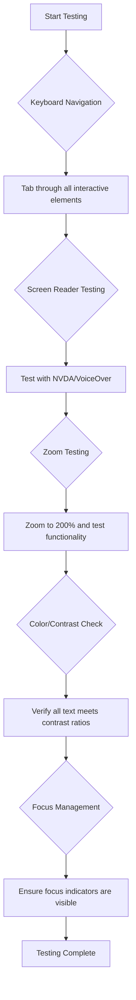
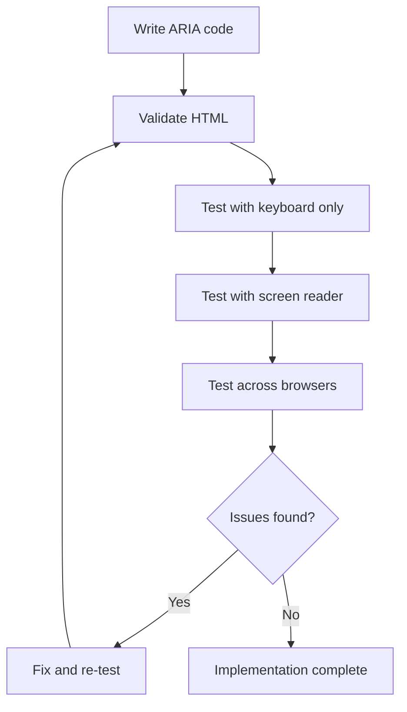

<!--
CO_OP_TRANSLATOR_METADATA:
{
  "original_hash": "90b19cde5b79b29e91babd3138cd8035",
  "translation_date": "2025-10-24T21:26:12+00:00",
  "source_file": "1-getting-started-lessons/3-accessibility/README.md",
  "language_code": "sk"
}
-->
# Tvorba prístupných webových stránok


> Sketchnote od [Tomomi Imura](https://twitter.com/girlie_mac)

## Kvíz pred prednáškou
[Kvíz pred prednáškou](https://ff-quizzes.netlify.app/web/)

> Sila webu spočíva v jeho univerzálnosti. Prístup pre každého, bez ohľadu na postihnutie, je nevyhnutný aspekt.
>
> \- Sir Timothy Berners-Lee, riaditeľ W3C a vynálezca World Wide Webu

Tu je niečo, čo vás môže prekvapiť: keď vytvárate prístupné webové stránky, nepomáhate len ľuďom s postihnutím – vlastne robíte web lepším pre všetkých!

Všimli ste si niekedy tie znížené obrubníky na rohoch ulíc? Pôvodne boli navrhnuté pre invalidné vozíky, ale teraz pomáhajú ľuďom s kočíkmi, pracovníkom doručovacích služieb s vozíkmi, cestujúcim s kuframi na kolieskach a cyklistom tiež. Presne tak funguje prístupný webový dizajn – riešenia, ktoré pomáhajú jednej skupine, často nakoniec prospievajú všetkým. Celkom zaujímavé, však?

V tejto lekcii preskúmame, ako vytvárať webové stránky, ktoré skutočne fungujú pre každého, bez ohľadu na to, ako prehliadajú web. Objavíte praktické techniky, ktoré sú už zabudované do webových štandardov, vyskúšate si testovacie nástroje a uvidíte, ako prístupnosť zlepšuje použiteľnosť vašich stránok pre všetkých používateľov.

Na konci tejto lekcie budete mať istotu, že prístupnosť sa stane prirodzenou súčasťou vášho vývojového procesu. Pripravení preskúmať, ako premyslené dizajnové rozhodnutia môžu otvoriť web miliardám používateľov? Poďme na to!

> Túto lekciu si môžete prejsť na [Microsoft Learn](https://docs.microsoft.com/learn/modules/web-development-101/accessibility/?WT.mc_id=academic-77807-sagibbon)!

## Pochopenie asistenčných technológií

Skôr než sa pustíme do kódovania, venujme chvíľu tomu, aby sme pochopili, ako ľudia s rôznymi schopnosťami skutočne zažívajú web. Toto nie je len teória – pochopenie týchto reálnych navigačných vzorcov z vás urobí oveľa lepšieho vývojára!

Asistenčné technológie sú úžasné nástroje, ktoré pomáhajú ľuďom s postihnutím interagovať s webovými stránkami spôsobmi, ktoré vás môžu prekvapiť. Keď pochopíte, ako tieto technológie fungujú, vytváranie prístupných webových zážitkov sa stane oveľa intuitívnejším. Je to ako naučiť sa vidieť svoj kód očami niekoho iného.

### Čítačky obrazovky

[Čítačky obrazovky](https://en.wikipedia.org/wiki/Screen_reader) sú pomerne sofistikované technológie, ktoré prevádzajú digitálny text na hlasový alebo braillový výstup. Hoci ich primárne používajú ľudia so zrakovým postihnutím, sú tiež veľmi užitočné pre používateľov s poruchami učenia, ako je dyslexia.

Rád si predstavujem čítačku obrazovky ako veľmi inteligentného rozprávača, ktorý vám číta knihu. Obsah číta nahlas v logickom poradí, oznamuje interaktívne prvky ako „tlačidlo“ alebo „odkaz“ a poskytuje klávesové skratky na pohyb po stránke. Ale tu je vec – čítačky obrazovky dokážu svoje kúzla len vtedy, ak vytvoríme webové stránky so správnou štruktúrou a zmysluplným obsahom. A to je vaša úloha ako vývojára!

**Populárne čítačky obrazovky na rôznych platformách:**
- **Windows**: [NVDA](https://www.nvaccess.org/about-nvda/) (bezplatná a najpopulárnejšia), [JAWS](https://webaim.org/articles/jaws/), [Narrator](https://support.microsoft.com/windows/complete-guide-to-narrator-e4397a0d-ef4f-b386-d8ae-c172f109bdb1/?WT.mc_id=academic-77807-sagibbon) (zabudovaná)
- **macOS/iOS**: [VoiceOver](https://support.apple.com/guide/voiceover/welcome/10) (zabudovaná a veľmi schopná)
- **Android**: [TalkBack](https://support.google.com/accessibility/android/answer/6283677) (zabudovaná)
- **Linux**: [Orca](https://wiki.gnome.org/Projects/Orca) (bezplatná a open-source)

**Ako čítačky obrazovky navigujú webový obsah:**

Čítačky obrazovky poskytujú rôzne metódy navigácie, ktoré umožňujú efektívne prehliadanie skúseným používateľom:
- **Sekvenčné čítanie**: Číta obsah odhora nadol, ako pri čítaní knihy
- **Navigácia podľa orientačných bodov**: Preskakovanie medzi sekciami stránky (hlavička, navigácia, hlavná časť, päta)
- **Navigácia podľa nadpisov**: Preskakovanie medzi nadpismi na pochopenie štruktúry stránky
- **Zoznam odkazov**: Generovanie zoznamu všetkých odkazov pre rýchly prístup
- **Ovládacie prvky formulára**: Priama navigácia medzi vstupnými poliami a tlačidlami

> 💡 **Tu je niečo, čo ma ohromilo**: 68 % používateľov čítačiek obrazovky naviguje primárne podľa nadpisov ([WebAIM Survey](https://webaim.org/projects/screenreadersurvey9/#finding)). To znamená, že vaša štruktúra nadpisov je ako mapa pre používateľov – keď ju nastavíte správne, doslova pomáhate ľuďom rýchlejšie sa orientovať vo vašom obsahu!

### Budovanie vášho testovacieho pracovného postupu

Tu je dobrá správa – efektívne testovanie prístupnosti nemusí byť ohromujúce! Budete chcieť kombinovať automatizované nástroje (sú fantastické na zachytenie zrejmých problémov) s niektorými manuálnymi testami. Tu je systematický prístup, ktorý podľa mňa zachytí väčšinu problémov bez toho, aby vám zabral celý deň:

**Základný manuálny testovací pracovný postup:**



**Kontrolný zoznam krokov testovania:**
1. **Navigácia pomocou klávesnice**: Používajte iba klávesy Tab, Shift+Tab, Enter, Space a šípky
2. **Testovanie čítačky obrazovky**: Aktivujte NVDA, VoiceOver alebo Narrator a navigujte so zatvorenými očami
3. **Testovanie priblíženia**: Testujte pri úrovniach priblíženia 200 % a 400 %
4. **Overenie kontrastu farieb**: Skontrolujte všetok text a komponenty UI
5. **Testovanie indikátora zamerania**: Uistite sa, že všetky interaktívne prvky majú viditeľné stavy zamerania

✅ **Začnite s Lighthouse**: Otvorte DevTools vo vašom prehliadači, spustite audit prístupnosti Lighthouse a potom použite výsledky na zameranie sa na oblasti manuálneho testovania.

### Nástroje na priblíženie a zväčšenie

Viete, ako si niekedy priblížite text na telefóne, keď je príliš malý, alebo žmúrite na obrazovku notebooku na jasnom slnku? Mnoho používateľov sa spolieha na nástroje na zväčšenie, aby si mohli každý deň čítať obsah. To zahŕňa ľudí so slabým zrakom, starších dospelých a každého, kto sa niekedy pokúsil čítať webovú stránku vonku.

Moderné technológie priblíženia sa vyvinuli nad rámec jednoduchého zväčšovania. Pochopenie toho, ako tieto nástroje fungujú, vám pomôže vytvárať responzívne dizajny, ktoré zostanú funkčné a atraktívne na akejkoľvek úrovni priblíženia.

**Moderné schopnosti priblíženia v prehliadačoch:**
- **Priblíženie stránky**: Proporcionálne zväčšuje všetok obsah (text, obrázky, rozloženie) – toto je preferovaná metóda
- **Priblíženie iba textu**: Zväčšuje veľkosť písma pri zachovaní pôvodného rozloženia
- **Priblíženie pomocou gest**: Podpora mobilných gest na dočasné zväčšenie
- **Podpora prehliadačov**: Všetky moderné prehliadače podporujú priblíženie až do 500 % bez narušenia funkčnosti

**Špecializovaný softvér na zväčšenie:**
- **Windows**: [Magnifier](https://support.microsoft.com/windows/use-magnifier-to-make-things-on-the-screen-easier-to-see-414948ba-8b1c-d3bd-8615-0e5e32204198) (zabudovaný), [ZoomText](https://www.freedomscientific.com/training/zoomtext/getting-started/)
- **macOS/iOS**: [Zoom](https://www.apple.com/accessibility/mac/vision/) (zabudovaný s pokročilými funkciami)

> ⚠️ **Dizajnové odporúčanie**: WCAG vyžaduje, aby obsah zostal funkčný pri priblížení na 200 %. Na tejto úrovni by horizontálne posúvanie malo byť minimálne a všetky interaktívne prvky by mali zostať prístupné.

✅ **Otestujte svoj responzívny dizajn**: Priblížte svoj prehliadač na 200 % a 400 %. Prispôsobí sa vaše rozloženie elegantne? Môžete stále pristupovať ku všetkým funkciám bez nadmerného posúvania?

## Moderné nástroje na testovanie prístupnosti

Teraz, keď rozumiete tomu, ako ľudia navigujú web pomocou asistenčných technológií, preskúmajme nástroje, ktoré vám pomôžu vytvárať a testovať prístupné webové stránky.

Predstavte si to takto: automatizované nástroje sú skvelé na zachytenie zrejmých problémov (ako chýbajúci alt text), zatiaľ čo manuálne testovanie vám pomáha zabezpečiť, že vaša stránka je v reálnom svete príjemná na používanie. Spoločne vám dávajú istotu, že vaše stránky fungujú pre každého.

### Testovanie kontrastu farieb

Tu je dobrá správa: kontrast farieb je jedným z najbežnejších problémov prístupnosti, ale zároveň jedným z najjednoduchších na opravu. Dobrý kontrast prospieva všetkým – od používateľov so zrakovým postihnutím až po ľudí, ktorí sa snažia čítať svoje telefóny na pláži.

**Požiadavky WCAG na kontrast:**

| Typ textu | WCAG AA (minimálne) | WCAG AAA (vylepšené) |
|-----------|---------------------|----------------------|
| **Normálny text** (do 18pt) | pomer kontrastu 4,5:1 | pomer kontrastu 7:1 |
| **Veľký text** (18pt+ alebo 14pt+ tučné) | pomer kontrastu 3:1 | pomer kontrastu 4,5:1 |
| **Komponenty UI** (tlačidlá, okraje formulárov) | pomer kontrastu 3:1 | pomer kontrastu 3:1 |

**Základné testovacie nástroje:**
- [Colour Contrast Analyser](https://www.tpgi.com/color-contrast-checker/) - Desktopová aplikácia s výberom farieb
- [WebAIM Contrast Checker](https://webaim.org/resources/contrastchecker/) - Webová aplikácia s okamžitou spätnou väzbou
- [Stark](https://www.getstark.co/) - Plugin pre dizajnové nástroje ako Figma, Sketch, Adobe XD
- [Accessible Colors](https://accessible-colors.com/) - Nájdite prístupné farebné palety

✅ **Vytvorte lepšie farebné palety**: Začnite s farbami vašej značky a použite nástroje na kontrolu kontrastu na vytvorenie prístupných variácií. Dokumentujte ich ako súčasť vášho dizajnového systému prístupných farebných tokenov.

### Komplexné audity prístupnosti

Najefektívnejšie testovanie prístupnosti kombinuje viacero prístupov. Žiadny jednotlivý nástroj nezachytí všetko, takže vytvorenie testovacej rutiny s rôznymi metódami zabezpečí dôkladné pokrytie.

**Testovanie v prehliadači (zabudované v DevTools):**
- **Chrome/Edge**: Audit prístupnosti Lighthouse + panel prístupnosti
- **Firefox**: Inšpektor prístupnosti s podrobným stromovým zobrazením
- **Safari**: Záložka Audit v Web Inspector s simuláciou VoiceOver

**Profesionálne testovacie rozšírenia:**
- [axe DevTools](https://www.deque.com/axe/devtools/) - Priemyselný štandard pre automatizované testovanie
- [WAVE](https://wave.webaim.org/extension/) - Vizualizácia s vyznačením chýb
- [Accessibility Insights](https://accessibilityinsights.io/) - Komplexný testovací balík od Microsoftu

**Testovanie cez príkazový riadok a integrácia CI/CD:**
- [axe-core](https://github.com/dequelabs/axe-core) - JavaScriptová knižnica pre automatizované testovanie
- [Pa11y](https://pa11y.org/) - Nástroj na testovanie prístupnosti cez príkazový riadok
- [Lighthouse CI](https://github.com/GoogleChrome/lighthouse-ci) - Automatizované hodnotenie prístupnosti

> 🎯 **Cieľ testovania**: Snažte sa dosiahnuť skóre prístupnosti Lighthouse 95+ ako základ. Pamätajte, že automatizované nástroje zachytia iba približne 30-40 % problémov s prístupnosťou – manuálne testovanie je stále nevyhnutné!

## Budovanie prístupnosti od základov

Kľúčom k úspechu v prístupnosti je začať ju budovať od prvého dňa. Viem, že je lákavé myslieť si „pridám prístupnosť neskôr“, ale to je ako snažiť sa pridať rampu k domu, keď je už postavený. Možné? Áno. Jednoduché? Ani nie.

Predstavte si prístupnosť ako plánovanie domu – oveľa jednoduchšie je zahrnúť prístupnosť pre invalidné vozíky do vašich počiatočných architektonických plánov, než všetko neskôr prerábať.

### Princípy POUR: Základ vašej prístupnosti

Smernice Web Content Accessibility Guidelines (WCAG) sú postavené na štyroch základných princípoch, ktoré tvoria skratku POUR. Nebojte sa – nejde o nudné akademické koncepty! Sú to praktické pokyny na vytváranie obsahu, ktorý funguje pre každého.

Keď pochopíte princípy POUR, rozhodovanie o prístupnosti sa stane oveľa intuitívnejším. Je to ako mať mentálny kontrolný zoznam, ktorý vás vedie pri vašich dizajnových rozhodnutiach. Poďme si to rozobrať:

**🔍 Vnímateľné**: Informácie musia byť prezentované spôsobmi, ktoré používatelia dokážu vnímať prostredníctvom dostupných zmyslov

- Poskytnite textové alternatívy pre netextový obsah (obrázky, videá, audio)
- Zabezpečte dostatočný kontrast farieb pre všetok text a komponenty UI
- Ponúknite titulky a prepisy pre multimediálny obsah
- Navrhnite obsah, ktorý zostane funkčný pri zväčšení až na 200 %
- Používajte viacero senzorických charakteristík (nielen farbu) na vyjadrenie informácií

**🎮 Ovládateľné**: Všetky komponenty rozhrania musia byť ovládateľné dostupnými vstupnými metódami

- Zabezpečte prístupnosť všetkých funkcií prostredníctvom navigácie klávesnicou
- Poskytnite použív
Farba je silný nástroj na komunikáciu, ale nikdy by nemala byť jediným spôsobom, ako sprostredkujete dôležité informácie. Navrhovanie nad rámec farby vytvára robustnejšie a inkluzívnejšie zážitky, ktoré fungujú v rôznych situáciách.

**Navrhovanie pre rozdiely vo vnímaní farieb:**

Približne 8 % mužov a 0,5 % žien má nejakú formu rozdielu vo vnímaní farieb (často nazývané "farbosleposť"). Najbežnejšie typy sú:
- **Deuteranopia**: Ťažkosti s rozlišovaním červenej a zelenej
- **Protanopia**: Červená sa javí ako tmavšia
- **Tritanopia**: Ťažkosti s modrou a žltou (zriedkavé)

**Inkluzívne stratégie pre farby:**

```css
/* ❌ Bad: Using only color to indicate status */
.error { color: red; }
.success { color: green; }

/* ✅ Good: Color plus icons and context */
.error {
  color: #d32f2f;
  border-left: 4px solid #d32f2f;
}
.error::before {
  content: "⚠️";
  margin-right: 8px;
}

.success {
  color: #2e7d32;
  border-left: 4px solid #2e7d32;
}
.success::before {
  content: "✅";
  margin-right: 8px;
}
```

**Nad rámec základných požiadaviek na kontrast:**
- Testujte svoje farebné voľby pomocou simulátorov farbosleposti
- Používajte vzory, textúry alebo tvary spolu s farebným kódovaním
- Zabezpečte, aby interaktívne stavy zostali rozlíšiteľné aj bez farby
- Zvážte, ako váš dizajn vyzerá v režime vysokého kontrastu

✅ **Testujte prístupnosť farieb**: Použite nástroje ako [Coblis](https://www.color-blindness.com/coblis-color-blindness-simulator/), aby ste videli, ako sa váš web zobrazuje používateľom s rôznymi typmi vnímania farieb.

### Indikátory zamerania a interakčný dizajn

Indikátory zamerania sú digitálnym ekvivalentom kurzora – ukazujú používateľom klávesnice, kde sa nachádzajú na stránke. Dobre navrhnuté indikátory zamerania zlepšujú zážitok pre všetkých tým, že robia interakcie jasnými a predvídateľnými.

**Moderné najlepšie praktiky pre indikátory zamerania:**

```css
/* Enhanced focus styles that work across browsers */
button:focus-visible {
  outline: 2px solid #0066cc;
  outline-offset: 2px;
  box-shadow: 0 0 0 4px rgba(0, 102, 204, 0.25);
}

/* Remove focus outline for mouse users, preserve for keyboard users */
button:focus:not(:focus-visible) {
  outline: none;
}

/* Focus-within for complex components */
.card:focus-within {
  box-shadow: 0 0 0 3px rgba(74, 144, 164, 0.5);
  border-color: #4A90A4;
}

/* Ensure focus indicators meet contrast requirements */
.custom-focus:focus-visible {
  outline: 3px solid #ffffff;
  outline-offset: 2px;
  box-shadow: 0 0 0 6px #000000;
}
```

**Požiadavky na indikátory zamerania:**
- **Viditeľnosť**: Musí mať minimálny kontrastný pomer 3:1 voči okolným prvkom
- **Šírka**: Minimálna hrúbka 2px okolo celého prvku
- **Trvácnosť**: Mal by zostať viditeľný, kým sa zameranie nepresunie inam
- **Rozlíšenie**: Musí byť vizuálne odlišný od ostatných stavov UI

> 💡 **Tip na dizajn**: Skvelé indikátory zamerania často kombinujú obrys, box-shadow a zmeny farby, aby zabezpečili viditeľnosť na rôznych pozadiach a v rôznych kontextoch.

✅ **Auditujte indikátory zamerania**: Prejdite si svoj web pomocou klávesy Tab a pozrite sa, ktoré prvky majú jasné indikátory zamerania. Sú niektoré ťažko viditeľné alebo úplne chýbajú?

### Semantické HTML: Základ prístupnosti

Semantické HTML je ako poskytnutie GPS systému asistenčným technológiám pre váš web. Keď používate správne HTML prvky na ich zamýšľaný účel, v podstate poskytujete čítačkám obrazovky, klávesniciam a ďalším nástrojom podrobnú mapu, ktorá pomáha používateľom efektívne navigovať.

Tu je analógia, ktorá mi naozaj pomohla pochopiť: semantické HTML je rozdiel medzi dobre organizovanou knižnicou s jasnými kategóriami a užitočnými značkami oproti skladu, kde sú knihy roztrúsené náhodne. Obe miesta majú rovnaké knihy, ale v ktorom by ste radšej niečo hľadali? Presne tak!

**Stavebné bloky prístupnej štruktúry stránky:**

```html
<!-- Landmark elements provide page navigation structure -->
<header>
  <h1>Your Site Name</h1>
  <nav aria-label="Main navigation">
    <ul>
      <li><a href="/home">Home</a></li>
      <li><a href="/about">About</a></li>
      <li><a href="/services">Services</a></li>
    </ul>
  </nav>
</header>

<main>
  <article>
    <header>
      <h1>Article Title</h1>
      <p>Published on <time datetime="2024-10-14">October 14, 2024</time></p>
    </header>
    
    <section>
      <h2>First Section</h2>
      <p>Content that relates to this section...</p>
    </section>
    
    <section>
      <h2>Second Section</h2>
      <p>More related content...</p>
    </section>
  </article>
  
  <aside>
    <h2>Related Links</h2>
    <nav aria-label="Related articles">
      <ul>
        <li><a href="/related-1">First related article</a></li>
        <li><a href="/related-2">Second related article</a></li>
      </ul>
    </nav>
  </aside>
</main>

<footer>
  <p>&copy; 2024 Your Site Name. All rights reserved.</p>
  <nav aria-label="Footer links">
    <ul>
      <li><a href="/privacy">Privacy Policy</a></li>
      <li><a href="/contact">Contact Us</a></li>
    </ul>
  </nav>
</footer>
```

**Prečo semantické HTML transformuje prístupnosť:**

| Semantický prvok | Účel | Výhoda pre čítačky obrazovky |
|------------------|---------|----------------------|
| `<header>` | Hlavička stránky alebo sekcie | "Banner landmark" - rýchla navigácia na vrch |
| `<nav>` | Navigačné odkazy | "Navigation landmark" - zoznam navigačných sekcií |
| `<main>` | Primárny obsah stránky | "Main landmark" - preskočenie priamo na obsah |
| `<article>` | Samostatný obsah | Oznamuje hranice článku |
| `<section>` | Tematické skupiny obsahu | Poskytuje štruktúru obsahu |
| `<aside>` | Súvisiaci obsah na bočnom paneli | "Complementary landmark" |
| `<footer>` | Päta stránky alebo sekcie | "Contentinfo landmark" |

**Super schopnosti čítačiek obrazovky so semantickým HTML:**
- **Navigácia podľa landmarkov**: Okamžité preskočenie medzi hlavnými sekciami stránky
- **Obrysy nadpisov**: Generovanie obsahu z vašej štruktúry nadpisov
- **Zoznamy prvkov**: Vytváranie zoznamov všetkých odkazov, tlačidiel alebo ovládacích prvkov formulára
- **Pochopenie kontextu**: Porozumenie vzťahom medzi sekciami obsahu

> 🎯 **Rýchly test**: Skúste navigovať svoj web pomocou čítačky obrazovky pomocou skratiek pre landmarky (D pre landmark, H pre nadpis, K pre odkaz v NVDA/JAWS). Má navigácia zmysel?

✅ **Auditujte svoju semantickú štruktúru**: Použite panel prístupnosti vo vašom prehliadači DevTools na zobrazenie stromu prístupnosti a uistite sa, že vaše značkovanie vytvára logickú štruktúru.

### Hierarchia nadpisov: Vytvorenie logického obrysu obsahu

Nadpisy sú absolútne kľúčové pre prístupný obsah – sú ako chrbtica, ktorá drží všetko pohromade. Používatelia čítačiek obrazovky sa silno spoliehajú na nadpisy, aby pochopili a navigovali váš obsah. Je to ako poskytnúť obsah stránky vo forme tabuľky.

**Zlaté pravidlo pre nadpisy:**
Nikdy nepreskakujte úrovne. Vždy postupujte logicky od `<h1>` k `<h2>` k `<h3>` a tak ďalej. Pamätáte si, ako ste robili osnovy v škole? Je to presne ten istý princíp – nepreskočili by ste z "I. Hlavný bod" priamo na "C. Pod-pod-bod" bez "A. Pod-bodu" medzi tým, však?

**Príklad perfektnej štruktúry nadpisov:**

```html
<!-- ✅ Excellent: Logical, hierarchical progression -->
<main>
  <h1>Complete Guide to Web Accessibility</h1>
  
  <section>
    <h2>Understanding Screen Readers</h2>
    <p>Introduction to screen reader technology...</p>
    
    <h3>Popular Screen Reader Software</h3>
    <p>NVDA, JAWS, and VoiceOver comparison...</p>
    
    <h3>Testing with Screen Readers</h3>
    <p>Step-by-step testing instructions...</p>
  </section>
  
  <section>
    <h2>Color and Contrast Guidelines</h2>
    <p>Designing with sufficient contrast...</p>
    
    <h3>WCAG Contrast Requirements</h3>
    <p>Understanding the different contrast levels...</p>
    
    <h3>Testing Tools and Techniques</h3>
    <p>Tools for verifying contrast ratios...</p>
  </section>
</main>
```

```html
<!-- ❌ Problematic: Skipping levels, inconsistent structure -->
<h1>Page Title</h1>
<h3>Subsection</h3> <!-- Skipped h2 -->
<h2>This should come before h3</h2>
<h1>Another main heading?</h1> <!-- Multiple h1s -->
```

**Najlepšie praktiky pre nadpisy:**
- **Jeden `<h1>` na stránku**: Typicky váš hlavný názov stránky alebo hlavný nadpis obsahu
- **Logický postup**: Nikdy nepreskakujte úrovne (h1 → h2 → h3, nie h1 → h3)
- **Popisný obsah**: Urobte nadpisy zmysluplné, aj keď sú čítané mimo kontextu
- **Vizuálne štýlovanie pomocou CSS**: Používajte CSS na vzhľad, HTML úrovne na štruktúru

**Štatistiky navigácie čítačiek obrazovky:**
- 68 % používateľov čítačiek obrazovky naviguje podľa nadpisov ([WebAIM Survey](https://webaim.org/projects/screenreadersurvey9/#finding))
- Používatelia očakávajú logický obrys nadpisov
- Nadpisy poskytujú najrýchlejší spôsob, ako pochopiť štruktúru stránky

> 💡 **Profesionálny tip**: Použite rozšírenia prehliadača ako "HeadingsMap" na vizualizáciu štruktúry nadpisov. Mala by sa čítať ako dobre organizovaná tabuľka obsahu.

✅ **Testujte svoju štruktúru nadpisov**: Použite navigáciu nadpisov čítačky obrazovky (klávesa H v NVDA) na preskakovanie medzi nadpismi. Hovorí postup logicky príbeh vášho obsahu?

### Pokročilé techniky vizuálnej prístupnosti

Nad rámec základov kontrastu a farby existujú sofistikované techniky, ktoré pomáhajú vytvárať skutočne inkluzívne vizuálne zážitky. Tieto metódy zabezpečujú, že váš obsah funguje v rôznych podmienkach zobrazenia a s asistenčnými technológiami.

**Základné stratégie vizuálnej komunikácie:**

- **Multimodálna spätná väzba**: Kombinujte vizuálne, textové a niekedy aj zvukové podnety
- **Postupné odhaľovanie**: Predstavte informácie v stráviteľných častiach
- **Konzistentné interakčné vzory**: Používajte známe konvencie UI
- **Responzívna typografia**: Prispôsobte veľkosť textu na rôznych zariadeniach
- **Stavy načítania a chýb**: Poskytnite jasnú spätnú väzbu pre všetky akcie používateľa

**CSS nástroje na zlepšenie prístupnosti:**

```css
/* Screen reader only text - visually hidden but accessible */
.sr-only {
  position: absolute;
  width: 1px;
  height: 1px;
  padding: 0;
  margin: -1px;
  overflow: hidden;
  clip: rect(0, 0, 0, 0);
  white-space: nowrap;
  border: 0;
}

/* Skip link for keyboard navigation */
.skip-link {
  position: absolute;
  top: -40px;
  left: 6px;
  background: #000000;
  color: #ffffff;
  padding: 8px 16px;
  text-decoration: none;
  border-radius: 4px;
  font-weight: bold;
  transition: top 0.3s ease;
  z-index: 1000;
}

.skip-link:focus {
  top: 6px;
}

/* Reduced motion respect */
@media (prefers-reduced-motion: reduce) {
  .skip-link {
    transition: none;
  }
  
  * {
    animation-duration: 0.01ms !important;
    animation-iteration-count: 1 !important;
    transition-duration: 0.01ms !important;
  }
}

/* High contrast mode support */
@media (prefers-contrast: high) {
  .button {
    border: 2px solid;
  }
}
```

> 🎯 **Prístupový vzor**: "Skip link" je nevyhnutný pre používateľov klávesnice. Mal by byť prvým zaostriteľným prvkom na vašej stránke a preskočiť priamo na hlavnú oblasť obsahu.

✅ **Implementujte preskočenie navigácie**: Pridajte skip linky na svoje stránky a otestujte ich stlačením klávesy Tab hneď po načítaní stránky. Mali by sa zobraziť a umožniť vám preskočiť na hlavný obsah.

## Tvorba zmysluplného textu odkazov

Odkazy sú v podstate diaľnice webu, ale zle napísaný text odkazov je ako mať cestné značky, ktoré hovoria len "Miesto" namiesto "Centrum Chicaga". Nie veľmi užitočné, však?

Tu je niečo, čo ma naozaj prekvapilo, keď som sa to prvýkrát dozvedel: čítačky obrazovky dokážu extrahovať všetky odkazy zo stránky a zobraziť ich ako jeden veľký zoznam. Predstavte si, že vám niekto podá adresár všetkých odkazov na vašej stránke. Dával by každý z nich zmysel sám o sebe? To je test, ktorým musí váš text odkazov prejsť!

### Pochopenie navigačných vzorov odkazov

Čítačky obrazovky ponúkajú výkonné funkcie navigácie odkazov, ktoré sa spoliehajú na dobre napísaný text odkazov:

**Metódy navigácie odkazov:**
- **Sekvenčné čítanie**: Odkazy sú čítané v kontexte ako súčasť toku obsahu
- **Generovanie zoznamu odkazov**: Všetky odkazy na stránke sú zostavené do vyhľadateľného adresára
- **Rýchla navigácia**: Preskakovanie medzi odkazmi pomocou klávesových skratiek (K v NVDA)
- **Funkcia vyhľadávania**: Vyhľadávanie konkrétnych odkazov zadaním časti textu

**Prečo je kontext dôležitý:**
Keď používatelia čítačiek obrazovky generujú zoznam odkazov, vidia niečo takéto:
- "Stiahnuť správu"
- "Viac informácií"
- "Kliknite sem"
- "Zásady ochrany osobných údajov"
- "Kliknite sem"

Iba dva z týchto odkazov poskytujú užitočné informácie, keď sú čítané mimo kontextu!

> 📊 **Dopad na používateľa**: Používatelia čítačiek obrazovky prehľadávajú zoznamy odkazov, aby rýchlo pochopili obsah stránky. Všeobecný text odkazov ich núti vracať sa späť k okolitému kontextu každého odkazu, čo výrazne spomaľuje ich prehliadanie.

### Bežné chyby v texte odkazov, ktorým sa treba vyhnúť

Pochopenie toho, čo nefunguje, vám pomôže rozpoznať a opraviť problémy s prístupnosťou v existujúcom obsahu.

**❌ Všeobecný text odkazov, ktorý neposkytuje kontext:**

```html
<!-- Meaningless when read from a link list -->
<p>Our sustainability efforts are detailed in our recent report. 
   <a href="/sustainability-2024.pdf">Click here</a> to view it.</p>

<!-- Repeated generic text throughout the page -->
<div class="article-card">
  <h3>Web Accessibility Guide</h3>
  <p>Learn the fundamentals...</p>
  <a href="/accessibility-guide">Read more</a>
</div>
<div class="article-card">
  <h3>Color Contrast Tips</h3>
  <p>Improve your design...</p>
  <a href="/color-contrast">Read more</a>
</div>

<!-- URLs as link text (difficult for screen readers to announce) -->
<p>Visit https://www.w3.org/WAI/WCAG21/quickref/ for WCAG guidelines.</p>

<!-- Vague action words -->
<a href="/contact">Go</a> | <a href="/about">See</a> | <a href="/help">View</a>
```

**Prečo tieto vzory zlyhávajú:**
- **"Kliknite sem"** nehovorí používateľom nič o cieľovom mieste
- **"Viac informácií"** opakované viackrát spôsobuje zmätok
- **Surové URL adresy** sú pre čítačky obrazovky ťažko zrozumiteľné
- **Jednotlivé slová** ako "Choď" alebo "Pozri" nemajú popisný kontext

### Písanie vynikajúceho textu odkazov

Popisný text odkazov prospieva každému – používateľom s dobrým zrakom umožňuje rýchlo prehliadať odkazy a používateľom čítačiek obrazovky okamžite pochopiť cieľ.

**✅ Príklady jasného, popisného textu odkazov:**

```html
<!-- Descriptive text that explains the destination -->
<p>Our comprehensive <a href="/sustainability-2024.pdf">2024 sustainability report (PDF, 2.1MB)</a> details our environmental initiatives.</p>

<!-- Specific, unique link text for each card -->
<div class="article-card">
  <h3>Web Accessibility Guide</h3>
  <p>Learn the fundamentals of inclusive design...</p>
  <a href="/accessibility-guide">Read our complete web accessibility guide</a>
</div>
<div class="article-card">
  <h3>Color Contrast Tips</h3>
  <p>Improve your design with better color choices...</p>
  <a href="/color-contrast">Explore color contrast best practices</a>
</div>

<!-- Meaningful text instead of raw URLs -->
<p>The <a href="https://www.w3.org/WAI/WCAG21/quickref/">WCAG 2.1 Quick Reference guide</a> provides comprehensive accessibility guidelines.</p>

<!-- Descriptive action links -->
<a href="/contact">Contact our support team</a> | 
<a href="/about">About our company</a> | 
<a href="/help">Get help with your account</a>
```

**Najlepšie praktiky pre text odkazov:**
- **Buďte konkrétni**: "Stiahnuť štvrťročnú finančnú správu" vs. "Stiahnuť"
- **Uveďte typ a veľkosť súboru**: "(PDF, 1.2MB)" pre súbory na stiahnutie
- **Uveďte, či odkazy otvárajú externé stránky**: "(otvára sa v novom okne)" ak je to vhodné
- **Používajte aktívny jazyk**: "Kontaktujte nás" vs. "Stránka kontaktov"
- **Buďte struční**: Snažte sa o 2-8 slov, ak je to možné

### Pokročilé vzory prístupnosti odkazov

Niekedy vizuálne dizajnové obmedzenia alebo technické požiadavky vyžadujú špeciálne riešenia. Tu sú sofistikované techniky pre bežné náročné scenáre:

**Používanie ARIA pre rozšírený kontext:**

```html
<!-- When button text must be short but needs more context -->
<a href="/report.pdf" 
   aria-label="Download 2024 annual financial report, PDF format, 2.3MB">
  Download Report
</a>

<!-- When the full context comes from surrounding content -->
<h3 id="sustainability-heading">Sustainability Initiative</h3>
<p>Our efforts to reduce environmental impact...</p>
<a href="/sustainability-details" 
   aria-labelledby="sustainability-heading"
   aria-describedby="sustainability-summary">
  Learn more
</a>
<p id="sustainability-summary">Detailed breakdown of our 2024 environmental goals and achievements</p>
```

**Indikovanie typov súborov a externých cieľov:**

```html
<!-- Method 1: Include information in visible link text -->
<a href="/annual-report.pdf">
  Download our 2024 annual report (PDF, 2.3MB)
</a>

<!-- Method 2: Use screen reader-only text for file details -->
<a href="/annual-report.pdf">
  Download our 2024 annual report
  <span class="sr-only">(PDF format, 2.3MB)</span>
</a>

<!-- Method 3: External link indication -->
<a href="https://example.com" 
   target="_blank" 
   aria-describedby="external-link-warning">
  Visit external resource
</a>
<span id="external-link-warning" class="sr-only">
  (opens in new window)
</span>

<!-- Method 4: Using CSS for visual indicators -->
<a href="https://example.com" class="external-link">
  External resource
</a>
```

```css
/* Visual indicator for external links */
.external-link::after {
  content: " ↗";
  font-size: 0.8em;
  color: #666;
}

/* Screen reader announcement for external links */
.external-link::before {
  content: "External link: ";
  position: absolute;
  left: -10000px;
  width: 1px;
  height: 1px;
  overflow: hidden;
}
```

> ⚠️ **Dôležité**: Pri používaní `target="_blank"` vždy informujte používateľov, že odkaz sa otvára v novom okne alebo karte. Neočakávané zmeny navigácie môžu byť dezorientujúce.

✅ **Testujte kontext odkazov**: Použite vývojárske nástroje vášho prehliadača na generovanie zoznamu všetkých odkazov na vašej stránke. Rozumiete účelu každého odkazu bez akéhokoľvek okolitého kontextu?

## ARIA: Supernabíjanie prístupnosti HTML

[Accessible Rich Internet Applications (ARIA)](https://developer.mozilla.org/docs/Web/Accessibility/ARIA) je ako univerzálny prekladač medzi vašimi komplexnými webovými aplikáciami a asistenčnými technológiami. Keď samotné HTML nedokáže vyjadriť všetko, čo vaše interaktívne komponenty robia, ARIA prichádza na pomoc.

Rád si predstavujem ARIA ako pridávanie užitočných poznámok k vášmu HTML – niečo ako scénické pokyny v scenári, ktoré pomáhajú hercom pochopiť ich úlohy a vzťahy.

**Tu je najdôležitejšie pravidlo o ARIA**: Vždy používajte najskôr semantické HTML, potom pridajte ARIA na jeho vylepšenie. Myslite na ARIA ako na korenie, nie na hlavné jedlo. Malo by objasniť a vylepšiť vašu HTML štruktúru, nikdy ju nenahradiť. Najprv si správne nastavte základy!

### Strategická implementácia ARIA

ARIA je silná, ale s mocou prichádza zodpovednosť. Nesprávne použitie ARIA môže zhoršiť prístupnosť viac, než jej absencia. Tu je, kedy a ako ju efektívne používať:

**✅ Používajte ARIA, keď:**
- Vytvárate vlastné interaktívne widgety (akordeóny, záložky, karusely)
- Budujete dynamický obsah, ktorý sa mení bez opät
5. **Začnite jednoducho**: Komplexné implementácie ARIA majú väčšiu pravdepodobnosť chýb

**🔍 Testovací postup:**



**🚫 Bežné chyby pri používaní ARIA, ktorým sa treba vyhnúť:**

- **Protichodné informácie**: Nekontradikujte HTML semantiku
- **Príliš veľa označení**: Príliš veľa informácií ARIA môže používateľov zmiasť
- **Statická ARIA**: Zabudnutie na aktualizáciu stavov ARIA pri zmene obsahu
- **Netestované implementácie**: ARIA, ktorá funguje teoreticky, ale zlyháva v praxi
- **Chýbajúca podpora klávesnice**: Role ARIA bez zodpovedajúcich interakcií s klávesnicou

> 💡 **Testovacie zdroje**: Použite nástroje ako [accessibility-checker](https://www.npmjs.com/package/accessibility-checker) na automatizovanú validáciu ARIA, ale vždy testujte s reálnymi čítačkami obrazovky pre kompletný zážitok.

✅ **Učte sa od odborníkov**: Študujte [ARIA Authoring Practices Guide](https://w3c.github.io/aria-practices/) pre osvedčené vzory a implementácie komplexných interaktívnych widgetov.

## Sprístupnenie obrázkov a médií

Vizuálny a zvukový obsah sú neoddeliteľnou súčasťou moderných webových zážitkov, ale môžu vytvárať bariéry, ak nie sú implementované premyslene. Cieľom je zabezpečiť, aby informácie a emocionálny dopad vášho média dosiahli každého používateľa. Keď si na to zvyknete, stane sa to prirodzeným.

Rôzne typy médií vyžadujú rôzne prístupy k prístupnosti. Je to ako varenie—s jemnou rybou by ste nepracovali rovnako ako s výdatným steakom. Pochopenie týchto rozdielov vám pomôže vybrať správne riešenie pre každú situáciu.

### Strategická prístupnosť obrázkov

Každý obrázok na vašej webovej stránke má svoj účel. Pochopenie tohto účelu vám pomôže napísať lepší alternatívny text a vytvoriť inkluzívnejšie zážitky.

**Štyri typy obrázkov a ich stratégie pre alternatívny text:**

**Informatívne obrázky** - prenášajú dôležité informácie:
```html

```

**Dekoratívne obrázky** - čisto vizuálne bez informačnej hodnoty:
```html

```

**Funkčné obrázky** - slúžia ako tlačidlá alebo ovládacie prvky:
```html
<button>
  
</button>
```

**Komplexné obrázky** - grafy, diagramy, infografiky:
```html

<div id="chart-description">
  <p>Detailed description: Sales data shows a steady increase across all quarters...</p>
</div>
```

### Prístupnosť videa a zvuku

**Požiadavky na video:**
- **Titulky**: Textová verzia hovoreného obsahu a zvukových efektov
- **Zvukové popisy**: Naratív vizuálnych prvkov pre nevidiacich používateľov
- **Prepisy**: Kompletná textová verzia všetkého zvukového a vizuálneho obsahu

```html
<video controls>
  <source src="video.mp4" type="video/mp4">
  <track kind="captions" src="captions.vtt" srclang="en" label="English">
  <track kind="descriptions" src="descriptions.vtt" srclang="en" label="Audio descriptions">
</video>
```

**Požiadavky na zvuk:**
- **Prepisy**: Textová verzia všetkého hovoreného obsahu
- **Vizuálne indikátory**: Pre obsah iba so zvukom poskytnite vizuálne podnety

### Moderné techniky pre obrázky

**Použitie CSS pre dekoratívne obrázky:**
```css
.hero-section {
  background-image: url('decorative-hero.jpg');
  /* Decorative images in CSS don't need alt text */
}
```

**Responzívne obrázky s prístupnosťou:**
```html
<picture>
  <source media="(min-width: 800px)" srcset="large-chart.png">
  <source media="(min-width: 400px)" srcset="medium-chart.png">
  
</picture>
```

✅ **Testujte prístupnosť obrázkov**: Použite čítačku obrazovky na navigáciu po stránke s obrázkami. Dostávate dostatok informácií na pochopenie obsahu?

## Navigácia klávesnicou a správa zamerania

Mnoho používateľov naviguje po webe výlučne pomocou klávesnice. Patria sem ľudia s motorickými postihnutiami, pokročilí používatelia, ktorí považujú klávesnicu za rýchlejšiu ako myš, a ktokoľvek, komu prestala fungovať myš. Zabezpečenie, že vaša stránka dobre funguje s klávesnicovým vstupom, je nevyhnutné a často robí vašu stránku efektívnejšou pre všetkých.

### Základné vzory navigácie klávesnicou

**Štandardné interakcie klávesnice:**
- **Tab**: Posun zamerania dopredu cez interaktívne prvky
- **Shift + Tab**: Posun zamerania dozadu
- **Enter**: Aktivácia tlačidiel a odkazov
- **Space**: Aktivácia tlačidiel, zaškrtnutie políčok
- **Šípky**: Navigácia v skupinách komponentov (rádiové tlačidlá, menu)
- **Escape**: Zatvorenie modálov, rozbaľovacích ponúk alebo zrušenie operácií

### Najlepšie postupy správy zamerania

**Viditeľné indikátory zamerania:**
```css
/* Ensure focus is always visible */
button:focus-visible {
  outline: 2px solid #4A90A4;
  outline-offset: 2px;
}

/* Custom focus styles for different components */
.card:focus-within {
  box-shadow: 0 0 0 3px rgba(74, 144, 164, 0.5);
}
```

**Preskočenie odkazov pre efektívnu navigáciu:**
```html
<a href="#main-content" class="skip-link">Skip to main content</a>
<a href="#navigation" class="skip-link">Skip to navigation</a>

<nav id="navigation">
  <!-- navigation content -->
</nav>
<main id="main-content">
  <!-- main content -->
</main>
```

**Správne poradie záložiek:**
```html
<!-- Use semantic HTML for natural tab order -->
<form>
  <label for="name">Name:</label>
  <input type="text" id="name" tabindex="0">
  
  <label for="email">Email:</label>
  <input type="email" id="email" tabindex="0">
  
  <button type="submit" tabindex="0">Submit</button>
</form>
```

### Zachytenie zamerania v modáloch

Pri otváraní modálnych dialógov by malo byť zameranie zachytené v rámci modálu:

```javascript
// Modern focus trap implementation
function trapFocus(element) {
  const focusableElements = element.querySelectorAll(
    'button, [href], input, select, textarea, [tabindex]:not([tabindex="-1"])'
  );
  
  const firstElement = focusableElements[0];
  const lastElement = focusableElements[focusableElements.length - 1];

  element.addEventListener('keydown', (e) => {
    if (e.key === 'Tab') {
      if (e.shiftKey && document.activeElement === firstElement) {
        e.preventDefault();
        lastElement.focus();
      } else if (!e.shiftKey && document.activeElement === lastElement) {
        e.preventDefault();
        firstElement.focus();
      }
    }
    
    if (e.key === 'Escape') {
      closeModal();
    }
  });
  
  // Focus first element when modal opens
  firstElement.focus();
}
```

✅ **Testujte navigáciu klávesnicou**: Skúste navigovať po vašej webovej stránke iba pomocou klávesy Tab. Dostanete sa ku všetkým interaktívnym prvkom? Je poradie zamerania logické? Sú indikátory zamerania jasne viditeľné?

## Prístupnosť formulárov

Formuláre sú kľúčové pre interakciu používateľov a vyžadujú osobitnú pozornosť pri prístupnosti.

### Asociácia štítkov a ovládacích prvkov formulára

**Každý ovládací prvok formulára potrebuje štítok:**
```html
<!-- Explicit labeling (preferred) -->
<label for="username">Username:</label>
<input type="text" id="username" name="username" required>

<!-- Implicit labeling -->
<label>
  Password:
  <input type="password" name="password" required>
</label>

<!-- Using aria-label when visual label isn't desired -->
<input type="search" aria-label="Search products" placeholder="Search...">
```

### Riešenie chýb a validácia

**Prístupné chybové správy:**
```html
<label for="email">Email Address:</label>
<input type="email" id="email" name="email" 
       aria-describedby="email-error" 
       aria-invalid="true" required>
<div id="email-error" role="alert">
  Please enter a valid email address
</div>
```

**Najlepšie postupy validácie formulára:**
- Použite `aria-invalid` na označenie neplatných polí
- Poskytnite jasné, konkrétne chybové správy
- Použite `role="alert"` na dôležité oznámenia o chybách
- Zobrazte chyby okamžite aj pri odoslaní formulára

### Fieldsety a zoskupovanie

**Zoskupte súvisiace ovládacie prvky formulára:**
```html
<fieldset>
  <legend>Shipping Address</legend>
  <label for="street">Street Address:</label>
  <input type="text" id="street" name="street">
  
  <label for="city">City:</label>
  <input type="text" id="city" name="city">
</fieldset>

<fieldset>
  <legend>Preferred Contact Method</legend>
  <input type="radio" id="contact-email" name="contact" value="email">
  <label for="contact-email">Email</label>
  
  <input type="radio" id="contact-phone" name="contact" value="phone">
  <label for="contact-phone">Phone</label>
</fieldset>
```

## Vaša cesta k prístupnosti: Hlavné poznatky

Gratulujeme! Práve ste získali základné znalosti na vytváranie skutočne inkluzívnych webových zážitkov. To je naozaj vzrušujúce! Webová prístupnosť nie je len o splnení požiadaviek—je to o uznaní rôznych spôsobov, akými ľudia interagujú s digitálnym obsahom, a o navrhovaní pre túto úžasnú rozmanitosť.

Teraz ste súčasťou rastúcej komunity vývojárov, ktorí chápu, že skvelý dizajn funguje pre každého. Vitajte v klube!

**🎯 Vaša sada nástrojov pre prístupnosť teraz zahŕňa:**

| Základný princíp | Implementácia | Dopad |
|------------------|---------------|-------|
| **Základy semantického HTML** | Používajte správne HTML prvky na ich určený účel | Čítačky obrazovky môžu efektívne navigovať, klávesnice fungujú automaticky |
| **Inkluzívny vizuálny dizajn** | Dostatočný kontrast, zmysluplné použitie farieb, viditeľné indikátory zamerania | Jasné pre každého v akýchkoľvek svetelných podmienkach |
| **Opisný obsah** | Zmysluplný text odkazov, alternatívny text, nadpisy | Používatelia rozumejú obsahu bez vizuálneho kontextu |
| **Prístupnosť klávesnice** | Poradie záložiek, klávesové skratky, správa zamerania | Motorická prístupnosť a efektivita pre pokročilých používateľov |
| **Vylepšenie ARIA** | Strategické použitie na vyplnenie semantických medzier | Komplexné aplikácie fungujú s asistenčnými technológiami |
| **Komplexné testovanie** | Automatizované nástroje + manuálne overenie + testovanie reálnymi používateľmi | Odhalenie problémov predtým, než ovplyvnia používateľov |

**🚀 Vaše ďalšie kroky:**

1. **Zahrňte prístupnosť do svojho pracovného procesu**: Urobte z testovania prirodzenú súčasť vášho vývojového procesu
2. **Učte sa od reálnych používateľov**: Vyhľadávajte spätnú väzbu od ľudí, ktorí používajú asistenčné technológie
3. **Buďte aktuálni**: Techniky prístupnosti sa vyvíjajú s novými technológiami a štandardmi
4. **Obhajujte inklúziu**: Zdieľajte svoje znalosti a urobte z prístupnosti prioritu tímu

> 💡 **Pamätajte**: Obmedzenia prístupnosti často vedú k inovatívnym, elegantným riešeniam, ktoré prospievajú všetkým. Znížené obrubníky, titulky a hlasové ovládanie začali ako funkcie prístupnosti a stali sa bežnými vylepšeniami.

**Obchodný prípad je úplne jasný**: Prístupné webové stránky oslovujú viac používateľov, majú lepšie hodnotenie vo vyhľadávačoch, nižšie náklady na údržbu a vyhýbajú sa právnym rizikám. Ale úprimne? Skutočný dôvod, prečo sa starať o prístupnosť, je oveľa hlbší. Prístupné webové stránky stelesňujú najlepšie hodnoty webu—otvorenosť, inkluzivitu a myšlienku, že každý si zaslúži rovnaký prístup k informáciám.

Teraz ste pripravení budovať inkluzívny web budúcnosti. Každá prístupná stránka, ktorú vytvoríte, robí internet prívetivejším miestom pre všetkých. To je naozaj úžasné, keď sa nad tým zamyslíte!

## Ďalšie zdroje

Pokračujte vo svojej ceste učenia sa o prístupnosti s týmito základnými zdrojmi:

**📚 Oficiálne štandardy a smernice:**
- [WCAG 2.1 Guidelines](https://www.w3.org/WAI/WCAG21/quickref/) - Oficiálny štandard prístupnosti s rýchlym odkazom
- [ARIA Authoring Practices Guide](https://w3c.github.io/aria-practices/) - Komplexné vzory pre interaktívne widgety
- [WebAIM Guidelines](https://webaim.org/) - Praktické, jednoduché pokyny pre prístupnosť

**🛠️ Nástroje a testovacie zdroje:**
- [axe DevTools](https://www.deque.com/axe/devtools/) - Priemyselný štandard pre testovanie prístupnosti
- [A11y Project Checklist](https://www.a11yproject.com/checklist/) - Krok za krokom overenie prístupnosti
- [Accessibility Insights](https://accessibilityinsights.io/) - Komplexná testovacia sada od Microsoftu
- [Color Oracle](https://colororacle.org/) - Simulátor farbosleposti pre testovanie dizajnu

**🎓 Učenie a komunita:**
- [WebAIM Screen Reader Survey](https://webaim.org/projects/screenreadersurvey9/) - Preferencie a správanie reálnych používateľov
- [Inclusive Components](https://inclusive-components.design/) - Moderné vzory prístupných komponentov
- [A11y Coffee](https://a11y.coffee/) - Rýchle tipy a poznatky o prístupnosti
- [Web Accessibility Initiative (WAI)](https://www.w3.org/WAI/) - Komplexné zdroje prístupnosti od W3C

**🎥 Praktické učenie:**
- [Accessibility Developer Guide](https://www.accessibility-developer-guide.com/) - Praktické pokyny na implementáciu
- [Deque University](https://dequeuniversity.com/) - Profesionálne kurzy prístupnosti

## GitHub Copilot Agent Challenge 🚀

Použite režim Agent na splnenie nasledujúcej výzvy:

**Popis:** Vytvorte prístupnú komponentu modálneho dialógu, ktorá demonštruje správnu správu zamerania, atribúty ARIA a vzory navigácie klávesnicou.

**Výzva:** Vytvorte kompletnú komponentu modálneho dialógu s HTML, CSS a JavaScriptom, ktorá zahŕňa: správne zachytenie zamerania, klávesu ESC na zatvorenie, kliknutie mimo na zatvorenie, atribúty ARIA pre čítačky obrazovky a viditeľné indikátory zamerania. Modál by mal obsahovať formulár so správnymi štítkami a riešením chýb. Zabezpečte, aby komponent spĺňal štandardy WCAG 2.1 AA.

## 🚀 Výzva

Vezmite tento HTML a prepracujte ho tak, aby bol čo najprístupnejší, podľa stratégií, ktoré ste sa naučili.

```html
<!DOCTYPE html>
<html lang="en">
  <head>
    <meta charset="UTF-8">
    <meta name="viewport" content="width=device-width, initial-scale=1.0">
    <title>Turtle Ipsum - The World's Premier Turtle Fan Club</title>
    <link href='../assets/style.css' rel='stylesheet' type='text/css'>
  </head>
  <body>
    <header class="site-header">
      <h1 class="site-title">Turtle Ipsum</h1>
      <p class="site-subtitle">The World's Premier Turtle Fan Club</p>
    </header>
    
    <nav class="main-nav" aria-label="Main navigation">
      <h2 class="nav-header">Resources</h2>
      <ul class="nav-list">
        <li><a href="https://www.youtube.com/watch?v=CMNry4PE93Y">"I like turtles" video</a></li>
        <li><a href="https://en.wikipedia.org/wiki/Turtle">Basic turtle information</a></li>
        <li><a href="https://en.wikipedia.org/wiki/Turtles_(chocolate)">Chocolate turtles candy</a></li>
      </ul>
    </nav>
    
    <main class="main-content">
      <article>
        <h1>Welcome to Turtle Ipsum</h1>
        <p class="intro">
          <a href="/about">Learn more about our turtle community</a> and discover fascinating facts about these amazing creatures.
        </p>
        <p class="article-text">
          Turtle ipsum dolor sit amet, consectetur adipiscing elit, sed do eiusmod tempor incididunt ut labore et dolore magna aliqua. Ut enim ad minim veniam, quis nostrud exercitation ullamco laboris nisi ut aliquip ex ea commodo consequat. Duis aute irure dolor in reprehenderit in voluptate velit esse cillum dolore eu fugiat nulla pariatur. Excepteur sint occaecat cupidatat non proident, sunt in culpa qui officia deserunt mollit anim id est laborum.
        </p>
      </article>
    </main>
    
    <footer class="footer">
      <section class="newsletter-signup">
        <h2>Stay Updated</h2>
        <button type="button" onclick="showNewsletterForm()">Sign up for turtle news</button>
      </section>
      
      <nav class="footer-nav" aria-label="Footer navigation">
        <h2>Site Pages</h2>
        <ul>
          <li><a href="../">Home</a></li>
          <li><a href="../semantic">Semantic HTML example</a></li>
        </ul>
      </nav>
      
      <p class="footer-copyright">&copy; 2024 Instrument. All rights reserved.</p>
    </footer>
  </body>
</html>
```

**Hlavné vylepšenia:**
- Pridaná správna semantická štruktúra HTML
- Opravená hierarchia nadpisov (jediný h1, logická postupnosť)
- Pridaný zmysluplný text odkazov namiesto "kliknite sem"
- Zahrnuté správne ARIA štítky pre navigáciu
- Pridaný atribút lang a správne meta tagy
- Použitý prvok button pre interaktívne prvky
- Štruktúrovaný obsah päty s vhodnými orientačnými bodmi

## Kvíz po prednáške
[Kvíz po prednáške](https://ff-quizzes.netlify.app/web/en/)

## Prehľad a samostatné štúdium

Mnohé vlády majú zákony týkajúce sa požiadaviek na prístupnosť. Preštudujte si zákony o prístupnosti vo vašej domovskej krajine. Čo je pokryté a čo nie? Príkladom je [táto vládna webová stránka](https://accessibility.blog.gov.uk/).

## Zadanie
 
[Analyzujte neprístupnú webovú stránku](assignment.md)

Credits: [Turtle Ipsum](https://github.com/Instrument/semantic-html-sample) od Instrument

---

**Zrieknutie sa zodpovednosti**:  
Tento dokument bol preložený pomocou služby AI prekladu [Co-op Translator](https://github.com/Azure/co-op-translator). Hoci sa snažíme o presnosť, prosím, berte na vedomie, že automatizované preklady môžu obsahovať chyby alebo nepresnosti. Pôvodný dokument v jeho rodnom jazyku by mal byť považovaný za autoritatívny zdroj. Pre kritické informácie sa odporúča profesionálny ľudský preklad. Nenesieme zodpovednosť za akékoľvek nedorozumenia alebo nesprávne interpretácie vyplývajúce z použitia tohto prekladu.