# Vytváranie prístupných webstránok

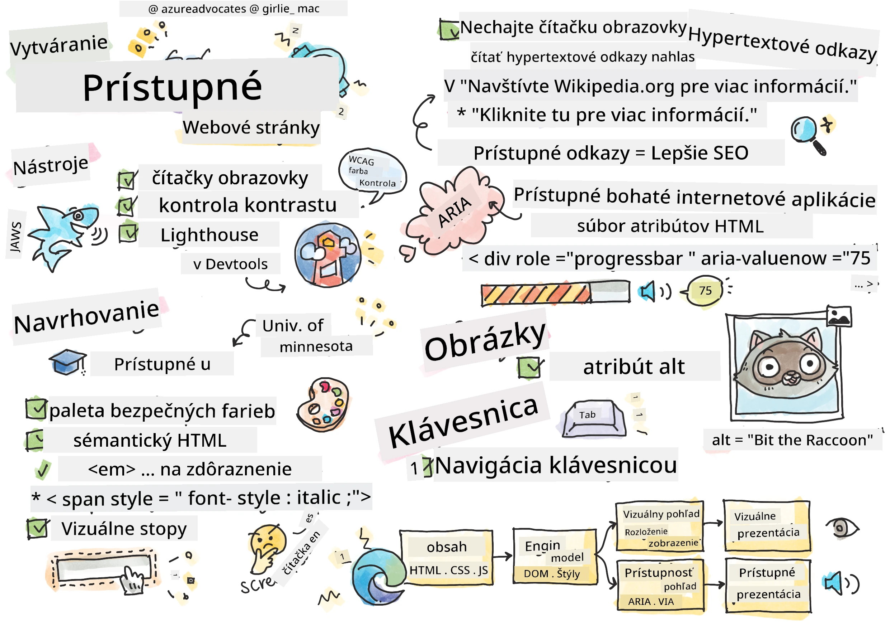
> Sketchnote od [Tomomi Imura](https://twitter.com/girlie_mac)

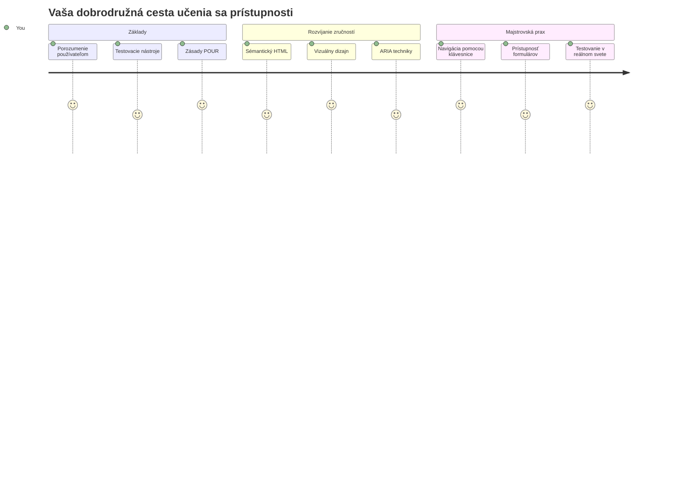
## Predprednáškový test
[Predprednáškový test](https://ff-quizzes.netlify.app/web/)

> Sila webu spočíva v jeho univerzálnosti. Prístup pre všetkých bez ohľadu na postihnutie je základným aspektom.
>
> \- Sir Timothy Berners-Lee, riaditeľ W3C a vynálezca World Wide Web

Tu je niečo, čo vás môže prekvapiť: keď vytvárate prístupné webové stránky, nie len pomáhate ľuďom s postihnutím — v skutočnosti robíte web lepším pre všetkých!

Všimli ste si niekedy tie znížené obrubníky na rohoch ulíc? Pôvodne boli navrhnuté pre invalidné vozíky, ale teraz pomáhajú aj rodičom s kočíkmi, doručovateľom s vozíkmi, cestujúcim s kuframi na kolieskach a aj cyklistom. Presne takto funguje prístupný dizajn webu — riešenia, ktoré pomáhajú jednej skupine, často nakoniec prospievajú všetkým. Celkom super, však?

V tejto lekcii preskúmame, ako vytvoriť webové stránky, ktoré skutočne fungujú pre všetkých, bez ohľadu na to, ako prehliadajú web. Objavíte praktické techniky, ktoré sú už zabudované do webových štandardov, vyskúšate si testovacie nástroje a uvidíte, ako prístupnosť robí vaše stránky použiteľnejšími pre všetkých používateľov.

Na konci tejto lekcie budete mať sebadôveru urobiť prístupnosť prirodzenou súčasťou vášho vývojového workflow. Ste pripravení preskúmať, ako premyslené dizajnové rozhodnutia môžu otvoriť web miliardám používateľov? Poďme na to!

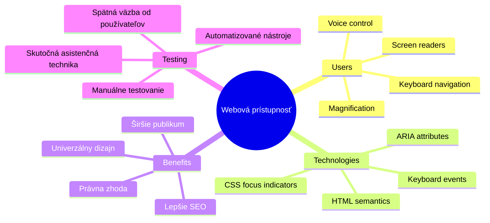
> Túto lekciu si môžete absolvovať na [Microsoft Learn](https://docs.microsoft.com/learn/modules/web-development-101/accessibility/?WT.mc_id=academic-77807-sagibbon)!

## Pochopenie asistívnych technológií

Skôr než skočíme do kódovania, venujme chvíľu pochopeniu, ako ľudia s rôznymi schopnosťami vlastne zažívajú web. Nie je to len teória — pochopenie týchto reálnych vzorcov navigácie z vás spraví oveľa lepšieho vývojára!

Asistívne technológie sú naozaj úžasné nástroje, ktoré pomáhajú ľuďom s postihnutím interagovať s webovými stránkami spôsobmi, ktoré vás môžu prekvapiť. Keď pochopíte, ako tieto technológie fungujú, vytváranie prístupných webových zážitkov sa stane oveľa intuitívnejším. Je to ako naučiť sa pozerať na váš kód očami niekoho iného.

### Čítače obrazovky

[Čítače obrazovky](https://en.wikipedia.org/wiki/Screen_reader) sú pomerne sofistikované technologické zariadenia, ktoré prevádzajú digitálny text do reči alebo braillovského výstupu. Aj keď ich primárne používajú ľudia so zrakovým postihnutím, sú tiež veľmi užitočné pre používateľov s poruchami učenia ako dyslexia.

Rád si predstavujem čítač obrazovky ako veľmi inteligentného rozprávača, ktorý vám číta knihu. Číta obsah nahlas v logickom poradí, oznamuje interaktívne prvky ako „tlačidlo“ alebo „odkaz“ a poskytuje klávesové skratky na preskakovanie po stránke. Ale tu je háčik — čítače obrazovky dokážu zázraky urobiť len vtedy, ak vytvárame webové stránky so správnou štruktúrou a zmysluplným obsahom. A tu prichádzate vy ako vývojár!

**Populárne čítače obrazovky na rôznych platformách:**
- **Windows**: [NVDA](https://www.nvaccess.org/about-nvda/) (zadarmo a najpopulárnejší), [JAWS](https://webaim.org/articles/jaws/), [Narrator](https://support.microsoft.com/windows/complete-guide-to-narrator-e4397a0d-ef4f-b386-d8ae-c172f109bdb1/?WT.mc_id=academic-77807-sagibbon) (vstavaný)
- **macOS/iOS**: [VoiceOver](https://support.apple.com/guide/voiceover/welcome/10) (vstavaný a veľmi schopný)
- **Android**: [TalkBack](https://support.google.com/accessibility/android/answer/6283677) (vstavaný)
- **Linux**: [Orca](https://wiki.gnome.org/Projects/Orca) (zadarmo a open-source)

**Ako čítače obrazovky navigujú webový obsah:**

Čítače obrazovky poskytujú viacero navigačných metód, ktoré robia prehliadanie efektívnym pre skúsených používateľov:
- **Sekvenčné čítanie**: Číta obsah odhora nadol, ako keby ste sledovali knihu
- **Navigácia podľa významných oblastí**: Skákanie medzi časťami stránky (hlavička, navigácia, hlavná časť, päta)
- **Navigácia podľa nadpisov**: Preskakovanie medzi nadpismi na pochopenie štruktúry stránky
- **Zoznam odkazov**: Vygenerovanie zoznamu všetkých odkazov pre rýchly prístup
- **Ovládacie prvky formulárov**: Priama navigácia medzi vstupnými poliami a tlačidlami

> 💡 **Niečo, čo ma úplne ohromilo**: 68 % používateľov čítačov obrazovky naviguje primárne podľa nadpisov ([WebAIM survey](https://webaim.org/projects/screenreadersurvey9/#finding)). To znamená, že vaša štruktúra nadpisov je ako mapa pre používateľov — keď ju máte správne, doslova pomáhate ľuďom rýchlejšie sa orientovať vo vašom obsahu!

### Budovanie pracovného postupu testovania

Tu je dobrá správa — efektívne testovanie prístupnosti nemusí byť ohromujúce! Budete chcieť kombinovať automatizované nástroje (sú skvelé na odhaľovanie očividných problémov) s niekoľkými praktickými testami. Tu je systematický prístup, ktorý som zistil, že odhalí najviac problémov bez zbytočného plytvania celým dňom:

**Základný manuálny testovací workflow:**

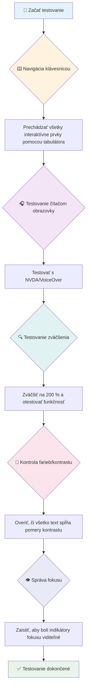
**Kontrolný zoznam testovania krok za krokom:**
1. **Navigácia pomocou klávesnice**: Používajte iba Tab, Shift+Tab, Enter, Medzerník a šípky
2. **Testovanie čítačom obrazovky**: Zapnite NVDA, VoiceOver alebo Narrator a navigujte so zatvorenými očami
3. **Testovanie zväčšenia**: Testujte na úrovniach zväčšenia 200 % a 400 %
4. **Overenie farebného kontrastu**: Skontrolujte všetok text a UI komponenty
5. **Testovanie indikátora fokusu**: Uistite sa, že všetky interaktívne prvky majú viditeľné stavy fokusu

✅ **Začnite s Lighthouse**: Otvorte DevTools vášho prehliadača, spustite Lighthouse audit prístupnosti a potom použite výsledky na nasmerovanie manuálneho testovania.

### Nástroje na zoom a zväčšovanie

Viete, ako občas na telefóne štípete obrazovku, keď je text príliš malý, alebo sa mračíte na obrazovku svojho laptopu na ostré slnko? Mnohí používatelia denne využívajú nástroje na zväčšenie obsahu, aby bol text čitateľný. Patrí sem ľudia so zhoršeným videním, starší dospelí a každý, kto sa niekedy pokúsil čítať web vonku.

Moderné technológie zoomu sa vyvinuli ďalej než len jednoduché zväčšovanie. Pochopenie, ako tieto nástroje fungujú, vám pomôže vytvárať responzívne dizajny, ktoré zostanú funkčné a pekné pri akejkoľvek úrovni zväčšenia.

**Možnosti moderného zoomu v prehliadačoch:**
- **Zoom celej stránky**: Pomerné zväčšenie celého obsahu (text, obrázky, rozloženie) — toto je preferovaná metóda
- **Zoom len textu**: Zväčšuje písmo pri zachovaní pôvodného rozloženia
- **Pinch-to-zoom**: Podpora gest na mobiloch pre dočasné zväčšenie
- **Podpora prehliadačov**: Všetky moderné prehliadače podporujú zoom až do 500 % bez prerušenia funkčnosti

**Špecializovaný softvér na zväčšenie:**
- **Windows**: [Lupa](https://support.microsoft.com/windows/use-magnifier-to-make-things-on-the-screen-easier-to-see-414948ba-8b1c-d3bd-8615-0e5e32204198) (vstavaná), [ZoomText](https://www.freedomscientific.com/training/zoomtext/getting-started/)
- **macOS/iOS**: [Zoom](https://www.apple.com/accessibility/mac/vision/) (vstavaný s pokročilými funkciami)

> ⚠️ **Dizajnové zváženie**: WCAG požaduje, aby obsah zostal funkčný pri zväčšení na 200 %. Na tejto úrovni by horizontálne rolovanie malo byť minimálne a všetky interaktívne prvky by mali byť stále prístupné.

✅ **Otestujte svoj responzívny dizajn**: Zväčšte prehliadač na 200 % a 400 %. Prispôsobuje sa váš layout plynulo? Máte stále prístup ku všetkej funkčnosti bez nadmerného rolovania?

## Moderné nástroje na testovanie prístupnosti

Teraz, keď chápete, ako ľudia navigujú web pomocou asistívnych technológií, pozrime sa na nástroje, ktoré vám pomôžu budovať a testovať prístupné weby.

Myslite na to takto: automatizované nástroje sú skvelé na zachytenie očividných problémov (ako chýbajúci alt text), zatiaľ čo manuálne testovanie vám pomáha uistiť sa, že vaša stránka je v reálnom svete príjemná na používanie. Spoločne vám dávajú istotu, že vaše stránky fungujú pre všetkých.

### Testovanie farebného kontrastu

Tu je dobrá správa: farebný kontrast je jedna z najbežnejších problémov prístupnosti, ale zároveň jedna z najjednoduchších na opravu. Dobrý kontrast prospieva všetkým — od ľudí so zrakovým postihnutím až po používateľov snažiacich sa čítať svoje telefóny na pláži.

**Požiadavky WCAG na kontrast:**

| Typ textu | WCAG AA (Minimálne) | WCAG AAA (Vylepšené) |
|-----------|---------------------|---------------------|
| **Bežný text** (pod 18pt) | Kontrast 4,5:1 | Kontrast 7:1 |
| **Veľký text** (18pt+ alebo 14pt+ tučný) | Kontrast 3:1 | Kontrast 4,5:1 |
| **UI komponenty** (tlačidlá, okraje formulárov) | Kontrast 3:1 | Kontrast 3:1 |

**Nezbytné testovacie nástroje:**
- [Colour Contrast Analyser](https://www.tpgi.com/color-contrast-checker/) – desktopová aplikácia s výberom farieb
- [WebAIM Contrast Checker](https://webaim.org/resources/contrastchecker/) – webová aplikácia s okamžitou spätnou väzbou
- [Stark](https://www.getstark.co/) – plugin do dizajnových nástrojov Figma, Sketch, Adobe XD
- [Accessible Colors](https://accessible-colors.com/) – nájdite prístupné farebné palety

✅ **Vytvorte lepšie farebné palety**: Začnite so svojimi značkovými farbami a použite kontroléry kontrastu na vytvorenie prístupných variácií. Dokumentujte ich ako prístupné farebné tokeny vášho dizajnového systému.

### Komplexné audity prístupnosti

Najefektívnejšie testovanie prístupnosti kombinuje viacero prístupov. Žiaden jeden nástroj neodhalí všetko, preto vytvorenie testovacieho režimu s rôznymi metódami zabezpečí dôkladné pokrytie.

**Testovanie v prehliadači (vstavané v DevTools):**
- **Chrome/Edge**: Lighthouse audit prístupnosti + panel prístupnosti
- **Firefox**: Inšpektor prístupnosti s detailným stromom
- **Safari**: Audit v Web Inspector so simuláciou VoiceOver

**Profesionálne testovacie rozšírenia:**
- [axe DevTools](https://www.deque.com/axe/devtools/) – štandardný nástroj na automatizované testovanie
- [WAVE](https://wave.webaim.org/extension/) – vizuálna spätná väzba s označením chýb
- [Accessibility Insights](https://accessibilityinsights.io/) – komplexný balík testov od Microsoftu

**Integrácia do príkazového riadku a CI/CD:**
- [axe-core](https://github.com/dequelabs/axe-core) – JavaScript knižnica pre automatizované testovanie
- [Pa11y](https://pa11y.org/) – nástroj na testovanie prístupnosti cez príkazový riadok
- [Lighthouse CI](https://github.com/GoogleChrome/lighthouse-ci) – automatizované skórovanie prístupnosti

> 🎯 **Cieľ testovania**: Snažte sa o Lighthouse skóre prístupnosti 95+ ako základnú úroveň. Pamätajte, že automatizované nástroje zachytia len asi 30–40 % problémov — manuálne testovanie je stále nevyhnutné!

### 🧠 **Kontrola testovacích zručností: Ste pripravení nájsť problémy?**

**Pozrime sa, ako sa cítite ohľadom testovania prístupnosti:**
- Ktorá metóda testovania sa vám zatiaľ zdá najprístupnejšia?
- Viete si predstaviť používanie iba klávesnice na navigáciu celý deň?
- S akou bariérou prístupnosti ste sa osobne stretli na internete?

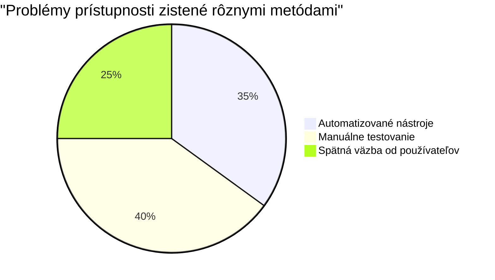
> **Posilnenie dôvery**: Profesionálni testeri prístupnosti používajú presne túto kombináciu metód. Učíte sa postupy na úrovni priemyslu!

## Budovanie prístupnosti od základov

Kľúč k úspechu prístupnosti je začleniť ju do vášho základu už od prvej chvíle. Viem, že je lákavé myslieť si „Pridám prístupnosť neskôr“, ale to je ako snažiť sa do domu, ktorý je už postavený, dodatočne dorobiť rampu. Možné? Áno. Ľahké? Nie naozaj.

Predstavte si prístupnosť ako plánovanie domu — oveľa jednoduchšie je zahrnúť bezbariérový prístup do architektonických plánov hneď na začiatku, než to dodatočne dodávať.

### Princípy POUR: Váš základ prístupnosti

Smernice pre prístupnosť webového obsahu (WCAG) sú postavené okolo štyroch základných princípov, ktoré tvoria skratku POUR. Nebojte sa — nie sú to suché akademické pojmy! Sú to praktické usmernenia na tvorbu obsahu, ktorý funguje pre všetkých.

Keď pochopíte POUR, rozhodovanie o prístupnosti bude oveľa intuitívnejšie. Je to ako mať mentálny kontrolný zoznam, ktorý vedie vaše dizajnové rozhodnutia. Pozrime sa na to:

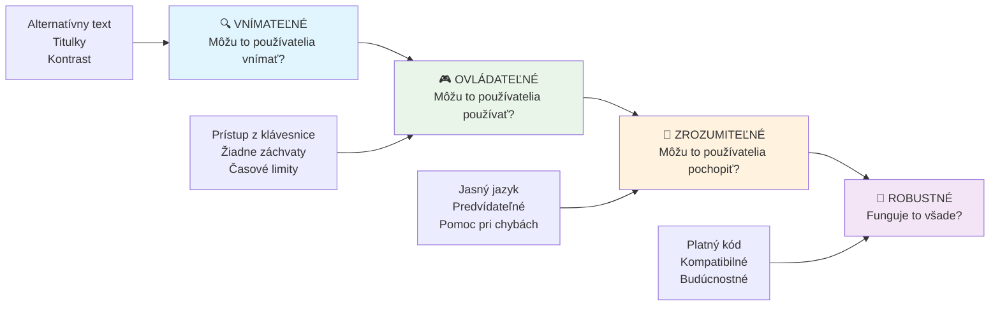
**🔍 Vnímateľné**: Informácie musia byť prezentovateľné spôsobom, ktorý používatelia môžu vnímať prostredníctvom svojich dostupných zmyslov

- Poskytnite textové alternatívy pre ne-textový obsah (obrázky, videá, audio)
- Zabezpečte dostatočný farebný kontrast pre všetok text a UI komponenty
- Ponúknite titulky a prepisy pre multimediálny obsah
- Navrhnite obsah tak, aby zostal funkčný pri zväčšení až do 200 %
- Používajte viacero senzorických charakteristík (nie iba farbu) na sprostredkovanie informácií

**🎮 Ovládateľné**: Všetky komponenty rozhrania musia byť ovládateľné dostupnými vstupnými metódami

- Zabezpečte prístup k všetkej funkčnosti pomocou klávesnice
- Poskytnite používateľom dostatok času na čítanie a interakciu s obsahom
- Vyhnite sa obsahu, ktorý môže spôsobiť záchvaty alebo vestibulárne poruchy
- Pomôžte používateľom efektívne sa orientovať s jasnou štruktúrou a orientačnými bodmi
- Zabezpečte, aby interaktívne prvky mali dostatočnú veľkosť cieľa (minimálne 44px)

**📖 Pochopiteľné**: Informácie a ovládanie rozhrania musia byť jasné a zrozumiteľné

- Používajte jasný, jednoduchý jazyk vhodný pre vaše publikum
- Zabezpečte, že obsah sa zobrazuje a ovláda predvídateľne a konzistentne
- Poskytujte jasné inštrukcie a chybové hlásenia pre užívateľský vstup
- Pomôžte používateľom pochopiť a opraviť chyby vo formulároch
- Organizujte obsah s logickým poriadkom čítania a informačnou hierarchiou

**💪 Robustné**: Obsah musí spoľahlivo fungovať naprieč rôznymi technológiami a asistívnymi zariadeniami

- **Používajte platný, sémantický HTML ako základ**
- **Zabezpečte kompatibilitu s aktuálnymi a budúcimi asistívnymi technológiami**
- **Dodržiavajte webové štandardy a osvedčené postupy pre značkovanie**
- **Testujte na rôznych prehliadačoch, zariadeniach a asistenčných nástrojoch**
- **Štruktúrujte obsah tak, aby sa primerane degradoval, keď pokročilé funkcie nie sú podporované**

### 🎯 **Kontrola princípov POUR: Ako to upevniť**

**Rýchla reflexia základov:**
- Viete si predstaviť funkciu webu, ktorá porušuje každý princíp POUR?
- Ktorý princíp vám ako vývojárovi príde najprirodzenejší?
- Ako by tieto princípy mohli zlepšiť dizajn pre všetkých, nielen pre používateľov so zdravotným postihnutím?

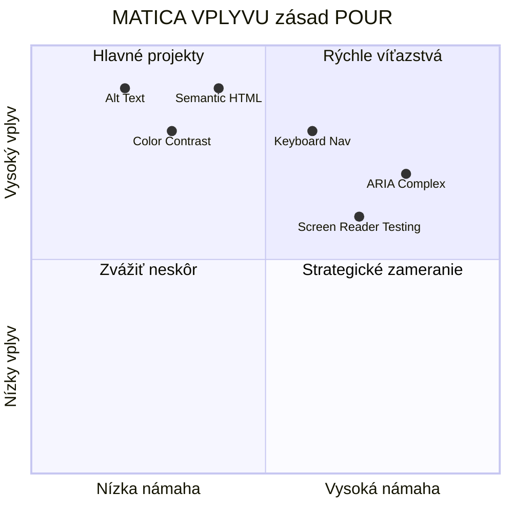
> **Pamätajte**: Začnite s vylepšeniami, ktoré majú veľký dopad a nízku náročnosť. Semantický HTML a alt text vám prinesú najväčší prínos pre prístupnosť pri najmenšej námahe!

## Vytváranie prístupného vizuálneho dizajnu

Dobrý vizuálny dizajn a prístupnosť idú ruka v ruke. Keď navrhujete s ohľadom na prístupnosť, často zistíte, že tieto obmedzenia vedú k čistejším, elegantnejším riešeniam, ktoré prospievajú všetkým používateľom.

Preskúmajme, ako vytvárať vizuálne príťažlivé dizajny, ktoré fungujú pre každého, bez ohľadu na ich vizuálne schopnosti alebo podmienky, za ktorých si obsah prezerajú.

### Stratégií používania farieb a vizuálnej prístupnosti

Farba je silný prostriedok komunikácie, ale nikdy by nemala byť jediným spôsobom, ako prenášať dôležité informácie. Návrh presahujúci samotnú farbu vytvára robustnejšie, inkluzívnejšie zážitky, ktoré fungujú v rôznych situáciách.

**Navrhujte pre rozdiely vo farebnom videní:**

Približne 8 % mužov a 0,5 % žien má nejaký typ farebného videnia (často nazývaný „farebná slepota“). Najbežnejšie typy sú:
- **Deuteranopia**: ťažkosti s rozlíšením červenej a zelenej
- **Protanopia**: červená farba sa javí matnejšia
- **Tritanopia**: ťažkosti s modrou a žltou (zriedkavé)

**Inkluzívne farebné stratégie:**

```css
/* ❌ Bad: Using only color to indicate status */
.error { color: red; }
.success { color: green; }

/* ✅ Good: Color plus icons and context */
.error {
  color: #d32f2f;
  border-left: 4px solid #d32f2f;
}
.error::before {
  content: "⚠️";
  margin-right: 8px;
}

.success {
  color: #2e7d32;
  border-left: 4px solid #2e7d32;
}
.success::before {
  content: "✅";
  margin-right: 8px;
}
```

**Nad rámec základných požiadaviek na kontrast:**
- Testujte svoje farebné voľby pomocou simulátorov farebnej slepoty
- Používajte vzory, textúry alebo tvary spolu s farebným kódovaním
- Zabezpečte, že interaktívne stavy zostanú rozlíšiteľné aj bez farby
- Zvážte, ako váš dizajn vyzerá v režime vysokého kontrastu

✅ **Otestujte prístupnosť farieb**: Použite nástroje ako [Coblis](https://www.color-blindness.com/coblis-color-blindness-simulator/), aby ste videli, ako vaša stránka vyzerá pre používateľov s rôznymi typmi farebného videnia.

### Indikátory fokusu a dizajn interakcie

Indikátory fokusu sú digitálnou obdobou kurzora—ukazujú používateľom klávesnice, kde sa nachádzajú na stránke. Dobre navrhnuté indikátory fokusu zlepšujú zážitok pre všetkých tým, že robia interakcie jasnými a predvídateľnými.

**Najlepšie postupy pre moderné indikátory fokusu:**

```css
/* Enhanced focus styles that work across browsers */
button:focus-visible {
  outline: 2px solid #0066cc;
  outline-offset: 2px;
  box-shadow: 0 0 0 4px rgba(0, 102, 204, 0.25);
}

/* Remove focus outline for mouse users, preserve for keyboard users */
button:focus:not(:focus-visible) {
  outline: none;
}

/* Focus-within for complex components */
.card:focus-within {
  box-shadow: 0 0 0 3px rgba(74, 144, 164, 0.5);
  border-color: #4A90A4;
}

/* Ensure focus indicators meet contrast requirements */
.custom-focus:focus-visible {
  outline: 3px solid #ffffff;
  outline-offset: 2px;
  box-shadow: 0 0 0 6px #000000;
}
```

**Požiadavky na indikátory fokusu:**
- **Viditeľnosť**: Musí mať aspoň pomer kontrastu 3:1 so susednými prvkami
- **Šírka**: Minimálna hrúbka 2 px okolo celého prvku
- **Trvácnosť**: Má zostať viditeľný, kým sa fokus nepresunie inde
- **Rozlíšiteľnosť**: Musí byť vizuálne odlišný od iných stavov UI

> 💡 **Typ dizajnu**: Skvelé indikátory fokusu často používajú kombináciu obrysu, tieňa rámčeka a zmeny farby, aby zabezpečili viditeľnosť na rôznych pozadiach a v rôznych kontextoch.

✅ **Skontrolujte indikátory fokusu**: Prechádzajte cez vašu stránku pomocou klávesy Tab a všimnite si, ktoré prvky majú jasné indikátory fokusu. Niektoré sú ťažko viditeľné alebo úplne chýbajú?

### Semantický HTML: Základ prístupnosti

Semantický HTML je ako poskytnúť asistenčným technológiám GPS systém pre váš web. Keď používate správne HTML elementy na ich určený účel, v podstate poskytujete čítačkám obrazovky, klávesniciam a iným nástrojom podrobnú mapu, ktorá používateľom pomáha efektívne sa orientovať.

Príklad, ktorý mi veľmi pomohol: semantický HTML je rozdiel medzi dobre usporiadanou knižnicou s jasnými kategóriami a nápismi oproti skladišťu, kde sú knihy rozhádzané náhodne. Obe miesta majú rovnaké knihy, ale v ktorom by ste radšej hľadali niečo? Presne tak!

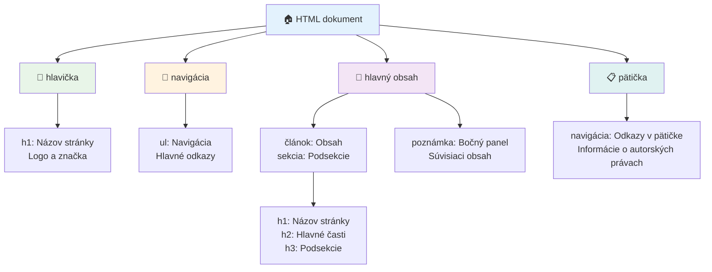
**Stavebné prvky štruktúry prístupnej stránky:**

```html
<!-- Landmark elements provide page navigation structure -->
<header>
  <h1>Your Site Name</h1>
  <nav aria-label="Main navigation">
    <ul>
      <li><a href="/home">Home</a></li>
      <li><a href="/about">About</a></li>
      <li><a href="/services">Services</a></li>
    </ul>
  </nav>
</header>

<main>
  <article>
    <header>
      <h1>Article Title</h1>
      <p>Published on <time datetime="2024-10-14">October 14, 2024</time></p>
    </header>
    
    <section>
      <h2>First Section</h2>
      <p>Content that relates to this section...</p>
    </section>
    
    <section>
      <h2>Second Section</h2>
      <p>More related content...</p>
    </section>
  </article>
  
  <aside>
    <h2>Related Links</h2>
    <nav aria-label="Related articles">
      <ul>
        <li><a href="/related-1">First related article</a></li>
        <li><a href="/related-2">Second related article</a></li>
      </ul>
    </nav>
  </aside>
</main>

<footer>
  <p>&copy; 2024 Your Site Name. All rights reserved.</p>
  <nav aria-label="Footer links">
    <ul>
      <li><a href="/privacy">Privacy Policy</a></li>
      <li><a href="/contact">Contact Us</a></li>
    </ul>
  </nav>
</footer>
```

**Prečo semantický HTML mení prístupnosť:**

| Semantický prvok | Účel | Výhoda pre čítačku obrazovky |
|------------------|-------|------------------------------|
| `<header>` | Hlavička stránky alebo sekcie | „Banner landmark“ – rýchla navigácia na vrch |
| `<nav>` | Navigačné odkazy | „Navigation landmark“ – zoznam navigačných sekcií |
| `<main>` | Hlavný obsah stránky | „Main landmark“ – preskočenie priamo na obsah |
| `<article>` | Samostatný obsah | Označuje hranice článku |
| `<section>` | Tematické skupiny obsahu | Poskytuje štruktúru obsahu |
| `<aside>` | Súvisiaci obsah na bočnom paneli | „Complementary landmark“ |
| `<footer>` | Pätka stránky alebo sekcie | „Contentinfo landmark“ |

**Superschopnosti čítačiek obrazovky so semantickým HTML:**
- **Navigácia pomocou miest**: Skok medzi hlavnými sekciami stránky okamžite
- **Náčrty nadpisov**: Generovanie obsahu z vašej štruktúry nadpisov
- **Zoznamy prvkov**: Vytváranie zoznamov všetkých odkazov, tlačidiel alebo ovládacích prvkov formulárov
- **Pochopenie kontextu**: Porozumenie vzťahom medzi obsahovými sekciami

> 🎯 **Rýchly test**: Skúste sa navigovať na vašom webe pomocou čítačky obrazovky pomocou klávesových skratiek pre miesta (D pre landmark, H pre nadpis, K pre odkaz v NVDA/JAWS). Má navigácia zmysel?

### 🏗️ **Kontrola majstrovstva semantického HTML: Budovanie silných základov**

**Zhodnoťme vaše semantické znalosti:**
- Dokážete identifikovať landmarky na webovej stránke len pohľadom na HTML?
- Ako by ste vysvetlili kamarátovi rozdiel medzi `<section>` a `<div>`?
- Čo by ste skontrolovali ako prvé, keby používateľ čítačky obrazovky hlásil problémy s navigáciou?

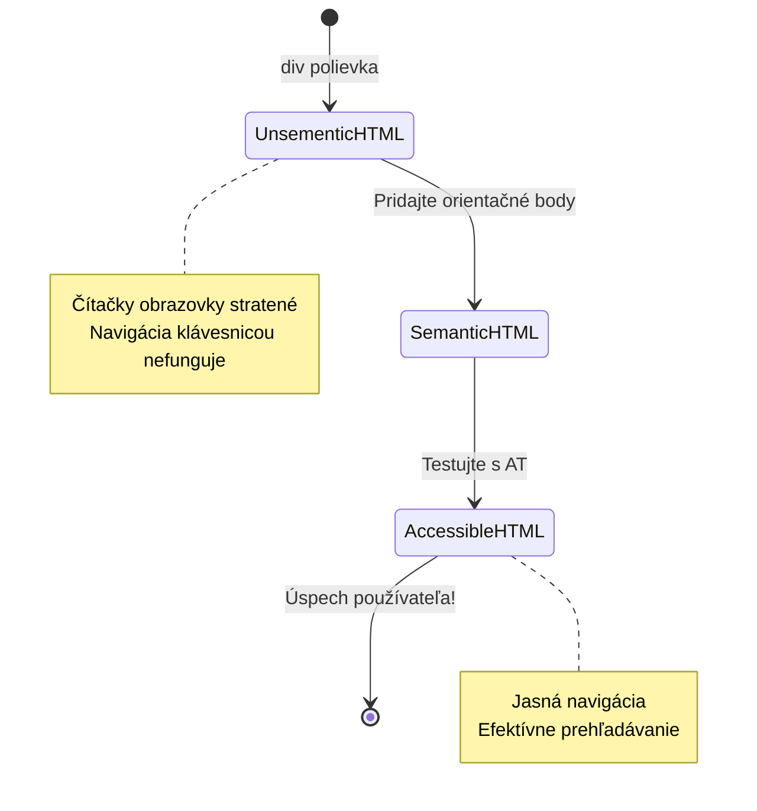
> **Profesionálny tip**: Dobrý semantický HTML rieši približne 70 % problémov s prístupnosťou automaticky. Ovládnite tento základ a budete na dobrej ceste!

✅ **Skontrolujte svoju semantickú štruktúru**: Použite panel prístupnosti v DevTools vášho prehliadača na zobrazenie stromu prístupnosti a uistite sa, že váš markup vytvára logickú štruktúru.

### Hierarchia nadpisov: Vytváranie logického kontúru obsahu

Nadpisy sú mimoriadne dôležité pre prístupný obsah—sú ako chrbtica, ktorá všetko drží pokope. Používatelia čítačiek obrazovky sa spoliehajú na nadpisy, aby pochopili a navigovali obsah. Predstavte si to ako poskytovanie obsahu stránky vo forme obsahu.

**Zlaté pravidlo pre nadpisy:**
Nikdy nevynechávajte úrovne. Vždy postupujte logicky od `<h1>` cez `<h2>`, `<h3>` a ďalej. Pamätáte si, ako ste robili osnovy na škole? Je to ten istý princíp—nepreskočili by ste z „I. Hlavný bod“ priamo na „C. Pod-pod-bod“ bez „A. Podbod“ medzi nimi, však?

**Príklad ideálnej štruktúry nadpisov:**

```html
<!-- ✅ Excellent: Logical, hierarchical progression -->
<main>
  <h1>Complete Guide to Web Accessibility</h1>
  
  <section>
    <h2>Understanding Screen Readers</h2>
    <p>Introduction to screen reader technology...</p>
    
    <h3>Popular Screen Reader Software</h3>
    <p>NVDA, JAWS, and VoiceOver comparison...</p>
    
    <h3>Testing with Screen Readers</h3>
    <p>Step-by-step testing instructions...</p>
  </section>
  
  <section>
    <h2>Color and Contrast Guidelines</h2>
    <p>Designing with sufficient contrast...</p>
    
    <h3>WCAG Contrast Requirements</h3>
    <p>Understanding the different contrast levels...</p>
    
    <h3>Testing Tools and Techniques</h3>
    <p>Tools for verifying contrast ratios...</p>
  </section>
</main>
```

```html
<!-- ❌ Problematic: Skipping levels, inconsistent structure -->
<h1>Page Title</h1>
<h3>Subsection</h3> <!-- Skipped h2 -->
<h2>This should come before h3</h2>
<h1>Another main heading?</h1> <!-- Multiple h1s -->
```

**Najlepšie postupy pre nadpisy:**
- **Jeden `<h1>` na stránku**: Zvyčajne hlavný nadpis stránky alebo primárny obsahový nadpis
- **Logický postup**: Nikdy nepreskakujte úrovne (h1 → h2 → h3, nie h1 → h3)
- **Popisný obsah**: Robte nadpisy zmysluplné aj mimo kontextu
- **Vizuálny štýl pomocou CSS**: Používajte CSS pre vzhľad, HTML úrovne pre štruktúru

**Štatistiky navigácie čítačiek obrazovky:**
- 68 % používateľov čítačiek obrazovky sa orientuje podľa nadpisov ([WebAIM Survey](https://webaim.org/projects/screenreadersurvey9/#finding))
- Používatelia očakávajú logický obrys nadpisov
- Nadpisy poskytujú najrýchlejší spôsob pochopenia štruktúry stránky

> 💡 **Profesionálny tip**: Používajte rozšírenia prehliadača ako „HeadingsMap“ na vizualizáciu štruktúry nadpisov. Mala by znieť ako dobre usporiadaný obsah.

✅ **Otestujte svoju štruktúru nadpisov**: Použite navigáciu nadpisov v čítačke obrazovky (klávesa H v NVDA) na preskok medzi nadpismi. Rozpráva postupnosť logický príbeh vášho obsahu?

### Pokročilé techniky vizuálnej prístupnosti

Nad rámec základov kontrastu a farieb existujú sofistikované techniky, ktoré pomáhajú vytvárať naozaj inkluzívne vizuálne zážitky. Tieto metódy zabezpečujú, že váš obsah funguje v rôznych podmienkach zobrazenia a pri použití asistenčných technológií.

**Nezbytné stratégie vizuálnej komunikácie:**

- **Viacmodálna spätná väzba**: Kombinujte vizuálne, textové a niekedy aj zvukové signály
- **Postupné zverejňovanie**: Predstavujte informácie v stráviteľných častiach
- **Konzistentné vzory interakcie**: Používajte známe konvencie UI
- **Responzívna typografia**: Mierne zväčšujte text naprieč zariadeniami
- **Stavy načítania a chýb**: Poskytujte jasnú spätnú väzbu pre všetky akcie používateľa

**CSS utility pre zvýšenú prístupnosť:**

```css
/* Screen reader only text - visually hidden but accessible */
.sr-only {
  position: absolute;
  width: 1px;
  height: 1px;
  padding: 0;
  margin: -1px;
  overflow: hidden;
  clip: rect(0, 0, 0, 0);
  white-space: nowrap;
  border: 0;
}

/* Skip link for keyboard navigation */
.skip-link {
  position: absolute;
  top: -40px;
  left: 6px;
  background: #000000;
  color: #ffffff;
  padding: 8px 16px;
  text-decoration: none;
  border-radius: 4px;
  font-weight: bold;
  transition: top 0.3s ease;
  z-index: 1000;
}

.skip-link:focus {
  top: 6px;
}

/* Reduced motion respect */
@media (prefers-reduced-motion: reduce) {
  .skip-link {
    transition: none;
  }
  
  * {
    animation-duration: 0.01ms !important;
    animation-iteration-count: 1 !important;
    transition-duration: 0.01ms !important;
  }
}

/* High contrast mode support */
@media (prefers-contrast: high) {
  .button {
    border: 2px solid;
  }
}
```

> 🎯 **Prístupový vzor**: „Preskoč odkaz“ je nevyhnutný pre používateľov klávesnice. Mal by byť prvým zaostriteľným prvkom na vašej stránke a skákať priamo na hlavnú obsahovú oblasť.

✅ **Implementujte preskočenie navigácie**: Pridajte preskočovacie odkazy na svoje stránky a testujte ich stlačením Tab hneď po načítaní stránky. Mali by sa zobraziť a umožniť vám skočiť na hlavnú časť obsahu.

## Vytváranie zmysluplného textu odkazov

Odkazy sú v podstate diaľnice webu, ale zle napísaný text odkazu je ako dopravné značky, ktoré namiesto „Centrum mesta Chicago“ hovoria len „Miesto“. Nie je to príliš užitočné, však?

Toto ma dosť ohromilo, keď som sa to naučil: čítačky obrazovky dokážu extrahovať všetky odkazy zo stránky a zobraziť ich ako jeden veľký zoznam. Predstavte si, že vám niekto podá adresár každého odkazu na vašej stránke. Má každý z nich zmysel sám o sebe? Toto je test, ktorý musí váš text odkazu prejsť!

### Pochopenie vzorov navigácie odkazov

Čítačky obrazovky ponúkajú silné funkcie navigácie odkazov, ktoré sa spoliehajú na dobre napísaný text odkazov:

**Metódy navigácie odkazov:**
- **Sekvenčné čítanie**: Odkazy sa čítajú v kontexte ako súčasť obsahu
- **Generovanie zoznamu odkazov**: Všetky odkazy na stránke sú zostavené do vyhľadávateľného adresára
- **Rýchla navigácia**: Preskok medzi odkazmi pomocou klávesových skratiek (K v NVDA)
- **Vyhľadávanie**: Nájdite konkrétne odkazy zadaním časti textu

**Prečo je kontext dôležitý:**
Keď používatelia čítačiek obrazovky vygenerujú zoznam odkazov, vidia niečo takéto:
- „Stiahnuť správu“
- „Dozvedieť sa viac“
- „Kliknite sem“
- „Zásady ochrany osobných údajov“
- „Kliknite sem“

Len dva z týchto odkazov poskytujú užitočné informácie aj mimo kontextu!

> 📊 **Dopad na používateľa**: Používatelia čítačiek obrazovky prehľadávajú zoznamy odkazov, aby rýchlo pochopili obsah stránky. Všeobecný text odkazov ich núti vracať sa späť ku každému kontextu odkazu, čo výrazne spomaľuje ich prehliadanie.

### Bežné chyby v texte odkazov, ktorým sa treba vyhnúť

Pochopením toho, čo nefunguje, viete rozoznať a opraviť problémy s prístupnosťou v existujúcom obsahu.

**❌ Všeobecné texty odkazov bez kontextu:**

```html
<!-- Meaningless when read from a link list -->
<p>Our sustainability efforts are detailed in our recent report. 
   <a href="/sustainability-2024.pdf">Click here</a> to view it.</p>

<!-- Repeated generic text throughout the page -->
<div class="article-card">
  <h3>Web Accessibility Guide</h3>
  <p>Learn the fundamentals...</p>
  <a href="/accessibility-guide">Read more</a>
</div>
<div class="article-card">
  <h3>Color Contrast Tips</h3>
  <p>Improve your design...</p>
  <a href="/color-contrast">Read more</a>
</div>

<!-- URLs as link text (difficult for screen readers to announce) -->
<p>Visit https://www.w3.org/WAI/WCAG21/quickref/ for WCAG guidelines.</p>

<!-- Vague action words -->
<a href="/contact">Go</a> | <a href="/about">See</a> | <a href="/help">View</a>
```

**Prečo tieto vzory zlyhávajú:**
- **„Kliknite sem“** nič nehovorí o cieľovej destinácii
- **„Čítať viac“** opakované viackrát vytvára zmätok
- **Neformátované URL** sa ťažko vyslovujú čítačkami obrazovky
- **Jednotlivé slová** ako „Choď“ alebo „Pozri“ nemajú popisný kontext

### Písanie vynikajúceho textu odkazov

Popisný text odkazov prospieva všetkým—vidiaci používatelia môžu rýchlo prehliadať odkazy a používatelia čítačiek obrazovky okamžite chápu cieľ.

**✅ Príklady jasného, popisného textu odkazov:**

```html
<!-- Descriptive text that explains the destination -->
<p>Our comprehensive <a href="/sustainability-2024.pdf">2024 sustainability report (PDF, 2.1MB)</a> details our environmental initiatives.</p>

<!-- Specific, unique link text for each card -->
<div class="article-card">
  <h3>Web Accessibility Guide</h3>
  <p>Learn the fundamentals of inclusive design...</p>
  <a href="/accessibility-guide">Read our complete web accessibility guide</a>
</div>
<div class="article-card">
  <h3>Color Contrast Tips</h3>
  <p>Improve your design with better color choices...</p>
  <a href="/color-contrast">Explore color contrast best practices</a>
</div>

<!-- Meaningful text instead of raw URLs -->
<p>The <a href="https://www.w3.org/WAI/WCAG21/quickref/">WCAG 2.1 Quick Reference guide</a> provides comprehensive accessibility guidelines.</p>

<!-- Descriptive action links -->
<a href="/contact">Contact our support team</a> | 
<a href="/about">About our company</a> | 
<a href="/help">Get help with your account</a>
```

**Najlepšie postupy pre text odkazov:**
- **Buďte konkrétni**: „Stiahnuť štvrťročnú finančnú správu“ namiesto „Stiahnuť“
- **Uveďte typ a veľkosť súboru**: „(PDF, 1,2MB)“ pre sťahovateľné súbory
- **Uveďte, ak sa odkaz otvára externé**: „(otvára sa v novom okne)“ keď je to vhodné
- **Používajte aktívny jazyk**: „Kontaktujte nás“ namiesto „Stránka kontaktov“
- **Buďte struční**: Snažte sa o 2-8 slov, ak je to možné

### Pokročilé vzory prístupnosti odkazov

Niekedy obmedzenia vizuálneho dizajnu alebo technické požiadavky vyžadujú špeciálne riešenia. Tu sú sofistikované techniky pre bežné náročné scenáre:

**Použitie ARIA pre zvýšenie kontextu:**

```html
<!-- When button text must be short but needs more context -->
<a href="/report.pdf" 
   aria-label="Download 2024 annual financial report, PDF format, 2.3MB">
  Download Report
</a>

<!-- When the full context comes from surrounding content -->
<h3 id="sustainability-heading">Sustainability Initiative</h3>
<p>Our efforts to reduce environmental impact...</p>
<a href="/sustainability-details" 
   aria-labelledby="sustainability-heading"
   aria-describedby="sustainability-summary">
  Learn more
</a>
<p id="sustainability-summary">Detailed breakdown of our 2024 environmental goals and achievements</p>
```

**Indikácia typov súborov a externých cieľov:**

```html
<!-- Method 1: Include information in visible link text -->
<a href="/annual-report.pdf">
  Download our 2024 annual report (PDF, 2.3MB)
</a>

<!-- Method 2: Use screen reader-only text for file details -->
<a href="/annual-report.pdf">
  Download our 2024 annual report
  <span class="sr-only">(PDF format, 2.3MB)</span>
</a>

<!-- Method 3: External link indication -->
<a href="https://example.com" 
   target="_blank" 
   aria-describedby="external-link-warning">
  Visit external resource
</a>
<span id="external-link-warning" class="sr-only">
  (opens in new window)
</span>

<!-- Method 4: Using CSS for visual indicators -->
<a href="https://example.com" class="external-link">
  External resource
</a>
```

```css
/* Visual indicator for external links */
.external-link::after {
  content: " ↗";
  font-size: 0.8em;
  color: #666;
}

/* Screen reader announcement for external links */
.external-link::before {
  content: "External link: ";
  position: absolute;
  left: -10000px;
  width: 1px;
  height: 1px;
  overflow: hidden;
}
```

> ⚠️ **Dôležité**: Pri použití `target="_blank"` vždy informujte používateľov, že odkaz sa otvorí v novom okne alebo karte. Neočakávané zmeny navigácie môžu byť dezorientujúce.

✅ **Otestujte kontext svojich odkazov**: Použite nástroje pre vývojárov v prehliadači na vygenerovanie zoznamu všetkých odkazov na vašej stránke. Rozumiete účelu každého odkazu bez akéhokoľvek okolia textu?

## ARIA: Posilnenie prístupnosti HTML

[Accessible Rich Internet Applications (ARIA)](https://developer.mozilla.org/docs/Web/Accessibility/ARIA) je ako univerzálny prekladač medzi vašimi komplexnými webovými aplikáciami a asistenčnými technológiami. Keď samotný HTML nedokáže vyjadriť všetko, čo vaše interaktívne komponenty robia, ARIA vyplní tieto medzery.

Rád si predstavujem ARIA ako pridávanie užitočných poznámok k vášmu HTML—tak ako režijné poznámky v divadelnom scenári, ktoré pomáhajú hercom pochopiť svoje úlohy a vzťahy.

**Najdôležitejšie pravidlo o ARIA**: Vždy používajte semantický HTML ako prvý krok a potom pridajte ARIA na jeho zdokonalenie. Myslite na ARIA ako na korenie, nie hlavné jedlo. Malo by objasňovať a obohacovať vašu HTML štruktúru, nikdy ju nenahrádzať. Najskôr zvládnite ten základ!

### Strategická implementácia ARIA

ARIA je výkonná, ale s veľkou mocou prichádza veľká zodpovednosť. Nesprávne použitie ARIA môže prístupnosť zhoršiť viac než jej absence. Tu je, kedy a ako ju používať efektívne:

**✅ Použite ARIA keď:**
- Vytvárate vlastné interaktívne prvky (akordeóny, záložky, karusely)
- Budujete dynamický obsah, ktorý sa mení bez obnovenia stránky
- Poskytujete ďalší kontext pre zložité vzťahy v UI
- Indikujete stavy načítania alebo živé aktualizácie obsahu
- Vytvárate aplikácie s vlastnými ovládacími prvkami

**❌ Vyhýbajte sa ARIA keď:**
- Štandardné HTML prvky už poskytujú požadovanú sémantiku
- Nie ste si istí, ako ju správne implementovať
- Duplikujete informácie už dané semantickým HTML
- Nepoužili ste testovanie s reálnou asistenčnou technológiou

> 🎯 **Zlaté pravidlo ARIA**: „Neměňte sémantiku, pokiaľ to nie je absolútne nutné, vždy zabezpečte prístupnosť klávesnicou a testujte s reálnou asistenčnou technológiou.“
**Päť kategórií ARIA:**

1. **Role**: Čo je tento prvok? (`button`, `tab`, `dialog`)
2. **Vlastnosti**: Aké sú jeho rysy? (`aria-required`, `aria-haspopup`)
3. **Stavy**: V akom je aktuálnom stave? (`aria-expanded`, `aria-checked`)
4. **Orientácie**: Kde sa nachádza v štruktúre stránky? (`banner`, `navigation`, `main`)
5. **Aktívne regióny**: Ako sa majú oznamovať zmeny? (`aria-live`, `aria-atomic`)

### Základné ARIA vzory pre moderné webové aplikácie

Tieto vzory riešia najbežnejšie výzvy prístupnosti v interaktívnych webových aplikáciách:

**Pomenovanie a opisovanie prvkov:**

```html
<!-- aria-label: Provides accessible name when visible text isn't sufficient -->
<button aria-label="Close newsletter subscription dialog">×</button>

<!-- aria-labelledby: References existing text as the accessible name -->
<section aria-labelledby="news-heading">
  <h2 id="news-heading">Latest News</h2>
  <!-- news content -->
</section>

<!-- aria-describedby: Links to additional descriptive text -->
<input type="password" 
       aria-describedby="pwd-requirements pwd-strength"
       required>
<div id="pwd-requirements">
  Password must contain at least 8 characters, including uppercase, lowercase, and numbers.
</div>
<div id="pwd-strength" aria-live="polite">
  <!-- Dynamic password strength indicator -->
</div>
```

**Aktívne regióny pre dynamický obsah:**

```html
<!-- Polite announcements (don't interrupt current speech) -->
<div aria-live="polite" id="status-updates">
  <!-- Status messages appear here -->
</div>

<!-- Assertive announcements (interrupt and announce immediately) -->
<div aria-live="assertive" id="urgent-alerts">
  <!-- Error messages and critical alerts -->
</div>

<!-- Loading states with live regions -->
<button id="submit-btn" aria-describedby="loading-status">
  Submit Application
</button>
<div id="loading-status" aria-live="polite" aria-atomic="true">
  <!-- "Processing your application..." appears here -->
</div>
```

**Príklad interaktívneho widgetu (akordeón):**

```html
<div class="accordion">
  <h3>
    <button aria-expanded="false" 
            aria-controls="panel-1" 
            id="accordion-trigger-1"
            class="accordion-trigger">
      Accessibility Guidelines
    </button>
  </h3>
  <div id="panel-1" 
       role="region"
       aria-labelledby="accordion-trigger-1" 
       hidden>
    <p>WCAG 2.1 provides comprehensive guidelines...</p>
  </div>
</div>
```

```javascript
// JavaScript na správu stavu akordeónu
function toggleAccordion(trigger) {
  const panel = document.getElementById(trigger.getAttribute('aria-controls'));
  const isExpanded = trigger.getAttribute('aria-expanded') === 'true';
  
  // Prepínať stavy
  trigger.setAttribute('aria-expanded', !isExpanded);
  panel.hidden = isExpanded;
  
  // Oznámiť zmenu čítačkám obrazovky
  const status = document.getElementById('status-updates');
  status.textContent = isExpanded ? 'Section collapsed' : 'Section expanded';
}
```

### Najlepšie praktiky implementácie ARIA

ARIA je výkonná, ale vyžaduje starostlivú implementáciu. Dodržiavanie týchto pokynov pomáha zabezpečiť, že ARIA zlepšuje, a nie zhoršuje prístupnosť:

**🛡️ Základné princípy:**

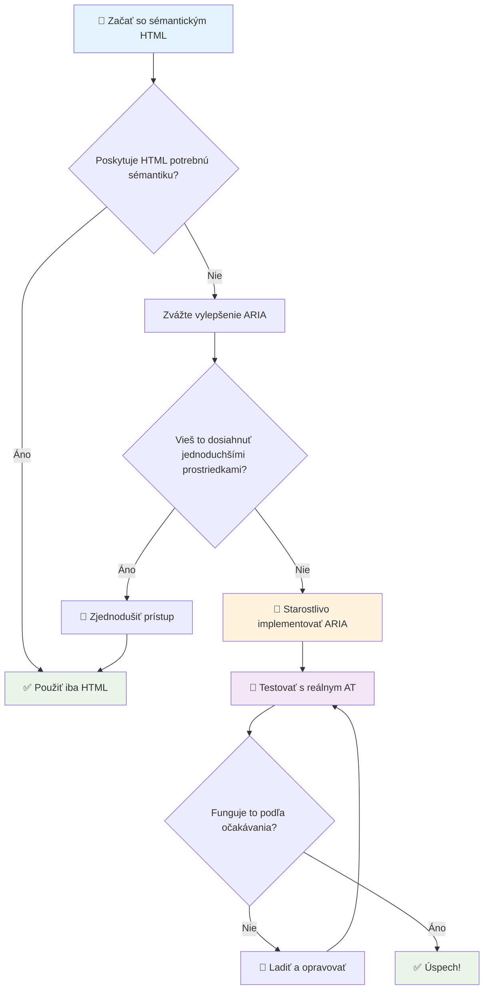
1. **Najprv sémantický HTML**: Vždy uprednostnite `<button>` pred `<div role="button">`
2. **Nezabúdajte na význam sémantiky**: Nikdy neprepíšte existujúci význam HTML (vyhnite sa `<h1 role="button">`)
3. **Udržiavajte prístupnosť pomocou klávesnice**: Všetky interaktívne ARIA prvky musia byť plne ovládateľné klávesnicou
4. **Testujte s reálnymi používateľmi**: Podpora ARIA sa výrazne líši medzi asistenčnými technológiami
5. **Začnite jednoducho**: Komplexné implementácie ARIA majú vyššiu pravdepodobnosť chýb

**🔍 Testovací pracovný postup:**

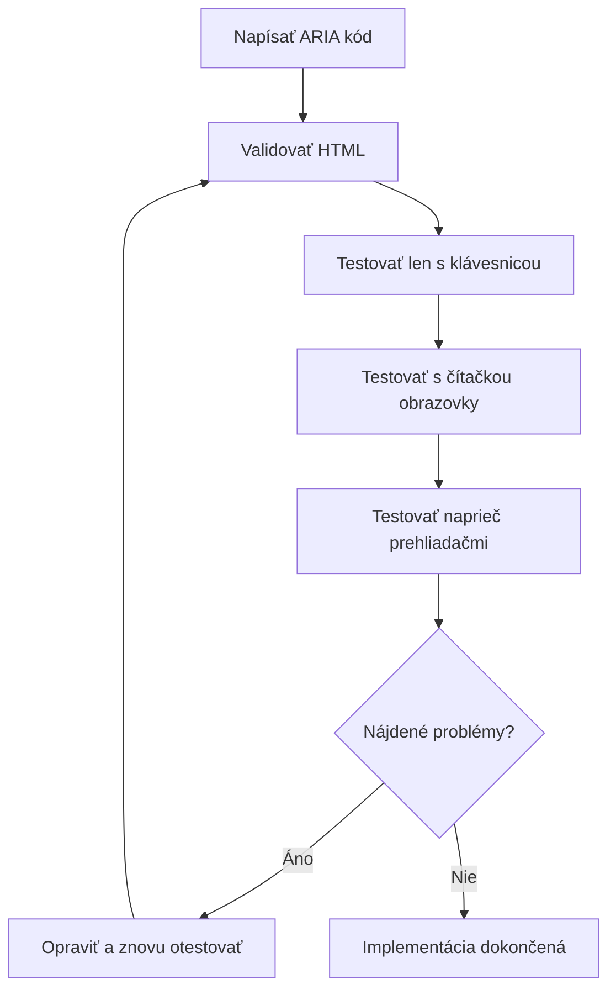
**🚫 Bežné chyby ARIA, ktorým sa vyhnúť:**

- **Protikladné informácie**: Nekontrastujte sémantiku HTML
- **Nadmieru označovanie**: Príliš veľa ARIA informácií zahlcuje používateľov
- **Statické ARIA**: Zabúdanie na aktualizáciu ARIA stavov pri zmene obsahu
- **Netestované implementácie**: ARIA, ktoré teoreticky funguje, ale v praxi zlyháva
- **Chýbajúca podpora klávesnice**: ARIA role bez príslušných klávesnicových interakcií

> 💡 **Testovacie zdroje**: Použite nástroje ako [accessibility-checker](https://www.npmjs.com/package/accessibility-checker) pre automatizovanú validáciu ARIA, ale vždy testujte s reálnymi čítačkami obrazovky pre kompletný zážitok.

### 🎭 **Overenie zručností ARIA: Ste pripravení na zložité interakcie?**

**Zhodnoťte svoju dôveru v ARIA:**
- Kedy by ste zvolili ARIA namiesto sémantického HTML? (Nápoveda: takmer nikdy!)
- Viete vysvetliť, prečo je `<div role="button">` zvyčajne horšie ako `<button>`?
- Čo je najdôležitejšia vec, na ktorú sa treba pamätať pri testovaní ARIA?

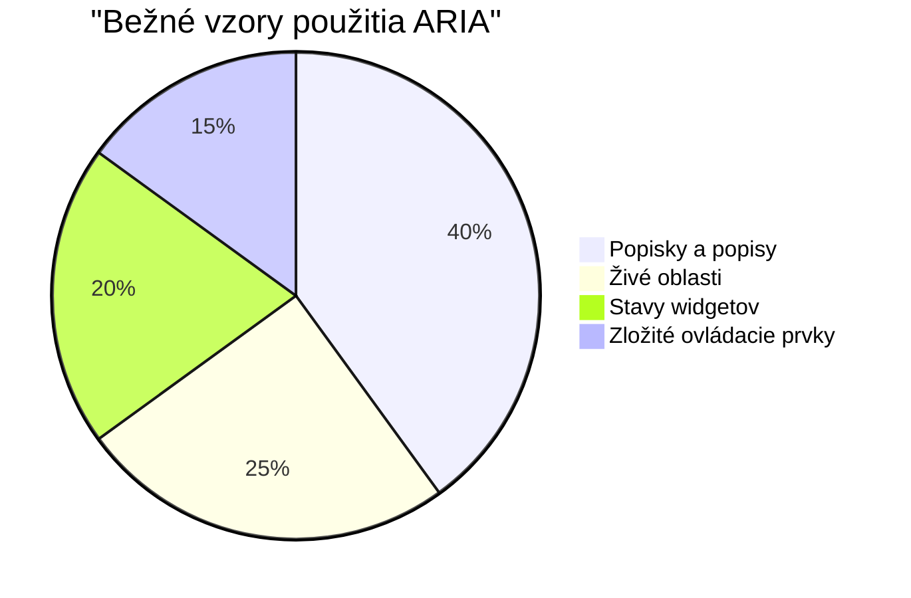
> **Kľúčová poznámka**: Väčšina použitia ARIA je na označovanie a opisovanie prvkov. Komplexné vzory widgetov sú oveľa zriedkavejšie, než by ste si mysleli!

✅ **Učte sa od expertov**: Študujte [ARIA Authoring Practices Guide](https://w3c.github.io/aria-practices/) pre overené vzory a implementácie komplexných interaktívnych widgetov.

## Sprístupnenie obrázkov a médií

Vizuálny a zvukový obsah sú základné časti moderných webových zážitkov, ale môžu vytvárať prekážky, ak nie sú implementované premyslene. Cieľom je zabezpečiť, aby informácie a emocionálny dopad vašich médií dosiahli každého používateľa. Akonáhle si na to zvyknete, stane sa to druhou prirodzenosťou.

Rôzne typy médií vyžadujú rôzne prístupy k prístupnosti. Je to ako varenie – s delikátnou rybou sa nezaobchádza rovnako ako s výdatným steakom. Pochopenie týchto rozdielov vám pomôže zvoliť správne riešenie pre každú situáciu.

### Strategická prístupnosť obrázkov

Každý obrázok na vašom webe má svoj účel. Pochopenie tohto účelu vám pomáha písať lepší alternatívny text a vytvárať inkluzívnejšie zážitky.

**Štyri typy obrázkov a stratégie alt textu:**

**Informatívne obrázky** - prenášajú dôležité informácie:
```html

```

**Dekoratívne obrázky** - čisto vizuálne, bez informačnej hodnoty:
```html

```

**Funkčné obrázky** - slúžia ako tlačidlá alebo ovládacie prvky:
```html
<button>
  
</button>
```

**Komplexné obrázky** - grafy, diagramy, infografiky:
```html

<div id="chart-description">
  <p>Detailed description: Sales data shows a steady increase across all quarters...</p>
</div>
```

### Prístupnosť videa a zvuku

**Požiadavky na video:**
- **Titulky**: Textová verzia hovoreného obsahu a zvukových efektov
- **Zvukové opisy**: Narátovanie vizuálnych prvkov pre nevidiacich používateľov
- **Prepisy**: Plná textová verzia všetkého zvukového a vizuálneho obsahu

```html
<video controls>
  <source src="video.mp4" type="video/mp4">
  <track kind="captions" src="captions.vtt" srclang="en" label="English">
  <track kind="descriptions" src="descriptions.vtt" srclang="en" label="Audio descriptions">
</video>
```

**Požiadavky na zvuk:**
- **Prepisy**: Textová verzia všetkého hovoreného obsahu
- **Vizuálne indikátory**: Pri len zvukovom obsahu zabezpečte vizuálne signály

### Moderné techniky pre obrázky

**Použitie CSS pre dekoratívne obrázky:**
```css
.hero-section {
  background-image: url('decorative-hero.jpg');
  /* Decorative images in CSS don't need alt text */
}
```

**Responzívne obrázky s prístupnosťou:**
```html
<picture>
  <source media="(min-width: 800px)" srcset="large-chart.png">
  <source media="(min-width: 400px)" srcset="medium-chart.png">
  
</picture>
```

✅ **Testujte prístupnosť obrázkov**: Použite čítačku obrazovky na navigáciu po stránke s obrázkami. Dostávate dosť informácií na pochopenie obsahu?

## Navigácia klávesnicou a správa fokusovania

Mnohí používatelia navigujú po webe výhradne pomocou klávesnice. Patrí sem ľudia s motorickými postihnutiami, skúsení používatelia, ktorí považujú klávesnicu za rýchlejšiu než myš, a ktokoľvek, komu myš prestala fungovať. Zabezpečiť, aby vaša stránka dobre fungovala s klávesnicovým vstupom, je nevyhnutné a často to robí váš web rýchlejším pre všetkých.

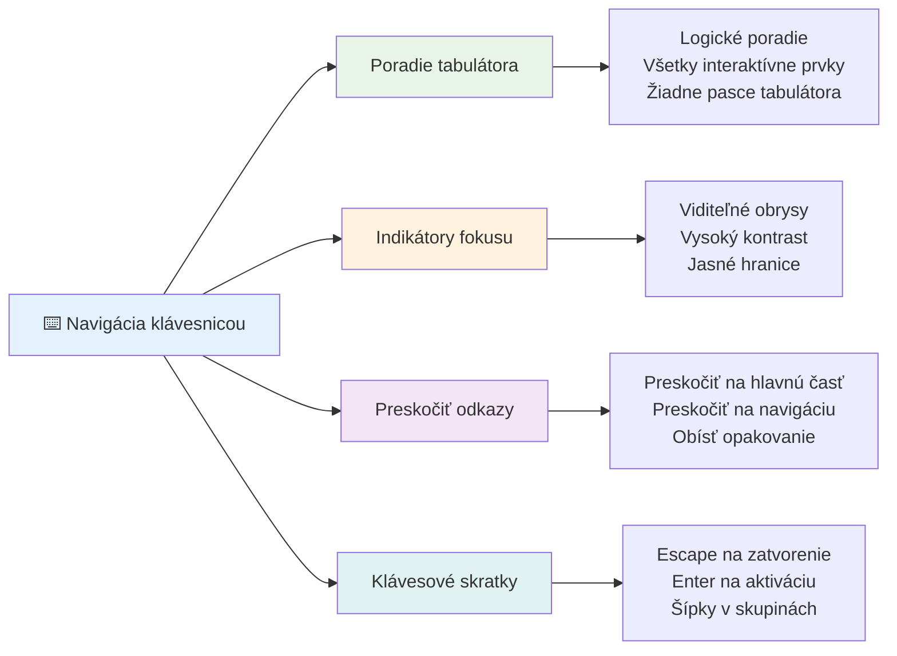
### Základné vzory klávesnicovej navigácie

**Štandardné klávesnicové interakcie:**
- **Tab**: Posuňte fokus vpred cez interaktívne prvky
- **Shift + Tab**: Posuňte fokus späť
- **Enter**: Aktivujte tlačidlá a odkazy
- **Medzerník**: Aktivujte tlačidlá, zaškrtnite zaškrtávacie políčka
- **Šípky**: Navigujte v rámci skupín komponentov (prepínače, menu)
- **Escape**: Zavrite modálne okná, rozbaľovacie ponuky alebo zrušte operácie

### Najlepšie praktiky správy fokusovania

**Viditeľné indikátory fokusovania:**
```css
/* Ensure focus is always visible */
button:focus-visible {
  outline: 2px solid #4A90A4;
  outline-offset: 2px;
}

/* Custom focus styles for different components */
.card:focus-within {
  box-shadow: 0 0 0 3px rgba(74, 144, 164, 0.5);
}
```

**Preskoč linky pre efektívnu navigáciu:**
```html
<a href="#main-content" class="skip-link">Skip to main content</a>
<a href="#navigation" class="skip-link">Skip to navigation</a>

<nav id="navigation">
  <!-- navigation content -->
</nav>
<main id="main-content">
  <!-- main content -->
</main>
```

**Správny poriadok tabulátora:**
```html
<!-- Use semantic HTML for natural tab order -->
<form>
  <label for="name">Name:</label>
  <input type="text" id="name" tabindex="0">
  
  <label for="email">Email:</label>
  <input type="email" id="email" tabindex="0">
  
  <button type="submit" tabindex="0">Submit</button>
</form>
```

### Uzamknutie fokusovania v modáloch

Pri otvorení modálnych dialógov by mal byť fokus uzamknutý v rámci modálu:

```javascript
// Moderná implementácia zachytávača fokusu
function trapFocus(element) {
  const focusableElements = element.querySelectorAll(
    'button, [href], input, select, textarea, [tabindex]:not([tabindex="-1"])'
  );
  
  const firstElement = focusableElements[0];
  const lastElement = focusableElements[focusableElements.length - 1];

  element.addEventListener('keydown', (e) => {
    if (e.key === 'Tab') {
      if (e.shiftKey && document.activeElement === firstElement) {
        e.preventDefault();
        lastElement.focus();
      } else if (!e.shiftKey && document.activeElement === lastElement) {
        e.preventDefault();
        firstElement.focus();
      }
    }
    
    if (e.key === 'Escape') {
      closeModal();
    }
  });
  
  // Zaostriť na prvý prvok pri otvorení modálu
  firstElement.focus();
}
```

✅ **Testujte klávesnicovú navigáciu**: Skúste navigovať na vašom webe iba pomocou klávesu Tab. Dovidíte sa ku všetkým interaktívnym prvkom? Je poradie fokusovania logické? Sú indikátory fokusovania jasne viditeľné?

## Prístupnosť formulárov

Formuláre sú kľúčové pre interakciu s používateľmi a vyžadujú zvláštnu pozornosť na prístupnosť.

### Spojenie štítkov a ovládacích prvkov formulára

**Každý ovládací prvok formulára potrebuje štítok:**
```html
<!-- Explicit labeling (preferred) -->
<label for="username">Username:</label>
<input type="text" id="username" name="username" required>

<!-- Implicit labeling -->
<label>
  Password:
  <input type="password" name="password" required>
</label>

<!-- Using aria-label when visual label isn't desired -->
<input type="search" aria-label="Search products" placeholder="Search...">
```

### Riešenie chýb a validácia

**Prístupné chybové správy:**
```html
<label for="email">Email Address:</label>
<input type="email" id="email" name="email" 
       aria-describedby="email-error" 
       aria-invalid="true" required>
<div id="email-error" role="alert">
  Please enter a valid email address
</div>
```

**Najlepšie praktiky validácie formulárov:**
- Použite `aria-invalid` pre označenie neplatných polí
- Poskytnite jasné, konkrétne chybové správy
- Použite `role="alert"` pre dôležité oznámenia chýb
- Zobrazujte chyby okamžite aj pri odoslaní formulára

### Fieldsety a zoskupovanie

**Zoskupujte súvisiace ovládacie prvky formulára:**
```html
<fieldset>
  <legend>Shipping Address</legend>
  <label for="street">Street Address:</label>
  <input type="text" id="street" name="street">
  
  <label for="city">City:</label>
  <input type="text" id="city" name="city">
</fieldset>

<fieldset>
  <legend>Preferred Contact Method</legend>
  <input type="radio" id="contact-email" name="contact" value="email">
  <label for="contact-email">Email</label>
  
  <input type="radio" id="contact-phone" name="contact" value="phone">
  <label for="contact-phone">Phone</label>
</fieldset>
```

## Vaša cesta k prístupnosti: Kľúčové body na zapamätanie

Gratulujeme! Práve ste získali základné znalosti na vytváranie skutočne inkluzívnych webových zážitkov. To je naozaj vzrušujúce! Webová prístupnosť nie je len o plnení legislatívnych požiadaviek – je to o pochopení rôznorodých spôsobov, akými ľudia interagujú s digitálnym obsahom, a dizajnovaní pre tú úžasnú komplexnosť.

Ste teraz súčasťou rastúcej komunity vývojárov, ktorí rozumejú, že skvelý dizajn funguje pre každého. Vitajte v klube!

**🎯 Vaša sada nástrojov pre prístupnosť teraz obsahuje:**

| Základný princíp | Implementácia | Dopad |
|------------------|---------------|--------|
| **Základ sémantického HTML** | Používajte vhodné HTML prvky pre ich určený účel | Čítačky obrazovky môžu efektívne navigovať, klávesnice fungujú automaticky |
| **Inkluzívny vizuálny dizajn** | Dostatočný kontrast, zmysluplné použitie farieb, viditeľné indikátory fokusovania | Jasné pre každého za akýchkoľvek svetelných podmienok |
| **Popisný obsah** | Významný text odkazov, alt text, nadpisy | Používatelia rozumejú obsahu aj bez vizuálneho kontextu |
| **Prístupnosť klávesnice** | Poradie tabulátora, klávesové skratky, správa fokusovania | Motorická prístupnosť a efektívnosť skúsených používateľov |
| **Vylepšenie ARIA** | Strategické použitie na vyplnenie sémantických medzier | Komplexné aplikácie fungujú s asistenčnými technológiami |
| **Komplexné testovanie** | Automatizované nástroje + manuálne overenie + testovanie reálnymi používateľmi | Odhalí problémy predtým, než ovplyvnia používateľov |

**🚀 Vaše ďalšie kroky:**

1. **Zahrňte prístupnosť do svojho pracovného procesu**: Robte testovanie prirodzenou súčasťou vývoja
2. **Učte sa od reálnych používateľov**: Hľadajte spätnú väzbu od ľudí používajúcich asistenčné technológie
3. **Buďte v obraze**: Techniky prístupnosti sa vyvíjajú s novými technológiami a štandardmi
4. **Obhajujte inklúziu**: Zdieľajte svoje znalosti a urobte prístupnosť prioritou tímu

> 💡 **Pamätajte**: Obmedzenia prístupnosti často vedú k inovatívnym, elegantným riešeniam, ktoré prospievajú všetkým. Ramps, titulky a hlasové ovládanie začali ako prístupové funkcie a stali sa hlavnými zlepšeniami.

**Obchodný prípad je jasný**: Prístupné weby oslovujú viac používateľov, majú lepšie hodnotenie vo vyhľadávačoch, nižšie náklady na údržbu a vyhýbajú sa právnym rizikám. Ale úprimne? Skutočným dôvodom, prečo sa starať o prístupnosť, je oveľa hlbší. Prístupné weby stelesňujú najlepšie hodnoty webu – otvorenosť, inkluzívnosť a myšlienku, že každý má právo na rovnaký prístup k informáciám.

Ste teraz vybavení na vytváranie inkluzívneho webu budúcnosti. Každý prístupný web, ktorý vytvoríte, robí internet vítanejším miestom pre všetkých. To je naozaj úžasné, keď sa nad tým zamyslíte!

## Ďalšie zdroje

Pokračujte vo svojej ceste učenia prístupnosti s týmito základnými zdrojmi:

**📚 Oficiálne štandardy a smernice:**
- [WCAG 2.1 Guidelines](https://www.w3.org/WAI/WCAG21/quickref/) - Oficiálny štandard prístupnosti so stručnou referenciou
- [ARIA Authoring Practices Guide](https://w3c.github.io/aria-practices/) - Komplexné vzory pre interaktívne widgety
- [WebAIM Guidelines](https://webaim.org/) - Praktické, priateľské sprievodcovské návody pre začiatočníkov

**🛠️ Nástroje a testovacie zdroje:**
- [axe DevTools](https://www.deque.com/axe/devtools/) - Priemyselný štandard pre testovanie prístupnosti
- [A11y Project Checklist](https://www.a11yproject.com/checklist/) - Krok za krokom overovanie prístupnosti
- [Accessibility Insights](https://accessibilityinsights.io/) - Komplexný testovací balík od Microsoftu
- [Color Oracle](https://colororacle.org/) - Simulátor farebnej slepoty na testovanie dizajnu

**🎓 Vzdelávanie a komunita:**
- [WebAIM Screen Reader Survey](https://webaim.org/projects/screenreadersurvey9/) - Preferencie a správanie reálnych používateľov
- [Inclusive Components](https://inclusive-components.design/) - Moderné vzory prístupných komponentov
- [A11y Coffee](https://a11y.coffee/) - Rýchle tipy a poznatky o prístupnosti
- [Iniciatíva pre webovú prístupnosť (WAI)](https://www.w3.org/WAI/) - Komplexné zdroje prístupnosti W3C

**🎥 Praktické učenie:**
- [Accessibility Developer Guide](https://www.accessibility-developer-guide.com/) - Praktické návody na implementáciu
- [Deque University](https://dequeuniversity.com/) - Profesionálne školenia o prístupnosti

## Výzva GitHub Copilot Agenta 🚀

Použite režim agenta na splnenie nasledujúcej výzvy:

**Popis:** Vytvorte prístupnú modálnu dialógovú komponentu, ktorá demonštruje správnu správu fokusovania, ARIA atribúty a vzory klávesnicovej navigácie.

**Úloha:** Vytvorte kompletnú modálnu dialógovú komponentu v HTML, CSS a JavaScript, ktorá obsahuje: správne uzamknutie fokusovania, kláves ESC na zatvorenie, zatvorenie kliknutím mimo modálu, ARIA atribúty pre čítačky obrazovky a viditeľné indikátory fokusovania. Modál by mal obsahovať formulár so správnymi štítkami a spracovaním chýb. Zabezpečte, aby komponent spĺňal štandardy WCAG 2.1 AA.


## 🚀 Výzva

Vezmite tento HTML kód a prepíšte ho tak, aby bol čo najprístupnejší podľa naučených stratégií.

```html
<!DOCTYPE html>
<html lang="en">
  <head>
    <meta charset="UTF-8">
    <meta name="viewport" content="width=device-width, initial-scale=1.0">
    <title>Turtle Ipsum - The World's Premier Turtle Fan Club</title>
    <link href='../assets/style.css' rel='stylesheet' type='text/css'>
  </head>
  <body>
    <header class="site-header">
      <h1 class="site-title">Turtle Ipsum</h1>
      <p class="site-subtitle">The World's Premier Turtle Fan Club</p>
    </header>
    
    <nav class="main-nav" aria-label="Main navigation">
      <h2 class="nav-header">Resources</h2>
      <ul class="nav-list">
        <li><a href="https://www.youtube.com/watch?v=CMNry4PE93Y">"I like turtles" video</a></li>
        <li><a href="https://en.wikipedia.org/wiki/Turtle">Basic turtle information</a></li>
        <li><a href="https://en.wikipedia.org/wiki/Turtles_(chocolate)">Chocolate turtles candy</a></li>
      </ul>
    </nav>
    
    <main class="main-content">
      <article>
        <h1>Welcome to Turtle Ipsum</h1>
        <p class="intro">
          <a href="/about">Learn more about our turtle community</a> and discover fascinating facts about these amazing creatures.
        </p>
        <p class="article-text">
          Turtle ipsum dolor sit amet, consectetur adipiscing elit, sed do eiusmod tempor incididunt ut labore et dolore magna aliqua. Ut enim ad minim veniam, quis nostrud exercitation ullamco laboris nisi ut aliquip ex ea commodo consequat. Duis aute irure dolor in reprehenderit in voluptate velit esse cillum dolore eu fugiat nulla pariatur. Excepteur sint occaecat cupidatat non proident, sunt in culpa qui officia deserunt mollit anim id est laborum.
        </p>
      </article>
    </main>
    
    <footer class="footer">
      <section class="newsletter-signup">
        <h2>Stay Updated</h2>
        <button type="button" onclick="showNewsletterForm()">Sign up for turtle news</button>
      </section>
      
      <nav class="footer-nav" aria-label="Footer navigation">
        <h2>Site Pages</h2>
        <ul>
          <li><a href="../">Home</a></li>
          <li><a href="../semantic">Semantic HTML example</a></li>
        </ul>
      </nav>
      
      <p class="footer-copyright">&copy; 2024 Instrument. All rights reserved.</p>
    </footer>
  </body>
</html>
```

**Kľúčové zlepšenia:**
- Pridaná správna sémantická HTML štruktúra
- Opravená hierarchia nadpisov (jeden h1, logický postup)
- Pridaný zmysluplný text odkazov namiesto „kliknite sem“
- Pridané správne ARIA štítky pre navigáciu
- Pridaný atribút lang a správne meta tagy
- Použité tlačidlové elementy pre interaktívne prvky
- Štruktúrovaný obsah päty pomocou správnych orientácií

## Kvíz po prednáške
[Post-lecture quiz](https://ff-quizzes.netlify.app/web/en/)

## Opakovanie a samostatné štúdium

Mnohé vlády majú zákony týkajúce sa požiadaviek na prístupnosť. Prečítajte si zákony o prístupnosti vo vašej domovskej krajine. Čo je pokryté a čo nie? Príkladom je [táto vládna stránka](https://accessibility.blog.gov.uk/).

## Zadanie
 
[Analyze a non-accessible web site](assignment.md)

Credits: [Turtle Ipsum](https://github.com/Instrument/semantic-html-sample) by Instrument

---

## 🚀 Váš časový plán zvládnutia prístupnosti

### ⚡ **Čo môžete urobiť v nasledujúcich 5 minútach**
- [ ] Nainštalovať rozšírenie axe DevTools do vášho prehliadača
- [ ] Spustiť Lighthouse audit prístupnosti na vašej obľúbenej webovej stránke
- [ ] Skúsiť navigovať po ľubovoľnej stránke iba pomocou klávesu Tab
- [ ] Otestovať vstavanú čítačku obrazovky vo vašom prehliadači (Narrator/VoiceOver)

### 🎯 **Čo môžete dosiahnuť v tejto hodine**
- [ ] Dokončiť kvíz po lekcii a zamyslieť sa nad poznatkami o prístupnosti
- [ ] Precvičiť písanie zmysluplného alt textu pre 10 rôznych obrázkov
- [ ] Auditovať štruktúru nadpisov webu pomocou rozšírenia HeadingsMap
- [ ] Opraviť problémy s prístupnosťou nájdené vo výzve v HTML
- [ ] Otestovať farebný kontrast na aktuálnom projekte pomocou nástroja WebAIM

### 📅 **Vaša týždňová cesta k prístupnosti**
- [ ] Dokončiť zadanie analýzy neprístupnej webovej stránky
- [ ] Nastaviť vývojové prostredie s nástrojmi na testovanie prístupnosti
- [ ] Precvičiť navigáciu klávesnicou na 5 rôznych zložitých webových stránkach
- [ ] Vytvoriť jednoduchý formulár so správnymi štítkami, spracovaním chýb a ARIA
- [ ] Pripojiť sa ku komunite zameranej na prístupnosť (A11y Slack, WebAIM fórum)
- [ ] Pozorovať reálnych používateľov so zdravotným postihnutím, ako prechádzajú webové stránky (YouTube má skvelé príklady)

### 🌟 **Tvoja mesačná transformácia**
- [ ] Integrovať testovanie prístupnosti do svojho vývojového workflow
- [ ] Prispieť do open source projektu opravou problémov s prístupnosťou
- [ ] Vykonať testovanie použiteľnosti s niekým, kto používa asistenčné technológie
- [ ] Vytvoriť knižnicu prístupných komponentov pre svoj tím
- [ ] Presadzovať prístupnosť vo svojom pracovisku alebo komunite
- [ ] Mentorovať niekoho nového v konceptoch prístupnosti

### 🏆 **Záverečný check-in šampióna prístupnosti**

**Osláv svoju cestu za prístupnosťou:**
- Čo bolo najprekvapujúcejšie, čo si sa dozvedel o tom, ako ľudia používajú web?
- Ktorý princíp prístupnosti najviac rezonuje s tvojím štýlom vývoja?
- Ako ti učenie o prístupnosti zmenilo pohľad na dizajn?
- Aké je prvé zlepšenie prístupnosti, ktoré chceš urobiť na reálnom projekte?

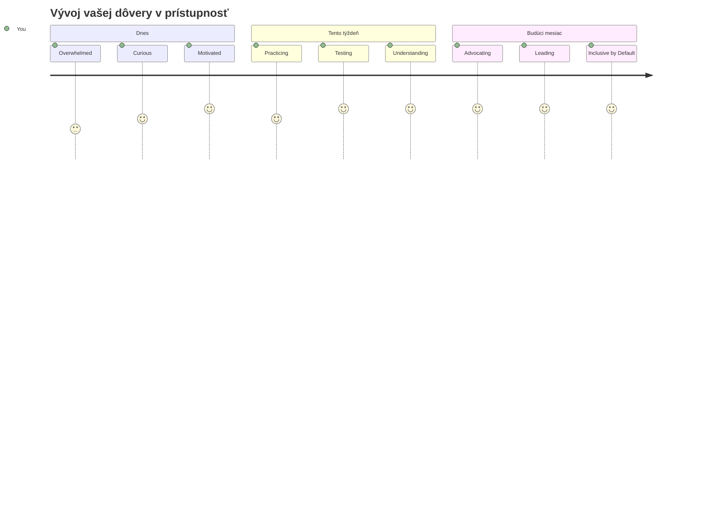
> 🌍 **Teraz si šampiónom prístupnosti!** Chápeš, že skvelé webové zážitky fungujú pre každého, bez ohľadu na to, ako pristupuje na web. Každá prístupná funkcia, ktorú vytvoríš, robí internet inkluzívnejším. Web potrebuje vývojárov ako ty, ktorí vnímajú prístupnosť nie ako obmedzenie, ale ako príležitosť vytvárať lepšie zážitky pre všetkých používateľov. Vitaj v hnutí! 🎉

---

<!-- CO-OP TRANSLATOR DISCLAIMER START -->
**Vyhlásenie o odmietnutí zodpovednosti**:
Tento dokument bol preložený pomocou AI prekladateľskej služby [Co-op Translator](https://github.com/Azure/co-op-translator). Aj keď sa snažíme o presnosť, majte prosím na pamäti, že automatizované preklady môžu obsahovať chyby alebo nepresnosti. Pôvodný dokument v jeho rodnom jazyku by mal byť považovaný za autoritatívny zdroj. Pre dôležité informácie sa odporúča profesionálny ľudský preklad. Nie sme zodpovední za akékoľvek nedorozumenia alebo nesprávne interpretácie vyplývajúce z použitia tohto prekladu.
<!-- CO-OP TRANSLATOR DISCLAIMER END -->