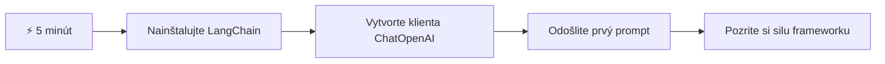
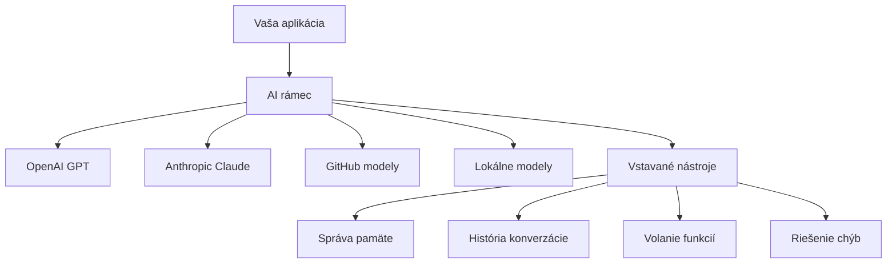
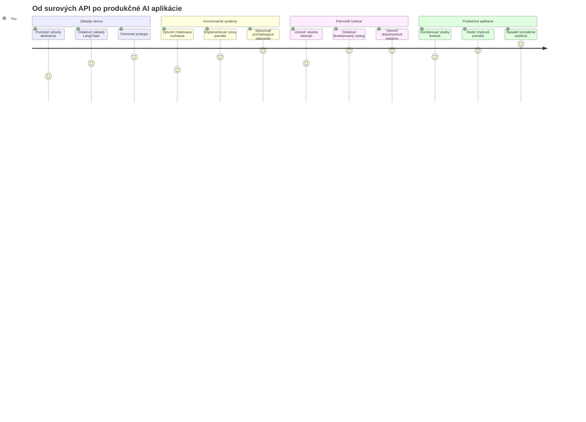
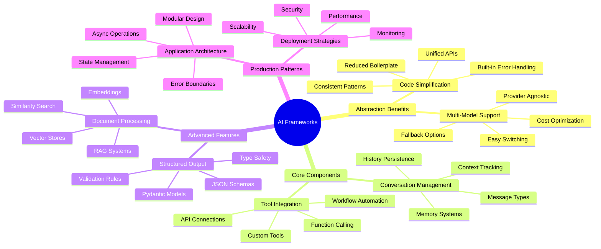
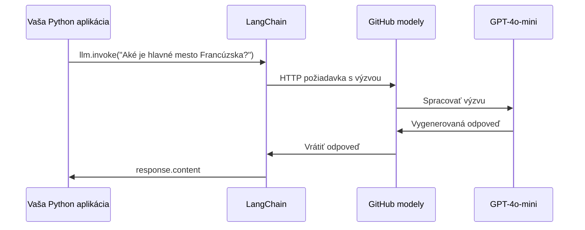
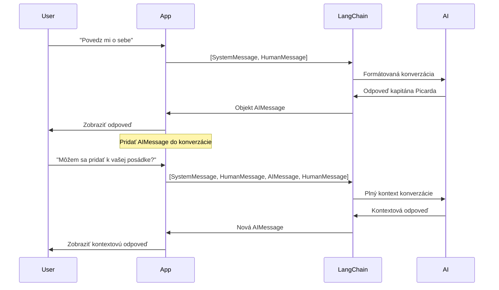
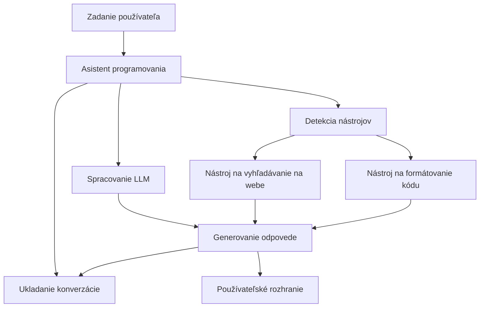
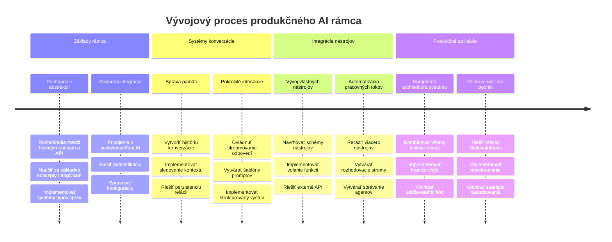
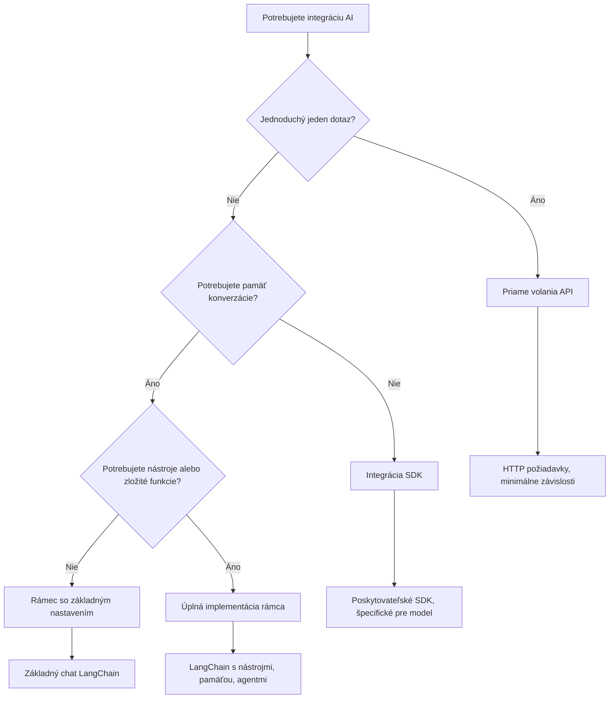

<!--
CO_OP_TRANSLATOR_METADATA:
{
  "original_hash": "3925b6a1c31c60755eaae4d578232c25",
  "translation_date": "2026-01-07T04:19:54+00:00",
  "source_file": "10-ai-framework-project/README.md",
  "language_code": "sk"
}
-->
# AI Framework

Už ste niekedy mali pocit, že stavanie AI aplikácií od základov je príliš zložité? Nie ste sami! AI frameworky sú ako švajčiarsky armádny nôž pre vývoj AI – sú to výkonné nástroje, ktoré vám môžu ušetriť čas a nervy pri tvorbe inteligentných aplikácií. Predstavte si AI framework ako dobre zorganizovanú knižnicu: poskytuje predpripravené komponenty, štandardizované API a inteligentné abstrakcie, takže sa môžete sústrediť na riešenie problémov namiesto zápasenia s detailmi implementácie.

V tejto lekcii preskúmame, ako frameworky ako LangChain môžu premeniť kedysi zložité úlohy integrácie AI na čistý, čitateľný kód. Objavíte, ako riešiť reálne výzvy, ako sledovanie rozhovorov, implementácia volania nástrojov a správa rôznych AI modelov cez jednotné rozhranie.

Na konci budete vedieť, kedy siahnuť po frameworkoch namiesto priamych API volaní, ako efektívne využívať ich abstrakcie a ako zostaviť AI aplikácie pripravené na reálne použitie. Poďme preskúmať, čo môžu AI frameworky priniesť vašim projektom.

## ⚡ Čo môžete urobiť počas nasledujúcich 5 minút

**Rýchly štart pre zaneprázdnených vývojárov**


- **Minúta 1**: Nainštalujte LangChain: `pip install langchain langchain-openai`
- **Minúta 2**: Nastavte si GitHub token a importujte klienta ChatOpenAI
- **Minúta 3**: Vytvorte jednoduchý rozhovor s systémovými a ľudskými správami
- **Minúta 4**: Pridajte základný nástroj (napríklad sčítaciu funkciu) a vyskúšajte volanie AI nástrojov
- **Minúta 5**: Zažite rozdiel medzi priamymi API volaniami a abstrakciou frameworku

**Rýchly testovací kód**:  
```python
from langchain_openai import ChatOpenAI
from langchain_core.messages import SystemMessage, HumanMessage

llm = ChatOpenAI(
    api_key=os.environ["GITHUB_TOKEN"],
    base_url="https://models.github.ai/inference",
    model="openai/gpt-4o-mini"
)

response = llm.invoke([
    SystemMessage(content="You are a helpful coding assistant"),
    HumanMessage(content="Explain Python functions briefly")
])
print(response.content)
```
  
**Prečo je to dôležité**: Za 5 minút zažijete, ako AI frameworky pretransformujú zložité AI integrácie na jednoduché volania metód. Toto je základ, ktorý poháňa produkčné AI aplikácie.

## Prečo si vybrať framework?

Takže ste pripravení vytvoriť AI aplikáciu – skvelé! Ale tu je vec: máte niekoľko rôznych ciest, ktoré môžete zvoliť, a každá má svoje výhody a nevýhody. Je to ako vybrať si medzi chôdzou, bicyklovaním alebo jazdou autom – všetky vás dostanú do cieľa, ale zážitok (a námaha) bude úplne iný.

Poďme rozobrať tri hlavné spôsoby, ako integrovať AI do vašich projektov:

| Prístup | Výhody | Najvhodnejšie pre | Upozornenia |
|----------|------------|----------|--------------|
| **Priame HTTP požiadavky** | Plná kontrola, žiadne závislosti | Jednoduché dotazy, učenie základov | Viac rozťahaný kód, manuálne spracovanie chýb |
| **SDK integrácia** | Menej šablónového kódu, optimalizácia pre konkrétny model | Aplikácie s jedným modelom | Obmedzené na konkrétnych poskytovateľov |
| **AI frameworky** | Jednotné API, zabudované abstrakcie | Multi-modelové aplikácie, zložité pracovné toky | Krivka učenia, potenciálne nadmerné abstrakcie |

### Výhody frameworkov v praxi


**Prečo sú frameworky dôležité:**  
- **Zjednotia** viacerých AI poskytovateľov pod jedno rozhranie  
- **Automaticky spravujú** pamäť konverzácií  
- **Poskytujú** hotové nástroje na bežné úlohy ako embeddingy a volanie funkcií  
- **Riadi** spracovanie chýb a logiku opakovaných pokusov  
- **Premieňajú** zložité pracovné toky na čitateľné volania metód  

> 💡 **Tip od profesionála**: Frameworky používajte pri prepínaní medzi rôznymi AI modelmi alebo pri tvorbe komplexných funkcií ako agenti, pamäť alebo volanie nástrojov. Pri učení základov alebo tvorbe jednoduchých, špecializovaných aplikácií zostaňte pri priamych API.

**Zhrnutie**: Rovnako ako pri výbere medzi remeselnými špecializovanými nástrojmi a plnohodnotnou dielňou, ide o prispôsobenie nástroja úlohe. Frameworky vynikajú pri zložitých, bohatých aplikáciách, zatiaľ čo priame API dobre fungujú pri jednoduchých prípadoch použitia.

## 🗺️ Vaša cesta učenia sa majstrovstvu AI frameworkov


**Vaša cieľová destinácia**: Na konci tejto lekcie ovládnete vývoj AI frameworkov a budete schopní vytvárať sofistikované, produkčne pripravené AI aplikácie, ktoré môžu konkurovať komerčným AI asistentom.

## Úvod

V tejto lekcii sa naučíme:  

- Používať bežný AI framework.  
- Riešiť bežné problémy ako chat, využívanie nástrojov, pamäť a kontext.  
- Využiť toto na tvorbu AI aplikácií.

## 🧠 Ekosystém vývoja AI frameworkov


**Hlavný princíp**: AI frameworky abstraktujú komplexnosť, pričom poskytujú výkonné abstrakcie pre správu rozhovorov, integráciu nástrojov a spracovanie dokumentov, čo umožňuje vývojárom vytvárať sofistikované AI aplikácie s čistým, udržiavateľným kódom.

## Váš prvý AI prompt

Začnime so základmi vytvorením vašej prvej AI aplikácie, ktorá odošle otázku a dostane odpoveď späť. Rovnako ako Archimedes objavil princíp vypudenia vo svojej kúpeli, niekedy najjednoduchšie pozorovania vedú k najvýkonnejším poznatkom – a frameworky tieto poznatky sprístupňujú.

### Nastavenie LangChain s GitHub modelmi

Použijeme LangChain na pripojenie k GitHub modelom, čo je veľmi užitočné, pretože vám to poskytuje bezplatný prístup k rôznym AI modelom. Najlepšie na tom je, že stačí len niekoľko jednoduchých konfiguračných parametrov, aby ste mohli začať:

```python
from langchain_openai import ChatOpenAI
import os

llm = ChatOpenAI(
    api_key=os.environ["GITHUB_TOKEN"],
    base_url="https://models.github.ai/inference",
    model="openai/gpt-4o-mini",
)

# Odoslať jednoduchý prompt
response = llm.invoke("What's the capital of France?")
print(response.content)
```
  
**Rozobratie, čo sa tu deje:**  
- **Vytvára** LangChain klienta pomocou triedy `ChatOpenAI` - to je váš vstup do AI!  
- **Konfiguruje** pripojenie k GitHub modelom s vaším autentifikačným tokenom  
- **Špecifikuje**, ktorý AI model použiť (`gpt-4o-mini`) – predstavte si to ako výber AI asistenta  
- **Odosiela** vašu otázku cez metódu `invoke()` – tu sa deje kúzlo  
- **Extrahuje** a zobrazí odpoveď – a voilà, rozprávate sa s AI!

> 🔧 **Poznámka k nastaveniu**: Ak používate GitHub Codespaces, máte šťastie – `GITHUB_TOKEN` je už nastavený! Pracujete lokálne? Žiadny problém, stačí si vytvoriť osobný prístupový token s potrebnými právami.

**Očakávaný výstup:**  
```text
The capital of France is Paris.
```
  

## Budovanie konverzačnej AI

Prvý príklad demonštruje základy, ale je to iba jedna výmena – položíte otázku, dostanete odpoveď a hotovo. V reálnych aplikáciách chcete, aby si vaša AI pamätala, o čom ste hovorili, podobne ako Watson a Holmes budovali svoje vyšetrovacie rozhovory v priebehu času.

Tu sa LangChain stáva obzvlášť užitočným. Poskytuje rôzne typy správ, ktoré pomáhajú štruktúrovať konverzácie a umožňujú dať vašej AI osobnosť. Budete vytvárať chatové skúsenosti, ktoré udržiavajú kontext a charakter.

### Porozumenie typom správ

Predstavte si tieto typy správ ako rôzne "klobúky", ktoré účastníci nosia v konverzácii. LangChain používa rôzne triedy správ na sledovanie, kto čo povedal:

| Typ správy | Účel | Príklad použitia |
|--------------|---------|------------------|
| `SystemMessage` | Definuje osobnosť a správanie AI | "Si nápomocný asistent pre kódovanie" |
| `HumanMessage` | Reprezentuje vstup používateľa | "Vysvetli, ako fungujú funkcie" |
| `AIMessage` | Ukladá odpovede AI | Predchádzajúce AI odpovede v rozhovore |

### Vytvorenie vašej prvej konverzácie

Vytvorme rozhovor, kde naša AI zaujme špecifickú rolu. Nech je to kapitán Picard – postava známa svojou diplomatickou múdrosťou a vodcovstvom:

```python
messages = [
    SystemMessage(content="You are Captain Picard of the Starship Enterprise"),
    HumanMessage(content="Tell me about you"),
]
```
  
**Rozobratie nastavenia tejto konverzácie:**  
- **Určuje** rolu a osobnosť AI cez `SystemMessage`  
- **Dodáva** počiatočný používateľský dotaz cez `HumanMessage`  
- **Vytvára** základ pre viackolový rozhovor

Celý kód príkladu vyzerá takto:

```python
from langchain_core.messages import HumanMessage, SystemMessage
from langchain_openai import ChatOpenAI
import os

llm = ChatOpenAI(
    api_key=os.environ["GITHUB_TOKEN"],
    base_url="https://models.github.ai/inference",
    model="openai/gpt-4o-mini",
)

messages = [
    SystemMessage(content="You are Captain Picard of the Starship Enterprise"),
    HumanMessage(content="Tell me about you"),
]


# funguje
response  = llm.invoke(messages)
print(response.content)
```
  
Mali by ste vidieť výstup podobný tomuto:

```text
I am Captain Jean-Luc Picard, the commanding officer of the USS Enterprise (NCC-1701-D), a starship in the United Federation of Planets. My primary mission is to explore new worlds, seek out new life and new civilizations, and boldly go where no one has gone before. 

I believe in the importance of diplomacy, reason, and the pursuit of knowledge. My crew is diverse and skilled, and we often face challenges that test our resolve, ethics, and ingenuity. Throughout my career, I have encountered numerous species, grappled with complex moral dilemmas, and have consistently sought peaceful solutions to conflicts.

I hold the ideals of the Federation close to my heart, believing in the importance of cooperation, understanding, and respect for all sentient beings. My experiences have shaped my leadership style, and I strive to be a thoughtful and just captain. How may I assist you further?
```
  
Aby ste udržali kontinuitu rozhovoru (namiesto resetovania kontextu pri každom novom spustení), musíte neustále pridávať odpovede do zoznamu správ. Rovnako ako ústne tradície, ktoré uchovávali príbehy po generácie, tento prístup vytvára trvalú pamäť:

```python
from langchain_core.messages import HumanMessage, SystemMessage
from langchain_openai import ChatOpenAI
import os

llm = ChatOpenAI(
    api_key=os.environ["GITHUB_TOKEN"],
    base_url="https://models.github.ai/inference",
    model="openai/gpt-4o-mini",
)

messages = [
    SystemMessage(content="You are Captain Picard of the Starship Enterprise"),
    HumanMessage(content="Tell me about you"),
]


# funguje
response  = llm.invoke(messages)

print(response.content)

print("---- Next ----")

messages.append(response)
messages.append(HumanMessage(content="Now that I know about you, I'm Chris, can I be in your crew?"))

response  = llm.invoke(messages)

print(response.content)

```
  
Celkom šikovné, však? Čo sa tu deje, je volanie LLM dvakrát – najprv s našimi počiatočnými dvoma správami, a potom znovu s celou históriou rozhovoru. Je to, akoby AI skutočne sledovala náš rozhovor!

Pri spustení tohto kódu dostanete druhú odpoveď, ktorá bude znieť asi takto:

```text
Welcome aboard, Chris! It's always a pleasure to meet those who share a passion for exploration and discovery. While I cannot formally offer you a position on the Enterprise right now, I encourage you to pursue your aspirations. We are always in need of talented individuals with diverse skills and backgrounds. 

If you are interested in space exploration, consider education and training in the sciences, engineering, or diplomacy. The values of curiosity, resilience, and teamwork are crucial in Starfleet. Should you ever find yourself on a starship, remember to uphold the principles of the Federation: peace, understanding, and respect for all beings. Your journey can lead you to remarkable adventures, whether in the stars or on the ground. Engage!
```
  

Toto beriem ako "možno" ;)

## Streaming odpovede

Všimli ste si niekedy, že ChatGPT akoby "písal" svoje odpovede v reálnom čase? To je práve streaming v akcii. Ako sledovať zručného kaligrafa pri práci – vidieť znaky objavovať sa ťah po ťahu namiesto toho, aby sa objavili naraz – streaming robí interakciu prirodzenejšou a poskytuje okamžitú spätnú väzbu.

### Implementácia streamingu s LangChain

```python
from langchain_openai import ChatOpenAI
import os

llm = ChatOpenAI(
    api_key=os.environ["GITHUB_TOKEN"],
    base_url="https://models.github.ai/inference",
    model="openai/gpt-4o-mini",
    streaming=True
)

# Streamujte odpoveď
for chunk in llm.stream("Write a short story about a robot learning to code"):
    print(chunk.content, end="", flush=True)
```
  
**Prečo je streaming skvelý:**  
- **Zobrazuje** obsah počas vytvárania – žiadne trápne čakanie!  
- **Dáva** používateľom pocit, že sa niečo naozaj deje  
- **Pôsobí** rýchlejšie, aj keď technicky nemusí byť  
- **Umožňuje** používateľom začať čítať, kým AI ešte "premýšľa"

> 💡 **Tip pre používateľský zážitok**: Streaming naozaj vynikne pri dlhších odpovediach ako vysvetlenia kódu, tvorivom písaní alebo detailných tutoriáloch. Vaši používatelia si obľúbia vidieť progres namiesto pozerania na prázdnu obrazovku!

### 🎯 Pedagogická kontrola: Výhody abstrakcie frameworku

**Zastavte sa a zamyslite sa**: Práve ste zažili silu abstrahovaní AI frameworku. Porovnajte, čo ste sa naučili, s priamymi API volaniami z predchádzajúcich lekcií.

**Rýchle sebahodnotenie**:  
- Dokážete vysvetliť, ako LangChain zjednodušuje správu rozhovorov oproti manuálnemu sledovaniu správ?  
- Aký je rozdiel medzi metódami `invoke()` a `stream()`, a kedy ktorú použiť?  
- Ako zlepšuje systém typov správ organizáciu kódu?

**Prepojenie s realitou**: Vzor abstrakcií, ktoré ste sa naučili (typy správ, streaming rozhrania, pamäť rozhovorov), sa používajú v každej veľkej AI aplikácii – od rozhrania ChatGPT po kódovacieho asistenta GitHub Copilot. Ovládate rovnaké architektonické vzory ako profesionálne AI vývojárske tímy.

**Výzva**: Ako by ste navrhli abstrakciu frameworku na spracovanie rôznych poskytovateľov AI modelov (OpenAI, Anthropic, Google) cez jedno rozhranie? Zvážte výhody a kompromisy.

## Šablóny promptov

Šablóny promptov fungujú ako rétorické štruktúry používané v klasickej oratórii – predstavte si, ako Cicero prispôsoboval svoje prejavy rôznym publikám, pričom si zachovával rovnaký presvedčivý rámec. Umožňujú vám vytvárať znovu použiteľné prompty, kde môžete vymeniť rôzne informácie bez prepísania všetkého od začiatku. Keď šablónu nastavíte, len zaplníte premenné hodnotami, ktoré potrebujete.

### Vytváranie znovu použiteľných promptov

```python
from langchain_core.prompts import ChatPromptTemplate

# Definujte šablónu pre vysvetlenia kódu
template = ChatPromptTemplate.from_messages([
    ("system", "You are an expert programming instructor. Explain concepts clearly with examples."),
    ("human", "Explain {concept} in {language} with a practical example for {skill_level} developers")
])

# Použite šablónu s rôznymi hodnotami
questions = [
    {"concept": "functions", "language": "JavaScript", "skill_level": "beginner"},
    {"concept": "classes", "language": "Python", "skill_level": "intermediate"},
    {"concept": "async/await", "language": "JavaScript", "skill_level": "advanced"}
]

for question in questions:
    prompt = template.format_messages(**question)
    response = llm.invoke(prompt)
    print(f"Topic: {question['concept']}\n{response.content}\n---\n")
```
  
**Prečo si zamilujete používanie šablón:**  
- **Zabezpečuje** konzistentnosť promptov v celej aplikácii  
- **Koniec s** neprehľadným zlučovaním reťazcov – len čisté, jednoduché premenné  
- **Vaša AI** sa správa predvídateľne, pretože štruktúra zostáva rovnaká  
- **Aktualizácie** sú jednoduché – zmeňte šablónu raz a je to opravené všade

## Štruktúrovaný výstup

Už ste sa niekedy rozčuľovali, keď ste sa snažili rozparsovať odpovede AI, ktoré prišli ako nestruktúrovaný text? Štruktúrovaný výstup je ako naučiť vašu AI nasledovať systematický prístup, ktorý používal Linnaeus na biologickú klasifikáciu – organizovaný, predvídateľný a ľahko použiteľný. Môžete si žiadať JSON, špecifické dátové štruktúry alebo akýkoľvek formát, ktorý potrebujete.

### Definovanie schém výstupu

```python
from langchain_core.prompts import ChatPromptTemplate
from langchain_core.output_parsers import JsonOutputParser
from pydantic import BaseModel, Field

class CodeReview(BaseModel):
    score: int = Field(description="Code quality score from 1-10")
    strengths: list[str] = Field(description="List of code strengths")
    improvements: list[str] = Field(description="List of suggested improvements")
    overall_feedback: str = Field(description="Summary feedback")

# Nastaviť parser
parser = JsonOutputParser(pydantic_object=CodeReview)

# Vytvoriť prompt s formátovacími inštrukciami
prompt = ChatPromptTemplate.from_messages([
    ("system", "You are a code reviewer. {format_instructions}"),
    ("human", "Review this code: {code}")
])

# Naformátovať prompt s inštrukciami
chain = prompt | llm | parser

# Získať štruktúrovanú odpoveď
code_sample = """
def calculate_average(numbers):
    return sum(numbers) / len(numbers)
"""

result = chain.invoke({
    "code": code_sample,
    "format_instructions": parser.get_format_instructions()
})

print(f"Score: {result['score']}")
print(f"Strengths: {', '.join(result['strengths'])}")
```
  
**Prečo je štruktúrovaný výstup revolučný:**  
- **Nuž už nemusíte** hádať, aký formát dostanete späť – je konzistentný zakaždým  
- **Integruje sa** priamo do vašich databáz a API bez dodatočnej práce  
- **Zachytáva** divné AI odpovede skôr, než aplikáciu zlomia  
- **Robí** váš kód prehľadnejším, pretože presne viete, s čím pracujete

## Volanie nástrojov

Teraz prichádzame k jednej z najsilnejších funkcií: nástroje. Takto dávate svojej AI praktické schopnosti nad rámec konverzácie. Rovnako ako stredoveké cechy vyvíjali špecializované nástroje na konkrétne remeslá, môžete vašu AI vybaviť zameranými nástrojmi. Opíšete, aké nástroje sú k dispozícii, a keď niekto požiada o niečo, čo zodpovedá, vaša AI môže konať.

### Použitie Pythonu

Pridajme nejaké nástroje takto:

```python
from typing_extensions import Annotated, TypedDict

class add(TypedDict):
    """Add two integers."""

    # Anotácie musia mať typ a môžu voliteľne obsahovať predvolenú hodnotu a popis (v tomto poradí).
    a: Annotated[int, ..., "First integer"]
    b: Annotated[int, ..., "Second integer"]

tools = [add]

functions = {
    "add": lambda a, b: a + b
}
```
  
Čo sa tu deje? Vytvárame plán pre nástroj nazvaný `add`. Dedením z `TypedDict` a použitím tých moderných `Annotated` typov pre `a` a `b` dávame LLM jasnú predstavu, čo tento nástroj robí a čo potrebuje. Slovník `functions` je ako naša skrinka s náradím – hovorí nášmu kódu presne, čo má robiť, keď sa AI rozhodne použiť konkrétny nástroj.

Teraz si pozrime, ako voláme LLM s týmto nástrojom:

```python
llm = ChatOpenAI(
    api_key=os.environ["GITHUB_TOKEN"],
    base_url="https://models.github.ai/inference",
    model="openai/gpt-4o-mini",
)

llm_with_tools = llm.bind_tools(tools)
```
  
Tu voláme `bind_tools` s našim poľom `tools` a tým pádom má LLM `llm_with_tools` teraz znalosti o tomto nástroji.

Na používanie tohto nového LLM môžeme použiť nasledujúci kód:

```python
query = "What is 3 + 12?"

res = llm_with_tools.invoke(query)
if(res.tool_calls):
    for tool in res.tool_calls:
        print("TOOL CALL: ", functions[tool["name"]](../../../10-ai-framework-project/**tool["args"]))
print("CONTENT: ",res.content)
```
  
Keď teraz zavoláme `invoke` na tomto novom llm, ktorý má nástroje, možno bude vlastnosť `tool_calls` vyplnená. Ak áno, každý identifikovaný nástroj má vlastnosti `name` a `args`, ktoré určujú, ktorý nástroj sa má volať a s akými argumentmi. Celý kód vyzerá takto:

```python
from langchain_core.messages import HumanMessage, SystemMessage
from langchain_openai import ChatOpenAI
import os
from typing_extensions import Annotated, TypedDict

class add(TypedDict):
    """Add two integers."""

    # Anotácie musia mať typ a môžu voliteľne obsahovať predvolenú hodnotu a popis (v tomto poradí).
    a: Annotated[int, ..., "First integer"]
    b: Annotated[int, ..., "Second integer"]

tools = [add]

functions = {
    "add": lambda a, b: a + b
}

llm = ChatOpenAI(
    api_key=os.environ["GITHUB_TOKEN"],
    base_url="https://models.github.ai/inference",
    model="openai/gpt-4o-mini",
)

llm_with_tools = llm.bind_tools(tools)

query = "What is 3 + 12?"

res = llm_with_tools.invoke(query)
if(res.tool_calls):
    for tool in res.tool_calls:
        print("TOOL CALL: ", functions[tool["name"]](../../../10-ai-framework-project/**tool["args"]))
print("CONTENT: ",res.content)
```
  
Pri spustení tohto kódu by ste mali vidieť výstup podobný tomuto:

```text
TOOL CALL:  15
CONTENT: 
```
  
AI preskúmala "Čo je 3 + 12" a rozpoznala to ako úlohu pre nástroj `add`. Rovnako ako skúsený knihovník vie, ktorú referenciu konzultovať podľa typu kladenej otázky, urobila toto rozhodnutie na základe názvu nástroja, popisu a špecifikácie polí. Výsledok 15 pochádza z vykonania nástroja cez náš slovník `functions`:

```python
print("TOOL CALL: ", functions[tool["name"]](../../../10-ai-framework-project/**tool["args"]))
```
  
### Zaujímavejší nástroj, ktorý volá webové API
Pridávanie čísel demonštruje koncept, ale skutočné nástroje zvyčajne vykonávajú zložitejšie operácie, ako napríklad volanie webových API. Rozšírme náš príklad tak, že AI načíta obsah z internetu – podobne ako kedysi telegrafní operátori spájali vzdialené miesta:

```python
class joke(TypedDict):
    """Tell a joke."""

    # Anotácie musia mať typ a môžu voliteľne obsahovať predvolenú hodnotu a popis (v tomto poradí).
    category: Annotated[str, ..., "The joke category"]

def get_joke(category: str) -> str:
    response = requests.get(f"https://api.chucknorris.io/jokes/random?category={category}", headers={"Accept": "application/json"})
    if response.status_code == 200:
        return response.json().get("value", f"Here's a {category} joke!")
    return f"Here's a {category} joke!"

functions = {
    "add": lambda a, b: a + b,
    "joke": lambda category: get_joke(category)
}

query = "Tell me a joke about animals"

# zvyšok kódu je rovnaký
```

Ak teraz spustíte tento kód, dostanete odpoveď s niečím ako:

```text
TOOL CALL:  Chuck Norris once rode a nine foot grizzly bear through an automatic car wash, instead of taking a shower.
CONTENT:  
```

```mermaid
flowchart TD
    A[Používateľský dopyt: "Povedz mi vtip o zvieratách"] --> B[Analýza LangChain]
    B --> C{Nástroj dostupný?}
    C -->|Áno| D[Vybrať nástroj na vtipy]
    C -->|Nie| E[Vygenerovať priamu odpoveď]
    
    D --> F[Extrahovať parametre]
    F --> G[Zavolať vtip(kategória="zvieratá")]
    G --> H[API požiadavka na chucknorris.io]
    H --> I[Vrátiť obsah vtipu]
    I --> J[Zobraziť používateľovi]
    
    E --> K[AI-generovaná odpoveď]
    K --> J
    
    subgraph "Vrstva definície nástroja"
        L[TypedDict Schéma]
        M[Implementácia funkcie]
        N[Validácia parametrov]
    end
    
    D --> L
    F --> N
    G --> M
```
Tu je kód v celej jeho podobe:

```python
from langchain_openai import ChatOpenAI
import requests
import os
from typing_extensions import Annotated, TypedDict

class add(TypedDict):
    """Add two integers."""

    # Anotácie musia mať typ a môžu voliteľne obsahovať predvolenú hodnotu a popis (v tomto poradí).
    a: Annotated[int, ..., "First integer"]
    b: Annotated[int, ..., "Second integer"]

class joke(TypedDict):
    """Tell a joke."""

    # Anotácie musia mať typ a môžu voliteľne obsahovať predvolenú hodnotu a popis (v tomto poradí).
    category: Annotated[str, ..., "The joke category"]

tools = [add, joke]

def get_joke(category: str) -> str:
    response = requests.get(f"https://api.chucknorris.io/jokes/random?category={category}", headers={"Accept": "application/json"})
    if response.status_code == 200:
        return response.json().get("value", f"Here's a {category} joke!")
    return f"Here's a {category} joke!"

functions = {
    "add": lambda a, b: a + b,
    "joke": lambda category: get_joke(category)
}

llm = ChatOpenAI(
    api_key=os.environ["GITHUB_TOKEN"],
    base_url="https://models.github.ai/inference",
    model="openai/gpt-4o-mini",
)

llm_with_tools = llm.bind_tools(tools)

query = "Tell me a joke about animals"

res = llm_with_tools.invoke(query)
if(res.tool_calls):
    for tool in res.tool_calls:
        # print("VOLANIE NÁSTROJA: ", nástroj)
        print("TOOL CALL: ", functions[tool["name"]](../../../10-ai-framework-project/**tool["args"]))
print("CONTENT: ",res.content)
```

## Embeddingy a spracovanie dokumentov

Embeddingy predstavujú jedno z najvyspelejších riešení v modernej AI. Predstavte si, že by ste mohli z ľubovoľného textu vytvoriť číselné súradnice, ktoré zachytávajú jeho význam. Presne to embeddingy robia – transformujú text na body v viacrozmernom priestore, kde sa podobné koncepty zhlukujú. Je to ako mať súradnicový systém pre myšlienky, pripomínajúci, ako Mendelejev usporiadal periodickú tabuľku podľa atómových vlastností.

### Vytváranie a používanie embeddingov

```python
from langchain_openai import OpenAIEmbeddings
from langchain_community.vectorstores import FAISS
from langchain_community.document_loaders import TextLoader
from langchain.text_splitter import CharacterTextSplitter

# Inicializujte vektory
embeddings = OpenAIEmbeddings(
    api_key=os.environ["GITHUB_TOKEN"],
    base_url="https://models.github.ai/inference",
    model="text-embedding-3-small"
)

# Načítajte a rozdeľte dokumenty
loader = TextLoader("documentation.txt")
documents = loader.load()

text_splitter = CharacterTextSplitter(chunk_size=1000, chunk_overlap=0)
texts = text_splitter.split_documents(documents)

# Vytvorte úložisko vektorov
vectorstore = FAISS.from_documents(texts, embeddings)

# Vykonajte vyhľadávanie podľa podobnosti
query = "How do I handle user authentication?"
similar_docs = vectorstore.similarity_search(query, k=3)

for doc in similar_docs:
    print(f"Relevant content: {doc.page_content[:200]}...")
```

### Nahrávače dokumentov pre rôzne formáty

```python
from langchain_community.document_loaders import (
    PyPDFLoader,
    CSVLoader,
    JSONLoader,
    WebBaseLoader
)

# Načítať rôzne typy dokumentov
pdf_loader = PyPDFLoader("manual.pdf")
csv_loader = CSVLoader("data.csv")
json_loader = JSONLoader("config.json")
web_loader = WebBaseLoader("https://example.com/docs")

# Spracovať všetky dokumenty
all_documents = []
for loader in [pdf_loader, csv_loader, json_loader, web_loader]:
    docs = loader.load()
    all_documents.extend(docs)
```

**Čo môžete robiť s embeddingami:**
- **Vytvoriť** vyhľadávanie, ktoré naozaj rozumie, čo máte na mysli, nielen hľadanie kľúčových slov
- **Vytvoriť** AI, ktorá dokáže odpovedať na otázky o vašich dokumentoch
- **Tvoriť** odporúčacie systémy, ktoré navrhujú skutočne relevantný obsah
- **Automaticky** organizovať a kategorizovať váš obsah

```mermaid
flowchart LR
    A[Dokumenty] --> B[Rozdeľovač textu]
    B --> C[Vytvorenie vektorov]
    C --> D[Vektorové uloženisko]
    
    E[Dotaz používateľa] --> F[Vektor dotazu]
    F --> G[Vyhľadávanie podobnosti]
    G --> D
    D --> H[Relevantné dokumenty]
    H --> I[Odpoveď AI]
    
    subgraph "Vektorový priestor"
        J[Dokument A: [0.1, 0.8, 0.3...]]
        K[Dokument B: [0.2, 0.7, 0.4...]]
        L[Dotaz: [0.15, 0.75, 0.35...]]
    end
    
    C --> J
    C --> K
    F --> L
    G --> J
    G --> K
```
## Vytvorenie kompletnej AI aplikácie

Teraz všetko, čo ste sa naučili, integrujeme do komplexnej aplikácie – pomocníka na kódovanie, ktorý dokáže odpovedať na otázky, používať nástroje a udržiavať pamäť konverzácie. Podobne ako tlačiarenský lis spojil existujúce technológie (pohyblivé písmo, atrament, papier a tlak) do niečoho transformačného, spojíme naše AI komponenty do praktickej a užitočnej podoby.

### Príklad kompletnej aplikácie

```python
from langchain_openai import ChatOpenAI, OpenAIEmbeddings
from langchain_core.prompts import ChatPromptTemplate
from langchain_core.messages import HumanMessage, SystemMessage, AIMessage
from langchain_community.vectorstores import FAISS
from typing_extensions import Annotated, TypedDict
import os
import requests

class CodingAssistant:
    def __init__(self):
        self.llm = ChatOpenAI(
            api_key=os.environ["GITHUB_TOKEN"],
            base_url="https://models.github.ai/inference",
            model="openai/gpt-4o-mini"
        )
        
        self.conversation_history = [
            SystemMessage(content="""You are an expert coding assistant. 
            Help users learn programming concepts, debug code, and write better software.
            Use tools when needed and maintain a helpful, encouraging tone.""")
        ]
        
        # Definujte nástroje
        self.setup_tools()
    
    def setup_tools(self):
        class web_search(TypedDict):
            """Search for programming documentation or examples."""
            query: Annotated[str, "Search query for programming help"]
        
        class code_formatter(TypedDict):
            """Format and validate code snippets."""
            code: Annotated[str, "Code to format"]
            language: Annotated[str, "Programming language"]
        
        self.tools = [web_search, code_formatter]
        self.llm_with_tools = self.llm.bind_tools(self.tools)
    
    def chat(self, user_input: str):
        # Pridajte správu používateľa do konverzácie
        self.conversation_history.append(HumanMessage(content=user_input))
        
        # Získajte odpoveď AI
        response = self.llm_with_tools.invoke(self.conversation_history)
        
        # Spracujte volania nástrojov, ak existujú
        if response.tool_calls:
            for tool_call in response.tool_calls:
                tool_result = self.execute_tool(tool_call)
                print(f"🔧 Tool used: {tool_call['name']}")
                print(f"📊 Result: {tool_result}")
        
        # Pridajte odpoveď AI do konverzácie
        self.conversation_history.append(response)
        
        return response.content
    
    def execute_tool(self, tool_call):
        tool_name = tool_call['name']
        args = tool_call['args']
        
        if tool_name == 'web_search':
            return f"Found documentation for: {args['query']}"
        elif tool_name == 'code_formatter':
            return f"Formatted {args['language']} code: {args['code'][:50]}..."
        
        return "Tool execution completed"

# Príklad použitia
assistant = CodingAssistant()

print("🤖 Coding Assistant Ready! Type 'quit' to exit.\n")

while True:
    user_input = input("You: ")
    if user_input.lower() == 'quit':
        break
    
    response = assistant.chat(user_input)
    print(f"🤖 Assistant: {response}\n")
```

**Architektúra aplikácie:**


**Kľúčové funkcie, ktoré sme implementovali:**
- **Pamätá si** celú vašu konverzáciu pre kontinuitu kontextu
- **Vykonáva akcie** cez volanie nástrojov, nielen rozhovor
- **Nasleduje** predvídateľné vzory interakcie
- **Spravuje** automaticky správu chýb a komplexné pracovné toky

### 🎯 Pedagogické zhodnotenie: Architektúra produkčnej AI

**Pochopenie architektúry**: Vytvorili ste kompletnú AI aplikáciu, ktorá kombinuje správu konverzácie, volanie nástrojov a štruktúrované pracovné toky. Toto predstavuje vývoj produkčnej úrovne AI aplikácií.

**Kľúčové zvládnuté koncepty**:
- **Architektúra založená na triedach**: Organizovaná, udržiavateľná štruktúra AI aplikácie
- **Integrácia nástrojov**: Vlastná funkcionalita nad rámec konverzácie
- **Správa pamäte**: Perzistentný kontext konverzácie
- **Správa chýb**: Robustné správanie aplikácie

**Spojenie s priemyslom**: Vzorce architektúry, ktoré ste implementovali (triedy konverzácie, systémy nástrojov, správa pamäte), sú rovnaké vzory používané v podnikových AI aplikáciách ako Slack AI asistent, GitHub Copilot a Microsoft Copilot. Staviate s profesionálnym architektonickým myslením.

**Otázka na zamyslenie**: Ako by ste rozšírili túto aplikáciu pre viacerých používateľov, perzistentné ukladanie dát alebo integráciu s externými databázami? Zvážte škálovateľnosť a výzvy správy stavu.

## Zadanie: Vytvorte si vlastného AI študijného asistenta

**Cieľ**: Vytvoriť AI aplikáciu, ktorá pomáha študentom učiť sa programovacie koncepty poskytovaním vysvetlení, príkladov kódu a interaktívnych kvízov.

### Požiadavky

**Základné funkcie (povinné):**
1. **Rozhranie pre rozhovor**: Implementujte chat systém, ktorý si udržiava kontext pri viacerých otázkach
2. **Vzdelávacie nástroje**: Vytvorte aspoň dva nástroje na podporu učenia:
   - Nástroj na vysvetlenie kódu
   - Generátor otázok na koncepty
3. **Personalizované učenie**: Použite systémové správy na prispôsobenie odpovedí rôznym úrovniam znalostí
4. **Formátovanie odpovedí**: Implementujte štruktúrovaný výstup pre otázky kvízu

### Kroky implementácie

**Krok 1: Nastavte si prostredie**
```bash
pip install langchain langchain-openai
```

**Krok 2: Základná funkcionalita chatu**
- Vytvorte triedu `StudyAssistant`
- Implementujte pamäť konverzácie
- Pridajte konfiguráciu osobnosti pre vzdelávaciu podporu

**Krok 3: Pridajte vzdelávacie nástroje**
- **Vysvetľovač kódu**: Rozkladá kód na pochopiteľné časti
- **Generátor kvízov**: Vytvára otázky o programovacích konceptoch
- **Sledovač progresu**: Sleduje pokryté témy

**Krok 4: Rozšírené funkcie (voliteľné)**
- Implementujte streamované odpovede pre lepší používateľský zážitok
- Pridajte nahrávanie dokumentov na začlenenie učebných materiálov
- Vytvorte embeddingy pre vyhľadávanie na základe podobnosti

### Kritériá hodnotenia

| Funkcia | Výborné (4) | Dobré (3) | Úplné (2) | Treba zlepšiť (1) |
|---------|-------------|-----------|-----------|-------------------|
| **Tok konverzácie** | Prirodzené, kontextovo vedomé odpovede | Dobré udržiavanie kontextu | Základná konverzácia | Žiadna pamäť medzi výmenami |
| **Integrácia nástrojov** | Viacero užitočných nástrojov bezproblémovo | 2+ nástroje správne implementované | 1-2 základné nástroje | Nástroje nefungujú |
| **Kvalita kódu** | Čistý, dobre dokumentovaný, správa chýb | Dobrá štruktúra, čiastočná dokumentácia | Základná funkčnosť | Slabá štruktúra, žiadna správa chýb |
| **Vzdelávacia hodnota** | Naozaj nápomocné pri učení, adaptívne | Dobrá podpora učenia | Základné vysvetlenia | Obmedzený vzdelávací prínos |

### Vzorová štruktúra kódu

```python
class StudyAssistant:
    def __init__(self, skill_level="beginner"):
        # Inicializovať LLM, nástroje a pamäť konverzácie
        pass
    
    def explain_code(self, code, language):
        # Nástroj: Vysvetliť, ako kód funguje
        pass
    
    def generate_quiz(self, topic, difficulty):
        # Nástroj: Vytvoriť cvičné otázky
        pass
    
    def chat(self, user_input):
        # Hlavné rozhranie konverzácie
        pass

# Príklad použitia
assistant = StudyAssistant(skill_level="intermediate")
response = assistant.chat("Explain how Python functions work")
```

**Bonusové výzvy:**
- Pridajte hlasové vstupy/výstupy
- Implementujte webové rozhranie pomocou Streamlit alebo Flask
- Vytvorte vedomostnú databázu z učebných materiálov pomocou embeddingov
- Pridajte sledovanie progresu a personalizované učebné cesty

## 📈 Váš časový horizont zvládnutia vývoja AI frameworku


**🎓 Milník ukončenia štúdia**: Úspešne ste zvládli vývoj AI frameworku pomocou rovnakých nástrojov a vzorov, ktoré poháňajú moderné AI aplikácie. Tieto zručnosti predstavujú špičku vývoja AI aplikácií a pripravujú vás na tvorbu inteligentných systémov podnikovej úrovne.

**🔄 Schopnosti na ďalšiu úroveň**:
- Pripravení preskúmať pokročilé AI architektúry (agentné, multi-agentné systémy)
- Privyrábanie systémov RAG s vektorovými databázami
- Vybavení na tvorbu multi-modálnych AI aplikácií
- Základy pripravené na škálovanie a optimalizáciu AI aplikácií

## Zhrnutie

🎉 Teraz ste zvládli základy vývoja AI frameworkov a naučili ste sa, ako stavať sofistikované AI aplikácie pomocou LangChain. Ako keď ukončíte komplexné učňovské obdobie, získali ste obsiahly súbor zručností. Pozrime sa, čo ste dosiahli.

### Čo ste sa naučili

**Základné koncepty frameworku:**
- **Výhody frameworkov**: Pochopenie, kedy zvoliť framework namiesto priamych volaní API
- **Základy LangChain**: Nastavenie a konfigurácia pripojení k AI modelom
- **Typy správ**: Použitie `SystemMessage`, `HumanMessage` a `AIMessage` pre štruktúrované rozhovory

**Pokročilé funkcie:**
- **Volanie nástrojov**: Tvorba a integrácia vlastných nástrojov pre rozšírené AI schopnosti
- **Pamäť konverzácie**: Udržiavanie kontextu cez viaceré kolá rozhovoru
- **Streaming odpovede**: Implementácia doručovania odpovedí v reálnom čase
- **Šablóny výziev**: Stavanie znovupoužiteľných, dynamických promptov
- **Štruktúrovaný výstup**: Zabezpečenie konzistentných a parsovateľných AI odpovedí
- **Embeddingy**: Vytváranie sémantického vyhľadávania a spracovania dokumentov

**Praktické aplikácie:**
- **Vytváranie kompletných aplikácií**: Kombinácia viacerých funkcií do produkčných aplikácií
- **Správa chýb**: Implementácia robustného manažmentu chýb a validácií
- **Integrácia nástrojov**: Tvorba vlastných nástrojov, ktoré rozširujú schopnosti AI

### Kľúčové zistenia

> 🎯 **Pamätajte**: AI frameworky ako LangChain sú v podstate vaši skvelí priatelia, ktorí skrývajú zložitosť a majú veľa funkcií. Sú dokonalé, keď potrebujete pamäť konverzácie, volanie nástrojov alebo chcete pracovať s viacerými AI modelmi bez straty zdravého rozumu.

**Rámec rozhodovania pri integrácii AI:**


### Kam ísť odtiaľto?

**Začnite stavať hneď teraz:**
- Vezmite tieto koncepty a vytvorte niečo, čo VÁS baví!
- Hrajte sa s rôznymi AI modelmi cez LangChain – je to ako mať ihrisko AI modelov
- Vytvárajte nástroje, ktoré riešia reálne problémy, s ktorými sa stretávate vo svojej práci alebo projektoch

**Pripravení na ďalšiu úroveň?**
- **AI agenti**: Stavte AI systémy, ktoré dokážu samostatne plánovať a vykonávať zložité úlohy
- **RAG (Retrieval-Augmented Generation)**: Kombinujte AI s vlastnými databázami vedomostí pre super výkonné aplikácie
- **Multi-modálna AI**: Pracujte so zmesou textu, obrázkov a zvuku – možnosti sú nekonečné!
- **Produktívne nasadenie**: Naučte sa škálovať AI aplikácie a monitorovať ich v reálnom svete

**Pridajte sa ku komunite:**
- Komunita LangChain je skvelá na sledovanie noviniek a učenie najlepších praktík
- GitHub Models vám dáva prístup ku špičkovým AI schopnostiam – ideálne na experimentovanie
- Pokračujte v praxi s rôznymi prípadmi použitia – každý projekt vás niečo naučí

Teraz máte vedomosti na tvorbu inteligentných, konverzačných aplikácií, ktoré pomáhajú riešiť skutočné problémy. Rovnako ako remeselníci renesancie, ktorí spojili umelecké vízie s technickými zručnosťami, môžete teraz skombinovať AI schopnosti s praktickou aplikáciou. Otázka znie: čo vytvoríte? 🚀

## Výzva GitHub Copilot Agenta 🚀

Použite režim agenta na splnenie nasledujúcej výzvy:

**Popis:** Vytvorte pokročilého AI asistenta na kontrolu kódu, ktorý kombinuje viacero funkcií LangChain vrátane volania nástrojov, štruktúrovaného výstupu a pamäte konverzácie na poskytovanie komplexnej spätnej väzby ku kódu.

**Prompt:** Vytvorte triedu CodeReviewAssistant, ktorá implementuje:
1. Nástroj na analýzu zložitosti kódu a návrhy na zlepšenie
2. Nástroj na kontrolu kódu podľa najlepších praktík
3. Štruktúrovaný výstup pomocou Pydantic modelov pre konzistentný formát recenzií
4. Pamäť konverzácie na sledovanie revíznych sedení
5. Hlavné chat rozhranie, ktoré zvláda odosielanie kódu a poskytuje podrobné, akčné pripomienky

Asistent by mal vedieť kontrolovať kód v rôznych programovacích jazykoch, udržiavať kontext cez viaceré kódové príspevky v relácii a poskytovať súhrnné skóre aj podrobné návrhy na zlepšenie.

Viac o [režime agenta](https://code.visualstudio.com/blogs/2025/02/24/introducing-copilot-agent-mode) sa dozviete tu.

---

<!-- CO-OP TRANSLATOR DISCLAIMER START -->
**Zrieknutie sa zodpovednosti**:  
Tento dokument bol preložený pomocou AI prekladateľskej služby [Co-op Translator](https://github.com/Azure/co-op-translator). Hoci sa usilujeme o presnosť, upozorňujeme, že automatické preklady môžu obsahovať chyby alebo nepresnosti. Originálny dokument v jeho pôvodnom jazyku by mal byť považovaný za autoritatívny zdroj. Pre dôležité informácie sa odporúča profesionálny ľudský preklad. Nie sme zodpovední za akékoľvek nedorozumenia alebo nesprávne interpretácie vyplývajúce z použitia tohto prekladu.
<!-- CO-OP TRANSLATOR DISCLAIMER END -->