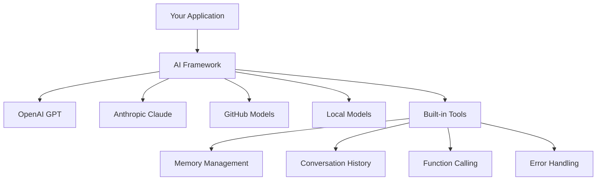
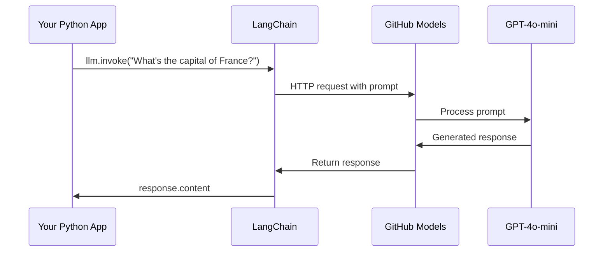
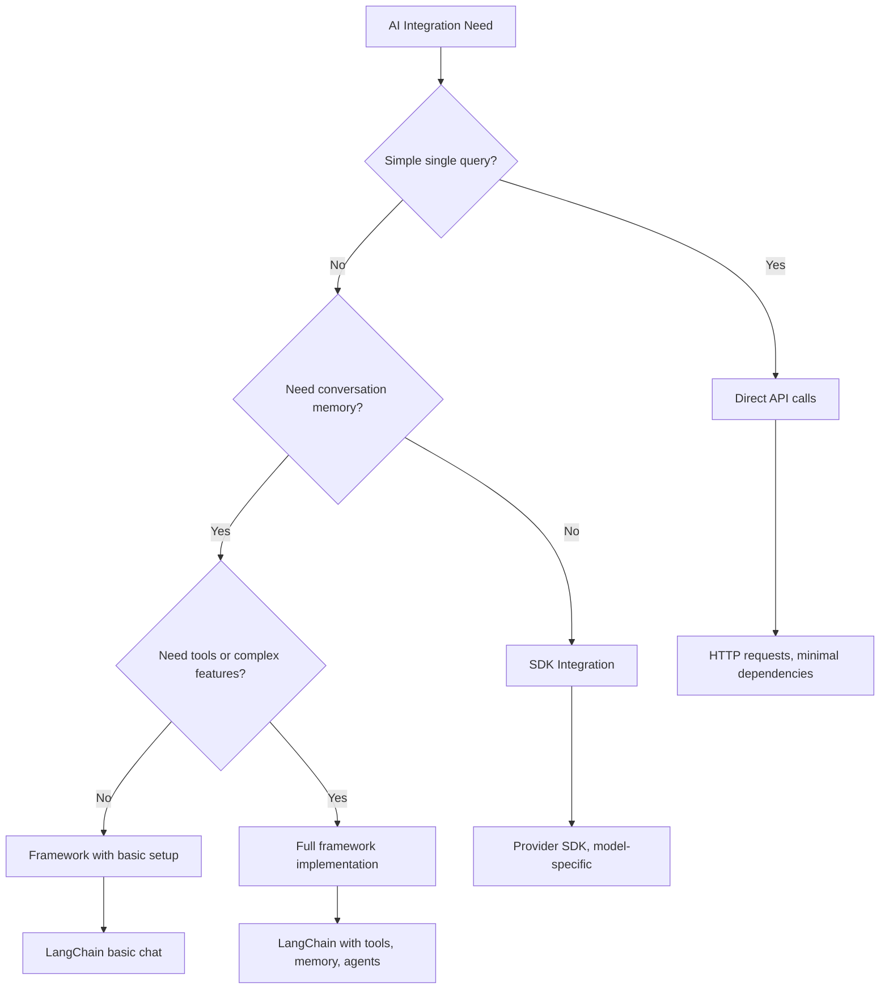

<!--
CO_OP_TRANSLATOR_METADATA:
{
  "original_hash": "e2c4ae5688e34b4b8b09d52aec56c79e",
  "translation_date": "2025-10-24T21:30:05+00:00",
  "source_file": "10-ai-framework-project/README.md",
  "language_code": "sk"
}
-->
# AI Framework

Už ste sa niekedy cítili zahltení pri pokuse vytvoriť AI aplikácie od nuly? Nie ste sami! AI frameworky sú ako švajčiarsky nožík pre vývoj AI - sú to výkonné nástroje, ktoré vám môžu ušetriť čas a starosti pri budovaní inteligentných aplikácií. Predstavte si AI framework ako dobre organizovanú knižnicu: poskytuje predpripravené komponenty, štandardizované API a inteligentné abstrakcie, aby ste sa mohli sústrediť na riešenie problémov namiesto boja s implementačnými detailmi.

V tejto lekcii preskúmame, ako frameworky ako LangChain môžu premeniť kedysi zložité úlohy integrácie AI na čistý, prehľadný kód. Objavíte, ako sa vysporiadať s reálnymi výzvami, ako je sledovanie konverzácií, implementácia volania nástrojov a manipulácia s rôznymi AI modelmi prostredníctvom jedného zjednoteného rozhrania.

Keď skončíme, budete vedieť, kedy siahnuť po frameworkoch namiesto surových API volaní, ako efektívne používať ich abstrakcie a ako vytvárať AI aplikácie pripravené na reálne použitie. Poďme preskúmať, čo môžu AI frameworky urobiť pre vaše projekty.

## Prečo si vybrať framework?

Takže ste pripravení vytvoriť AI aplikáciu - skvelé! Ale tu je vec: máte niekoľko rôznych ciest, ktorými sa môžete vydať, a každá z nich má svoje výhody a nevýhody. Je to trochu ako rozhodovanie medzi chôdzou, bicyklovaním alebo jazdou autom, aby ste sa niekam dostali - všetky vás tam dostanú, ale zážitok (a úsilie) bude úplne odlišné.

Rozdeľme si tri hlavné spôsoby, ako môžete integrovať AI do svojich projektov:

| Prístup | Výhody | Najlepšie pre | Zváženia |
|---------|--------|--------------|----------|
| **Priame HTTP požiadavky** | Plná kontrola, žiadne závislosti | Jednoduché dotazy, učenie základov | Viac rozvláčny kód, manuálne spracovanie chýb |
| **Integrácia SDK** | Menej boilerplate kódu, optimalizácia pre konkrétny model | Aplikácie s jedným modelom | Obmedzené na konkrétnych poskytovateľov |
| **AI Frameworky** | Zjednotené API, zabudované abstrakcie | Aplikácie s viacerými modelmi, zložité pracovné postupy | Krivka učenia, potenciálne nadmerná abstrakcia |

### Výhody frameworkov v praxi



**Prečo sú frameworky dôležité:**
- **Zjednocujú** viacerých poskytovateľov AI pod jedno rozhranie
- **Automaticky spracovávajú** pamäť konverzácií
- **Poskytujú** hotové nástroje na bežné úlohy, ako sú embeddings a volanie funkcií
- **Spravujú** spracovanie chýb a logiku opakovania
- **Premieňajú** zložité pracovné postupy na prehľadné volania metód

> 💡 **Tip**: Používajte frameworky pri prepínaní medzi rôznymi AI modelmi alebo pri budovaní zložitých funkcií, ako sú agenti, pamäť alebo volanie nástrojov. Pri učení základov alebo vytváraní jednoduchých, zameraných aplikácií sa držte priamych API.

**Zhrnutie**: Je to ako výber medzi špecializovanými nástrojmi remeselníka a kompletnou dielňou - ide o prispôsobenie nástroja úlohe. Frameworky vynikajú pri zložitých, funkčne bohatých aplikáciách, zatiaľ čo priame API fungujú dobre pre jednoduché prípady použitia.

## Úvod

V tejto lekcii sa naučíme:

- Používať bežný AI framework.
- Riešiť bežné problémy, ako sú chatové konverzácie, používanie nástrojov, pamäť a kontext.
- Využiť to na vytvorenie AI aplikácií.

## Váš prvý AI prompt

Začnime základmi a vytvorme vašu prvú AI aplikáciu, ktorá pošle otázku a dostane odpoveď späť. Ako Archimedes objavil princíp vztlaku vo svojej vani, niekedy najjednoduchšie pozorovania vedú k najvýznamnejším poznatkom - a frameworky robia tieto poznatky prístupnými.

### Nastavenie LangChain s GitHub modelmi

Použijeme LangChain na pripojenie k GitHub modelom, čo je skvelé, pretože vám poskytuje bezplatný prístup k rôznym AI modelom. Najlepšia časť? Na začiatok potrebujete len niekoľko jednoduchých konfiguračných parametrov:

```python
from langchain_openai import ChatOpenAI
import os

llm = ChatOpenAI(
    api_key=os.environ["GITHUB_TOKEN"],
    base_url="https://models.github.ai/inference",
    model="openai/gpt-4o-mini",
)

# Send a simple prompt
response = llm.invoke("What's the capital of France?")
print(response.content)
```

**Rozdelenie toho, čo sa tu deje:**
- **Vytvorí** klienta LangChain pomocou triedy `ChatOpenAI` - toto je vaša brána k AI!
- **Konfiguruje** pripojenie k GitHub modelom pomocou vášho autentifikačného tokenu
- **Určuje**, ktorý AI model použiť (`gpt-4o-mini`) - predstavte si to ako výber vášho AI asistenta
- **Odosiela** vašu otázku pomocou metódy `invoke()` - tu sa deje mágia
- **Extrahuje** a zobrazuje odpoveď - a voilà, rozprávate sa s AI!

> 🔧 **Poznámka k nastaveniu**: Ak používate GitHub Codespaces, máte šťastie - `GITHUB_TOKEN` je už nastavený! Pracujete lokálne? Žiadny problém, stačí si vytvoriť osobný prístupový token s potrebnými oprávneniami.

**Očakávaný výstup:**
```text
The capital of France is Paris.
```



## Budovanie konverzačného AI

Tento prvý príklad demonštruje základy, ale je to len jednorazová výmena - položíte otázku, dostanete odpoveď a to je všetko. V reálnych aplikáciách chcete, aby si AI pamätalo, o čom ste diskutovali, podobne ako Watson a Holmes budovali svoje investigatívne rozhovory v priebehu času.

Tu sa LangChain stáva obzvlášť užitočným. Poskytuje rôzne typy správ, ktoré pomáhajú štruktúrovať konverzácie a umožňujú vám dať AI osobnosť. Budete vytvárať chatovacie zážitky, ktoré si udržujú kontext a charakter.

### Pochopenie typov správ

Predstavte si tieto typy správ ako rôzne "klobúky", ktoré účastníci nosia v konverzácii. LangChain používa rôzne triedy správ na sledovanie toho, kto čo hovorí:

| Typ správy | Účel | Príklad použitia |
|------------|------|------------------|
| `SystemMessage` | Definuje osobnosť a správanie AI | "Ste užitočný asistent pre programovanie" |
| `HumanMessage` | Reprezentuje vstup používateľa | "Vysvetlite, ako fungujú funkcie" |
| `AIMessage` | Ukladá odpovede AI | Predchádzajúce odpovede AI v konverzácii |

### Vytvorenie vašej prvej konverzácie

Vytvorme konverzáciu, kde naše AI prevezme konkrétnu úlohu. Necháme ho stelesniť kapitána Picarda - postavu známu svojou diplomatickou múdrosťou a vodcovstvom:

```python
messages = [
    SystemMessage(content="You are Captain Picard of the Starship Enterprise"),
    HumanMessage(content="Tell me about you"),
]
```

**Rozdelenie nastavenia tejto konverzácie:**
- **Stanovuje** úlohu a osobnosť AI prostredníctvom `SystemMessage`
- **Poskytuje** počiatočný dotaz používateľa cez `HumanMessage`
- **Vytvára** základ pre viacnásobnú konverzáciu

Celý kód pre tento príklad vyzerá takto:

```python
from langchain_core.messages import HumanMessage, SystemMessage
from langchain_openai import ChatOpenAI
import os

llm = ChatOpenAI(
    api_key=os.environ["GITHUB_TOKEN"],
    base_url="https://models.github.ai/inference",
    model="openai/gpt-4o-mini",
)

messages = [
    SystemMessage(content="You are Captain Picard of the Starship Enterprise"),
    HumanMessage(content="Tell me about you"),
]


# works
response  = llm.invoke(messages)
print(response.content)
```

Mali by ste vidieť výsledok podobný:

```text
I am Captain Jean-Luc Picard, the commanding officer of the USS Enterprise (NCC-1701-D), a starship in the United Federation of Planets. My primary mission is to explore new worlds, seek out new life and new civilizations, and boldly go where no one has gone before. 

I believe in the importance of diplomacy, reason, and the pursuit of knowledge. My crew is diverse and skilled, and we often face challenges that test our resolve, ethics, and ingenuity. Throughout my career, I have encountered numerous species, grappled with complex moral dilemmas, and have consistently sought peaceful solutions to conflicts.

I hold the ideals of the Federation close to my heart, believing in the importance of cooperation, understanding, and respect for all sentient beings. My experiences have shaped my leadership style, and I strive to be a thoughtful and just captain. How may I assist you further?
```

Na udržanie kontinuity konverzácie (namiesto resetovania kontextu pri každom volaní) musíte neustále pridávať odpovede do zoznamu správ. Podobne ako ústne tradície, ktoré uchovávali príbehy cez generácie, tento prístup buduje trvalú pamäť:

```python
from langchain_core.messages import HumanMessage, SystemMessage
from langchain_openai import ChatOpenAI
import os

llm = ChatOpenAI(
    api_key=os.environ["GITHUB_TOKEN"],
    base_url="https://models.github.ai/inference",
    model="openai/gpt-4o-mini",
)

messages = [
    SystemMessage(content="You are Captain Picard of the Starship Enterprise"),
    HumanMessage(content="Tell me about you"),
]


# works
response  = llm.invoke(messages)

print(response.content)

print("---- Next ----")

messages.append(response)
messages.append(HumanMessage(content="Now that I know about you, I'm Chris, can I be in your crew?"))

response  = llm.invoke(messages)

print(response.content)

```

Celkom zaujímavé, však? Čo sa tu deje, je to, že voláme LLM dvakrát - najprv len s našimi počiatočnými dvoma správami, ale potom znova s celou históriou konverzácie. Je to, akoby AI skutočne sledovalo našu diskusiu!

Keď spustíte tento kód, dostanete druhú odpoveď, ktorá znie niečo ako:

```text
Welcome aboard, Chris! It's always a pleasure to meet those who share a passion for exploration and discovery. While I cannot formally offer you a position on the Enterprise right now, I encourage you to pursue your aspirations. We are always in need of talented individuals with diverse skills and backgrounds. 

If you are interested in space exploration, consider education and training in the sciences, engineering, or diplomacy. The values of curiosity, resilience, and teamwork are crucial in Starfleet. Should you ever find yourself on a starship, remember to uphold the principles of the Federation: peace, understanding, and respect for all beings. Your journey can lead you to remarkable adventures, whether in the stars or on the ground. Engage!
```

To beriem ako možno ;)

## Streamovanie odpovedí

Už ste si niekedy všimli, ako ChatGPT "píše" svoje odpovede v reálnom čase? To je streamovanie v akcii. Podobne ako sledovanie zručného kaligrafa pri práci - vidieť, ako sa znaky objavujú ťah za ťahom namiesto toho, aby sa objavili naraz - streamovanie robí interakciu prirodzenejšou a poskytuje okamžitú spätnú väzbu.

### Implementácia streamovania s LangChain

```python
from langchain_openai import ChatOpenAI
import os

llm = ChatOpenAI(
    api_key=os.environ["GITHUB_TOKEN"],
    base_url="https://models.github.ai/inference",
    model="openai/gpt-4o-mini",
    streaming=True
)

# Stream the response
for chunk in llm.stream("Write a short story about a robot learning to code"):
    print(chunk.content, end="", flush=True)
```

**Prečo je streamovanie skvelé:**
- **Zobrazuje** obsah, ako sa vytvára - už žiadne trápne čakanie!
- **Dáva** používateľom pocit, že sa niečo skutočne deje
- **Pôsobí** rýchlejšie, aj keď technicky nie je
- **Umožňuje** používateľom začať čítať, zatiaľ čo AI stále "premýšľa"

> 💡 **Tip pre používateľskú skúsenosť**: Streamovanie naozaj vyniká, keď pracujete s dlhšími odpoveďami, ako sú vysvetlenia kódu, kreatívne písanie alebo podrobné tutoriály. Vaši používatelia budú milovať sledovanie pokroku namiesto pozerania na prázdnu obrazovku!

## Šablóny promptov

Šablóny promptov fungujú ako rétorické štruktúry používané v klasickej rétorike - predstavte si, ako by Cicero prispôsobil svoje vzorce reči pre rôzne publikum, pričom by si zachoval rovnaký presvedčivý rámec. Umožňujú vám vytvárať opakovane použiteľné prompty, kde môžete vymeniť rôzne časti informácií bez toho, aby ste museli všetko prepisovať od začiatku. Keď nastavíte šablónu, stačí len vyplniť premenné potrebnými hodnotami.

### Vytvorenie opakovane použiteľných promptov

```python
from langchain_core.prompts import ChatPromptTemplate

# Define a template for code explanations
template = ChatPromptTemplate.from_messages([
    ("system", "You are an expert programming instructor. Explain concepts clearly with examples."),
    ("human", "Explain {concept} in {language} with a practical example for {skill_level} developers")
])

# Use the template with different values
questions = [
    {"concept": "functions", "language": "JavaScript", "skill_level": "beginner"},
    {"concept": "classes", "language": "Python", "skill_level": "intermediate"},
    {"concept": "async/await", "language": "JavaScript", "skill_level": "advanced"}
]

for question in questions:
    prompt = template.format_messages(**question)
    response = llm.invoke(prompt)
    print(f"Topic: {question['concept']}\n{response.content}\n---\n")
```

**Prečo si zamilujete používanie šablón:**
- **Udržuje** vaše prompty konzistentné v celej aplikácii
- **Žiadne viac** chaotické spájanie reťazcov - len čisté, jednoduché premenné
- **Vaše AI** sa správa predvídateľne, pretože štruktúra zostáva rovnaká
- **Aktualizácie** sú jednoduché - zmeňte šablónu raz a je opravená všade

## Štruktúrovaný výstup

Už ste niekedy boli frustrovaní pri pokuse analyzovať AI odpovede, ktoré sa vracajú ako neštruktúrovaný text? Štruktúrovaný výstup je ako naučiť vaše AI dodržiavať systematický prístup, ktorý používal Linnaeus na biologickú klasifikáciu - organizovaný, predvídateľný a ľahko použiteľný. Môžete požiadať o JSON, konkrétne dátové štruktúry alebo akýkoľvek formát, ktorý potrebujete.

### Definovanie schém výstupu

```python
from langchain_core.prompts import ChatPromptTemplate
from langchain_core.output_parsers import JsonOutputParser
from pydantic import BaseModel, Field

class CodeReview(BaseModel):
    score: int = Field(description="Code quality score from 1-10")
    strengths: list[str] = Field(description="List of code strengths")
    improvements: list[str] = Field(description="List of suggested improvements")
    overall_feedback: str = Field(description="Summary feedback")

# Set up the parser
parser = JsonOutputParser(pydantic_object=CodeReview)

# Create prompt with format instructions
prompt = ChatPromptTemplate.from_messages([
    ("system", "You are a code reviewer. {format_instructions}"),
    ("human", "Review this code: {code}")
])

# Format the prompt with instructions
chain = prompt | llm | parser

# Get structured response
code_sample = """
def calculate_average(numbers):
    return sum(numbers) / len(numbers)
"""

result = chain.invoke({
    "code": code_sample,
    "format_instructions": parser.get_format_instructions()
})

print(f"Score: {result['score']}")
print(f"Strengths: {', '.join(result['strengths'])}")
```

**Prečo je štruktúrovaný výstup prelomový:**
- **Žiadne viac** hádanie, aký formát dostanete späť - je konzistentný vždy
- **Pripojí sa** priamo do vašich databáz a API bez ďalšej práce
- **Zachytí** divné AI odpovede skôr, než rozbijú vašu aplikáciu
- **Robí** váš kód čistejším, pretože presne viete, s čím pracujete

## Volanie nástrojov

Teraz sa dostávame k jednej z najvýkonnejších funkcií: nástroje. Takto dávate svojmu AI praktické schopnosti nad rámec konverzácie. Podobne ako stredoveké cechy vyvíjali špecializované nástroje pre konkrétne remeslá, môžete vybaviť svoje AI zameranými nástrojmi. Popíšete, aké nástroje sú k dispozícii, a keď niekto požiada o niečo, čo zodpovedá, vaše AI môže konať.

### Použitie Pythonu

Pridajme niekoľko nástrojov takto:

```python
from typing_extensions import Annotated, TypedDict

class add(TypedDict):
    """Add two integers."""

    # Annotations must have the type and can optionally include a default value and description (in that order).
    a: Annotated[int, ..., "First integer"]
    b: Annotated[int, ..., "Second integer"]

tools = [add]

functions = {
    "add": lambda a, b: a + b
}
```

Čo sa tu deje? Vytvárame plán pre nástroj nazvaný `add`. Tým, že dedíme z `TypedDict` a používame tie šikovné typy `Annotated` pre `a` a `b`, dávame LLM jasný obraz o tom, čo tento nástroj robí a čo potrebuje. Slovník `functions` je ako naša sada nástrojov - hovorí nášmu kódu presne, čo má robiť, keď sa AI rozhodne použiť konkrétny nástroj.

Pozrime sa, ako zavoláme LLM s týmto nástrojom:

```python
llm = ChatOpenAI(
    api_key=os.environ["GITHUB_TOKEN"],
    base_url="https://models.github.ai/inference",
    model="openai/gpt-4o-mini",
)

llm_with_tools = llm.bind_tools(tools)
```

Tu voláme `bind_tools` s naším poľom `tools`, a tým pádom má LLM `llm_with_tools` teraz vedomosti o tomto nástroji.

Na použitie tohto nového LLM môžeme napísať nasledujúci kód:

```python
query = "What is 3 + 12?"

res = llm_with_tools.invoke(query)
if(res.tool_calls):
    for tool in res.tool_calls:
        print("TOOL CALL: ", functions[tool["name"]](../../../10-ai-framework-project/**tool["args"]))
print("CONTENT: ",res.content)
```

Teraz, keď zavoláme `invoke` na tomto novom LLM, ktoré má nástroje, môže byť vlastnosť `tool_calls` naplnená. Ak áno, akýkoľvek identifikovaný nástroj má vlastnosti `name` a `args`, ktoré identifikujú, aký nástroj by mal byť použitý a s akými argumentmi. Celý kód vyzerá takto:

```python
from langchain_core.messages import HumanMessage, SystemMessage
from langchain_openai import ChatOpenAI
import os
from typing_extensions import Annotated, TypedDict

class add(TypedDict):
    """Add two integers."""

    # Annotations must have the type and can optionally include a default value and description (in that order).
    a: Annotated[int, ..., "First integer"]
    b: Annotated[int, ..., "Second integer"]

tools = [add]

functions = {
    "add": lambda a, b: a + b
}

llm = ChatOpenAI(
    api_key=os.environ["GITHUB_TOKEN"],
    base_url="https://models.github.ai/inference",
    model="openai/gpt-4o-mini",
)

llm_with_tools = llm.bind_tools(tools)

query = "What is 3 + 12?"

res = llm_with_tools.invoke(query)
if(res.tool_calls):
    for tool in res.tool_calls:
        print("TOOL CALL: ", functions[tool["name"]](../../../10-ai-framework-project/**tool["args"]))
print("CONTENT: ",res.content)
```

Po spustení tohto kódu by ste mali vidieť výstup podobný:

```text
TOOL CALL:  15
CONTENT: 
```

AI preskúmalo "Čo je 3 + 12" a rozpoznalo to ako úlohu pre nástroj `add`. Podobne ako zručný knihovník vie, na ktorý odkaz sa obrátiť na základe typu otázky, urobilo toto rozhodnutie na základe názvu nástroja, popisu a špecifikácií polí. Výsledok 15 pochádza z nášho slovníka `functions`, ktorý vykonáva nástroj:

```python
print("TOOL CALL: ", functions[tool["name"]](../../../10-ai-framework-project/**tool["args"]))
```

### Zaujímavejší nástroj, ktorý volá webové API

Sčítanie čísel demonštruje koncept, ale skutočné nástroje zvyčajne vykonávajú zložitejšie operácie, ako je volanie webových API. Rozšírme náš príklad, aby AI získalo obsah z internetu - podobne ako telegrafní operátori kedysi spájali vzdialené lokality:

```python
class joke(TypedDict):
    """Tell a joke."""

    # Annotations must have the type and can optionally include a default value and description (in that order).
    category: Annotated[str, ..., "The joke category"]

def get_joke(category: str) -> str:
    response = requests.get(f"https://api.chucknorris.io/jokes/random?category={category}", headers={"Accept": "application/json"})
    if response.status_code == 200:
        return response.json().get("value", f"Here's a {category} joke!")
    return f"Here's a {category} joke!"

functions = {
    "add": lambda a, b: a + b,
    "joke": lambda category: get_joke(category)
}

query = "Tell me a joke about animals"

# the rest of the code is the same
```

Teraz, ak spustíte tento kód, dostanete odpoveď, ktorá znie niečo ako:

```text
TOOL CALL:  Chuck Norris once rode a nine foot grizzly bear through an automatic car wash, instead of taking a shower.
CONTENT:  
```

Tu je celý kód:

```python
from langchain_openai import ChatOpenAI
import requests
import os
from typing_extensions import Annotated, TypedDict

class add(TypedDict):
    """Add two integers."""

    # Annotations must have the type and can optionally include a default value and description (in that order).
    a: Annotated[int, ..., "First integer"]
    b: Annotated[int, ..., "Second integer"]

class joke(TypedDict):
    """Tell a joke."""

    # Annotations must have the type and can optionally include a default value and description (in that order).
    category: Annotated[str, ..., "The joke category"]

tools = [add, joke]

def get_joke(category: str) -> str:
    response = requests.get(f"https://api.chucknorris.io/jokes/random?category={category}", headers={"Accept": "application/json"})
    if response.status_code == 200:
        return response.json().get("value", f"Here's a {category} joke!")
    return f"Here's a {category} joke!"

functions = {
    "add": lambda a, b: a + b,
    "joke": lambda category: get_joke(category)
}

llm = ChatOpenAI(
    api_key=os.environ["GITHUB_TOKEN"],
    base_url="https://models.github.ai/inference",
    model="openai/gpt-4o-mini",
)

llm_with_tools = llm.bind_tools(tools)

query = "Tell me a joke about animals"

res = llm_with_tools.invoke(query)
if(res.tool_calls):
    for tool in res.tool_calls:
        # print("TOOL CALL: ", tool)
        print("TOOL CALL: ", functions[tool["name"]](../../../10-ai-framework-project/**tool["args"]))
print("CONTENT: ",res.content)
```

## Embeddings a spracovanie dokumentov

Embeddings predstavujú jedno z najelegantnejších riešení v modernej AI. Predstavte si, že by ste mohli vziať akýkoľvek text a previesť ho na číselné súradnice, ktoré zachytávajú jeho význam. Presne to embeddings robia - transformujú text na body v multidimenzionálnom priestore, kde podobné koncepty tvoria zhluky. Je to ako mať súradnicový systém pre myšlienky, pripomínajúci, ako Mendelejev usporiadal periodickú tabuľku podľa vlastností atómov.

### Vytváranie a používanie embeddings

```python
from langchain_openai import OpenAIEmbeddings
from langchain_community.vectorstores import FAISS
from langchain_community.document_loaders import TextLoader
from langchain.text_splitter import CharacterTextSplitter

# Initialize embeddings
embeddings = OpenAIEmbeddings(
    api_key=os.environ["GITHUB_TOKEN"],
    base_url="https://models.github.ai/inference",
    model="text-embedding-3-small"
)

# Load and split documents
loader = TextLoader("documentation.txt")
documents = loader.load()

text_splitter = CharacterTextSplitter(chunk_size=1000, chunk_overlap=0)
texts = text_splitter.split_documents(documents)

# Create vector store
vectorstore = FAISS.from_documents(texts, embeddings)

# Perform similarity search
query = "How do I handle user authentication?"
similar_docs = vectorstore.similarity_search(query, k=3)

for doc in similar_docs:
    print(f"Relevant content: {doc.page_content[:200]}...")
```

### Načítavače dokumentov pre rôzne formáty

```python
from langchain_community.document_loaders import (
    PyPDFLoader,
    CSVLoader,
    JSONLoader,
    WebBaseLoader
)

# Load different document types
pdf_loader = PyPDFLoader("manual.pdf")
csv_loader = CSVLoader("data.csv")
json_loader = JSONLoader("config.json")
web_loader = WebBaseLoader("https://example.com/docs")

# Process all documents
all_documents = []
for loader in [pdf_loader, csv_loader, json_loader, web_loader]:
    docs = loader.load()
    all_documents.extend(docs)
```

**Čo môžete robiť s embeddings:**
- **Vytvárať** vyhľadávanie, ktoré skutočne rozumie tomu, čo myslíte, nielen
3. **Personalizované učenie**: Používajte systémové správy na prispôsobenie odpovedí rôznym úrovniam zručností  
4. **Formátovanie odpovedí**: Implementujte štruktúrovaný výstup pre kvízové otázky  

### Kroky implementácie  

**Krok 1: Nastavte svoje prostredie**  
```bash
pip install langchain langchain-openai
```
  
**Krok 2: Základná funkcia chatu**  
- Vytvorte triedu `StudyAssistant`  
- Implementujte pamäť konverzácie  
- Pridajte konfiguráciu osobnosti na podporu vzdelávania  

**Krok 3: Pridajte vzdelávacie nástroje**  
- **Vysvetľovač kódu**: Rozkladá kód na zrozumiteľné časti  
- **Generátor kvízov**: Vytvára otázky o programovacích konceptoch  
- **Sledovač pokroku**: Sleduje pokryté témy  

**Krok 4: Rozšírené funkcie (voliteľné)**  
- Implementujte streamovanie odpovedí pre lepší používateľský zážitok  
- Pridajte načítanie dokumentov na začlenenie učebných materiálov  
- Vytvorte embeddings na vyhľadávanie obsahu na základe podobnosti  

### Kritériá hodnotenia  

| Funkcia | Výborné (4) | Dobré (3) | Uspokojivé (2) | Potrebuje zlepšenie (1) |  
|---------|-------------|-----------|----------------|--------------------------|  
| **Tok konverzácie** | Prirodzené, kontextovo uvedomelé odpovede | Dobré udržanie kontextu | Základná konverzácia | Žiadna pamäť medzi výmenami |  
| **Integrácia nástrojov** | Viacero užitočných nástrojov funguje bez problémov | 2+ nástroje implementované správne | 1-2 základné nástroje | Nástroje nefunkčné |  
| **Kvalita kódu** | Čistý, dobre dokumentovaný, spracovanie chýb | Dobrá štruktúra, nejaká dokumentácia | Základná funkčnosť funguje | Zlá štruktúra, žiadne spracovanie chýb |  
| **Vzdelávacia hodnota** | Skutočne užitočné pre učenie, adaptívne | Dobrá podpora učenia | Základné vysvetlenia | Obmedzený vzdelávací prínos |  

### Ukážková štruktúra kódu  

```python
class StudyAssistant:
    def __init__(self, skill_level="beginner"):
        # Initialize LLM, tools, and conversation memory
        pass
    
    def explain_code(self, code, language):
        # Tool: Explain how code works
        pass
    
    def generate_quiz(self, topic, difficulty):
        # Tool: Create practice questions
        pass
    
    def chat(self, user_input):
        # Main conversation interface
        pass

# Example usage
assistant = StudyAssistant(skill_level="intermediate")
response = assistant.chat("Explain how Python functions work")
```
  
**Bonusové výzvy:**  
- Pridajte schopnosti hlasového vstupu/výstupu  
- Implementujte webové rozhranie pomocou Streamlit alebo Flask  
- Vytvorte databázu znalostí z učebných materiálov pomocou embeddings  
- Pridajte sledovanie pokroku a personalizované učebné cesty  

## Zhrnutie  

🎉 Teraz ste zvládli základy vývoja AI frameworkov a naučili sa, ako vytvárať sofistikované AI aplikácie pomocou LangChain. Ako pri dokončení komplexného učňovského programu, získali ste rozsiahlu sadu zručností. Poďme si zhrnúť, čo ste dosiahli.  

### Čo ste sa naučili  

**Základné koncepty frameworku:**  
- **Výhody frameworkov**: Pochopenie, kedy si vybrať frameworky namiesto priamych API volaní  
- **Základy LangChain**: Nastavenie a konfigurácia pripojení AI modelov  
- **Typy správ**: Používanie `SystemMessage`, `HumanMessage` a `AIMessage` na štruktúrované konverzácie  

**Pokročilé funkcie:**  
- **Volanie nástrojov**: Vytváranie a integrácia vlastných nástrojov na rozšírené schopnosti AI  
- **Pamäť konverzácie**: Udržiavanie kontextu naprieč viacerými výmenami v konverzácii  
- **Streamovanie odpovedí**: Implementácia doručovania odpovedí v reálnom čase  
- **Šablóny promptov**: Vytváranie opakovane použiteľných, dynamických promptov  
- **Štruktúrovaný výstup**: Zabezpečenie konzistentných, analyzovateľných odpovedí AI  
- **Embeddings**: Vytváranie semantického vyhľadávania a spracovania dokumentov  

**Praktické aplikácie:**  
- **Vytváranie kompletných aplikácií**: Kombinovanie viacerých funkcií do aplikácií pripravených na produkciu  
- **Spracovanie chýb**: Implementácia robustného spracovania chýb a validácie  
- **Integrácia nástrojov**: Vytváranie vlastných nástrojov, ktoré rozširujú schopnosti AI  

### Kľúčové poznatky  

> 🎯 **Pamätajte**: AI frameworky ako LangChain sú v podstate vaši pomocníci, ktorí skrývajú zložitosť a ponúkajú množstvo funkcií. Sú ideálne, keď potrebujete pamäť konverzácie, volanie nástrojov alebo chcete pracovať s viacerými AI modelmi bez straty rozumu.  

**Rozhodovací rámec pre integráciu AI:**  


  
### Kam ďalej?  

**Začnite budovať hneď teraz:**  
- Vezmite tieto koncepty a vytvorte niečo, čo vás nadchne!  
- Experimentujte s rôznymi AI modelmi cez LangChain - je to ako mať ihrisko plné AI modelov  
- Vytvárajte nástroje, ktoré riešia skutočné problémy vo vašej práci alebo projektoch  

**Pripravení na ďalšiu úroveň?**  
- **AI agenti**: Vytvárajte AI systémy, ktoré dokážu samostatne plánovať a vykonávať zložité úlohy  
- **RAG (Retrieval-Augmented Generation)**: Kombinujte AI s vlastnými databázami znalostí pre aplikácie s rozšírenými schopnosťami  
- **Multimodálne AI**: Pracujte s textom, obrázkami a zvukom naraz - možnosti sú nekonečné!  
- **Nasadenie do produkcie**: Naučte sa, ako škálovať svoje AI aplikácie a monitorovať ich v reálnom svete  

**Pripojte sa ku komunite:**  
- Komunita LangChain je skvelá na to, aby ste zostali informovaní a naučili sa osvedčené postupy  
- GitHub Models vám poskytuje prístup k najnovším schopnostiam AI - ideálne na experimentovanie  
- Pokračujte v praxi s rôznymi prípadmi použitia - každý projekt vás naučí niečo nové  

Teraz máte vedomosti na vytváranie inteligentných, konverzačných aplikácií, ktoré môžu pomôcť ľuďom riešiť skutočné problémy. Rovnako ako renesanční remeselníci, ktorí spojili umeleckú víziu s technickými zručnosťami, môžete teraz spojiť schopnosti AI s praktickým využitím. Otázka znie: čo vytvoríte? 🚀  

## Výzva GitHub Copilot Agent 🚀  

Použite režim Agent na splnenie nasledujúcej výzvy:  

**Popis:** Vytvorte pokročilého AI asistenta na kontrolu kódu, ktorý kombinuje viacero funkcií LangChain vrátane volania nástrojov, štruktúrovaného výstupu a pamäte konverzácie na poskytovanie komplexnej spätnej väzby k odoslaným kódom.  

**Prompt:** Vytvorte triedu CodeReviewAssistant, ktorá implementuje:  
1. Nástroj na analýzu zložitosti kódu a navrhovanie zlepšení  
2. Nástroj na kontrolu kódu podľa najlepších praktík  
3. Štruktúrovaný výstup pomocou Pydantic modelov na konzistentný formát recenzií  
4. Pamäť konverzácie na sledovanie relácií recenzií  
5. Hlavné rozhranie chatu, ktoré dokáže spracovať odoslané kódy a poskytovať podrobné, akčné odporúčania  

Asistent by mal byť schopný kontrolovať kód v viacerých programovacích jazykoch, udržiavať kontext naprieč viacerými odoslanými kódmi v jednej relácii a poskytovať súhrnné skóre aj podrobné návrhy na zlepšenie.  

Viac informácií o [režime agent](https://code.visualstudio.com/blogs/2025/02/24/introducing-copilot-agent-mode) nájdete tu.  

---

**Zrieknutie sa zodpovednosti**:  
Tento dokument bol preložený pomocou služby AI prekladu [Co-op Translator](https://github.com/Azure/co-op-translator). Aj keď sa snažíme o presnosť, prosím, berte na vedomie, že automatizované preklady môžu obsahovať chyby alebo nepresnosti. Pôvodný dokument v jeho rodnom jazyku by mal byť považovaný za autoritatívny zdroj. Pre kritické informácie sa odporúča profesionálny ľudský preklad. Nenesieme zodpovednosť za akékoľvek nedorozumenia alebo nesprávne interpretácie vyplývajúce z použitia tohto prekladu.