# JavaScript Základy: Dátové Typy

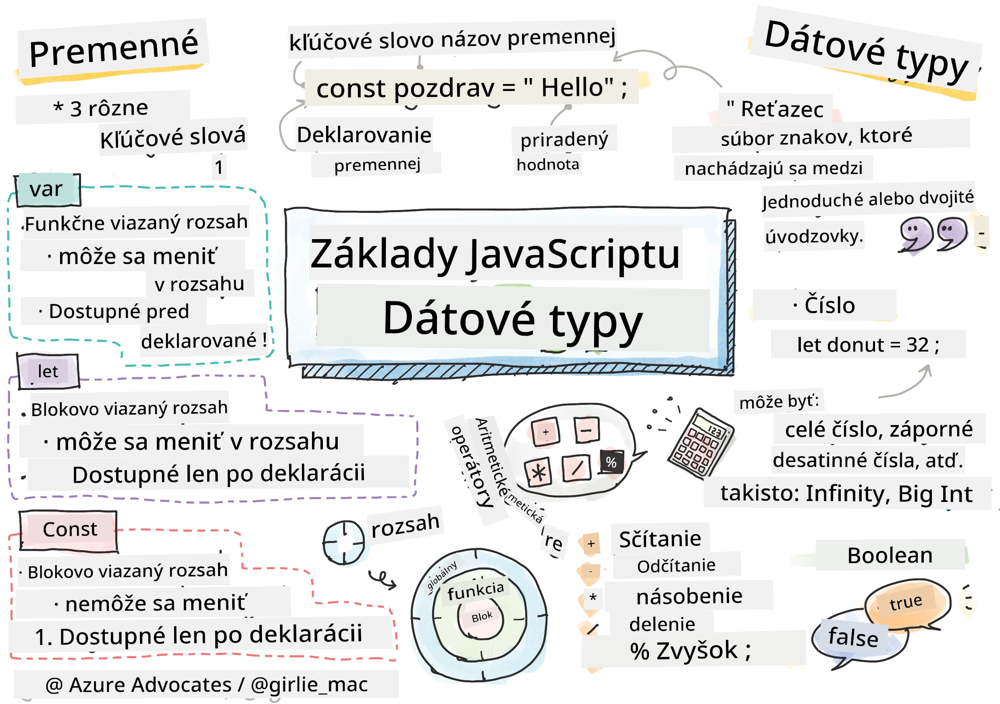
> Sketchnote od [Tomomi Imura](https://twitter.com/girlie_mac)

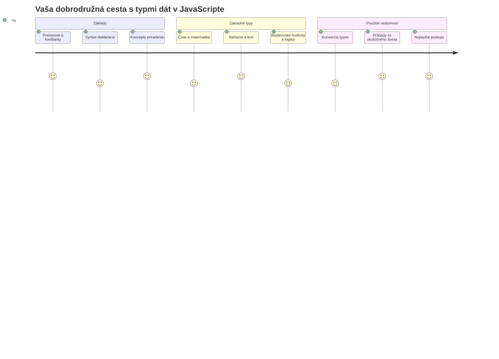
Dátové typy sú jedným zo základných pojmov v JavaScripte, na ktoré narazíte v každom programe, ktorý napíšete. Predstavte si dátové typy ako systém archivácie používaný starovekými knihovníkmi v Alexandrii – mali špecifické miesta pre zvitky obsahujúce poéziu, matematiku a historické záznamy. JavaScript organizuje informácie podobným spôsobom s rôznymi kategóriami pre rôzne typy dát.

V tejto lekcii preskúmame základné dátové typy, ktoré umožňujú JavaScriptu fungovať. Naučíte sa, ako pracovať s číslami, textom, pravdivostnými hodnotami a pochopíte, prečo je výber správneho typu nevyhnutný pre vaše programy. Tieto koncepty sa môžu spočiatku zdať abstraktné, ale s praxou sa stanú druhou prirodzenosťou.

Pochopenie dátových typov spraví všetko ostatné v JavaScripte oveľa jasnejším. Rovnako ako architekti potrebujú pochopiť rôzne stavebné materiály predtým, než postavia katedrálu, tieto základy podporia všetko, čo budete budovať ďalej.

## Prednáškový kvíz
[Prednáškový kvíz](https://ff-quizzes.netlify.app/web/)

Táto lekcia pokrýva základy JavaScriptu, jazyka, ktorý dodáva webu interaktivitu.

> Túto lekciu môžete absolvovať na [Microsoft Learn](https://docs.microsoft.com/learn/modules/web-development-101-variables/?WT.mc_id=academic-77807-sagibbon)!

[](https://youtube.com/watch?v=JNIXfGiDWM8 "Premenné v JavaScripte")

[](https://youtube.com/watch?v=AWfA95eLdq8 "Dátové typy v JavaScripte")

> 🎥 Kliknite na obrázky vyššie pre videá o premenných a dátových typoch

Začnime s premennými a dátovými typmi, ktoré ich napĺňajú!

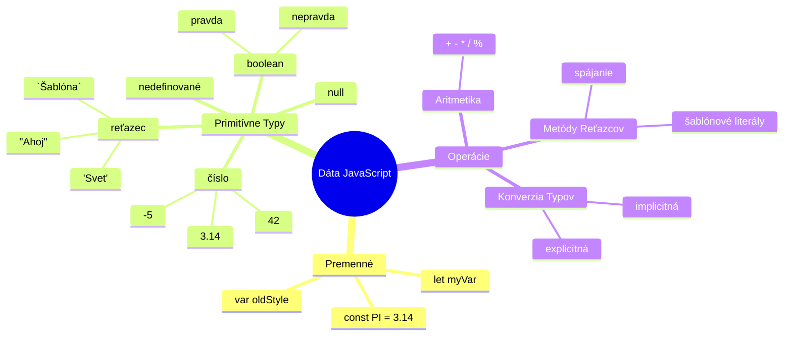
## Premenné

Premenné sú základné stavebné kamene programovania. Rovnako ako označené nádoby, ktoré stredovekí alchymisti používali na uchovávanie rôznych látok, premenné vám umožňujú uchovať informácie a dať im popisný názov, aby ste ich mohli neskôr odkazovať. Potrebujete si zapamätať vek niekoho? Uložte ho do premennej nazvanej `age`. Chcete sledovať meno používateľa? Uchovajte ho v premennej nazvanej `userName`.

Zameriame sa na moderný prístup k vytváraniu premenných v JavaScripte. Techniky, ktoré sa tu naučíte, predstavujú roky vývoja jazyka a najlepších praktík vyvinutých programátorskou komunitou.

Vytvorenie a **deklarovanie** premennej má nasledujúcu syntax **[kľúčové_slovo] [názov]**. Skladá sa z dvoch častí:

- **Kľúčové slovo**. Použite `let` pre premenné, ktoré sa môžu meniť, alebo `const` pre hodnoty, ktoré zostávajú rovnaké.
- **Názov premennej**, čo je popisný názov, ktorý si vyberiete sami.

✅ Kľúčové slovo `let` bolo predstavené v ES6 a dáva vašej premennej tzv. _blokový rozsah_. Odporúča sa používať `let` alebo `const` namiesto staršieho kľúčového slova `var`. O blokových rozsahoch sa budeme podrobnejšie zaoberať v budúcich častiach.

### Úloha – práca s premennými

1. **Deklarujte premennú**. Začnime vytvorením našej prvej premennej:

    ```javascript
    let myVariable;
    ```

   **Čo sa tým dosahuje:**
   - Týmto hovoríme JavaScriptu, aby vytvoril pamäťové miesto nazvané `myVariable`
   - JavaScript alokuje miesto v pamäti pre túto premennú
   - Premenná momentálne nemá žiadnu hodnotu (undefined)

2. **Dajte jej hodnotu**. Teraz vložme niečo do našej premennej:

    ```javascript
    myVariable = 123;
    ```

   **Ako funguje priradenie:**
   - Operátor `=` priradí hodnotu 123 do našej premennej
   - Premenná teraz obsahuje túto hodnotu namiesto undefined
   - Túto hodnotu môžete použiť v celom vašom kóde pomocou `myVariable`

   > Poznámka: použitie `=` v tejto lekcii znamená využitie "operátora priradenia", ktorý slúži na nastavenie hodnoty pre premennú. Neznamená to rovnosť.

3. **Urobme to šikovnejšie**. V skutočnosti skombinujme tieto dva kroky:

    ```javascript
    let myVariable = 123;
    ```

    **Tento prístup je efektívnejší:**
    - Deklarujete premennú a zároveň jej priraďujete hodnotu v jednom príkaze
    - Toto je štandardná prax medzi vývojármi
    - Znižuje to dĺžku kódu pri zachovaní prehľadnosti

4. **Zmeňte názor**. Čo ak chceme uložiť iné číslo?

   ```javascript
   myVariable = 321;
   ```

   **Pochopenie prepisovania hodnoty:**
   - Premenná teraz obsahuje 321 namiesto 123
   - Predchádzajúca hodnota je nahradená – premenné ukladajú vždy len jednu hodnotu
   - Táto zmena je kľúčovým znakom premenných deklarovaných pomocou `let`

   ✅ Vyskúšajte! JavaScript môžete písať priamo vo vašom prehliadači. Otvorte si okno prehliadača a prejdite do Nástrojov pre vývojárov. V konzole nájdete prompt; zadajte `let myVariable = 123`, stlačte Enter, potom zadajte `myVariable`. Čo sa stane? Viac o týchto konceptoch sa naučíte v nasledujúcich lekciách.

### 🧠 **Ovládanie premenných: Pohodlnosť**

**Skontrolujme, ako vám premenné idú:**
- Viete vysvetliť rozdiel medzi deklarovaním a priradením premennej?
- Čo sa stane, ak sa pokúsite použiť premennú pred jej deklarovaním?
- Kedy by ste volili `let` namiesto `const` pre premennú?

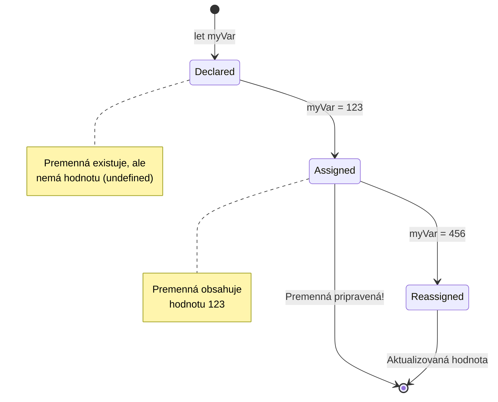
> **Rýchla rada**: Predstavte si premenné ako označené skladovacie krabice. Vytvoríte krabicu (`let`), vložíte do nej niečo (`=`), a neskôr môžete obsah nahradiť, ak je to potrebné!

## Konštanty

Niekedy potrebujete uložiť informácie, ktoré by sa počas vykonávania programu nikdy nemali meniť. Predstavte si konštanty ako matematické princípy, ktoré Euklides stanovil v starovekom Grécku – keď boli dokázané a zdokumentované, zostali pevné pre všetky budúce použitia.

Konštanty fungujú podobne ako premenné, ale s dôležitým obmedzením: keď im priradíte hodnotu, už ju nemôžete zmeniť. Táto nemenna vlastnosť pomáha zabrániť neúmyselným zmenám kritických hodnôt vo vašom programe.

Deklarácia a inicializácia konštanty sa riadi rovnakými princípmi ako premennej, s výnimkou použitia kľúčového slova `const`. Konštanty sa zvyčajne deklarujú veľkými písmenami.

```javascript
const MY_VARIABLE = 123;
```

**Tento kód vykonáva:**
- **Vytvára** konštantu s názvom `MY_VARIABLE` a hodnotou 123
- **Používa** konvenciu veľkých písmen pre konštanty
- **Zabraňuje** akýmkoľvek budúcim zmenám tejto hodnoty

Konštanty majú dve hlavné pravidlá:

- **Musíte im hneď dať hodnotu** – prázdne konštanty nie sú povolené!
- **Nikdy nesmiete túto hodnotu zmeniť** – JavaScript vyhodí chybu, ak sa to pokúsite. Pozrime sa na to:

   **Jednoduchá hodnota** - Toto NIE JE povolené:
   
      ```javascript
      const PI = 3;
      PI = 4; // nie je povolené
      ```

   **Čo si zapamätať:**
   - **Pokusy** o zmenu hodnoty konštanty spôsobia chybu
   - **Chráni** dôležité hodnoty pred neúmyselnými zmenami
   - **Zabezpečuje**, že hodnota zostane konzistentná počas celého programu
 
   **Odkaz na objekt je chránený** - Toto NIE JE povolené:
   
      ```javascript
      const obj = { a: 3 };
      obj = { b: 5 } // nie je povolené
      ```

   **Pochopenie konceptu:**
   - **Zabraňuje** nahradeniu celého objektu novým
   - **Chráni** odkaz na pôvodný objekt
   - **Zachováva** identitu objektu v pamäti

    **Hodnota objektu nie je chránená** - Toto je POVOLENÉ:
    
      ```javascript
      const obj = { a: 3 };
      obj.a = 5;  // povolené
      ```

      **Čo sa tu deje:**
      - **Mení** hodnotu vlastnosti v objekte
      - **Zachováva** ten istý odkaz na objekt
      - **Ukazuje**, že obsah objektu sa môže meniť, kým odkaz zostáva konštantný

   > Poznámka, `const` znamená, že odkaz je chránený pred zmenou. Hodnota však nie je _nemenná_ a môže sa meniť, najmä ak ide o komplexnú štruktúru ako objekt.

## Dátové Typy

JavaScript organizuje informácie do rôznych kategórií nazývaných dátové typy. Tento koncept je podobný tomu, ako starovekí učenci kategorizovali poznanie – Aristoteles rozlišoval medzi rôznymi typmi uvažovania, vedel, že logické princípy nemožno jednotne aplikovať na poéziu, matematiku a prírodnú filozofiu.

Dátové typy sú dôležité, pretože rôzne operácie pracujú s rôznymi druhmi informácií. Rovnako ako nemôžete vykonávať aritmetiku na meno osoby alebo abecedne usporiadať matematickú rovnicu, JavaScript vyžaduje správny dátový typ pre každú operáciu. Pochopenie tohto zabraňuje chybám a robí váš kód spoľahlivejším.

Premenné môžu ukladať rôzne typy hodnôt, ako sú čísla a text. Tieto rôzne typy hodnôt sa nazývajú **dátové typy**. Dátové typy sú dôležitou súčasťou vývoja softvéru, pretože pomáhajú programátorom rozhodnúť, ako by mal byť kód napísaný a ako by mal softvér fungovať. Ďalej niektoré dátové typy majú unikátne vlastnosti, ktoré pomáhajú transformovať alebo vyťažiť ďalšie informácie z hodnoty.

✅ Dátové typy sa tiež nazývajú primitívne dátové typy JavaScriptu, pretože sú to najnižšie úrovne dátových typov poskytovaných jazykom. Existuje 7 primitívnych dátových typov: string, number, bigint, boolean, undefined, null a symbol. Na chvíľu si predstavte, čo každý z týchto primitívov môže reprezentovať. Čo je to `zebra`? A čo `0`? `true`?

### Čísla

Čísla sú najjednoduchším dátovým typom v JavaScripte. Či už pracujete s celými číslami ako 42, desatinnými číslami ako 3.14, alebo zápornými číslami ako -5, JavaScript ich spracováva jednotne.

Pamätáte si našu premennú z predtým? To 123, ktoré sme uložili, bolo vlastne číslo:

```javascript
let myVariable = 123;
```

**Kľúčové charakteristiky:**
- JavaScript automaticky rozpozná numerické hodnoty
- Môžete vykonávať matematické operácie s týmito premennými
- Nie je potrebné explicitné deklarovanie typu

Premenné môžu ukladať všetky typy čísel, vrátane desatinných alebo záporných čísel. Čísla sa tiež dajú použiť s aritmetickými operátormi, ktoré sú popísané v [nasledujúcej sekcii](../../../../2-js-basics/1-data-types).

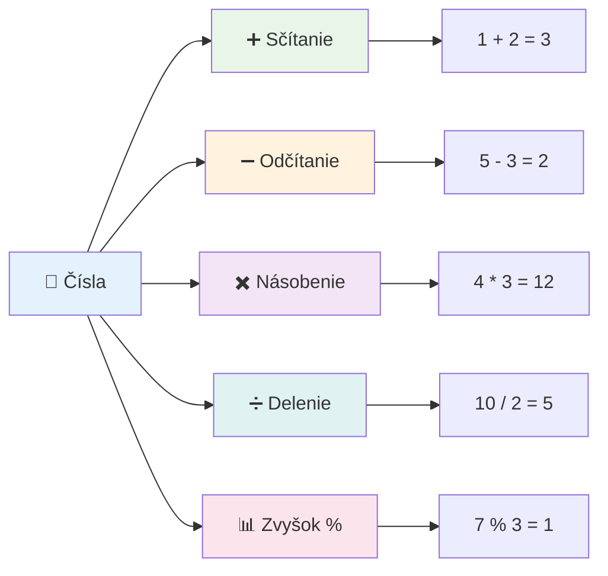
### Aritmetické operátory

Aritmetické operátory vám umožňujú vykonávať matematické výpočty v JavaScripte. Tieto operátory nasledujú rovnaké princípy, ktoré používali matematickí vedci po stáročia – tie isté symboly, ktoré sa objavili v dielach učencov ako Al-Chvárizmí, ktorý vyvinul algebraickú notáciu.

Tieto operátory fungujú tak, ako by ste očakávali: plus na sčítanie, mínus na odčítanie a tak ďalej.

Existuje niekoľko typov operátorov na použitie pri aritmetických funkciách, a niektoré sú tu uvedené:

| Symbol | Popis                                                                  | Príklad                          |
| ------ | ---------------------------------------------------------------------- | ------------------------------- |
| `+`    | **Sčítanie**: Vypočíta súčet dvoch čísel                             | `1 + 2 //očakávaný výsledok je 3`   |
| `-`    | **Odčítanie**: Vypočíta rozdiel dvoch čísel                          | `1 - 2 //očakávaný výsledok je -1`  |
| `*`    | **Násobenie**: Vypočíta súčin dvoch čísel                            | `1 * 2 //očakávaný výsledok je 2`   |
| `/`    | **Delenie**: Vypočíta podiel dvoch čísel                             | `1 / 2 //očakávaný výsledok je 0.5` |
| `%`    | **Zvyšok po delení**: Vypočíta zvyšok po delení dvoch čísel          | `1 % 2 //očakávaný výsledok je 1`   |

✅ Vyskúšajte! Skúste aritmetickú operáciu v konzole vášho prehliadača. Prekvapili vás výsledky?

### 🧮 **Kontrola matematických zručností: Spočítajte s dôverou**

**Otestujte svoje pochopenie aritmetiky:**
- Aký je rozdiel medzi `/` (delenie) a `%` (zvyšok po delení)?
- Viete predpovedať, čo je výsledkom `10 % 3`? (Nápoveda: nie je to 3,33...)
- Načo môže byť operátor zvyšku po delení užitočný v programovaní?

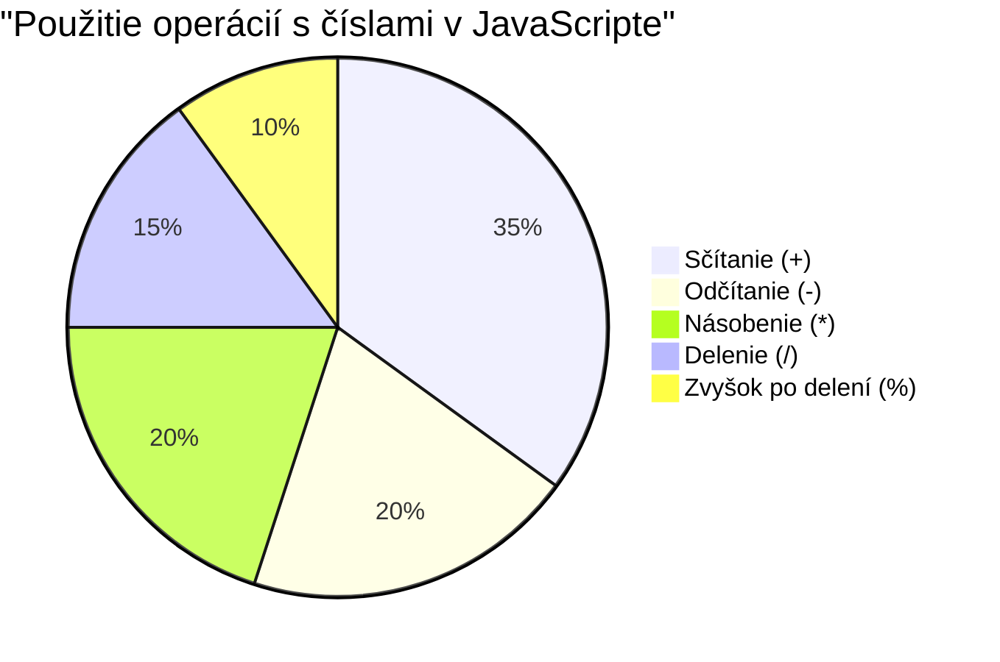
> **Pohľad zo života**: Operátor zvyšku (%) je veľmi užitočný na kontrolu, či je číslo párne/nepárne, na vytváranie vzorov alebo cyklické prechádzanie polí!

### Reťazce

V JavaScripte sú textové dáta reprezentované ako reťazce. Termín "string" pochádza z konceptu znakov spojených do radu, podobne ako písači v stredovekých kláštoroch spájali písmená, aby vytvorili slová a vety v rukopisoch.

Reťazce sú základom webového vývoja. Každý text zobrazený na webovej stránke – používateľské mená, popisky tlačidiel, chybové hlásenia, obsah – je spracovaný ako dátový reťazec. Pochopenie reťazcov je nevyhnutné na vytváranie funkčných používateľských rozhraní.

Reťazce sú množinou znakov umiestnených medzi jednoduchými alebo dvojitými úvodzovkami.

```javascript
'This is a string'
"This is also a string"
let myString = 'This is a string value stored in a variable';
```

**Pochopenie týchto konceptov:**
- **Používa** buď jednoduché úvodzovky `'` alebo dvojité úvodzovky `"` na definovanie reťazcov
- **Ukladá** textové dáta, ktoré môžu obsahovať písmená, čísla a symboly
- **Priraďuje** hodnoty reťazcov premenným na neskoršie použitie
- **Vyžaduje** úvodzovky na rozlíšenie textu od názvov premenných

Pamätajte si použiť úvodzovky pri písaní reťazca, inak JavaScript predpokladá, že ide o názov premennej.

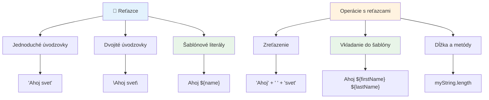
### Formátovanie reťazcov

Manipulácia s reťazcami vám umožňuje spojiť textové prvky, vložiť premenné a vytvoriť dynamický obsah, ktorý reaguje na stav programu. Táto technika vám umožňuje programovo konštruovať text.

Často je potrebné spojiť viaceré reťazce dokopy – tento proces sa nazýva konkatenácia.
Na **spojenie** dvoch alebo viacerých reťazcov, alebo ich zjednotenie, použite operátor `+`.

```javascript
let myString1 = "Hello";
let myString2 = "World";

myString1 + myString2 + "!"; //AhojSvet!
myString1 + " " + myString2 + "!"; //Ahoj Svet!
myString1 + ", " + myString2 + "!"; //Ahoj, svet!
```

**Krok za krokom, toto sa deje:**
- **Kombinuje** viacero reťazcov použitím operátora `+`
- **Zlučuje** reťazce priamo za sebou bez medzier v prvom príklade
- **Pridáva** medzery `" "` medzi reťazce pre lepšiu čitateľnosť
- **Vkladá** interpunkciu ako čiarky na správne naformátovanie

✅ Prečo v JavaScripte platí `1 + 1 = 2`, ale `'1' + '1' = 11?` Zamyslite sa nad tým. A čo `'1' + 1`?

**Šablónové reťazce** sú ďalší spôsob formátovania reťazcov, kde namiesto úvodzoviek sa používa znak spätného apostrofu (backtick). Čokoľvek, čo nie je obyčajným textom, musí byť umiestnené v zástupných výrazoch `${ }`. To zahŕňa aj premenné, ktoré môžu byť reťazce.

```javascript
let myString1 = "Hello";
let myString2 = "World";

`${myString1} ${myString2}!` //Ahoj svet!
`${myString1}, ${myString2}!` //Ahoj, svet!
```

**Pochopme každú časť:**
- **Používa** spätné apostrofy `` ` `` namiesto bežných úvodzoviek na vytvorenie šablónových reťazcov
- **Vkladá** premenné priamo pomocou syntaxe `${}`
- **Zachováva** medzery a formátovanie presne tak, ako sú napísané
- **Poskytuje** čistejší spôsob tvorby zložitých reťazcov s premennými

Na dosiahnutie požadovaného formátovania môžete použiť ktorýkoľvek spôsob, ale šablónové reťazce budú rešpektovať všetky medzery a zalomenia riadkov.

✅ Kedy by ste použili šablónový reťazec namiesto obyčajného reťazca?

### 🔤 **Kontrola zručností s reťazcami: Sebadôvera v manipulácii s textom**

**Zhodnoťte svoje schopnosti s reťazcami:**
- Dokážete vysvetliť, prečo `'1' + '1'` je `'11'` namiesto `2`?
- Ktorú metódu reťazca považujete za zrozumiteľnejšiu: konkatenáciu alebo šablónové reťazce?
- Čo sa stane, ak zabudnete úvodzovky okolo reťazca?

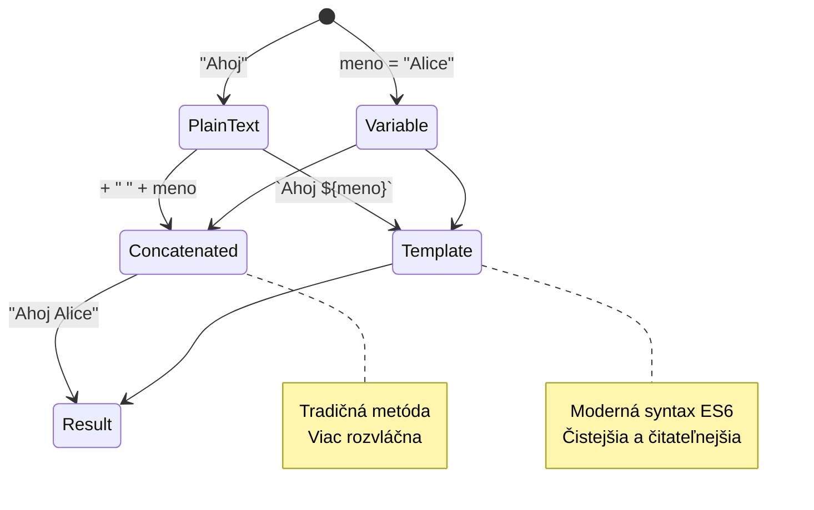
> **Tip od profesionála**: Šablónové reťazce sú zväčša preferované pre zložitejšiu tvorbu reťazcov, pretože sú čitateľnejšie a krásne pracujú s viacriadkovými reťazcami!

### Boolean (logické hodnoty)

Boolean predstavuje najjednoduchší typ dát: môže mať len dve hodnoty – `true` alebo `false`. Tento binárny logický systém pochádza z práce Georga Boolea, matematika z 19. storočia, ktorý vyvinul Booleovu algebru.

Napriek svojej jednoduchosti sú booleany nevyhnutné pre logiku programov. Umožňujú vášmu kódu robiť rozhodnutia na základe podmienok – či je používateľ prihlásený, či bol stlačený tlačidlo alebo či sú splnené určité kritériá.

Boolean môže nadobúdať len dve hodnoty: `true` alebo `false`. Boolovské hodnoty pomáhajú rozhodnúť, ktoré riadky kódu sa majú vykonať, keď sú splnené určité podmienky. Vo veľa prípadoch [operátory](../../../../2-js-basics/1-data-types) pomáhajú nastaviť hodnotu boolovskej premennej a často si všimnete, že premenné sú inicializované alebo ich hodnoty aktualizované pomocou operátora.

```javascript
let myTrueBool = true;
let myFalseBool = false;
```

**Čo sme v príklade urobili:**
- **Vytvorili** premennú, ktorá ukladá hodnotu boolean `true`
- **Ukázali**, ako uložiť boolean hodnotu `false`
- **Použili** presné kľúčové slová `true` a `false` (nie sú potrebné úvodzovky)
- **Pripravili** tieto premenné na použitie v podmienkových výrazoch

✅ Premenná môže byť považovaná za „pravdivú“ (truthy), ak vyhodnocuje na boolovú hodnotu `true`. Zaujímavosťou je, že v JavaScripte sú [všetky hodnoty pravdivé, pokiaľ nie sú definované ako falsy](https://developer.mozilla.org/docs/Glossary/Truthy).

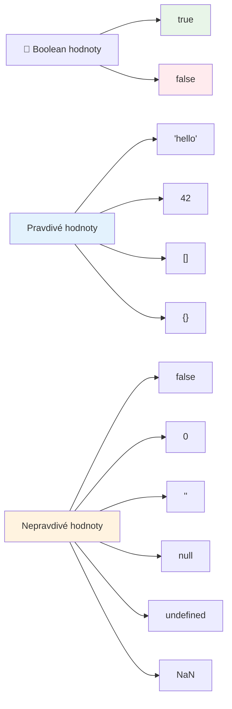
### 🎯 **Kontrola logiky booleanov: Schopnosť rozhodovať**

**Otestujte svoje pochopenie boolean:**
- Prečo si myslíte, že JavaScript má okrem `true` a `false` aj „truthy“ a „falsy“ hodnoty?
- Dokážete predpovedať, ktorá z týchto hodnôt je falsy: `0`, `"0"`, `[]`, `"false"`?
- Ako môžu byť booleany užitočné v riadení toku programov?

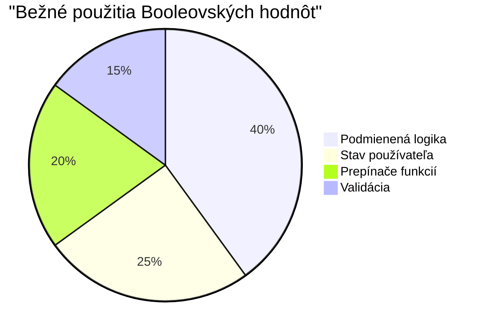
> **Pamätajte**: V JavaScripte je len 6 falsy hodnôt: `false`, `0`, `""`, `null`, `undefined` a `NaN`. Všetko ostatné je truthy!

---

## 📊 **Zhrnutie nástrojov na dátové typy**

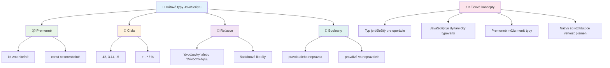
## Výzva GitHub Copilot agenta 🚀

Použite režim Agenta na splnenie nasledujúcej výzvy:

**Popis:** Vytvorte správcu osobných informácií, ktorý demonštruje všetky JavaScriptové dátové typy naučené v tejto lekcii a zároveň spracováva scenáre reálnych dát.

**Úloha:** Napíšte JavaScript program, ktorý vytvorí objekt profilu používateľa obsahujúci: meno osoby (reťazec), vek (číslo), stav študenta (boolean), obľúbené farby ako pole a objekt adresy s ulicou, mestom a poštovým kódom. Pridajte funkcie na zobrazenie informácií profilu a aktualizáciu jednotlivých polí. Nezabudnite demonštrovať spojenie reťazcov, šablónové reťazce, aritmetické operácie s vekom a logiku booleanu pre študentský stav.

Viac o [režime agenta](https://code.visualstudio.com/blogs/2025/02/24/introducing-copilot-agent-mode) sa dozviete tu.

## 🚀 Výzva

JavaScript má niektoré správanie, ktoré môže vývojárov prekvapiť. Tu je klasický príklad na preskúmanie: skúste zadať do konzoly vášho prehliadača: `let age = 1; let Age = 2; age == Age` a pozorujte výsledok. Vráti `false` – viete určiť prečo?

Toto je len jeden z mnohých javov v JavaScripte, ktoré je dobré pochopiť. Znalosť týchto zvláštností vám pomôže písať spoľahlivejší kód a efektívnejšie odstraňovať chyby.

## Kvíz po prednáške
[Post-lecture quiz](https://ff-quizzes.netlify.app)

## Prehľad a samostatné štúdium

Pozrite sa na [tento zoznam JavaScriptových cvičení](https://css-tricks.com/snippets/javascript/) a skúste si jedno. Čo ste sa naučili?

## Zadanie

[Precvičovanie dátových typov](assignment.md)

## 🚀 Plán zvládnutia dátových typov v JavaScripte

### ⚡ **Čo zvládnete za najbližších 5 minút**
- [ ] Otvorte konzolu v prehliadači a vytvorte 3 premenné s rôznymi dátovými typmi
- [ ] Vyskúšajte výzvu: `let age = 1; let Age = 2; age == Age` a zistite, prečo je to false
- [ ] Precvičte si spájanie reťazcov s vaším menom a obľúbeným číslom
- [ ] Otestujte, čo sa stane, keď k reťazcu pripojíte číslo

### 🎯 **Čo zvládnete za túto hodinu**
- [ ] Dokončite kvíz po lekcii a obnovte si nejasné pojmy
- [ ] Vytvorte mini kalkulačku, ktorá sčíta, odčíta, vynásobí a vydelí dve čísla
- [ ] Postavte jednoduchý formátovač mena pomocou šablónových reťazcov
- [ ] Preskúmajte rozdiely medzi operátormi porovnania `==` a `===`
- [ ] Precvičte si konverziu medzi rôznymi dátovými typmi

### 📅 **Týždeň základy JavaScriptu**
- [ ] S istotou a kreativitou dokončite zadanie
- [ ] Vytvorte osobný profilový objekt využitím všetkých naučených dátových typov
- [ ] Precvičte si úlohy z [JavaScriptových cvičení od CSS-Tricks](https://css-tricks.com/snippets/javascript/)
- [ ] Postavte jednoduchý validátor formulárov pomocou booleanovej logiky
- [ ] Experimentujte s poliami a objektovými dátovými typmi (náhľad na nadchádzajúce lekcie)
- [ ] Pridajte sa do JavaScriptovej komunity a pýtajte sa na dátové typy

### 🌟 **Mesačná transformácia**
- [ ] Integrujte vedomosti o dátových typoch do väčších programovacích projektov
- [ ] Pochopte, kedy a prečo používať ktorý dátový typ v reálnych aplikáciách
- [ ] Pomáhajte začínajúcim programátorom chápať základy JavaScriptu
- [ ] Postavte malú aplikáciu na správu rôznych typov používateľských dát
- [ ] Preskúmajte pokročilé koncepty ako koercia typov a prísna rovnosť
- [ ] Prispievajte do open source projektov v JavaScripte zlepšovaním dokumentácie

### 🧠 **Záverečná kontrola zvládnutia dátových typov**

**Oslávte svoj základ v JavaScripte:**
- Ktorý dátový typ vás najviac prekvapil svojím správaním?
- Ako dobre sa cítite vysvetľovať premenné vs. konštanty priateľovi?
- Čo je najzaujímavejšia vec, ktorú ste objavili o systéme typov v JavaScripte?
- Ktorú reálnu aplikáciu by ste si vedeli predstaviť vytvoriť s týmito základmi?

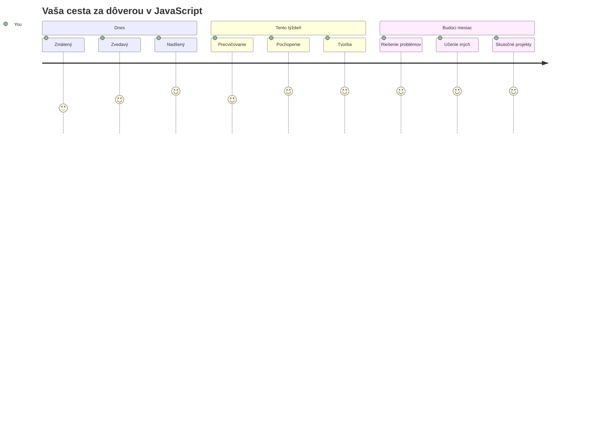
> 💡 **Postavili ste si základy!** Pochopenie dátových typov je ako naučiť sa abecedu predtým, než začnete písať príbehy. Každý JavaScriptový program, ktorý kedy napíšete, bude používať tieto základné koncepty. Teraz máte stavebné kamene na tvorbu interaktívnych webov, dynamických aplikácií a riešenie reálnych problémov pomocou kódu. Vitajte vo fascinujúcom svete JavaScriptu! 🎉

---

<!-- CO-OP TRANSLATOR DISCLAIMER START -->
**Vylúčenie zodpovednosti**:  
Tento dokument bol preložený pomocou AI prekladateľskej služby [Co-op Translator](https://github.com/Azure/co-op-translator). Hoci sa snažíme o presnosť, vezmite prosím na vedomie, že automatizované preklady môžu obsahovať chyby alebo nepresnosti. Pôvodný dokument v jeho rodnom jazyku by mal byť považovaný za autoritatívny zdroj. Pre kritické informácie sa odporúča profesionálny ľudský preklad. Nezodpovedáme za žiadne nedorozumenia alebo nesprávne výklady vyplývajúce z použitia tohto prekladu.
<!-- CO-OP TRANSLATOR DISCLAIMER END -->