# Základy JavaScriptu: Metódy a funkcie

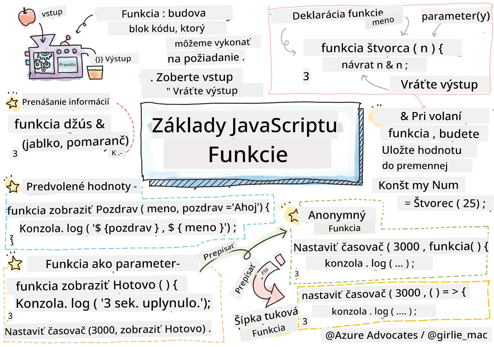
> Sketchnote od [Tomomi Imura](https://twitter.com/girlie_mac)

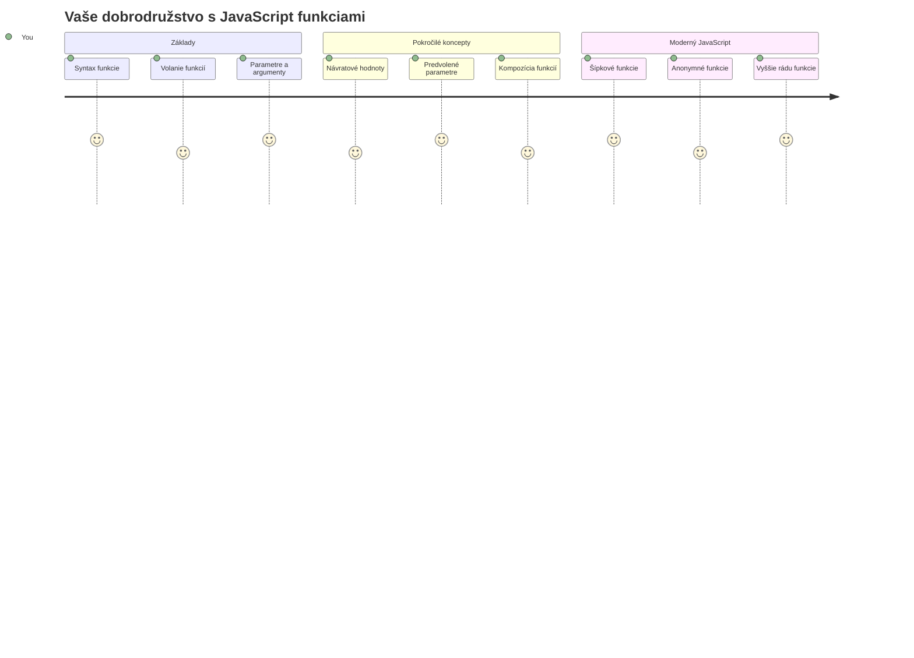
## Prednáškový kvíz
[Prednáškový kvíz](https://ff-quizzes.netlify.app)

Opakované písanie rovnakého kódu je jednou z najčastejších frustrácií programovania. Funkcie riešia tento problém tým, že vám umožňujú zabaliť kód do opakovane použiteľných blokov. Myslite na funkcie ako na štandardizované diely, ktoré urobili výrobné linky Henryho Forda revolučnými – akonáhle vytvoríte spoľahlivý komponent, môžete ho použiť kdekoľvek bez toho, aby ste ho museli znovu vytvárať od nuly.

Funkcie vám umožňujú zoskupiť kúsky kódu, aby ste ich mohli znova použiť v celom vašom programe. Namiesto kopírovania a vkladania rovnakého logiky všade môžete vytvoriť funkciu raz a volať ju vždy, keď ju potrebujete. Tento prístup udržiava váš kód organizovaný a uľahčuje aktualizácie.

V tejto lekcii sa naučíte, ako vytvoriť vlastné funkcie, ako im odovzdávať informácie a ako získať užitočné výsledky späť. Zistíte rozdiel medzi funkciami a metódami, naučíte sa moderné syntaktické prístupy a uvidíte, ako funkcie môžu pracovať s inými funkciami. Tieto koncepty budeme budovať krok za krokom.

[](https://youtube.com/watch?v=XgKsD6Zwvlc "Metódy a funkcie")

> 🎥 Kliknite na obrázok vyššie pre video o metódach a funkciách.

> Túto lekciu si môžete prejsť na [Microsoft Learn](https://docs.microsoft.com/learn/modules/web-development-101-functions/?WT.mc_id=academic-77807-sagibbon)!

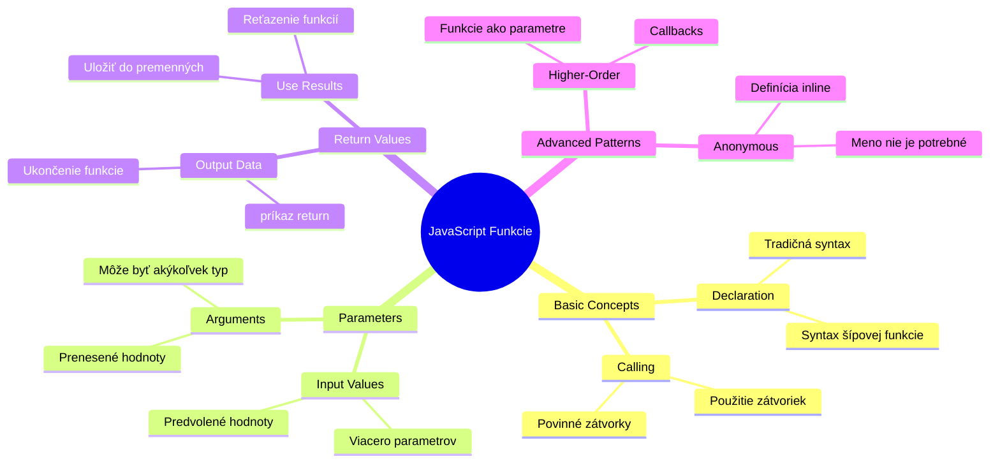
## Funkcie

Funkcia je samostatný blok kódu, ktorý vykonáva konkrétnu úlohu. Zahrňuje logiku, ktorú môžete spustiť vždy, keď je to potrebné.

Namiesto písania rovnakého kódu niekoľkokrát v celom programe ho môžete zabaliť do funkcie a túto funkciu volať vždy, keď ju potrebujete. Tento prístup udržiava váš kód čistý a uľahčuje aktualizácie. Predstavte si, akú výzvu by predstavovala údržba, ak by ste mali meniť logiku roztrúsenú na 20 rôznych miestach vo vašom kóde.

Je dôležité pomenovať vaše funkcie vydatne. Dobre pomenovaná funkcia jasne komunikuje svoj účel – keď vidíte `cancelTimer()`, okamžite chápete, čo robí, presne ako jasne označené tlačidlo vám presne povie, čo sa stane, keď naň kliknete.

## Vytvorenie a volanie funkcie

Pozrime sa, ako vytvoriť funkciu. Syntax nasleduje konzistentný vzor:

```javascript
function nameOfFunction() { // definícia funkcie
 // definícia/telo funkcie
}
```

Rozoberme si to:
- Kľúčové slovo `function` hovorí JavaScriptu „Hej, vytváram funkciu!“
- `nameOfFunction` je miesto, kde dáte funkcii popisný názov
- Zátvorky `()` sú miesto, kde môžete pridať parametre (k tomu sa čoskoro dostaneme)
- Kľúčové zátvorky `{}` obsahujú skutočný kód, ktorý sa spustí, keď funkciu zavoláte

Vytvorme jednoduchú funkciu na pozdrav, aby sme to videli v praxi:

```javascript
function displayGreeting() {
  console.log('Hello, world!');
}
```

Táto funkcia vypíše „Hello, world!“ do konzoly. Akonáhle ju definujete, môžete ju použiť toľkokrát, koľkokrát budete potrebovať.

Ak chcete vašu funkciu spustiť (alebo „zavolať“), napíšte jej názov a za ním zátvorky. JavaScript vám umožňuje definovať funkciu pred alebo po jej zavolaní – JavaScriptový engine sa postará o poradie vykonania.

```javascript
// volanie našej funkcie
displayGreeting();
```

Keď spustíte tento riadok, vykoná sa všetok kód vo vašej funkcii `displayGreeting` a v konzole prehliadača sa zobrazí „Hello, world!“. Túto funkciu môžete volať opakovane.

### 🧠 **Kontrola základov funkcií: Vytváranie vašich prvých funkcií**

**Pozrime sa, ako rozumiete základným funkciám:**
- Dokážete vysvetliť, prečo používame kľúčové zátvorky `{}` vo funkčných definíciách?
- Čo sa stane, ak napíšete `displayGreeting` bez zátvoriek?
- Prečo by ste mohli chcieť volať tú istú funkciu viackrát?

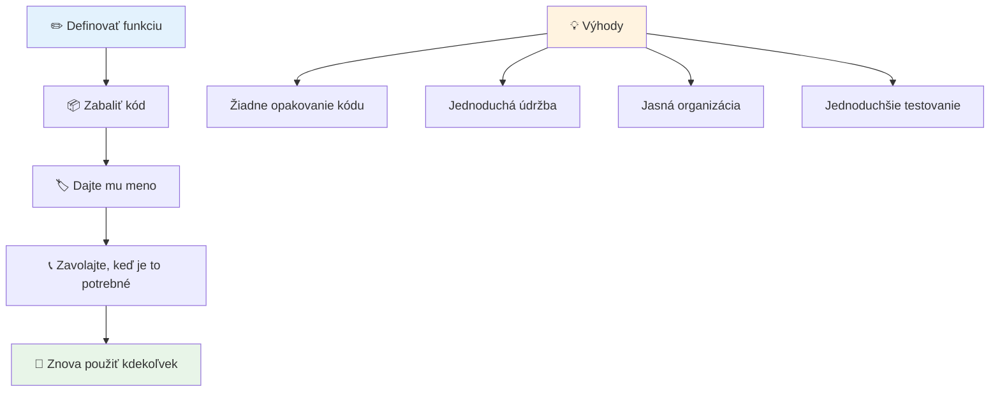
> **Poznámka:** Počas týchto lekcií ste používali **metódy**. `console.log()` je metóda – v podstate funkcia, ktorá patrí objektu `console`. Podstatný rozdiel je, že metódy sú pripojené k objektom, zatiaľ čo funkcie stoja samostatne. Mnoho vývojárov používa tieto termíny bežne zameniteľne.

### Najlepšie postupy pri písaní funkcií

Tu je niekoľko tipov, ktoré vám pomôžu písať skvelé funkcie:

- Dávajte vašim funkciám jasné, popisné názvy – vaše budúce ja vám poďakuje!
- Používajte **camelCase** pre viacslovné názvy (napr. `calculateTotal` namiesto `calculate_total`)
- Každá funkcia by sa mala sústrediť na jednu vec a robiť ju dobre

## Odovzdávanie informácií funkcii

Naša funkcia `displayGreeting` je obmedzená – dokáže zobraziť len „Hello, world!“ pre všetkých. Parametre nám umožňujú spraviť funkcie flexibilnejšími a užitočnejšími.

**Parametre** fungujú ako zástupné symboly, kam môžeme vložiť rôzne hodnoty vždy, keď funkciu použijeme. Takto tá istá funkcia môže na každý hovor pracovať s inými informáciami.

Parametre uvádzate vo zátvorkách pri definovaní funkcie, viac parametrov oddeľujete čiarkou:

```javascript
function name(param, param2, param3) {

}
```

Každý parameter funguje ako zástupné miesto – keď niekto zavolá vašu funkciu, poskytne skutočné hodnoty, ktoré sa vložia do týchto miest.

Aktualizujme našu pozdravnú funkciu tak, aby prijímala meno niekoho:

```javascript
function displayGreeting(name) {
  const message = `Hello, ${name}!`;
  console.log(message);
}
```

Všimnite si, ako používame spätné úvodzovky (`` ` ``) a `${}` na vloženie mena priamo do správy – to sa nazýva šablónový literál a je to veľmi užitočný spôsob, ako vytvárať reťazce so zmiešanými premennými.

Teraz, keď funkciu zavoláme, môžeme poslať akékoľvek meno:

```javascript
displayGreeting('Christopher');
// zobrazuje "Hello, Christopher!" pri spustení
```

JavaScript vezme reťazec `'Christopher'`, priradí ho parametru `name` a vytvorí personalizovanú správu „Hello, Christopher!“

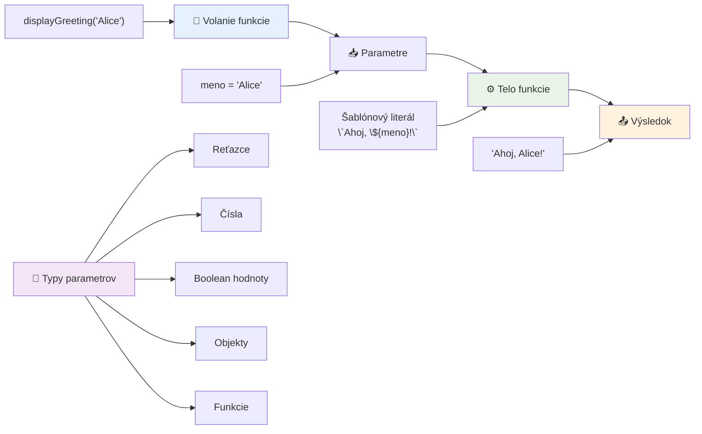
## Predvolené hodnoty

Čo ak chceme, aby niektoré parametre boli voliteľné? Vtedy prichádzajú vhod predvolené hodnoty!

Povedzme, že chceme, aby si ľudia mohli prispôsobiť pozdravové slovo, ale ak ho nespecifikujú, použijeme „Hello“ ako zálohu. Predvolené hodnoty nastavíte pomocou rovnítka, podobne ako pri nastavovaní premennej:

```javascript
function displayGreeting(name, salutation='Hello') {
  console.log(`${salutation}, ${name}`);
}
```

Tu je `name` stále povinné, ale `salutation` má záložnú hodnotu `'Hello'`, ak nikto neposkytne iný pozdrav.

Teraz môžeme túto funkciu volať dvoma rôznymi spôsobmi:

```javascript
displayGreeting('Christopher');
// zobrazuje "Ahoj, Christopher"

displayGreeting('Christopher', 'Hi');
// zobrazuje "Čaute, Christopher"
```

Pri prvom volaní JavaScript použije predvolené „Hello“, keďže sme nespecifikovali pozdrav. Pri druhom volaní použije náš vlastný „Hi“. Táto flexibilita robí funkcie prispôsobiteľné rôznym scenárom.

### 🎛️ **Kontrola ovládania parametrov: Robenie funkcií flexibilnými**

**Otestujte svoje chápanie parametrov:**
- Aký je rozdiel medzi parametrom a argumentom?
- Prečo sú predvolené hodnoty užitočné v reálnom programovaní?
- Dokážete predpovedať, čo sa stane, ak zadáte viac argumentov než je parametrov?

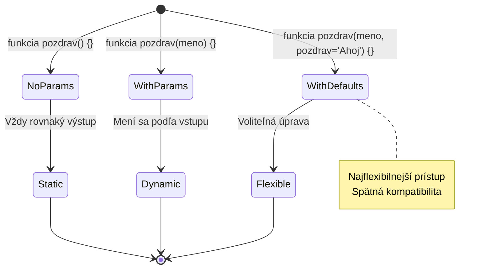
> **Profesionálny tip**: Predvolené parametre robia vaše funkcie používateľsky prívetivejšími. Používatelia môžu rýchlo začať s rozumnými predvoľbami, ale stále majú možnosť prispôsobiť si ich podľa potreby!

## Návratové hodnoty

Doteraz naše funkcie iba vypisovali správy do konzoly, ale čo ak chcete, aby funkcia niečo vypočítala a vrátila výsledok?

Tu prichádzajú na rad **návratové hodnoty**. Namiesto jednoduchého zobrazenia niečoho vám funkcia môže vrátiť hodnotu, ktorú môžete uložiť do premennej alebo použiť v iných častiach kódu.

Na vrátenie hodnoty použijete kľúčové slovo `return` nasledované tým, čo chcete vrátiť:

```javascript
return myVariable;
```

Dôležité je vedieť: keď funkcia narazí na `return`, okamžite skončí vykonávanie a odošle túto hodnotu volajúcemu.

Upravme našu pozdravnú funkciu tak, aby vracala správu namiesto jej vypisovania:

```javascript
function createGreetingMessage(name) {
  const message = `Hello, ${name}`;
  return message;
}
```

Teraz namiesto vypísania pozdravu funkcia vytvorí správu a vráti ju nám.

Na použitie vrátenej hodnoty ju môžeme uložiť do premennej ako každú inú hodnotu:

```javascript
const greetingMessage = createGreetingMessage('Christopher');
```

Teraz `greetingMessage` obsahuje „Hello, Christopher“ a môžeme ju použiť kdekoľvek v našom kóde – na zobrazenie na webovej stránke, zahrnutie do e-mailu alebo odovzdanie inej funkcii.

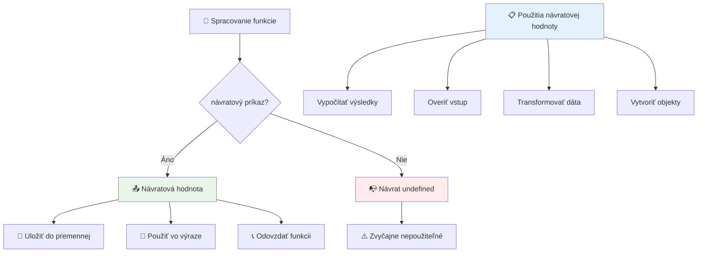
### 🔄 **Kontrola návratových hodnôt: Získavanie výsledkov späť**

**Vyhodnoťte svoje porozumenie návratu hodnôt:**
- Čo sa stane s kódom za `return` vo funkcii?
- Prečo je často lepšie vracať hodnoty než len vypisovať do konzoly?
- Môže funkcia vrátiť rôzne typy hodnôt (reťazec, číslo, boolean)?

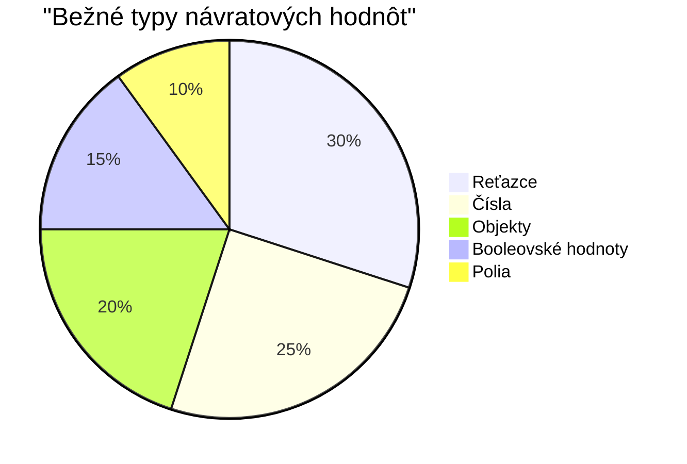
> **Kľúčový postreh**: Funkcie vracajúce hodnoty sú flexibilnejšie, pretože volajúci rozhoduje, čo robiť s výsledkom. To robí váš kód modulárnejším a opakovane použiteľným!

## Funkcie ako parametre pre funkcie

Funkcie môžu byť odovzdávané ako parametre iným funkciám. Hoci tento koncept môže byť spočiatku zložitý, je to silná vlastnosť umožňujúca flexibilné programovacie vzory.

Tento vzor je veľmi bežný, keď chcete povedať „keď sa niečo stane, urob toto druhé“. Napríklad „keď skončí časovač, spusti tento kód“ alebo „keď používateľ klikne na tlačidlo, zavolaj túto funkciu“.

Pozrime sa na `setTimeout`, čo je zabudovaná funkcia, ktorá čaká určitý čas a potom spustí kód. Musíme jej povedať, aký kód spustiť – ideálne na odovzdanie funkcie!

Vyskúšajte tento kód – po 3 sekundách uvidíte správu:

```javascript
function displayDone() {
  console.log('3 seconds has elapsed');
}
// hodnota časovača je v milisekundách
setTimeout(displayDone, 3000);
```

Všimnite si, ako odovzdávame `displayDone` (bez zátvoriek) do `setTimeout`. Nevoláme funkciu sami – odovzdávame ju `setTimeout` a hovoríme „zavolaj toto o 3 sekundy.“

### Anonymné funkcie

Niekedy potrebujete funkciu na len jedno použitie a nechcete jej dávať meno. Rozmýšľajte takto – ak funkciu používate len raz, prečo zbytočne zneprehľadňovať kód ďalším názvom?

JavaScript vám umožňuje vytvárať **anonymné funkcie** – funkcie bez mena, ktoré môžete definovať priamo tam, kde ich potrebujete.

Tu je, ako môžeme prepísať náš príklad s časovačom pomocou anonymnej funkcie:

```javascript
setTimeout(function() {
  console.log('3 seconds has elapsed');
}, 3000);
```

Dosiahne to rovnaký výsledok, ale funkcia je definovaná priamo v volaní `setTimeout`, čím sa eliminuje potreba samostatnej deklarácie funkcie.

### Šípkové funkcie

Moderný JavaScript má ešte kratší spôsob zápisu funkcií nazývaný **šípkové funkcie**. Používajú `=>` (vyzerá ako šípka – viete?) a sú veľmi obľúbené medzi vývojármi.

Šípkové funkcie vám umožňujú vynechať kľúčové slovo `function` a písať stručnejší kód.

Tu je náš príklad časovača s použitím šípkovej funkcie:

```javascript
setTimeout(() => {
  console.log('3 seconds has elapsed');
}, 3000);
```

`()` je miesto, kde by boli parametre (tu prázdne), potom nasleduje šípka `=>` a nakoniec telo funkcie v kľúčových zátvorkách. Poskytuje to rovnakú funkcionalitu s výraznejšie stručnejšou syntaxou.

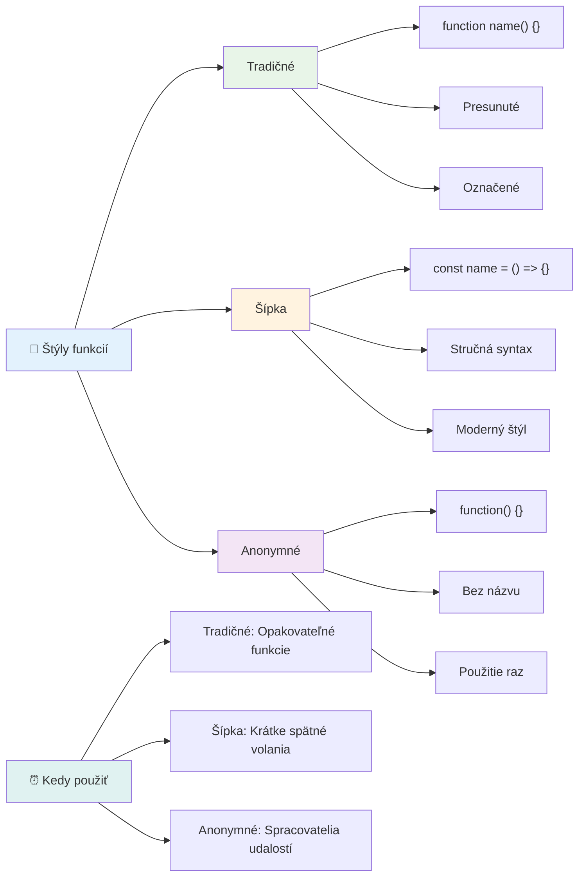
### Kedy ktorý štýl použiť

Kedy použiť ktorý prístup? Praktické pravidlo: ak budete funkciu používať viackrát, dajte jej meno a definujte ju samostatne. Ak je to na jedno konkrétne použitie, zvážte anonymnú funkciu. Šípkové aj tradičné funkcie sú platné voľby, hoci šípkové funkcie sú dominantné v moderných kódoch JavaScriptu.

### 🎨 **Kontrola štýlov funkcií: Výber správnej syntaxe**

**Otestujte svoje porozumenie syntaxe:**
- Kedy by ste mohli uprednostniť šípkové funkcie pred tradičnou syntaxou funkcií?
- Aká je hlavná výhoda anonymných funkcií?
- Dokážete si predstaviť situáciu, kde je pomenovaná funkcia lepšia ako anonymná?

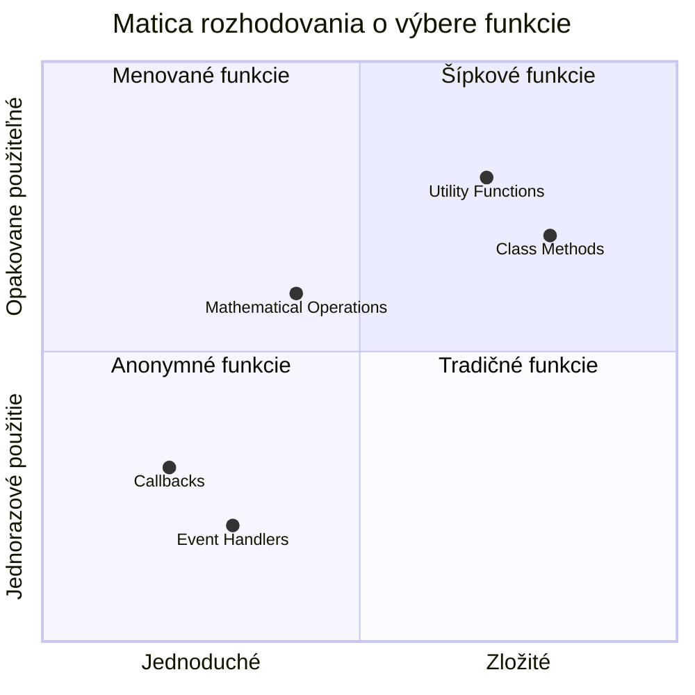
> **Moderný trend:** Šípkové funkcie sa stávajú štandardnou voľbou pre mnohých vývojárov kvôli ich stručnej syntaxe, ale tradičné funkcie majú aj naďalej svoje miesto!

---


## 🚀 Výzva

Dokážete jednou vetou vyjadriť rozdiel medzi funkciami a metódami? Skúste to!

## Výzva GitHub Copilot agenta 🚀

Použite režim agenta na splnenie nasledujúcej výzvy:

**Popis:** Vytvorte knižnicu matematických funkcií, ktorá demonštruje rôzne koncepty funkcií prebrané v tejto lekcii, vrátane parametrov, predvolených hodnôt, návratových hodnôt a šípkových funkcií.

**Prompt:** Vytvorte súbor JavaScript s názvom `mathUtils.js` obsahujúci nasledujúce funkcie:
1. Funkciu `add`, ktorá prijíma dva parametre a vracia ich súčet
2. Funkciu `multiply` s predvolenými hodnotami parametrov (druhý parameter predvolene 1)
3. Šípkovú funkciu `square`, ktorá prijíma číslo a vracia jeho druhú mocninu
4. Funkciu `calculate`, ktorá prijíma inú funkciu ako parameter a dve čísla, potom aplikuje túto funkciu na tieto čísla
5. Ukážku volania každej funkcie s vhodnými testovacími prípadmi

Viac o [režime agenta](https://code.visualstudio.com/blogs/2025/02/24/introducing-copilot-agent-mode) sa dozviete tu.

## Postnáškový kvíz
[Postnáškový kvíz](https://ff-quizzes.netlify.app)

## Prehľad a samostatné štúdium

Oplatí sa [si trochu prečítať o šípkových funkciách](https://developer.mozilla.org/docs/Web/JavaScript/Reference/Functions/Arrow_functions), pretože sa čoraz viac používajú v kódových bázach. Precvičujte si písanie funkcií a potom ich prepíšte pomocou tejto syntaxe.

## Zadanie

[Zábava s funkciami](assignment.md)

---

## 🧰 **Zhrnutie vášho náradia JavaScriptových funkcií**

```mermaid
graph TD
    A["🎯 JavaScript Funkcie"] --> B["📋 Deklarácia Funkcie"]
    A --> C["📥 Parametre"]
    A --> D["📤 Návratové Hodnoty"]
    A --> E["🎨 Moderná Syntaktika"]
    
    B --> B1["function name() {}"]
    B --> B2["Popisné pomenovanie"]
    B --> B3["Znovupoužiteľné bloky kódu"]
    
    C --> C1["Vstupné údaje"]
    C --> C2["Predvolené hodnoty"]
    C --> C3["Viacnásobné parametre"]
    
    D --> D1["príkaz return"]
    D --> D2["Ukončenie funkcie"]
    D --> D3["Prenos dát späť"]
    
    E --> E1["Šípkové funkcie: () =>"]
    E --> E2["Anonymné funkcie"]
    E --> E3["Funkcie vyššieho rádu"]
    
    F["⚡ Kľúčové Výhody"] --> F1["Znovupoužiteľnosť kódu"]
    F --> F2["Lepšia organizácia"]
    F --> F3["Jednoduchšie testovanie"]
    F --> F4["Modulárny dizajn"]
    
    style A fill:#e3f2fd
    style B fill:#e8f5e8
    style C fill:#fff3e0
    style D fill:#f3e5f5
    style E fill:#e0f2f1
    style F fill:#fce4ec
```
---

## 🚀 Časová os vášho ovládania JavaScriptových funkcií

### ⚡ **Čo zvládnete za nasledujúcich 5 minút**
- [ ] Napísať jednoduchú funkciu, ktorá vracia vaše obľúbené číslo
- [ ] Vytvoriť funkciu so dvoma parametrami, ktorá ich sčíta together
- [ ] Vyskúšať prevod tradičnej funkcie na syntax šípovej funkcie
- [ ] Precvičiť úlohu: vysvetliť rozdiel medzi funkciami a metódami

### 🎯 **Čo môžete dosiahnuť v tejto hodine**
- [ ] Dokončiť kvíz po lekcii a zopakovať si akékoľvek nejasné koncepty
- [ ] Postaviť knižnicu matematických utilít z výzvy GitHub Copilot
- [ ] Vytvoriť funkciu, ktorá používa inú funkciu ako parameter
- [ ] Precvičiť písanie funkcií so štandardnými parametrami
- [ ] Experimentovať s template literálmi v návratových hodnotách funkcií

### 📅 **Tvoj týždeň ovládania funkcií**
- [ ] Dokončiť zadanie „Zábava s funkciami“ s kreativitou
- [ ] Refaktorovať nejaký opakujúci sa kód, ktorý si napísal, do znovupoužiteľných funkcií
- [ ] Postaviť malý kalkulátor iba pomocou funkcií (bez globálnych premenných)
- [ ] Precvičovať šípové funkcie s metódami polí ako `map()` a `filter()`
- [ ] Vytvoriť súbor utilitných funkcií pre bežné úlohy
- [ ] Študovať funkcie vyššieho rádu a koncepty funkcionálneho programovania

### 🌟 **Tvoj mesačný prechod**
- [ ] Ovládnuť pokročilé koncepty funkcií ako closures a scope
- [ ] Postaviť projekt, ktorý intenzívne využíva skladanie funkcií
- [ ] Prispieť do open source zlepšením dokumentácie funkcií
- [ ] Naučiť niekoho iného o funkciách a rôznych štylistikách syntaxe
- [ ] Preskúmať paradigmy funkcionálneho programovania v JavaScripte
- [ ] Vytvoriť osobnú knižnicu znovupoužiteľných funkcií pre budúce projekty

### 🏆 **Záverečná kontrola majstra funkcií**

**Oslávte svoje ovládnutie funkcií:**
- Aká je najužitočnejšia funkcia, ktorú ste doteraz vytvorili?
- Ako sa zmenil váš pohľad na organizáciu kódu vďaka učeniu o funkciách?
- Ktorú syntax funkcie uprednostňujete a prečo?
- Aký reálny problém by ste vyriešili napísaním funkcie?

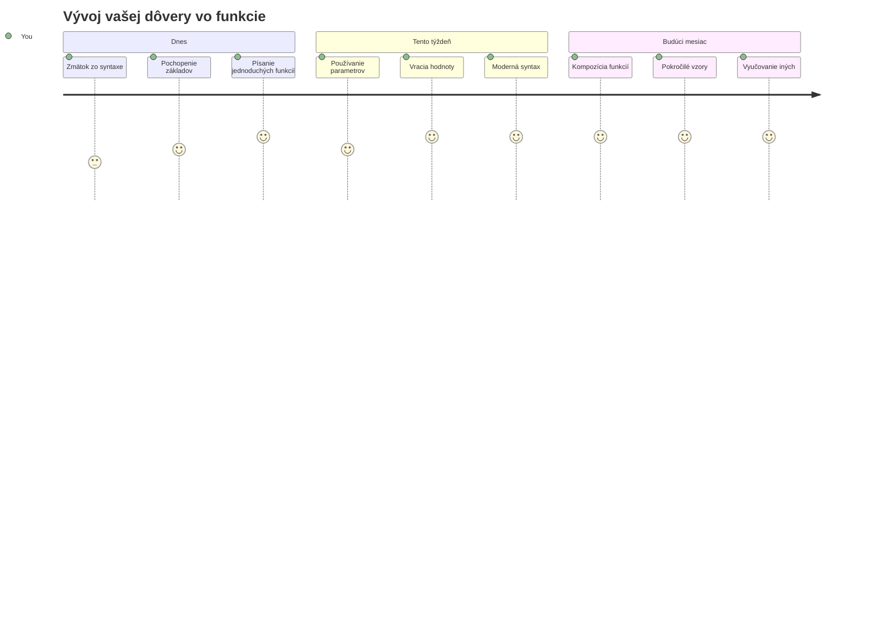
> 🎉 **Ovládli ste jeden z najsilnejších konceptov programovania!** Funkcie sú stavebnými kameňmi väčších programov. Každá aplikácia, ktorú kedy vytvoríte, bude používať funkcie na organizovanie, znovupoužitie a štrukturovanie kódu. Teraz rozumiete, ako zabaliť logiku do znovupoužiteľných komponentov, čo z vás robí efektívnejšieho a schopnejšieho programátora. Vitajte vo svete modulárneho programovania! 🚀

---

<!-- CO-OP TRANSLATOR DISCLAIMER START -->
**Upozornenie**:
Tento dokument bol preložený pomocou AI prekladateľskej služby [Co-op Translator](https://github.com/Azure/co-op-translator). Aj keď sa snažíme o presnosť, berte prosím na vedomie, že automatizované preklady môžu obsahovať chyby alebo nepresnosti. Pôvodný dokument v jeho rodnom jazyku by mal byť považovaný za autoritatívny zdroj. Pre kritické informácie sa odporúča profesionálny ľudský preklad. Nie sme zodpovední za žiadne nedorozumenia alebo nesprávne interpretácie vzniknuté použitím tohto prekladu.
<!-- CO-OP TRANSLATOR DISCLAIMER END -->