# JavaScript základy: Robenie rozhodnutí

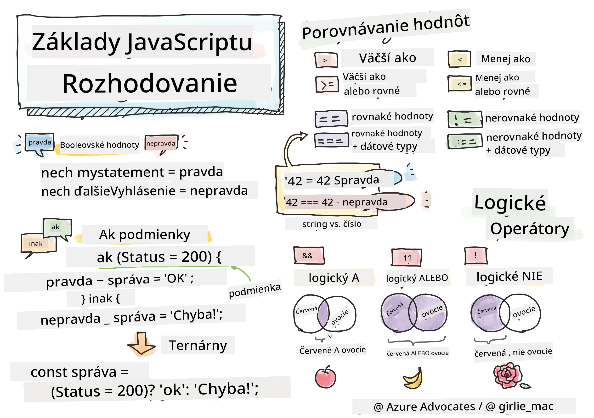

> Sketchnote od [Tomomi Imura](https://twitter.com/girlie_mac)

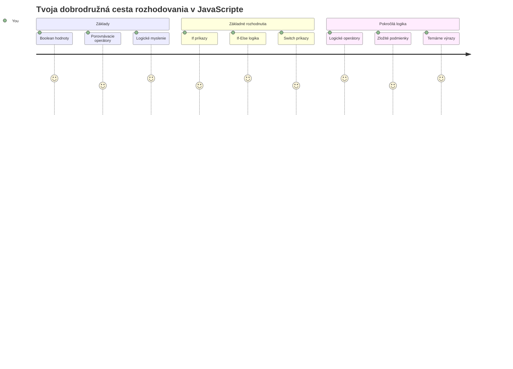
Už ste niekedy premýšľali nad tým, ako aplikácie robia inteligentné rozhodnutia? Ako navigačný systém vyberá najrýchlejšiu trasu, alebo ako termostat rozhoduje, kedy zapnúť kúrenie? Toto je základný koncept rozhodovania v programovaní.

Rovnako ako analytický stroj Charlesa Babbagea bol navrhnutý tak, aby sledoval rôzne sekvencie operácií na základe podmienok, aj moderné programy v JavaScripte potrebujú robiť voľby na základe meniacich sa okolností. Táto schopnosť vetvenia a rozhodovania mení statický kód na citlivé, inteligentné aplikácie.

V tejto lekcii sa naučíte, ako implementovať podmienenú logiku vo vašich programoch. Preskúmame podmienkové príkazy, porovnávacie operátory a logické výrazy, ktoré umožňujú vášmu kódu vyhodnocovať situácie a primerane na ne reagovať.

## Prednáškový kvíz

[Prednáškový kvíz](https://ff-quizzes.netlify.app/web/quiz/11)

Schopnosť robiť rozhodnutia a ovládať tok programu je základným aspektom programovania. Táto časť sa zaoberá tým, ako ovládať priebeh vykonávania vašich JavaScript programov pomocou Booleovských hodnôt a podmienených logík.

[](https://youtube.com/watch?v=SxTp8j-fMMY "Making Decisions")

> 🎥 Kliknite na obrázok vyššie pre video o rozhodovaní.

> Túto lekciu môžete absolvovať na [Microsoft Learn](https://docs.microsoft.com/learn/modules/web-development-101-if-else/?WT.mc_id=academic-77807-sagibbon)!

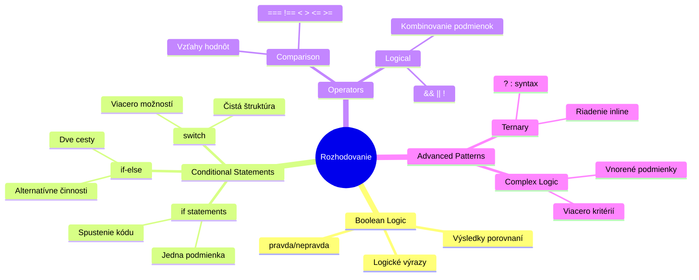
## Krátke zopakovanie o Booleanoch

Predtým než sa pustíme do rozhodovania, vráťme sa k Booleovským hodnotám z našej predchádzajúcej lekcie. Pomenované po matematikovi Georgovi Booleovi, tieto hodnoty predstavujú binárne stavy – buď `true` alebo `false`. Nie je tu žiadna nejasnosť, žiadny šedý priestor.

Tieto binárne hodnoty tvoria základ všetkej výpočtovej logiky. Každé rozhodnutie, ktoré váš program urobí, sa napokon zredukuje na Booleovské vyhodnotenie.

Vytváranie Booleovských premenných je jednoduché:

```javascript
let myTrueBool = true;
let myFalseBool = false;
```

Týmto vytvoríte dve premenné s explicitnými Booleovskými hodnotami.

✅ Booleány sú pomenované po anglickom matematikovi, filozofovi a logikovi Georgovi Booleovi (1815–1864).

## Porovnávacie operátory a Booleány

V praxi budete len zriedka nastavovať Booleovské hodnoty manuálne. Namiesto toho ich budete generovať vyhodnotením podmienok: "Je toto číslo väčšie ako tamto?" alebo "Sú tieto hodnoty rovnaké?"

Porovnávacie operátory umožňujú tieto vyhodnotenia. Porovnávajú hodnoty a vracajú Booleovský výsledok na základe vzťahu medzi operandmi.

| Symbol | Popis                                                                                                                                                           | Príklad            |
| ------ | --------------------------------------------------------------------------------------------------------------------------------------------------------------- | ------------------ |
| `<`    | **Menšie ako**: Porovná dve hodnoty a vráti hodnotu typu Boolean `true`, ak je hodnota na ľavej strane menšia ako hodnota na pravej                              | `5 < 6 // true`    |
| `<=`   | **Menšie alebo rovné**: Porovná dve hodnoty a vráti hodnotu typu Boolean `true`, ak je hodnota na ľavej strane menšia alebo rovná hodnote na pravej      | `5 <= 6 // true`   |
| `>`    | **Väčšie ako**: Porovná dve hodnoty a vráti hodnotu typu Boolean `true`, ak je hodnota na ľavej strane väčšia ako hodnota na pravej                             | `5 > 6 // false`   |
| `>=`   | **Väčšie alebo rovné**: Porovná dve hodnoty a vráti hodnotu typu Boolean `true`, ak je hodnota na ľavej strane väčšia alebo rovná hodnote na pravej | `5 >= 6 // false`  |
| `===`  | **Prísna rovnosť**: Porovná dve hodnoty a vráti hodnotu typu Boolean `true`, ak sú hodnoty na pravej a ľavej strane rovnaké a majú rovnaký dátový typ         | `5 === 6 // false` |
| `!==`  | **Nerovnosť**: Porovná dve hodnoty a vráti opačnú Booleovskú hodnotu než by vrátil prísny operátor rovnosti                                                     | `5 !== 6 // true`  |

✅ Otestujte si svoje znalosti písaním niekoľkých porovnaní v konzole prehliadača. Prekvapila vás nejaká vrátená hodnota?

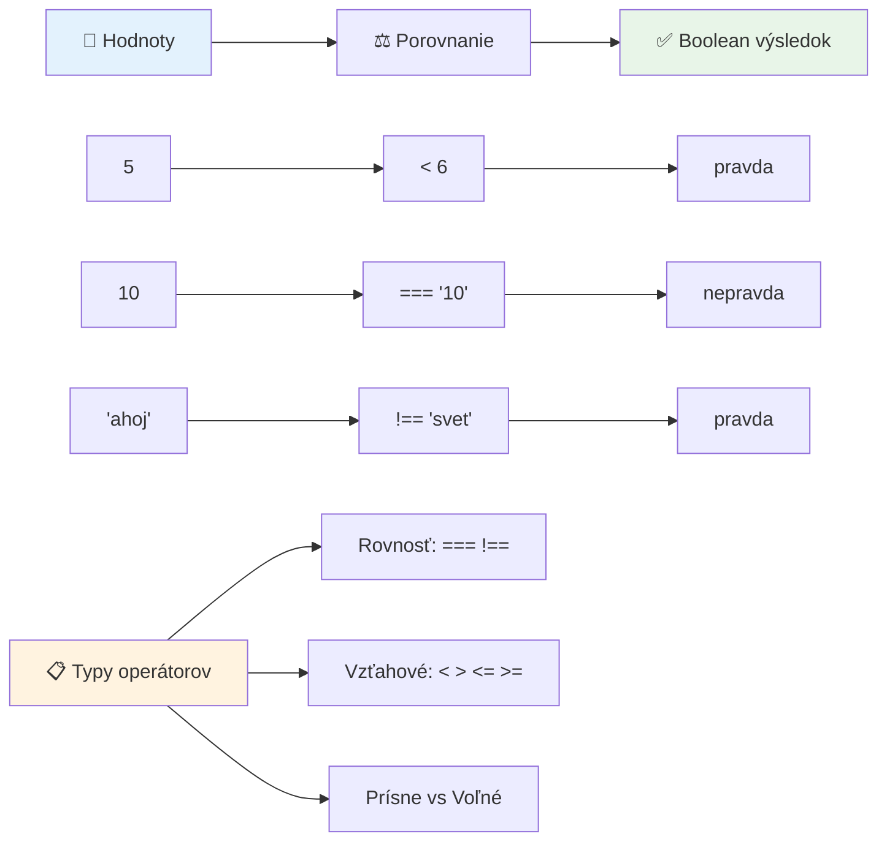
### 🧠 **Ovládnutie porovnávania: Pochopenie Booleovskej logiky**

**Otestujte si pochopenie porovnávania:**
- Prečo si myslíte, že `===` (prísna rovnosť) je spravidla preferované pred `==` (voľná rovnosť)?
- Dokážete predpovedať, čo vráti `5 === '5'`? A čo `5 == '5'`?
- Aký je rozdiel medzi `!==` a `!=`?

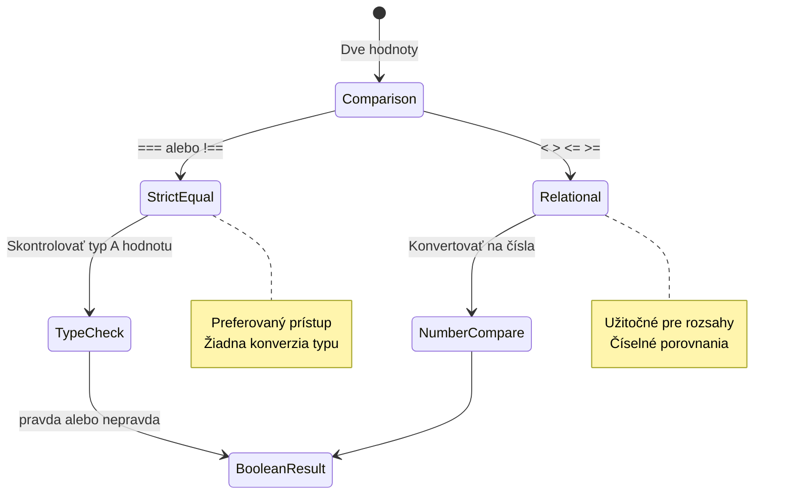
> **Profesionálny tip**: Vždy používajte `===` a `!==` pre kontroly rovnosti, pokiaľ nepotrebujete explicitnú konverziu typu. Tým predídete nečakanému správaniu!

## Príkaz if

Príkaz `if` je ako klásť otázku vo vašom kóde. "Ak je táto podmienka pravdivá, urob toto." Pravdepodobne je to najdôležitejší nástroj, ktorý použijete na rozhodovanie v JavaScripte.

Takto to funguje:

```javascript
if (condition) {
  // Podmienka je pravdivá. Kód v tomto bloku sa vykoná.
}
```

Podmienka sa umiestňuje do zátvoriek, a ak je `true`, JavaScript vykoná kód v zložených zátvorkách. Ak je to `false`, JavaScript celý blok preskočí.

Často budete používať porovnávacie operátory na vytvorenie týchto podmienok. Pozrime sa na praktický príklad:

```javascript
let currentMoney = 1000;
let laptopPrice = 800;

if (currentMoney >= laptopPrice) {
  // Podmienka je pravdivá. Kód v tomto bloku sa vykoná.
  console.log("Getting a new laptop!");
}
```

Keďže `1000 >= 800` sa vyhodnotí ako `true`, kód vo vnútri bloku sa vykoná, a v konzole sa zobrazí "Getting a new laptop!".

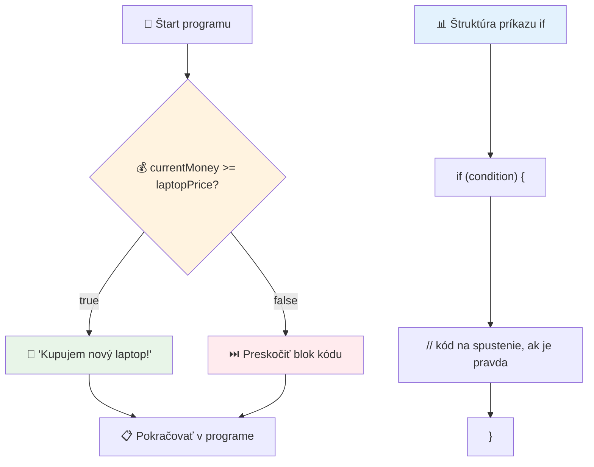
## Príkaz if..else

Čo ak chcete, aby váš program vykonal niečo iné, ak je podmienka nepravdivá? Práve tu prichádza `else` – je to ako mať záložný plán.

Príkaz `else` vám umožňuje povedať: "Ak táto podmienka nie je pravdivá, urob toto iné."

```javascript
let currentMoney = 500;
let laptopPrice = 800;

if (currentMoney >= laptopPrice) {
  // Podmienka je pravdivá. Kód v tomto bloku sa vykoná.
  console.log("Getting a new laptop!");
} else {
  // Podmienka je nepravdivá. Kód v tomto bloku sa vykoná.
  console.log("Can't afford a new laptop, yet!");
}
```

Keďže `500 >= 800` je `false`, JavaScript preskočí prvý blok a vykoná blok za `else`. V konzole uvidíte "Can't afford a new laptop, yet!".

✅ Otestujte si porozumenie tomuto a nasledujúcemu kódu spustením v konzole prehliadača. Zmeňte hodnoty premenných currentMoney a laptopPrice a sledujte výstup `console.log()`.

### 🎯 **Kontrola logiky If-Else: Vetvenie ciest**

**Zhodnoťte svoje pochopenie podmieneného logiky:**
- Čo sa stane, ak `currentMoney` presne rovná `laptopPrice`?
- Vedeli by ste myslieť na situáciu z reálneho života, kde by bola if-else logika užitočná?
- Ako by ste to rozšírili na viaceré cenové rozpätia?

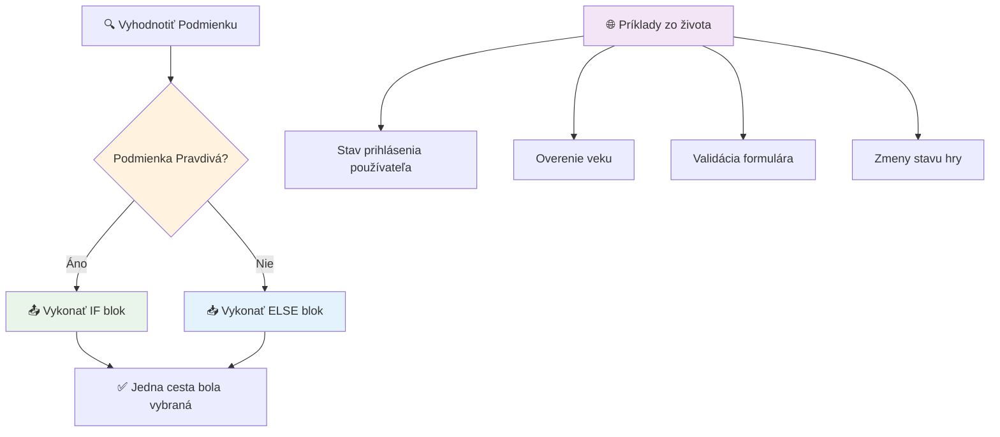
> **Kľúčové poznanie**: If-else zaručuje, že sa vykoná presne jedna cesta. Tým je zabezpečené, že váš program vždy odpovie na akúkoľvek podmienku!

## Príkaz switch

Niekedy musíte porovnať jednu hodnotu s viacerými možnosťami. Hoci by ste mohli reťaziť niekoľko príkazov `if..else`, tento prístup sa rýchlo stáva nepriehľadným. Príkaz `switch` poskytuje čistejšiu štruktúru na ovládanie viacerých diskrétnych hodnôt.

Koncept pripomína mechanické prepínacie systémy používané v skorých telefónnych ústredniach – jedna vstupná hodnota určuje, ktorou konkrétnou cestou vykonávanie pokračuje.

```javascript
switch (expression) {
  case x:
    // blok kódu
    break;
  case y:
    // blok kódu
    break;
  default:
    // blok kódu
}
```

Takto je to štruktúrované:
- JavaScript vyhodnotí výraz raz
- Prezrie si každý `case` a hľadá zhody
- Keď nájde zhodu, vykoná daný blok kódu
- Príkaz `break` hovorí JavaScriptu, aby zastavil a opustil switch
- Ak nie je žiadna zhoda, vykoná sa blok `default` (ak je prítomný)

```javascript
// Program používajúci príkaz switch pre deň v týždni
let dayNumber = 2;
let dayName;

switch (dayNumber) {
  case 1:
    dayName = "Monday";
    break;
  case 2:
    dayName = "Tuesday";
    break;
  case 3:
    dayName = "Wednesday";
    break;
  default:
    dayName = "Unknown day";
    break;
}
console.log(`Today is ${dayName}`);
```

V tomto príklade JavaScript vidí, že `dayNumber` je `2`, nájde zodpovedajúci `case 2`, nastaví `dayName` na "Tuesday" a potom ukončí switch. Výsledok? V konzole sa vypíše "Today is Tuesday".

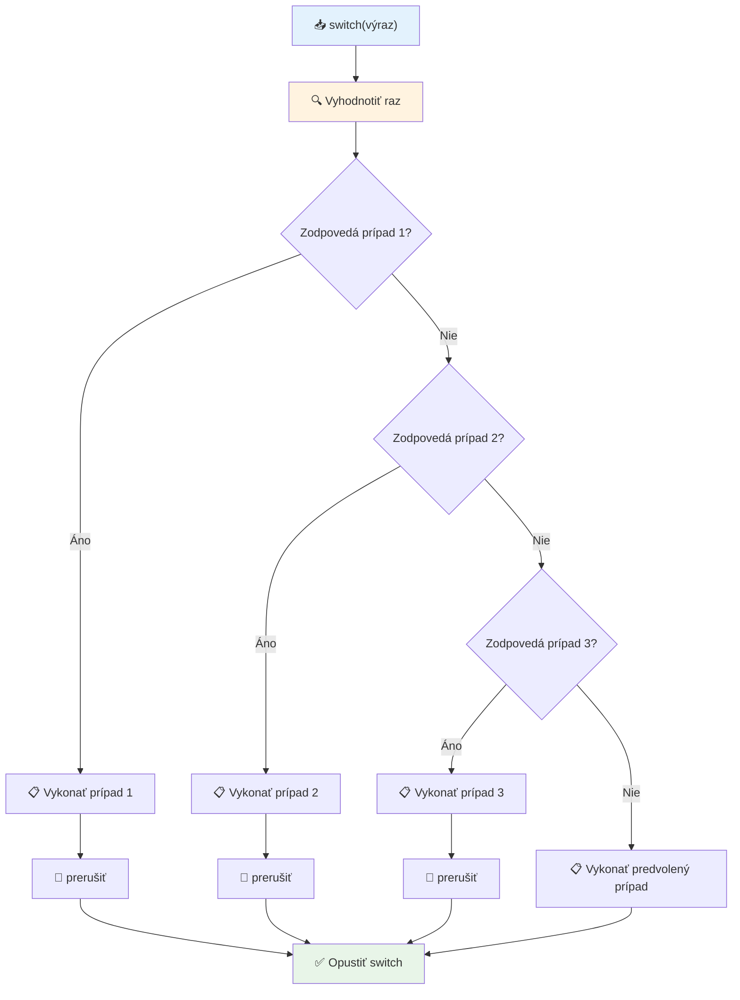
✅ Otestujte si porozumenie tomuto a nasledujúcemu kódu spustením v konzole prehliadača. Zmeňte hodnotu premennej a a sledujte výstup `console.log()`.

### 🔄 **Ovládnutie príkazu Switch: Viaceré možnosti**

**Otestujte si porozumenie switchu:**
- Čo sa stane, ak zabudnete príkaz `break`?
- Kedy by ste použili `switch` namiesto viacerých príkazov if-else?
- Prečo je blok `default` užitočný, aj keď si myslíte, že ste pokryli všetky možnosti?

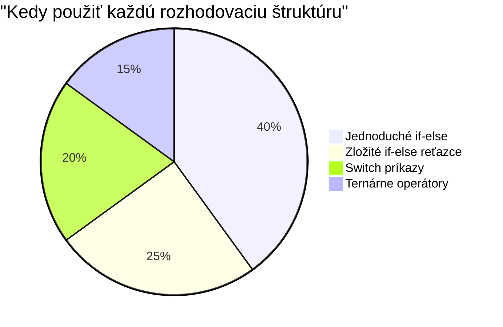
> **Najlepšia prax**: Používajte `switch`, keď porovnávate jednu premennú s viacerými konkrétnymi hodnotami. Používajte if-else pre kontrolu rozsahov alebo zložité podmienky!

## Logické operátory a Booleány

Zložité rozhodnutia často vyžadujú vyhodnocovanie viacerých podmienok súčasne. Rovnako ako Booleova algebra umožňuje matematikom kombinovať logické výrazy, programovanie poskytuje logické operátory na spojenie viacerých Booleovských podmienok.

Tieto operátory umožňujú sofistikovanú podmienenú logiku kombináciou jednoduchých pravdivostných hodnotení.

| Symbol | Popis                                                                                         | Príklad                                                                    |
| ------ | --------------------------------------------------------------------------------------------- | -------------------------------------------------------------------------- |
| `&&`   | **Logické AND**: Porovnáva dva Booleovské výrazy. Vracia true **len** ak sú obe strany pravdivé | `(5 > 3) && (5 < 10) // Obe strany sú pravdivé. Vracia true` |
| `\|\|` | **Logické OR**: Porovnáva dva Booleovské výrazy. Vracia true, ak je aspoň jedna strana pravdivá | `(5 > 10) \|\| (5 < 10) // Jedna strana je nepravdivá, druhá pravdivá. Vracia true` |
| `!`    | **Logické NOT**: Vracia opačnú hodnotu Booleovského výrazu                                  | `!(5 > 10) // 5 nie je väčšie ako 10, takže "!" z toho robí true`          |

Tieto operátory vám umožnia kombinovať podmienky užitočnými spôsobmi:
- AND (`&&`) znamená, že obe podmienky musia byť pravdivé
- OR (`||`) znamená, že aspoň jedna podmienka musí byť pravdivá  
- NOT (`!`) otočí true na false (a naopak)

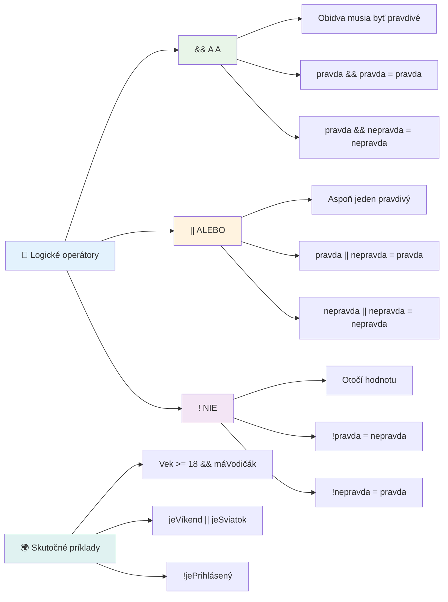
## Podmienky a rozhodnutia s logickými operátormi

Pozrime sa na tieto logické operátory v akcii na realistickejšom príklade:

```javascript
let currentMoney = 600;
let laptopPrice = 800;
let laptopDiscountPrice = laptopPrice - (laptopPrice * 0.2); // Cena notebooku so zľavou 20 percent

if (currentMoney >= laptopPrice || currentMoney >= laptopDiscountPrice) {
  // Podmienka je pravdivá. Kód v tomto bloku sa vykoná.
  console.log("Getting a new laptop!");
} else {
  // Podmienka je nepravdivá. Kód v tomto bloku sa vykoná.
  console.log("Can't afford a new laptop, yet!");
}
```

V tomto príklade: vypočítame 20% zľavu (640), potom hodnotíme, či naše dostupné financie pokrývajú buď plnú cenu ALEBO zľavnenú cenu. Keďže 600 zodpovedá zľavnenému prahu 640, podmienka sa vyhodnotí ako pravdivá.

### 🧮 **Kontrola logických operátorov: Kombinovanie podmienok**

**Otestujte si pochopenie logických operátorov:**
- Čo sa stane v výraze `A && B`, ak A je nepravdivé? Vyhodnotí sa vôbec B?
- Viete si predstaviť situáciu, kde by ste potrebovali všetky tri operátory (&&, ||, !) naraz?
- Aký je rozdiel medzi `!user.isActive` a `user.isActive !== true`?

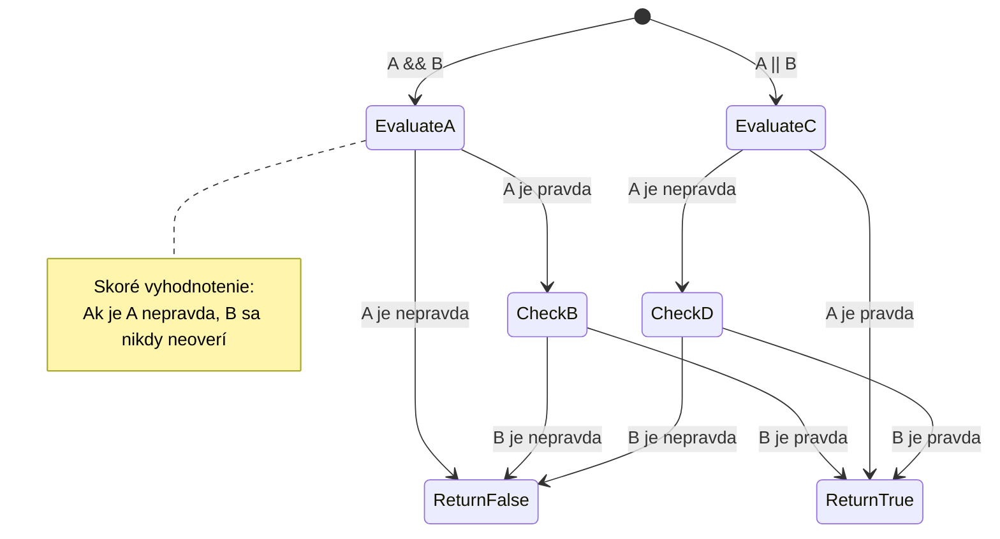
> **Tip na výkon**: JavaScript používa "skracované vyhodnocovanie" - v `A && B`, ak A je nepravdivé, B sa už nevyhodnocuje. Využite to vo svoj prospech!

### Operátor negácie

Niekedy je jednoduchšie myslieť na to, kedy niečo NIE JE pravda. Namiesto otázky "Je používateľ prihlásený?" sa môžete opýtať "NIE JE používateľ prihlásený?" Operátor výkričníka (`!`) otočí logiku za vás.

```javascript
if (!condition) {
  // spustí sa, ak je podmienka nepravdivá
} else {
  // spustí sa, ak je podmienka pravdivá
}
```

Operátor `!` je ako povedať "pravý opak..." – ak je niečo `true`, `!` zmení na `false`, a naopak.

### Ternárne výrazy

Pre jednoduché podmienené priradenia JavaScript poskytuje **ternárny operátor**. Táto stručná syntax umožňuje napísať podmienený výraz na jednom riadku, čo je užitočné, keď potrebujete priradiť jednu z dvoch hodnôt na základe podmienky.

```javascript
let variable = condition ? returnThisIfTrue : returnThisIfFalse;
```

Číta sa ako otázka: "Je táto podmienka pravdivá? Ak áno, použi túto hodnotu. Ak nie, použi tamtu hodnotu."

Nižšie je konkrétny príklad:

```javascript
let firstNumber = 20;
let secondNumber = 10;
let biggestNumber = firstNumber > secondNumber ? firstNumber : secondNumber;
```

✅ Venujte chvíľku čítaniu tohto kódu niekoľkokrát. Rozumiete, ako tieto operátory fungujú?

Tento riadok hovorí: "Je `firstNumber` väčšie ako `secondNumber`? Ak áno, daj `firstNumber` do `biggestNumber`. Ak nie, daj `secondNumber` do `biggestNumber`."

Ternárny operátor je len kratšia cesta na zapísanie tradičného príkazu `if..else`:

```javascript
let biggestNumber;
if (firstNumber > secondNumber) {
  biggestNumber = firstNumber;
} else {
  biggestNumber = secondNumber;
}
```

Oba prístupy produkujú identický výsledok. Ternárny operátor prináša stručnosť, zatiaľ čo tradičná štruktúra if-else môže byť pre zložité podmienky čitateľnejšia.

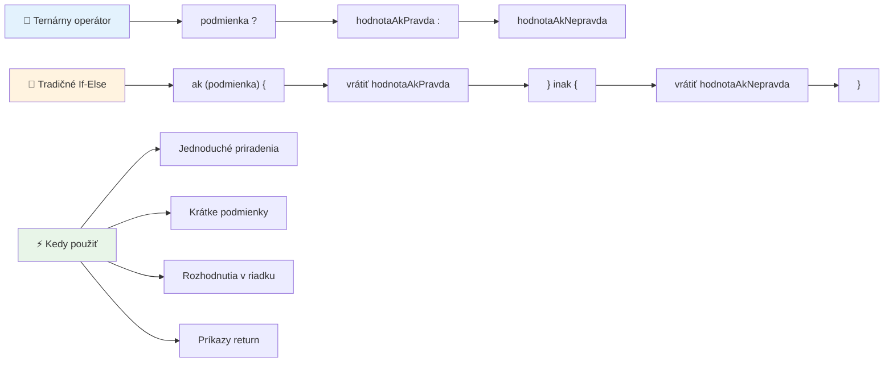
---


## 🚀 Výzva

Vytvorte program, ktorý najprv využíva logické operátory, a potom ho prepíšte pomocou ternárneho výrazu. Ktorú syntax preferujete?

---

## Výzva GitHub Copilot Agenta 🚀

Použite režim Agenta na splnenie nasledujúcej výzvy:

**Popis:** Vytvorte komplexný kalkulátor známok, ktorý demonštruje viaceré koncepty rozhodovania z tejto lekcie, vrátane príkazov if-else, switch, logických operátorov a ternárnych výrazov.

**Zadanie:** Napíšte JavaScript program, ktorý prijme číselný výsledok študenta (0-100) a určí jeho písmenkovú známku podľa nasledujúcich kritérií:
- A: 90-100
- B: 80-89  
- C: 70-79
- D: 60-69
- F: Pod 60

Požiadavky:
1. Použite príkaz if-else na určenie písmenkovej známky
2. Použite logické operátory na kontrolu, či študent prešiel (grade >= 60) A má vyznamenanie (grade >= 90)  
3. Použite príkaz switch na poskytnutie konkrétnej spätnej väzby pre každú písmenovú známku  
4. Použite ternárny operátor na zistenie, či je študent oprávnený na ďalší kurz (grade >= 70)  
5. Zahrňte kontrolu vstupu, aby ste zaistili, že skóre je medzi 0 a 100  

Otestujte svoj program s rôznymi skóre vrátane hraničných prípadov ako 59, 60, 89, 90 a neplatnými vstupmi.

Dozviete sa viac o [agent mode](https://code.visualstudio.com/blogs/2025/02/24/introducing-copilot-agent-mode) tu.


## Post-Lecture Quiz

[Post-lecture quiz](https://ff-quizzes.netlify.app/web/quiz/12)

## Review & Self Study

Prečítajte si viac o mnohých operátoroch dostupných používateľovi [na MDN](https://developer.mozilla.org/docs/Web/JavaScript/Reference/Operators).

Prejdite si úžasný [operator lookup](https://joshwcomeau.com/operator-lookup/) od Josha Comeaua!

## Assignment

[Operators](assignment.md)

---

## 🧠 **Zhrnutie vašej sady nástrojov na rozhodovanie**

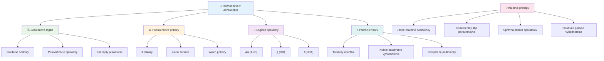
---

## 🚀 Časová os vášho majstrovstva rozhodovania v JavaScripte

### ⚡ **Čo môžete urobiť v nasledujúcich 5 minútach**
- [ ] Precvičte si porovnávacie operátory v konzole vášho prehliadača
- [ ] Napíšte jednoduchý if-else príkaz, ktorý kontroluje váš vek
- [ ] Skúste výzvu: prepíšte if-else pomocou ternárneho operátora
- [ ] Otestujte, čo sa stane s rôznymi „pravdivými“ a „nepravdivými“ hodnotami

### 🎯 **Čo môžete dosiahnuť v tejto hodine**
- [ ] Dokončite kvíz po lekcii a prejdite si nejasné koncepty
- [ ] Vytvorte komplexný kalkulátor známok z výzvy GitHub Copilot
- [ ] Vytvorte jednoduchý rozhodovací strom pre reálnu situáciu (napríklad výber oblečenia)
- [ ] Precvičujte kombináciu viacerých podmienok s logickými operátormi
- [ ] Experimentujte s príkazmi switch pre rôzne použitia

### 📅 **Vaše týždenné zdokonaľovanie logiky**
- [ ] Dokončite zadanie operátorov s kreatívnymi príkladmi
- [ ] Vytvorte mini kvízovú aplikáciu pomocou rôznych podmienkových štruktúr
- [ ] Vytvorte validátor formulárov, ktorý kontroluje viacero vstupných podmienok
- [ ] Precvičujte si cvičenia Josha Comeaua [operator lookup](https://joshwcomeau.com/operator-lookup/)
- [ ] Refaktorujte existujúci kód na použitie vhodnejších podmienkových štruktúr
- [ ] Študujte vyhodnocovanie krátkeho spoja a dôsledky na výkon

### 🌟 **Váš mesačný transformačný plán**
- [ ] Ovládnite zložité vnorené podmienky a zachovajte čitateľnosť kódu
- [ ] Vytvorte aplikáciu so sofistikovanou logikou rozhodovania
- [ ] Prispievajte do open source vylepšením podmienkovej logiky v existujúcich projektoch
- [ ] Učte niekoho iného o rôznych podmienkových štruktúrach a kedy ich použiť
- [ ] Preskúmajte funkcionálne programovanie prístupov k podmienkovej logike
- [ ] Vytvorte si osobného sprievodcu najlepšími praktikami podmienok

### 🏆 **Záverečná kontrola majstra rozhodovania**

**Oslávte svoje majstrovstvo logického myslenia:**  
- Akú najzložitejšiu rozhodovaciu logiku ste úspešne implementovali?  
- Ktorá podmienková štruktúra vám pripadá najprirodzenejšia a prečo?  
- Ako sa zmenil váš prístup k riešeniu problémov po naučení sa o logických operátoroch?  
- Ktorá reálna aplikácia by mohla prospieť sofistikovanej logike rozhodovania?

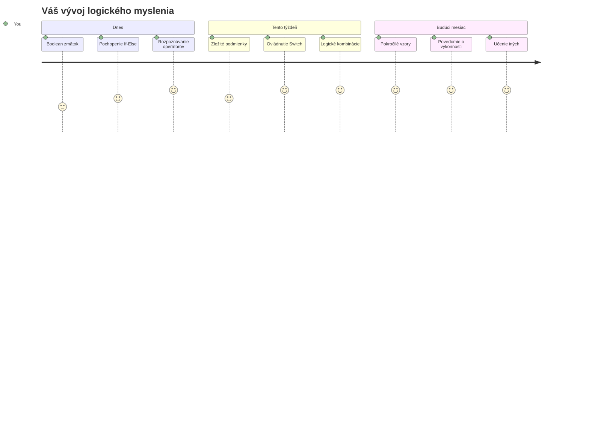
> 🧠 **Ovládli ste umenie digitálneho rozhodovania!** Každá interaktívna aplikácia sa spolieha na podmienkovú logiku, aby inteligentne reagovala na akcie používateľov a meniacich sa podmienok. Teraz rozumiete, ako prinútiť svoje programy myslieť, vyhodnocovať a vybrať vhodné reakcie. Táto logická základňa bude poháňať každú dynamickú aplikáciu, ktorú vytvoríte! 🎉

---

<!-- CO-OP TRANSLATOR DISCLAIMER START -->
**Zrieknutie sa zodpovednosti**:  
Tento dokument bol preložený pomocou AI prekladateľskej služby [Co-op Translator](https://github.com/Azure/co-op-translator). Aj keď sa snažíme o presnosť, vezmite prosím na vedomie, že automatické preklady môžu obsahovať chyby alebo nepresnosti. Pôvodný dokument v jeho rodnom jazyku by mal byť považovaný za autoritatívny zdroj. Pre kritické informácie sa odporúča profesionálny ľudský preklad. Nie sme zodpovední za akékoľvek nedorozumenia alebo nesprávne výklady vyplývajúce z použitia tohto prekladu.
<!-- CO-OP TRANSLATOR DISCLAIMER END -->