<!--
CO_OP_TRANSLATOR_METADATA:
{
  "original_hash": "1710a50a519a6e4a1b40a5638783018d",
  "translation_date": "2026-01-07T04:34:14+00:00",
  "source_file": "2-js-basics/4-arrays-loops/README.md",
  "language_code": "sk"
}
-->
# JavaScript základy: Polia a slučky

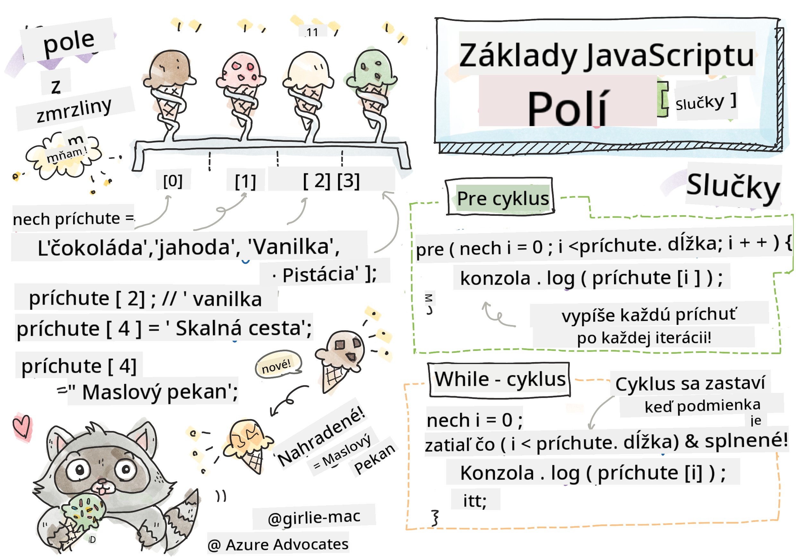
> Sketchnote od [Tomomi Imura](https://twitter.com/girlie_mac)

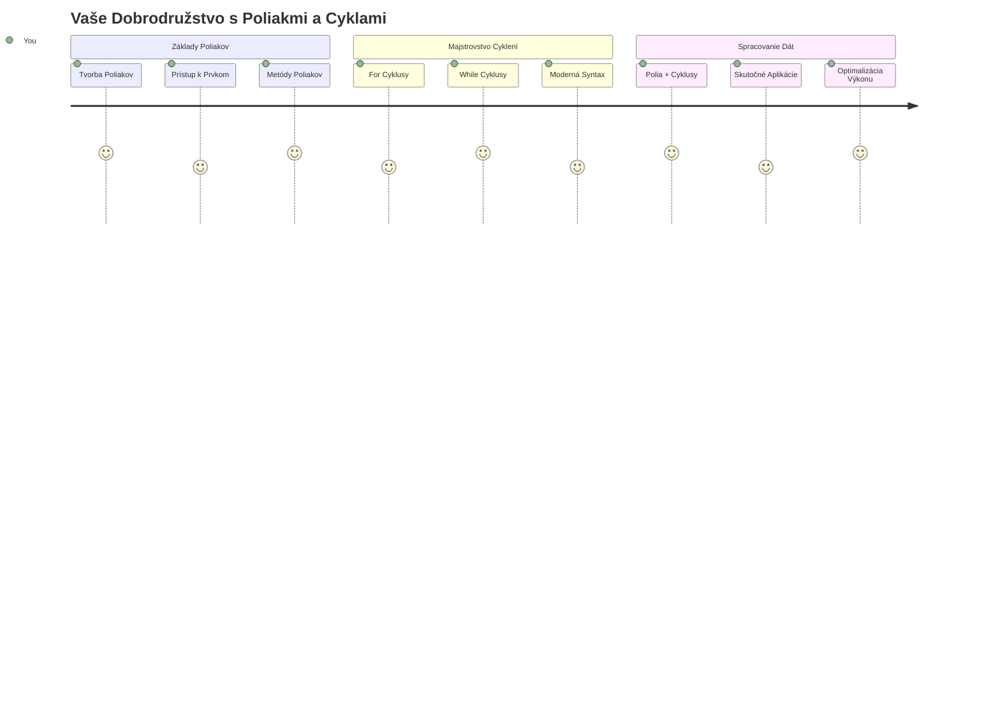
## Prednáškový kvíz
[Prednáškový kvíz](https://ff-quizzes.netlify.app/web/quiz/13)

Niekedy ste sa zamýšľali, ako si webové stránky udržiavajú prehľad o položkách v nákupnom košíku alebo zobrazujú zoznam vašich priateľov? Práve tu prichádzajú na rad polia a slučky. Polia sú ako digitálne kontajnery, ktoré uchovávajú viacero informácií naraz, zatiaľ čo slučky vám umožňujú efektívne pracovať so všetkými týmito údajmi bez zbytočného opakovania kódu.

Tieto dva koncepty spolu tvoria základ pre spracovanie informácií vo vašich programoch. Naučíte sa prejsť od manuálneho opisovania každej jednej operácie k tvorbe inteligentného, efektívneho kódu, ktorý zvládne spracovať stovky či dokonca tisíce položiek rýchlo.

Na konci tejto lekcie budete rozumieť, ako zvládnuť zložité úlohy s dátami pomocou len pár riadkov kódu. Pozrime sa na tieto základné programátorské koncepty.

[](https://youtube.com/watch?v=1U4qTyq02Xw "Polia")

[](https://www.youtube.com/watch?v=Eeh7pxtTZ3k "Slučky")

> 🎥 Kliknite na obrázky vyššie pre videá o poliach a slučkách.

> Túto lekciu si môžete prejsť aj na [Microsoft Learn](https://docs.microsoft.com/learn/modules/web-development-101-arrays/?WT.mc_id=academic-77807-sagibbon)!

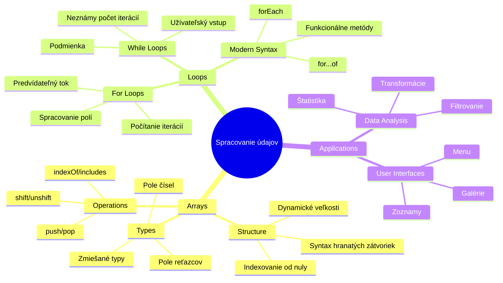
## Polia

Predstavte si polia ako digitálnu kartotéku – namiesto ukladania jedného dokumentu v zásuvke môžete usporiadať viacero súvisiacich položiek v jednom štruktúrovanom kontajneri. V programovaní vám polia umožňujú uložiť viacero kúskov informácií v jednom organizovanom balíku.

Či už tvoríte foto galériu, spravujete zoznam úloh alebo sledujete najvyššie skóre v hre, polia poskytujú základ pre organizáciu dát. Pozrime sa, ako fungujú.

✅ Polia sú všade okolo nás! Môžete si spomenúť na príklad pola z reálneho života, napríklad pole slnečných panelov?

### Vytváranie polí

Vytvorenie pola je úplne jednoduché – stačí použiť hranaté zátvorky!

```javascript
// Prázdne pole - ako prázdny nákupný košík čakajúci na položky
const myArray = [];
```

**Čo sa tu deje?**
Práve ste vytvorili prázdny kontajner použitím hranatých zátvoriek `[]`. Predstavte si ho ako prázdnu knižnú poličku – je pripravená uchovať akékoľvek knihy, ktoré chcete usporiadať.

Pole môžete tiež hneď na začiatku naplniť počiatočnými hodnotami:

```javascript
// Ponuka príchutí vášho zmrzlinového obchodu
const iceCreamFlavors = ["Chocolate", "Strawberry", "Vanilla", "Pistachio", "Rocky Road"];

// Profilové informácie používateľa (miešanie rôznych typov údajov)
const userData = ["John", 25, true, "developer"];

// Testové skóre pre váš obľúbený predmet
const scores = [95, 87, 92, 78, 85];
```

**Zaujímavé veci na pozorovanie:**
- Môžete uložiť text, čísla alebo dokonca pravdivostné hodnoty (true/false) do toho istého poľa
- Jednoducho oddelujte každú položku čiarkou – jednoduché!
- Polia sú ideálne na uchovávanie súvisiacich informácií pohromade

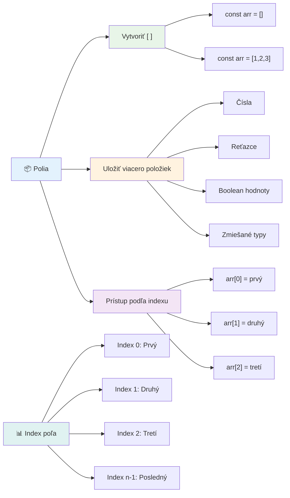
### Indexovanie pola

Tu je niečo, čo sa na prvý pohľad môže zdať nezvyčajné: polia číslujú svoje položky od 0, nie od 1. Toto indexovanie so základom v nule vychádza z toho, ako funguje počítačová pamäť – je to programátorský konvencia od čias raných programovacích jazykov ako C. Každé miesto v poli dostane svoj vlastný adresný číslo nazývané **index**.

| Index | Hodnota | Popis |
|-------|---------|-------|
| 0 | "Čokoláda" | Prvý prvok |
| 1 | "Jahoda" | Druhý prvok |
| 2 | "Vanilka" | Tretí prvok |
| 3 | "Pistácia" | Štvrtý prvok |
| 4 | "Rocky Road" | Piata položka |

✅ Prekvapuje vás, že polia začínajú na nultom indexe? V niektorých programovacích jazykoch sa indexy začínajú na 1. O tejto histórii sa môžete dozvedieť viac [na Wikipédii](https://en.wikipedia.org/wiki/Zero-based_numbering).

**Prístup k prvkom pola:**

```javascript
const iceCreamFlavors = ["Chocolate", "Strawberry", "Vanilla", "Pistachio", "Rocky Road"];

// Prístup k jednotlivým prvkom pomocou zápisu v zátvorkách
console.log(iceCreamFlavors[0]); // "Čokoláda" - prvý prvok
console.log(iceCreamFlavors[2]); // "Vanilka" - tretí prvok
console.log(iceCreamFlavors[4]); // "Rocky Road" - posledný prvok
```

**Rozklad toho, čo sa tu deje:**
- **Používa** zápis s hranatými zátvorkami spolu s číslom indexu na prístup k prvkom
- **Vracia** hodnotu uloženú na danom konkrétnom mieste v poli
- **Začína** počítať od 0, takže prvý prvok je na indexe 0

**Úprava prvkov pola:**

```javascript
// Zmeňte existujúcu hodnotu
iceCreamFlavors[4] = "Butter Pecan";
console.log(iceCreamFlavors[4]); // "Maslová liesková orech"

// Pridajte nový prvok na koniec
iceCreamFlavors[5] = "Cookie Dough";
console.log(iceCreamFlavors[5]); // "Cesto na sušienky"
```

**V uvedenom sme:**
- **Upravili** prvok na indexe 4 z "Rocky Road" na "Butter Pecan"
- **Pridali** nový prvok "Cookie Dough" na index 5
- **Automaticky** predĺžili dĺžku pola pri pridávaní mimo aktuálnych hraníc

### Dĺžka pola a bežné metódy

Polia majú zabudované vlastnosti a metódy, ktoré výrazne uľahčujú prácu s dátami.

**Zistenie dĺžky pola:**

```javascript
const iceCreamFlavors = ["Chocolate", "Strawberry", "Vanilla", "Pistachio", "Rocky Road"];
console.log(iceCreamFlavors.length); // 5

// Dĺžka sa automaticky aktualizuje so zmenami poľa
iceCreamFlavors.push("Mint Chip");
console.log(iceCreamFlavors.length); // 6
```

**Kľúčové body na zapamätanie:**
- **Vracia** celkový počet prvkov v poli
- **Aktualizuje** sa automaticky, keď sa prvky pridávajú alebo odstraňujú
- **Poskytuje** dynamický počet, ktorý je užitočný pre slučky a validáciu

**Základné metódy pola:**

```javascript
const fruits = ["apple", "banana", "orange"];

// Pridaj prvky
fruits.push("grape");           // Pridá na koniec: ["jablko", "banán", "pomaranč", "hrozno"]
fruits.unshift("strawberry");   // Pridá na začiatok: ["jahoda", "jablko", "banán", "pomaranč", "hrozno"]

// Odstráň prvky
const lastFruit = fruits.pop();        // Odstráni a vráti "hrozno"
const firstFruit = fruits.shift();     // Odstráni a vráti "jahoda"

// Nájde prvky
const index = fruits.indexOf("banana"); // Vráti 1 (pozícia "banán")
const hasApple = fruits.includes("apple"); // Vráti pravda
```

**Pochopenie týchto metód:**
- **Pridáva** prvky pomocou `push()` (na koniec) a `unshift()` (na začiatok)
- **Odstraňuje** prvky pomocou `pop()` (z konca) a `shift()` (zo začiatku)
- **Vyhľadáva** prvky pomocou `indexOf()` a kontroluje ich existenciu cez `includes()`
- **Vracia** užitočné hodnoty ako odstránené prvky alebo indexy pozície

✅ Vyskúšajte to sami! Použite konzolu vo vašom prehliadači na vytvorenie a manipuláciu s poľom podľa vlastnej tvorby.

### 🧠 **Kontrola základov pola: Usporiadanie vašich dát**

**Overte si vaše porozumenie poliam:**
- Prečo si myslíte, že polia začínajú počítať od 0 namiesto 1?
- Čo sa stane, keď sa pokúsite pristúpiť k indexu, ktorý neexistuje (napríklad `arr[100]` v 5-prvkovej poli)?
- Môžete vymyslieť tri reálne situácie, kde by polia boli užitočné?

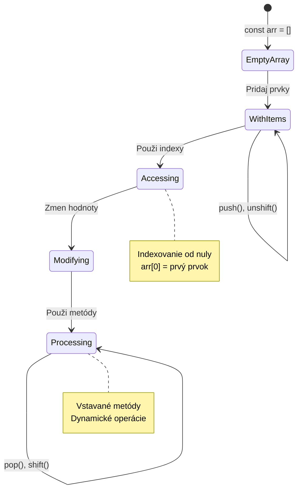
> **Reálny pohľad**: Polia sú v programovaní všade! Feedy v sociálnych sieťach, nákupné košíky, foto galérie, zoznamy skladieb – za všetkým stojí pole!

## Slučky

Predstavte si slávne tresty zo starých románov Charlesa Dickensa, kde študenti museli opakovane písať na tabuľu ten istý riadok. Predstavte si, že by ste niekomu mohli jednoducho povedať „napíš túto vetu 100-krát“ a bolo by to automatické. Práve to robia slučky vo vašom kóde.

Slučky sú ako neúnavný asistent, ktorý dokáže opakovať úlohy bez chýb. Či už potrebujete skontrolovať každý predmet v nákupnom košíku alebo zobraziť všetky fotografie v albume, slučky efektívne zvládnu opakovanie.

JavaScript poskytuje niekoľko typov slučiek, z ktorých si môžete vybrať. Pozrime sa na každý a pochopme, kedy ich používať.

```mermaid
flowchart TD
    A["🔄 Typy cyklov"] --> B["For cyklus"]
    A --> C["While cyklus"]
    A --> D["For...of cyklus"]
    A --> E["Metóda forEach"]
    
    B --> B1["Známé iterácie"]
    B --> B2["Na základe počítadla"]
    B --> B3["for(init; podmienka; inkrement)"]
    
    C --> C1["Neznáme iterácie"]
    C --> C2["Na základe podmienky"]
    C --> C3["while(podmienka)"]
    
    D --> D1["Moderné ES6+"]
    D --> D2["Iterácia po poli"]
    D --> D3["for(položka z poľa)"]
    
    E --> E1["Funkčný štýl"]
    E --> E2["Metóda poľa"]
    E --> E3["pole.forEach(spätnéVolanie)"]
    
    F["⏰ Kedy použiť"] --> F1["For: počítanie, indexy"]
    F --> F2["While: vstup používateľa, vyhľadávanie"]
    F --> F3["For...of: jednoduchá iterácia"]
    F --> F4["forEach: funkcionálne programovanie"]
    
    style A fill:#e3f2fd
    style B fill:#e8f5e8
    style C fill:#fff3e0
    style D fill:#f3e5f5
    style E fill:#e0f2f1
    style F fill:#fce4ec
```
### For slučka

`for` slučka je ako nastavenie časovača – presne viete, koľkokrát chcete niečo spraviť. Je veľmi organizovaná a predvídateľná, takže je ideálna, keď pracujete s poliami alebo potrebujete počítať veci.

**Štruktúra for slučky:**

| Komponent | Účel | Príklad |
|-----------|-------|----------|
| **Inicializácia** | Nastaví počiatočný bod | `let i = 0` |
| **Podmienka** | Kedy pokračovať | `i < 10` |
| **Inkrementácia** | Ako aktualizovať | `i++` |

```javascript
// Počítanie od 0 do 9
for (let i = 0; i < 10; i++) {
  console.log(`Count: ${i}`);
}

// Praktickejší príklad: spracovanie skóre
const testScores = [85, 92, 78, 96, 88];
for (let i = 0; i < testScores.length; i++) {
  console.log(`Student ${i + 1}: ${testScores[i]}%`);
}
```

**Krok za krokom, toto sa deje:**
- **Inicializuje** počítadlo `i` na hodnotu 0 na začiatku
- **Kontroluje** podmienku `i < 10` pred každou iteráciou
- **Vykonáva** blok kódu, keď je podmienka pravdivá
- **Zvyšuje** `i` o 1 po každej iterácii pomocou `i++`
- **Zastaví** sa, keď podmienka už nie je pravdivá (keď `i` dosiahne 10)

✅ Spustite tento kód v konzole prehliadača. Čo sa stane, keď upravíte počítadlo, podmienku alebo príkaz inkrementácie? Viete spustiť slučku spätne, vytvoriť odpočet?

### 🗓️ **Kontrola majstrovstva for slučky: Riadené opakovanie**

**Vyhodnoťte vaše porozumenie for slučkám:**
- Aké sú tri časti for slučky a na čo každá slúži?
- Ako by ste prešli pole odzadu?
- Čo sa stane, ak zabudnete inkrementáciu (`i++`)?

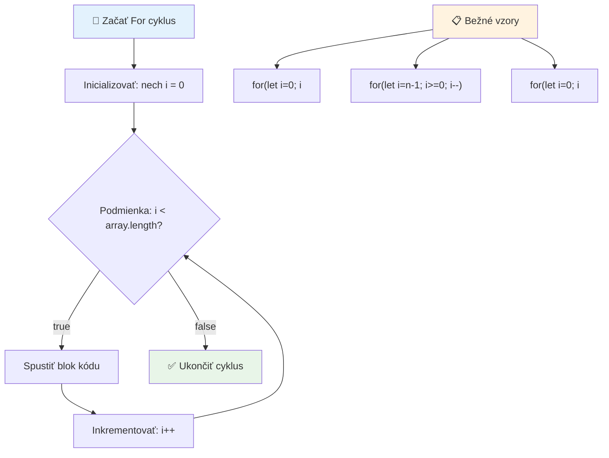
> **Múdrosť slučiek**: For slučky sú perfektné, keď presne viete, koľkokrát potrebujete niečo opakovať. Sú najbežnejšou voľbou na spracovanie polí!

### While slučka

`while` slučka je ako povedať „pokračuj, kým...“ – nemusíte vedieť, koľkokrát sa spustí, ale viete, kedy má skončiť. Je ideálna na veci ako získavanie vstupu od používateľa, kým nedostanete požadované údaje, alebo vyhľadávanie v dátach, kým nenájdete, čo hľadáte.

**Charakteristiky while slučky:**
- **Pokračuje** v spúšťaní, kým je podmienka pravdivá
- **Vyžaduje** manuálnu správu premennej počítadla
- **Kontroluje** podmienku pred každou iteráciou
- **Hrozí** nekonečnou slučkou, ak podmienka nikdy nie je nepravdivá

```javascript
// Základný príklad počítania
let i = 0;
while (i < 10) {
  console.log(`While count: ${i}`);
  i++; // Nezabudnite inkrementovať!
}

// Praktickejší príklad: spracovanie vstupu používateľa
let userInput = "";
let attempts = 0;
const maxAttempts = 3;

while (userInput !== "quit" && attempts < maxAttempts) {
  userInput = prompt(`Enter 'quit' to exit (attempt ${attempts + 1}):`);
  attempts++;
}

if (attempts >= maxAttempts) {
  console.log("Maximum attempts reached!");
}
```

**Pochopenie týchto príkladov:**
- **Manuálne spravuje** premennú počítadla `i` v tele slučky
- **Zvyšuje** počítadlo, aby zabránil nekonečnému cyklu
- **Ukazuje** praktický príklad so vstupom používateľa a limitom pokusov
- **Zahŕňa** bezpečnostné mechanizmy na zabránenie nekonečnému vykonávaniu

### ♾️ **Kontrola múdrosti while slučky: Opakovanie na základe podmienky**

**Otestujte si svoje porozumenie while slučkám:**
- Aké je hlavné nebezpečenstvo pri použití while slučiek?
- Kedy by ste zvolili while slučku namiesto for slučky?
- Ako môžete zabrániť nekonečným slučkám?

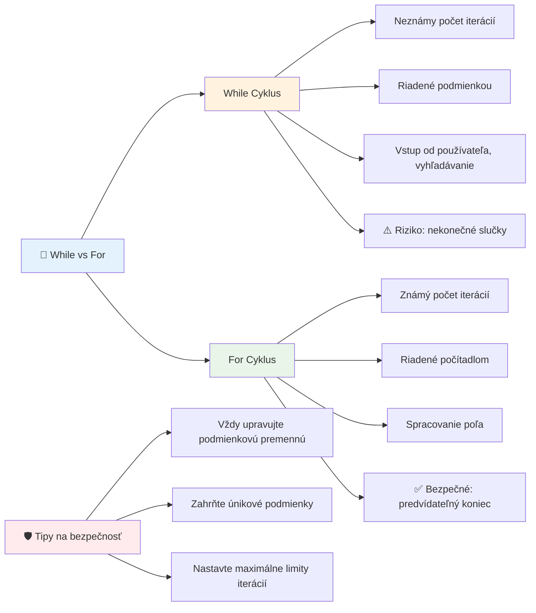
> **Bezpečnosť na prvom mieste**: While slučky sú silné, ale vyžadujú starostlivú kontrolu podmienok. Vždy sa uistite, že vaša slučka sa nakoniec zastaví!

### Moderné alternatívy slučiek

JavaScript ponúka moderný syntax slučiek, ktorý môže váš kód spraviť čitateľnejším a menej náchylným na chyby.

**For...of slučka (ES6+):**

```javascript
const colors = ["red", "green", "blue", "yellow"];

// Moderný prístup - čistejší a bezpečnejší
for (const color of colors) {
  console.log(`Color: ${color}`);
}

// Porovnajte s tradičnou for slučkou
for (let i = 0; i < colors.length; i++) {
  console.log(`Color: ${colors[i]}`);
}
```

**Hlavné výhody for...of:**
- **Odstráni** potrebu správy indexu a riziko chýb o jedno miesto
- **Poskytuje** priamy prístup k prvkom pola
- **Zlepší** čitateľnosť kódu a zníži zložitosť syntaxe

**Metóda forEach:**

```javascript
const prices = [9.99, 15.50, 22.75, 8.25];

// Použitie pre forEach vo funkcionálnom programovacom štýle
prices.forEach((price, index) => {
  console.log(`Item ${index + 1}: $${price.toFixed(2)}`);
});

// forEach s šípkovými funkciami pre jednoduché operácie
prices.forEach(price => console.log(`Price: $${price}`));
```

**Čo potrebujete vedieť o forEach:**
- **Vykoná** funkciu pre každý prvok pola
- **Poskytuje** hodnotu prvku aj jeho index ako parametre
- **Nedá sa** predčasne zastaviť (na rozdiel od tradičných slučiek)
- **Vracia** undefined (nevytvára nové pole)

✅ Prečo by ste si vybrali for slučku oproti while slučke? 17 000 divákov malo tú istú otázku na StackOverflow a niektoré názory [môžu byť zaujímavé](https://stackoverflow.com/questions/39969145/while-loops-vs-for-loops-in-javascript).

### 🎨 **Kontrola syntaxe moderných slučiek: Prijatie ES6+**

**Zhodnoťte svoje moderné JavaScript znalosti:**
- Aké sú výhody `for...of` oproti tradičným for slučkám?
- Kedy by ste stále uprednostnili tradičné for slučky?
- Aký je rozdiel medzi `forEach` a `map`?

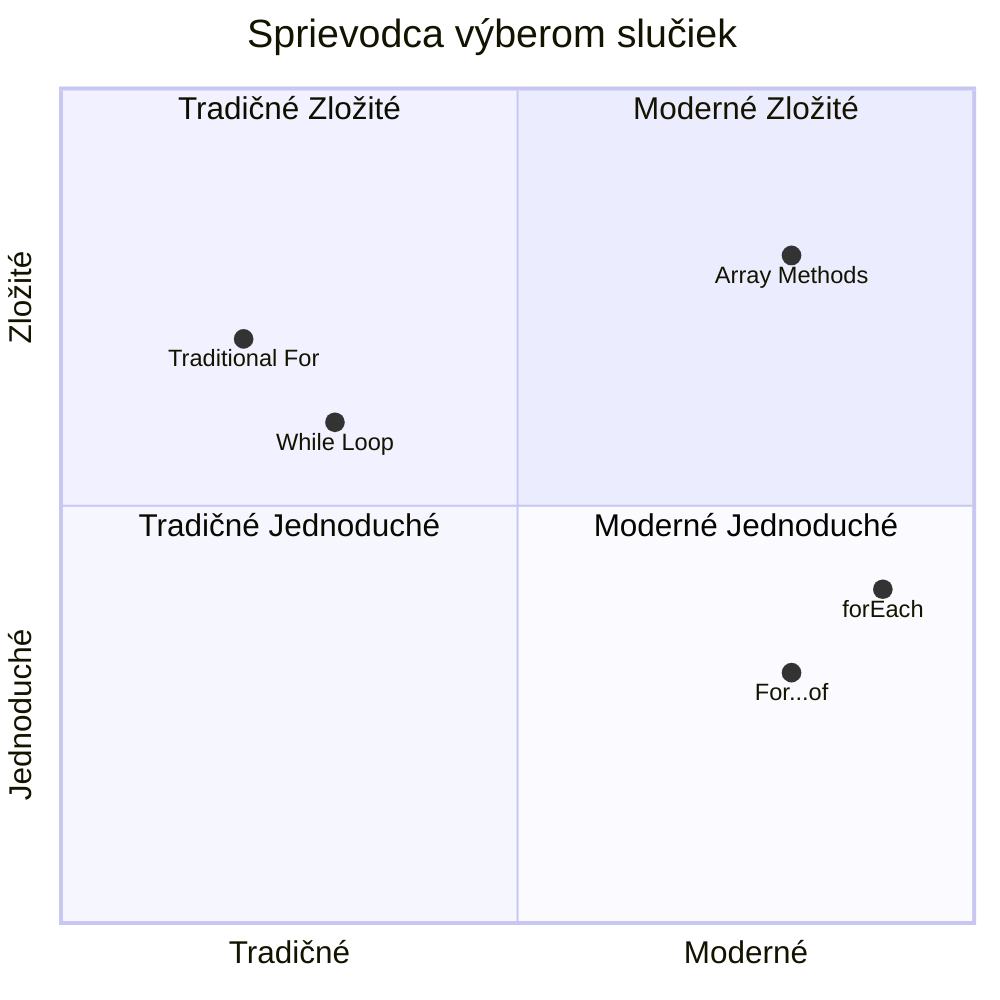
> **Moderný trend**: Syntax ES6+ ako `for...of` a `forEach` sa stáva preferovaným spôsobom pre iteráciu polí, pretože je čistejší a menej náchylný na chyby!

## Slučky a polia

Kombinácia polí a slučiek prináša silné schopnosti spracovania dát. Toto spojenie je základom mnohých programátorských úloh, od zobrazovania zoznamov až po výpočty štatistík.

**Tradičné spracovanie polí:**

```javascript
const iceCreamFlavors = ["Chocolate", "Strawberry", "Vanilla", "Pistachio", "Rocky Road"];

// Klasický prístup pomocou for cyklu
for (let i = 0; i < iceCreamFlavors.length; i++) {
  console.log(`Flavor ${i + 1}: ${iceCreamFlavors[i]}`);
}

// Moderný prístup pomocou for...of cyklu
for (const flavor of iceCreamFlavors) {
  console.log(`Available flavor: ${flavor}`);
}
```

**Pochopenie jednotlivých prístupov:**
- **Používa** vlastnosť dĺžky pola na určenie hranice slučky
- **Pristupuje** k prvkom podľa indexu v tradičných for slučkách
- **Poskytuje** priamy prístup k prvkom v for...of slučkách
- **Spracováva** každý prvok pola práve raz

**Praktický príklad spracovania dát:**

```javascript
const studentGrades = [85, 92, 78, 96, 88, 73, 89];
let total = 0;
let highestGrade = studentGrades[0];
let lowestGrade = studentGrades[0];

// Spracujte všetky známky jedným cyklom
for (let i = 0; i < studentGrades.length; i++) {
  const grade = studentGrades[i];
  total += grade;
  
  if (grade > highestGrade) {
    highestGrade = grade;
  }
  
  if (grade < lowestGrade) {
    lowestGrade = grade;
  }
}

const average = total / studentGrades.length;
console.log(`Average: ${average.toFixed(1)}`);
console.log(`Highest: ${highestGrade}`);
console.log(`Lowest: ${lowestGrade}`);
```

**Takto kód funguje:**
- **Inicializuje** premenné na sledovanie súčtu a extrémov
- **Spracováva** každú známku v jednej efektívnej slučke
- **Sčítava** celkový súčet na výpočet priemeru
- **Sleduje** najvyššie a najnižšie hodnoty počas iterácie
- **Vypočíta** konečné štatistiky po dokončení slučky

✅ Experimentujte s prechádzaním svojho vlastného pola v konzole prehliadača.

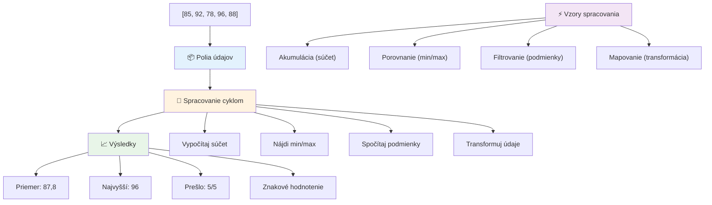
---

## Výzva GitHub Copilot Agent 🚀

Použite režim Agenta na vyriešenie nasledujúcej úlohy:

**Popis:** Vytvorte komplexnú funkciu na spracovanie dát, ktorá kombinuje polia a slučky na analýzu datasetu a generovanie zmysluplných informácií.

**Úloha:** Vytvorte funkciu s názvom `analyzeGrades`, ktorá prijme pole objektov študentských známok (každý obsahuje vlastnosti meno a skóre) a vráti objekt so štatistikami vrátane najvyššieho skóre, najnižšieho skóre, priemerného skóre, počtu študentov, ktorí prešli (skóre >= 70), a poľa mien študentov, ktorí dosiahli nadpriemer. Použite minimálne dva rôzne typy slučiek vo vašom riešení.

Viac sa dozviete o [režime agenta](https://code.visualstudio.com/blogs/2025/02/24/introducing-copilot-agent-mode) tu.

## 🚀 Výzva
JavaScript ponúka niekoľko moderných metód pre polia, ktoré môžu nahradiť tradičné slučky pri špecifických úlohách. Preskúmajte [forEach](https://developer.mozilla.org/docs/Web/JavaScript/Reference/Global_Objects/Array/forEach), [for-of](https://developer.mozilla.org/docs/Web/JavaScript/Reference/Statements/for...of), [map](https://developer.mozilla.org/docs/Web/JavaScript/Reference/Global_Objects/Array/map), [filter](https://developer.mozilla.org/docs/Web/JavaScript/Reference/Global_Objects/Array/filter) a [reduce](https://developer.mozilla.org/docs/Web/JavaScript/Reference/Global_Objects/Array/reduce).

**Vaša výzva:** Prepracujte príklad hodnotenia študentov použitím aspoň troch rôznych metód polí. Všimnite si, ako oveľa čistejší a zrozumiteľnejší kód sa vytvorí pomocou modernej syntaxe JavaScriptu.

## Kvíz po prednáške
[Kvíz po prednáške](https://ff-quizzes.netlify.app/web/quiz/14)

## Opakovanie a samostatné štúdium

Polia v JavaScripte majú mnoho metód, ktoré sú veľmi užitočné na manipuláciu s dátami. [Prečítajte si o týchto metódach](https://developer.mozilla.org/docs/Web/JavaScript/Reference/Global_Objects/Array) a vyskúšajte niektoré z nich (ako push, pop, slice a splice) na poli, ktoré si sami vytvoríte.

## Zadanie

[Prechádzanie po poli](assignment.md)

---

## 📊 **Zhrnutie vašich nástrojov pre polia a slučky**

```mermaid
graph TD
    A["🎯 Majstrovstvo polí & cyklov"] --> B["📦 Základy polí"]
    A --> C["🔄 Typy cyklov"]
    A --> D["🔗 Spracovanie údajov"]
    A --> E["🎨 Moderné techniky"]
    
    B --> B1["Vytvorenie: [ ]"]
    B --> B2["Indexovanie: arr[0]"]
    B --> B3["Metódy: push, pop"]
    B --> B4["Vlastnosti: length"]
    
    C --> C1["For: Znám počet opakovaní"]
    C --> C2["While: Podmienkové"]
    C --> C3["For...of: Priamy prístup"]
    C --> C4["forEach: Funkcionálne"]
    
    D --> D1["Výpočet štatistík"]
    D --> D2["Transformácia údajov"]
    D --> D3["Filtrovanie & vyhľadávanie"]
    D --> D4["Spracovanie v reálnom čase"]
    
    E --> E1["Šípové funkcie"]
    E --> E2["Reťazenie metód"]
    E --> E3["Destrukturalizácia"]
    E --> E4["Šablónové literály"]
    
    F["💡 Kľúčové výhody"] --> F1["Efektívna práca s údajmi"]
    F --> F2["Znížená opakovanie kódu"]
    F --> F3["Škálovateľné riešenia"]
    F --> F4["Čistejšia syntax"]
    
    style A fill:#e3f2fd
    style B fill:#e8f5e8
    style C fill:#fff3e0
    style D fill:#f3e5f5
    style E fill:#e0f2f1
    style F fill:#fce4ec
```
---

## 🚀 Váš časový plán na ovládnutie polí a slučiek

### ⚡ **Čo môžete urobiť v nasledujúcich 5 minútach**
- [ ] Vytvorte pole svojich obľúbených filmov a pristúpte ku konkrétnym prvkom
- [ ] Napíšte slučku for, ktorá počíta od 1 do 10
- [ ] Vyskúšajte výzvu s modernými metódami polí z lekcie
- [ ] Precvičujte indexovanie polí vo vašom prehliadači v konzole

### 🎯 **Čo môžete zvládnuť počas tejto hodiny**
- [ ] Dokončite kvíz po lekcii a prejdite si náročné témy
- [ ] Postavte komplexný analyzátor známok z GitHub Copilot výzvy
- [ ] Vytvorte jednoduchý nákupný košík, ktorý pridáva a odstraňuje položky
- [ ] Precvičujte premeny medzi rôznymi typmi slučiek
- [ ] Experimentujte s metódami polí ako `push`, `pop`, `slice` a `splice`

### 📅 **Vaša týždňová cesta spracovaním dát**
- [ ] Dokončite zadanie "Prechádzanie po poli" s kreatívnymi vylepšeniami
- [ ] Vytvorte aplikáciu zoznamu úloh použitím polí a slučiek
- [ ] Vytvorte jednoduchý kalkulátor štatistiky pre číselné dáta
- [ ] Precvičujte s [MDN metódami polí](https://developer.mozilla.org/docs/Web/JavaScript/Reference/Global_Objects/Array)
- [ ] Postavte galériu fotografií alebo rozhranie pre hudobný playlist
- [ ] Preskúmajte funkcionálne programovanie pomocou `map`, `filter` a `reduce`

### 🌟 **Vaša mesačná transformácia**
- [ ] Ovládnite pokročilé operácie polí a optimalizáciu výkonu
- [ ] Vytvorte plnohodnotný panel pre vizualizáciu dát
- [ ] Prispievajte do open source projektov spracovania dát
- [ ] Učte niekoho iného o poliach a slučkách s praktickými príkladmi
- [ ] Vytvorte osobnú knižnicu znovupoužiteľných funkcií na spracovanie dát
- [ ] Preskúmajte algoritmy a dátové štruktúry postavené na poliach

### 🏆 **Záverečná kontrola majstra spracovania dát**

**Oslávte svoje ovládnutie polí a slučiek:**
- Ktorá operácia s poľami je podľa vás najpraktickejšia pre reálne aplikácie?
- Ktorý typ slučky vám príde najprirodzenejší a prečo?
- Ako pochopenie polí a slučiek zmenilo váš prístup k organizácii dát?
- Akú zložitú úlohu spracovania dát by ste chceli riešiť ďalej?

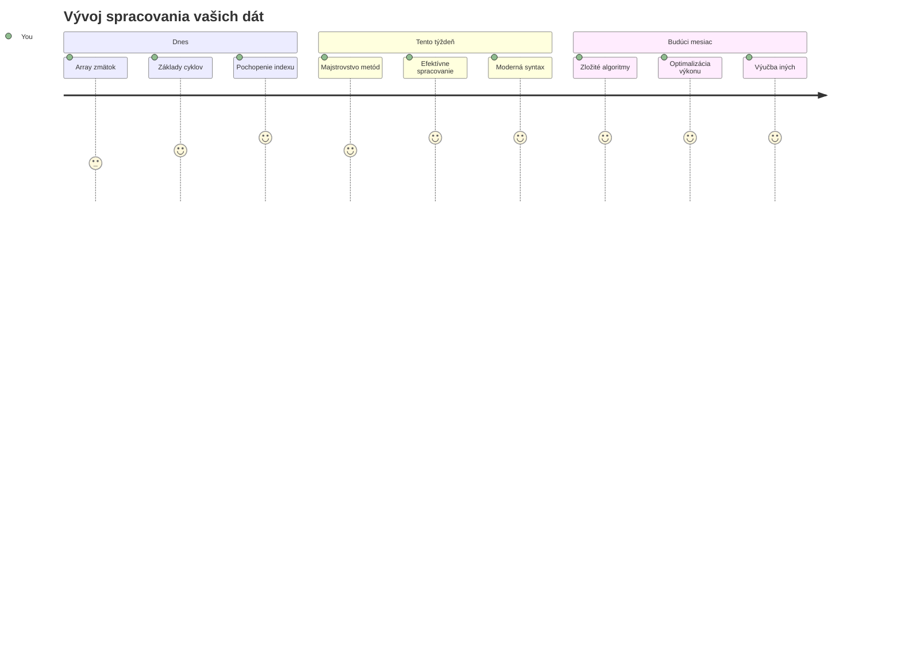
> 📦 **Odomkli ste silu organizácie a spracovania dát!** Polia a slučky sú základom takmer každej aplikácie, ktorú kedy vytvoríte. Od jednoduchých zoznamov po komplexnú analýzu dát, teraz máte nástroje na efektívne a elegantné spracovanie informácií. Každý dynamický web, mobilná aplikácia či dátovo orientovaný softvér sa spolieha na tieto základné koncepty. Vitajte vo svete škálovateľného spracovania dát! 🎉

---

<!-- CO-OP TRANSLATOR DISCLAIMER START -->
**Vyhlásenie o zodpovednosti**:  
Tento dokument bol preložený pomocou služby automatického prekladu [Co-op Translator](https://github.com/Azure/co-op-translator). Aj keď sa usilujeme o presnosť, majte prosím na pamäti, že automatické preklady môžu obsahovať chyby alebo nepresnosti. Originálny dokument v jeho pôvodnom jazyku by mal byť považovaný za autoritatívny zdroj. Pre kritické informácie sa odporúča profesionálny ľudský preklad. Nie sme zodpovední za akékoľvek nedorozumenia alebo nesprávne výklady vyplývajúce z použitia tohto prekladu.
<!-- CO-OP TRANSLATOR DISCLAIMER END -->