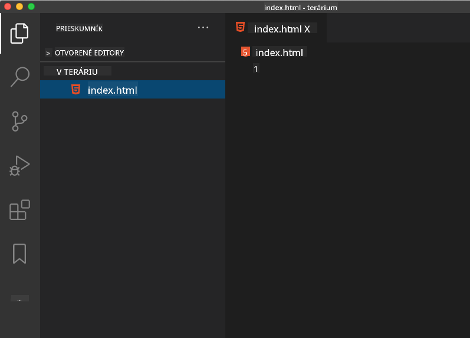

<!--
CO_OP_TRANSLATOR_METADATA:
{
  "original_hash": "20c72cf2e5b0050d38ca3cb14a75a9df",
  "translation_date": "2025-10-24T21:37:19+00:00",
  "source_file": "3-terrarium/1-intro-to-html/README.md",
  "language_code": "sk"
}
-->
# Projekt Terárium Časť 1: Úvod do HTML


> Sketchnote od [Tomomi Imura](https://twitter.com/girlie_mac)

HTML, alebo HyperText Markup Language, je základom každého webu, ktorý ste kedy navštívili. Predstavte si HTML ako kostru, ktorá dáva štruktúru webovým stránkam – definuje, kde sa nachádza obsah, ako je organizovaný a čo každý jeho prvok predstavuje. Zatiaľ čo CSS neskôr "oblečie" váš HTML farbami a rozložením a JavaScript ho oživí interaktivitou, HTML poskytuje základnú štruktúru, ktorá umožňuje všetko ostatné.

V tejto lekcii vytvoríte HTML štruktúru pre virtuálne rozhranie terária. Tento praktický projekt vás naučí základné koncepty HTML pri tvorbe niečoho vizuálne pútavého. Naučíte sa, ako organizovať obsah pomocou sémantických prvkov, pracovať s obrázkami a vytvoriť základ pre interaktívnu webovú aplikáciu.

Na konci tejto lekcie budete mať funkčnú HTML stránku zobrazujúcu obrázky rastlín v organizovaných stĺpcoch, pripravenú na štýlovanie v ďalšej lekcii. Nebojte sa, ak to na začiatku vyzerá jednoducho – presne tak by mal HTML vyzerať predtým, než CSS pridá vizuálny lesk.

## Kvíz pred prednáškou

[Kvíz pred prednáškou](https://ff-quizzes.netlify.app/web/quiz/15)

> 📺 **Pozrite si a naučte sa**: Pozrite si tento užitočný prehľad vo videu
> 
> [](https://www.youtube.com/watch?v=1TvxJKBzhyQ)

## Nastavenie vášho projektu

Predtým, než sa pustíme do kódu HTML, nastavíme si správne pracovné prostredie pre váš projekt terária. Vytvorenie organizovanej štruktúry súborov od začiatku je dôležitý zvyk, ktorý vám bude slúžiť počas celej vašej cesty webového vývoja.

### Úloha: Vytvorte štruktúru projektu

Vytvoríte vyhradený priečinok pre váš projekt terária a pridáte svoj prvý HTML súbor. Tu sú dva prístupy, ktoré môžete použiť:

**Možnosť 1: Použitie Visual Studio Code**
1. Otvorte Visual Studio Code
2. Kliknite na "File" → "Open Folder" alebo použite `Ctrl+K, Ctrl+O` (Windows/Linux) alebo `Cmd+K, Cmd+O` (Mac)
3. Vytvorte nový priečinok s názvom `terrarium` a vyberte ho
4. V paneli Explorer kliknite na ikonu "New File"
5. Pomenujte svoj súbor `index.html`



**Možnosť 2: Použitie príkazového riadku**
```bash
mkdir terrarium
cd terrarium
touch index.html
code index.html
```

**Čo tieto príkazy vykonávajú:**
- **Vytvárajú** nový adresár s názvom `terrarium` pre váš projekt
- **Presúvajú sa** do adresára terária
- **Vytvárajú** prázdny súbor `index.html`
- **Otvárajú** súbor vo Visual Studio Code na úpravy

> 💡 **Tip**: Názov súboru `index.html` je v webovom vývoji špeciálny. Keď niekto navštívi webovú stránku, prehliadače automaticky hľadajú `index.html` ako predvolenú stránku na zobrazenie. To znamená, že URL ako `https://mysite.com/projects/` automaticky zobrazí súbor `index.html` z priečinka `projects` bez potreby špecifikovať názov súboru v URL.

## Porozumenie štruktúre HTML dokumentu

Každý HTML dokument nasleduje špecifickú štruktúru, ktorú prehliadače potrebujú na správne zobrazenie. Predstavte si túto štruktúru ako formálny list – má povinné prvky v určitom poradí, ktoré pomáhajú prijímateľovi (v tomto prípade prehliadaču) správne spracovať obsah.

Začnime pridaním základného základu, ktorý potrebuje každý HTML dokument.

### Deklarácia DOCTYPE a koreňový prvok

Prvé dva riadky akéhokoľvek HTML súboru slúžia ako "úvod" dokumentu pre prehliadač:

```html
<!DOCTYPE html>
<html></html>
```

**Čo tento kód robí:**
- **Deklaruje** typ dokumentu ako HTML5 pomocou `<!DOCTYPE html>`
- **Vytvára** koreňový prvok `<html>`, ktorý bude obsahovať všetok obsah stránky
- **Zavádza** moderné webové štandardy pre správne zobrazenie prehliadačom
- **Zabezpečuje** konzistentné zobrazenie naprieč rôznymi prehliadačmi a zariadeniami

> 💡 **Tip pre VS Code**: Prejdite kurzorom nad akýkoľvek HTML tag vo VS Code, aby ste videli užitočné informácie z MDN Web Docs, vrátane príkladov použitia a detailov o kompatibilite s prehliadačmi.

> 📚 **Dozviete sa viac**: Deklarácia DOCTYPE zabraňuje prehliadačom vstúpiť do "quirks mode", ktorý sa používal na podporu veľmi starých webových stránok. Moderný webový vývoj používa jednoduchú deklaráciu `<!DOCTYPE html>` na zabezpečenie [štandardného zobrazenia](https://developer.mozilla.org/docs/Web/HTML/Quirks_Mode_and_Standards_Mode).

## Pridanie základných metadát dokumentu

Sekcia `<head>` HTML dokumentu obsahuje kľúčové informácie, ktoré prehliadače a vyhľadávače potrebujú, ale návštevníci ich priamo na stránke nevidia. Predstavte si to ako "zákulisné" informácie, ktoré pomáhajú vašej webovej stránke správne fungovať a zobrazovať sa na rôznych zariadeniach a platformách.

Tieto metadáta hovoria prehliadačom, ako zobraziť vašu stránku, aké kódovanie znakov použiť a ako sa vysporiadať s rôznymi veľkosťami obrazovky – všetko je nevyhnutné pre vytvorenie profesionálnych a prístupných webových stránok.

### Úloha: Pridajte hlavičku dokumentu

Vložte túto sekciu `<head>` medzi otváracie a zatváracie tagy `<html>`:

```html
<head>
	<title>Welcome to my Virtual Terrarium</title>
	<meta charset="utf-8" />
	<meta http-equiv="X-UA-Compatible" content="IE=edge" />
	<meta name="viewport" content="width=device-width, initial-scale=1" />
</head>
```

**Rozbor toho, čo každý prvok vykonáva:**
- **Nastavuje** názov stránky, ktorý sa zobrazuje na kartách prehliadača a vo výsledkoch vyhľadávania
- **Špecifikuje** kódovanie znakov UTF-8 pre správne zobrazenie textu na celom svete
- **Zabezpečuje** kompatibilitu s modernými verziami Internet Explorera
- **Konfiguruje** responzívny dizajn nastavením viewportu na zhodu so šírkou zariadenia
- **Riadi** počiatočnú úroveň priblíženia na zobrazenie obsahu v prirodzenej veľkosti

> 🤔 **Zamyslite sa nad tým**: Čo by sa stalo, keby ste nastavili meta tag viewport takto: `<meta name="viewport" content="width=600">`? To by prinútilo stránku, aby mala vždy šírku 600 pixelov, čo by narušilo responzívny dizajn! Dozviete sa viac o [správnej konfigurácii viewportu](https://developer.mozilla.org/docs/Web/HTML/Viewport_meta_tag).

## Vytvorenie tela dokumentu

Prvok `<body>` obsahuje všetok viditeľný obsah vašej webovej stránky – všetko, čo používatelia uvidia a s čím budú interagovať. Zatiaľ čo sekcia `<head>` poskytla pokyny prehliadaču, sekcia `<body>` obsahuje skutočný obsah: text, obrázky, tlačidlá a ďalšie prvky, ktoré tvoria vaše užívateľské rozhranie.

Pridajme štruktúru tela a pochopme, ako HTML tagy spolupracujú na vytvorení zmysluplného obsahu.

### Porozumenie štruktúre HTML tagov

HTML používa párové tagy na definovanie prvkov. Väčšina tagov má otvárací tag ako `<p>` a zatvárací tag ako `</p>`, s obsahom medzi nimi: `<p>Ahoj, svet!</p>`. Tým sa vytvorí odsek obsahujúci text "Ahoj, svet!".

### Úloha: Pridajte prvok tela

Aktualizujte svoj HTML súbor tak, aby obsahoval prvok `<body>`:

```html
<!DOCTYPE html>
<html>
	<head>
		<title>Welcome to my Virtual Terrarium</title>
		<meta charset="utf-8" />
		<meta http-equiv="X-UA-Compatible" content="IE=edge" />
		<meta name="viewport" content="width=device-width, initial-scale=1" />
	</head>
	<body></body>
</html>
```

**Čo poskytuje táto kompletná štruktúra:**
- **Zavádza** základný rámec HTML5 dokumentu
- **Zahŕňa** základné metadáta pre správne zobrazenie prehliadačom
- **Vytvára** prázdne telo pripravené na váš viditeľný obsah
- **Nasleduje** moderné najlepšie praktiky webového vývoja

Teraz ste pripravení pridať viditeľné prvky vášho terária. Použijeme prvky `<div>` ako kontajnery na organizáciu rôznych sekcií obsahu a prvky `` na zobrazenie obrázkov rastlín.

### Práca s obrázkami a kontajnermi rozloženia

Obrázky sú v HTML špeciálne, pretože používajú "samozatváracie" tagy. Na rozdiel od prvkov ako `<p></p>`, ktoré obklopujú obsah, tag `` obsahuje všetky potrebné informácie v rámci samotného tagu pomocou atribútov ako `src` pre cestu k súboru obrázka a `alt` pre prístupnosť.

Pred pridaním obrázkov do vášho HTML budete musieť správne zorganizovať súbory projektu vytvorením priečinka na obrázky a pridaním grafiky rastlín.

**Najskôr nastavte svoje obrázky:**
1. Vytvorte priečinok s názvom `images` vo vašom priečinku projektu terária
2. Stiahnite si obrázky rastlín z [riešiteľského priečinka](../../../../3-terrarium/solution/images) (celkom 14 obrázkov rastlín)
3. Skopírujte všetky obrázky rastlín do vášho nového priečinka `images`

### Úloha: Vytvorte rozloženie zobrazenia rastlín

Teraz pridajte obrázky rastlín organizované v dvoch stĺpcoch medzi vaše tagy `<body></body>`:

```html
<div id="page">
	<div id="left-container" class="container">
		<div class="plant-holder">
			
		</div>
		<div class="plant-holder">
			
		</div>
		<div class="plant-holder">
			
		</div>
		<div class="plant-holder">
			
		</div>
		<div class="plant-holder">
			
		</div>
		<div class="plant-holder">
			
		</div>
		<div class="plant-holder">
			
		</div>
	</div>
	<div id="right-container" class="container">
		<div class="plant-holder">
			
		</div>
		<div class="plant-holder">
			
		</div>
		<div class="plant-holder">
			
		</div>
		<div class="plant-holder">
			
		</div>
		<div class="plant-holder">
			
		</div>
		<div class="plant-holder">
			
		</div>
		<div class="plant-holder">
			
		</div>
	</div>
</div>
```

**Krok za krokom, čo sa deje v tomto kóde:**
- **Vytvára** hlavný kontajner stránky s `id="page"` na držanie všetkého obsahu
- **Zavádza** dva kontajnery stĺpcov: `left-container` a `right-container`
- **Organizuje** 7 rastlín v ľavom stĺpci a 7 rastlín v pravom stĺpci
- **Obklopuje** každý obrázok rastliny v div `plant-holder` pre individuálne umiestnenie
- **Používa** konzistentné názvy tried pre štýlovanie pomocou CSS v ďalšej lekcii
- **Priraďuje** jedinečné ID každému obrázku rastliny pre interakciu s JavaScriptom neskôr
- **Zahŕňa** správne cesty k súborom smerujúce do priečinka s obrázkami

> 🤔 **Zamyslite sa nad tým**: Všimnite si, že všetky obrázky majú momentálne rovnaký alt text "rastlina". To nie je ideálne pre prístupnosť. Používatelia čítačiek obrazovky by počuli "rastlina" opakovane 14-krát bez toho, aby vedeli, akú konkrétnu rastlinu každý obrázok zobrazuje. Môžete vymyslieť lepší, opisnejší alt text pre každý obrázok?

> 📝 **Typy HTML prvkov**: Prvky `<div>` sú "blokové" a zaberajú celú šírku, zatiaľ čo prvky `<span>` sú "riadkové" a zaberajú len potrebnú šírku. Čo si myslíte, že by sa stalo, keby ste všetky tieto tagy `<div>` zmenili na tagy `<span>`?

S týmto pridaným označením sa rastliny zobrazia na obrazovke, aj keď zatiaľ nebudú vyzerať upravene – na to je určené CSS v ďalšej lekcii! Zatiaľ máte pevný HTML základ, ktorý správne organizuje váš obsah a dodržiava najlepšie praktiky prístupnosti.

## Používanie sémantického HTML pre prístupnosť

Sémantické HTML znamená výber HTML prvkov na základe ich významu a účelu, nielen ich vzhľadu. Keď používate sémantické označenie, komunikujete štruktúru a význam vášho obsahu prehliadačom, vyhľadávačom a asistenčným technológiám, ako sú čítačky obrazovky.

Tento prístup robí vaše webové stránky prístupnejšími pre používateľov s postihnutím a pomáha vyhľadávačom lepšie pochopiť váš obsah. Je to základný princíp moderného webového vývoja, ktorý vytvára lepšie skúsenosti pre všetkých.

### Pridanie sémantického názvu stránky

Pridajme správny nadpis na stránku terária. Vložte tento riadok hneď po otváracom tagu `<body>`:

```html
<h1>My Terrarium</h1>
```

**Prečo záleží na sémantickom označení:**
- **Pomáha** čítačkám obrazovky navigovať a pochopiť štruktúru stránky
- **Zlepšuje** optimalizáciu pre vyhľadávače (SEO) tým, že objasňuje hierarchiu obsahu
- **Zvyšuje** prístupnosť pre používateľov so zrakovým postihnutím alebo kognitívnymi rozdielmi
- **Vytvára** lepšie užívateľské skúsenosti na všetkých zariadeniach a platformách
- **Nasleduje** webové štandardy a najlepšie praktiky pre profesionálny vývoj

**Príklady sémantických vs. nesémantických volieb:**

| Účel | ✅ Sémantická voľba | ❌ Nesémantická voľba |
|------|--------------------|----------------------|
| Hlavný nadpis | `<h1>Názov</h1>` | `<div class="big-text">Názov</div>` |
| Navigácia | `<nav><ul><li></li></ul></nav>` | `<div class="menu"><div></div></div>` |
| Tlačidlo | `<button>Klikni na mňa</button>` | `<span onclick="...">Klikni na mňa</span>` |
| Obsah článku | `<article><p></p></article>` | `<div class="content"><div></div></div>` |

> 🎥 **Pozrite si to v akcii**: Pozrite si [ako čítačky obrazovky interagujú s webovými stránkami](https://www.youtube.com/watch?v=OUDV1gqs9GA), aby ste pochopili, prečo je sémantické označenie kľúčové pre prístupnosť. Všimnite si, ako správna štruktúra HTML pomáha používateľom efektívne navigovať.

## Vytvorenie kontajnera terária

Teraz pridajme HTML štruktúru samotného terária – skleneného kontajnera, kde budú nakoniec umiestnené rastliny. Táto sekcia demonštruje dôležitý koncept: HTML poskytuje štruktúru, ale bez štýlovania pomocou CSS tieto prvky zatiaľ nebudú viditeľné.

Označenie terária používa popisné názvy tried, ktoré uľahčia intuitívne a udržateľné štýlovanie pomocou CSS v ďalšej lekcii.

### Úloha: Pridajte štruktúru terária

Vložte toto označenie nad posledný tag `</div>` (pred zatváracím tagom kontajnera stránky):

```html
<div id="terrarium">
	<div class="jar-top"></div>
	<div class="jar-walls">
		<div class="jar-glossy-long"></div>
		<div class="jar-glossy-short"></div>
	</div>
	<div class="dirt"></div>
	<div class="jar-bottom"></div>
</div>
```

**Porozumenie tejto štruktúre terária:**
- **Vytvára** hlavný kontajner terária s jedinečným ID na štýlovanie
- **Definuje** samostatné prvky pre každú vizuálnu súčasť (vrch, steny, zem, spodok)
- **Zahŕňa** vnorené prvky pre efekty odrazu skla (lesklé prvky)
- **Použí
**Výzva:** Vytvorte semantickú HTML sekciu, ktorá obsahuje hlavný nadpis "Sprievodca starostlivosťou o rastliny", tri podsekcie s nadpismi "Polievanie", "Požiadavky na svetlo" a "Starostlivosť o pôdu", pričom každá obsahuje odsek informácií o starostlivosti o rastliny. Použite správne semantické HTML značky ako `<section>`, `<h2>`, `<h3>` a `<p>` na správne štruktúrovanie obsahu.

Viac informácií o [agent mode](https://code.visualstudio.com/blogs/2025/02/24/introducing-copilot-agent-mode) nájdete tu.

## Preskúmajte výzvu histórie HTML

**Učenie sa o vývoji webu**

HTML sa výrazne vyvinulo od čias, keď Tim Berners-Lee vytvoril prvý webový prehliadač v CERN v roku 1990. Niektoré staršie značky ako `<marquee>` sú teraz zastarané, pretože nefungujú dobre s modernými štandardmi prístupnosti a princípmi responzívneho dizajnu.

**Vyskúšajte tento experiment:**
1. Dočasne obklopte svoj nadpis `<h1>` značkou `<marquee>`: `<marquee><h1>Moje terárium</h1></marquee>`
2. Otvorte svoju stránku v prehliadači a pozorujte efekt posúvania
3. Zamyslite sa nad tým, prečo bola táto značka zastaraná (nápoveda: myslite na používateľskú skúsenosť a prístupnosť)
4. Odstráňte značku `<marquee>` a vráťte sa k semantickému označeniu

**Otázky na zamyslenie:**
- Ako by mohol posúvajúci sa nadpis ovplyvniť používateľov s vizuálnym postihnutím alebo citlivosťou na pohyb?
- Aké moderné techniky CSS by mohli dosiahnuť podobné vizuálne efekty prístupnejším spôsobom?
- Prečo je dôležité používať aktuálne webové štandardy namiesto zastaraných prvkov?

Preskúmajte viac o [zastaraných a neaktuálnych HTML prvkoch](https://developer.mozilla.org/docs/Web/HTML/Element#Obsolete_and_deprecated_elements), aby ste pochopili, ako sa webové štandardy vyvíjajú na zlepšenie používateľskej skúsenosti.


## Kvíz po prednáške

[Kvíz po prednáške](https://ff-quizzes.netlify.app/web/quiz/16)

## Prehľad a samostatné štúdium

**Prehĺbte svoje znalosti HTML**

HTML je základom webu už viac ako 30 rokov, vyvíjajúc sa z jednoduchého jazyka na označovanie dokumentov na sofistikovanú platformu na tvorbu interaktívnych aplikácií. Pochopenie tohto vývoja vám pomôže oceniť moderné webové štandardy a robiť lepšie rozhodnutia pri vývoji.

**Odporúčané študijné cesty:**

1. **História a vývoj HTML**
   - Preskúmajte časovú os od HTML 1.0 po HTML5
   - Zistite, prečo boli niektoré značky zastarané (prístupnosť, priateľskosť k mobilným zariadeniam, udržateľnosť)
   - Preskúmajte nové funkcie HTML a návrhy

2. **Hlbší pohľad na semantické HTML**
   - Študujte kompletný zoznam [semantických prvkov HTML5](https://developer.mozilla.org/docs/Web/HTML/Element)
   - Precvičte si identifikáciu, kedy použiť `<article>`, `<section>`, `<aside>` a `<main>`
   - Naučte sa o atribútoch ARIA na zlepšenie prístupnosti

3. **Moderný webový vývoj**
   - Preskúmajte [tvorbu responzívnych webových stránok](https://docs.microsoft.com/learn/modules/build-simple-website/?WT.mc_id=academic-77807-sagibbon) na Microsoft Learn
   - Pochopte, ako HTML integruje CSS a JavaScript
   - Naučte sa o najlepších praktikách webového výkonu a SEO

**Otázky na zamyslenie:**
- Ktoré zastarané HTML značky ste objavili a prečo boli odstránené?
- Aké nové funkcie HTML sa navrhujú pre budúce verzie?
- Ako prispieva semantické HTML k prístupnosti webu a SEO?


## Zadanie

[Precvičte si HTML: Vytvorte maketu blogu](assignment.md)

---

**Zrieknutie sa zodpovednosti**:  
Tento dokument bol preložený pomocou služby AI prekladu [Co-op Translator](https://github.com/Azure/co-op-translator). Hoci sa snažíme o presnosť, prosím, berte na vedomie, že automatizované preklady môžu obsahovať chyby alebo nepresnosti. Pôvodný dokument v jeho rodnom jazyku by mal byť považovaný za autoritatívny zdroj. Pre kritické informácie sa odporúča profesionálny ľudský preklad. Nenesieme zodpovednosť za akékoľvek nedorozumenia alebo nesprávne interpretácie vyplývajúce z použitia tohto prekladu.