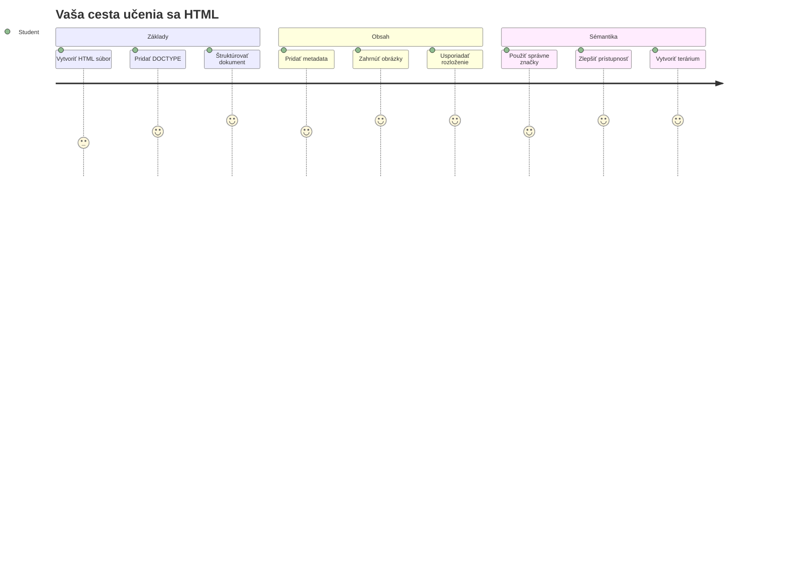
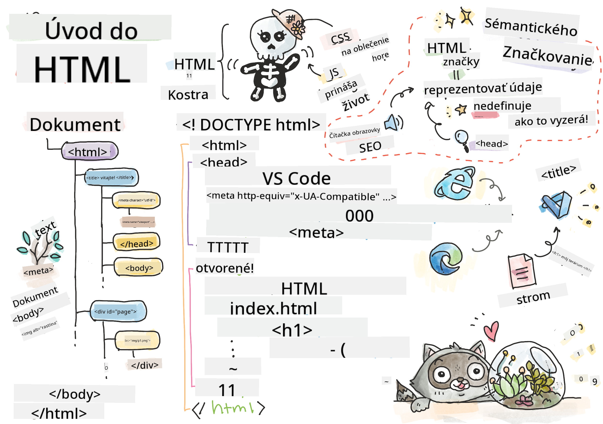
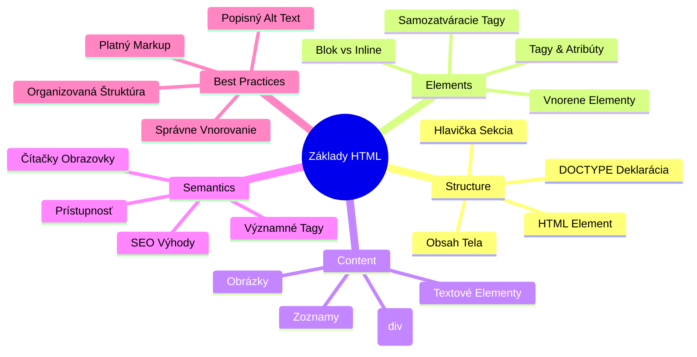
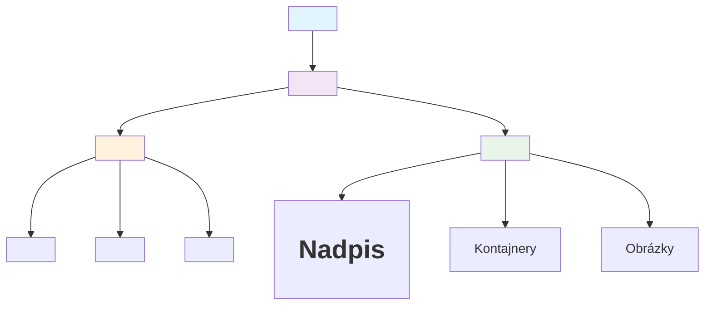
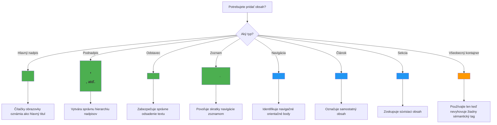
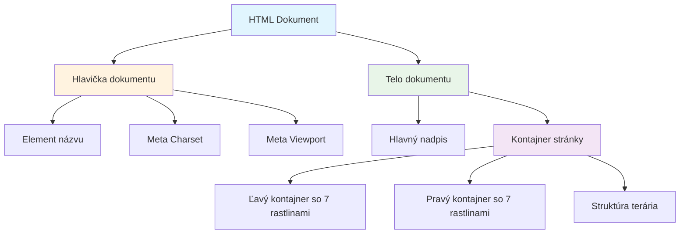
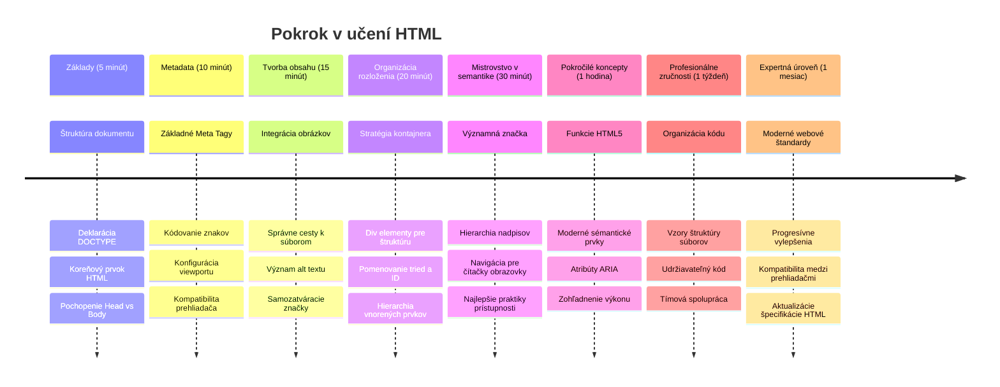

<!--
CO_OP_TRANSLATOR_METADATA:
{
  "original_hash": "3fcfa99c4897e051b558b5eaf1e8cc74",
  "translation_date": "2026-01-07T05:06:08+00:00",
  "source_file": "3-terrarium/1-intro-to-html/README.md",
  "language_code": "sk"
}
-->
# Terrarium Project Časť 1: Úvod do HTML



> Sketchnote od [Tomomi Imura](https://twitter.com/girlie_mac)

HTML, alebo HyperText Markup Language, je základom každej webovej stránky, ktorú ste kedy navštívili. Predstavte si HTML ako kostru, ktorá dáva štruktúru webovým stránkam – určuje, kam obsah patrí, ako je usporiadaný a čo každý prvok predstavuje. Zatiaľ čo CSS neskôr „oblečie“ vašu HTML stránku farbami a rozloženiami, a JavaScript ju oživí interaktivitou, HTML poskytuje základnú štruktúru, ktorá robí všetko ostatné možným.

V tejto lekcii vytvoríte HTML štruktúru pre virtuálne rozhranie terária. Tento praktický projekt vás naučí základné koncepty HTML, pričom vytvoríte niečo vizuálne zaujímavé. Naučíte sa, ako organizovať obsah pomocou sémantických prvkov, pracovať s obrázkami a vytvoriť základ pre interaktívnu webovú aplikáciu.

Na konci tejto lekcie budete mať funkčnú HTML stránku zobrazujúcu obrázky rastlín v usporiadaných stĺpcoch, pripravenú na štýlovanie v ďalšej lekcii. Nezáleží na tom, aký jednoduchý to na začiatku vyzerá – to je presne to, čo má HTML robiť predtým, než CSS pridá vizuálny lesk.


## Prednáškový kvíz

[Prednáškový kvíz](https://ff-quizzes.netlify.app/web/quiz/15)

> 📺 **Pozerajte a učte sa**: Pozrite si tento užitočný video prehľad
> 
> [](https://www.youtube.com/watch?v=1TvxJKBzhyQ)

## Nastavenie projektu

Pred tým, než sa pustíme do HTML kódu, nastavme si vhodné pracovné prostredie pre váš projekt terária. Vytvorenie usporiadaného systému súborov už od začiatku je dôležitý zvyk, ktorý sa vám bude hodiť počas celej vašej cesty vývojára webu.

### Úloha: Vytvorte štruktúru projektu

Vytvoríte si vyhradenú zložku pre váš projekt terária a pridáte prvý HTML súbor. Tu sú dve možnosti, ktoré môžete použiť:

**Možnosť 1: Použitie Visual Studio Code**
1. Otvorte Visual Studio Code
2. Kliknite na „Súbor“ → „Otvoriť zložku“ alebo použite `Ctrl+K, Ctrl+O` (Windows/Linux) alebo `Cmd+K, Cmd+O` (Mac)
3. Vytvorte novú zložku s názvom `terrarium` a vyberte ju
4. V paneli Explorer kliknite na ikonu „Nový súbor“
5. Pomenujte svoj súbor `index.html`


**Možnosť 2: Použitie terminálových príkazov**
```bash
mkdir terrarium
cd terrarium
touch index.html
code index.html
```

**Čo tieto príkazy robia:**
- **Vytvorí** novú adresár s názvom `terrarium` pre váš projekt
- **Presunie sa** do adresára terrarium
- **Vytvorí** prázdny súbor `index.html`
- **Otvára** súbor vo Visual Studio Code na úpravu

> 💡 **Užitočný tip**: Názov súboru `index.html` je vo webovom vývoji špeciálny. Keď niekto navštívi web, prehliadače automaticky hľadajú `index.html` ako predvolenú stránku na zobrazenie. To znamená, že URL ako `https://mysite.com/projects/` automaticky zobrazí súbor `index.html` zo zložky `projects` bez potreby zadávať názov súboru v URL.

## Pochopenie štruktúry HTML dokumentu

Každý HTML dokument nasleduje konkrétnu štruktúru, ktorú prehliadače potrebujú pochopiť a správne zobraziť. Predstavte si túto štruktúru ako formálny list – má povinné prvky v určitom poradí, ktoré pomáhajú príjemcovi (v tomto prípade prehliadaču) správne spracovať obsah.


Začnime pridaním nevyhnutného základu, ktorý každý HTML dokument potrebuje.

### Deklarácia DOCTYPE a koreňový prvok

Prvé dve riadky akéhokoľvek HTML súboru slúžia ako „úvod“ dokumentu pre prehliadač:

```html
<!DOCTYPE html>
<html></html>
```

**Čo tento kód robí:**
- **Deklaruje** typ dokumentu ako HTML5 použitím `<!DOCTYPE html>`
- **Vytvára** koreňový element `<html>`, ktorý bude obsahovať celý obsah stránky
- **Zavádza** moderné webové štandardy pre správne renderovanie v prehliadači
- **Zabezpečuje** konzistentné zobrazenie vo všetkých prehliadačoch a zariadeniach

> 💡 **Tip pre VS Code**: Prejdite kurzorom nad ľubovoľný HTML tag vo VS Code a uvidíte užitočné informácie z MDN Web Docs, vrátane príkladov použitia a kompatibility s prehliadačmi.

> 📚 **Zistite viac**: Deklarácia DOCTYPE zabraňuje prehliadačom vstúpiť do „quirks módu“, ktorý sa používal pre podporu veľmi starých webov. Moderný webový vývoj používa jednoduchú deklaráciu `<!DOCTYPE html>` na zabezpečenie [dodržiavania štandardov pri renderovaní](https://developer.mozilla.org/docs/Web/HTML/Quirks_Mode_and_Standards_Mode).

### 🔄 **Pedagogická kontrola**
**Zastavte sa a zamyslite**: Pred pokračovaním si uistite, že rozumiete:
- ✅ Prečo každý HTML dokument potrebuje deklaráciu DOCTYPE
- ✅ Čo obsahuje koreňový element `<html>`
- ✅ Ako táto štruktúra pomáha prehliadačom správne zobrazovať stránky

**Rýchly seba-test**: Dokážete vlastnými slovami vysvetliť, čo znamená „dodržiavanie štandardov pri renderovaní“?

## Pridanie nevyhnutných metaúdajov dokumentu

Sekcia `<head>` HTML dokumentu obsahuje dôležité informácie, ktoré prehliadače a vyhľadávače potrebujú, ale ktoré návštevníci priamo na stránke nevidia. Predstavte si ju ako „zákulisné“ informácie, ktoré pomáhajú vašej webovej stránke fungovať správne a správne vyzerať na rôznych zariadeniach a platformách.

Tieto metaúdaje hovoria prehliadačom, ako majú stránku zobraziť, aké kódovanie znakov použiť a ako sa majú správať pri rôznych veľkostiach obrazoviek – všetko nevyhnutné pre vytváranie profesionálnych a prístupných webových stránok.

### Úloha: Pridajte hlavičku dokumentu

Vložte túto sekciu `<head>` medzi otváracie a zatváracie značky `<html>`:

```html
<head>
	<title>Welcome to my Virtual Terrarium</title>
	<meta charset="utf-8" />
	<meta http-equiv="X-UA-Compatible" content="IE=edge" />
	<meta name="viewport" content="width=device-width, initial-scale=1" />
</head>
```

**Čo jednotlivé prvky zabezpečujú:**
- **Nastavuje** názov stránky, ktorý sa zobrazuje na záložkách prehliadača a vo výsledkoch vyhľadávania
- **Špecifikuje** kódovanie znakov UTF-8 pre správne zobrazenie textu po celom svete
- **Zabezpečuje** kompatibilitu s modernými verziami Internet Explorera
- **Konfiguruje** responzívny dizajn nastavením viewportu tak, aby zodpovedal šírke zariadenia
- **Ovláda** počiatočné zväčšenie na zobrazenie obsahu v prirodzenej veľkosti

> 🤔 **Zamyslite sa**: Čo by sa stalo, keby ste nastavili viewport meta tag takto: `<meta name="viewport" content="width=600">`? Toto by nútilo stránku byť vždy širokú 600 pixelov, čím by sa pokazil responzívny dizajn! Viac o [správnej konfigurácii viewportu](https://developer.mozilla.org/docs/Web/HTML/Viewport_meta_tag).

## Vytvorenie tela dokumentu

Element `<body>` obsahuje všetok viditeľný obsah vašej webovej stránky – všetko, čo používatelia uvidia a s čím budú interagovať. Kým sekcia `<head>` poskytovala browseru inštrukcie, sekcia `<body>` obsahuje skutočný obsah: texty, obrázky, tlačidlá a iné prvky tvoriace používateľské rozhranie.

Poďme pridať štruktúru tela a pochopiť, ako spolu HTML tagy vytvárajú zmysluplný obsah.

### Pochopenie štruktúry HTML tagu

HTML používa párované tagy na definovanie prvkov. Väčšina tagov má otvárací tag ako `<p>` a zatvárací tag ako `</p>`, pričom medzi nimi je obsah: `<p>Ahoj, svet!</p>`. Tým sa vytvorí odsek obsahujúci text „Ahoj, svet!“.

### Úloha: Pridajte element `<body>`

Aktualizujte svoj HTML súbor tak, aby obsahoval `<body>` element:

```html
<!DOCTYPE html>
<html>
	<head>
		<title>Welcome to my Virtual Terrarium</title>
		<meta charset="utf-8" />
		<meta http-equiv="X-UA-Compatible" content="IE=edge" />
		<meta name="viewport" content="width=device-width, initial-scale=1" />
	</head>
	<body></body>
</html>
```

**Čo táto kompletná štruktúra poskytuje:**
- **Zavádza** základný rámec HTML5 dokumentu
- **Zahŕňa** dôležité metaúdaje pre správne renderovanie v prehliadači
- **Vytvára** prázdne telo pripravené na váš viditeľný obsah
- **Nasleduje** najlepšie postupy moderného webového vývoja

Teraz ste pripravení pridať viditeľné prvky vášho terária. Použijeme `<div>` elementy ako kontajnery na organizovanie rôznych sekcií obsahu a `` prvky na zobrazenie obrázkov rastlín.

### Práca s obrázkami a rozloženiami kontajnerov

Obrázky sú v HTML špeciálne, pretože používajú „samozatváracie“ tagy. Na rozdiel od prvkov ako `<p></p>`, ktoré obklopujú obsah, `` tag obsahuje všetky potrebné informácie priamo v tagu pomocou atribútov ako `src` pre cestu k obrázku a `alt` pre prístupnosť.

Pred pridaním obrázkov do vášho HTML budete potrebovať správne usporiadať svoje projektové súbory vytvorením priečinka images a pridaním grafík rastlín.

**Najprv pripravte obrázky:**
1. Vytvorte v priečinku terária zložku s názvom `images`
2. Stiahnite si obrázky rastlín z [riešiteľskej zložky](../../../../3-terrarium/solution/images) (14 obrázkov rastlín)
3. Skopírujte všetky obrázky rastlín do novej zložky `images`

### Úloha: Vytvorte rozloženie zobrazenia rastlín

Teraz pridajte obrázky rastlín usporiadané do dvoch stĺpcov medzi značky `<body></body>`:

```html
<div id="page">
	<div id="left-container" class="container">
		<div class="plant-holder">
			
		</div>
		<div class="plant-holder">
			
		</div>
		<div class="plant-holder">
			
		</div>
		<div class="plant-holder">
			
		</div>
		<div class="plant-holder">
			
		</div>
		<div class="plant-holder">
			
		</div>
		<div class="plant-holder">
			
		</div>
	</div>
	<div id="right-container" class="container">
		<div class="plant-holder">
			
		</div>
		<div class="plant-holder">
			
		</div>
		<div class="plant-holder">
			
		</div>
		<div class="plant-holder">
			
		</div>
		<div class="plant-holder">
			
		</div>
		<div class="plant-holder">
			
		</div>
		<div class="plant-holder">
			
		</div>
	</div>
</div>
```

**Krok za krokom, čo tento kód robí:**
- **Vytvára** hlavný kontajner stránky s `id="page"` na držanie všetkého obsahu
- **Zavádza** dva stĺpcové kontajnery: `left-container` a `right-container`
- **Usporiadava** 7 rastlín v ľavom stĺpci a 7 rastlín v pravom stĺpci
- **Obklopuje** každý obrázok rastliny do `plant-holder` divu pre individuálne umiestnenie
- **Používa** jednotné názvy tried pre CSS štýlovanie v ďalšej lekcii
- **Priraďuje** jedinečné ID ku každému obrázku rastliny pre neskoršiu interakciu s JavaScriptom
- **Zahŕňa** správne cesty k súborom smerujúcim do priečinka s obrázkami

> 🤔 **Zvážte toto**: Všimnite si, že všetky obrázky majú momentálne rovnaký alt text „plant“. To nie je ideálne pre prístupnosť. Používatelia čítačiek obrazovky by počuli „plant“ opakované 14-krát bez vedomia, o akú rastlinu ide na každom obrázku. Môžete vymyslieť lepší, opisnejší alt text pre každý obrázok?

> 📝 **Typy HTML prvkov**: `<div>` elementy sú „block-level“ a zaberajú celú šírku, zatiaľ čo `<span>` elementy sú „inline“ a zaberajú len potrebnú šírku. Čo myslíte, čo by sa stalo, keby ste všetky tieto `<div>` tagy nahradili za `<span>` tagy?

### 🔄 **Pedagogická kontrola**
**Pochopenie štruktúry**: Venujte chvíľu kontrole vašej HTML štruktúry:
- ✅ Dokážete identifikovať hlavné kontajnery vo vašom rozložení?
- ✅ Rozumiete, prečo má každý obrázok jedinečné ID?
- ✅ Ako by ste opísali účel divov `plant-holder`?

**Vizuálna kontrola**: Otvorte váš HTML súbor v prehliadači. Mali by ste vidieť:
- Základný zoznam obrázkov rastlín
- Obrázky usporiadané do dvoch stĺpcov
- Jednoduché, nestajlované rozloženie

**Pamätajte**: Tento jednoduchý vzhľad je presne to, ako má HTML vyzerať pred štýlovaním CSS!

S týmto markupom sa rastliny zobrazia na obrazovke, hoci ešte nebudú vyzerať upravene – na to je v ďalšej lekcii CSS! Zatiaľ máte pevný HTML základ, ktorý správne organizuje váš obsah a nasleduje najlepšie prístupy k prístupnosti.

## Použitie sémantického HTML pre prístupnosť

Sémantické HTML znamená vyberať HTML prvky na základe ich významu a účelu, nie len vzhľadu. Keď používate sémantické značenie, komunikujete štruktúru a význam vášho obsahu pre prehliadače, vyhľadávače a asistenčné technológie ako čítačky obrazovky.


Tento prístup robí vaše weby prístupnejšími pre používateľov so zdravotným postihnutím a pomáha vyhľadávačom lepšie porozumieť vášmu obsahu. Je to základný princíp moderného webového vývoja, ktorý vytvára lepšie zážitky pre každého.

### Pridanie sémantického názvu stránky

Pridajme správne nadpisy vašej stránke terária. Vložte tento riadok hneď za otváraciu značku `<body>`:

```html
<h1>My Terrarium</h1>
```

**Prečo je sémantické značenie dôležité:**
- **Pomáha** čítačkám obrazovky navigovať a pochopiť štruktúru stránky
- **Zlepšuje** SEO tým, že objasňuje hierarchiu obsahu
- **Zvyšuje** prístupnosť pre používateľov so zrakovým postihnutím alebo kognitívnymi rozdielmi
- **Vytvára** lepšie používateľské zážitky na všetkých zariadeniach a platformách
- **Dodržiava** webové štandardy a najlepšie postupy pre profesionálny vývoj

**Príklady sémantických vs nesémantických volieb:**

| Účel | ✅ Sémantický výber | ❌ Nesémantický výber |
|---------|-------------------|------------------------|
| Hlavný nadpis | `<h1>Názov</h1>` | `<div class="big-text">Názov</div>` |
| Navigácia | `<nav><ul><li></li></ul></nav>` | `<div class="menu"><div></div></div>` |
| Tlačidlo | `<button>Klikni ma</button>` | `<span onclick="...">Klikni ma</span>` |
| Obsah článku | `<article><p></p></article>` | `<div class="content"><div></div></div>` |

> 🎥 **Pozrite si v akcii**: Sledujte [ako čítačky obrazovky interagujú s webovými stránkami](https://www.youtube.com/watch?v=OUDV1gqs9GA), aby ste pochopili, prečo je sémantické značenie kľúčové pre prístupnosť. Všimnite si, ako správna HTML štruktúra pomáha používateľom efektívne navigovať.

## Vytvorenie kontajnera terária

Teraz pridajme HTML štruktúru samotného terária – skleneného kontajnera, kam budú rastliny nakoniec umiestnené. Táto sekcia ukazuje dôležitý koncept: HTML poskytuje štruktúru, ale bez CSS štýlových úprav tieto prvky ešte nebudú viditeľné.

Teráriový markup používa popisné názvy tried, ktoré umožnia intuitívne a udržateľné CSS štýlovanie v ďalšej lekcii.

### Úloha: Pridajte štruktúru terária

Vložte tento markup nad poslednú značku `</div>` (pred zatváracou značkou kontajnera stránky):

```html
<div id="terrarium">
	<div class="jar-top"></div>
	<div class="jar-walls">
		<div class="jar-glossy-long"></div>
		<div class="jar-glossy-short"></div>
	</div>
	<div class="dirt"></div>
	<div class="jar-bottom"></div>
</div>
```

**Čo táto štruktúra terária zabezpečuje:**
- **Vytvára** hlavný kontajner terária s jedinečným ID pre štýlovanie
- **Definuje** samostatné prvky pre každú vizuálnu zložku (vrch, steny, zemina, spodok)
- **Zahŕňa** vnorené prvky pre efekty zrkadlenia skla (lesklé prvky)
- **Používa** popisné názvy tried, ktoré jasne indikujú účel každého prvku
- **Pripravuje** štruktúru pre CSS štýlovanie, ktoré vytvorí vzhľad skleneného terária

> 🤔 **Všimli ste si niečo?**: Aj keď ste pridali tento markup, na stránke nevidíte nič nové! Toto dokonale ilustruje, ako HTML poskytuje štruktúru, zatiaľ čo CSS poskytuje vzhľad. Tieto `<div>` prvky existujú, ale ešte nemajú žiadne vizuálne štýlovanie – to príde v ďalšej lekcii!


### 🔄 **Pedagogická kontrola**
**Majstrovstvo HTML štruktúry**: Predtým, než pôjdete ďalej, uistite sa, že viete:
- ✅ Vysvetliť rozdiel medzi HTML štruktúrou a vizuálnym vzhľadom
- ✅ Rozlíšiť sémantické vs. nesémantické HTML prvky
- ✅ Opísať, aký prínos má správny markup pre prístupnosť
- ✅ Rozpoznať kompletnú stromovú štruktúru dokumentu

**Testovanie vášho porozumenia**: Skúste otvoriť svoj HTML súbor v prehliadači s vypnutým JavaScriptom a bez CSS. Ukáže vám to čistú sémantickú štruktúru, ktorú ste vytvorili!

---

## Výzva GitHub Copilot agenta

Použite režim Agenta na splnenie nasledujúcej výzvy:

**Popis:** Vytvorte sémantickú HTML štruktúru sekcie s návodom na starostlivosť o rastliny, ktorú by ste mohli pridať do projektu terária.

**Úloha:** Vytvorte sémantickú HTML sekciu, ktorá obsahuje hlavný nadpis "Návod na starostlivosť o rastliny", tri podsekcie s nadpismi "Zalievanie", "Požiadavky na svetlo" a "Starostlivosť o pôdu", z ktorých každá obsahuje odsek s informáciami o starostlivosti o rastliny. Použite správne sémantické HTML tagy ako `<section>`, `<h2>`, `<h3>`, a `<p>` na vhodnú štruktúru obsahu.

Viac sa dozviete o [režime agenta](https://code.visualstudio.com/blogs/2025/02/24/introducing-copilot-agent-mode) tu.

## Výzva o histórii HTML

**Učenie sa o vývoji webu**

HTML sa výrazne vyvíjalo od čias, keď Tim Berners-Lee vytvoril prvý webový prehliadač v CERN v roku 1990. Niektoré staršie tagy ako `<marquee>` sú dnes zastarané, pretože nevyhovujú moderným štandardom prístupnosti a princípom responzívneho dizajnu.

**Vyskúšajte tento experiment:**
1. Dočasne zabaľte svoj `<h1>` titulok do tagu `<marquee>`: `<marquee><h1>Moje terárium</h1></marquee>`
2. Otvorte stránku v prehliadači a pozorujte efekt posúvania
3. Zamyslite sa, prečo bol tento tag zastaraný (nápoveda: zamyslite sa nad užívateľskou skúsenosťou a prístupnosťou)
4. Odstráňte tag `<marquee>` a vráťte sa k sémantickému markup-u

**Reflexné otázky:**
- Ako by mohol titulok pohybujúci sa posúvaním ovplyvniť užívateľov so zrakovým postihnutím alebo citlivosťou na pohyb?
- Aké moderné CSS techniky môžu dosiahnuť podobné vizuálne efekty s lepšou prístupnosťou?
- Prečo je dôležité používať aktuálne webové štandardy namiesto zastaraných prvkov?

Preskúmajte viac o [zastaraných a nepoužívaných HTML prvkoch](https://developer.mozilla.org/docs/Web/HTML/Element#Obsolete_and_deprecated_elements), aby ste pochopili, ako sa vyvíjajú webové štandardy na zlepšenie užívateľskej skúsenosti.


## Kvíz po prednáške

[Kvíz po prednáške](https://ff-quizzes.netlify.app/web/quiz/16)

## Revízia a samostatné štúdium

**Prehĺbte si vedomosti o HTML**

HTML je základom webu už vyše 30 rokov, vyvíjal sa od jednoduchého jazyka pre značkovanie dokumentov po sofistikovanú platformu na vytváranie interaktívnych aplikácií. Pochopenie tohto vývoja vám pomôže lepšie si vážiť moderné webové štandardy a robiť lepšie vývojárske rozhodnutia.

**Odporúčané učebné cesty:**

1. **História a vývoj HTML**
   - Preskúmajte časovú os od HTML 1.0 po HTML5
   - Preskúmajte, prečo boli niektoré tagy zastarané (prístupnosť, mobilná priateľskosť, udržiavateľnosť)
   - Skúmajte nové HTML funkcie a návrhy

2. **Hlboký ponor do sémantického HTML**
   - Študujte kompletný zoznam [sémantických prvkov HTML5](https://developer.mozilla.org/docs/Web/HTML/Element)
   - Precvičujte rozpoznávanie, kedy použiť `<article>`, `<section>`, `<aside>`, a `<main>`
   - Naučte sa o ARIA atribútoch pre zlepšenú prístupnosť

3. **Moderný webový vývoj**
   - Preskúmajte [budovanie responzívnych webov](https://docs.microsoft.com/learn/modules/build-simple-website/?WT.mc_id=academic-77807-sagibbon) na Microsoft Learn
   - Pochopte integráciu HTML s CSS a JavaScriptom
   - Naučte sa o výkone webu a najlepších praktikách SEO

**Reflexné otázky:**
- Aké zastarané HTML tagy ste objavili a prečo boli odstránené?
- Aké nové HTML funkcie sú navrhované do budúcich verzií?
- Ako sémantické HTML prispieva k prístupnosti webu a SEO?

### ⚡ **Čo môžete urobiť nasledujúcich 5 minút**
- [ ] Otvorte DevTools (F12) a preskúmajte HTML štruktúru vášho obľúbeného webu
- [ ] Vytvorte jednoduchý HTML súbor so základnými tagmi: `<h1>`, `<p>`, a ``
- [ ] Overte svoje HTML pomocou online validátora W3C HTML Validator
- [ ] Skúste pridať komentár do HTML pomocou `<!-- komentár -->`

### 🎯 **Čo môžete dosiahnuť v tomto hodine**
- [ ] Dokončite kvíz po lekcii a prejdite si sémantické HTML pojmy
- [ ] Vytvorte jednoduchú webovú stránku o sebe používajúc správnu HTML štruktúru
- [ ] Experimentujte s rôznymi úrovňami nadpisov a tagmi na formátovanie textu
- [ ] Pridajte obrázky a odkazy pre prax multimediálnej integrácie
- [ ] Preskúmajte HTML5 funkcie, ktoré ste ešte neskúsili

### 📅 **Vaša týždenná cesta HTML**
- [ ] Dokončite zadanie projektu terária so sémantickým markup-om
- [ ] Vytvorte prístupnú webovú stránku s ARIA štítkami a rolami
- [ ] Precvičujte tvorbu formulárov s rôznymi typmi vstupov
- [ ] Preskúmajte HTML5 API ako localStorage alebo geolokáciu
- [ ] Študujte responzívne HTML vzory a mobile-first dizajn
- [ ] Prezrite si HTML kód iných vývojárov pre najlepšie praktiky

### 🌟 **Vaša mesačná webová základňa**
- [ ] Vytvorte portfólio webovú stránku prezentujúcu vaše HTML majstrovstvo
- [ ] Naučte sa HTML templating s frameworkom ako Handlebars
- [ ] Prispievajte do open source projektov zlepšením HTML dokumentácie
- [ ] Osvojte si pokročilé HTML koncepty ako vlastné elementy
- [ ] Integrujte HTML s CSS frameworkami a JavaScript knižnicami
- [ ] Mentorujte iných, ktorí sa učia základy HTML

## 🎯 Váš časový plán majstrovstva HTML


### 🛠️ Súhrn vášho HTML nástroja

Po dokončení tejto lekcie máte:
- **Štruktúru dokumentu**: Komplexný základ HTML5 so správnym DOCTYPE
- **Sémantický markup**: Významné tagy, ktoré zlepšujú prístupnosť a SEO
- **Integráciu obrázkov**: Správna organizácia súborov a použitie alt textov
- **Rozloženie kontajnerov**: Strategické použitie divov s popisnými názvami tried
- **Povedomie o prístupnosti**: Pochopenie navigácie pre čítačky obrazovky
- **Moderné štandardy**: Aktuálne praktiky HTML5 a znalosť zastaraných tagov
- **Základ pre projekt**: Pevný základ pre CSS štýlovanie a JavaScript interaktivitu

**Ďalšie kroky**: Vaša HTML štruktúra je pripravená na CSS štýlovanie! Sémantický základ, ktorý ste vytvorili, výrazne uľahčí pochopenie ďalšej lekcie.


## Zadanie

[Precvičte si HTML: Vytvorte maketu blogu](assignment.md)

---

<!-- CO-OP TRANSLATOR DISCLAIMER START -->
**Zrieknutie sa zodpovednosti**:  
Tento dokument bol preložený pomocou AI prekladateľskej služby [Co-op Translator](https://github.com/Azure/co-op-translator). Hoci sa snažíme o presnosť, vezmite prosím na vedomie, že automatické preklady môžu obsahovať chyby alebo nepresnosti. Originálny dokument v jeho pôvodnom jazyku by mal byť považovaný za autoritatívny zdroj. Pre kritické informácie sa odporúča profesionálny ľudský preklad. Nie sme zodpovední za akékoľvek nedorozumenia alebo nesprávne výklady vyplývajúce z použitia tohto prekladu.
<!-- CO-OP TRANSLATOR DISCLAIMER END -->