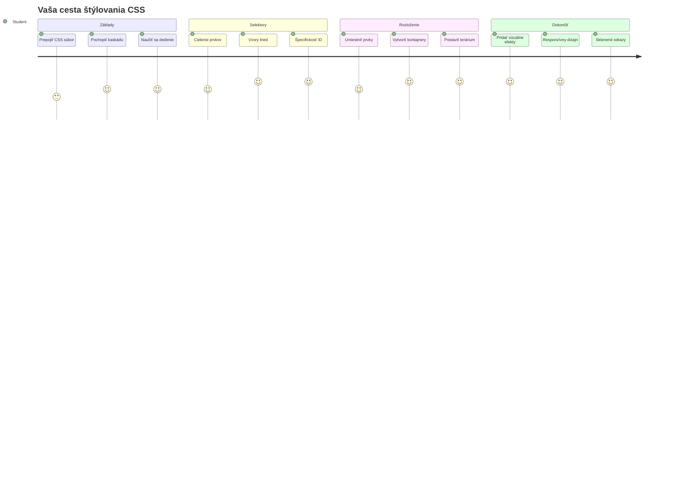
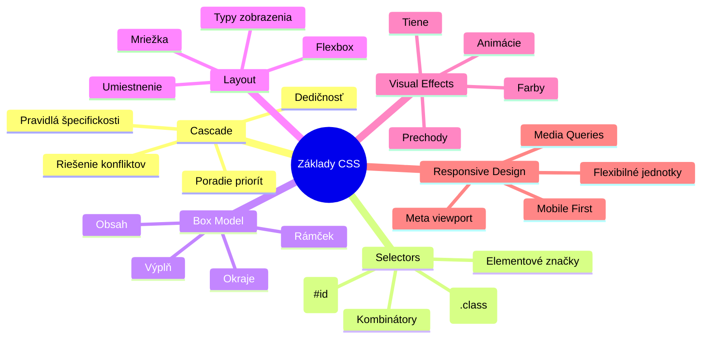
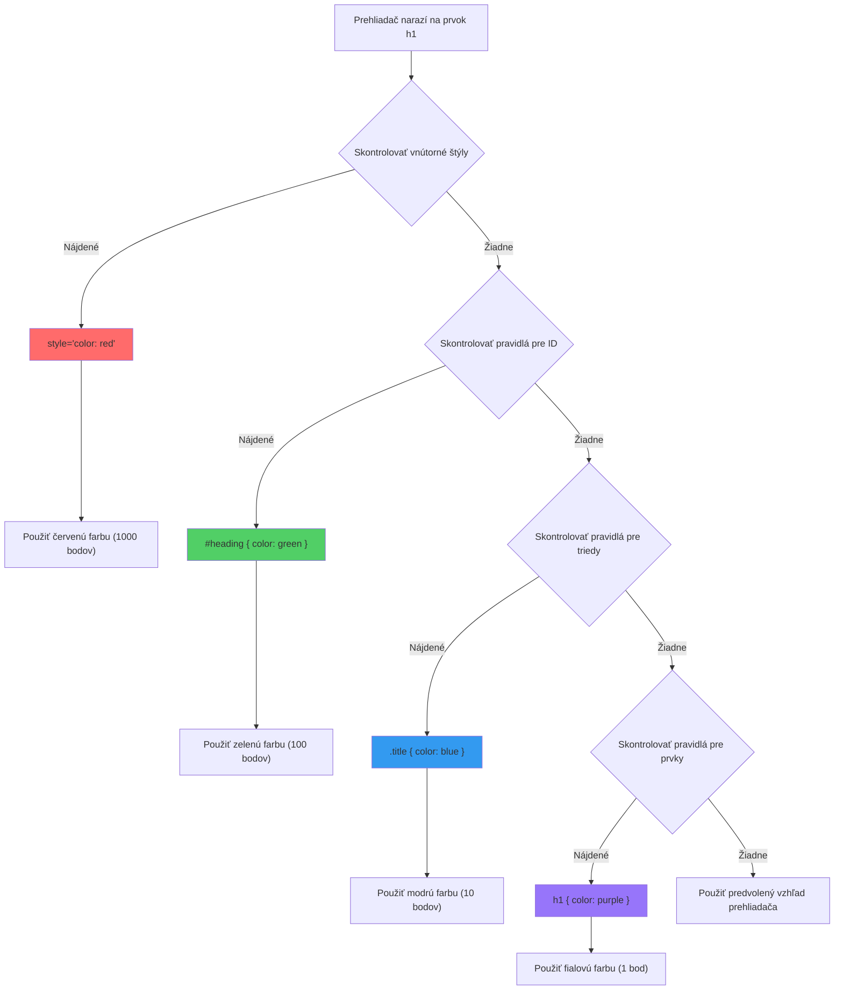
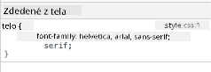
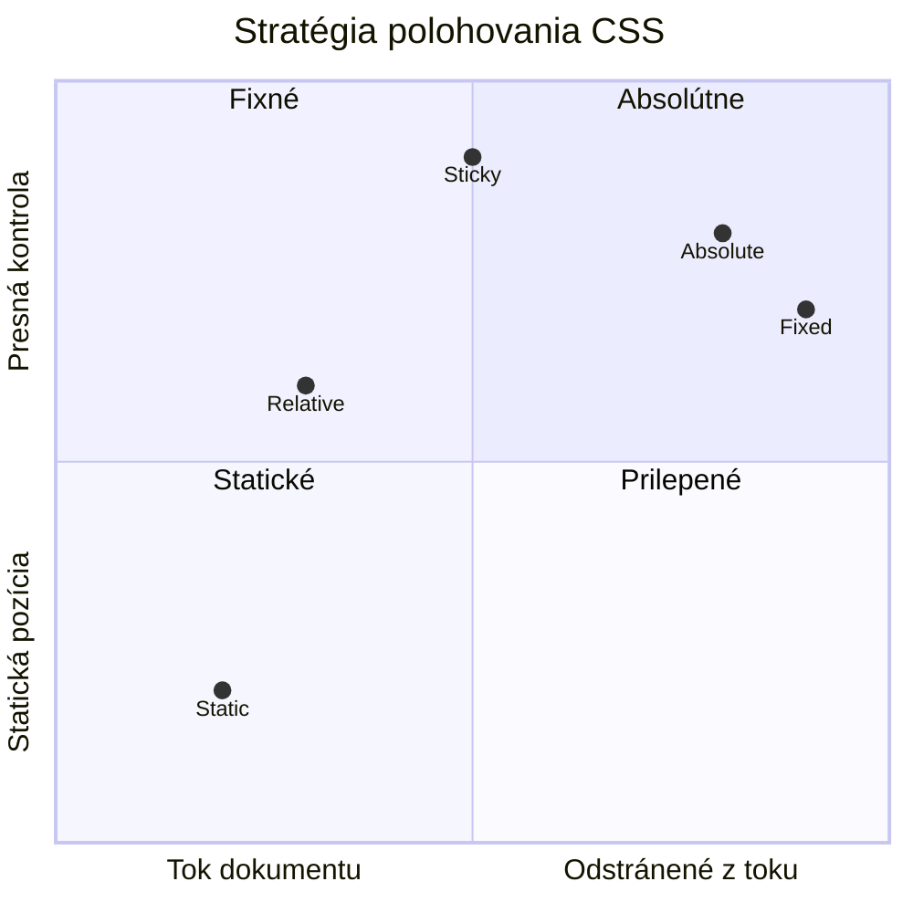
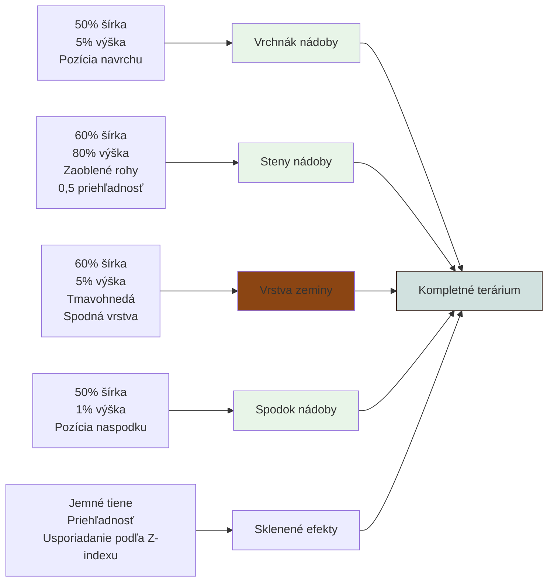
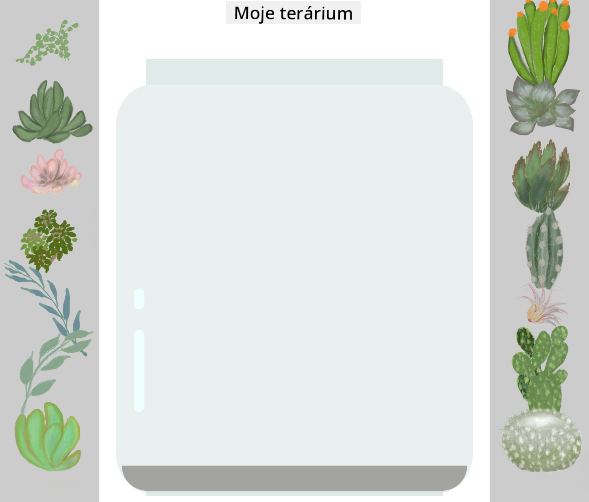
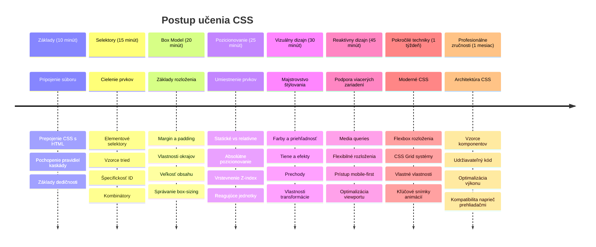

<!--
CO_OP_TRANSLATOR_METADATA:
{
  "original_hash": "e39f3a4e3bcccf94639e3af1248f8a4d",
  "translation_date": "2026-01-07T05:10:01+00:00",
  "source_file": "3-terrarium/2-intro-to-css/README.md",
  "language_code": "sk"
}
-->
# Terrarium Project Časť 2: Úvod do CSS



> Sketchnote od [Tomomi Imura](https://twitter.com/girlie_mac)

Pamätáš si, ako tvoje HTML terárium vyzeralo celkom jednoducho? CSS je miesto, kde túto základnú štruktúru premeníme na niečo vizuálne príťažlivé.

Ak je HTML ako stavba rámu domu, tak CSS je všetko, čo robí, že dom pôsobí ako domov – farby na stene, usporiadanie nábytku, osvetlenie a tok miestností. Predstav si, ako sa z poľovníckej chaty stal Palác vo Versailles, ale dôkladná pozornosť dekoráciám a usporiadaniu ho premenila na jednu z najúžasnejších budov na svete.

Dnes premeníme tvoje terárium z funkčného na vycibrené. Naučíš sa, ako presne umiestniť prvky, ako reagovať na rôzne veľkosti obrazoviek a vytvoriť vizuálnu príťažlivosť, ktorá robí weby pútavými.

Na konci tejto lekcie uvidíš, ako strategické CSS štýlovanie môže dramaticky zlepšiť tvoj projekt. Poďme pridať trochu štýlu do tvojho terária.


## Prednáškový kvíz

[Prednáškový kvíz](https://ff-quizzes.netlify.app/web/quiz/17)

## Začíname s CSS

CSS sa často vníma len ako „urobenie vecí peknými“, ale slúži omnoho širšiemu účelu. CSS je ako režisér filmu – ovládaš nielen vzhľad všetkého, ale aj pohyb, reakciu na interakcie a prispôsobenie sa rôznym situáciám.

Moderné CSS je neuveriteľne schopné. Môžeš písať kód, ktorý automaticky upraví rozloženie pre telefóny, tablety a stolné počítače. Môžeš vytvárať hladké animácie, ktoré vedú pozornosť používateľov tam, kde je treba. Výsledky môžu byť veľmi pôsobivé, keď všetko spolu funguje.

> 💡 **Pro Tip**: CSS sa neustále vyvíja so stále novými funkciami a možnosťami. Vždy si overuj podporu prehliadačov pre nové CSS vlastnosti na [CanIUse.com](https://caniuse.com) pred ich použitím v produkčných projektoch.

**Toto dosiahneme v tejto lekcii:**
- **Vytvoríme** kompletný vizuálny dizajn terária pomocou moderných CSS techník
- **Preskúmame** základné koncepty ako kaskáda, dedičnosť a CSS selektory
- **Implementujeme** responzívne umiestňovanie a stratégie rozloženia
- **Postavíme** kontajner terária použitím CSS tvarov a štýlovania

### Predpoklad

Mal by si mať dokončenú HTML štruktúru tvojho terária z predchádzajúcej lekcie, pripravenú na štýlovanie.

> 📺 **Videonávod**: Pozri si tento užitočný video prechod
>
> [](https://www.youtube.com/watch?v=6yIdOIV9p1I)

### Nastavenie súboru CSS

Predtým, než začneme so štýlovaním, musíme prepojiť CSS s naším HTML. Toto prepojenie povie prehliadaču, kde nájsť inštrukcie pre štýlovanie nášho terária.

V priečinku terária vytvor nový súbor s názvom `style.css` a potom ho prepoj v sekcii `<head>` HTML dokumentu:

```html
<link rel="stylesheet" href="./style.css" />
```

**Tento kód robí:**
- **Vytvára** prepojenie medzi HTML a CSS súbormi
- **Povie** prehliadaču, aby načítal a aplikoval štýly zo súboru `style.css`
- **Používa** atribút `rel="stylesheet"` pre špecifikáciu, že ide o CSS súbor
- **Odkazuje** na cestu súboru cez `href="./style.css"`

## Pochopenie CSS kaskády

Niekedy si sa zamýšľal, prečo sa CSS volá „kaskádové štýly“? Štýly padajú ako vodopád a niekedy sa navzájom prekrývajú.

Predstav si vojenskú štruktúru velenia – generálny rozkaz môže znieť „všetci vojaci majú nosiť zelenú“, ale konkrétny rozkaz pre tvoju jednotku povie „na ceremónii noste modrú uniformu“. Platí konkrétnejší príkaz. CSS nasleduje podobnú logiku a jej pochopenie uľahčuje ladenie.

### Experimentovanie s prioritou kaskády

Pozrime sa na kaskádu v praxi vytvorením konfliktu štýlov. Najprv pridaj inline štýl do svojho tagu `<h1>`:

```html
<h1 style="color: red">My Terrarium</h1>
```

**Čo tento kód robí:**
- **Aplikuje** priamo červenú farbu na element `<h1>` pomocou inline štýlu
- **Používa** atribút `style`, ktorý vkladá CSS priamo do HTML
- **Vytvára** najvyššiu prioritu štýlu pre tento konkrétny element

Potom pridaj toto pravidlo do súboru `style.css`:

```css
h1 {
  color: blue;
}
```

**V tomto sme:**
- **Definovali** CSS pravidlo, ktoré cieli na všetky elementy `<h1>`
- **Nastavili** farbu textu na modrú cez externý stylesheet
- **Vytvorili** pravidlo s nižšou prioritou v porovnaní s inline štýlmi

✅ **Kontrola znalostí**: Ktorá farba sa zobrazí v tvojom webe? Prečo táto farba vyhráva? Vieš si predstaviť situácie, kedy by si chcel štýly prepísať?


> 💡 **Poradie CSS priorít (od najvyššej po najnižšiu):**
> 1. **Inline štýly** (atribút style)
> 2. **ID selektory** (#myId)
> 3. **Triedy** (.myClass) a atribúty
> 4. **Element selektory** (h1, div, p)
> 5. **Predvolené hodnoty prehliadača**

## CSS dedičnosť v praxi

CSS dedičnosť funguje ako genetika – elementy zdedia určité vlastnosti od svojich rodičovských elementov. Ak nastavíš písmo pre element `<body>`, všetok text v ňom automaticky používa toto písmo. Podobne ako u Habsburgovcov sa výrazná brada dedila z generácie na generáciu bez potreby špecifikovať ju pre každého jednotlivca.

Nie však všetko sa dedí. Štýly textu ako písmo a farby sa dedia, ale vlastnosti rozloženia ako okraje a rámiky nie. Rovnako ako deti môžu dediť telesné črty, ale nie módne voľby rodičov.

### Pozorovanie dedičnosti písiem

Pozrime sa na dedičnosť v praxi nastavením písma na element `<body>`:

```css
body {
  font-family: 'Segoe UI', Tahoma, Geneva, Verdana, sans-serif;
}
```

**Čo sa tu deje:**
- **Nastavuje** rodinu písma pre celú stránku cez element `<body>`
- **Používa** font stack s náhradnými možnosťami pre lepšiu kompatibilitu s prehliadačmi
- **Aplikuje** moderné systémové písma, ktoré vyzerajú dobre na rôznych operačných systémoch
- **Zabezpečuje**, že všetky podriadene elementy zdedia toto písmo, ak nie je doslovne prepísané

Otvori si nástroje pre vývojárov v prehliadači (F12), prejdí do záložky Elements a pozri si element `<h1>`. Uvidíš, že zdedil rodinu písma z body:



✅ **Čas na experiment**: Skús nastaviť na `<body>` iné dedičné vlastnosti ako `color`, `line-height` alebo `text-align`. Čo sa stane s nadpisom a ďalšími elementmi?

> 📝 **Dedičné vlastnosti zahŕňajú**: `color`, `font-family`, `font-size`, `line-height`, `text-align`, `visibility`
>
> **Nededičné vlastnosti zahŕňajú**: `margin`, `padding`, `border`, `width`, `height`, `position`

### 🔄 **Pedagogická kontrola**
**Pochopenie základov CSS**: Pred prechodom na selektory over, či:
- ✅ Vieš vysvetliť rozdiel medzi kaskádou a dedičnosťou
- ✅ Vieš predpovedať, ktorý štýl vyhrá pri konflikte špecificity
- ✅ Dokážeš identifikovať, ktoré vlastnosti sa dedia od rodičovských elementov
- ✅ Vieš správne prepojiť CSS súbory s HTML

**Rýchly test**: Ak máš tieto štýly, akou farbou bude `<h1>` vo vnútri `<div class="special">`?
```css
div { color: blue; }
.special { color: green; }
h1 { color: red; }
```
*Odpoveď: Červená (element selektor cieli priamo na h1)*

## Ovládanie CSS selektorov

CSS selektory sú spôsob, ako cieliť na konkrétne elementy pre štýlovanie. Fungujú ako presné pokyny – namiesto "ten dom" povieš "ten modrý dom s červenými dverami na Maple Street".

CSS poskytuje rôzne spôsoby, ako byť špecifický, a vybrať správny selektor je ako vybrať vhodný nástroj pre prácu. Niekedy musíš štýlovať všetky dvere v štvrti, inokedy len tie konkrétne.

### Element selektory (tagy)

Element selektory cielia na HTML elementy podľa ich názvu tagu. Sú ideálne na nastavenie základných štýlov, ktoré sa použijú naprieč stránkou:

```css
body {
  font-family: 'Segoe UI', Tahoma, Geneva, Verdana, sans-serif;
  margin: 0;
  padding: 0;
}

h1 {
  color: #3a241d;
  text-align: center;
  font-size: 2.5rem;
  margin-bottom: 1rem;
}
```

**Čo tieto štýly znamenajú:**
- **Nastavujú** konzistentnú typografiu cez celú stránku pomocou selektora `body`
- **Odstraňujú** predvolené okraje a výplne pre lepšiu kontrolu
- **Štýlujú** všetky nadpisy farbou, zarovnaním a medzerami
- **Používajú** jednotky `rem` pre škálovateľnú, prístupnú veľkosť písma

Hoci element selektory skvele poslúžia pre všeobecné štýlovanie, pre štýlovanie individuálnych súčastí ako rastliny v teráriu budeš potrebovať konkrétnejšie selektory.

### ID selektory pre jedinečné elementy

ID selektory používajú symbol `#` a cielia na elementy so špecifickým atribútom `id`. Keďže ID musí byť unikátne na stránke, sú ideálne na štýlovanie jednotlivých špeciálnych prvkov, ako sú naše bočné kontajnery na rastliny.

Vytvorme štýly pre bočné kontajnery terária, kde budú rastliny:

```css
#left-container {
  background-color: #f5f5f5;
  width: 15%;
  left: 0;
  top: 0;
  position: absolute;
  height: 100vh;
  padding: 1rem;
  box-sizing: border-box;
}

#right-container {
  background-color: #f5f5f5;
  width: 15%;
  right: 0;
  top: 0;
  position: absolute;
  height: 100vh;
  padding: 1rem;
  box-sizing: border-box;
}
```

**Čo tento kód robí:**
- **Umiestňuje** kontajnery na úplné ľavé a pravé okraje pomocou `absolute` pozicionovania
- **Používa** jednotky `vh` (viewport height) pre responzívnu výšku, ktorá sa prispôsobuje veľkosti obrazovky
- **Aplikuje** `box-sizing: border-box`, aby sa padding započítaval do celkovej šírky
- **Odstraňuje** nepotrebné jednotky `px` pri nulových hodnotách pre čistejší kód
- **Nastavuje** jemné pozadie, ktoré je príjemnejšie na oči než ostrá sivá

✅ **Výzva na kvalitu kódu**: Všimni si, že toto CSS porušuje princíp DRY (Don't Repeat Yourself). Vieš ho refaktorovať pomocou ID aj triedy?

**Lepší prístup:**
```html
<div id="left-container" class="container"></div>
<div id="right-container" class="container"></div>
```

```css
.container {
  background-color: #f5f5f5;
  width: 15%;
  top: 0;
  position: absolute;
  height: 100vh;
  padding: 1rem;
  box-sizing: border-box;
}

#left-container {
  left: 0;
}

#right-container {
  right: 0;
}
```

### Triedové selektory pre znovupoužiteľné štýly

Triedové selektory používajú symbol `.` a sú vhodné, keď chceš rovnaké štýly aplikovať na viaceré elementy. Na rozdiel od ID sa triedy môžu používať viackrát v HTML, čo ich robí ideálnymi pre konzistentné štýly.

V našom teráriu každá rastlina potrebuje podobné štýly, ale aj individuálne umiestnenie. Použijeme kombináciu tried pre spoločné štýly a ID pre jedinečné pozície.

**Tu je HTML štruktúra pre každú rastlinu:**
```html
<div class="plant-holder">
  
</div>
```

**Vysvetlenie kľúčových prvkov:**
- **Používa** `class="plant-holder"` pre konzistentné štýlovanie kontajnerov všetkých rastlín
- **Aplikuje** `class="plant"` pre spoločné štýly obrázkov a správanie
- **Zahŕňa** jedinečné `id="plant1"` pre individuálne pozicionovanie a interakciu s JavaScriptom
- **Poskytuje** popisný alt text pre prístupnosť v čítačkách obrazovky

Teraz pridaj tieto štýly do súboru `style.css`:

```css
.plant-holder {
  position: relative;
  height: 13%;
  left: -0.6rem;
}

.plant {
  position: absolute;
  max-width: 150%;
  max-height: 150%;
  z-index: 2;
  transition: transform 0.3s ease;
}

.plant:hover {
  transform: scale(1.05);
}
```

**Rozbor týchto štýlov:**
- **Vytvára** relatívne pozicionovanie pre držiak rastliny, ktorý slúži ako kontext pre pozicionovanie
- **Nastavuje** výšku držiaka na 13 %, aby sa všetky rastliny zmestili vertikálne bez posúvania
- **Posúva** držáky mierne doľava pre lepšie centrovanie rastlín v kontajneroch
- **Umožňuje** rastlinám škálovať sa responzívne pomocou `max-width` a `max-height`
- **Používa** `z-index` pre vrstvenie rastlín nad ostatnými prvkami terária
- **Pridáva** jemný efekt pri najetí myšou pomocou CSS prechodov

✅ **Kritické myslenie**: Prečo potrebujeme obidva selektory `.plant-holder` a `.plant`? Čo by sa stalo, keby sme použili len jeden?

> 💡 **Dizajnový vzor**: Kontajner (`.plant-holder`) ovláda rozloženie a pozicionovanie, zatiaľ čo obsah (`.plant`) riadi vzhľad a škálovanie. Toto oddelenie robí kód udržateľnejším a flexibilnejjším.

## Pochopenie CSS pozicionovania

CSS pozicionovanie je ako režisér divadelnej hry – riadiš, kde každý herec stojí a ako sa pohybuje po pódiu. Niektorí herci nasledujú štandardné usporiadanie, iní vyžadujú špecifické pozície pre dramatický efekt.

Keď pochopíš pozicionovanie, veľa problémov s rozložením sa stane zvládnuteľnými. Potrebuješ navigačný panel, ktorý zostáva navrchu, keď používateľ scrolluje? Pozicionovanie to vyrieši. Chceš tooltip, ktorý sa objaví na konkrétnom mieste? To je tiež pozicionovanie.

### Päť hodnôt pozície


| Hodnota pozície | Správanie | Použitie |
|----------------|----------|----------|
| `static` | Predvolený tok, ignoruje top/left/right/bottom | Normálne rozloženie dokumentu |
| `relative` | Pozicované relatívne k svojmu normálnemu miestu | Malé úpravy, vytváranie kontextu pozície |
| `absolute` | Pozicované voči najbližšiemu rodičovi s pozíciou | Presné umiestnenie, prekrytia |
| `fixed` | Pozicované voči zobrazeniu obrazovky | Navigačné panely, plávajúce prvky |
| `sticky` | Prepína medzi relative a fixed podľa scrollovania | Hlavičky, ktoré zostávajú pri scrollovaní |

### Pozicionovanie v našom teráriu

Naše terárium používa strategickú kombináciu typov pozícií na vytvorenie požadovaného rozloženia:

```css
/* Container positioning */
.container {
  position: absolute; /* Removes from normal flow */
  /* ... other styles ... */
}

/* Plant holder positioning */
.plant-holder {
  position: relative; /* Creates positioning context */
  /* ... other styles ... */
}

/* Plant positioning */
.plant {
  position: absolute; /* Allows precise placement within holder */
  /* ... other styles ... */
}
```

**Porozumenie stratégii pozicionovania:**
- **Absolútne kontajnery** sú vyňaté z normálneho toku dokumentu a pripnuté na okraje obrazovky
- **Relatívne držiaky rastlín** vytvárajú kontext pozicionovania a zároveň zostávajú v toku dokumentu
- **Absolútne rastliny** môžu byť presne umiestnené vo svojich relatívnych kontajneroch
- **Táto kombinácia** umožňuje rastlinám vrstviť sa vertikálne a zároveň ich individálne pozicovať

> 🎯 **Prečo je to dôležité**: Elementy rastlín potrebujú absolútne pozicionovanie, aby sa dali presúvať v ďalšej lekcii. Absolútne pozicionovanie ich vyberá z normálneho toku rozloženia, čo umožňuje drag-and-drop interakcie.

✅ **Čas na experiment**: Skús zmeniť hodnoty pozícií a pozoruj výsledky:
- Čo sa stane, ak zmeníš `.container` z `absolute` na `relative`?
- Ako sa zmení rozloženie, ak `.plant-holder` používa `absolute` namiesto `relative`?
- Čo sa stane, keď zmeníte umiestnenie `.plant` na `relative`?

### 🔄 **Pedagogická kontrola**
**Mistrovstvo v CSS pozicionovaní**: Zastavte sa a overte si svoje porozumenie:
- ✅ Viete vysvetliť, prečo rastliny potrebujú absolútne pozicionovanie pre drag-and-drop?
- ✅ Rozumiete, ako relatívne kontajnery vytvárajú kontext pozicionovania?
- ✅ Prečo používajú bočné kontajnery absolútne pozicionovanie?
- ✅ Čo by sa stalo, keby ste úplne odstránili deklarácie pozície?

**Spojenie so skutočným svetom**: Premýšľajte o tom, ako CSS pozicionovanie odráža skutočné rozloženie:
- **Static**: Knihy na poličke (prirodzený poriadok)
- **Relative**: Posun knihy mierne, ale zachovať jej miesto
- **Absolute**: Umiestniť záložku na presné číslo stránky
- **Fixed**: Lepiaci papierik, ktorý zostáva viditeľný pri prepínaní strán

## Stavba terária s CSS

Teraz vytvoríme sklenenú nádobu len pomocou CSS - bez obrázkov alebo grafického softvéru.

Vytváranie realisticky vyzerajúceho skla, tieňov a hĺbkových efektov pomocou pozicionovania a priehľadnosti demonštruje vizuálne možnosti CSS. Táto technika imituje, ako architekti v hnutí Bauhaus používali jednoduché geometrické tvary na vytvorenie komplexných, krásnych štruktúr. Ak pochopíte tieto princípy, spoznáte CSS techniky použitá v mnohých webových dizajnoch.


### Vytváranie komponentov sklenenej nádoby

Postavme terárium kúsok po kúsku. Každá časť používa absolútne pozicionovanie a veľkosti založené na percentách pre responzívny dizajn:

```css
.jar-walls {
  height: 80%;
  width: 60%;
  background: #d1e1df;
  border-radius: 1rem;
  position: absolute;
  bottom: 0.5%;
  left: 20%;
  opacity: 0.5;
  z-index: 1;
  box-shadow: inset 0 0 2rem rgba(0, 0, 0, 0.1);
}

.jar-top {
  width: 50%;
  height: 5%;
  background: #d1e1df;
  position: absolute;
  bottom: 80.5%;
  left: 25%;
  opacity: 0.7;
  z-index: 1;
  border-radius: 0.5rem 0.5rem 0 0;
}

.jar-bottom {
  width: 50%;
  height: 1%;
  background: #d1e1df;
  position: absolute;
  bottom: 0;
  left: 25%;
  opacity: 0.7;
  border-radius: 0 0 0.5rem 0.5rem;
}

.dirt {
  width: 60%;
  height: 5%;
  background: #3a241d;
  position: absolute;
  border-radius: 0 0 1rem 1rem;
  bottom: 1%;
  left: 20%;
  opacity: 0.7;
  z-index: -1;
}
```

**Pochopenie konštrukcie terária:**
- **Používa** rozmery založené na percentách pre responzívne škálovanie na všetkých typoch obrazoviek
- **Pozicionuje** elementy absolútne na presné zarovnanie a vrstvenie
- **Aplikuje** rôzne hodnoty priehľadnosti pre efekt skla
- **Implementuje** vrstvenie cez `z-index` tak, aby rastliny boli vo vnútri nádoby
- **Pridáva** jemný tieň a zaoblené rohy pre realistickejší vzhľad

### Responzívny dizajn pomocou percent

Všimnite si, že všetky rozmery používajú percentá namiesto pevných pixelov:

**Prečo je to dôležité:**
- **Zaisťuje**, že terárium sa pomerne škáluje na akejkoľvek veľkosti obrazovky
- **Udržiava** vzťahy medzi komponentmi nádoby vizuálne konzistentné
- **Poskytuje** konzistentný zážitok od mobilov po veľké monitory
- **Umožňuje** dizajnu adaptovať sa bez narušenia vzhľadu

### Jednotky CSS v praxi

Používame jednotky `rem` pre zaoblenie rohov, ktoré sú relatívne k veľkosti písma koreňového elementu. To vytvára prístupnejšie dizajny rešpektujúce používateľské nastavenia písma. Viac o [relatívnych CSS jednotkách](https://www.w3.org/TR/css-values-3/#font-relative-lengths) v oficiálnej špecifikácii.

✅ **Vizualna experimentácia**: Skúste zmeniť tieto hodnoty a pozorujte efekty:
- Zmeňte priehľadnosť nádoby z 0.5 na 0.8 – ako to ovplyvní vzhľad skla?
- Upraviť farbu pôdy z `#3a241d` na `#8B4513` – aký vizuálny dopad to má?
- Zmeniť `z-index` pôdy na 2 – čo sa stane s vrstvením?

### 🔄 **Pedagogická kontrola**
**Porozumenie vizuálnemu CSS dizajnu**: Overte si svoje znalosti o vizuálnom CSS:
- ✅ Ako percentuálne rozmery vytvárajú responzívny dizajn?
- ✅ Prečo priehľadnosť vytvára efekt sklenenej transparentnosti?
- ✅ Akú úlohu zohráva z-index pri vrstvení elementov?
- ✅ Ako hodnoty border-radius tvoria tvar nádoby?

**Dizajnový princíp**: Všimnite si, ako budujeme zložité vizuály zo základných tvarov:
1. **Obdĺžniky** → **Zaoblené obdĺžniky** → **Komponenty nádoby**
2. **Ploché farby** → **Priehľadnosť** → **Efekt skla**
3. **Jednotlivé elementy** → **Vrstvená kompozícia** → **3D vzhľad**

---

## Výzva GitHub Copilot Agenta 🚀

Použite režim Agenta na splnenie nasledujúcej výzvy:

**Popis:** Vytvorte CSS animáciu, ktorá jemne kýva rastlinami v teráriu tam a späť, simulujúc prirodzený vánok. Pomôže vám to precvičiť CSS animácie, transformácie a kľúčové snímky a zároveň zvýši vizuálnu príťažlivosť terária.

**Zadanie:** Pridajte CSS keyframe animácie tak, aby rastliny v teráriu jemne kývali z jednej na druhú stranu. Vytvorte kývavú animáciu, ktorá rotuje každú rastlinu mierne (2-3 stupne) doľava a doprava s trvaním 3-4 sekundy, a aplikujte ju na triedu `.plant`. Animácia by mala bežať nekonečne a mať easing funkciu pre prirodzený pohyb.

Viac o [režime agenta](https://code.visualstudio.com/blogs/2025/02/24/introducing-copilot-agent-mode) sa dozviete tu.

## 🚀 Výzva: Pridanie odrazov na skle

Ste pripravení vylepšiť svoj terárium realistickými odrazmi skla? Táto technika pridá hĺbku a realizmus dizajnu.

Vytvoríte jemné svetlé zvýraznenia, ktoré simulujú, ako sa svetlo odráža od sklenených plôch. Tento prístup je podobný tomu, ako renesanční maliari ako Jan van Eyck používali svetlo a odraz na vytvorenie trojrozmerného dojmu maľovaného skla. Tu je cieľ:



**Vaša výzva:**
- **Vytvorte** jemné biele alebo svetlé oválne tvary pre odrazy skla
- **Umiestnite** ich strategicky na ľavý bok nádoby
- **Aplikujte** vhodnú priehľadnosť a rozostrenie pre realistický odraz svetla
- **Použite** `border-radius` na vytvorenie organických, bublinových tvarov
- **Experimentujte** s gradientmi alebo tieňmi pre lepší realizmus

## Kvíz po prednáške

[Kvíz po prednáške](https://ff-quizzes.netlify.app/web/quiz/18)

## Rozšírte svoje znalosti CSS

CSS môže spočiatku pôsobiť zložito, ale pochopenie týchto základných konceptov poskytuje pevný základ pre pokročilejšie techniky.

**Vaše ďalšie oblasti učenia:**
- **Flexbox** - zjednodušuje zarovnanie a rozloženie elementov
- **CSS Grid** - poskytuje mocné nástroje na tvorbu komplexných rozložení
- **CSS premenné** - znižujú opakovanie a zlepšujú udržiavateľnosť
- **Responzívny dizajn** - zaistí, že stránky fungujú na rôznych veľkostiach obrazoviek

### Interaktívne učebné zdroje

Precvičujte tieto koncepty zábavnou formou:
- 🐸 [Flexbox Froggy](https://flexboxfroggy.com/) - Ovládnite Flexbox pomocou zábavných výziev
- 🌱 [Grid Garden](https://codepip.com/games/grid-garden/) - Naučte sa CSS Grid pestovaním virtuálnych mrkiev
- 🎯 [CSS Battle](https://cssbattle.dev/) - Otestujte svoje CSS schopnosti v programovacích výzvach

### Ďalšie učenie

Pre komplexné základy CSS dokončite tento modul Microsoft Learn: [Štýlujte svoju HTML aplikáciu pomocou CSS](https://docs.microsoft.com/learn/modules/build-simple-website/4-css-basics/?WT.mc_id=academic-77807-sagibbon)

### ⚡ **Čo môžete spraviť v ďalších 5 minútach**
- [ ] Otvorte DevTools a preskúmajte CSS štýly na ľubovoľnej webovej stránke v panely Elements
- [ ] Vytvorte jednoduchý CSS súbor a pripojte ho k HTML stránke
- [ ] Skúste meniť farby rôznymi spôsobmi: hex, RGB a pomenované farby
- [ ] Precvičte model boxu pridaním paddingu a marginu k divu

### 🎯 **Čo môžete dosiahnuť počas tejto hodiny**
- [ ] Dokončiť kvíz po lekcii a zopakovať základy CSS
- [ ] Naštýlovať svoju HTML stránku pomocou fontov, farieb a medzier
- [ ] Vytvoriť jednoduché rozloženie s flexboxom alebo gridom
- [ ] Experimentovať s CSS prechodmi pre plynulé efekty
- [ ] Precvičiť responzívny dizajn s media queries

### 📅 **Vaša týždňová CSS výzva**
- [ ] Dokončiť úlohu štýlovania terária s kreatívnym prístupom
- [ ] Ovládnuť CSS Grid vytvorením layoutu fotogalérie
- [ ] Naučiť sa CSS animácie na oživenie vašich dizajnov
- [ ] Preskúmať CSS preprocessory ako Sass alebo Less
- [ ] Študovať dizajnové princípy a aplikovať ich v CSS
- [ ] Analyzovať a znovu vytvoriť zaujímavé dizajny z internetu

### 🌟 **Vaša mesačná cesta k dizajnovému majstrovstvu**
- [ ] Vybudovať kompletný responzívny systém webdizajnu
- [ ] Naučiť sa CSS-in-JS alebo utility-first frameworky ako Tailwind
- [ ] Prispievať do open source projektov vylepšeniami CSS
- [ ] Ovládnuť pokročilé CSS koncepty ako vlastné vlastnosti a containment
- [ ] Vytvárať znovupoužiteľné knižnice komponentov s modulárnym CSS
- [ ] Mentorovať ďalších študentov CSS a zdieľať dizajnové vedomosti

## 🎯 Vaša časová os majstrovstva CSS


### 🛠️ Zhrnutie vašej CSS súpravy nástrojov

Po dokončení tejto lekcie teraz ovládate:
- **Pochopenie kaskády**: Ako štýly dedia a prekrývajú sa navzájom
- **Majstrovstvo selektorov**: Presné cielenie na elementy, triedy a ID
- **Zručnosti pozicionovania**: Strategické umiestňovanie a vrstvenie elementov
- **Vizuálny dizajn**: Vytváranie sklenených efektov, tieňov a priehľadnosti
- **Responzívne techniky**: Rozloženia založené na percentách, ktoré sa prispôsobujú obrazovke
- **Organizácia kódu**: Čistá a udržiavateľná CSS štruktúra
- **Moderné praktiky**: Používanie relatívnych jednotiek a prístupných dizajnových vzorov

**Ďalšie kroky**: Vaše terárium má teraz štruktúru (HTML) aj štýl (CSS). Záverečná lekcia pridá interaktivitu pomocou JavaScriptu!

## Úloha

[Refaktoring CSS](assignment.md)

---

<!-- CO-OP TRANSLATOR DISCLAIMER START -->
**Zrieknutie sa zodpovednosti**:
Tento dokument bol preložený pomocou AI prekladateľskej služby [Co-op Translator](https://github.com/Azure/co-op-translator). Aj keď sa snažíme o presnosť, majte prosím na pamäti, že automatizované preklady môžu obsahovať chyby alebo nepresnosti. Pôvodný dokument v jeho rodnom jazyku by mal byť považovaný za autoritatívny zdroj. Pre kritické informácie sa odporúča profesionálny ľudský preklad. Za akékoľvek nedorozumenia alebo nesprávne interpretácie vyplývajúce z použitia tohto prekladu nenesieme zodpovednosť.
<!-- CO-OP TRANSLATOR DISCLAIMER END -->