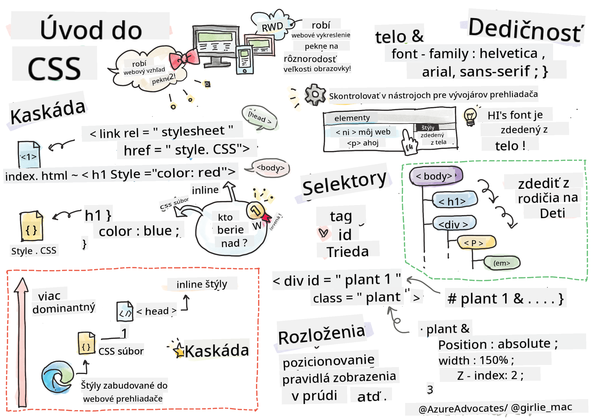

<!--
CO_OP_TRANSLATOR_METADATA:
{
  "original_hash": "e375c2aeb94e2407f2667633d39580bd",
  "translation_date": "2025-08-27T22:47:29+00:00",
  "source_file": "3-terrarium/2-intro-to-css/README.md",
  "language_code": "sk"
}
-->
# Projekt Terrárium, časť 2: Úvod do CSS


> Sketchnote od [Tomomi Imura](https://twitter.com/girlie_mac)

## Kvíz pred prednáškou

[Kvíz pred prednáškou](https://ff-quizzes.netlify.app/web/quiz/17)

### Úvod

CSS, alebo Kaskádové štýly (Cascading Style Sheets), rieši dôležitý problém webového vývoja: ako spraviť váš web pekným. Štýlovanie vašich aplikácií ich robí nielen krajšími, ale aj používateľsky prívetivejšími. CSS môžete použiť aj na vytvorenie responzívneho webového dizajnu (RWD) – vďaka tomu budú vaše aplikácie vyzerať dobre bez ohľadu na veľkosť obrazovky, na ktorej sa zobrazujú. CSS však nie je len o vzhľade; jeho špecifikácia zahŕňa aj animácie a transformácie, ktoré umožňujú sofistikované interakcie vo vašich aplikáciách. CSS pracovná skupina pomáha udržiavať aktuálne špecifikácie CSS; ich prácu môžete sledovať na [stránke World Wide Web Consortium](https://www.w3.org/Style/CSS/members).

> Poznámka: CSS je jazyk, ktorý sa vyvíja, rovnako ako všetko na webe, a nie všetky prehliadače podporujú novšie časti špecifikácie. Vždy si overte svoje implementácie na stránke [CanIUse.com](https://caniuse.com).

V tejto lekcii pridáme štýly do nášho online terrária a naučíme sa viac o niekoľkých konceptoch CSS: kaskáde, dedičnosti, používaní selektorov, pozicionovaní a využití CSS na tvorbu rozložení. Počas tohto procesu navrhneme rozloženie terrária a vytvoríme samotné terrárium.

### Predpoklady

Mali by ste mať pripravený HTML súbor pre vaše terrárium, ktorý je pripravený na štýlovanie.

> Pozrite si video

> 
> [](https://www.youtube.com/watch?v=6yIdOIV9p1I)

### Úloha

V priečinku s vaším terráriom vytvorte nový súbor s názvom `style.css`. Importujte tento súbor do sekcie `<head>`:

```html
<link rel="stylesheet" href="./style.css" />
```

---

## Kaskáda

Kaskádové štýly zahŕňajú myšlienku, že štýly „kaskádujú“, čo znamená, že aplikácia štýlu je riadená jeho prioritou. Štýly nastavené autorom webovej stránky majú prednosť pred tými, ktoré nastaví prehliadač. Štýly nastavené „inline“ majú prednosť pred tými, ktoré sú nastavené v externom štýlovom súbore.

### Úloha

Pridajte inline štýl „color: red“ do vášho `<h1>` tagu:

```HTML
<h1 style="color: red">My Terrarium</h1>
```

Potom pridajte nasledujúci kód do vášho súboru `style.css`:

```CSS
h1 {
 color: blue;
}
```

✅ Ktorá farba sa zobrazí vo vašej webovej aplikácii? Prečo? Dokážete nájsť spôsob, ako prepísať štýly? Kedy by ste to chceli urobiť, alebo prečo nie?

---

## Dedičnosť

Štýly sa dedia od nadradeného štýlu k podriadenému, takže vnorené prvky dedia štýly svojich rodičov.

### Úloha

Nastavte font tela stránky na určitý font a skontrolujte, či vnorený prvok zdedí tento font:

```CSS
body {
	font-family: helvetica, arial, sans-serif;
}
```

Otvorte konzolu prehliadača na karte „Elements“ a pozorujte font H1. Dedia svoj font z tela stránky, ako je uvedené v prehliadači:


✅ Dokážete nastaviť vnorený štýl tak, aby zdedil inú vlastnosť?

---

## Selektory CSS

### Tagy

Doteraz váš súbor `style.css` obsahuje len niekoľko štýlov pre tagy a aplikácia vyzerá dosť zvláštne:

```CSS
body {
	font-family: helvetica, arial, sans-serif;
}

h1 {
	color: #3a241d;
	text-align: center;
}
```

Tento spôsob štýlovania tagu vám dáva kontrolu nad unikátnymi prvkami, ale potrebujete kontrolovať štýly viacerých rastlín vo vašom terráriu. Na to musíte využiť selektory CSS.

### Ids

Pridajte štýl na rozloženie ľavého a pravého kontajnera. Keďže existuje len jeden ľavý a jeden pravý kontajner, v značkovaní im boli priradené id. Na ich štýlovanie použite `#`:

```CSS
#left-container {
	background-color: #eee;
	width: 15%;
	left: 0px;
	top: 0px;
	position: absolute;
	height: 100%;
	padding: 10px;
}

#right-container {
	background-color: #eee;
	width: 15%;
	right: 0px;
	top: 0px;
	position: absolute;
	height: 100%;
	padding: 10px;
}
```

Tu ste umiestnili tieto kontajnery s absolútnym pozicionovaním na krajnú ľavú a pravú stranu obrazovky a použili ste percentá pre ich šírku, aby sa mohli prispôsobiť malým mobilným obrazovkám.

✅ Tento kód je dosť opakujúci sa, teda nie je „DRY“ (Don't Repeat Yourself); dokážete nájsť lepší spôsob, ako štýlovať tieto id, možno pomocou id a triedy? Bude potrebné zmeniť značkovanie a refaktorovať CSS:

```html
<div id="left-container" class="container"></div>
```

### Triedy

V predchádzajúcom príklade ste štýlovali dva unikátne prvky na obrazovke. Ak chcete, aby sa štýly aplikovali na viacero prvkov na obrazovke, môžete použiť triedy CSS. Urobte to pre rozloženie rastlín v ľavom a pravom kontajneri.

Všimnite si, že každá rastlina v HTML značkovaní má kombináciu id a tried. Id sú tu použité JavaScriptom, ktorý pridáte neskôr, na manipuláciu s umiestnením rastlín v terráriu. Triedy však dávajú všetkým rastlinám určitý štýl.

```html
<div class="plant-holder">
	
</div>
```

Pridajte nasledujúci kód do vášho súboru `style.css`:

```CSS
.plant-holder {
	position: relative;
	height: 13%;
	left: -10px;
}

.plant {
	position: absolute;
	max-width: 150%;
	max-height: 150%;
	z-index: 2;
}
```

Pozoruhodné v tomto úryvku je miešanie relatívneho a absolútneho pozicionovania, o ktorom sa budeme baviť v ďalšej časti. Pozrite sa na spôsob, akým sú výšky spracované pomocou percent:

Nastavili ste výšku držiaka rastlín na 13 %, čo je dobré číslo na zabezpečenie toho, aby sa všetky rastliny zobrazili v každom vertikálnom kontajneri bez potreby posúvania.

Držiak rastlín ste posunuli doľava, aby boli rastliny viac vycentrované v ich kontajneri. Obrázky majú veľké množstvo priehľadného pozadia, aby boli ľahšie presúvateľné, takže ich treba posunúť doľava, aby lepšie zapadli na obrazovku.

Potom samotná rastlina dostala maximálnu šírku 150 %. To umožňuje, aby sa zmenšila, keď sa prehliadač zmenší. Skúste zmeniť veľkosť prehliadača; rastliny zostanú vo svojich kontajneroch, ale zmenšia sa, aby sa zmestili.

Pozoruhodné je aj použitie z-indexu, ktorý ovláda relatívnu výšku prvku (takže rastliny sedia na vrchu kontajnera a vyzerajú, akoby boli vo vnútri terrária).

✅ Prečo potrebujete selektor CSS pre držiak rastlín aj pre samotnú rastlinu?

## Pozicionovanie CSS

Miešanie vlastností pozicionovania (existujú statické, relatívne, fixné, absolútne a sticky pozície) môže byť trochu zložité, ale ak sa to urobí správne, poskytuje to dobrú kontrolu nad prvkami na vašich stránkach.

Absolútne pozicionované prvky sú umiestnené vzhľadom na ich najbližších pozicionovaných predkov, a ak žiadni nie sú, sú umiestnené podľa tela dokumentu.

Relatívne pozicionované prvky sú umiestnené na základe pokynov CSS na úpravu ich umiestnenia od ich pôvodnej pozície.

V našom príklade je `plant-holder` relatívne pozicionovaný prvok, ktorý je umiestnený v absolútne pozicionovanom kontajneri. Výsledné správanie je, že bočné kontajnery sú pripnuté naľavo a napravo, a `plant-holder` je vnorený, prispôsobujúc sa v rámci bočných kontajnerov, čím vytvára priestor na umiestnenie rastlín do vertikálneho radu.

> Samotná `plant` má tiež absolútne pozicionovanie, čo je nevyhnutné na to, aby bola presúvateľná, ako zistíte v ďalšej lekcii.

✅ Experimentujte so zmenou typov pozicionovania bočných kontajnerov a `plant-holder`. Čo sa stane?

## Rozloženia CSS

Teraz použijete to, čo ste sa naučili, na vytvorenie samotného terrária, a to všetko pomocou CSS!

Najprv naštýlujte deti divu `.terrarium` ako zaoblený obdĺžnik pomocou CSS:

```CSS
.jar-walls {
	height: 80%;
	width: 60%;
	background: #d1e1df;
	border-radius: 1rem;
	position: absolute;
	bottom: 0.5%;
	left: 20%;
	opacity: 0.5;
	z-index: 1;
}

.jar-top {
	width: 50%;
	height: 5%;
	background: #d1e1df;
	position: absolute;
	bottom: 80.5%;
	left: 25%;
	opacity: 0.7;
	z-index: 1;
}

.jar-bottom {
	width: 50%;
	height: 1%;
	background: #d1e1df;
	position: absolute;
	bottom: 0%;
	left: 25%;
	opacity: 0.7;
}

.dirt {
	width: 60%;
	height: 5%;
	background: #3a241d;
	position: absolute;
	border-radius: 0 0 1rem 1rem;
	bottom: 1%;
	left: 20%;
	opacity: 0.7;
	z-index: -1;
}
```

Všimnite si použitie percent tu. Ak zmenšíte svoj prehliadač, môžete vidieť, ako sa nádoba tiež prispôsobuje. Tiež si všimnite šírky a výšky v percentách pre prvky nádoby a ako je každý prvok absolútne pozicionovaný v strede, pripnutý na spodok výhľadu.

Používame aj `rem` pre border-radius, čo je dĺžka relatívna k fontu. Prečítajte si viac o tomto type relatívneho merania v [CSS špecifikácii](https://www.w3.org/TR/css-values-3/#font-relative-lengths).

✅ Skúste zmeniť farby nádoby a nepriehľadnosť oproti tým, ktoré má zem. Čo sa stane? Prečo?

---

## 🚀Výzva

Pridajte „bublinkový“ lesk do ľavej dolnej časti nádoby, aby vyzerala viac ako sklo. Budete štýlovať `.jar-glossy-long` a `.jar-glossy-short`, aby vyzerali ako odraz lesku. Takto by to malo vyzerať:


Na dokončenie kvízu po prednáške prejdite tento modul Learn: [Štýlovanie HTML aplikácie pomocou CSS](https://docs.microsoft.com/learn/modules/build-simple-website/4-css-basics/?WT.mc_id=academic-77807-sagibbon)

## Kvíz po prednáške

[Kvíz po prednáške](https://ff-quizzes.netlify.app/web/quiz/18)

## Recenzia a samoštúdium

CSS sa môže zdať klamlivo jednoduché, ale pri snahe dokonale naštýlovať aplikáciu pre všetky prehliadače a všetky veľkosti obrazoviek sa objavujú mnohé výzvy. CSS-Grid a Flexbox sú nástroje, ktoré boli vyvinuté na to, aby túto prácu urobili štruktúrovanejšou a spoľahlivejšou. Naučte sa o týchto nástrojoch hraním hier [Flexbox Froggy](https://flexboxfroggy.com/) a [Grid Garden](https://codepip.com/games/grid-garden/).

## Zadanie

[Refaktorovanie CSS](assignment.md)

---

**Upozornenie**:  
Tento dokument bol preložený pomocou služby AI prekladu [Co-op Translator](https://github.com/Azure/co-op-translator). Hoci sa snažíme o presnosť, prosím, berte na vedomie, že automatizované preklady môžu obsahovať chyby alebo nepresnosti. Pôvodný dokument v jeho rodnom jazyku by mal byť považovaný za autoritatívny zdroj. Pre kritické informácie sa odporúča profesionálny ľudský preklad. Nenesieme zodpovednosť za akékoľvek nedorozumenia alebo nesprávne interpretácie vyplývajúce z použitia tohto prekladu.