# Projekt Terrárium Časť 3: Manipulácia s DOM a JavaScriptové Closures

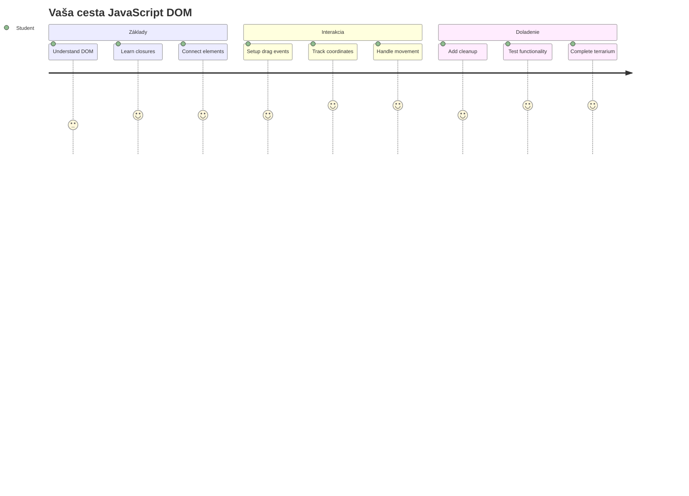
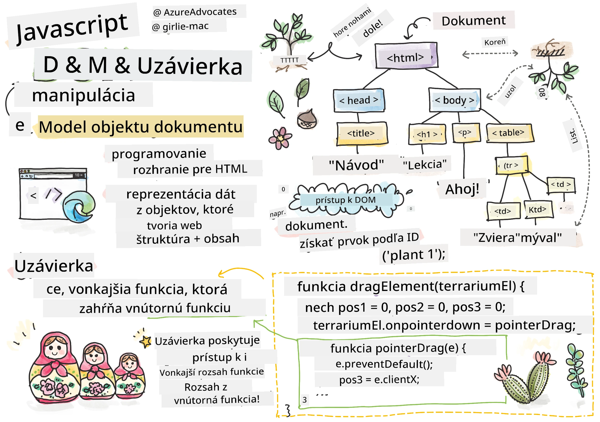
> Sketchnote od [Tomomi Imura](https://twitter.com/girlie_mac)

Vitajte v jednej z najpútavejších oblastí webového vývoja – robíme veci interaktívnymi! Document Object Model (DOM) je ako most medzi vaším HTML a JavaScriptom, a dnes ho použijeme na oživenie vášho terrária. Keď Tim Berners-Lee vytvoril prvý webový prehliadač, predstavoval si web, kde môžu byť dokumenty dynamické a interaktívne – DOM túto víziu umožňuje.

Preskúmame aj JavaScriptové closures, ktoré môžu znieť najprv zastrašujúco. Myslite na closures ako na vytváranie "pamäťových vreckárov", kde vaše funkcie môžu pamätať dôležité informácie. Je to ako keby každá rastlina v terráriu mala vlastný dátový záznam na sledovanie svojej pozície. Na konci tejto lekcie pochopíte, ako sú prirodzené a užitočné.

Tu je to, čo budeme stavať: terrárium, kde používatelia môžu ťahať a pustiť rastliny kamkoľvek chcú. Naučíte sa techniky manipulácie s DOM, ktoré poháňajú všetko od drag-and-drop nahrávania súborov až po interaktívne hry. Poďme oživiť vaše terrárium.

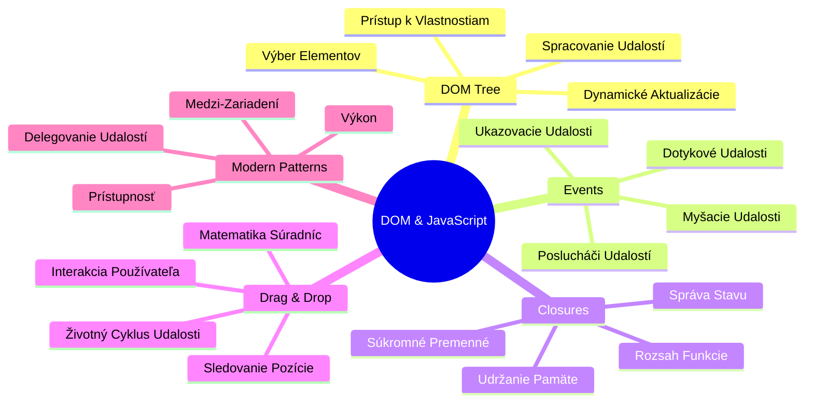
## Prednáškový kvíz

[Prednáškový kvíz](https://ff-quizzes.netlify.app/web/quiz/19)

## Pochopenie DOM: Vstupná brána k interaktívnym webovým stránkam

Document Object Model (DOM) je spôsob, akým JavaScript komunikuje s vašimi HTML prvkami. Keď váš prehliadač načíta HTML stránku, vytvorí štruktúrovanú reprezentáciu tejto stránky v pamäti – to je DOM. Predstavte si to ako rodokmeň, kde každý HTML prvok je člen rodiny, ku ktorému má JavaScript prístup, môže ho meniť alebo prestavovať.

Manipulácia s DOM premieňa statické stránky na interaktívne webové stránky. Kedykoľvek vidíte tlačidlo meniť farbu po najetí myšou, obsah sa aktualizuje bez obnovenia stránky alebo prvky, ktoré môžete presúvať, je to práca manipulácie s DOM.

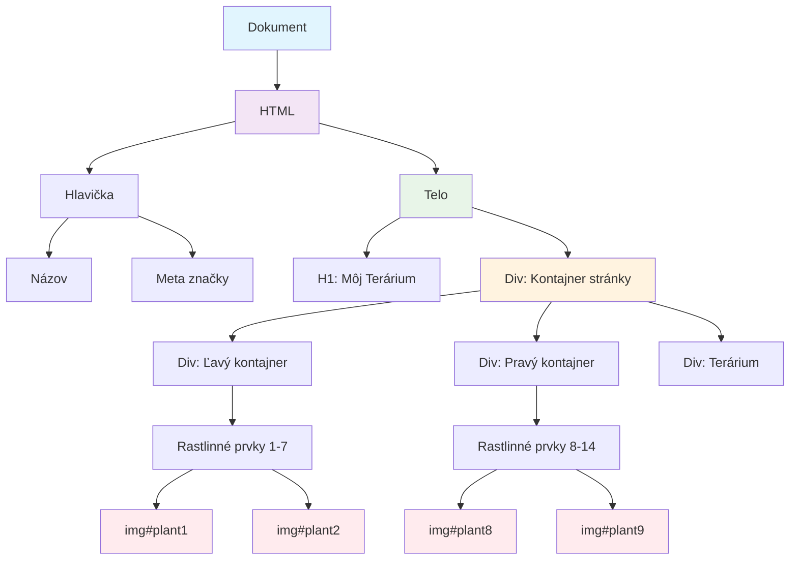
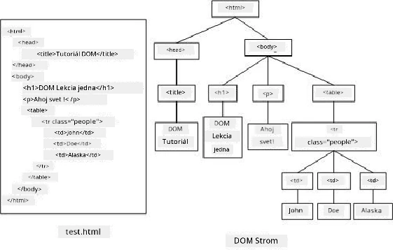

> Reprezentácia DOM a HTML značkovania, ktoré naň odkazuje. Od [Olfa Nasraoui](https://www.researchgate.net/publication/221417012_Profile-Based_Focused_Crawler_for_Social_Media-Sharing_Websites)

**Čo robí DOM silným:**
- **Poskytuje** štruktúrovaný spôsob prístupu ku akémukoľvek prvku na vašej stránke
- **Umožňuje** dynamické aktualizácie obsahu bez obnovenia stránky
- **Dovoľuje** reagovať v reálnom čase na interakcie používateľa, ako sú kliknutia a ťahanie
- **Vytvára** základ pre moderné interaktívne webové aplikácie

## JavaScriptové Closures: Vytváranie organizovaného a silného kódu

[JavaScriptové closure](https://developer.mozilla.org/docs/Web/JavaScript/Closures) sú ako dať funkcii jej vlastný súkromný pracovný priestor s trvalou pamäťou. Zamyslite sa, ako Darwinove vrabce na Galapágach vyvinuli špecializované zobáky podľa svojho prostredia – closures fungujú podobne, vytvárajú špecializované funkcie, ktoré si "pamätajú" svoj konkrétny kontext aj po tom, ako rodičovská funkcia skončila.

V našom terráriu closures pomáhajú každej rastline zapamätať si svoju pozíciu nezávisle. Tento vzor sa objavuje v profesionálnom JavaScripte, takže je to cenný koncept na pochopenie.

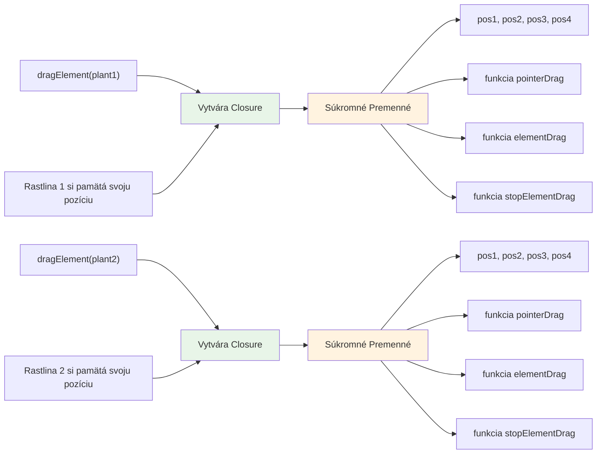
> 💡 **Pochopenie Closures**: Closures sú významnou témou v JavaScripte a mnoho vývojárov ich používa roky, než úplne pochopia všetky teoretické aspekty. Dnes sa zameriame na praktickú aplikáciu – closures prirodzene uvidíte vzniknúť počas budovania našich interaktívnych funkcií. Pochopenie sa vyvinie, ako uvidíte, ako riešia skutočné problémy.


> Reprezentácia DOM a HTML značkovania, ktoré naň odkazuje. Od [Olfa Nasraoui](https://www.researchgate.net/publication/221417012_Profile-Based_Focused_Crawler_for_Social_Media-Sharing_Websites)

V tejto lekcii dokončíme náš interaktívny projekt terrária vytvorením JavaScriptu, ktorý umožní používateľovi manipulovať s rastlinami na stránke.

## Pred začiatkom: Príprava na úspech

Budete potrebovať svoje HTML a CSS súbory z predchádzajúcich lekcií o terráriu – chystáme sa urobiť ten statický dizajn interaktívnym. Ak sa pripájate prvýkrát, najprv si dokončite tieto lekcie, aby ste získali dôležitý kontext.

Tu je to, čo zhotovíme:
- **Plynulé ťahanie a púšťanie** pre všetky rastliny v terráriu
- **Sledovanie súradníc**, aby rastliny pamätali svoje pozície
- **Kompletné interaktívne rozhranie** využívajúce čistý JavaScript
- **Čistý, usporiadaný kód** pomocou closure vzoru

## Nastavenie JavaScriptového súboru

Vytvorme JavaScriptový súbor, ktorý spraví vaše terrárium interaktívnym.

**Krok 1: Vytvorte svoj script súbor**

Vo vašom adresári terrária vytvorte nový súbor s názvom `script.js`.

**Krok 2: Prepojte JavaScript so svojím HTML**

Pridajte tento značkový tag do sekcie `<head>` vášho súboru `index.html`:

```html
<script src="./script.js" defer></script>
```

**Prečo je dôležitý atribút `defer`:**
- **Zabezpečuje**, že váš JavaScript počká, kým sa načíta celé HTML
- **Zabraňuje** chybám, keď JavaScript hľadá prvky, ktoré ešte nie sú pripravené
- **Zaručuje**, že všetky vaše rastliny sú dostupné na interakciu
- **Poskytuje** lepší výkon ako umiestnenie skriptov na spodok stránky

> ⚠️ **Dôležité upozornenie**: Atribút `defer` zabraňuje bežným časovým problémom. Bez neho môže JavaScript skúsiť pristupovať k HTML prvkom pred ich načítaním, čo spôsobí chyby.

---

## Pripojenie JavaScriptu k vašim HTML prvkom

Skôr než môžeme urobiť prvky ťahateľnými, JavaScript ich musí nájsť v DOM. Predstavte si to ako systém knižničného katalógu – keď máte číslo katalógu, nájdete presne tú knihu, ktorú potrebujete, a máte prístup ku všetkému jej obsahu.

Použijeme metódu `document.getElementById()`, aby sme tieto prepojenia vytvorili. Je to ako mať presný systém archivácie – zadáte ID a nájde presne ten prvok, ktorý potrebujete v HTML.

### Povolenie funkcie ťahania pre všetky rastliny

Pridajte tento kód do súboru `script.js`:

```javascript
// Povoliť pretiahnutie funkcie pre všetky 14 rastlín
dragElement(document.getElementById('plant1'));
dragElement(document.getElementById('plant2'));
dragElement(document.getElementById('plant3'));
dragElement(document.getElementById('plant4'));
dragElement(document.getElementById('plant5'));
dragElement(document.getElementById('plant6'));
dragElement(document.getElementById('plant7'));
dragElement(document.getElementById('plant8'));
dragElement(document.getElementById('plant9'));
dragElement(document.getElementById('plant10'));
dragElement(document.getElementById('plant11'));
dragElement(document.getElementById('plant12'));
dragElement(document.getElementById('plant13'));
dragElement(document.getElementById('plant14'));
```

**Čo tento kód dosahuje:**
- **Nájde** každý prvok rastliny v DOM podľa jeho jedinečného ID
- **Získa** JavaScriptový odkaz na každý HTML prvok
- **Odovzdá** každý prvok funkcii `dragElement` (ktorú si teraz vytvoríme)
- **Pripraví** každú rastlinu na interakciu ťahania a púšťania
- **Prepojí** vašu HTML štruktúru s JavaScriptovou funkcionalitou

> 🎯 **Prečo používať ID namiesto tried?** ID poskytujú jedinečné identifikátory pre konkrétne prvky, zatiaľ čo CSS triedy sú určené na styling skupín prvkov. Keď JavaScript potrebuje manipulovať s jednotlivými prvkami, ID ponúka presnosť a výkon, ktorý potrebujeme.

> 💡 **Tip pre profesionálov**: Všimnite si, ako voláme `dragElement()` pre každú rastlinu samostatne. Tento prístup zaručuje, že každá rastlina dostane svoj vlastný nezávislý ťahací režim, čo je kľúčové pre plynulú interakciu používateľa.

### 🔄 **Pedagogická kontrola**
**Pochopenie pripojenia k DOM**: Predtým, než sa pustíte do ťahania, overte, že viete:
- ✅ Vysvetliť, ako `document.getElementById()` nájde HTML prvky
- ✅ Pochopiť, prečo používame jedinečné ID pre každú rastlinu
- ✅ Opísať účel atribútu `defer` v značkách skriptov
- ✅ Rozpoznať, ako JavaScript a HTML komunikujú cez DOM

**Rýchly seba-test**: Čo by sa stalo, keby mali dva prvky rovnaké ID? Prečo `getElementById()` vráti iba jeden prvok?  
*Odpoveď: ID by mali byť jedinečné; ak sú duplikované, vyberie sa len prvý prvok*

---

## Vytvorenie closure pre funkciu dragElement

Teraz vytvoríme jadro našej ťahacej funkcionality: closure, ktorá riadi správanie ťahania pre každú rastlinu. Táto closure bude obsahovať viac vnútorných funkcií, ktoré spolupracujú na sledovaní pohybov myši a aktualizácii pozícií prvkov.

Closures sú na tento úkol ideálne, pretože umožňujú vytvoriť "súkromné" premenné, ktoré pretrvávajú medzi volaniami funkcie, takže každá rastlina má nezávislý systém sledovania súradníc.

### Pochopenie closures na jednoduchom príklade

Ukážem vám closures na jednoduchom príklade, ktorý ilustruje tento koncept:

```javascript
function createCounter() {
    let count = 0; // Toto je ako súkromná premenná
    
    function increment() {
        count++; // Vnútorná funkcia si pamätá vonkajšiu premennú
        return count;
    }
    
    return increment; // Vraciame vnútornú funkciu
}

const myCounter = createCounter();
console.log(myCounter()); // 1
console.log(myCounter()); // 2
```

**Čo sa deje v tomto vzore closure:**
- **Vytvára** súkromnú premennú `count`, ktorá existuje iba v rámci tejto closure
- **Vnútorná funkcia** má prístup a môže meniť túto vonkajšiu premennú (mechanizmus closure)
- **Keď vraciame** vnútornú funkciu, udržiava svoje prepojenie na tieto súkromné dáta
- **Aj po tom, čo** skončí vykonávanie `createCounter()`, `count` pretrváva a pamätá si svoju hodnotu

### Prečo sú closures ideálne pre funkciu ťahania

Pre naše terrárium musí každá rastlina pamätať svoje aktuálne súradnice pozície. Closures ponúkajú ideálne riešenie:

**Kľúčové výhody pre náš projekt:**
- **Udržiavajú** súkromné premenné pozície pre každú rastlinu nezávisle
- **Zachovávajú** dáta súradníc medzi ťahacími udalosťami
- **Zabraňujú** konfliktom premenných medzi rôznymi ťahateľnými prvkami
- **Vytvárajú** čistú a organizovanú štruktúru kódu

> 🎯 **Učebný cieľ**: Nemusíte teraz ovládať všetky aspekty closures. Zamerajte sa na to, ako nám pomáhajú organizovať kód a udržiavať stav pre našu ťahaciu funkcionalitu.

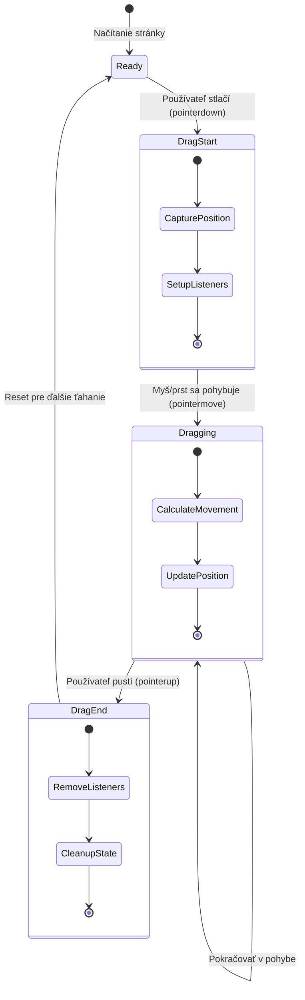
### Vytváranie funkcie dragElement

Teraz postavme hlavnú funkciu, ktorá zvládne celú logiku ťahania. Pridajte túto funkciu pod deklarácie prvkov rastlín:

```javascript
function dragElement(terrariumElement) {
    // Inicializovať premenné na sledovanie pozície
    let pos1 = 0,  // Predchádzajúca pozícia myši na osi X
        pos2 = 0,  // Predchádzajúca pozícia myši na osi Y
        pos3 = 0,  // Aktuálna pozícia myši na osi X
        pos4 = 0;  // Aktuálna pozícia myši na osi Y
    
    // Nastaviť počiatočný poslucháč udalosti ťahania
    terrariumElement.onpointerdown = pointerDrag;
}
```

**Pochopenie systému sledovania pozície:**
- **`pos1` a `pos2`**: Uchovávajú rozdiel medzi starou a novou pozíciou myši
- **`pos3` a `pos4`**: Sledujú aktuálne súradnice myši
- **`terrariumElement`**: Konkrétny prvok rastliny, ktorý robíme ťahateľným
- **`onpointerdown`**: Udalosť, ktorá sa spustí, keď používateľ začne ťahanie

**Ako funguje vzor closure:**
- **Vytvára** súkromné premenné pozície pre každý prvok rastliny
- **Udržiava** tieto premenné počas celej životnosti ťahania
- **Zabezpečuje**, že každá rastlina sleduje svoje súradnice nezávisle
- **Poskytuje** čisté rozhranie cez funkciu `dragElement`

### Prečo použiť pointer udalosti?

Možno vás zaujíma, prečo používame `onpointerdown` namiesto známejšieho `onclick`. Tu je vysvetlenie:

| Typ udalosti | Najlepšie pre | Nevýhoda |
|--------------|---------------|----------|
| `onclick` | Jednoduché kliknutia tlačidla | Nevhodné pre ťahanie (iba kliky a pustenie) |
| `onpointerdown` | Myš aj dotykové ovládanie | Novšie, ale dnes dobre podporované |
| `onmousedown` | Myš na desktopoch | Nezahŕňa mobilných používateľov |

**Prečo sú pointer udalosti ideálne pre našu funkciu ťahania:**
- **Fungujú skvelo** či už používateľ používa myš, prst alebo stylus
- **Cítia sa rovnako** na laptopoch, tabletoch aj telefónoch
- **Zvládajú** samotný ťahací pohyb (nie iba kliknutie a pustenie)
- **Vytvárajú** plynulý zážitok, ktorý používatelia očakávajú od moderných webových aplikácií

> 💡 **Budúca pripravenosť**: Pointer udalosti sú moderný spôsob spracovania používateľských interakcií. Namiesto písania samostatného kódu pre myš a dotyk získate oboje zadarmo. Celkom pekné, že?

### 🔄 **Pedagogická kontrola**
**Pochopenie spracovania udalostí**: Zastavte sa a overte si porozumenie:
- ✅ Prečo používame pointer udalosti namiesto myšových udalostí?
- ✅ Ako pretrvávajú closure premenné medzi volaniami funkcie?
- ✅ Akú úlohu má `preventDefault()` pri plynulom ťahaní?
- ✅ Prečo pripájame poslucháčov na dokument namiesto jednotlivých prvkov?

**Spojenie s reálnym svetom**: Premýšľajte o rozhraniach drag-and-drop, ktoré denne používate:
- **Nahrávanie súborov**: Pretiahnutie súborov do prehliadača
- **Kanban tabuľky**: Presúvanie úloh medzi stĺpcami
- **Galérie obrázkov**: Zmena poradia fotografií
- **Mobilné rozhrania**: Potiahnutie a ťahanie na dotykových obrazovkách

---

## Funkcia pointerDrag: Zachytenie začiatku ťahania

Keď používateľ stlačí rastlinu (či už kliknutím myšou alebo dotykom), funkcia `pointerDrag` sa aktivuje. Táto funkcia zachytáva počiatočné súradnice a nastavuje ťahací systém.

Pridajte túto funkciu do closure `dragElement`, hneď po riadku `terrariumElement.onpointerdown = pointerDrag;`:

```javascript
function pointerDrag(e) {
    // Zabrániť predvolenému správaniu prehliadača (napríklad výber textu)
    e.preventDefault();
    
    // Zachytiť počiatočnú pozíciu myši/touch
    pos3 = e.clientX;  // Súradnica X, kde sa ťahanie začalo
    pos4 = e.clientY;  // Súradnica Y, kde sa ťahanie začalo
    
    // Nastaviť poslucháčov udalostí pre proces ťahania
    document.onpointermove = elementDrag;
    document.onpointerup = stopElementDrag;
}
```

**Krok za krokom, čo sa deje:**
- **Zabraňuje** predvoleným správaniam prehliadača, ktoré by mohli narúšať ťahanie
- **Ukladá** presné súradnice, kde používateľ začal ťahanie
- **Nastavuje** poslucháčov udalostí pre priebežný pohyb ťahania
- **Pripravuje** systém na sledovanie pohybu myši/prsta cez celý dokument

### Pochopenie zabránenia udalostí

Riadok `e.preventDefault()` je kľúčový pre plynulé ťahanie:

**Bez tohto zabránenia môžu prehliadače:**
- **Označovať** text pri ťahaní cez stránku
- **Vyvolať** kontextové menu pri ťahaní pravým tlačidlom
- **Narúšať** naše vlastné správanie pri ťahaní
- **Vytvárať** vizuálne artefakty počas ťahania

> 🔍 **Experiment**: Po dokončení tejto lekcie skúste odstrániť `e.preventDefault()` a sledujte, ako to ovplyvní zážitok z ťahania. Rýchlo pochopíte, prečo je tento riadok nevyhnutný!

### Systém sledovania súradníc

Vlastnosti `e.clientX` a `e.clientY` nám dávajú presné súradnice myši/dotyku:

| Vlastnosť | Čo meria | Použitie |
|-----------|----------|-----------|
| `clientX` | Horizontálna pozícia vzhľadom na viewport | Sledovanie pohybu doľava-doprava |
| `clientY` | Vertikálna pozícia vzhľadom na viewport | Sledovanie pohybu hore-dole |
**Pochopenie týchto súradníc:**
- **Poskytuje** presné umiestnenie v pixeloch
- **Aktualizuje** sa v reálnom čase, keď používateľ pohybuje ukazovateľom
- **Zostáva** konzistentné naprieč rôznymi veľkosťami obrazovky a úrovňami priblíženia
- **Umožňuje** plynulé, citlivé ťahanie

### Nastavenie poslucháčov udalostí na úrovni dokumentu

Všimnite si, ako pripájame udalosti `move` a `stop` na celý `document`, nie len na element rastliny:

```javascript
document.onpointermove = elementDrag;
document.onpointerup = stopElementDrag;
```

**Prečo pripájať na dokument:**
- **Pokračuje** v sledovaní aj keď myš opustí element rastliny
- **Zabraňuje** prerušeniu ťahania, ak používateľ rýchlo pohne myšou
- **Poskytuje** plynulé ťahanie naprieč celou obrazovkou
- **Rieši** okrajové prípady, keď kurzor opustí okno prehliadača

> ⚡ **Poznámka k výkonu**: Po zastavení ťahania tieto poslucháče udalostí na dokumente odstránime, aby sme predišli únikom pamäte a problémom s výkonom.

## Dokončovanie systému ťahania: Pohyb a vyčistenie

Teraz pridáme dve zostávajúce funkcie, ktoré riešia samotný pohyb ťahania a vyčistenie po jeho ukončení. Tieto funkcie spolupracujú na vytvorení plynulého a citlivého pohybu rastlín vo vašom teráriu.

### Funkcia elementDrag: Sledovanie pohybu

Pridajte funkciu `elementDrag` hneď za uzatváraciu zátvorku funkcie `pointerDrag`:

```javascript
function elementDrag(e) {
    // Vypočítajte vzdialenosť, ktorú sa pohli od poslednej udalosti
    pos1 = pos3 - e.clientX;  // Vodorovná vzdialenosť pohybu
    pos2 = pos4 - e.clientY;  // Zvislá vzdialenosť pohybu
    
    // Aktualizujte sledovanie aktuálnej pozície
    pos3 = e.clientX;  // Nová aktuálna pozícia X
    pos4 = e.clientY;  // Nová aktuálna pozícia Y
    
    // Aplikujte pohyb na pozíciu prvku
    terrariumElement.style.top = (terrariumElement.offsetTop - pos2) + 'px';
    terrariumElement.style.left = (terrariumElement.offsetLeft - pos1) + 'px';
}
```

**Pochopenie matematického výpočtu súradníc:**
- **`pos1` a `pos2`**: Vypočítavajú, o koľko sa myš posunula od poslednej aktualizácie
- **`pos3` a `pos4`**: Ukladajú aktuálnu polohu myši pre ďalší výpočet
- **`offsetTop` a `offsetLeft`**: Získavajú aktuálnu pozíciu elementu na stránke
- **Logika odčítania**: Posúva element o rovnakú vzdialenosť, ako sa myš pohla

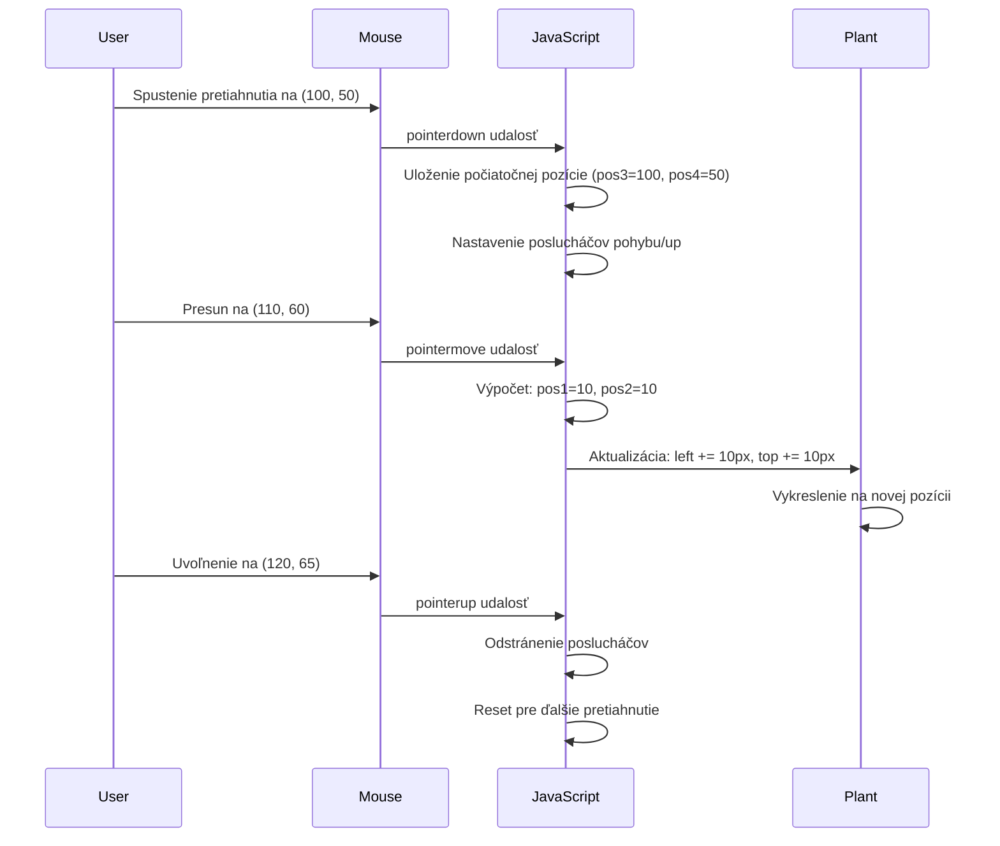
**Rozklad výpočtu pohybu:**
1. **Meria** rozdiel medzi starou a novou polohou myši
2. **Vypočíta** o koľko pohnúť elementom na základe pohybu myši
3. **Aktualizuje** CSS pozíciu elementu v reálnom čase
4. **Ukladá** novú pozíciu ako základ pre ďalší výpočet pohybu

### Vizualizácia matematiky

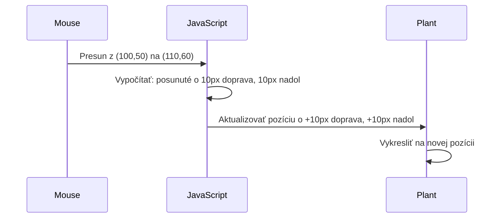
### Funkcia stopElementDrag: Vyčistenie

Pridajte čistiacu funkciu po uzatváracej zátvorke funkcie `elementDrag`:

```javascript
function stopElementDrag() {
    // Odstrániť poslucháčov udalostí na úrovni dokumentu
    document.onpointerup = null;
    document.onpointermove = null;
}
```

**Prečo je vyčistenie nevyhnutné:**
- **Zabraňuje** únikom pamäte spôsobeným ponechanými poslucháčmi udalostí
- **Zastavuje** správanie ťahania, keď používateľ pustí rastlinu
- **Umožňuje** iným elementom byť ťahané nezávisle
- **Resetuje** systém pre ďalšiu operáciu ťahania

**Čo sa stane bez vyčistenia:**
- Poslucháči udalostí bežia aj po skončení ťahania
- Výkon sa zhoršuje, pretože sa hromadia nepoužívaní poslucháči
- Neočakávané správanie pri interakcii s inými elementmi
- Prehliadač plytvá zdrojmi na zbytočné spracovanie udalostí

### Pochopenie CSS vlastností pozície

Náš systém ťahania manipuluje s dvoma kľúčovými CSS vlastnosťami:

| Vlastnosť | Čo riadi | Ako ju používame |
|----------|------------------|---------------|
| `top` | Vzdialenosť od horného okraja | Vertikálne umiestnenie počas ťahania |
| `left` | Vzdialenosť od ľavého okraja | Horizontálne umiestnenie počas ťahania |

**Kľúčové poznatky o offset vlastnostiach:**
- **`offsetTop`**: Aktuálna vzdialenosť od hornej hrany rodiča s pozíciou
- **`offsetLeft`**: Aktuálna vzdialenosť od ľavej hrany rodiča s pozíciou
- **Pozíciný kontext**: Tieto hodnoty sú vzťahované k najbližšiemu rodičovi s pozíciou
- **Aktualizácie v reálnom čase**: Hodnoty sa menia okamžite, keď upravujeme CSS vlastnosti

> 🎯 **Filozofia dizajnu**: Tento systém ťahania je účelovo flexibilný – neexistujú „zóny pre pád“ ani obmedzenia. Používatelia môžu rastliny umiestniť kdekoľvek, čím získavajú úplnú tvorivú kontrolu nad dizajnom svojho terária.

## Spojenie všetkého do celku: Váš kompletný systém ťahania

Gratulujeme! Práve ste vytvorili sofistikovaný systém ťahania pomocou vanilla JavaScriptu. Vaša kompletná funkcia `dragElement` teraz obsahuje silný closure, ktorý spravuje:

**Čo váš closure dosahuje:**
- **Udržiava** súkromné premenné pozície pre každú rastlinu nezávisle
- **Riadi** celý životný cyklus ťahania od začiatku po koniec
- **Poskytuje** plynulý, citlivý pohyb naprieč celým displejom
- **Správne** upratuje zdroje, aby zabránil únikom pamäte
- **Vytvára** intuitívne a kreatívne rozhranie pre dizajn terária

### Testovanie vášho interaktívneho terária

Teraz otestujte svoje interaktívne terárium! Otvorte súbor `index.html` vo webovom prehliadači a vyskúšajte funkčnosť:

1. **Kliknite a podržte** ľubovoľnú rastlinu na začatie ťahania
2. **Pohybujte myšou alebo prstom** a sledujte, ako rastlina plynulo nasleduje
3. **Pusťte** rastlinu na novú pozíciu
4. **Experimentujte** s rôznymi usporiadaniami a preskúmajte rozhranie

🥇 **Úspech**: Vytvorili ste plne interaktívnu webovú aplikáciu založenú na základných princípoch, ktoré profesionálni vývojári denne používajú. Táto funkcia ťahania je založená na princípoch rovnakých, aké sa používajú pri nahrávaní súborov, kanban nástenkách a mnohých ďalších interaktívnych rozhraniach.

### 🔄 **Pedagogická kontrola**
**Kompletné pochopenie systému**: Overte si majstrovstvo celého systému ťahania:
- ✅ Ako closure udržiava nezávislý stav pre každú rastlinu?
- ✅ Prečo je matematika výpočtu súradníc nevyhnutná pre plynulý pohyb?
- ✅ Čo by sa stalo, keby sme zabudli vyčistiť poslucháčov udalostí?
- ✅ Ako tento vzor škáluje do zložitejších interakcií?

**Reflexia kvality kódu**: Prezrite si svoje kompletné riešenie:
- **Modulárny dizajn**: Každá rastlina má vlastnú inštanciu closuru
- **Efektivita udalostí**: Správne nastavenie a vyčistenie poslucháčov
- **Podpora zariadení**: Funguje na desktopoch aj mobiloch
- **Výkonová uvedomelosť**: Žiadne úniky pamäte alebo nadbytočné výpočty

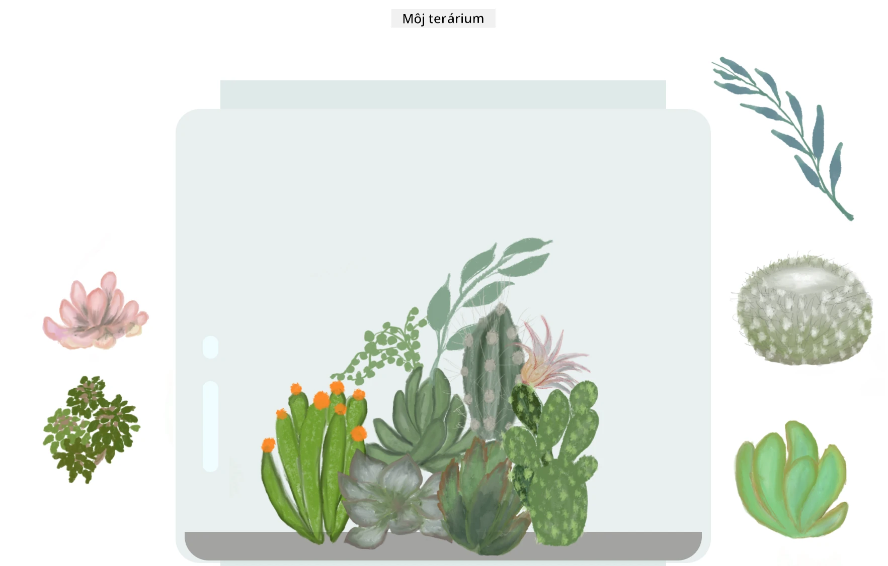

---

## Výzva GitHub Copilot Agenta 🚀

Použite režim Agenta na dokončenie nasledujúcej výzvy:

**Popis:** Vylepšite projekt terária pridaním funkcie resetu, ktorá vráti všetky rastliny na pôvodné pozície so zvolenou plynulou animáciou.

**Výzva:** Vytvorte tlačidlo reset, ktoré pri kliknutí animuje všetky rastliny späť na ich pôvodné pozície v bočnom paneli pomocou CSS prechodov. Funkcia by mala uložiť pôvodné pozície pri načítaní stránky a plynulo prejsť rastliny späť na tieto pozície počas 1 sekundy po stlačení tlačidla reset.

Viac informácií o [agent režime](https://code.visualstudio.com/blogs/2025/02/24/introducing-copilot-agent-mode) nájdete tu.

## 🚀 Ďalšia výzva: Rozvíjajte svoje zručnosti

Pripravte sa dostať svoje terárium na vyššiu úroveň! Vyskúšajte implementovať tieto vylepšenia:

**Tvorivé rozšírenia:**
- **Dvojklik** na rastlinu na jej pritiahnutie do popredia (manipulácia so z-indexom)
- **Pridajte vizuálnu spätnú väzbu** ako jemné žiarenie pri prechode myšou nad rastlinou
- **Implementujte hranice**, ktoré zabránia ťahaniu rastlín mimo terária
- **Vytvorte funkciu ukladania**, ktorá si zapamätá pozície rastlín pomocou localStorage
- **Pridajte zvukové efekty** pri zdvíhaní a pokladaní rastlín

> 💡 **Príležitosť na učenie**: Každá z týchto výziev vás naučí nové aspekty manipulácie s DOM, spracovania udalostí a dizajnu používateľského zážitku.

## Kvíz po prednáške

[Post-lecture quiz](https://ff-quizzes.netlify.app/web/quiz/20)

## Prehľad a samostatné štúdium: Prehĺbenie vášho porozumenia

Ovládli ste základy manipulácie s DOM a closures, ale vždy je čo objavovať! Tu sú niektoré cesty na rozšírenie vašich znalostí a zručností.

### Alternatívne prístupy k drag and drop

Použili sme pointer udalosti pre maximálnu flexibilitu, ale webový vývoj ponúka viacero prístupov:

| Prístup | Najlepšie pre | Hodnota učenia |
|----------|----------|----------------|
| [HTML Drag and Drop API](https://developer.mozilla.org/docs/Web/API/HTML_Drag_and_Drop_API) | Nahrávanie súborov, formálne zóny ťahania | Pochopenie natívnych prehliadačových schopností |
| [Touch Events](https://developer.mozilla.org/docs/Web/API/Touch_events) | Mobilné špecifické interakcie | Mobilné vývojové vzory |
| CSS vlastnosti `transform` | Plynulé animácie | Techniky optimalizácie výkonu |

### Pokročilé témy manipulácie s DOM

**Ďalšie kroky vo vašom štúdiu:**
- **Delegácia udalostí**: Efektívna správa udalostí pre viacero elementov
- **Intersection Observer**: Detekcia vstupu a opustenia elementov v pohľade
- **Mutation Observer**: Sledovanie zmien v štruktúre DOM
- **Web Components**: Vytváranie znovu použiteľných, izolovaných komponentov
- **Koncepty virtuálneho DOM**: Pochopenie optimalizácie aktualizácií DOM rámcami

### Základné zdroje na pokračovanie v učení

**Technická dokumentácia:**
- [MDN Sprievodca Pointer Events](https://developer.mozilla.org/docs/Web/API/Pointer_events) – Komplexný referenčný materiál pointer udalostí
- [W3C Špecifikácia Pointer Events](https://www.w3.org/TR/pointerevents1/) – Oficiálna štandardná dokumentácia
- [Hĺbkové štúdium JavaScript closures](https://developer.mozilla.org/docs/Web/JavaScript/Closures) – Pokročilé vzory closures

**Kompatibilita prehliadačov:**
- [CanIUse.com](https://caniuse.com/) – Kontrola podpory funkcií naprieč prehliadačmi
- [MDN Dáta o kompatibilite prehliadačov](https://github.com/mdn/browser-compat-data) – Detailné informácie o kompatibilite

**Príležitosti na cvičenie:**
- **Vytvorte** puzzle hru so slučkovou mechanikou ťahania
- **Navrhnite** kanban nástenku s drag-and-drop správou úloh
- **Urobte** galériu obrázkov s ťahacími fotografiami
- **Experimentujte** s dotykovými gestami pre mobilné rozhrania

> 🎯 **Učiaca stratégia**: Najlepším spôsobom, ako upevniť tieto koncepty, je prax. Skúšajte vytvárať rôzne variácie ťahacích rozhraní – každý projekt vás naučí niečo nové o interakcii používateľa a manipulácii s DOM.

### ⚡ **Čo môžete urobiť za nasledujúcich 5 minút**
- [ ] Otvorte DevTools prehliadača a zadajte `document.querySelector('body')` do konzoly
- [ ] Vyskúšajte zmeniť text na webovej stránke pomocou `innerHTML` alebo `textContent`
- [ ] Pridajte poslucháča udalosti kliknutia na akékoľvek tlačidlo alebo odkaz na stránke
- [ ] Preskúmajte štruktúru DOM stromu v paneli Elements

### 🎯 **Čo môžete dosiahnuť za túto hodinu**
- [ ] Dokončite kvíz po lekcii a prejdite koncepty manipulácie s DOM
- [ ] Vytvorte interaktívnu stránku reagujúcu na kliknutia používateľa
- [ ] Precvičte spracovanie udalostí s rôznymi typmi udalostí (click, mouseover, keypress)
- [ ] Vytvorte jednoduchý zoznam úloh alebo počítadlo pomocou manipulácie s DOM
- [ ] Preskúmajte vzťah medzi HTML elementmi a JavaScript objektmi

### 📅 **Váš týždenný JavaScript plán**
- [ ] Dokončite interaktívny projekt terária s funkciou drag-and-drop
- [ ] Ovládnite delegáciu udalostí pre efektívne spracovanie
- [ ] Naučte sa o event loop a asynchrónnom JavaScripte
- [ ] Precvičte closures vytváraním modulov s privátnym stavom
- [ ] Preskúmajte moderné DOM API ako Intersection Observer
- [ ] Vytvorte interaktívne komponenty bez použitia frameworkov

### 🌟 **Váš mesačný plán zvládnutia JavaScriptu**
- [ ] Vytvorte komplexnú jednoriadkovú aplikáciu s vanilla JavaScriptom
- [ ] Naučte sa moderný framework (React, Vue alebo Angular) a porovnajte ho s vanilla DOM
- [ ] Prispievajte do open source JavaScript projektov
- [ ] Ovládnite pokročilé koncepty ako web components a custom elements
- [ ] Vytvorte výkonné webové aplikácie s optimálnymi vzormi DOM
- [ ] Učte ostatných o manipulácii s DOM a základoch JavaScriptu

## 🎯 Váš časový plán zvládnutia JavaScript DOM

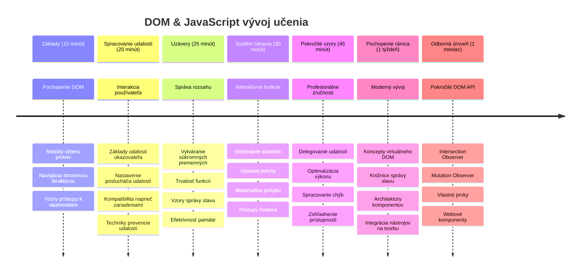
### 🛠️ Zhrnutie vášho JavaScript náradia

Po dokončení tejto lekcie už viete:
- **Zvládnutie DOM**: Výber elementov, manipulácia s vlastnosťami, navigácia v strome
- **Odbornosť na udalosti**: Spracovanie interakcií naprieč zariadeniami pomocou pointer udalostí
- **Pochopenie closures**: Správa súkromného stavu a perzistencia funkcií
- **Interaktívne systémy**: Kompletná implementácia drag-and-drop od základov
- **Uvedomelosť vo výkone**: Správne vyčistenie udalostí a správa pamäte
- **Moderné vzory**: Techniky organizácie kódu používané v profesionálnom vývoji
- **Používateľská skúsenosť**: Vytváranie intuitívnych, citlivých rozhraní

**Získané profesijné zručnosti**: Vytvorili ste funkcie použitím rovnakých techník ako:
- **Trello/Kanban nástenky**: Ťahanie kariet medzi stĺpcami
- **Systémy nahrávania súborov**: Drag-and-drop súborová manipulácia
- **Galerie obrázkov**: Rozhrania pre usporiadanie fotiek
- **Mobilné aplikácie**: Dotykové interakcie

**Ďalší level**: Ste pripravení objavovať moderné frameworky ako React, Vue alebo Angular, ktoré stavajú na týchto základných konceptoch manipulácie s DOM!

## Zadanie

[Práca s DOM pokračuje](assignment.md)

---

<!-- CO-OP TRANSLATOR DISCLAIMER START -->
**Zrieknutie sa zodpovednosti**:
Tento dokument bol preložený pomocou AI prekladateľskej služby [Co-op Translator](https://github.com/Azure/co-op-translator). Aj keď sa snažíme o presnosť, berte prosím na vedomie, že automatizované preklady môžu obsahovať chyby alebo nepresnosti. Pôvodný dokument v jeho pôvodnom jazyku by mal byť považovaný za autoritatívny zdroj. Pre kritické informácie sa odporúča profesionálny ľudský preklad. Nie sme zodpovední za akékoľvek nedorozumenia alebo nesprávne interpretácie vyplývajúce z použitia tohto prekladu.
<!-- CO-OP TRANSLATOR DISCLAIMER END -->