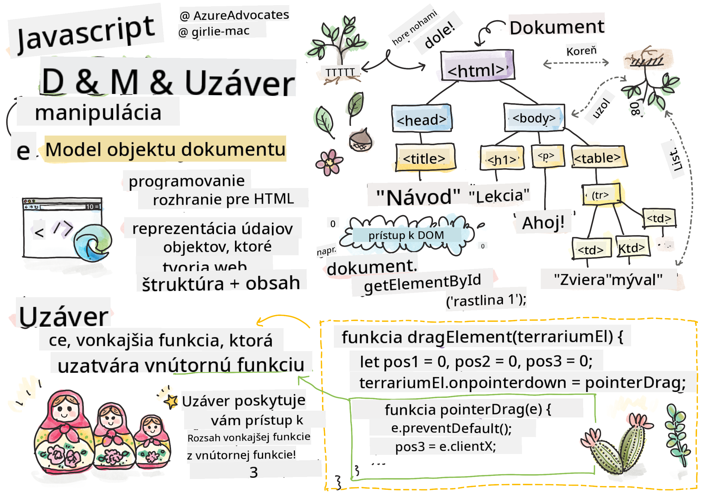
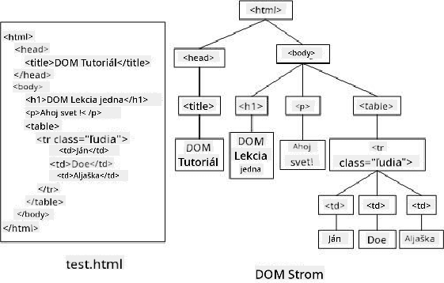
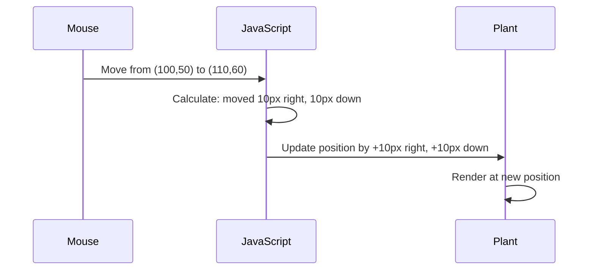
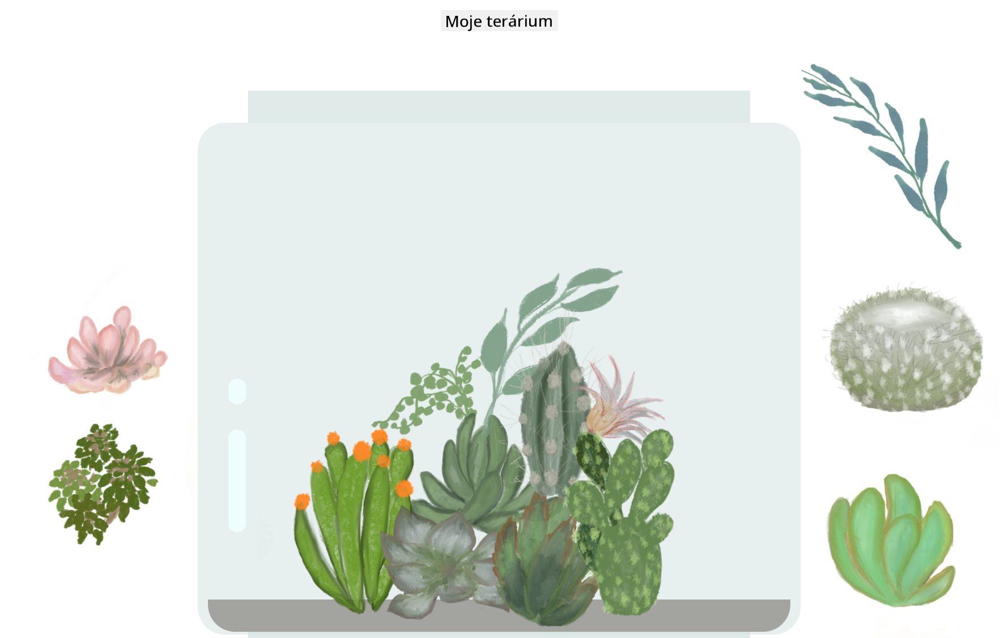

<!--
CO_OP_TRANSLATOR_METADATA:
{
  "original_hash": "bc93f6285423033ebf5b8abeb5282888",
  "translation_date": "2025-10-24T21:35:22+00:00",
  "source_file": "3-terrarium/3-intro-to-DOM-and-closures/README.md",
  "language_code": "sk"
}
-->
# Projekt Terárium Časť 3: Manipulácia s DOM a JavaScript Closures


> Sketchnote od [Tomomi Imura](https://twitter.com/girlie_mac)

Vitajte v jednej z najzaujímavejších oblastí webového vývoja - vytváranie interaktívnych prvkov! Document Object Model (DOM) je ako most medzi vaším HTML a JavaScriptom, a dnes ho použijeme na oživenie vášho terária. Keď Tim Berners-Lee vytvoril prvý webový prehliadač, predstavil si web, kde dokumenty môžu byť dynamické a interaktívne - DOM tento sen umožňuje.

Preskúmame tiež JavaScript closures, ktoré môžu na začiatku znieť zastrašujúco. Predstavte si closures ako "pamäťové kapsy", kde si vaše funkcie môžu pamätať dôležité informácie. Je to ako keby každá rastlina vo vašom teráriu mala vlastný záznam na sledovanie svojej polohy. Na konci tejto lekcie pochopíte, aké prirodzené a užitočné sú.

Tu je, čo budeme vytvárať: terárium, kde môžu používatelia presúvať rastliny kamkoľvek chcú. Naučíte sa techniky manipulácie s DOM, ktoré poháňajú všetko od presúvania súborov až po interaktívne hry. Poďme oživiť vaše terárium.

## Kvíz pred prednáškou

[Kvíz pred prednáškou](https://ff-quizzes.netlify.app/web/quiz/19)

## Pochopenie DOM: Vaša brána k interaktívnym webovým stránkam

Document Object Model (DOM) je spôsob, akým JavaScript komunikuje s vašimi HTML prvkami. Keď váš prehliadač načíta HTML stránku, vytvorí štruktúrovanú reprezentáciu tejto stránky v pamäti - to je DOM. Predstavte si to ako rodokmeň, kde každý HTML prvok je člen rodiny, ku ktorému má JavaScript prístup, môže ho upraviť alebo preskupiť.

Manipulácia s DOM premieňa statické stránky na interaktívne webové stránky. Kedykoľvek vidíte tlačidlo meniace farbu pri prechode myšou, aktualizáciu obsahu bez obnovenia stránky alebo prvky, ktoré môžete presúvať, to je práca manipulácie s DOM.



> Reprezentácia DOM a HTML značiek, ktoré naň odkazujú. Od [Olfa Nasraoui](https://www.researchgate.net/publication/221417012_Profile-Based_Focused_Crawler_for_Social_Media-Sharing_Websites)

**Čo robí DOM takým silným:**
- **Poskytuje** štruktúrovaný spôsob prístupu k akémukoľvek prvku na vašej stránke
- **Umožňuje** dynamické aktualizácie obsahu bez obnovenia stránky
- **Reaguje** v reálnom čase na interakcie používateľa, ako sú kliknutia a presuny
- **Vytvára** základ pre moderné interaktívne webové aplikácie

## JavaScript Closures: Tvorba organizovaného a výkonného kódu

[JavaScript closure](https://developer.mozilla.org/docs/Web/JavaScript/Closures) je ako dať funkcii vlastný súkromný pracovný priestor s trvalou pamäťou. Predstavte si Darwinove pinky na Galapágach, ktoré si každá vyvinula špecializované zobáky podľa svojho konkrétneho prostredia - closures fungujú podobne, vytvárajú špecializované funkcie, ktoré si "pamätajú" svoj konkrétny kontext aj po skončení svojej nadradenej funkcie.

V našom teráriu closures pomáhajú každej rastline nezávisle si pamätať svoju vlastnú polohu. Tento vzor sa objavuje v profesionálnom JavaScript vývoji, čo z neho robí cenný koncept na pochopenie.

> 💡 **Pochopenie Closures**: Closures sú významnou témou v JavaScripte a mnoho vývojárov ich používa roky, než úplne pochopia všetky teoretické aspekty. Dnes sa zameriame na praktické použitie - uvidíte, ako prirodzene vznikajú pri budovaní našich interaktívnych funkcií. Pochopenie sa rozvinie, keď uvidíte, ako riešia skutočné problémy.


> Reprezentácia DOM a HTML značiek, ktoré naň odkazujú. Od [Olfa Nasraoui](https://www.researchgate.net/publication/221417012_Profile-Based_Focused_Crawler_for_Social_Media-Sharing_Websites)

V tejto lekcii dokončíme náš interaktívny projekt terária vytvorením JavaScriptu, ktorý umožní používateľovi manipulovať s rastlinami na stránke.

## Predtým, než začneme: Príprava na úspech

Budete potrebovať svoje HTML a CSS súbory z predchádzajúcich lekcií o teráriu - chystáme sa urobiť túto statickú dizajn interaktívnou. Ak sa pripájate prvýkrát, dokončenie týchto lekcií vám poskytne dôležitý kontext.

Tu je, čo budeme vytvárať:
- **Plynulé presúvanie** všetkých rastlín v teráriu
- **Sledovanie súradníc**, aby si rastliny pamätali svoje polohy
- **Kompletné interaktívne rozhranie** pomocou vanilla JavaScriptu
- **Čistý, organizovaný kód** pomocou closure vzorov

## Nastavenie vášho JavaScript súboru

Vytvorme JavaScript súbor, ktorý urobí vaše terárium interaktívnym.

**Krok 1: Vytvorte svoj script súbor**

Vo vašom teráriovom priečinku vytvorte nový súbor s názvom `script.js`.

**Krok 2: Prepojte JavaScript s vaším HTML**

Pridajte tento script tag do sekcie `<head>` vášho súboru `index.html`:

```html
<script src="./script.js" defer></script>
```

**Prečo je atribút `defer` dôležitý:**
- **Zabezpečuje**, že váš JavaScript počká, kým sa načíta všetok HTML
- **Zabraňuje** chybám, kde JavaScript hľadá prvky, ktoré ešte nie sú pripravené
- **Zaručuje**, že všetky vaše rastlinné prvky sú dostupné na interakciu
- **Poskytuje** lepší výkon ako umiestnenie skriptov na spodok stránky

> ⚠️ **Dôležitá poznámka**: Atribút `defer` zabraňuje bežným problémom s načasovaním. Bez neho by sa JavaScript mohol pokúsiť pristupovať k HTML prvkom pred ich načítaním, čo by spôsobilo chyby.

---

## Prepojenie JavaScriptu s vašimi HTML prvkami

Predtým, než môžeme urobiť prvky presúvateľnými, JavaScript ich musí nájsť v DOM. Predstavte si to ako systém katalogizácie knižnice - keď máte číslo katalógu, môžete presne nájsť knihu, ktorú potrebujete, a získať prístup k jej obsahu.

Použijeme metódu `document.getElementById()` na vytvorenie týchto prepojení. Je to ako mať presný systém archivácie - poskytnete ID a nájde presne ten prvok, ktorý potrebujete vo vašom HTML.

### Aktivácia funkcie presúvania pre všetky rastliny

Pridajte tento kód do vášho súboru `script.js`:

```javascript
// Enable drag functionality for all 14 plants
dragElement(document.getElementById('plant1'));
dragElement(document.getElementById('plant2'));
dragElement(document.getElementById('plant3'));
dragElement(document.getElementById('plant4'));
dragElement(document.getElementById('plant5'));
dragElement(document.getElementById('plant6'));
dragElement(document.getElementById('plant7'));
dragElement(document.getElementById('plant8'));
dragElement(document.getElementById('plant9'));
dragElement(document.getElementById('plant10'));
dragElement(document.getElementById('plant11'));
dragElement(document.getElementById('plant12'));
dragElement(document.getElementById('plant13'));
dragElement(document.getElementById('plant14'));
```

**Čo tento kód dosahuje:**
- **Nájde** každý rastlinný prvok v DOM pomocou jeho jedinečného ID
- **Získa** JavaScript referenciu na každý HTML prvok
- **Prenesie** každý prvok do funkcie `dragElement` (ktorú vytvoríme neskôr)
- **Pripraví** každú rastlinu na interakciu presúvania
- **Prepojí** vašu HTML štruktúru s JavaScript funkčnosťou

> 🎯 **Prečo používať ID namiesto tried?** ID poskytujú jedinečné identifikátory pre konkrétne prvky, zatiaľ čo CSS triedy sú určené na štýlovanie skupín prvkov. Keď JavaScript potrebuje manipulovať s jednotlivými prvkami, ID ponúkajú presnosť a výkon, ktorý potrebujeme.

> 💡 **Tip**: Všimnite si, ako voláme `dragElement()` pre každú rastlinu individuálne. Tento prístup zaručuje, že každá rastlina dostane svoje vlastné nezávislé správanie pri presúvaní, čo je nevyhnutné pre plynulú interakciu používateľa.

---

## Vytvorenie Closure pre funkciu dragElement

Teraz vytvoríme jadro našej funkcie presúvania: closure, ktorý spravuje správanie presúvania pre každú rastlinu. Tento closure bude obsahovať viacero vnútorných funkcií, ktoré spolupracujú na sledovaní pohybov myši a aktualizácii polohy prvkov.

Closures sú pre túto úlohu ideálne, pretože nám umožňujú vytvoriť "súkromné" premenné, ktoré pretrvávajú medzi volaniami funkcií, čím dávajú každej rastline vlastný nezávislý systém sledovania súradníc.

### Pochopenie Closures pomocou jednoduchého príkladu

Ukážme si closures na jednoduchom príklade, ktorý ilustruje koncept:

```javascript
function createCounter() {
    let count = 0; // This is like a private variable
    
    function increment() {
        count++; // The inner function remembers the outer variable
        return count;
    }
    
    return increment; // We're giving back the inner function
}

const myCounter = createCounter();
console.log(myCounter()); // 1
console.log(myCounter()); // 2
```

**Čo sa deje v tomto vzore closure:**
- **Vytvára** súkromnú premennú `count`, ktorá existuje iba v tomto closure
- **Vnútorná funkcia** môže pristupovať k tejto vonkajšej premennej a upravovať ju (mechanizmus closure)
- **Keď vrátime** vnútornú funkciu, zachováva si spojenie s týmito súkromnými dátami
- **Aj po skončení** `createCounter()` premenná `count` pretrváva a pamätá si svoju hodnotu

### Prečo sú Closures ideálne pre funkciu presúvania

Pre naše terárium každá rastlina potrebuje pamätať si svoje aktuálne súradnice. Closures poskytujú ideálne riešenie:

**Kľúčové výhody pre náš projekt:**
- **Udržuje** súkromné premenné polohy pre každú rastlinu nezávisle
- **Zachováva** údaje o súradniciach medzi udalosťami presúvania
- **Zabraňuje** konfliktom premenných medzi rôznymi presúvateľnými prvkami
- **Vytvára** čistú, organizovanú štruktúru kódu

> 🎯 **Cieľ učenia**: Nemusíte teraz ovládať každý aspekt closures. Zamerajte sa na to, ako nám pomáhajú organizovať kód a udržiavať stav pre našu funkciu presúvania.

### Vytvorenie funkcie dragElement

Teraz vytvoríme hlavnú funkciu, ktorá bude spracovávať všetku logiku presúvania. Pridajte túto funkciu pod deklarácie rastlinných prvkov:

```javascript
function dragElement(terrariumElement) {
    // Initialize position tracking variables
    let pos1 = 0,  // Previous mouse X position
        pos2 = 0,  // Previous mouse Y position  
        pos3 = 0,  // Current mouse X position
        pos4 = 0;  // Current mouse Y position
    
    // Set up the initial drag event listener
    terrariumElement.onpointerdown = pointerDrag;
}
```

**Pochopenie systému sledovania polohy:**
- **`pos1` a `pos2`**: Uchovávajú rozdiel medzi starými a novými polohami myši
- **`pos3` a `pos4`**: Sledovanie aktuálnych súradníc myši
- **`terrariumElement`**: Konkrétny rastlinný prvok, ktorý robíme presúvateľným
- **`onpointerdown`**: Udalosť, ktorá sa spustí, keď používateľ začne presúvať

**Ako funguje vzor closure:**
- **Vytvára** súkromné premenné polohy pre každý rastlinný prvok
- **Udržuje** tieto premenné počas celého životného cyklu presúvania
- **Zaručuje**, že každá rastlina sleduje svoje vlastné súradnice nezávisle
- **Poskytuje** čisté rozhranie prostredníctvom funkcie `dragElement`

### Prečo používať Pointer Events?

Možno sa pýtate, prečo používame `onpointerdown` namiesto známejšieho `onclick`. Tu je vysvetlenie:

| Typ udalosti | Najlepšie pre | Nevýhoda |
|--------------|---------------|----------|
| `onclick` | Jednoduché kliknutia na tlačidlá | Nedokáže spracovať presúvanie (iba kliknutia a uvoľnenia) |
| `onpointerdown` | Myš aj dotyk | Novšie, ale dnes dobre podporované |
| `onmousedown` | Iba myš na desktopoch | Vylučuje mobilných používateľov |

**Prečo sú pointer events ideálne pre to, čo vytvárame:**
- **Funguje skvele**, či už niekto používa myš, prst alebo dokonca stylus
- **Pôsobí rovnako** na notebooku, tablete alebo telefóne
- **Spracováva** skutočný pohyb presúvania (nielen kliknutie a hotovo)
- **Vytvára** plynulý zážitok, ktorý používatelia očakávajú od moderných webových aplikácií

> 💡 **Príprava na budúcnosť**: Pointer events sú moderný spôsob spracovania interakcií používateľa. Namiesto písania samostatného kódu pre myš a dotyk získate oboje zadarmo. Celkom šikovné, však?

---

## Funkcia pointerDrag: Zachytenie začiatku presúvania

Keď používateľ stlačí rastlinu (či už kliknutím myšou alebo dotykom prsta), funkcia `pointerDrag` sa aktivuje. Táto funkcia zachytáva počiatočné súradnice a nastavuje systém presúvania.

Pridajte túto funkciu do vášho closure `dragElement`, hneď po riadku `terrariumElement.onpointerdown = pointerDrag;`:

```javascript
function pointerDrag(e) {
    // Prevent default browser behavior (like text selection)
    e.preventDefault();
    
    // Capture the initial mouse/touch position
    pos3 = e.clientX;  // X coordinate where drag started
    pos4 = e.clientY;  // Y coordinate where drag started
    
    // Set up event listeners for the dragging process
    document.onpointermove = elementDrag;
    document.onpointerup = stopElementDrag;
}
```

**Krok za krokom, čo sa deje:**
- **Zabraňuje** predvoleným správaním prehliadača, ktoré by mohlo rušiť presúvanie
- **Zaznamenáva** presné súradnice, kde používateľ začal gesto presúvania
- **Nastavuje** event listener pre pokračujúci pohyb presúvania
- **Pripravuje** systém na sledovanie pohybu myši/prsta po celej stránke

### Pochopenie prevencie udalostí

Riadok `e.preventDefault()` je kľúčový pre plynulé presúvanie:

**Bez prevencie by prehliadače mohli:**
- **Vybrať** text pri presúvaní po stránke
- **Spustiť** kontextové menu pri kliknutí pravým tlačidlom počas presúvania
- **Rušiť** naše vlastné správanie presúvania
- **Vytvárať** vizuálne artefakty počas operácie presúvania

> 🔍 **Experiment**: Po dokončení tejto lekcie skúste odstrániť `e.preventDefault()` a pozrite sa, ako to ovplyvní zážitok z presúvania. Rýchlo pochopíte, prečo je tento riadok nevyhnutný!

### Systém sledovania súradníc

Vlastnosti `e.clientX` a `e.clientY` nám poskytujú presné súradnice myši/dotyku:

| Vlastnosť | Čo meria | Použitie |
|-----------|----------|----------|
| `clientX` | Horizontálnu polohu vzhľadom na viewport | Sledovanie pohybu doľava-doprava |
| `clientY` | Vertikálnu polohu vzhľadom na viewport | Sledovanie pohybu hore-dole |

**Pochopenie týchto súradníc:**
- **Poskytuje** presné informácie o polohe v pixeloch
- **Aktualizuje** sa v reálnom čase, keď sa používateľ pohybuje ukazovateľom
- **Zostáva** konzistentné na rôznych veľkostiach obrazovky a úrovniach priblíženia
- **Umožňuje** plynulé, responzívne interakcie presúvania

### Nastavenie event listenerov na úrovni dokumentu

Všimnite si, ako pripájame udalosti pohybu a zastavenia na celý `document`, nie len na rastlinný prvok:

```javascript
document.onpointermove = elementDrag;
document.onpointerup = stopElementDrag;
```

**Prečo pripájať na dokument:**
- **Pokračuje** v sledovaní, aj keď myš opustí rastlinný prvok
- **Zabraňuje** prerušeniu presúvania, ak sa používateľ pohybuje rýchlo
- **Poskytuje** plynulé presúvanie po celej obrazovke
- **Rieši** okrajové príp
- **`pos3` a `pos4`**: Ukladajú aktuálnu pozíciu myši pre ďalší výpočet
- **`offsetTop` a `offsetLeft`**: Získavajú aktuálnu pozíciu prvku na stránke
- **Logika odčítania**: Posúva prvok o rovnakú vzdialenosť, akú prešla myš

**Tu je rozpis výpočtu pohybu:**
1. **Meria** rozdiel medzi starou a novou pozíciou myši
2. **Vypočíta**, o koľko sa má prvok posunúť na základe pohybu myši
3. **Aktualizuje** vlastnosti pozície CSS prvku v reálnom čase
4. **Ukladá** novú pozíciu ako základ pre ďalší výpočet pohybu

### Vizualizácia výpočtu



### Funkcia stopElementDrag: Upratovanie

Pridajte funkciu na upratovanie za zatváraciu zloženú zátvorku funkcie `elementDrag`:

```javascript
function stopElementDrag() {
    // Remove the document-level event listeners
    document.onpointerup = null;
    document.onpointermove = null;
}
```

**Prečo je upratovanie dôležité:**
- **Zabraňuje** úniku pamäte spôsobenému pretrvávajúcimi poslucháčmi udalostí
- **Zastavuje** správanie pri ťahaní, keď používateľ uvoľní rastlinu
- **Umožňuje** nezávislé ťahanie iných prvkov
- **Resetuje** systém pre ďalšiu operáciu ťahania

**Čo sa stane bez upratovania:**
- Poslucháči udalostí pokračujú v behu aj po zastavení ťahania
- Výkon sa zhoršuje, keď sa hromadia nepoužívaní poslucháči
- Neočakávané správanie pri interakcii s inými prvkami
- Zdroje prehliadača sa plytvajú na zbytočné spracovanie udalostí

### Pochopenie vlastností pozície CSS

Náš systém ťahania manipuluje s dvoma kľúčovými vlastnosťami CSS:

| Vlastnosť | Čo ovláda | Ako ju používame |
|-----------|-----------|------------------|
| `top` | Vzdialenosť od horného okraja | Vertikálne umiestnenie počas ťahania |
| `left` | Vzdialenosť od ľavého okraja | Horizontálne umiestnenie počas ťahania |

**Kľúčové poznatky o vlastnostiach offset:**
- **`offsetTop`**: Aktuálna vzdialenosť od horného okraja umiestneného rodičovského prvku
- **`offsetLeft`**: Aktuálna vzdialenosť od ľavého okraja umiestneného rodičovského prvku
- **Kontext umiestnenia**: Tieto hodnoty sú relatívne voči najbližšiemu umiestnenému predkovi
- **Aktualizácie v reálnom čase**: Menia sa okamžite, keď upravíme vlastnosti CSS

> 🎯 **Filozofia dizajnu**: Tento systém ťahania je zámerne flexibilný – neexistujú žiadne "zónové obmedzenia" ani obmedzenia. Používatelia môžu umiestniť rastliny kdekoľvek, čo im dáva úplnú kreatívnu kontrolu nad dizajnom terária.

## Spojenie všetkého: Váš kompletný systém ťahania

Gratulujeme! Práve ste vytvorili sofistikovaný systém ťahania a púšťania pomocou vanilla JavaScriptu. Vaša kompletná funkcia `dragElement` teraz obsahuje výkonný uzáver, ktorý spravuje:

**Čo váš uzáver dosahuje:**
- **Udržiava** súkromné premenné pozície pre každú rastlinu nezávisle
- **Spracováva** kompletný životný cyklus ťahania od začiatku do konca
- **Poskytuje** plynulý, responzívny pohyb po celej obrazovke
- **Správne čistí** zdroje, aby zabránil úniku pamäte
- **Vytvára** intuitívne, kreatívne rozhranie pre dizajn terária

### Testovanie vášho interaktívneho terária

Teraz otestujte svoje interaktívne terárium! Otvorte svoj súbor `index.html` v webovom prehliadači a vyskúšajte funkčnosť:

1. **Kliknite a podržte** akúkoľvek rastlinu, aby ste začali ťahať
2. **Pohybujte myšou alebo prstom** a sledujte, ako rastlina plynule nasleduje
3. **Uvoľnite**, aby ste rastlinu pustili na nové miesto
4. **Experimentujte** s rôznymi usporiadaniami a preskúmajte rozhranie

🥇 **Úspech**: Vytvorili ste plne interaktívnu webovú aplikáciu pomocou základných konceptov, ktoré profesionálni vývojári používajú denne. Táto funkcia ťahania a púšťania využíva rovnaké princípy ako nahrávanie súborov, kanbanové tabuľky a mnoho ďalších interaktívnych rozhraní.



---

## Výzva GitHub Copilot Agent 🚀

Použite režim Agent na splnenie nasledujúcej výzvy:

**Popis:** Vylepšite projekt terária pridaním funkcie resetovania, ktorá vráti všetky rastliny na ich pôvodné pozície s plynulými animáciami.

**Výzva:** Vytvorte tlačidlo na resetovanie, ktoré po kliknutí animuje všetky rastliny späť na ich pôvodné pozície v bočnom paneli pomocou prechodov CSS. Funkcia by mala uložiť pôvodné pozície pri načítaní stránky a plynulo presunúť rastliny späť na tieto pozície počas 1 sekundy po stlačení tlačidla resetovania.

Viac informácií o [režime agent](https://code.visualstudio.com/blogs/2025/02/24/introducing-copilot-agent-mode) nájdete tu.

## 🚀 Dodatočná výzva: Rozšírte svoje zručnosti

Pripravení posunúť svoje terárium na ďalšiu úroveň? Skúste implementovať tieto vylepšenia:

**Kreatívne rozšírenia:**
- **Dvojité kliknutie** na rastlinu, aby sa dostala do popredia (manipulácia s z-indexom)
- **Pridajte vizuálnu spätnú väzbu**, ako jemné žiarenie pri prechode myšou nad rastlinami
- **Implementujte hranice**, aby sa zabránilo ťahaniu rastlín mimo terária
- **Vytvorte funkciu uloženia**, ktorá si zapamätá pozície rastlín pomocou localStorage
- **Pridajte zvukové efekty** pri zdvíhaní a umiestňovaní rastlín

> 💡 **Príležitosť na učenie**: Každá z týchto výziev vás naučí nové aspekty manipulácie s DOM, spracovania udalostí a dizajnu používateľského rozhrania.

## Kvíz po prednáške

[Kvíz po prednáške](https://ff-quizzes.netlify.app/web/quiz/20)

## Prehľad a samostatné štúdium: Prehĺbenie vašich znalostí

Ovládli ste základy manipulácie s DOM a uzáverov, ale vždy je čo objavovať! Tu sú niektoré cesty na rozšírenie vašich znalostí a zručností.

### Alternatívne prístupy k ťahaniu a púšťaniu

Použili sme ukazovacie udalosti pre maximálnu flexibilitu, ale webový vývoj ponúka viacero prístupov:

| Prístup | Najlepšie pre | Hodnota učenia |
|---------|---------------|----------------|
| [HTML Drag and Drop API](https://developer.mozilla.org/docs/Web/API/HTML_Drag_and_Drop_API) | Nahrávanie súborov, formálne zóny ťahania | Pochopenie natívnych schopností prehliadača |
| [Touch Events](https://developer.mozilla.org/docs/Web/API/Touch_events) | Interakcie špecifické pre mobilné zariadenia | Vzory vývoja zamerané na mobilné zariadenia |
| Vlastnosti CSS `transform` | Plynulé animácie | Techniky optimalizácie výkonu |

### Pokročilé témy manipulácie s DOM

**Ďalšie kroky vo vašej učebnej ceste:**
- **Delegácia udalostí**: Efektívne spracovanie udalostí pre viacero prvkov
- **Intersection Observer**: Detekcia, keď prvky vstupujú/vychádzajú z pohľadu
- **Mutation Observer**: Sledovanie zmien v štruktúre DOM
- **Web Components**: Vytváranie opakovane použiteľných, zapuzdrených prvkov UI
- **Koncepty virtuálneho DOM**: Pochopenie, ako frameworky optimalizujú aktualizácie DOM

### Základné zdroje na pokračovanie v učení

**Technická dokumentácia:**
- [MDN Pointer Events Guide](https://developer.mozilla.org/docs/Web/API/Pointer_events) - Komplexný referenčný sprievodca ukazovacími udalosťami
- [W3C Pointer Events Specification](https://www.w3.org/TR/pointerevents1/) - Oficiálna dokumentácia štandardov
- [JavaScript Closures Deep Dive](https://developer.mozilla.org/docs/Web/JavaScript/Closures) - Pokročilé vzory uzáverov

**Kompatibilita prehliadačov:**
- [CanIUse.com](https://caniuse.com/) - Skontrolujte podporu funkcií v rôznych prehliadačoch
- [MDN Browser Compatibility Data](https://github.com/mdn/browser-compat-data) - Podrobné informácie o kompatibilite

**Príležitosti na prax:**
- **Vytvorte** puzzle hru pomocou podobných mechanizmov ťahania
- **Navrhnite** kanbanovú tabuľu s manažmentom úloh pomocou ťahania a púšťania
- **Navrhnite** galériu obrázkov s usporiadaním fotografií pomocou ťahania
- **Experimentujte** s dotykovými gestami pre mobilné rozhrania

> 🎯 **Stratégia učenia**: Najlepší spôsob, ako si tieto koncepty upevniť, je prax. Skúste vytvárať variácie rozhraní s možnosťou ťahania – každý projekt vás naučí niečo nové o interakcii používateľa a manipulácii s DOM.

## Zadanie

[Pracujte trochu viac s DOM](assignment.md)

---

**Zrieknutie sa zodpovednosti**:  
Tento dokument bol preložený pomocou služby AI prekladu [Co-op Translator](https://github.com/Azure/co-op-translator). Hoci sa snažíme o presnosť, prosím, berte na vedomie, že automatizované preklady môžu obsahovať chyby alebo nepresnosti. Pôvodný dokument v jeho rodnom jazyku by mal byť považovaný za autoritatívny zdroj. Pre kritické informácie sa odporúča profesionálny ľudský preklad. Nenesieme zodpovednosť za akékoľvek nedorozumenia alebo nesprávne interpretácie vyplývajúce z použitia tohto prekladu.