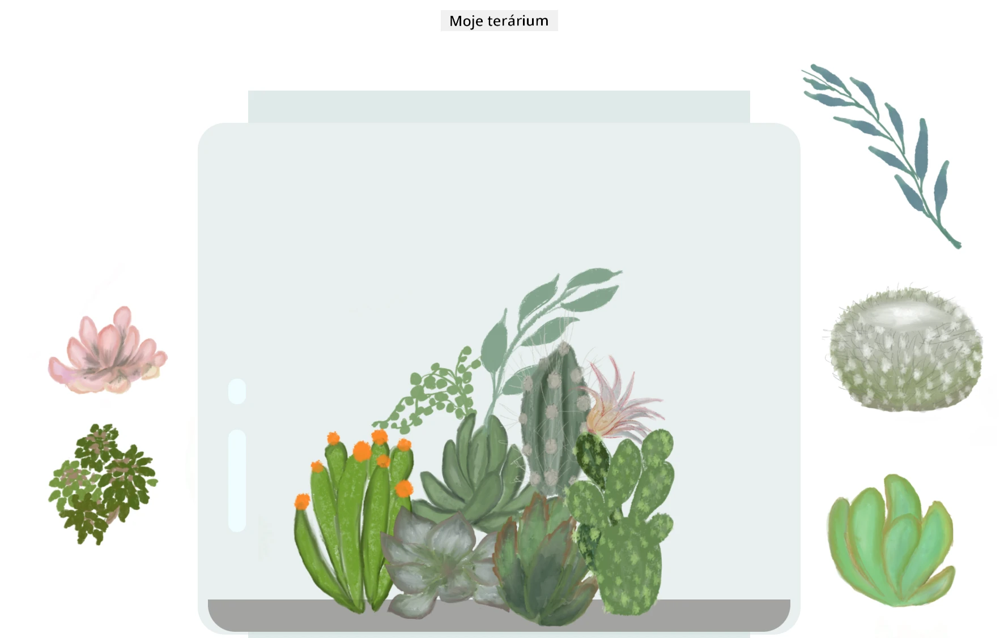

# Moje terárium: Projekt na učenie sa o HTML, CSS a manipulácii s DOM pomocou JavaScriptu 🌵🌱

Malá meditácia s kódom na princípe drag and drop. S trochou HTML, JS a CSS môžete vytvoriť webové rozhranie, upraviť jeho štýl a pridať interakciu.

## Poďakovania

Napísané s ♥️ od [Jen Looper](https://www.twitter.com/jenlooper)

Terárium vytvorené pomocou CSS bolo inšpirované sklenenou nádobou od Jakuba Mandru na [codepen](https://codepen.io/Rotarepmi/pen/rjpNZY).

Ilustrácie boli ručne nakreslené [Jen Looper](http://jenlooper.com) pomocou aplikácie Procreate.

## Nasadenie vášho terária

Svoje terárium môžete nasadiť alebo publikovať na web pomocou Azure Static Web Apps.

1. Forknite toto repozitórium

2. Stlačte toto tlačidlo

3. Prejdite sprievodcom na vytvorenie vašej aplikácie. Uistite sa, že nastavíte koreň aplikácie buď na `/solution`, alebo na koreň vašej kódovej základne. Táto aplikácia neobsahuje API, takže si s tým nemusíte robiť starosti. Vo vašom forknutom repozitári sa vytvorí priečinok .github, ktorý pomôže službe Azure Static Web Apps zostaviť a publikovať vašu aplikáciu na novú URL adresu.

---

**Upozornenie**:  
Tento dokument bol preložený pomocou služby AI prekladu [Co-op Translator](https://github.com/Azure/co-op-translator). Hoci sa snažíme o presnosť, prosím, berte na vedomie, že automatizované preklady môžu obsahovať chyby alebo nepresnosti. Pôvodný dokument v jeho rodnom jazyku by mal byť považovaný za autoritatívny zdroj. Pre kritické informácie sa odporúča profesionálny ľudský preklad. Nie sme zodpovední za akékoľvek nedorozumenia alebo nesprávne interpretácie vyplývajúce z použitia tohto prekladu.