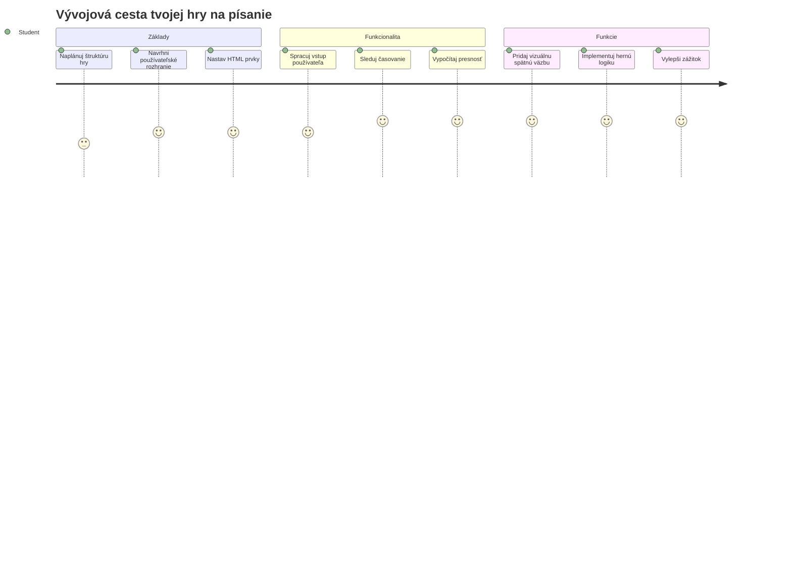
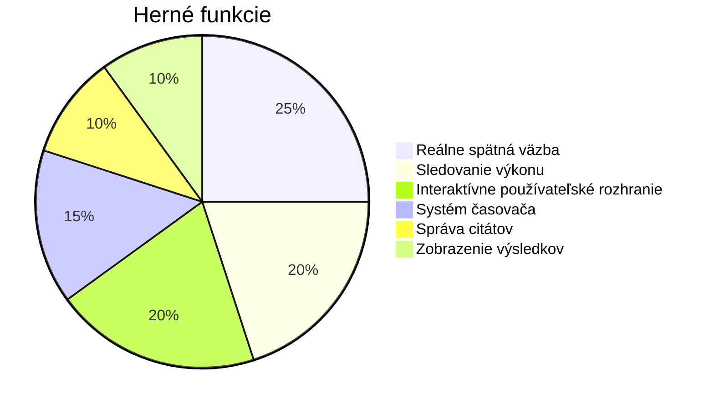
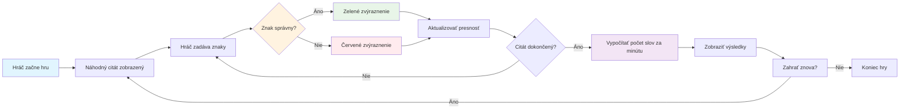
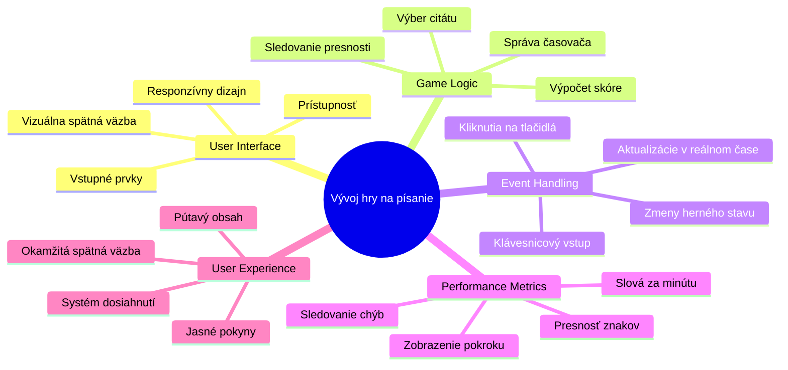
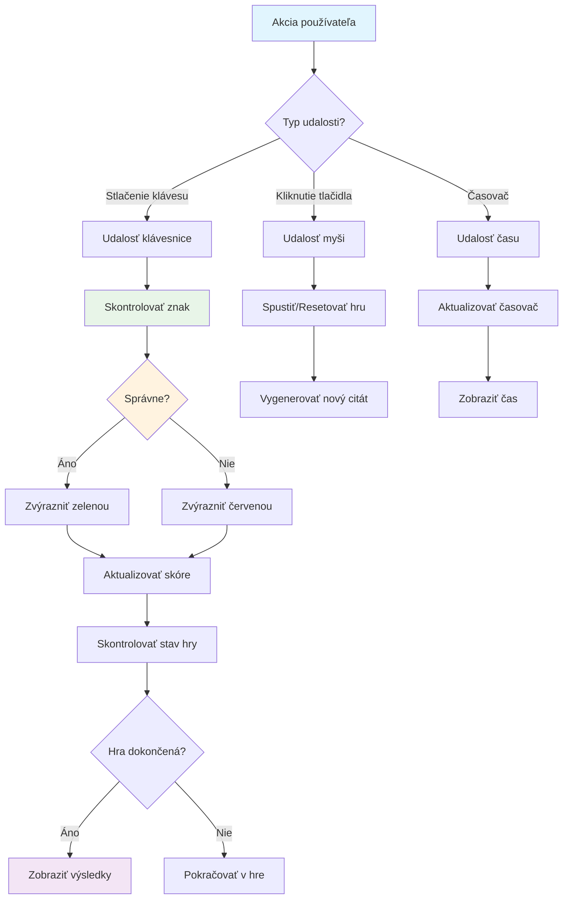
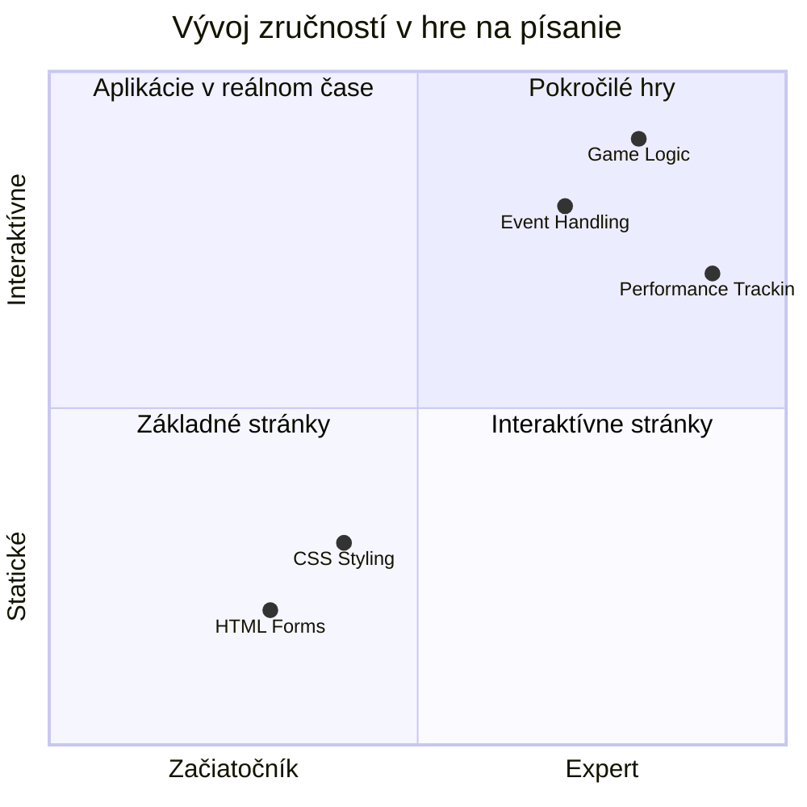
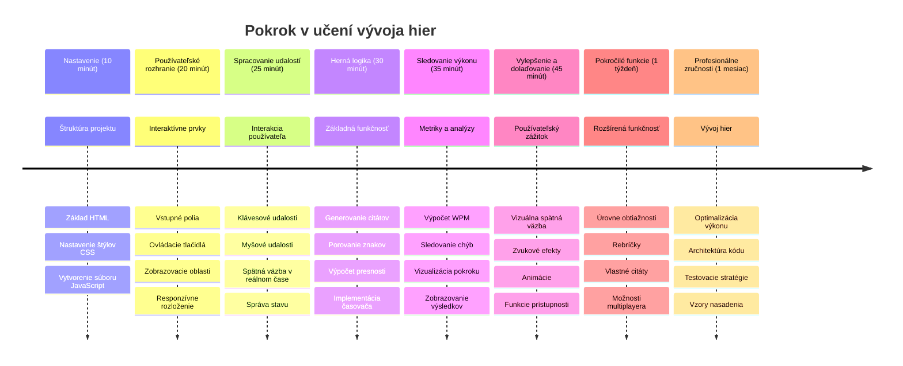

# Event-Driven Programming - Vytvorenie hry na písanie

## Úvod

Tu je niečo, čo každý vývojár pozná, ale zriedka o tom hovorí: rýchle písanie je superschopnosť! 🚀 Premyslite si to - čím rýchlejšie dokážete dostať svoje myšlienky z hlavy do kódu, tým viac môže plynúť vaša kreativita. Je to ako mať priamy kanál medzi vašimi myšlienkami a obrazovkou.

Chcete vedieť jeden z najlepších spôsobov, ako zlepšiť túto zručnosť? Uhádli ste to - postavíme hru!

> Poďme spolu vytvoriť skvelú hru na písanie!

Pripraveni využiť všetky tie zručnosti z JavaScriptu, HTML a CSS, ktoré ste sa naučili? Postavíme hru na písanie, ktorá vás vyzve náhodnými citátmi od legendárneho detektíva [Sherlocka Holmesa](https://en.wikipedia.org/wiki/Sherlock_Holmes). Hra bude sledovať, ako rýchlo a presne dokážete písať – a verte mi, je to viac návykové, než si myslíte!

## Čo by ste mali ovládať

Predtým, než sa pustíme do práce, uistite sa, že ovládate tieto koncepty (neobávajte sa, ak potrebujete rýchly refresh – všetci sme to už zažili!):

- Vytváranie textových vstupov a tlačidiel
- CSS a nastavovanie štýlov pomocou tried  
- Základy JavaScriptu
  - Vytváranie polí
  - Generovanie náhodného čísla
  - Získanie aktuálneho času

Ak niečo z toho cítite trochu zakríknuto, to je úplne v poriadku! Niekedy je najlepším spôsobom, ako si vedomosti upevniť, skočiť do projektu a zisťovať veci za pochodu.

### 🔄 **Pedagogická kontrola**
**Základné hodnotenie**: Pred začiatkom vývoja sa uistite, že rozumiete:
- ✅ Ako fungujú HTML formuláre a vstupné prvky
- ✅ Triedy CSS a dynamické štýlovanie
- ✅ JavaScript event listenery a handlery
- ✅ Manipulácia s poľami a náhodný výber
- ✅ Meranie času a výpočty

**Rýchly self-test**: Dokážete vysvetliť, ako tieto koncepty spolupracujú v interaktívnej hre?
- **Udalosti** sa spúšťajú, keď používatelia interagujú s prvkami
- **Handlery** spracovávajú tieto udalosti a aktualizujú stav hry
- **CSS** poskytuje vizuálnu spätnú väzbu pre akcie používateľa
- **Časovanie** umožňuje meranie výkonu a postup hry

## Poďme na to!

[Vytváranie hry na písanie pomocou event-driven programovania](./typing-game/README.md)

### ⚡ **Čo môžete urobiť počas nasledujúcich 5 minút**
- [ ] Otvorte konzolu vo vašom prehliadači a skúste počúvať na klávesové udalosti pomocou `addEventListener`
- [ ] Vytvorte jednoduchú HTML stránku s textovým poľom a otestujte detekciu písania
- [ ] Precvičujte manipuláciu s reťazcami porovnaním napísaného textu s cieľovým textom
- [ ] Experimentujte s `setTimeout`, aby ste pochopili časovacie funkcie

### 🎯 **Čo môžete dosiahnuť za hodinu**
- [ ] Dokončite kvíz po lekcii a pochopte event-driven programovanie
- [ ] Vytvorte základnú verziu hry na písanie s overením slov
- [ ] Pridajte vizuálnu spätnú väzbu pre správne a nesprávne písanie
- [ ] Implementujte jednoduchý systém bodovania na základe rýchlosti a presnosti
- [ ] Štylizujte svoju hru pomocou CSS, aby bola vizuálne príťažlivá

### 📅 **Váš týždeň vývoja hry**
- [ ] Dokončite kompletnú hru na písanie so všetkými funkciami a vylepšeniami
- [ ] Pridajte úrovne obtiažnosti s rôznou komplexnosťou slov
- [ ] Implementujte sledovanie štatistík používateľa (WPM, presnosť v čase)
- [ ] Vytvorte zvukové efekty a animácie pre lepší zážitok používateľa
- [ ] Urobte hru responzívnou pre mobilné zariadenia s dotykovým ovládaním
- [ ] Zdieľajte svoju hru online a získajte spätnú väzbu od používateľov

### 🌟 **Váš mesačný interaktívny vývoj**
- [ ] Vytvorte viac hier skúmajúcich rôzne vzory interakcií
- [ ] Naučte sa o herných slučkách, správe stavu a optimalizácii výkonu
- [ ] Prispievajte do open source projektov zameraných na vývoj hier
- [ ] Ovládnite pokročilé koncepty časovania a plynulé animácie
- [ ] Vytvorte portfólio s rôznymi interaktívnymi aplikáciami
- [ ] Mentorujte iných, ktorí majú záujem o vývoj hier a používateľskú interakciu

## 🎯 Časová os vašej majstrovskej hry na písanie

### 🛠️ Súhrn vašich nástrojov na vývoj hry

Po dokončení tohto projektu budete ovládať:
- **Event-Driven Programovanie**: Reaktívne používateľské rozhrania reagujúce na vstupy
- **Spätná väzba v reálnom čase**: Okamžité vizuálne a výkonové aktualizácie
- **Meranie výkonu**: Presné systémy časovania a bodovania
- **Správa stavu hry**: Riadenie toku aplikácie a používateľského zážitku
- **Interaktívny dizajn**: Tvorba pútavých, návykových používateľských zážitkov
- **Moderné webové API**: Využívanie schopností prehliadača pre bohaté interakcie
- **Vzorové prístupy k prístupnosti**: Inkluzívny dizajn pre všetkých používateľov

**Aplikácie v reálnom svete**: Tieto zručnosti sa priamo uplatnia v:
- **Webové aplikácie**: Akékoľvek interaktívne rozhrania alebo dashboardy
- **Vzdelávací softvér**: Vzdelávacie platformy a nástroje pre hodnotenie zručností
- **Produktívne nástroje**: Textové editory, IDE a kolaboračný softvér
- **Herný priemysel**: Browserové hry a interaktívna zábava
- **Mobilný vývoj**: Rozhrania ovládané dotykom a spracovanie gest

**Ďalší level**: Ste pripravení preskúmať pokročilé herné frameworky, real-time multiplayer systémy alebo komplexné interaktívne aplikácie!

## Autorské práva

Napísané s ♥️ od [Christophera Harrisona](http://www.twitter.com/geektrainer)

---

<!-- CO-OP TRANSLATOR DISCLAIMER START -->
**Upozornenie**:  
Tento dokument bol preložený pomocou AI prekladateľskej služby [Co-op Translator](https://github.com/Azure/co-op-translator). Aj keď usilovne dbáme o presnosť, vezmite prosím na vedomie, že automatické preklady môžu obsahovať chyby alebo nepresnosti. Originálny dokument v jeho pôvodnom jazyku by mal byť považovaný za autoritatívny zdroj. Pre kritické informácie sa odporúča profesionálny ľudský preklad. Nie sme zodpovední za akékoľvek nepochopenia alebo nesprávne interpretácie vzniknuté použitím tohto prekladu.
<!-- CO-OP TRANSLATOR DISCLAIMER END -->