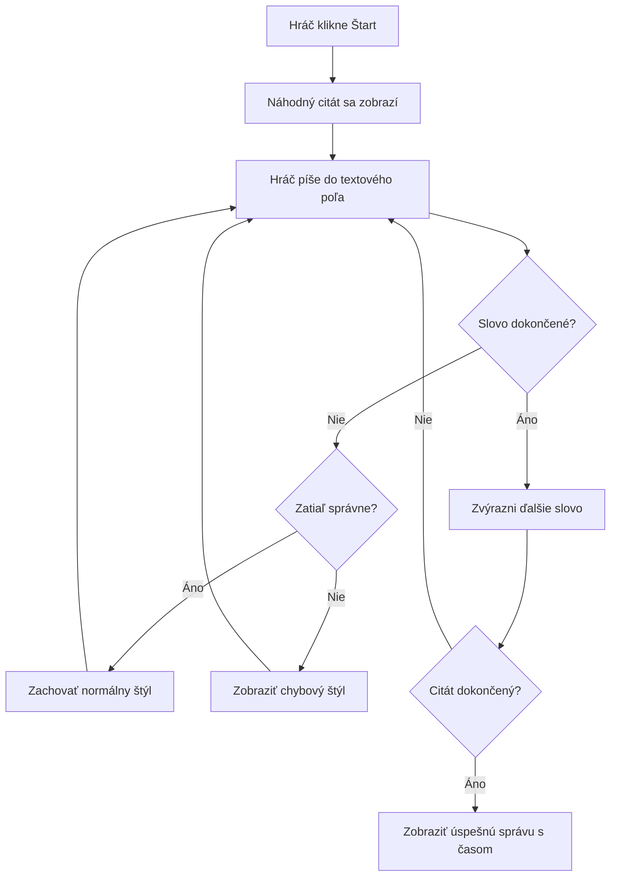
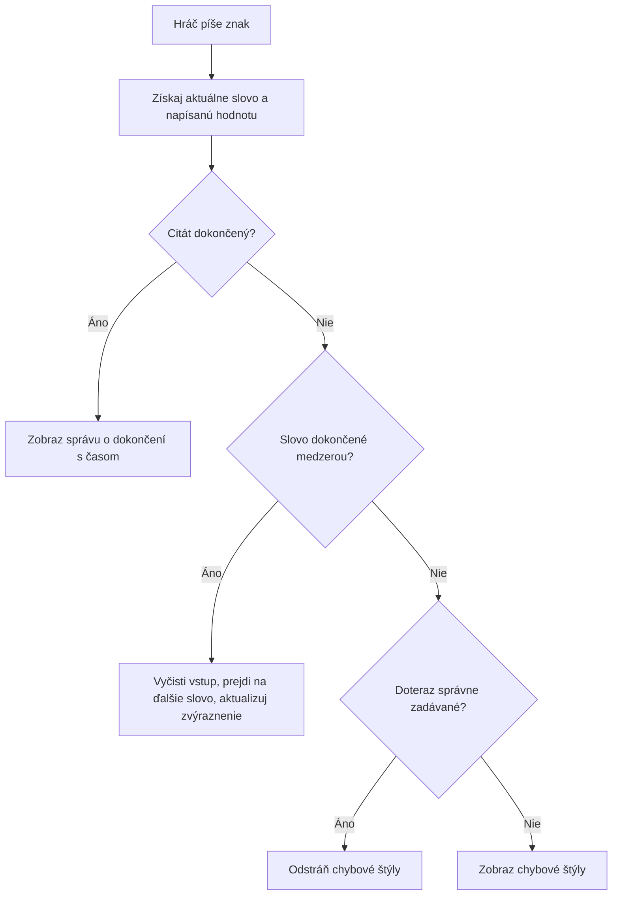
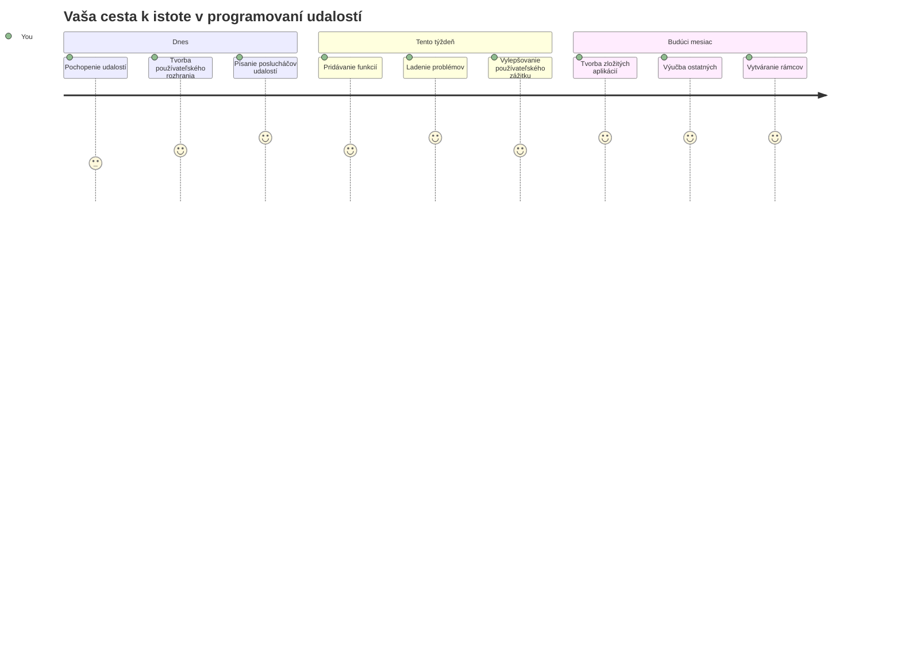

<!--
CO_OP_TRANSLATOR_METADATA:
{
  "original_hash": "da8bc72041a2bb3826a54654ee1a8844",
  "translation_date": "2026-01-07T05:04:14+00:00",
  "source_file": "4-typing-game/typing-game/README.md",
  "language_code": "sk"
}
-->
# Vytváranie hry pomocou udalostí

Niekedy ste sa zamýšľali, ako webové stránky vedia, kedy kliknete na tlačidlo alebo napíšete do textového poľa? To je kúzlo programovania riadeného udalosťami! Čo by mohlo byť lepším spôsobom, ako sa naučiť túto základnú zručnosť, než vytvoriť niečo užitočné – hru na rýchlosť písania, ktorá reaguje na každý stlačený kláves.

Uvidíte, ako webové prehliadače „komunikujú“ s vaším JavaScript kódom. Kedykoľvek kliknete, napíšete alebo pohnete myšou, prehliadač posiela malinké správy (nazývame ich udalosti) vášmu kódu a vy rozhodnete, ako na ne zareagujete!

Keď tu skončíme, vytvoríte skutočnú písaciu hru, ktorá sleduje vašu rýchlosť a presnosť. Dôležitejšie je, že pochopíte základné koncepty, ktoré poháňajú každú interaktívnu webovú stránku, ktorú ste kedy použili. Poďme na to!

## Prednáškový kvíz

[Prednáškový kvíz](https://ff-quizzes.netlify.app/web/quiz/21)

## Programovanie riadené udalosťami

Premyslite si svoju obľúbenú aplikáciu alebo webovú stránku – čo ju robí živou a reagujúcou? Je to všetko o tom, ako reaguje na to, čo robíte! Každý ťuk, klik, potiahnutie prstom alebo stlačenie klávesu vytvára to, čomu hovoríme „udalosti“, a tam sa deje skutočné kúzlo webového vývoja.

Čo robí programovanie pre web také zaujímavé: nikdy neviete, kedy niekto klikne na tlačidlo alebo začne písať do textového poľa. Môžu kliknúť hneď, počkať päť minút alebo možno kliknúť nikdy! Táto nepredvídateľnosť znamená, že musíme premýšľať inak, ako píšeme náš kód.

Namiesto písania kódu, ktorý beží od začiatku do konca ako recept, píšeme kód, ktorý trpezlivo čaká, kým sa niečo stane. Je to podobné ako telegrafisti v 1800-tych rokoch, ktorí sedeli pri svojich strojoch pripravení reagovať v momente, keď cez drôt prišla správa.

Čo teda presne je „udalosť“? Jednoducho povedané, je to niečo, čo sa stane! Keď kliknete na tlačidlo – to je udalosť. Keď napíšete písmeno – to je udalosť. Keď pohnete myšou – to je ďalšia udalosť.

Programovanie riadené udalosťami nám umožňuje nastaviť kód tak, aby počúval a reagoval. Vytvárame špeciálne funkcie nazývané **event listenery** (počúvatelia udalostí), ktoré trpezlivo čakajú, kým sa konkrétne veci stanú, a potom okamžite zasiahnu.

Myslite na event listenery ako na zvonček pre váš kód. Nastavíte zvonček (`addEventListener()`), určíte, aký zvuk má počúvať (napríklad 'click' alebo 'keypress') a potom špecifikujete, čo sa má stať, keď niekto zazvoní (vaša vlastná funkcia).

**Takto event listenery fungujú:**
- **Počúvajú** špecifické akcie používateľa ako kliky, stlačenia kláves alebo pohyby myši
- **Spúšťajú** váš vlastný kód, keď uvedená udalosť nastane
- **Reagujú** okamžite na užívateľské akcie, čím vytvárajú plynulý zážitok
- **Riešia** viacero udalostí na rovnakom prvku pomocou rôznych listenerov

> **POZNÁMKA:** Stojí za to zdôrazniť, že existuje mnoho spôsobov, ako vytvoriť event listenery. Môžete používať anonymné funkcie alebo vytvárať pomenované. Môžete využiť rôzne skratky, napríklad nastavenie vlastnosti `click` alebo použitie `addEventListener()`. V našej úlohe sa zameriame na `addEventListener()` a anonymné funkcie, pretože je to pravdepodobne najbežnejšia technika používaná webovými vývojármi. Je to tiež najflexibilnejšie, pretože `addEventListener()` funguje pre všetky udalosti a názov udalosti sa dá zadať ako parameter.

### Bežné udalosti

Aj keď webové prehliadače ponúkajú desiatky rôznych udalostí, na ktoré môžete počúvať, väčšina interaktívnych aplikácií sa spolieha len na malý počet základných udalostí. Pochopenie týchto jadrových udalostí vám poskytne základ na vytváranie sofistikovaných používateľských interakcií.

Existuje [koľko udalostí](https://developer.mozilla.org/docs/Web/Events), na ktoré môžete počúvať pri vytváraní aplikácie. V podstate čokoľvek, čo užívateľ na stránke urobí, vyvolá udalosť, čo vám dáva veľkú moc zabezpečiť, že dostanú požadovaný zážitok. Našťastie, zvyčajne budete potrebovať len malú sadu udalostí. Tu je niekoľko bežných (vrátane dvoch, ktoré použijeme pri vytváraní našej hry):

| Udalosť | Popis | Bežné použitia |
|---------|--------|----------------|
| `click` | Užívateľ klikol na niečo | Tlačidlá, odkazy, interaktívne prvky |
| `contextmenu` | Užívateľ klikol pravým tlačidlom myši | Vlastné kontextové menu pravého kliknutia |
| `select` | Užívateľ označil nejaký text | Úprava textu, kopírovanie |
| `input` | Užívateľ zadal text | Overovanie formulárov, vyhľadávanie v reálnom čase |

**Pochopenie týchto typov udalostí:**
- **Spúšťajú sa**, keď užívateľ interaguje s konkrétnymi prvkami na stránke
- **Poskytujú** podrobné informácie o užívateľskej akcii cez objekty udalostí
- **Umožňujú** vytvárať responzívne, interaktívne webové aplikácie
- **Fungujú** konzistentne naprieč rôznymi prehliadačmi a zariadeniami

## Vytvorenie hry

Teraz, keď rozumiete, ako udalosti fungujú, poďme túto vedomosť využiť v praxi a vytvoriť niečo užitočné. Vytvoríme hru na rýchlosť písania, ktorá ukáže, ako spracovávať udalosti, a zároveň vám pomôže rozvinúť dôležitú zručnosť vývojára.

Vytvoríme hru, aby sme preskúmali, ako udalosti fungujú v JavaScripte. Naša hra otestuje hráčove zručnosti pri písaní, čo je jedna z najpodceňovanejších zručností, ktoré by mal mať každý vývojár. Zábavný fakt: rozloženie klávesnice QWERTY, ktoré dnes používame, bolo vlastne navrhnuté v 1870-tych rokoch pre písacie stroje – a dobré zručnosti pri písaní sú stále rovnako cenné aj pre programátorov! Všeobecný priebeh hry bude vyzerať takto:


**Takto bude hra fungovať:**
- **Začína** keď hráč klikne na tlačidlo štart a zobrazí sa náhodná citácia
- **Sleduje** pokrok hráča pri písaní slovo po slove v reálnom čase
- **Zvýrazňuje** aktuálne slovo, aby pomohla hráčovi sústrediť sa
- **Poskytuje** okamžitú vizuálnu spätnú väzbu pri chybách v písaní
- **Počíta** a zobrazuje celkový čas po dokončení citácie

Postavme našu hru a naučme sa o udalostiach!

### Štruktúra súborov

Predtým, než začneme kódovať, zorganizujme si veci! Mať čistú štruktúru súborov od začiatku vám neskôr ušetrí bolesti hlavy a spraví váš projekt profesionálnejším. 😊

Ponecháme to jednoduché len s troma súbormi: `index.html` pre štruktúru stránky, `script.js` pre celú logiku hry a `style.css` aby všetko vyzeralo skvele. Toto je klasické trio, ktoré poháňa väčšinu webu!

**Vytvorte novú zložku pre svoju prácu otvorením konzoly alebo terminálu a zadaním nasledujúceho príkazu:**

```bash
# Linux alebo macOS
mkdir typing-game && cd typing-game

# Windows
md typing-game && cd typing-game
```

**Toto príkazy robia:**
- **Vytvorí** nový priečinok s názvom `typing-game` pre súbory projektu
- **Automaticky** prejde do novo vytvoreného priečinka
- **Nastaví** čisté pracovné prostredie pre vývoj hry

**Otvorte Visual Studio Code:**

```bash
code .
```

**Tento príkaz:**
- **Spustí** Visual Studio Code v aktuálnom adresári
- **Otvára** váš projektový priečinok v editore
- **Poskytuje** prístup ku všetkým vývojárskym nástrojom, ktoré potrebujete

**Pridajte do zložky v Visual Studio Code tri súbory s týmito názvami:**
- `index.html` – Obsahuje štruktúru a obsah hry
- `script.js` – Rieši všetku hernú logiku a event listenery
- `style.css` – Definuje vizuálny vzhľad a štýly

## Vytvorenie používateľského rozhrania

Postavme teraz pódium, kde sa bude odohrávať celá naša herná akcia! Predstavte si to ako navrhovanie ovládacieho panela na vesmírnu loď – musíme zabezpečiť, že všetko, čo hráči potrebujú, bude tam, kde to očakávajú.

Zistime, čo hra vlastne potrebuje. Ak by ste hrali hru na písanie, čo by ste chceli vidieť na obrazovke? Toto budeme potrebovať:

| Prvok UI | Účel | HTML element |
|----------|-------|--------------|
| Zobrazenie citácie | Zobrazuje text na napísanie | `<p>` s `id="quote"` |
| Oblasť správ | Zobrazuje stavové a úspešné správy | `<p>` s `id="message"` |
| Textové pole | Kde hráči píšu citáciu | `<input>` s `id="typed-value"` |
| Tlačidlo Štart | Začína hru | `<button>` s `id="start"` |

**Pochopenie štruktúry UI:**
- **Organizuje** obsah logicky od vrchu nadol
- **Priraďuje** jedinečné ID prvkom pre JavaScript cielenie
- **Poskytuje** jasnú vizuálnu hierarchiu pre lepší zážitok používateľa
- **Zahŕňa** sémantické HTML prvky pre prístupnosť

Každý z nich bude potrebovať ID, aby sme s nimi mohli pracovať v JavaScripte. Tiež pridáme odkazy na CSS a JavaScript súbory, ktoré vytvoríme.

Vytvorte nový súbor s názvom `index.html`. Pridajte nasledujúci HTML:

```html
<!-- inside index.html -->
<html>
<head>
  <title>Typing game</title>
  <link rel="stylesheet" href="style.css">
</head>
<body>
  <h1>Typing game!</h1>
  <p>Practice your typing skills with a quote from Sherlock Holmes. Click **start** to begin!</p>
  <p id="quote"></p> <!-- This will display our quote -->
  <p id="message"></p> <!-- This will display any status messages -->
  <div>
    <input type="text" aria-label="current word" id="typed-value" /> <!-- The textbox for typing -->
    <button type="button" id="start">Start</button> <!-- To start the game -->
  </div>
  <script src="script.js"></script>
</body>
</html>
```

**Rozobratie, čo táto štruktúra HTML robí:**
- **Prepojí** CSS štýl v `<head>` pre štýly
- **Vytvorí** jasný nadpis a inštrukcie pre používateľov
- **Zabezpečí** miesto pre dynamický obsah v odstavcoch so špecifickými ID
- **Zahrnie** vstupné pole s prístupovými atribútmi
- **Poskytne** tlačidlo Štart na spustenie hry
- **Načíta** JavaScript súbor na konci pre optimálny výkon

### Spustenie aplikácie

Pravidelné testovanie aplikácie počas vývoja vám pomáha chytiť chyby skoro a vidieť svoj pokrok v reálnom čase. Live Server je neoceniteľný nástroj, ktorý automaticky obnovuje váš prehliadač vždy, keď uložíte zmeny, čo výrazne urýchľuje vývoj.

Najlepšie je vyvíjať iteratívne, aby ste videli, ako veci vyzerajú. Spustime našu aplikáciu. Existuje skvelé rozšírenie pre Visual Studio Code s názvom [Live Server](https://marketplace.visualstudio.com/items?itemName=ritwickdey.LiveServer&WT.mc_id=academic-77807-sagibbon), ktoré bude vašu aplikáciu hosťovať lokálne a automaticky obnovovať prehliadač zakaždým, keď uložíte.

**Nainštalujte [Live Server](https://marketplace.visualstudio.com/items?itemName=ritwickdey.LiveServer&WT.mc_id=academic-77807-sagibbon) podľa odkazu a kliknutím na Inštalovať:**

**Počas inštalácie sa stane:**
- **Vaša prehliadač** vás vyzve na otvorenie Visual Studio Code
- **Viesť** vás procesom inštalácie rozšírenia
- **Môže vyžadovať** reštartovanie Visual Studio Code na dokončenie nastavenia

**Keď je nainštalované, v Visual Studio Code stlačte Ctrl-Shift-P (alebo Cmd-Shift-P) pre otvorenie príkazovej palety:**

**Pochopenie príkazovej palety:**
- **Poskytuje** rýchly prístup ku všetkým príkazom VS Code
- **Vyhľadáva** príkazy, ako píšete
- **Ponúka** klávesové skratky pre rýchlejší vývoj

**Napíšte "Live Server: Open with Live Server":**

**Čo Live Server robí:**
- **Spustí** lokálny vývojový server pre váš projekt
- **Automaticky** obnovuje prehliadač, keď uložíte súbory
- **Podáva** vaše súbory z lokálnej URL (zvyčajne `localhost:5500`)

**Otvorte prehliadač a prejdite na adresu `https://localhost:5500`:**

Teraz by ste mali vidieť stránku, ktorú ste vytvorili! Pridajme nejakú funkcionalitu.

## Pridanie CSS

Teraz to spravme pekné! Vizuálna spätná väzba bola kľúčová pre používateľské rozhrania už od ranných čias počítačov. V 80. rokoch vedci zistili, že okamžitá vizuálna spätná väzba dramaticky zlepšuje výkon používateľov a znižuje chyby. Presne to chceme vytvoriť.

Naša hra musí byť úplne jasná, čo sa deje. Hráči by mali okamžite vedieť, ktoré slovo majú písať, a ak urobia chybu, mali by ju okamžite vidieť. Vytvorme jednoduché, ale efektívne štýly:

Vytvorte nový súbor s názvom `style.css` a pridajte nasledujúcu syntax.

```css
/* inside style.css */
.highlight {
  background-color: yellow;
}

.error {
  background-color: lightcoral;
  border: red;
}
```

**Pochopenie týchto CSS tried:**
- **Zvýrazňuje** aktuálne slovo žltým podkladom pre jasnú vizuálnu orientáciu
- **Signalizuje** chyby v písaní svetlo koralovou farbou pozadia
- **Poskytuje** okamžitú spätnú väzbu bez prerušenia písania používateľa
- **Používa** kontrastné farby pre prístupnosť a jasnú vizuálnu komunikáciu

✅ Čo sa týka CSS, môžete svoju stránku usporiadať podľa svojich predstáv. Venujte chvíľu tomu, aby stránka vyzerala príťažlivejšie:

- Vyberte iný font
- Farebne ošetrite nadpisy
- Zmeňte veľkosti prvkov

## JavaScript

Tu sa to začne zaujímavo! 🎉 Máme HTML štruktúru a CSS štýly, ale teraz je naša hra ako krásne auto bez motora. JavaScript bude tým motorom – je to to, čo všetko prinúti fakticky fungovať a reagovať na to, čo hráči robia.

Tu uvidíte, ako vaša tvorba ožíva. Postupne sa tomu budeme venovať krok za krokom, aby nič nebolo príliš komplikované:

| Krok | Účel | Čo sa naučíte |
|-------|-------|----------------|
| [Vytvorenie konštánt](../../../../4-typing-game/typing-game) | Nastaviť citácie a referencie na DOM | Správa premenných a výber DOM prvkov |
| [Event listener na spustenie hry](../../../../4-typing-game/typing-game) | Rieši inicializáciu hry | Spracovanie udalostí a aktualizácie UI |
| [Event listener na písanie](../../../../4-typing-game/typing-game) | Spracovať užívateľský vstup v reálnom čase | Overovanie vstupu a dynamická spätná väzba |

**Táto štruktúrovaná metóda vám pomôže:**
- **Organizovať** váš kód do logických, spravovateľných častí
- **Budovať** funkcionalitu postupne pre jednoduchšie ladenie
- **Pochopiť**, ako spolu pracujú rôzne časti vašej aplikácie
- **Vytvárať** znovupoužiteľné vzory pre budúce projekty

Ale najprv vytvorte nový súbor s názvom `script.js`.

### Pridanie konštánt

Predtým, než sa pustíme do akcie, zozbierajme všetky naše zdroje! Rovnako, ako riadiace centrum NASA nastavuje všetky monitorovacie systémy pred štartom, je oveľa jednoduchšie, keď máte všetko pripravené. Ušetrí nám to neskorší gúľanie po veciach a pomáha predchádzať preklepom.

Tu je, čo potrebujeme najskôr nastaviť:

| Typ dát | Účel | Príklad |
| Pole citátov | Uložte všetky možné citáty pre hru | `['Quote 1', 'Quote 2', ...]` |
| Pole slov | Rozdeľte aktuálny citát na jednotlivé slová | `['When', 'you', 'have', ...]` |
| Index slova | Sledujte, ktoré slovo hráč práve píše | `0, 1, 2, 3...` |
| Čas začiatku | Vypočítajte uplynutý čas pre skórovanie | `Date.now()` |

**Taktiež budeme potrebovať odkazy na naše UI prvky:**
| Prvok | ID | Účel |
|--------|----|---------|
| Textové pole | `typed-value` | Kde hráči píšu |
| Zobrazenie citátu | `quote` | Ukazuje citát na písanie |
| Oblasť správy | `message` | Ukazuje aktualizácie stavu |

```javascript
// vo vnútri script.js
// všetky naše citáty
const quotes = [
    'When you have eliminated the impossible, whatever remains, however improbable, must be the truth.',
    'There is nothing more deceptive than an obvious fact.',
    'I ought to know by this time that when a fact appears to be opposed to a long train of deductions it invariably proves to be capable of bearing some other interpretation.',
    'I never make exceptions. An exception disproves the rule.',
    'What one man can invent another can discover.',
    'Nothing clears up a case so much as stating it to another person.',
    'Education never ends, Watson. It is a series of lessons, with the greatest for the last.',
];
// uložiť zoznam slov a index slova, ktoré hráč práve píše
let words = [];
let wordIndex = 0;
// počiatočný čas
let startTime = Date.now();
// prvky stránky
const quoteElement = document.getElementById('quote');
const messageElement = document.getElementById('message');
const typedValueElement = document.getElementById('typed-value');
```

**Rozoberme, čo tento nastavený kód dosahuje:**
- **Ukladá** pole citátov Sherlocka Holmesa pomocou `const`, pretože citáty sa nebudú meniť
- **Inicializuje** sledovacie premenné pomocou `let`, pretože tieto hodnoty sa počas hry budú meniť
- **Zachytáva** odkazy na DOM prvky pomocou `document.getElementById()` pre efektívny prístup
- **Zakladá** základ všetkej funkcionality hry s jasnými, popisnými názvami premenných
- **Organizuje** súvisiace dáta a prvky logicky pre jednoduchšiu údržbu kódu

✅ Pokračujte a pridajte do svojej hry viac citátov

> 💡 **Pro Tip**: Do elementov sa môžeme v kóde odkazovať kedykoľvek pomocou `document.getElementById()`. Keďže na tieto prvky budeme odkazovať pravidelne, vyhneme sa preklepom v textových reťazcoch použitím konštánt. Frameworky ako [Vue.js](https://vuejs.org/) alebo [React](https://reactjs.org/) vám môžu pomôcť lepšie spravovať centralizáciu kódu.
>
**Prečo tento prístup tak dobre funguje:**
- **Zabraňuje** pravopisným chybám pri opakovanom odkazovaní na prvky
- **Zlepšuje** čitateľnosť kódu s popisnými názvami konštánt
- **Umožňuje** lepšiu podporu v IDE vďaka automatickému dopĺňaniu a kontrole chýb
- **Uľahčuje** refaktorovanie, ak sa neskôr zmenia ID prvkov

Pozrite si video o používaní `const`, `let` a `var`

[](https://youtube.com/watch?v=JNIXfGiDWM8 "Types of variables")

> 🎥 Kliknite na obrázok vyššie pre video o premenných.

### Pridajte logiku spustenia

Tu sa všetko začne spájať! 🚀 Chystáte sa napísať váš prvý skutočný poslucháč udalostí, a je veľmi uspokojujúce vidieť, ako váš kód reaguje na kliknutie tlačidla.

Predstavte si to: niekde tam vonku hráč klikne na tlačidlo "Štart" a váš kód musí byť na to pripravený. Nevieme, kedy klikne – možno hneď, možno po káve – ale keď to urobí, vaša hra ožije.

Keď používateľ klikne na `start`, potrebujeme vybrať citát, nastaviť používateľské rozhranie a pripraviť sledovanie aktuálneho slova a času. Nižšie je JavaScript, ktorý budete musieť pridať; pod blokom skriptu o ňom diskutujeme.

```javascript
// na konci script.js
document.getElementById('start').addEventListener('click', () => {
  // získať citát
  const quoteIndex = Math.floor(Math.random() * quotes.length);
  const quote = quotes[quoteIndex];
  // Vložiť citát do poľa slov
  words = quote.split(' ');
  // resetovať index slova pre sledovanie
  wordIndex = 0;

  // aktualizácie používateľského rozhrania
  // Vytvoriť pole span elementov, aby sme mohli nastaviť triedu
  const spanWords = words.map(function(word) { return `<span>${word} </span>`});
  // Prekonať na reťazec a nastaviť ako innerHTML na zobrazenie citátu
  quoteElement.innerHTML = spanWords.join('');
  // Zvýrazniť prvé slovo
  quoteElement.childNodes[0].className = 'highlight';
  // Vymazať všetky predchádzajúce správy
  messageElement.innerText = '';

  // Nastaviť textové pole
  // Vyčistiť textové pole
  typedValueElement.value = '';
  // nastaviť fokus
  typedValueElement.focus();
  // nastaviť obsluhu udalosti

  // Spustiť časovač
  startTime = new Date().getTime();
});
```

**Rozoberme kód na logické časti:**

**📊 Nastavenie sledovania slov:**
- **Vyberá** náhodný citát pomocou `Math.floor()` a `Math.random()` pre rozmanitosť
- **Konvertuje** citát na pole jednotlivých slov pomocou `split(' ')`
- **Resetuje** `wordIndex` na 0, pretože hráči začínajú prvé slovo
- **Pripravuje** stav hry na novú kolo

**🎨 Nastavenie UI a zobrazenie:**
- **Vytvára** pole `<span>` prvkov, obalujúcich každé slovo pre individuálne štýlovanie
- **Zlúči** tieto span prvky do jedného reťazca pre efektívnu aktualizáciu DOM
- **Zvýrazní** prvé slovo pridaním CSS triedy `highlight`
- **Vyčistí** všetky predchádzajúce herné správy pre čistý štart

**⌨️ Príprava textového poľa:**
- **Vymaže** existujúci text v poli
- **Nastaví fokus** do textového poľa, aby hráči mohli začať písať ihneď
- **Pripraví** vstupnú oblasť pre novú hernú reláciu

**⏱️ Inicializácia časovača:**
- **Zachytí** aktuálny čas pomocou `new Date().getTime()`
- **Umožňuje** presný výpočet rýchlosti písania a dokončenia
- **Spúšťa** sledovanie výkonu pre hernú reláciu

### Pridajte logiku písania

Tu sa dostávame k srdcu našej hry! Nebojte sa, ak vám to príde spočiatku veľa – prejdeme každý dielik a nakoniec uvidíte, aké to je logické.

Čo tu budujeme, je dosť sofistikované: zakaždým, keď niekto zadá písmeno, náš kód overí, čo zadal, poskytne spätnú väzbu a rozhodne, čo má nasledovať. Je to podobné, ako kedysi staré textové procesory ako WordStar v 70. rokoch poskytovali okamžitú spätnú väzbu pri písaní.

```javascript
// na konci script.js
typedValueElement.addEventListener('input', () => {
  // Získajte aktuálne slovo
  const currentWord = words[wordIndex];
  // získajte aktuálnu hodnotu
  const typedValue = typedValueElement.value;

  if (typedValue === currentWord && wordIndex === words.length - 1) {
    // koniec vety
    // Zobraziť úspech
    const elapsedTime = new Date().getTime() - startTime;
    const message = `CONGRATULATIONS! You finished in ${elapsedTime / 1000} seconds.`;
    messageElement.innerText = message;
  } else if (typedValue.endsWith(' ') && typedValue.trim() === currentWord) {
    // koniec slova
    // vymazať typedValueElement pre nové slovo
    typedValueElement.value = '';
    // prejsť na ďalšie slovo
    wordIndex++;
    // resetovať názov triedy pre všetky prvky v citáte
    for (const wordElement of quoteElement.childNodes) {
      wordElement.className = '';
    }
    // zvýrazniť nové slovo
    quoteElement.childNodes[wordIndex].className = 'highlight';
  } else if (currentWord.startsWith(typedValue)) {
    // aktuálne správne
    // zvýrazniť ďalšie slovo
    typedValueElement.className = '';
  } else {
    // stav chyby
    typedValueElement.className = 'error';
  }
});
```

**Pochopenie toku logiky písania:**

Táto funkcia používa vodopádový prístup, overujúc podmienky od najšpecifickejších po najvšeobecnejšie. Rozoberme každú situáciu:


**🏁 Dokončenie citátu (Scenár 1):**
- **Overuje**, či napísaná hodnota zodpovedá aktuálnemu slovu A či sme na poslednom slove
- **Vypočíta** uplynutý čas od začiatku odpočítaním času štartu
- **Prevedie** milisekundy na sekundy delením 1000
- **Zobrazí** blahoželaciu správu s časom dokončenia

**✅ Dokončenie slova (Scenár 2):**
- **Zistí**, že slovo je dokončené, keď vstup končí medzerou
- **Overí**, že orezaný vstup presne zodpovedá aktuálnemu slovu
- **Vyčistí** vstupné pole pre ďalšie slovo
- **Posunie** sa na ďalšie slovo inkrementovaním `wordIndex`
- **Aktualizuje** vizuálne zvýraznenie odstránením všetkých tried a zvýraznením nového slova

**📝 Prebiehajúce písanie (Scenár 3):**
- **Potvrdí**, že aktuálne slovo začína zadaným textom
- **Odstráni** akékoľvek chybové štýly, aby zobrazil správny vstup
- **Umožní** pokračovať v písaní bez prerušení

**❌ Stav chyby (Scenár 4):**
- **Aktivuje sa**, keď napísaný text nezodpovedá očakávanému začiatku slova
- **Pridá** chybovú CSS triedu pre okamžitú vizuálnu spätnú väzbu
- **Pomáha** hráčom rýchlo identifikovať a opraviť chyby

## Otestujte svoju aplikáciu

Pozrite, čo ste dosiahli! 🎉 Práve ste vytvorili skutočnú fungujúcu písaciu hru od základov pomocou programovania riadeného udalosťami. Vyhraďte si chvíľku a oceňte to – toto nie je malý výkon!

Teraz prichádza fáza testovania! Bude to fungovať, ako očakávame? Niečo sme nepokryli? Vec je taká, že ak niečo nefunguje hneď úplne dokonale, je to úplne normálne. Aj skúsení developeri často nachádzajú chyby vo svojom kóde. Je to súčasť vývoja!

Kliknite na `start` a začnite písať! Malo by to vyzerať trochu ako animácia, ktorú sme videli predtým.


**Čo testovať vo vašej aplikácii:**
- **Overuje**, či kliknutie na Štart zobrazí náhodný citát
- **Potvrdzuje**, že písanie správne zvýrazní aktuálne slovo
- **Skontroluje**, či sa zobrazí chybové štýlovanie pri nesprávnom písaní
- **Zabezpečí**, že dokončenie slov správne posunie zvýraznenie
- **Otestuje**, či dokončenie citátu zobrazí správu o dokončení s časom

**Bežné tipy na ladenie:**
- **Skontrolujte** konzolu prehliadača (F12) pre JavaScript chyby
- **Overte**, že všetky názvy súborov sa presne zhodujú (s diakritikou a veľkosťou písmen)
- **Uistite sa**, že Live Server beží a správne obnovuje stránku
- **Otestujte** rôzne citáty, aby ste potvrdili, že náhodný výber funguje

---

## Výzva GitHub Copilot Agent 🎮

Použite režim Agent na splnenie nasledujúcej výzvy:

**Popis:** Rozšírte hru písania implementáciou systému obtiažnosti, ktorý upravuje hru podľa výkonu hráča. Táto výzva vám pomôže precvičiť pokročilé spracovanie udalostí, analýzu dát a dynamické aktualizácie UI.

**Výzva:** Vytvorte systém úpravy obtiažnosti pre písaciu hru, ktorý:
1. Sleduje rýchlosť písania hráča (slová za minútu) a percento presnosti
2. Automaticky sa prispôsobuje trom úrovniam obtiažnosti: Jednoduchá (jednoduché citáty), Stredná (aktuálne citáty), Ťažká (zložité citáty s interpunkciou)
3. Zobrazuje aktuálnu úroveň obtiažnosti a štatistiky hráča v UI
4. Implementuje počítadlo sérii, ktoré po 3 po sebe idúcich dobrých výkonoch zvýši obtiažnosť
5. Pridáva vizuálnu spätnú väzbu (farby, animácie) na indikáciu zmien obtiažnosti

Pridajte potrebné HTML prvky, CSS štýly a JavaScript funkcie na implementovanie tejto funkcie. Zabezpečte správne spracovanie chýb a udržanie prístupnosti hry s vhodnými ARIA popiskami.

Viac o [agent režime](https://code.visualstudio.com/blogs/2025/02/24/introducing-copilot-agent-mode) sa dozviete tu.

## 🚀 Výzva

Ste pripravený posunúť svoju písaciu hru na ďalšiu úroveň? Skúste implementovať tieto pokročilé funkcie na hlbšie pochopenie spracovania udalostí a manipulácie s DOM:

**Pridajte ďalšiu funkcionalitu:**

| Funkcia | Popis | Schopnosti, ktoré si precvičíte |
|---------|-------------|------------------------|
| **Riadenie vstupu** | Zakážte `input` event listener po dokončení a znovu ho povoľte po kliknutí na tlačidlo | Správa udalostí a stavov |
| **Správa stavu UI** | Zakážte textové pole, keď hráč dokončí citát | Manipulácia s DOM vlastnosťami |
| **Modálny dialóg** | Zobrazte modálne dialógové okno so správou o úspechu | Pokročilé UI vzory a prístupnosť |
| **Systém najvyšších skóre** | Uložte najvyššie skóre pomocou `localStorage` | Browserové úložiská API a perzistencia dát |

**Tipy na implementáciu:**
- **Preskúmajte** `localStorage.setItem()` a `localStorage.getItem()` pre trvalé uloženie
- **Precvičte** pridávanie a odstraňovanie event listenerov dynamicky
- **Prebádajte** HTML dialógové elementy alebo CSS modálne vzory
- **Zvážte** prístupnosť pri zakazovaní a povoľovaní ovládacích prvkov formulára

## Kvíz po prednáške

[Kvíz po prednáške](https://ff-quizzes.netlify.app/web/quiz/22)

---

## 🚀 Vaša časová os majstrovstva písania

### ⚡ **Čo zvládnete v nasledujúcich 5 minútach**
- [ ] Otestujte svoju hru s rôznymi citátmi, aby ste overili plynulosť
- [ ] Experimentujte s CSS štýlmi – skúste zmeniť farbu zvýraznenia a chýb
- [ ] Otvorte si DevTools prehliadača (F12) a sledujte Konzolu počas hrania
- [ ] Výzva: Dokončite citát čo najrýchlejšie

### ⏰ **Čo zvládnete do hodiny**
- [ ] Pridajte viac citátov do poľa (napríklad z vašich obľúbených kníh alebo filmov)
- [ ] Implementujte systém najvyšších skóre pomocou localStorage z výzvy
- [ ] Vytvorte kalkulačku slov za minútu, ktorá sa zobrazí po každej hre
- [ ] Pridajte zvukové efekty na správne písanie, chyby a dokončenie

### 📅 **Váš týždenný plán dobrodružstva**
- [ ] Vytvorte multiplayer verziu, kde môžu priatelia súťažiť vedľa seba
- [ ] Vytvorte rôzne úrovne obtiažnosti s rôznou náročnosťou citátov
- [ ] Pridajte progress bar ukazujúci, koľko citátu je dokončených
- [ ] Implementujte užívateľské kontá so sledovaním osobných štatistík
- [ ] Navrhnite vlastné témy a nechajte používateľov vybrať si štýl

### 🗓️ **Vaša mesačná transformácia**
- [ ] Vytvorte kurz písania s lekciami, ktorý postupne učí správne umiestnenie prstov
- [ ] Postavte analytiku, ktorá ukáže písmená alebo slová, ktoré spôsobujú najviac chýb
- [ ] Pridajte podporu pre rôzne jazyky a rozloženia klávesnice
- [ ] Integrujte sa so vzdelávacími API na získavanie citátov z literárnych databáz
- [ ] Publikujte svoju vylepšenú písaciu hru na použitie a zábavu iných

### 🎯 **Záverečná reflexia**

**Predtým, než pôjdete ďalej, venujte chvíľu tomuto:**
- Ktorý moment bol pri tvorbe hry najuspokojivejší?
- Ako sa k vám programovanie riadené udalosťami teraz stavia na rozdiel od začiatkov?
- Ktorú funkciu máte najväčšiu chuť pridať, aby bola hra unikátna?
- Ako by ste mohli koncepty spracovania udalostí aplikovať v iných projektoch?


> 🌟 **Pamätajte**: Práve ste zvládli jeden zo základných konceptov, ktorý poháňa každú interaktívnu webstránku a aplikáciu. Programovanie riadené udalosťami je to, čo robí web živým a responzívnym. Kedykoľvek vidíte rozbaľovacie menu, formulár, ktorý validuje, čo píšete, alebo hru reagujúcu na kliknutia, teraz chápete kúzlo za tým. Nie je to len učenie sa kódu – učíte sa tvoriť zážitky, ktoré sú intuitívne a pútavé! 🎉

---

## Prehľad a samostatné štúdium

Prečítajte si o [všetkých dostupných udalostiach](https://developer.mozilla.org/docs/Web/Events), ktoré má webový prehliadač pre vývojára a zamyslite sa nad scenármi, v ktorých by ste ich použili.

## Zadanie

[Vytvorte novú klávesnicovú hru](assignment.md)

---

<!-- CO-OP TRANSLATOR DISCLAIMER START -->
**Vyhlásenie o zodpovednosti**:
Tento dokument bol preložený pomocou AI prekladateľskej služby [Co-op Translator](https://github.com/Azure/co-op-translator). Aj keď sa snažíme o presnosť, prosím, berte na vedomie, že automatizované preklady môžu obsahovať chyby alebo nepresnosti. Pôvodný dokument v jeho pôvodnom jazyku by mal byť považovaný za autoritatívny zdroj. Pre kritické informácie sa odporúča profesionálny ľudský preklad. Nie sme zodpovední za akékoľvek nedorozumenia alebo nesprávne interpretácie vyplývajúce z použitia tohto prekladu.
<!-- CO-OP TRANSLATOR DISCLAIMER END -->