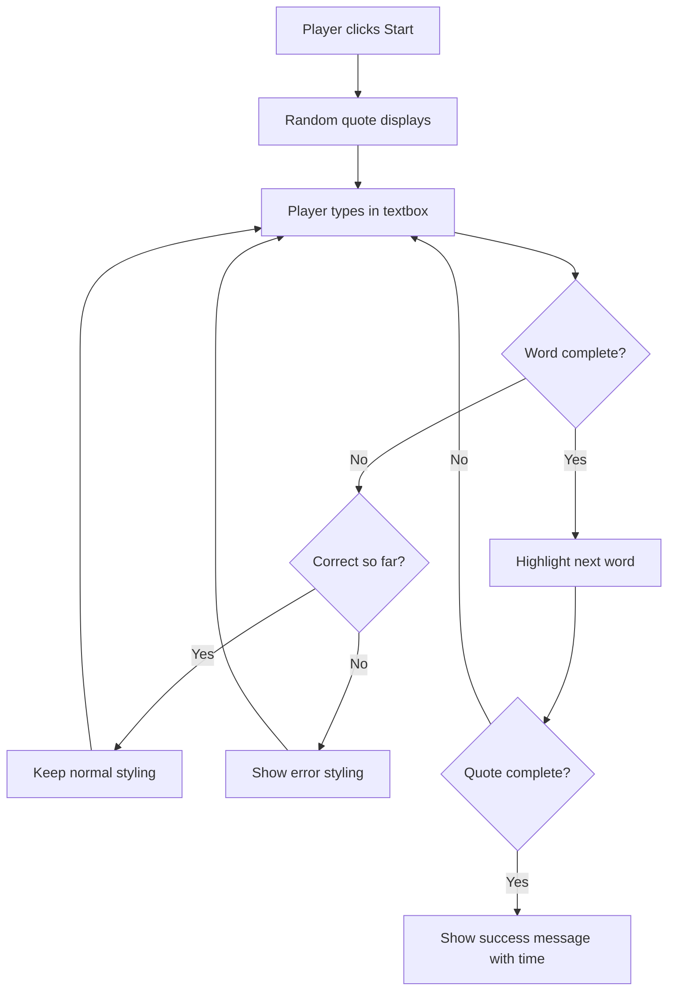
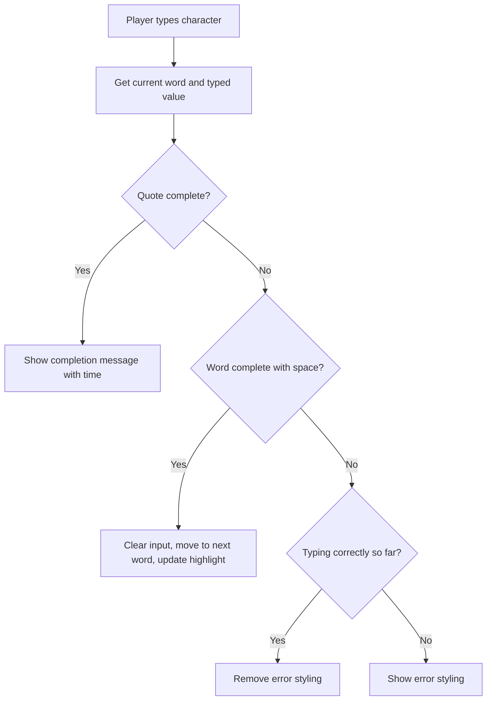

<!--
CO_OP_TRANSLATOR_METADATA:
{
  "original_hash": "e6b75e5b8caae906473a8a09d77b7121",
  "translation_date": "2025-10-24T21:44:17+00:00",
  "source_file": "4-typing-game/typing-game/README.md",
  "language_code": "sk"
}
-->
# Vytvorenie hry pomocou udalostí

Premýšľali ste niekedy nad tým, ako webové stránky vedia, že ste klikli na tlačidlo alebo napísali do textového poľa? To je kúzlo programovania riadeného udalosťami! Aký lepší spôsob, ako sa naučiť túto základnú zručnosť, než vytvoriť niečo užitočné - hru na meranie rýchlosti písania, ktorá reaguje na každý váš stisk klávesy.

Na vlastné oči uvidíte, ako webové prehliadače "komunikujú" s vaším JavaScriptovým kódom. Zakaždým, keď kliknete, napíšete alebo pohnete myšou, prehliadač posiela malé správy (nazývame ich udalosti) vášmu kódu a vy rozhodujete, ako na ne reagovať!

Keď skončíme, budete mať vytvorenú skutočnú hru na písanie, ktorá sleduje vašu rýchlosť a presnosť. Čo je však dôležitejšie, pochopíte základné koncepty, ktoré poháňajú každú interaktívnu webovú stránku, ktorú ste kedy použili. Poďme na to!

## Kvíz pred prednáškou

[Pre-lecture quiz](https://ff-quizzes.netlify.app/web/quiz/21)

## Programovanie riadené udalosťami

Premýšľajte o svojej obľúbenej aplikácii alebo webovej stránke - čo ju robí živou a interaktívnou? Všetko závisí od toho, ako reaguje na vaše akcie! Každé ťuknutie, kliknutie, posunutie alebo stisk klávesy vytvára to, čo nazývame "udalosť", a práve tam sa odohráva skutočná mágia webového vývoja.

Tu je to, čo robí programovanie pre web tak zaujímavým: nikdy nevieme, kedy niekto klikne na tlačidlo alebo začne písať do textového poľa. Môže kliknúť okamžite, počkať päť minút alebo možno nikdy neklikne! Táto nepredvídateľnosť znamená, že musíme premýšľať inak o tom, ako píšeme náš kód.

Namiesto písania kódu, ktorý beží odhora nadol ako recept, píšeme kód, ktorý trpezlivo čaká, kým sa niečo stane. Je to podobné ako telegrafisti v 19. storočí, ktorí sedeli pri svojich strojoch, pripravení reagovať v momente, keď cez drôt prišla správa.

Takže čo presne je "udalosť"? Jednoducho povedané, je to niečo, čo sa stane! Keď kliknete na tlačidlo - to je udalosť. Keď napíšete písmeno - to je udalosť. Keď pohnete myšou - to je ďalšia udalosť.

Programovanie riadené udalosťami nám umožňuje nastaviť náš kód tak, aby počúval a reagoval. Vytvárame špeciálne funkcie nazývané **event listeners** (poslucháče udalostí), ktoré trpezlivo čakajú na konkrétne veci, ktoré sa majú stať, a potom sa aktivujú, keď sa to stane.

Predstavte si poslucháče udalostí ako zvonček pre váš kód. Nastavíte zvonček (`addEventListener()`), poviete mu, na aký zvuk má počúvať (napríklad 'click' alebo 'keypress') a potom určíte, čo sa má stať, keď niekto zazvoní (vaša vlastná funkcia).

**Ako fungujú poslucháče udalostí:**
- **Počúvajú** konkrétne akcie používateľa, ako kliknutia, stisky kláves alebo pohyby myšou
- **Vykonávajú** váš vlastný kód, keď nastane špecifikovaná udalosť
- **Reagujú** okamžite na interakcie používateľa, čím vytvárajú plynulý zážitok
- **Spracovávajú** viacero udalostí na rovnakom prvku pomocou rôznych poslucháčov

> **NOTE:** Stojí za zmienku, že existuje mnoho spôsobov, ako vytvoriť poslucháče udalostí. Môžete použiť anonymné funkcie alebo vytvoriť pomenované. Môžete použiť rôzne skratky, ako nastavenie vlastnosti `click` alebo použitie `addEventListener()`. V našom cvičení sa zameriame na `addEventListener()` a anonymné funkcie, pretože je to pravdepodobne najbežnejšia technika, ktorú weboví vývojári používajú. Je tiež najflexibilnejšia, pretože `addEventListener()` funguje pre všetky udalosti a názov udalosti môže byť poskytnutý ako parameter.

### Bežné udalosti

Hoci webové prehliadače ponúkajú desiatky rôznych udalostí, ktoré môžete počúvať, väčšina interaktívnych aplikácií sa spolieha len na niekoľko základných udalostí. Pochopenie týchto základných udalostí vám poskytne základ na vytváranie sofistikovaných interakcií s používateľmi.

Existuje [desiatky udalostí](https://developer.mozilla.org/docs/Web/Events), ktoré môžete počúvať pri vytváraní aplikácie. V podstate čokoľvek, čo používateľ urobí na stránke, vyvolá udalosť, čo vám dáva veľkú moc zabezpečiť, že dostane požadovaný zážitok. Našťastie budete zvyčajne potrebovať len malú časť týchto udalostí. Tu je niekoľko bežných (vrátane dvoch, ktoré použijeme pri vytváraní našej hry):

| Udalosť | Popis | Bežné použitie |
|---------|-------|----------------|
| `click` | Používateľ klikol na niečo | Tlačidlá, odkazy, interaktívne prvky |
| `contextmenu` | Používateľ klikol pravým tlačidlom myši | Vlastné kontextové menu |
| `select` | Používateľ označil nejaký text | Úprava textu, operácie kopírovania |
| `input` | Používateľ zadal nejaký text | Validácia formulára, vyhľadávanie v reálnom čase |

**Pochopenie týchto typov udalostí:**
- **Spúšťajú sa**, keď používatelia interagujú s konkrétnymi prvkami na vašej stránke
- **Poskytujú** podrobné informácie o akcii používateľa prostredníctvom objektov udalostí
- **Umožňujú** vytvárať responzívne, interaktívne webové aplikácie
- **Fungujú** konzistentne na rôznych prehliadačoch a zariadeniach

## Vytvorenie hry

Teraz, keď rozumiete, ako udalosti fungujú, poďme tieto vedomosti použiť v praxi a vytvoriť niečo užitočné. Vytvoríme hru na meranie rýchlosti písania, ktorá demonštruje spracovanie udalostí a zároveň vám pomôže rozvíjať dôležitú zručnosť vývojára.

Vytvoríme hru, aby sme preskúmali, ako udalosti fungujú v JavaScripte. Naša hra otestuje schopnosť hráča písať, čo je jedna z najviac podceňovaných zručností, ktorú by mal mať každý vývojár. Zaujímavý fakt: rozloženie klávesnice QWERTY, ktoré dnes používame, bolo navrhnuté v 70. rokoch 19. storočia pre písacie stroje - a dobré zručnosti v písaní sú stále rovnako cenné pre programátorov aj dnes! Všeobecný priebeh hry bude vyzerať takto:



**Ako bude naša hra fungovať:**
- **Začne**, keď hráč klikne na tlačidlo štart a zobrazí náhodný citát
- **Sleduje** pokrok hráča v písaní slovo po slove v reálnom čase
- **Zvýrazní** aktuálne slovo, aby usmernil pozornosť hráča
- **Poskytne** okamžitú vizuálnu spätnú väzbu na chyby v písaní
- **Vypočíta** a zobrazí celkový čas po dokončení citátu

Poďme vytvoriť našu hru a naučiť sa o udalostiach!

### Štruktúra súborov

Predtým, než začneme kódovať, poďme sa zorganizovať! Mať čistú štruktúru súborov od začiatku vám ušetrí bolesti hlavy neskôr a urobí váš projekt profesionálnejším. 😊

Budeme to držať jednoduché s iba tromi súbormi: `index.html` pre štruktúru našej stránky, `script.js` pre všetku logiku hry a `style.css`, aby všetko vyzeralo skvele. Toto je klasická trojica, ktorá poháňa väčšinu webu!

**Vytvorte nový priečinok pre svoju prácu otvorením konzoly alebo terminálového okna a zadaním nasledujúceho príkazu:**

```bash
# Linux or macOS
mkdir typing-game && cd typing-game

# Windows
md typing-game && cd typing-game
```

**Čo tieto príkazy robia:**
- **Vytvoria** nový adresár s názvom `typing-game` pre vaše projektové súbory
- **Presunú** vás automaticky do novo vytvoreného adresára
- **Nastavia** čisté pracovné prostredie pre vývoj vašej hry

**Otvorte Visual Studio Code:**

```bash
code .
```

**Tento príkaz:**
- **Spustí** Visual Studio Code v aktuálnom adresári
- **Otvára** váš projektový priečinok v editore
- **Poskytuje** prístup ku všetkým nástrojom na vývoj, ktoré budete potrebovať

**Pridajte tri súbory do priečinka vo Visual Studio Code s nasledujúcimi názvami:**
- `index.html` - Obsahuje štruktúru a obsah vašej hry
- `script.js` - Spracováva všetku logiku hry a poslucháče udalostí
- `style.css` - Definuje vizuálny vzhľad a štýl

## Vytvorenie užívateľského rozhrania

Teraz poďme vytvoriť scénu, kde sa bude odohrávať všetka akcia našej hry! Myslite na to ako na navrhovanie ovládacieho panelu pre vesmírnu loď - musíme sa uistiť, že všetko, čo naši hráči potrebujú, je presne tam, kde to očakávajú.

Poďme zistiť, čo naša hra skutočne potrebuje. Ak by ste hrali hru na písanie, čo by ste chceli vidieť na obrazovke? Tu je to, čo budeme potrebovať:

| Prvok UI | Účel | HTML prvok |
|----------|------|------------|
| Zobrazenie citátu | Zobrazuje text na písanie | `<p>` s `id="quote"` |
| Oblasť správ | Zobrazuje stavové a úspešné správy | `<p>` s `id="message"` |
| Textové pole | Miesto, kde hráči píšu citát | `<input>` s `id="typed-value"` |
| Tlačidlo štart | Spustí hru | `<button>` s `id="start"` |

**Pochopenie štruktúry UI:**
- **Organizuje** obsah logicky odhora nadol
- **Priraďuje** jedinečné ID prvkom pre cielenie v JavaScripte
- **Poskytuje** jasnú vizuálnu hierarchiu pre lepší užívateľský zážitok
- **Zahŕňa** semantické HTML prvky pre prístupnosť

Každý z nich bude potrebovať ID, aby sme s nimi mohli pracovať v našom JavaScripte. Pridáme tiež odkazy na súbory CSS a JavaScript, ktoré vytvoríme.

Vytvorte nový súbor s názvom `index.html`. Pridajte nasledujúci HTML:

```html
<!-- inside index.html -->
<html>
<head>
  <title>Typing game</title>
  <link rel="stylesheet" href="style.css">
</head>
<body>
  <h1>Typing game!</h1>
  <p>Practice your typing skills with a quote from Sherlock Holmes. Click **start** to begin!</p>
  <p id="quote"></p> <!-- This will display our quote -->
  <p id="message"></p> <!-- This will display any status messages -->
  <div>
    <input type="text" aria-label="current word" id="typed-value" /> <!-- The textbox for typing -->
    <button type="button" id="start">Start</button> <!-- To start the game -->
  </div>
  <script src="script.js"></script>
</body>
</html>
```

**Rozdelenie toho, čo táto štruktúra HTML dosahuje:**
- **Prepojuje** CSS štýlový súbor v `<head>` pre styling
- **Vytvára** jasný nadpis a pokyny pre používateľov
- **Zavádza** zástupné odseky s konkrétnymi ID pre dynamický obsah
- **Zahŕňa** textové pole s atribútmi prístupnosti
- **Poskytuje** tlačidlo štart na spustenie hry
- **Načítava** JavaScriptový súbor na konci pre optimálny výkon

### Spustenie aplikácie

Testovanie vašej aplikácie počas vývoja vám pomôže včas odhaliť problémy a vidieť váš pokrok v reálnom čase. Live Server je neoceniteľný nástroj, ktorý automaticky obnovuje váš prehliadač vždy, keď uložíte zmeny, čím sa vývoj stáva oveľa efektívnejším.

Vždy je najlepšie vyvíjať iteratívne, aby ste videli, ako veci vyzerajú. Poďme spustiť našu aplikáciu. Existuje skvelé rozšírenie pre Visual Studio Code s názvom [Live Server](https://marketplace.visualstudio.com/items?itemName=ritwickdey.LiveServer&WT.mc_id=academic-77807-sagibbon), ktoré bude hostiť vašu aplikáciu lokálne a obnovovať prehliadač pri každom uložení.

**Nainštalujte [Live Server](https://marketplace.visualstudio.com/items?itemName=ritwickdey.LiveServer&WT.mc_id=academic-77807-sagibbon) podľa odkazu a kliknite na Inštalovať:**

**Čo sa deje počas inštalácie:**
- **Vyvolá** otvorenie Visual Studio Code vo vašom prehliadači
- **Naviguje** vás cez proces inštalácie rozšírenia
- **Môže vyžadovať** reštartovanie Visual Studio Code na dokončenie nastavenia

**Po inštalácii kliknite vo Visual Studio Code na Ctrl-Shift-P (alebo Cmd-Shift-P) na otvorenie palety príkazov:**

**Pochopenie palety príkazov:**
- **Poskytuje** rýchly prístup ku všetkým príkazom VS Code
- **Vyhľadáva** príkazy počas písania
- **Ponúka** klávesové skratky pre rýchlejší vývoj

**Napíšte "Live Server: Open with Live Server":**

**Čo robí Live Server:**
- **Spustí** lokálny vývojový server pre váš projekt
- **Automaticky** obnovuje prehliadač, keď uložíte súbory
- **Poskytuje** vaše súbory z lokálnej URL (zvyčajne `localhost:5500`)

**Otvorte prehliadač a prejdite na `https://localhost:5500`:**

Teraz by ste mali vidieť stránku, ktorú ste vytvorili! Poďme pridať nejakú funkcionalitu.

## Pridanie CSS

Teraz poďme veci skrášliť! Vizuálna spätná väzba bola kľúčová pre užívateľské rozhrania od počiatkov výpočtovej techniky. V 80. rokoch výskumníci zistili, že okamžitá vizuálna spätná väzba dramaticky zlepšuje výkon používateľov a znižuje chyby. Presne to sa chystáme vytvoriť.

Naša hra musí byť úplne jasná o tom, čo sa deje. Hráči by mali okamžite vedieť, ktoré slovo majú napísať, a ak urobia chybu, mali by to vidieť hneď. Poďme vytvoriť jednoduché, ale efektívne štýlovanie:

Vytvorte nový súbor s názvom `style.css` a pridajte nasledujúcu syntax.

```css
/* inside style.css */
.highlight {
  background-color: yellow;
}

.error {
  background-color: lightcoral;
  border: red;
}
```

**Pochopenie týchto CSS tried:**
- **Zvýrazňuje** aktuálne slovo žltým pozadím pre jasné vizuálne usmernenie
- **Signalizuje** chyby v písaní svetlou koralovou farbou pozadia
- **Poskytuje** okamžitú spätnú väzbu bez narušenia toku písania používateľa
- **Používa** kontrastné farby pre prístupnosť a jasnú vizuálnu komunikáciu

✅ Pokiaľ ide o CSS, môžete si rozložiť stránku podľa svojich predstáv. Venujte trochu času a urobte stránku atraktívnejšou:

- Vyberte iné písmo
- Ofarbite nadpisy
- Zmeňte veľkosť prvkov

## JavaScript

Tu sa veci začnú byť zaujímavé! 🎉 Máme štruktúru HTML a štýlovanie CSS, ale momentálne je naša hra ako krásne auto bez mot
| Pole citátov | Uložte všetky možné citáty pre hru | `['Citát 1', 'Citát 2', ...]` |
| Pole slov | Rozdeľte aktuálny citát na jednotlivé slová | `['Keď', 'máš', '...', ...]` |
| Index slov | Sledujte, ktoré slovo hráč píše | `0, 1, 2, 3...` |
| Čas začiatku | Vypočítajte uplynutý čas pre skórovanie | `Date.now()` |

**Budeme tiež potrebovať odkazy na naše UI prvky:**
| Prvok | ID | Účel |
|-------|----|------|
| Textové pole | `typed-value` | Miesto, kde hráči píšu |
| Zobrazenie citátu | `quote` | Zobrazuje citát na písanie |
| Oblasť správ | `message` | Zobrazuje aktualizácie stavu |

```javascript
// inside script.js
// all of our quotes
const quotes = [
    'When you have eliminated the impossible, whatever remains, however improbable, must be the truth.',
    'There is nothing more deceptive than an obvious fact.',
    'I ought to know by this time that when a fact appears to be opposed to a long train of deductions it invariably proves to be capable of bearing some other interpretation.',
    'I never make exceptions. An exception disproves the rule.',
    'What one man can invent another can discover.',
    'Nothing clears up a case so much as stating it to another person.',
    'Education never ends, Watson. It is a series of lessons, with the greatest for the last.',
];
// store the list of words and the index of the word the player is currently typing
let words = [];
let wordIndex = 0;
// the starting time
let startTime = Date.now();
// page elements
const quoteElement = document.getElementById('quote');
const messageElement = document.getElementById('message');
const typedValueElement = document.getElementById('typed-value');
```

**Rozdelenie toho, čo tento kód na nastavenie dosahuje:**
- **Ukladá** pole citátov Sherlocka Holmesa pomocou `const`, pretože citáty sa nebudú meniť
- **Inicializuje** sledovacie premenné pomocou `let`, pretože tieto hodnoty sa budú aktualizovať počas hry
- **Zachytáva** odkazy na DOM prvky pomocou `document.getElementById()` pre efektívny prístup
- **Nastavuje** základy pre všetku hernú funkcionalitu s jasnými, popisnými názvami premenných
- **Organizuje** súvisiace údaje a prvky logicky pre jednoduchšiu údržbu kódu

✅ Pokračujte a pridajte do svojej hry viac citátov

> 💡 **Tip**: Prvky môžeme kedykoľvek v kóde získať pomocou `document.getElementById()`. Keďže sa na tieto prvky budeme pravidelne odkazovať, vyhneme sa preklepom v reťazcových literáloch použitím konštánt. Frameworky ako [Vue.js](https://vuejs.org/) alebo [React](https://reactjs.org/) vám môžu pomôcť lepšie spravovať centralizáciu vášho kódu.
>
**Prečo tento prístup funguje tak dobre:**
- **Zabraňuje** pravopisným chybám pri opakovanom odkazovaní na prvky
- **Zlepšuje** čitateľnosť kódu s popisnými názvami konštánt
- **Umožňuje** lepšiu podporu IDE s automatickým dopĺňaním a kontrolou chýb
- **Uľahčuje** refaktoring, ak sa neskôr zmenia ID prvkov

Venujte chvíľu sledovaniu videa o používaní `const`, `let` a `var`

[](https://youtube.com/watch?v=JNIXfGiDWM8 "Typy premenných")

> 🎥 Kliknite na obrázok vyššie pre video o premenných.

### Pridajte logiku začiatku

Tu sa všetko spojí! 🚀 Chystáte sa napísať svoj prvý skutočný event listener, a je niečo veľmi uspokojujúce na tom, keď váš kód reaguje na kliknutie tlačidla.

Premýšľajte o tom: niekde tam vonku hráč klikne na tlačidlo "Štart" a váš kód musí byť pripravený. Nemáme tušenie, kedy naň klikne - môže to byť okamžite, alebo až po tom, čo si dá kávu - ale keď to urobí, vaša hra ožije.

Keď používateľ klikne na `start`, musíme vybrať citát, nastaviť užívateľské rozhranie a nastaviť sledovanie aktuálneho slova a času. Nižšie je JavaScript, ktorý budete musieť pridať; rozoberieme ho hneď po bloku skriptu.

```javascript
// at the end of script.js
document.getElementById('start').addEventListener('click', () => {
  // get a quote
  const quoteIndex = Math.floor(Math.random() * quotes.length);
  const quote = quotes[quoteIndex];
  // Put the quote into an array of words
  words = quote.split(' ');
  // reset the word index for tracking
  wordIndex = 0;

  // UI updates
  // Create an array of span elements so we can set a class
  const spanWords = words.map(function(word) { return `<span>${word} </span>`});
  // Convert into string and set as innerHTML on quote display
  quoteElement.innerHTML = spanWords.join('');
  // Highlight the first word
  quoteElement.childNodes[0].className = 'highlight';
  // Clear any prior messages
  messageElement.innerText = '';

  // Setup the textbox
  // Clear the textbox
  typedValueElement.value = '';
  // set focus
  typedValueElement.focus();
  // set the event handler

  // Start the timer
  startTime = new Date().getTime();
});
```

**Rozdelenie kódu na logické sekcie:**

**📊 Nastavenie sledovania slov:**
- **Vyberie** náhodný citát pomocou `Math.floor()` a `Math.random()` pre rozmanitosť
- **Konvertuje** citát na pole jednotlivých slov pomocou `split(' ')`
- **Resetuje** `wordIndex` na 0, pretože hráči začínajú s prvým slovom
- **Pripraví** stav hry na nový začiatok

**🎨 Nastavenie a zobrazenie UI:**
- **Vytvorí** pole `<span>` prvkov, obalí každé slovo pre individuálne štýlovanie
- **Spojí** prvky span do jedného reťazca pre efektívnu aktualizáciu DOM
- **Zvýrazní** prvé slovo pridaním CSS triedy `highlight`
- **Vymaže** akékoľvek predchádzajúce správy hry, aby poskytol čistý štart

**⌨️ Príprava textového poľa:**
- **Vymaže** akýkoľvek existujúci text v textovom poli
- **Zameria** sa na textové pole, aby hráči mohli okamžite začať písať
- **Pripraví** oblasť vstupu pre novú hernú reláciu

**⏱️ Inicializácia časovača:**
- **Zachytí** aktuálny časový údaj pomocou `new Date().getTime()`
- **Umožní** presný výpočet rýchlosti písania a času dokončenia
- **Začne** sledovanie výkonu pre hernú reláciu

### Pridajte logiku písania

Tu sa pustíme do srdca našej hry! Nebojte sa, ak sa to na prvý pohľad zdá byť veľa - prejdeme si každý kúsok a na konci uvidíte, aké je to logické.

To, čo tu budujeme, je dosť sofistikované: zakaždým, keď niekto napíše písmeno, náš kód skontroluje, čo napísal, poskytne mu spätnú väzbu a rozhodne, čo by sa malo stať ďalej. Je to podobné tomu, ako prvé textové procesory ako WordStar v 70. rokoch poskytovali typistom spätnú väzbu v reálnom čase.

```javascript
// at the end of script.js
typedValueElement.addEventListener('input', () => {
  // Get the current word
  const currentWord = words[wordIndex];
  // get the current value
  const typedValue = typedValueElement.value;

  if (typedValue === currentWord && wordIndex === words.length - 1) {
    // end of sentence
    // Display success
    const elapsedTime = new Date().getTime() - startTime;
    const message = `CONGRATULATIONS! You finished in ${elapsedTime / 1000} seconds.`;
    messageElement.innerText = message;
  } else if (typedValue.endsWith(' ') && typedValue.trim() === currentWord) {
    // end of word
    // clear the typedValueElement for the new word
    typedValueElement.value = '';
    // move to the next word
    wordIndex++;
    // reset the class name for all elements in quote
    for (const wordElement of quoteElement.childNodes) {
      wordElement.className = '';
    }
    // highlight the new word
    quoteElement.childNodes[wordIndex].className = 'highlight';
  } else if (currentWord.startsWith(typedValue)) {
    // currently correct
    // highlight the next word
    typedValueElement.className = '';
  } else {
    // error state
    typedValueElement.className = 'error';
  }
});
```

**Pochopenie toku logiky písania:**

Táto funkcia používa prístup vodopádu, kontroluje podmienky od najkonkrétnejších po najvšeobecnejšie. Rozdeľme si každý scenár:



**🏁 Dokončenie citátu (Scenár 1):**
- **Kontroluje**, či zadaná hodnota zodpovedá aktuálnemu slovu A sme na poslednom slove
- **Vypočíta** uplynutý čas odčítaním času začiatku od aktuálneho času
- **Konvertuje** milisekundy na sekundy delením 1 000
- **Zobrazuje** gratulačnú správu s časom dokončenia

**✅ Dokončenie slova (Scenár 2):**
- **Detekuje** dokončenie slova, keď vstup končí medzerou
- **Validuje**, že orezaný vstup presne zodpovedá aktuálnemu slovu
- **Vymaže** textové pole pre ďalšie slovo
- **Posunie** na ďalšie slovo inkrementáciou `wordIndex`
- **Aktualizuje** vizuálne zvýraznenie odstránením všetkých tried a zvýraznením nového slova

**📝 Písanie v priebehu (Scenár 3):**
- **Overuje**, že aktuálne slovo začína tým, čo bolo doteraz napísané
- **Odstráni** akékoľvek chybové štýlovanie, aby ukázalo, že vstup je správny
- **Umožňuje** pokračovanie v písaní bez prerušenia

**❌ Chybný stav (Scenár 4):**
- **Spustí**, keď zadaný text nezodpovedá očakávanému začiatku slova
- **Aplikuje** chybovú CSS triedu na okamžitú vizuálnu spätnú väzbu
- **Pomáha** hráčom rýchlo identifikovať a opraviť chyby

## Otestujte svoju aplikáciu

Pozrite sa, čo ste dosiahli! 🎉 Práve ste od základu vytvorili skutočnú funkčnú hru na písanie pomocou programovania riadeného udalosťami. Venujte chvíľu tomu, aby ste si to ocenili - nie je to malý úspech!

Teraz prichádza fáza testovania! Bude to fungovať podľa očakávania? Niečo sme prehliadli? Tu je vec: ak niečo nefunguje dokonale hneď, je to úplne normálne. Aj skúsení vývojári pravidelne nachádzajú chyby vo svojom kóde. Je to súčasť vývojového procesu!

Kliknite na `start` a začnite písať! Malo by to vyzerať trochu ako animácia, ktorú sme videli predtým.


**Čo testovať vo vašej aplikácii:**
- **Overte**, že kliknutie na Štart zobrazí náhodný citát
- **Potvrďte**, že písanie správne zvýrazní aktuálne slovo
- **Skontrolujte**, že chybové štýlovanie sa objaví pri nesprávnom písaní
- **Uistite sa**, že dokončenie slov správne posúva zvýraznenie
- **Otestujte**, že dokončenie citátu zobrazí správu o dokončení s časom

**Bežné tipy na ladenie:**
- **Skontrolujte** konzolu prehliadača (F12) pre chyby JavaScriptu
- **Overte**, že všetky názvy súborov presne zodpovedajú (rozlišovanie veľkých a malých písmen)
- **Uistite sa**, že Live Server beží a správne sa aktualizuje
- **Otestujte** rôzne citáty, aby ste overili, že náhodný výber funguje

---

## Výzva GitHub Copilot Agent 🎮

Použite režim Agent na splnenie nasledujúcej výzvy:

**Popis:** Rozšírte hru na písanie implementáciou systému obtiažnosti, ktorý sa prispôsobuje výkonu hráča. Táto výzva vám pomôže precvičiť pokročilé spracovanie udalostí, analýzu údajov a dynamické aktualizácie UI.

**Úloha:** Vytvorte systém úpravy obtiažnosti pre hru na písanie, ktorý:
1. Sleduje rýchlosť písania hráča (slová za minútu) a percento presnosti
2. Automaticky sa prispôsobuje trom úrovniam obtiažnosti: Jednoduchá (jednoduché citáty), Stredná (aktuálne citáty), Ťažká (zložité citáty s interpunkciou)
3. Zobrazuje aktuálnu úroveň obtiažnosti a štatistiky hráča na UI
4. Implementuje počítadlo série, ktoré zvyšuje obtiažnosť po 3 po sebe idúcich dobrých výkonoch
5. Pridáva vizuálnu spätnú väzbu (farby, animácie) na indikáciu zmien obtiažnosti

Pridajte potrebné HTML prvky, CSS štýly a JavaScript funkcie na implementáciu tejto funkcie. Zahrňte správu chýb a zabezpečte, aby hra zostala prístupná s vhodnými ARIA štítkami.

Viac informácií o [režime agent](https://code.visualstudio.com/blogs/2025/02/24/introducing-copilot-agent-mode) nájdete tu.

## 🚀 Výzva

Pripravení posunúť svoju hru na písanie na vyššiu úroveň? Skúste implementovať tieto pokročilé funkcie, aby ste prehĺbili svoje pochopenie spracovania udalostí a manipulácie s DOM:

**Pridajte viac funkcionality:**

| Funkcia | Popis | Zručnosti, ktoré si precvičíte |
|---------|-------|--------------------------------|
| **Ovládanie vstupu** | Deaktivujte event listener `input` po dokončení a znovu ho aktivujte, keď sa klikne na tlačidlo | Správa udalostí a kontrola stavu |
| **Správa stavu UI** | Deaktivujte textové pole, keď hráč dokončí citát | Manipulácia s vlastnosťami DOM |
| **Modálne okno** | Zobrazte modálne okno s úspešnou správou | Pokročilé UI vzory a prístupnosť |
| **Systém najlepších skóre** | Uložte najlepšie skóre pomocou `localStorage` | API pre ukladanie v prehliadači a trvalosť údajov |

**Tipy na implementáciu:**
- **Preskúmajte** `localStorage.setItem()` a `localStorage.getItem()` pre trvalé ukladanie
- **Precvičte si** dynamické pridávanie a odstraňovanie event listenerov
- **Preskúmajte** HTML dialogové prvky alebo CSS modálne vzory
- **Zvážte** prístupnosť pri deaktivácii a aktivácii ovládacích prvkov formulára

## Kvíz po prednáške

[Kvíz po prednáške](https://ff-quizzes.netlify.app/web/quiz/22)

## Prehľad & Samoštúdium

Prečítajte si o [všetkých dostupných udalostiach](https://developer.mozilla.org/docs/Web/Events) pre vývojára prostredníctvom webového prehliadača a zvážte scenáre, v ktorých by ste každú z nich použili.

## Zadanie

[Vytvorte novú hru na písanie](assignment.md)

---

**Zrieknutie sa zodpovednosti**:  
Tento dokument bol preložený pomocou služby AI prekladu [Co-op Translator](https://github.com/Azure/co-op-translator). Hoci sa snažíme o presnosť, prosím, berte na vedomie, že automatizované preklady môžu obsahovať chyby alebo nepresnosti. Pôvodný dokument v jeho rodnom jazyku by mal byť považovaný za autoritatívny zdroj. Pre kritické informácie sa odporúča profesionálny ľudský preklad. Nenesieme zodpovednosť za akékoľvek nedorozumenia alebo nesprávne interpretácie vyplývajúce z použitia tohto prekladu.