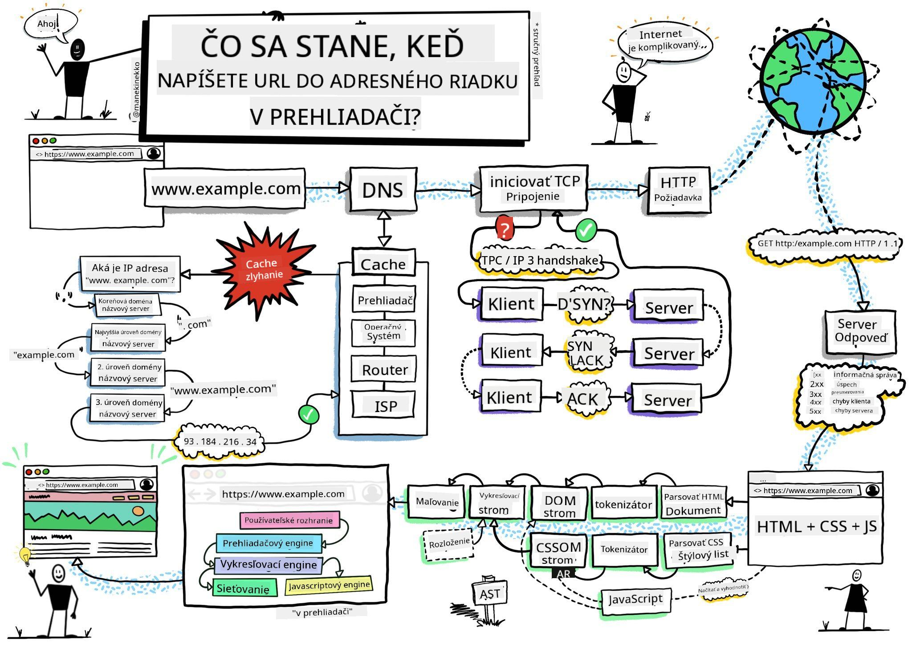

<!--
CO_OP_TRANSLATOR_METADATA:
{
  "original_hash": "0bb55e0b98600afab801eea115228873",
  "translation_date": "2025-08-27T22:12:44+00:00",
  "source_file": "5-browser-extension/1-about-browsers/README.md",
  "language_code": "sk"
}
-->
# Projekt rozšírenia prehliadača, časť 1: Všetko o prehliadačoch


> Sketchnote od [Wassima Cheghama](https://dev.to/wassimchegham/ever-wondered-what-happens-when-you-type-in-a-url-in-an-address-bar-in-a-browser-3dob)

## Kvíz pred prednáškou

[Kvíz pred prednáškou](https://ff-quizzes.netlify.app/web/quiz/23)

### Úvod

Rozšírenia prehliadača pridávajú do prehliadača ďalšie funkcie. Predtým, než si jedno vytvoríte, by ste sa mali trochu oboznámiť s tým, ako prehliadače fungujú.

### O prehliadači

V tejto sérii lekcií sa naučíte, ako vytvoriť rozšírenie prehliadača, ktoré bude fungovať v prehliadačoch Chrome, Firefox a Edge. V tejto časti objavíte, ako prehliadače fungujú, a pripravíte základné prvky rozšírenia prehliadača.

Ale čo je to vlastne prehliadač? Je to softvérová aplikácia, ktorá umožňuje koncovému používateľovi pristupovať k obsahu zo servera a zobrazovať ho na webových stránkach.

✅ Trochu histórie: prvý prehliadač sa volal 'WorldWideWeb' a vytvoril ho Sir Timothy Berners-Lee v roku 1990.


> Niektoré rané prehliadače, zdroj: [Karen McGrane](https://www.slideshare.net/KMcGrane/week-4-ixd-history-personal-computing)

Keď sa používateľ pripojí na internet pomocou adresy URL (Uniform Resource Locator), zvyčajne cez Hypertext Transfer Protocol pomocou adresy `http` alebo `https`, prehliadač komunikuje s webovým serverom a načíta webovú stránku.

V tomto momente zobrazí renderovací engine prehliadača stránku na zariadení používateľa, ktorým môže byť mobilný telefón, stolný počítač alebo notebook.

Prehliadače majú tiež schopnosť ukladať obsah do vyrovnávacej pamäte, aby sa nemusel zakaždým načítavať zo servera. Môžu zaznamenávať históriu prehliadania používateľa, ukladať 'cookies', čo sú malé kúsky dát obsahujúce informácie o aktivite používateľa, a mnoho ďalšieho.

Je veľmi dôležité si uvedomiť, že prehliadače nie sú všetky rovnaké! Každý prehliadač má svoje silné a slabé stránky a profesionálny webový vývojár musí rozumieť tomu, ako zabezpečiť, aby webové stránky fungovali dobre naprieč rôznymi prehliadačmi. To zahŕňa prispôsobenie sa malým obrazovkám, ako sú mobilné telefóny, ako aj používateľom, ktorí sú offline.

Veľmi užitočná webová stránka, ktorú by ste si mali uložiť do záložiek v akomkoľvek prehliadači, ktorý preferujete, je [caniuse.com](https://www.caniuse.com). Pri tvorbe webových stránok je veľmi užitočné používať zoznamy podporovaných technológií na caniuse, aby ste čo najlepšie podporili svojich používateľov.

✅ Ako zistíte, ktoré prehliadače sú najpopulárnejšie medzi používateľmi vašej webovej stránky? Skontrolujte svoje analytické údaje – môžete nainštalovať rôzne analytické balíky ako súčasť procesu vývoja webu a tie vám ukážu, ktoré prehliadače sú najviac používané.

## Rozšírenia prehliadača

Prečo by ste chceli vytvoriť rozšírenie prehliadača? Je to užitočný nástroj, ktorý si môžete pripojiť k prehliadaču, keď potrebujete rýchly prístup k úlohám, ktoré často opakujete. Napríklad, ak často potrebujete kontrolovať farby na rôznych webových stránkach, ktoré navštevujete, môžete si nainštalovať rozšírenie prehliadača na výber farieb. Ak máte problém zapamätať si heslá, môžete použiť rozšírenie na správu hesiel.

Rozšírenia prehliadača sú tiež zábavné na vývoj. Zvyčajne spravujú obmedzený počet úloh, ktoré vykonávajú dobre.

✅ Aké sú vaše obľúbené rozšírenia prehliadača? Aké úlohy vykonávajú?

### Inštalácia rozšírení

Predtým, než začnete s vývojom, pozrite sa na proces vytvárania a nasadzovania rozšírenia prehliadača. Hoci sa jednotlivé prehliadače v tomto procese trochu líšia, postup je podobný v Chrome a Firefoxe ako v tomto príklade pre Edge:


> Poznámka: Uistite sa, že ste zapli režim vývojára a povolili rozšírenia z iných obchodov.

V podstate bude proces nasledovný:

- vytvorte svoje rozšírenie pomocou `npm run build` 
- v prehliadači prejdite na panel rozšírení pomocou tlačidla "Nastavenia a ďalšie" (ikona `...`) v pravom hornom rohu
- ak ide o novú inštaláciu, vyberte `load unpacked`, aby ste nahrali nové rozšírenie z jeho zložky build (v našom prípade je to `/dist`) 
- alebo kliknite na `reload`, ak znovu načítavate už nainštalované rozšírenie

✅ Tieto pokyny sa týkajú rozšírení, ktoré si sami vytvoríte; na inštaláciu rozšírení, ktoré boli vydané v obchode s rozšíreniami prehliadača, by ste mali prejsť do týchto [obchodov](https://microsoftedge.microsoft.com/addons/Microsoft-Edge-Extensions-Home) a nainštalovať si rozšírenie podľa vášho výberu.

### Začnite

Vytvoríte rozšírenie prehliadača, ktoré zobrazí uhlíkovú stopu vášho regiónu, ukazujúc spotrebu energie vášho regiónu a zdroj tejto energie. Rozšírenie bude obsahovať formulár, ktorý zhromaždí API kľúč, aby ste mohli pristupovať k API CO2 Signal.

**Potrebujete:**

- [API kľúč](https://www.co2signal.com/); zadajte svoj e-mail do poľa na tejto stránke a kľúč vám bude zaslaný
- [kód pre váš región](http://api.electricitymap.org/v3/zones) zodpovedajúci [Electricity Map](https://www.electricitymap.org/map) (napríklad v Bostone používam 'US-NEISO').
- [štartovací kód](../../../../5-browser-extension/start). Stiahnite si zložku `start`; budete dopĺňať kód v tejto zložke.
- [NPM](https://www.npmjs.com) - NPM je nástroj na správu balíkov; nainštalujte si ho lokálne a balíky uvedené vo vašom súbore `package.json` budú pripravené na použitie vo vašom webovom projekte

✅ Viac o správe balíkov sa dozviete v tomto [vynikajúcom module Learn](https://docs.microsoft.com/learn/modules/create-nodejs-project-dependencies/?WT.mc_id=academic-77807-sagibbon)

Venujte chvíľu prehliadnutiu kódu:

dist
    -|manifest.json (predvolené nastavenia tu)
    -|index.html (HTML štruktúra front-endu tu)
    -|background.js (background JS tu)
    -|main.js (zostavený JS)
src
    -|index.js (váš JS kód ide sem)

✅ Keď budete mať svoj API kľúč a kód regiónu pripravený, uložte si ich niekam do poznámky na neskoršie použitie.

### Vytvorte HTML pre rozšírenie

Toto rozšírenie má dva pohľady. Jeden na zhromaždenie API kľúča a kódu regiónu:


A druhý na zobrazenie uhlíkovej spotreby regiónu:


Začnime vytvorením HTML pre formulár a jeho naštýlovaním pomocou CSS.

V zložke `/dist` vytvorte formulár a oblasť pre výsledky. V súbore `index.html` vyplňte vyznačenú oblasť formulára:

```HTML
<form class="form-data" autocomplete="on">
	<div>
		<h2>New? Add your Information</h2>
	</div>
	<div>
		<label for="region">Region Name</label>
		<input type="text" id="region" required class="region-name" />
	</div>
	<div>
		<label for="api">Your API Key from tmrow</label>
		<input type="text" id="api" required class="api-key" />
	</div>
	<button class="search-btn">Submit</button>
</form>	
```
Toto je formulár, kde budú vaše uložené informácie zadané a uložené do lokálneho úložiska.

Ďalej vytvorte oblasť pre výsledky; pod posledným tagom formulára pridajte niekoľko divov:

```HTML
<div class="result">
	<div class="loading">loading...</div>
	<div class="errors"></div>
	<div class="data"></div>
	<div class="result-container">
		<p><strong>Region: </strong><span class="my-region"></span></p>
		<p><strong>Carbon Usage: </strong><span class="carbon-usage"></span></p>
		<p><strong>Fossil Fuel Percentage: </strong><span class="fossil-fuel"></span></p>
	</div>
	<button class="clear-btn">Change region</button>
</div>
```
V tomto bode môžete skúsiť zostaviť projekt. Uistite sa, že ste nainštalovali závislosti balíkov tohto rozšírenia:

```
npm install
```

Tento príkaz použije npm, správcu balíkov Node, na inštaláciu webpacku pre proces zostavenia vášho rozšírenia. Výstup tohto procesu môžete vidieť v súbore `/dist/main.js` - uvidíte, že kód bol zbalený.

Zatiaľ by sa malo rozšírenie zostaviť a po jeho nasadení do Edge ako rozšírenia by ste mali vidieť pekne zobrazený formulár.

Gratulujeme, urobili ste prvé kroky k vytvoreniu rozšírenia prehliadača. V ďalších lekciách ho urobíte funkčnejším a užitočnejším.

---

## 🚀 Výzva

Pozrite sa na obchod s rozšíreniami prehliadača a nainštalujte si jedno do svojho prehliadača. Môžete preskúmať jeho súbory zaujímavými spôsobmi. Čo objavíte?

## Kvíz po prednáške

[Kvíz po prednáške](https://ff-quizzes.netlify.app/web/quiz/24)

## Prehľad a samoštúdium

V tejto lekcii ste sa dozvedeli niečo o histórii webového prehliadača; využite túto príležitosť na to, aby ste sa dozvedeli viac o tom, ako si tvorcovia World Wide Web predstavovali jeho využitie, prečítaním si viac o jeho histórii. Niektoré užitočné stránky zahŕňajú:

[História webových prehliadačov](https://www.mozilla.org/firefox/browsers/browser-history/)

[História webu](https://webfoundation.org/about/vision/history-of-the-web/)

[Rozhovor s Timom Berners-Leem](https://www.theguardian.com/technology/2019/mar/12/tim-berners-lee-on-30-years-of-the-web-if-we-dream-a-little-we-can-get-the-web-we-want)

## Zadanie 

[Zmeňte štýl svojho rozšírenia](assignment.md)

---

**Upozornenie**:  
Tento dokument bol preložený pomocou služby AI prekladu [Co-op Translator](https://github.com/Azure/co-op-translator). Hoci sa snažíme o presnosť, prosím, berte na vedomie, že automatizované preklady môžu obsahovať chyby alebo nepresnosti. Pôvodný dokument v jeho pôvodnom jazyku by mal byť považovaný za autoritatívny zdroj. Pre kritické informácie sa odporúča profesionálny ľudský preklad. Nie sme zodpovední za akékoľvek nedorozumenia alebo nesprávne interpretácie vyplývajúce z použitia tohto prekladu.