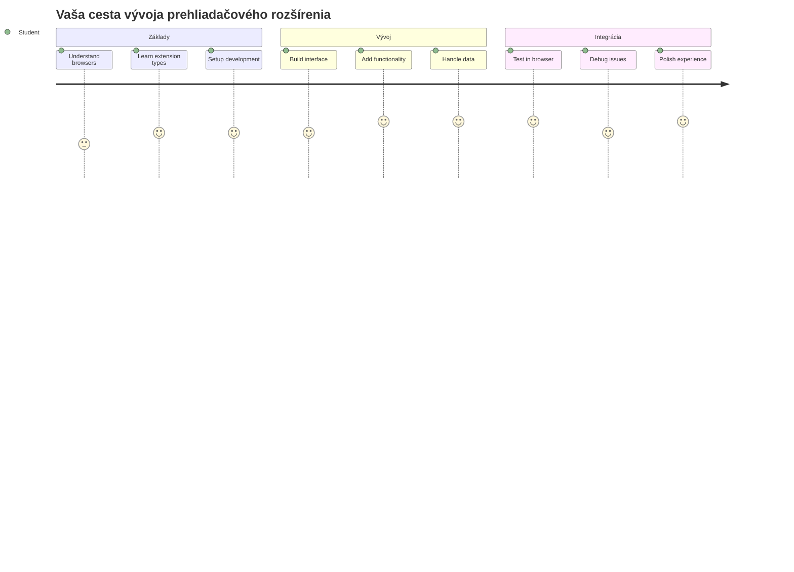
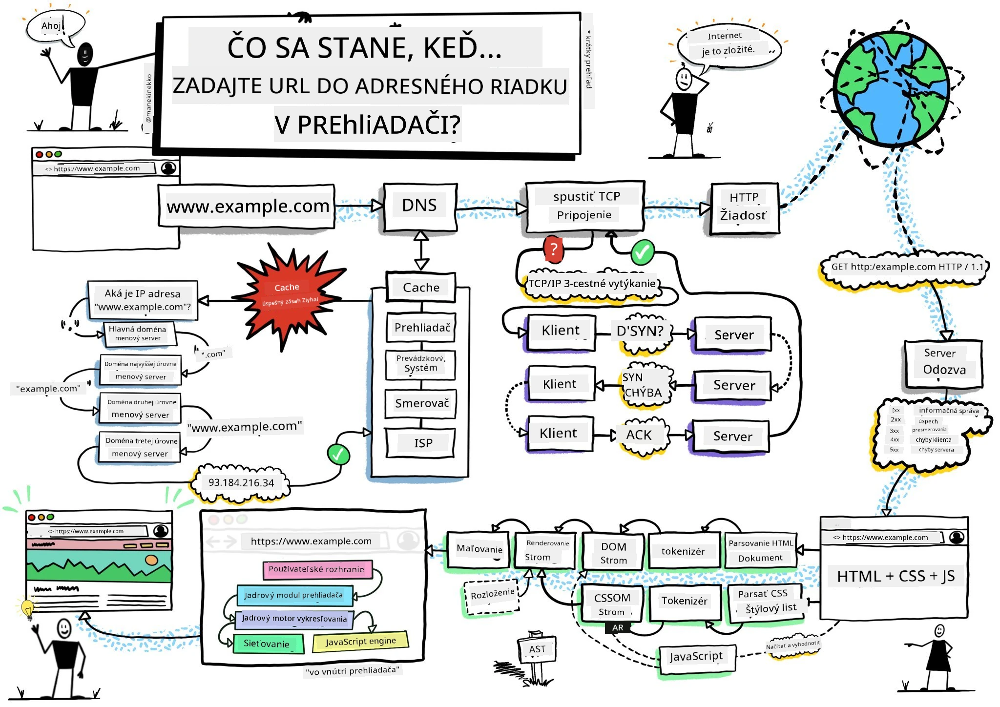
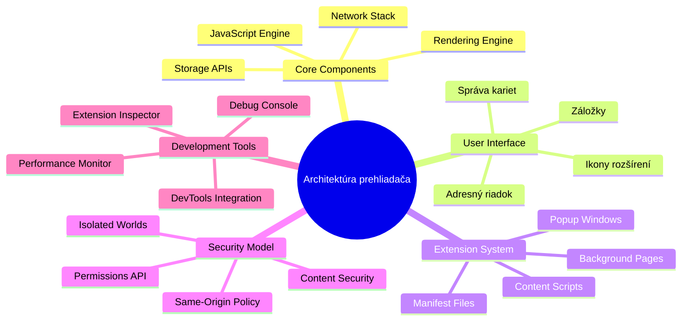
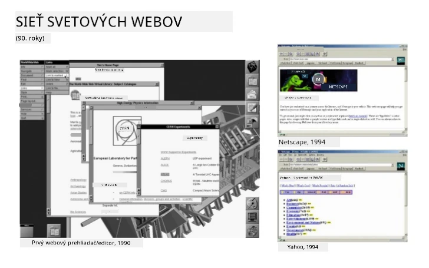
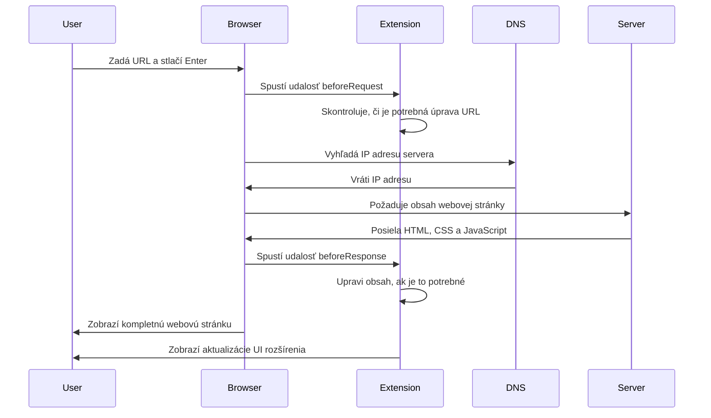
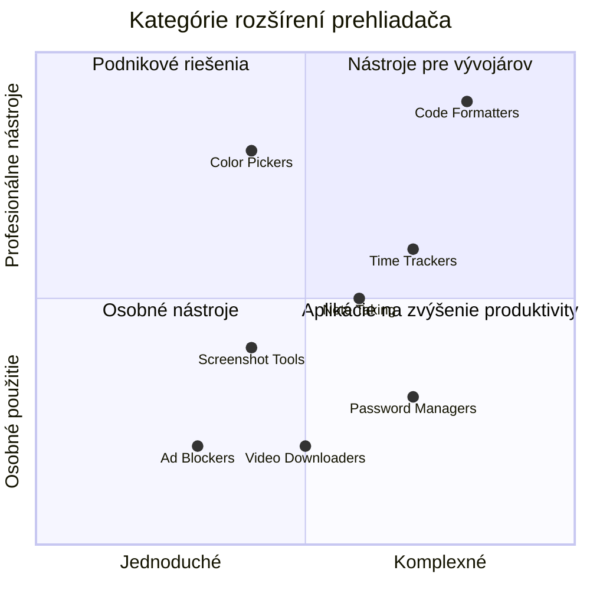
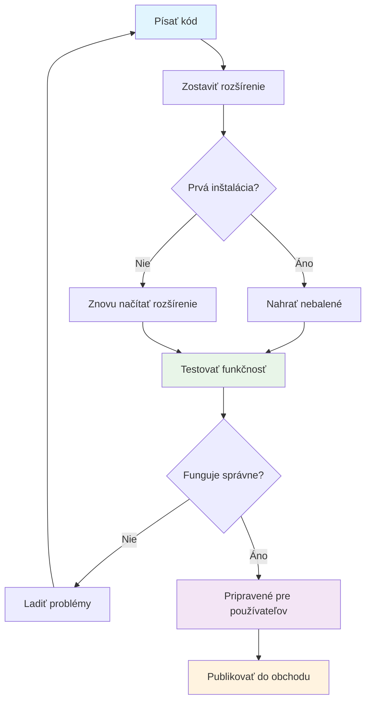
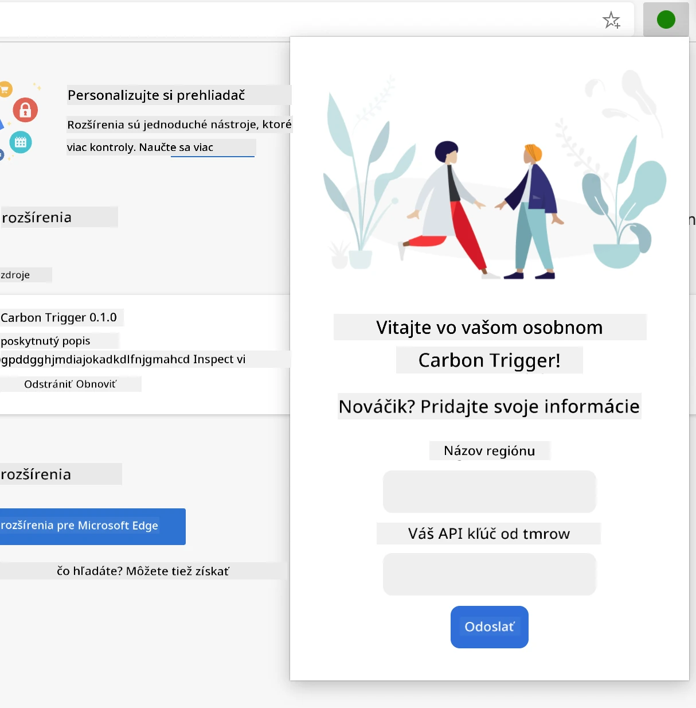
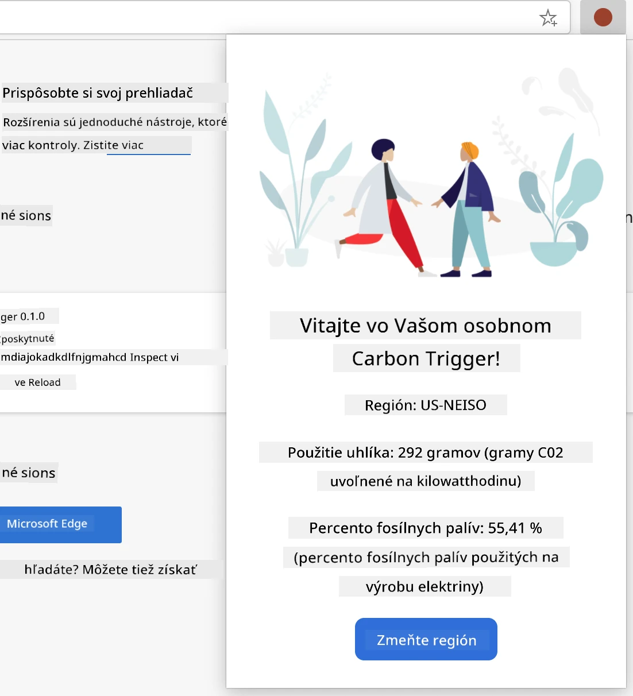
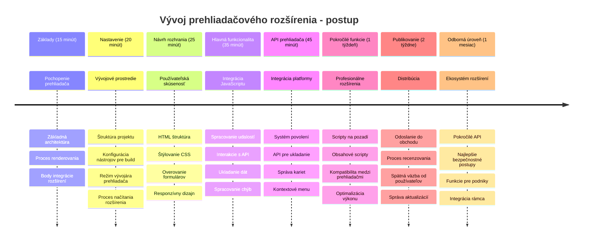

<!--
CO_OP_TRANSLATOR_METADATA:
{
  "original_hash": "00aa85715e1efd4930c17a23e3012e69",
  "translation_date": "2026-01-07T04:52:56+00:00",
  "source_file": "5-browser-extension/1-about-browsers/README.md",
  "language_code": "sk"
}
-->
# Projekt rozšírenia prehliadača Časť 1: Všetko o prehliadačoch



> Sketchnote od [Wassim Chegham](https://dev.to/wassimchegham/ever-wondered-what-happens-when-you-type-in-a-url-in-an-address-bar-in-a-browser-3dob)

## Kvíz pred prednáškou

[Kvíz pred prednáškou](https://ff-quizzes.netlify.app/web/quiz/23)

### Úvod

Rozšírenia prehliadača sú mini-aplikácie, ktoré vylepšujú váš zážitok z prehliadania webu. Rovnako ako pôvodná vízia Tima Berners-Lee o interaktívnom webe, rozšírenia rozširujú schopnosti prehliadača nad rámec jednoduchého zobrazenia dokumentov. Od správcov hesiel, ktorí chránia vaše účty, až po výber farieb, ktorý pomáha dizajnérom vybrať dokonalé odtiene – rozšírenia riešia každodenné výzvy pri prehliadaní.

Predtým, než vytvoríme vaše prvé rozšírenie, pochopme, ako prehliadače fungujú. Rovnako ako Alexander Graham Bell potreboval pochopiť prenos zvuku pred vynálezom telefónu, znalosť základov prehliadača vám pomôže vytvoriť rozšírenia, ktoré sa bezproblémovo integrujú so systémami prehliadača.

Na konci tejto lekcie pochopíte architektúru prehliadača a začnete vytvárať svoje prvé rozšírenie.


## Pochopenie webových prehliadačov

Webový prehliadač je v podstate sofistikovaný interpret dokumentov. Keď do adresného riadku zadáte "google.com", prehliadač vykoná zložitú sériu operácií – požaduje obsah zo serverov po celom svete, potom analyzuje a vyrenderuje tento kód do interaktívnych webových stránok, ktoré vidíte.

Tento proces odráža spôsob, akým bol prvý webový prehliadač WorldWideWeb navrhnutý Timom Berners-Leeom v roku 1990, aby sprístupnil hypertextové dokumenty všetkým.

✅ **Trocha histórie**: Prvý prehliadač sa volal 'WorldWideWeb' a vytvoril ho Sir Timothy Berners-Lee v roku 1990.


> Niektoré skoré prehliadače, podľa [Karen McGrane](https://www.slideshare.net/KMcGrane/week-4-ixd-history-personal-computing)

### Ako prehliadače spracovávajú webový obsah

Proces medzi zadaním URL a zobrazením webovej stránky zahŕňa niekoľko koordinovaných krokov, ktoré prebiehajú počas niekoľkých sekúnd:


**Tento proces dosahuje:**
- **Prekladá** ľudsky čitateľnú URL na IP adresu servera pomocou DNS vyhľadávania
- **Nadväzuje** bezpečné pripojenie s webovým serverom pomocou protokolov HTTP alebo HTTPS
- **Požaduje** konkrétny obsah webovej stránky zo servera
- **Prijíma** HTML značkovanie, CSS štýly a JavaScript kód zo servera
- **Vyrenderuje** všetok obsah do interaktívnej webovej stránky, ktorú vidíte

### Hlavné funkcie prehliadača

Moderné prehliadače poskytujú množstvo funkcií, ktoré môžu vývojári rozšírení využiť:

| Funkcia | Účel | Príležitosti pre rozšírenia |
|---------|---------|------------------------|
| **Rendering Engine** | Zobrazuje HTML, CSS a JavaScript | Modifikácia obsahu, vkladanie štýlov |
| **JavaScript Engine** | Vykonáva JavaScript kód | Vlastné skripty, API interakcie |
| **Local Storage** | Ukladá dáta lokálne | Užívateľské preferencie, cache dáta |
| **Network Stack** | Spracováva webové požiadavky | Monitorovanie požiadaviek, analýza dát |
| **Security Model** | Chráni užívateľov pred škodlivým obsahom | Filtrovanie obsahu, bezpečnostné vylepšenia |

**Pochopenie týchto funkcií vám pomôže:**
- **Určiť**, kde vaše rozšírenie môže priniesť najväčšiu hodnotu
- **Vybrať** správne API prehliadača pre funkcionalitu rozšírenia
- **Navrhnúť** rozšírenia, ktoré efektívne spolupracujú so systémami prehliadača
- **Zaistiť**, že vaše rozšírenie dodržiava bezpečnostné odporúčania prehliadača

### Úvahy o vývoji pre viac prehliadačov

Rôzne prehliadače implementujú štandardy s drobnými rozdielmi, podobne ako rôzne programovacie jazyky môžu inak spracovať rovnaký algoritmus. Chrome, Firefox a Safari majú jedinečné charakteristiky, ktoré musia vývojári počas tvorby rozšírení zohľadniť.

> 💡 **Praktická rada**: Použite [caniuse.com](https://www.caniuse.com) na kontrolu, ktoré webové technológie podporujú jednotlivé prehliadače. To je neoceniteľné pri plánovaní funkcií vášho rozšírenia!

**Kľúčové úvahy pri vývoji rozšírenia:**
- **Testujte** vaše rozšírenie na prehliadačoch Chrome, Firefox a Edge
- **Prispôsobte** sa rôznym API rozšírení a formátom manifestu
- **Zvládnite** rozdiely vo výkonnosti a obmedzeniach
- **Poskytnite** záložné riešenia pre špecifické funkcie prehliadačov, ktoré nemusia byť dostupné

✅ **Analytický pohľad**: Môžete zistiť, ktoré prehliadače vaši používatelia preferujú tým, že do svojich webových projektov nainštalujete analytické balíky. Tieto údaje vám pomôžu uprednostniť, ktoré prehliadače podporovať ako prvé.

## Pochopenie rozšírení prehliadača

Rozšírenia prehliadača riešia bežné problémy pri prehliadaní webu tým, že pridávajú funkcionalitu priamo do rozhrania prehliadača. Namiesto potreby samostatných aplikácií alebo zložitých pracovných postupov poskytujú rozšírenia okamžitý prístup k nástrojom a funkciám.

Tento koncept odzrkadľuje, ako si skorí pionieri v oblasti počítačov ako Douglas Engelbart predstavovali rozširovanie ľudských schopností pomocou technológie – rozšírenia rozširujú základnú funkcionalitu vášho prehliadača.


**Populárne kategórie rozšírení a ich výhody:**
- **Nástroje produktivity**: Manažéri úloh, aplikácie na poznámky a časové trackery, ktoré pomáhajú zostať organizovaným
- **Bezpečnostné vylepšenia**: Správcovia hesiel, blokovače reklám a nástroje na ochranu súkromia, ktoré chránia vaše dáta
- **Vývojárske nástroje**: Formátovače kódu, výber farieb a ladivé nástroje, ktoré zjednodušujú vývoj
- **Vylepšenie obsahu**: Režimy čítania, sťahovače videí a nástroje na screenshoty, ktoré zlepšujú váš webový zážitok

✅ **Otázka na zamyslenie**: Aké sú vaše obľúbené rozšírenia prehliadača? Aké konkrétne úlohy vykonávajú a ako zlepšujú váš zážitok z prehliadania?

### 🔄 **Pedagogická kontrola**
**Pochopenie architektúry prehliadača**: Predtým, než prejdete k vývoju rozšírení, uistite sa, že viete:
- ✅ Vysvetliť, ako prehliadače spracovávajú webové požiadavky a vyrenderujú obsah
- ✅ Identifikovať hlavné komponenty architektúry prehliadača
- ✅ Pochopiť, ako rozšírenia integrujú funkcionalitu prehliadača
- ✅ Rozpoznať bezpečnostný model, ktorý chráni používateľov

**Rýchly test sami sebe**: Dokážete sledovať cestu od zadania URL po zobrazenie webovej stránky?
1. **DNS vyhľadávanie** prevádza URL na IP adresu
2. **HTTP požiadavka** načíta obsah zo servera
3. **Analýza (parsing)** spracuje HTML, CSS a JavaScript
4. **Rendering** zobrazí finálnu webstránku
5. **Rozšírenia** môžu modifikovať obsah na viacerých krokoch

## Inštalácia a správa rozšírení

Pochopenie procesu inštalácie rozšírenia vám pomôže predvídať používateľský zážitok, keď si ľudia inštalujú vaše rozšírenie. Proces inštalácie je štandardizovaný vo väčšine moderných prehliadačov, s drobnými rozdielmi v dizajne rozhrania.


> **Dôležité**: Uistite sa, že máte zapnutý režim vývojára a povolené rozšírenia z iných obchodov, keď testujete vlastné rozšírenia.

### Proces inštalácie rozšírenia počas vývoja

Keď vyvíjate a testujete vlastné rozšírenia, riaďte sa týmto postupom:


```bash
# Krok 1: Vytvorte svoje rozšírenie
npm run build
```

**Čo tento príkaz dosahuje:**
- **Kompiluje** váš zdrojový kód do súborov pripravených pre prehliadač
- **Zabaluje** JavaScript moduly do optimalizovaných balíkov
- **Generuje** finálne súbory rozšírenia v priečinku `/dist`
- **Pripravuje** rozšírenie na inštaláciu a testovanie

**Krok 2: Prejdite na správu rozšírení prehliadača**
1. **Otvorte** stránku správy rozšírení vášho prehliadača
2. **Kliknite** na tlačidlo "Nastavenia a ďalšie" (ikona `...`) v pravom hornom rohu
3. **Vyberte** v rozbaľovacom menu "Rozšírenia"

**Krok 3: Načítajte svoje rozšírenie**
- **Pre nové inštalácie**: Zvoľte `load unpacked` a vyberte váš priečinok `/dist`
- **Pre aktualizácie**: Kliknite na `reload` vedľa už nainštalovaného rozšírenia
- **Pre testovanie**: Zapnite "Režim vývojára" pre prístup k rozšíreným debuggovacím funkciám

### Produkčná inštalácia rozšírenia

> ✅ **Poznámka**: Tieto pokyny pre vývoj sú špeciálne určené pre rozšírenia, ktoré si vytvoríte sami. Na inštaláciu publikovaných rozšírení navštívte oficiálne obchody rozšírení prehliadačov, napríklad [Microsoft Edge Add-ons store](https://microsoftedge.microsoft.com/addons/Microsoft-Edge-Extensions-Home).

**Pochopenie rozdielov:**
- **Vývojové inštalácie** umožňujú testovať nepublikované rozšírenia počas vývoja
- **Inštalácie z obchodov** poskytujú overené, publikované rozšírenia s automatickými aktualizáciami
- **Sideloading** umožňuje inštaláciu rozšírení mimo oficiálnych obchodov (vyžaduje režim vývojára)

## Vytvorenie rozšírenia o uhlíkovej stope

Vytvoríme rozšírenie prehliadača, ktoré zobrazuje uhlíkovú stopu spotreby energie vo vašom regióne. Tento projekt demonštruje základné koncepty vývoja rozšírení a zároveň tvorí praktický nástroj na environmentálne povedomie.

Tento prístup nasleduje princíp "učenia sa praxou", ktorý sa osvedčil už od teórií Johna Deweyho – spájanie technických zručností so zmysluplnými aplikáciami v reálnom svete.

### Požiadavky projektu

Pred začiatkom vývoja si pripravme potrebné zdroje a závislosti:

**Povolený prístup k API:**
- **[CO2 Signal API kľúč](https://www.co2signal.com/)**: Zadajte svoju e-mailovú adresu pre získanie bezplatného API kľúča
- **[Kód regiónu](http://api.electricitymap.org/v3/zones)**: Nájdite kód vášho regiónu pomocou [Electricity Map](https://www.electricitymap.org/map) (napr. Boston používa 'US-NEISO')

**Nástroje pre vývoj:**
- **[Node.js a NPM](https://www.npmjs.com)**: Nástroj na správu balíčkov pre inštaláciu závislostí projektu
- **[Štartovací kód](../../../../5-browser-extension/start)**: Stiahnite priečinok `start` na začatie vývoja

✅ **Viac informácií**: Zlepšite svoje zručnosti so správou balíčkov v tomto [komplexnom module Learn](https://docs.microsoft.com/learn/modules/create-nodejs-project-dependencies/?WT.mc_id=academic-77807-sagibbon)

### Pochopenie štruktúry projektu

Pochopenie štruktúry projektu pomáha efektívne organizovať vývojovú prácu. Rovnako ako bola Knižnica Alexandra usporiadaná na jednoduché vyhľadávanie vedomostí, dobre štruktúrovaný kód zefektívňuje vývoj:

```
project-root/
├── dist/                    # Built extension files
│   ├── manifest.json        # Extension configuration
│   ├── index.html           # User interface markup
│   ├── background.js        # Background script functionality
│   └── main.js              # Compiled JavaScript bundle
├── src/                     # Source development files
│   └── index.js             # Your main JavaScript code
├── package.json             # Project dependencies and scripts
└── webpack.config.js        # Build configuration
```

**Čo dosahuje každý súbor:**
- **`manifest.json`**: **Definuje** metadata rozšírenia, povolenia a vstupné body
- **`index.html`**: **Vytvára** používateľské rozhranie, ktoré sa zobrazí po kliknutí na rozšírenie
- **`background.js`**: **Rieši** úlohy na pozadí a nasluchuje udalosti prehliadača
- **`main.js`**: **Obsahuje** finálny zabalený JavaScript po build procese
- **`src/index.js`**: **Obsahuje** hlavný vývojový kód, ktorý sa kompiluje do `main.js`

> 💡 **Tip na organizáciu**: Uložte si svoj API kľúč a kód regiónu do bezpečnej poznámky na ľahký prístup počas vývoja. Budete tieto hodnoty potrebovať na testovanie funkčnosti rozšírenia.

✅ **Bezpečnostná poznámka**: Nikdy neposielajte API kľúče ani citlivé údaje do svojho repozitára. Ukážeme vám, ako s nimi bezpečne narábať v nasledujúcich krokoch.

## Vytvorenie rozhrania rozšírenia

Teraz vybudujeme komponenty používateľského rozhrania. Rozšírenie používa dvojité zobrazenie: konfiguračnú obrazovku pre počiatočné nastavenie a výsledkovú obrazovku pre zobrazenie dát.

Toto nasleduje princíp postupného odhaľovania, ktorý sa používa v dizajne rozhraní od začiatkov počítačov – odhaľovať informácie a možnosti logicky, aby sa užívatelia nepreťažili.

### Prehľad pohľadov rozšírenia

**Zobrazenie nastavenia** – Konfigurácia pre používateľov pri prvom použití:


**Zobrazenie výsledkov** – Zobrazenie údajov uhlíkovej stopy:


### Vytvorenie konfiguračného formulára

Nastavovací formulár zhromažďuje konfiguračné údaje používateľa počas prvého spustenia. Po nastavení tieto údaje zostaňú uložené v úložisku prehliadača pre budúce relácie.

Do súboru `/dist/index.html` pridajte túto štruktúru formulára:

```html
<form class="form-data" autocomplete="on">
    <div>
        <h2>New? Add your Information</h2>
    </div>
    <div>
        <label for="region">Region Name</label>
        <input type="text" id="region" required class="region-name" />
    </div>
    <div>
        <label for="api">Your API Key from tmrow</label>
        <input type="text" id="api" required class="api-key" />
    </div>
    <button class="search-btn">Submit</button>
</form>
```

**Čo tento formulár dosahuje:**
- **Vytvára** sémantickú štruktúru formulára s vhodnými labelmi a asociáciami vstupov
- **Povoľuje** automatické dopĺňanie prehliadačom pre lepší používateľský zážitok
- **Vyžaduje** vyplnenie oboch polí pred odoslaním pomocou atribútu `required`
- **Usporiadáva** vstupy pomocou popisných tried pre jednoduché štýlovanie a cielenie JavaScriptom
- **Poskytuje** jasné pokyny používateľom, ktorí nastavia rozšírenie po prvý raz

### Vytvorenie zobrazenia výsledkov

Ďalej vytvorte sekciu, ktorá bude zobrazovať údaje o uhlíkovej stope. Pridajte tento HTML pod formulár:

```html
<div class="result">
    <div class="loading">loading...</div>
    <div class="errors"></div>
    <div class="data"></div>
    <div class="result-container">
        <p><strong>Region: </strong><span class="my-region"></span></p>
        <p><strong>Carbon Usage: </strong><span class="carbon-usage"></span></p>
        <p><strong>Fossil Fuel Percentage: </strong><span class="fossil-fuel"></span></p>
    </div>
    <button class="clear-btn">Change region</button>
</div>
```

**Čo táto štruktúra poskytuje:**
- **`loading`**: **Zobrazuje** správu o načítavaní, kým sa získavajú dáta z API
- **`errors`**: **Ukazuje** chybové správy, ak API volania zlyhajú alebo sú dáta neplatné
- **`data`**: **Obsahuje** surové dáta pre účely ladenia počas vývoja
- **`result-container`**: **Prezentuje** naformátované informácie o uhlíkovej stope používateľom
- **`clear-btn`**: **Umožňuje** používateľom zmeniť región a prekonfigurovať rozšírenie

### Nastavenie build procesu

Teraz si nainštalujeme závislosti projektu a otestujeme build proces:

```bash
npm install
```

**Čo tento inštalačný proces dosahuje:**
- **Stiahne** Webpack a ďalšie vývojové závislosti uvedené v `package.json`
- **Nakonfiguruje** build nástroje pre kompiláciu moderného JavaScriptu
- **Pripraví** vývojové prostredie pre vytváranie a testovanie rozšírenia
- **Umožní** balenie kódu, optimalizáciu a kompatibilitu medzi prehliadačmi

> 💡 **Pochopenie build procesu**: Webpack zabaluje váš zdrojový kód z `/src/index.js` do `/dist/main.js`. Tento proces optimalizuje váš kód pre produkciu a zabezpečuje kompatibilitu s prehliadačmi.

### Testovanie vášho pokroku

V tomto bode môžete otestovať svoje rozšírenie:
1. **Spustite** príkaz na zostavenie, aby ste preložili svoj kód  
2. **Načítajte** rozšírenie do prehliadača pomocou režimu vývojára  
3. **Overte**, či sa formulár zobrazuje správne a vyzerá profesionálne  
4. **Skontrolujte**, či sú všetky prvky formulára správne zarovnané a funkčné  

**Čo ste dosiahli:**  
- **Vytvorili** ste základnú štruktúru HTML pre vaše rozšírenie  
- **Navrhli** ste rozhrania pre konfiguráciu aj výsledky s vhodným sémantickým značením  
- **Nastavili** ste moderný vývojový workflow s využitím nástrojov štandardných v odbore  
- **Pripravili** ste základy pre pridanie interaktívnej JavaScript funkcionality  

### 🔄 **Pedagogická kontrola**  
**Pokrok v vývoji rozšírenia**: Overte si svoje porozumenie pred pokračovaním:  
- ✅ Viete vysvetliť účel každého súboru v projektovej štruktúre?  
- ✅ Rozumiete, ako proces zostavovania transformuje váš zdrojový kód?  
- ✅ Prečo oddeľujeme konfiguráciu a výsledky do rôznych častí užívateľského rozhrania?  
- ✅ Ako štruktúra formulára podporuje použiteľnosť aj prístupnosť?  

**Porozumenie vývojovému workflow**: Teraz by ste mali vedieť:  
1. **Upraviť** HTML a CSS pre rozhranie vášho rozšírenia  
2. **Spustiť** príkaz na zostavenie pre preklad zmien  
3. **Znovu načítať** rozšírenie v prehliadači na testovanie aktualizácií  
4. **Ladiť** chyby pomocou nástrojov pre vývojárov v prehliadači  

Dokončili ste prvú fázu vývoja rozšírení prehliadača. Rovnako ako bratri Wrightovci najprv potrebovali pochopiť aerodynamiku predtým, ako dosiahli let, aj pochopenie týchto základných princípov vás pripravuje na tvorbu zložitejších interaktívnych funkcií v ďalšej lekcii.  

## Výzva GitHub Copilot Agenta 🚀  

Použite režim Agenta na dokončenie nasledujúcej výzvy:  

**Popis:** Rozšírte rozšírenie prehliadača o funkcie validácie formulárov a spätnú väzbu pre používateľa, aby ste zlepšili používateľskú skúsenosť pri zadávaní API kľúčov a kódov regiónov.  

**Zadanie:** Vytvorte JavaScript funkcie na validáciu, ktoré overia, či pole API kľúča obsahuje minimálne 20 znakov a či kód regiónu dodržiava správny formát (napríklad 'US-NEISO'). Pridajte vizuálnu spätnú väzbu tak, že zmeníte farbu okraja vstupu na zelenú pri platných hodnotách a na červenú pri neplatných. Pridajte tiež prepínač pre zobrazenie/skrytie API kľúča z bezpečnostných dôvodov.  

Viac o [režime agenta](https://code.visualstudio.com/blogs/2025/02/24/introducing-copilot-agent-mode) sa dozviete tu.  

## 🚀 Výzva  

Pozrite sa do obchodu s rozšíreniami prehliadača a nainštalujte si jedno do svojho prehliadača. Môžete jeho súbory skúmať zaujímavými spôsobmi. Čo objavíte?  

## Kvíz po prednáške  

[Post-lecture quiz](https://ff-quizzes.netlify.app/web/quiz/24)  

## Prehľad a samostatné štúdium  

V tejto lekcii ste sa dozvedeli niečo o histórii webového prehliadača; využite túto príležitosť na štúdium, ako si vynálezcovia World Wide Web predstavovali jeho použitie, a prečítajte si viac o jeho histórii. Užitočné stránky zahŕňajú:  

[História webových prehliadačov](https://www.mozilla.org/firefox/browsers/browser-history/)  

[História webu](https://webfoundation.org/about/vision/history-of-the-web/)  

[Rozhovor s Timom Berners-Leeom](https://www.theguardian.com/technology/2019/mar/12/tim-berners-lee-on-30-years-of-the-web-if-we-dream-a-little-we-can-get-the-web-we-want)  

### ⚡ **Čo môžete urobiť v nasledujúcich 5 minútach**  
- [ ] Otvorte stránku rozšírení Chrome/Edge (chrome://extensions) a preskúmajte, čo máte nainštalované  
- [ ] Pozrite si kartu Sieť v nástrojoch pre vývojárov vášho prehliadača počas načítavania webovej stránky  
- [ ] Skúste zobraziť zdrojový kód stránky (Ctrl+U) a pozrite si štruktúru HTML  
- [ ] Skontrolujte akýkoľvek prvok stránky a upravte jeho CSS v nástrojoch pre vývojárov  

### 🎯 **Čo môžete dosiahnuť počas tejto hodiny**  
- [ ] Dokončiť kvíz po lekcii a porozumieť základom prehliadačov  
- [ ] Vytvoriť základný súbor manifest.json pre rozšírenie prehliadača  
- [ ] Zostaviť jednoduché rozšírenie „Hello World“, ktoré zobrazuje vyskakovacie okno  
- [ ] Otestovať načítanie rozšírenia v režime vývojára  
- [ ] Preskúmať dokumentáciu k rozšíreniam pre váš cieľový prehliadač  

### 📅 **Vaša týždenná cesta vývoja rozšírenia**  
- [ ] Dokončiť funkčné rozšírenie prehliadača s reálnym využitím  
- [ ] Naučiť sa o obsahových skriptoch, skriptoch na pozadí a interakciách popup okien  
- [ ] Ovládnuť prehliadačové API ako ukladanie dát, záložky a odosielanie správ  
- [ ] Navrhnúť užívateľsky prívetivé rozhrania pre vaše rozšírenie  
- [ ] Testovať rozšírenie na rôznych webových stránkach a situáciách  
- [ ] Publikovať rozšírenie v obchode s rozšíreniami prehliadača  

### 🌟 **Vaša mesačná cesta vývoja prehliadačov**  
- [ ] Vytvoriť viacero rozšírení riešiacich rôzne problémy užívateľov  
- [ ] Naučiť sa pokročilé prehliadačové API a bezpečnostné praktiky  
- [ ] Prispievať do open source projektov rozšírení prehliadača  
- [ ] Ovládnuť kompatibilitu medzi prehliadačmi a progresívne vylepšovanie  
- [ ] Vytvárať nástroje a šablóny pre vývoj rozšírení pre ostatných  
- [ ] Stať sa expertom na rozšírenia prehliadačov, ktorý pomáha iným vývojárom  

## 🎯 Váš časový plán majstrovstva v rozšíreniach prehliadačov  


### 🛠️ Zhrnutie nástrojov pre vývoj rozšírení  

Po dokončení tejto lekcie máte:  
- **Vedomosť o architektúre prehliadača**: Pochopenie vykresľovacích motorov, bezpečnostných modelov a integrácie rozšírení  
- **Vývojové prostredie**: Moderný toolchain s Webpack, NPM a schopnosťami ladenia  
- **Základy UI/UX**: Sémantická štruktúra HTML s progresívnym odhaľovaním obsahu  
- **Bezpečnostné povedomie**: Porozumenie právam prehliadača a bezpečným vývojovým praktikám  
- **Koncepty naprieč prehliadačmi**: Znalosť kompatibility a testovacích prístupov  
- **Integrácia API**: Základy práce s externými dátovými zdrojmi  
- **Profesionálny workflow**: Štandardné postupy vývoja a testovania v priemysle  

**Reálne využitie**: Tieto zručnosti sa priamo uplatnia v:  
- **Webovom vývoji**: Jednostránkových aplikáciách a progresívnych webových aplikáciách  
- **Desktopových aplikáciách**: Electron a webových desktopových softvéroch  
- **Mobilnom vývoji**: Hybridných aplikáciách a webových mobilných riešeniach  
- **Podnikových nástrojoch**: Interných produktívnych aplikáciách a automatizácii pracovných tokov  
- **Open source**: Príspevkoch do projektov rozšírení prehliadačov a webových štandardov  

**Ďalšia úroveň**: Ste pripravení pridať interaktívnu funkcionalitu, pracovať s prehliadačovými API a vytvárať rozšírenia, ktoré riešia reálne používateľské problémy!  

## Zadanie  

[Zmeňte vzhľad svojho rozšírenia](assignment.md)

---

<!-- CO-OP TRANSLATOR DISCLAIMER START -->
**Vyhlásenie o zodpovednosti**:
Tento dokument bol preložený pomocou AI prekladateľskej služby [Co-op Translator](https://github.com/Azure/co-op-translator). Aj keď sa snažíme o presnosť, uvedomte si, že automatické preklady môžu obsahovať chyby alebo nepresnosti. Originálny dokument v jeho pôvodnom jazyku by mal byť považovaný za autoritatívny zdroj. Pre dôležité informácie sa odporúča profesionálny ľudský preklad. Nie sme zodpovední za akékoľvek nedorozumenia alebo nesprávne výklady vyplývajúce z použitia tohto prekladu.
<!-- CO-OP TRANSLATOR DISCLAIMER END -->