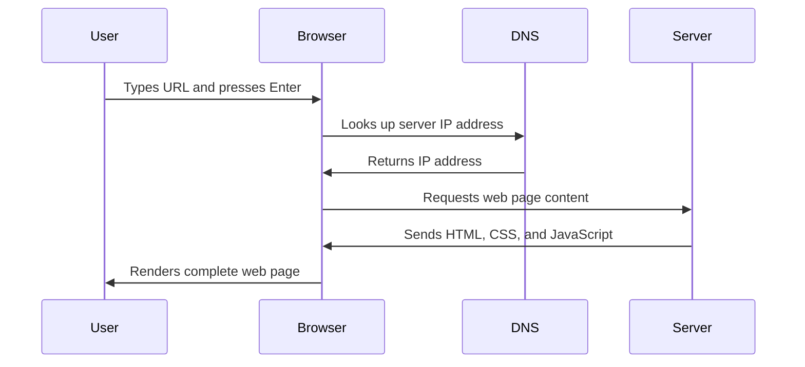

<!--
CO_OP_TRANSLATOR_METADATA:
{
  "original_hash": "33a875c522f237a2026e4653240dfc07",
  "translation_date": "2025-10-24T21:51:48+00:00",
  "source_file": "5-browser-extension/1-about-browsers/README.md",
  "language_code": "sk"
}
-->
# Projekt rozšírenia prehliadača, časť 1: Všetko o prehliadačoch


> Sketchnote od [Wassim Chegham](https://dev.to/wassimchegham/ever-wondered-what-happens-when-you-type-in-a-url-in-an-address-bar-in-a-browser-3dob)

## Kvíz pred prednáškou

[Kvíz pred prednáškou](https://ff-quizzes.netlify.app/web/quiz/23)

### Úvod

Rozšírenia prehliadača sú malé aplikácie, ktoré zlepšujú váš zážitok z prehliadania webu. Rovnako ako pôvodná vízia Tima Berners-Leeho o interaktívnom webe, rozšírenia rozširujú schopnosti prehliadača nad rámec jednoduchého prezerania dokumentov. Od správcov hesiel, ktoré udržujú vaše účty v bezpečí, až po nástroje na výber farieb, ktoré pomáhajú dizajnérom nájsť dokonalé odtiene, rozšírenia riešia každodenné výzvy pri prehliadaní.

Skôr než začneme vytvárať vaše prvé rozšírenie, poďme pochopiť, ako prehliadače fungujú. Rovnako ako Alexander Graham Bell potreboval pochopiť prenos zvuku pred vynájdením telefónu, pochopenie základov prehliadačov vám pomôže vytvárať rozšírenia, ktoré sa bezproblémovo integrujú s existujúcimi systémami prehliadača.

Na konci tejto lekcie pochopíte architektúru prehliadačov a začnete budovať svoje prvé rozšírenie.

## Pochopenie webových prehliadačov

Webový prehliadač je v podstate sofistikovaný interpret dokumentov. Keď do adresného riadku zadáte "google.com", prehliadač vykoná komplexnú sériu operácií - požaduje obsah zo serverov po celom svete, potom analyzuje a vykresľuje tento kód do interaktívnych webových stránok, ktoré vidíte.

Tento proces odráža spôsob, akým bol navrhnutý prvý webový prehliadač WorldWideWeb Timom Berners-Leem v roku 1990, aby sprístupnil hypertextové dokumenty každému.

✅ **Trochu histórie**: Prvý prehliadač sa volal 'WorldWideWeb' a bol vytvorený Sir Timothy Berners-Lee v roku 1990.


> Niektoré skoré prehliadače, podľa [Karen McGrane](https://www.slideshare.net/KMcGrane/week-4-ixd-history-personal-computing)

### Ako prehliadače spracovávajú webový obsah

Proces medzi zadaním URL adresy a zobrazením webovej stránky zahŕňa niekoľko koordinovaných krokov, ktoré sa dejú v priebehu niekoľkých sekúnd:



**Čo tento proces dosahuje:**
- **Prekladá** URL adresu čitateľnú pre človeka na IP adresu servera prostredníctvom DNS vyhľadávania
- **Zabezpečuje** bezpečné spojenie s webovým serverom pomocou protokolov HTTP alebo HTTPS
- **Požaduje** konkrétny obsah webovej stránky zo servera
- **Prijíma** HTML značkovanie, CSS štýly a JavaScriptový kód zo servera
- **Vykresľuje** všetok obsah do interaktívnej webovej stránky, ktorú vidíte

### Základné funkcie prehliadača

Moderné prehliadače poskytujú množstvo funkcií, ktoré môžu vývojári rozšírení využiť:

| Funkcia | Účel | Príležitosti pre rozšírenia |
|---------|---------|------------------------|
| **Vykresľovací engine** | Zobrazuje HTML, CSS a JavaScript | Úprava obsahu, injekcia štýlov |
| **JavaScriptový engine** | Vykonáva JavaScriptový kód | Vlastné skripty, interakcie s API |
| **Lokálne úložisko** | Ukladá dáta lokálne | Preferencie používateľa, cacheované dáta |
| **Sieťový stack** | Spracováva webové požiadavky | Monitorovanie požiadaviek, analýza dát |
| **Bezpečnostný model** | Chráni používateľov pred škodlivým obsahom | Filtrovanie obsahu, zlepšenie bezpečnosti |

**Pochopenie týchto funkcií vám pomôže:**
- **Identifikovať**, kde vaše rozšírenie môže priniesť najväčšiu hodnotu
- **Vybrať** správne API prehliadača pre funkčnosť vášho rozšírenia
- **Navrhnúť** rozšírenia, ktoré efektívne spolupracujú so systémami prehliadača
- **Zabezpečiť**, že vaše rozšírenie dodržiava najlepšie bezpečnostné postupy prehliadača

### Úvahy o vývoji rozšírení pre rôzne prehliadače

Rôzne prehliadače implementujú štandardy s miernymi odlišnosťami, podobne ako rôzne programovacie jazyky môžu spracovávať ten istý algoritmus odlišne. Chrome, Firefox a Safari majú každý svoje jedinečné vlastnosti, ktoré musia vývojári zohľadniť pri vývoji rozšírení.

> 💡 **Tip**: Použite [caniuse.com](https://www.caniuse.com) na kontrolu, ktoré webové technológie sú podporované v rôznych prehliadačoch. Toto je neoceniteľné pri plánovaní funkcií vášho rozšírenia!

**Kľúčové úvahy pri vývoji rozšírení:**
- **Testujte** svoje rozšírenie v prehliadačoch Chrome, Firefox a Edge
- **Prispôsobte** sa rôznym API rozšírení prehliadačov a formátom manifestov
- **Riešte** rôzne výkonnostné charakteristiky a obmedzenia
- **Poskytnite** alternatívy pre funkcie špecifické pre prehliadač, ktoré nemusia byť dostupné

✅ **Analytický pohľad**: Môžete zistiť, ktoré prehliadače vaši používatelia preferujú, ak nainštalujete analytické balíčky do svojich projektov webového vývoja. Tieto údaje vám pomôžu určiť, ktoré prehliadače podporovať ako prvé.

## Pochopenie rozšírení prehliadača

Rozšírenia prehliadača riešia bežné výzvy pri prehliadaní webu tým, že pridávajú funkcie priamo do rozhrania prehliadača. Namiesto vyžadovania samostatných aplikácií alebo zložitých pracovných postupov poskytujú rozšírenia okamžitý prístup k nástrojom a funkciám.

Tento koncept odráža spôsob, akým skorí počítačoví priekopníci ako Douglas Engelbart predstavovali rozšírenie ľudských schopností pomocou technológie - rozšírenia rozširujú základné funkcie vášho prehliadača.

**Populárne kategórie rozšírení a ich výhody:**
- **Nástroje produktivity**: Správcovia úloh, aplikácie na zapisovanie poznámok a sledovače času, ktoré vám pomáhajú zostať organizovaní
- **Zlepšenie bezpečnosti**: Správcovia hesiel, blokátory reklám a nástroje na ochranu súkromia, ktoré chránia vaše údaje
- **Nástroje pre vývojárov**: Formátovače kódu, nástroje na výber farieb a nástroje na ladenie, ktoré zjednodušujú vývoj
- **Zlepšenie obsahu**: Režimy čítania, nástroje na sťahovanie videí a nástroje na snímanie obrazovky, ktoré zlepšujú váš zážitok z webu

✅ **Otázka na zamyslenie**: Aké sú vaše obľúbené rozšírenia prehliadača? Aké konkrétne úlohy vykonávajú a ako zlepšujú váš zážitok z prehliadania?

## Inštalácia a správa rozšírení

Pochopenie procesu inštalácie rozšírení vám pomôže predvídať používateľský zážitok, keď ľudia inštalujú vaše rozšírenie. Proces inštalácie je štandardizovaný vo všetkých moderných prehliadačoch, s malými rozdielmi v dizajne rozhrania.


> **Dôležité**: Uistite sa, že ste zapli režim vývojára a povolili rozšírenia z iných obchodov pri testovaní vlastných rozšírení.

### Proces inštalácie rozšírenia počas vývoja

Keď vyvíjate a testujete svoje vlastné rozšírenia, postupujte podľa tohto pracovného postupu:

```bash
# Step 1: Build your extension
npm run build
```

**Čo tento príkaz dosahuje:**
- **Kompiluje** váš zdrojový kód do súborov pripravených pre prehliadač
- **Zoskupuje** JavaScriptové moduly do optimalizovaných balíkov
- **Generuje** konečné súbory rozšírenia v priečinku `/dist`
- **Pripravuje** vaše rozšírenie na inštaláciu a testovanie

**Krok 2: Prejdite na správu rozšírení prehliadača**
1. **Otvorte** stránku správy rozšírení vo vašom prehliadači
2. **Kliknite** na tlačidlo "Nastavenia a ďalšie" (ikona `...`) v pravom hornom rohu
3. **Vyberte** "Rozšírenia" z rozbaľovacieho menu

**Krok 3: Načítajte svoje rozšírenie**
- **Pre nové inštalácie**: Vyberte `load unpacked` a zvoľte svoj priečinok `/dist`
- **Pre aktualizácie**: Kliknite na `reload` vedľa už nainštalovaného rozšírenia
- **Pre testovanie**: Aktivujte "Režim vývojára" pre prístup k ďalším funkciám ladenia

### Inštalácia rozšírenia pre produkciu

> ✅ **Poznámka**: Tieto pokyny na vývoj sú určené špeciálne pre rozšírenia, ktoré si sami vytvoríte. Ak chcete nainštalovať publikované rozšírenia, navštívte oficiálne obchody s rozšíreniami prehliadačov, ako napríklad [Microsoft Edge Add-ons store](https://microsoftedge.microsoft.com/addons/Microsoft-Edge-Extensions-Home).

**Pochopenie rozdielu:**
- **Inštalácie počas vývoja** vám umožňujú testovať nepublikované rozšírenia počas vývoja
- **Inštalácie z obchodu** poskytujú overené, publikované rozšírenia s automatickými aktualizáciami
- **Sideloading** umožňuje inštaláciu rozšírení mimo oficiálnych obchodov (vyžaduje režim vývojára)

## Vytvorenie rozšírenia na sledovanie uhlíkovej stopy

Vytvoríme rozšírenie prehliadača, ktoré zobrazuje uhlíkovú stopu energetického využitia vo vašom regióne. Tento projekt demonštruje základné koncepty vývoja rozšírení a zároveň vytvára praktický nástroj na zvýšenie environmentálneho povedomia.

Tento prístup nasleduje princíp "učenia sa praxou", ktorý sa ukázal ako efektívny už od vzdelávacích teórií Johna Deweyho - kombinácia technických zručností s významnými aplikáciami v reálnom svete.

### Požiadavky na projekt

Pred začatím vývoja si zhromaždime potrebné zdroje a závislosti:

**Požadovaný prístup k API:**
- **[CO2 Signal API key](https://www.co2signal.com/)**: Zadajte svoju e-mailovú adresu, aby ste získali bezplatný API kľúč
- **[Kód regiónu](http://api.electricitymap.org/v3/zones)**: Nájdite kód svojho regiónu pomocou [Electricity Map](https://www.electricitymap.org/map) (napríklad Boston používa 'US-NEISO')

**Nástroje na vývoj:**
- **[Node.js a NPM](https://www.npmjs.com)**: Nástroj na správu balíkov na inštaláciu závislostí projektu
- **[Štartovací kód](../../../../5-browser-extension/start)**: Stiahnite si priečinok `start` na začatie vývoja

✅ **Dozvedieť sa viac**: Zlepšite svoje zručnosti v správe balíkov pomocou tohto [komplexného modulu Learn](https://docs.microsoft.com/learn/modules/create-nodejs-project-dependencies/?WT.mc_id=academic-77807-sagibbon)

### Pochopenie štruktúry projektu

Pochopenie štruktúry projektu pomáha efektívne organizovať prácu na vývoji. Rovnako ako bola Alexandrijská knižnica organizovaná pre jednoduché vyhľadávanie poznatkov, dobre štruktúrovaný kódový základ uľahčuje vývoj:

```
project-root/
├── dist/                    # Built extension files
│   ├── manifest.json        # Extension configuration
│   ├── index.html           # User interface markup
│   ├── background.js        # Background script functionality
│   └── main.js              # Compiled JavaScript bundle
└── src/                     # Source development files
    └── index.js             # Your main JavaScript code
```

**Rozdelenie toho, čo každý súbor robí:**
- **`manifest.json`**: **Definuje** metadáta rozšírenia, povolenia a vstupné body
- **`index.html`**: **Vytvára** používateľské rozhranie, ktoré sa zobrazí, keď používatelia kliknú na vaše rozšírenie
- **`background.js`**: **Spracováva** úlohy na pozadí a poslucháče udalostí prehliadača
- **`main.js`**: **Obsahuje** konečný zoskupený JavaScript po procese zostavenia
- **`src/index.js`**: **Obsahuje** váš hlavný vývojový kód, ktorý sa kompiluje do `main.js`

> 💡 **Tip na organizáciu**: Uložte svoj API kľúč a kód regiónu do bezpečnej poznámky pre jednoduché referencie počas vývoja. Tieto hodnoty budete potrebovať na testovanie funkčnosti vášho rozšírenia.

✅ **Poznámka o bezpečnosti**: Nikdy nezverejňujte API kľúče alebo citlivé údaje vo svojom kódovom repozitári. Ukážeme vám, ako s nimi bezpečne zaobchádzať v ďalších krokoch.

## Vytvorenie rozhrania rozšírenia

Teraz vytvoríme komponenty používateľského rozhrania. Rozšírenie používa dvoj obrazovkový prístup: konfiguračnú obrazovku na počiatočné nastavenie a obrazovku výsledkov na zobrazenie údajov.

Toto nasleduje princíp postupného odhaľovania používaný v dizajne rozhraní od počiatkov výpočtovej techniky - odhaľovanie informácií a možností v logickom poradí, aby sa používatelia nepreťažili.

### Prehľad zobrazení rozšírenia

**Zobrazenie nastavenia** - Konfigurácia pre prvé použitie:


**Zobrazenie výsledkov** - Zobrazenie údajov o uhlíkovej stope:


### Vytvorenie konfiguračného formulára

Formulár na nastavenie zhromažďuje údaje o konfigurácii používateľa počas prvého použitia. Po nastavení sa tieto informácie uchovávajú v úložisku prehliadača pre budúce relácie.

Do súboru `/dist/index.html` pridajte túto štruktúru formulára:

```html
<form class="form-data" autocomplete="on">
    <div>
        <h2>New? Add your Information</h2>
    </div>
    <div>
        <label for="region">Region Name</label>
        <input type="text" id="region" required class="region-name" />
    </div>
    <div>
        <label for="api">Your API Key from tmrow</label>
        <input type="text" id="api" required class="api-key" />
    </div>
    <button class="search-btn">Submit</button>
</form>
```

**Čo tento formulár dosahuje:**
- **Vytvára** sémantickú štruktúru formulára s vhodnými popismi a asociáciami vstupov
- **Umožňuje** funkciu automatického dopĺňania prehliadača pre lepší používateľský zážitok
- **Vyžaduje**, aby boli obe políčka vyplnené pred odoslaním pomocou atribútu `required`
- **Organizuje** vstupy s popisnými názvami tried pre jednoduché štýlovanie a cielenie JavaScriptom
- **Poskytuje** jasné pokyny pre používateľov, ktorí nastavujú rozšírenie po prvýkrát

### Vytvorenie zobrazenia výsledkov

Ďalej vytvorte oblasť výsledkov, ktorá bude zobrazovať údaje o uhlíkovej stope
**Popis:** Vylepšite rozšírenie prehliadača pridaním validácie formulára a funkcií spätnej väzby pre používateľa, aby sa zlepšila používateľská skúsenosť pri zadávaní API kľúčov a kódov regiónov.

**Úloha:** Vytvorte validačné funkcie v JavaScripte, ktoré skontrolujú, či pole API kľúča obsahuje aspoň 20 znakov a či kód regiónu dodržiava správny formát (napríklad 'US-NEISO'). Pridajte vizuálnu spätnú väzbu zmenou farby okrajov vstupných polí na zelenú pre platné vstupy a červenú pre neplatné. Taktiež pridajte funkciu prepínania na zobrazenie/skrytie API kľúča z dôvodu bezpečnosti.

Viac o [agent mode](https://code.visualstudio.com/blogs/2025/02/24/introducing-copilot-agent-mode) sa dozviete tu.

## 🚀 Výzva

Pozrite sa na obchod s rozšíreniami prehliadača a nainštalujte si jedno do svojho prehliadača. Môžete preskúmať jeho súbory zaujímavými spôsobmi. Čo objavíte?

## Kvíz po prednáške

[Kvíz po prednáške](https://ff-quizzes.netlify.app/web/quiz/24)

## Prehľad & Samoštúdium

V tejto lekcii ste sa dozvedeli niečo o histórii webového prehliadača; využite túto príležitosť na to, aby ste sa dozvedeli viac o tom, ako si tvorcovia World Wide Web predstavovali jeho využitie, a prečítajte si viac o jeho histórii. Niektoré užitočné stránky zahŕňajú:

[História webových prehliadačov](https://www.mozilla.org/firefox/browsers/browser-history/)

[História webu](https://webfoundation.org/about/vision/history-of-the-web/)

[Rozhovor s Timom Berners-Lee](https://www.theguardian.com/technology/2019/mar/12/tim-berners-lee-on-30-years-of-the-web-if-we-dream-a-little-we-can-get-the-web-we-want)

## Zadanie 

[Zmeňte štýl svojho rozšírenia](assignment.md)

---

**Zrieknutie sa zodpovednosti**:  
Tento dokument bol preložený pomocou služby AI prekladu [Co-op Translator](https://github.com/Azure/co-op-translator). Hoci sa snažíme o presnosť, prosím, berte na vedomie, že automatizované preklady môžu obsahovať chyby alebo nepresnosti. Pôvodný dokument v jeho rodnom jazyku by mal byť považovaný za autoritatívny zdroj. Pre kritické informácie sa odporúča profesionálny ľudský preklad. Nie sme zodpovední za žiadne nedorozumenia alebo nesprávne interpretácie vyplývajúce z použitia tohto prekladu.