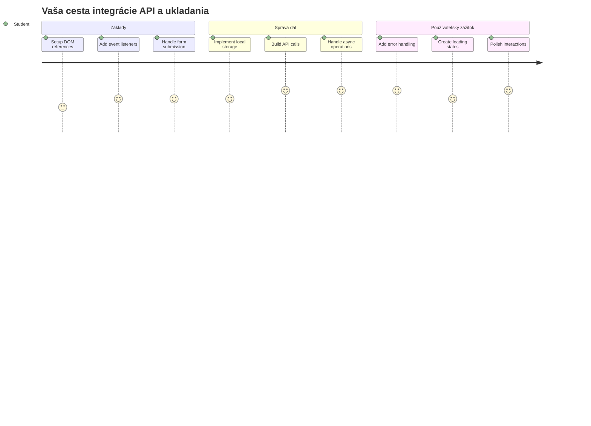
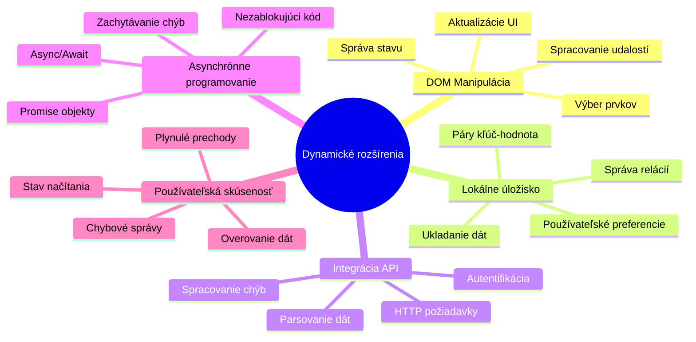
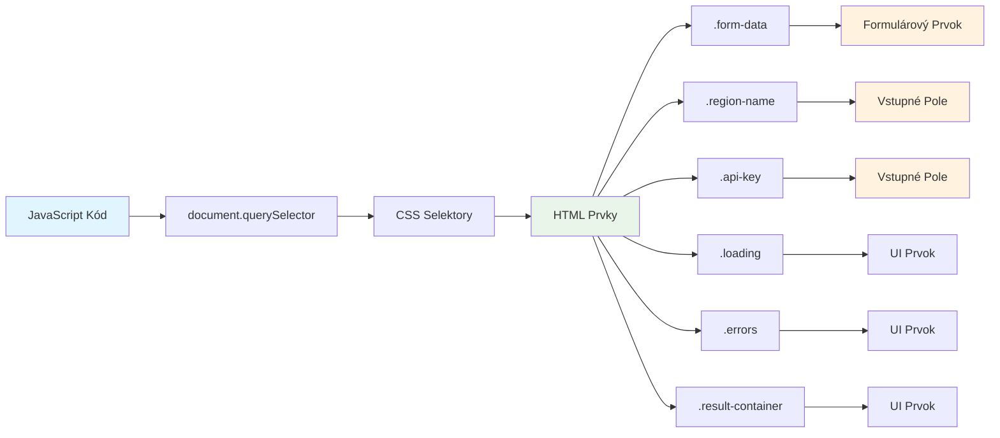
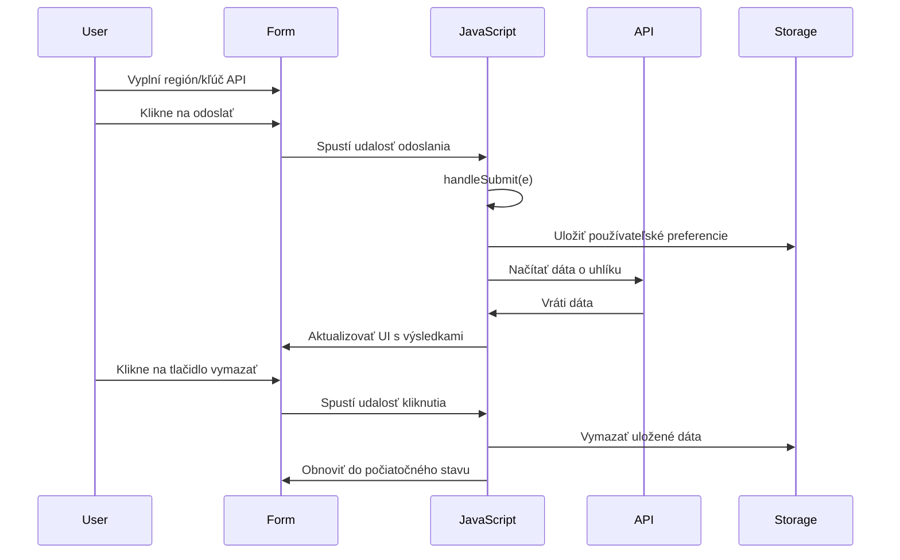
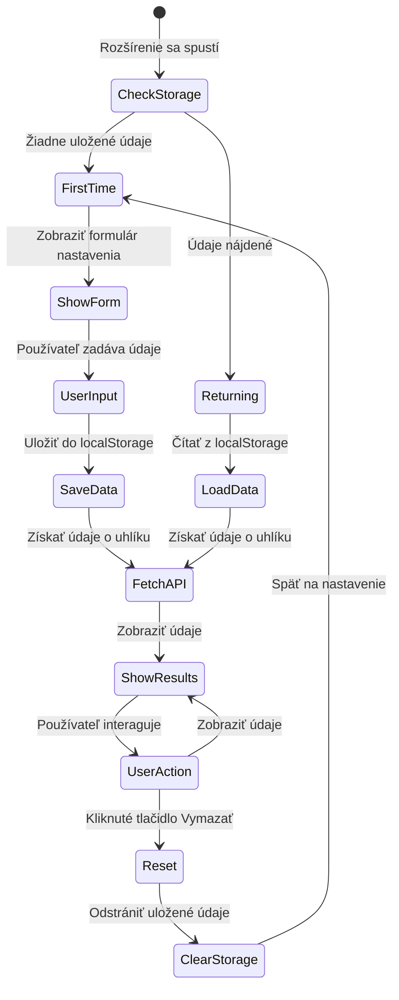
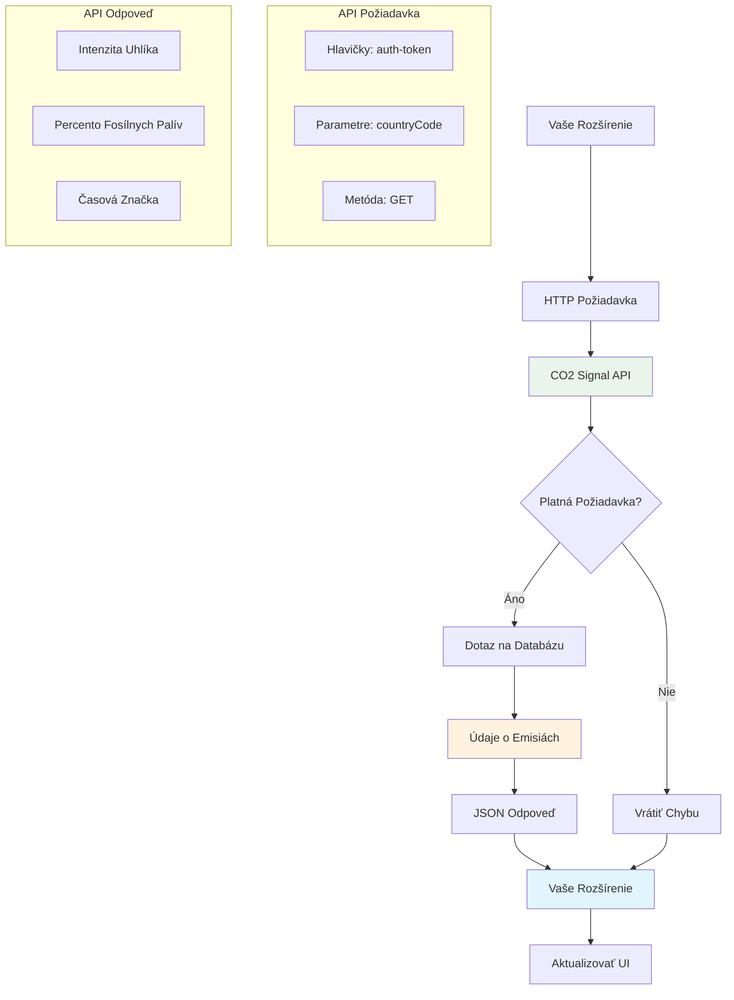
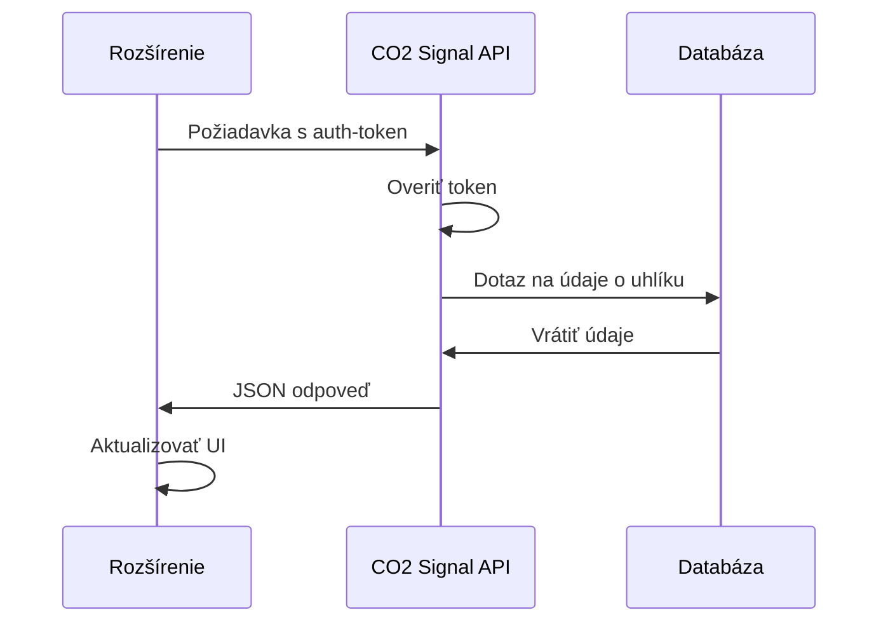
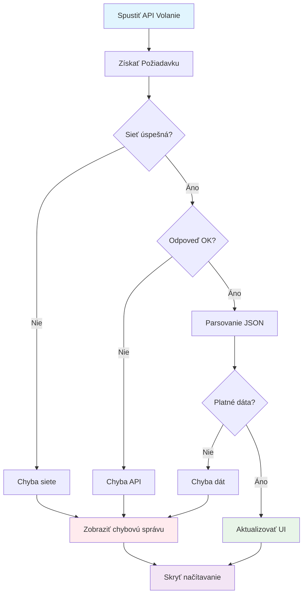
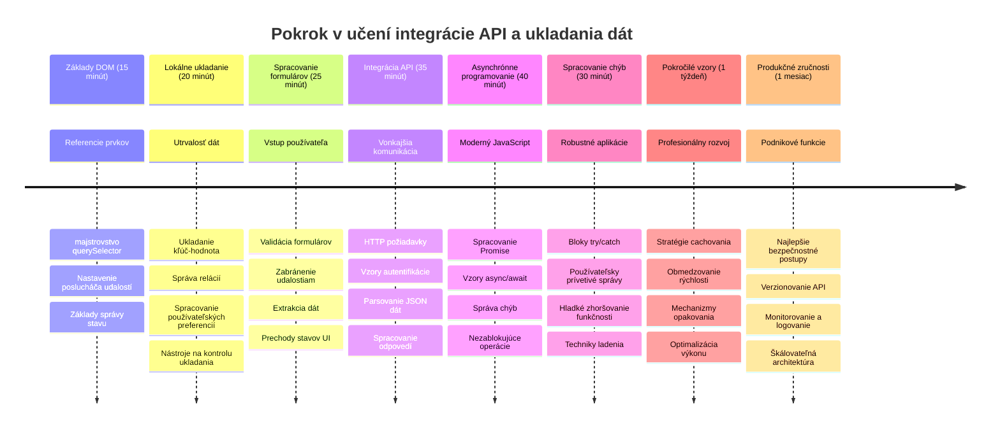

<!--
CO_OP_TRANSLATOR_METADATA:
{
  "original_hash": "2b6203a48c48d8234e0948353b47d84e",
  "translation_date": "2026-01-07T04:49:09+00:00",
  "source_file": "5-browser-extension/2-forms-browsers-local-storage/README.md",
  "language_code": "sk"
}
-->
# Browser Extension Project Časť 2: Zavolať API, použiť Lokálne Úložisko


## Prednáškový kvíz

[Prednáškový kvíz](https://ff-quizzes.netlify.app/web/quiz/25)

## Úvod

Pamätáte si tú rozšírenie prehliadača, ktoré ste začali stavať? Teraz máte pekný formulár, ale je v podstate statický. Dnes ho oživíme pripojením k reálnym dátam a pridáme mu pamäť.

Myslite na riadiace počítače misie Apollo - nezobrazovali len pevné informácie. Neustále komunikovali s vesmírnou loďou, aktualizovali sa o telemetrické údaje a pamatovali si kritické parametre misie. Presne taký dynamický behavior dnes budujeme. Vaše rozšírenie bude pristupovať na internet, získavať reálne environmentálne dáta a pamätať si vaše nastavenia na ďalšie použitie.

Integrácia API môže znieť zložito, ale v skutočnosti to znamená naučiť váš kód, ako komunikovať s inými službami. Či už načítavate údaje o počasí, sociálne médiá alebo informácie o uhlíkovej stope, ako dnes urobíme, ide o nadviazanie týchto digitálnych spojení. Preskúmame aj, ako prehliadače dokážu trvalo uchovávať informácie – podobne ako knižnice používali kartotéky na zapamätanie si, kde patria knihy.

Na konci tejto lekcie budete mať rozšírenie prehliadača, ktoré získava reálne dáta, ukladá používateľské preferencie a poskytuje plynulý zážitok. Poďme na to!


✅ Postupujte podľa očíslovaných segmentov v príslušných súboroch, aby ste vedeli, kde umiestniť svoj kód

## Nastavte prvky na manipuláciu v rozšírení

Predtým, než váš JavaScript môže manipulovať s rozhraním, potrebuje odkazy na konkrétne HTML prvky. Je to ako keď teleskop musí byť nasmerovaný na určité hviezdy – predtým, než Galileo mohol skúmať Jupiterove mesiace, musel najprv nájsť a zaostriť na Jupiter.

Vo vašom súbore `index.js` vytvoríme `const` premenné, ktoré zachytávajú odkazy na každý dôležitý prvok formulára. Je to podobné, ako vedci označujú svoje vybavenie – namiesto hľadania v celej laboratóriu môžu priamo pristupovať k tomu, čo potrebujú.


```javascript
// polia formulára
const form = document.querySelector('.form-data');
const region = document.querySelector('.region-name');
const apiKey = document.querySelector('.api-key');

// výsledky
const errors = document.querySelector('.errors');
const loading = document.querySelector('.loading');
const results = document.querySelector('.result-container');
const usage = document.querySelector('.carbon-usage');
const fossilfuel = document.querySelector('.fossil-fuel');
const myregion = document.querySelector('.my-region');
const clearBtn = document.querySelector('.clear-btn');
```

**Čo tento kód robí:**
- **Zachytáva** prvky formulára pomocou `document.querySelector()` s CSS selektormi tried
- **Vytvára** odkazy na vstupné polia pre názov regiónu a API kľúč
- **Nadväzuje** spojenia na prvky zobrazenia výsledkov pre údaje o spotrebe uhlíka
- **Nastavuje** prístup k UI prvkom ako indikátory načítavania a chybové hlásenia
- **Ukladá** každý odkaz na prvok do `const` premennej pre jednoduché opätovné použitie vo vašom kóde

## Pridajte event listenery

Teraz spravíme, aby vaše rozšírenie reagovalo na akcie používateľa. Event listenery sú spôsobom, akým váš kód sleduje interakcie používateľa. Predstavte si ich ako operátorov v ranných telefónnych ústredniach – počúvali prichádzajúce hovory a prepájali správne okruhy, keď chcel niekto nadviazať spojenie.


```javascript
form.addEventListener('submit', (e) => handleSubmit(e));
clearBtn.addEventListener('click', (e) => reset(e));
init();
```

**Pochopenie týchto konceptov:**
- **Pripája** listener na odoslanie formulára, ktorý sa spustí, keď používatelia stlačia Enter alebo kliknú na odoslať
- **Pripája** listener na kliknutie tlačidla resetu pre vyčistenie formulára
- **Prenáša** objekt udalosti `(e)` do funkcií spracovania pre ďalšiu kontrolu
- **Volá** funkciu `init()` okamžite, aby nastavila počiatočný stav rozšírenia

✅ Všimnite si tu použitý skrátený šípkový zápis funkcie. Tento moderný spôsob v JavaScript je čistejší než tradičné funkčné výrazy, ale oba fungujú rovnako dobre!

### 🔄 **Pedagogická kontrola**
**Pochopenie spracovania udalostí**: Pred presunom k inicializácii si overte, či viete:
- ✅ Vysvetliť, ako `addEventListener` prepája používateľské akcie s JavaScript funkciami
- ✅ Pochopiť, prečo odovzdávame objekt udalosti `(e)` do handler funkcií
- ✅ Rozpoznať rozdiel medzi udalosťami `submit` a `click`
- ✅ Opísať, kedy a prečo sa spúšťa funkcia `init()`

**Rýchly samo-test**: Čo by sa stalo, keby ste zabudli `e.preventDefault()` pri odoslaní formulára?
*Odpoveď: Stránka by sa znovu načítala, stratila by sa celá JavaScriptová konfigurácia a narušil by sa užívateľský zážitok*

## Vytvorte inicializačné a reset funkcie

Vytvorme inicializačnú logiku pre vaše rozšírenie. Funkcia `init()` je ako navigačný systém lode, ktorý kontroluje svoje prístroje – určuje aktuálny stav a podľa toho upravuje rozhranie. Skontroluje, či už niekto vaše rozšírenie používal, a načíta jeho predchádzajúce nastavenia.

Funkcia `reset()` poskytuje používateľom nový štart – podobne ako vedci medzi experimentmi resetujú svoje prístroje, aby mali čisté dáta.

```javascript
function init() {
	// Skontrolujte, či používateľ predtým uložil API poverenia
	const storedApiKey = localStorage.getItem('apiKey');
	const storedRegion = localStorage.getItem('regionName');

	// Nastaviť ikonu rozšírenia na všeobecnú zelenú (zástupca pre budúcu lekciu)
	// TODO: Implementovať aktualizáciu ikony v nasledujúcej lekcii

	if (storedApiKey === null || storedRegion === null) {
		// Používateľ prvýkrát: zobraziť formulár nastavenia
		form.style.display = 'block';
		results.style.display = 'none';
		loading.style.display = 'none';
		clearBtn.style.display = 'none';
		errors.textContent = '';
	} else {
		// Vracajúci sa používateľ: automaticky načítať ich uložené údaje
		displayCarbonUsage(storedApiKey, storedRegion);
		results.style.display = 'none';
		form.style.display = 'none';
		clearBtn.style.display = 'block';
	}
}

function reset(e) {
	e.preventDefault();
	// Vymazať uložený región, aby si používateľ mohol vybrať novú lokalitu
	localStorage.removeItem('regionName');
	// Reštartovať inicializačný proces
	init();
}
```

**Čo sa tu deje krok po kroku:**
- **Načíta** uložený API kľúč a región z lokálneho úložiska prehliadača
- **Skontroluje**, či je používateľ prvýkrát (žiadne uložené údaje) alebo sa vracia
- **Zobrazí** konfiguračný formulár pre nových používateľov a skryje ostatné UI prvky
- **Automaticky načíta** uložené údaje pre vracajúcich sa používateľov a zobrazí možnosť resetu
- **Spravuje** stav používateľského rozhrania na základe dostupných dát

**Kľúčové koncepty o Local Storage:**
- **Uchováva** údaje medzi reláciami prehliadača (na rozdiel od session storage)
- **Ukladá** dáta ako páry kľúč – hodnota pomocou `getItem()` a `setItem()`
- **Vracia** `null`, keď neexistujú údaje pre daný kľúč
- **Poskytuje** jednoduchý spôsob, ako zapamätať používateľské nastavenia

> 💡 **Pochopenie úložiska prehliadača**: [LocalStorage](https://developer.mozilla.org/docs/Web/API/Window/localStorage) je ako trvalá pamäť pre vaše rozšírenie. Premyslite si, ako staroveká Alexandrijská knižnica uchovávala zvitky – informácie zostávali dostupné čitateľom aj po ich opustení a návrate.
>
> **Hlavné vlastnosti:**
> - **Pretrvá** dáta aj po zatvorení prehliadača
> - **Prežije** reštarty počítača a zlyhania prehliadača
> - **Ponúka** značný priestor na uloženie používateľských preferencií
> - **Umožňuje** okamžitý prístup bez sieťových meškaní

> **Dôležitá poznámka**: Vaše rozšírenie prehliadača má svoje izolované lokálne úložisko oddelené od bežných webových stránok. To poskytuje bezpečnosť a zabraňuje konfliktom s inými stránkami.

Uložené údaje si môžete zobraziť otvorením Nástrojov vývojára prehliadača (F12), prejsť na kartu **Application** a rozbaliť sekciu **Local Storage**.




> ⚠️ **Bezpečnostné upozornenie**: V produkčných aplikáciách predstavuje uloženie API kľúčov v LocalStorage bezpečnostné riziko, pretože JavaScript k nim môže pristupovať. Pre vzdelávacie účely to funguje, ale reálne aplikácie by mali citlivé poverenia ukladať bezpečne na serverovej strane.

## Spracujte odoslanie formulára

Teraz spracujeme, čo sa stane, keď niekto odošle váš formulár. Štandardne prehliadače pri odoslaní formulára načítajú stránku znova, ale my toto správanie zachytíme, aby sme vytvorili plynulejší zážitok.

Tento prístup pripomína, ako riadiace stredisko rieši komunikáciu s vesmírnymi loďami – namiesto resetovania celého systému pri každom prenose udržiavajú nepretržitý chod a spracovávajú nové informácie.

Vytvorte funkciu, ktorá zachytáva udalosť odoslania formulára a získava vstup používateľa:

```javascript
function handleSubmit(e) {
	e.preventDefault();
	setUpUser(apiKey.value, region.value);
}
```

**Čo sme tu urobili:**
- **Zabránili** predvolenému správaniu odoslania formulára, ktoré by obnovilo stránku
- **Získali** hodnoty vstupu používateľa z polí API kľúča a regiónu
- **Odovzdali** dáta formulára funkcii `setUpUser()` na spracovanie
- **Udržali** správanie jednostránkovej aplikácie tým, že sa stránka znovu nenačítava

✅ Pamätajte, že vaše HTML polia vo formulári majú atribút `required`, takže prehliadač automaticky overí, či používateľ zadal API kľúč aj región ešte pred spustením tejto funkcie.

## Nastavte používateľské preferencie

Funkcia `setUpUser` je zodpovedná za uloženie používateľských poverení a spustenie prvého volania API. Tým sa vytvorí plynulý prechod od nastavenia k zobrazovaniu výsledkov.

```javascript
function setUpUser(apiKey, regionName) {
	// Uložiť prihlasovacie údaje používateľa pre budúce relácie
	localStorage.setItem('apiKey', apiKey);
	localStorage.setItem('regionName', regionName);
	
	// Aktualizovať používateľské rozhranie na zobrazenie stavu načítavania
	loading.style.display = 'block';
	errors.textContent = '';
	clearBtn.style.display = 'block';
	
	// Získať údaje o spotrebe CO2 s prihlasovacími údajmi používateľa
	displayCarbonUsage(apiKey, regionName);
}
```

**Krok po kroku, čo sa deje:**
- **Uloží** API kľúč a názov regiónu do lokálneho úložiska pre ďalšie použitie
- **Zobrazí** indikátor načítavania, aby používateľ vedel, že sa získavajú dáta
- **Vyčistí** všetky predchádzajúce chybové hlásenia z obrazovky
- **Zobrazí** tlačidlo reset pre používateľov na neskoršie vyčistenie nastavení
- **Spustí** volanie API na získanie reálnych údajov o spotrebe uhlíka

Táto funkcia vytvára plynulý používateľský zážitok tým, že kombinuje uchovávanie dát a aktualizácie užívateľského rozhrania v jednej koordinovanej akcii.

## Zobrazte údaje o spotrebe uhlíka

Teraz prepojíme vaše rozšírenie s externými zdrojmi dát cez API. Tým sa vaše rozšírenie z samostatného nástroja transformuje na niečo, čo môže pristupovať k reálnym informáciám v reálnom čase z celého internetu.

**Pochopenie API**

[API](https://www.webopedia.com/TERM/A/API.html) sú spôsoby, akým spolu aplikácie komunikujú. Predstavte si ich ako telegrafný systém, ktorý spájal vzdialené mestá v 19. storočí – operátori posielali požiadavky na vzdialené stanice a dostávali odpovede s požadovanými informáciami. Kedykoľvek kontrolujete sociálne médiá, pýtate sa hlasového asistenta alebo používate dodávkovú aplikáciu, API umožňujú tieto výmeny dát.


**Kľúčové koncepty REST API:**
- **REST** znamená 'Representational State Transfer'
- **Používa** štandardné HTTP metódy (GET, POST, PUT, DELETE) na prácu s dátami
- **Vracia** dáta v predvídateľných formátoch, typicky JSON
- **Poskytuje** konzistentné, URL - založené koncové body pre rôzne typy požiadaviek

✅ API [CO2 Signal](https://www.co2signal.com/), ktoré budeme používať, poskytuje aktuálne dáta o uhlíkovej intenzite elektrických sietí po celom svete. Pomáha používateľom pochopiť environmentálny dopad ich spotreby elektriny!

> 💡 **Pochopenie asynchrónneho JavaScriptu**: Kľúčové slovo [`async`](https://developer.mozilla.org/docs/Web/JavaScript/Reference/Statements/async_function) umožňuje vášmu kódu spracovávať viac operácií naraz. Keď požiadate server o dáta, nechcete, aby sa celé rozšírenie zablokovalo – to by bolo ako riadenie letovej prevádzky, ktoré zastaví všetky operácie, kým jedna lietadlo neodpovie.
>
> **Hlavné výhody:**
> - **Zachováva** odozvu rozšírenia počas načítavania dát
> - **Umožňuje** ostatnému kódu pokračovať v behu počas sieťových požiadaviek
> - **Zlepšuje** čitateľnosť kódu oproti tradičným callbackom
> - **Umožňuje** elegantnú správu chýb pri sieťových problémoch

Tu je krátke video o `async`:

[](https://youtube.com/watch?v=YwmlRkrxvkk "Async a Await pre správu sľubov")

> 🎥 Kliknite na obrázok vyššie pre video o async/await.

### 🔄 **Pedagogická kontrola**
**Pochopenie asynchrónneho programovania**: Predtým než sa pustíte do API funkcie, overte si, či rozumiete:
- ✅ Prečo používame `async/await` namiesto blokovania celého rozšírenia
- ✅ Ako bloky `try/catch` elegantne spracovávajú sieťové chyby
- ✅ Rozdiel medzi synchronnými a asynchronnými operáciami
- ✅ Prečo môže volanie API zlyhať a ako s týmito zlyhaniami naložiť

**Skutočné príklady asynchronity:**
- **Objednanie jedla**: Nečakáte pri kuchyni, dostanete potvrdenku a pokračujete ďalej
- **Odoslanie e-mailov**: Aplikácia sa nezamrzne, môžete písať ďalšie správy
- **Načítavanie webových stránok**: Obrázky sa načítajú postupne, zatiaľ čo vy čítate text

**Priebeh autentifikácie API**:

Vytvorte funkciu na získanie a zobrazenie dát o spotrebe uhlíka:

```javascript
// Moderný prístup pomocou fetch API (nie sú potrebné žiadne externé závislosti)
async function displayCarbonUsage(apiKey, region) {
	try {
		// Načítať údaje o uhlíkovej intenzite z CO2 Signal API
		const response = await fetch('https://api.co2signal.com/v1/latest', {
			method: 'GET',
			headers: {
				'auth-token': apiKey,
				'Content-Type': 'application/json'
			},
			// Pridať parametre dotazu pre konkrétny región
			...new URLSearchParams({ countryCode: region }) && {
				url: `https://api.co2signal.com/v1/latest?countryCode=${region}`
			}
		});

		// Skontrolovať, či bol API požiadavok úspešný
		if (!response.ok) {
			throw new Error(`API request failed: ${response.status}`);
		}

		const data = await response.json();
		const carbonData = data.data;

		// Vypočítať zaokrúhlenú hodnotu uhlíkovej intenzity
		const carbonIntensity = Math.round(carbonData.carbonIntensity);

		// Aktualizovať používateľské rozhranie s načítanými údajmi
		loading.style.display = 'none';
		form.style.display = 'none';
		myregion.textContent = region.toUpperCase();
		usage.textContent = `${carbonIntensity} grams (grams CO₂ emitted per kilowatt hour)`;
		fossilfuel.textContent = `${carbonData.fossilFuelPercentage.toFixed(2)}% (percentage of fossil fuels used to generate electricity)`;
		results.style.display = 'block';

		// TODO: calculateColor(carbonIntensity) - implementovať v ďalšej lekcii

	} catch (error) {
		console.error('Error fetching carbon data:', error);
		
		// Zobraziť používateľovi priateľskú chybovú správu
		loading.style.display = 'none';
		results.style.display = 'none';
		errors.textContent = 'Sorry, we couldn\'t fetch data for that region. Please check your API key and region code.';
	}
}
```

**Čo sa tu deje:**
- **Používa** moderné API `fetch()` namiesto externých knižníc ako Axios pre čistý, nezávislý kód
- **Implementuje** správnu kontrolu chýb pomocou `response.ok` na rýchle zachytenie neúspechov
- **Spracováva** asynchrónne operácie s `async/await` pre čitateľnejší tok kódu
- **Autentifikuje** sa v CO2 Signal API pomocou hlavičky `auth-token`
- **Parsuje** JSON odpoveď a extrahuje informácie o uhlíkovej intenzite
- **Aktualizuje** viaceré UI prvky s formátovanými environmentálnymi údajmi
- **Poskytuje** používateľsky prívetivé chybové hlásenia, keď volanie API zlyhá

**Ukázané moderné JavaScript koncepty:**
- **Template literály** s `${}` syntaxou pre čisté formátovanie reťazcov
- **Spracovanie chýb** pomocou blokov try/catch pre robustné aplikácie
- **Async/await** vzor pre elegantné spracovanie sieťových požiadaviek
- **Destrukturalizácia objektov** pre vyťaženie konkrétnych dát z odpovedí API
- **Reťazenie metód** pre viacnásobné manipulácie DOM

✅ Táto funkcia ukazuje viacero kľúčových konceptov webového vývoja – komunikáciu s externými servermi, správu autentifikácie, spracovanie dát, aktualizáciu rozhraní a šikovnú správu chýb. To sú základné zručnosti, ktoré profesionáli denne používajú.


### 🔄 **Pedagogická kontrola**
**Celkové pochopenie systému**: Overte si svoje znalosti celého postupu:
- ✅ Ako odkazy na DOM umožňujú JavaScriptu ovládať rozhranie
- ✅ Prečo lokálne úložisko vytvára trvalosť medzi reláciami prehliadača
- ✅ Ako async/await robí volania API bez zaseknutia rozšírenia
- ✅ Čo sa stane, keď volanie API zlyhá a ako sa chyba spracuje
- ✅ Prečo používateľský zážitok zahŕňa načítavacie stavy a chybové hlásenia

🎉 **Čo ste dosiahli:** Vytvorili ste rozšírenie prehliadača, ktoré:
- **Spojuje** sa s internetom a získava reálne environmentálne dáta
- **Uchováva** používateľské nastavenia medzi reláciami
- **Spracováva** chyby elegantne, namiesto havárie
- **Poskytuje** plynulý a profesionálny užívateľský zážitok

Otestujte svoju prácu spustením `npm run build` a obnovením rozšírenia v prehliadači. Teraz máte funkčný merač uhlíkovej stopy. Nasledujúca lekcia pridá dynamickú funkciu ikony na dokončenie rozšírenia.

---

## Výzva GitHub Copilot Agenta 🚀

Použite režim Agent na dokončenie nasledujúcej výzvy:
**Popis:** Vylepšite rozšírenie prehliadača pridaním zlepšení spracovania chýb a funkcií pre používateľskú skúsenosť. Táto výzva vám pomôže precvičiť si prácu s API, lokálnym úložiskom a manipuláciou s DOM pomocou moderných vzorov JavaScriptu.

**Výzva:** Vytvorte rozšírenú verziu funkcie displayCarbonUsage, ktorá bude obsahovať: 1) Mechanizmus opakovaní pre neúspešné volania API s exponenciálnym backoffom, 2) Overenie vstupu pre kód regiónu pred vykonaním volania API, 3) Animáciu načítania s indikátormi priebehu, 4) Ukladanie odpovedí API do localStorage s časovými značkami expirácie (cache na 30 minút), a 5) Funkciu na zobrazenie historických dát z predchádzajúcich volaní API. Takisto pridajte správne TypeScript-štýlové JSDoc komentáre na dokumentovanie všetkých parametrov funkcie a typov návratových hodnôt.

Viac sa dozviete o [agent mode](https://code.visualstudio.com/blogs/2025/02/24/introducing-copilot-agent-mode) tu.

## 🚀 Výzva

Rozšírte svoje znalosti o API preskúmaním bohatstva browserových API, ktoré sú dostupné pre webový vývoj. Vyberte si jedno z týchto browserových API a vytvorte malú ukážku:

- [Geolocation API](https://developer.mozilla.org/docs/Web/API/Geolocation_API) - Získajte aktuálnu polohu používateľa
- [Notification API](https://developer.mozilla.org/docs/Web/API/Notifications_API) - Posielajte desktopové notifikácie
- [HTML Drag and Drop API](https://developer.mozilla.org/docs/Web/API/HTML_Drag_and_Drop_API) - Vytvorte interaktívne rozhranie pre presúvanie
- [Web Storage API](https://developer.mozilla.org/docs/Web/API/Web_Storage_API) - Pokročilé techniky lokálneho ukladania
- [Fetch API](https://developer.mozilla.org/docs/Web/API/Fetch_API) - Moderná alternatíva XMLHttpRequest

**Výskumné otázky na zváženie:**
- Aké reálne problémy toto API rieši?
- Ako API spracováva chyby a okrajové prípady?
- Aké bezpečnostné aspekty je potrebné zvážiť pri používaní tohto API?
- Ako široko je API podporované naprieč rôznymi prehliadačmi?

Po vašom výskume identifikujte, ktoré vlastnosti robia API užívateľsky prívetivým a spoľahlivým pre vývojárov.

## Kvíz po prednáške

[Kvíz po prednáške](https://ff-quizzes.netlify.app/web/quiz/26)

## Prehľad a samostatné štúdium

Naučili ste sa o LocalStorage a API v tejto lekcii, oboje je veľmi užitočné pre profesionálneho webového developera. Môžete premýšľať o tom, ako tieto dve veci spolupracujú? Zamyslite sa, ako by ste navrhli webovú stránku, ktorá by ukladala položky na použitie v API.

### ⚡ **Čo môžete urobiť v nasledujúcich 5 minútach**
- [ ] Otvorte záložku Application v DevTools a preskúmajte localStorage na ľubovoľnej webovej stránke
- [ ] Vytvorte jednoduchý HTML formulár a otestujte validáciu formulára v prehliadači
- [ ] Vyskúšajte uložiť a načítať údaje pomocou localStorage v konzole prehliadača
- [ ] Skontrolujte odosielané dáta formulára pomocou záložky Network

### 🎯 **Čo môžete dosiahnuť v tomto hodine**
- [ ] Dokončiť kvíz po lekcii a pochopiť koncepty práce s formulármi
- [ ] Vytvoriť formulár pre rozšírenie prehliadača, ktorý ukladá používateľské preferencie
- [ ] Implementovať validáciu na strane klienta s užitočnými chybovými správami
- [ ] Precvičiť používanie API chrome.storage pre uchovávanie údajov rozšírenia
- [ ] Vytvoriť používateľské rozhranie reagujúce na uložené nastavenia používateľa

### 📅 **Vývoj rozšírenia počas týždňa**
- [ ] Dokončiť plnohodnotné rozšírenie prehliadača s funkciami formulára
- [ ] Ovládnuť rôzne možnosti ukladania: lokalné, synchronizované a session storage
- [ ] Implementovať pokročilé funkcie formulára ako automatické dopĺňanie a validáciu
- [ ] Pridať import/export funkciu pre používateľské dáta
- [ ] Dôkladne testovať rozšírenie v rôznych prehliadačoch
- [ ] Vylepšiť používateľský zážitok a spracovanie chýb rozšírenia

### 🌟 **Mesiac ovládania Web API**
- [ ] Vytvárať komplexné aplikácie pomocou rôznych browserových storage API
- [ ] Naučiť sa offline-first vývojové vzory
- [ ] Prispievať do open-source projektov zaoberajúcich sa perzistentným ukladaniem dát
- [ ] Ovládnuť vývoj s ohľadom na súkromie a dodržiavanie GDPR
- [ ] Vytvárať znovupoužiteľné knižnice pre prácu s formulármi a správu dát
- [ ] Zdieľať poznatky o webových API a vývoji rozšírení

## 🎯 Časový harmonogram vášho majstrovstva vo vývoji rozšírení


### 🛠️ Zhrnutie vášho full-stack vývojárskeho nástroja

Po absolvovaní tejto lekcie teraz máte:
- **Majstrovstvo DOM**: Precízne cielene a manipulácie s prvkami
- **Expertízu s úložiskom**: Perzistentná správa dát pomocou localStorage
- **Integráciu API**: Načítavanie dát v reálnom čase a autentifikáciu
- **Asynchrónne programovanie**: Nezablokujúce operácie s moderným JavaScriptom
- **Spracovanie chýb**: Robustné aplikácie, ktoré elegantne zvládajú zlyhania
- **Používateľskú skúsenosť**: Stav načítania, validácie a plynulé interakcie
- **Moderné vzory**: fetch API, async/await a ES6+ funkcie

**Získané profesionálne zručnosti**: Implementovali ste vzory používané v:
- **Webových aplikáciách**: Single-page aplikácie s externými zdrojmi dát
- **Mobilnom vývoji**: API-riadené aplikácie s offline schopnosťami
- **Desktopovom softvéri**: Electron aplikácie s perzistentným úložiskom
- **Podnikových systémoch**: Autentifikácia, kešovanie a spracovanie chýb
- **Moderných frameworkoch**: Vzory správy dát v React/Vue/Angular

**Ďalšia úroveň**: Ste pripravení preskúmať pokročilé témy ako kešovacie stratégie, realtime websocket pripojenia alebo komplexnú správu stavov!

## Zadanie

[Adoptujte API](assignment.md)

---

<!-- CO-OP TRANSLATOR DISCLAIMER START -->
**Upozornenie**:
Tento dokument bol preložený pomocou AI prekladateľskej služby [Co-op Translator](https://github.com/Azure/co-op-translator). Aj keď sa snažíme o presnosť, vezmite, prosím, na vedomie, že automatizované preklady môžu obsahovať chyby alebo nepresnosti. Originálny dokument v pôvodnom jazyku by mal byť považovaný za autoritatívny zdroj. Pre dôležité informácie sa odporúča profesionálny ľudský preklad. Nezodpovedáme za akékoľvek nedorozumenia alebo nesprávne výklady vyplývajúce z použitia tohto prekladu.
<!-- CO-OP TRANSLATOR DISCLAIMER END -->