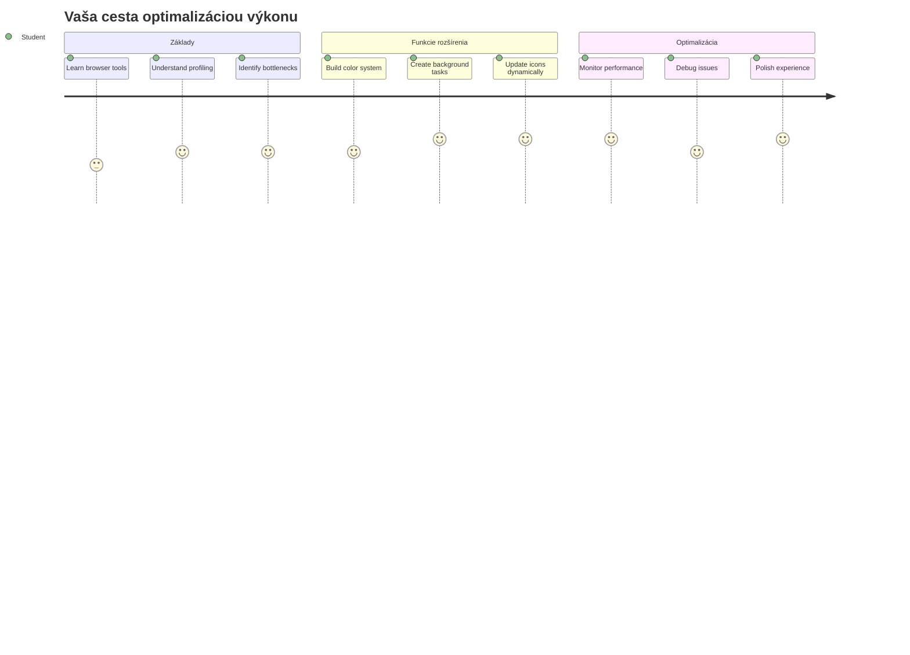
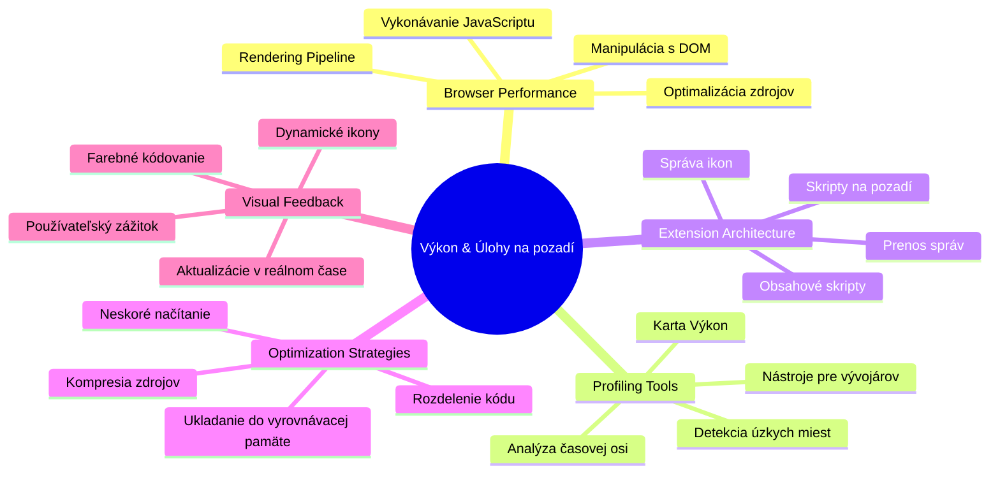
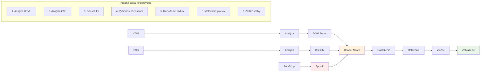
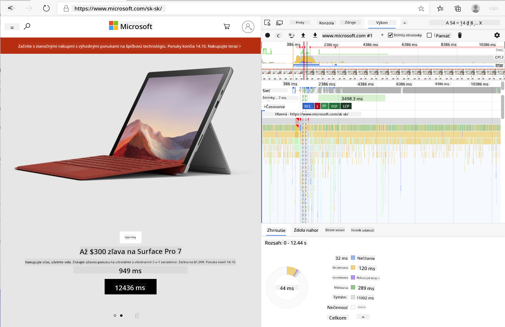
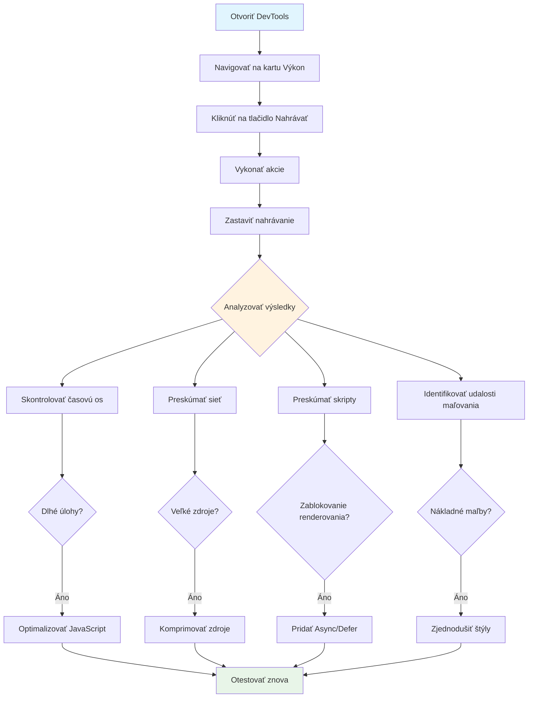
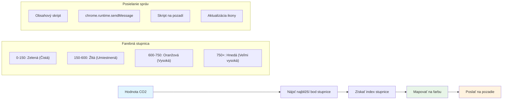
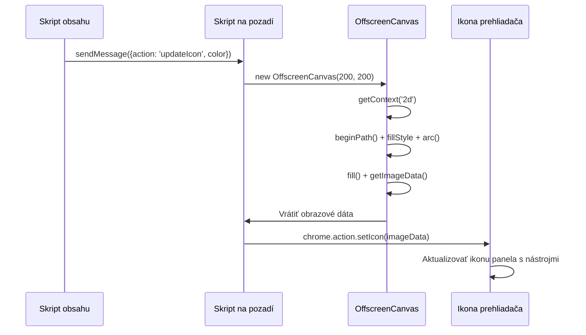
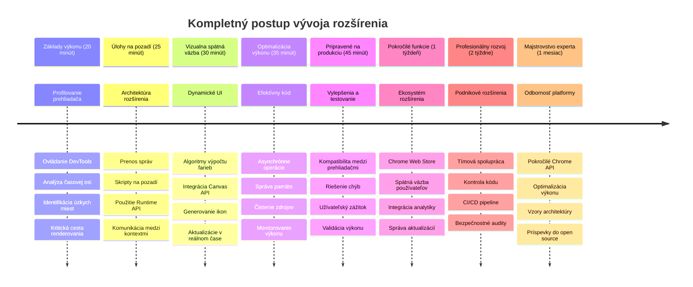

<!--
CO_OP_TRANSLATOR_METADATA:
{
  "original_hash": "b275fed2c6fc90d2b9b6661a3225faa2",
  "translation_date": "2026-01-07T04:51:03+00:00",
  "source_file": "5-browser-extension/3-background-tasks-and-performance/README.md",
  "language_code": "sk"
}
-->
# Projekt rozšírenia prehliadača Časť 3: Naučte sa o pozadových úlohách a výkone


Niekedy ste sa zamýšľali, čo robí niektoré rozšírenia prehliadača svižnými a responzívnymi, zatiaľ čo iné pôsobia pomaly? Tajomstvo spočíva v tom, čo sa deje na pozadí. Kým používatelia klikajú v rozhraní vášho rozšírenia, za scénou tichučko beží celý svet procesov, ktoré spravujú získavanie dát, aktualizácie ikon a systémové zdroje.

Toto je naša záverečná lekcia zo série o rozšíreniach prehliadača a spravíme tak, aby váš tracker uhlíkovej stopy fungoval hladko. Pridáte dynamické aktualizácie ikony a naučíte sa rozpoznať problémy s výkonom ešte predtým, než sa stanú problémami. Je to ako ladenie závodného auta – malé optimalizácie môžu výrazne ovplyvniť, ako všetko beží.

Keď skončíme, budete mať vyleštené rozšírenie a pochopíte princípy výkonu, ktoré oddeľujú dobré webové aplikácie od skvelých. Poďme sa ponoriť do sveta optimalizácie prehliadača.

## Prednáškový kvíz

[Prednáškový kvíz](https://ff-quizzes.netlify.app/web/quiz/27)

### Úvod

V predchádzajúcich lekciách ste vytvorili formulár, prepojili ho s API a riešili asynchrónne získavanie dát. Vaše rozšírenie sa pekne formuje.

Teraz potrebujeme pridať posledné úpravy – napríklad aby sa ikona rozšírenia menila podľa údajov o uhlíku. Pripomína mi to, ako NASA musela optimalizovať každý systém na kozmickej lodi Apollo. Nemohli si dovoliť žiadne premrhané cykly ani pamäť, pretože životy záviseli od výkonu. Aj keď naše rozšírenie prehliadača nie je také kritické, rovnaké princípy platia – efektívny kód vytvára lepší používateľský zážitok.


## Základy výkonu webu

Keď váš kód beží efektívne, ľudia to dokážu *pocítiť*. Poznáte ten moment, keď sa stránka načíta okamžite alebo animácia plynie hladko? To je dobrý výkon v praxi.

Výkon nie je len o rýchlosti – ide o to, aby webové zážitky pôsobili prirodzene, nie kostrbato a frustrujúco. V počiatkoch výpočtovej techniky si Grace Hopper na svojom stole nechávala nanosekundu (kus drôtu dlhý asi stopu), aby ukázala, ako ďaleko svetlo prejde za jednu miliardtinu sekundy. Takto vysvetľovala, prečo záleží na každom mikrosekunde v počítačoch. Poďme preskúmať nástroje detektívov, ktoré vám pomôžu zistiť, čo spomaľuje veci.

> "Výkon webovej stránky je o dvoch veciach: ako rýchlo sa stránka načíta a ako rýchlo na nej beží kód." -- [Zack Grossbart](https://www.smashingmagazine.com/2012/06/javascript-profiling-chrome-developer-tools/)

Téma, ako spraviť vaše weby bleskurýchlymi na rôznych zariadeniach, pre rôznych používateľov, v rôznych situáciách, je prirodzene rozsiahla. Tu je niekoľko bodov, ktoré si treba pamätať pri tvorbe štandardného webového projektu alebo rozšírenia prehliadača.

Prvým krokom optimalizácie vášho webu je pochopiť, čo sa vlastne deje pod kapotou. Našťastie váš prehliadač má zabudované výkonné detektívne nástroje.


Ak chcete otvoriť Nástroje vývojára v Edge, kliknite na tie tri bodky v pravom hornom rohu, potom choďte na Viac nástrojov > Nástroje vývojára. Alebo použite klávesovú skratku: `Ctrl` + `Shift` + `I` vo Windows alebo `Option` + `Command` + `I` na Macu. Keď ste tam, kliknite na kartu Výkon – tam sa bude odohrávať vaše vyšetrovanie.

**Tu je váš detektívny súbor na výkon:**
- **Otvorte** Nástroje vývojára (budete ich ako developer neustále používať!)
- **Prejdite** na kartu Výkon – predstavte si ju ako fitness tracker vášho webu
- **Stlačte** tlačidlo Nahrávanie a sledujte svoju stránku v akcii
- **Študujte** výsledky, aby ste našli, čo spomaľuje veci

Poďme to vyskúšať. Otvorte nejakú webovú stránku (napríklad Microsoft.com funguje dobre) a kliknite na tlačidlo 'Nahrávanie'. Teraz obnovte stránku a sledujte, ako profiler zaznamenáva všetko, čo sa deje. Keď zastavíte nahrávanie, uvidíte podrobný rozpis, ako prehliadač 'spúšťa skripty', 'vykresľuje' a 'maľuje' stránku. Pripomína mi to, ako riadiace stredisko monitoruje každý systém počas štartu rakety – máte dáta v reálnom čase o tom, čo sa presne deje a kedy.



✅ Dokumentácia [Microsoftu](https://docs.microsoft.com/microsoft-edge/devtools-guide/performance/?WT.mc_id=academic-77807-sagibbon) obsahuje množstvo detailov, ak chcete ísť viac do hĺbky

> Tip pre profíkov: Vyčistite cache prehliadača pred testovaním, aby ste videli výkon stránky pre prvých návštevníkov – zvyčajne je výrazne iný ako pri opakovaných návštevách!

Vyberte prvky časovej osi profilu, aby ste sa priblížili na udalosti, ktoré sa dejú počas načítavania stránky.

Získajte rýchly prehľad o výkone stránky výberom časti časovej osi profilu a zobrazením sumárneho panelu:


Skontrolujte panel Záznam udalostí, či sa niektorá udalosť nepretiahla nad 15 ms:


✅ Spoznajte svoj profiler! Otvorte nástroje vývojára na tejto stránke a zistite, či sú nejaké úzke miesta. Ktorý zdroj sa načítava najpomalšie? Ktorý najsrýchlejšie?


## Čo hľadať pri profilovaní

Spustenie profilu je len začiatok – skutočne dôležité je vedieť, čo vám tie farebné grafy vlastne hovoria. Nebojte sa, naučíte sa ich čítať. Skúsení developeri dokážu rozpoznať varovné signály skôr, než prerastú do veľkých problémov.

Pozrime sa na obvyklých podozrivých – výkonnostné problémy, ktoré sa často plížia do webových projektov. Rovnako ako Marie Curie musela starostlivo sledovať úrovne žiarenia vo svojej laboratóriu, my musíme dávať pozor na určité vzory, ktoré naznačujú budúce ťažkosti. Ich včasné zachytenie vám (a vašim používateľom) ušetrí kopu frustrácie.

**Veľkosť assetov**: Weby za tie roky „zhustli“, veľká časť toho nárastu váhy pripadá na obrázky. Akoby sme do našich digitálnych kufrov stále viac a viac nabalili.

✅ Pozrite si [Internet Archive](https://httparchive.org/reports/page-weight), ako sa veľkosť stránok zväčšuje v čase – je to dosť odhaľujúce.

**Ako mať assety optimalizované:**
- **Kompresujte** obrázky! Moderné formáty ako WebP výrazne zmenšujú veľkosť súborov
- **Podávajte** vhodnú veľkosť obrázka pre každé zariadenie – nie je potrebné posielať obrovské desktopové obrázky do telefónov
- **Minifikujte** CSS a JavaScript – každý bajt sa počíta
- **Používajte** lazy loading, aby sa obrázky sťahovali len, keď ich používateľ naozaj posunie do zorného poľa

**Prehliadanie DOM**: Prehliadač si musí vytvoriť Document Object Model na základe kódu, ktorý píšete, preto je v záujme dobrého výkonu stránky mať minimum značiek, používať a štýlovať len to, čo stránka potrebuje. K tomuto bodu môže byť prebytočné CSS optimalizované; štýly, ktoré sú potrebné len na jednej stránke, nemusia byť zahrnuté v hlavnom štýlovacom súbore, napríklad.

**Kľúčové stratégie pre optimalizáciu DOM:**
- **Minimalizujte** počet HTML elementov a úrovní vnorenia
- **Odstráňte** nepoužívané pravidlá CSS a efektívne konsolidujte štýly
- **Organizujte** CSS tak, aby sa načítalo len to, čo je potrebné pre konkrétnu stránku
- **Štruktúrujte** HTML semanticky pre lepšie spracovanie prehliadačom

**JavaScript**: Každý JavaScript developer by si mal všímať 'render-blocking' skripty, ktoré sa musia načítať predtým, ako sa zvyšok DOM môže prejaviť a vykresliť v prehliadači. Zvážte použitie `defer` na vaše inline skripty (ako to robí modul Terrarium).

**Moderné techniky optimalizácie JavaScriptu:**
- **Používajte** atribút `defer` na načítanie skriptov po spracovaní DOM
- **Implementujte** kódové rozdelenie, aby sa načítavale len potrebné časti JavaScriptu
- **Aplikujte** lazy loading pre nekritickú funkcionalitu
- **Minimalizujte** používanie ťažkých knižníc a rámcov, keď je to možné

✅ Vyskúšajte niekoľko stránok na [Site Speed Test webstránke](https://www.webpagetest.org/), aby ste sa dozvedeli viac o bežných kontrolách výkonnosti webu.

### 🔄 **Pedagogická kontrola**
**Porozumenie výkonu**: Predtým, než začnete tvoriť funkcie rozšírenia, uistite sa, že viete:
- ✅ Vysvetliť kritickú cestu vykresľovania od HTML po pixely
- ✅ Identifikovať bežné úzke miesta vo výkone webových aplikácií
- ✅ Použiť vývojárske nástroje prehliadača na profilovanie výkonu stránky
- ✅ Rozumieť, ako veľkosť assetov a komplexnosť DOM ovplyvňuje rýchlosť

**Rýchly sebakvíz**: Čo sa stane, keď máte render-blocking JavaScript?
*Odpoveď: Prehliadač musí stiahnuť a vykonať skript predtým, ako môže pokračovať v parsovaní HTML a vykresľovaní stránky*

**Skutočný dopad výkonu:**
- **100 ms oneskorenie**: Používatelia vnímajú spomalenie
- **1 sekunda oneskorenia**: Používatelia začínajú strácať pozornosť
- **Nad 3 sekundy**: 40% používateľov stránku opúšťa
- **Mobilné siete**: Výkon záleží ešte viac

Keď už viete, ako prehliadač vykresľuje zaslané assety, pozrime sa na posledné veci, ktoré treba spraviť, aby bolo vaše rozšírenie kompletné:

### Vytvorte funkciu na výpočet farby

Teraz vytvoríme funkciu, ktorá premení číselné dáta na zmysluplné farby. Predstavte si to ako semafor – zelená pre čistú energiu, červená pre vysokú uhlíkovú intenzitu.

Táto funkcia vezme CO2 údaje z nášho API a určí, ktorá farba najlepšie reprezentuje environmentálny dopad. Je to podobné, ako vedci používajú farebné kódovanie v tepelných mapách na vizualizáciu zložitých dátových vzorov – od teplôt oceánu po tvorbu hviezd. Pridajme to do `/src/index.js`, hneď za tie premenné `const`, ktoré sme si na začiatku nastavili:


```javascript
function calculateColor(value) {
	// Definujte mierku intenzity CO2 (gramy na kWh)
	const co2Scale = [0, 150, 600, 750, 800];
	// Zodpovedajúce farby od zelenej (čistá) po tmavohnedú (vysoký obsah uhlíka)
	const colors = ['#2AA364', '#F5EB4D', '#9E4229', '#381D02', '#381D02'];

	// Nájdite najbližšiu hodnotu na mierke k nášmu vstupu
	const closestNum = co2Scale.sort((a, b) => {
		return Math.abs(a - value) - Math.abs(b - value);
	})[0];
	
	console.log(`${value} is closest to ${closestNum}`);
	
	// Nájdite index pre mapovanie farieb
	const num = (element) => element > closestNum;
	const scaleIndex = co2Scale.findIndex(num);

	const closestColor = colors[scaleIndex];
	console.log(scaleIndex, closestColor);

	// Pošlite správu o aktualizácii farby skriptu na pozadí
	chrome.runtime.sendMessage({ action: 'updateIcon', value: { color: closestColor } });
}
```

**Rozoberme si túto šikovnú funkciu:**
- **Nastavuje** dve polia – jedno pre hodnoty CO2, druhé pre farby (zelená = čistá, hnedá = špinavá!)
- **Nájde** najbližší zodpovedajúci CO2 údaj použitím šikovného radenia poľa
- **Získa** zodpovedajúcu farbu pomocou metódy findIndex()
- **Odošle** správu do pozadového scriptu Chromu s vybranou farbou
- **Používa** template literals (tie spätné úvodzovky) pre čistejšie formátovanie reťazcov
- **Udržiava** všetko organizované pomocou const deklarácií

`chrome.runtime` [API](https://developer.chrome.com/extensions/runtime) je ako nervový systém vášho rozšírenia – spravuje všetku komunikáciu a úlohy na pozadí:

> "Použite chrome.runtime API na získanie pozadovej stránky, vrátenie detailov o manifeste a počúvanie a reagovanie na udalosti počas životného cyklu aplikácie alebo rozšírenia. Toto API tiež umožňuje konvertovať relatívne cesty URL na plne kvalifikované URL."

**Prečo je Chrome Runtime API tak užitočné:**
- **Umožňuje** rôznym častiam vášho rozšírenia spolu komunikovať
- **Zvláda** prácu na pozadí bez zamŕzania používateľského rozhrania
- **Spravuje** životný cyklus vašich udalostí rozšírenia
- **Uľahčuje** posielanie správ medzi skriptmi

✅ Ak toto rozšírenie vyvíjate pre Edge, môže vás prekvapiť, že používate chrome API. Novšie verzie prehliadača Edge bežia na jadre Chromium, takže môžete tieto nástroje využiť.


> **Profesionálny tip**: Ak chcete profilovať rozšírenie prehliadača, spustite vývojárske nástroje priamo z rozšírenia, pretože je to vlastná samostatná inštancia prehliadača. Takto získate prístup k špecifickým metríkám výkonu rozšírenia.

### Nastavte predvolenú farbu ikony

Pred tým, než začneme s načítaním reálnych dát, dajme nášmu rozšíreniu štartovací bod. Nikto nemá rád, keď pozerá na prázdnu alebo rozbitú ikonu. Začneme zelenou farbou, aby používatelia vedeli, že rozšírenie funguje hneď po inštalácii.

Vo vašej funkcii `init()` nastavme tento predvolený zelený symbol:

```javascript
chrome.runtime.sendMessage({
	action: 'updateIcon',
	value: {
		color: 'green',
	},
});
```

**Čo táto inicializácia robí:**
- **Nastavuje** neutrálne zelenú farbu ako predvolený stav
- **Poskytuje** okamžitú vizuálnu spätnú väzbu, keď sa rozšírenie načíta
- **Zavádza** komunikačný vzor s pozadovým skriptom
- **Zabezpečuje**, že používatelia vidia funkčné rozšírenie pred načítaním dát

### Zavolajte funkciu, vykonajte volanie

Teraz všetko spojme tak, aby sa ikonka automaticky aktualizovala správnou farbou, keď príde nová CO2 data. Je to ako zapojiť posledný obvod v elektronickom zariadení – zrazu všetky súčasti fungujú ako jeden systém.

Pridajte tento riadok hneď po tom, ako získate CO2 dáta z API:

```javascript
// Po načítaní údajov o CO2 z API
// nech CO2 = data.data[0].intensity.actual;
calculateColor(CO2);
```

**Táto integrácia zabezpečuje:**
- **Prepojenie** dátového toku API so systémom vizuálnych indikátorov
- **Spúšťa** aktualizáciu ikony automaticky pri príchode nových dát
- **Zabezpečuje** vizuálnu spätnú väzbu v reálnom čase podľa aktuálnej uhlíkovej intenzity
- **Udržiava** oddelenie medzi získavaním dát a logikou zobrazenia

A nakoniec do `/dist/background.js` pridajte poslucháča pre tieto volania z pozadia:

```javascript
// Počúvaj správy od obsahového skriptu
chrome.runtime.onMessage.addListener(function (msg, sender, sendResponse) {
	if (msg.action === 'updateIcon') {
		chrome.action.setIcon({ imageData: drawIcon(msg.value) });
	}
});

// Nakresli dynamickú ikonu pomocou Canvas API
// Požičané z rozšírenia energy lollipop - pekná funkcia!
function drawIcon(value) {
	// Vytvor offscreen canvas pre lepší výkon
	const canvas = new OffscreenCanvas(200, 200);
	const context = canvas.getContext('2d');

	// Nakresli farebný kruh zobrazujúci intenzitu uhlíka
	context.beginPath();
	context.fillStyle = value.color;
	context.arc(100, 100, 50, 0, 2 * Math.PI);
	context.fill();

	// Vráť obrazové dáta pre ikonu prehliadača
	return context.getImageData(50, 50, 100, 100);
}
```

**Čo tento pozadový skript robí:**
- **Počuje** správy z hlavného skriptu (ako recepčný, ktorý prijíma hovory)
- **Spracováva** požiadavky 'updateIcon' na zmenu ikonky na paneli nástrojov
- **Vytvára** nové ikony za behu pomocou Canvas API
- **Kreslí** jednoduchý farebný kruh, ktorý ukazuje aktuálnu uhlíkovú intenzitu
- **Aktualizuje** váš panel nástrojov prehliadača s novou ikonou
- **Používa** OffscreenCanvas pre hladký výkon (bez blokovania UI)

✅ Viac o Canvas API sa naučíte v [lekciách vesmírnej hry](../../6-space-game/2-drawing-to-canvas/README.md).


### 🔄 **Pedagogická kontrola**
**Komplexné porozumenie rozšíreniu**: Overte si svoju znalosť celého systému:
- ✅ Ako funguje posielanie správ medzi rôznymi skriptmi rozšírenia?
- ✅ Prečo používame OffscreenCanvas namiesto obyčajného Canvas pre výkon?
- ✅ Akú úlohu zohráva Chrome Runtime API v architektúre rozšírenia?
- ✅ Ako algoritmus výpočtu farieb mapuje dáta na vizuálnu spätnú väzbu?

**Výkonnostné aspekty**: Vaše rozšírenie teraz demonštruje:
- **Efektívnu komunikáciu**: Čistá komunikácia medzi skriptovacími kontextmi
- **Optimalizované vykresľovanie**: OffscreenCanvas zabraňuje blokovaniu UI
- **Aktualizácie v reálnom čase**: Dynamické zmeny ikony na základe živých dát
- **Správu pamäte**: Správne čistenie a spracovanie zdrojov

**Čas otestovať vaše rozšírenie:**
- **Zostavte** všetko pomocou `npm run build`
- **Obnovte** svoje rozšírenie v prehliadači (nezabudnite na tento krok)
- **Otvorte** rozšírenie a sledujte, ako sa ikona mení farby
- **Skontrolujte**, ako reaguje na skutočné údaje o uhlíku zo sveta

Teraz ihneď uvidíte, či je vhodný čas na pranie alebo či máte čakať na čistejšiu energiu. Práve ste vytvorili niečo naozaj užitočné a zároveň sa naučili niečo o výkonnosti prehliadača.

## GitHub Copilot Agent Challenge 🚀

Použite režim Agent na splnenie nasledujúcej výzvy:

**Popis:** Vylepšite schopnosti monitorovania výkonnosti rozšírenia prehliadača pridaním funkcie, ktorá sleduje a zobrazuje časy načítania pre rôzne komponenty rozšírenia.

**Výzva:** Vytvorte systém monitorovania výkonnosti pre rozšírenie prehliadača, ktorý meria a zaznamenáva čas potrebný na získanie údajov o CO2 z API, výpočet farieb a aktualizáciu ikony. Pridajte funkciu `performanceTracker`, ktorá využíva Performance API na meranie týchto operácií a zobrazuje výsledky v konzole prehliadača s časovými značkami a metrikami trvania.

Viac informácií o [agent mode](https://code.visualstudio.com/blogs/2025/02/24/introducing-copilot-agent-mode) nájdete tu.

## 🚀 Výzva

Tu je zaujímavá detektívna misia: vyberte niekoľko open source webstránok, ktoré existujú už roky (napríklad Wikipedia, GitHub alebo Stack Overflow) a preskúmajte ich históriu commitov. Dokážete nájsť miesta, kde robili zlepšenia výkonnosti? Aké problémy sa stále opakovali?

**Prístup k vyšetrovanie:**
- **Hľadajte** v správach ku commitom slová ako "optimize", "performance" alebo "faster"
- **Pozorujte** vzory - opravujú stále tie isté typy problémov?
- **Identifikujte** bežné príčiny spomaľovania webstránok
- **Zdieľajte** svoje zistenia - ostatní vývojári sa môžu učiť z reálnych príkladov

## Test po prednáške

[Test po prednáške](https://ff-quizzes.netlify.app/web/quiz/28)

## Prehľad a samostatné štúdium

Zvážte prihlásenie sa na [výkonnostný newsletter](https://perf.email/)

Preskúmajte spôsoby, ako prehliadače hodnotia webovú výkonnosť cez záložky výkonu v nástrojoch pre vývojárov. Nachádzate nejaké zásadné rozdiely?

### ⚡ **Čo môžete spraviť v nasledujúcich 5 minútach**
- [ ] Otvorte Správcu úloh prehliadača (Shift+Esc v Chrome) a pozrite využitie zdrojov rozšírení
- [ ] Použite záložku Výkon v DevTools na nahrávanie a analýzu výkonu webstránky
- [ ] Skontrolujte stránku rozšírení prehliadača, ktoré rozšírenia ovplyvňujú čas spustenia
- [ ] Skúste dočasne vypnúť rozšírenia a porovnajte zmeny vo výkonnosti

### 🎯 **Čo môžete dosiahnuť počas tejto hodiny**
- [ ] Dokončiť test po lekcii a pochopiť koncepty výkonu
- [ ] Implementovať background skript pre vaše rozšírenie prehliadača
- [ ] Naučiť sa používať browser.alarms na efektívne pozadie úlohy
- [ ] Precvičiť si odovzdávanie správ medzi content scripty a background scripty
- [ ] Meranie a optimalizovanie využitia zdrojov vášho rozšírenia

### 📅 **Váš týždenný plán zlepšovania výkonu**
- [ ] Dokončiť vysoko výkonné rozšírenie prehliadača s funkciami na pozadí
- [ ] Ovládnuť service workery a modernú architektúru rozšírení
- [ ] Implementovať efektívnu synchronizáciu dát a cache stratégie
- [ ] Naučiť sa pokročilé techniky ladenia výkonu rozšírení
- [ ] Optimalizovať vaše rozšírenie pre funkčnosť aj efektívnosť zdrojov
- [ ] Vytvoriť komplexné testy pre scenáre výkonu rozšírenia

### 🌟 **Váš mesačný plán ovládnutia optimalizácie**
- [ ] Vyvinúť podnikové rozšírenia prehliadača s optimálnym výkonom
- [ ] Spoznávať Web Workers, Service Workers a moderný webový výkon
- [ ] Prispievať do open source projektov zameraných na optimalizáciu výkonu
- [ ] Ovládnuť interná architektúru prehliadača a pokročilé ladenie
- [ ] Vytvárať nástroje a príručky monitorovania výkonu
- [ ] Stať sa expertom na výkon, ktorý pomáha optimalizovať webové aplikácie

## 🎯 Váš časový plán ovládnutia rozšírení prehliadača


### 🛠️ Váš kompletný toolkit na vývoj rozšírení

Po dokončení tejto trilógie ste ovládli:
- **Architektúru prehliadača**: Hlboké pochopenie integrácie rozšírení s prehliadačmi
- **Profilovanie výkonu**: Schopnosť identifikovať a opravovať úzke miesta pomocou nástrojov pre vývojárov
- **Asynchrónne programovanie**: Moderné JavaScript vzory pre responzívne, neblokujúce operácie
- **Integráciu API**: Získavanie externých dát s autentifikáciou a spracovaním chýb
- **Vizuálny dizajn**: Dynamické aktualizácie UI a generovanie grafik cez Canvas
- **Odovzdávanie správ**: Komunikácia medzi skriptami v architektúre rozšírení
- **Používateľskú skúsenosť**: Stavy načítania, spracovanie chýb a intuitívna interakcia
- **Zručnosti pre produkciu**: Testovanie, ladenie a optimalizácia pre reálne nasadenie

**Aplikácie v reálnom svete**: Vaše zručnosti sa priamo využívajú v:
- **Progresívnych webových aplikáciách**: Podobná architektúra a výkonnostné vzory
- **Electron desktop aplikáciách**: Multiplatformové aplikácie využívajúce webové technológie
- **Mobilných hybridných aplikáciách**: Vývoj cez Cordova/PhoneGap s web API
- **Podnikových webových aplikáciách**: Komplexné dashboardy a nástroje produktivity
- **Rozšíreniach Chrome DevTools**: Pokročilé nástroje pre vývojárov a ladenie
- **Integrácii Web API**: Ľubovoľné aplikácie komunikujúce s externými službami

**Profesionálny dopad**: Teraz môžete:
- **Stavať** produkčne pripravené rozšírenia od konceptu po nasadenie
- **Optimalizovať** výkonnosť webových aplikácií s priemyselnými nástrojmi
- **Architektúrovať** škálovateľné systémy s rozumným oddelením zodpovedností
- **Ladiť** komplexné asynchrónne operácie a komunikáciu medzi kontextami
- **Prispievať** do open source projektov a štandardov prehliadačov

**Príležitosti na ďalšej úrovni**:
- **Vývojár Chrome Web Store**: Publikovať rozšírenia pre milióny používateľov
- **Inžinier webového výkonu**: Špecializovať sa na optimalizáciu a UX
- **Vývojár platformy prehliadača**: Prispievať ku vývoju prehliadačového jadra
- **Tvůrce rámcov pre rozšírenia**: Vyvíjať nástroje pre iných vývojárov
- **Vzťahy s vývojármi**: Šíriť vedomosti prostredníctvom výučby a tvorby obsahu

🌟 **Úspech odomknutý**: Vybudovali ste kompletné, funkčné rozšírenie prehliadača, ktoré demonštruje profesionálne postupy a moderné web štandardy!

## Zadanie

[Analyzuj stránku pre výkon](assignment.md)

---

<!-- CO-OP TRANSLATOR DISCLAIMER START -->
**Vyhlásenie o zodpovednosti**:
Tento dokument bol preložený pomocou AI prekladateľskej služby [Co-op Translator](https://github.com/Azure/co-op-translator). Hoci sa snažíme o presnosť, prosím vezmite na vedomie, že automatizované preklady môžu obsahovať chyby alebo nepresnosti. Originálny dokument v jeho pôvodnom jazyku by mal byť považovaný za autoritatívny zdroj. Pre kritické informácie sa odporúča profesionálny ľudský preklad. Nie sme zodpovední za žiadne nedorozumenia alebo nesprávne výklady vyplývajúce z používania tohto prekladu.
<!-- CO-OP TRANSLATOR DISCLAIMER END -->