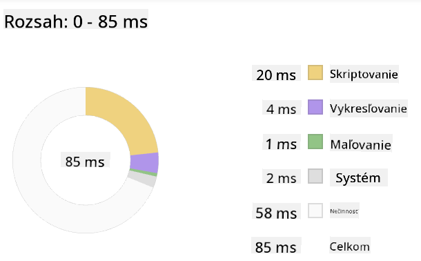
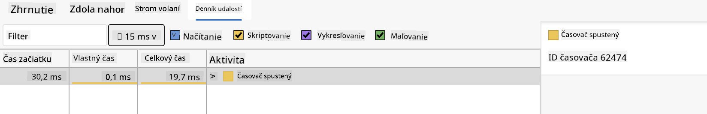

<!--
CO_OP_TRANSLATOR_METADATA:
{
  "original_hash": "b91cbf14240ee59411b96448b994ace1",
  "translation_date": "2025-10-03T12:32:42+00:00",
  "source_file": "5-browser-extension/3-background-tasks-and-performance/README.md",
  "language_code": "sk"
}
-->
# Projekt rozšírenia prehliadača, časť 3: Naučte sa o úlohách na pozadí a výkone

## Kvíz pred prednáškou

[Kvíz pred prednáškou](https://ff-quizzes.netlify.app/web/quiz/27)

### Úvod

V posledných dvoch lekciách tohto modulu ste sa naučili, ako vytvoriť formulár a zobrazovaciu oblasť pre údaje získané z API. Je to veľmi štandardný spôsob vytvárania webovej prezentácie na internete. Dokonca ste sa naučili, ako spracovávať asynchrónne získavanie údajov. Vaše rozšírenie prehliadača je takmer hotové.

Zostáva spravovať niektoré úlohy na pozadí, vrátane aktualizácie farby ikony rozšírenia, takže je to skvelý čas na diskusiu o tom, ako prehliadač spravuje tento druh úloh. Poďme sa zamyslieť nad týmito úlohami prehliadača v kontexte výkonu vašich webových aktív počas ich vytvárania.

## Základy webového výkonu

> "Výkon webovej stránky je o dvoch veciach: ako rýchlo sa stránka načíta a ako rýchlo na nej beží kód." -- [Zack Grossbart](https://www.smashingmagazine.com/2012/06/javascript-profiling-chrome-developer-tools/)

Téma, ako urobiť vaše webové stránky neuveriteľne rýchle na všetkých druhoch zariadení, pre všetkých druhov používateľov, v rôznych situáciách, je neprekvapivo rozsiahla. Tu je niekoľko bodov, ktoré by ste mali mať na pamäti pri vytváraní štandardného webového projektu alebo rozšírenia prehliadača.

Prvá vec, ktorú musíte urobiť, aby ste zabezpečili efektívny chod vašej stránky, je zhromaždiť údaje o jej výkone. Prvým miestom na to sú vývojárske nástroje vášho webového prehliadača. V Edge môžete vybrať tlačidlo "Nastavenia a ďalšie" (ikona troch bodiek v pravom hornom rohu prehliadača), potom prejsť na Viac nástrojov > Vývojárske nástroje a otvoriť kartu Výkon. Môžete tiež použiť klávesové skratky `Ctrl` + `Shift` + `I` na Windows alebo `Option` + `Command` + `I` na Macu na otvorenie vývojárskych nástrojov.

Karta Výkon obsahuje nástroj na profilovanie. Otvorte webovú stránku (vyskúšajte napríklad [https://www.microsoft.com](https://www.microsoft.com/?WT.mc_id=academic-77807-sagibbon)) a kliknite na tlačidlo 'Record', potom obnovte stránku. Nahrávanie môžete kedykoľvek zastaviť a budete môcť vidieť rutiny, ktoré sa generujú na 'skriptovanie', 'renderovanie' a 'maľovanie' stránky:


✅ Navštívte [Microsoft Dokumentáciu](https://docs.microsoft.com/microsoft-edge/devtools-guide/performance/?WT.mc_id=academic-77807-sagibbon) o paneli Výkon v Edge

> Tip: aby ste získali presné údaje o čase spustenia vašej stránky, vymažte cache prehliadača.

Vyberte prvky časovej osi profilu, aby ste priblížili udalosti, ktoré sa dejú počas načítania vašej stránky.

Získajte snímku výkonu vašej stránky výberom časti časovej osi profilu a pozrite si panel so zhrnutím:



Skontrolujte panel Event Log, aby ste zistili, či nejaká udalosť trvala dlhšie ako 15 ms:



✅ Spoznajte svoj profiler! Otvorte vývojárske nástroje na tejto stránke a zistite, či existujú nejaké úzke miesta. Ktorý aktív sa načítava najpomalšie? Najrýchlejšie?

## Kontroly profilovania

Vo všeobecnosti existujú niektoré "problémové oblasti", na ktoré by si mal každý webový vývojár dávať pozor pri vytváraní stránky, aby sa vyhol nepríjemným prekvapeniam pri nasadení do produkcie.

**Veľkosti aktív**: Web sa za posledné roky stal "ťažším" a tým aj pomalším. Časť tejto váhy súvisí s používaním obrázkov.

✅ Prezrite si [Internetový archív](https://httparchive.org/reports/page-weight) pre historický pohľad na váhu stránok a ďalšie informácie.

Dobrou praxou je zabezpečiť, aby vaše obrázky boli optimalizované a dodávané v správnej veľkosti a rozlíšení pre vašich používateľov.

**Prechádzanie DOM**: Prehliadač musí vytvoriť svoj Document Object Model na základe kódu, ktorý napíšete, takže je v záujme dobrého výkonu stránky udržiavať značky minimálne, používať a štýlovať len to, čo stránka potrebuje. Na tento bod by sa mohol optimalizovať nadbytočný CSS spojený so stránkou; štýly, ktoré sa majú používať iba na jednej stránke, nemusia byť zahrnuté v hlavnom štýle.

**JavaScript**: Každý vývojár JavaScriptu by si mal dávať pozor na skripty blokujúce renderovanie, ktoré sa musia načítať pred tým, ako sa zvyšok DOM môže prechádzať a maľovať do prehliadača. Zvážte použitie `defer` s vašimi inline skriptami (ako je to urobené v module Terrarium).

✅ Vyskúšajte niektoré stránky na [webovej stránke na testovanie rýchlosti stránok](https://www.webpagetest.org/), aby ste sa dozvedeli viac o bežných kontrolách, ktoré sa vykonávajú na určenie výkonu stránky.

Teraz, keď máte predstavu o tom, ako prehliadač renderuje aktíva, ktoré mu posielate, pozrime sa na posledné veci, ktoré musíte urobiť na dokončenie vášho rozšírenia:

### Vytvorte funkciu na výpočet farby

Pracujte v `/src/index.js`, pridajte funkciu nazvanú `calculateColor()` po sérii premenných `const`, ktoré ste nastavili na získanie prístupu k DOM:

```JavaScript
function calculateColor(value) {
	let co2Scale = [0, 150, 600, 750, 800];
	let colors = ['#2AA364', '#F5EB4D', '#9E4229', '#381D02', '#381D02'];

	let closestNum = co2Scale.sort((a, b) => {
		return Math.abs(a - value) - Math.abs(b - value);
	})[0];
	console.log(value + ' is closest to ' + closestNum);
	let num = (element) => element > closestNum;
	let scaleIndex = co2Scale.findIndex(num);

	let closestColor = colors[scaleIndex];
	console.log(scaleIndex, closestColor);

	chrome.runtime.sendMessage({ action: 'updateIcon', value: { color: closestColor } });
}
```

Čo sa tu deje? Odovzdáte hodnotu (intenzitu uhlíka) z API volania, ktoré ste dokončili v poslednej lekcii, a potom vypočítate, ako blízko je jej hodnota k indexu prezentovanému v poli farieb. Potom pošlete túto najbližšiu hodnotu farby cez runtime chrome.

Chrome.runtime má [API](https://developer.chrome.com/extensions/runtime), ktoré spracováva všetky druhy úloh na pozadí, a vaše rozšírenie to využíva:

> "Použite API chrome.runtime na získanie stránky na pozadí, vrátenie podrobností o manifeste a počúvanie a reagovanie na udalosti v životnom cykle aplikácie alebo rozšírenia. Toto API môžete tiež použiť na konverziu relatívnej cesty URL na úplne kvalifikované URL."

✅ Ak vyvíjate toto rozšírenie pre Edge, môže vás prekvapiť, že používate API chrome. Novšie verzie prehliadača Edge bežia na prehliadačovom engine Chromium, takže môžete využívať tieto nástroje.

> Poznámka: Ak chcete profilovať rozšírenie prehliadača, spustite vývojárske nástroje priamo z rozšírenia, pretože je to samostatná inštancia prehliadača.

### Nastavte predvolenú farbu ikony

Teraz v funkcii `init()` nastavte ikonu na generickú zelenú farbu na začiatok tým, že opäť zavoláte akciu `updateIcon` v chrome:

```JavaScript
chrome.runtime.sendMessage({
	action: 'updateIcon',
		value: {
			color: 'green',
		},
});
```
### Zavolajte funkciu, vykonajte volanie

Ďalej zavolajte funkciu, ktorú ste práve vytvorili, pridaním do sľubu vráteného API C02Signal:

```JavaScript
//let CO2...
calculateColor(CO2);
```

A nakoniec, v `/dist/background.js`, pridajte poslucháča pre tieto volania akcií na pozadí:

```JavaScript
chrome.runtime.onMessage.addListener(function (msg, sender, sendResponse) {
	if (msg.action === 'updateIcon') {
		chrome.action.setIcon({ imageData: drawIcon(msg.value) });
	}
});
//borrowed from energy lollipop extension, nice feature!
function drawIcon(value) {
	let canvas = new OffscreenCanvas(200, 200);
	let context = canvas.getContext('2d');

	context.beginPath();
	context.fillStyle = value.color;
	context.arc(100, 100, 50, 0, 2 * Math.PI);
	context.fill();

	return context.getImageData(50, 50, 100, 100);
}
```
V tomto kóde pridávate poslucháča pre akékoľvek správy prichádzajúce do správcu úloh na pozadí. Ak sa volá 'updateIcon', potom sa spustí nasledujúci kód na nakreslenie ikony správnej farby pomocou Canvas API.

✅ O Canvas API sa dozviete viac v [lekciách o vesmírnej hre](../../6-space-game/2-drawing-to-canvas/README.md).

Teraz znovu zostavte svoje rozšírenie (`npm run build`), obnovte a spustite svoje rozšírenie a sledujte zmenu farby. Je vhodný čas ísť na nákup alebo umyť riad? Teraz to viete!

Gratulujeme, vytvorili ste užitočné rozšírenie prehliadača a dozvedeli ste sa viac o tom, ako prehliadač funguje a ako profilovať jeho výkon.

---

## 🚀 Výzva

Preskúmajte niektoré open source webové stránky, ktoré existujú už dlho, a na základe ich histórie na GitHube zistite, či boli optimalizované pre výkon v priebehu rokov, ak vôbec. Aký je najbežnejší problém?

## Kvíz po prednáške

[Kvíz po prednáške](https://ff-quizzes.netlify.app/web/quiz/28)

## Prehľad a samostatné štúdium

Zvážte prihlásenie sa na [newsletter o výkone](https://perf.email/)

Preskúmajte niektoré spôsoby, akými prehliadače hodnotia webový výkon, prehliadaním kariet výkonu vo svojich webových nástrojoch. Nájdete nejaké zásadné rozdiely?

## Zadanie

[Analyzujte stránku z hľadiska výkonu](assignment.md)

---

**Upozornenie**:  
Tento dokument bol preložený pomocou služby AI prekladu [Co-op Translator](https://github.com/Azure/co-op-translator). Hoci sa snažíme o presnosť, upozorňujeme, že automatizované preklady môžu obsahovať chyby alebo nepresnosti. Pôvodný dokument v jeho rodnom jazyku by mal byť považovaný za autoritatívny zdroj. Pre kritické informácie sa odporúča profesionálny ľudský preklad. Nenesieme zodpovednosť za akékoľvek nedorozumenia alebo nesprávne interpretácie vyplývajúce z použitia tohto prekladu.