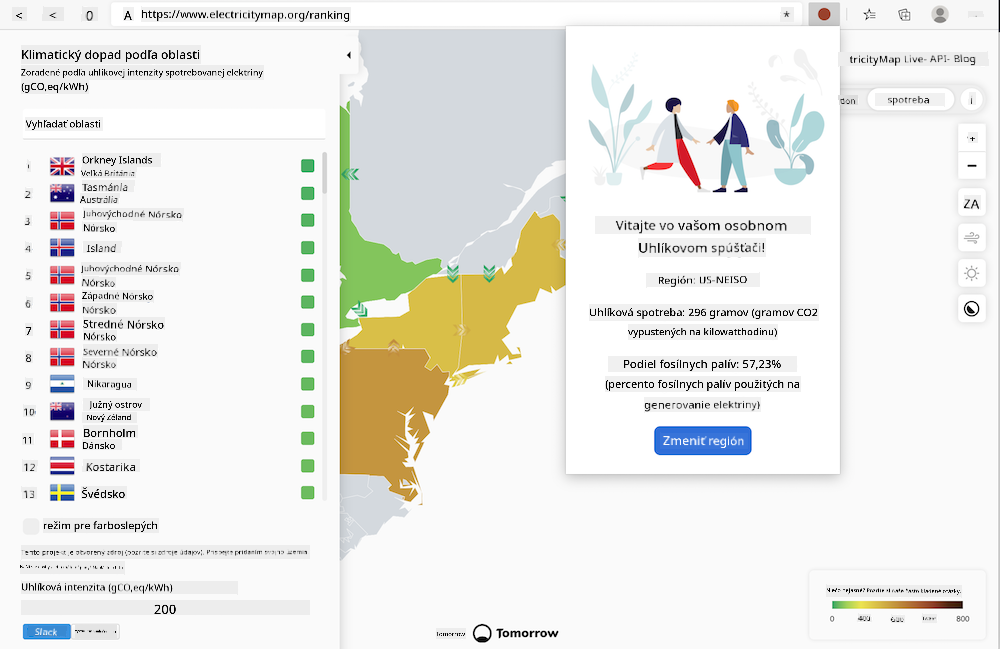
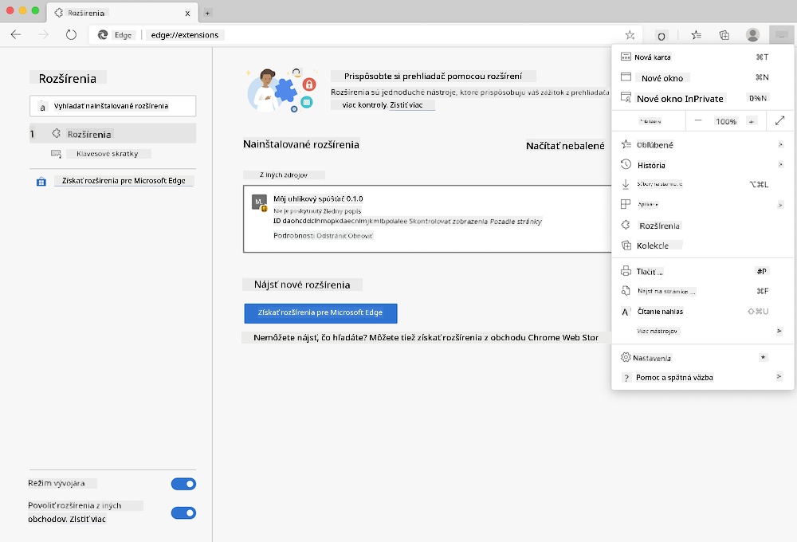

<!--
CO_OP_TRANSLATOR_METADATA:
{
  "original_hash": "dd58ae1b7707034f055718c1b68bc8de",
  "translation_date": "2025-08-27T22:18:33+00:00",
  "source_file": "5-browser-extension/solution/translation/README.hi.md",
  "language_code": "sk"
}
-->
# Karbónový spúšťač: Hotový kód pre rozšírenie prehliadača

Použitie API CO2 Signal od tmrow na sledovanie spotreby elektriny, vytvorenie rozšírenia prehliadača, ktoré vám pripomenie, aká náročná je spotreba elektriny vo vašej oblasti. Používanie tohto rozšírenia vám pomôže robiť rozhodnutia o vašich aktivitách na základe týchto informácií.



## Začíname

Musíte mať nainštalovaný [npm](https://npmjs.com). Stiahnite si kópiu tohto projektu do priečinka na vašom počítači.

Nainštalujte všetky potrebné balíčky:

```
npm install
```

Vytvorte rozšírenie pomocou Webpacku:

```
npm run build
```

Na inštaláciu v Edge použite menu „tri bodky“ v pravom hornom rohu prehliadača na vyhľadanie panelu rozšírení. Odtiaľ vyberte „Načítať nebalené“ na načítanie nového rozšírenia. V zobrazenom okne otvorte priečinok „dist“ a rozšírenie sa načíta. Na jeho používanie budete potrebovať API kľúč CO2 Signal ([získajte ho e-mailom tu](https://www.co2signal.com/) – zadajte svoj e-mail do políčka na tejto stránke) a [kód pre vašu oblasť](http://api.electricitymap.org/v3/zones) z [Electricity Map](https://www.electricitymap.org/map) (napríklad v Bostone používam „US-NEISO“).



Keď zadáte API kľúč a kód oblasti do rozhrania rozšírenia, farebný bod v paneli rozšírenia prehliadača by sa mal zmeniť tak, aby odrážal spotrebu energie vo vašej oblasti. Poskytne vám indikátor, ktoré energeticky náročné aktivity sú vhodné pre váš výkon. Koncept tejto „bodovej“ systému mi bol inšpirovaný rozšírením [Energy Lollipop](https://energylollipop.com/) pre emisie v Kalifornii.

---

**Upozornenie**:  
Tento dokument bol preložený pomocou služby AI prekladu [Co-op Translator](https://github.com/Azure/co-op-translator). Hoci sa snažíme o presnosť, prosím, berte na vedomie, že automatizované preklady môžu obsahovať chyby alebo nepresnosti. Pôvodný dokument v jeho rodnom jazyku by mal byť považovaný za autoritatívny zdroj. Pre kritické informácie sa odporúča profesionálny ľudský preklad. Nie sme zodpovední za akékoľvek nedorozumenia alebo nesprávne interpretácie vyplývajúce z použitia tohto prekladu.