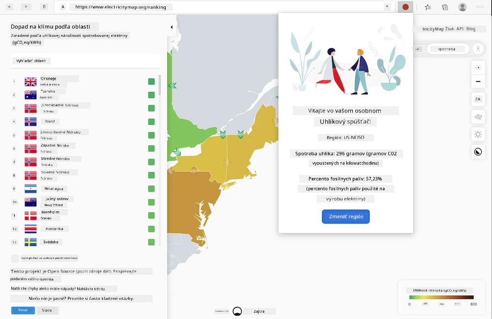
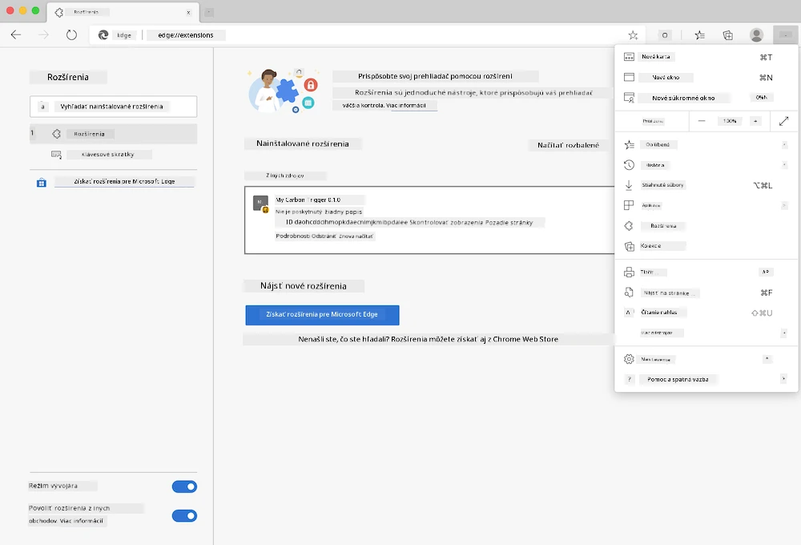

<!--
CO_OP_TRANSLATOR_METADATA:
{
  "original_hash": "26fd39046d264ba185dcb086d3a8cf3e",
  "translation_date": "2025-08-27T22:17:32+00:00",
  "source_file": "5-browser-extension/start/README.md",
  "language_code": "sk"
}
-->
# Rozšírenie prehliadača Carbon Trigger: Štartovací kód

Použitím API C02 Signal od tmrow na sledovanie spotreby elektriny vytvorte rozšírenie prehliadača, aby ste mali pripomienku priamo vo svojom prehliadači o tom, aká náročná je spotreba elektriny vo vašom regióne. Používanie tohto rozšírenia ad hoc vám pomôže robiť rozhodnutia o vašich aktivitách na základe týchto informácií.



## Začíname

Budete potrebovať nainštalovaný [npm](https://npmjs.com). Stiahnite si kópiu tohto kódu do priečinka na vašom počítači.

Nainštalujte všetky potrebné balíčky:

```
npm install
```

Vytvorte rozšírenie pomocou webpacku:

```
npm run build
```

Na inštaláciu v Edge použite menu „tri bodky“ v pravom hornom rohu prehliadača na nájdenie panelu Rozšírenia. Odtiaľ vyberte „Načítať nebalené“ na načítanie nového rozšírenia. Pri výzve otvorte priečinok „dist“ a rozšírenie sa načíta. Na jeho používanie budete potrebovať API kľúč pre API CO2 Signal ([získajte ho tu cez e-mail](https://www.co2signal.com/) - zadajte svoj e-mail do políčka na tejto stránke) a [kód pre váš región](http://api.electricitymap.org/v3/zones) zodpovedajúci [Electricity Map](https://www.electricitymap.org/map) (napríklad v Bostone používam 'US-NEISO').



Keď zadáte API kľúč a región do rozhrania rozšírenia, farebná bodka v paneli rozšírenia prehliadača by sa mala zmeniť tak, aby odrážala spotrebu energie vo vašom regióne a poskytla vám návod, aké energeticky náročné aktivity by boli vhodné vykonať. Koncept za týmto systémom „bodky“ mi bol inšpirovaný rozšírením [Energy Lollipop](https://energylollipop.com/) pre emisie v Kalifornii.

---

**Upozornenie**:  
Tento dokument bol preložený pomocou služby na automatický preklad [Co-op Translator](https://github.com/Azure/co-op-translator). Hoci sa snažíme o presnosť, upozorňujeme, že automatické preklady môžu obsahovať chyby alebo nepresnosti. Pôvodný dokument v jeho pôvodnom jazyku by mal byť považovaný za autoritatívny zdroj. Pre kritické informácie sa odporúča profesionálny ľudský preklad. Nezodpovedáme za žiadne nedorozumenia alebo nesprávne interpretácie vyplývajúce z použitia tohto prekladu.