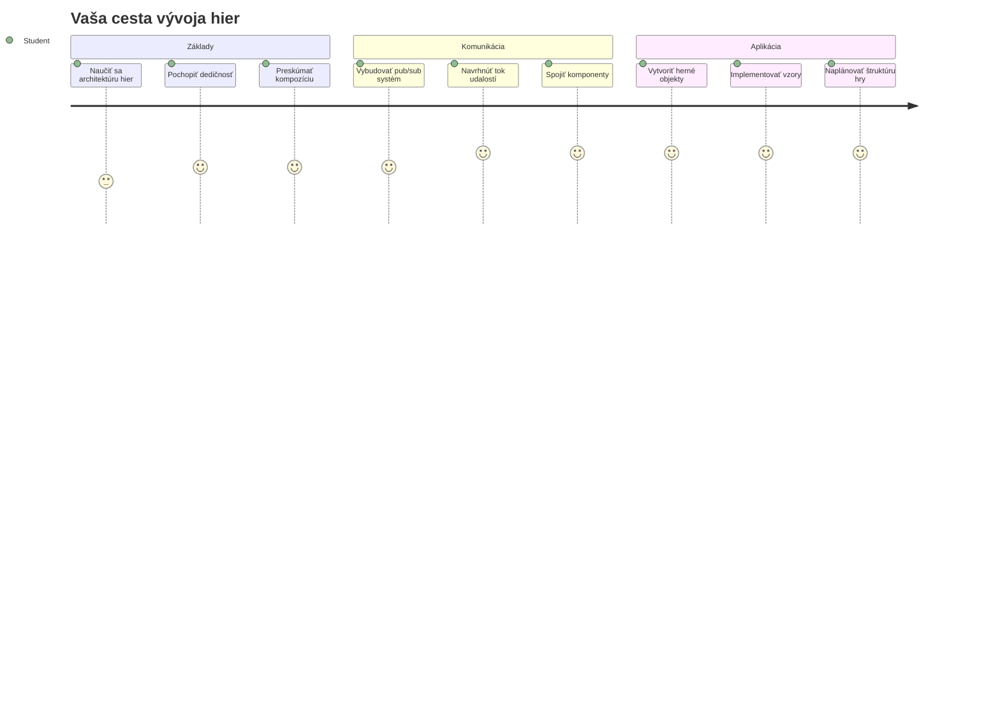
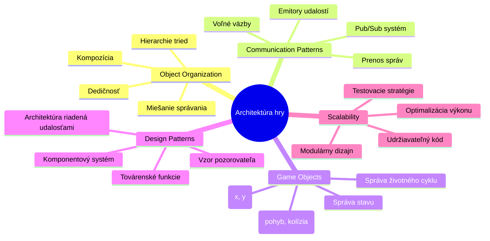
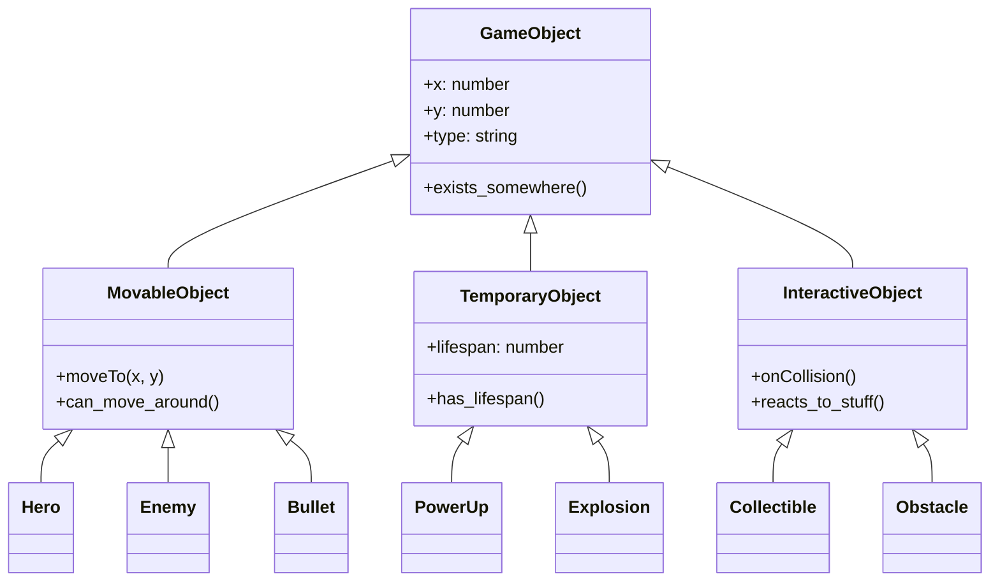
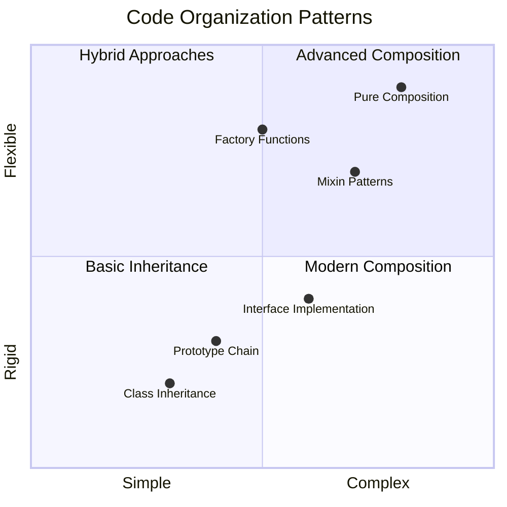
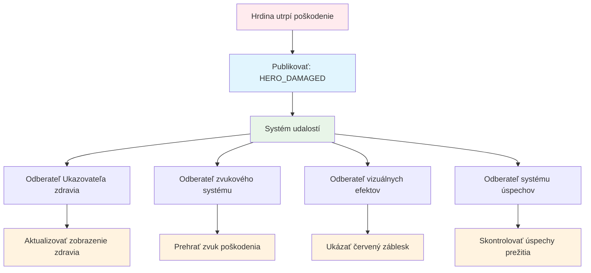
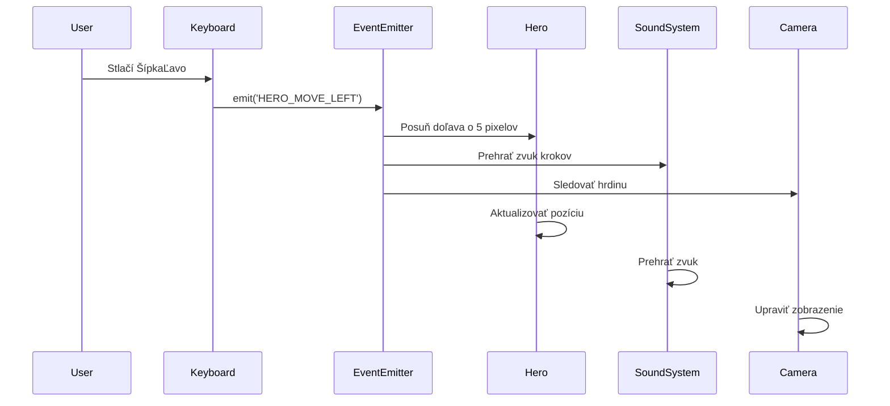
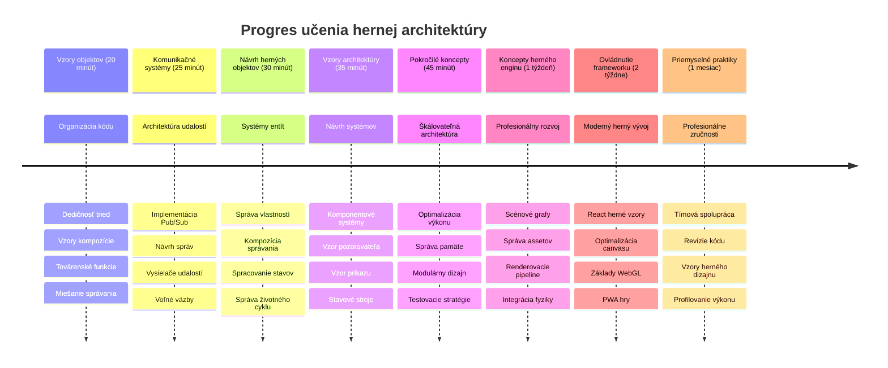

# Vytvorenie vesmírnej hry Časť 1: Úvod




Rovnako ako riadiace stredisko NASA koordinuje počas štartu vesmírnej rakety viaceré systémy, aj my vytvoríme vesmírnu hru, ktorá demonštruje, ako môžu rôzne časti programu spolu plynulo spolupracovať. Pri tvorbe niečoho, čo si môžete naozaj zahrať, sa naučíte základné programovacie koncepty, ktoré sa uplatnia v každom softvérovom projekte.

Preskúmame dva základné prístupy k organizácii kódu: dedičnosť a kompozíciu. Nejde len o akademické pojmy – sú to tie isté vzory, ktoré poháňajú všetko od videohier po bankové systémy. Zrealizujeme aj komunikačný systém nazývaný pub/sub, ktorý funguje ako komunikačné siete používané vo vesmírnych lodiach a umožňuje rôznym komponentom zdieľať informácie bez vytvárania závislostí.

Na konci tejto série budete rozumieť, ako vytvárať aplikácie, ktoré môžu škálovať a vyvíjať sa – či už vyvíjate hry, webové aplikácie alebo akýkoľvek iný softvérový systém.


## Prednáškový kvíz

[Prednáškový kvíz](https://ff-quizzes.netlify.app/web/quiz/29)

## Dedičnosť a kompozícia vo vývoji hier

Ako sa projekty zložitosťou rozrastajú, organizácia kódu sa stáva kľúčovou. To, čo začína ako jednoduchý skript, môže byť bez správnej štruktúry ťažko udržiavateľné – podobne ako misie Apollo vyžadovali starostlivú koordináciu tisícok komponentov.

Preskúmame dva základné prístupy k organizácii kódu: dedičnosť a kompozíciu. Každý má svoje výhody a pochopenie oboch vám pomôže vybrať správny prístup pre rôzne situácie. Tieto koncepty ukážeme na našej vesmírnej hre, kde hrdinovia, nepriatelia, power-upy a ďalšie objekty musia efektívne spolupracovať.

✅ Jedna z najslávnejších kníh o programovaní sa týka [návrhových vzorov](https://en.wikipedia.org/wiki/Design_Patterns).

V každej hre máte `herných objektov` – interaktívne prvky, ktoré plnia váš herný svet. Hrdinovia, nepriatelia, power-upy a vizuálne efekty sú všetky herné objekty. Každý existuje na konkrétnych súradniciach obrazovky pomocou hodnôt `x` a `y`, podobne ako pri zakresľovaní bodov v súradnicovej sústave.

Napriek svojim vizuálnym rozdielom zdieľajú tieto objekty často základné správanie:

- **Existujú niekde** – Každý objekt má súradnice x a y, aby hra vedela, kde ho vykresliť
- **Mnohé sa môžu pohybovať** – Hrdinovia bežia, nepriatelia naháňajú, guľky lietajú cez obrazovku
- **Majú životnosť** – Niektoré zostávajú navždy, iné (napr. explózie) sa ukážu krátko a zmiznú
- **Reagujú na udalosti** – Keď sa veci zrazia, power-upy sa zbierajú, aktualizujú sa ukazovatele zdravia

✅ Premýšľajte o hre ako Pac-Man. Dokážete identifikovať štyri vyššie uvedené typy objektov v tejto hre?


### Vyjadrenie správania cez kód

Teraz keď rozumiete spoločným správaním, ktoré herné objekty zdieľajú, preskúmajme, ako tieto správania implementovať v JavaScripte. Správanie objektu môžete vyjadriť pomocou metód pripojených buď ku triedam alebo k jednotlivým objektom, a existuje niekoľko prístupov, z ktorých si môžete vybrať.

**Prístup založený na triedach**

Triedy a dedičnosť poskytujú štruktúrovaný prístup k organizácii herných objektov. Podobne ako taxonomický klasifikačný systém vyvinutý Carlom Linnéom, začínate s základnou triedou obsahujúcou spoločné vlastnosti, potom vytvoríte špecializované triedy, ktoré tieto základy dedi a pridávajú špecifické schopnosti.

✅ Dedičnosť je dôležitý koncept, ktorý treba pochopiť. Viac sa dozviete v [článku MDN o dedičnosti](https://developer.mozilla.org/docs/Web/JavaScript/Inheritance_and_the_prototype_chain).

Tu je, ako môžete implementovať herné objekty pomocou tried a dedičnosti:

```javascript
// Krok 1: Vytvorte základnú triedu GameObject
class GameObject {
  constructor(x, y, type) {
    this.x = x;
    this.y = y;
    this.type = type;
  }
}
```

**Rozoberme si to krok za krokom:**
- Vytvárame základnú šablónu, ktorú môže každý herný objekt používať
- Konstruktor ukladá, kde sa objekt nachádza (`x`, `y`) a aký typ má
- Toto sa stáva základom, na ktorom budú vaše herné objekty stavať

```javascript
// Krok 2: Pridajte schopnosť pohybu cez dedenie
class Movable extends GameObject {
  constructor(x, y, type) {
    super(x, y, type); // Zavolajte konštruktor rodiča
  }

  // Pridajte schopnosť presunúť sa na novú pozíciu
  moveTo(x, y) {
    this.x = x;
    this.y = y;
  }
}
```

**V predchádzajúcom kóde sme:**
- **Rozšírili** triedu GameObject, aby sme pridali funkcionalitu pohybu
- **Zavolali** konštruktor rodiča pomocou `super()`, aby sme inicializovali zdedené vlastnosti
- **Pridali** metódu `moveTo()`, ktorá aktualizuje polohu objektu

```javascript
// Krok 3: Vytvorte konkrétne typy herných objektov
class Hero extends Movable {
  constructor(x, y) {
    super(x, y, 'Hero'); // Typ nastavte automaticky
  }
}

class Tree extends GameObject {
  constructor(x, y) {
    super(x, y, 'Tree'); // Stromy nepotrebujú pohyb
  }
}

// Krok 4: Použite svoje herné objekty
const hero = new Hero(0, 0);
hero.moveTo(5, 5); // Hrdina sa môže pohybovať!

const tree = new Tree(10, 15);
// tree.moveTo() by spôsobilo chybu - stromy sa nemôžu pohybovať
```

**Pochopenie týchto konceptov:**
- **Vytvára** špecializované typy objektov, ktoré zdedia vhodné správanie
- **Ukazuje**, ako dedičnosť umožňuje selektívne zahrnutie vlastností
- **Demonštruje**, že hrdinovia sa môžu pohybovať, zatiaľ čo stromy zostávajú státím
- **Ilustruje**, ako hierarchia tried zabraňuje nevhodným akciám

✅ Strávte pár minút tým, že si predstavíte Pac-Man hrdinu (napríklad Inky, Pinky alebo Blinky) a ako by bol zapísaný v JavaScripte.

**Prístup založený na kompozícii**

Kompozícia nasleduje filozofiu modulárneho dizajnu, podobne ako inžinieri navrhujú vesmírne lode s vymeniteľnými komponentmi. Namiesto dedenia z rodičovskej triedy kombinujete konkrétne správanie, aby ste vytvorili objekty s presne takou funkcionalitou, akú potrebujú. Tento prístup ponúka flexibilitu bez prísnych hierarchických obmedzení.

```javascript
// Krok 1: Vytvorte základné objekty správania
const gameObject = {
  x: 0,
  y: 0,
  type: ''
};

const movable = {
  moveTo(x, y) {
    this.x = x;
    this.y = y;
  }
};
```

**Čo tento kód robí:**
- **Definuje** základný `gameObject` s polohou a typovými vlastnosťami
- **Vytvára** samostatný objekt správania `movable` s funkciou pohybu
- **Oddeluje** obavy tým, že drží dáta o polohe a logiku pohybu nezávisle

```javascript
// Krok 2: Zloženie objektov kombinovaním správania
const movableObject = { ...gameObject, ...movable };

// Krok 3: Vytvorte továrenské funkcie pre rôzne typy objektov
function createHero(x, y) {
  return {
    ...movableObject,
    x,
    y,
    type: 'Hero'
  };
}

function createStatic(x, y, type) {
  return {
    ...gameObject,
    x,
    y,
    type
  };
}
```

**V predchádzajúcom kóde sme:**
- **Skombinovali** základné vlastnosti objektu so správaním pohybu pomocou syntaxe spread
- **Vytvorili** továrenské funkcie, ktoré vracajú prispôsobené objekty
- **Umožnili** flexibilnú tvorbu objektov bez prísnych triednych hierarchií
- **Povolili** objektom mať presne tie správania, ktoré potrebujú

```javascript
// Krok 4: Vytvorte a použite svoje zložené objekty
const hero = createHero(10, 10);
hero.moveTo(5, 5); // Funguje perfektne!

const tree = createStatic(0, 0, 'Tree');
// tree.moveTo() nie je definované - žiadne pohybové správanie nebolo zložené
```

**Dôležité body na zapamätanie:**
- **Kombinuje** objekty miešaním správaní namiesto ich dedenia
- **Poskytuje** viac flexibility než prísne dedičné hierarchie
- **Umožňuje** objektom mať presne tie funkcie, ktoré potrebujú
- **Používa** modernú JavaScript spread syntax pre čisté kombinovanie objektov
```

**Which Pattern Should You Choose?**

**Which Pattern Should You Choose?**



> 💡 **Tip na záver**: Oba vzory majú miesto v modernom vývoji v JavaScripte. Triedy dobre fungujú pre jasne definované hierarchie, zatiaľ čo kompozícia je výhodná, keď potrebujete maximálnu flexibilitu.
> 
**Kedy použiť ktorý prístup:**
- **Vyberte** dedičnosť, keď máte jasné vzťahy "je to" (napr. Hrdina *je* pohyblivý objekt)
- **Volte** kompozíciu, keď máte vzťahy "má to" (napr. Hrdina *má* pohybové schopnosti)
- **Zvážte** preferencie tímu a požiadavky projektu
- **Pamätajte**, že môžete miešať oba prístupy v jednej aplikácii

### 🔄 **Pedagogická kontrola**
**Porozumenie organizácie objektov**: Pred prechodom k komunikačným vzorom si overte, či dokážete:
- ✅ Vysvetliť rozdiel medzi dedičnosťou a kompozíciou
- ✅ Identifikovať, kedy použiť triedy vs továrenské funkcie
- ✅ Rozumieť, ako funguje kľúčové slovo `super()` v dedičnosti
- ✅ Poznať výhody každého prístupu pre vývoj hier

**Rýchly sebakvíz**: Ako by ste vytvorili Lietajúceho nepriateľa, ktorý sa dokáže aj pohybovať aj lietať?
- **Prístup dedičnosti**: `class FlyingEnemy extends Movable`
- **Prístup kompozície**: `{ ...movable, ...flyable, ...gameObject }`

**Spojenie s realitou**: Tieto vzory sa objavujú všade:
- **React komponenty**: Props (kompozícia) vs dedičnosť tried
- **Herne enginy**: Entity-component systémy používajú kompozíciu
- **Mobilné aplikácie**: UI frameworky často používajú hierarchie dedičnosti

## Komunikačné vzory: Systém Pub/Sub

Ako aplikácie rastú na zložitosť, riadenie komunikácie medzi komponentami je výzvou. Vzor publish-subscribe (pub/sub) rieši tento problém pomocou princípov podobných rozhlasovému vysielaniu – jeden vysielač môže osloviť viacerých príjemcov bez toho, aby vedel, kto všetko počúva.

Predstavte si, čo sa stane, keď hrdina utrpí poškodenie: aktualizuje sa ukazovateľ zdravia, prehrá sa zvukový efekt, zobrazí sa vizuálna odozva. Namiesto priameho prepojenia objektu hrdinu s týmito systémami umožňuje pub/sub hrdinovi vyslať správu "utrpené poškodenie". Každý systém, ktorý na to musí reagovať, sa môže na tento typ správy prihlásiť a reagovať podľa toho.

✅ **Pub/Sub** znamená „publish-subscribe“ (vydávanie–odber)


### Porozumenie architektúre Pub/Sub

Vzor pub/sub udržuje rôzne časti vašej aplikácie voľne spojené, čo znamená, že môžu spolupracovať bez priamej závislosti. Toto oddelenie robí váš kód udržiavateľnejším, testovateľnejším a flexibilnejším voči zmenám.

**Kľúčové prvky v pub/sub:**
- **Správy** – Jednoduché textové štítky ako `'PLAYER_SCORED'`, ktoré popisujú, čo sa stalo (plus prípadné ďalšie informácie)
- **Vydávatelia** – Objekty, ktoré hlásia „Niečo sa stalo!“ všetkým, ktorí počúvajú
- **Odborníci** – Objekty, ktoré hovoria „Zaujíma ma táto udalosť“ a reagujú, keď k nej dôjde
- **Systém udalostí** – Prostredník, ktorý zabezpečuje, že správy dorazia k správnym poslucháčom

### Vytvorenie systému udalostí

Vytvorme jednoduchý, ale výkonný systém udalostí, ktorý tieto koncepty demonštruje:

```javascript
// Krok 1: Vytvorte triedu EventEmitter
class EventEmitter {
  constructor() {
    this.listeners = {}; // Uložte všetkých poslucháčov udalostí
  }
  
  // Zaregistrujte poslucháča pre konkrétny typ správy
  on(message, listener) {
    if (!this.listeners[message]) {
      this.listeners[message] = [];
    }
    this.listeners[message].push(listener);
  }
  
  // Odoslať správu všetkým zaregistrovaným poslucháčom
  emit(message, payload = null) {
    if (this.listeners[message]) {
      this.listeners[message].forEach(listener => {
        listener(message, payload);
      });
    }
  }
}
```

**Analyzujeme, čo sa tu deje:**
- **Vytvára** centrálny systém správy udalostí pomocou jednoduchej triedy
- **Ukladá** poslucháčov v objekte organizovanom podľa typu správy
- **Registruje** nových poslucháčov pomocou metódy `on()`
- **Vysiela** správy všetkým záujemcom pomocou `emit()`
- **Podporuje** voliteľné dátové náklady na odovzdanie relevantných informácií

### Spojenie do jedného celku: Praktický príklad

Poďme si to ukázať v praxi! Vytvoríme jednoduchý systém pohybu, ktorý ukáže, ako čistý a flexibilný môže byť pub/sub:

```javascript
// Krok 1: Definujte svoje typy správ
const Messages = {
  HERO_MOVE_LEFT: 'HERO_MOVE_LEFT',
  HERO_MOVE_RIGHT: 'HERO_MOVE_RIGHT',
  ENEMY_SPOTTED: 'ENEMY_SPOTTED'
};

// Krok 2: Vytvorte svoj systém udalostí a herné objekty
const eventEmitter = new EventEmitter();
const hero = createHero(0, 0);
```

**Tento kód robí:**
- **Definuje** objekt konštánt, aby sa zabránilo preklepom v názvoch správ
- **Vytvára** inštanciu event emitera na spracovanie komunikácie
- **Inicializuje** objekt hrdinu na počiatočnej pozícii

```javascript
// Krok 3: Nastavte poslucháčov udalostí (odberateľov)
eventEmitter.on(Messages.HERO_MOVE_LEFT, () => {
  hero.moveTo(hero.x - 5, hero.y);
  console.log(`Hero moved to position: ${hero.x}, ${hero.y}`);
});

eventEmitter.on(Messages.HERO_MOVE_RIGHT, () => {
  hero.moveTo(hero.x + 5, hero.y);
  console.log(`Hero moved to position: ${hero.x}, ${hero.y}`);
});
```

**V predchádzajúcom kóde sme:**
- **Registrovali** poslucháčov udalostí, ktorí reagujú na správy o pohybe
- **Aktualizovali** polohu hrdinu podľa smeru pohybu
- **Pridali** logovanie do konzoly pre sledovanie zmien pozície hrdinu
- **Oddelili** logiku pohybu od spracovania vstupu

```javascript
// Krok 4: Prepojte vstup z klávesnice s udalosťami (vydavateľmi)
window.addEventListener('keydown', (event) => {
  switch(event.key) {
    case 'ArrowLeft':
      eventEmitter.emit(Messages.HERO_MOVE_LEFT);
      break;
    case 'ArrowRight':
      eventEmitter.emit(Messages.HERO_MOVE_RIGHT);
      break;
  }
});
```

**Pochopenie týchto konceptov:**
- **Spája** vstup z klávesnice s hernými udalosťami bez pevnej väzby
- **Umožňuje** systému vstupu komunikovať nepriamo s hernými objektmi
- **Povoľuje** viacerým systémom reagovať na tie isté klávesové vstupy
- **Uľahčuje** zmenu klávesových väzieb alebo pridanie nových metód vstupu


> 💡 **Tip na záver**: Krása tohto vzoru je jeho flexibilita! Jednoducho môžete pridať zvukové efekty, otrasy obrazovky alebo časticové efekty pridaním ďalších poslucháčov udalostí – nie je potrebné meniť existujúci kód klávesnice alebo pohybu.
> 
**Dôvody, prečo si tento prístup obľúbite:**
- Pridávanie nových funkcií je veľmi jednoduché – stačí počúvať udalosti, ktoré vás zaujímajú
- Viaceré časti môžu reagovať na tú istú udalosť bez konfliktov
- Testovanie je oveľa jednoduchšie, pretože každá časť funguje samostatne
- Keď niečo prestane fungovať, presne viete, kde hľadať problém

### Prečo Pub/Sub efektívne škáluje

Vzor pub/sub si udržiava jednoduchosť aj pri rastúcej zložitosti aplikácií. Či už spravujete desiatky nepriateľov, dynamické aktualizácie používateľského rozhrania alebo zvukové systémy, vzor zvláda zvýšenie rozsahu bez architektonických zmien. Nové funkcie sa integrujú do existujúceho systému udalostí bez narušenia zavedených funkcií.

> ⚠️ **Bežná chyba**: Nevytvárajte príliš veľa špecifických typov správ príliš skoro. Začnite so širokými kategóriami a spresňujte ich podľa potreby vašej hry.
> 
**Odporúčané postupy:**
- **Zoskupujte** súvisiace správy do logických kategórií
- **Používajte** popisné názvy, ktoré jasne indikujú, čo sa stalo
- **Udržujte** správy jednoduché a zamerané
- **Dokumentujte** svoje typy správ pre tímovú spoluprácu

### 🔄 **Pedagogická kontrola**
**Porozumenie architektúre riadenej udalosťami**: Overte si, či rozumiete celému systému:
- ✅ Ako vzor pub/sub zabraňuje pevnej väzbe medzi komponentmi?
- ✅ Prečo je jednoduchšie pridávať nové funkcie s architektúrou riadenou udalosťami?
- ✅ Akú úlohu hrá EventEmitter v toku komunikácie?
- ✅ Ako konštanty správ zabraňujú chybám a zlepšujú údržbu?

**Dizajnérska výzva**: Ako by ste riešili tieto herné scenáre pomocou pub/sub?
1. **Nepriateľ zomrie**: Aktualizácia skóre, prehranie zvuku, objavenie power-upu, odstránenie z obrazovky
2. **Úroveň dokončená**: Zastavenie hudby, zobrazenie UI, uloženie postupu, načítanie ďalšej úrovne
3. **Power-up získaný**: Vylepšenie schopností, aktualizácia UI, prehranie efektu, spustenie časovača

**Profesijné spojenie**: Tento vzor sa používa v:
- **Frontend frameworkoch**: event systémy React/Vue
- **Backend službách**: komunikácia mikroslužieb
- **Herne enginy**: event systém Unity
- **Mobilnom vývoji**: notifikačné systémy iOS/Android

---

## Výzva GitHub Copilot Agenta 🚀

Použite režim Agenta na splnenie nasledujúcej výzvy:

**Popis:** Vytvorte jednoduchý systém herných objektov využívajúci dedičnosť a vzor pub/sub. Implementujete základnú hru, kde sa rôzne objekty môžu navzájom komunikovať prostredníctvom udalostí bez priameho poznania jeden druhého.

**Zadanie:** Vytvorte herný systém v JavaScripte s týmito požiadavkami: 1) Vytvorte základnú triedu GameObject s koordinátmi x, y a vlastnosťou typu. 2) Vytvorte triedu Hero, ktorá rozširuje GameObject a dokáže sa pohybovať. 3) Vytvorte triedu Enemy, ktorá rozširuje GameObject a dokáže naháňať hrdinu. 4) Implementujte triedu EventEmitter pre vzor pub/sub. 5) Nastavte poslucháčov udalostí tak, aby, keď sa hrdina pohne, nepriatelia v blízkosti dostávali udalosť 'HERO_MOVED' a aktualizovali svoju pozíciu tak, že sa pohybovali smerom k hrdinovi. Pridajte na konzolu logy, ktoré ukážu komunikáciu medzi objektmi.

Viac o [režime agenta](https://code.visualstudio.com/blogs/2025/02/24/introducing-copilot-agent-mode) sa dozviete tu.

## 🚀 Výzva
Zvážte, ako môže vzor pub-sub zlepšiť architektúru hry. Určite, ktoré komponenty by mali vysielať udalosti a ako by mal systém reagovať. Navrhnite herný koncept a zmapujte komunikačné vzory medzi jeho komponentmi.

## Kvíz po prednáške

[Kvíz po prednáške](https://ff-quizzes.netlify.app/web/quiz/30)

## Revízia a samoštúdium

Naučte sa viac o Pub/Sub [čítaním o tom](https://docs.microsoft.com/azure/architecture/patterns/publisher-subscriber/?WT.mc_id=academic-77807-sagibbon).

### ⚡ **Čo môžete urobiť v nasledujúcich 5 minútach**
- [ ] Otvorte akúkoľvek HTML5 hru online a skontrolujte jej kód pomocou DevTools
- [ ] Vytvorte jednoduchý element HTML5 Canvas a nakreslite základný tvar
- [ ] Vyskúšajte použiť `setInterval` na vytvorenie jednoduchého animačného cyklu
- [ ] Preskúmajte dokumentáciu Canvas API a vyskúšajte metódu kreslenia

### 🎯 **Čo môžete dosiahnuť počas tejto hodiny**
- [ ] Dokončite kvíz po lekcii a pochopte koncepty vývoja hier
- [ ] Nastavte štruktúru svojho herného projektu s HTML, CSS a JavaScript súbormi
- [ ] Vytvorte základnú hernú slučku, ktorá neustále aktualizuje a vykresľuje
- [ ] Nakreslite svoje prvé herné sprity na plátno
- [ ] Implementujte základné načítanie aktív pre obrázky a zvuky

### 📅 **Váš týždenný vývoj hry**
- [ ] Dokončite celú vesmírnu hru so všetkými plánovanými funkciami
- [ ] Pridajte vyleštenú grafiku, zvukové efekty a plynulé animácie
- [ ] Implementujte herné stavy (úvodná obrazovka, hranie, koniec hry)
- [ ] Vytvorte systém skórovania a sledovanie pokroku hráča
- [ ] Zabezpečte, aby bola hra responzívna a prístupná na rôznych zariadeniach
- [ ] Zdieľajte svoju hru online a zbierajte odozvu od hráčov

### 🌟 **Váš mesačný vývoj hry**
- [ ] Vytvorte viacero hier skúmajúcich rôzne žánre a mechaniky
- [ ] Naučte sa herný vývojový framework, napríklad Phaser alebo Three.js
- [ ] Prispievajte do open source projektov na vývoj hier
- [ ] Ovládnite pokročilé vzory programovania hier a optimalizáciu
- [ ] Vytvorte portfólio prezentujúce vaše schopnosti vo vývoji hier
- [ ] Mentorujte iných zaujímajúcich sa o vývoj hier a interaktívne médiá

## 🎯 Váš časový plán majstrovstva vo vývoji hier


### 🛠️ Zhrnutie vášho herného architektonického nástroja

Po dokončení tejto lekcie máte teraz:
- **Majstrovstvo v návrhových vzoroch**: Pochopenie kompromisov medzi dedičnosťou a kompozíciou
- **Architektúra riadená udalosťami**: Implementácia pub/sub pre škálovateľnú komunikáciu
- **Objektovo orientovaný dizajn**: Hierarchie tried a kompozícia správania
- **Moderný JavaScript**: Factory funkcie, spread syntax a vzory ES6+
- **Škálovateľná architektúra**: Voľné spájanie a modulárne princípy dizajnu
- **Základy vývoja hier**: Entity systémy a komponentové vzory
- **Profesionálne vzory**: Priemyselné štandardné prístupy k organizácii kódu

**Reálne použitia**: Tieto vzory sa priamo vzťahujú na:
- **Frontend frameworky**: React/Vue komponentová architektúra a správa stavu
- **Backendové služby**: Komunikácia mikroservisov a systémy riadené udalosťami
- **Mobilný vývoj**: Architektúra aplikácií iOS/Android a notifikačné systémy
- **Herné enginy**: Unity, Unreal a webový vývoj hier
- **Enterprise softvér**: Event sourcing a návrh distribuovaných systémov
- **API dizajn**: RESTful služby a komunikácia v reálnom čase

**Získané profesionálne zručnosti**: Teraz môžete:
- **Navrhovať** škálovateľné softvérové architektúry pomocou overených vzorov
- **Implementovať** systémy riadené udalosťami, ktoré zvládajú komplexné interakcie
- **Vybrať** vhodné stratégie organizácie kódu pre rôzne scenáre
- **Ladiť** a efektívne udržiavať voľne spojené systémy
- **Komunikovať** technické rozhodnutia pomocou priemyselných termínov

**Ďalšia úroveň**: Ste pripravení implementovať tieto vzory v reálnej hre, preskúmať pokročilé témy vývoja hier alebo aplikovať tieto architektonické koncepty na webové aplikácie!

🌟 **Ocenenie dosiahnuté**: Ovládli ste základné vzory softvérovej architektúry, ktoré poháňajú všetko od jednoduchých hier po komplexné podnikové systémy!

## Zadanie

[Návrh hry](assignment.md)

---

<!-- CO-OP TRANSLATOR DISCLAIMER START -->
**Zrieknutie sa zodpovednosti**:  
Tento dokument bol preložený pomocou AI prekladateľskej služby [Co-op Translator](https://github.com/Azure/co-op-translator). Hoci sa snažíme o presnosť, vezmite, prosím, na vedomie, že automatizované preklady môžu obsahovať chyby alebo nepresnosti. Pôvodný dokument v jeho rodnom jazyku by mal byť považovaný za autoritatívny zdroj. Pre kritické informácie sa odporúča profesionálny ľudský preklad. Nie sme zodpovední za akékoľvek nedorozumenia alebo nesprávne interpretácie vyplývajúce z použitia tohto prekladu.
<!-- CO-OP TRANSLATOR DISCLAIMER END -->