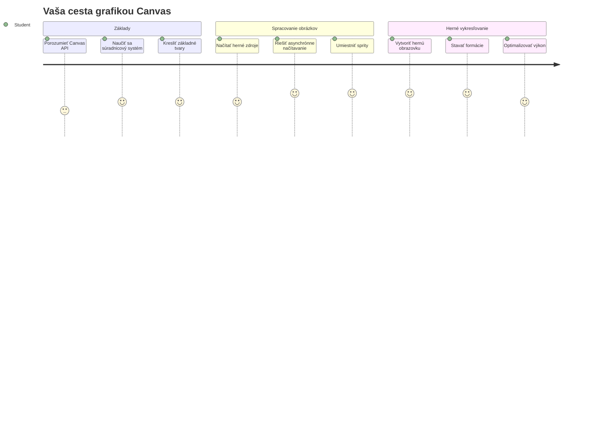
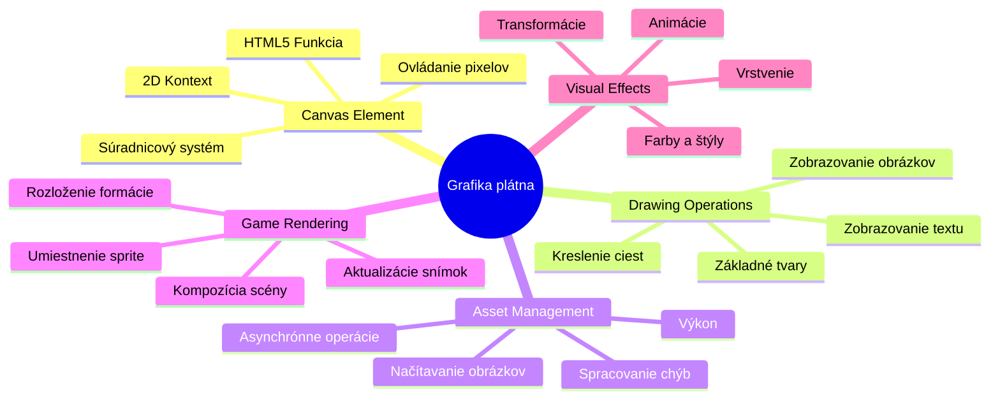
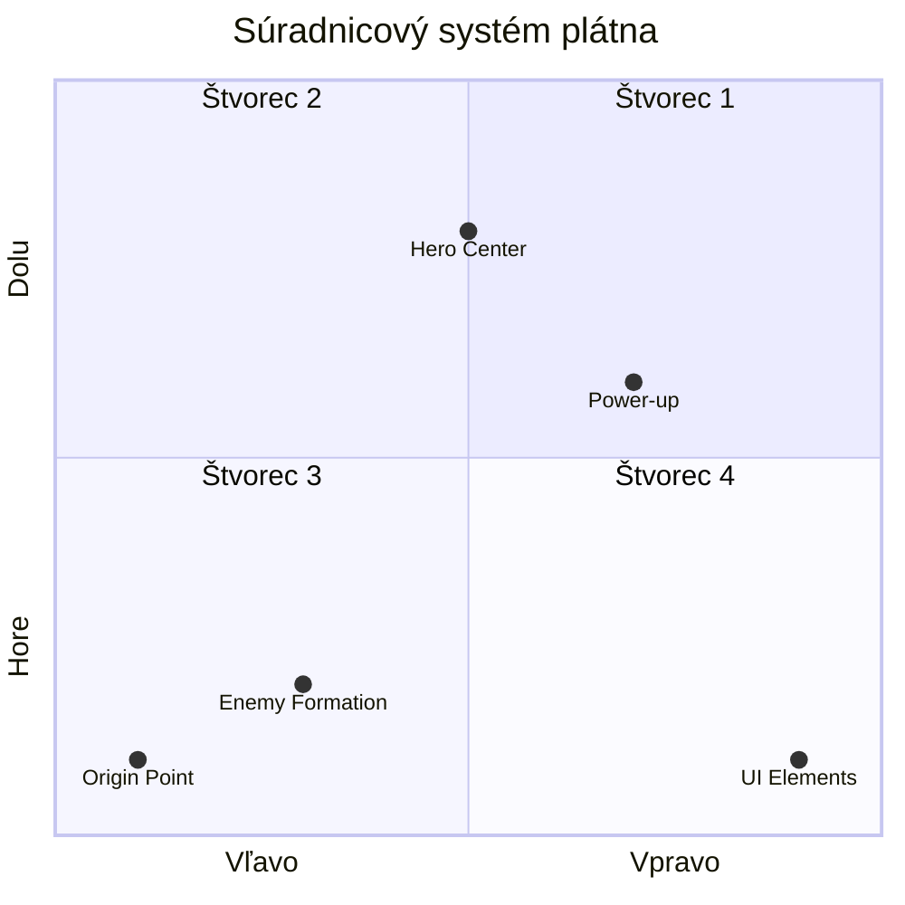
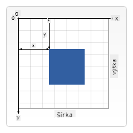
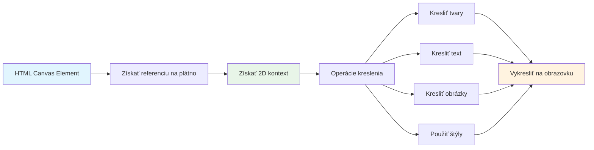
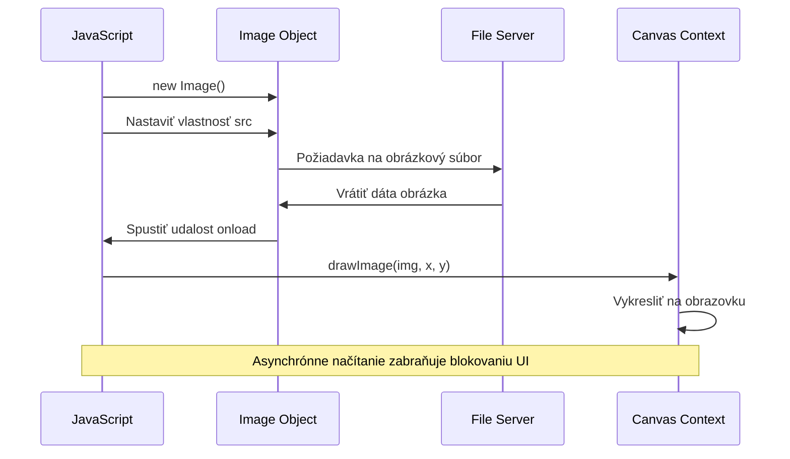
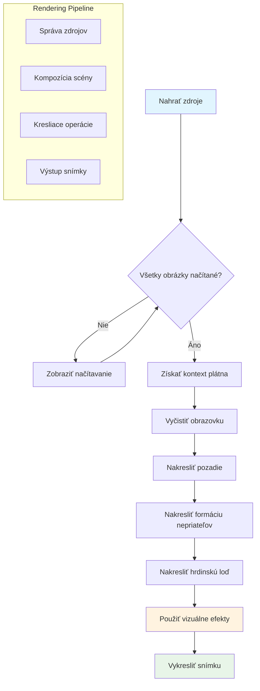
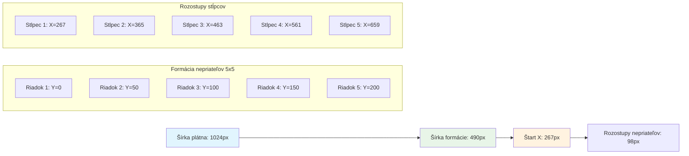
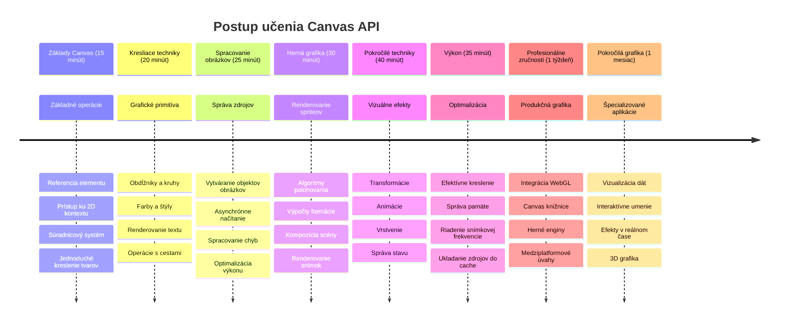

<!--
CO_OP_TRANSLATOR_METADATA:
{
  "original_hash": "7994743c5b21fdcceb36307916ef249a",
  "translation_date": "2026-01-07T04:40:24+00:00",
  "source_file": "6-space-game/2-drawing-to-canvas/README.md",
  "language_code": "sk"
}
-->
# Vytvorte vesmírnu hru, časť 2: Vykreslite hrdinu a príšery na plátno


API Canvas je jednou z najsilnejších funkcií webového vývoja na vytváranie dynamickej, interaktívnej grafiky priamo vo vašom prehliadači. V tejto lekcii premeníme prázdny HTML prvok `<canvas>` na herný svet plný hrdinov a príšer. Predstavte si plátno ako vašej digitálnej umeleckej dosky, kde sa kód stáva vizuálnym zobrazením.

Staviame na tom, čo ste sa naučili v predchádzajúcej lekcii, a teraz sa ponoríme do vizuálnych aspektov. Naučíte sa, ako načítať a zobrazovať herné spritey, presne umiestňovať prvky a vytvárať vizuálny základ pre vašu vesmírnu hru. Toto premostí rozhranie medzi statickými webovými stránkami a dynamickými, interaktívnymi zážitkami.

Na konci tejto lekcie budete mať kompletnú hernú scénu s vášňou lode správne umiestnenou a nepriateľskými formáciami pripravenými do boja. Pochopíte, ako moderné hry vykresľujú grafiku v prehliadačoch, a získate zručnosti na vytváranie vlastných interaktívnych vizuálnych zážitkov. Poďme skúmať grafiku plátna a oživiť vašu vesmírnu hru!


## Prednáškový kvíz

[Prednáškový kvíz](https://ff-quizzes.netlify.app/web/quiz/31)

## Canvas

Čo vlastne je tento prvok `<canvas>`? Je to riešenie HTML5 na tvorbu dynamickej grafiky a animácií v webových prehliadačoch. Na rozdiel od bežných obrázkov alebo videí, ktoré sú statické, plátno vám poskytuje kontrolu na úrovni pixelov nad všetkým, čo sa zobrazuje na obrazovke. Je to ideálne pre hry, vizualizáciu dát a interaktívne umenie. Predstavte si to ako programovateľný kresliaci povrch, kde JavaScript slúži ako váš štetec.

Štandardne vyzerá prvok canvas ako priesvitný prázdny obdĺžnik na vašej stránke. Ale práve v tom spočíva jeho potenciál! Jeho skutočná sila vychádza, keď použijete JavaScript na kreslenie tvarov, načítavanie obrázkov, vytváranie animácií a reagovanie na užívateľské interakcie. Je to podobné ako pionieri počítačovej grafiky v Bell Labs v 60. rokoch, ktorí museli každým pixelom programovať prvé digitálne animácie.

✅ Prečítajte si [ďalšie informácie o API Canvas](https://developer.mozilla.org/docs/Web/API/Canvas_API) na MDN.

Takto je obyčajne deklarovaný, ako súčasť tela stránky:

```html
<canvas id="myCanvas" width="200" height="100"></canvas>
```

**Čo tento kód robí:**
- **Nastavuje** atribút `id`, aby ste mohli tento konkrétny prvok canvas odkazovať v JavaScripte
- **Definuje** šírku v pixeloch, aby ste kontrolovali horizontálnu veľkosť plátna
- **Ustanovuje** výšku v pixeloch, aby ste určili vertikálne rozmery plátna

## Kreslenie jednoduchých geometrických tvarov

Teraz, keď už viete, čo je prvok canvas, poďme preskúmať, ako na ňom vlastne kresliť! Canvas používa súradnicový systém, ktorý vám môže byť známy z hodin matematiky, ale je tu jeden dôležitý obrat špecifický pre počítačovú grafiku.

Canvas používa karteziánsky súradnicový systém s osou x (horizontálnou) a osou y (vertikálnou) na umiestnenie všetkého, čo kreslíte. Ale tu je kľúčový rozdiel: na rozdiel od súradnicového systému z matematiky začína východzí bod `(0,0)` v ľavom hornom rohu, pričom hodnoty x rastú smerom doprava a hodnoty y smerom nadol. Tento prístup pochádza z raných počítačových monitorov, kde elektrónové lúče skenovali obrazovku odhora nadol, teda ľavý horný roh bol prirodzeným štartovacím bodom.



> Obrázok z [MDN](https://developer.mozilla.org/docs/Web/API/Canvas_API/Tutorial/Drawing_shapes)

Na kreslenie na prvok canvas nasledujete rovnaký trojkrokový proces, ktorý tvorí základ všetkých canvas grafík. Keď to urobíte niekoľkokrát, stane sa to pre vás prirodzené:


1. **Získajte referenciu** na váš canvas prvok v DOM (rovnako ako na akýkoľvek iný HTML prvok)
2. **Získajte 2D renderovací kontext** – ten poskytuje všetky metódy kreslenia
3. **Začnite kresliť!** Použite vstavané metódy kontextu na vytváranie grafiky

Takto to vyzerá v kóde:

```javascript
// Krok 1: Získajte element canvas
const canvas = document.getElementById("myCanvas");

// Krok 2: Získajte 2D vykresľovací kontext
const ctx = canvas.getContext("2d");

// Krok 3: Nastavte farbu výplne a nakreslite obdĺžnik
ctx.fillStyle = 'red';
ctx.fillRect(0, 0, 200, 200); // x, y, šírka, výška
```

**Pozrime sa na to krok za krokom:**
- **Získame** náš canvas prvok pomocou jeho ID a uložíme ho do premennej
- **Získame** 2D renderovací kontext – to je náš nástrojovný set plný metód na kreslenie
- **Povieme** plátnu, že chceme vyplniť veci červenou farbou pomocou vlastnosti `fillStyle`
- **Nakreslíme** obdĺžnik začínajúci v ľavom hornom rohu (0,0) s rozmermi 200 pixelov na šírku a výšku

✅ API Canvas sa prevažne zameriava na 2D tvary, no môžete tiež kresliť 3D prvky na web; na to môžete použiť [WebGL API](https://developer.mozilla.org/docs/Web/API/WebGL_API).

S API Canvas môžete kresliť rôzne veci ako:

- **Geometrické tvary**, už ste videli, ako kresliť obdĺžnik, ale možnosti sú omnoho širšie.
- **Texty**, môžete kresliť text s akýmkoľvek fontom a farbou podľa želania.
- **Obrázky**, môžete kresliť obrázky na základe obrázkových súborov, ako sú .jpg alebo .png.

✅ Vyskúšajte! Už viete, ako nakresliť obdĺžnik, viete nakresliť kruh na stránku? Pozrite si niekoľko zaujímavých kresieb na Canvas na CodePen. Tu je [obzvlášť pôsobivý príklad](https://codepen.io/dissimulate/pen/KrAwx).

### 🔄 **Pedagogická kontrola**
**Porozumenie základom Canvas**: Pred pokračovaním k načítaniu obrázkov by ste mali:
- ✅ Vysvetliť, ako sa súradnicový systém canvasu líši od matematických súradníc
- ✅ Pochopiť trojkrokový proces kreslenia na canvas
- ✅ Identifikovať, čo poskytuje 2D renderovací kontext
- ✅ Opísať, ako spolupracujú fillStyle a fillRect

**Rýchly test**: Ako by ste nakreslili modrý kruh na pozícii (100, 50) s polomerom 25?
```javascript
ctx.fillStyle = 'blue';
ctx.beginPath();
ctx.arc(100, 50, 25, 0, 2 * Math.PI);
ctx.fill();
```

**Metódy kreslenia na Canvas, ktoré teraz poznáte**:
- **fillRect()**: Kreslí vyplnené obdĺžniky
- **fillStyle**: Nastavuje farby a vzory
- **beginPath()**: Začína nové kresliace cesty
- **arc()**: Vytvára kruhy a krivky

## Načítajte a vykreslite obrázok

Kreslenie základných tvarov je užitočné na začiatok, ale väčšina hier potrebuje reálne obrázky! Spritey, pozadia a textúry dávajú hrám ich vizuálnu príťažlivosť. Načítavanie a zobrazovanie obrázkov na canvas funguje inak ako kreslenie geometrických tvarov, no je to jednoduché, keď pochopíte postup.

Musíme vytvoriť objekt `Image`, načítať súbor obrázka (toto prebieha asynchrónne, teda „na pozadí“) a potom ho nakresliť na canvas, keď je pripravený. Tento prístup zaručuje, že sa vaše obrázky zobrazia správne bez blokovania aplikácie počas ich načítania.


### Základné načítanie obrázkov

```javascript
const img = new Image();
img.src = 'path/to/my/image.png';
img.onload = () => {
  // Obrázok načítaný a pripravený na použitie
  console.log('Image loaded successfully!');
};
```

**Čo sa deje v tomto kóde:**
- Vytvárame nový objekt Image, ktorý bude držať náš sprite alebo textúru
- Nastavujeme mu cestu k súboru obrázka, ktorý chceme načítať
- Počúvame na udalosti načítania, aby sme presne vedeli, kedy je obrázok pripravený na použitie

### Lepší spôsob načítania obrázkov

Tu je robustnejší spôsob správy načítania obrázkov, ktorý bežne používajú profesionálni vývojári. Zabalíme načítanie obrázkov do funkcie založenej na Promise – tento prístup, ktorý sa rozšíril s príchodom JavaScriptových Promisov v ES6, robí váš kód prehľadnejším a umožňuje elegantne riešiť chyby:

```javascript
function loadAsset(path) {
  return new Promise((resolve, reject) => {
    const img = new Image();
    img.src = path;
    img.onload = () => {
      resolve(img);
    };
    img.onerror = () => {
      reject(new Error(`Failed to load image: ${path}`));
    };
  });
}

// Moderné používanie s async/await
async function initializeGame() {
  try {
    const heroImg = await loadAsset('hero.png');
    const monsterImg = await loadAsset('monster.png');
    // Obrázky sú teraz pripravené na použitie
  } catch (error) {
    console.error('Failed to load game assets:', error);
  }
}
```

**Čo sme tu spravili:**
- Zabalili sme celý proces načítania obrázkov do Promise pre lepšiu správu
- Pridali sme spracovanie chýb, ktoré nám oznamuje, keď niečo zlyhá
- Použili sme modernú syntax async/await, ktorá je oveľa čitateľnejšia
- Zahrnuli sme bloky try/catch, ktoré elegantne zvládajú prípadné problémy s načítaním

Keď máte obrázky načítané, ich vykresľovanie na canvas je veľmi jednoduché:

```javascript
async function renderGameScreen() {
  try {
    // Načítať herné zdroje
    const heroImg = await loadAsset('hero.png');
    const monsterImg = await loadAsset('monster.png');

    // Získať plátno a kontext
    const canvas = document.getElementById("myCanvas");
    const ctx = canvas.getContext("2d");

    // Nakresliť obrázky na konkrétne pozície
    ctx.drawImage(heroImg, canvas.width / 2, canvas.height / 2);
    ctx.drawImage(monsterImg, 0, 0);
  } catch (error) {
    console.error('Failed to render game screen:', error);
  }
}
```

**Prejdime si to krok za krokom:**
- Načítame obe naše obrázky – hrdinu a príšeru – pozadia pomocou await
- Získame prvok canvas a požadovaný 2D renderovací kontext
- Umiestnime obrázok hrdinu presne do stredu pomocou pár výpočtov súradníc
- Nakreslíme obrázok príšery v ľavom hornom rohu, odkiaľ začneme formáciu nepriateľov
- Zachytíme všetky chyby, ktoré by mohli vzniknúť počas načítania alebo vykresľovania


## Teraz je čas začať stavať vašu hru

Spojíme všetko, aby sme vytvorili vizuálny základ vašej vesmírnej hry. Máte pevné základy o canvase a metódach načítania obrázkov, takže táto praktická časť vás prevedie vytvorením kompletnej hernej obrazovky s presne umiestnenými spriteami.

### Čo vytvoriť

Vytvoríte webovú stránku s prvkom Canvas. Mali by ste vykresliť čiernu obrazovku o rozmere `1024*768`. Poskytli sme vám dva obrázky:

- Hrdina loď

   

- 5×5 príšery

   

### Odporúčané kroky na začiatok vývoja

Nájdite štartovacie súbory, ktoré boli pre vás vytvorené v podadresári `your-work`. Štruktúra vášho projektu by mala obsahovať:

```bash
your-work/
├── assets/
│   ├── enemyShip.png
│   └── player.png
├── index.html
├── app.js
└── package.json
```

**S čím pracujete:**
- **Herné spritey** sú v priečinku `assets/` pre lepšiu organizáciu
- **Hlavný HTML súbor** nastavuje prvok canvas a pripravuje všetko
- **Súbor JavaScript** v ktorom napíšete všetku magickú logiku vykresľovania hry
- **Súbor package.json** ktorý nastavuje vývojový server na lokálne testovanie

Otvorte tento priečinok vo Visual Studio Code a začnite vývoj. Na lokálny vývoj budete potrebovať Visual Studio Code, NPM a Node.js. Ak ešte nemáte `npm` na počítači, [tu je návod na jeho inštaláciu](https://www.npmjs.com/get-npm).

Spustite váš vývojový server tak, že sa presuniete do priečinka `your-work`:

```bash
cd your-work
npm start
```

**Tento príkaz robí niekoľko pekných vecí:**
- **Spustí** lokálny server na `http://localhost:5000`, kde môžete testovať vašu hru
- **Poskytuje** správne všetky súbory, aby ich prehliadač dokázal načítať
- **Sleduje** vaše súbory na zmeny pre plynulý vývoj
- **Dá vám** profesionálne vývojové prostredie na testovanie všetkého

> 💡 **Poznámka**: Prehliadač spočiatku zobrazí prázdnu stránku – to je normálne! Ako pridávate kód, obnovujte stránku, aby ste videli zmeny. Tento iteratívny vývojový prístup je podobný tomu, ako NASA stavala počítač Apollo Guidance – testovali každý komponent predtým, než ho integrovali do väčšieho systému.

### Pridajte kód

Pridajte požadovaný kód do súboru `your-work/app.js` na dokončenie týchto úloh:

1. **Vykreslite canvas s čiernym pozadím**
   > 💡 **Ako na to**: Nájdite TODO v `/app.js` a pridajte len dva riadky. Nastavte `ctx.fillStyle` na čiernu, potom použite `ctx.fillRect()` s počiatočnými súradnicami (0,0) a rozmermi plátna. Jednoduché!

2. **Načítajte herné textúry**
   > 💡 **Ako na to**: Použite `await loadAsset()` na načítanie obrázkov pre hráča a nepriateľov. Uložte ich do premenných, aby ste ich mohli použiť neskôr. Pamätajte – nezobrazia sa, kým ich naozaj nevykreslíte!

3. **Nakreslite hrdinovu loď v strede v spodnej časti**
   > 💡 **Ako na to**: Použite `ctx.drawImage()` na umiestnenie hrdinu. Pre súradnicu x skúste `canvas.width / 2 - 45` na vycentrovanie, a pre y použite `canvas.height - canvas.height / 4` pre umiestnenie do spodnej oblasti.

4. **Nakreslite 5×5 formáciu nepriateľských lodí**
   > 💡 **Ako na to**: Nájdite funkciu `createEnemies` a nastavte vnorené cykly. Bude potrebné trochu matematického rozostupu a polohovania, ale nebojte sa – ukážem vám presne, ako na to!

Najprv nastavte konštanty pre správne rozmiestnenie nepriateľskej formácie:

```javascript
const ENEMY_TOTAL = 5;
const ENEMY_SPACING = 98;
const FORMATION_WIDTH = ENEMY_TOTAL * ENEMY_SPACING;
const START_X = (canvas.width - FORMATION_WIDTH) / 2;
const STOP_X = START_X + FORMATION_WIDTH;
```

**Čo tieto konštanty robia:**
- Nastavujeme 5 nepriateľov na riadok aj stĺpec (čistá 5×5 mriežka)
- Definujeme, koľko miesta je medzi nepriateľmi, aby neboli natlačení
- Vypočítame, aká široká bude celá formácia
- Určíme, kde formáciu začať a skončiť, aby vyzerala vycentrovane


Potom vytvorte vnorené cykly na vykreslenie nepriateľskej formácie:

```javascript
for (let x = START_X; x < STOP_X; x += ENEMY_SPACING) {
  for (let y = 0; y < 50 * 5; y += 50) {
    ctx.drawImage(enemyImg, x, y);
  }
}
```

**Čo robí tento vnorený cyklus:**
- Vonkajší cyklus sa pohybuje zľava doprava cez formáciu
- Vnútorný cyklus ide zhora nadol, aby vytvoril upratané riadky
- Kreslí každý nepriateľský sprite na presne vypočítané x,y súradnice
- Všetko je rovnomerne rozmiestnené, aby pôsobilo profesionálne a organizovane

### 🔄 **Pedagogická kontrola**
**Majstrovstvo v hernom vykresľovaní**: Overte si vaše porozumenie celého vykresľovacieho systému:
- ✅ Ako asynchrónne načítavanie obrázkov zabraňuje blokovaniu UI počas spustenia hry?
- ✅ Prečo počítame polohy nepriateľskej formácie pomocou konštánt namiesto pevne zakódovaných hodnôt?
- ✅ Akú úlohu zohráva 2D renderovací kontext pri vykresľovacích operáciách?
- ✅ Ako vnorené cykly vytvárajú usporiadané formácie spriteov?

**Výkonové úvahy**: Vaša hra teraz demonštruje:
- **Efektívne načítanie zdrojov**: Správu obrázkov cez Promise
- **Organizované vykresľovanie**: Štruktúrované vykresľovacie operácie
- **Matematické polohovanie**: Vypočítané umiestnenia spriteov
- **Spracovanie chýb**: Elegantné zvládanie problémov

**Koncepty vizuálneho programovania**: Naučili ste sa:
- **Systémy súradníc**: Preklad matematických výpočtov do pozícií na obrazovke
- **Správa sprite-ov**: Načítanie a zobrazovanie hernej grafiky
- **Algoritmy formácií**: Matematické vzory pre organizované rozloženie
- **Asynchrónne operácie**: Moderný JavaScript pre plynulý užívateľský zážitok

## Výsledok

Hotový výsledok by mal vyzerať takto:


## Riešenie

Skúste to najskôr vyriešiť sami, ale ak budete mať problémy, pozrite si [riešenie](../../../../6-space-game/2-drawing-to-canvas/solution/app.js)

---

## Výzva GitHub Copilot agenta 🚀

Použite režim agenta na splnenie nasledujúcej výzvy:

**Popis:** Vylepšite vašu vesmírnu hru na plátne pridaním vizuálnych efektov a interaktívnych prvkov pomocou techník Canvas API, ktoré ste sa naučili.

**Výzva:** Vytvorte nový súbor s názvom `enhanced-canvas.html` s plátnom, ktoré zobrazuje animované hviezdy na pozadí, pulzujúci zdravotný pruh pre hero loď a nepriateľské lode, ktoré sa pomaly pohybujú nadol. Zahrňte JavaScriptový kód, ktorý kreslí trblietavé hviezdy pomocou náhodných pozícií a priehľadnosti, implementuje zdravotný pruh, ktorý mení farbu podľa úrovne zdravia (zelená > žltá > červená) a animuje nepriateľské lode tak, aby sa pohybovali nadol rôznou rýchlosťou.

Viac o [režime agenta](https://code.visualstudio.com/blogs/2025/02/24/introducing-copilot-agent-mode) sa dozviete tu.

## 🚀 Výzva

Naučili ste sa kresliť pomocou Canvas API so zameraním na 2D; nahliadnite do [WebGL API](https://developer.mozilla.org/docs/Web/API/WebGL_API) a skúste nakresliť 3D objekt.

## Kvíz po prednáške

[Kvíz po prednáške](https://ff-quizzes.netlify.app/web/quiz/32)

## Prehľad a samostatná štúdia

Naučte sa viac o Canvas API [čítaním o ňom](https://developer.mozilla.org/docs/Web/API/Canvas_API).

### ⚡ **Čo môžete urobiť za ďalších 5 minút**
- [ ] Otvorte konzolu prehliadača a vytvorte element canvas pomocou `document.createElement('canvas')`
- [ ] Skúste nakresliť obdĺžnik pomocou `fillRect()` na kontexte canvasu
- [ ] Experimentujte s rôznymi farbami pomocou vlastnosti `fillStyle`
- [ ] Nakreslite jednoduchý kruh pomocou metódy `arc()`

### 🎯 **Čo môžete dosiahnuť v tomto hodine**
- [ ] Dokončite kvíz po lekcii a pochopte základy canvasu
- [ ] Vytvorte kresliacu aplikáciu na canvas s viacerými tvarmi a farbami
- [ ] Implementujte načítanie obrázkov a renderovanie sprite-ov pre vašu hru
- [ ] Vytvorte jednoduchú animáciu, ktorá pohybuje objektmi po plátne
- [ ] Precvičujte transformácie na canvase, ako škálovanie, rotácia a translácia

### 📅 **Váš týždenný canvasový plán**
- [ ] Dokončite vesmírnu hru s vyleštenou grafikou a animáciami sprite-ov
- [ ] Ovládnite pokročilé techniky canvasu ako gradienty, vzory a kompozity
- [ ] Vytvorte interaktívne vizualizácie používajúce canvas na zobrazenie dát
- [ ] Naučte sa techniky optimalizácie canvasu pre plynulý výkon
- [ ] Vybudujte kresliacu alebo maľovaciu aplikáciu s rôznymi nástrojmi
- [ ] Objavte kreatívne programovacie vzory a generatívne umenie na canvase

### 🌟 **Mesačné zvládnutie grafiky**
- [ ] Vytvorte komplexné vizuálne aplikácie pomocou Canvas 2D a WebGL
- [ ] Naučte sa grafické programovanie a základy shaderov
- [ ] Prispievajte do open source knižníc na grafiku a vizualizácie
- [ ] Staňte sa majstrom optimalizácie výkonu pre graficky náročné aplikácie
- [ ] Vytvárajte vzdelávací obsah o programovaní canvasu a počítačovej grafike
- [ ] Staňte sa expertom na grafické programovanie, ktorý pomáha iným vytvárať vizuálne zážitky

## 🎯 Váš časový plán na zvládnutie Canvas grafiky


### 🛠️ Zhrnutie vašich nástrojov pre Canvas grafiku

Po dokončení tejto lekcie už máte:
- **Ovládanie Canvas API**: Kompletné porozumenie programovaniu 2D grafiky
- **Matematiku súradníc**: Presné umiestňovanie a algoritmy rozloženia
- **Správu zdrojov**: Profesionálne načítavanie obrázkov a spracovanie chýb
- **Rendrovací pipeline**: Štruktúrovaný prístup k tvorbe scény
- **Hernú grafiku**: Umiestňovanie sprite-ov a výpočty formácií
- **Asynchrónne programovanie**: Moderné vzory JavaScriptu pre plynulý výkon
- **Vizuálne programovanie**: Preklad matematiky do obrazovkovej grafiky

**Použitie v reálnom svete**: Vaše schopnosti s Canvas sa priamo využívajú v:
- **Vizualizácii dát**: Grafy, diagramy a interaktívne panely
- **Vývoji hier**: 2D hry, simulácie a interaktívne zážitky
- **Digitálnom umení**: Kreatívne kódovanie a generatívne umelecké projekty
- **UI/UX dizajne**: Vlastná grafika a interaktívne prvky
- **Vzdelávacom softvéri**: Vizualizačné nástroje a simulácie učenia
- **Webových aplikáciách**: Dynamická grafika a vizualizácie v reálnom čase

**Profesionálne zručnosti, ktoré ste získali**: Teraz viete:
- **Budovať** vlastné grafické riešenia bez externých knižníc
- **Optimalizovať** výkon renderovania pre plynulý užívateľský zážitok
- **Ladiť** zložité vizuálne problémy pomocou vývojárskych nástrojov prehliadača
- **Navrhovať** škálovateľné grafické systémy s využitím matematiky
- **Integrovať** Canvas grafiku s modernými webovými frameworkami

**Metódy Canvas API, ktoré ovládate**:
- **Správa elementov**: getElementById, getContext
- **Tvorba kresieb**: fillRect, drawImage, fillStyle
- **Načítavanie zdrojov**: Image objekty, Promise vzory
- **Matematické umiestnenie**: Výpočty súradníc, algoritmy formácií

**Ďalšia úroveň**: Ste pripravení pridať animácie, interakciu používateľa, detekciu kolízií alebo preskúmať WebGL pre 3D grafiku!

🌟 **Dosiahnutý úspech**: Vybudovali ste kompletný systém renderovania hier pomocou základných techník Canvas API!

## Zadanie

[Hrajte sa s Canvas API](assignment.md)

---

<!-- CO-OP TRANSLATOR DISCLAIMER START -->
**Upozornenie**:
Tento dokument bol preložený pomocou AI prekladačskej služby [Co-op Translator](https://github.com/Azure/co-op-translator). Aj keď sa snažíme o presnosť, majte prosím na pamäti, že automatické preklady môžu obsahovať chyby alebo nepresnosti. Originálny dokument v jeho pôvodnom jazyku by mal byť považovaný za autoritatívny zdroj. Pre kritické informácie sa odporúča profesionálny ľudský preklad. Nie sme zodpovední za akékoľvek nedorozumenia alebo nesprávne výklady vyplývajúce z použitia tohto prekladu.
<!-- CO-OP TRANSLATOR DISCLAIMER END -->