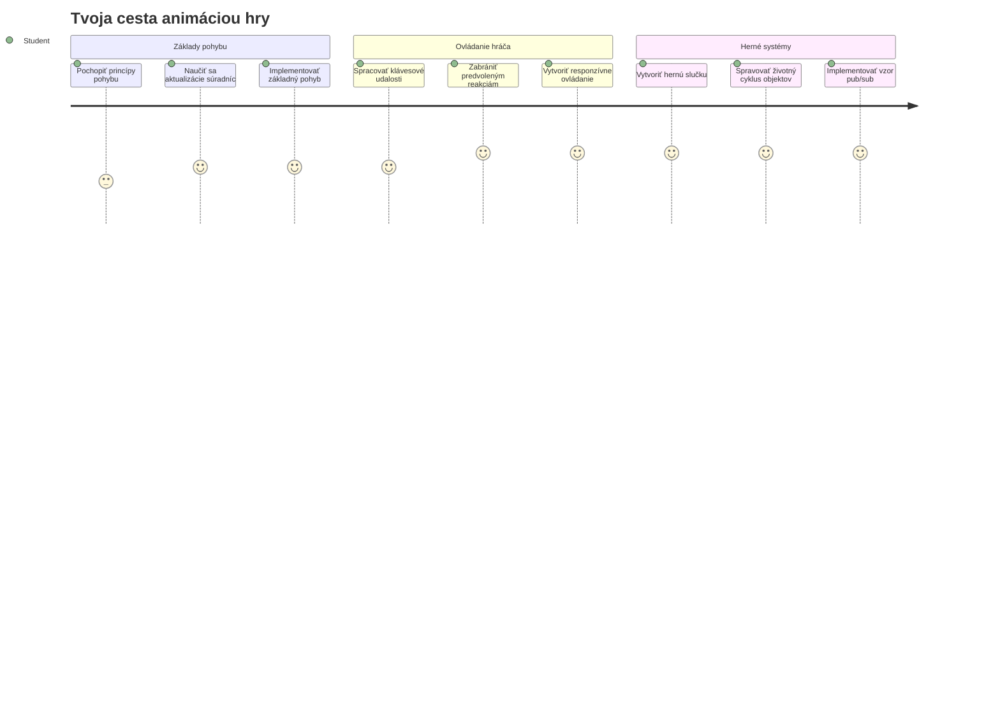
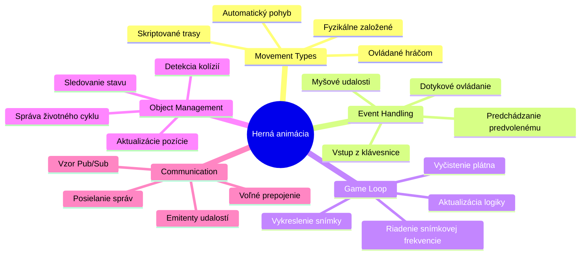
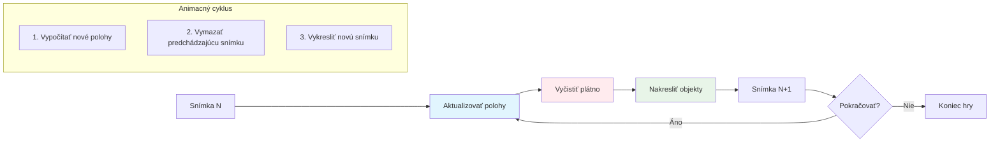
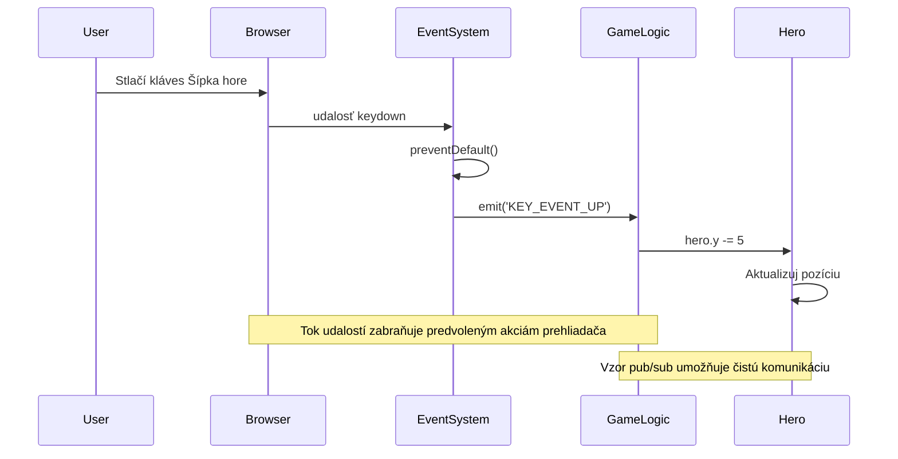
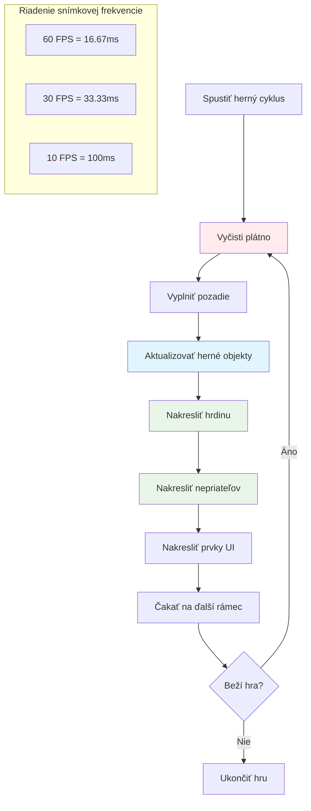
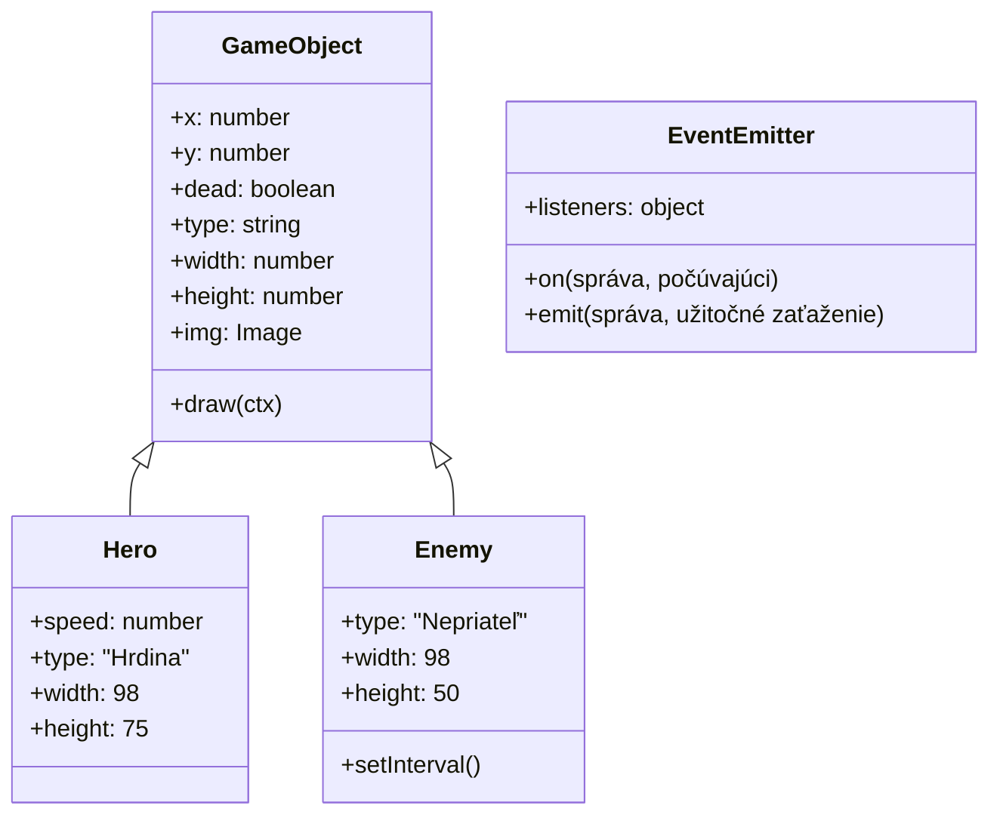
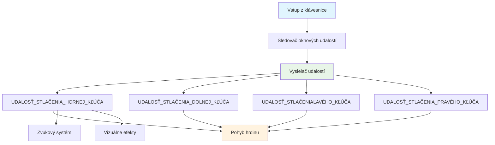
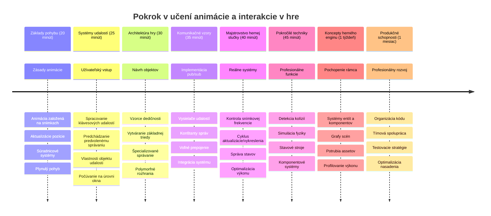

# Vytvorte vesmírnu hru Časť 3: Pridávanie pohybu


Premýšľajte o svojich obľúbených hrách – to, čo ich robí pútavými, nie sú len pekné grafiky, ale spôsob, akým sa všetko pohybuje a reaguje na vaše akcie. Váš vesmírna hra je teraz ako krásny obraz, ale chystáme sa pridať pohyb, ktorý ju oživí.

Keď inžinieri NASA programovali riadiaci počítač pre misie Apollo, čelili podobnej výzve: ako zabezpečiť, aby kozmická loď reagovala na vstupy pilota a zároveň automaticky udržiavala správne korigovanie dráhy? Princípy, ktoré sa dnes naučíme, odrážajú tie isté koncepty – riadenie pohybu ovládaného hráčom spolu s automatickými systémovými správaním.

V tejto lekcii sa naučíte, ako nechať vesmírne lode kĺzať po obrazovke, reagovať na príkazy hráča a vytvárať hladké pohybové vzory. Všetko rozoberieme na zvládnuteľné koncepty, ktoré sa prirodzene budujú na seba.

Na konci budú hráči riadiť svoju hrdinskú loď po obrazovke, zatiaľ čo nepriateľské lode budú patrovať nad hlavou. Ešte dôležitejšie je, že porozumiete základným princípom, ktoré poháňajú pohybové systémy v hrách.


## Kvíz pred lekciou

[Predlekčný kvíz](https://ff-quizzes.netlify.app/web/quiz/33)

## Pochopenie pohybu v hrách

Hry ožívajú, keď sa začnú veci hýbať, a v zásade sa to deje dvoma spôsobmi:

- **Pohyb ovládaný hráčom**: Keď stlačíte kláves alebo kliknete myšou, niečo sa pohne. Toto je priamy spoj medzi vami a herným svetom.
- **Automatický pohyb**: Keď hra sama rozhodne, že sa niečo pohne – napríklad tie nepriateľské lode, ktoré musia patrovať obrazovku, či už robíte čokoľvek alebo nie.

Pohybovanie objektov na obrazovke počítača je jednoduchšie, než by ste si mysleli. Pamätáte si tie súradnice x a y z matematiky? Presne s týmto pracujeme. Keď Galileo v roku 1610 sledoval Jupiterove mesiace, vlastne robil to isté – zaznamenával polohy v čase, aby pochopil vzory pohybu.

Pohybovať vecami na obrazovke je ako vytvárať flipbookovú animáciu – musíte nasledovať týchto troch jednoduchých krokov:


1. **Aktualizovať pozíciu** – Zmeniť, kde by mal byť váš objekt (napríklad ho posunúť o 5 pixelov doprava)
2. **Vymazať starý snímok** – Vyčistiť obrazovku, aby ste nevideli duchovité stopy všade
3. **Nakresliť nový snímok** – Umiesniť objekt na jeho nové miesto

Ak to urobíte dosť rýchlo, boom! Máte plynulý pohyb, ktorý hráči vnímajú prirodzene.

Takto to môže vyzerať v kóde:

```javascript
// Nastavte polohu hrdinu
hero.x += 5;
// Vyčistite obdĺžnik, kde sa nachádza hrdina
ctx.clearRect(0, 0, canvas.width, canvas.height);
// Znova vykreslite pozadie hry a hrdinu
ctx.fillRect(0, 0, canvas.width, canvas.height);
ctx.fillStyle = "black";
ctx.drawImage(heroImg, hero.x, hero.y);
```

**Čo tento kód robí:**
- **Aktualizuje** x-súradnicu hrdinu o 5 pixlov pre horizontálny pohyb
- **Vyčistí** celú plochu plátna, aby odstránil predchádzajúci snímok
- **Vyplní** plátno čiernou farbou pozadia
- **Nakreslí** obraz hrdinu na novej pozícii

✅ Môžete premýšľať nad dôvodom, prečo opakované prekresľovanie hrdinu mnohokrát za sekundu môže spôsobiť výkonové náklady? Prečítajte si o [alternatívach k tomuto vzoru](https://developer.mozilla.org/en-US/docs/Web/API/Canvas_API/Tutorial/Optimizing_canvas).

## Spracovanie klávesových udalostí

Tu spájame vstup hráča s hernou akciou. Keď niekto stlačí medzerník na vystrelenie laseru alebo stlačí šípku na vyhnutie sa asteroidu, vaša hra musí tento vstup zachytiť a reagovať naň.

Klávesové udalosti sa zisťujú na úrovni okna, čo znamená, že celý váš prehliadač počúva tieto stlačenia klávesov. Kliknutia myšou môžu byť však priradené k špecifickým prvkom (napríklad kliknutie na tlačidlo). Pre našu vesmírnu hru sa budeme sústrediť na klávesnicové ovládanie, pretože to dá hráčom klasický arkádový pocit.

Pripomína mi to, ako telegrafní operátori v 1800-tych rokoch museli prekladať kódy Morse do zmysluplných správ – robíme niečo podobné, prekladáme stlačenia klávesov na herné príkazy.

Na spracovanie udalosti musíte použiť metódu `addEventListener()` okna a poskytnúť jej dva vstupné parametre. Prvý parameter je názov udalosti, napríklad `keyup`. Druhý parameter je funkcia, ktorá sa má vyvolať, keď udalosť nastane.

Tu je príklad:

```javascript
window.addEventListener('keyup', (evt) => {
  // evt.key = reťazcová reprezentácia klávesu
  if (evt.key === 'ArrowUp') {
    // urob niečo
  }
});
```

**Čo sa tu deje:**
- **Počúva** klávesové udalosti na celom okne
- **Zachytáva** objekt udalosti, ktorý obsahuje informácie o stlačenom klávese
- **Kontroluje**, či stlačený kláves zodpovedá špecifickému klávese (v tomto prípade šípka hore)
- **Vykonáva** kód, keď je podmienka splnená

Pre klávesové udalosti môžete použiť dve vlastnosti udalosti, aby ste videli, ktorý kláves bol stlačený:

- `key` - reťazcová reprezentácia stlačeného klávesu, napríklad `'ArrowUp'`
- `keyCode` - číselná reprezentácia, napríklad `37`, čo zodpovedá `ArrowLeft`

✅ Manipulácia s klávesovými udalosťami je užitočná aj mimo vývoja hier. Na aké iné použitia si spomeniete pre túto techniku?


### Špeciálne klávesy: upozornenie!

Niektoré klávesy majú zabudované správanie prehliadača, ktoré môže zasahovať do vašej hry. Šípky posúvajú stránku a medzerník poskočí dole – to nechcete, keď niekto pilotuje svoju vesmírnu loď.

Môžeme týmto prednastaveným správaním zabrániť a nechať našu hru spracovať vstup namiesto nich. Je to podobné tomu, ako museli skorí počítačoví programátori prepisovať systémové prerušovania, aby vytvorili vlastné správanie – my to robíme na úrovni prehliadača. Takto:

```javascript
const onKeyDown = function (e) {
  console.log(e.keyCode);
  switch (e.keyCode) {
    case 37:
    case 39:
    case 38:
    case 40: // Šípky
    case 32:
      e.preventDefault();
      break; // Medzerník
    default:
      break; // nezablokujte ostatné klávesy
  }
};

window.addEventListener('keydown', onKeyDown);
```

**Pochopenie tohto kódu zabraňujúceho prednastavenému správaniu:**
- **Kontroluje** určité kódy kláves, ktoré by mohli spôsobiť nežiaduce správanie prehliadača
- **Zabraňuje** prednastavenému správaniu prehliadača pre šípky a medzerník
- **Umožňuje** ostatným klávesom fungovať normálne
- **Používa** `e.preventDefault()` na zastavenie zabudovaného správania prehliadača

### 🔄 **Pedagogická kontrola**
**Pochopenie spracovania udalostí**: Predtým, než prejdete na automatický pohyb, uistite sa, že viete:
- ✅ Vysvetliť rozdiel medzi udalosťami `keydown` a `keyup`
- ✅ Pochopiť, prečo zabraňujeme prednastavenému správaniu prehliadača
- ✅ Opísať, ako event listenery spájajú vstup používateľa s hernou logikou
- ✅ Určiť, ktoré klávesy môžu zasahovať do ovládania hry

**Rýchly samostatný test**: Čo by sa stalo, keby ste nezabránili prednastavenému správaniu pre šípky?
*Odpoveď: Prehliadač by posúval stránku, čo by zasahovalo do pohybu v hre*

**Architektúra systému udalostí**: Teraz rozumiete:
- **Počúvaniu na úrovni okna**: zachytávanie udalostí na úrovni prehliadača
- **Vlastnostiam objektu udalosti**: reťazce `key` vs čísla `keyCode`
- **Zabráneniu prednastavenému správaniu**: zastavenie nechcených správ prehliadača
- **Podmienkovej logike**: reagovanie na špecifické kombinácie kláves

## Pohyb riadený hrou

Teraz si povieme o objektoch, ktoré sa pohybujú bez vstupu hráča. Predstavte si nepriateľské lode plávajúce po obrazovke, gule lietajúce po priamych čiarach alebo oblaky unášané na pozadí. Tento autonómny pohyb robí herný svet živým, aj keď nikto netlačí ovládanie.

Používame vstavané časovače JavaScriptu na pravidelné aktualizovanie pozícií. Tento koncept je podobný práci kyvadlových hodín – pravidelný mechanizmus, ktorý spúšťa konzistentné, časované akcie. Takto jednoducho to môže byť:

```javascript
const id = setInterval(() => {
  // Posuň nepriateľa na osi y
  enemy.y += 10;
}, 100);
```

**Čo tento kód pohybu robí:**
- **Vytvára** časovač, ktorý beží každých 100 milisekúnd
- **Aktualizuje** y-súradnicu nepriateľa o 10 pixelov pri každom behu
- **Ukladá** ID intervalu, aby sme ho mohli neskôr zastaviť, ak treba
- **Posúva** nepriateľa automaticky smerom dole po obrazovke

## Herná slučka

Tu je koncept, ktorý spája všetko dohromady – herná slučka. Keby bola vaša hra filmom, herná slučka by bola filmovým projektorom, ktorý rýchlo premieta snímok za snímkom tak, že všetko vyzerá plynulo.

Každá hra má takúto slučku, ktorá beží na pozadí. Je to funkcia, ktorá aktualizuje všetky herné objekty, prekresľuje obrazovku a tento proces neustále opakuje. Sleduje vášho hrdinu, všetkých nepriateľov, všetky lietajúce lasery – celý herný stav.

Tento koncept mi pripomína, ako skorí filmoví animátori ako Walt Disney museli prekresľovať postavy snímok po snímku, aby vytvorili ilúziu pohybu. Robíme to isté, len so zápisom v kóde namiesto ceruziek.

Takto môže herná slučka typicky vyzerať v kóde:


```javascript
const gameLoopId = setInterval(() => {
  function gameLoop() {
    ctx.clearRect(0, 0, canvas.width, canvas.height);
    ctx.fillStyle = "black";
    ctx.fillRect(0, 0, canvas.width, canvas.height);
    drawHero();
    drawEnemies();
    drawStaticObjects();
  }
  gameLoop();
}, 200);
```

**Pochopenie štruktúry hernej slučky:**
- **Vyčistí** celé plátno, aby odstránil predchádzajúci snímok
- **Vyplní** pozadie pevnou farbou
- **Nakreslí** všetky herné objekty na ich aktuálnych pozíciách
- **Opakuje** tento proces každých 200 milisekúnd, aby vznikla plynulá animácia
- **Riadi** snímkovú frekvenciu ovládaním intervalového času

## Pokračovanie vesmírnej hry

Teraz pridáme pohyb do statickej scény, ktorú ste predtým vytvorili. Premeníme ju zo statického snímku na interaktívny zážitok. Prejdeme si to krok za krokom, aby sa každý dielck budoval na predchádzajúcom.

Zoberte si kód od bodu, kde sme skončili v predchádzajúcej lekcii (alebo začnite s kódom v [Part II- starter](../../../../6-space-game/3-moving-elements-around/your-work) priečinku, ak potrebujete nový začiatok).

**Čo dnes budujeme:**
- **Ovládanie hrdinu**: Šípky budú pilotovať vašu vesmírnu loď po obrazovke
- **Pohyb nepriateľov**: Tie mimozemské lode začnú svoj postup

Začnime implementovať tieto funkcie.

## Odporúčané kroky

Nájdite súbory, ktoré vám boli vytvorené v podpriečinku `your-work`. Mali by obsahovať toto:

```bash
-| assets
  -| enemyShip.png
  -| player.png
-| index.html
-| app.js
-| package.json
```

Projekt môžete spustiť v priečinku `your-work` príkazom:

```bash
cd your-work
npm start
```

**Čo tento príkaz robí:**
- **Presunie** sa do adresára projektu
- **Spustí** HTTP server na adrese `http://localhost:5000`
- **Podáva** vaše herné súbory, aby ste ich mohli testovať v prehliadači

Vyššie uvedený príkaz spustí HTTP server na adrese `http://localhost:5000`. Otvorte prehliadač a zadajte túto adresu, momentálne by sa mal vykresliť hrdina a všetci nepriatelia; nič sa ešte nepohybuje!

### Pridajte kód

1. **Pridajte dedikované objekty** pre `hero` a `enemy` a `game object`, mali by mať vlastnosti `x` a `y`. (Pamätajte si časť o [Dedičnosť alebo kompozícia](../README.md)).

   *TIP* `game object` by mal byť tým, čo má `x` a `y` a schopnosť nakresliť sa na plátno.

   > **Tip**: Začnite vytvorením novej triedy `GameObject` s konštruktorom definovaným nižšie, a potom ju nakreslite na plátno:

    ```javascript
    class GameObject {
      constructor(x, y) {
        this.x = x;
        this.y = y;
        this.dead = false;
        this.type = "";
        this.width = 0;
        this.height = 0;
        this.img = undefined;
      }
    
      draw(ctx) {
        ctx.drawImage(this.img, this.x, this.y, this.width, this.height);
      }
    }
    ```

    **Pochopenie tejto základnej triedy:**
    - **Definuje** spoločné vlastnosti, ktoré majú všetky herné objekty (pozícia, veľkosť, obrázok)
    - **Zahŕňa** flag `dead`, ktorý sleduje, či by sa mal objekt odstrániť
    - **Poskytuje** metódu `draw()`, ktorá vykreslí objekt na plátno
    - **Nastavuje** predvolené hodnoty pre všetky vlastnosti, ktoré môžu podtriedy prepísať


    Teraz rozšírte `GameObject` a vytvorte `Hero` a `Enemy`:
    
    ```javascript
    class Hero extends GameObject {
      constructor(x, y) {
        super(x, y);
        this.width = 98;
        this.height = 75;
        this.type = "Hero";
        this.speed = 5;
      }
    }
    ```

    ```javascript
    class Enemy extends GameObject {
      constructor(x, y) {
        super(x, y);
        this.width = 98;
        this.height = 50;
        this.type = "Enemy";
        const id = setInterval(() => {
          if (this.y < canvas.height - this.height) {
            this.y += 5;
          } else {
            console.log('Stopped at', this.y);
            clearInterval(id);
          }
        }, 300);
      }
    }
    ```

    **Kľúčové koncepty v týchto triedach:**
    - **Dedičí** z `GameObject` pomocou kľúčového slova `extends`
    - **Volá** konštruktor rodiča cez `super(x, y)`
    - **Nastavuje** špecifické rozmery a vlastnosti pre každý typ objektu
    - **Implementuje** automatický pohyb nepriateľov pomocou `setInterval()`

2. **Pridajte spracovateľov klávesových udalostí**, aby ste mohli navigovať kľúčmi (pohyb hrdinu hore/dole doľava/doprava)

   *NEZABUDNITE* je to kartézsky systém, ľavý horný roh je `0,0`. Tiež nezabudnite pridať kód na zastavenie *prednastaveného správania*

   > **Tip**: Vytvorte funkciu `onKeyDown` a pripojte ju k oknu:

   ```javascript
   const onKeyDown = function (e) {
     console.log(e.keyCode);
     // Pridajte kód z vyššie uvedenej lekcie na zastavenie predvoleného správania
     switch (e.keyCode) {
       case 37:
       case 39:
       case 38:
       case 40: // Šípky
       case 32:
         e.preventDefault();
         break; // Medzera
       default:
         break; // neblokujte ostatné klávesy
     }
   };

   window.addEventListener("keydown", onKeyDown);
   ```
    
   **Čo tento spracovateľ udalostí robí:**
   - **Počuje** udalosti keydown na celom okne
   - **Loguje** kód klávesu, aby ste mohli debugovať, ktoré klávesy sa stláčajú
   - **Zabraňuje** prednastavenému správaniu prehliadača pre šípky a medzerník
   - **Umožňuje** ostatným klávesom fungovať normálne
   
   Teraz skontrolujte konzolu prehliadača a sledujte zaznamenávané stlačenia kláves.

3. **Implementujte** [Pub sub pattern](../README.md), ktorý udrží váš kód čistý pri pokračovaní.

   Publish-Subscribe (vydaj-odober) vzor pomáha organizovať váš kód oddelením detekcie udalostí od ich spracovania. Vďaka tomu je kód modulárny a ľahko udržiavateľný.

   Na túto poslednú časť môžete:

   1. **Pridať event listener** na okno:

       ```javascript
       window.addEventListener("keyup", (evt) => {
         if (evt.key === "ArrowUp") {
           eventEmitter.emit(Messages.KEY_EVENT_UP);
         } else if (evt.key === "ArrowDown") {
           eventEmitter.emit(Messages.KEY_EVENT_DOWN);
         } else if (evt.key === "ArrowLeft") {
           eventEmitter.emit(Messages.KEY_EVENT_LEFT);
         } else if (evt.key === "ArrowRight") {
           eventEmitter.emit(Messages.KEY_EVENT_RIGHT);
         }
       });
       ```

   **Čo tento systém udalostí robí:**
   - **Detekuje** klávesový vstup a prevádza ho na vlastné herné udalosti
   - **Oddeluje** detekciu vstupu od hernej logiky
   - **Zjednodušuje** zmeny ovládania bez zásahu do herného kódu
   - **Umožňuje** viacerým systémom reagovať na ten istý vstup


   2. **Vytvorte triedu EventEmitter** na publikovanie a odber správ:

       ```javascript
       class EventEmitter {
         constructor() {
           this.listeners = {};
         }
       
         on(message, listener) {
           if (!this.listeners[message]) {
             this.listeners[message] = [];
           }
           this.listeners[message].push(listener);
         }
       
   3. **Pridajte konštanty** a nastavte EventEmitter:

       ```javascript
       const Messages = {
         KEY_EVENT_UP: "KEY_EVENT_UP",
         KEY_EVENT_DOWN: "KEY_EVENT_DOWN",
         KEY_EVENT_LEFT: "KEY_EVENT_LEFT",
         KEY_EVENT_RIGHT: "KEY_EVENT_RIGHT",
       };
       
       let heroImg, 
           enemyImg, 
           laserImg,
           canvas, ctx, 
           gameObjects = [], 
           hero, 
           eventEmitter = new EventEmitter();
       ```

   **Pochopenie nastavenia:**
   - **Definuje** konštanty správ, aby sa predišlo preklepom a zjednodušila refaktorizácia
   - **Deklaruje** premenné pre obrázky, kontext plátna a herný stav
   - **Vytvára** globálny event emitter pre pub-sub systém
   - **Inicializuje** pole pre uloženie všetkých herných objektov

   4. **Inicializujte hru**

       ```javascript
       function initGame() {
         gameObjects = [];
         createEnemies();
         createHero();
       
         eventEmitter.on(Messages.KEY_EVENT_UP, () => {
           hero.y -= 5;
         });
       
         eventEmitter.on(Messages.KEY_EVENT_DOWN, () => {
           hero.y += 5;
         });
       
         eventEmitter.on(Messages.KEY_EVENT_LEFT, () => {
           hero.x -= 5;
         });
       
4. **Nastavenie hernej slučky**

   Refaktorujte funkciu `window.onload`, aby inicializovala hru a nastavila hernú slučku s vhodným intervalom. Tiež pridáte laserový lúč:

    ```javascript
    window.onload = async () => {
      canvas = document.getElementById("canvas");
      ctx = canvas.getContext("2d");
      heroImg = await loadTexture("assets/player.png");
      enemyImg = await loadTexture("assets/enemyShip.png");
      laserImg = await loadTexture("assets/laserRed.png");
    
      initGame();
      const gameLoopId = setInterval(() => {
        ctx.clearRect(0, 0, canvas.width, canvas.height);
        ctx.fillStyle = "black";
        ctx.fillRect(0, 0, canvas.width, canvas.height);
        drawGameObjects(ctx);
      }, 100);
    };
    ```

   **Pochopenie nastavenia hry:**
   - **Čaká** na úplné načítanie stránky pred spustením
   - **Získa** element canvas a jeho 2D renderovací kontext
   - **Načíta** všetky obrazové zdroje asynchrónne pomocou `await`
   - **Spustí** hernú slučku s intervalom 100 ms (10 snímok za sekundu)
   - **Vyčistí** a prekreslí celú obrazovku v každom snímku

5. **Pridajte kód** na pohyb nepriateľov v určitom intervale

    Refaktorujte funkciu `createEnemies()`, aby vytvorila nepriateľov a pridala ich do novej triedy gameObjects:

    ```javascript
    function createEnemies() {
      const MONSTER_TOTAL = 5;
      const MONSTER_WIDTH = MONSTER_TOTAL * 98;
      const START_X = (canvas.width - MONSTER_WIDTH) / 2;
      const STOP_X = START_X + MONSTER_WIDTH;
    
      for (let x = START_X; x < STOP_X; x += 98) {
        for (let y = 0; y < 50 * 5; y += 50) {
          const enemy = new Enemy(x, y);
          enemy.img = enemyImg;
          gameObjects.push(enemy);
        }
      }
    }
    ```

    **Čo vytváranie nepriateľov robí:**
    - **Vypočíta** pozície na centrovanie nepriateľov na obrazovke
    - **Vytvorí** mriežku nepriateľov pomocou vnorených slučiek
    - **Priradí** nepriateľský obrázok každému objektu nepriateľa
    - **Pridá** každého nepriateľa do globálneho poľa herných objektov
    
    a pridajte funkciu `createHero()`, ktorá spraví podobný proces pre hrdinu.
    
    ```javascript
    function createHero() {
      hero = new Hero(
        canvas.width / 2 - 45,
        canvas.height - canvas.height / 4
      );
      hero.img = heroImg;
      gameObjects.push(hero);
    }
    ```

    **Čo vytváranie hrdinu robí:**
    - **Umiestni** hrdinu do spodného stredu obrazovky
    - **Priradí** hrdinský obrázok objektu hrdinu
    - **Pridá** hrdinu do poľa herných objektov na renderovanie

    a nakoniec pridajte funkciu `drawGameObjects()`, aby sa začalo kreslenie:

    ```javascript
    function drawGameObjects(ctx) {
      gameObjects.forEach(go => go.draw(ctx));
    }
    ```

    **Pochopenie funkcie na kreslenie:**
    - **Prejde** všetky herné objekty v poli
    - **Zavolá** metódu `draw()` na každom objekte
    - **Poskytne** canvas kontext, aby sa objekty mohli samé vykresliť

    ### 🔄 **Pedagogická kontrola**
    **Komplexné pochopenie systému hry**: Overte svoje ovládanie celej architektúry:
    - ✅ Ako dedičnosť umožňuje Hrdinovi a Nepriateľovi zdieľať spoločné vlastnosti GameObject?
    - ✅ Prečo robí vzor pub/sub kód udržiavateľnejším?
    - ✅ Akú úlohu hrá herná slučka pri vytváraní plynulej animácie?
    - ✅ Ako event listenery spájajú vstup používateľa s chovaním herných objektov?

    **Integrácia systému**: Vaša hra teraz demonštruje:
    - **Objektovo orientovaný dizajn**: Základné triedy so špecializovanou dedičnosťou
    - **Architektúra riadená udalosťami**: Vzor pub/sub pre voľné väzby
    - **Animančný rámec**: Herná slučka s konzistentnými aktualizáciami snímok
    - **Spracovanie vstupu**: Klávesnicové udalosti s predvoleným zabránením
    - **Správa zdrojov**: Načítanie obrázkov a vykresľovanie spriteov

    **Profesionálne vzory**: Implementovali ste:
    - **Oddelenie zodpovedností**: Vstup, logika a renderovanie oddelené
    - **Polymorfizmus**: Všetky herné objekty zdieľajú spoločné rozhranie kreslenia
    - **Prenos správ**: Čistá komunikácia medzi komponentmi
    - **Správa zdrojov**: Efektívne spracovanie spriteov a animácií

    Vaši nepriatelia by mali začať postupovať proti vášmu hrdinovi vo vesmírnej lodi!
      }
    }
    ```
    
    and add a `createHero()` function to do a similar process for the hero.
    
    ```javascript
    function createHero() {
      hero = new Hero(
        canvas.width / 2 - 45,
        canvas.height - canvas.height / 4
      );
      hero.img = heroImg;
      gameObjects.push(hero);
    }
    ```

    a nakoniec pridajte funkciu `drawGameObjects()`, aby sa začalo kreslenie:

    ```javascript
    function drawGameObjects(ctx) {
      gameObjects.forEach(go => go.draw(ctx));
    }
    ```

    Vaši nepriatelia by mali začať postupovať proti vášmu hrdinovi vo vesmírnej lodi!

---

## Výzva GitHub Copilot Agenta 🚀

Tu je výzva, ktorá vylepší finálnu úpravu vašej hry: pridanie hraníc a plynulých ovládacích prvkov. Momentálne váš hrdina môže odletieť mimo obrazovku a pohyb môže pôsobiť trhane.

**Vaša misia:** Spravte, aby vaša vesmírna loď pôsobila realistickejšie implementáciou hraníc obrazovky a plynulého pohybu. Je to podobné, ako systémy riadenia letu NASA zabraňujú, aby kozmické plavidlá prekročili bezpečné operačné parametre.

**Čo máte vytvoriť:** Vytvorte systém, ktorý udrží vašu vesmírnu loď na obrazovke a zabezpečí, aby ovládacie prvky pôsobili plynulo. Keď hráči podržia šípku, loď by mala kĺzať plynule namiesto pohybu po skokoch. Zvážte pridanie vizuálnej spätnej väzby, keď loď dosiahne hranice obrazovky – napríklad jemný efekt upozorňujúci na okraj hracej plochy.

Viac o [agent móde](https://code.visualstudio.com/blogs/2025/02/24/introducing-copilot-agent-mode) sa dozviete tu.

## 🚀 Výzva

Organizácia kódu sa stáva čoraz dôležitejšou, ako projekty rastú. Možno ste si všimli, že váš súbor je zaplnený funkciami, premennými a triedami zmiešanými pohromade. Pripomína mi to, ako inžinieri organizujúci kód misií Apollo museli vytvoriť jasné, udržiavateľné systémy, na ktorých mohlo pracovať viac tímov zároveň.

**Vaša misia:**
Myslite ako softvérový architekt. Ako by ste zorganizovali svoj kód, aby ste o pol roka vy (alebo kolega) pochopili, čo sa deje? Aj keď všetko zostane zatiaľ v jednom súbore, môžete vytvoriť lepšiu organizáciu:

- **Zoskupovanie súvisiacich funkcií** spolu s jasnými komentármi hlavičiek
- **Oddelenie zodpovedností** – udržiavajte hernú logiku oddelenú od vykresľovania
- **Použitie konzistentných pomenovaní** premenných a funkcií
- **Vytvorenie modulov** alebo menných priestorov na organizáciu rôznych aspektov hry
- **Pridanie dokumentácie** vysvetľujúcej účel každého hlavného úseku

**Reflektujúce otázky:**
- Ktoré časti vášho kódu je najťažšie pochopiť, keď sa k nemu vrátite?
- Ako by ste mohli usporiadať kód, aby ho bolo jednoduchšie sprístupniť niekomu inému na prínos?
- Čo by sa stalo, ak by ste chceli pridať nové funkcie ako vylepšenia alebo rôzne typy nepriateľov?

## Kvíz po lekcii

[Kvíz po lekcii](https://ff-quizzes.netlify.app/web/quiz/34)

## Revízia a samostatné štúdium

Všetko sme stavali od začiatku, čo je fantastické na učenie, ale tu je malý tajný tip – existuje niekoľko úžasných JavaScript knižníc, ktoré môžu zvládnuť veľa ťažkej práce za vás. Keď zvládnete základy, ktoré sme prešli, oplatí sa [preskúmať, čo je dostupné](https://github.com/collections/javascript-game-engines).

Predstavte si knižnice ako dobre vybavenú škatuľu náradia namiesto toho, že by ste si každé nástroje vyrábali ručne. Môžu vyriešiť veľa otázok organizácie kódu, o ktorých sme hovorili, navyše ponúkajú funkcie, ktorých naprogramovanie by vám trvalo týždne.

**Veci, ktoré stoja za preskúmanie:**
- Ako herné engine organizujú kód – budete ohromení chytrými vzormi, ktoré používajú
- Výkonové triky pre plynulý chod hier v canvasu  
- Moderné JavaScript funkcie, ktoré môžu váš kód činiť čistejším a udržiavateľnejším
- Rôzne prístupy k správe herných objektov a ich vzťahov

## 🎯 Váš časový plán majstrovstva animácie hier


### 🛠️ Zhrnutie vášho nástroja pre vývoj hier

Po dokončení tejto lekcie ste zvládli:
- **Princípy animácie**: Pohyb na snímky a plynulé prechody
- **Programovanie riadené udalosťami**: Spracovanie klávesovej vstupu s riadením udalostí
- **Objektovo orientovaný dizajn**: Hierarchie dedičnosti a polymorfické rozhrania
- **Komunikačné vzory**: Architektúra pub/sub pre udržiavateľný kód
- **Architektúra hernej slučky**: Cyklus aktualizácií a vykresľovania v reálnom čase
- **Vstupné systémy**: Mapovanie užívateľskej kontroly s prevenciou predvoleného správania
- **Správa zdrojov**: Načítavanie spriteov a efektívne vykresľovanie

### ⚡ **Čo môžete spraviť v priebehu nasledujúcich 5 minút**
- [ ] Otvorte konzolu prehliadača a vyskúšajte `addEventListener('keydown', console.log)`, aby ste videli klávesové udalosti
- [ ] Vytvorte jednoduchý div prvok a premiestňujte ho pomocou šípok
- [ ] Experimentujte s `setInterval` pre vytvorenie kontinuálneho pohybu
- [ ] Vyskúšajte zabránenie predvoleného správania s `event.preventDefault()`

### 🎯 **Čo môžete dosiahnuť v tomto hodine**
- [ ] Dokončiť kvíz po lekcii a pochopiť programovanie riadené udalosťami
- [ ] Vytvoriť pohyblivú vesmírnu loď s plnou klávesnicovou kontrolou
- [ ] Implementovať plynulé pohybové vzory nepriateľov
- [ ] Pridať hranice zabraňujúce herným objektom opustiť obrazovku
- [ ] Vytvoriť základnú detekciu kolízií medzi objektmi hry

### 📅 **Vaša týždňová cesta animácie**
- [ ] Dokončiť kompletnú vesmírnu hru s vylepšeným pohybom a interakciou
- [ ] Pridať pokročilé pohybové vzory ako krivky, zrýchlenie a fyziku
- [ ] Implementovať plynulé prechody a funkcie easingu
- [ ] Vytvoriť časticové efekty a systémy vizuálnej spätnej väzby
- [ ] Optimalizovať výkon hry pre plynulý chod 60fps
- [ ] Pridať dotykové ovládanie pre mobily a responzívny dizajn

### 🌟 **Váš mesačný interaktívny vývoj**
- [ ] Budovať komplexné interaktívne aplikácie s pokročilými animačnými systémami
- [ ] Učiť sa animačné knižnice ako GSAP alebo vytvoriť vlastný animačný engine
- [ ] Prispievať do open source projektov vývoja hier a animácií
- [ ] Osvojiť si optimalizáciu výkonu pre graficky náročné aplikácie
- [ ] Vytvárať vzdelávací obsah o hernom vývoji a animácii
- [ ] Vytvárať portfólio demonštrujúce pokročilé interaktívne programovanie

**Aplikácie v reálnom svete**: Vaše schopnosti animácie hier možno použiť priamo na:
- **Interaktívne webové aplikácie**: Dynamické panely a rozhrania v reálnom čase
- **Vizualizácia dát**: Animované grafy a interaktívna grafika
- **Vzdelávací softvér**: Interaktívne simulácie a výukové nástroje
- **Mobilný vývoj**: Hry s ovládaním dotykom a gestami
- **Desktopové aplikácie**: Electron aplikácie s plynulými animáciami
- **Webové animácie**: CSS a JavaScript knižnice animácií

**Nadobudnuté profesionálne schopnosti**: Teraz viete:
- **Navrhovať** systémy riadené udalosťami pre škálovanie s komplexnosťou
- **Implementovať** plynulé animácie pomocou matematických princípov
- **Ladiť** zložité interakčné systémy využitím nástrojov pre vývojárov
- **Optimalizovať** výkon hier pre rôzne zariadenia a prehliadače
- **Navrhovať** udržiavateľnú štruktúru kódu pomocou overených vzorov

**Ovládnuté koncepty herného vývoja**:
- **Riadenie snímkovej frekvencie**: Pochopenie FPS a časovacích mechanizmov
- **Spracovanie vstupu**: Krížplatformové klávesnicové a event systémy
- **Životný cyklus objektov**: Vzory tvorby, aktualizácie a likvidácie
- **Synchronizácia stavu**: Udržiavanie konzistentného herného stavu medzi snímkami
- **Architektúra udalostí**: Oddelená komunikácia medzi hernými systémami

**Ďalšia úroveň**: Ste pripravení pridať detekciu kolízií, skórovacie systémy, zvukové efekty, alebo preskúmať moderné herné frameworky ako Phaser alebo Three.js!

🌟 **Úspech získaný**: Vybudovali ste kompletný interaktívny herný systém s profesionálnymi architektonickými vzormi!

## Zadanie

[Komentujte svoj kód](assignment.md)

---

<!-- CO-OP TRANSLATOR DISCLAIMER START -->
**Zrieknutie sa zodpovednosti**:  
Tento dokument bol preložený pomocou AI prekladateľskej služby [Co-op Translator](https://github.com/Azure/co-op-translator). Hoci sa usilujeme o presnosť, berte prosím na vedomie, že automatizované preklady môžu obsahovať chyby alebo nepresnosti. Pôvodný dokument v jeho natívnom jazyku by mal byť považovaný za rozhodujúci zdroj. Pre kritické informácie sa odporúča profesionálny ľudský preklad. Nie sme zodpovední za žiadne nedorozumenia alebo nesprávne interpretácie vyplývajúce z použitia tohto prekladu.
<!-- CO-OP TRANSLATOR DISCLAIMER END -->