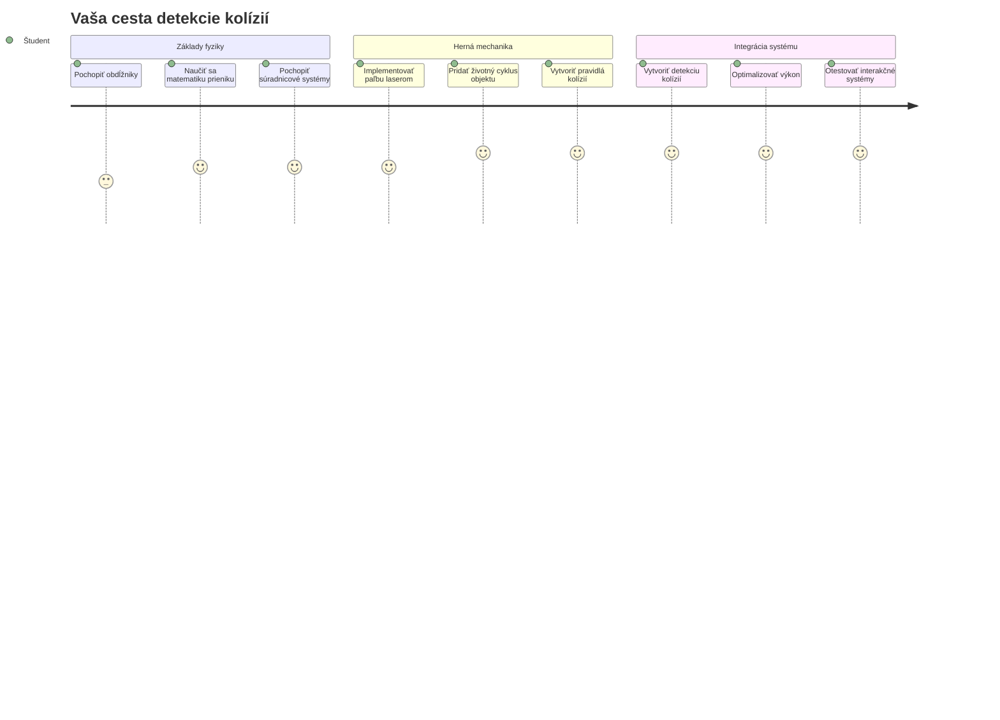
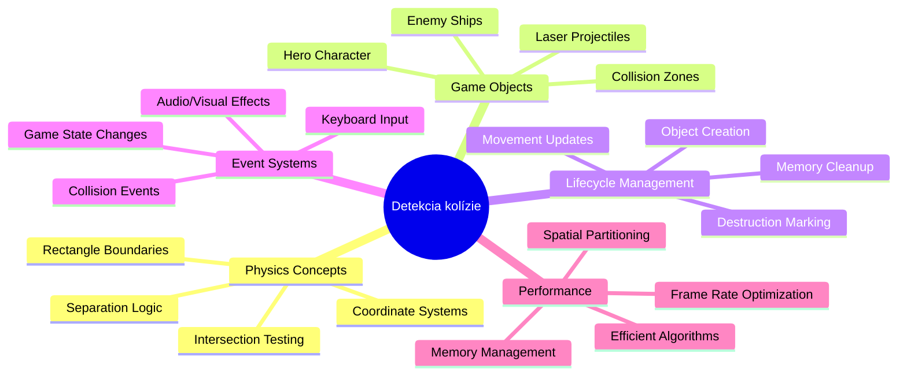
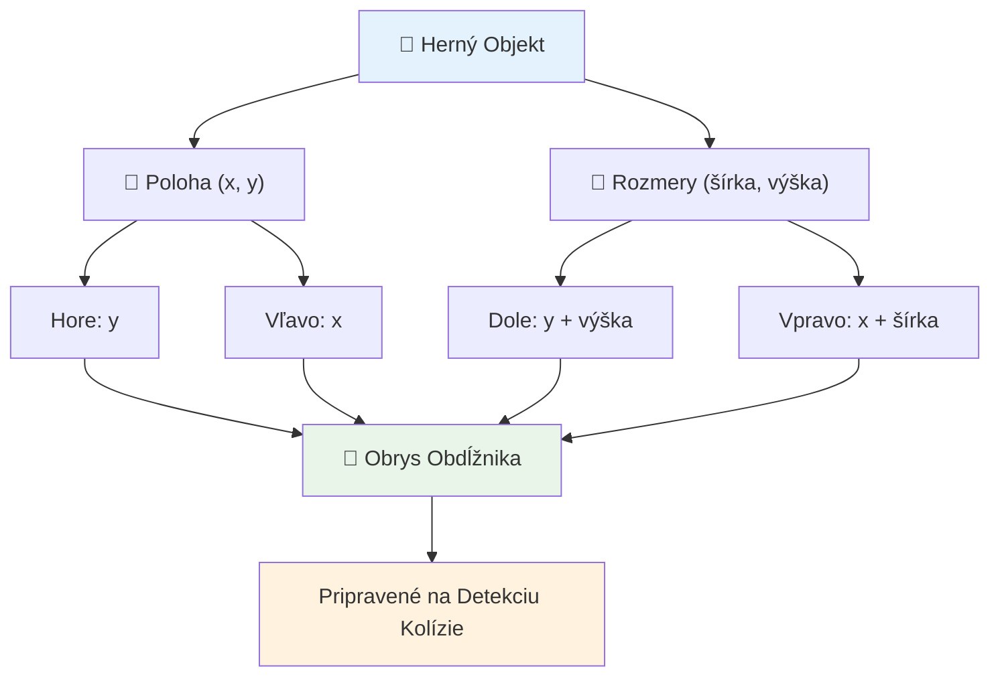
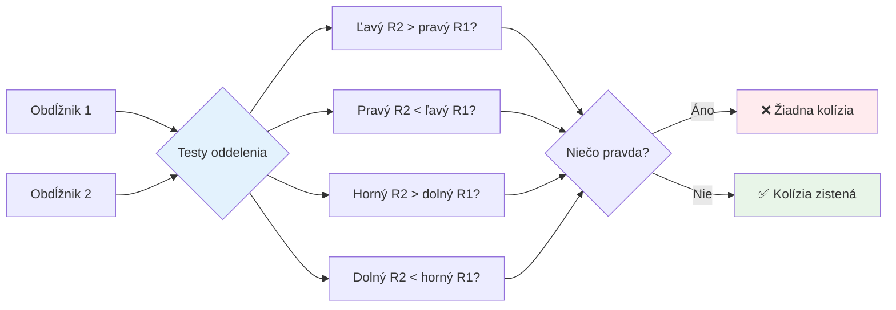
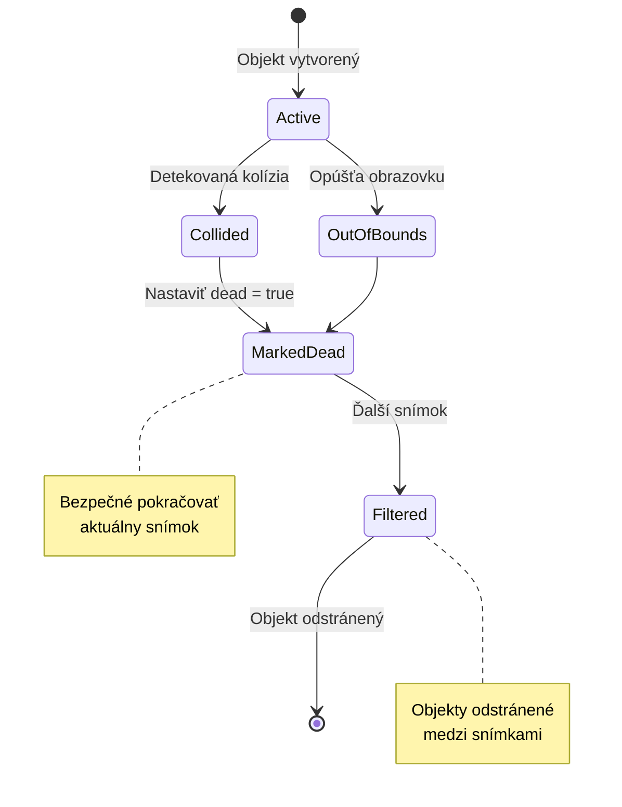
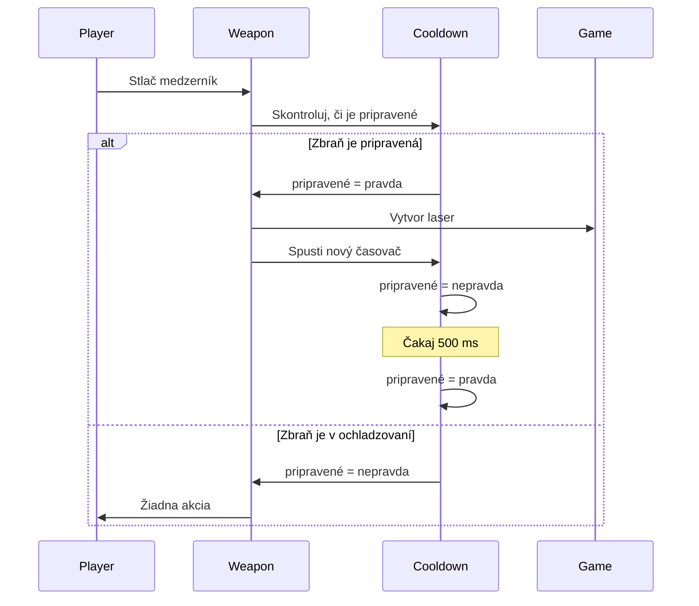
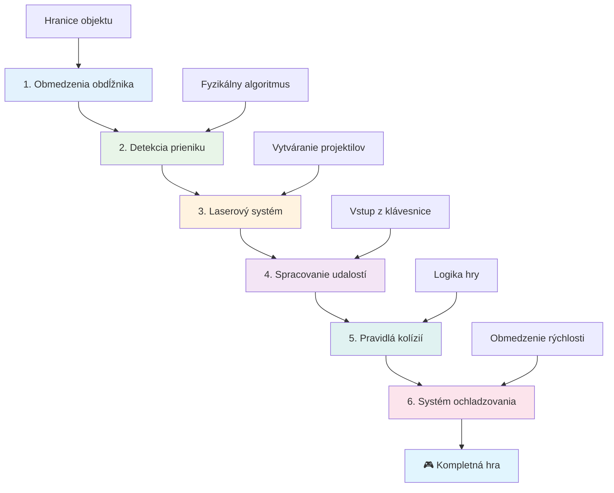
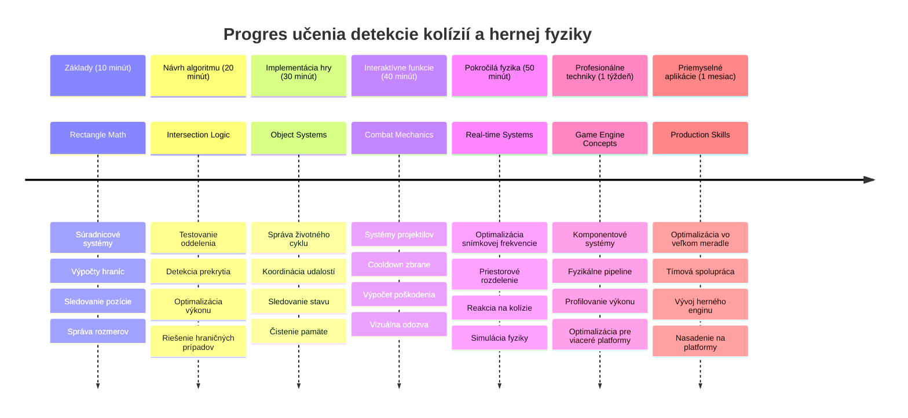

<!--
CO_OP_TRANSLATOR_METADATA:
{
  "original_hash": "039b4d8ce65f5edd82cf48d9c3e6728c",
  "translation_date": "2026-01-07T04:38:38+00:00",
  "source_file": "6-space-game/4-collision-detection/README.md",
  "language_code": "sk"
}
-->
# Vytvorte vesmírnu hru Časť 4: Pridanie lasera a detekcia kolízií


## Kvíz pred prednáškou

[Kvíz pred prednáškou](https://ff-quizzes.netlify.app/web/quiz/35)

Premyslite si moment zo Star Wars, keď Lukeove protónové torpéda zasiahli výfukový port Hviezdy smrti. Táto presná detekcia kolízie zmenila osud galaxie! V hrách funguje detekcia kolízií rovnako - určuje, kedy objekty interagujú a čo sa stane ďalej.

V tejto lekcii pridáte laserové zbrane do svojej vesmírnej hry a implementujete detekciu kolízií. Rovnako ako plánovači misií NASA počítajú dráhy kozmických lodí na vyhýbanie sa úlomkom, naučíte sa detegovať, kedy sa herné objekty pretínajú. Rozdelíme si to na zvládnuteľné kroky, ktoré na seba nadväzujú.

Na konci budete mať funkčný bojový systém, kde lasery ničia nepriateľov a kolízie spúšťajú herné udalosti. Tie isté princípy kolízií sa používajú od fyzikálnych simulácií po interaktívne webové rozhrania.


✅ Urobte si malý prieskum o úplne prvej počítačovej hre kedy napísanej. Aká bola jej funkčnosť?

## Detekcia kolízií

Detekcia kolízií funguje ako senzory blízkosti na lunárnom module Apollo - neustále kontrolujú vzdialenosti a spúšťajú varovania, keď sú objekty príliš blízko. V hrách tento systém určuje, kedy objekty interagujú a čo by sa malo stať ďalej.

Prístup, ktorý použijeme, považuje každý herný objekt za obdĺžnik, podobne ako systémy riadenia letovej prevádzky používajú zjednodušené geometrické tvary na sledovanie lietadiel. Táto obdĺžniková metóda môže vyzerať jednoducho, ale je výpočtovo efektívna a funguje dobre pre väčšinu herných scénárov.

### Reprezentácia obdĺžnika

Každý herný objekt potrebuje súradnicové hranice, podobne ako rover Mars Pathfinder mapoval svoju polohu na povrchu Marsu. Takto definujeme tieto hranice:


```javascript
rectFromGameObject() {
  return {
    top: this.y,
    left: this.x,
    bottom: this.y + this.height,
    right: this.x + this.width
  }
}
```

**Rozoberme si to:**
- **Horný okraj**: To je presne miesto, kde váš objekt začína vertikálne (jeho y pozícia)
- **Ľavý okraj**: Kde začína horizontálne (jeho x pozícia)
- **Dolný okraj**: Pridajte výšku k y pozícii – teraz viete, kde končí!
- **Pravý okraj**: Pridajte šírku k x pozícii – a máte kompletné hranice

### Algoritmus prieniku

Detekcia prieniku obdĺžnikov používa logiku podobnú tomu, ako Hubblov vesmírny teleskop zisťuje, či sa nebeské objekty prekrývajú vo svojom zornom poli. Algoritmus kontroluje separáciu:


```javascript
function intersectRect(r1, r2) {
  return !(r2.left > r1.right ||
    r2.right < r1.left ||
    r2.top > r1.bottom ||
    r2.bottom < r1.top);
}
```

**Test separácie funguje ako radarové systémy:**
- Je obdĺžnik 2 úplne napravo od obdĺžnika 1?
- Je obdĺžnik 2 úplne naľavo od obdĺžnika 1?
- Je obdĺžnik 2 úplne pod obdĺžnikom 1?
- Je obdĺžnik 2 úplne nad obdĺžnikom 1?

Ak žiadna z týchto podmienok nie je pravdivá, obdĺžniky sa musia prekrývať. Tento prístup odráža spôsob, akým radaroví operátori určujú, či sú dve lietadlá v bezpečných vzdialenostiach.

## Správa životného cyklu objektov

Keď laser zasiahne nepriateľa, oba objekty musia byť z hry odstránené. Avšak mazať objekty počas slučky môže spôsobiť pády – lekcia naučená tvrdo v raných počítačových systémoch ako Apollo Guidance Computer. Namiesto toho používame prístup „označiť na vymazanie“, ktorý bezpečne odstráni objekty medzi snímkami.


Takto označíme niečo na odstránenie:

```javascript
// Označiť objekt na odstránenie
enemy.dead = true;
```

**Prečo tento prístup funguje:**
- Označíme objekt ako „mŕtvy“, ale hneď ho nemažeme
- Toto umožní bezpečný dokončenie aktuálneho herného rámca
- Žiadne pády z pokusu použiť niečo, čo už neexistuje!

Potom pred ďalším vykresľovacím cyklom odfiltrujeme označené objekty:

```javascript
gameObjects = gameObjects.filter(go => !go.dead);
```

**Toto filtrovanie robí:**
- Vytvorí nový zoznam iba so „živými“ objektmi
- Vyhodí všetko označené ako mŕtve
- Udržiava plynulý chod hry
- Zabraňuje hromadeniu zničených objektov a zbytočnému využívaniu pamäte

## Implementácia mechaniky lasera

Laserové projektily v hrách fungujú na rovnakom princípe ako fotónové torpéda v Star Treku – sú to samostatné objekty, ktoré sa pohybujú po priamych líniách, kým niečo nezasiahnu. Každé stlačenie medzerníka vytvorí nový laserový objekt, ktorý sa pohybuje cez obrazovku.

Aby to fungovalo, potrebujeme koordinovať niekoľko rôznych častí:

**Kľúčové komponenty na implementáciu:**
- **Vytvoriť** laserové objekty, ktoré sa vyskytujú na pozícii hrdinu
- **Spracovať** vstup z klávesnice na spustenie vytvorenia lasera
- **Spravovať** pohyb lasera a jeho životný cyklus
- **Implementovať** vizuálne zobrazenie laserových projektilov

## Implementácia kontroly rýchlosti streľby

Neobmedzená rýchlosť streľby by preťažila herný engine a spravila by hru príliš jednoduchou. Skutočné zbrane čelia podobným obmedzeniam – dokonca aj fázery USS Enterprise potrebovali čas na dobitie medzi výstrelmi.

Implementujeme systém chladenia, ktorý zabráni spamovaniu rýchlej streľby a zároveň udržuje citlivé ovládanie:


```javascript
class Cooldown {
  constructor(time) {
    this.cool = false;
    setTimeout(() => {
      this.cool = true;
    }, time);
  }
}

class Weapon {
  constructor() {
    this.cooldown = null;
  }
  
  fire() {
    if (!this.cooldown || this.cooldown.cool) {
      // Vytvorte laserový projektil
      this.cooldown = new Cooldown(500);
    } else {
      // Zbraň sa stále ochladzuje
    }
  }
}
```

**Ako chladenie funguje:**
- Keď je zbraň vytvorená, začína ako „horúca“ (ešte nemôže strieľať)
- Po uplynutí časového limitu sa stane „studenou“ (pripravená strieľať)
- Pred streľbou overíme: „Je zbraň studená?“
- Toto zabraňuje spamovaniu kliknutí a zároveň zachováva rýchlu odozvu

✅ Odporúčame si pripomenúť lekciu 1 zo série vesmírnych hier o cooldownoch.

## Vytvorenie systému detekcie kolízií

Rozšírte svoj existujúci kód vesmírnej hry o systém detekcie kolízií. Rovnako ako Medzinárodná vesmírna stanica má automatizovaný systém vyhýbania sa kolíziám, vaša hra bude neustále sledovať polohy objektov a reagovať na ich prieniky.

Na základe kódu z predchádzajúcej lekcie pridáte detekciu kolízií so špecifickými pravidlami riadiacimi interakcie objektov.

> 💡 **Profesionálny tip**: Sprite lasera už máte v zložke s aktívami a je odkazovaný vo vašom kóde, pripravený na použitie.

### Pravidlá kolízií na implementáciu

**Pridajte tieto herné mechaniky:**
1. **Laser zasiahne nepriateľa**: Objekt nepriateľa je zničený, keď ho zasiahne laserový projektil.
2. **Laser zasiahne hranicu obrazovky**: Laser sa odstráni, keď dosiahne horný okraj obrazovky.
3. **Kolízia nepriateľa a hrdinu**: Obe objekty sú zničené, keď sa pretínajú.
4. **Nepriateľ dosiahne spodok**: Stav „koniec hry“, keď nepriatelia dosiahnu spodok obrazovky.

### 🔄 **Pedagogická kontrola**
**Základy detekcie kolízií:** Pred implementáciou si overte:
- ✅ Ako hranice obdĺžnika definujú kolízne zóny
- ✅ Prečo je test separácie efektívnejší než výpočet prieniku
- ✅ Význam správy životného cyklu objektov v herných slučkách
- ✅ Ako systém riadený udalosťami koordinuje odpovede na kolízie

**Rýchly samo-test:** Čo by sa stalo, ak by ste objekty vymazali hneď namiesto ich označenia?
*Odpoveď: Vymazanie počas slučky by mohlo spôsobiť pády alebo preskočenie objektov v iterácii.*

**Pochopenie fyziky:** Teraz ovládate:
- **Súradnicové systémy:** Ako poloha a rozmery vytvárajú hranice
- **Logiku prieniku:** Matematické princípy detekcie kolízií
- **Optimalizáciu výkonu:** Prečo sú efektívne algoritmy dôležité v reálnom čase
- **Správu pamäte:** Bezpečné vzory životného cyklu objektov pre stabilitu

## Nastavenie vývojového prostredia

Dobré správy – veľkú časť prípravy sme už urobili za vás! Všetky herné aktíva a základná štruktúra čakajú v podadresári `your-work`, pripravené na pridanie skvelých funkcií detekcie kolízií.

### Štruktúra projektu

```bash
-| assets
  -| enemyShip.png
  -| player.png
  -| laserRed.png
-| index.html
-| app.js
-| package.json
```

**Pochopenie štruktúry súborov:**
- **Obsahuje** všetky obrázky sprite potrebné pre herné objekty
- **Zahŕňa** hlavný HTML dokument a súbor JavaScript aplikácie
- **Poskytuje** konfiguráciu balíka pre lokálny vývojový server

### Spustenie vývojového servera

Prejdite do svojho projektu a spustite lokálny server:

```bash
cd your-work
npm start
```

**Tento príkaz:**
- **Zmení** adresár do vášho pracovného projektu
- **Spustí** lokálny HTTP server na `http://localhost:5000`
- **Poskytuje** vaše herné súbory na testovanie a vývoj
- **Umožňuje** živý vývoj s automatickým reloadom

Otvorte si prehliadač a navštívte `http://localhost:5000`, aby ste videli aktuálny stav hry s hrdinom a nepriateľmi na obrazovke.

### Implementácia krok za krokom

Rovnako systémovo, ako NASA programovala kozmickú loď Voyager, implementujeme detekciu kolízií metodicky, krok za krokom.


#### 1. Pridajte hranice obdĺžnika pre kolízie

Najprv naučíme herné objekty opisovať svoje hranice. Pridajte túto metódu do svojej triedy `GameObject`:

```javascript
rectFromGameObject() {
    return {
      top: this.y,
      left: this.x,
      bottom: this.y + this.height,
      right: this.x + this.width,
    };
  }
```

**Táto metóda dosahuje:**
- **Vytvorí** obdĺžnikový objekt s presnými hranicami
- **Spočíta** spodný a pravý okraj pomocou pozície a rozmerov
- **Vracia** objekt pripravený pre algoritmy detekcie kolízií
- **Poskytuje** štandardné rozhranie pre všetky herné objekty

#### 2. Implementujte detekciu prieniku

Teraz vytvorme detektíva kolízií – funkciu, ktorá zistí, kedy sa dva obdĺžniky prekrývajú:

```javascript
function intersectRect(r1, r2) {
  return !(
    r2.left > r1.right ||
    r2.right < r1.left ||
    r2.top > r1.bottom ||
    r2.bottom < r1.top
  );
}
```

**Tento algoritmus funguje tak, že:**
- **Testuje** štyri podmienky separácie medzi obdĺžnikmi
- **Vracia** `false`, ak je splnená niektorá podmienka separácie
- **Indikuje** kolíziu, keď neexistuje separácia
- **Používa** negáciu pre efektívne testovanie prieniku

#### 3. Implementujte systém streľby laserom

Tu začína zábava! Nastavme systém laserovej streľby.

##### Konštanty správ

Najprv definujme niektoré typy správ, aby si rôzne časti hry mohli medzi sebou rozprávať:

```javascript
KEY_EVENT_SPACE: "KEY_EVENT_SPACE",
COLLISION_ENEMY_LASER: "COLLISION_ENEMY_LASER",
COLLISION_ENEMY_HERO: "COLLISION_ENEMY_HERO",
```

**Tieto konštanty zabezpečujú:**
- **Štandardizujú** názvy udalostí v celej aplikácii
- **Umožňujú** konzistentnú komunikáciu medzi hernými systémami
- **Zabraňujú** preklepom pri registrácii udalostných handlerov

##### Spracovanie vstupu z klávesnice

Pridajte detekciu stlačenia medzerníka do svojho poslucháča udalostí klávesov:

```javascript
} else if(evt.keyCode === 32) {
  eventEmitter.emit(Messages.KEY_EVENT_SPACE);
}
```

**Tento vstupný handler:**
- **Detekuje** stlačenia medzerníka pomocou keyCode 32
- **Vysiela** štandardizovanú správu udalosti
- **Umožňuje** oddelenú logiku streľby

##### Nastavenie poslucháča udalostí

Zaregistrujte správanie streľby vo funkcii `initGame()`:

```javascript
eventEmitter.on(Messages.KEY_EVENT_SPACE, () => {
 if (hero.canFire()) {
   hero.fire();
 }
});
```

**Tento event listener:**
- **Reaguje** na udalosti stlačenia medzerníka
- **Kontroluje** stav cooldownu pri streľbe
- **Spúšťa** vytvorenie lasera, keď je to povolené

Pridajte spracovanie kolízie pre interakcie laser-nepriateľ:

```javascript
eventEmitter.on(Messages.COLLISION_ENEMY_LASER, (_, { first, second }) => {
  first.dead = true;
  second.dead = true;
});
```

**Tento handler kolízie:**
- **Prijíma** dáta o kolízii s oboma objekty
- **Označí** oba objekty na odstránenie
- **Zabezpečí** správne vyčistenie po kolízii

#### 4. Vytvorte triedu Laser

Implementujte laserový projektil, ktorý sa pohybuje nahor a spravuje svoj vlastný životný cyklus:

```javascript
class Laser extends GameObject {
  constructor(x, y) {
    super(x, y);
    this.width = 9;
    this.height = 33;
    this.type = 'Laser';
    this.img = laserImg;
    
    let id = setInterval(() => {
      if (this.y > 0) {
        this.y -= 15;
      } else {
        this.dead = true;
        clearInterval(id);
      }
    }, 100);
  }
}
```

**Táto implementácia triedy:**
- **Rozširuje** GameObject pre dedenie základnej funkcionality
- **Nastavuje** vhodné rozmery pre sprite lasera
- **Vytvára** automatický pohyb nahor pomocou `setInterval()`
- **Spravuje** samodeštrukciu po dosiahnutí horného okraja obrazovky
- **Riadi** svoju animáciu a vyčistenie

#### 5. Implementujte systém detekcie kolízií

Vytvorte komplexnú funkciu detekcie kolízií:

```javascript
function updateGameObjects() {
  const enemies = gameObjects.filter(go => go.type === 'Enemy');
  const lasers = gameObjects.filter(go => go.type === "Laser");
  
  // Testovanie kolízií laser-hráč
  lasers.forEach((laser) => {
    enemies.forEach((enemy) => {
      if (intersectRect(laser.rectFromGameObject(), enemy.rectFromGameObject())) {
        eventEmitter.emit(Messages.COLLISION_ENEMY_LASER, {
          first: laser,
          second: enemy,
        });
      }
    });
  });

  // Odstrániť zničené objekty
  gameObjects = gameObjects.filter(go => !go.dead);
}
```

**Tento systém kolízií:**
- **Filtruje** herné objekty podľa typu pre efektívne testovanie
- **Testuje** každý laser voči každému nepriateľovi na prieniky
- **Vysiela** udalosti kolízie, keď sa detekujú prieniky
- **Čistí** zničené objekty po spracovaní kolízií

> ⚠️ **Dôležité**: Pridajte `updateGameObjects()` do hlavnej hernej slučky v `window.onload` na povolenie detekcie kolízií.

#### 6. Pridajte cooldown systém do triedy Hero

Vylepšite triedu Hero o mechaniku streľby a obmedzenie rýchlosti:

```javascript
class Hero extends GameObject {
  constructor(x, y) {
    super(x, y);
    this.width = 99;
    this.height = 75;
    this.type = "Hero";
    this.speed = { x: 0, y: 0 };
    this.cooldown = 0;
  }
  
  fire() {
    gameObjects.push(new Laser(this.x + 45, this.y - 10));
    this.cooldown = 500;

    let id = setInterval(() => {
      if (this.cooldown > 0) {
        this.cooldown -= 100;
      } else {
        clearInterval(id);
      }
    }, 200);
  }
  
  canFire() {
    return this.cooldown === 0;
  }
}
```

**Pochopenie vylepšenej triedy Hero:**
- **Inicializuje** cooldown časovač na nulu (pripravený na streľbu)
- **Vytvára** laserové objekty umiestnené nad loďou hrdinu
- **Nastavuje** čas cooldownu na zabránenie rýchlej streľbe
- **Znižuje** cooldown časovač pomocou intervalového updatu
- **Poskytuje** kontrolu stavu streľby cez metódu `canFire()`

### 🔄 **Pedagogická kontrola**
**Kompletné pochopenie systému**: Overte si majstrovstvo v systéme kolízií:
- ✅ Ako hranice obdĺžnika umožňujú efektívnu detekciu kolízií?
- ✅ Prečo je správa životného cyklu objektov kľúčová pre stabilitu hry?
- ✅ Ako systém cooldownu zabraňuje problémom s výkonom?
- ✅ Akú úlohu zohráva architektúra riadená udalosťami v spracovaní kolízií?

**Integrácia systému**: Vaša detekcia kolízií ukazuje:
- **Matematickú presnosť:** Algoritmy prieniku obdĺžnikov
- **Optimalizáciu výkonu:** Efektívne vzory testovania kolízií
- **Správu pamäte:** Bezpečné vytváranie a ničenie objektov
- **Koordináciu udalostí:** Oddelenú komunikáciu systémov
- **Spracovanie v reálnom čase:** Aktualizácie podľa snímok

**Profesionálne vzory**: Implementovali ste:
- **Oddelenie záujmov:** Fyzika, vykresľovanie a vstup oddelené
- **Objektovo-orientovaný dizajn:** Dedenie a polymorfizmus
- **Správu stavu:** Životný cyklus objektov a sledovanie stavu hry
- **Optimalizáciu výkonu:** Efektívne algoritmy pre použitie v reálnom čase

### Testovanie vašej implementácie

Vaša vesmírna hra teraz obsahuje kompletný systém detekcie kolízií a bojovú mechaniku. 🚀 Otestujte tieto nové schopnosti:
- **Pohybujte sa** pomocou šípok pre kontrolu ovládania pohybu
- **Strieľajte lasermi** medzerníkom – všimnite si, ako cooldown zabraňuje spamovaniu
- **Sledujte kolízie**, keď lasery zasiahnu nepriateľov a spustia odstránenie
- **Overte vyčistenie**, keď zničené objekty zmiznú z hry

Úspešne ste implementovali systém detekcie kolízií používajúci tie isté matematické princípy, ktoré riadia navigáciu kozmických lodí a robotiku.

### ⚡ **Čo môžete spraviť v nasledujúcich 5 minútach**
- [ ] Otvorte DevTools v prehliadači a nastavte breakpointy vo funkcii detekcie kolízií
- [ ] Vyskúšajte meniť rýchlosť lasera alebo pohyb nepriateľov a sledujte efekty kolízií
- [ ] Experimentujte s rôznymi hodnotami cooldownu na testovanie rýchlosti streľby
- [ ] Pridajte príkazy `console.log` na sledovanie kolíznych udalostí v reálnom čase

### 🎯 **Čo môžete dosiahnuť počas tejto hodiny**
- [ ] Dokončiť kvíz po lekcii a porozumieť algoritmom detekcie kolízií
- [ ] Pridať vizuálne efekty ako výbuchy pri vzniku kolízií
- [ ] Implementovať rôzne typy projektilov s rôznymi vlastnosťami
- [ ] Vytvoriť power-upy, ktoré dočasne zlepšia schopnosti hráča
- [ ] Pridať zvukové efekty, aby boli kolízie príjemnejšie

### 📅 **Váš týždeň programovania fyziky**
- [ ] Dokončiť kompletnú vesmírnu hru s vyladenými systémami kolízií
- [ ] Implementovať pokročilé tvary kolízií okrem obdĺžnikov (kruhy, polygóny)
- [ ] Pridať systémy častíc pre realistické efekty výbuchov
- [ ] Vytvoriť komplexné správanie nepriateľov s vyhýbaním sa kolíziám
- [ ] Optimalizovať detekciu kolízií pre lepší výkon pri mnohých objektoch
- [ ] Pridať fyzikálnu simuláciu ako hybnosť a realistický pohyb

### 🌟 **Mesiac zvládania hernej fyziky**
- [ ] Postaviť hry s pokročilými fyzikálnymi enginmi a realistickými simuláciami
- [ ] Naučiť sa 3D detekciu kolízií a algoritmy priestorového delenia
- [ ] Prispievať do open source knižníc fyziky a herných enginov
- [ ] Ovládnuť optimalizáciu výkonu pre graficky náročné aplikácie
- [ ] Vytvárať vzdelávací obsah o hernej fyzike a detekcii kolízií
- [ ] Vybudovať portfólio prezentujúce pokročilé programovacie zručnosti vo fyzike

## 🎯 Časová os vašej dokonalosti v detekcii kolízií


### 🛠️ Zhrnutie vášho balíka nástrojov hernej fyziky

Po dokončení tejto lekcie zvládate:
- **Matematiku kolízií**: Algoritmy prieniku obdĺžnikov a súradnicové systémy
- **Optimalizáciu výkonu**: Efektívna detekcia kolízií pre aplikácie v reálnom čase
- **Správu životného cyklu objektov**: Bezpečné vytváranie, aktualizáciu a ničenie vzoriek
- **Udalostne riadenú architektúru**: Oddelené systémy pre reakciu na kolízie
- **Integráciu hernej slučky**: Aktualizácie fyziky v snímkach a koordinácia renderovania
- **Systémy vstupu**: Reaktívne ovládanie s obmedzením rýchlosti a spätnou väzbou
- **Správu pamäte**: Efektívne poolovanie objektov a stratégie čistenia

**Aplikácie v reálnom svete**: Vaše schopnosti detekcie kolízií sa priamo uplatnia v:
- **Interaktívnych simuláciách**: Vedecké modelovanie a vzdelávacie nástroje
- **Návrhu užívateľského rozhrania**: Drag-and-drop interakcie a detekcia dotykov
- **Vizualizácii dát**: Interaktívne grafy a klikateľné prvky
- **Mobilnom vývoji**: Rozpoznávanie dotykových gest a spracovanie kolízií
- **Programovaní robotiky**: Plánovanie trás a vyhýbanie sa prekážkam
- **Počítačovej grafike**: Ray tracing a priestorové algoritmy

**Získané profesionálne zručnosti**: Teraz môžete:
- **Navrhovať** efektívne algoritmy pre detekciu kolízií v reálnom čase
- **Implementovať** fyzikálne systémy škálovateľné s komplexnosťou objektov
- **Ladiť** zložité interakčné systémy pomocou matematických princípov
- **Optimalizovať** výkon pre rôzne hardvérové a prehliadačové možnosti
- **Navrhovať** udržateľné herné systémy s overenými vzormi

**Osvojené koncepty vývoja hier**:
- **Simulácia fyziky**: Detekcia kolízií a reakcie v reálnom čase
- **Výkonnostné inžinierstvo**: Optimalizované algoritmy pre interaktívne aplikácie
- **Udalostné systémy**: Oddelená komunikácia medzi komponentmi hry
- **Správa objektov**: Efektívne vzory životného cyklu pre dynamický obsah
- **Spracovanie vstupu**: Reaktívne ovládanie s primeranou spätnou väzbou

**Ďalšia úroveň**: Ste pripravení preskúmať pokročilé fyzikálne enginy ako Matter.js, implementovať 3D detekciu kolízií alebo stavať komplexné systémy častíc!

🌟 **Úspech odomknutý**: Vytvorili ste kompletný systém fyzikálnej interakcie s profesionálnou detekciou kolízií!

## Výzva GitHub Copilot Agenta 🚀

Použite režim Agenta a dokončite nasledujúcu úlohu:

**Popis:** Vylepšite systém detekcie kolízií implementáciou power-upov, ktoré sa náhodne generujú a poskytujú dočasné schopnosti, keď ich zoberie hrdina lode.

**Úloha:** Vytvorte triedu PowerUp, ktorá rozširuje GameObject, a implementujte detekciu kolízie medzi hrdinom a power-upmi. Pridajte aspoň dva typy power-upov: jeden, ktorý zvyšuje rýchlosť streľby (znižuje čas obnovy) a druhý, ktorý vytvára dočasný štít. Zahrňte logiku náhodného generovania power-upov v náhodných intervaloch a pozíciách.

---


## 🚀 Výzva

Pridajte výbuch! Pozrite sa na herné grafiky v [Space Art repozitári](../../../../6-space-game/solution/spaceArt/readme.txt) a skúste pridať výbuch, keď laser zasiahne mimozemšťana

## Kvíz po prednáške

[Kvíz po prednáške](https://ff-quizzes.netlify.app/web/quiz/36)

## Prehľad a samostatné štúdium

Experimentujte s intervalmi vo vašej hre doteraz. Čo sa stane, keď ich zmeníte? Prečítajte si viac o [JavaScript časovacích udalostiach](https://www.freecodecamp.org/news/javascript-timing-events-settimeout-and-setinterval/).

## Zadanie

[Preskúmajte kolízie](assignment.md)

---

<!-- CO-OP TRANSLATOR DISCLAIMER START -->
**Upozornenie**:  
Tento dokument bol preložený pomocou automatizovanej prekladateľskej služby AI [Co-op Translator](https://github.com/Azure/co-op-translator). Aj keď sa snažíme o presnosť, vezmite prosím na vedomie, že automatizované preklady môžu obsahovať chyby alebo nepresnosti. Originálny dokument v jeho pôvodnom jazyku by mal byť považovaný za autoritatívny zdroj. Pre dôležité informácie sa odporúča odborný preklad človekom. Nie sme zodpovední za akékoľvek nedorozumenia alebo nesprávne výklady vyplývajúce z použitia tohto prekladu.
<!-- CO-OP TRANSLATOR DISCLAIMER END -->