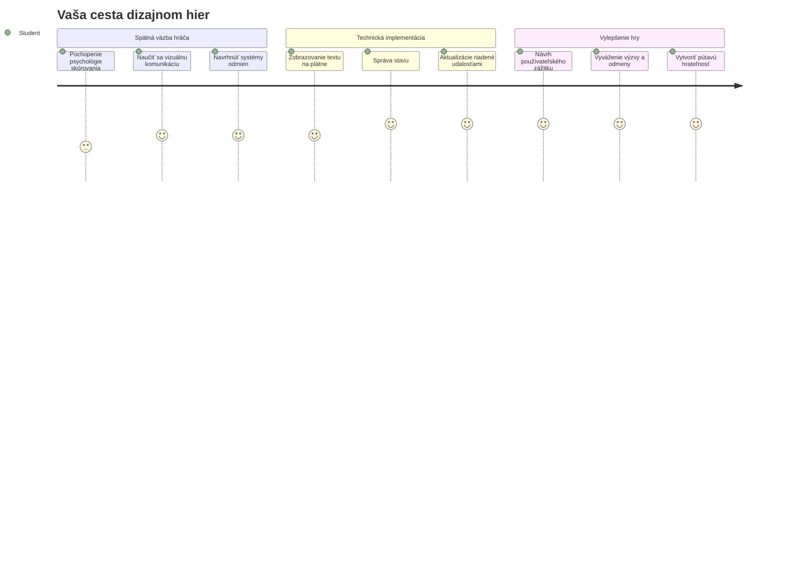
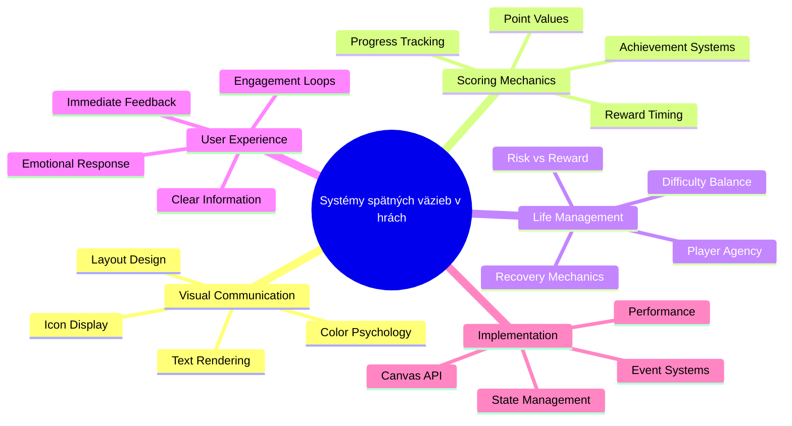
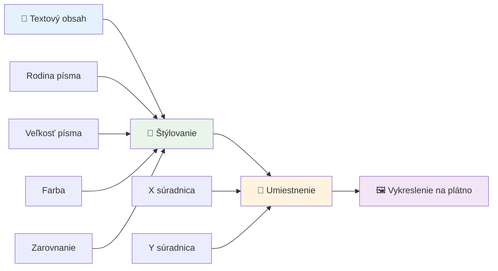
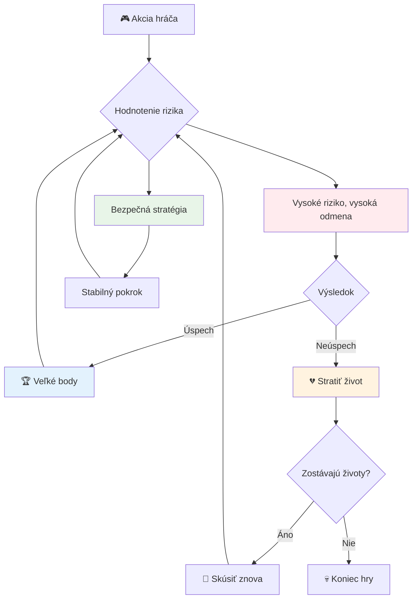
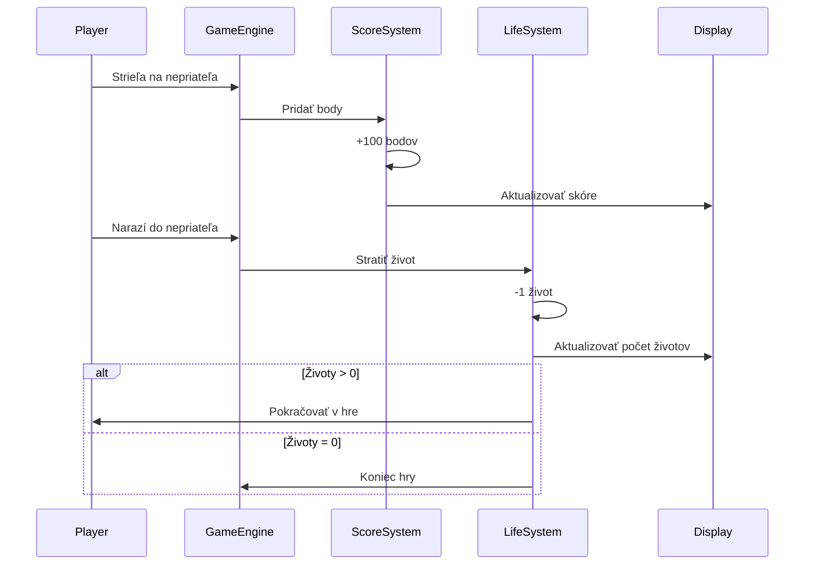
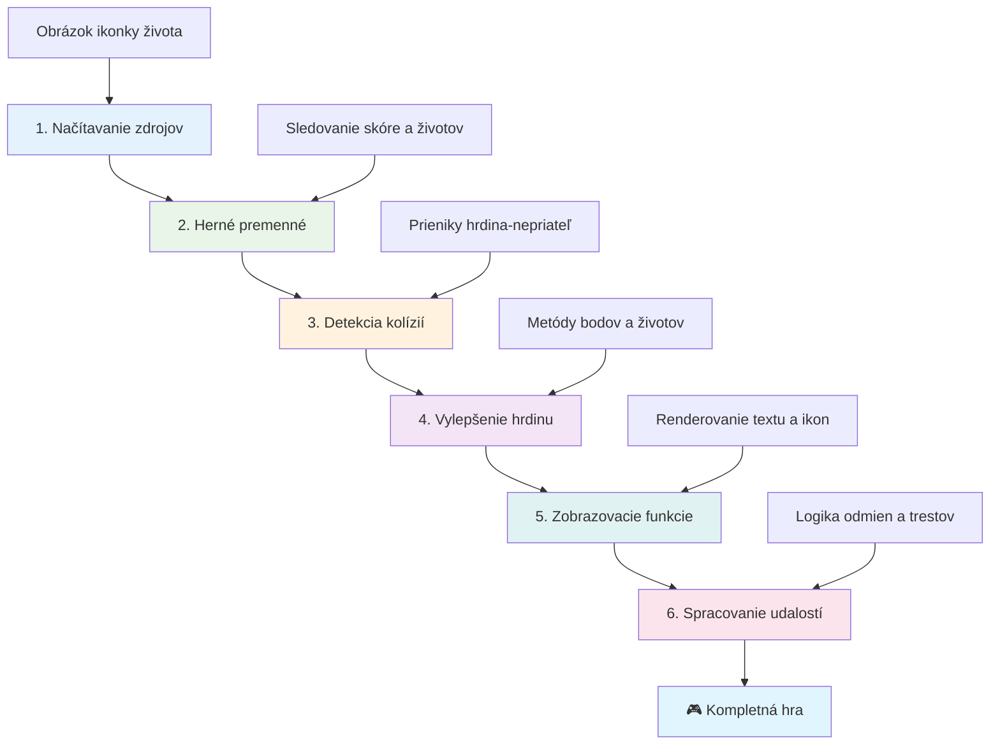
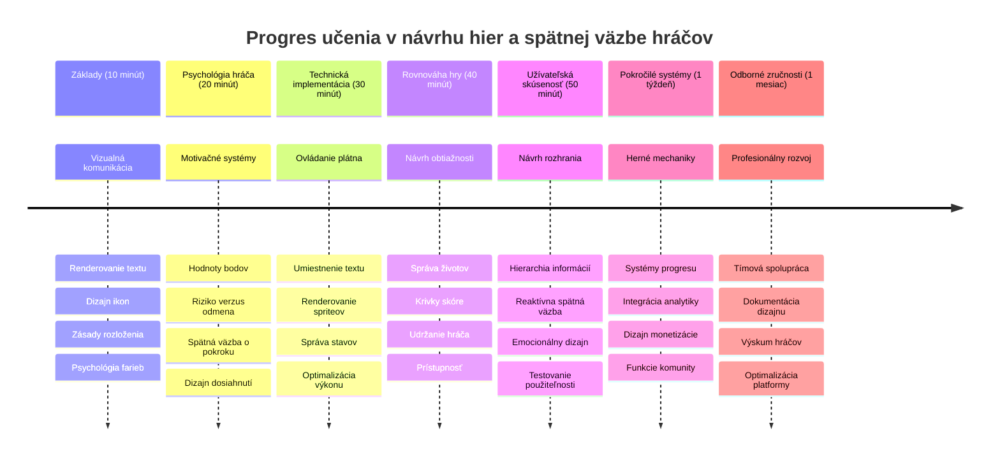

<!--
CO_OP_TRANSLATOR_METADATA:
{
  "original_hash": "2ed9145a16cf576faa2a973dff84d099",
  "translation_date": "2026-01-07T04:43:57+00:00",
  "source_file": "6-space-game/5-keeping-score/README.md",
  "language_code": "sk"
}
-->
# Build a Space Game Part 5: Scoring and Lives


## Pre-Lecture Quiz

[Pre-lecture quiz](https://ff-quizzes.netlify.app/web/quiz/37)

Pripravení spraviť svoju vesmírnu hru skutočnou hrou? Pridajme skórovanie a správu životov - základné mechaniky, ktoré premenili rané arkádové hry ako Space Invaders z jednoduchých ukážok na návykovú zábavu. Tu sa tvoja hra stáva naozaj hrateľnou.


## Drawing Text on Screen - Your Game's Voice

Aby sme zobrazili tvoje skóre, musíme sa naučiť, ako vykresľovať text na plátno. Metóda `fillText()` je tvojou hlavnou pomôckou na to - je to rovnaká technika, akú používali klasické arkádové hry na zobrazovanie skóre a stavových informácií.


Máš úplnú kontrolu nad vzhľadom textu:

```javascript
ctx.font = "30px Arial";
ctx.fillStyle = "red";
ctx.textAlign = "right";
ctx.fillText("show this on the screen", 0, 0);
```

✅ Ponor sa hlbšie do [pridávania textu na plátno](https://developer.mozilla.org/docs/Web/API/Canvas_API/Tutorial/Drawing_text) - môžeš byť prekvapený, nakoľko kreatívny môžeš byť s fontmi a štýlmi!

## Lives - More Than Just a Number

V hernom dizajne predstavuje "život" hráčovu rezervu pre chyby. Tento koncept pochádza z pinballových automatov, kde si mal k dispozícii viac loptičiek. V raných videohrach ako Asteroids dávali životy hráčom možnosť riskovať a učiť sa z chýb.


Vizualizácia je veľmi dôležitá - zobrazovanie ikon lodí namiesto len "Lives: 3" vytvára okamžitú vizuálnu rozpoznateľnosť, podobne ako rané arkádové automaty používali ikonografiu na komunikáciu cez jazykové bariéry.

## Building Your Game's Reward System

Teraz implementujeme základné spätné väzby, ktoré udržia hráčov zaujatých:


- **Systém bodovania**: Každá zničená nepriateľská loď udeľuje 100 bodov (okrúhle čísla sa hráčom ľahšie počítajú v hlave). Skóre sa zobrazuje v ľavom dolnom rohu.
- **Počítadlo životov**: Tvoj hrdina začína s tromi životmi - štandard, ktorý stanovali rané arkádové hry pre rovnováhu výzvy a hrateľnosti. Každá kolízia s nepriateľom stojí jeden život. Zostávajúce životy zobrazíme v pravom dolnom rohu pomocou ikon lodí .

## Let's Get Building!

Najprv si nastav pracovné prostredie. Prejdi do súborov v podpriečinku `your-work`. Mal by si vidieť tieto súbory:

```bash
-| assets
  -| enemyShip.png
  -| player.png
  -| laserRed.png
-| index.html
-| app.js
-| package.json
```

Pre testovanie hry spusti vývojový server z priečinka `your_work`:

```bash
cd your-work
npm start
```

To spustí lokálny server na adrese `http://localhost:5000`. Otvor túto adresu vo svojom prehliadači, aby si videl hru. Vyskúšaj ovládanie šípkami a streľbu na nepriateľov, aby si overil, že všetko funguje.


### Time to Code!

1. **Získaj potrebné vizuálne zdroje**. Skopíruj obrázok `life.png` zo zložky `solution/assets/` do tvojho `your-work` priečinka. Potom pridaj lifeImg do tvojej funkcie window.onload:

    ```javascript
    lifeImg = await loadTexture("assets/life.png");
    ```

1. Nezabudni pridať `lifeImg` do zoznamu zdrojov:

    ```javascript
    let heroImg,
    ...
    lifeImg,
    ...
    eventEmitter = new EventEmitter();
    ```
  
2. **Nastav herné premenné**. Pridaj kód na sledovanie celkového skóre (začína na 0) a zostávajúcich životov (začína na 3). Tieto hodnoty budeme zobrazovať na obrazovke, aby hráči vždy vedeli, kde stoja.

3. **Implementuj detekciu kolízií**. Rozšír svoju funkciu `updateGameObjects()`, aby zisťovala, kedy nepriatelia narazia na tvojho hrdinu:

    ```javascript
    enemies.forEach(enemy => {
        const heroRect = hero.rectFromGameObject();
        if (intersectRect(heroRect, enemy.rectFromGameObject())) {
          eventEmitter.emit(Messages.COLLISION_ENEMY_HERO, { enemy });
        }
      })
    ```

4. **Pridaj sledovanie životov a bodov do triedy Hero**.  
   1. **Inicializuj počítadlá**. Pod `this.cooldown = 0` v triede `Hero` nastav životy a body:

        ```javascript
        this.life = 3;
        this.points = 0;
        ```

   1. **Zobraz tieto hodnoty hráčovi**. Vytvor funkcie, ktoré vykreslia tieto hodnoty na obrazovku:

        ```javascript
        function drawLife() {
          // TODO, 35, 27
          const START_POS = canvas.width - 180;
          for(let i=0; i < hero.life; i++ ) {
            ctx.drawImage(
              lifeImg, 
              START_POS + (45 * (i+1) ), 
              canvas.height - 37);
          }
        }
        
        function drawPoints() {
          ctx.font = "30px Arial";
          ctx.fillStyle = "red";
          ctx.textAlign = "left";
          drawText("Points: " + hero.points, 10, canvas.height-20);
        }
        
        function drawText(message, x, y) {
          ctx.fillText(message, x, y);
        }

        ```

   1. **Zapoj všetko do herného cyklu**. Pridaj tieto funkcie do window.onload hneď po `updateGameObjects()`:

        ```javascript
        drawPoints();
        drawLife();
        ```

### 🔄 **Pedagogická kontrola**
**Pochopenie herného dizajnu**: Pred implementáciou dôsledkov sa uisti, že rozumieš:
- ✅ Ako vizuálna spätná väzba komunikuje stav hry hráčom
- ✅ Prečo konzistentné umiestnenie prvkov UI zlepšuje použiteľnosť
- ✅ Psychológia bodových hodnôt a správy životov
- ✅ Ako sa renderovanie textu na plátne líši od textu v HTML

**Rýchly sebakontrolný test**: Prečo arkádové hry zvyčajne používajú zaokrúhlené čísla pre bodové hodnoty?  
*Odpoveď: Zaokrúhlené čísla sa hráčom ľahšie počítajú v hlave a vytvárajú uspokojujúce psychologické odmeny*

**Zásady používateľského zážitku**: Práve aplikuješ:  
- **Vizuálnu hierarchiu**: Dôležité informácie sú prominentne umiestnené  
- **Okamžitú spätnú väzbu**: Aktualizácie v reálnom čase reagujú na hráčove akcie  
- **Kognitívne zaťaženie**: Jednoduché a jasné predstavenie informácií  
- **Emocionálny dizajn**: Ikony a farby, ktoré vytvárajú spojenie s hráčom

1. **Implementuj dôsledky a odmeny v hre**. Teraz pridáme spätné väzby, ktoré dávajú hráčovým akciám zmysel:

   1. **Kolízie stoja životy**. Kedykoľvek tvoj hrdina narazí do nepriateľa, stratíš jeden život.  
      
      Pridaj túto metódu do triedy `Hero`:

        ```javascript
        decrementLife() {
          this.life--;
          if (this.life === 0) {
            this.dead = true;
          }
        }
        ```

   2. **Strieľanie nepriateľov prináša body**. Každý úspešný zásah udeľuje 100 bodov, čo poskytuje okamžitú pozitívnu spätnú väzbu za presnú streľbu.

      Rozšír svoju triedu Hero touto metódou pre inkrementáciu bodov:  

        ```javascript
          incrementPoints() {
            this.points += 100;
          }
        ```

        Teraz prepoj tieto funkcie s udalosťami kolízie:  

        ```javascript
        eventEmitter.on(Messages.COLLISION_ENEMY_LASER, (_, { first, second }) => {
           first.dead = true;
           second.dead = true;
           hero.incrementPoints();
        })

        eventEmitter.on(Messages.COLLISION_ENEMY_HERO, (_, { enemy }) => {
           enemy.dead = true;
           hero.decrementLife();
        });
        ```

✅ Zaujíma ťa, aké ďalšie hry sú vyrobené pomocou JavaScriptu a Canvasu? Objavuj - možno ťa prekvapí, čo všetko je možné!

Po implementácii týchto funkcií otestuj hru, aby si videl kompletný systém spätnej väzby v akcii. V pravom dolnom rohu by si mal vidieť ikony životov, skóre v ľavom dolnom rohu, a sledovať, ako kolízie znižujú životy, zatiaľ čo úspešné zásahy zvyšujú skóre.

Tvoja hra má teraz kľúčové mechaniky, ktoré robili rané arkádové hry tak príťažlivými - jasné ciele, okamžitú spätnú väzbu a zmysluplné dôsledky hráčskych akcií.

### 🔄 **Pedagogická kontrola**
**Kompletný systém herného dizajnu**: Over svoje ovládanie systémov spätnej väzby:
- ✅ Ako mechanika bodovania vytvára motiváciu a zapojenie hráča?
- ✅ Prečo je vizuálna konzistencia dôležitá pre dizajn používateľského rozhrania?
- ✅ Ako systém životov vyvažuje výzvu a udržanie hráča?
- ✅ Akú úlohu hrá okamžitá spätná väzba pre uspokojivú hrateľnosť?

**Integrácia systému**: Tvoj systém spätnej väzby demonštruje:  
- **Dizajn používateľského zážitku**: Jasná vizuálna komunikácia a hierarchia informácií  
- **Event-Driven Architecture**: Reaktívne aktualizácie na hráčove akcie  
- **Správa stavu**: Sledovanie a zobrazovanie dynamických herných dát  
- **Majstrovstvo plátna**: Renderovanie textu a umiestnenie sprite-ov  
- **Herná psychológia**: Pochopenie motivácie a zapojenia hráča  

**Profesionálne vzory**: Implementoval si:  
- **MVC Architektúru**: Oddelenie hernej logiky, dát a prezentácie  
- **Observer Pattern**: Event-driven aktualizácie zmien herného stavu  
- **Komponentový dizajn**: Znovupoužiteľné funkcie pre vykresľovanie a logiku  
- **Optimalizáciu výkonu**: Efektívne vykresľovanie v herných cykloch  

### ⚡ **Čo môžeš urobiť v nasledujúcich 5 minútach**  
- [ ] Experimentuj s rôznymi veľkosťami a farbami fontu pre zobrazovanie skóre  
- [ ] Skús zmeniť hodnoty bodov a pozoruj, ako to ovplyvní pocit z hry  
- [ ] Pridaj príkazy console.log na sledovanie, kedy sa menia body a životy  
- [ ] Otestuj hraničné prípady ako vyčerpanie životov alebo dosiahnutie vysokého skóre  

### 🎯 **Čo môžeš dosiahnuť v tejto hodine**  
- [ ] Dokonči test po lekcii a pochop psychológiu herného dizajnu  
- [ ] Pridaj zvukové efekty pre skórovanie a stratu životov  
- [ ] Implementuj systém najvyššieho skóre používajúci localStorage  
- [ ] Vytvor rôzne hodnoty bodov pre rôzne typy nepriateľov  
- [ ] Pridaj vizuálne efekty, ako trasenie obrazovky pri strate života  

### 📅 **Tvoj týždenný herný dizajnérsky plán**  
- [ ] Dokonči kompletnú vesmírnu hru s vyspelými systémami spätnej väzby  
- [ ] Implementuj pokročilé mechaniky bodovania ako kombá a multiplikátory  
- [ ] Pridaj úspechy a odomykateľný obsah  
- [ ] Vytvor systémy postupnosti obtiažnosti a balansovania  
- [ ] Navrhni používateľské rozhrania pre menu a obrazovky konca hry  
- [ ] Študuj iné hry, aby si pochopil mechanizmy zapojenia  

### 🌟 **Tvoj mesačný herný vývojársky majsterplán**  
- [ ] Stav kompletné hry s komplexnými systémami postupnosti  
- [ ] Nauč sa hernú analytiku a meranie správania hráčov  
- [ ] Prispievaj do open source projektov v hernom vývoji  
- [ ] Ovládni pokročilé vzory herného dizajnu a monetizácie  
- [ ] Vytváraj vzdelávací obsah o hernom dizajne a používateľskom zážitku  
- [ ] Buduj portfólio prezentujúce tvoje schopnosti v dizajne a vývoji hier  

## 🎯 Your Game Design Mastery Timeline


### 🛠️ Zhrnutie tvojho nástroja pre herný dizajn

Po dokončení tejto lekcie ovládaš:  
- **Hernú psychológiu**: Porozumenie motivácie, rizika/odmeny a zapojenia  
- **Vizuálnu komunikáciu**: Efektívny dizajn UI pomocou textu, ikon a rozloženia  
- **Systémy spätnej väzby**: Odozva v reálnom čase na hráčove akcie a herné udalosti  
- **Správa stavu**: Efektívne sledovanie a zobrazovanie dynamických dát hry  
- **Renderovanie textu na plátne**: Profesionálne zobrazovanie textu so štýlom a polohovaním  
- **Integrácia udalostí**: Prepojenie používateľských akcií so zmysluplnými dôsledkami v hre  
- **Vyváženie hry**: Navrhovanie obtiažnosti a systémov postupnosti pre hráča  

**Aplikácie v reálnom svete**: Tvoje herné dizajnérske schopnosti možno priamo použiť v:  
- **Dizajne používateľských rozhraní**: Vytváranie pútavých a intuitívnych rozhraní  
- **Vývoji produktov**: Pochopenie motivácie používateľov a spätnej väzby  
- **Vzdelávacej technológii**: Gamifikácia a systémy zapojenia do učenia  
- **Vizualizácii dát**: Prístupné a pútavé zobrazenie komplexných informácií  
- **Vývoji mobilných aplikácií**: Mechaniky udržania používateľov a UX dizajn  
- **Marketingovej technológii**: Porozumenie správaniu používateľov a optimalizácia konverzií  

**Profesionálne zručnosti, ktoré máš**:  
- **Navrhovať** používateľské zážitky, ktoré motivujú a zapájajú  
- **Implementovať** systémy spätnej väzby, ktoré efektívne riadia správanie používateľov  
- **Vyvažovať** výzvu a dostupnosť v interaktívnych systémoch  
- **Vytvárať** vizuálnu komunikáciu fungujúcu naprieč rôznymi používateľskými skupinami  
- **Analyzovať** správanie používateľov a iterovať na vylepšeniach dizajnu  

**Ovládnuté koncepty herného vývoja**:  
- **Motivácia hráča**: Porozumenie tomu, čo riadi zapojenie a udržanie  
- **Vizuálny dizajn**: Vytváranie jasných, atraktívnych a funkčných rozhraní  
- **Integrácia systému**: Prepojenie viacerých herných systémov pre súdržný zážitok  
- **Optimalizácia výkonu**: Efektívne vykresľovanie a správa stavu  
- **Prístupnosť**: Dizajn pre rôzne úrovne zručnosti a potreby hráčov  

**Ďalšia úroveň**: Si pripravený preskúmať pokročilé vzory herného dizajnu, implementovať analytické systémy alebo študovať monetizáciu a stratégie udržania hráčov!

🌟 **Odomknutý úspech**: Vytvoril si kompletný systém spätnej väzby pre hráča s profesionálnymi princípmi herného dizajnu!

---

## GitHub Copilot Agent Challenge 🚀

Použi režim Agenta na splnenie nasledujúcej výzvy:

**Popis:** Vylepšite skórovací systém vesmírnej hry implementáciou systému najvyššieho skóre s perzistentným uložením a bonusovým bodovaním.

**Úloha:** Vytvor systém najvyššieho skóre, ktorý ukladá najlepší hráčov výsledok do localStorage. Pridaj bonusové body za po sebe idúce zničenia nepriateľov (kombinačný systém) a implementuj rôzne hodnoty bodov pre rôzne typy nepriateľov. Zahrň vizuálny indikátor, keď hráč dosiahne nové najvyššie skóre a zobraz aktuálne najvyššie skóre na hernej obrazovke.


## 🚀 Výzva

Teraz máš funkčnú hru so skóre a životmi. Zváž, aké ďalšie funkcie by mohli vylepšiť hráčsky zážitok.

## Post-Lecture Quiz

[Post-lecture quiz](https://ff-quizzes.netlify.app/web/quiz/38)

## Review & Self Study

Chceš preskúmať viac? Preskúmaj rôzne prístupy k skórovaniu a systému životov v hrách. Existujú fascinujúce herné enginy ako [PlayFab](https://playfab.com), ktoré zvládajú skórovanie, rebríčky a postup hráčov. Ako by mohla integrácia niečoho takého posunúť tvoju hru na ďalšiu úroveň?

## Assignment

[Build a Scoring Game](assignment.md)

---

<!-- CO-OP TRANSLATOR DISCLAIMER START -->
**Upozornenie**:  
Tento dokument bol preložený pomocou AI prekladateľskej služby [Co-op Translator](https://github.com/Azure/co-op-translator). Aj keď sa snažíme zabezpečiť presnosť, berte prosím na vedomie, že automatizované preklady môžu obsahovať chyby alebo nepresnosti. Originálny dokument v jeho pôvodnom jazyku by mal byť považovaný za autoritatívny zdroj. Pre dôležité informácie sa odporúča profesionálny ľudský preklad. Nezodpovedáme za žiadne nedorozumenia alebo nesprávne výklady vyplývajúce z použitia tohto prekladu.
<!-- CO-OP TRANSLATOR DISCLAIMER END -->