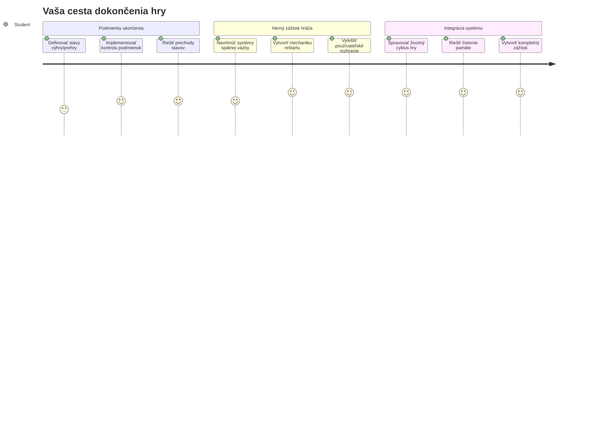
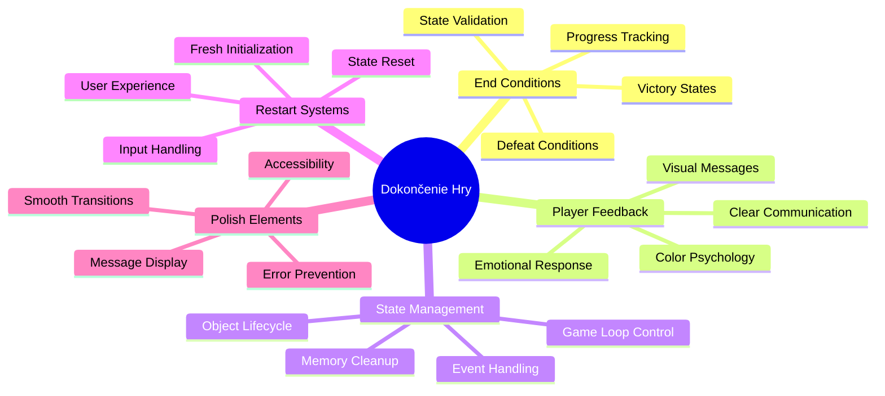
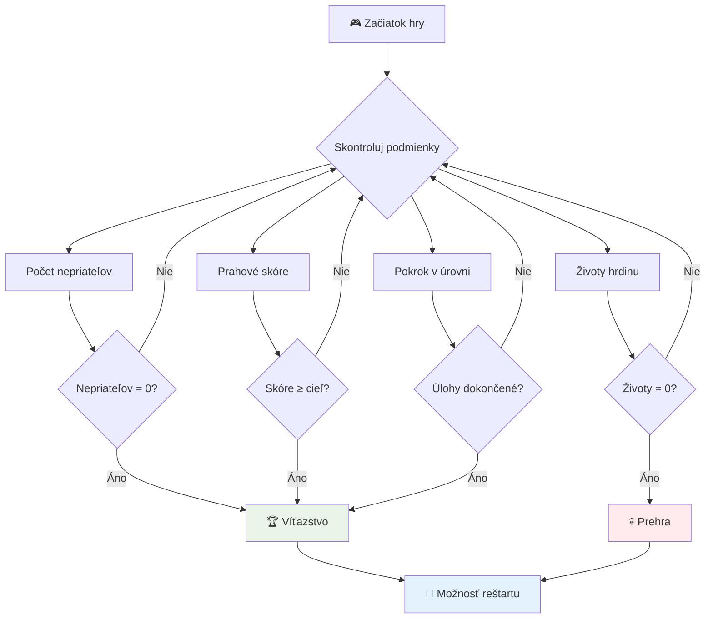
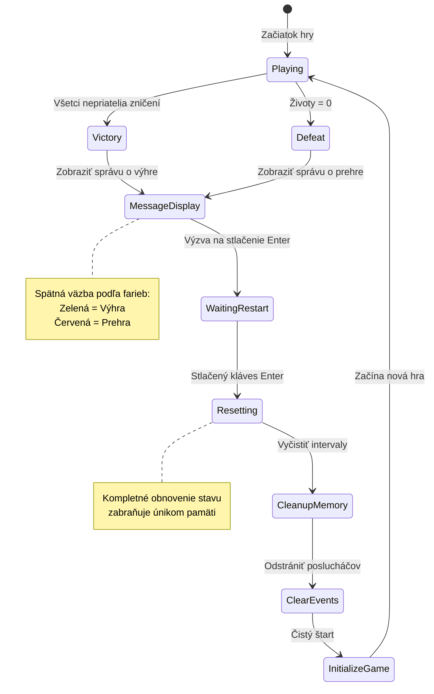
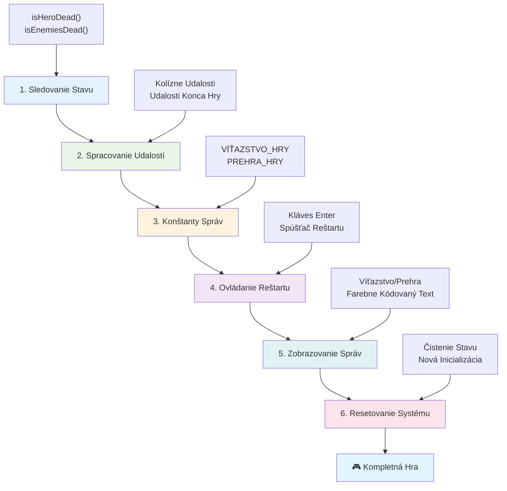
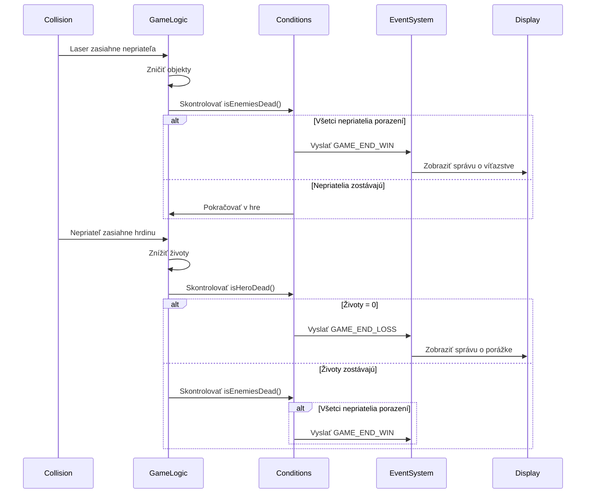
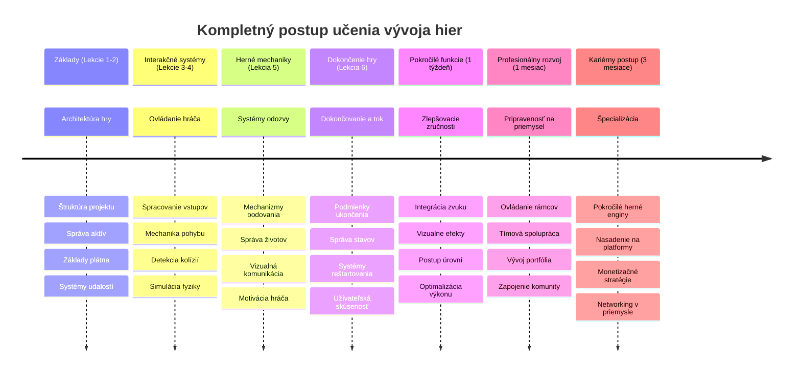

<!--
CO_OP_TRANSLATOR_METADATA:
{
  "original_hash": "a4b78043f4d64bf3ee24e0689b8b391d",
  "translation_date": "2026-01-07T04:42:10+00:00",
  "source_file": "6-space-game/6-end-condition/README.md",
  "language_code": "sk"
}
-->
# Build a Space Game Part 6: Koniec a reštart


Každá skvelá hra potrebuje jasné podmienky ukončenia a plynulý mechanizmus reštartu. Vybudovali ste pôsobivú vesmírnu hru s pohybom, bojom a skórovaním – teraz je čas pridať posledné kúsky, ktoré ju urobia kompletnou.

Vaša hra momentálne beží donekonečna, ako sondy Voyager, ktoré NASA vypustila v roku 1977 – stále cestujú vesmírom aj po desiatkach rokov. Zatiaľ čo to je v poriadku pre vesmírny prieskum, hry potrebujú definované koncové body, aby vytvorili uspokojivé zážitky.

Dnes implementujeme správne podmienky výhry/prehry a systém reštartu. Na konci tejto lekcie budete mať vyladenú hru, ktorú si hráči môžu dokončiť a znovu hrať, presne ako klasické arkádové hry, ktoré definovali tento žáner.


## Prednáškový kvíz

[Prednáškový kvíz](https://ff-quizzes.netlify.app/web/quiz/39)

## Porozumenie podmienkam ukončenia hry

Kedy by mala vaša hra skončiť? Táto základná otázka formuje dizajn hier už od skorých arkádových čias. Pac-Man končí, keď vás chytia duchovia alebo zoberiete všetky bodky, zatiaľ čo Space Invaders končí, keď mimozemšťania dosiahnu spodok alebo ich všetkých zničíte.

Ako tvorca hry definujete podmienky výhry a prehry. Pre našu vesmírnu hru sú tu overené prístupy, ktoré vytvárajú pútavú hrateľnosť:


- **Zničených bolo `N` nepriateľských lodí**: Je celkom bežné, že ak si hru rozdelíte do rôznych úrovní, potrebujete zničiť `N` nepriateľských lodí na dokončenie úrovne.
- **Vaša loď bola zničená**: Existujú hry, kde prehráte, ak je vaša loď zničená. Ďalší častý prístup je mať koncept životov. Každý raz, keď je vaša loď zničená, stratíte jeden život. Akonáhle stratíte všetky životy, hra končí.
- **Nasbieraných bolo `N` bodov**: Ďalšou bežnou podmienkou ukončenia je nazbierať body. Ako získavate body je na vás, ale často sa body prideľujú za rôzne aktivity ako zničenie nepriateľskej lode alebo zber predmetov, ktoré sa *spawnujú* po ich zničení.
- **Dokončenie úrovne**: Môže zahŕňať niekoľko podmienok, ako napríklad zničenie `X` nepriateľských lodí, nazbieranie `Y` bodov alebo zber špecifického predmetu.

## Implementácia funkčnosti reštartu hry

Dobré hry podporujú opätovnú hrateľnosť prostredníctvom plynulých mechanizmov reštartu. Keď hráči dokončia hru (alebo prehrávajú), často chcú vyskúšať znova okamžite – či už aby prekonali svoje skóre, alebo zlepšili výkon.


Tetris je toho dokonalým príkladom: keď vám bloky dosiahnu na vrchol, môžete ihneď začať novú hru bez zložitého prepínania v menu. My postavíme podobný systém reštartu, ktorý čisto obnoví stav hry a rýchlo vráti hráčov späť do akcie.

✅ **Reflexia**: Zamyslite sa nad hrami, ktoré ste hrali. Za akých podmienok končia a ako ste vyzvaní k reštartu? Čo robí skúsenosť s reštartom plynulou oproti frustrujúcej?

## Čo budete vytvárať

Implementujete posledné funkcie, ktoré váš projekt premenia na kompletný herný zážitok. Tieto prvky odlišujú vyladené hry od základných prototypov.

**Dnes pridávame:**

1. **Podmienka výhry**: Zničte všetkých nepriateľov a získajte správne oslavy (zaslúžite si to!)
2. **Podmienka prehry**: Stratíte všetky životy a zobrazí sa obrazovka prehry
3. **Mechanizmus reštartu**: Stlačte Enter a okamžite začnite znova – pretože jedna hra nikdy nestačí
4. **Správa stavu**: Čistý štart vždy – žiadni zvyšní nepriatelia ani zvlášne chyby z poslednej hry

## Začíname

Pripravte si svoje vývojové prostredie. Mali by ste mať pripravené všetky súbory z predošlých lekcií vesmírnej hry.

**Váš projekt by mal vyzerať nejako takto:**

```bash
-| assets
  -| enemyShip.png
  -| player.png
  -| laserRed.png
  -| life.png
-| index.html
-| app.js
-| package.json
```

**Spustite svoj vývojový server:**

```bash
cd your-work
npm start
```

**Tento príkaz:**
- Spustí lokálny server na `http://localhost:5000`
- Správne obslúži vaše súbory
- Automaticky sa obnoví pri zmene kódu

Otvorte `http://localhost:5000` vo vašom prehliadači a overte, či hra beží. Mali by ste sa vedieť pohybovať, strieľať a interagovať s nepriateľmi. Po potvrdení môžeme pokračovať s implementáciou.

> 💡 **Tip pre profesionálov**: Aby ste sa vyhli varovaniam vo Visual Studio Code, deklarujte `gameLoopId` na začiatku súboru ako `let gameLoopId;`, namiesto deklarovania vo vnútri funkcie `window.onload`. Toto je odporúčaná prax pre deklarácie premenných v modernom JavaScripte.


## Kroky implementácie

### Krok 1: Vytvorte funkcie na sledovanie koncových podmienok

Potrebujeme funkcie, ktoré budú sledovať, kedy by hra mala skončiť. Ako senzory na Medzinárodnej vesmírnej stanici, ktoré neustále monitorujú kritické systémy, tieto funkcie budú priebežne kontrolovať stav hry.

```javascript
function isHeroDead() {
  return hero.life <= 0;
}

function isEnemiesDead() {
  const enemies = gameObjects.filter((go) => go.type === "Enemy" && !go.dead);
  return enemies.length === 0;
}
```

**Čo sa deje pod kapotou:**
- **Kontroluje**, či náš hrdina nemá životy (au!)
- **Počíta**, koľko nepriateľov je ešte nažive
- **Vracia** `true`, keď je bojisko bez nepriateľov
- **Používa** jednoduchú logiku pravda/nepravda pre prehľadnosť
- **Filtrovať** všetky herné objekty, aby našiel preživších

### Krok 2: Aktualizujte obslužné rutiny udalostí pre koncové podmienky

Teraz tieto kontroly podmienok pripojíme k event systému hry. Pri každej kolízii hra vyhodnotí, či nastala koncová podmienka. To vytvára okamžitú spätnú väzbu pri kritických udalostiach.


```javascript
eventEmitter.on(Messages.COLLISION_ENEMY_LASER, (_, { first, second }) => {
    first.dead = true;
    second.dead = true;
    hero.incrementPoints();

    if (isEnemiesDead()) {
      eventEmitter.emit(Messages.GAME_END_WIN);
    }
});

eventEmitter.on(Messages.COLLISION_ENEMY_HERO, (_, { enemy }) => {
    enemy.dead = true;
    hero.decrementLife();
    if (isHeroDead())  {
      eventEmitter.emit(Messages.GAME_END_LOSS);
      return; // strata pred víťazstvom
    }
    if (isEnemiesDead()) {
      eventEmitter.emit(Messages.GAME_END_WIN);
    }
});

eventEmitter.on(Messages.GAME_END_WIN, () => {
    endGame(true);
});
  
eventEmitter.on(Messages.GAME_END_LOSS, () => {
  endGame(false);
});
```

**Čo sa tu deje:**
- **Lasér zasiahne nepriateľa**: Obaja zmiznú, získate body a kontrolujeme, či ste vyhrali
- **Nepriateľ zasiahne vás**: Stratíte život a kontrolujeme, či ešte žijete
- **Šikovné poradie**: Najprv kontrolujeme prehru (nikto nechce vyhrať a prehrať naraz!)
- **Okamžité reakcie**: Hra vie hneď o všetkom dôležitom, čo sa stane

### Krok 3: Pridajte nové konštanty správ

Do svojho objektu `Messages` pridáte nové typy správ, ktoré pomáhajú zabezpečiť konzistenciu a zabraňujú preklepom v event systéme.

```javascript
GAME_END_LOSS: "GAME_END_LOSS",
GAME_END_WIN: "GAME_END_WIN",
```

**Čo sme urobili:**
- **Pridali** konštanty pre udalosti konca hry, aby sme zachovali konzistenciu
- **Použili** popisné názvy, ktoré jasne vyjadrujú účel udalosti
- **Dodržali** existujúce pomenovanie typov správ

### Krok 4: Implementujte ovládanie reštartu

Teraz pridáte klávesové ovládanie, ktoré umožní hráčom reštartovať hru. Kláves Enter je prirodzená voľba, pretože sa často používa na potvrdenie akcií a začatie nových hier.

**Pridajte detekciu stlačenia Enter do existujúceho event listenera pre keydown:**

```javascript
else if(evt.key === "Enter") {
   eventEmitter.emit(Messages.KEY_EVENT_ENTER);
}
```

**Pridajte novú konštantu správy:**

```javascript
KEY_EVENT_ENTER: "KEY_EVENT_ENTER",
```

**Čo potrebujete vedieť:**
- **Rozširuje** existujúci systém spracovania klávesových udalostí
- **Používa** kláves Enter ako spúšťač reštartu pre intuitívnu používateľskú skúsenosť
- **Vysiela** vlastnú udalosť, na ktorú môžu ostatné časti hry reagovať
- **Dodržuje** rovnaký vzor ako ostatné klávesové ovládacie prvky

### Krok 5: Vytvorte systém zobrazovania správ

Vaša hra potrebuje jasne komunikovať výsledky hráčom. Vytvoríme systém správ, ktorý zobrazuje stavy výhry a prehry farebným textom, podobne ako terminály starých počítačov, kde zelená znamenala úspech a červená chyby.

**Vytvorte funkciu `displayMessage()`:**

```javascript
function displayMessage(message, color = "red") {
  ctx.font = "30px Arial";
  ctx.fillStyle = color;
  ctx.textAlign = "center";
  ctx.fillText(message, canvas.width / 2, canvas.height / 2);
}
```

**Postupne toto robíme:**
- **Nastavuje** veľkosť a font písma pre čitateľný text
- **Používa** parameter farby, pričom predvolená je červená pre varovania
- **Centruje** text horizontálne aj vertikálne na plátne
- **Využíva** moderné predvolené parametre JavaScriptu pre flexibilitu farieb
- **Používa** 2D kontext canvasu na priame vykreslenie textu

**Vytvorte funkciu `endGame()`:**

```javascript
function endGame(win) {
  clearInterval(gameLoopId);

  // Nastavte oneskorenie, aby sa zabezpečilo dokončenie všetkých čakajúcich vykreslení
  setTimeout(() => {
    ctx.clearRect(0, 0, canvas.width, canvas.height);
    ctx.fillStyle = "black";
    ctx.fillRect(0, 0, canvas.width, canvas.height);
    if (win) {
      displayMessage(
        "Victory!!! Pew Pew... - Press [Enter] to start a new game Captain Pew Pew",
        "green"
      );
    } else {
      displayMessage(
        "You died !!! Press [Enter] to start a new game Captain Pew Pew"
      );
    }
  }, 200)  
}
```

**Čo táto funkcia robí:**
- **Zamŕza** všetko na mieste – žiadne ďalšie pohyby lodí alebo lasery
- **Robí** krátku pauzu (200 ms), aby posledný frame stihol vykresliť
- **Vyčistí** obrazovku a namaľuje ju čiernou pre dramatický efekt
- **Ukazuje** rôzne správy pre víťazov a porazených
- **Farebne rozlišuje** výsledky – zelená pre dobré, červená pre... nie tak dobré
- **Povie** hráčom, ako sa hneď vrátiť do hry

### 🔄 **Pedagogická kontrola**
**Správa herného stavu**: Pred implementáciou resetu si overte, či rozumiete:
- ✅ Ako koncové podmienky vytvárajú jasné herné ciele
- ✅ Prečo je vizuálna spätná väzba dôležitá pre pochopenie hráča
- ✅ Význam správneho vyčistenia pri predchádzaní únikom pamäte
- ✅ Ako event-driven architektúra umožňuje čisté prechody stavov

**Krátky seba-test**: Čo by sa stalo, keby ste neodstránili event listenery počas resetu?
*Odpoveď: Úniky pamäte a duplikované event handlery spôsobujú nepredvídateľné správanie*

**Zásady dizajnu hier**: Práve implementujete:
- **Jasné ciele**: Hráči presne vedia, čo znamená výhra a prehra
- **Okamžitú spätnú väzbu**: Zmeny herného stavu sú okamžite komunikované
- **Kontrolu používateľa**: Hráči môžu reštartovať, keď sú pripravení
- **Spoľahlivosť systému**: Správne vyčistenie zabraňuje chybám a problémom s výkonom

### Krok 6: Implementujte funkciu resetu hry

Systém resetu musí úplne vyčistiť aktuálny stav hry a inicializovať novú hernú reláciu. To zabezpečí, že hráči získajú čistý štart bez zvyšných dát z predchádzajúcej hry.

**Vytvorte funkciu `resetGame()`:**

```javascript
function resetGame() {
  if (gameLoopId) {
    clearInterval(gameLoopId);
    eventEmitter.clear();
    initGame();
    gameLoopId = setInterval(() => {
      ctx.clearRect(0, 0, canvas.width, canvas.height);
      ctx.fillStyle = "black";
      ctx.fillRect(0, 0, canvas.width, canvas.height);
      drawPoints();
      drawLife();
      updateGameObjects();
      drawGameObjects(ctx);
    }, 100);
  }
}
```

**Rozoberme každý krok:**
- **Kontroluje**, či momentálne beží herný cyklus pred resetom
- **Zastavuje** existujúci herný cyklus, aby sa zablokovala aktuálna aktivita
- **Odstraňuje** všetky event listenery, aby sa zabránilo únikom pamäte
- **Znova inicializuje** herný stav s novými objektmi a premennými
- **Spúšťa** nový herný cyklus so všetkými nevyhnutnými funkciami
- **Udržiava** rovnaký 100ms interval pre konzistentný výkon hry

**Pridajte event handler pre Enter key do funkcie `initGame()`:**

```javascript
eventEmitter.on(Messages.KEY_EVENT_ENTER, () => {
  resetGame();
});
```

**Pridajte metódu `clear()` do triedy EventEmitter:**

```javascript
clear() {
  this.listeners = {};
}
```

**Dôležité body na zapamätanie:**
- **Prepojuje** stlačenie klávesu Enter so spustením resetu hry
- **Registruje** tento event listener počas inicializácie hry
- **Poskytuje** čistý spôsob odstránenia všetkých event listenerov pri reštarte
- **Predchádza** únikom pamäte vyčistením handlerov medzi hrami
- **Resetuje** objekt `listeners` do prázdneho stavu pre čistú inicializáciu

## Gratulujeme! 🎉

👽 💥 🚀 Úspešne ste postavili kompletnú hru od základov. Rovnako ako programátori, ktorí vytvorili prvé videohry v 70. rokoch, zmenili ste riadky kódu na interaktívny zážitok so správnou hernou mechanikou a spätou väzbou pre používateľa. 🚀 💥 👽

**Dosiahli ste:**
- **Implementovali** kompletné podmienky víťazstva a prehry so spätnou väzbou pre hráča
- **Vytvorili** plynulý systém reštartu pre kontinuálnu hrateľnosť
- **Navrhli** jasnú vizuálnu komunikáciu herných stavov
- **Spravovali** komplexné prechody a čistenie herného stavu
- **Zložili** všetky komponenty do koherentnej, hrateľnej hry

### 🔄 **Pedagogická kontrola**
**Kompletný systém vývoja hry**: Oslávte svoje ovládnutie kompletného cyklu vývoja hry:
- ✅ Ako koncové podmienky vytvárajú uspokojivé zážitky pre hráča?
- ✅ Prečo je správna správa stavu kľúčová pre stabilitu hry?
- ✅ Ako vizuálna spätná väzba zlepšuje pochopenie hráča?
- ✅ Akú úlohu zohráva systém reštartu v udržaní hráčov?

**Ovládnutie systému**: Vaša kompletná hra demonštruje:
- **Full-Stack vývoj hier**: Od grafiky cez vstupy po správu stavu
- **Profesionálnu architektúru**: Event-driven systémy so správnym vyčistením
- **Dizajn používateľského zážitku**: Jasná spätná väzba a intuitívne ovládanie
- **Optimalizáciu výkonu**: Efektívne vykresľovanie a správa pamäte
- **Úpravu a dokončenie**: Všetky detaily, ktoré robia hru komplexnou

**Zručnosti pripravené pre priemysel**: Implementovali ste:
- **Hernú slučku**: Systémy v reálnom čase s konzistentným výkonom
- **Programovanie na báze udalostí**: Oddelené systémy, ktoré dobre škálujú
- **Správu stavu**: Správa komplexných dát a životného cyklu
- **Dizajn UI**: Jasná komunikácia a responzívne ovládanie
- **Testovanie a ladenie**: Iteratívny vývoj a riešenie problémov

### ⚡ **Čo môžete urobiť v nasledujúcich 5 minútach**
- [ ] Zahrajte si kompletnú hru a otestujte všetky podmienky výhry a prehry
- [ ] Experimentujte s rôznymi parametrami koncových podmienok
- [ ] Skúste pridať console.log pre sledovanie zmien stavu hry
- [ ] Podeľte sa o hru s priateľmi a získajte spätnú väzbu

### 🎯 **Čo môžete dosiahnuť v tejto hodine**
- [ ] Dokončiť post-lekčný kvíz a reflektovať svoju cestu vývoja hry
- [ ] Pridať zvukové efekty pre stavy výhry a prehry
- [ ] Implementovať ďalšie koncové podmienky ako časové limity alebo bonusové ciele
- [ ] Vytvoriť rôzne úrovne obtiažnosti s rôznym počtom nepriateľov
- [ ] Vylepšiť vizuálne spracovanie lepšími fontami a farbami

### 📅 **Vaše týždňové majstrovstvo vo vývoji hier**
- [ ] Dokončiť rozšírenú vesmírnu hru s viacerými úrovňami a progresiou
- [ ] Pridať pokročilé funkcie ako power-upy, rôzne typy nepriateľov a špeciálne zbrane
- [ ] Vytvoriť systém vysokých skóre s perzistentným ukladacím priestorom
- [ ] Navrhnúť používateľské rozhranie pre menu, nastavenia a herné voľby
- [ ] Optimalizovať výkon pre rôzne zariadenia a prehliadače
- [ ] Nasadiť hru online a zdieľať ju s komunitou
### 🌟 **Tvoja mesačná kariéra v tvorbe hier**
- [ ] Vytvoriť niekoľko kompletných hier skúmajúcich rôzne žánre a mechaniky
- [ ] Naučiť sa pokročilé herné vývojové rámce ako Phaser alebo Three.js
- [ ] Prispievať do open source projektov na tvorbu hier
- [ ] Študovať herné dizajnové princípy a psychológiu hráčov
- [ ] Vytvoriť portfólio prezentujúce tvoje schopnosti v tvorbe hier
- [ ] Spojiť sa s komunitou vývojárov hier a pokračovať v učení

## 🎯 Tvoj kompletný časový plán na ovládnutie tvorby hier


### 🛠️ Zhrnutie tvojho kompletného súpravy nástrojov na tvorbu hier

Po dokončení celej tejto série vesmírnych hier si teraz ovládol:
- **Architektúru hier**: Systémy riadené udalosťami, herné slučky a manažment stavov
- **Grafické programovanie**: Canvas API, vykresľovanie spriteov a vizuálne efekty
- **Vstupné systémy**: Ovládanie klávesnice, detekcia kolízií a responzívne ovládanie
- **Herný dizajn**: Spätná väzba pre hráča, systémy progresie a zapájanie mechaník
- **Optimalizáciu výkonu**: Efektívne vykresľovanie, správa pamäte a kontrola obnovovacej frekvencie
- **Používateľskú skúsenosť**: Jasná komunikácia, intuitívne ovládanie a detailné vybrušovanie
- **Profesionálne vzory**: Čistý kód, techniky ladenia a organizácia projektu

**Reálne využitie**: Tvoje schopnosti tvorby hier sa dajú priamo aplikovať na:
- **Interaktívne webové aplikácie**: Dynamické rozhrania a systémy v reálnom čase
- **Vizualizáciu dát**: Animované grafy a interaktívna grafika
- **Vzdelávaciu technológiu**: Gamifikácia a pútavé vzdelávacie zážitky
- **Mobilný vývoj**: Interakcie založené na dotykovom ovládaní a optimalizácia výkonu
- **Simulačný softvér**: Fyzikálne engine a modelovanie v reálnom čase
- **Kreatívne odvetvia**: Interaktívne umenie, zábava a digitálne zážitky

**Získané profesionálne zručnosti**: Teraz dokážeš:
- **Navrhovať architektúru** komplexných interaktívnych systémov od základov
- **Ladiť** aplikácie bežiace v reálnom čase pomocou systematických prístupov
- **Optimalizovať** výkon pre plynulé používateľské zážitky
- **Dizajnovať** pútavé používateľské rozhrania a interakčné vzory
- **Spolupracovať** efektívne na technických projektoch s dobrou organizáciou kódu

**Ovládnuté koncepty tvorby hier**:
- **Systémy v reálnom čase**: Herné slučky, riadenie obnovovacej frekvencie a výkon
- **Architektúra riadená udalosťami**: Oddelené systémy a posielanie správ
- **Manažment stavov**: Komplexná správa dát a životného cyklu
- **Programovanie používateľského rozhrania**: Canvas grafika a responzívny dizajn
- **Teória herného dizajnu**: Psychológia hráča a mechaniky zapájania

**Ďalší level**: Si pripravený preskúmať pokročilé herné rámce, 3D grafiku, multiplayer systémy alebo prejsť do profesionálnych rolí vo vývoji hier!

🌟 **Úspech dosiahnutý**: Dokončil si kompletnú cestu tvorbou hier a vytvoril profesionálne kvalitný interaktívny zážitok od základov!

**Vitaj v komunite tvorcov hier!** 🎮✨

## GitHub Copilot Agent Challenge 🚀

Použi režim Agenta na dokončenie nasledujúcej výzvy:

**Popis:** Vylepši vesmírnu hru implementáciou systému postupovania úrovní so zvyšujúcou sa ťažkosťou a bonusovými prvkami.

**Výzva:** Vytvor viacúrovňový vesmírny herný systém, kde každá úroveň má viac nepriateľských lodí s vyššou rýchlosťou a zdravím. Pridaj násobiteľ skóre, ktorý sa zvyšuje s každou úrovňou, a implementuj power-upy (ako rýchla paľba alebo štít), ktoré sa náhodne objavujú po zničení nepriateľov. Zahrň bonus za dokončenie úrovne a zobraz aktuálnu úroveň na obrazovke spolu s existujúcim skóre a životmi.

Viac informácií o [agent mode](https://code.visualstudio.com/blogs/2025/02/24/introducing-copilot-agent-mode) nájdeš tu.

## 🚀 Voliteľná výzva na vylepšenie

**Pridaj zvuk do svojej hry**: Vylepši svoj herný zážitok implementáciou zvukových efektov! Zváž pridanie zvukov pre:

- **Laserové strely**, keď hráč strieľa
- **Zničenie nepriateľa**, keď sú lode zasiahnuté
- **Poškodenie hrdinu**, keď hráč utrpí zásah
- **Hudbu víťazstva**, keď sa vyhrá hra
- **Zvuk prehry**, keď sa hra prehrá

**Príklad implementácie zvuku:**

```javascript
// Vytvorte zvukové objekty
const laserSound = new Audio('assets/laser.wav');
const explosionSound = new Audio('assets/explosion.wav');

// Prehrávajte zvuky počas herných udalostí
function playLaserSound() {
  laserSound.currentTime = 0; // Obnoviť na začiatok
  laserSound.play();
}
```

**Čo potrebuješ vedieť:**
- **Vytvára** Audio objekty pre rôzne zvukové efekty
- **Resetuje** `currentTime` pre umožnenie rýchlej paľby zvukových efektov
- **Rieši** prehliadačové pravidlá automatického prehrávania spustením zvukov z používateľských interakcií
- **Riadi** hlasitosť a časovanie zvuku pre lepší herný zážitok

> 💡 **Vzdelávací zdroj**: Preskúmaj tento [audio sandbox](https://www.w3schools.com/jsref/tryit.asp?filename=tryjsref_audio_play) a nauč sa viac o implementácii zvuku v JavaScript hrách.

## Kvíz po prednáške

[Kvíz po prednáške](https://ff-quizzes.netlify.app/web/quiz/40)

## Revízia & samostatné štúdium

Tvojim zadaním je vytvoriť novú ukážkovú hru, preto si prezri niektoré zaujímavé hry, aby si zistil, aký typ hry by si mohol vytvoriť.

## Zadanie

[Vytvor ukážkovú hru](assignment.md)

---

<!-- CO-OP TRANSLATOR DISCLAIMER START -->
**Upozornenie**:
Tento dokument bol preložený pomocou AI prekladateľskej služby [Co-op Translator](https://github.com/Azure/co-op-translator). Hoci sa usilujeme o presnosť, berte prosím na vedomie, že automatizované preklady môžu obsahovať chyby alebo nepresnosti. Originálny dokument v jeho pôvodnom jazyku by mal byť považovaný za autoritatívny zdroj. Pre kritické informácie sa odporúča profesionálny ľudský preklad. Nie sme zodpovední za akékoľvek nepochopenia alebo nesprávne interpretácie vyplývajúce z použitia tohto prekladu.
<!-- CO-OP TRANSLATOR DISCLAIMER END -->