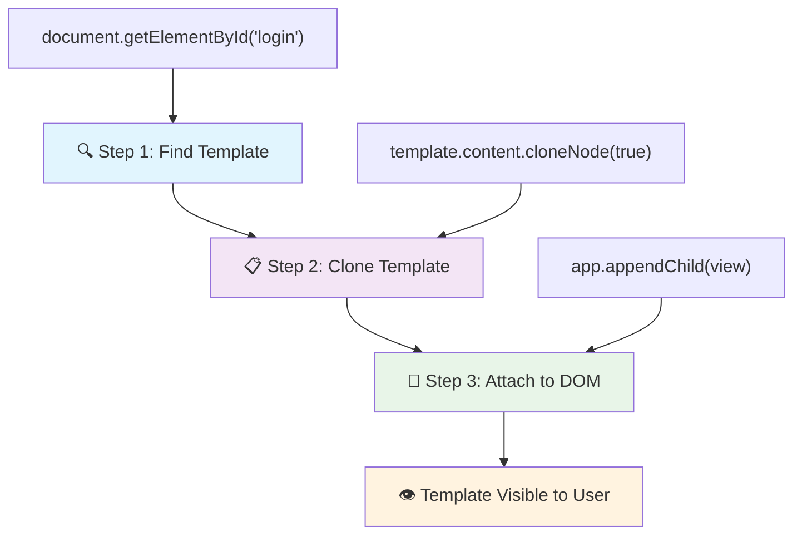
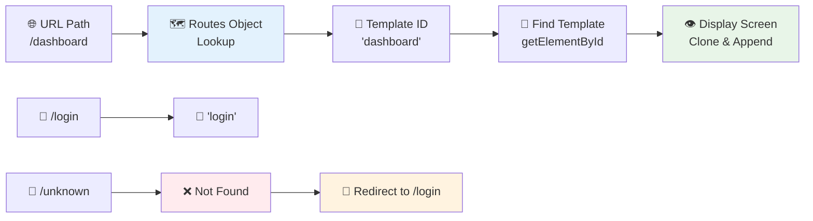
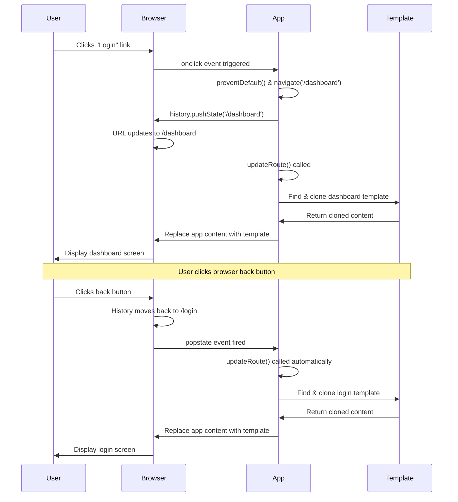

<!--
CO_OP_TRANSLATOR_METADATA:
{
  "original_hash": "5d259f6962464ad91e671083aa0398f4",
  "translation_date": "2025-10-24T21:41:17+00:00",
  "source_file": "7-bank-project/1-template-route/README.md",
  "language_code": "sk"
}
-->
# Vytvorenie bankovej aplikácie, časť 1: HTML šablóny a trasy vo webovej aplikácii

Keď Apollo 11 v roku 1969 navigoval na Mesiac, jeho riadiaci počítač musel prepínať medzi rôznymi programami bez toho, aby reštartoval celý systém. Moderné webové aplikácie fungujú podobne – menia to, čo vidíte, bez toho, aby sa všetko načítalo od začiatku. To vytvára plynulý a responzívny zážitok, ktorý dnes používatelia očakávajú.

Na rozdiel od tradičných webových stránok, ktoré pri každej interakcii načítavajú celé stránky, moderné webové aplikácie aktualizujú iba tie časti, ktoré je potrebné zmeniť. Tento prístup, podobne ako prepínanie medzi rôznymi obrazovkami v riadiacom centre pri zachovaní neustálej komunikácie, vytvára plynulý zážitok, na ktorý sme si zvykli.

Tu je to, čo robí rozdiel tak dramatickým:

| Tradičné viacstránkové aplikácie | Moderné jednostránkové aplikácie |
|----------------------------------|----------------------------------|
| **Navigácia** | Načítanie celej stránky pri každej obrazovke | Okamžité prepínanie obsahu |
| **Výkon** | Pomalšie kvôli úplnému načítaniu HTML | Rýchlejšie vďaka čiastočným aktualizáciám |
| **Používateľský zážitok** | Rušivé blikanie stránok | Plynulé, aplikáciám podobné prechody |
| **Zdieľanie dát** | Ťažké medzi stránkami | Jednoduché spravovanie stavu |
| **Vývoj** | Viacero HTML súborov na údržbu | Jeden HTML s dynamickými šablónami |

**Porozumenie evolúcii:**
- **Tradičné aplikácie** vyžadujú serverové požiadavky pri každej navigačnej akcii
- **Moderné SPA** sa načítajú raz a obsah dynamicky aktualizujú pomocou JavaScriptu
- **Očakávania používateľov** teraz uprednostňujú okamžité, plynulé interakcie
- **Výkonnostné výhody** zahŕňajú zníženie šírky pásma a rýchlejšie odozvy

V tejto lekcii vytvoríme bankovú aplikáciu s viacerými obrazovkami, ktoré spolu plynulo prechádzajú. Podobne ako vedci používajú modulárne nástroje, ktoré je možné prekonfigurovať na rôzne experimenty, použijeme HTML šablóny ako opakovane použiteľné komponenty, ktoré je možné zobraziť podľa potreby.

Budete pracovať s HTML šablónami (opakovane použiteľné návrhy pre rôzne obrazovky), JavaScript routovaním (systém, ktorý prepína medzi obrazovkami) a históriou prehliadača (ktorá zabezpečuje správne fungovanie tlačidla späť). Toto sú rovnaké základné techniky, ktoré používajú frameworky ako React, Vue a Angular.

Na konci budete mať funkčnú bankovú aplikáciu, ktorá demonštruje profesionálne princípy jednostránkových aplikácií.

## Kvíz pred prednáškou

[Prednáškový kvíz](https://ff-quizzes.netlify.app/web/quiz/41)

### Čo budete potrebovať

Na testovanie našej bankovej aplikácie budeme potrebovať lokálny webový server – nebojte sa, nie je to také zložité, ako to znie! Ak ho ešte nemáte nastavený, stačí nainštalovať [Node.js](https://nodejs.org) a spustiť príkaz `npx lite-server` z vášho projektového priečinka. Tento šikovný príkaz spustí lokálny server a automaticky otvorí vašu aplikáciu v prehliadači.

### Príprava

Na vašom počítači vytvorte priečinok s názvom `bank` a v ňom súbor s názvom `index.html`. Začneme s týmto HTML [boilerplate](https://en.wikipedia.org/wiki/Boilerplate_code):

```html
<!DOCTYPE html>
<html lang="en">
  <head>
    <meta charset="UTF-8">
    <meta name="viewport" content="width=device-width, initial-scale=1.0">
    <title>Bank App</title>
  </head>
  <body>
    <!-- This is where you'll work -->
  </body>
</html>
```

**Čo tento boilerplate poskytuje:**
- **Zavádza** štruktúru dokumentu HTML5 s riadnym DOCTYPE vyhlásením
- **Konfiguruje** kódovanie znakov ako UTF-8 pre podporu medzinárodného textu
- **Umožňuje** responzívny dizajn pomocou meta tagu viewport pre mobilnú kompatibilitu
- **Nastavuje** popisný názov, ktorý sa zobrazí na karte prehliadača
- **Vytvára** čistú sekciu tela, kde budeme budovať našu aplikáciu

> 📁 **Náhľad štruktúry projektu**
> 
> **Na konci tejto lekcie bude váš projekt obsahovať:**
> ```
> bank/
> ├── index.html      <!-- Main HTML with templates -->
> ├── app.js          <!-- Routing and navigation logic -->
> └── style.css       <!-- (Optional for future lessons) -->
> ```
> 
> **Zodpovednosti súborov:**
> - **index.html**: Obsahuje všetky šablóny a poskytuje štruktúru aplikácie
> - **app.js**: Rieši routovanie, navigáciu a správu šablón
> - **Šablóny**: Definujú používateľské rozhranie pre prihlásenie, dashboard a ďalšie obrazovky

---

## HTML šablóny

Šablóny riešia základný problém vo webovom vývoji. Keď Gutenberg v 1440-tych rokoch vynašiel pohyblivú tlač, uvedomil si, že namiesto vyrezávania celých stránok môže vytvoriť opakovane použiteľné bloky písmen a usporiadať ich podľa potreby. HTML šablóny fungujú na rovnakom princípe – namiesto vytvárania samostatných HTML súborov pre každú obrazovku definujete opakovane použiteľné štruktúry, ktoré je možné zobraziť podľa potreby.

Predstavte si šablóny ako návrhy pre rôzne časti vašej aplikácie. Rovnako ako architekt vytvára jeden návrh a používa ho viackrát namiesto kreslenia identických miestností, vytvárame šablóny raz a inštancujeme ich podľa potreby. Prehliadač tieto šablóny uchováva skryté, kým ich JavaScript neaktivuje.

Ak chcete vytvoriť viacero obrazoviek pre webovú stránku, jedným riešením by bolo vytvoriť jeden HTML súbor pre každú obrazovku, ktorú chcete zobraziť. Toto riešenie však prináša určité nevýhody:

- Musíte načítať celý HTML pri prepínaní obrazovky, čo môže byť pomalé.
- Je ťažké zdieľať dáta medzi rôznymi obrazovkami.

Iný prístup je mať iba jeden HTML súbor a definovať viacero [HTML šablón](https://developer.mozilla.org/docs/Web/HTML/Element/template) pomocou elementu `<template>`. Šablóna je opakovane použiteľný HTML blok, ktorý prehliadač nezobrazuje a musí byť inštancovaný počas behu pomocou JavaScriptu.

### Poďme to vytvoriť

Vytvoríme bankovú aplikáciu s dvoma hlavnými obrazovkami: prihlasovacou stránkou a dashboardom. Najprv pridáme zástupný element do nášho HTML tela – tu sa zobrazia všetky naše rôzne obrazovky:

```html
<div id="app">Loading...</div>
```

**Porozumenie tomuto zástupnému elementu:**
- **Vytvára** kontajner s ID "app", kde sa zobrazia všetky obrazovky
- **Zobrazuje** správu o načítaní, kým JavaScript inicializuje prvú obrazovku
- **Poskytuje** jeden montážny bod pre náš dynamický obsah
- **Umožňuje** jednoduché cielenie z JavaScriptu pomocou `document.getElementById()`

> 💡 **Tip**: Keďže obsah tohto elementu bude nahradený, môžeme tam vložiť správu o načítaní alebo indikátor, ktorý sa zobrazí počas načítania aplikácie.

Ďalej pridáme pod HTML šablónu pre prihlasovaciu stránku. Zatiaľ tam vložíme iba nadpis a sekciu obsahujúcu odkaz, ktorý použijeme na navigáciu.

```html
<template id="login">
  <h1>Bank App</h1>
  <section>
    <a href="/dashboard">Login</a>
  </section>
</template>
```

**Rozbor tejto prihlasovacej šablóny:**
- **Definuje** šablónu s jedinečným identifikátorom "login" pre cielenie JavaScriptom
- **Obsahuje** hlavný nadpis, ktorý určuje značku aplikácie
- **Zahŕňa** semantický element `<section>` na zoskupenie súvisiaceho obsahu
- **Poskytuje** navigačný odkaz, ktorý presmeruje používateľov na dashboard

Potom pridáme ďalšiu HTML šablónu pre stránku dashboardu. Táto stránka bude obsahovať rôzne sekcie:

- Hlavičku s nadpisom a odkazom na odhlásenie
- Aktuálny zostatok na bankovom účte
- Zoznam transakcií, zobrazený v tabuľke

```html
<template id="dashboard">
  <header>
    <h1>Bank App</h1>
    <a href="/login">Logout</a>
  </header>
  <section>
    Balance: 100$
  </section>
  <section>
    <h2>Transactions</h2>
    <table>
      <thead>
        <tr>
          <th>Date</th>
          <th>Object</th>
          <th>Amount</th>
        </tr>
      </thead>
      <tbody></tbody>
    </table>
  </section>
</template>
```

**Porozumenie každej časti tohto dashboardu:**
- **Štruktúruje** stránku pomocou semantického elementu `<header>` obsahujúceho navigáciu
- **Zobrazuje** názov aplikácie konzistentne na všetkých obrazovkách pre branding
- **Poskytuje** odkaz na odhlásenie, ktorý presmeruje späť na prihlasovaciu obrazovku
- **Zobrazuje** aktuálny zostatok účtu v samostatnej sekcii
- **Organizuje** údaje o transakciách pomocou správne štruktúrovanej HTML tabuľky
- **Definuje** hlavičky tabuľky pre stĺpce Dátum, Objekt a Suma
- **Necháva** telo tabuľky prázdne pre neskoršie dynamické vkladanie obsahu

> 💡 **Tip**: Pri vytváraní HTML šablón, ak chcete vidieť, ako budú vyzerať, môžete zakomentovať riadky `<template>` a `</template>` pomocou `<!-- -->`.

✅ Prečo si myslíte, že používame atribúty `id` na šablónach? Mohli by sme použiť niečo iné, napríklad triedy?

## Oživenie šablón pomocou JavaScriptu

Teraz musíme naše šablóny spraviť funkčnými. Rovnako ako 3D tlačiareň vezme digitálny návrh a vytvorí fyzický objekt, JavaScript vezme naše skryté šablóny a vytvorí viditeľné, interaktívne prvky, ktoré používatelia môžu vidieť a používať.

Proces nasleduje tri konzistentné kroky, ktoré tvoria základ moderného webového vývoja. Keď pochopíte tento vzor, rozpoznáte ho v mnohých frameworkoch a knižniciach.

Ak vyskúšate váš aktuálny HTML súbor v prehliadači, uvidíte, že sa zasekne na zobrazení `Loading...`. To je preto, že musíme pridať nejaký JavaScriptový kód na inštancovanie a zobrazenie HTML šablón.

Inštancovanie šablóny sa zvyčajne vykonáva v 3 krokoch:

1. Získajte element šablóny v DOM, napríklad pomocou [`document.getElementById`](https://developer.mozilla.org/docs/Web/API/Document/getElementById).
2. Skopírujte element šablóny pomocou [`cloneNode`](https://developer.mozilla.org/docs/Web/API/Node/cloneNode).
3. Pripojte ho k DOM pod viditeľný element, napríklad pomocou [`appendChild`](https://developer.mozilla.org/docs/Web/API/Node/appendChild).



**Vizuálny rozbor procesu:**
- **Krok 1** lokalizuje skrytú šablónu v štruktúre DOM
- **Krok 2** vytvorí pracovnú kópiu, ktorú je možné bezpečne upraviť
- **Krok 3** vloží kópiu do viditeľnej oblasti stránky
- **Výsledok** je funkčná obrazovka, s ktorou môžu používatelia interagovať

✅ Prečo je potrebné skopírovať šablónu pred jej pripojením k DOM? Čo si myslíte, že by sa stalo, keby sme tento krok preskočili?

### Úloha

Vytvorte nový súbor s názvom `app.js` vo vašom projektovom priečinku a importujte tento súbor do sekcie `<head>` vášho HTML:

```html
<script src="app.js" defer></script>
```

**Porozumenie tomuto importu skriptu:**
- **Prepojuje** JavaScriptový súbor s naším HTML dokumentom
- **Používa** atribút `defer`, aby sa skript spustil po dokončení analýzy HTML
- **Umožňuje** prístup ku všetkým DOM elementom, pretože sú úplne načítané pred vykonaním skriptu
- **Nasleduje** moderné najlepšie praktiky pre načítanie skriptov a výkon

Teraz v `app.js` vytvoríme novú funkciu `updateRoute`:

```js
function updateRoute(templateId) {
  const template = document.getElementById(templateId);
  const view = template.content.cloneNode(true);
  const app = document.getElementById('app');
  app.innerHTML = '';
  app.appendChild(view);
}
```

**Krok za krokom, čo sa deje:**
- **Lokalizuje** element šablóny pomocou jeho jedinečného ID
- **Vytvára** hlbokú kópiu obsahu šablóny pomocou `cloneNode(true)`
- **Nájde** kontajner aplikácie, kde sa obsah zobrazí
- **Vyčistí** akýkoľvek existujúci obsah z kontajnera aplikácie
- **Vloží** skopírovaný obsah šablóny do viditeľného DOM

Teraz zavolajte túto funkciu s jednou zo šablón a pozrite sa na výsledok.

```js
updateRoute('login');
```

**Čo táto funkcia dosahuje:**
- **Aktivuje** prihlasovaciu šablónu odovzdaním jej ID ako parametra
- **Demonštruje**, ako programovo prepínať medzi rôznymi obrazovkami aplikácie
- **Zobrazuje** prihlasovaciu obrazovku namiesto správy "Loading..."

✅ Aký je účel tohto kódu `app.innerHTML = '';`? Čo sa stane bez neho?

## Vytváranie trás

Routovanie je v podstate o prepojení URL s príslušným obsahom. Predstavte si, ako skorí telefonní operátori používali prepínacie panely na prepojenie hovorov – prijali prichádzajúcu požiadavku a presmerovali ju na správny cieľ. Webové routovanie funguje podobne, prijíma požiadavku na URL a určuje, ktorý obsah zobraziť.

Tradične webové servery riešili toto tým, že poskytovali rôzne HTML súbory pre rôzne URL. Keďže vytvárame jednostránkovú aplikáciu, musíme toto routovanie riešiť sami pomocou JavaScriptu. Tento prístup nám poskytuje väčšiu kontrolu nad používateľským zážitkom a výkonom.



**Porozumenie toku routovania:**
- **Zmeny URL** spúšťajú vyhľadávanie v našej konfigurácii trás
- **Platné trasy** mapujú na konkrétne ID šablón na vykreslenie
- **Neplatné trasy** spúšťajú záložné správanie, aby sa zabránilo chybným stavom
- **Vykreslenie šablón** nasleduje trojstupňový proces, ktorý sme sa naučili

Keď hovoríme o webovej aplikácii, nazývame *Routovanie* zámer mapovať **URL** na konkrétne obrazovky, ktoré by sa mali zobraziť. Na webovej stránke s viacerými HTML súbormi sa to deje automaticky, pretože cesty k súborom sa odrážajú v URL. Napríklad, s týmito súbormi vo vašom projektovom priečinku:

```
mywebsite/index.html
mywebsite/login.html
mywebsite/admin/index.html
```

Ak vytvoríte webový server s koreňom `mywebsite`, mapovanie URL bude:

```
https://site.com            --> mywebsite/index.html
https://site.com/login.html --> mywebsite/login.html
https://site.com/admin/     --> mywebsite/admin/index.html
```

Avšak pre našu webovú aplikáciu používame jeden HTML súbor obsahujúci všetky obrazovky, takže toto predvolené správanie nám nepomôže. Musíme túto mapu vytvoriť manuálne a aktualizovať zobrazenú šablónu pomocou JavaScriptu.

### Úloha

Použijeme jednoduchý objekt na implementáciu [mapy](https://en.wikipedia.org/wiki/Associative_array) medzi cestami URL a našimi šablónami. Pridajte tento objekt na začiatok vášho súboru `app.js`.

```js
const routes = {
  '/login': { templateId: 'login' },
  '/dashboard': { templateId: 'dashboard' },
};
```

**Porozumenie tejto konfigurácie trás:**
- **Definuje** mapovanie medzi cestami URL a identifikátormi šablón
- **Používa** syntax objektu, kde kľúče sú cesty URL a hodnoty obsahujú informácie o šablóne
- **Umožňuje** jednoduché
✅ Čo sa stane, ak zadáte neznámu cestu do URL? Ako by sme to mohli vyriešiť?

## Pridanie navigácie

Keď je routing nastavený, používatelia potrebujú spôsob, ako sa pohybovať po aplikácii. Tradičné webové stránky načítavajú celé stránky pri kliknutí na odkazy, ale my chceme aktualizovať URL aj obsah bez obnovovania stránky. To vytvára plynulejší zážitok, podobný tomu, ako desktopové aplikácie prepínajú medzi rôznymi pohľadmi.

Musíme koordinovať dve veci: aktualizáciu URL prehliadača, aby si používatelia mohli stránky uložiť do záložiek a zdieľať odkazy, a zobrazenie príslušného obsahu. Ak je to správne implementované, vytvára to plynulú navigáciu, ktorú používatelia očakávajú od moderných aplikácií.

> 🏗️ **Pohľad na architektúru**: Komponenty navigačného systému
>
> **Čo vytvárate:**
> - **🔄 Správa URL**: Aktualizuje adresný riadok prehliadača bez obnovovania stránky
> - **📋 Systém šablón**: Dynamicky mení obsah na základe aktuálnej cesty  
> - **📚 Integrácia histórie**: Udržiava funkčnosť tlačidiel späť/vpred v prehliadači
> - **🛡️ Riešenie chýb**: Elegantné riešenie pre neplatné alebo chýbajúce cesty
>
> **Ako komponenty spolupracujú:**
> - **Sledujú** navigačné udalosti (kliknutia, zmeny histórie)
> - **Aktualizujú** URL pomocou History API
> - **Zobrazujú** príslušnú šablónu pre novú cestu
> - **Udržiavajú** plynulý používateľský zážitok

Ďalším krokom pre našu aplikáciu je pridať možnosť navigovať medzi stránkami bez manuálnej zmeny URL. To zahŕňa dve veci:

  1. Aktualizáciu aktuálnej URL
  2. Aktualizáciu zobrazenej šablóny na základe novej URL

Druhú časť sme už vyriešili pomocou funkcie `updateRoute`, takže musíme zistiť, ako aktualizovať aktuálnu URL.

Budeme musieť použiť JavaScript, konkrétne [`history.pushState`](https://developer.mozilla.org/docs/Web/API/History/pushState), ktorý umožňuje aktualizovať URL a vytvoriť nový záznam v histórii prehliadania bez obnovovania HTML.

> ⚠️ **Dôležitá poznámka**: Hoci HTML kotva [`<a href>`](https://developer.mozilla.org/docs/Web/HTML/Element/a) môže byť použitá na vytvorenie hypertextových odkazov na rôzne URL, predvolene spôsobí, že prehliadač obnoví HTML. Je potrebné zabrániť tomuto správaniu pri spracovaní routingu pomocou vlastného JavaScriptu, použitím funkcie preventDefault() na udalosti kliknutia.

### Úloha

Vytvorme novú funkciu, ktorú môžeme použiť na navigáciu v našej aplikácii:

```js
function navigate(path) {
  window.history.pushState({}, path, path);
  updateRoute();
}
```

**Pochopenie tejto navigačnej funkcie:**
- **Aktualizuje** URL prehliadača na novú cestu pomocou `history.pushState`
- **Pridáva** nový záznam do histórie prehliadača pre správnu podporu tlačidiel späť/vpred
- **Spúšťa** funkciu `updateRoute()` na zobrazenie príslušnej šablóny
- **Udržiava** zážitok z aplikácie na jednej stránke bez obnovovania stránky

Táto metóda najprv aktualizuje aktuálnu URL na základe zadanej cesty, potom aktualizuje šablónu. Vlastnosť `window.location.origin` vráti koreň URL, čo nám umožňuje zostaviť kompletnú URL z danej cesty.

Teraz, keď máme túto funkciu, môžeme vyriešiť problém, ktorý máme, ak cesta nezodpovedá žiadnej definovanej trase. Upravením funkcie `updateRoute` pridáme záložné riešenie na jednu z existujúcich trás, ak nemôžeme nájsť zhodu.

```js
function updateRoute() {
  const path = window.location.pathname;
  const route = routes[path];

  if (!route) {
    return navigate('/login');
  }

  const template = document.getElementById(route.templateId);
  const view = template.content.cloneNode(true);
  const app = document.getElementById('app');
  app.innerHTML = '';
  app.appendChild(view);
}
```

**Kľúčové body na zapamätanie:**
- **Kontroluje**, či existuje trasa pre aktuálnu cestu
- **Presmeruje** na prihlasovaciu stránku, keď sa pristupuje k neplatnej trase
- **Poskytuje** záložný mechanizmus, ktorý zabraňuje narušenej navigácii
- **Zabezpečuje**, že používatelia vždy vidia platnú obrazovku, aj pri nesprávnych URL

Ak sa nepodarí nájsť trasu, teraz presmerujeme na stránku `login`.

Teraz vytvorme funkciu na získanie URL pri kliknutí na odkaz a na zabránenie predvoleného správania prehliadača pri odkazoch:

```js
function onLinkClick(event) {
  event.preventDefault();
  navigate(event.target.href);
}
```

**Rozbor tohto spracovania kliknutia:**
- **Zabraňuje** predvolenému správaniu prehliadača pri odkazoch pomocou `preventDefault()`
- **Extrahuje** cieľovú URL z kliknutého prvku odkazu
- **Volá** našu vlastnú navigačnú funkciu namiesto obnovovania stránky
- **Udržiava** plynulý zážitok z aplikácie na jednej stránke

```html
<a href="/dashboard" onclick="onLinkClick(event)">Login</a>
...
<a href="/login" onclick="onLinkClick(event)">Logout</a>
```

**Čo dosahuje toto prepojenie onclick:**
- **Pripája** každý odkaz k nášmu vlastnému navigačnému systému
- **Prenáša** udalosť kliknutia do našej funkcie `onLinkClick` na spracovanie
- **Umožňuje** plynulú navigáciu bez obnovovania stránky
- **Udržiava** správnu štruktúru URL, ktorú si používatelia môžu uložiť do záložiek alebo zdieľať

Atribút [`onclick`](https://developer.mozilla.org/docs/Web/API/GlobalEventHandlers/onclick) pripojí udalosť kliknutia k JavaScriptovému kódu, tu k volaniu funkcie `navigate()`.

Skúste kliknúť na tieto odkazy, teraz by ste mali byť schopní navigovať medzi rôznymi obrazovkami vašej aplikácie.

✅ Metóda `history.pushState` je súčasťou štandardu HTML5 a je implementovaná vo [všetkých moderných prehliadačoch](https://caniuse.com/?search=pushState). Ak vytvárate webovú aplikáciu pre staršie prehliadače, existuje trik, ktorý môžete použiť namiesto tohto API: použitím [hashu (`#`)](https://en.wikipedia.org/wiki/URI_fragment) pred cestou môžete implementovať routing, ktorý funguje s bežnou navigáciou kotvami a neobnovuje stránku, pretože jeho účelom bolo vytvárať interné odkazy v rámci stránky.

## Fungovanie tlačidiel Späť a Vpred

Tlačidlá späť a vpred sú základom webového prehliadania, podobne ako NASA kontrolóri misie môžu preskúmať predchádzajúce stavy systému počas vesmírnych misií. Používatelia očakávajú, že tieto tlačidlá budú fungovať, a keď nefungujú, narúša to očakávaný zážitok z prehliadania.

Naša aplikácia na jednej stránke potrebuje ďalšiu konfiguráciu na podporu tohto. Prehliadač udržiava zásobník histórie (ktorý sme pridávali pomocou `history.pushState`), ale keď sa používatelia pohybujú touto históriou, naša aplikácia musí reagovať aktualizáciou zobrazovaného obsahu.



**Kľúčové body interakcie:**
- **Akcie používateľa** spúšťajú navigáciu cez kliknutia alebo tlačidlá prehliadača
- **Aplikácia zachytáva** kliknutia na odkazy, aby zabránila obnovovaniu stránky
- **History API** spravuje zmeny URL a zásobník histórie prehliadača
- **Šablóny** poskytujú štruktúru obsahu pre každú obrazovku
- **Poslucháče udalostí** zabezpečujú, že aplikácia reaguje na všetky typy navigácie

Použitie `history.pushState` vytvára nové záznamy v histórii navigácie prehliadača. Môžete to skontrolovať podržaním *tlačidla späť* vo vašom prehliadači, malo by sa zobraziť niečo takéto:


Ak skúsite kliknúť na tlačidlo späť niekoľkokrát, uvidíte, že aktuálna URL sa mení a história sa aktualizuje, ale stále sa zobrazuje rovnaká šablóna.

To je preto, že aplikácia nevie, že musíme zavolať `updateRoute()` vždy, keď sa zmení história. Ak sa pozriete na [dokumentáciu `history.pushState`](https://developer.mozilla.org/docs/Web/API/History/pushState), môžete vidieť, že ak sa stav zmení - čo znamená, že sme sa presunuli na inú URL - spustí sa udalosť [`popstate`](https://developer.mozilla.org/docs/Web/API/Window/popstate_event). Použijeme to na vyriešenie tohto problému.

### Úloha

Aby sme zabezpečili, že zobrazená šablóna sa aktualizuje, keď sa zmení história prehliadača, pripojíme novú funkciu, ktorá volá `updateRoute()`. Urobíme to na konci nášho súboru `app.js`:

```js
window.onpopstate = () => updateRoute();
updateRoute();
```

**Pochopenie tejto integrácie histórie:**
- **Sleduje** udalosti `popstate`, ktoré nastanú, keď používatelia navigujú pomocou tlačidiel prehliadača
- **Používa** šípkovú funkciu na stručnú syntax obsluhy udalostí
- **Automaticky volá** `updateRoute()` vždy, keď sa zmení stav histórie
- **Inicializuje** aplikáciu volaním `updateRoute()` pri prvom načítaní stránky
- **Zabezpečuje**, že správna šablóna sa zobrazí bez ohľadu na to, ako používatelia navigujú

> 💡 **Tip**: Použili sme [šípkovú funkciu](https://developer.mozilla.org/docs/Web/JavaScript/Reference/Functions/Arrow_functions) na deklarovanie našej obsluhy udalostí `popstate` pre stručnosť, ale rovnako by fungovala aj bežná funkcia.

Tu je video na osvieženie pamäte o šípkových funkciách:

[](https://youtube.com/watch?v=OP6eEbOj2sc "Šípkové funkcie")

> 🎥 Kliknite na obrázok vyššie pre video o šípkových funkciách.

Teraz skúste použiť tlačidlá späť a vpred vo vašom prehliadači a skontrolujte, či sa zobrazená trasa tentoraz správne aktualizuje.

---

## Výzva GitHub Copilot Agent 🚀

Použite režim Agent na splnenie nasledujúcej výzvy:

**Popis:** Vylepšite bankovú aplikáciu implementáciou spracovania chýb a šablóny stránky 404 pre neplatné trasy, čím zlepšíte používateľský zážitok pri navigácii na neexistujúce stránky.

**Úloha:** Vytvorte novú HTML šablónu s ID "not-found", ktorá zobrazuje používateľsky prívetivú stránku chyby 404 so štýlovaním. Potom upravte logiku routingu v JavaScripte tak, aby sa táto šablóna zobrazila, keď sa používatelia pokúsia navigovať na neplatné URL, a pridajte tlačidlo "Ísť na domovskú stránku", ktoré naviguje späť na prihlasovaciu stránku.

Viac o [režime agent](https://code.visualstudio.com/blogs/2025/02/24/introducing-copilot-agent-mode) sa dozviete tu.

## 🚀 Výzva

Pridajte novú šablónu a trasu pre tretiu stránku, ktorá zobrazuje kredity za túto aplikáciu.

**Ciele výzvy:**
- **Vytvorte** novú HTML šablónu s vhodnou štruktúrou obsahu
- **Pridajte** novú trasu do vášho konfiguračného objektu trás
- **Zahrňte** navigačné odkazy na a zo stránky s kreditmi
- **Otestujte**, či všetka navigácia funguje správne s históriou prehliadača

## Kvíz po prednáške

[Kvíz po prednáške](https://ff-quizzes.netlify.app/web/quiz/42)

## Prehľad a samostatné štúdium

Routing je jednou z prekvapivo zložitých častí vývoja webu, najmä keď sa web presúva od správania sa pri obnovovaní stránok k aplikáciám na jednej stránke. Prečítajte si niečo o tom, [ako služba Azure Static Web App](https://docs.microsoft.com/azure/static-web-apps/routes/?WT.mc_id=academic-77807-sagibbon) rieši routing. Dokážete vysvetliť, prečo sú niektoré z rozhodnutí popísaných v tomto dokumente nevyhnutné?

**Dodatočné zdroje na učenie:**
- **Preskúmajte**, ako populárne frameworky ako React Router a Vue Router implementujú routing na strane klienta
- **Preskúmajte** rozdiely medzi routingom založeným na hashi a routingom cez History API
- **Naučte sa** o server-side rendering (SSR) a ako ovplyvňuje stratégie routingu
- **Preskúmajte**, ako progresívne webové aplikácie (PWAs) riešia routing a navigáciu

## Zadanie

[Vylepšite routing](assignment.md)

---

**Zrieknutie sa zodpovednosti**:  
Tento dokument bol preložený pomocou služby AI prekladu [Co-op Translator](https://github.com/Azure/co-op-translator). Hoci sa snažíme o presnosť, prosím, uvedomte si, že automatizované preklady môžu obsahovať chyby alebo nepresnosti. Pôvodný dokument v jeho rodnom jazyku by mal byť považovaný za autoritatívny zdroj. Pre kritické informácie sa odporúča profesionálny ľudský preklad. Nie sme zodpovední za žiadne nedorozumenia alebo nesprávne interpretácie vyplývajúce z použitia tohto prekladu.