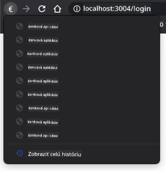

<!--
CO_OP_TRANSLATOR_METADATA:
{
  "original_hash": "8da1b5e2c63f749808858c53f37b8ce7",
  "translation_date": "2025-08-27T22:09:54+00:00",
  "source_file": "7-bank-project/1-template-route/README.md",
  "language_code": "sk"
}
-->
# Vytvorenie bankovej aplikácie, časť 1: HTML šablóny a trasy vo webovej aplikácii

## Kvíz pred prednáškou

[Kvíz pred prednáškou](https://ashy-river-0debb7803.1.azurestaticapps.net/quiz/41)

### Úvod

Od vzniku JavaScriptu v prehliadačoch sa webové stránky stávajú interaktívnejšími a zložitejšími ako kedykoľvek predtým. Webové technológie sa dnes bežne používajú na vytváranie plne funkčných aplikácií, ktoré bežia priamo v prehliadači a nazývame ich [webové aplikácie](https://en.wikipedia.org/wiki/Web_application). Keďže webové aplikácie sú vysoko interaktívne, používatelia nechcú čakať na úplné obnovenie stránky zakaždým, keď vykonajú nejakú akciu. Preto sa používa JavaScript na priamu aktualizáciu HTML pomocou DOM, aby sa zabezpečil plynulejší používateľský zážitok.

V tejto lekcii si položíme základy na vytvorenie bankovej webovej aplikácie, pričom použijeme HTML šablóny na vytvorenie viacerých obrazoviek, ktoré sa môžu zobrazovať a aktualizovať bez potreby opätovného načítania celej HTML stránky.

### Predpoklady

Na testovanie webovej aplikácie, ktorú v tejto lekcii vytvoríme, budete potrebovať lokálny webový server. Ak ho nemáte, môžete si nainštalovať [Node.js](https://nodejs.org) a použiť príkaz `npx lite-server` vo vašom projektovom priečinku. Tento príkaz vytvorí lokálny webový server a otvorí vašu aplikáciu v prehliadači.

### Príprava

Na vašom počítači vytvorte priečinok s názvom `bank` a v ňom súbor s názvom `index.html`. Začneme s týmto HTML [boilerplate](https://en.wikipedia.org/wiki/Boilerplate_code):

```html
<!DOCTYPE html>
<html lang="en">
  <head>
    <meta charset="UTF-8">
    <meta name="viewport" content="width=device-width, initial-scale=1.0">
    <title>Bank App</title>
  </head>
  <body>
    <!-- This is where you'll work -->
  </body>
</html>
```

---

## HTML šablóny

Ak chcete vytvoriť viacero obrazoviek pre webovú stránku, jedným z riešení by bolo vytvoriť jeden HTML súbor pre každú obrazovku, ktorú chcete zobraziť. Toto riešenie však prináša určité nevýhody:

- Pri prepínaní obrazoviek musíte načítať celé HTML, čo môže byť pomalé.
- Je ťažké zdieľať údaje medzi rôznymi obrazovkami.

Iným prístupom je mať iba jeden HTML súbor a definovať viacero [HTML šablón](https://developer.mozilla.org/docs/Web/HTML/Element/template) pomocou elementu `<template>`. Šablóna je opakovane použiteľný HTML blok, ktorý sa v prehliadači nezobrazuje a musí byť inštanciovaný počas behu pomocou JavaScriptu.

### Úloha

Vytvoríme bankovú aplikáciu s dvoma obrazovkami: prihlasovacou stránkou a dashboardom. Najprv pridajme do tela HTML zástupný element, ktorý použijeme na inštanciovanie rôznych obrazoviek našej aplikácie:

```html
<div id="app">Loading...</div>
```

Pridali sme mu atribút `id`, aby sme ho neskôr mohli ľahšie nájsť pomocou JavaScriptu.

> Tip: Keďže obsah tohto elementu bude nahradený, môžeme doň vložiť správu alebo indikátor načítania, ktorý sa zobrazí počas načítavania aplikácie.

Ďalej pridajme pod tento element HTML šablónu pre prihlasovaciu stránku. Zatiaľ do nej vložíme iba nadpis a sekciu obsahujúcu odkaz, ktorý použijeme na navigáciu.

```html
<template id="login">
  <h1>Bank App</h1>
  <section>
    <a href="/dashboard">Login</a>
  </section>
</template>
```

Potom pridáme ďalšiu HTML šablónu pre stránku dashboardu. Táto stránka bude obsahovať rôzne sekcie:

- Hlavičku s nadpisom a odkazom na odhlásenie
- Aktuálny zostatok na bankovom účte
- Zoznam transakcií zobrazený v tabuľke

```html
<template id="dashboard">
  <header>
    <h1>Bank App</h1>
    <a href="/login">Logout</a>
  </header>
  <section>
    Balance: 100$
  </section>
  <section>
    <h2>Transactions</h2>
    <table>
      <thead>
        <tr>
          <th>Date</th>
          <th>Object</th>
          <th>Amount</th>
        </tr>
      </thead>
      <tbody></tbody>
    </table>
  </section>
</template>
```

> Tip: Pri vytváraní HTML šablón, ak chcete vidieť, ako budú vyzerať, môžete zakomentovať riadky `<template>` a `</template>` tak, že ich obalíte do `<!-- -->`.

✅ Prečo si myslíte, že používame atribúty `id` na šablónach? Mohli by sme použiť niečo iné, napríklad triedy?

## Zobrazovanie šablón pomocou JavaScriptu

Ak si aktuálny HTML súbor otvoríte v prehliadači, uvidíte, že zostane zobrazené iba `Loading...`. Je to preto, že musíme pridať JavaScriptový kód na inštanciovanie a zobrazenie HTML šablón.

Inštanciovanie šablóny sa zvyčajne vykonáva v 3 krokoch:

1. Získanie elementu šablóny v DOM, napríklad pomocou [`document.getElementById`](https://developer.mozilla.org/docs/Web/API/Document/getElementById).
2. Klonovanie elementu šablóny pomocou [`cloneNode`](https://developer.mozilla.org/docs/Web/API/Node/cloneNode).
3. Pripojenie k DOM pod viditeľný element, napríklad pomocou [`appendChild`](https://developer.mozilla.org/docs/Web/API/Node/appendChild).

✅ Prečo musíme šablónu klonovať pred jej pripojením k DOM? Čo si myslíte, že by sa stalo, keby sme tento krok vynechali?

### Úloha

Vytvorte nový súbor s názvom `app.js` vo vašom projektovom priečinku a importujte tento súbor do sekcie `<head>` vášho HTML:

```html
<script src="app.js" defer></script>
```

Teraz v `app.js` vytvoríme novú funkciu `updateRoute`:

```js
function updateRoute(templateId) {
  const template = document.getElementById(templateId);
  const view = template.content.cloneNode(true);
  const app = document.getElementById('app');
  app.innerHTML = '';
  app.appendChild(view);
}
```

To, čo tu robíme, sú presne 3 kroky popísané vyššie. Inštanciujeme šablónu s `id` `templateId` a jej klonovaný obsah vložíme do nášho zástupného elementu aplikácie. Všimnite si, že musíme použiť `cloneNode(true)`, aby sme skopírovali celý podstrom šablóny.

Teraz zavolajte túto funkciu s jednou zo šablón a pozrite sa na výsledok.

```js
updateRoute('login');
```

✅ Aký je účel tohto kódu `app.innerHTML = '';`? Čo sa stane, ak ho vynecháme?

## Vytváranie trás

Keď hovoríme o webovej aplikácii, nazývame *Routing* zámer mapovať **URL adresy** na konkrétne obrazovky, ktoré by sa mali zobraziť. Na webovej stránke s viacerými HTML súbormi sa to deje automaticky, pretože cesty k súborom sa odrážajú v URL. Napríklad s týmito súbormi vo vašom projektovom priečinku:

```
mywebsite/index.html
mywebsite/login.html
mywebsite/admin/index.html
```

Ak vytvoríte webový server s koreňom `mywebsite`, mapovanie URL bude:

```
https://site.com            --> mywebsite/index.html
https://site.com/login.html --> mywebsite/login.html
https://site.com/admin/     --> mywebsite/admin/index.html
```

Avšak pre našu webovú aplikáciu používame jeden HTML súbor obsahujúci všetky obrazovky, takže toto predvolené správanie nám nepomôže. Musíme túto mapu vytvoriť manuálne a aktualizovať zobrazenú šablónu pomocou JavaScriptu.

### Úloha

Použijeme jednoduchý objekt na implementáciu [mapy](https://en.wikipedia.org/wiki/Associative_array) medzi cestami URL a našimi šablónami. Pridajte tento objekt na začiatok vášho súboru `app.js`.

```js
const routes = {
  '/login': { templateId: 'login' },
  '/dashboard': { templateId: 'dashboard' },
};
```

Teraz trochu upravíme funkciu `updateRoute`. Namiesto toho, aby sme priamo odovzdávali `templateId` ako argument, chceme ho získať najprv pohľadom na aktuálnu URL a potom použiť našu mapu na získanie zodpovedajúcej hodnoty `templateId`. Môžeme použiť [`window.location.pathname`](https://developer.mozilla.org/docs/Web/API/Location/pathname) na získanie iba časti cesty z URL.

```js
function updateRoute() {
  const path = window.location.pathname;
  const route = routes[path];

  const template = document.getElementById(route.templateId);
  const view = template.content.cloneNode(true);
  const app = document.getElementById('app');
  app.innerHTML = '';
  app.appendChild(view);
}
```

Tu sme mapovali trasy, ktoré sme deklarovali, na zodpovedajúce šablóny. Môžete si overiť, že to funguje správne, manuálnou zmenou URL vo vašom prehliadači.

✅ Čo sa stane, ak zadáte neznámu cestu do URL? Ako by sme to mohli vyriešiť?

## Pridanie navigácie

Ďalším krokom pre našu aplikáciu je pridanie možnosti navigovať medzi stránkami bez potreby manuálne meniť URL. To zahŕňa dve veci:

1. Aktualizáciu aktuálnej URL
2. Aktualizáciu zobrazenej šablóny na základe novej URL

Druhú časť sme už vyriešili pomocou funkcie `updateRoute`, takže musíme zistiť, ako aktualizovať aktuálnu URL.

Budeme musieť použiť JavaScript a konkrétne [`history.pushState`](https://developer.mozilla.org/docs/Web/API/History/pushState), ktorý umožňuje aktualizovať URL a vytvoriť nový záznam v histórii prehliadania bez opätovného načítania HTML.

> Poznámka: Hoci HTML element kotvy [`<a href>`](https://developer.mozilla.org/docs/Web/HTML/Element/a) môže byť použitý na vytváranie hypertextových odkazov na rôzne URL, predvolene spôsobí, že prehliadač načíta HTML znova. Je potrebné zabrániť tomuto správaniu pri spracovaní trás pomocou vlastného JavaScriptu, použitím funkcie `preventDefault()` na udalosti kliknutia.

### Úloha

Vytvorme novú funkciu, ktorú môžeme použiť na navigáciu v našej aplikácii:

```js
function navigate(path) {
  window.history.pushState({}, path, path);
  updateRoute();
}
```

Táto metóda najprv aktualizuje aktuálnu URL na základe zadanej cesty a potom aktualizuje šablónu. Vlastnosť `window.location.origin` vráti koreň URL, čo nám umožňuje rekonštruovať úplnú URL z danej cesty.

Teraz, keď máme túto funkciu, môžeme vyriešiť problém, ktorý máme, ak cesta nezodpovedá žiadnej definovanej trase. Upravením funkcie `updateRoute` pridáme záložné riešenie na jednu z existujúcich trás, ak nenájdeme zhodu.

```js
function updateRoute() {
  const path = window.location.pathname;
  const route = routes[path];

  if (!route) {
    return navigate('/login');
  }

  ...
```

Ak sa trasa nenájde, teraz budeme presmerovaní na prihlasovaciu stránku.

Vytvorme teraz funkciu na získanie URL pri kliknutí na odkaz a na zabránenie predvoleného správania prehliadača:

```js
function onLinkClick(event) {
  event.preventDefault();
  navigate(event.target.href);
}
```

Dokončime navigačný systém pridaním väzieb na naše odkazy *Login* a *Logout* v HTML.

```html
<a href="/dashboard" onclick="onLinkClick(event)">Login</a>
...
<a href="/login" onclick="onLinkClick(event)">Logout</a>
```

Objekt `event` vyššie zachytáva udalosť `click` a odovzdáva ju našej funkcii `onLinkClick`.

Pomocou atribútu [`onclick`](https://developer.mozilla.org/docs/Web/API/GlobalEventHandlers/onclick) priraďte udalosť `click` kódu JavaScriptu, tu volaniu funkcie `navigate()`.

Vyskúšajte kliknutie na tieto odkazy, teraz by ste mali byť schopní navigovať medzi rôznymi obrazovkami vašej aplikácie.

✅ Metóda `history.pushState` je súčasťou štandardu HTML5 a je implementovaná vo [všetkých moderných prehliadačoch](https://caniuse.com/?search=pushState). Ak vytvárate webovú aplikáciu pre staršie prehliadače, existuje trik, ktorý môžete použiť namiesto tohto API: použitie [hashu (`#`)](https://en.wikipedia.org/wiki/URI_fragment) pred cestou umožňuje implementovať trasovanie, ktoré funguje s bežnou navigáciou kotvami a nenačítava stránku znova, pretože jeho účelom bolo vytvárať vnútorné odkazy v rámci stránky.

## Spracovanie tlačidiel späť a dopredu v prehliadači

Použitie `history.pushState` vytvára nové záznamy v histórii navigácie prehliadača. Môžete to overiť podržaním *tlačidla späť* vo vašom prehliadači, malo by sa zobraziť niečo takéto:



Ak skúsite niekoľkokrát kliknúť na tlačidlo späť, uvidíte, že aktuálna URL sa mení a história sa aktualizuje, ale stále sa zobrazuje rovnaká šablóna.

Je to preto, že aplikácia nevie, že musíme zavolať `updateRoute()` zakaždým, keď sa história zmení. Ak sa pozriete na [dokumentáciu `history.pushState`](https://developer.mozilla.org/docs/Web/API/History/pushState), môžete vidieť, že ak sa stav zmení - čo znamená, že sme sa presunuli na inú URL - je spustená udalosť [`popstate`](https://developer.mozilla.org/docs/Web/API/Window/popstate_event). Použijeme to na vyriešenie tohto problému.

### Úloha

Aby sme zabezpečili, že zobrazená šablóna sa aktualizuje, keď sa história prehliadača zmení, pripojíme novú funkciu, ktorá volá `updateRoute()`. Urobíme to na konci nášho súboru `app.js`:

```js
window.onpopstate = () => updateRoute();
updateRoute();
```

> Poznámka: Na deklaráciu nášho obslužného programu udalosti `popstate` sme tu použili [šípkovú funkciu](https://developer.mozilla.org/docs/Web/JavaScript/Reference/Functions/Arrow_functions) pre stručnosť, ale fungovala by aj bežná funkcia.

Tu je video na zopakovanie šípkových funkcií:

[](https://youtube.com/watch?v=OP6eEbOj2sc "Šípkové funkcie")

> 🎥 Kliknite na obrázok vyššie pre video o šípkových funkciách.

Teraz skúste použiť tlačidlá späť a dopredu vo vašom prehliadači a overte, že zobrazená trasa sa tentokrát správne aktualizuje.

---

## 🚀 Výzva

Pridajte novú šablónu a trasu pre tretiu stránku, ktorá zobrazí kredity pre túto aplikáciu.

## Kvíz po prednáške

[Kvíz po prednáške](https://ashy-river-0debb7803.1.azurestaticapps.net/quiz/42)

## Prehľad a samoštúdium

Trasovanie je jednou z prekvapivo zložitých častí vývoja webu, najmä keď sa web presúva od správania s obnovovaním stránok k obnovovaniu stránok v rámci aplikácií typu Single Page Application. Prečítajte si niečo o tom, [ako služba Azure Static Web App](https://docs.microsoft.com/azure/static-web-apps/routes/?WT.mc_id=academic-77807-sagibbon) spracováva trasovanie. Dokážete vysvetliť, prečo sú niektoré rozhodnutia popísané v tomto dokumente nevyhnutné?

## Zadanie

[Vylepšite trasovanie](assignment.md)

---

**Upozornenie**:  
Tento dokument bol preložený pomocou služby AI prekladu [Co-op Translator](https://github.com/Azure/co-op-translator). Aj keď sa snažíme o presnosť, prosím, berte na vedomie, že automatizované preklady môžu obsahovať chyby alebo nepresnosti. Pôvodný dokument v jeho pôvodnom jazyku by mal byť považovaný za autoritatívny zdroj. Pre kritické informácie sa odporúča profesionálny ľudský preklad. Nie sme zodpovední za akékoľvek nedorozumenia alebo nesprávne interpretácie vyplývajúce z použitia tohto prekladu.