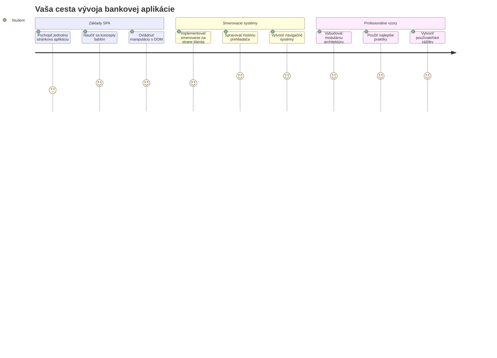
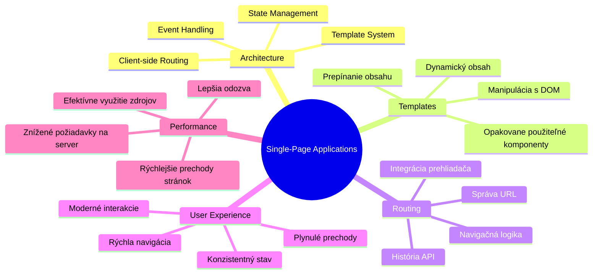
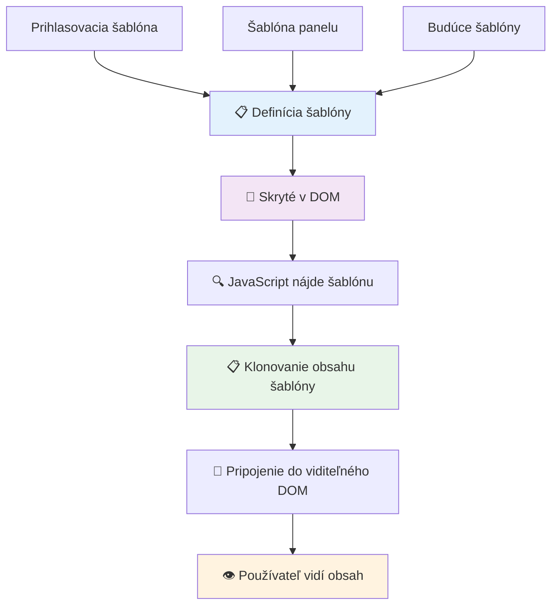
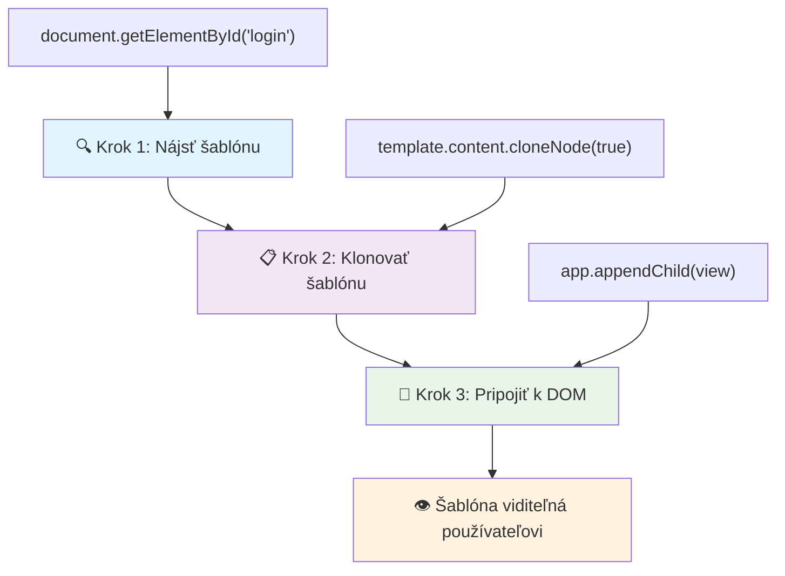
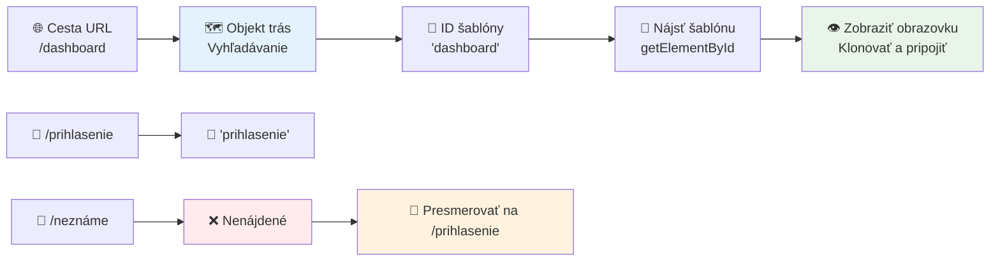
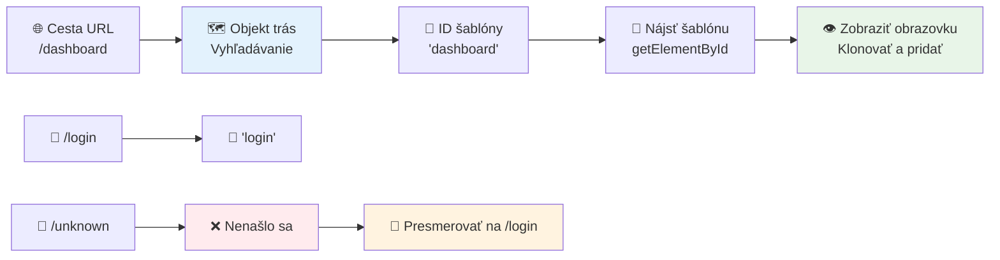
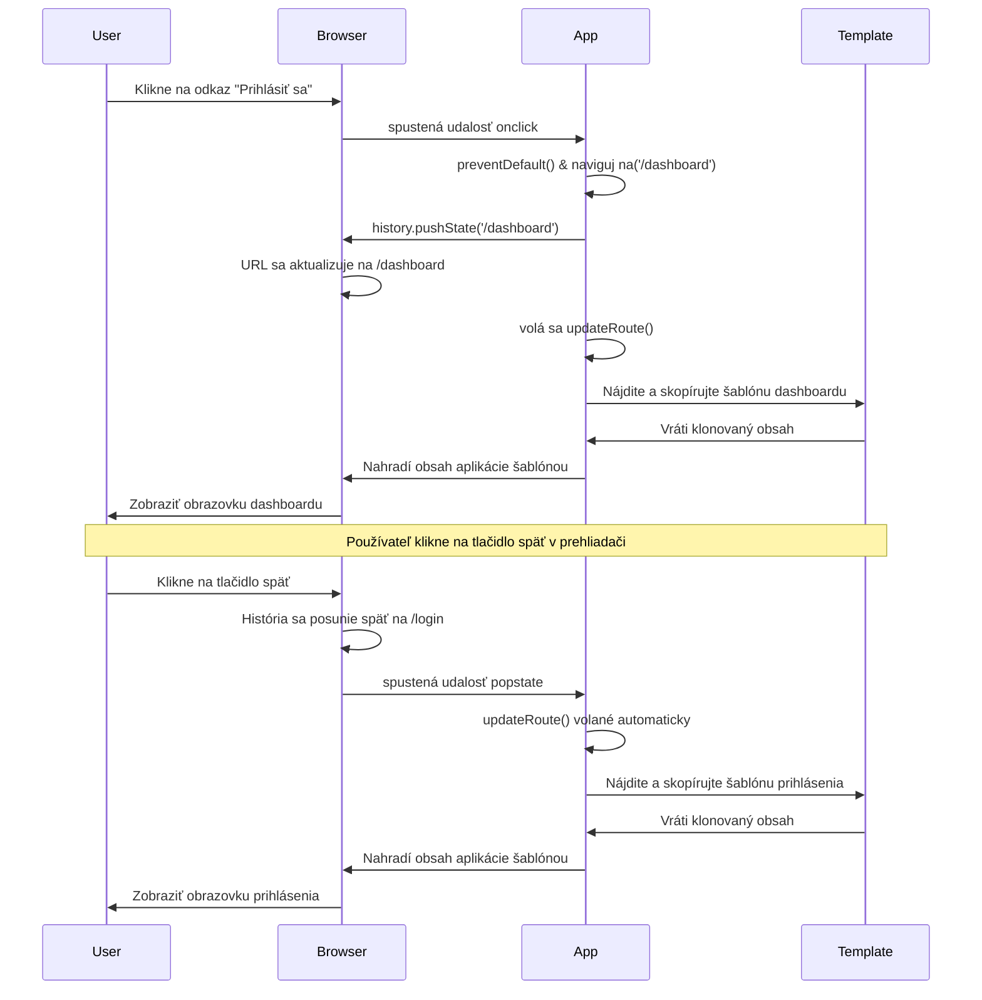
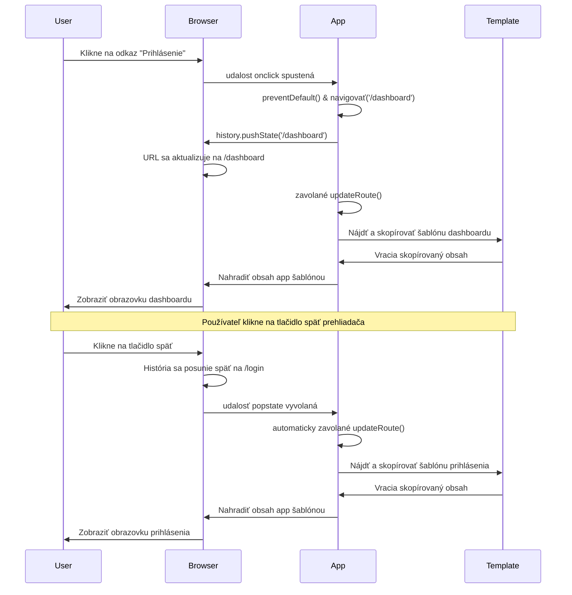
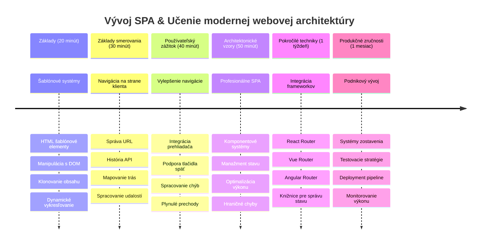

<!--
CO_OP_TRANSLATOR_METADATA:
{
  "original_hash": "351678bece18f07d9daa987a881fb062",
  "translation_date": "2026-01-07T04:57:01+00:00",
  "source_file": "7-bank-project/1-template-route/README.md",
  "language_code": "sk"
}
-->
# Vytvorenie bankovej aplikácie časť 1: HTML šablóny a trasy vo webovej aplikácii


Keď navigačný počítač Apollo 11 v roku 1969 smeroval na Mesiac, musel prepínať medzi rôznymi programami bez reštartu celého systému. Moderné webové aplikácie fungujú podobne – menia to, čo vidíte, bez znovunačítania všetkého od začiatku. To prináša plynulý a citlivý zážitok, aký dnes používatelia očakávajú.

Na rozdiel od tradičných webových stránok, ktoré pri každej interakcii načítajú celú stránku znova, moderné webové aplikácie aktualizujú iba časti, ktoré je potrebné zmeniť. Tento prístup, podobne ako misijné velenie prepínajúce medzi rôznymi displejmi a zároveň udržiavajúce neustálu komunikáciu, vytvára plynulý zážitok, na ktorý sme si zvykli.

Tu je, čo robí rozdiel tak dramatickým:

| Tradičné viacstranové aplikácie | Moderné jedno-stranové aplikácie |
|---------------------------------|---------------------------------|
| **Navigácia** | Úplné načítanie stránky pre každú obrazovku | Okamžité prepínanie obsahu |
| **Výkon** | Pomalejšie kvôli kompletnému stiahnutiu HTML | Rýchlejšie s čiastočnými aktualizáciami |
| **Používateľský zážitok** | Trhané bliknutie stránok | Plynulé, aplikácii podobné prechody |
| **Zdieľanie údajov** | Obtiažne medzi stránkami | Jednoduché riadenie stavu |
| **Vývoj** | Viac HTML súborov na údržbu | Jediný HTML s dynamickými šablónami |

**Pochopenie vývoja:**
- **Tradičné aplikácie** vyžadujú požiadavky na server pri každej navigácii
- **Moderné SPA** sa načítajú raz a obsah aktualizujú dynamicky pomocou JavaScriptu
- **Pokiaľ ide o očakávania používateľov**, preferujú okamžité, bezproblémové interakcie
- **Výhody výkonu** zahŕňajú zníženú spotrebu šírky pásma a rýchlejšie odpovede

V tejto lekcii vytvoríme bankovú aplikáciu s viacerými obrazovkami, ktoré plynulo spolupracujú. Rovnako ako vedci používajú modulárne prístroje, ktoré možno preexperimentovať na rôzne experimenty, použijeme HTML šablóny ako opakovane použiteľné komponenty, ktoré môžu byť zobrazené podľa potreby.

Budete pracovať s HTML šablónami (opakovane použiteľné vzory pre rôzne obrazovky), JavaScriptovým smerovaním (systém, ktorý prepína medzi obrazovkami) a rozhraním prehliadača pre históriu (ktoré zabezpečuje správnu funkciu tlačidla späť). Toto sú rovnaké základné techniky, ktoré používajú frameworky ako React, Vue a Angular.

Na konci budete mať funkčnú bankovú aplikáciu, ktorá demonštruje profesionálne princípy jedno-stranovej aplikácie.


## Prednáškový kvíz

[Prednáškový kvíz](https://ff-quizzes.netlify.app/web/quiz/41)

### Čo budete potrebovať

Budeme potrebovať lokálny webový server na testovanie našej bankovej aplikácie – nebojte sa, je to jednoduchšie, než to znie! Ak ešte nemáte server nastavený, jednoducho si nainštalujte [Node.js](https://nodejs.org) a spustite `npx lite-server` zo svojho projektového priečinka. Tento užitočný príkaz spustí lokálny server a automaticky otvorí vašu aplikáciu v prehliadači.

### Príprava

Na vašom počítači vytvorte priečinok s názvom `bank` a vo vnútri súbor `index.html`. Začneme touto HTML [vzorovou štruktúrou](https://en.wikipedia.org/wiki/Boilerplate_code):

```html
<!DOCTYPE html>
<html lang="en">
  <head>
    <meta charset="UTF-8">
    <meta name="viewport" content="width=device-width, initial-scale=1.0">
    <title>Bank App</title>
  </head>
  <body>
    <!-- This is where you'll work -->
  </body>
</html>
```

**Čo táto východisková štruktúra poskytuje:**
- **Zavádza** štruktúru dokumentu HTML5 so správnym vyhlásením DOCTYPE
- **Nastavuje** kódovanie znakov na UTF-8 pre medzinárodnú podporu textu
- **Umožňuje** responzívny dizajn pomocou meta značky viewport pre kompatibilitu s mobilom
- **Nastavuje** popisný názov, ktorý sa zobrazí na záložke prehliadača
- **Vytvára** čisté telo dokumentu, kde budeme budovať našu aplikáciu

> 📁 **Náhľad štruktúry projektu**
> 
> **Na konci tejto lekcie bude váš projekt obsahovať:**
> ```
> bank/
> ├── index.html      <!-- Main HTML with templates -->
> ├── app.js          <!-- Routing and navigation logic -->
> └── style.css       <!-- (Optional for future lessons) -->
> ```
> 
> **Zodpovednosť súborov:**
> - **index.html**: Obsahuje všetky šablóny a poskytuje štruktúru aplikácie
> - **app.js**: Riadi smerovanie, navigáciu a správu šablón
> - **Šablóny**: Definujú používateľské rozhranie pre prihlasovanie, dashboard a ďalšie obrazovky

---

## HTML šablóny

Šablóny riešia základný problém vo webovom vývoji. Keď Gutenberg vynašiel pohyblivú tlač v 1440. rokoch, uvedomil si, že namiesto vyrezávania celých stránok môže vytvárať opakovane použiteľné písmenkové bloky a usporadúvať ich podľa potreby. HTML šablóny fungujú na rovnakom princípe – namiesto vytvárania samostatných HTML súborov pre každú obrazovku definujete opakovane použiteľné štruktúry, ktoré sa môžu zobraziť podľa potreby.


Predstavte si šablóny ako plány pre rôzne časti vašej aplikácie. Rovnako ako architekt vytvára jeden plán a používa ho viackrát namiesto prekrikovania tých istých miestností, my vytvárame šablóny raz a následne ich podľa potreby vytvárame. Prehliadač tieto šablóny drží skryté, až kým ich neaktivuje JavaScript.

Ak chcete vytvoriť viacero obrazoviek pre webovú stránku, jedným riešením je vytvoriť jeden HTML súbor pre každú obrazovku, ktorú chcete zobraziť. Toto riešenie však prináša určité nevýhody:

- Pri prepínaní obrazoviek je potrebné načítať celé HTML znova, čo môže byť pomalé.
- Je ťažké zdieľať údaje medzi rôznymi obrazovkami.

Iná možnosť je mať len jeden HTML súbor a definovať viacero [HTML šablón](https://developer.mozilla.org/docs/Web/HTML/Element/template) pomocou prvku `<template>`. Šablóna je opakovane použiteľný HTML blok, ktorý prehliadač nezobrazuje a musí byť vytvorený za behu pomocou JavaScriptu.

### Poďme to zostrojiť

Vytvoríme bankovú aplikáciu s dvoma hlavnými obrazovkami: prihlasovacou stránkou a dashboardom. Najprv pridáme do nášho HTML tela prvok zástupcu – tu sa budú zobrazovať všetky naše rôzne obrazovky:

```html
<div id="app">Loading...</div>
```

**Čo tento zástupca znamená:**
- **Vytvára** kontajner s ID "app", kde sa budú zobrazovať všetky obrazovky
- **Zobrazuje** správu o načítavaní, kým JavaScript nespustí prvú obrazovku
- **Poskytuje** jedno miesto, kde sa zobrazí náš dynamický obsah
- **Umožňuje** jednoduché cielenie z JavaScriptu cez `document.getElementById()`

> 💡 **Tip pre odborníkov**: Keďže sa obsah tohto prvku bude nahrádzať, môžeme tam dať správu o načítavaní alebo indikátor, ktorý sa zobrazí počas načítavania aplikácie.

Ďalej pridáme pod tým HTML šablónu pre prihlasovaciu stránku. Zatiaľ tam len vložíme nadpis a sekciu obsahujúcu odkaz, ktorý použijeme na navigáciu.

```html
<template id="login">
  <h1>Bank App</h1>
  <section>
    <a href="/dashboard">Login</a>
  </section>
</template>
```

**Analýza tejto prihlasovacej šablóny:**
- **Definuje** šablónu s unikátnym identifikátorom "login" pre snímanie JavaScriptom
- **Obsahuje** hlavný nadpis, ktorý ustanovuje značku aplikácie
- **Obsahuje** sémantický prvok `<section>` na zoskupenie súvisiaceho obsahu
- **Poskytuje** navigačný odkaz, ktorý presmeruje používateľov na dashboard

Potom pridáme ďalšiu HTML šablónu pre dashboard. Táto stránka bude obsahovať rôzne sekcie:

- Hlavičku s titulkom a odkazom na odhlásenie
- Aktuálny zostatok bankového účtu
- Zoznam transakcií zobrazený v tabuľke

```html
<template id="dashboard">
  <header>
    <h1>Bank App</h1>
    <a href="/login">Logout</a>
  </header>
  <section>
    Balance: 100$
  </section>
  <section>
    <h2>Transactions</h2>
    <table>
      <thead>
        <tr>
          <th>Date</th>
          <th>Object</th>
          <th>Amount</th>
        </tr>
      </thead>
      <tbody></tbody>
    </table>
  </section>
</template>
```

**Porozumejme každej časti dashboardu:**
- **Štruktúruje** stránku pomocou sémantického prvku `<header>` obsahujúceho navigáciu
- **Zobrazuje** názov aplikácie konzistentne na všetkých obrazovkách pre branding
- **Poskytuje** odkaz na odhlásenie, ktorý vedie späť na prihlasovaciu obrazovku
- **Zobrazuje** aktuálny stav účtu v samostatnej sekcii
- **Organizuje** dáta transakcií pomocou správne štruktúrovanej HTML tabuľky
- **Definuje** hlavičky stĺpcov tabuľky pre Dátum, Objekt a Sumu
- **Necháva** telo tabuľky prázdne pre dynamické dopĺňanie obsahu neskôr

> 💡 **Tip pre odborníkov**: Pri tvorbe HTML šablón, ak chcete vidieť, ako bude vyzerať, môžete zakomentovať riadky `<template>` a `</template>` pomocou `<!-- -->`.

### 🔄 **Pedagogická kontrola**
**Pochopenie šablónového systému**: Pred implementáciou JavaScriptu sa uistite, že rozumiete:
- ✅ Ako sa šablóny líšia od bežných HTML prvkov
- ✅ Prečo sú šablóny skryté, až kým ich JavaScript neaktivuje
- ✅ Význame sémantickej HTML štruktúry v šablónach
- ✅ Ako šablóny umožňujú opakovane použiteľné UI komponenty

**Rýchly seba-test**: Čo sa stane, ak odstránite značky `<template>` okolo vášho HTML?
*Odpoveď: Obsah sa okamžite zobrazí a stratí funkciu šablóny*

**Výhody architektúry**: Šablóny prinášajú:
- **Opakovateľnosť**: Jedna definícia, viac inštancií
- **Výkon**: Žiadne opakované parsovanie HTML
- **Údržba**: Centralizovaná UI štruktúra
- **Flexibilita**: Dynamické prepínanie obsahu

✅ Prečo podľa vás používame `id` atribúty na šablónach? Mohli by sme použiť niečo iné, napríklad triedy?

## Oživenie šablón pomocou JavaScriptu

Teraz potrebujeme spraviť naše šablóny funkčnými. Rovnako ako 3D tlačiareň vezme digitálny plán a vytvorí fyzický predmet, JavaScript vezme naše skryté šablóny a vytvorí viditeľné, interaktívne prvky, ktoré môžu používatelia vidieť a používať.

Proces nasleduje tri konzistentné kroky, ktoré tvoria základ moderného webového vývoja. Keď tento vzor pochopíte, rozpoznáte ho v mnohých frameworkoch a knižniciach.

Ak vyskúšate aktuálny HTML súbor v prehliadači, uvidíte, že zostáva zobrazená správa `Loading...`. Je to preto, že potrebujeme pridať JavaScriptový kód na vytvorenie a zobrazenie HTML šablón.

Vytvorenie šablóny zvyčajne prebieha v 3 krokoch:

1. Načítať šablónový prvok v DOM, napríklad pomocou [`document.getElementById`](https://developer.mozilla.org/docs/Web/API/Document/getElementById).
2. Naklonovať šablónový prvok pomocou [`cloneNode`](https://developer.mozilla.org/docs/Web/API/Node/cloneNode).
3. Pripojiť ho k DOM pod viditeľný prvok, napríklad pomocou [`appendChild`](https://developer.mozilla.org/docs/Web/API/Node/appendChild).


**Vizuálne rozdelenie procesu:**
- **Krok 1** lokalizuje skrytú šablónu v štruktúre DOM
- **Krok 2** vytvára pracovnú kópiu, ktorú možno bezpečne upravovať
- **Krok 3** vloží kópiu do viditeľnej časti stránky
- **Výsledok** je funkčná obrazovka, s ktorou môžu používatelia pracovať

✅ Prečo je potrebné naklonovať šablónu pred pripojením k DOM? Čo podľa vás nastane, ak tento krok vynecháme?

### Úloha

Vytvorte nový súbor `app.js` vo vašom projektovom priečinku a naimportujte ho v `<head>` sekcii vášho HTML:

```html
<script src="app.js" defer></script>
```

**Čo tento import skriptu znamená:**
- **Prepojuje** JavaScriptový súbor s naším HTML dokumentom
- **Používa** atribút `defer`, aby sa skript spustil po dokončení parsovania HTML
- **Umožňuje** prístup ku všetkým DOM prvkom, keďže sú pred vykonaním skriptu kompletne načítané
- **Postupuje** podľa moderných najlepších praktík načítavania skriptov pre výkon

Teraz v `app.js` vytvoríme novú funkciu `updateRoute`:

```js
function updateRoute(templateId) {
  const template = document.getElementById(templateId);
  const view = template.content.cloneNode(true);
  const app = document.getElementById('app');
  app.innerHTML = '';
  app.appendChild(view);
}
```

**Krok za krokom, čo sa deje:**
- **Lokalizuje** šablónový prvok pomocou jeho jedinečného ID
- **Vytvára** hlbokú kópiu obsahu šablóny pomocou `cloneNode(true)`
- **Nájde** kontajner aplikácie, kde sa bude obsah zobrazovať
- **Vyčistí** existujúci obsah kontajnera aplikácie
- **Vloží** naklonovaný obsah šablóny do viditeľného DOM

Teraz túto funkciu zavolajte s jednou zo šablón a pozrite sa na výsledok.

```js
updateRoute('login');
```

**Čo toto volanie funkcie dosahuje:**
- **Aktivuje** prihlasovaciu šablónu tým, že odovzdá jej ID ako parameter
- **Demonštruje**, ako programovo prepínať medzi rôznymi obrazovkami aplikácie
- **Zobrazí** prihlasovaciu obrazovku namiesto správy „Loading...“

✅ Aký je účel tohto kódu `app.innerHTML = '';`? Čo sa stane bez neho?

## Vytváranie trás

Smerovanie je v podstate prepojenie URL na správny obsah. Predstavte si, ako v minulosti telefonní operátori používali prepínače na prepojenie hovorov – prijali prichádzajúcu požiadavku a poslali ju na správnu destináciu. Webový routing funguje podobne, preberá URL požiadavku a rozhoduje, aký obsah sa má zobraziť.


Tradične webové servery zvládali toto servírovaním rôznych HTML súborov pre rôzne URL. Keďže ale vytvárame jednoplatformovú aplikáciu, musíme to smerovanie riešiť sami pomocou JavaScriptu. Tento prístup nám dáva väčšiu kontrolu nad používateľským zážitkom a výkonom.


**Ako prebieha tok smerovania:**
- **Zmena URL** spustí vyhľadávanie v našom konfiguračnom objekte trás
- **Platné trasy** mapujú na konkrétne ID šablón pre vykreslenie
- **Neplatné trasy** spustia záložné správanie, aby sa predišlo chybným stavom
- **Vykreslenie šablóny** nasleduje trojkrokový proces, ktorý sme sa naučili skôr

Keď hovoríme o webovej aplikácii, *Routing* voláme zámer mapovať **URL** na konkrétne obrazovky, ktoré sa majú zobraziť. Na webovej stránke s viacerými HTML súbormi sa to deje automaticky, keďže cesty k súborom sa premietajú do URL. Napríklad s týmito súbormi vo vašom projektovom priečinku:

```
mywebsite/index.html
mywebsite/login.html
mywebsite/admin/index.html
```

Ak vytvoríte webový server so zázemím `mywebsite`, mapovanie URL bude:

```
https://site.com            --> mywebsite/index.html
https://site.com/login.html --> mywebsite/login.html
https://site.com/admin/     --> mywebsite/admin/index.html
```

Avšak pre našu webovú aplikáciu používame jeden HTML súbor obsahujúci všetky obrazovky, takže toto predvolené správanie nám nepomôže. Musíme túto mapu vytvoriť manuálne a aktualizovať zobrazenú šablónu pomocou JavaScriptu.

### Úloha

Použijeme jednoduchý objekt na implementáciu [mapy](https://en.wikipedia.org/wiki/Associative_array) medzi URL cestami a našimi šablónami. Pridajte tento objekt na začiatok vášho súboru `app.js`.

```js
const routes = {
  '/login': { templateId: 'login' },
  '/dashboard': { templateId: 'dashboard' },
};
```

**Čo táto konfigurácia trás znamená:**
- **Definuje** mapovanie medzi URL cestami a identifikátormi šablón
- **Používa** syntaktický objekt, kde kľúče sú URL cesty a hodnoty obsahujú informácie o šablóne
- **Umožňuje** jednoduché vyhľadanie, ktorá šablóna sa má zobraziť pre danú URL
- **Poskytuje** škálovateľnú štruktúru pre pridanie nových trás v budúcnosti
Teraz trochu upravme funkciu `updateRoute`. Namiesto priameho odovzdávania `templateId` ako argumentu ho chceme načítať tak, že najskôr pozrieme na aktuálnu URL a potom použijeme našu mapu na získanie zodpovedajúcej hodnoty ID šablóny. Môžeme použiť [`window.location.pathname`](https://developer.mozilla.org/docs/Web/API/Location/pathname) na získanie iba časti cesty z URL.

```js
function updateRoute() {
  const path = window.location.pathname;
  const route = routes[path];

  const template = document.getElementById(route.templateId);
  const view = template.content.cloneNode(true);
  const app = document.getElementById('app');
  app.innerHTML = '';
  app.appendChild(view);
}
```

**Rozloženie, čo sa tu deje:**
- **Extrahuje** aktuálnu cestu z URL prehliadača pomocou `window.location.pathname`
- **Vyhľadáva** zodpovedajúcu konfiguráciu trasy v našom objekte routes
- **Získava** ID šablóny z konfigurácie trasy
- **Nasleduje** rovnaký proces vykresľovania šablón ako predtým
- **Vytvára** dynamický systém, ktorý reaguje na zmeny URL

Tu sme napasovali deklarované trasy na zodpovedajúcu šablónu. Môžete si to vyskúšať a zistiť, že funguje správne manuálnou zmenou URL vo vašom prehliadači.

✅ Čo sa stane, ak zadáte neznámu cestu v URL? Ako by sme to mohli vyriešiť?

## Pridanie navigácie

Keď máme nastavené smerovanie, používatelia potrebujú spôsob, ako sa v aplikácii pohybovať. Tradičné webové stránky pri kliknutí na odkazy načítavajú celé stránky znova, ale my chceme aktualizovať URL aj obsah bez obnovenia stránky. To vytvára plynulejší zážitok podobný tomu, ako desktopové aplikácie prepínajú medzi rôznymi zobrazeniami.

Musíme koordinovať dve veci: aktualizovať URL prehliadača, aby používatelia mohli záložkovať stránky a zdieľať odkazy, a zároveň zobraziť príslušný obsah. Pri správnej implementácii to vytvára hladkú navigáciu, akú používatelia očakávajú od moderných aplikácií.


### 🔄 **Pedagogická kontrola**
**Architektúra Single-Page Application**: Overte si svoje pochopenie celého systému:
- ✅ Ako sa líši klientské smerovanie od tradičného serverového smerovania?
- ✅ Prečo je API histórie nevyhnutné pre správnu navigáciu v SPA?
- ✅ Ako šablóny umožňujú dynamický obsah bez obnovenia stránky?
- ✅ Akú úlohu zohráva spracovanie udalostí pri zachytávaní navigácie?

**Integrácia systému**: Vaša SPA demonštruje:
- **Správu šablón**: znovupoužiteľné UI komponenty s dynamickým obsahom
- **Klientské smerovanie**: správa URL bez požiadaviek na server
- **Udalostne riadenú architektúru**: responzívna navigácia a používateľské interakcie
- **Integráciu s prehliadačom**: podpora histórie a tlačidiel späť/vpred
- **Optimalizáciu výkonu**: rýchle prechody a znížené zaťaženie servera

**Profesionálne vzory**: Implementovali ste:
- **Oddelenie modelu a zobrazenia**: šablóny oddelené od aplikačnej logiky
- **Správu stavu**: stav URL synchronizovaný so zobrazovaným obsahom
- **Progresívne vylepšenie**: JavaScript rozširuje základnú funkcionalitu HTML
- **Používateľskú skúsenosť**: hladká, aplikačná navigácia bez obnovenia stránky

> � **Pohľad do architektúry**: Komponenty navigačného systému
>
> **Čo budujete:**
> - **🔄 Správa URL**: aktualizuje adresný riadok prehliadača bez obnovy stránky
> - **📋 Systém šablón**: dynamicky vymieňa obsah podľa aktuálnej trasy  
> - **📚 Integrácia histórie**: udržiava funkčnosť tlačidiel späť/vpred
> - **🛡️ Spracovanie chýb**: elegantné záložné riešenia pre neplatné alebo chýbajúce trasy
>
> **Ako komponenty spolupracujú:**
> - **Počúva** na udalosti navigácie (kliknutia, zmeny histórie)
> - **Aktualizuje** URL pomocou History API
> - **Vykresľuje** príslušnú šablónu pre novú trasu
> - **Zabezpečuje** bezproblémový používateľský zážitok

Ďalším krokom pre našu aplikáciu je pridať možnosť navigovať medzi stránkami bez potreby manuálne meniť URL. Znamená to dve veci:

  1. Aktualizovať aktuálnu URL
  2. Aktualizovať zobrazenú šablónu na základe novej URL

Druhú časť sme už pokryli funkciou `updateRoute`, takže teraz musíme vymyslieť, ako aktualizovať aktuálnu URL.

Budeme musieť použiť JavaScript, konkrétne [`history.pushState`](https://developer.mozilla.org/docs/Web/API/History/pushState), ktorý umožňuje aktualizovať URL a vytvoriť nový záznam v histórii prehliadača bez obnovenia HTML.

> ⚠️ **Dôležitá poznámka**: HTML prvok kotevného odkazu [`<a href>`](https://developer.mozilla.org/docs/Web/HTML/Element/a) môže byť použitý samostatne na vytváranie hyperodkazov na rôzne URL, ale predvolene spôsobí obnovenie stránky. Pri spracovaní smerovania vlastným javascriptom je potrebné tomuto správaniu zabrániť pomocou funkcie preventDefault() pri udalosti kliknutia.

### Úloha

Vytvorme novú funkciu, ktorú môžeme použiť na navigáciu v našej aplikácii:

```js
function navigate(path) {
  window.history.pushState({}, path, path);
  updateRoute();
}
```

**Pochopenie tejto navigačnej funkcie:**
- **Aktualizuje** URL prehliadača na novú cestu pomocou `history.pushState`
- **Pridáva** nový záznam do zásobníka histórie pre správnu podporu tlačidiel späť/vpred
- **Vyvoláva** funkciu `updateRoute()` na zobrazenie zodpovedajúcej šablóny
- **Zachováva** zážitok single-page aplikácie bez obnovenia stránky

Táto metóda najskôr aktualizuje aktuálnu URL na základe danej cesty, potom aktualizuje šablónu. Vlastnosť `window.location.origin` vracia koreň URL, čo nám umožňuje zostaviť úplnú URL z danej cesty.

Keď už máme túto funkciu, môžeme sa postarať o problém, ktorý nastane, ak cesta nezodpovedá žiadnej definovanej trase. Upraviť funkciu `updateRoute` tak, že pridáme záložné riešenie na niektorú z existujúcich trás, ak nenájdeme zhody.

```js
function updateRoute() {
  const path = window.location.pathname;
  const route = routes[path];

  if (!route) {
    return navigate('/login');
  }

  const template = document.getElementById(route.templateId);
  const view = template.content.cloneNode(true);
  const app = document.getElementById('app');
  app.innerHTML = '';
  app.appendChild(view);
}
```

**Kľúčové body na zapamätanie:**
- **Kontroluje**, či cesta má definovanú trasu
- **Presmeruje** na prihlasovaciu stránku, keď sa pristupuje k neplatnej trase
- **Poskytuje** záložný mechanizmus, ktorý zabraňuje prerušenému navigovaniu
- **Zabezpečuje**, že používatelia vždy vidia platnú obrazovku, aj pri nesprávnych URL

Ak trasu nenájdeme, teraz presmerujeme na stránku `login`.

Teraz vytvorme funkciu, ktorá získa URL pri kliknutí na odkaz a zabráni predvolenému správaniu prehliadača:

```js
function onLinkClick(event) {
  event.preventDefault();
  navigate(event.target.href);
}
```

**Rozloženie tejto funkcie spracovania kliknutia:**
- **Zabraňuje** predvolenému správaniu prehliadača pomocou `preventDefault()`
- **Zisťuje** cieľovú URL z kliknutého prvku odkazu
- **Volá** našu vlastnú navigačnú funkciu namiesto obnovenia stránky
- **Zachováva** plynulý zážitok single-page aplikácie

```html
<a href="/dashboard" onclick="onLinkClick(event)">Login</a>
...
<a href="/login" onclick="onLinkClick(event)">Logout</a>
```

**Čo toto pripojenie onclick dosahuje:**
- **Pripája** každý odkaz k nášmu vlastnému navigačnému systému
- **Odovzdáva** udalosti kliknutia do funkcie `onLinkClick` na spracovanie
- **Umožňuje** plynulú navigáciu bez obnovenia stránky
- **Zabezpečuje** správnu štruktúru URL, ktorú môžu používatelia záložkovať alebo zdieľať

Atribút [`onclick`](https://developer.mozilla.org/docs/Web/API/GlobalEventHandlers/onclick) viaže udalosť `click` na JavaScriptový kód, tu volanie funkcie `navigate()`.

Skúste kliknúť na tieto odkazy, teraz by ste mali vedieť prechádzať medzi rôznymi obrazovkami vašej aplikácie.

✅ Metóda `history.pushState` je súčasťou štandardu HTML5 a je implementovaná vo [všetkých moderných prehliadačoch](https://caniuse.com/?search=pushState). Ak vytvárate webovú aplikáciu pre staršie prehliadače, existuje trik, ktorý môžete použiť namiesto tohto API: použitie [hash (`#`)](https://en.wikipedia.org/wiki/URI_fragment) pred cestou umožní implementovať smerovanie, ktoré funguje s bežnou navigáciou odkazov a stránka sa neobnovuje, keďže účelom bolo vytvárať vnútorné odkazy v rámci jednej stránky.

## Ako spraviť, aby tlačidlá späť a vpred fungovali

Tlačidlá späť a vpred sú základom prehliadania webu, podobne ako majú kontrolóri misií NASA možnosť prezerať si predchádzajúce stavy systému počas vesmírnych misií. Používatelia očakávajú, že tieto tlačidlá budú fungovať, a keď tak nie je, narúša to očakávaný spôsob prehliadania.

Naša single-page aplikácia potrebuje dodatočnú konfiguráciu na podporu tohto správania. Prehliadač spravuje zásobník histórie (do ktorého sme pridávali pomocou `history.pushState`), ale keď používatelia navigujú v tejto histórii, naša aplikácia musí reagovať aktualizáciou zobrazovaného obsahu.


**Kľúčové body interakcie:**
- **Používateľské akcie** vyvolávajú navigáciu kliknutiami alebo tlačidlami prehliadača
- **Aplikácia zachytáva** kliknutia na odkazy, aby zabránila obnove stránky
- **API histórie** riadi zmeny URL a zásobník histórie prehliadača
- **Šablóny** poskytujú štruktúru obsahu pre každú obrazovku
- **Poslucháči udalostí** zabezpečujú reakciu aplikácie na všetky typy navigácie

Použitie `history.pushState` vytvára nové zápisy v histórii prehliadača. Môžete to overiť podržaním *tlačidla späť* vo vašom prehliadači, malo by vám to zobraziť niečo takéto:


Ak kliknete na tlačidlo späť niekoľkokrát, uvidíte, že sa mení aktuálna URL a história sa aktualizuje, ale stále sa zobrazuje tá istá šablóna.

Je to preto, lebo aplikácia nevie, že treba volať `updateRoute()` vždy, keď sa história zmení. Ak sa pozriete na dokumentáciu k [`history.pushState`](https://developer.mozilla.org/docs/Web/API/History/pushState), uvidíte, že ak sa stav zmení - teda ak sme sa presunuli na inú URL - vyvolá sa udalosť [`popstate`](https://developer.mozilla.org/docs/Web/API/Window/popstate_event). Túto udalosť využijeme na vyriešenie tohto problému.

### Úloha

Aby sme zaistili, že zobrazovaná šablóna sa aktualizuje, keď sa zmení história prehliadača, pripojíme novú funkciu, ktorá zavolá `updateRoute()`. Urobíme to na konci nášho súboru `app.js`:

```js
window.onpopstate = () => updateRoute();
updateRoute();
```

**Pochopenie tejto integrácie histórie:**
- **Počúva** udalosti `popstate`, ktoré vznikajú, keď používatelia navigujú pomocou tlačidiel prehliadača
- **Používa** šípkovú funkciu pre stručný zápis spracovateľa udalosti
- **Automaticky volá** `updateRoute()` vždy, keď sa zmení stav histórie
- **Inicializuje** aplikáciu volaním `updateRoute()` pri prvom načítaní stránky
- **Zabezpečuje** správne zobrazenie šablóny bez ohľadu na spôsob navigácie používateľov

> 💡 **Profesionálna rada**: Tu sme použili [šípkovú funkciu](https://developer.mozilla.org/docs/Web/JavaScript/Reference/Functions/Arrow_functions) na deklarovanie spracovateľa udalosti `popstate` pre zjednodušenie, ale obyčajná funkcia by fungovala rovnako.

Tu je krátke video o šípkových funkciách:

[](https://youtube.com/watch?v=OP6eEbOj2sc "Šípkové funkcie")

> 🎥 Kliknite na obrázok vyššie pre video o šípkových funkciách.

Teraz vyskúšajte používať tlačidlá späť a vpred vášho prehliadača a skontrolujte, či sa zobrazovaná trasa tentokrát správne aktualizuje.

### ⚡ **Čo môžete spraviť v najbližších 5 minútach**
- [ ] Otestovať navigáciu vašej bankovej aplikácie pomocou tlačidiel späť/vpred v prehliadači
- [ ] Manuálne skúsiť zadávať rôzne URL do adresného riadku a testovať smerovanie
- [ ] Otvoriť vývojárske nástroje prehliadača a pozrieť, ako sa šablóny klonujú do DOMu
- [ ] Vyskúšať pridávanie console.log vyhlásení na sledovanie toku smerovania

### 🎯 **Čo môžete dosiahnuť v tejto hodine**
- [ ] Dokončiť kvíz po lekcii a pochopiť koncepcie architektúry SPA
- [ ] Pridať CSS štýly, aby šablóny bankovej aplikácie vyzerali profesionálne
- [ ] Implementovať výzvu s chybovou stránkou 404 so správnym spracovaním chýb
- [ ] Vytvoriť výzvu s kredity stránky s dodatočnou funkčnosťou smerovania
- [ ] Pridať stav načítavania a prechody medzi prepínačmi šablón

### 📅 **Váš týždeň vývoja SPA**
- [ ] Dokončiť kompletnú bankovú aplikáciu s formulármi, správou dát a perzistenciou
- [ ] Pridať pokročilé funkcie smerovania ako parametre trasy a vnorené trasy
- [ ] Implementovať strážcov navigácie a smerovanie založené na autentifikácii
- [ ] Vytvoriť znovupoužiteľné komponenty šablón a knižnicu komponentov
- [ ] Pridať animácie a prechody pre plynulejší používateľský zážitok
- [ ] Nasadiť vašu SPA na hostingovú platformu a správne nakonfigurovať smerovanie

### 🌟 **Vaša mesačná cesta majstrovstva frontendu**
- [ ] Stavať komplexné SPA pomocou moderných frameworkov ako React, Vue alebo Angular
- [ ] Naučiť sa pokročilé vzory správy stavu a knižnice
- [ ] Ovládnuť nástroje pre buildovanie a pracovné postupy vývoja SPA
- [ ] Implementovať funkcie progresívnych webových aplikácií a offline režim
- [ ] Študovať techniky optimalizácie výkonu pre rozsiahle SPA
- [ ] Prispievať k open source SPA projektom a zdieľať svoje vedomosti

## 🎯 Časová os vášho majstrovstva Single-Page Application


### 🛠️ Zhrnutie vášho vývojárskeho nástroja pre SPA

Po dokončení tejto lekcie ovládate:
- **Architektúru šablón**: znovupoužiteľné HTML komponenty s dynamickým vykresľovaním obsahu
- **Klientské smerovanie**: správa URL a navigácia bez obnovy stránky
- **Integráciu s prehliadačom**: použitie History API a podpora tlačidiel späť/vpred
- **Udalostne riadené systémy**: spracovanie navigácie a riadenie užívateľských interakcií
- **Manipuláciu s DOM**: klonovanie šablón, prepínanie obsahu a správa prvkov
- **Spracovanie chýb**: elegantné záložné riešenia pre neplatné trasy a chýbajúci obsah
- **Vzory pre výkon**: efektívne načítavanie a vykresľovanie obsahu

**Aplikácie v reálnom svete**: Vaše zručnosti vo vývoji SPA sa priamo hodia na:
- **Moderné webové aplikácie**: vývoj v React, Vue, Angular a iných frameworkoch
- **Progresívne webové aplikácie**: aplikácie s offline režimom a zážitkom podobným aplikáciám
- **Podnikové dashboardy**: komplexné biznis aplikácie s viacerými zobrazeniami
- **E-commerce platformy**: katalógy produktov, nákupné košíky a priechod na pokladňu
- **Správa obsahu**: tvorba a úprava dynamického obsahu
- **Mobilný vývoj**: hybridné aplikácie využívajúce webové technológie

**Získané profesionálne schopnosti:** Teraz viete:
- **Navrhnúť** single-page aplikácie so správnym rozdelením zodpovedností
- **Implementovať** klientské routing systémy škálovateľné s komplexnosťou aplikácie
- **Ladiť** zložité navigačné toky pomocou nástrojov pre vývojárov v prehliadači
- **Optimalizovať** výkon aplikácie prostredníctvom efektívneho manažmentu šablón
- **Navrhnúť** používateľské zážitky, ktoré pôsobia natívne a responzívne

**Ovládnuté koncepty frontend vývoja**:
- **Architektúra komponentov**: Znovupoužiteľné UI vzory a šablónové systémy
- **Synchronizácia stavu**: Riadenie stavu cez URL a história prehliadača
- **Programovanie riadené udalosťami**: Spracovanie interakcií používateľa a navigácia
- **Optimalizácia výkonu**: Efektívna manipulácia s DOM a načítanie obsahu
- **Dizajn používateľského zážitku**: Plynulé prechody a intuitívna navigácia

**Ďalšia úroveň**: Ste pripravení preskúmať moderné frontend frameworky, pokročilé riadenie stavu alebo vytvoriť komplexné podnikové aplikácie!

🌟 **Dosiahnutý úspech**: Vybudovali ste profesionálny základ pre single-page aplikácie s modernými webovými architektonickými vzormi!

---

## Výzva GitHub Copilot Agenta 🚀

Použite režim Agenta na dokončenie nasledujúcej výzvy:

**Popis:** Vylepšite bankovú aplikáciu implementovaním spracovania chýb a šablóny 404 stránky pre neplatné trasy, čím zlepšíte používateľský zážitok pri navigácii na neexistujúce stránky.

**Prompt:** Vytvorte novú HTML šablónu s id "not-found", ktorá zobrazí užívateľsky prívetivú 404 chybovú stránku so štýlmi. Potom upravte JavaScript logiku routovania tak, aby sa táto šablóna zobrazila, keď používatelia navštívia neplatné URL, a pridajte tlačidlo "Ísť domov" na návrat na prihlasovaciu stránku.

Viac o [režime agenta](https://code.visualstudio.com/blogs/2025/02/24/introducing-copilot-agent-mode) sa dozviete tu.

## 🚀 Výzva

Pridajte novú šablónu a trasu pre tretiu stránku, ktorá zobrazuje kredity tejto aplikácie.

**Ciele výzvy:**
- **Vytvoriť** novú HTML šablónu s vhodnou obsahovou štruktúrou
- **Pridať** novú trasu do konfigurácie vašich trás
- **Zahŕňať** navigačné odkazy na a zo stránky kreditov
- **Otestovať** správnu funkčnosť navigácie s históriou prehliadača

## Kvíz po prednáške

[Kvíz po prednáške](https://ff-quizzes.netlify.app/web/quiz/42)

## Prehľad & Samostatné štúdium

Routing je jednou zo zložitejších častí webového vývoja, najmä keď sa web posúva od obnovovania stránok k obnovovaniu stránok v rámci Single Page Application. Prečítajte si niečo o tom, [ako služba Azure Static Web App](https://docs.microsoft.com/azure/static-web-apps/routes/?WT.mc_id=academic-77807-sagibbon) spracúva routing. Viete vysvetliť, prečo sú niektoré rozhodnutia opísané v tomto dokumente nevyhnutné?

**Ďalšie vzdelávacie zdroje:**
- **Preskúmať**, ako populárne frameworky ako React Router a Vue Router implementujú klientský routing
- **Preskúmať** rozdiely medzi routingom založeným na heši a routingom pomocou History API
- **Naučiť sa** o server-side renderingu (SSR) a jeho vplyve na routingové stratégie
- **Preskúmať**, ako Progressive Web Apps (PWA) zvládajú routing a navigáciu

## Zadanie

[Vylepšiť routing](assignment.md)

---

<!-- CO-OP TRANSLATOR DISCLAIMER START -->
**Zrieknutie sa zodpovednosti**:
Tento dokument bol preložený pomocou AI prekladateľskej služby [Co-op Translator](https://github.com/Azure/co-op-translator). Hoci sa snažíme o presnosť, majte prosím na pamäti, že automatizované preklady môžu obsahovať chyby alebo nepresnosti. Originálny dokument v jeho pôvodnom jazyku by mal byť považovaný za rozhodujúci zdroj. Pre kritické informácie sa odporúča profesionálny ľudský preklad. Nie sme zodpovední za žiadne nedorozumenia alebo mylné interpretácie vyplývajúce z použitia tohto prekladu.
<!-- CO-OP TRANSLATOR DISCLAIMER END -->