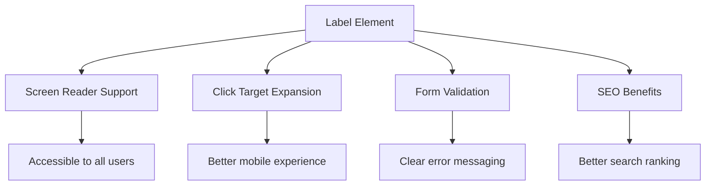
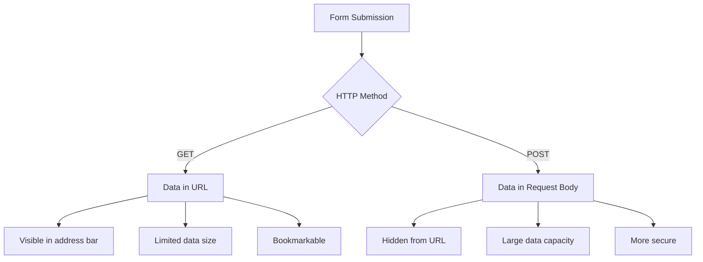
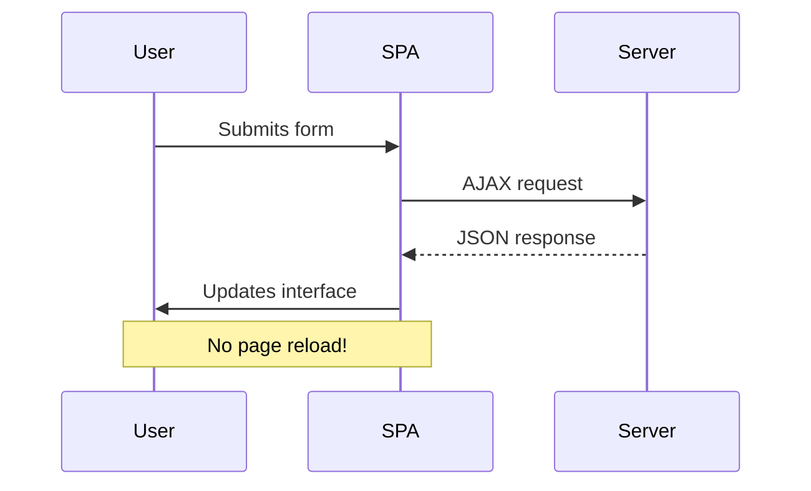
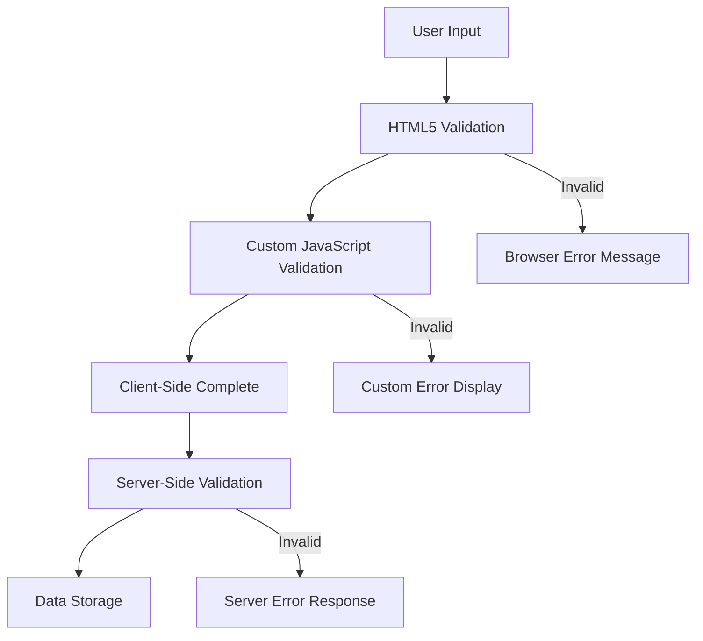
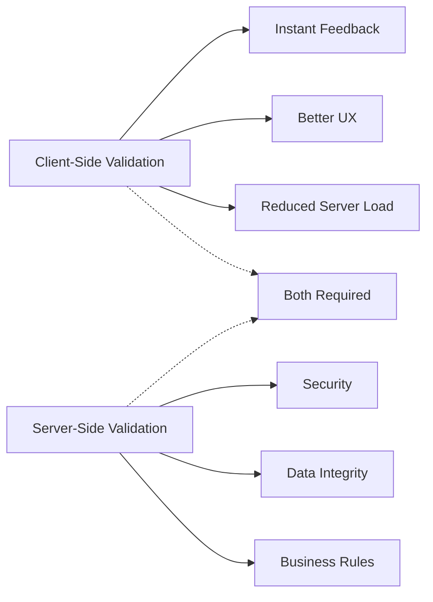

<!--
CO_OP_TRANSLATOR_METADATA:
{
  "original_hash": "b24f28fc46dd473aa9080f174182adde",
  "translation_date": "2025-10-24T21:43:05+00:00",
  "source_file": "7-bank-project/2-forms/README.md",
  "language_code": "sk"
}
-->
# Vytvorenie bankovej aplikácie, časť 2: Vytvorenie prihlasovacieho a registračného formulára

## Kvíz pred prednáškou

[Prednáškový kvíz](https://ff-quizzes.netlify.app/web/quiz/43)

Už ste niekedy vyplnili online formulár, ktorý odmietol formát vašej e-mailovej adresy? Alebo ste stratili všetky informácie po kliknutí na tlačidlo odoslať? Všetci sme sa stretli s týmito frustrujúcimi skúsenosťami.

Formuláre sú mostom medzi vašimi používateľmi a funkciami vašej aplikácie. Rovnako ako opatrné protokoly, ktoré používajú leteckí dispečeri na bezpečné navádzanie lietadiel na ich cieľové miesta, dobre navrhnuté formuláre poskytujú jasnú spätnú väzbu a zabraňujú nákladným chybám. Zlé formuláre, na druhej strane, môžu odradiť používateľov rýchlejšie ako nedorozumenie na rušnom letisku.

V tejto lekcii premeníme vašu statickú bankovú aplikáciu na interaktívnu aplikáciu. Naučíte sa vytvárať formuláre, ktoré overujú vstupy používateľov, komunikujú so servermi a poskytujú užitočnú spätnú väzbu. Predstavte si to ako vytvorenie ovládacieho rozhrania, ktoré umožňuje používateľom navigovať funkcie vašej aplikácie.

Na konci budete mať kompletný systém prihlasovania a registrácie s validáciou, ktorý používateľov vedie k úspechu namiesto frustrácie.

## Predpoklady

Predtým, než začneme vytvárať formuláre, uistime sa, že máte všetko správne nastavené. Táto lekcia nadväzuje presne tam, kde sme skončili v predchádzajúcej, takže ak ste preskočili dopredu, možno budete chcieť vrátiť sa späť a najskôr nastaviť základy.

### Požadované nastavenie

| Komponent | Stav | Popis |
|-----------|--------|-------------|
| [HTML šablóny](../1-template-route/README.md) | ✅ Požadované | Základná štruktúra bankovej aplikácie |
| [Node.js](https://nodejs.org) | ✅ Požadované | JavaScript runtime pre server |
| [Bankový API server](../api/README.md) | ✅ Požadované | Backendová služba na ukladanie dát |

> 💡 **Tip pre vývoj**: Budete súčasne spúšťať dva samostatné servery – jeden pre vašu front-end bankovú aplikáciu a druhý pre backendový API. Toto nastavenie odráža reálny vývoj, kde front-end a back-end služby fungujú nezávisle.

### Konfigurácia servera

**Vaše vývojové prostredie bude zahŕňať:**
- **Frontend server**: Poskytuje vašu bankovú aplikáciu (zvyčajne port `3000`)
- **Backend API server**: Spracováva ukladanie a získavanie dát (port `5000`)
- **Oba servery** môžu bežať súčasne bez konfliktov

**Testovanie pripojenia k API:**
```bash
curl http://localhost:5000/api
# Expected response: "Bank API v1.0.0"
```

**Ak vidíte odpoveď s verziou API, môžete pokračovať!**

---

## Pochopenie HTML formulárov a ovládacích prvkov

HTML formuláre sú spôsob, akým používatelia komunikujú s vašou webovou aplikáciou. Predstavte si ich ako telegrafný systém, ktorý spájal vzdialené miesta v 19. storočí – sú to komunikačné protokoly medzi úmyslom používateľa a odpoveďou aplikácie. Keď sú navrhnuté premyslene, zachytávajú chyby, usmerňujú formátovanie vstupov a poskytujú užitočné návrhy.

Moderné formuláre sú oveľa sofistikovanejšie ako základné textové vstupy. HTML5 zaviedlo špecializované typy vstupov, ktoré automaticky spracovávajú validáciu e-mailov, formátovanie čísel a výber dátumov. Tieto vylepšenia prospievajú prístupnosti aj mobilným používateľským skúsenostiam.

### Základné prvky formulára

**Stavebné bloky, ktoré potrebuje každý formulár:**

```html
<!-- Basic form structure -->
<form id="userForm" method="POST">
  <label for="username">Username</label>
  <input id="username" name="username" type="text" required>
  
  <button type="submit">Submit</button>
</form>
```

**Čo tento kód robí:**
- **Vytvára** kontajner formulára s jedinečným identifikátorom
- **Určuje** HTTP metódu na odoslanie dát
- **Priraďuje** štítky k vstupom pre prístupnosť
- **Definuje** tlačidlo na odoslanie formulára

### Moderné typy vstupov a atribúty

| Typ vstupu | Účel | Príklad použitia |
|------------|---------|---------------|
| `text` | Všeobecný textový vstup | `<input type="text" name="username">` |
| `email` | Validácia e-mailu | `<input type="email" name="email">` |
| `password` | Skrytý textový vstup | `<input type="password" name="password">` |
| `number` | Číselný vstup | `<input type="number" name="balance" min="0">` |
| `tel` | Telefónne čísla | `<input type="tel" name="phone">` |

> 💡 **Výhoda moderného HTML5**: Používanie špecifických typov vstupov poskytuje automatickú validáciu, vhodné mobilné klávesnice a lepšiu podporu prístupnosti bez dodatočného JavaScriptu!

### Typy tlačidiel a ich správanie

```html
<!-- Different button behaviors -->
<button type="submit">Save Data</button>     <!-- Submits the form -->
<button type="reset">Clear Form</button>    <!-- Resets all fields -->
<button type="button">Custom Action</button> <!-- No default behavior -->
```

**Čo robí každý typ tlačidla:**
- **Tlačidlá na odoslanie**: Spúšťajú odoslanie formulára a posielajú dáta na určený endpoint
- **Tlačidlá na resetovanie**: Obnovujú všetky polia formulára na ich počiatočný stav
- **Bežné tlačidlá**: Neposkytujú žiadne predvolené správanie, vyžadujú vlastný JavaScript na funkčnosť

> ⚠️ **Dôležitá poznámka**: Element `<input>` je samouzatvárací a nevyžaduje uzatváraciu značku. Moderná najlepšia prax je písať `<input>` bez lomky.

### Vytvorenie prihlasovacieho formulára

Teraz vytvoríme praktický prihlasovací formulár, ktorý demonštruje moderné HTML praktiky. Začneme základnou štruktúrou a postupne ju vylepšíme o funkcie prístupnosti a validácie.

```html
<template id="login">
  <h1>Bank App</h1>
  <section>
    <h2>Login</h2>
    <form id="loginForm" novalidate>
      <div class="form-group">
        <label for="username">Username</label>
        <input id="username" name="user" type="text" required 
               autocomplete="username" placeholder="Enter your username">
      </div>
      <button type="submit">Login</button>
    </form>
  </section>
</template>
```

**Rozdelenie toho, čo sa tu deje:**
- **Štruktúruje** formulár pomocou semantických HTML5 prvkov
- **Zoskupuje** súvisiace prvky pomocou `div` kontajnerov s významnými triedami
- **Priraďuje** štítky k vstupom pomocou atribútov `for` a `id`
- **Zahŕňa** moderné atribúty ako `autocomplete` a `placeholder` pre lepší UX
- **Pridáva** `novalidate` na spracovanie validácie pomocou JavaScriptu namiesto predvolených nastavení prehliadača

### Význam správnych štítkov

**Prečo sú štítky dôležité pre moderný webový vývoj:**



**Čo dosahujú správne štítky:**
- **Umožňujú** čítačkám obrazovky jasne oznamovať polia formulára
- **Rozširujú** klikateľnú oblasť (kliknutie na štítok zaostrí vstup)
- **Zlepšujú** mobilnú použiteľnosť s väčšími dotykovými cieľmi
- **Podporujú** validáciu formulára s významnými chybovými správami
- **Zvyšujú** SEO tým, že poskytujú semantický význam prvkom formulára

> 🎯 **Cieľ prístupnosti**: Každý vstup formulára by mal mať priradený štítok. Táto jednoduchá prax robí vaše formuláre použiteľnými pre všetkých, vrátane používateľov so zdravotným postihnutím, a zlepšuje zážitok pre všetkých používateľov.

### Vytvorenie registračného formulára

Registračný formulár vyžaduje podrobnejšie informácie na vytvorenie kompletného používateľského účtu. Vytvorme ho s modernými funkciami HTML5 a vylepšenou prístupnosťou.

```html
<hr/>
<h2>Register</h2>
<form id="registerForm" novalidate>
  <div class="form-group">
    <label for="user">Username</label>
    <input id="user" name="user" type="text" required 
           autocomplete="username" placeholder="Choose a username">
  </div>
  
  <div class="form-group">
    <label for="currency">Currency</label>
    <input id="currency" name="currency" type="text" value="$" 
           required maxlength="3" placeholder="USD, EUR, etc.">
  </div>
  
  <div class="form-group">
    <label for="description">Account Description</label>
    <input id="description" name="description" type="text" 
           maxlength="100" placeholder="Personal savings, checking, etc.">
  </div>
  
  <div class="form-group">
    <label for="balance">Starting Balance</label>
    <input id="balance" name="balance" type="number" value="0" 
           min="0" step="0.01" placeholder="0.00">
  </div>
  
  <button type="submit">Create Account</button>
</form>
```

**V uvedenom kóde sme:**
- **Organizovali** každé pole v kontajnerových divoch pre lepšie štýlovanie a rozloženie
- **Pridali** vhodné atribúty `autocomplete` pre podporu automatického vyplňovania prehliadača
- **Zahrnuli** užitočný text v `placeholder` na usmernenie vstupu používateľa
- **Nastavili** rozumné predvolené hodnoty pomocou atribútu `value`
- **Použili** validačné atribúty ako `required`, `maxlength` a `min`
- **Použili** `type="number"` pre pole zostatku s podporou desatinných čísel

### Preskúmanie typov vstupov a ich správania

**Moderné typy vstupov poskytujú vylepšenú funkčnosť:**

| Funkcia | Výhoda | Príklad |
|---------|---------|----------|
| `type="number"` | Číselná klávesnica na mobilných zariadeniach | Jednoduchšie zadávanie zostatku |
| `step="0.01"` | Kontrola presnosti desatinných čísel | Umožňuje centy v mene |
| `autocomplete` | Automatické vyplňovanie prehliadača | Rýchlejšie vyplňovanie formulára |
| `placeholder` | Kontextové nápovedy | Usmerňuje očakávania používateľa |

> 🎯 **Výzva prístupnosti**: Skúste navigovať formuláre iba pomocou klávesnice! Použite `Tab` na presun medzi poliami, `Space` na zaškrtnutie políčok a `Enter` na odoslanie. Táto skúsenosť vám pomôže pochopiť, ako čítačky obrazovky interagujú s vašimi formulármi.

## Pochopenie metód odosielania formulára

Keď niekto vyplní váš formulár a klikne na odoslanie, tieto dáta musia niekam ísť – zvyčajne na server, ktorý ich uloží. Existuje niekoľko rôznych spôsobov, ako sa to môže stať, a vedieť, ktorý z nich použiť, vám môže ušetriť neskoršie problémy.

Pozrime sa, čo sa vlastne stane, keď niekto klikne na tlačidlo odoslať.

### Predvolené správanie formulára

Najprv si všimnime, čo sa stane pri základnom odoslaní formulára:

**Otestujte svoje aktuálne formuláre:**
1. Kliknite na tlačidlo *Registrovať* vo vašom formulári
2. Sledujte zmeny v adresnom riadku vášho prehliadača
3. Všimnite si, ako sa stránka obnoví a dáta sa zobrazia v URL


### Porovnanie HTTP metód



**Pochopenie rozdielov:**

| Metóda | Použitie | Miesto dát | Úroveň bezpečnosti | Limit veľkosti |
|--------|----------|---------------|----------------|-------------|
| `GET` | Vyhľadávacie dotazy, filtre | Parametre URL | Nízka (viditeľné) | ~2000 znakov |
| `POST` | Používateľské účty, citlivé dáta | Telo požiadavky | Vyššia (skryté) | Žiadny praktický limit |

**Pochopenie základných rozdielov:**
- **GET**: Pridáva dáta formulára do URL ako parametre dotazu (vhodné pre vyhľadávacie operácie)
- **POST**: Zahrňuje dáta do tela požiadavky (nevyhnutné pre citlivé informácie)
- **Obmedzenia GET**: Obmedzenia veľkosti, viditeľné dáta, trvalá história prehliadača
- **Výhody POST**: Veľká kapacita dát, ochrana súkromia, podpora nahrávania súborov

> 💡 **Najlepšia prax**: Používajte `GET` pre vyhľadávacie formuláre a filtre (získavanie dát), používajte `POST` pre registráciu používateľov, prihlasovanie a vytváranie dát.

### Konfigurácia odosielania formulára

Nastavme váš registračný formulár tak, aby správne komunikoval s backendovým API pomocou metódy POST:

```html
<form id="registerForm" action="//localhost:5000/api/accounts" 
      method="POST" novalidate>
```

**Čo táto konfigurácia robí:**
- **Smeruje** odoslanie formulára na váš API endpoint
- **Používa** metódu POST na bezpečný prenos dát
- **Zahŕňa** `novalidate` na spracovanie validácie pomocou JavaScriptu

### Testovanie odoslania formulára

**Postupujte podľa týchto krokov na testovanie vášho formulára:**
1. **Vyplňte** registračný formulár svojimi údajmi
2. **Kliknite** na tlačidlo "Vytvoriť účet"
3. **Sledujte** odpoveď servera vo vašom prehliadači


**Čo by ste mali vidieť:**
- **Prehliadač presmeruje** na URL endpointu API
- **JSON odpoveď** obsahujúca vaše novo vytvorené údaje účtu
- **Potvrdenie servera**, že účet bol úspešne vytvorený

> 🧪 **Čas na experiment**: Skúste sa zaregistrovať znova s rovnakým používateľským menom. Akú odpoveď dostanete? To vám pomôže pochopiť, ako server spracováva duplicitné dáta a chybové podmienky.

### Pochopenie JSON odpovedí

**Keď server úspešne spracuje váš formulár:**
```json
{
  "user": "john_doe",
  "currency": "$",
  "description": "Personal savings",
  "balance": 100,
  "id": "unique_account_id"
}
```

**Táto odpoveď potvrdzuje:**
- **Vytvorenie** nového účtu s vašimi špecifikovanými údajmi
- **Priradenie** jedinečného identifikátora na budúce použitie
- **Vrátenie** všetkých informácií o účte na overenie
- **Indikáciu** úspešného uloženia do databázy

## Moderné spracovanie formulárov pomocou JavaScriptu

Tradičné odosielanie formulárov spôsobuje úplné obnovenie stránky, podobne ako skoré vesmírne misie vyžadovali úplné resetovanie systému na korekciu kurzu. Tento prístup narúša používateľskú skúsenosť a stráca stav aplikácie.

Spracovanie formulárov pomocou JavaScriptu funguje ako nepretržité navigačné systémy používané modernými kozmickými loďami – umožňuje robiť úpravy v reálnom čase bez straty navigačného kontextu. Môžeme zachytiť odoslanie formulára, poskytnúť okamžitú spätnú väzbu, elegantne spracovať chyby a aktualizovať rozhranie na základe odpovedí servera, pričom zachováme pozíciu používateľa v aplikácii.

### Prečo sa vyhnúť obnovovaniu stránky?



**Výhody spracovania formulárov pomocou JavaScriptu:**
- **Zachováva** stav aplikácie a kontext používateľa
- **Poskytuje** okamžitú spätnú väzbu a indikátory načítania
- **Umožňuje** dynamické spracovanie chýb a validáciu
- **Vytvára** plynulé, aplikáciám podobné používateľské skúsenosti
- **Umožňuje** podmienenú logiku na základe odpovedí servera

### Prechod z tradičných na moderné formuláre

**Výzvy tradičného prístupu:**
- **Presmerovanie** používateľov mimo vašu aplikáciu
- **Strata** aktuálneho stavu aplikácie a kontextu
- **Vyžaduje** úplné obnovenie stránky pre jednoduché operácie
- **Poskytuje** obmedzenú kontrolu nad spätnou väzbou používateľa

**Výhody moderného prístupu pomocou JavaScriptu:**
- **Udržuje**
- **Poskytuje** podrobné chybové hlásenia na ladenie
- **Vracia** konzistentnú štruktúru dát pre úspešné aj chybové prípady

### Sila moderného Fetch API

**Výhody Fetch API oproti starším metódam:**

| Funkcia | Výhoda | Implementácia |
|---------|---------|----------------|
| Založené na Promise | Čistý asynchrónny kód | `await fetch()` |
| Prispôsobenie požiadaviek | Plná kontrola nad HTTP | Hlavičky, metódy, telo |
| Spracovanie odpovedí | Flexibilné parsovanie dát | `.json()`, `.text()`, `.blob()` |
| Spracovanie chýb | Komplexné zachytávanie chýb | Bloky Try/catch |

> 🎥 **Viac informácií**: [Tutoriál o Async/Await](https://youtube.com/watch?v=YwmlRkrxvkk) - Pochopenie asynchrónnych JavaScript vzorcov pre moderný webový vývoj.

**Kľúčové koncepty pre komunikáciu so serverom:**
- **Asynchrónne funkcie** umožňujú pozastaviť vykonávanie a čakať na odpovede zo servera
- **Kľúčové slovo await** robí asynchrónny kód čitateľným ako synchronný
- **Fetch API** poskytuje moderné, na Promise založené HTTP požiadavky
- **Spracovanie chýb** zabezpečuje, že vaša aplikácia reaguje elegantne na problémy so sieťou

### Dokončenie funkcie registrácie

Spojme všetko dohromady s kompletnou, produkčne pripravenou funkciou registrácie:

```javascript
async function register() {
  const registerForm = document.getElementById('registerForm');
  const submitButton = registerForm.querySelector('button[type="submit"]');
  
  try {
    // Show loading state
    submitButton.disabled = true;
    submitButton.textContent = 'Creating Account...';
    
    // Process form data
    const formData = new FormData(registerForm);
    const jsonData = JSON.stringify(Object.fromEntries(formData));
    
    // Send to server
    const result = await createAccount(jsonData);
    
    if (result.error) {
      console.error('Registration failed:', result.error);
      alert(`Registration failed: ${result.error}`);
      return;
    }
    
    console.log('Account created successfully!', result);
    alert(`Welcome, ${result.user}! Your account has been created.`);
    
    // Reset form after successful registration
    registerForm.reset();
    
  } catch (error) {
    console.error('Unexpected error:', error);
    alert('An unexpected error occurred. Please try again.');
  } finally {
    // Restore button state
    submitButton.disabled = false;
    submitButton.textContent = 'Create Account';
  }
}
```

**Táto vylepšená implementácia zahŕňa:**
- **Poskytuje** vizuálnu spätnú väzbu počas odosielania formulára
- **Deaktivuje** tlačidlo odoslania, aby sa zabránilo duplicitným odoslaním
- **Spracováva** očakávané aj neočakávané chyby elegantne
- **Zobrazuje** užívateľsky prívetivé správy o úspechu a chybách
- **Resetuje** formulár po úspešnej registrácii
- **Obnovuje** stav UI bez ohľadu na výsledok

### Testovanie vašej implementácie

**Otvorte nástroje pre vývojárov v prehliadači a otestujte registráciu:**

1. **Otvorte** konzolu prehliadača (F12 → karta Console)
2. **Vyplňte** registračný formulár
3. **Kliknite** na "Vytvoriť účet"
4. **Pozorujte** správy v konzole a spätnú väzbu pre používateľa


**Čo by ste mali vidieť:**
- **Stav načítania** sa zobrazí na tlačidle odoslania
- **Logy v konzole** zobrazujú podrobné informácie o procese
- **Správa o úspechu** sa zobrazí, keď sa účet úspešne vytvorí
- **Formulár sa automaticky resetuje** po úspešnom odoslaní

> 🔒 **Bezpečnostné upozornenie**: Momentálne dáta cestujú cez HTTP, čo nie je bezpečné pre produkciu. V reálnych aplikáciách vždy používajte HTTPS na šifrovanie prenosu dát. Viac informácií o [bezpečnosti HTTPS](https://en.wikipedia.org/wiki/HTTPS) a prečo je dôležitá na ochranu údajov používateľov.

## Komplexná validácia formulára

Validácia formulára zabraňuje frustrujúcemu zážitku z objavenia chýb až po odoslaní. Podobne ako viacnásobné redundantné systémy na Medzinárodnej vesmírnej stanici, efektívna validácia využíva viac vrstiev bezpečnostných kontrol.

Optimálny prístup kombinuje validáciu na úrovni prehliadača pre okamžitú spätnú väzbu, validáciu pomocou JavaScriptu pre lepší užívateľský zážitok a validáciu na strane servera pre bezpečnosť a integritu dát. Táto redundancia zabezpečuje spokojnosť používateľov aj ochranu systému.

### Pochopenie vrstiev validácie



**Stratégia viacvrstvovej validácie:**
- **HTML5 validácia**: Okamžité kontroly na úrovni prehliadača
- **JavaScript validácia**: Vlastná logika a užívateľský zážitok
- **Serverová validácia**: Konečná kontrola bezpečnosti a integrity dát
- **Progresívne vylepšenie**: Funguje aj keď je JavaScript deaktivovaný

### HTML5 validačné atribúty

**Moderné nástroje na validáciu, ktoré máte k dispozícii:**

| Atribút | Účel | Príklad použitia | Správanie prehliadača |
|---------|---------|-----------------|-----------------------|
| `required` | Povinné polia | `<input required>` | Zabraňuje prázdnemu odoslaniu |
| `minlength`/`maxlength` | Limity dĺžky textu | `<input maxlength="20">` | Uplatňuje obmedzenia počtu znakov |
| `min`/`max` | Číselné rozsahy | `<input min="0" max="1000">` | Validuje hranice čísel |
| `pattern` | Vlastné pravidlá regex | `<input pattern="[A-Za-z]+">` | Zhoduje sa so špecifickými formátmi |
| `type` | Validácia typu dát | `<input type="email">` | Validácia špecifická pre formát |

### CSS validácia štýlovania

**Vytvorte vizuálnu spätnú väzbu pre validačné stavy:**

```css
/* Valid input styling */
input:valid {
  border-color: #28a745;
  background-color: #f8fff9;
}

/* Invalid input styling */
input:invalid {
  border-color: #dc3545;
  background-color: #fff5f5;
}

/* Focus states for better accessibility */
input:focus:valid {
  box-shadow: 0 0 0 0.2rem rgba(40, 167, 69, 0.25);
}

input:focus:invalid {
  box-shadow: 0 0 0 0.2rem rgba(220, 53, 69, 0.25);
}
```

**Čo tieto vizuálne podnety dosahujú:**
- **Zelené okraje**: Označujú úspešnú validáciu, ako zelené svetlá na riadiacom stredisku
- **Červené okraje**: Signalizujú chyby validácie, ktoré vyžadujú pozornosť
- **Zvýraznenie zamerania**: Poskytuje jasný vizuálny kontext pre aktuálnu polohu vstupu
- **Konzistentné štýlovanie**: Vytvára predvídateľné vzory rozhrania, ktoré sa používateľ môže naučiť

> 💡 **Tip**: Použite CSS pseudo-triedy `:valid` a `:invalid` na okamžitú vizuálnu spätnú väzbu počas písania, čím vytvoríte responzívne a užitočné rozhranie.

### Implementácia komplexnej validácie

Vylepšime váš registračný formulár robustnou validáciou, ktorá poskytuje vynikajúci užívateľský zážitok a kvalitu dát:

```html
<form id="registerForm" method="POST" novalidate>
  <div class="form-group">
    <label for="user">Username <span class="required">*</span></label>
    <input id="user" name="user" type="text" required 
           minlength="3" maxlength="20" 
           pattern="[a-zA-Z0-9_]+" 
           autocomplete="username"
           title="Username must be 3-20 characters, letters, numbers, and underscores only">
    <small class="form-text">Choose a unique username (3-20 characters)</small>
  </div>
  
  <div class="form-group">
    <label for="currency">Currency <span class="required">*</span></label>
    <input id="currency" name="currency" type="text" required 
           value="$" maxlength="3" 
           pattern="[A-Z$€£¥₹]+" 
           title="Enter a valid currency symbol or code">
    <small class="form-text">Currency symbol (e.g., $, €, £)</small>
  </div>
  
  <div class="form-group">
    <label for="description">Account Description</label>
    <input id="description" name="description" type="text" 
           maxlength="100" 
           placeholder="Personal savings, checking, etc.">
    <small class="form-text">Optional description (up to 100 characters)</small>
  </div>
  
  <div class="form-group">
    <label for="balance">Starting Balance</label>
    <input id="balance" name="balance" type="number" 
           value="0" min="0" step="0.01" 
           title="Enter a positive number for your starting balance">
    <small class="form-text">Initial account balance (minimum $0.00)</small>
  </div>
  
  <button type="submit">Create Account</button>
</form>
```

**Pochopenie vylepšenej validácie:**
- **Kombinuje** indikátory povinných polí s užitočnými popismi
- **Zahŕňa** atribúty `pattern` na validáciu formátu
- **Poskytuje** atribúty `title` pre prístupnosť a tooltipy
- **Pridáva** pomocný text na usmernenie vstupu používateľa
- **Používa** semantickú HTML štruktúru pre lepšiu prístupnosť

### Pokročilé pravidlá validácie

**Čo každé pravidlo validácie dosahuje:**

| Pole | Pravidlá validácie | Výhoda pre používateľa |
|------|--------------------|------------------------|
| Užívateľské meno | `required`, `minlength="3"`, `maxlength="20"`, `pattern="[a-zA-Z0-9_]+"` | Zabezpečuje platné, unikátne identifikátory |
| Mena | `required`, `maxlength="3"`, `pattern="[A-Z$€£¥₹]+"` | Akceptuje bežné symboly mien |
| Zostatok | `min="0"`, `step="0.01"`, `type="number"` | Zabraňuje negatívnym zostatkom |
| Popis | `maxlength="100"` | Rozumné limity dĺžky |

### Testovanie správania validácie

**Vyskúšajte tieto scenáre validácie:**
1. **Odošlite** formulár s prázdnymi povinnými poliami
2. **Zadajte** užívateľské meno kratšie ako 3 znaky
3. **Skúste** špeciálne znaky v poli pre užívateľské meno
4. **Zadajte** zápornú hodnotu zostatku


**Čo budete pozorovať:**
- **Prehliadač zobrazuje** natívne správy o validácii
- **Zmeny štýlov** na základe stavov `:valid` a `:invalid`
- **Odoslanie formulára** je zablokované, kým všetky validácie neprejdú
- **Zameranie sa automaticky** presunie na prvé neplatné pole

### Validácia na strane klienta vs na strane servera



**Prečo potrebujete obe vrstvy:**
- **Validácia na strane klienta**: Poskytuje okamžitú spätnú väzbu a zlepšuje užívateľský zážitok
- **Validácia na strane servera**: Zabezpečuje bezpečnosť a rieši komplexné obchodné pravidlá
- **Kombinovaný prístup**: Vytvára robustné, užívateľsky prívetivé a bezpečné aplikácie
- **Progresívne vylepšenie**: Funguje aj keď je JavaScript deaktivovaný

> 🛡️ **Bezpečnostná pripomienka**: Nikdy sa nespoliehajte iba na validáciu na strane klienta! Zlomyseľní používatelia môžu obísť kontroly na strane klienta, takže validácia na strane servera je nevyhnutná pre bezpečnosť a integritu dát.

---


---

## Výzva GitHub Copilot Agent 🚀

Použite režim Agent na splnenie nasledujúcej výzvy:

**Popis:** Vylepšite registračný formulár komplexnou validáciou na strane klienta a spätnou väzbou pre používateľa. Táto výzva vám pomôže precvičiť validáciu formulára, spracovanie chýb a zlepšenie užívateľského zážitku pomocou interaktívnej spätnej väzby.

**Úloha:** Vytvorte kompletný systém validácie formulára pre registračný formulár, ktorý zahŕňa: 1) Validáciu v reálnom čase pre každé pole počas písania, 2) Vlastné správy o validácii, ktoré sa zobrazujú pod každým vstupným poľom, 3) Pole na potvrdenie hesla s validáciou zhody, 4) Vizuálne indikátory (ako zelené zaškrtávacie políčka pre platné polia a červené varovania pre neplatné), 5) Tlačidlo odoslania, ktoré sa aktivuje iba vtedy, keď všetky validácie prejdú. Použite HTML5 validačné atribúty, CSS na štýlovanie validačných stavov a JavaScript na interaktívne správanie.

Viac informácií o [režime agent](https://code.visualstudio.com/blogs/2025/02/24/introducing-copilot-agent-mode) nájdete tu.

## 🚀 Výzva

Zobrazte chybovú správu v HTML, ak užívateľ už existuje.

Tu je príklad, ako môže vyzerať konečná prihlasovacia stránka po menšej úprave štýlov:


## Kvíz po prednáške

[Kvíz po prednáške](https://ff-quizzes.netlify.app/web/quiz/44)

## Prehľad a samostatné štúdium

Vývojári sa stali veľmi kreatívnymi vo svojich snahách o vytváranie formulárov, najmä pokiaľ ide o stratégie validácie. Zistite viac o rôznych prístupoch k formulárom prehliadaním [CodePen](https://codepen.com); nájdete tam zaujímavé a inšpiratívne formuláre?

## Zadanie

[Štylizujte svoju bankovú aplikáciu](assignment.md)

---

**Zrieknutie sa zodpovednosti**:  
Tento dokument bol preložený pomocou služby AI prekladu [Co-op Translator](https://github.com/Azure/co-op-translator). Hoci sa snažíme o presnosť, prosím, berte na vedomie, že automatizované preklady môžu obsahovať chyby alebo nepresnosti. Pôvodný dokument v jeho rodnom jazyku by mal byť považovaný za autoritatívny zdroj. Pre kritické informácie sa odporúča profesionálny ľudský preklad. Nenesieme zodpovednosť za akékoľvek nedorozumenia alebo nesprávne interpretácie vyplývajúce z použitia tohto prekladu.