# Vytvorte bankovú aplikáciu časť 2: Vytvorte prihlasovací a registračný formulár

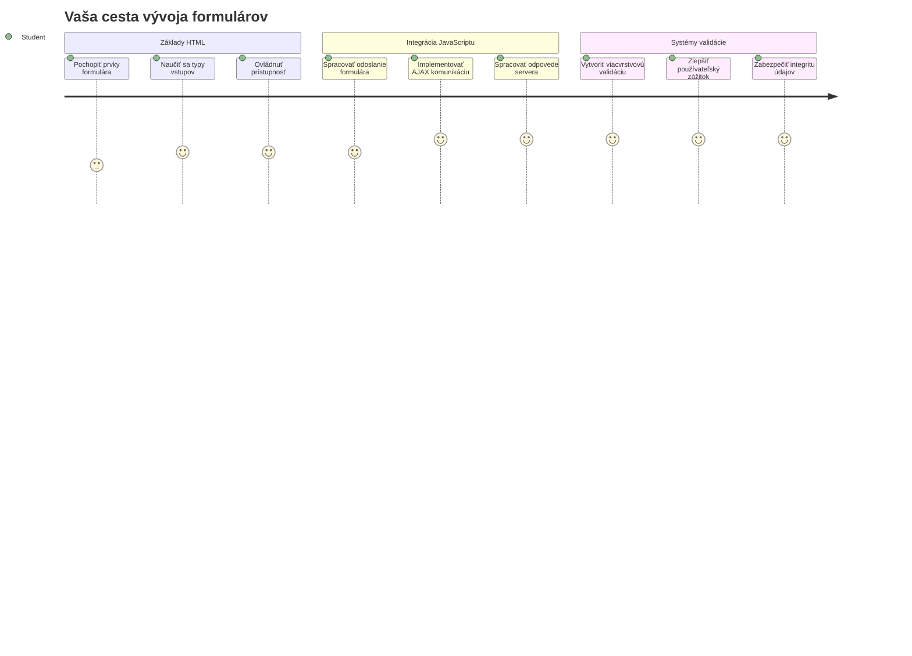
## Prednáškový kvíz

[Prednáškový kvíz](https://ff-quizzes.netlify.app/web/quiz/43)

Už ste niekedy vyplňovali formulár online a formulár vám odmietol formát e-mailu? Alebo ste stratili všetky svoje údaje po kliknutí na odoslať? Všetci sme zažili tieto frustrujúce situácie.

Formuláre sú mostom medzi vašimi používateľmi a funkcionalitou vašej aplikácie. Podobne ako starostlivé protokoly, ktoré používajú letoví dispečeri na bezpečné nasmerovanie lietadiel do cieľa, dobre navrhnuté formuláre poskytujú jasnú spätnú väzbu a zabraňujú nákladným chybám. Zlé formuláre naopak môžu používateľov odradiť rýchlejšie než nepochopenie v rušnom letisku.

V tejto lekcii premeníme vašu statickú bankovú aplikáciu na interaktívnu aplikáciu. Naučíte sa vytvárať formuláre, ktoré overujú vstupy používateľov, komunikujú so servermi a poskytujú užitočnú spätnú väzbu. Predstavte si to ako vytvorenie riadiaceho rozhrania, ktoré umožňuje používateľom navigovať funkcie vašej aplikácie.

Na konci budete mať kompletný prihlasovací a registračný systém s validáciou, ktorý vedie používateľov k úspechu, nie k frustrácii.

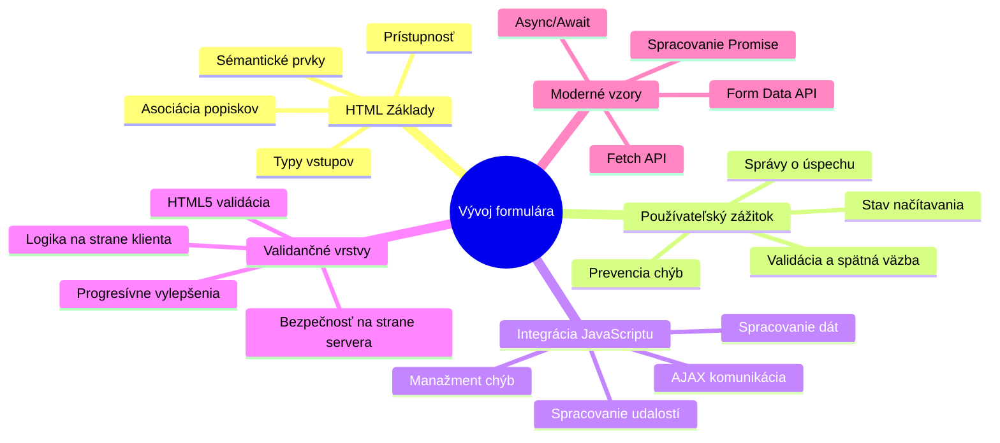
## Predpoklady

Predtým, než začneme s tvorbou formulárov, uistime sa, že máte všetko správne nastavené. Táto lekcia nadväzuje tam, kde sme skončili v predchádzajúcej, takže ak ste ju preskočili, možno sa oplatí vrátiť a najprv si osvojiť základy.

### Požadované nastavenie

| Komponent | Stav | Popis |
|-----------|--------|-------------|
| [HTML šablóny](../1-template-route/README.md) | ✅ Povinné | Základná štruktúra vašej bankovej aplikácie |
| [Node.js](https://nodejs.org) | ✅ Povinné | JavaScript runtime pre server |
| [Bankový API server](../api/README.md) | ✅ Povinné | Backend služba pre ukladanie dát |

> 💡 **Tip na vývoj**: Budete súčasne spúšťať dva samostatné servery – jeden pre frontend vašej bankovej aplikácie a druhý pre backendové API. Tento setup odráža reálny vývoj, kde front-end a back-end služby fungujú nezávisle.

### Konfigurácia servera

**Vaše vývojové prostredie bude obsahovať:**
- **Frontend server**: poskytuje vašu bankovú aplikáciu (typicky port `3000`)
- **Backend API server**: spracováva ukladanie a načítanie dát (port `5000`)
- **Oba servery** môžu bežať súčasne bez konfliktov

**Testovanie pripojenia k API:**
```bash
curl http://localhost:5000/api
# Očakávaná odpoveď: "Bank API v1.0.0"
```

**Ak vidíte odpoveď s verziou API, ste pripravení pokračovať!**

---

## Pochopenie HTML formulárov a ovládacích prvkov

HTML formuláre sú spôsobom, ako používatelia komunikujú s vašou webovou aplikáciou. Predstavte si ich ako telegrafný systém, ktorý spájal vzdialené miesta v 19. storočí – sú komunikačným protokolom medzi úmyslom používateľa a odpoveďou aplikácie. Keď sú navrhnuté premyslene, zachytávajú chyby, navigujú formátovanie vstupu a poskytujú užitočné návrhy.

Moderné formuláre sú výrazne sofistikovanejšie než základné textové vstupy. HTML5 prinieslo špecializované typy vstupov, ktoré automaticky zvládajú overenie e-mailu, formátovanie čísiel a výber dátumu. Tieto vylepšenia prospievajú prístupnosti aj používateľskému zážitku na mobilných zariadeniach.

### Základné prvky formulára

**Stavebné bloky, ktoré každý formulár potrebuje:**

```html
<!-- Basic form structure -->
<form id="userForm" method="POST">
  <label for="username">Username</label>
  <input id="username" name="username" type="text" required>
  
  <button type="submit">Submit</button>
</form>
```

**Tento kód robí nasledovné:**
- **Vytvára** kontajner formulára s jedinečným identifikátorom
- **Špecifikuje** HTTP metódu pre odoslanie dát
- **Spojuje** popisky s vstupmi pre prístupnosť
- **Definuje** tlačidlo na odoslanie formulára

### Moderné typy vstupov a atribúty

| Typ vstupu | Účel | Príklad použitia |
|------------|---------|---------------|
| `text` | Všeobecný textový vstup | `<input type="text" name="username">` |
| `email` | Overenie e-mailu | `<input type="email" name="email">` |
| `password` | Skrytý textový vstup | `<input type="password" name="password">` |
| `number` | Číselný vstup | `<input type="number" name="balance" min="0">` |
| `tel` | Telefónne čísla | `<input type="tel" name="phone">` |

> 💡 **Výhoda moderného HTML5**: Používanie špecifických typov vstupov zaisťuje automatickú validáciu, vhodné klávesnice pre mobil a lepšiu podporu prístupnosti bez potreby ďalšieho JavaScriptu!

### Typy tlačidiel a ich správanie

```html
<!-- Different button behaviors -->
<button type="submit">Save Data</button>     <!-- Submits the form -->
<button type="reset">Clear Form</button>    <!-- Resets all fields -->
<button type="button">Custom Action</button> <!-- No default behavior -->
```

**Čo robí každý typ tlačidla:**
- **Tlačidlá submit**: Spustia odoslanie formulára a pošlú dáta na zadaný endpoint
- **Tlačidlá reset**: Obnovia všetky polia formulára do pôvodného stavu
- **Bežné tlačidlá**: Nemajú žiadne štandardné správanie, vyžadujú vlastný JavaScript pre funkčnosť

> ⚠️ **Dôležitá poznámka**: `<input>` element je samo-uzatvárací a nepotrebuje ukončujúci tag. Moderný odporúčaný zápis je `<input>` bez lomky.

### Vytváranie prihlasovacieho formulára

Teraz vytvoríme praktický prihlasovací formulár, ktorý demonštruje moderné HTML postupy. Začneme so základnou štruktúrou a postupne ho vylepšíme o prístupnostné prvky a validáciu.

```html
<template id="login">
  <h1>Bank App</h1>
  <section>
    <h2>Login</h2>
    <form id="loginForm" novalidate>
      <div class="form-group">
        <label for="username">Username</label>
        <input id="username" name="user" type="text" required 
               autocomplete="username" placeholder="Enter your username">
      </div>
      <button type="submit">Login</button>
    </form>
  </section>
</template>
```

**Čo sa tu deje:**
- **Štruktúruje** formulár pomocou semantických HTML5 elementov
- **Zoskupuje** súvisiace prvky pomocou `div` kontajnerov s výstižnými triedami
- **Spojuje** popisky s inputmi cez `for` a `id` atribúty
- **Pridáva** moderné atribúty ako `autocomplete` a `placeholder` pre lepší UX
- **Používa** `novalidate` pre spracovanie validácie cez JavaScript namiesto štandardnej prehliadačovej

### Sila správnych popiskov

**Prečo sú popisky dôležité pre moderný webový vývoj:**

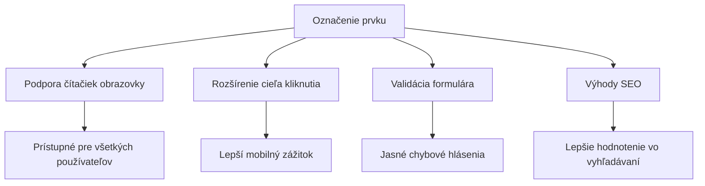
**Čo správne popisky zabezpečujú:**
- **Umožňujú** čítačkám obrazovky jasne oznamovať polia formulára
- **Rozširujú** klikaciu plochu (kliknutie na popis aktivuje vstup)
- **Zlepšujú** použiteľnosť na mobiloch väčšími dotykovými cieľmi
- **Podporujú** validáciu formulára s výstižnými chybovými správami
- **Zvyšujú** SEO tým, že formulárovým prvkom dávajú sémantický význam

> 🎯 **Cieľ prístupnosti**: Každý vstup v formulári by mal mať priradený popisok. Tento jednoduchý zvyk robí vaše formuláre použiteľnými pre všetkých, vrátane používateľov so zdravotným postihnutím, a zlepšuje zážitok pre všetkých.

### Vytváranie registračného formulára

Registračný formulár vyžaduje podrobnejšie údaje na vytvorenie kompletného používateľského účtu. Postavme ho pomocou moderných HTML5 funkcií a vylepšenej prístupnosti.

```html
<hr/>
<h2>Register</h2>
<form id="registerForm" novalidate>
  <div class="form-group">
    <label for="user">Username</label>
    <input id="user" name="user" type="text" required 
           autocomplete="username" placeholder="Choose a username">
  </div>
  
  <div class="form-group">
    <label for="currency">Currency</label>
    <input id="currency" name="currency" type="text" value="$" 
           required maxlength="3" placeholder="USD, EUR, etc.">
  </div>
  
  <div class="form-group">
    <label for="description">Account Description</label>
    <input id="description" name="description" type="text" 
           maxlength="100" placeholder="Personal savings, checking, etc.">
  </div>
  
  <div class="form-group">
    <label for="balance">Starting Balance</label>
    <input id="balance" name="balance" type="number" value="0" 
           min="0" step="0.01" placeholder="0.00">
  </div>
  
  <button type="submit">Create Account</button>
</form>
```

**V tomto sme:**
- **Usadili** každé pole do kontajnerov `div` pre lepšie štýlovanie a rozloženie
- **Pridali** vhodné atribúty `autocomplete` pre podporu automatického vyplňovania prehliadačom
- **Zapracovali** užitočný placeholder text na usmernenie používateľa
- **Nastavili** rozumné predvolené hodnoty cez atribút `value`
- **Použili** validácie ako `required`, `maxlength` a `min`
- **Zvolili** `type="number"` pre pole zostatku s podporou desatinných čísiel

### Preskúmanie typov vstupov a správania

**Moderné typy vstupov prinášajú vylepšenia:**

| Funkcia | Výhoda | Príklad |
|---------|---------|----------|
| `type="number"` | Číselná klávesnica na mobile | Jednoduchšie zadávanie zostatku |
| `step="0.01"` | Kontrola desatinnej presnosti | Umožňuje centy v mene |
| `autocomplete` | Automatické vyplňovanie prehliadačom | Rýchlejšie vypĺňanie formulára |
| `placeholder` | Kontextové nápovedy | Viesť očakávania používateľa |

> 🎯 **Výzva na prístupnosť**: Skúste formuláre prechádzať iba pomocou klávesnice! Použite `Tab` na presun medzi poliami, `Space` na zaškrtnutie políčok a `Enter` na odoslanie. Tento zážitok vám pomôže pochopiť, ako používatelia čítačiek obrazovky interagujú s vašimi formulármi.

### 🔄 **Pedagogická kontrola**
**Porozumenie základom formulárov**: Pred implementáciou JavaScriptu si overte, že rozumiete:
- ✅ Ako semantický HTML vytvára prístupné formulárové štruktúry
- ✅ Prečo typy vstupov ovplyvňujú klávesnice na mobile a validáciu
- ✅ Vzťah medzi popiskami a ovládacími prvkami formulára
- ✅ Ako atribúty formulára ovplyvňujú základné správanie prehliadača

**Rýchly samotest**: Čo sa stane, ak odošlete formulár bez JavaScriptovej obsluhy?
*Odpoveď: Prehliadač vykoná štandardné odoslanie, obvykle presmeruje na URL z atributu action*

**Výhody formulárov HTML5**: Moderné formuláre prinášajú:
- **Vstavanú validáciu**: automatickú kontrolu e-mailu a formátu čísiel
- **Optimalizáciu pre mobily**: vhodné klávesnice pre rôzne typy vstupov
- **Prístupnosť**: podpora čítačiek obrazovky a navigácie klávesnicou
- **Progresívne vylepšenie**: fungujú aj keď je JavaScript vypnutý

## Pochopenie metód odosielania formulárov

Keď niekto vyplní váš formulár a stlačí odoslať, tieto dáta musia niekam ísť – zvyčajne na server, ktorý ich môže uložiť. Existuje niekoľko spôsobov, ako sa to deje, a poznať, ktorý použiť, vám ušetrí budúce komplikácie.

Pozrime sa, čo sa vlastne deje, keď používateľ klikne na tlačidlo odoslania.

### Štandardné správanie formulára

Najprv si všimnime, čo sa deje pri základnom odoslaní formulára:

**Otestujte svoje aktuálne formuláre:**
1. Kliknite na tlačidlo *Register* vo vašom formulári
2. Sledujte zmenu URL v adresnom riadku prehliadača
3. Všimnite si, ako stránka obnoví a údaje sa zobrazia v URL


### Porovnanie HTTP metód

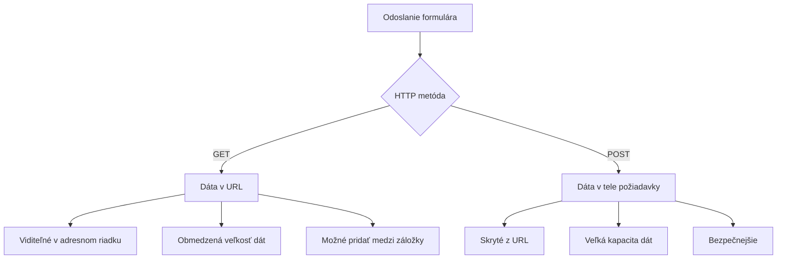
**Pochopenie rozdielov:**

| Metóda | Použitie | Umiestnenie dát | Úroveň zabezpečenia | Limit veľkosti |
|--------|----------|-----------------|---------------------|----------------|
| `GET` | Vyhľadávacie dotazy, filtre | Parametre URL | Nízka (viditeľné) | ~2000 znakov |
| `POST` | Používateľské účty, citlivé údaje | Telo požiadavky | Vyššia (skryté) | Prakticky bez limitu |

**Základné rozdiely:**
- **GET**: Pridáva dáta formulára do URL ako parametre (vhodné na vyhľadávanie)
- **POST**: Posiela dáta v tele požiadavky (nevyhnutné pre citlivé informácie)
- **Ograničenia GET**: Obmedzená veľkosť, viditeľné dáta, pretrvávajúca história prehliadača
- **Výhody POST**: Veľká kapacita dát, ochrana súkromia, podpora nahrávania súborov

> 💡 **Dobrá prax**: Používajte `GET` pre vyhľadávacie formuláre a filtre (na vyhľadávanie dát), `POST` pre registráciu používateľov, prihlásenie a vytváranie dát.

### Konfigurácia odoslania formulára

Nakonfigurujme váš registračný formulár tak, aby správne komunikoval so backendovým API pomocou metódy POST:

```html
<form id="registerForm" action="//localhost:5000/api/accounts" 
      method="POST" novalidate>
```

**Táto konfigurácia zabezpečuje:**
- **Smeruje** odoslanie formulára na váš API endpoint
- **Používa** metódu POST pre bezpečné prenesenie dát
- **Zahrňuje** `novalidate` na spracovanie validácie cez JavaScript

### Testovanie odosielania formulára

**Postup pre otestovanie formulára:**
1. **Vyplňte** registračný formulár svojimi údajmi
2. **Kliknite** na tlačidlo "Create Account"
3. **Sledujte** odpoveď servera v prehliadači


**Čo by ste mali vidieť:**
- **Prehliadač sa presmeruje** na URL API endpointu
- **JSON odpoveď** obsahujúcu vaše novo vytvorené údaje o účte
- **Potvrdenie zo servera**, že účet bol úspešne vytvorený

> 🧪 **Čas na experiment**: Skúste sa zaregistrovať znovu s rovnakým používateľským menom. Akú odpoveď dostanete? Pomáha vám to pochopiť, ako server spracováva duplicitné dáta a chybové stavy.

### Pochopenie JSON odpovedí

**Keď server úspešne spracuje váš formulár:**
```json
{
  "user": "john_doe",
  "currency": "$",
  "description": "Personal savings",
  "balance": 100,
  "id": "unique_account_id"
}
```

**Táto odpoveď potvrdzuje:**
- **Vytvorenie** nového účtu s vašimi zadanými dátami
- **Priradenie** jedinečného identifikátora pre budúce použitie
- **Vrátenie** všetkých informácií o účte na overenie
- **Signalizuje** úspešné uloženie do databázy

## Moderné spracovanie formulárov pomocou JavaScriptu

Tradičné odosielanie formulárov vyvoláva úplné obnovenie stránky, podobne ako rané vesmírne misie vyžadovali kompletný reset systémov pre korekcie kurzu. Tento prístup narušuje používateľský zážitok a stráca stav aplikácie.

JavaScriptové spracovanie formulárov funguje ako nepretržité navigačné systémy moderných kozmických lodí – robí úpravy v reálnom čase bez straty navigačného kontextu. Môžeme zachytávať odoslania formulárov, poskytovať okamžitú spätnú väzbu, elegantne spracovávať chyby a aktualizovať rozhranie na základe odpovedí servera, pričom používateľ zostáva v aplikácii.

### Prečo sa vyhýbať obnovovaniu stránok?

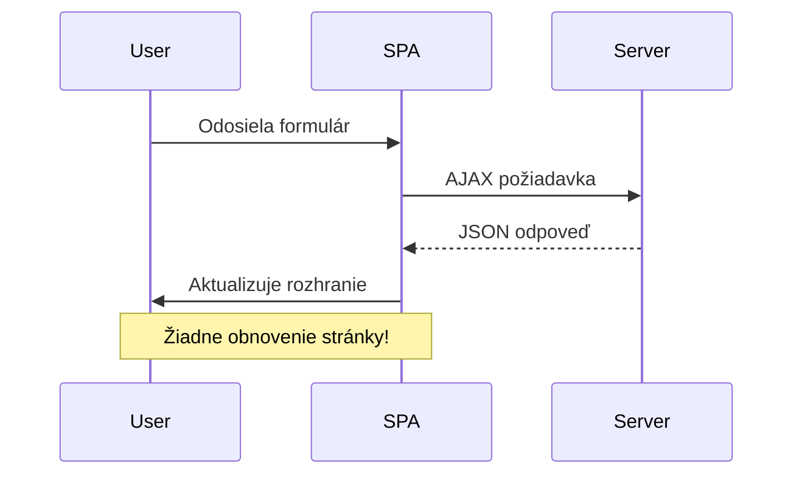
**Výhody JavaScriptového spracovania formulárov:**
- **Udržiava** stav aplikácie a kontext používateľa
- **Poskytuje** okamžitú spätnú väzbu a indikátory načítania
- **Umožňuje** dynamické spracovanie chýb a validáciu
- **Vytvára** plynulé zážitky pripomínajúce aplikácie
- **Podporuje** podmienenú logiku na základe odpovedí servera

### Prechod od tradičných k moderným formulárom

**Výzvy tradičného prístupu:**
- **Presmerováva** používateľov mimo aplikácie
- **Stráca** aktuálny stav a kontext aplikácie
- **Vyžaduje** úplné obnovenie stránky pre jednoduché operácie
- **Obmedzuje** kontrolu nad spätou väzbou používateľa

**Výhody moderného JavaScriptového prístupu:**
- **Udržiava** používateľov v rámci aplikácie
- **Zachováva** všetok stav a dáta aplikácie
- **Povoľuje** validáciu a spätnú väzbu v reálnom čase
- **Podporuje** progresívne vylepšenie a prístupnosť

### Implementácia JavaScriptového spracovania formulárov

Nahradíme tradičné odoslanie formulára modernou JavaScriptovou obsluhou udalosti:

```html
<!-- Remove the action attribute and add event handling -->
<form id="registerForm" method="POST" novalidate>
```

**Pridajte registračnú logiku do vášho súboru `app.js`:**

```javascript
// Moderné spracovanie formulárov riadené udalosťami
function register() {
  const registerForm = document.getElementById('registerForm');
  const formData = new FormData(registerForm);
  const data = Object.fromEntries(formData);
  const jsonData = JSON.stringify(data);
  
  console.log('Form data prepared:', data);
}

// Pripojiť poslucháča udalostí pri načítaní stránky
document.addEventListener('DOMContentLoaded', () => {
  const registerForm = document.getElementById('registerForm');
  registerForm.addEventListener('submit', (event) => {
    event.preventDefault(); // Zabraňte predvolenému odoslaniu formulára
    register();
  });
});
```

**Čo sa tu deje:**
- **Zabráni** predvolenému odoslaniu formulára pomocou `event.preventDefault()`
- **Získa** element formulára použitím moderného výberu DOM
- **Extrahuje** dáta z formulára cez silné API `FormData`
- **Konvertuje** FormData na obyčajný objekt cez `Object.fromEntries()`
- **Serializuje** dáta do JSON formátu pre komunikáciu so serverom
- **Zaznamenáva** spracované dáta pre ladenie a overenie

### Pochopenie API FormData

**API FormData poskytuje silné nástroje na spracovanie formulárov:**
```javascript
// Príklad toho, čo FormData zachytáva
const formData = new FormData(registerForm);

// FormData automaticky zachytáva:
// {
//   "user": "john_doe",
//   "currency": "$",
//   "description": "Osobný účet",
//   "balance": "100"
// }
```

**Výhody API FormData:**
- **Komplexný zber**: Zachytáva všetky prvky formulára vrátane textu, súborov a komplexných vstupov
- **Pochopenie typov**: Automaticky spracováva rôzne typy vstupov bez potreby vlastného kódovania
- **Efektivita**: Odstraňuje manuálny zber polí pomocou jediného volania API
- **Prispôsobivosť**: Zachováva funkčnosť pri zmene štruktúry formulára

### Vytvorenie funkcie pre komunikáciu so serverom

Teraz si vytvoríme robustnú funkciu na komunikáciu s vaším API serverom pomocou moderných vzorov JavaScriptu:

```javascript
async function createAccount(account) {
  try {
    const response = await fetch('//localhost:5000/api/accounts', {
      method: 'POST',
      headers: { 
        'Content-Type': 'application/json',
        'Accept': 'application/json'
      },
      body: account
    });
    
    // Skontrolujte, či bola odpoveď úspešná
    if (!response.ok) {
      throw new Error(`HTTP error! status: ${response.status}`);
    }
    
    return await response.json();
  } catch (error) {
    console.error('Account creation failed:', error);
    return { error: error.message || 'Network error occurred' };
  }
}
```

**Pochopenie asynchrónneho JavaScriptu:**

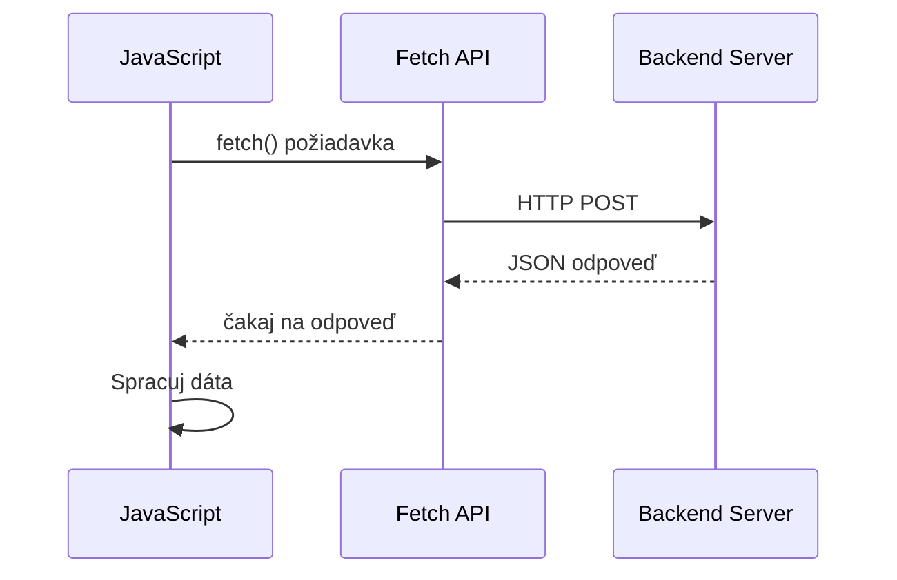
**Čo táto moderná implementácia dosahuje:**
- **Používa** `async/await` pre čitateľný asynchrónny kód
- **Obsahuje** správne spracovanie chýb pomocou blokov try/catch
- **Kontroluje** stav odpovede pred spracovaním dát
- **Nastavuje** vhodné hlavičky pre komunikáciu v JSON
- **Poskytuje** podrobné chybové hlásenia pre ladenie
- **Vracia** konzistentnú dátovú štruktúru pre úspechy aj chyby

### Sila moderného Fetch API

**Výhody Fetch API oproti starším metódam:**

| Funkcia | Výhoda | Implementácia |
|---------|--------|---------------|
| Promise-based | Čistý asynchrónny kód | `await fetch()` |
| Prispôsobenie požiadaviek | Plná kontrola HTTP | Hlavičky, metódy, telo |
| Spracovanie odpovede | Flexibilné parsovanie dát | `.json()`, `.text()`, `.blob()` |
| Spracovanie chýb | Komplexné zachytenie chýb | Bloky try/catch |

> 🎥 **Naučte sa viac**: [Async/Await Tutorial](https://youtube.com/watch?v=YwmlRkrxvkk) – Pochopenie asynchrónnych vzorov JavaScriptu pre moderný webový vývoj.

**Kľúčové koncepty pre komunikáciu so serverom:**
- **Async funkcie** umožňujú pozastaviť vykonávanie a čakať na odpovede servera
- **Kľúčové slovo await** robí asynchrónny kód čitateľným ako synchronný
- **Fetch API** poskytuje moderné HTTP požiadavky založené na promise
- **Spracovanie chýb** zabezpečuje, že vaša aplikácia reaguje elegantne na sieťové problémy

### Dokončenie registračnej funkcie

Spojme všetko dohromady s kompletnou produkčne pripravenou registračnou funkciou:

```javascript
async function register() {
  const registerForm = document.getElementById('registerForm');
  const submitButton = registerForm.querySelector('button[type="submit"]');
  
  try {
    // Zobraziť stav načítania
    submitButton.disabled = true;
    submitButton.textContent = 'Creating Account...';
    
    // Spracovať údaje z formulára
    const formData = new FormData(registerForm);
    const jsonData = JSON.stringify(Object.fromEntries(formData));
    
    // Odoslať na server
    const result = await createAccount(jsonData);
    
    if (result.error) {
      console.error('Registration failed:', result.error);
      alert(`Registration failed: ${result.error}`);
      return;
    }
    
    console.log('Account created successfully!', result);
    alert(`Welcome, ${result.user}! Your account has been created.`);
    
    // Resetovať formulár po úspešnej registrácii
    registerForm.reset();
    
  } catch (error) {
    console.error('Unexpected error:', error);
    alert('An unexpected error occurred. Please try again.');
  } finally {
    // Obnoviť stav tlačidla
    submitButton.disabled = false;
    submitButton.textContent = 'Create Account';
  }
}
```

**Táto rozšírená implementácia obsahuje:**
- **Poskytuje** vizuálnu spätnú väzbu počas odosielania formulára
- **Deaktivuje** tlačidlo odoslania, aby zabránila opakovaným odoslaním
- **Rieši** očakávané aj neočakávané chyby s gráciou
- **Zobrazuje** používateľsky prívetivé správy o úspechu a chybách
- **Resetuje** formulár po úspešnej registrácii
- **Obnovuje** stav UI bez ohľadu na výsledok

### Testovanie vašej implementácie

**Otvorte nástroje vývojára prehliadača a otestujte registráciu:**

1. **Otvorte** konzolu prehliadača (F12 → karta Konzola)
2. **Vyplňte** registračný formulár
3. **Kliknite** na "Vytvoriť účet"
4. **Sledujte** správy v konzole a spätnú väzbu používateľa


**Čo by ste mali vidieť:**
- **Stav načítavania** sa zobrazí na tlačidle odoslania
- **Záznamy v konzole** zobrazujú podrobné informácie o procese
- **Správa o úspechu** sa zobrazí po úspešnom vytvorení účtu
- **Formulár sa automaticky resetuje** po úspešnom odoslaní

> 🔒 **Bezpečnostné upozornenie**: Dáta momentálne cestujú cez HTTP, čo nie je bezpečné pre produkciu. V reálnych aplikáciách vždy používajte HTTPS na zašifrovanie prenosu dát. Viac sa dozviete o [bezpečnosti HTTPS](https://en.wikipedia.org/wiki/HTTPS) a prečo je dôležitá na ochranu údajov používateľov.

### 🔄 **Pedagogická kontrola**
**Integrácia moderného JavaScriptu**: Overte si svoj prehľad o asynchrónnom spracovaní formulárov:
- ✅ Ako mení `event.preventDefault()` predvolené správanie formulára?
- ✅ Prečo je API FormData efektívnejšie ako manuálny zber polí?
- ✅ Ako zlepšujú async/await vzory čitateľnosť kódu?
- ✅ Akú úlohu zohráva spracovanie chýb pri používateľskej skúsenosti?

**Architektúra systému**: Vaše spracovanie formulára demonštruje:
- **Programovanie riadené udalosťami**: Formuláre reagujú na používateľské akcie bez obnovovania stránky
- **Asynchrónnu komunikáciu**: Požiadavky na server neblokujú používateľské rozhranie
- **Spracovanie chýb**: Elegantné zlyhanie pri chybách siete
- **Správu stavu**: Aktualizácie UI zodpovedajú odpovediam servera
- **Progresívne vylepšenie**: Základná funkčnosť funguje, JavaScript ju vylepšuje

**Profesionálne vzory**: Implementovali ste:
- **Jednotnú zodpovednosť**: Funkcie majú jasné a zamerané účely
- **Hranice chýb**: Bloky try/catch zabraňujú pádom aplikácie
- **Spätnú väzbu používateľovi**: Stavy načítania a správy o úspechu/chybách
- **Transformáciu dát**: Prevod FormData na JSON pre serverovú komunikáciu

## Komplexná validácia formulára

Validácia formulára zabraňuje frustrujúcemu zisteniu chýb až po odoslaní. Rovnako ako viaceré redundantné systémy na Medzinárodnej vesmírnej stanici, účinná validácia používa viac vrstiev kontrolných mechanizmov.

Optimálny prístup kombinuje validáciu na úrovni prehliadača pre okamžitú spätnú väzbu, JavaScript validáciu pre lepší používateľský zážitok a validáciu na strane servera pre bezpečnosť a integritu dát. Táto redundancia zabezpečuje spokojnosť používateľa aj ochranu systému.

### Pochopenie vrstiev validácie

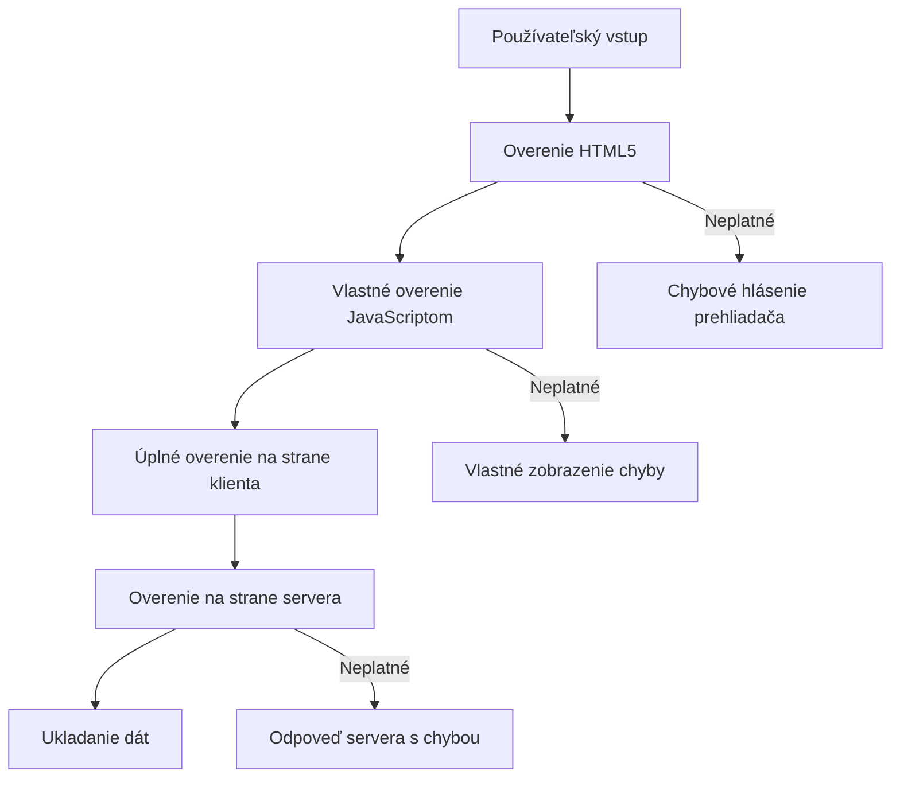
**Stratégia viacvrstvovej validácie:**
- **HTML5 validácia**: Okamžité kontroly priamo v prehliadači
- **JavaScript validácia**: Vlastná logika a používateľský zážitok
- **Serverová validácia**: Konečné bezpečnostné a integritné kontroly
- **Progresívne vylepšenie**: Funguje aj keď je JavaScript vypnutý

### HTML5 atribúty validácie

**Moderné nástroje validácie dostupné pre vás:**

| Atribút | Účel | Príklad použitia | Správanie prehliadača |
|---------|-------|------------------|-----------------------|
| `required` | Povinné polia | `<input required>` | Zabráni prázdnemu odoslaniu |
| `minlength`/`maxlength` | Obmedzenia dĺžky textu | `<input maxlength="20">` | Vynucuje maximálny počet znakov |
| `min`/`max` | Číselné rozsahy | `<input min="0" max="1000">` | Validuje hranice čísel |
| `pattern` | Vlastné regex pravidlá | `<input pattern="[A-Za-z]+">` | Zodpovedá špecifickým formátom |
| `type` | Validácia dátového typu | `<input type="email">` | Validácia podľa formátu |

### CSS štýly pre validáciu

**Vytvorte vizuálnu spätnú väzbu pre stavy validácie:**

```css
/* Valid input styling */
input:valid {
  border-color: #28a745;
  background-color: #f8fff9;
}

/* Invalid input styling */
input:invalid {
  border-color: #dc3545;
  background-color: #fff5f5;
}

/* Focus states for better accessibility */
input:focus:valid {
  box-shadow: 0 0 0 0.2rem rgba(40, 167, 69, 0.25);
}

input:focus:invalid {
  box-shadow: 0 0 0 0.2rem rgba(220, 53, 69, 0.25);
}
```

**Čo tieto vizuálne prvky dosahujú:**
- **Zelené okraje**: Indikujú úspešnú validáciu, ako zelené svetlá v riadiacom centre misie
- **Červené okraje**: Signalizujú chyby validácie vyžadujúce opravu
- **Zvýraznenie focusu**: Poskytuje jasný vizuálny kontext aktuálneho vstupu
- **Konzistentné štýly**: Vytvárajú predvídateľné vzory rozhrania pre používateľov

> 💡 **Tip na prax**: Používajte CSS pseudotriedy `:valid` a `:invalid` na okamžitú vizuálnu spätnú väzbu pri písaní používateľa, čím vytvoríte responzívne a nápomocné rozhranie.

### Implementácia komplexnej validácie

Vylepšime váš registračný formulár robustnou validáciou, ktorá zabezpečí výborný používateľský zážitok a kvalitu dát:

```html
<form id="registerForm" method="POST" novalidate>
  <div class="form-group">
    <label for="user">Username <span class="required">*</span></label>
    <input id="user" name="user" type="text" required 
           minlength="3" maxlength="20" 
           pattern="[a-zA-Z0-9_]+" 
           autocomplete="username"
           title="Username must be 3-20 characters, letters, numbers, and underscores only">
    <small class="form-text">Choose a unique username (3-20 characters)</small>
  </div>
  
  <div class="form-group">
    <label for="currency">Currency <span class="required">*</span></label>
    <input id="currency" name="currency" type="text" required 
           value="$" maxlength="3" 
           pattern="[A-Z$€£¥₹]+" 
           title="Enter a valid currency symbol or code">
    <small class="form-text">Currency symbol (e.g., $, €, £)</small>
  </div>
  
  <div class="form-group">
    <label for="description">Account Description</label>
    <input id="description" name="description" type="text" 
           maxlength="100" 
           placeholder="Personal savings, checking, etc.">
    <small class="form-text">Optional description (up to 100 characters)</small>
  </div>
  
  <div class="form-group">
    <label for="balance">Starting Balance</label>
    <input id="balance" name="balance" type="number" 
           value="0" min="0" step="0.01" 
           title="Enter a positive number for your starting balance">
    <small class="form-text">Initial account balance (minimum $0.00)</small>
  </div>
  
  <button type="submit">Create Account</button>
</form>
```

**Pochopenie rozšírenej validácie:**
- **Kombinuje** indikátory povinných polí s užitočnými opisami
- **Obsahuje** atribúty `pattern` pre formátovú validáciu
- **Poskytuje** atribúty `title` pre prístupnosť a tooltipy
- **Pridáva** pomocný text na usmernenie vstupu používateľa
- **Používa** sémantickú štruktúru HTML pre lepšiu prístupnosť

### Pokročilé validačné pravidlá

**Čo každé validačné pravidlo zabezpečuje:**

| Pole | Validačné pravidlá | Výhoda pre používateľa |
|-------|--------------------|-----------------------|
| Užívateľské meno | `required`, `minlength="3"`, `maxlength="20"`, `pattern="[a-zA-Z0-9_]+"` | Zabezpečuje platné, jedinečné identifikátory |
| Mena | `required`, `maxlength="3"`, `pattern="[A-Z$€£¥₹]+"` | Prijíma bežné symboly mien |
| Zostatok | `min="0"`, `step="0.01"`, `type="number"` | Zabráni záporným zostatkom |
| Popis | `maxlength="100"` | Rozumné obmedzenia dĺžky |

### Testovanie správania validácie

**Vyskúšajte tieto validačné situácie:**
1. **Odošlite** formulár s prázdnymi povinnými poliami
2. **Vložte** užívateľské meno kratšie ako 3 znaky
3. **Vyskúšajte** špeciálne znaky v poli užívateľského mena
4. **Zadajte** zápornú hodnotu zostatku

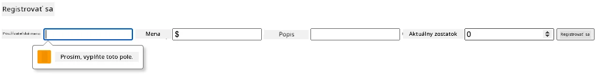

**Čo uvidíte:**
- **Prehliadač zobrazí** natívne validačné správy
- **Štýly sa menia** na základe stavov `:valid` a `:invalid`
- **Odoslanie formulára** je blokované, kým všetky validácie neprejdú
- **Automatické presunutie focusu** na prvé neplatné pole

### Validácia na klientovi vs na serveri

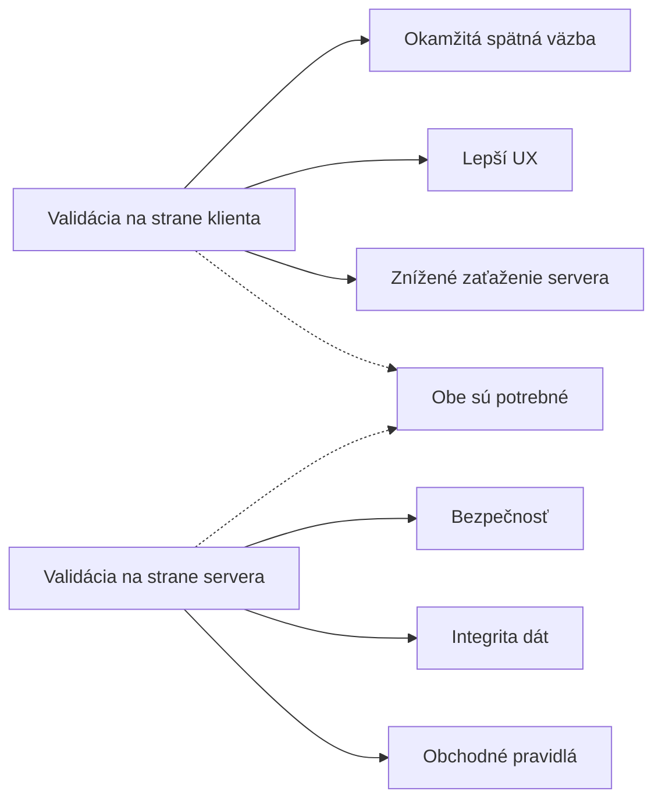
**Prečo potrebujete obe vrstvy:**
- **Klientská validácia**: Poskytuje okamžitú spätnú väzbu a zlepšuje používateľský zážitok
- **Serverová validácia**: Zabezpečuje bezpečnosť a rieši zložité obchodné pravidlá
- **Kombinovaný prístup**: Vytvára robustné, používateľsky prívetivé a bezpečné aplikácie
- **Progresívne vylepšenie**: Funguje aj bez JavaScriptu

> 🛡️ **Bezpečnostné pripomenutie**: Nikdy nespoliehajte len na klientskú validáciu! Škodliví používatelia môžu obísť kontroly na klientovi, preto je serverová validácia nevyhnutná pre bezpečnosť a integritu dát.

### ⚡ **Čo môžete spraviť v nasledujúcich 5 minútach**
- [ ] Otestujte svoj formulár s neplatnými dátami a skontrolujte validačné správy
- [ ] Skúste odoslať formulár s vypnutým JavaScriptom a pozrite si HTML5 validáciu
- [ ] Otvorte DevTools prehliadača a skontrolujte odosielané dáta formulára
- [ ] Vyskúšajte rôzne typy vstupov a sledujte zmeny klávesnice na mobilných zariadeniach

### 🎯 **Čo môžete dosiahnuť počas tejto hodiny**
- [ ] Dokončite kvíz po lekcii a pochopte koncepty spracovania formulárov
- [ ] Implementujte komplexnú validáciu s okamžitou spätnou väzbou
- [ ] Pridajte CSS štýly pre profesionálny vzhľad formulárov
- [ ] Vytvorte spracovanie chýb pre duplicitné užívateľské mená a chyby servera
- [ ] Pridajte pole na potvrdenie hesla s validáciou súladu

### 📅 **Váš týždenný plán ovládania formulárov**
- [ ] Dokončite komplexnú bankovú aplikáciu s pokročilými funkciami formulárov
- [ ] Implementujte nahrávanie súborov pre profilové obrázky alebo dokumenty
- [ ] Pridajte viacstupňové formuláre s indikátormi progresu a správou stavu
- [ ] Vytvorte dynamické formuláre, ktoré sa prispôsobujú na základe výberov používateľa
- [ ] Implementujte automatické ukladanie a obnovu formulárov pre lepší používateľský zážitok
- [ ] Pridajte pokročilú validáciu, ako overenie emailu a formátovanie telefónnych čísel

### 🌟 **Váš mesačný plán ovládania frontendového vývoja**
- [ ] Vytvorte komplexné aplikácie s formulármi vrátane podmienených logík a workflowov
- [ ] Naučte sa knižnice a frameworky pre rýchly vývoj formulárov
- [ ] Ovládnite zásady prístupnosti a inkluzívne dizajnové princípy
- [ ] Implementujte internacionalizáciu a lokalizáciu pre globálne formuláre
- [ ] Vytvorte knižnice opakovane použiteľných komponentov formulárov a dizajnové systémy
- [ ] Prispievajte do open source projektov zameraných na formuláre a zdieľajte najlepšie postupy

## 🎯 Váš časový plán ovládania vývoja formulárov

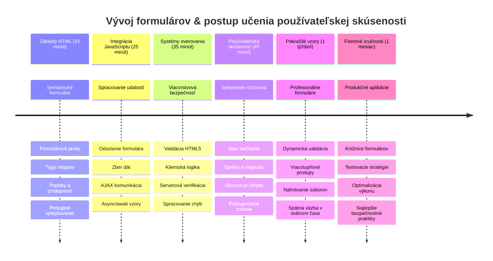
### 🛠️ Zhrnutie vášho nástroja pre vývoj formulárov

Po dokončení tejto lekcie ste ovládli:
- **HTML5 formuláre**: Sémantickú štruktúru, typy vstupov a prístupnostné funkcie
- **JavaScript spracovanie formulárov**: Spracovanie udalostí, zber dát a AJAX komunikáciu
- **Architektúru validácie**: Viacvrstvovú validáciu pre bezpečnosť a používateľský zážitok
- **Asynchrónne programovanie**: Moderné Fetch API a vzory async/await
- **Správu chýb**: Komplexné spracovanie chýb a systémy spätnej väzby používateľovi
- **Dizajn používateľského zážitku**: Stavy načítania, správy o úspechu a zotavenie z chýb
- **Progresívne vylepšenie**: Formuláre fungujúce vo všetkých prehliadačoch a podmienkach

**Skutočné aplikácie**: Vaše zručnosti vo vývoji formulárov nájdu uplatnenie v:
- **E-commerce aplikáciách**: Procesy platby, registrácia účtu a platobné formuláre
- **Podnikových softvéroch**: Systémy zadávania dát, reportovacie rozhrania a workflow aplikácie
- **Systémoch správy obsahu**: Publikačné platformy, obsah generovaný používateľmi a administrátorské rozhrania
- **Finančných aplikáciách**: Bankové rozhrania, investičné platformy a transakčné systémy
- **Zdravotníckych systémoch**: Portály pre pacientov, plánovanie termínov a formuláre lekárskych záznamov
- **Vzdelávacích platformách**: Registrácia kurzov, hodnotiace nástroje a manažment vzdelávania

**Profesijné zručnosti získané**: Teraz viete:
- **Navrhovať** prístupné formuláre fungujúce pre všetkých používateľov vrátane osôb so zdravotným postihnutím
- **Implementovať** bezpečnú validáciu formulárov, ktorá zabraňuje poškodeniu dát a bezpečnostným dieram
- **Vytvárať** responzívne používateľské rozhrania poskytujúce jasnú spätnú väzbu a usmernenia
- **Ladiť** zložité interakcie formulárov pomocou nástrojov vývojára prehliadača a analýzy siete
- **Optimalizovať** výkon formulárov efektívnym spracovaním dát a stratégiami validácie

**Ovládnuté koncepty frontendového vývoja**:
- **Architektúra riadená udalosťami**: Spracovanie interakcie používateľa a odpoveďových systémov
- **Asynchrónne programovanie**: Nezablokujúca komunikácia so serverom a spracovanie chýb
- **Validácia dát**: Klientská aj serverová bezpečnosť a kontrola integrity
- **Dizajn používateľského zážitku**: Intuitívne rozhrania vedúce používateľov k úspechu
- **Inžinierstvo prístupnosti**: Inkluzívny dizajn fungujúci pre rôzne potreby používateľov

**Ďalšia úroveň**: Ste pripravení objaviť pokročilé knižnice formulárov, implementovať komplexné validačné pravidlá alebo vybudovať podnikové systémy zberu dát!

🌟 **Dosiahnutý úspech**: Vybudovali ste kompletný systém spracovania formulárov s profesionálnou validáciou, spracovaním chýb a používateľskými vzormi!

---


---

## GitHub Copilot Agent Challenge 🚀

Použite režim Agenta na dokončenie nasledujúcej výzvy:

**Popis:** Vylepšite registračný formulár komplexnou validáciou na strane klienta a spätnou väzbou používateľovi. Táto výzva vám pomôže precvičiť validáciu formulárov, spracovanie chýb a zlepšovanie používateľského zážitku interaktívnou spätnou väzbou.
**Výzva:** Vytvorte kompletný systém validácie formulára pre registračný formulár, ktorý zahŕňa: 1) spätnej väzby validácie v reálnom čase pre každé pole počas písania používateľa, 2) vlastné chybové hlásenia zobrazené pod každým vstupným poľom, 3) pole na potvrdenie hesla s validáciou zhody, 4) vizuálne indikátory (ako zelené fajky pre platné polia a červené varovania pre neplatné), 5) tlačidlo odoslania, ktoré je povolené len vtedy, keď prejdú všetky validácie. Použite atribúty HTML5 na validáciu, CSS pre štýlovanie stavov validácie a JavaScript pre interaktívne správanie.

Viac informácií o [agent mode](https://code.visualstudio.com/blogs/2025/02/24/introducing-copilot-agent-mode) nájdete tu.

## 🚀 Výzva

Zobrazte chybové hlásenie v HTML, ak užívateľ už existuje.

Tu je príklad, ako môže konečná prihlasovacia stránka vyzerať po miernom úprave štýlov:

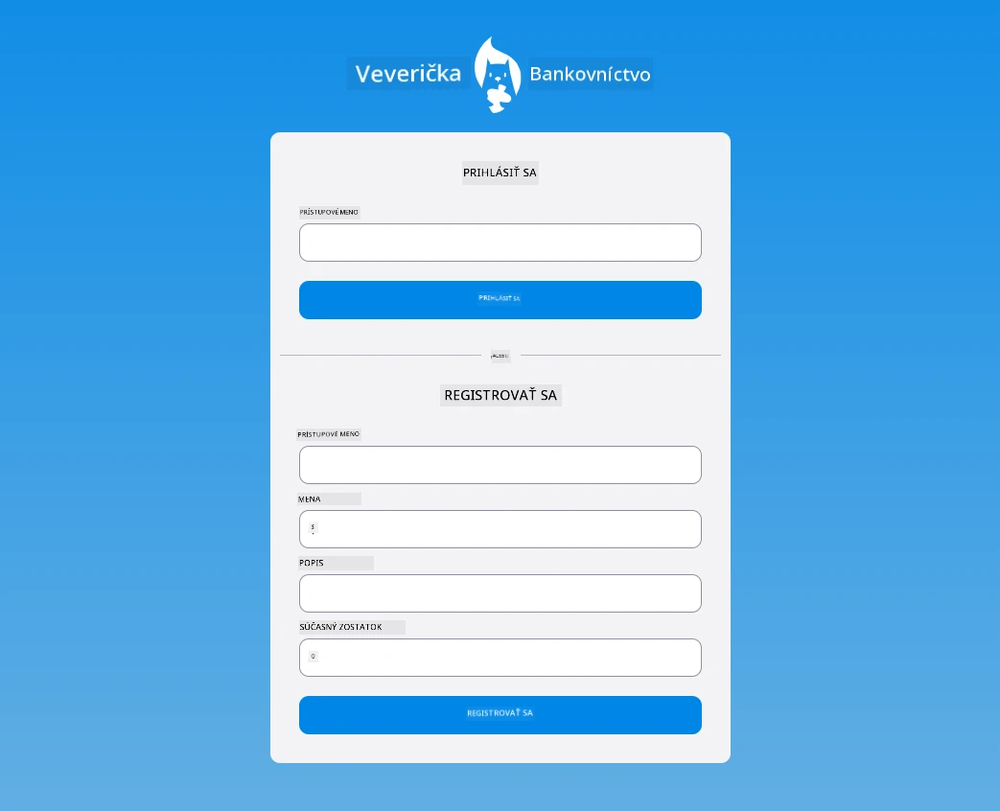

## Kvíz po prednáške

[Kvíz po prednáške](https://ff-quizzes.netlify.app/web/quiz/44)

## Prehľad & Samostatné štúdium

Vývojári sa stali veľmi kreatívnymi v tvorbe svojich formulárov, najmä čo sa týka stratégií validácie. Prezrite si rôzne postupy pri tvorbe formulárov na [CodePen](https://codepen.com); dokážete nájsť nejaké zaujímavé a inšpiratívne formuláre?

## Zadanie

[Štýlujte svoju bankovú aplikáciu](assignment.md)

---

<!-- CO-OP TRANSLATOR DISCLAIMER START -->
**Zrieknutie sa zodpovednosti**:  
Tento dokument bol preložený pomocou AI prekladateľskej služby [Co-op Translator](https://github.com/Azure/co-op-translator). Hoci sa snažíme o presnosť, majte prosím na pamäti, že automatizované preklady môžu obsahovať chyby alebo nepresnosti. Pôvodný dokument v jeho rodnom jazyku by mal byť považovaný za autoritatívny zdroj. Pre kritické informácie sa odporúča profesionálny ľudský preklad. Nezodpovedáme za akékoľvek nedorozumenia alebo nesprávne interpretácie vyplývajúce z použitia tohto prekladu.
<!-- CO-OP TRANSLATOR DISCLAIMER END -->