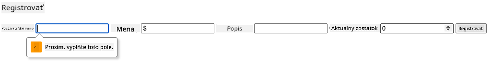
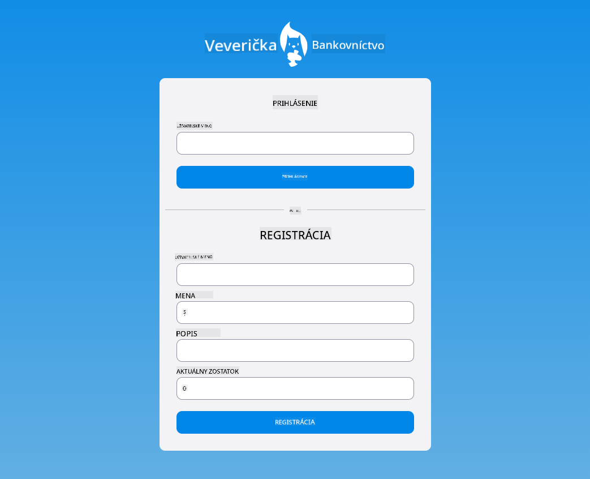

<!--
CO_OP_TRANSLATOR_METADATA:
{
  "original_hash": "8baca047d77a5f43fa4099c0578afa42",
  "translation_date": "2025-08-29T11:05:20+00:00",
  "source_file": "7-bank-project/2-forms/README.md",
  "language_code": "sk"
}
-->
# Vytvorenie bankovej aplikácie, časť 2: Vytvorenie prihlasovacieho a registračného formulára

## Kvíz pred prednáškou

[Kvíz pred prednáškou](https://ff-quizzes.netlify.app/web/quiz/43)

### Úvod

Takmer vo všetkých moderných webových aplikáciách si môžete vytvoriť účet, aby ste mali vlastný súkromný priestor. Keďže webovú aplikáciu môže naraz používať viacero používateľov, potrebujete mechanizmus na oddelené ukladanie osobných údajov každého používateľa a výber informácií, ktoré sa majú zobraziť. Nebudeme sa zaoberať tým, ako [bezpečne spravovať identitu používateľa](https://en.wikipedia.org/wiki/Authentication), pretože je to rozsiahla téma sama o sebe, ale zabezpečíme, aby si každý používateľ mohol vytvoriť jeden (alebo viac) bankových účtov v našej aplikácii.

V tejto časti použijeme HTML formuláre na pridanie prihlasovania a registrácie do našej webovej aplikácie. Ukážeme si, ako programovo odosielať údaje na serverovú API, a nakoniec, ako definovať základné pravidlá validácie pre vstupy používateľa.

### Predpoklady

Musíte mať dokončenú časť [HTML šablóny a smerovanie](../1-template-route/README.md) webovej aplikácie pre túto lekciu. Tiež musíte nainštalovať [Node.js](https://nodejs.org) a [spustiť serverovú API](../api/README.md) lokálne, aby ste mohli odosielať údaje na vytvorenie účtov.

**Poznámka**
Budete mať spustené dva terminály naraz, ako je uvedené nižšie:
1. Pre hlavnú bankovú aplikáciu, ktorú sme vytvorili v lekcii [HTML šablóny a smerovanie](../1-template-route/README.md)
2. Pre [serverovú API bankovej aplikácie](../api/README.md), ktorú sme práve nastavili vyššie.

Na pokračovanie v lekcii musíte mať oba servery spustené. Počúvajú na rôznych portoch (port `3000` a port `5000`), takže všetko by malo fungovať bez problémov.

Môžete otestovať, či server beží správne, vykonaním tohto príkazu v termináli:

```sh
curl http://localhost:5000/api
# -> should return "Bank API v1.0.0" as a result
```

---

## Formulár a ovládacie prvky

Element `<form>` obklopuje sekciu HTML dokumentu, kde používateľ môže zadávať a odosielať údaje pomocou interaktívnych ovládacích prvkov. Existuje množstvo rôznych ovládacích prvkov používateľského rozhrania (UI), ktoré je možné použiť vo formulári, najbežnejšie sú elementy `<input>` a `<button>`.

Existuje veľa rôznych [typov](https://developer.mozilla.org/docs/Web/HTML/Element/input) `<input>`, napríklad na vytvorenie poľa, kde používateľ môže zadať svoje používateľské meno, môžete použiť:

```html
<input id="username" name="username" type="text">
```

Atribút `name` bude použitý ako názov vlastnosti, keď budú údaje formulára odoslané. Atribút `id` sa používa na priradenie `<label>` k ovládaciemu prvku formulára.

> Pozrite si celý zoznam [`<input>` typov](https://developer.mozilla.org/docs/Web/HTML/Element/input) a [iných ovládacích prvkov formulára](https://developer.mozilla.org/docs/Learn/Forms/Other_form_controls), aby ste získali predstavu o všetkých natívnych UI elementoch, ktoré môžete použiť pri tvorbe svojho rozhrania.

✅ Všimnite si, že `<input>` je [prázdny element](https://developer.mozilla.org/docs/Glossary/Empty_element), ku ktorému by ste *nemali* pridávať zodpovedajúci zatvárací tag. Môžete však použiť samo-uzatvárací zápis `<input/>`, ale nie je to povinné.

Element `<button>` vo formulári je trochu špeciálny. Ak nešpecifikujete jeho atribút `type`, automaticky odošle údaje formulára na server, keď naň kliknete. Tu sú možné hodnoty atribútu `type`:

- `submit`: Predvolená hodnota vo formulári `<form>`, tlačidlo spustí akciu odoslania formulára.
- `reset`: Tlačidlo obnoví všetky ovládacie prvky formulára na ich počiatočné hodnoty.
- `button`: Nepriraďuje predvolené správanie pri stlačení tlačidla. Môžete mu potom priradiť vlastné akcie pomocou JavaScriptu.

### Úloha

Začnime pridaním formulára do šablóny `login`. Budeme potrebovať pole *používateľské meno* a tlačidlo *Prihlásiť sa*.

```html
<template id="login">
  <h1>Bank App</h1>
  <section>
    <h2>Login</h2>
    <form id="loginForm">
      <label for="username">Username</label>
      <input id="username" name="user" type="text">
      <button>Login</button>
    </form>
  </section>
</template>
```

Ak sa pozriete bližšie, môžete si všimnúť, že sme tu pridali aj element `<label>`. Elementy `<label>` sa používajú na pridanie názvu k ovládacím prvkom UI, ako je naše pole používateľského mena. Štítky sú dôležité pre čitateľnosť vašich formulárov, ale majú aj ďalšie výhody:

- Priradením štítku k ovládaciemu prvku formulára pomáha používateľom, ktorí používajú asistívne technológie (napríklad čítačku obrazovky), pochopiť, aké údaje sa od nich očakávajú.
- Kliknutím na štítok môžete priamo zamerať priradený vstup, čo uľahčuje jeho dosiahnutie na zariadeniach s dotykovou obrazovkou.

> [Prístupnosť](https://developer.mozilla.org/docs/Learn/Accessibility/What_is_accessibility) na webe je veľmi dôležitá téma, ktorá sa často prehliada. Vďaka [semantickým HTML elementom](https://developer.mozilla.org/docs/Learn/Accessibility/HTML) nie je ťažké vytvárať prístupný obsah, ak ich používate správne. Môžete si [prečítať viac o prístupnosti](https://developer.mozilla.org/docs/Web/Accessibility), aby ste sa vyhli bežným chybám a stali sa zodpovedným vývojárom.

Teraz pridáme druhý formulár pre registráciu, hneď pod ten predchádzajúci:

```html
<hr/>
<h2>Register</h2>
<form id="registerForm">
  <label for="user">Username</label>
  <input id="user" name="user" type="text">
  <label for="currency">Currency</label>
  <input id="currency" name="currency" type="text" value="$">
  <label for="description">Description</label>
  <input id="description" name="description" type="text">
  <label for="balance">Current balance</label>
  <input id="balance" name="balance" type="number" value="0">
  <button>Register</button>
</form>
```

Pomocou atribútu `value` môžeme definovať predvolenú hodnotu pre daný vstup.
Všimnite si tiež, že vstup pre `balance` má typ `number`. Vyzerá inak ako ostatné vstupy? Skúste s ním interagovať.

✅ Dokážete navigovať a interagovať s formulármi iba pomocou klávesnice? Ako by ste to urobili?

## Odosielanie údajov na server

Teraz, keď máme funkčné UI, ďalším krokom je odoslanie údajov na server. Urobme rýchly test pomocou nášho aktuálneho kódu: čo sa stane, keď kliknete na tlačidlo *Prihlásiť sa* alebo *Registrovať*?

Všimli ste si zmenu v sekcii URL vášho prehliadača?


Predvolená akcia pre `<form>` je odoslať formulár na aktuálnu URL servera pomocou [metódy GET](https://www.w3.org/Protocols/rfc2616/rfc2616-sec9.html#sec9.3), pričom údaje formulára sa pripoja priamo k URL. Táto metóda má však určité nevýhody:

- Odoslané údaje sú veľmi obmedzené veľkosťou (asi 2000 znakov)
- Údaje sú priamo viditeľné v URL (nie je ideálne pre heslá)
- Nepracuje s nahrávaním súborov

Preto ju môžete zmeniť na použitie [metódy POST](https://www.w3.org/Protocols/rfc2616/rfc2616-sec9.html#sec9.5), ktorá odosiela údaje formulára na server v tele HTTP požiadavky, bez predchádzajúcich obmedzení.

> Hoci POST je najčastejšie používaná metóda na odosielanie údajov, [v niektorých špecifických scenároch](https://www.w3.org/2001/tag/doc/whenToUseGet.html) je vhodnejšie použiť metódu GET, napríklad pri implementácii vyhľadávacieho poľa.

### Úloha

Pridajte vlastnosti `action` a `method` do registračného formulára:

```html
<form id="registerForm" action="//localhost:5000/api/accounts" method="POST">
```

Teraz sa pokúste zaregistrovať nový účet so svojím menom. Po kliknutí na tlačidlo *Registrovať* by ste mali vidieť niečo takéto:


Ak všetko prebehne správne, server by mal odpovedať na vašu požiadavku s [JSON](https://www.json.org/json-en.html) odpoveďou obsahujúcou údaje o vytvorenom účte.

✅ Skúste sa zaregistrovať znova s rovnakým menom. Čo sa stane?

## Odosielanie údajov bez načítania stránky

Ako ste si pravdepodobne všimli, existuje malý problém s prístupom, ktorý sme práve použili: pri odoslaní formulára sa dostaneme mimo našej aplikácie a prehliadač presmeruje na URL servera. Snažíme sa vyhnúť všetkým načítaniam stránok v našej webovej aplikácii, pretože vytvárame [jednostránkovú aplikáciu (SPA)](https://en.wikipedia.org/wiki/Single-page_application).

Aby sme mohli odoslať údaje formulára na server bez núteného načítania stránky, musíme použiť JavaScriptový kód. Namiesto zadania URL do vlastnosti `action` elementu `<form>` môžete použiť akýkoľvek JavaScriptový kód predchádzajúci reťazcom `javascript:`, aby ste vykonali vlastnú akciu. Použitie tohto prístupu tiež znamená, že budete musieť implementovať niektoré úlohy, ktoré predtým automaticky vykonával prehliadač:

- Získať údaje formulára
- Konvertovať a zakódovať údaje formulára do vhodného formátu
- Vytvoriť HTTP požiadavku a odoslať ju na server

### Úloha

Nahraďte vlastnosť `action` registračného formulára:

```html
<form id="registerForm" action="javascript:register()">
```

Otvorte `app.js` a pridajte novú funkciu s názvom `register`:

```js
function register() {
  const registerForm = document.getElementById('registerForm');
  const formData = new FormData(registerForm);
  const data = Object.fromEntries(formData);
  const jsonData = JSON.stringify(data);
}
```

Tu získavame element formulára pomocou `getElementById()` a používame pomocníka [`FormData`](https://developer.mozilla.org/docs/Web/API/FormData) na extrahovanie hodnôt z ovládacích prvkov formulára ako sadu dvojíc kľúč/hodnota. Potom konvertujeme údaje na bežný objekt pomocou [`Object.fromEntries()`](https://developer.mozilla.org/docs/Web/JavaScript/Reference/Global_Objects/Object/fromEntries) a nakoniec serializujeme údaje do [JSON](https://www.json.org/json-en.html), formátu bežne používaného na výmenu údajov na webe.

Údaje sú teraz pripravené na odoslanie na server. Vytvorte novú funkciu s názvom `createAccount`:

```js
async function createAccount(account) {
  try {
    const response = await fetch('//localhost:5000/api/accounts', {
      method: 'POST',
      headers: { 'Content-Type': 'application/json' },
      body: account
    });
    return await response.json();
  } catch (error) {
    return { error: error.message || 'Unknown error' };
  }
}
```

Čo táto funkcia robí? Najprv si všimnite kľúčové slovo `async`. To znamená, že funkcia obsahuje kód, ktorý sa bude vykonávať [**asynchrónne**](https://developer.mozilla.org/docs/Web/JavaScript/Reference/Statements/async_function). Keď sa použije spolu s kľúčovým slovom `await`, umožňuje čakať na vykonanie asynchrónneho kódu - napríklad čakanie na odpoveď servera - pred pokračovaním.

Tu je krátke video o používaní `async/await`:

[](https://youtube.com/watch?v=YwmlRkrxvkk "Async a Await na správu sľubov")

> 🎥 Kliknite na obrázok vyššie pre video o async/await.

Používame API `fetch()` na odoslanie JSON údajov na server. Táto metóda má 2 parametre:

- URL servera, takže tu opäť zadáme `//localhost:5000/api/accounts`.
- Nastavenia požiadavky. Tu nastavíme metódu na `POST` a poskytneme `body` požiadavky. Keďže na server odosielame JSON údaje, musíme tiež nastaviť hlavičku `Content-Type` na `application/json`, aby server vedel, ako interpretovať obsah.

Keďže server odpovie na požiadavku s JSON, môžeme použiť `await response.json()` na analýzu JSON obsahu a vrátenie výsledného objektu. Všimnite si, že táto metóda je asynchrónna, takže tu používame kľúčové slovo `await`, aby sme sa uistili, že akékoľvek chyby počas analýzy sú tiež zachytené.

Teraz pridajte nejaký kód do funkcie `register`, aby zavolala `createAccount()`:

```js
const result = await createAccount(jsonData);
```

Keďže tu používame kľúčové slovo `await`, musíme pridať kľúčové slovo `async` pred funkciu register:

```js
async function register() {
```

Nakoniec pridajme nejaké logy na kontrolu výsledku. Finálna funkcia by mala vyzerať takto:

```js
async function register() {
  const registerForm = document.getElementById('registerForm');
  const formData = new FormData(registerForm);
  const jsonData = JSON.stringify(Object.fromEntries(formData));
  const result = await createAccount(jsonData);

  if (result.error) {
    return console.log('An error occurred:', result.error);
  }

  console.log('Account created!', result);
}
```

To bolo trochu dlhé, ale dostali sme sa tam! Ak otvoríte [nástroje pre vývojárov prehliadača](https://developer.mozilla.org/docs/Learn/Common_questions/What_are_browser_developer_tools) a pokúsite sa zaregistrovať nový účet, nemali by ste vidieť žiadnu zmenu na webovej stránke, ale v konzole sa objaví správa potvrdzujúca, že všetko funguje.


✅ Myslíte si, že údaje sú odosielané na server bezpečne? Čo ak by niekto dokázal zachytiť požiadavku? Môžete si prečítať o [HTTPS](https://en.wikipedia.org/wiki/HTTPS), aby ste sa dozvedeli viac o bezpečnej komunikácii údajov.

## Validácia údajov

Ak sa pokúsite zaregistrovať nový účet bez nastavenia používateľského mena, môžete vidieť, že server vráti chybu so status kódom [400 (Zlá požiadavka)](https://developer.mozilla.org/docs/Web/HTTP/Status/400#:~:text=The%20HyperText%20Transfer%20Protocol%20(HTTP,%2C%20or%20deceptive%20request%20routing).).

Pred odoslaním údajov na server je dobrým zvykom [validovať údaje formulára](https://developer.mozilla.org/docs/Learn/Forms/Form_validation) vopred, keď je to možné, aby ste sa uistili, že odosielate platnú požiadavku. HTML5 ovládacie prvky formulára poskytujú zabudovanú validáciu pomocou rôznych atribútov:

- `required`: pole musí byť vyplnené, inak formulár nemôže byť odoslaný.
- `minlength` a `maxlength`: definuje minimálny a maximálny počet znakov v textových poliach.
- `min` a `max`: definuje minimálnu a maximálnu hodnotu číselného poľa.
- `type`: definuje druh očakávaných údajov, ako napríklad `number`, `email`, `file` alebo [iné zabudované typy](https://developer.mozilla.org/docs/Web/HTML/Element/input). Tento atribút môže tiež zmeniť vizuálne zobrazenie ovládacieho prvku formulára.
- `pattern`: umožňuje definovať [regulárny výraz](https://developer.mozilla.org/docs/Web/JavaScript/Guide/Regular_Expressions) na testovanie, či zadané údaje sú platné alebo nie.
> Tip: vzhľad ovládacích prvkov formulára môžete prispôsobiť podľa toho, či sú platné alebo neplatné, pomocou pseudo-tried CSS `:valid` a `:invalid`.
### Úloha

Na vytvorenie platného nového účtu sú potrebné dve povinné polia: používateľské meno a mena. Ostatné polia sú voliteľné. Aktualizujte HTML formulára tak, aby ste použili atribút `required` a text v označení poľa:

```html
<label for="user">Username (required)</label>
<input id="user" name="user" type="text" required>
...
<label for="currency">Currency (required)</label>
<input id="currency" name="currency" type="text" value="$" required>
```

Aj keď táto konkrétna implementácia servera nevyžaduje špecifické obmedzenia na maximálnu dĺžku polí, je vždy dobrým zvykom definovať rozumné limity pre akýkoľvek text zadávaný používateľom.

Pridajte atribút `maxlength` do textových polí:

```html
<input id="user" name="user" type="text" maxlength="20" required>
...
<input id="currency" name="currency" type="text" value="$" maxlength="5" required>
...
<input id="description" name="description" type="text" maxlength="100">
```

Ak teraz stlačíte tlačidlo *Registrovať* a niektoré pole nespĺňa pravidlo validácie, ktoré sme definovali, mali by ste vidieť niečo takéto:



Validácia, ktorá sa vykonáva *pred* odoslaním akýchkoľvek údajov na server, sa nazýva **validácia na strane klienta**. Je však dôležité si uvedomiť, že nie je vždy možné vykonať všetky kontroly bez odoslania údajov. Napríklad tu nemôžeme overiť, či už existuje účet s rovnakým používateľským menom, bez odoslania požiadavky na server. Ďalšia validácia vykonaná na serveri sa nazýva **validácia na strane servera**.

Zvyčajne je potrebné implementovať obe. Používanie validácie na strane klienta zlepšuje používateľskú skúsenosť tým, že poskytuje okamžitú spätnú väzbu používateľovi, zatiaľ čo validácia na strane servera je nevyhnutná na zabezpečenie toho, aby údaje, ktoré spracovávate, boli správne a bezpečné.

---

## 🚀 Výzva

Zobrazte chybovú správu v HTML, ak používateľ už existuje.

Tu je príklad, ako môže vyzerať finálna prihlasovacia stránka po troche štýlovania:



## Kvíz po prednáške

[Kvíz po prednáške](https://ff-quizzes.netlify.app/web/quiz/44)

## Prehľad a samostatné štúdium

Vývojári sa stali veľmi kreatívnymi pri vytváraní formulárov, najmä pokiaľ ide o stratégie validácie. Zistite viac o rôznych postupoch pri tvorbe formulárov prehliadaním [CodePen](https://codepen.com); nájdete niektoré zaujímavé a inšpiratívne formuláre?

## Zadanie

[Štýlujte svoju bankovú aplikáciu](assignment.md)

---

**Upozornenie**:  
Tento dokument bol preložený pomocou služby na automatický preklad [Co-op Translator](https://github.com/Azure/co-op-translator). Hoci sa snažíme o presnosť, upozorňujeme, že automatické preklady môžu obsahovať chyby alebo nepresnosti. Pôvodný dokument v jeho pôvodnom jazyku by mal byť považovaný za autoritatívny zdroj. Pre dôležité informácie odporúčame profesionálny ľudský preklad. Nezodpovedáme za žiadne nedorozumenia alebo nesprávne interpretácie vyplývajúce z použitia tohto prekladu.