# Vytvorte bankovú aplikáciu časť 3: Spôsoby získavania a používania dát

Predstavte si počítač Enterprise zo Star Treku – keď kapitán Picard žiada o stav lode, informácie sa zobrazia okamžite bez toho, aby sa celé rozhranie zastavilo a znovu zostavovalo. Tento plynulý tok informácií je presne to, čo tu vytvárame s dynamickým získavaním dát.

Váš bankový app je momentálne ako vytlačená novina – informatívna, ale statická. Premeníme ju na niečo viac ako riadiace centrum NASA, kde dáta tečú nepretržite a aktualizujú sa v reálnom čase bez prerušenia pracovného toku používateľa.

Naučíte sa, ako asynchrónne komunikovať so servermi, spracovávať dáta, ktoré prichádzajú v rôznom čase, a premieňať surové informácie na zmysluplný obsah pre vašich používateľov. Toto je rozdiel medzi demom a softvérom pripraveným na produkciu.

## ⚡ Čo zvládnete za ďalších 5 minút

**Rýchla cesta pre zaneprázdnených vývojárov**

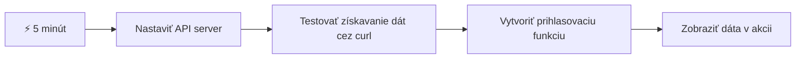
- **Minúty 1-2**: Spustite svoj API server (`cd api && npm start`) a otestujte pripojenie
- **Minúta 3**: Vytvorte základnú funkciu `getAccount()` používajúcu fetch
- **Minúta 4**: Prepojte prihlasovací formulár s `action="javascript:login()"`
- **Minúta 5**: Otestujte prihlásenie a sledujte, ako sa dáta o účte zobrazia v konzole

**Rýchle testovacie príkazy**:
```bash
# Overiť, či API beží
curl http://localhost:5000/api

# Test načítania údajov účtu
curl http://localhost:5000/api/accounts/test
```

**Prečo je to dôležité**: Za 5 minút uvidíte čaro asynchrónneho získavania dát, ktoré poháňa každú modernú webovú aplikáciu. Toto je základ, ktorý robí aplikácie rýchle a živé.

## 🗺️ Vaša cesta učenia sa cez dátovo riadené webové aplikácie

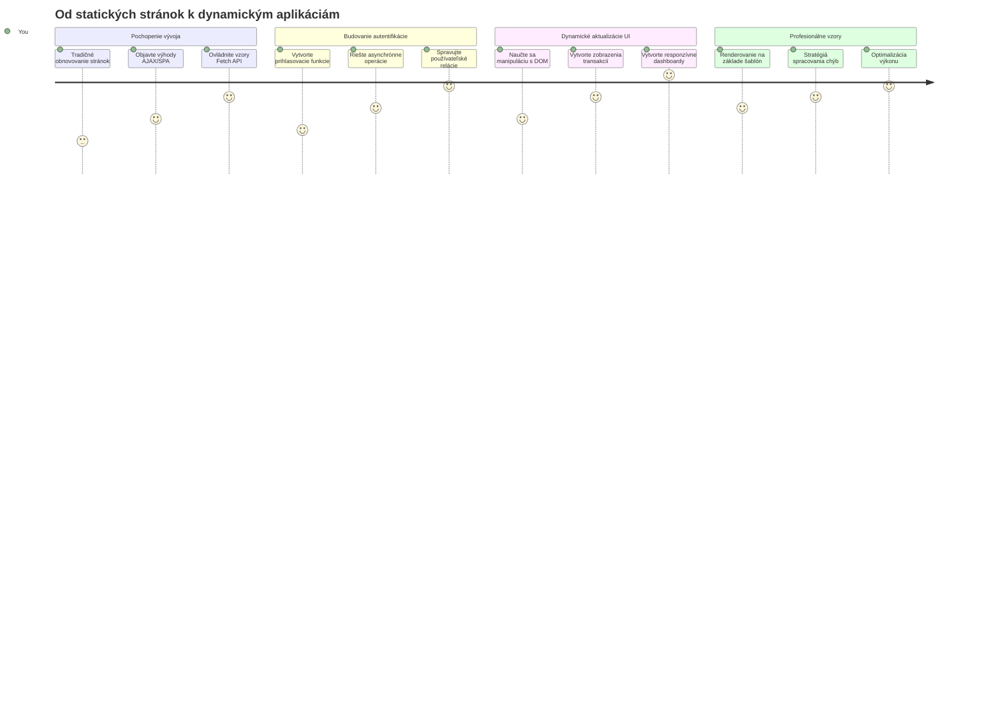
**Cieľ vašej cesty**: Na konci tejto lekcie budete rozumieť, ako moderné webové aplikácie získavajú, spracovávajú a dynamicky zobrazujú dáta, čím vytvárajú plynulé používateľské zážitky, ktoré očakávame od profesionálnych aplikácií.

## Pre-učebný kvíz

[Pre-učebný kvíz](https://ff-quizzes.netlify.app/web/quiz/45)

### Predpoklady

Pred tým, než začnete so získavaním dát, uistite sa, že máte pripravené tieto komponenty:

- **Predchádzajúca lekcia**: Dokončite [Formulár prihlásenia a registrácie](../2-forms/README.md) – na tomto základe budeme stavať
- **Lokálny server**: Nainštalujte [Node.js](https://nodejs.org) a [spustite API server](../api/README.md), ktorý poskytne dáta o účtoch
- **Pripojenie k API**: Otestujte svoje pripojenie k serveru pomocou tohto príkazu:

```bash
curl http://localhost:5000/api
# Očakávaná odpoveď: "Bank API v1.0.0"
```

Tento rýchly test zabezpečuje, že všetky komponenty správne komunikujú:
- Overuje správnu funkčnosť Node.js na vašom systéme
- Potvrdzuje, že váš API server je aktívny a odpovedá
- Validuje, že vaša aplikácia vie dosiahnuť server (ako kontrola rádiového spojenia pred misiou)

## 🧠 Prehľad ekosystému správy dát

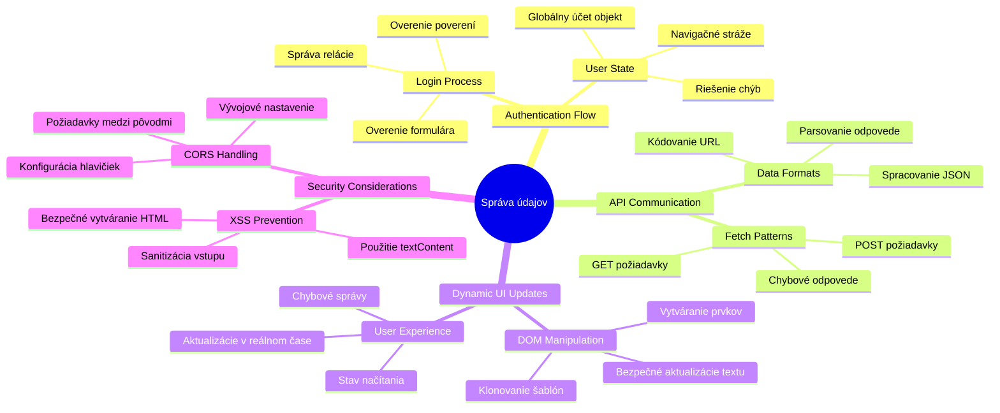
**Základný princíp**: Moderné webové aplikácie sú systémy na orchestráciu dát – koordinujú medzi používateľským rozhraním, serverovými API a bezpečnostnými modelmi prehliadača, aby vytvorili plynulé, responzívne zážitky.

---

## Pochopenie získavania dát v moderných webových aplikáciách

Spôsob, akým webové aplikácie spracovávajú dáta, sa v posledných dvoch desaťročiach dramaticky vyvinul. Pochopenie tejto evolúcie vám pomôže oceniť, prečo sú moderné techniky ako AJAX a Fetch API také silné a prečo sa stali nevyhnutnými nástrojmi pre webových vývojárov.

Pozrime sa, ako tradičné weby fungovali oproti dynamickým, responzívnym aplikáciám, ktoré dnes vytvárame.

### Tradičné viacstránkové aplikácie (MPA)

Začiatky webu boli ako prepínanie kanálov na starom televízore – obrazovka zhasla a potom sa pomaly načítal nový obsah. Takto v skutočnosti fungovali prvé webové aplikácie, kde každá interakcia znamenala kompletne prekresliť celú stránku od základu.

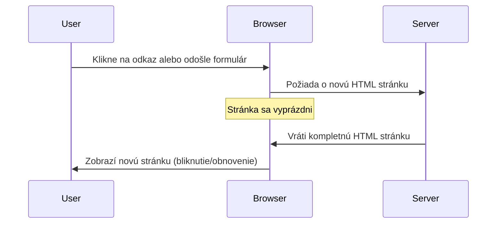
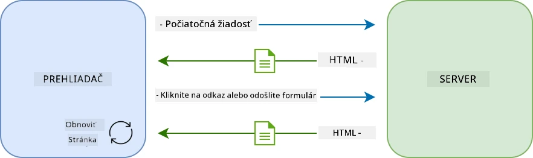

**Prečo tento prístup pôsobil neohrabane:**
- Každým kliknutím sa celé znovu načítavala stránka
- Používatelia boli rušení blikajúcimi stránkami uprostred myšlienky
- Vaše internetové pripojenie pracovalo na plné obrátky pri sťahovaní rovnakých hlavičiek a pätičiek
- Aplikácie pôsobili skôr ako preklikávanie skrinky na spisy než ako skutočný softvér

### Moderné jednostránkové aplikácie (SPA)

AJAX (Asynchronous JavaScript and XML) úplne zmenil túto paradigmu. Ako modulárna stavba Medzinárodnej vesmírnej stanice, kde astronauti môžu meniť jednotlivé časti bez prestavby celého komplexu, AJAX nám umožňuje aktualizovať iba konkrétne časti stránky bez znovunačítania všetkého. Napriek názvu, ktorý spomína XML, dnes využívame prevažne JSON, no základný princíp zostáva: aktualizovať len to, čo je potrebné.

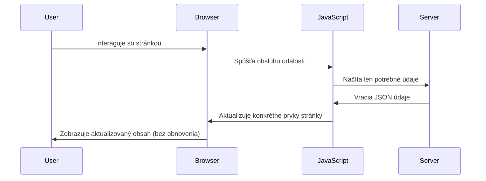
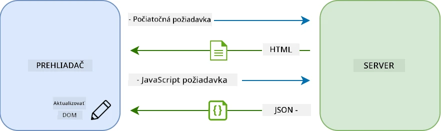

**Prečo sa SPA cítia omnoho lepšie:**
- Aktualizujú sa len zmenené časti (šikovné, však?)
- Žiadne nepríjemné prerušovania – používatelia zostávajú vo svojom pracovnom toku
- Menej dát cez sieť znamená rýchlejšie načítavanie
- Všetko pôsobí rýchlo a responzívne, ako aplikácie na vašom telefóne

### Vývoj k modernému Fetch API

Moderné prehliadače poskytujú [`Fetch` API](https://developer.mozilla.org/docs/Web/API/Fetch_API), ktoré nahrádza staršie [`XMLHttpRequest`](https://developer.mozilla.org/docs/Web/API/XMLHttpRequest/Using_XMLHttpRequest). Ako rozdiel medzi telegrafom a emailom, Fetch API používa promises pre čistejší asynchrónny kód a prirodzene pracuje s JSON.

| Funkcia | XMLHttpRequest | Fetch API |
|---------|----------------|----------|
| **Syntax** | Zložitý callbackový | Čistý založený na promises |
| **Spracovanie JSON** | Vyžaduje manuálne parsovanie | Vstavaná metóda `.json()` |
| **Spracovanie chýb** | Obmedzené informácie o chybách | Komplexné detaily o chybách |
| **Moderná podpora** | Kompatibilita so starším kódom | ES6+ promises a async/await |

> 💡 **Kompatibilita prehliadačov**: Dobrá správa – Fetch API funguje vo všetkých moderných prehliadačoch! Ak vás zaujímajú konkrétne verzie, [caniuse.com](https://caniuse.com/fetch) má kompletný prehľad.
> 
**Zhrnutie:**
- Funguje skvele v Chrome, Firefox, Safari a Edge (v podstate všade, kde sú vaši používatelia)
- Iba Internet Explorer vyžaduje dodatočnú podporu (a úprimne, je načase sa IE rozlúčiť)
- Položí základ pre elegantný async/await vzor, ktorý použijeme neskôr

### Implementácia prihlasovania používateľa a získavania dát

Teraz implementujme prihlasovací systém, ktorý premení vašu bankovú aplikáciu zo statickej zobrazenia na funkčnú aplikáciu. Ako autentifikačné protokoly v bezpečných vojenských zariadeniach, overíme prihlasovacie údaje a následne poskytneme prístup k špecifickým dátam používateľa.

Budeme to stavať postupne, začneme základnou autentifikáciou a potom pridáme funkcie získavania dát.

#### Krok 1: Vytvorenie základu prihlasovacej funkcie

Otvorte svoj súbor `app.js` a pridajte novú funkciu `login`. Tá bude riešiť proces autentifikácie používateľa:

```javascript
async function login() {
  const loginForm = document.getElementById('loginForm');
  const user = loginForm.user.value;
}
```

**Pozrime sa na to podrobnejšie:**
- Ten kľúčový slovný výraz `async`? Hovorí JavaScriptu „hej, táto funkcia možno bude musieť čakať na niečo“
- Odcvičíme náš formulár zo stránky (nič zložité, len ho nájdeme podľa ID)
- Potom získame, čo používateľ zadal ako svoje používateľské meno
- Tu je šikovný trik: môžete pristupovať k akýmkoľvek vstupom formulára podľa ich atribútu `name` – nie je potrebné volať getElementById navyše!

> 💡 **Prístup k formuláru**: Ku každému ovládaciemu prvku formulára sa dá pristupovať podľa jeho name (nastaveného v HTML cez atribút `name`) ako k vlastnosti formulárového elementu. Poskytuje to čistý a prehľadný spôsob získavania dát z formulára.

#### Krok 2: Vytvorenie funkcie na získavanie dát účtu

Ďalej vytvoríme samostatnú funkciu na získavanie dát o účte zo servera. Nasleduje rovnaký vzor ako funkcionalita registrácie, ale zameraná na získavanie dát:

```javascript
async function getAccount(user) {
  try {
    const response = await fetch('//localhost:5000/api/accounts/' + encodeURIComponent(user));
    return await response.json();
  } catch (error) {
    return { error: error.message || 'Unknown error' };
  }
}
```

**Čo tento kód dosahuje:**
- **Používa** moderné `fetch` API na asynchrónne získavanie dát
- **Stavia** URL pre GET požiadavku s parametrom používateľského mena
- **Používa** `encodeURIComponent()` na bezpečné spracovanie špeciálnych znakov v URL
- **Konvertuje** odpoveď do formátu JSON pre jednoduchú manipuláciu s dátami
- **Ovláda** chyby elegantne, vracia objekt s chybou namiesto pádu aplikácie

> ⚠️ **Bezpečnostná poznámka**: Funkcia `encodeURIComponent()` spracováva špeciálne znaky v URL. Ako kódovacie systémy používané v námornej komunikácii, zabezpečuje, že vaša správa dorazí presne tak, ako má, a zabraňuje nesprávnej interpretácii znakov ako "#" alebo "&".
> 
**Prečo je to dôležité:**
- Zabráni tomu, aby špeciálne znaky rozbili URL
- Chráni pred útokmi na manipuláciu s URL
- Zabezpečuje, že server prijme správne dáta
- Dodržiava bezpečnostné programátorské postupy

#### Pochopenie HTTP GET požiadaviek

Možno vás prekvapí, že keď použijete `fetch` bez ďalších nastavení, automaticky sa vytvorí [`GET`](https://developer.mozilla.org/docs/Web/HTTP/Methods/GET) požiadavka. To je ideálne pre to, čo robíme – pýtame sa servera „hej, môžem vidieť dáta účtu tohto používateľa?“

Predstavte si GET požiadavku ako zdvorilé požičanie knihy z knižnice – žiadate o zobrazenie niečoho, čo už existuje. POST požiadavky (ktoré sme použili pri registrácii) sú viac ako vloženie novej knihy do zbierky.

| GET požiadavka | POST požiadavka |
|----------------|-----------------|
| **Účel** | Získať existujúce dáta | Poslať nové dáta na server |
| **Parametre** | V URL ceste alebo dotaze | V tele požiadavky |
| **Cacheovanie** | Môže byť cacheované prehliadačom | Obvykle sa necacheuje |
| **Bezpečnosť** | Viditeľné v URL a logoch | Skryté v tele požiadavky |

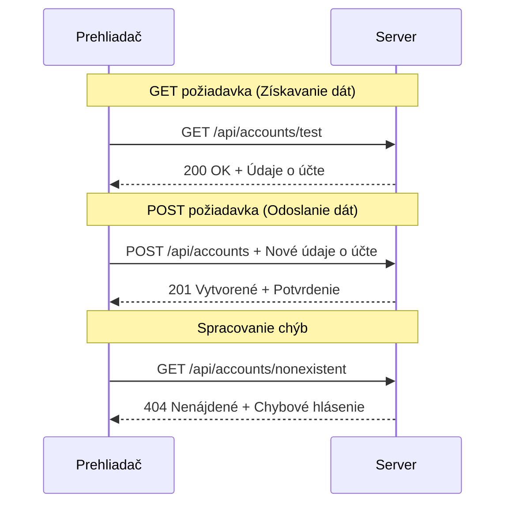
#### Krok 3: Spojenie všetkého dohromady

Teraz tá uspokojivá časť – prepojme vašu funkciu na získavanie účtu s prihlasovacím procesom. Tu to všetko zapadne na svoje miesto:

```javascript
async function login() {
  const loginForm = document.getElementById('loginForm');
  const user = loginForm.user.value;
  const data = await getAccount(user);

  if (data.error) {
    return console.log('loginError', data.error);
  }

  account = data;
  navigate('/dashboard');
}
```

Táto funkcia nasleduje jasný postup:
- Extrahuje používateľské meno zo vstupu formulára
- Požiada server o dáta používateľa
- Rieši prípadné chyby počas procesu
- Uloží dáta o účte a po úspechu prejde na dashboard

> 🎯 **Vzorec async/await**: Keďže `getAccount` je asynchrónna funkcia, používame kľúčové slovo `await`, aby sme počkali, kým server nezareaguje. Tým zabránime pokračovaniu kódu s nedefinovanými dátami.

#### Krok 4: Vytvorenie miesta pre dáta

Aplikácia potrebuje miesto, kde si zapamätá informácie o účte, keď sú načítané. Predstavte si to ako krátkodobú pamäť aplikácie – miesto, kde ukladá aktuálne dáta používateľa poruke. Pridajte tento riadok na začiatok vášho súboru `app.js`:

```javascript
// Toto uchováva údaje účtu aktuálneho používateľa
let account = null;
```

**Prečo to potrebujeme:**
- Umožňuje prístup k dátam účtu z ľubovoľného miesta v aplikácii
- Začíname s `null`, čo znamená „nikto nie je prihlásený“
- Hodnota sa aktualizuje, keď sa používateľ úspešne prihlási alebo zaregistruje
- Funguje ako jediný zdroj pravdy – žiadne zmätky, kto je prihlásený

#### Krok 5: Prepojenie formulára

Teraz prepojme vašu novú prihlasovaciu funkciu s HTML formulárom. Aktualizujte tag formulára takto:

```html
<form id="loginForm" action="javascript:login()">
  <!-- Your existing form inputs -->
</form>
```

**Čo tento malý update robí:**
- Zastaví formulár od štandardného „preinštalovania celej stránky“
- Zavolá vašu vlastnú JavaScript funkciu
- Zabezpečí plynulosť a efekt SPA
- Dáva vám plnú kontrolu nad tým, čo sa stane, keď používateľ klikne na „Login“

#### Krok 6: Vylepšenie registračnej funkcie

Pre konzistenciu aktualizujte svoju funkciu `register`, aby tiež ukladala dáta účtu a presmerovala na dashboard:

```javascript
// Pridajte tieto riadky na koniec vašej funkcie register
account = result;
navigate('/dashboard');
```

**Táto úprava prináša:**
- **Plynulý** prechod z registrácie na dashboard
- **Konzistentný** používateľský zážitok medzi prihlásením a registráciou
- **Okamžitý** prístup k dátam účtu po úspešnej registrácii

#### Testovanie vašej implementácie

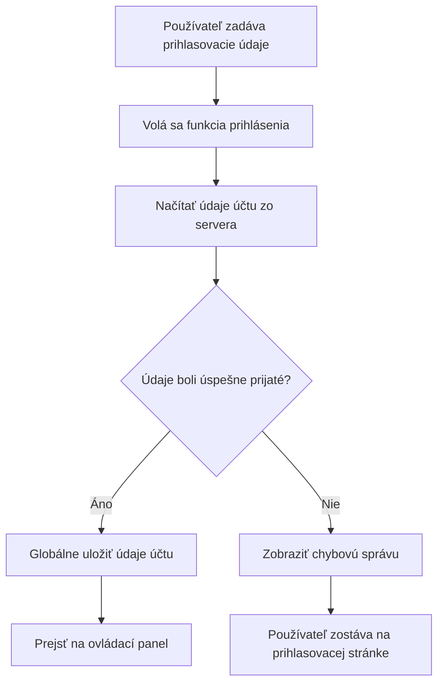
**Čas otestovať:**
1. Vytvorte nový účet a overte, že všetko funguje
2. Skúste sa prihlásiť s týmito istými údajmi
3. Pozrite si konzolu prehliadača (F12), ak sa niečo javí divne
4. Uistite sa, že po prihlásení skončíte na dashboarde

Ak niečo nefunguje, nebojte sa! Väčšina problémov je jednoduchá na opravu, ako preklepy alebo zabudnuté spustenie API servera.

#### Krátka poznámka o magii medzi rôznymi doménami

Možno sa pýtate: „Ako moja webová aplikácia komunikuje s API serverom, keď bežia na rôznych portoch?“ Skvelá otázka! Toto je téma, na ktorú všetci weboví vývojári narazia.

> 🔒 **Bezpečnosť medzi doménami**: Prehliadače uplatňujú „politiku rovnakého pôvodu“, aby zabránili neoprávnenej komunikácii medzi rôznymi doménami. Ako bezpečnostná kontrolná stanica v Pentagone, overujú, že komunikácia je autorizovaná, skôr než povolia prenos dát.
> 
**V našom nastavení:**
- Vaša webová aplikácia beží na `localhost:3000` (vývojársky server)
- Vaše API beží na `localhost:5000` (backend server)
- API server obsahuje [CORS hlavičky](https://developer.mozilla.org/docs/Web/HTTP/CORS), ktoré explicitne povoľujú komunikáciu z vašej webovej aplikácie

Toto nastavenie zrkadlí reálny vývoj, kde frontend a backend aplikácie bežne bežia na samostatných serveroch.

> 📚 **Viac informácií**: Ponorte sa hlbšie do tém API a získavania dát cez komplexný [Microsoft Learn modul o API](https://docs.microsoft.com/learn/modules/use-apis-discover-museum-art/?WT.mc_id=academic-77807-sagibbon).

## Oživenie dát v HTML

Teraz sprístupníme získané dáta používateľom cez manipuláciu s DOM. Ako proces vyvolávania fotografií v temnej komore, berieme neviditeľné dáta a vykresľujeme ich do niečoho, čo môžu používatelia vidieť a s čím môžu pracovať.
Manipulácia s DOM je technika, ktorá premení statické webové stránky na dynamické aplikácie, ktoré aktualizujú svoj obsah na základe interakcií používateľa a odpovedí servera.

### Výber správneho nástroja pre prácu

Keď ide o aktualizáciu vášho HTML pomocou JavaScriptu, máte niekoľko možností. Predstavte si ich ako rôzne nástroje v skrinke – každý je ideálny na konkrétnu úlohu:

| Metóda | Na čo je skvelá | Kedy ju použiť | Úroveň bezpečnosti |
|--------|-----------------|----------------|-------------------|
| `textContent` | Bezpečné zobrazovanie používateľských údajov | Vždy, keď zobrazujete text | ✅ Pevne spoľahlivá |
| `createElement()` + `append()` | Vytváranie komplexných rozložení | Pri vytváraní nových sekcií/zoznamov | ✅ Nezmar |
| `innerHTML` | Nastavenie HTML obsahu | ⚠️ Snažte sa tomu vyhnúť | ❌ Riziková záležitosť |

#### Bezpečný spôsob zobrazovania textu: textContent

Vlastnosť [`textContent`](https://developer.mozilla.org/docs/Web/API/Node/textContent) je váš najlepší priateľ pri zobrazovaní používateľských údajov. Je to ako šatniar na vašej webovej stránke – nič škodlivé cez neho neprejde:

```javascript
// Bezpečný a spoľahlivý spôsob aktualizácie textu
const balanceElement = document.getElementById('balance');
balanceElement.textContent = account.balance;
```

**Výhody textContent:**
- Všetko spracováva ako obyčajný text (zabraňuje vykonaniu skriptov)
- Automaticky vymaže existujúci obsah
- Efektívne pre jednoduché aktualizácie textu
- Poskytuje vstavanú ochranu proti škodlivému obsahu

#### Vytváranie dynamických HTML prvkov

Pre komplexnejší obsah kombinujte [`document.createElement()`](https://developer.mozilla.org/docs/Web/API/Document/createElement) s metódou [`append()`](https://developer.mozilla.org/docs/Web/API/ParentNode/append):

```javascript
// Bezpečný spôsob vytvárania nových prvkov
const transactionItem = document.createElement('div');
transactionItem.className = 'transaction-item';
transactionItem.textContent = `${transaction.date}: ${transaction.description}`;
container.append(transactionItem);
```

**Ako tento prístup funguje:**
- **Vytvára** nové DOM prvky programovo
- **Udržiava** úplnú kontrolu nad atribútmi a obsahom prvkov
- **Umožňuje** zložité, vnorené štruktúry prvkov
- **Zachováva** bezpečnosť oddelením štruktúry od obsahu

> ⚠️ **Bezpečnostné upozornenie**: Aj keď sa [`innerHTML`](https://developer.mozilla.org/docs/Web/API/Element/innerHTML) objavuje v mnohých tutoriáloch, môže vykonávať vložené skripty. Ako bezpečnostné protokoly v CERN-e, ktoré zabraňujú neoprávnenému spusteniu kódu, aj použitie `textContent` a `createElement` poskytuje bezpečnejšie alternatívy.
> 
**Riziká innerHTML:**
- Vykonáva akékoľvek `<script>` značky v používateľských údajoch
- Je zraniteľný voči útokom injektáže kódu
- Vytvára potenciálne bezpečnostné dierky
- Používame bezpečnejšie alternatívy, ktoré zodpovedajú funkčnosti

### Zjednodušenie chýb pre používateľov

Momentálne sa chyby pri prihlásení zobrazujú iba v konzole prehliadača, ktorá je pre používateľov neviditeľná. Rovnako ako je rozdiel medzi internými diagnostikami pilota a systémom informovania cestujúcich, potrebujeme komunikovať dôležité informácie správnym kanálom.

Implementácia viditeľných chybových správ poskytuje používateľom okamžitú spätnú väzbu o tom, čo sa pokazilo a ako pokračovať.

#### Krok 1: Pridajte miesto pre chybové správy

Najprv vytvorme domov pre chybové správy vo vašom HTML. Pridajte to tesne pred tlačidlo prihlásenia, aby ho používatelia prirodzene videli:

```html
<!-- This is where error messages will appear -->
<div id="loginError" role="alert"></div>
<button>Login</button>
```

**Čo sa tu deje:**
- Vytvárame prázdny kontajner, ktorý zostáva neviditeľný, kým nie je potrebný
- Je umiestnený tam, kde používatelia prirodzene hľadia po kliknutí na „Prihlásiť sa“
- Atribút `role="alert"` je skvelý pre čítačky obrazovky – oznamuje asistívnym technológiám „hej, toto je dôležité!“
- Jedinečné `id` poskytuje JavaScriptu ľahký cieľ

#### Krok 2: Vytvorte užitočnú pomocnú funkciu

Urobme malú pomocnú funkciu, ktorá dokáže aktualizovať text akéhokoľvek prvku. Je to jedna z tých funkcií „napíš raz, používaj všade“, ktoré vám ušetria čas:

```javascript
function updateElement(id, text) {
  const element = document.getElementById(id);
  element.textContent = text;
}
```

**Výhody funkcie:**
- Jednoduché rozhranie vyžadujúce iba ID prvku a obsah textu
- Bezpečne lokalizuje a aktualizuje DOM prvky
- Opakovane použiteľný vzor, ktorý znižuje duplicitu kódu
- Zachováva konzistentné správanie aktualizácie v celej aplikácii

#### Krok 3: Zobrazte chyby tam, kde ich používatelia uvidia

Teraz nahraďte skrytú správu v konzole niečím, čo používatelia skutočne uvidia. Aktualizujte svoju prihlasovaciu funkciu:

```javascript
// Namiesto jednoduchého zapisovania do konzoly ukáž používateľovi, čo je zle
if (data.error) {
  return updateElement('loginError', data.error);
}
```

**Táto malá zmena robí veľký rozdiel:**
- Chybové správy sa zobrazujú priamo tam, kde používatelia hľadia
- Koniec záhadným tichým zlyhaniam
- Používatelia dostávajú okamžitú, akčnú spätnú väzbu
- Vaša aplikácia začína pôsobiť profesionálne a premyslene

Teraz, keď otestujete s neplatným účtom, uvidíte na stránke užitočnú chybovú správu!


#### Krok 4: Buďte inkluzívni v prístupnosti

Tu je niečo zaujímavé o tom `role="alert"`, ktoré sme pridali – nie je to len dekorácia! Tento malý atribút vytvára tzv. [Live Region](https://developer.mozilla.org/docs/Web/Accessibility/ARIA/ARIA_Live_Regions), ktorý okamžite oznamuje zmeny čítačkám obrazovky:

```html
<div id="loginError" role="alert"></div>
```

**Prečo je to dôležité:**
- Používatelia čítačiek obrazovky počujú chybu hneď, ako sa objaví
- Všetci dostanú rovnaké dôležité informácie, bez ohľadu na spôsob navigácie
- Je to jednoduchý spôsob, ako spraviť vašu aplikáciu dostupnejšou pre viacerých ľudí
- Ukazuje, že vám záleží na tvorbe inkluzívnych zážitkov

Malé detaily ako tieto oddeľujú dobrých vývojárov od skvelých!

### 🎯 Pedagogická kontrola: Vzory autentifikácie

**Zastavte sa a zamyslite sa**: Práve ste implementovali kompletný autentifikačný tok. Toto je základný vzor vo vývoji webov.

**Rýchle sebahodnotenie**:
- Viete vysvetliť, prečo používame async/await pre API volania?
- Čo by sa stalo, keby sme zabudli funkciu `encodeURIComponent()`?
- Ako zlepšuje spracovanie chýb používateľskú skúsenosť?

**Spojenie so skutočným svetom**: Vzory, ktoré ste sa tu naučili (asynchrónne načítavanie dát, spracovanie chýb, spätná väzba používateľovi), používajú všetky hlavné webové aplikácie od sociálnych sietí po e-commerce stránky. Budujete zručnosti na profesionálnej úrovni!

**Výzva**: Ako by ste mohli modifikovať tento autentifikačný systém, aby zvládal viaceré používateľské role (zákazník, administrátor, pokladník)? Premýšľajte o dátovej štruktúre a potrebných zmenách UI.

#### Krok 5: Použite rovnaký vzor pre registráciu

Pre konzistentnosť implementujte rovnaké spracovanie chýb aj vo vašom registračnom formulári:

1. **Pridajte** prvok pre zobrazovanie chýb do registračného HTML:
```html
<div id="registerError" role="alert"></div>
```

2. **Aktualizujte** vašu registračnú funkciu, aby používala rovnaký vzor zobrazenia chýb:
```javascript
if (data.error) {
  return updateElement('registerError', data.error);
}
```

**Výhody konzistentného spracovania chýb:**
- **Zabezpečuje** jednotný používateľský zážitok vo všetkých formulároch
- **Znižuje** kognitívnu záťaž použitím známych vzorov
- **Zjednodušuje** údržbu vďaka opakovane použiteľnému kódu
- **Zaručuje** dodržiavanie štandardov prístupnosti v celej aplikácii

## Vytvorenie vášho dynamického dashboardu

Teraz premeníme váš statický dashboard na dynamické rozhranie, ktoré zobrazuje skutočné údaje o účte. Rovnako ako rozdiel medzi vytlačeným letovým poriadkom a živými odletovými tabuľami na letiskách, posunieme sa od statických informácií k reálnym a interaktívnym zobrazeniam.

Pomocou techník manipulácie s DOM, ktoré ste sa naučili, vytvoríme dashboard, ktorý sa automaticky aktualizuje s aktuálnymi informáciami o účte.

### Spoznajte svoje dáta

Predtým, než začnete s tvorbou, pozrime sa, aký druh dát vám server posiela späť. Keď sa niekto úspešne prihlási, dostanete tento poklad informácií:

```json
{
  "user": "test",
  "currency": "$",
  "description": "Test account",
  "balance": 75,
  "transactions": [
    { "id": "1", "date": "2020-10-01", "object": "Pocket money", "amount": 50 },
    { "id": "2", "date": "2020-10-03", "object": "Book", "amount": -10 },
    { "id": "3", "date": "2020-10-04", "object": "Sandwich", "amount": -5 }
  ]
}
```

**Táto dátová štruktúra poskytuje:**
- **`user`**: Perfektné pre personalizáciu zážitku („Vitaj späť, Sarah!“)
- **`currency`**: Zabezpečuje správne zobrazovanie peňažných súm
- **`description`**: Priateľský názov účtu
- **`balance`**: Všetko dôležitý aktuálny zostatok
- **`transactions`**: Kompletnú históriu transakcií so všetkými detailmi

Všetko, čo potrebujete na vytvorenie profesionálne vyzerajúceho bankového dashboardu!

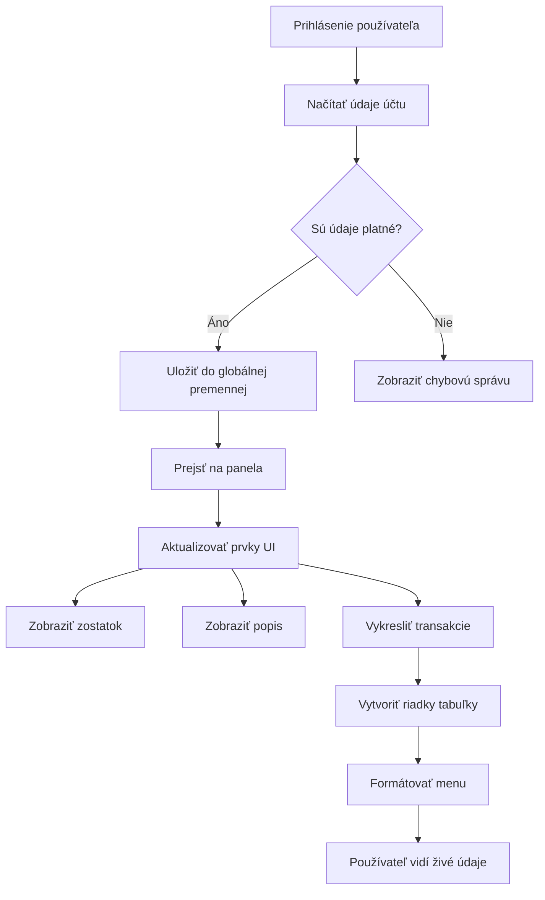
> 💡 **Profesionálny tip**: Chcete vidieť svoj dashboard v akcii hneď teraz? Použite prihlasovacie meno `test` – je prednaplnené ukážkovými dátami, takže uvidíte všetko fungovať bez nutnosti vytvárať transakcie.
> 
**Prečo je testovací účet užitočný:**
- Už obsahuje realistické ukážkové dáta
- Perfektný pre zobrazenie ako sa transakcie zobrazujú
- Skvelý na testovanie funkcií dashboardu
- Ušetrí vám prácu s manuálnym vytváraním dát

### Vytvorenie prvkov pre zobrazenie dashboardu

Postupne vytvoríme rozhranie dashboardu, začneme so súhrnom účtu a potom sa posunieme ku komplexnejším funkciám, ako je zoznam transakcií.

#### Krok 1: Aktualizujte HTML štruktúru

Najprv nahraďte statickú časť „Zostatok“ dynamickými prvkami, ktoré váš JavaScript naplní:

```html
<section>
  Balance: <span id="balance"></span><span id="currency"></span>
</section>
```

Potom pridajte sekciu pre popis účtu. Keďže slúži ako názov obsahu dashboardu, použite semantické HTML:

```html
<h2 id="description"></h2>
```

**Pochopenie HTML štruktúry:**
- **Používa** samostatné `<span>` prvky pre zostatok a menu pre individuálnu kontrolu
- **Aplikuje** jedinečné ID pre každý prvok pre cieľovanie JavaScriptom
- **Nasleduje** semantické HTML použitím `<h2>` pre popis účtu
- **Vytvára** logickú hierarchiu pre čítačky obrazovky a SEO

> ✅ **Postreh o prístupnosti**: Popis účtu funguje ako nadpis obsahu dashboardu, preto je semanticky označený ako titulok. Viac sa dozviete o tom, ako [štruktúra nadpisov](https://www.nomensa.com/blog/2017/how-structure-headings-web-accessibility) ovplyvňuje prístupnosť. Viete identifikovať ďalšie prvky na vašej stránke, ktoré by mohli využiť nadpisové tagy?

#### Krok 2: Vytvorte funkciu na aktualizáciu dashboardu

Teraz vytvorte funkciu, ktorá naplní dashboard skutočnými údajmi o účte:

```javascript
function updateDashboard() {
  if (!account) {
    return navigate('/login');
  }

  updateElement('description', account.description);
  updateElement('balance', account.balance.toFixed(2));
  updateElement('currency', account.currency);
}
```

**Krok za krokom, čo táto funkcia robí:**
- **Overuje**, že údaje o účte existujú pred pokračovaním
- **Presmeruje** neprihlásených používateľov späť na prihlasovaciu stránku
- **Aktualizuje** popis účtu pomocou opakovane použiteľnej funkcie `updateElement`
- **Formátuje** zostatok tak, aby vždy zobrazoval dve desatinné miesta
- **Zobrazí** správny symbol meny

> 💰 **Formátovanie peňazí**: Tá metóda [`toFixed(2)`](https://developer.mozilla.org/docs/Web/JavaScript/Reference/Global_Objects/Number/toFixed) je záchranca života! Zabezpečí, že váš zostatok vždy vyzerá ako skutočné peniaze – „75.00“ namiesto „75“. Vaši používatelia ocenia známe formátovanie meny.

#### Krok 3: Uistite sa, že sa váš dashboard aktualizuje

Aby sa váš dashboard obnovoval s aktuálnymi dátami vždy, keď ho niekto navštívi, musíme sa napojiť na navigačný systém. Ak ste dokončili [zadanie z lekcie 1](../1-template-route/assignment.md), toto bude známe. Ak nie, tu je čo potrebujete:

Pridajte toto na koniec vašej funkcie `updateRoute()`:

```javascript
if (typeof route.init === 'function') {
  route.init();
}
```

Potom aktualizujte vaše routy, aby obsahovali inicializáciu dashboardu:

```javascript
const routes = {
  '/login': { templateId: 'login' },
  '/dashboard': { templateId: 'dashboard', init: updateDashboard }
};
```

**Čo tento šikovný setup robí:**
- Skontroluje, či má daná routa špeciálny inicializačný kód
- Automaticky spustí tento kód pri načítaní routy
- Zabezpečí, že váš dashboard vždy zobrazuje aktuálne, čerstvé dáta
- Udržiava logiku routovania čistú a prehľadnú

#### Testovanie vášho dashboardu

Po implementácii týchto zmien otestujte dashboard:

1. **Prihláste sa** s testovacím účtom
2. **Overte**, že ste presmerovaní na dashboard
3. **Skontrolujte**, či sa správne zobrazujú popis účtu, zostatok a mena
4. **Skúste odhlásiť sa a znovu prihlásiť**, aby ste sa uistili, že sa dáta správne obnovujú

Váš dashboard by mal teraz zobrazovať dynamické informácie o účte, ktoré sa aktualizujú podľa údajov aktuálne prihláseného používateľa!

## Vytváranie inteligentných zoznamov transakcií pomocou šablón

Namiesto manuálneho vytvárania HTML pre každú transakciu použijeme šablóny na automatickú generáciu konzistentného formátovania. Rovnako ako štandardizované komponenty používané vo výrobe kozmických lodí, šablóny zabezpečujú, že každý riadok transakcie nasleduje rovnakú štruktúru a vzhľad.

Táto technika sa efektívne škáluje od niekoľkých transakcií až po tisíce, pričom zachováva konzistentný výkon a prezentáciu.

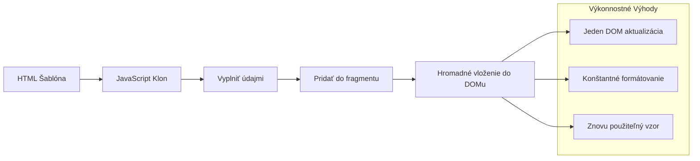
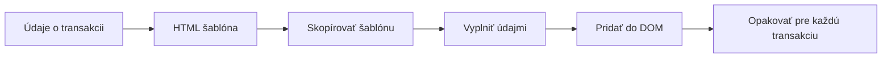
### Krok 1: Vytvorte šablónu pre transakciu

Najprv pridajte opakovane použiteľnú šablónu pre riadky transakcií do `<body>` vášho HTML:

```html
<template id="transaction">
  <tr>
    <td></td>
    <td></td>
    <td></td>
  </tr>
</template>
```

**Pochopenie HTML šablón:**
- **Definuje** štruktúru jedného riadku tabuľky
- **Zostáva** neviditeľná, kým sa neklonuje a nenaplní pomocou JavaScriptu
- **Obsahuje** tri bunky pre dátum, popis a sumu
- **Poskytuje** opakovane použiteľný vzor pre konzistentné formátovanie

### Krok 2: Pripravte tabuľku pre dynamický obsah

Ďalej pridajte `id` do tela tabuľky, aby JavaScript mohol na ňu ľahko cieliť:

```html
<tbody id="transactions"></tbody>
```

**Čo tým dosiahnete:**
- **Vytvára** jasný cieľ pre vkladanie riadkov transakcií
- **Oddeluje** štruktúru tabuľky od dynamického obsahu
- **Umožňuje** ľahké vyčistenie a opätovné naplnenie dát transakcií

### Krok 3: Vytvorte továreň na riadky transakcií

Teraz vytvorte funkciu, ktorá premení dáta transakcie na HTML prvky:

```javascript
function createTransactionRow(transaction) {
  const template = document.getElementById('transaction');
  const transactionRow = template.content.cloneNode(true);
  const tr = transactionRow.querySelector('tr');
  tr.children[0].textContent = transaction.date;
  tr.children[1].textContent = transaction.object;
  tr.children[2].textContent = transaction.amount.toFixed(2);
  return transactionRow;
}
```

**Rozdelenie tejto továrenskej funkcie:**
- **Získa** šablónový prvok podľa jeho ID
- **Klonuje** obsah šablóny pre bezpečnú manipuláciu
- **Vyberá** riadok tabuľky v klonovanom obsahu
- **Napĺňa** každú bunku dátami o transakcii
- **Formátuje** sumu tak, aby správne zobrazovala desatinné miesta
- **Vracia** hotový riadok pripravený na vloženie

### Krok 4: Efektívne generovanie viacerých riadkov transakcií

Pridajte tento kód do vašej funkcie `updateDashboard()`, aby sa zobrazili všetky transakcie:

```javascript
const transactionsRows = document.createDocumentFragment();
for (const transaction of account.transactions) {
  const transactionRow = createTransactionRow(transaction);
  transactionsRows.appendChild(transactionRow);
}
updateElement('transactions', transactionsRows);
```

**Ako tento efektívny prístup funguje:**
- **Vytvára** dokumentový fragment na hromadné operácie s DOM
- **Iteruje** cez všetky transakcie v dátach účtu
- **Generuje** riadok pre každú transakciu pomocou továrenskej funkcie
- **Zbiera** všetky riadky do fragmentu pred pridaním do DOM
- **Vykonáva** jedinú aktualizáciu DOM namiesto viacerých samostatných vložení
> ⚡ **Optimalizácia výkonu**: [`document.createDocumentFragment()`](https://developer.mozilla.org/docs/Web/API/Document/createDocumentFragment) funguje ako montážny proces v Boeing - komponenty sa pripravujú mimo hlavnej linky a potom sa inštalujú ako celok. Tento prístup dávkovania minimalizuje prejavy DOM tým, že vykoná iba jednu vložku namiesto viacerých samostatných operácií.

### Krok 5: Vylepšenie funkcie update pre zmiešaný obsah

Vaša funkcia `updateElement()` momentálne spracováva iba textový obsah. Aktualizujte ju tak, aby pracovala s textom aj DOM uzlami:

```javascript
function updateElement(id, textOrNode) {
  const element = document.getElementById(id);
  element.textContent = ''; // Odstráni všetky deti
  element.append(textOrNode);
}
```

**Kľúčové vylepšenia v tejto aktualizácii:**
- **Vyčistí** existujúci obsah pred pridaním nového
- **Prijíma** ako textové reťazce, tak DOM uzly ako parametre
- **Používa** metódu [`append()`](https://developer.mozilla.org/docs/Web/API/ParentNode/append) pre väčšiu flexibilitu
- **Zachováva** kompatibilitu so staršími textovo orientovanými použitiami

### Otestujte si svoj dashboard

Prišiel čas pravdy! Pozrime sa, ako funguje váš dynamický dashboard:

1. Prihláste sa pomocou účtu `test` (má pripravené ukážkové dáta)
2. Prejdite na svoj dashboard
3. Skontrolujte, či sa riadky transakcií zobrazujú s správnym formátovaním
4. Overte, že dátumy, popisy a sumy sú správne

Ak všetko funguje, mali by ste vidieť plne funkčný zoznam transakcií na svojom dashboarde! 🎉

**Čo ste dosiahli:**
- Vytvorili ste dashboard, ktorý škáluje ľubovoľné množstvo dát
- Vytvorili ste opakovane použiteľné šablóny pre konzistentné formátovanie
- Implementovali ste efektívne techniky manipulácie s DOM
- Vyvinuli ste funkcie porovnateľné s výrobnými bankovými aplikáciami

Úspešne ste transformovali statickú webovú stránku na dynamickú webovú aplikáciu.

### 🎯 Pedagogická kontrola: Dynamické generovanie obsahu

**Pochopenie architektúry**: Implementovali ste sofistikovaný dátový tok do UI, ktorý odráža vzory používané vo frameworkoch ako React, Vue a Angular.

**Kľúčové zvládnuté koncepty**:
- **Rendrovanie na základe šablón**: tvorba opakovane použiteľných UI komponentov
- **Dokumentové fragmenty**: optimalizácia výkonu DOM
- **Bezpečná manipulácia s DOM**: predchádzanie bezpečnostným rizikám
- **Transformácia dát**: konverzia serverových dát do používateľského rozhrania

**Spojenie s priemyslom**: Tieto techniky tvoria základ moderných frontendových frameworkov. Reactov virtuálny DOM, Vue šablónový systém a Angularova komponentová architektúra sú postavené na týchto základných princípoch.

**Reflexná otázka**: Ako by ste tento systém rozšírili, aby zvládal aktualizácie v reálnom čase (napríklad automatické zobrazovanie nových transakcií)? Zvážte použitie WebSockets alebo Server-Sent Events.

---

## 📈 Váš časový plán zvládnutia správy dát

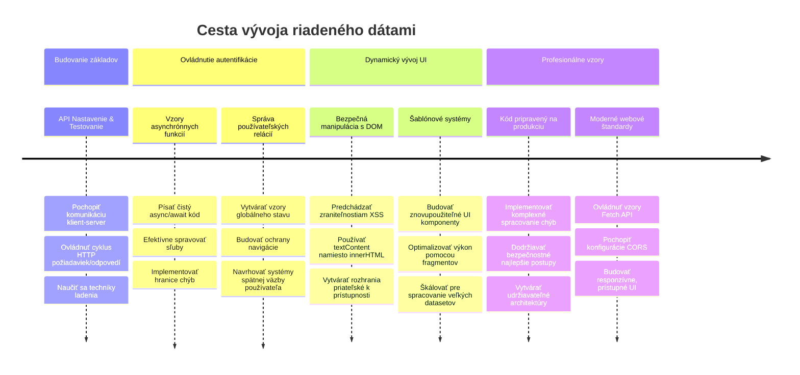
**🎓 Milník ukončenia štúdia**: Úspešne ste vybudovali kompletnú dátovo orientovanú webovú aplikáciu používajúcu moderné JavaScriptové vzory. Tieto znalosti sa priamo premietajú do práce s frameworkami ako React, Vue alebo Angular.

**🔄 Schopnosti na ďalšej úrovni**:
- Pripravený preskúmať frontendové frameworky, ktoré nadväzujú na tieto koncepty
- Pripravený implementovať funkcie v reálnom čase pomocou WebSockets
- Zariadený na tvorbu progresívnych webových aplikácií s offline schopnosťami
- Základ pre učenie pokročilých vzorov správy stavu

## Výzva GitHub Copilot Agent 🚀

Použite režim Agent na splnenie nasledujúcej výzvy:

**Popis:** Vylepšite bankovú aplikáciu implementáciou funkcie vyhľadávania a filtrovania transakcií, ktorá používateľom umožní nájsť konkrétne transakcie podľa rozsahu dátumov, sumy alebo popisu.

**Zadanie:** Vytvorte funkciu vyhľadávania pre bankovú aplikáciu, ktorá bude obsahovať: 1) Vyhľadávací formulár s položkami pre rozsah dátumov (od/do), minimálnu/maximálnu sumu a kľúčové slová v popise transakcie, 2) funkciu `filterTransactions()`, ktorá filtruje pole account.transactions na základe kritérií vyhľadávania, 3) aktualizujte funkciu `updateDashboard()`, aby zobrazovala filtrované výsledky, a 4) pridajte tlačidlo "Vyčisti filtre" na obnovenie zobrazenia. Použite moderné JavaScriptové metódy poľa ako `filter()` a zvládnite hraničné prípady prázdnych vyhľadávacích kritérií.

Viac o [agent mode](https://code.visualstudio.com/blogs/2025/02/24/introducing-copilot-agent-mode) sa dozviete tu.

## 🚀 Výzva

Ste pripravený posunúť svoju bankovú aplikáciu o úroveň vyššie? Spravme ju takú, že ju budete naozaj chcieť používať. Tu je niekoľko nápadov ako rozprúdiť vašu kreativitu:

**Ozdobte ju pekne**: Pridajte CSS štýly, aby váš funkčný dashboard vyzeral vizuálne atraktívne. Myslite na čisté línie, dobré rozostupy a možno aj jemné animácie.

**Urobte ju responzívnu**: Skúste použiť [media queries](https://developer.mozilla.org/docs/Web/CSS/Media_Queries) na vytvorenie [responzívneho dizajnu](https://developer.mozilla.org/docs/Web/Progressive_web_apps/Responsive/responsive_design_building_blocks), ktorý bude skvelo fungovať na telefónoch, tabletoch a desktopoch. Vaši používatelia vám poďakujú!

**Pridajte šmrnc**: Zvážte farebné kódovanie transakcií (zelená pre príjmy, červená pre výdavky), pridanie ikoniek alebo efekty pri naťuknutí, ktoré spravia rozhranie interaktívnym.

Takto by mohol vyzerať vyleštený dashboard:

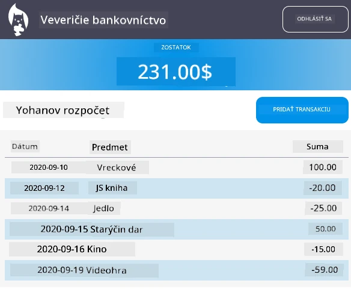

Nemusíte to presne kopírovať - použite to ako inšpiráciu a spravte si to po svojom!

## Post-lecture kvíz

[Post-lecture quiz](https://ff-quizzes.netlify.app/web/quiz/46)

## Zadanie

[Refaktorujte a okomentujte svoj kód](assignment.md)

---

<!-- CO-OP TRANSLATOR DISCLAIMER START -->
**Upozornenie**:
Tento dokument bol preložený pomocou AI prekladateľskej služby [Co-op Translator](https://github.com/Azure/co-op-translator). Hoci sa snažíme o presnosť, uvedomte si, že automatické preklady môžu obsahovať chyby alebo nepresnosti. Originálny dokument v jeho pôvodnom jazyku by mal byť považovaný za autoritatívny zdroj. Pre kritické informácie sa odporúča profesionálny ľudský preklad. Nie sme zodpovední za žiadne nedorozumenia alebo nesprávne interpretácie vyplývajúce z použitia tohto prekladu.
<!-- CO-OP TRANSLATOR DISCLAIMER END -->