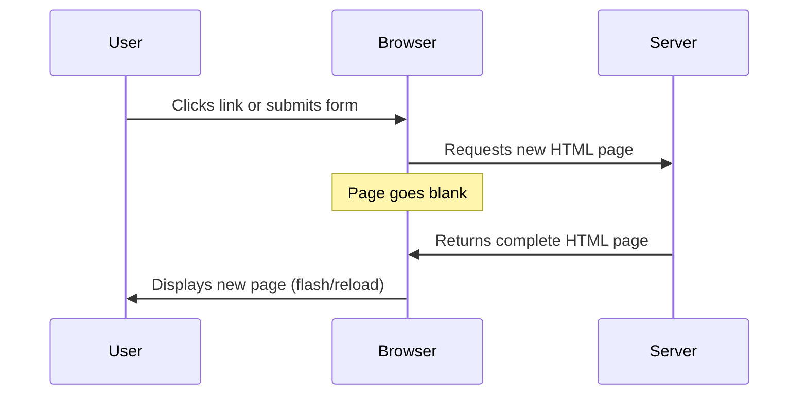
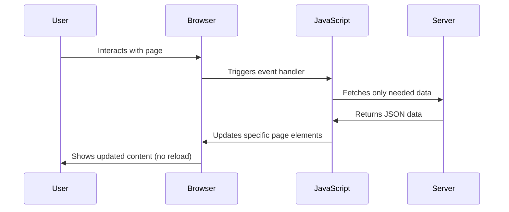
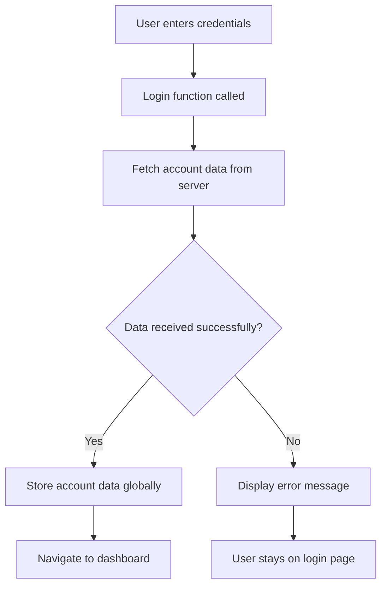
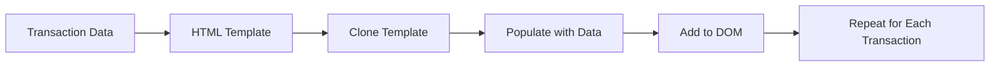

<!--
CO_OP_TRANSLATOR_METADATA:
{
  "original_hash": "2c1164912414820c8efd699b43f64954",
  "translation_date": "2025-10-24T21:40:02+00:00",
  "source_file": "7-bank-project/3-data/README.md",
  "language_code": "sk"
}
-->
# Vytvorenie bankovej aplikácie, časť 3: Metódy získavania a používania údajov

Predstavte si počítač na lodi Enterprise zo Star Treku - keď kapitán Picard požiada o stav lode, informácie sa okamžite zobrazia bez toho, aby sa celé rozhranie vyplo a znovu načítalo. Presne taký plynulý tok informácií sa snažíme dosiahnuť pri dynamickom získavaní údajov.

Momentálne je vaša banková aplikácia ako vytlačené noviny - informatívna, ale statická. Premeníme ju na niečo podobné riadiacemu stredisku NASA, kde údaje prúdia nepretržite a aktualizujú sa v reálnom čase bez prerušenia pracovného toku používateľa.

Naučíte sa, ako komunikovať so servermi asynchrónne, spracovávať údaje, ktoré prichádzajú v rôznych časoch, a transformovať surové informácie na niečo zmysluplné pre vašich používateľov. Toto je rozdiel medzi ukážkou a softvérom pripraveným na produkciu.

## Kvíz pred prednáškou

[Prednáškový kvíz](https://ff-quizzes.netlify.app/web/quiz/45)

### Predpoklady

Predtým, než sa pustíte do získavania údajov, uistite sa, že máte pripravené tieto komponenty:

- **Predchádzajúca lekcia**: Dokončite [Prihlasovací a registračný formulár](../2-forms/README.md) - budeme na tom stavať
- **Lokálny server**: Nainštalujte [Node.js](https://nodejs.org) a [spustite server API](../api/README.md), aby ste mohli poskytovať údaje o účte
- **Pripojenie k API**: Otestujte pripojenie k serveru pomocou tohto príkazu:

```bash
curl http://localhost:5000/api
# Expected response: "Bank API v1.0.0"
```

Tento rýchly test zabezpečí správnu komunikáciu všetkých komponentov:
- Overí, že Node.js na vašom systéme funguje správne
- Potvrdí, že váš API server je aktívny a reaguje
- Overí, že vaša aplikácia dokáže dosiahnuť server (ako kontrola rádiového spojenia pred misiou)

---

## Pochopenie získavania údajov v moderných webových aplikáciách

Spôsob, akým webové aplikácie spracovávajú údaje, sa za posledné dve desaťročia dramaticky vyvinul. Pochopenie tohto vývoja vám pomôže oceniť, prečo sú moderné techniky ako AJAX a Fetch API také silné a prečo sa stali nevyhnutnými nástrojmi pre webových vývojárov.

Preskúmajme, ako fungovali tradičné webové stránky v porovnaní s dynamickými, responzívnymi aplikáciami, ktoré dnes vytvárame.

### Tradičné viacstránkové aplikácie (MPA)

V začiatkoch internetu bol každý klik ako prepínanie kanálov na starom televízore - obrazovka by sa vyprázdnila a potom pomaly naladila nový obsah. Takto fungovali skoré webové aplikácie, kde každá interakcia znamenala úplné prebudovanie celej stránky od začiatku.




**Prečo tento prístup pôsobil nemotorne:**
- Každý klik znamenal úplné prebudovanie celej stránky od začiatku
- Používatelia boli vyrušovaní nepríjemnými zábleskami stránky
- Vaše internetové pripojenie pracovalo nadčas pri opakovanom sťahovaní rovnakého záhlavia a päty
- Aplikácie pôsobili skôr ako prechádzanie kartotékou než používanie softvéru

### Moderné jednostránkové aplikácie (SPA)

AJAX (Asynchronous JavaScript and XML) úplne zmenil tento paradigmat. Podobne ako modulárny dizajn Medzinárodnej vesmírnej stanice, kde astronauti môžu nahradiť jednotlivé komponenty bez prebudovania celej štruktúry, AJAX nám umožňuje aktualizovať konkrétne časti webovej stránky bez jej úplného načítania. Napriek tomu, že názov spomína XML, dnes väčšinou používame JSON, ale základný princíp zostáva: aktualizovať iba to, čo sa musí zmeniť.




**Prečo sú SPA oveľa lepšie:**
- Aktualizujú sa iba časti, ktoré sa skutočne zmenili (šikovné, však?)
- Žiadne rušivé prerušenia - vaši používatelia zostávajú v toku
- Menej údajov cestuje cez sieť, čo znamená rýchlejšie načítanie
- Všetko pôsobí svižne a responzívne, ako aplikácie na vašom telefóne

### Vývoj k modernému Fetch API

Moderné prehliadače poskytujú [`Fetch` API](https://developer.mozilla.org/docs/Web/API/Fetch_API), ktoré nahrádza staršie [`XMLHttpRequest`](https://developer.mozilla.org/docs/Web/API/XMLHttpRequest/Using_XMLHttpRequest). Podobne ako rozdiel medzi obsluhou telegrafu a používaním e-mailu, Fetch API používa promises na čistejší asynchrónny kód a prirodzene spracováva JSON.

| Funkcia | XMLHttpRequest | Fetch API |
|---------|----------------|-----------|
| **Syntax** | Zložitá, založená na callbackoch | Čistá, založená na promises |
| **Spracovanie JSON** | Vyžaduje manuálne parsovanie | Zabudovaná metóda `.json()` |
| **Spracovanie chýb** | Obmedzené informácie o chybách | Komplexné detaily o chybách |
| **Moderná podpora** | Kompatibilita so staršími verziami | ES6+ promises a async/await |

> 💡 **Kompatibilita prehliadačov**: Dobrá správa - Fetch API funguje vo všetkých moderných prehliadačoch! Ak vás zaujímajú konkrétne verzie, [caniuse.com](https://caniuse.com/fetch) má kompletný príbeh o kompatibilite.
> 
**Zhrnutie:**
- Funguje skvele v Chrome, Firefox, Safari a Edge (prakticky všade, kde sú vaši používatelia)
- Iba Internet Explorer potrebuje dodatočnú pomoc (a úprimne, je čas sa rozlúčiť s IE)
- Perfektne vás pripraví na elegantné vzory async/await, ktoré budeme používať neskôr

### Implementácia prihlásenia používateľa a získavania údajov

Teraz implementujeme systém prihlásenia, ktorý transformuje vašu bankovú aplikáciu zo statického zobrazenia na funkčnú aplikáciu. Podobne ako autentifikačné protokoly používané v zabezpečených vojenských zariadeniach, overíme poverenia používateľa a potom poskytneme prístup k jeho konkrétnym údajom.

Budeme to budovať postupne, začneme základnou autentifikáciou a potom pridáme schopnosti získavania údajov.

#### Krok 1: Vytvorenie základu funkcie prihlásenia

Otvorte svoj súbor `app.js` a pridajte novú funkciu `login`. Táto funkcia bude spracovávať proces autentifikácie používateľa:

```javascript
async function login() {
  const loginForm = document.getElementById('loginForm');
  const user = loginForm.user.value;
}
```

**Rozdelenie:**
- Kľúčové slovo `async` hovorí JavaScriptu: "hej, táto funkcia možno bude musieť na niečo počkať"
- Získavame formulár zo stránky (nič zložité, len ho nájdeme podľa jeho ID)
- Potom vyberáme, čo používateľ napísal ako svoje používateľské meno
- Tu je šikovný trik: k akémukoľvek vstupu formulára môžete pristupovať pomocou jeho atribútu `name` - netreba žiadne ďalšie volania getElementById!

> 💡 **Vzor prístupu k formuláru**: Ku každému ovládaciemu prvku formulára je možné pristupovať podľa jeho názvu (nastaveného v HTML pomocou atribútu `name`) ako k vlastnosti elementu formulára. To poskytuje čistý a čitateľný spôsob získavania údajov z formulára.

#### Krok 2: Vytvorenie funkcie na získavanie údajov o účte

Ďalej vytvoríme samostatnú funkciu na získavanie údajov o účte zo servera. Táto funkcia nasleduje rovnaký vzor ako vaša registračná funkcia, ale zameriava sa na získavanie údajov:

```javascript
async function getAccount(user) {
  try {
    const response = await fetch('//localhost:5000/api/accounts/' + encodeURIComponent(user));
    return await response.json();
  } catch (error) {
    return { error: error.message || 'Unknown error' };
  }
}
```

**Čo tento kód dosahuje:**
- **Používa** moderné `fetch` API na asynchrónne požiadanie údajov
- **Kombinuje** URL požiadavky GET s parametrom používateľského mena
- **Používa** `encodeURIComponent()` na bezpečné spracovanie špeciálnych znakov v URL
- **Konvertuje** odpoveď na formát JSON pre jednoduchú manipuláciu s údajmi
- **Spracováva** chyby elegantne, vracia objekt chyby namiesto zlyhania

> ⚠️ **Bezpečnostná poznámka**: Funkcia `encodeURIComponent()` spracováva špeciálne znaky v URL. Podobne ako kódovacie systémy používané v námorných komunikáciách, zabezpečuje, že vaša správa dorazí presne tak, ako bola zamýšľaná, a zabraňuje nesprávnemu interpretovaniu znakov ako "#" alebo "&".
> 
**Prečo je to dôležité:**
- Zabraňuje špeciálnym znakom v narušení URL
- Chráni pred útokmi manipulácie s URL
- Zabezpečuje, že váš server dostane zamýšľané údaje
- Nasleduje bezpečnostné postupy pri kódovaní

#### Pochopenie HTTP GET požiadaviek

Možno vás prekvapí: keď použijete `fetch` bez akýchkoľvek ďalších možností, automaticky vytvorí [`GET`](https://developer.mozilla.org/docs/Web/HTTP/Methods/GET) požiadavku. To je ideálne pre to, čo robíme - pýtame sa servera "hej, môžem vidieť údaje o účte tohto používateľa?"

Premýšľajte o GET požiadavkách ako o zdvorilom požiadaní o požičanie knihy z knižnice - žiadate o niečo, čo už existuje. POST požiadavky (ktoré sme použili pri registrácii) sú skôr ako odovzdanie novej knihy na pridanie do zbierky.

| GET požiadavka | POST požiadavka |
|----------------|-----------------|
| **Účel** | Získanie existujúcich údajov | Odoslanie nových údajov na server |
| **Parametre** | V ceste URL/reťazci dotazu | V tele požiadavky |
| **Ukladanie do vyrovnávacej pamäte** | Môže byť uložené do vyrovnávacej pamäte prehliadačom | Zvyčajne sa neukladá do vyrovnávacej pamäte |
| **Bezpečnosť** | Viditeľné v URL/logoch | Skryté v tele požiadavky |

#### Krok 3: Spojenie všetkého dohromady

Teraz prichádza uspokojivá časť - spojme funkciu na získavanie údajov o účte s procesom prihlásenia. Tu všetko zapadne na svoje miesto:

```javascript
async function login() {
  const loginForm = document.getElementById('loginForm');
  const user = loginForm.user.value;
  const data = await getAccount(user);

  if (data.error) {
    return console.log('loginError', data.error);
  }

  account = data;
  navigate('/dashboard');
}
```

Táto funkcia nasleduje jasnú postupnosť:
- Získanie používateľského mena z vstupu formulára
- Požiadanie servera o údaje o účte používateľa
- Spracovanie akýchkoľvek chýb, ktoré sa vyskytnú počas procesu
- Uloženie údajov o účte a presmerovanie na dashboard po úspechu

> 🎯 **Vzor async/await**: Keďže `getAccount` je asynchrónna funkcia, používame kľúčové slovo `await`, aby sme pozastavili vykonávanie, kým server neodpovie. To zabraňuje pokračovaniu kódu s nedefinovanými údajmi.

#### Krok 4: Vytvorenie miesta pre vaše údaje

Vaša aplikácia potrebuje miesto, kde si zapamätá informácie o účte, keď sa načítajú. Myslite na to ako na krátkodobú pamäť vašej aplikácie - miesto, kde si uchová aktuálne údaje používateľa. Pridajte tento riadok na začiatok vášho súboru `app.js`:

```javascript
// This holds the current user's account data
let account = null;
```

**Prečo to potrebujeme:**
- Uchováva údaje o účte dostupné z akéhokoľvek miesta vo vašej aplikácii
- Začiatok s `null` znamená "nikto ešte nie je prihlásený"
- Aktualizuje sa, keď sa niekto úspešne prihlási alebo zaregistruje
- Funguje ako jediný zdroj pravdy - žiadne zmätky o tom, kto je prihlásený

#### Krok 5: Prepojenie vášho formulára

Teraz prepojme vašu novú funkciu prihlásenia s vaším HTML formulárom. Aktualizujte značku formulára takto:

```html
<form id="loginForm" action="javascript:login()">
  <!-- Your existing form inputs -->
</form>
```

**Čo táto malá zmena robí:**
- Zastaví formulár od vykonania jeho predvoleného správania "znovu načítať celú stránku"
- Zavolá vašu vlastnú funkciu JavaScript namiesto toho
- Udržiava všetko hladké a podobné jednostránkovej aplikácii
- Poskytuje vám úplnú kontrolu nad tým, čo sa stane, keď používatelia kliknú na "Prihlásiť sa"

#### Krok 6: Vylepšenie vašej registračnej funkcie

Pre konzistenciu aktualizujte svoju funkciu `register`, aby tiež uchovávala údaje o účte a presmerovala na dashboard:

```javascript
// Add these lines at the end of your register function
account = result;
navigate('/dashboard');
```

**Toto vylepšenie poskytuje:**
- **Plynulý** prechod z registrácie na dashboard
- **Konzistentný** používateľský zážitok medzi prihlásením a registráciou
- **Okamžitý** prístup k údajom o účte po úspešnej registrácii

#### Testovanie vašej implementácie



**Čas na skúšku:**
1. Vytvorte nový účet, aby ste sa uistili, že všetko funguje
2. Skúste sa prihlásiť s rovnakými povereniami
3. Pozrite sa na konzolu vášho prehliadača (F12), ak niečo nefunguje
4. Uistite sa, že sa dostanete na dashboard po úspešnom prihlásení

Ak niečo nefunguje, nepanikárte! Väčšina problémov sú jednoduché chyby, ako preklepy alebo zabudnutie spustiť API server.

#### Rýchle slovo o magickom Cross-Origin

Možno sa pýtate: "Ako moja webová aplikácia komunikuje s týmto API serverom, keď bežia na rôznych portoch?" Skvelá otázka! Toto sa dotýka niečoho, na čo narazí každý webový vývojár.

> 🔒 **Bezpečnosť Cross-Origin**: Prehliadače uplatňujú "politiku rovnakého pôvodu", aby zabránili neoprávnenej komunikácii medzi rôznymi doménami. Podobne ako kontrolný systém v Pentagone, overujú, že komunikácia je autorizovaná pred povolením prenosu údajov.
> 
**V našom nastavení:**
- Vaša webová aplikácia beží na `localhost:3000` (vývojový server)
- Váš API server beží na `localhost:5000` (backend server)
- API server obsahuje [CORS hlavičky](https://developer.mozilla.org/docs/Web/HTTP/CORS), ktoré explicitne autorizujú komunikáciu z vašej webovej aplikácie

Táto konfigurácia odráža reálny vývoj, kde frontendové a backendové aplikácie zvyčajne bežia na samostatných serveroch.

> 📚 **Viac informácií**: Ponorte sa hlbšie do API a získavania údajov s týmto komplexným [modulom Microsoft Learn o API](https://docs.microsoft.com/learn/modules/use-apis-discover-museum-art/?WT.mc_id=academic-77807-sagibbon).

## Oživenie vašich údajov v HTML

Teraz sprístupníme získané údaje používateľom prostredníctvom manipulácie s DOM. Podobne ako proces vyvolávania fotografií v tmavej komore, berieme neviditeľné údaje a zobrazujeme ich tak, aby ich používatelia mohli vidieť a interagovať s nimi.

Manipulácia s DOM je technika, ktorá transformuje statické webové stránky na dynamické aplikácie, ktoré aktualizujú svoj obsah na základe interakcií používateľov a odpovedí server
Pre komplexnejší obsah skombinujte [`document.createElement()`](https://developer.mozilla.org/docs/Web/API/Document/createElement) s metódou [`append()`](https://developer.mozilla.org/docs/Web/API/ParentNode/append):

```javascript
// Safe way to create new elements
const transactionItem = document.createElement('div');
transactionItem.className = 'transaction-item';
transactionItem.textContent = `${transaction.date}: ${transaction.description}`;
container.append(transactionItem);
```

**Pochopenie tohto prístupu:**
- **Vytvára** nové DOM elementy programovo
- **Umožňuje** plnú kontrolu nad atribútmi a obsahom elementov
- **Podporuje** komplexné, vnorené štruktúry elementov
- **Zachováva** bezpečnosť oddelením štruktúry od obsahu

> ⚠️ **Bezpečnostné upozornenie**: Hoci [`innerHTML`](https://developer.mozilla.org/docs/Web/API/Element/innerHTML) sa často objavuje v tutoriáloch, môže vykonávať vložené skripty. Podobne ako bezpečnostné protokoly v CERN, ktoré zabraňujú neoprávnenému vykonávaniu kódu, použitie `textContent` a `createElement` poskytuje bezpečnejšie alternatívy.
> 
**Riziká innerHTML:**
- Vykonáva akékoľvek `<script>` tagy v užívateľských dátach
- Zraniteľné voči útokom na injekciu kódu
- Vytvára potenciálne bezpečnostné zraniteľnosti
- Bezpečnejšie alternatívy, ktoré používame, poskytujú ekvivalentnú funkcionalitu

### Sprístupnenie chýb používateľom

Momentálne sa chyby pri prihlasovaní zobrazujú iba v konzole prehliadača, čo je pre používateľov neviditeľné. Podobne ako rozdiel medzi internou diagnostikou pilota a informačným systémom pre cestujúcich, musíme komunikovať dôležité informácie cez vhodný kanál.

Implementácia viditeľných chybových správ poskytuje používateľom okamžitú spätnú väzbu o tom, čo sa pokazilo a ako postupovať ďalej.

#### Krok 1: Pridajte miesto pre chybové správy

Najprv vytvorte priestor pre chybové správy vo vašom HTML. Pridajte to hneď pred tlačidlo na prihlásenie, aby si to používatelia prirodzene všimli:

```html
<!-- This is where error messages will appear -->
<div id="loginError" role="alert"></div>
<button>Login</button>
```

**Čo sa tu deje:**
- Vytvárame prázdny kontajner, ktorý zostáva neviditeľný, kým ho nepotrebujeme
- Je umiestnený tam, kde používatelia prirodzene hľadajú po kliknutí na "Prihlásiť sa"
- Atribút `role="alert"` je skvelý doplnok pre čítačky obrazovky - informuje asistívnu technológiu, že "hej, toto je dôležité!"
- Jedinečné `id` poskytuje nášmu JavaScriptu jednoduchý cieľ

#### Krok 2: Vytvorte praktickú pomocnú funkciu

Vytvorme malú pomocnú funkciu, ktorá dokáže aktualizovať text akéhokoľvek elementu. Toto je jedna z tých funkcií "napíš raz, použi všade", ktorá vám ušetrí čas:

```javascript
function updateElement(id, text) {
  const element = document.getElementById(id);
  element.textContent = text;
}
```

**Výhody funkcie:**
- Jednoduché rozhranie vyžadujúce iba ID elementu a textový obsah
- Bezpečne vyhľadáva a aktualizuje DOM elementy
- Opakovane použiteľný vzor, ktorý znižuje duplicitu kódu
- Zabezpečuje konzistentné správanie aktualizácie v celej aplikácii

#### Krok 3: Zobrazte chyby tam, kde ich používatelia uvidia

Teraz nahraďme skrytú správu v konzole niečím, čo používatelia skutočne uvidia. Aktualizujte svoju funkciu prihlásenia:

```javascript
// Instead of just logging to console, show the user what's wrong
if (data.error) {
  return updateElement('loginError', data.error);
}
```

**Táto malá zmena má veľký význam:**
- Chybové správy sa zobrazujú presne tam, kde používatelia hľadajú
- Žiadne tajomné tiché zlyhania
- Používatelia dostanú okamžitú, použiteľnú spätnú väzbu
- Vaša aplikácia začne pôsobiť profesionálne a premyslene

Teraz, keď testujete s neplatným účtom, uvidíte užitočnú chybovú správu priamo na stránke!


#### Krok 4: Byť inkluzívny s prístupnosťou

Tu je niečo zaujímavé o tom `role="alert"`, ktoré sme pridali skôr - nie je to len dekorácia! Tento malý atribút vytvára tzv. [Live Region](https://developer.mozilla.org/docs/Web/Accessibility/ARIA/ARIA_Live_Regions), ktorý okamžite oznamuje zmeny čítačkám obrazovky:

```html
<div id="loginError" role="alert"></div>
```

**Prečo na tom záleží:**
- Používatelia čítačiek obrazovky počujú chybovú správu hneď, ako sa objaví
- Každý dostane rovnaké dôležité informácie, bez ohľadu na to, ako naviguje
- Je to jednoduchý spôsob, ako spraviť vašu aplikáciu prístupnou pre viac ľudí
- Ukazuje, že vám záleží na vytváraní inkluzívnych zážitkov

Takéto malé detaily odlišujú dobrých vývojárov od skvelých!

#### Krok 5: Použite rovnaký vzor na registráciu

Pre konzistenciu implementujte identické spracovanie chýb vo vašom registračnom formulári:

1. **Pridajte** element na zobrazenie chýb do vášho registračného HTML:
```html
<div id="registerError" role="alert"></div>
```

2. **Aktualizujte** vašu funkciu registrácie, aby používala rovnaký vzor zobrazenia chýb:
```javascript
if (data.error) {
  return updateElement('registerError', data.error);
}
```

**Výhody konzistentného spracovania chýb:**
- **Poskytuje** jednotný používateľský zážitok vo všetkých formulároch
- **Znižuje** kognitívnu záťaž používaním známych vzorov
- **Zjednodušuje** údržbu s opakovane použiteľným kódom
- **Zabezpečuje** dodržiavanie štandardov prístupnosti v celej aplikácii

## Vytvorenie dynamického dashboardu

Teraz premeníme váš statický dashboard na dynamické rozhranie, ktoré zobrazuje aktuálne údaje o účte. Podobne ako rozdiel medzi vytlačeným letovým poriadkom a živými odletovými tabuľami na letiskách, prechádzame od statických informácií k aktuálnym, responzívnym zobrazeniam.

Pomocou techník manipulácie s DOM, ktoré ste sa naučili, vytvoríme dashboard, ktorý sa automaticky aktualizuje s aktuálnymi informáciami o účte.

### Zoznámenie sa s vašimi dátami

Predtým, než začneme budovať, pozrime sa, aké údaje váš server posiela späť. Keď sa niekto úspešne prihlási, tu je pokladnica informácií, s ktorou môžete pracovať:

```json
{
  "user": "test",
  "currency": "$",
  "description": "Test account",
  "balance": 75,
  "transactions": [
    { "id": "1", "date": "2020-10-01", "object": "Pocket money", "amount": 50 },
    { "id": "2", "date": "2020-10-03", "object": "Book", "amount": -10 },
    { "id": "3", "date": "2020-10-04", "object": "Sandwich", "amount": -5 }
  ]
}
```

**Táto dátová štruktúra poskytuje:**
- **`user`**: Ideálne na personalizáciu zážitku ("Vitajte späť, Sarah!")
- **`currency`**: Zabezpečuje správne zobrazovanie peňažných čiastok
- **`description`**: Priateľský názov účtu
- **`balance`**: Dôležitý aktuálny zostatok
- **`transactions`**: Kompletná história transakcií so všetkými detailmi

Všetko, čo potrebujete na vytvorenie profesionálne vyzerajúceho bankového dashboardu!

> 💡 **Tip**: Chcete vidieť váš dashboard v akcii hneď teraz? Použite používateľské meno `test` pri prihlásení - je prednahrané so vzorovými dátami, takže môžete vidieť, ako všetko funguje bez toho, aby ste museli najskôr vytvárať transakcie.
> 
**Prečo je testovací účet užitočný:**
- Už obsahuje realistické vzorové dáta
- Perfektné na zobrazenie, ako sa transakcie zobrazujú
- Skvelé na testovanie funkcií vášho dashboardu
- Ušetrí vás od manuálneho vytvárania fiktívnych dát

### Vytvorenie prvkov zobrazenia dashboardu

Postupne vytvoríme rozhranie dashboardu, začneme informáciami o súhrne účtu a potom prejdeme na zložitejšie funkcie, ako sú zoznamy transakcií.

#### Krok 1: Aktualizujte štruktúru HTML

Najprv nahraďte statickú sekciu "Zostatok" dynamickými zástupnými prvkami, ktoré váš JavaScript môže naplniť:

```html
<section>
  Balance: <span id="balance"></span><span id="currency"></span>
</section>
```

Potom pridajte sekciu pre popis účtu. Keďže to funguje ako nadpis pre obsah dashboardu, použite sémantické HTML:

```html
<h2 id="description"></h2>
```

**Pochopenie štruktúry HTML:**
- **Používa** samostatné `<span>` elementy pre zostatok a menu na individuálnu kontrolu
- **Aplikuje** jedinečné ID na každý element pre cielenie JavaScriptom
- **Dodržiava** sémantické HTML použitím `<h2>` pre popis účtu
- **Vytvára** logickú hierarchiu pre čítačky obrazovky a SEO

> ✅ **Prístupnosť**: Popis účtu funguje ako nadpis pre obsah dashboardu, takže je označený sémanticky ako nadpis. Zistite viac o tom, ako [štruktúra nadpisov](https://www.nomensa.com/blog/2017/how-structure-headings-web-accessibility) ovplyvňuje prístupnosť. Dokážete identifikovať ďalšie prvky na vašej stránke, ktoré by mohli profitovať z nadpisových tagov?

#### Krok 2: Vytvorte funkciu na aktualizáciu dashboardu

Teraz vytvorte funkciu, ktorá naplní váš dashboard aktuálnymi údajmi o účte:

```javascript
function updateDashboard() {
  if (!account) {
    return navigate('/login');
  }

  updateElement('description', account.description);
  updateElement('balance', account.balance.toFixed(2));
  updateElement('currency', account.currency);
}
```

**Krok za krokom, čo táto funkcia robí:**
- **Overuje**, že údaje o účte existujú pred pokračovaním
- **Presmeruje** neautentifikovaných používateľov späť na prihlasovaciu stránku
- **Aktualizuje** popis účtu pomocou opakovane použiteľnej funkcie `updateElement`
- **Formátuje** zostatok tak, aby vždy zobrazoval dve desatinné miesta
- **Zobrazuje** príslušný symbol meny

> 💰 **Formátovanie peňazí**: Táto metóda [`toFixed(2)`](https://developer.mozilla.org/docs/Web/JavaScript/Reference/Global_Objects/Number/toFixed) je záchranca! Zabezpečuje, že váš zostatok vždy vyzerá ako skutočné peniaze - "75.00" namiesto len "75". Vaši používatelia ocenia vidieť známe formátovanie meny.

#### Krok 3: Zabezpečte aktualizáciu dashboardu

Aby ste zabezpečili, že váš dashboard sa aktualizuje s aktuálnymi údajmi vždy, keď ho niekto navštívi, musíme sa napojiť na váš navigačný systém. Ak ste dokončili [úlohu z lekcie 1](../1-template-route/assignment.md), toto by vám malo byť známe. Ak nie, nevadí - tu je, čo potrebujete:

Pridajte toto na koniec vašej funkcie `updateRoute()`:

```javascript
if (typeof route.init === 'function') {
  route.init();
}
```

Potom aktualizujte vaše trasy, aby zahŕňali inicializáciu dashboardu:

```javascript
const routes = {
  '/login': { templateId: 'login' },
  '/dashboard': { templateId: 'dashboard', init: updateDashboard }
};
```

**Čo tento šikovný systém robí:**
- Kontroluje, či trasa má špeciálny inicializačný kód
- Automaticky spúšťa tento kód, keď sa trasa načíta
- Zabezpečuje, že váš dashboard vždy zobrazuje aktuálne údaje
- Udržuje vašu logiku smerovania čistú a organizovanú

#### Testovanie vášho dashboardu

Po implementácii týchto zmien otestujte váš dashboard:

1. **Prihláste sa** pomocou testovacieho účtu
2. **Overte**, že ste presmerovaní na dashboard
3. **Skontrolujte**, že popis účtu, zostatok a mena sa zobrazujú správne
4. **Skúste sa odhlásiť a znova prihlásiť**, aby ste sa uistili, že údaje sa správne aktualizujú

Váš dashboard by teraz mal zobrazovať dynamické informácie o účte, ktoré sa aktualizujú na základe údajov prihláseného používateľa!

## Vytvorenie inteligentných zoznamov transakcií pomocou šablón

Namiesto manuálneho vytvárania HTML pre každú transakciu použijeme šablóny na automatické generovanie konzistentného formátovania. Podobne ako štandardizované komponenty používané pri výrobe vesmírnych lodí, šablóny zabezpečia, že každý riadok transakcie bude mať rovnakú štruktúru a vzhľad.

Táto technika efektívne škáluje od niekoľkých transakcií až po tisíce, pričom zachováva konzistentný výkon a prezentáciu.



### Krok 1: Vytvorte šablónu transakcie

Najprv pridajte opakovane použiteľnú šablónu pre riadky transakcií do vášho HTML `<body>`:

```html
<template id="transaction">
  <tr>
    <td></td>
    <td></td>
    <td></td>
  </tr>
</template>
```

**Pochopenie HTML šablón:**
- **Definuje** štruktúru pre jeden riadok tabuľky
- **Zostáva** neviditeľná, kým nie je klonovaná a naplnená JavaScriptom
- **Obsahuje** tri bunky pre dátum, popis a sumu
- **Poskytuje** opakovane použiteľný vzor pre konzistentné formátovanie

### Krok 2: Pripravte svoju tabuľku na dynamický obsah

Ďalej pridajte `id` do tela tabuľky, aby JavaScript mohol ľahko cieliť:

```html
<tbody id="transactions"></tbody>
```

**Čo to dosahuje:**
- **Vytvára** jasný cieľ pre vkladanie riadkov transakcií
- **Oddeluje** štruktúru tabuľky od dynamického obsahu
- **Umožňuje** jednoduché čistenie a opätovné napĺňanie údajov o transakciách

### Krok 3: Vytvorte funkciu na výrobu riadkov transakcií

Teraz vytvorte funkciu, ktorá transformuje údaje o transakciách na HTML elementy:

```javascript
function createTransactionRow(transaction) {
  const template = document.getElementById('transaction');
  const transactionRow = template.content.cloneNode(true);
  const tr = transactionRow.querySelector('tr');
  tr.children[0].textContent = transaction.date;
  tr.children[1].textContent = transaction.object;
  tr.children[2].textContent = transaction.amount.toFixed(2);
  return transactionRow;
}
```

**Rozbor tejto výrobnej funkcie:**
- **Získava** šablónový element podľa jeho ID
- **Klonuje** obsah šablóny na bezpečnú manipuláciu
- **Vyberá** riadok tabuľky v klonovanom obsahu
- **Napĺňa** každú bunku údajmi o transakcii
- **Formátuje** sumu tak, aby zobrazovala správne desatinné miesta
- **Vracia** hotový riadok pripravený na vloženie

### Krok 4: Efektívne generovanie viacerých riadkov transakcií

Pridajte tento kód do vašej funkcie `updateDashboard()`, aby ste zobrazili všetky transakcie:

```javascript
const transactionsRows = document.createDocumentFragment();
for (const transaction of account.transactions) {
  const transactionRow = createTransactionRow(transaction);
  transactionsRows.appendChild(transactionRow);
}
updateElement('transactions', transactionsRows);
```

**Pochopenie tohto efektívneho prístupu:**
- **Vytvára** dokumentový fragment na dávkové operácie s DOM
- **Iteruje** cez všetky transakcie v údajoch o účte
- **Generuje** riadok pre každú transakciu pomocou výrobnej funkcie
- **Zhromažďuje** všetky riadky vo fragmente pred pridaním do DOM
- **Vykonáva** jednu aktualizáciu DOM namiesto viacerých individuálnych vložení

> ⚡ **Optimalizácia výkonu**: [`document.createDocumentFragment()`](https://developer.mozilla.org/docs/Web/API/Document/createDocumentFragment) funguje ako montážny proces v Boeingu - komponenty sa pripravujú mimo hlavnej linky a potom sa inštalujú ako kompletná jednotka. Tento dávkový prístup minimalizuje pretečenie DOM vykonaním jednej vloženia namiesto viacerých individuálnych operácií.

### Krok 5: Vylepšite funkciu aktualizácie pre zmiešaný obsah

Vaša funkcia `updateElement()` momentálne spracováva iba textový obsah. Aktualizujte ju, aby fungovala s textom aj DOM uzlami:

```javascript
function updateElement(id, textOrNode) {
  const element = document.getElementById(id);
  element.textContent = ''; // Removes all children
  element.append(textOrNode);
}
```

**Kľúčové vylepšenia tejto aktualizácie:**
- **Vymaže** existujúci obsah pred pridaním nového obsahu
- **Akceptuje** buď textové reťazce alebo DOM uzly ako parametre
- **Používa** metódu [`append()`](https
**Prompt:** Vytvorte funkciu vyhľadávania pre bankovú aplikáciu, ktorá zahŕňa: 1) Formulár vyhľadávania s vstupnými políčkami pre rozsah dátumov (od/do), minimálnu/maximálnu sumu a kľúčové slová popisu transakcie, 2) Funkciu `filterTransactions()`, ktorá filtruje pole account.transactions na základe kritérií vyhľadávania, 3) Aktualizujte funkciu `updateDashboard()`, aby zobrazovala filtrované výsledky, a 4) Pridajte tlačidlo "Vymazať filtre" na obnovenie zobrazenia. Použite moderné metódy JavaScriptu ako `filter()` a ošetrite okrajové prípady pre prázdne kritériá vyhľadávania.

Viac informácií o [agent mode](https://code.visualstudio.com/blogs/2025/02/24/introducing-copilot-agent-mode) nájdete tu.

## 🚀 Výzva

Pripravení posunúť svoju bankovú aplikáciu na vyššiu úroveň? Poďme ju urobiť takou, že ju budete chcieť skutočne používať. Tu je niekoľko nápadov, ktoré vás môžu inšpirovať:

**Urobte ju krásnou**: Pridajte CSS štýlovanie, aby ste premenili svoj funkčný dashboard na niečo vizuálne príťažlivé. Myslite na čisté línie, dobré rozostupy a možno aj jemné animácie.

**Urobte ju responzívnou**: Skúste použiť [media queries](https://developer.mozilla.org/docs/Web/CSS/Media_Queries) na vytvorenie [responzívneho dizajnu](https://developer.mozilla.org/docs/Web/Progressive_web_apps/Responsive/responsive_design_building_blocks), ktorý bude skvele fungovať na telefónoch, tabletoch a počítačoch. Vaši používatelia vám poďakujú!

**Pridajte trochu šmrncu**: Zvážte farebné označenie transakcií (zelená pre príjem, červená pre výdavky), pridanie ikon alebo vytvorenie efektov pri prechode myšou, ktoré urobia rozhranie interaktívnym.

Takto by mohol vyzerať vyleštený dashboard:


Nemusíte sa snažiť presne napodobniť tento dizajn - použite ho ako inšpiráciu a vytvorte si vlastný!

## Kvíz po prednáške

[Kvíz po prednáške](https://ff-quizzes.netlify.app/web/quiz/46)

## Zadanie

[Refaktorujte a komentujte svoj kód](assignment.md)

---

**Zrieknutie sa zodpovednosti**:  
Tento dokument bol preložený pomocou služby AI prekladu [Co-op Translator](https://github.com/Azure/co-op-translator). Hoci sa snažíme o presnosť, prosím, berte na vedomie, že automatizované preklady môžu obsahovať chyby alebo nepresnosti. Pôvodný dokument v jeho rodnom jazyku by mal byť považovaný za autoritatívny zdroj. Pre kritické informácie sa odporúča profesionálny ľudský preklad. Nie sme zodpovední za žiadne nedorozumenia alebo nesprávne interpretácie vyplývajúce z použitia tohto prekladu.