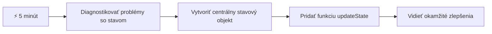
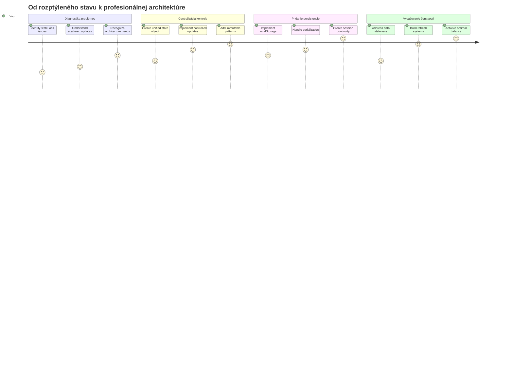
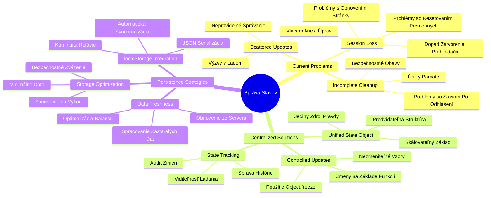
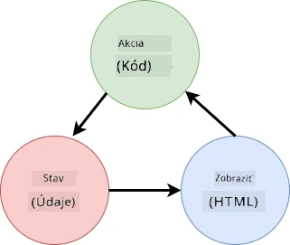
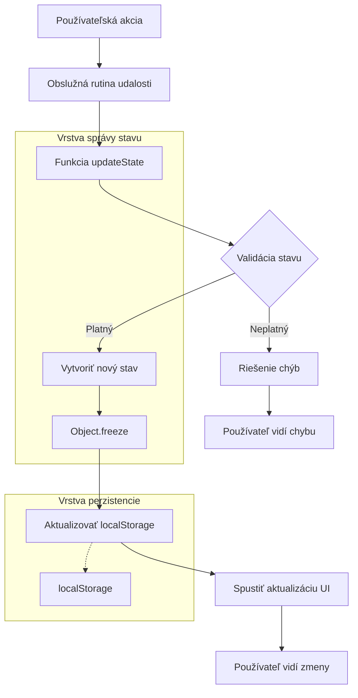
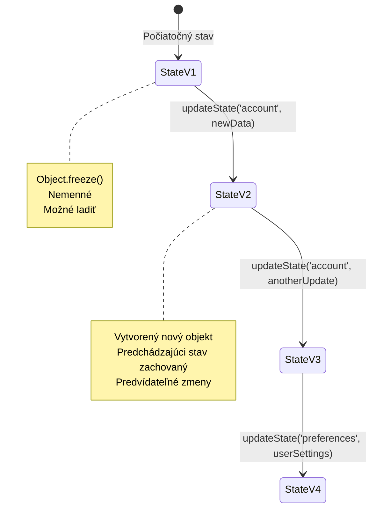
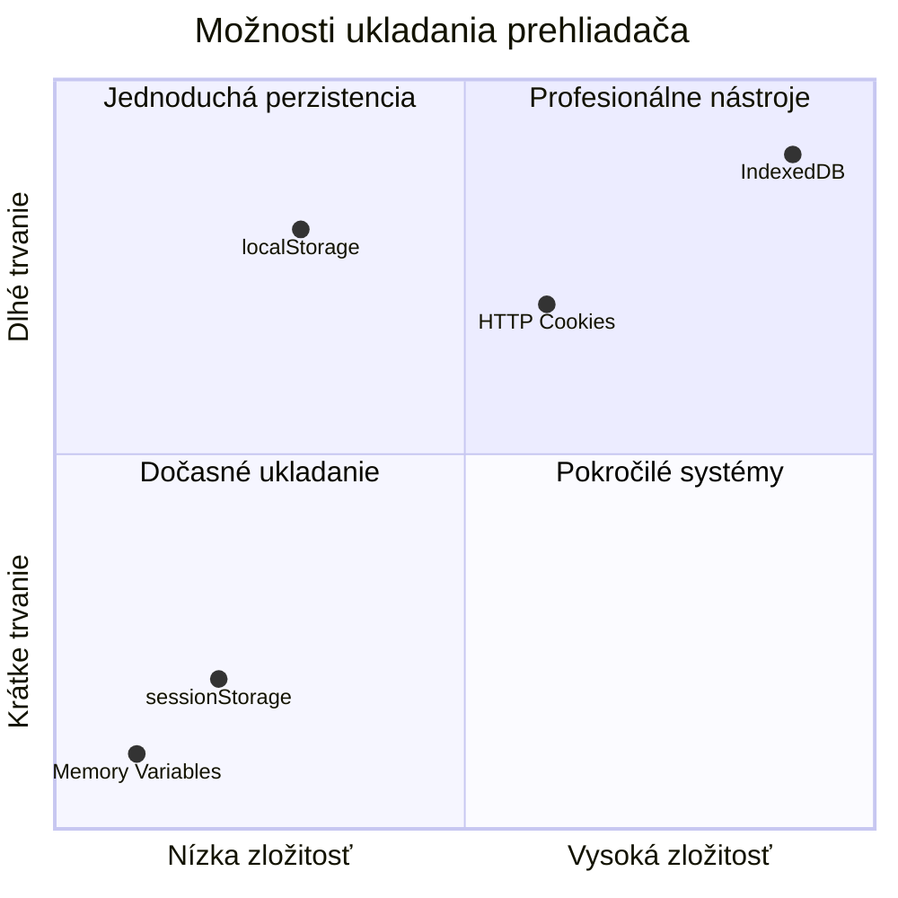
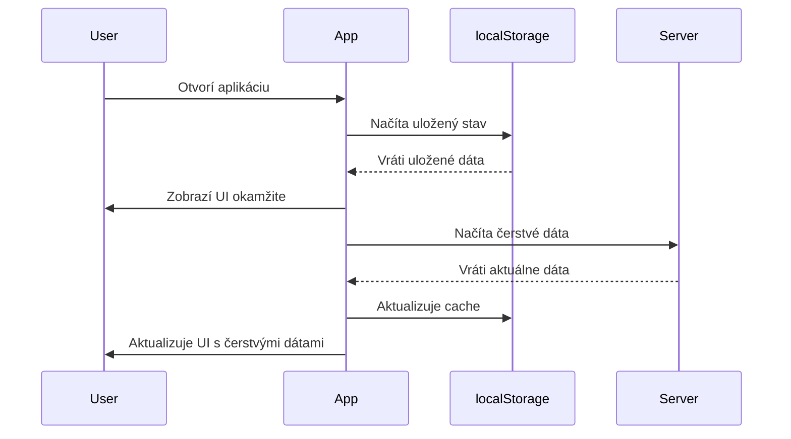
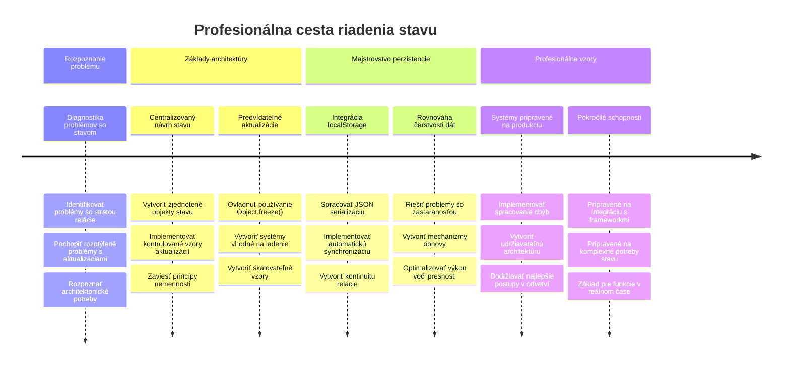

# Vytvorte bankovú aplikáciu časť 4: Koncepty správy stavu

## ⚡ Čo môžete urobiť v nasledujúcich 5 minútach

**Rýchla štartovacia cesta pre zaneprázdnených vývojárov**


- **1. minúta**: Otestujte aktuálny problém so stavom – prihláste sa, obnovte stránku, sledujte odhlásenie
- **2. minúta**: Nahraďte `let account = null` za `let state = { account: null }`
- **3. minúta**: Vytvorte jednoduchú funkciu `updateState()` pre kontrolované aktualizácie
- **4. minúta**: Aktualizujte jednu funkciu, aby používala nový vzor
- **5. minúta**: Otestujte zlepšenú predvídateľnosť a schopnosť debugovania

**Rýchly diagnostický test**:
```javascript
// Pred: Rozptýlený stav
let account = null; // Stratené po obnovení!

// Po: Centralizovaný stav
let state = Object.freeze({ account: null }); // Ovládané a sledovateľné!
```

**Prečo to je dôležité**: Za 5 minút zažijete prechod zo chaotického riadenia stavu na predvídateľné, debugovateľné vzory. Toto je základ, ktorý umožňuje udržateľnosť zložitých aplikácií.

## 🗺️ Vaša cesta učenia sa majstrovstva správy stavu


**Cieľ vašej cesty**: Na konci tejto lekcie budete mať vytvorený profesionálny systém správy stavu, ktorý rieši persistenciu, čerstvosť dát a predvídateľné aktualizácie – rovnaké vzory, aké sa používajú v produkčných aplikáciách.

## Pred-prednáškový kvíz

[Pred-prednáškový kvíz](https://ff-quizzes.netlify.app/web/quiz/47)

## Úvod

Správa stavu je ako navigačný systém na kozmickej lodi Voyager – keď všetko funguje hladko, sotva si všimnete, že tam je. Ale keď niečo nefunguje, je to rozdiel medzi dosiahnutím medzihviezdneho priestoru a blúdením v kozmickom prázdnote. Vo webovom vývoji stav predstavuje všetko, čo musí vaša aplikácia zapamätať: stav prihlásenia používateľa, údaje z formulárov, históriu navigácie a dočasné stavy rozhrania.

Ako sa vaša banková aplikácia vyvinula z jednoduchého prihlasovacieho formulára do sofistikovanejšej aplikácie, pravdepodobne ste narazili na niektoré bežné výzvy. Obnovením stránky sa používatelia nečakane odhlásia. Zatvorením prehliadača všetok pokrok zmizne. Pri debugovaní problému hľadáte cez viacero funkcií, ktoré všetky menia tie isté dáta rôznymi spôsobmi.

Toto nie sú znaky zlého kódovania – sú to prirodzené detské choroby, ktoré sa objavujú, keď aplikácie dosiahnu určitú úroveň zložitosti. Každý vývojár čelí týmto výzvam, keď jeho aplikácie prechádzajú z "dôkazu konceptu" do "pripravené na produkciu".

V tejto lekcii implementujeme centralizovaný systém správy stavu, ktorý vašu bankovú aplikáciu premení na spoľahlivú, profesionálnu aplikáciu. Naučíte sa riadiť dátové toky predvídateľne, správne udržať používateľské relácie a vytvoriť plynulý používateľský zážitok, ktorý moderné webové aplikácie vyžadujú.

## Predpoklady

Predtým, než sa pustíte do konceptov správy stavu, musíte mať správne nastavené vývojové prostredie a základy vašej bankovej aplikácie. Táto lekcia nadväzuje priamo na koncepty a kód z predchádzajúcich častí série.

Uistite sa, že máte pripravené nasledujúce komponenty pred pokračovaním:

**Povinné nastavenie:**
- Dokončite [lekciu o získavaní dát](../3-data/README.md) – vaša aplikácia by mala úspešne načítať a zobraziť dáta o účtoch
- Nainštalujte [Node.js](https://nodejs.org) vo vašom systéme na spustenie backendového API
- Na lokále spustite [server API](../api/README.md) na spracovanie operácií s dátami účtu

**Testovanie vášho prostredia:**

Overte, že váš API server správne beží vykonaním tohto príkazu v termináli:

```sh
curl http://localhost:5000/api
# -> by malo ako výsledok vrátiť "Bank API v1.0.0"
```

**Čo tento príkaz robí:**
- **Odosiela** GET požiadavku na váš lokálny API server
- **Testuje** pripojenie a overuje, či server odpovedá
- **Vracia** informáciu o verzii API, ak všetko správne funguje

## 🧠 Prehľad architektúry správy stavu


**Hlavný princíp**: Profesionálna správa stavu vyvažuje predvídateľnosť, persistenciu a výkon, aby vytvorila spoľahlivé používateľské zážitky, ktoré škálujú od jednoduchých interakcií po zložité pracovné toky aplikácií.

---

## Diagnostika aktuálnych problémov so stavom

Ako Sherlock Holmes pri prehliadke miesta činu, musíme pochopiť presne, čo sa deje v našej aktuálnej implementácii, kým nevyriešime záhadu miznúcich používateľských relácií.

Vykonajme jednoduchý experiment, ktorý odhalí základné problémy správy stavu:

**🧪 Vyskúšajte tento diagnostický test:**
1. Prihláste sa do vašej bankovej aplikácie a prejdite na dashboard
2. Obnovte stránku prehliadača
3. Sledujte, čo sa stane s vašim stavom prihlásenia

Ak ste presmerovaní späť na prihlasovaciu obrazovku, objavili ste klasický problém s udržaním stavu relácie. Tento stav nastáva preto, že naša aktuálna implementácia ukladá používateľské dáta v JavaScriptových premenných, ktoré sa pri každom načítaní stránky resetujú.

**Problémy aktuálnej implementácie:**

Jednoduchá premenná `account` z našej [predchádzajúcej lekcie](../3-data/README.md) prináša tri významné problémy, ktoré ovplyvňujú používateľský zážitok aj udržiavateľnosť kódu:

| Problém | Technická príčina | Dopad na používateľa |
|---------|-------------------|---------------------|
| **Strata relácie** | Obnovenie stránky vyčíri JavaScriptové premenné | Používatelia sa musia často znovu prihlasovať |
| **Roztrúsené aktualizácie** | Viaceré funkcie priamo menia stav | Debugovanie sa stáva čoraz ťažším |
| **Neúplné vyčistenie** | Odhlásenie nevyčistí všetky referencie na stav | Potenciálne bezpečnostné a súkromné riziká |

**Architektonická výzva:**

Ako konštrukcia Titanicu s oddeleniami, ktorá vyzerala pevne, kým sa nezaliali viaceré oddelenia naraz, riešenie týchto problémov jednotlivo nevyrieši základný architektonický problém. Potrebujeme komplexné riešenie správy stavu.

> 💡 **Čo sa vlastne snažíme dosiahnuť?**

[Správa stavu](https://en.wikipedia.org/wiki/State_management) je v skutočnosti riešenie dvoch základných hádaniek:

1. **Kde sú moje dáta?**: Sledovanie, aké informácie máme a odkiaľ pochádzajú
2. **Sú všetci na rovnakej vlne?**: Uistiť sa, že to, čo používatelia vidia, zodpovedá tomu, čo sa naozaj deje

**Náš plán:**

Namiesto pobehovania za vlastným chvostom vytvoríme **centralizovaný systém správy stavu**. Predstavte si to ako mať jedného veľmi organizovaného človeka, ktorý má na starosti všetko dôležité:




**Čo tento dátový tok znamená:**
- **Centralizuje** celý stav aplikácie na jedno miesto
- **Káže** všetky zmeny stavu cez kontrolované funkcie
- **Zabezpečuje**, že UI zostáva synchronizované s aktuálnym stavom
- **Poskytuje** jasný, predvídateľný vzor správy dát

> 💡 **Profesionálny pohľad**: Táto lekcia sa sústreďuje na základné koncepty. Pre zložitejšie aplikácie knižnice ako [Redux](https://redux.js.org) ponúkajú pokročilejšie funkcie správy stavu. Porozumenie týmto princípom vám pomôže zvládnuť akúkoľvek knižnicu správy stavu.

> ⚠️ **Pokročilá téma**: Automatické aktualizácie UI vyvolané zmenami stavu nekryjeme, pretože to zahŕňa koncepty [Reaktívneho programovania](https://en.wikipedia.org/wiki/Reactive_programming). Toto považujte za výborný ďalší krok vo vašom vzdelávaní!

### Úloha: Centralizovať štruktúru stavu

Začnime transformáciu našej roztrúsené správy stavu do centralizovaného systému. Tento prvý krok vytvára základ pre všetky nasledujúce vylepšenia.

**Krok 1: Vytvorte centrálny objekt stavu**

Nahraďte jednoduchú deklaráciu `account`:

```js
let account = null;
```

Štruktúrovaným stavovým objektom:

```js
let state = {
  account: null
};
```

**Prečo je táto zmena dôležitá:**
- **Centralizuje** všetky aplikačné dáta na jedno miesto
- **Pripravuje** štruktúru pre pridanie ďalších vlastností stavu neskôr
- **Vytvára** jasnú hranicu medzi stavom a inými premennými
- **Zakladá** vzor, ktorý škáluje s rastom vašej aplikácie

**Krok 2: Aktualizujte vzory prístupu k stavu**

Aktualizujte svoje funkcie, aby používali novú štruktúru stavu:

**V funkciách `register()` a `login()` nahraďte:**
```js
account = ...
```

Za:
```js
state.account = ...
```

**Vo funkcii `updateDashboard()` pridajte túto riadok navrchu:**
```js
const account = state.account;
```

**Čo tieto aktualizácie dosahujú:**
- **Udržiavajú** existujúcu funkcionalitu, pričom zlepšujú štruktúru
- **Pripravujú** váš kód na sofistikovanejšiu správu stavu
- **Vytvárajú** konzistentné vzory prístupu k dátam stavu
- **Zakladajú** základ pre centralizované aktualizácie stavu

> 💡 **Poznámka**: Toto refaktorovanie hneď nevyrieši naše problémy, ale vytvára nevyhnutný základ pre výkonné vylepšenia, ktoré prídu!

### 🎯 Pedagogická kontrola: princípy centralizácie

**Zastavte sa a zamyslite sa**: Práve ste implementovali základ centralizovanej správy stavu. Toto je rozhodujúce architektonické rozhodnutie.

**Rýchle sebahodnotenie**:
- Dokážete vysvetliť, prečo je centralizovanie stavu v jednom objekte lepšie ako roztrúsené premenné?
- Čo by sa stalo, ak by ste zabudli aktualizovať funkciu, aby používala `state.account`?
- Ako tento vzor pripravuje váš kód na pokročilejšie funkcie?

**Spojenie s reálnym svetom**: Vzor centralizácie, ktorý ste sa naučili, je základom moderných frameworkov ako Redux, Vuex a React Context. Budujete rovnaké architektonické myslenie, aké sa používa vo veľkých aplikáciách.

**Výzva**: Keby ste chceli pridať používateľské preferencie (tému, jazyk) do vašej aplikácie, kde by ste ich pridali vo štruktúre stavu? Ako by to škálovalo?

## Implementácia kontrolovaných aktualizácií stavu

S centralizovaným stavom je ďalším krokom zaviesť kontrolované mechanizmy pre úpravy dát. Tento prístup zabezpečuje predvídateľné zmeny stavu a ľahšie debugovanie.

Základný princíp pripomína riadenie leteckej dopravy: namiesto toho, aby viacero funkcií menilo stav nezávisle, budeme všetky zmeny smerovať cez jednu kontrolovanú funkciu. Tento vzor poskytuje prehľad o tom, kedy a ako sa dáta menia.

**Nezmeniteľná správa stavu:**

Budeme zaobchádzať s objektom `state` ako s [*immutable*](https://en.wikipedia.org/wiki/Immutable_object), čo znamená, že ho nikdy nemeníme priamo. Namiesto toho každá zmena vytvára nový stavový objekt s aktualizovanými dátami.

Hoci sa tento prístup môže spočiatku zdať neefektívny oproti priamym úpravám, prináša významné výhody pre debugovanie, testovanie a udržateľnosť predvídateľnosti aplikácie.

**Výhody nezmeniteľnej správy stavu:**

| Výhoda | Popis | Dopad |
|---------|--------|--------|
| **Predvídateľnosť** | Zmeny nastávajú iba cez kontrolované funkcie | Ľahšie debugovanie a testovanie |
| **Sledovanie histórie** | Každá zmena stavu vytvára nový objekt | Umožňuje funkcie ako späť/ďalej |
| **Prevencia vedľajších efektov** | Žiadne náhodné modifikácie | Zabraňuje záhadným chybám |
| **Optimalizácia výkonu** | Jednoduché zistenie, kedy sa stav zmenil | Umožňuje efektívne aktualizácie UI |

**JavaScriptová nezmeniteľnosť s `Object.freeze()`:**

JavaScript ponúka [`Object.freeze()`](https://developer.mozilla.org/docs/Web/JavaScript/Reference/Global_Objects/Object/freeze) na zabránenie modifikácií objektu:

```js
const immutableState = Object.freeze({ account: userData });
// Akýkoľvek pokus o zmenu immutableState vyvolá chybu
```

**Čo sa tu deje:**
- **Zabráni** priamemu priraďovaniu alebo vymazávaniu vlastností
- **Vytvára** výnimky pri pokuse o modifikáciu
- **Zabezpečuje**, že zmeny stavu musia prejsť kontrolovanými funkciami
- **Vytvára** jasnú zmluvu, ako možno stav aktualizovať

> 💡 **Hlbší pohľad**: Naučte sa rozdiel medzi *plytkou* a *hlbokou* nezmeniteľnosťou objektov v [dokumentácii MDN](https://developer.mozilla.org/docs/Web/JavaScript/Reference/Global_Objects/Object/freeze#What_is_shallow_freeze). Porozumenie tomuto rozlíšeniu je kľúčové pre zložité štruktúry stavu.


### Úloha

Vytvorme novú funkciu `updateState()`:

```js
function updateState(property, newData) {
  state = Object.freeze({
    ...state,
    [property]: newData
  });
}
```

V tejto funkcii vytvárame nový stavový objekt a skopírujeme dáta z predchádzajúceho stavu pomocou [*spread (`...`) operátora*](https://developer.mozilla.org/docs/Web/JavaScript/Reference/Operators/Spread_syntax#Spread_in_object_literals). Potom prepíšeme konkrétnu vlastnosť objektu stavu novými dátami pomocou [zápisu cez hranaté zátvorky](https://developer.mozilla.org/docs/Web/JavaScript/Guide/Working_with_Objects#Objects_and_properties) `[property]`. Nakoniec objekt zafixujeme, aby sme zabránili modifikáciám pomocou `Object.freeze()`. Momentálne máme v stave uloženú len vlastnosť `account`, ale týmto spôsobom môžete do stavu pridať koľvek ďalšie vlastnosti, ktoré potrebujete.

Aktualizujeme aj inicializáciu `state`, aby sme zabezpečili, že počiatočný stav bude tiež zamknutý:

```js
let state = Object.freeze({
  account: null
});
```

Potom aktualizujte funkciu `register` nahradením priraďovania `state.account = result;` za:

```js
updateState('account', result);
```

Rovnaký postup aplikujte vo funkcii `login`, nahraďte `state.account = data;` za:

```js
updateState('account', data);
```

Teraz využijeme príležitosť opraviť problém s nevyčistením dát účtu pri kliknutí na *Logout*.

Vytvorte novú funkciu `logout()`:

```js
function logout() {
  updateState('account', null);
  navigate('/login');
}
```

Vo funkcii `updateDashboard()` nahraďte presmerovanie `return navigate('/login');` za `return logout()`;

Vyskúšajte registráciu nového účtu, odhlásenie a opätovné prihlásenie, aby ste si overili, že všetko stále funguje správne.

> Tip: môžete si pozrieť všetky zmeny stavu pridaním `console.log(state)` na koniec funkcie `updateState()` a otvorením konzoly vo vývojárskych nástrojoch prehliadača.

## Implementácia perzistencie dát

Problém so stratou relácie, ktorý sme identifikovali skôr, vyžaduje riešenie perzistencie, ktoré udrží stav používateľa medzi reláciami prehliadača. Toto premieňa našu aplikáciu z dočasného zážitku na spoľahlivý profesionálny nástroj.

Premýšľajte, ako atómové hodiny udržiavajú presný čas aj cez výpadky prúdu – ukladajú kritický stav do nevolatilnej pamäte. Rovnako aj webové aplikácie potrebujú perzistentné úložiská na zachovanie kľúčových používateľských dát medzi reláciami prehliadača a obnovením stránok.

**Strategické otázky pre perzistenciu dát:**

Pred implementáciou perzistencie zvážte tieto kľúčové faktory:

| Otázka | Kontext bankovej aplikácie | Dopad rozhodnutia |
|----------|-------------------|----------------|
| **Sú dáta citlivé?** | Zostatok na účte, história transakcií | Vyberte bezpečné metódy ukladania |
| **Ako dlho by to malo pretrvávať?** | Stav prihlásenia vs. dočasné preferencie UI | Vyberte vhodnú dobu ukladania |
| **Potrebujú to servery?** | Autentifikačné tokeny vs. nastavenia UI | Určte požiadavky na zdieľanie |

**Možnosti ukladania v prehliadači:**

Moderné prehliadače ponúkajú niekoľko mechanizmov ukladania, každý navrhnutý pre rôzne prípady použitia:

**Hlavné API ukladania:**

1. **[`localStorage`](https://developer.mozilla.org/docs/Web/API/Window/localStorage)**: Trvalé [uloženie kľúč/hodnota](https://en.wikipedia.org/wiki/Key%E2%80%93value_database)
   - **Pretrváva** dáta medzi reláciami prehliadača neobmedzene  
   - **Prežije** reštart prehliadača aj počítača
   - **Je obmedzené** na konkrétnu doménu webovej stránky
   - **Ideálne** pre používateľské nastavenia a stavy prihlásenia

2. **[`sessionStorage`](https://developer.mozilla.org/docs/Web/API/Window/sessionStorage)**: Dočasné úložisko relácie
   - **Funguje** rovnako ako localStorage počas aktívnej relácie
   - **Automaticky sa vymaže** pri zatvorení záložky prehliadača
   - **Vhodné** pre dočasné údaje, ktoré by nemali pretrvávať

3. **[HTTP Cookies](https://developer.mozilla.org/docs/Web/HTTP/Cookies)**: Úložisko zdieľané so serverom
   - **Automaticky sa odosielajú** s každým požiadavkom na server
   - **Perfektné** pre [autentifikačné](https://en.wikipedia.org/wiki/Authentication) tokeny
   - **Limitované vo veľkosti** a môžu ovplyvniť výkon

**Požiadavka na serializáciu dát:**

Oba `localStorage` a `sessionStorage` ukladajú len [reťazce](https://developer.mozilla.org/docs/Web/JavaScript/Reference/Global_Objects/String):

```js
// Preveďte objekty na JSON reťazce pre ukladanie
const accountData = { user: 'john', balance: 150 };
localStorage.setItem('account', JSON.stringify(accountData));

// Parsujte JSON reťazce späť na objekty pri načítavaní
const savedAccount = JSON.parse(localStorage.getItem('account'));
```

**Pochopenie serializácie:**
- **Prevod** JavaScript objektov na JSON reťazce pomocou [`JSON.stringify()`](https://developer.mozilla.org/docs/Web/JavaScript/Reference/Global_Objects/JSON/stringify)
- **Obnova** objektov z JSON pomocou [`JSON.parse()`](https://developer.mozilla.org/docs/Web/JavaScript/Reference/Global_Objects/JSON/parse)
- **Automatická práca** so zložitými vnorenými objektmi a poľami
- **Nezvládne** funkcie, nedefinované hodnoty a cyklické odkazy

> 💡 **Pokročilá možnosť**: Pre komplexné offline aplikácie s veľkými dátovými množinami zvážte použitie [`IndexedDB` API](https://developer.mozilla.org/docs/Web/API/IndexedDB_API). Poskytuje plnohodnotnú databázu na strane klienta, ale vyžaduje zložitejšiu implementáciu.


### Úloha: Implementovať trvalé ukladanie localStorage

Implementujme trvalé ukladanie tak, aby používatelia zostali prihlásení, kým sa výslovne neodhlásia. Použijeme `localStorage` na ukladanie údajov o účte medzi reláciami prehliadača.

**Krok 1: Definujte konfiguráciu ukladania**

```js
const storageKey = 'savedAccount';
```

**Čo tento konštant poskytuje:**
- **Vytvára** konzistentný identifikátor pre naše uložené údaje
- **Zamedzuje** preklepom v referenciách kľúčov ukladania
- **Uľahčuje** zmenu kľúča uloženia podľa potreby
- **Dodržiava** osvedčené postupy pre udržiavateľný kód

**Krok 2: Pridajte automatickú persistenciu**

Pridajte tento riadok na koniec funkcie `updateState()`:

```js
localStorage.setItem(storageKey, JSON.stringify(state.account));
```

**Čo sa tu deje:**
- **Konvertuje** objekt účtu na JSON reťazec pre uloženie
- **Ukladá** dáta pomocou nášho konzistentného kľúča
- **Spúšťa sa** automaticky pri každej zmene stavu
- **Zaisťuje**, že uložené dáta sú vždy synchronizované so súčasným stavom

> 💡 **Architektonický prínos**: Keďže sme centralizovali všetky aktualizácie stavu cez `updateState()`, pridanie persistence vyžadovalo iba jeden riadok kódu. Toto ilustruje silu dobrých architektonických rozhodnutí!

**Krok 3: Obnovte stav pri načítaní aplikácie**

Vytvorte inicializačnú funkciu, ktorá obnoví uložené dáta:

```js
function init() {
  const savedAccount = localStorage.getItem(storageKey);
  if (savedAccount) {
    updateState('account', JSON.parse(savedAccount));
  }

  // Náš predchádzajúci inicializačný kód
  window.onpopstate = () => updateRoute();
  updateRoute();
}

init();
```

**Pochopenie inicializačného procesu:**
- **Načíta** akékoľvek predtým uložené dáta účtu z localStorage
- **Preparsuje** JSON reťazec späť na JavaScript objekt
- **Aktualizuje** stav pomocou našej kontrolovanej aktualizačnej funkcie
- **Automaticky obnoví** používateľskú reláciu pri načítaní stránky
- **Spúšťa sa** pred aktualizáciou trás, aby bol stav k dispozícii

**Krok 4: Optimalizujte predvolenú trasu**

Aktualizujte predvolenú trasu, aby využívala persistentnosť:

V `updateRoute()` nahraďte:
```js
// Nahradiť: return navigate('/login');
return navigate('/dashboard');
```

**Prečo má táto zmena zmysel:**
- **Využíva** náš nový systém persistence efektívne
- **Umožňuje** dashboardu kontrolovať autentifikáciu
- **Automaticky presmerúva** na prihlásenie, ak nie je uložená relácia
- **Vytvára** plynulejší používateľský zážitok

**Testovanie vašej implementácie:**

1. Prihláste sa do vašej bankovej aplikácie
2. Obnovte stránku prehliadača
3. Overte, že zostávate prihlásení a ste na dashboarde
4. Zatvorte a znova otvorte prehliadač
5. Navigujte späť do aplikácie a potvrďte, že ste stále prihlásení

🎉 **Dosiahnutý úspech**: Úspešne ste implementovali trvalú správu stavu! Vaša aplikácia teraz pracuje ako profesionálna webová aplikácia.

### 🎯 Pedagogická kontrola: Architektúra persistencie

**Pochopenie architektúry**: Implementovali ste sofistikovanú vrstvu persistencie, ktorá vyvažuje používateľský zážitok a zložitosť správy dát.

**Kľúčové naučené koncepty**:
- **JSON serializácia**: Konverzia zložitých objektov na uložené reťazce
- **Automatická synchronizácia**: Zmeny stavu spúšťajú trvalé ukladanie
- **Obnova relácie**: Aplikácie môžu obnoviť kontext používateľa po prerušeniach
- **Centralizovaná persistencia**: Jedna aktualizačná funkcia spravuje celé ukladanie

**Pripojenie k priemyslu**: Tento vzor persistencie je základom progresívnych webových aplikácií (PWA), offline-first aplikácií a moderných mobilných webových skúseností. Budujete produkčné schopnosti.

**Otázka na zamyslenie**: Ako by ste upravili tento systém na správu viacerých užívateľských účtov na rovnakom zariadení? Zvážte dôsledky na súkromie a bezpečnosť.

## Vyvažovanie persistencie a čerstvosti dát

Náš systém persistencie úspešne udržiava relácie používateľov, ale prináša novú výzvu: zastaranosť dát. Keď viacerí používatelia alebo aplikácie menia rovnaké serverové dáta, lokálne uložené informácie môžu byť neaktuálne.

Táto situácia pripomína vikingských navigátorov, ktorí sa spoliehali na uložené hviezdne mapy aj aktuálne pozorovania oblohy. Mapy poskytovali konzistentnosť, ale navigátori potrebovali čerstvé pozorovania, aby zohľadnili meniace sa podmienky. Podobne aj naša aplikácia potrebuje trvalý používateľský stav a aktuálne serverové dáta.

**🧪 Objavujeme problém zastaranosti dát:**

1. Prihláste sa na dashboard pomocou účtu `test`
2. Spustite tento príkaz v termináli na simuláciu transakcie z iného zdroja:

```sh
curl --request POST \
     --header "Content-Type: application/json" \
     --data "{ \"date\": \"2020-07-24\", \"object\": \"Bought book\", \"amount\": -20 }" \
     http://localhost:5000/api/accounts/test/transactions
```

3. Obnovte stránku dashboardu v prehliadači
4. Sledujte, či sa zobrazuje nová transakcia

**Čo tento test preukazuje:**
- **Ukazuje**, ako sa lokálne uložené dáta môžu stať „zastaralými“
- **Simuluje** reálne situácie, keď sa dáta menia mimo vašej aplikácie
- **Odkryje** napätie medzi persistenciou a čerstvosťou dát

**Výzva zastaranosti dát:**

| Problém | Príčina | Dopad na používateľa |
|---------|---------|----------------------|
| **Zastarané dáta** | localStorage sa automaticky nevyprázdňuje | Používatelia vidia neaktuálne informácie |
| **Zmeny na serveri** | Iné aplikácie/používatelia menia rovnaké údaje | Nekonzistentný pohľad na rôznych platformách |
| **Cache vs. realita** | Lokálna cache nezodpovedá serverovému stavu | Zlá používateľská skúsenosť a zmätok |

**Stratégia riešenia:**

Implementujeme vzor "obnoviť pri načítaní", ktorý vyvažuje výhody persistencie s potrebou aktuálnych dát. Tento prístup udržiava plynulý zážitok používateľa a zároveň zabezpečuje presnosť údajov.


### Úloha: Implementovať systém obnovy dát

Vytvoríme systém, ktorý automaticky načíta čerstvé dáta zo servera a zároveň zachová výhody trvalého ukladania stavu.

**Krok 1: Vytvorte aktualizátor dát účtu**

```js
async function updateAccountData() {
  const account = state.account;
  if (!account) {
    return logout();
  }

  const data = await getAccount(account.user);
  if (data.error) {
    return logout();
  }

  updateState('account', data);
}
```

**Pochopenie logiky funkcie:**
- **Kontroluje**, či je používateľ prihlásený (stav má `state.account`)
- **Presmeruje** na odhlásenie, ak neexistuje platná relácia
- **Načíta** nové dáta účtu zo servera pomocou existujúcej funkcie `getAccount()`
- **Zvláda** chyby servera šetrným odhlásením neplatných relácií
- **Aktualizuje** stav novými dátami cez náš kontrolovaný systém aktualizácií
- **Spúšťa** automatickú persistenciu localStorage cez `updateState()`

**Krok 2: Vytvorte handler obnovy dashboardu**

```js
async function refresh() {
  await updateAccountData();
  updateDashboard();
}
```

**Čo táto funkcia obnovy robí:**
- **Koordinuje** proces obnovenia dát a aktualizácie UI
- **Čaká** na načítanie čerstvých dát pred aktualizáciou zobrazenia
- **Zabezpečuje**, že dashboard ukazuje najaktuálnejšie informácie
- **Udržiava** čisté oddelenie medzi správou dát a aktualizáciami UI

**Krok 3: Integrujte do systému trás**

Aktualizujte svoju konfiguráciu trás, aby sa refresh spúšťal automaticky:

```js
const routes = {
  '/login': { templateId: 'login' },
  '/dashboard': { templateId: 'dashboard', init: refresh }
};
```

**Ako táto integrácia funguje:**
- **Spúšťa** funkciu obnovy pri každom načítaní trasy dashboardu
- **Zabezpečuje**, že sa vždy zobrazujú čerstvé dáta, keď používatelia prechádzajú na dashboard
- **Udržiava** existujúcu štruktúru trás a zároveň pridáva čerstvosť dát
- **Poskytuje** konzistentný vzor pre inicializáciu špecifickú pre trasu

**Testovanie Vášho systému obnovy dát:**

1. Prihláste sa do svojej bankovej aplikácie
2. Spustite curl príkaz, ktorý ste použili vyššie, na vytvorenie novej transakcie
3. Obnovte stránku dashboardu alebo sa odtiaľ odkliknite a vráťte späť
4. Overte, že sa nová transakcia zobrazuje okamžite

🎉 **Dokonalá rovnováha dosiahnutá**: Vaša aplikácia teraz kombinuje plynulosť trvalého stavu s presnosťou čerstvých serverových dát!

## 📈 Váš časový plán osvojenia správy stavu


**🎓 Milník dokončenia**: Úspešne ste postavili kompletný systém správy stavu použitím rovnakých princípov, ktoré využívajú Redux, Vuex a ďalšie profesionálne knižnice stavu. Tieto vzory škálujú od jednoduchých aplikácií po podnikové riešenia.

**🔄 Schopnosti na ďalšej úrovni**:
- Pripravený na ovládnutie frameworkov správy stavu (Redux, Zustand, Pinia)
- Pripravený implementovať funkcie v reálnom čase pomocou WebSocketov
- Vybavený na budovanie offline-first progresívnych webových aplikácií
- Základy položené pre pokročilé vzory ako stavové stroje a pozorovatelia

## Výzva GitHub Copilot Agenta 🚀

Použite režim agenta na dokončenie nasledujúcej výzvy:

**Popis:** Implementujte komplexný systém správy stavu s funkciou vrátenia späť/obnovenia zmien pre bankovú aplikáciu. Táto výzva vám pomôže precvičiť pokročilé koncepty správy stavu vrátane sledovania histórie stavu, nemenných aktualizácií a synchronizácie používateľského rozhrania.

**Úloha:** Vytvorte rozšírený systém správy stavu, ktorý zahŕňa: 1) pole histórie stavu sledujúce všetky predchádzajúce stavy, 2) funkcie vrátenia späť a obnovenia pre návrat do predchádzajúcich stavov, 3) UI tlačidlá pre operácie vrátenia a obnovenia na dashboarde, 4) maximálny limit histórie 10 stavov pre zabránenie problémov s pamäťou, a 5) správne vyčistenie histórie pri odhlásení používateľa. Zabezpečte, aby funkcia vrátenia a obnovenia fungovala s zmenami zostatku účtu a pretrvávala cez obnovenie prehliadača.

Viac informácií o [režime agenta](https://code.visualstudio.com/blogs/2025/02/24/introducing-copilot-agent-mode) nájdete tu.

## 🚀 Výzva: Optimalizácia ukladania

Vaša implementácia teraz efektívne spravuje používateľské relácie, obnovu dát a správu stavu. Zvážte však, či náš súčasný prístup optimálne vyvažuje efektivitu ukladania a funkcionalitu.

Rovnako ako šachoví majstri rozlišujú medzi nevyhnutnými figúrkami a obetnými pešiakmi, účinná správa stavu vyžaduje identifikovať, ktoré dáta musia pretrvávať, a ktoré by mali byť vždy čerstvé zo servera.

**Analýza optimalizácie:**

Zhodnoťte svoju aktuálnu implementáciu localStorage a zvážte tieto strategické otázky:
- Aké je minimum informácií potrebných na udržanie používateľskej autentifikácie?
- Ktoré dáta sa menia dostatočne často, že lokálna cache prináša malý úžitok?
- Ako môže optimalizácia ukladania zlepšiť výkon bez zhoršenia používateľského zážitku?

Tento typ architektonickej analýzy odlišuje skúsených vývojárov, ktorí myslia na funkcionalitu aj efektivitu vo svojich riešeniach.

**Stratégia implementácie:**
- **Identifikujte** kľúčové dáta, ktoré musia pretrvávať (pravdepodobne len identifikácia používateľa)
- **Upravte** implementáciu localStorage, aby ukladala len nevyhnutné údaje relácie
- **Zabezpečte**, že čerstvé dáta sa vždy načítajú zo servera pri návšteve dashboardu
- **Otestujte**, či vaša optimalizácia zachováva rovnaký používateľský zážitok

**Pokročilé zváženie:**
- **Porovnajte** kompromisy medzi ukladaním kompletných dát účtu a iba autentifikačnými tokenmi
- **Zdokumentujte** svoje rozhodnutia a dôvody pre budúcich členov tímu

Táto výzva vám pomôže myslieť ako profesionálny vývojár, ktorý zvažuje používateľský zážitok a efektívnosť aplikácie. Venujte si čas na experimentovanie!

## Kvíz po prednáške

[Post-lecture quiz](https://ff-quizzes.netlify.app/web/quiz/48)

## Zadanie

[Implementujte dialóg „Pridať transakciu“](assignment.md)

Tu je príklad výsledku po dokončení zadania:


---

<!-- CO-OP TRANSLATOR DISCLAIMER START -->
**Upozornenie**:
Tento dokument bol preložený pomocou AI prekladateľskej služby [Co-op Translator](https://github.com/Azure/co-op-translator). Aj keď sa snažíme o presnosť, berte prosím na vedomie, že automatizované preklady môžu obsahovať chyby alebo nepresnosti. Pôvodný dokument v jeho rodnom jazyku by mal byť považovaný za autoritatívny zdroj. Pre kritické informácie sa odporúča profesionálny ľudský preklad. Nie sme zodpovední za akékoľvek nedorozumenia alebo nesprávne výklady vyplývajúce z použitia tohto prekladu.
<!-- CO-OP TRANSLATOR DISCLAIMER END -->