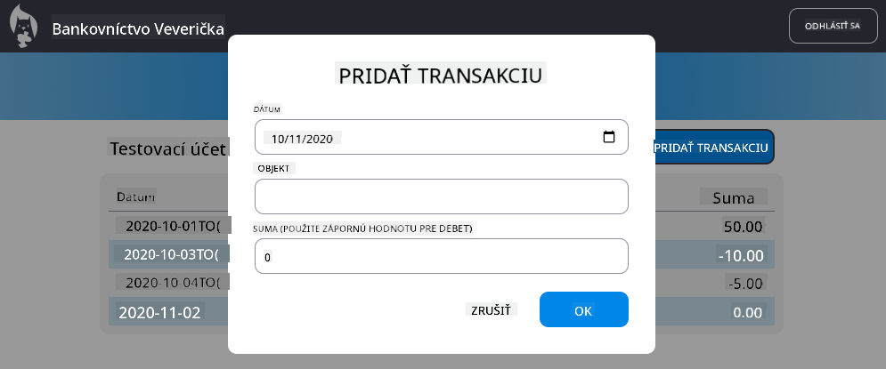

<!--
CO_OP_TRANSLATOR_METADATA:
{
  "original_hash": "32bd800759c3e943c38ad9ae6e1f51e0",
  "translation_date": "2025-10-24T21:38:11+00:00",
  "source_file": "7-bank-project/4-state-management/README.md",
  "language_code": "sk"
}
-->
# Vytvorenie bankovej aplikácie, časť 4: Koncepty správy stavu

## Kvíz pred prednáškou

[Prednáškový kvíz](https://ff-quizzes.netlify.app/web/quiz/47)

## Úvod

Správa stavu je ako navigačný systém na kozmickej lodi Voyager – keď všetko funguje hladko, sotva si ho všimnete. Ale keď sa niečo pokazí, stáva sa rozdielom medzi dosiahnutím medzihviezdneho priestoru a blúdením v kozmickom prázdne. Vo webovom vývoji stav predstavuje všetko, čo si vaša aplikácia potrebuje pamätať: stav prihlásenia používateľa, údaje formulára, históriu navigácie a dočasné stavy rozhrania.

Ako sa vaša banková aplikácia vyvíjala z jednoduchého prihlasovacieho formulára na sofistikovanejšiu aplikáciu, pravdepodobne ste narazili na niektoré bežné výzvy. Obnovíte stránku a používatelia sú neočakávane odhlásení. Zatvoríte prehliadač a všetok pokrok zmizne. Hľadáte chybu a prechádzate viacerými funkciami, ktoré všetky upravujú rovnaké údaje rôznymi spôsobmi.

Toto nie sú znaky zlého kódovania – sú to prirodzené problémy, ktoré sa objavujú, keď aplikácie dosiahnu určitý prah zložitosti. Každý vývojár čelí týmto výzvam, keď sa jeho aplikácie posúvajú z fázy „dôkaz konceptu“ do fázy „pripravené na produkciu“.

V tejto lekcii implementujeme centralizovaný systém správy stavu, ktorý premení vašu bankovú aplikáciu na spoľahlivú, profesionálnu aplikáciu. Naučíte sa predvídateľne spravovať tok údajov, vhodne uchovávať používateľské relácie a vytvárať plynulý používateľský zážitok, ktorý moderné webové aplikácie vyžadujú.

## Predpoklady

Predtým, než sa pustíte do konceptov správy stavu, musíte mať správne nastavené vývojové prostredie a základ vašej bankovej aplikácie. Táto lekcia priamo nadväzuje na koncepty a kód z predchádzajúcich častí tejto série.

Uistite sa, že máte pripravené nasledujúce komponenty pred pokračovaním:

**Požadované nastavenie:**
- Dokončite [lekciu o získavaní údajov](../3-data/README.md) - vaša aplikácia by mala úspešne načítať a zobrazovať údaje o účte
- Nainštalujte si [Node.js](https://nodejs.org) na váš systém na spustenie backendového API
- Spustite [server API](../api/README.md) lokálne na spracovanie operácií s údajmi o účte

**Testovanie vášho prostredia:**

Overte, že váš API server funguje správne, vykonaním tohto príkazu v termináli:

```sh
curl http://localhost:5000/api
# -> should return "Bank API v1.0.0" as a result
```

**Čo tento príkaz robí:**
- **Odosiela** GET požiadavku na váš lokálny API server
- **Testuje** pripojenie a overuje, či server odpovedá
- **Vracia** informácie o verzii API, ak všetko funguje správne

---

## Diagnostika aktuálnych problémov so stavom

Ako Sherlock Holmes skúmajúci miesto činu, musíme presne pochopiť, čo sa deje v našej aktuálnej implementácii, aby sme mohli vyriešiť záhadu miznúcich používateľských relácií.

Vykonajme jednoduchý experiment, ktorý odhalí základné problémy správy stavu:

**🧪 Skúste tento diagnostický test:**
1. Prihláste sa do svojej bankovej aplikácie a prejdite na dashboard
2. Obnovte stránku prehliadača
3. Sledujte, čo sa stane s vaším stavom prihlásenia

Ak ste presmerovaní späť na prihlasovaciu obrazovku, objavili ste klasický problém s uchovávaním stavu. Toto správanie nastáva, pretože naša aktuálna implementácia uchováva údaje používateľa v JavaScriptových premenných, ktoré sa pri každom načítaní stránky resetujú.

**Problémy aktuálnej implementácie:**

Jednoduchá premenná `account` z našej [predchádzajúcej lekcie](../3-data/README.md) spôsobuje tri významné problémy, ktoré ovplyvňujú používateľskú skúsenosť aj udržiavateľnosť kódu:

| Problém | Technická príčina | Dopad na používateľa |
|---------|-------------------|----------------------|
| **Strata relácie** | Obnovenie stránky vymaže JavaScriptové premenné | Používatelia sa musia často znovu autentifikovať |
| **Roztrúsené aktualizácie** | Viaceré funkcie priamo upravujú stav | Ladenie sa stáva čoraz ťažším |
| **Neúplné vyčistenie** | Odhlásenie nevymaže všetky referencie stavu | Potenciálne bezpečnostné a súkromné problémy |

**Architektonická výzva:**

Ako pri návrhu Titanic, ktorý sa zdal robustný, kým sa naraz nezaplavilo viacero oddelení, riešenie týchto problémov jednotlivo neodstráni základný architektonický problém. Potrebujeme komplexné riešenie správy stavu.

> 💡 **Čo sa tu vlastne snažíme dosiahnuť?**

[Správa stavu](https://en.wikipedia.org/wiki/State_management) je v podstate o riešení dvoch základných hádaniek:

1. **Kde sú moje údaje?**: Sledovanie toho, aké informácie máme a odkiaľ pochádzajú
2. **Je každý na rovnakej vlne?**: Zabezpečenie, že to, čo používateľ vidí, zodpovedá tomu, čo sa skutočne deje

**Náš plán:**

Namiesto toho, aby sme sa naháňali za problémami, vytvoríme **centralizovaný systém správy stavu**. Predstavte si to ako mať jedného naozaj organizovaného človeka, ktorý má na starosti všetky dôležité veci:


**Pochopenie tohto toku údajov:**
- **Centralizuje** všetky stavy aplikácie na jednom mieste
- **Routuje** všetky zmeny stavu cez kontrolované funkcie
- **Zabezpečuje**, že používateľské rozhranie zostáva synchronizované s aktuálnym stavom
- **Poskytuje** jasný, predvídateľný vzor pre správu údajov

> 💡 **Profesionálny pohľad**: Táto lekcia sa zameriava na základné koncepty. Pre komplexné aplikácie poskytujú knižnice ako [Redux](https://redux.js.org) pokročilejšie funkcie správy stavu. Pochopenie týchto základných princípov vám pomôže zvládnuť akúkoľvek knižnicu na správu stavu.

> ⚠️ **Pokročilá téma**: Nebudeme sa zaoberať automatickými aktualizáciami používateľského rozhrania vyvolanými zmenami stavu, pretože to zahŕňa koncepty [Reaktívneho programovania](https://en.wikipedia.org/wiki/Reactive_programming). Považujte to za vynikajúci ďalší krok vo vašej učebnej ceste!

### Úloha: Centralizácia štruktúry stavu

Začnime transformáciou našej roztrúsenej správy stavu na centralizovaný systém. Tento prvý krok vytvára základ pre všetky nasledujúce vylepšenia.

**Krok 1: Vytvorenie centralizovaného objektu stavu**

Nahraďte jednoduché vyhlásenie `account`:

```js
let account = null;
```

Štruktúrovaným objektom stavu:

```js
let state = {
  account: null
};
```

**Prečo na tejto zmene záleží:**
- **Centralizuje** všetky údaje aplikácie na jednom mieste
- **Pripravuje** štruktúru na pridanie ďalších vlastností stavu neskôr
- **Vytvára** jasnú hranicu medzi stavom a ostatnými premennými
- **Zavádza** vzor, ktorý sa škáluje s rastom vašej aplikácie

**Krok 2: Aktualizácia vzorov prístupu k stavu**

Aktualizujte svoje funkcie tak, aby používali novú štruktúru stavu:

**Vo funkciách `register()` a `login()` nahraďte:**
```js
account = ...
```

Týmto:
```js
state.account = ...
```

**Vo funkcii `updateDashboard()` pridajte tento riadok na začiatok:**
```js
const account = state.account;
```

**Čo tieto aktualizácie dosahujú:**
- **Zachovávajú** existujúcu funkcionalitu pri zlepšovaní štruktúry
- **Pripravujú** váš kód na sofistikovanejšiu správu stavu
- **Vytvárajú** konzistentné vzory pre prístup k údajom stavu
- **Zavádzajú** základ pre centralizované aktualizácie stavu

> 💡 **Poznámka**: Táto refaktorizácia okamžite nevyrieši naše problémy, ale vytvára základ pre silné vylepšenia, ktoré prídu neskôr!

## Implementácia kontrolovaných aktualizácií stavu

S naším stavom centralizovaným je ďalším krokom zavedenie kontrolovaných mechanizmov na úpravu údajov. Tento prístup zabezpečuje predvídateľné zmeny stavu a jednoduchšie ladenie.

Základný princíp pripomína riadenie leteckej dopravy: namiesto toho, aby sme umožnili viacerým funkciám nezávisle upravovať stav, budeme všetky zmeny smerovať cez jednu kontrolovanú funkciu. Tento vzor poskytuje jasný prehľad o tom, kedy a ako dochádza k zmenám údajov.

**Správa nemenného stavu:**

Budeme zaobchádzať s naším objektom `state` ako s [*nemenným*](https://en.wikipedia.org/wiki/Immutable_object), čo znamená, že ho nikdy neupravujeme priamo. Namiesto toho každá zmena vytvorí nový objekt stavu s aktualizovanými údajmi.

Aj keď sa tento prístup môže na prvý pohľad zdať menej efektívny v porovnaní s priamymi úpravami, poskytuje významné výhody pre ladenie, testovanie a udržiavanie predvídateľnosti aplikácie.

**Výhody správy nemenného stavu:**

| Výhoda | Popis | Dopad |
|--------|-------|-------|
| **Predvídateľnosť** | Zmeny sa dejú len cez kontrolované funkcie | Jednoduchšie ladenie a testovanie |
| **Sledovanie histórie** | Každá zmena stavu vytvára nový objekt | Umožňuje funkciu undo/redo |
| **Prevencia vedľajších účinkov** | Žiadne náhodné úpravy | Predchádza záhadným chybám |
| **Optimalizácia výkonu** | Jednoduché zistenie, kedy sa stav skutočne zmenil | Umožňuje efektívne aktualizácie UI |

**Nemennosť v JavaScripte pomocou `Object.freeze()`:**

JavaScript poskytuje [`Object.freeze()`](https://developer.mozilla.org/docs/Web/JavaScript/Reference/Global_Objects/Object/freeze) na zabránenie úprav objektov:

```js
const immutableState = Object.freeze({ account: userData });
// Any attempt to modify immutableState will throw an error
```

**Čo sa tu deje:**
- **Zabraňuje** priamym priradeniam alebo mazaniu vlastností
- **Vyvoláva** výnimky, ak sa pokúsite o úpravy
- **Zabezpečuje**, že zmeny stavu musia prejsť cez kontrolované funkcie
- **Vytvára** jasný kontrakt pre spôsob, akým sa stav môže aktualizovať

> 💡 **Hlbší pohľad**: Zistite rozdiel medzi *povrchnými* a *hlbokými* nemennými objektmi v [dokumentácii MDN](https://developer.mozilla.org/docs/Web/JavaScript/Reference/Global_Objects/Object/freeze#What_is_shallow_freeze). Pochopenie tohto rozdielu je kľúčové pre komplexné štruktúry stavu.

### Úloha

Vytvorme novú funkciu `updateState()`:

```js
function updateState(property, newData) {
  state = Object.freeze({
    ...state,
    [property]: newData
  });
}
```

V tejto funkcii vytvárame nový objekt stavu a kopírujeme údaje z predchádzajúceho stavu pomocou [*spread (`...`) operátora*](https://developer.mozilla.org/docs/Web/JavaScript/Reference/Operators/Spread_syntax#Spread_in_object_literals). Potom prepíšeme konkrétnu vlastnosť objektu stavu novými údajmi pomocou [notácie hranatých zátvoriek](https://developer.mozilla.org/docs/Web/JavaScript/Guide/Working_with_Objects#Objects_and_properties) `[property]` na priradenie. Nakoniec zamkneme objekt, aby sme zabránili úpravám pomocou `Object.freeze()`. Momentálne máme v stave uloženú iba vlastnosť `account`, ale s týmto prístupom môžete do stavu pridať toľko vlastností, koľko potrebujete.

Aktualizujeme aj inicializáciu `state`, aby sme sa uistili, že počiatočný stav je tiež zamrznutý:

```js
let state = Object.freeze({
  account: null
});
```

Potom aktualizujte funkciu `register` nahradením priradenia `state.account = result;`:

```js
updateState('account', result);
```

Urobte to isté s funkciou `login`, nahraďte `state.account = data;`:

```js
updateState('account', data);
```

Teraz využijeme príležitosť na opravu problému, že údaje o účte sa nevymažú, keď používateľ klikne na *Odhlásiť*.

Vytvorte novú funkciu `logout()`:

```js
function logout() {
  updateState('account', null);
  navigate('/login');
}
```

V `updateDashboard()` nahraďte presmerovanie `return navigate('/login');` za `return logout();`;

Skúste zaregistrovať nový účet, odhlásiť sa a znovu prihlásiť, aby ste skontrolovali, že všetko stále funguje správne.

> Tip: môžete si pozrieť všetky zmeny stavu pridaním `console.log(state)` na koniec `updateState()` a otvorením konzoly vo vývojárskych nástrojoch vášho prehliadača.

## Implementácia uchovávania údajov

Problém straty relácie, ktorý sme identifikovali skôr, vyžaduje riešenie uchovávania, ktoré udržiava používateľský stav naprieč reláciami prehliadača. To transformuje našu aplikáciu z dočasného zážitku na spoľahlivý, profesionálny nástroj.

Predstavte si, ako atómové hodiny udržiavajú presný čas aj počas výpadkov elektriny tým, že ukladajú kritický stav do nevolatilnej pamäte. Podobne aj webové aplikácie potrebujú mechanizmy na uchovávanie údajov, aby zachovali dôležité používateľské údaje naprieč reláciami prehliadača a obnoveniami stránky.

**Strategické otázky pre uchovávanie údajov:**

Pred implementáciou uchovávania zvážte tieto kritické faktory:

| Otázka | Kontext bankovej aplikácie | Dopad rozhodnutia |
|--------|-----------------------------|-------------------|
| **Sú údaje citlivé?** | Zostatok na účte, história transakcií | Výber bezpečných metód uchovávania |
| **Ako dlho by mali údaje pretrvávať?** | Stav prihlásenia vs. dočasné preferencie UI | Výber vhodnej dĺžky uchovávania |
| **Potrebujú údaje server?** | Autentifikačné tokeny vs. nastavenia UI | Určenie požiadaviek na zdieľanie |

**Možnosti uchovávania v prehliadači:**

Moderné prehliadače poskytujú niekoľko mechanizmov uchovávania, každý navrhnutý pre rôzne prípady použitia:

**Primárne API na uchovávanie:**

1. **[`localStorage`](https://developer.mozilla.org/docs/Web/API/Window/localStorage)**: Trvalé [Key/Value uchovávanie](https://en.wikipedia.org/wiki/Key%E2%80%93value_database)
   - **Uchováva** údaje naprieč reláciami prehliadača na neurčito  
   - **Prežije** reštarty prehliadača a počítača
   - **Obmedzené** na konkrétnu doménu webovej stránky
   - **Ideálne** pre používateľské preferencie a stavy prihlásenia

2. **[`sessionStorage`](https://developer.mozilla.org/docs/Web/API/Window/sessionStorage)**: Dočasné uchovávanie relácie
   - **Funguje** identicky
> 💡 **Pokročilá možnosť**: Pre komplexné offline aplikácie s veľkými množstvami dát zvážte použitie [`IndexedDB` API](https://developer.mozilla.org/docs/Web/API/IndexedDB_API). Poskytuje plnohodnotnú databázu na strane klienta, ale vyžaduje zložitejšiu implementáciu.

### Úloha: Implementácia perzistencie pomocou localStorage

Implementujme perzistentné úložisko, aby používatelia zostali prihlásení, kým sa explicitne neodhlásia. Použijeme `localStorage` na uchovávanie údajov o účte medzi reláciami prehliadača.

**Krok 1: Definovanie konfigurácie úložiska**

```js
const storageKey = 'savedAccount';
```

**Čo táto konštanta poskytuje:**
- **Vytvára** konzistentný identifikátor pre naše uložené dáta
- **Zabraňuje** preklepom v odkazoch na kľúče úložiska
- **Umožňuje** jednoduchú zmenu kľúča úložiska, ak je to potrebné
- **Dodržiava** najlepšie praktiky pre udržiavateľný kód

**Krok 2: Pridanie automatickej perzistencie**

Pridajte tento riadok na koniec funkcie `updateState()`:

```js
localStorage.setItem(storageKey, JSON.stringify(state.account));
```

**Rozbor toho, čo sa tu deje:**
- **Konvertuje** objekt účtu na JSON reťazec pre uloženie
- **Ukladá** dáta pomocou nášho konzistentného kľúča úložiska
- **Vykonáva** sa automaticky vždy, keď dôjde k zmene stavu
- **Zabezpečuje**, že uložené dáta sú vždy synchronizované s aktuálnym stavom

> 💡 **Výhoda architektúry**: Keďže sme centralizovali všetky aktualizácie stavu cez `updateState()`, pridanie perzistencie si vyžadovalo iba jeden riadok kódu. To demonštruje silu dobrých architektonických rozhodnutí!

**Krok 3: Obnovenie stavu pri načítaní aplikácie**

Vytvorte inicializačnú funkciu na obnovenie uložených dát:

```js
function init() {
  const savedAccount = localStorage.getItem(storageKey);
  if (savedAccount) {
    updateState('account', JSON.parse(savedAccount));
  }

  // Our previous initialization code
  window.onpopstate = () => updateRoute();
  updateRoute();
}

init();
```

**Pochopenie procesu inicializácie:**
- **Načíta** akékoľvek predtým uložené údaje o účte z localStorage
- **Parsuje** JSON reťazec späť na JavaScript objekt
- **Aktualizuje** stav pomocou našej kontrolovanej aktualizačnej funkcie
- **Automaticky obnovuje** reláciu používateľa pri načítaní stránky
- **Vykonáva** sa pred aktualizáciou trasy, aby bol stav dostupný

**Krok 4: Optimalizácia predvolenej trasy**

Aktualizujte predvolenú trasu tak, aby využívala perzistenciu:

V `updateRoute()` nahraďte:
```js
// Replace: return navigate('/login');
return navigate('/dashboard');
```

**Prečo táto zmena dáva zmysel:**
- **Efektívne využíva** náš nový systém perzistencie
- **Umožňuje** dashboardu spracovať overenie autentifikácie
- **Automaticky presmeruje** na prihlásenie, ak neexistuje uložená relácia
- **Vytvára** plynulejší používateľský zážitok

**Testovanie implementácie:**

1. Prihláste sa do svojej bankovej aplikácie
2. Obnovte stránku prehliadača
3. Overte, že zostanete prihlásení a na dashboarde
4. Zatvorte a znova otvorte prehliadač
5. Vráťte sa do aplikácie a potvrďte, že ste stále prihlásení

🎉 **Dosiahnutý úspech**: Úspešne ste implementovali správu perzistentného stavu! Vaša aplikácia sa teraz správa ako profesionálna webová aplikácia.

## Vyváženie perzistencie a aktuálnosti dát

Náš systém perzistencie úspešne udržiava používateľské relácie, ale prináša novú výzvu: zastaranosť dát. Keď viacerí používatelia alebo aplikácie upravujú rovnaké serverové dáta, lokálne uložené informácie sa stávajú neaktuálnymi.

Táto situácia pripomína vikingských navigátorov, ktorí sa spoliehali na uložené mapy hviezd, ale potrebovali aktuálne pozorovania na zohľadnenie meniacich sa podmienok. Podobne naša aplikácia potrebuje perzistentný stav používateľa aj aktuálne serverové dáta.

**🧪 Objavovanie problému zastaranosti dát:**

1. Prihláste sa na dashboard pomocou účtu `test`
2. Spustite tento príkaz v termináli na simuláciu transakcie z iného zdroja:

```sh
curl --request POST \
     --header "Content-Type: application/json" \
     --data "{ \"date\": \"2020-07-24\", \"object\": \"Bought book\", \"amount\": -20 }" \
     http://localhost:5000/api/accounts/test/transactions
```

3. Obnovte stránku dashboardu v prehliadači
4. Sledujte, či vidíte novú transakciu

**Čo tento test demonštruje:**
- **Ukazuje**, ako sa localStorage môže stať "zastaraným" (neaktuálnym)
- **Simuluje** reálne scenáre, kde dochádza k zmene dát mimo vašej aplikácie
- **Odhaľuje** napätie medzi perzistenciou a aktuálnosťou dát

**Výzva zastaranosti dát:**

| Problém | Príčina | Dopad na používateľa |
|---------|---------|----------------------|
| **Zastarané dáta** | localStorage sa nikdy automaticky neaktualizuje | Používatelia vidia neaktuálne informácie |
| **Zmeny na serveri** | Iné aplikácie/používatelia upravujú rovnaké dáta | Nekonzistentné zobrazenia naprieč platformami |
| **Cache vs. realita** | Lokálna cache nezodpovedá stavu servera | Zlá používateľská skúsenosť a zmätok |

**Stratégia riešenia:**

Implementujeme vzor "obnovenie pri načítaní", ktorý vyváži výhody perzistencie s potrebou aktuálnych dát. Tento prístup zachová plynulý používateľský zážitok a zároveň zabezpečí presnosť dát.

### Úloha: Implementácia systému obnovovania dát

Vytvoríme systém, ktorý automaticky načíta aktuálne dáta zo servera a zároveň zachová výhody našej správy perzistentného stavu.

**Krok 1: Vytvorenie aktualizátora dát účtu**

```js
async function updateAccountData() {
  const account = state.account;
  if (!account) {
    return logout();
  }

  const data = await getAccount(account.user);
  if (data.error) {
    return logout();
  }

  updateState('account', data);
}
```

**Pochopenie logiky tejto funkcie:**
- **Kontroluje**, či je používateľ aktuálne prihlásený (existuje state.account)
- **Presmeruje** na odhlásenie, ak neexistuje platná relácia
- **Načíta** aktuálne dáta účtu zo servera pomocou existujúcej funkcie `getAccount()`
- **Spracováva** chyby servera elegantne odhlásením neplatných relácií
- **Aktualizuje** stav s aktuálnymi dátami pomocou našej kontrolovanej aktualizačnej funkcie
- **Spúšťa** automatickú perzistenciu localStorage cez funkciu `updateState()`

**Krok 2: Vytvorenie obsluhy obnovovania dashboardu**

```js
async function refresh() {
  await updateAccountData();
  updateDashboard();
}
```

**Čo táto funkcia obnovovania dosahuje:**
- **Koordinuje** proces obnovovania dát a aktualizácie UI
- **Čaká**, kým sa načítajú aktuálne dáta, pred aktualizáciou zobrazenia
- **Zabezpečuje**, že dashboard zobrazuje najaktuálnejšie informácie
- **Udržuje** čisté oddelenie medzi správou dát a aktualizáciou UI

**Krok 3: Integrácia so systémom trás**

Aktualizujte konfiguráciu trás tak, aby sa automaticky spúšťalo obnovovanie:

```js
const routes = {
  '/login': { templateId: 'login' },
  '/dashboard': { templateId: 'dashboard', init: refresh }
};
```

**Ako táto integrácia funguje:**
- **Spúšťa** funkciu obnovovania vždy, keď sa načíta trasa dashboardu
- **Zabezpečuje**, že aktuálne dáta sú vždy zobrazené, keď používatelia prejdú na dashboard
- **Udržuje** existujúcu štruktúru trás a zároveň pridáva aktuálnosť dát
- **Poskytuje** konzistentný vzor pre inicializáciu špecifickú pre trasy

**Testovanie systému obnovovania dát:**

1. Prihláste sa do svojej bankovej aplikácie
2. Spustite curl príkaz z predchádzajúceho kroku na vytvorenie novej transakcie
3. Obnovte stránku dashboardu alebo prejdite na inú stránku a späť
4. Overte, že nová transakcia sa okamžite zobrazí

🎉 **Dokonalá rovnováha dosiahnutá**: Vaša aplikácia teraz kombinuje plynulý zážitok z perzistentného stavu s presnosťou aktuálnych serverových dát!

## Výzva GitHub Copilot Agent 🚀

Použite režim Agent na splnenie nasledujúcej výzvy:

**Popis:** Implementujte komplexný systém správy stavu s funkciami undo/redo pre bankovú aplikáciu. Táto výzva vám pomôže precvičiť pokročilé koncepty správy stavu vrátane sledovania histórie stavu, nemenných aktualizácií a synchronizácie používateľského rozhrania.

**Zadanie:** Vytvorte rozšírený systém správy stavu, ktorý zahŕňa: 1) Pole histórie stavu, ktoré sleduje všetky predchádzajúce stavy, 2) Funkcie undo a redo, ktoré umožňujú návrat k predchádzajúcim stavom, 3) Tlačidlá UI pre operácie undo/redo na dashboarde, 4) Maximálny limit histórie 10 stavov na predchádzanie problémom s pamäťou, a 5) Správne vyčistenie histórie pri odhlásení používateľa. Zabezpečte, aby funkcie undo/redo fungovali so zmenami zostatku na účte a perzistovali medzi obnoveniami prehliadača.

Viac o [režime agent](https://code.visualstudio.com/blogs/2025/02/24/introducing-copilot-agent-mode) sa dozviete tu.

## 🚀 Výzva: Optimalizácia úložiska

Vaša implementácia teraz efektívne spravuje používateľské relácie, obnovovanie dát a správu stavu. Zvážte však, či náš aktuálny prístup optimálne vyvažuje efektivitu úložiska s funkčnosťou.

Rovnako ako šachoví majstri, ktorí rozlišujú medzi nevyhnutnými figúrkami a tými, ktoré môžu byť obetované, efektívna správa stavu vyžaduje identifikáciu dát, ktoré musia byť perzistentné, oproti tým, ktoré by mali byť vždy aktuálne zo servera.

**Analýza optimalizácie:**

Vyhodnoťte svoju aktuálnu implementáciu localStorage a zvážte tieto strategické otázky:
- Aké minimum informácií je potrebné na udržanie autentifikácie používateľa?
- Ktoré dáta sa menia tak často, že lokálne ukladanie neprináša veľký úžitok?
- Ako môže optimalizácia úložiska zlepšiť výkon bez zhoršenia používateľského zážitku?

**Stratégia implementácie:**
- **Identifikujte** nevyhnutné dáta, ktoré musia byť perzistentné (pravdepodobne len identifikácia používateľa)
- **Upravte** svoju implementáciu localStorage tak, aby uchovávala iba kritické údaje o relácii
- **Zabezpečte**, že aktuálne dáta sa vždy načítajú zo servera pri návšteve dashboardu
- **Otestujte**, či váš optimalizovaný prístup zachováva rovnaký používateľský zážitok

**Pokročilé úvahy:**
- **Porovnajte** kompromisy medzi ukladaním úplných údajov o účte a iba autentifikačných tokenov
- **Zdokumentujte** svoje rozhodnutia a dôvody pre budúcich členov tímu

Táto výzva vám pomôže myslieť ako profesionálny vývojár, ktorý zvažuje funkčnosť aj efektivitu aplikácie. Dajte si čas na experimentovanie s rôznymi prístupmi!

## Kvíz po prednáške

[Kvíz po prednáške](https://ff-quizzes.netlify.app/web/quiz/48)

## Zadanie

[Implementujte dialóg "Pridať transakciu"](assignment.md)

Tu je príklad výsledku po dokončení zadania:



---

**Zrieknutie sa zodpovednosti**:  
Tento dokument bol preložený pomocou služby AI prekladu [Co-op Translator](https://github.com/Azure/co-op-translator). Hoci sa snažíme o presnosť, prosím, berte na vedomie, že automatizované preklady môžu obsahovať chyby alebo nepresnosti. Pôvodný dokument v jeho rodnom jazyku by mal byť považovaný za autoritatívny zdroj. Pre kritické informácie sa odporúča profesionálny ľudský preklad. Nie sme zodpovední za žiadne nedorozumenia alebo nesprávne interpretácie vyplývajúce z použitia tohto prekladu.