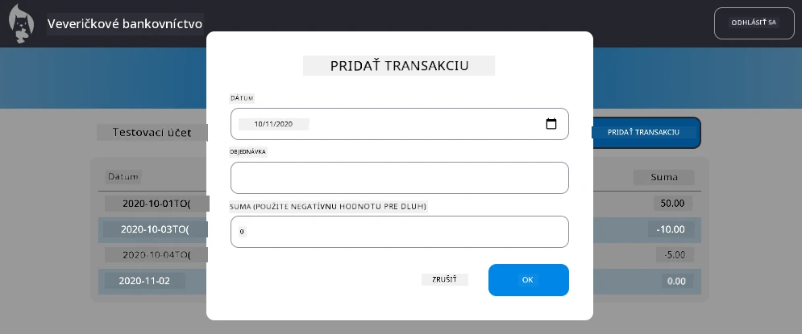

# Implementácia dialógu "Pridať transakciu"

## Prehľad

Vaša banková aplikácia má teraz solídne riadenie stavu a ukladanie dát, ale chýba jej kľúčová funkcia, ktorú skutočné bankové aplikácie potrebujú: možnosť, aby používatelia mohli pridávať vlastné transakcie. V tejto úlohe implementujete kompletný dialóg "Pridať transakciu", ktorý sa bezproblémovo integruje s vaším existujúcim systémom riadenia stavu.

Táto úloha spája všetko, čo ste sa naučili v štyroch lekciách o bankovníctve: HTML šablóny, spracovanie formulárov, integráciu API a riadenie stavu.

## Ciele učenia

Po splnení tejto úlohy budete schopní:
- **Vytvoriť** používateľsky prívetivý dialógový rozhranie na zadávanie údajov
- **Implementovať** prístupný dizajn formulára s podporou klávesnice a čítačiek obrazovky
- **Integrovať** nové funkcie do vášho existujúceho systému riadenia stavu
- **Precvičiť** komunikáciu s API a spracovanie chýb
- **Aplikovať** moderné webové vývojové vzory na funkciu z reálneho sveta

## Pokyny

### Krok 1: Tlačidlo "Pridať transakciu"

**Vytvorte** tlačidlo "Pridať transakciu" na stránke vášho dashboardu, ktoré používatelia ľahko nájdu a použijú.

**Požiadavky:**
- **Umiestnite** tlačidlo na logické miesto na dashboarde
- **Použite** jasný, akčný text na tlačidle
- **Štylizujte** tlačidlo tak, aby zodpovedalo vášmu existujúcemu dizajnu používateľského rozhrania
- **Zabezpečte**, že tlačidlo je prístupné pomocou klávesnice

### Krok 2: Implementácia dialógu

Vyberte jednu z dvoch možností na implementáciu vášho dialógu:

**Možnosť A: Samostatná stránka**
- **Vytvorte** novú HTML šablónu pre formulár transakcie
- **Pridajte** novú trasu do vášho systému smerovania
- **Implementujte** navigáciu na stránku formulára a späť

**Možnosť B: Modálny dialóg (odporúčané)**
- **Použite** JavaScript na zobrazenie/skrytie dialógu bez opustenia dashboardu
- **Implementujte** pomocou vlastnosti [`hidden`](https://developer.mozilla.org/docs/Web/HTML/Global_attributes/hidden) alebo CSS tried
- **Vytvorte** plynulý používateľský zážitok s riadením zamerania

### Krok 3: Implementácia prístupnosti

**Zabezpečte**, že váš dialóg spĺňa [štandardy prístupnosti pre modálne dialógy](https://developer.paciellogroup.com/blog/2018/06/the-current-state-of-modal-dialog-accessibility/):

**Navigácia pomocou klávesnice:**
- **Podporte** kláves Escape na zatvorenie dialógu
- **Uzamknite** zameranie v dialógu, keď je otvorený
- **Vráťte** zameranie na tlačidlo spúšťača, keď je dialóg zatvorený

**Podpora čítačiek obrazovky:**
- **Pridajte** vhodné ARIA štítky a role
- **Oznámte** otvorenie/zatvorenie dialógu čítačkám obrazovky
- **Poskytnite** jasné štítky polí formulára a chybové správy

### Krok 4: Vytvorenie formulára

**Navrhnite** HTML formulár, ktorý zbiera údaje o transakcii:

**Povinné polia:**
- **Dátum**: Kedy sa transakcia uskutočnila
- **Popis**: Na čo bola transakcia určená
- **Suma**: Hodnota transakcie (pozitívna pre príjem, negatívna pre výdavky)

**Funkcie formulára:**
- **Validujte** vstupy používateľa pred odoslaním
- **Poskytnite** jasné chybové správy pre neplatné údaje
- **Zahrňte** užitočný text zástupcu a štítky
- **Štylizujte** konzistentne s vaším existujúcim dizajnom

### Krok 5: Integrácia API

**Pripojte** váš formulár k backendovému API:

**Kroky implementácie:**
- **Preskúmajte** [špecifikácie serverového API](../api/README.md) pre správny koncový bod a formát dát
- **Vytvorte** JSON dáta z vašich vstupov formulára
- **Odošlite** dáta na API s vhodným spracovaním chýb
- **Zobrazte** správy o úspechu/neúspechu používateľovi
- **Riešte** chyby siete elegantne

### Krok 6: Integrácia riadenia stavu

**Aktualizujte** váš dashboard s novou transakciou:

**Požiadavky na integráciu:**
- **Obnovte** údaje účtu po úspešnom pridaní transakcie
- **Aktualizujte** zobrazenie dashboardu bez potreby obnovy stránky
- **Zabezpečte**, že nová transakcia sa zobrazí okamžite
- **Udržujte** správnu konzistenciu stavu počas celého procesu

## Technické špecifikácie

**Podrobnosti o koncovom bode API:**
Pozrite si [dokumentáciu serverového API](../api/README.md) pre:
- Požadovaný formát JSON pre údaje o transakcii
- HTTP metódu a URL koncového bodu
- Očakávaný formát odpovede
- Spracovanie chýb v odpovedi

**Očakávaný výsledok:**
Po dokončení tejto úlohy by vaša banková aplikácia mala mať plne funkčnú funkciu "Pridať transakciu", ktorá vyzerá a správa sa profesionálne:

## Testovanie vašej implementácie

**Funkčné testovanie:**
1. **Overte**, že tlačidlo "Pridať transakciu" je jasne viditeľné a prístupné
2. **Otestujte**, že dialóg sa správne otvára a zatvára
3. **Potvrďte**, že validácia formulára funguje pre všetky povinné polia
4. **Skontrolujte**, že úspešné transakcie sa okamžite zobrazia na dashboarde
5. **Zabezpečte**, že spracovanie chýb funguje pre neplatné údaje a problémy so sieťou

**Testovanie prístupnosti:**
1. **Navigujte** cez celý proces iba pomocou klávesnice
2. **Otestujte** s čítačkou obrazovky, aby ste zabezpečili správne oznámenia
3. **Overte**, že riadenie zamerania funguje správne
4. **Skontrolujte**, že všetky prvky formulára majú vhodné štítky

## Hodnotiace kritériá

| Kritérium | Vynikajúce | Dostatočné | Potrebné zlepšenie |
| --------- | ---------- | ---------- | ------------------ |
| **Funkčnosť** | Funkcia pridania transakcie funguje bezchybne s vynikajúcim používateľským zážitkom a dodržiava všetky najlepšie praktiky z lekcií | Funkcia pridania transakcie funguje správne, ale nemusí dodržiavať niektoré najlepšie praktiky alebo má drobné problémy s použiteľnosťou | Funkcia pridania transakcie funguje len čiastočne alebo má významné problémy s použiteľnosťou |
| **Kvalita kódu** | Kód je dobre organizovaný, dodržiava zavedené vzory, obsahuje správne spracovanie chýb a bezproblémovo sa integruje s existujúcim riadením stavu | Kód funguje, ale môže mať niektoré problémy s organizáciou alebo nekonzistentné vzory s existujúcim kódom | Kód má významné štrukturálne problémy alebo sa dobre neintegruje s existujúcimi vzormi |
| **Prístupnosť** | Plná podpora navigácie pomocou klávesnice, kompatibilita s čítačkami obrazovky a dodržiavanie pokynov WCAG s vynikajúcim riadením zamerania | Základné funkcie prístupnosti sú implementované, ale môžu chýbať niektoré funkcie navigácie pomocou klávesnice alebo čítačiek obrazovky | Obmedzené alebo žiadne zohľadnenie prístupnosti |
| **Používateľský zážitok** | Intuitívne, prepracované rozhranie s jasnou spätnou väzbou, plynulými interakciami a profesionálnym vzhľadom | Dobrý používateľský zážitok s drobnými oblasťami na zlepšenie spätnej väzby alebo vizuálneho dizajnu | Slabý používateľský zážitok s mätúcim rozhraním alebo nedostatkom spätnej väzby |

## Doplnkové výzvy (voliteľné)

Keď splníte základné požiadavky, zvážte tieto vylepšenia:

**Rozšírené funkcie:**
- **Pridajte** kategórie transakcií (jedlo, doprava, zábava atď.)
- **Implementujte** validáciu vstupov s okamžitou spätnou väzbou
- **Vytvorte** klávesové skratky pre pokročilých používateľov
- **Pridajte** možnosť úpravy a mazania transakcií

**Pokročilá integrácia:**
- **Implementujte** funkciu spätného kroku pre nedávno pridané transakcie
- **Pridajte** hromadný import transakcií z CSV súborov
- **Vytvorte** vyhľadávanie a filtrovanie transakcií
- **Implementujte** funkciu exportu dát

Tieto voliteľné funkcie vám pomôžu precvičiť pokročilejšie koncepty webového vývoja a vytvoriť komplexnejšiu bankovú aplikáciu!

---

**Upozornenie**:  
Tento dokument bol preložený pomocou služby AI prekladu [Co-op Translator](https://github.com/Azure/co-op-translator). Hoci sa snažíme o presnosť, prosím, berte na vedomie, že automatizované preklady môžu obsahovať chyby alebo nepresnosti. Pôvodný dokument v jeho rodnom jazyku by mal byť považovaný za autoritatívny zdroj. Pre kritické informácie sa odporúča profesionálny ľudský preklad. Nie sme zodpovední za žiadne nedorozumenia alebo nesprávne interpretácie vyplývajúce z použitia tohto prekladu.