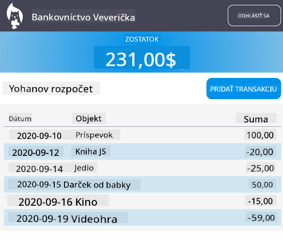

<!--
CO_OP_TRANSLATOR_METADATA:
{
  "original_hash": "830359535306594b448db6575ce5cdee",
  "translation_date": "2025-08-27T22:00:08+00:00",
  "source_file": "7-bank-project/README.md",
  "language_code": "sk"
}
-->
# :dollar: Vytvorte Banku

V tomto projekte sa naučíte, ako vytvoriť fiktívnu banku. Tieto lekcie obsahujú pokyny, ako navrhnúť webovú aplikáciu a poskytnúť trasy, vytvoriť formuláre, spravovať stav a získavať údaje z API, z ktorého môžete načítať údaje banky.

|  |  |
|--------------------------------|--------------------------------|

## Lekcie

1. [HTML šablóny a trasy vo webovej aplikácii](1-template-route/README.md)
2. [Vytvorenie prihlasovacieho a registračného formulára](2-forms/README.md)
3. [Metódy získavania a používania údajov](3-data/README.md)
4. [Koncepty správy stavu](4-state-management/README.md)

### Kredity

Tieto lekcie boli napísané s :hearts: od [Yohan Lasorsa](https://twitter.com/sinedied).

Ak máte záujem naučiť sa, ako vytvoriť [serverové API](/7-bank-project/api/README.md) použité v týchto lekciách, môžete sledovať [túto sériu videí](https://aka.ms/NodeBeginner) (najmä videá 17 až 21).

Môžete si tiež pozrieť [tento interaktívny návod na Learn](https://aka.ms/learn/express-api).

---

**Upozornenie**:  
Tento dokument bol preložený pomocou služby AI prekladu [Co-op Translator](https://github.com/Azure/co-op-translator). Hoci sa snažíme o presnosť, prosím, berte na vedomie, že automatizované preklady môžu obsahovať chyby alebo nepresnosti. Pôvodný dokument v jeho pôvodnom jazyku by mal byť považovaný za autoritatívny zdroj. Pre kritické informácie sa odporúča profesionálny ľudský preklad. Nie sme zodpovední za akékoľvek nedorozumenia alebo nesprávne interpretácie vyplývajúce z použitia tohto prekladu.