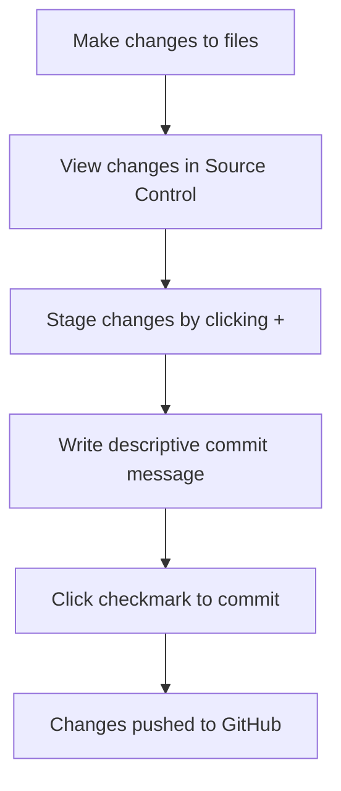

<!--
CO_OP_TRANSLATOR_METADATA:
{
  "original_hash": "cfd4a15974168ca426d50c67682ab9d4",
  "translation_date": "2025-10-24T21:19:48+00:00",
  "source_file": "8-code-editor/1-using-a-code-editor/README.md",
  "language_code": "sk"
}
-->
# Používanie editora kódu: Majstrovstvo v VSCode.dev

Pamätáte si na *Matrix*, keď Neo musel byť pripojený k obrovskému počítačovému terminálu, aby získal prístup do digitálneho sveta? Dnešné nástroje na vývoj webu sú úplným opakom – neuveriteľne výkonné schopnosti dostupné odkiaľkoľvek. VSCode.dev je editor kódu založený na prehliadači, ktorý prináša profesionálne vývojové nástroje na akékoľvek zariadenie s pripojením na internet.

Rovnako ako tlačiarenský lis sprístupnil knihy všetkým, nielen pisárom v kláštoroch, VSCode.dev demokratizuje programovanie. Môžete pracovať na projektoch z počítača v knižnici, školského laboratória alebo odkiaľkoľvek, kde máte prístup k prehliadaču. Žiadne inštalácie, žiadne obmedzenia typu "potrebujem svoje špecifické nastavenie".

Na konci tejto lekcie pochopíte, ako sa orientovať vo VSCode.dev, otvárať GitHub repozitáre priamo vo vašom prehliadači a používať Git na správu verzií – všetko zručnosti, na ktoré sa profesionálni vývojári spoliehajú každý deň.

## Čo sa naučíte

Po absolvovaní tejto lekcie budete schopní:

- Orientovať sa vo VSCode.dev ako vo svojom druhom domove – nájsť všetko, čo potrebujete, bez toho, aby ste sa stratili
- Otvoriť akýkoľvek GitHub repozitár vo vašom prehliadači a okamžite začať upravovať (toto je naozaj magické!)
- Používať Git na sledovanie zmien a ukladanie vášho pokroku ako profesionál
- Zrýchliť svoj editor pomocou rozšírení, ktoré robia programovanie rýchlejším a zábavnejším
- Vytvárať a organizovať projektové súbory s istotou

## Čo budete potrebovať

Požiadavky sú jednoduché:

- Bezplatný [GitHub účet](https://github.com) (ak ho nemáte, ukážeme vám, ako si ho vytvoriť)
- Základné znalosti práce s webovými prehliadačmi
- Lekcia GitHub Basics poskytuje užitočné pozadie, hoci nie je nevyhnutná

> 💡 **Nový na GitHube?** Vytvorenie účtu je bezplatné a trvá len pár minút. Rovnako ako knižničná karta vám umožní prístup k knihám po celom svete, GitHub účet vám otvára dvere k repozitárom kódu na internete.

## Prečo sú editory kódu založené na webe dôležité

Pred internetom nemohli vedci na rôznych univerzitách ľahko zdieľať výskum. Potom prišiel ARPANET v 60. rokoch, ktorý prepojil počítače na veľké vzdialenosti. Editory kódu založené na webe nasledujú rovnaký princíp – sprístupňujú výkonné nástroje bez ohľadu na vašu fyzickú polohu alebo zariadenie.

Editor kódu slúži ako vaše pracovné prostredie pre vývoj, kde píšete, upravujete a organizujete súbory kódu. Na rozdiel od jednoduchých textových editorov poskytujú profesionálne editory kódu zvýrazňovanie syntaxe, detekciu chýb a funkcie na správu projektov.

VSCode.dev prináša tieto schopnosti do vášho prehliadača:

**Výhody úpravy na webe:**

| Funkcia | Popis | Praktický prínos |
|---------|-------|------------------|
| **Nezávislosť na platforme** | Funguje na akomkoľvek zariadení s prehliadačom | Práca na rôznych počítačoch bez problémov |
| **Bez nutnosti inštalácie** | Prístup cez webovú URL | Obídenie obmedzení inštalácie softvéru |
| **Automatické aktualizácie** | Vždy beží na najnovšej verzii | Prístup k novým funkciám bez manuálnych aktualizácií |
| **Integrácia s repozitármi** | Priame prepojenie s GitHubom | Úprava kódu bez lokálnej správy súborov |

**Praktické dôsledky:**
- Kontinuita práce v rôznych prostrediach
- Konzistentné rozhranie bez ohľadu na operačný systém
- Okamžité možnosti spolupráce
- Znížené požiadavky na lokálne úložisko

## Preskúmanie VSCode.dev

Rovnako ako laboratórium Marie Curie obsahovalo sofistikované vybavenie v relatívne jednoduchom priestore, VSCode.dev zabalí profesionálne vývojové nástroje do rozhrania prehliadača. Táto webová aplikácia poskytuje rovnaké základné funkcie ako desktopové editory kódu.

Začnite tým, že prejdete na [vscode.dev](https://vscode.dev) vo vašom prehliadači. Rozhranie sa načíta bez sťahovania alebo inštalácie systému – priamy príklad princípov cloud computingu.

### Prepojenie vášho GitHub účtu

Rovnako ako telefón Alexandra Grahama Bella spájal vzdialené miesta, prepojenie vášho GitHub účtu spája VSCode.dev s vašimi repozitármi kódu. Keď budete vyzvaní na prihlásenie do GitHubu, odporúča sa túto možnosť prijať.

**Integrácia s GitHubom poskytuje:**
- Priamy prístup k vašim repozitárom v editore
- Synchronizované nastavenia a rozšírenia na rôznych zariadeniach
- Zjednodušený pracovný postup ukladania na GitHub
- Personalizované vývojové prostredie

### Spoznávanie vášho nového pracovného prostredia

Keď sa všetko načíta, uvidíte krásne čisté pracovné prostredie, ktoré je navrhnuté tak, aby vás udržalo sústredených na to, čo je dôležité – váš kód!

**Tu je vaša prehliadka okolia:**
- **Panel aktivít** (ten pás naľavo): Vaša hlavná navigácia s Explorer 📁, Search 🔍, Source Control 🌿, Extensions 🧩 a Settings ⚙️
- **Bočný panel** (panel vedľa): Zobrazuje relevantné informácie na základe toho, čo ste vybrali
- **Oblasť editora** (veľký priestor uprostred): Tu sa deje mágia – vaša hlavná oblasť na programovanie

**Venujte chvíľu na preskúmanie:**
- Kliknite na ikony v paneli aktivít a zistite, čo každá z nich robí
- Všimnite si, ako sa bočný panel aktualizuje a zobrazuje rôzne informácie – celkom šikovné, však?
- Zobrazenie Explorer (📁) je pravdepodobne miesto, kde strávite väčšinu času, takže sa s ním zoznámte

## Otváranie GitHub repozitárov

Pred internetom museli výskumníci fyzicky cestovať do knižníc, aby získali prístup k dokumentom. GitHub repozitáre fungujú podobne – sú to zbierky kódu uložené na diaľku. VSCode.dev eliminuje tradičný krok sťahovania repozitárov na váš lokálny počítač pred ich úpravou.

Táto schopnosť umožňuje okamžitý prístup k akémukoľvek verejnému repozitáru na prezeranie, úpravu alebo prispievanie. Tu sú dva spôsoby, ako otvoriť repozitáre:

### Metóda 1: Klikací spôsob

Toto je ideálne, keď začínate vo VSCode.dev a chcete otvoriť konkrétny repozitár. Je to jednoduché a vhodné pre začiatočníkov:

**Ako na to:**

1. Prejdite na [vscode.dev](https://vscode.dev), ak tam ešte nie ste
2. Na uvítacej obrazovke vyhľadajte tlačidlo "Open Remote Repository" a kliknite naň

   

3. Vložte URL akéhokoľvek GitHub repozitára (vyskúšajte tento: `https://github.com/microsoft/Web-Dev-For-Beginners`)
4. Stlačte Enter a sledujte, ako sa to deje!

**Tip pre profíkov - Skratka Command Palette:**

Chcete sa cítiť ako programovací čarodejník? Vyskúšajte túto klávesovú skratku: Ctrl+Shift+P (alebo Cmd+Shift+P na Macu) na otvorenie Command Palette:

**Command Palette je ako vyhľadávač pre všetko, čo môžete urobiť:**
- Napíšte "open remote" a nájde vám otvárač repozitárov
- Pamätá si repozitáre, ktoré ste nedávno otvorili (super praktické!)
- Keď si na to zvyknete, budete programovať bleskovou rýchlosťou
- Je to v podstate verzia VSCode.dev "Hej Siri, ale pre programovanie"

### Metóda 2: Technika úpravy URL

Rovnako ako HTTP a HTTPS používajú rôzne protokoly pri zachovaní rovnakej štruktúry domény, VSCode.dev používa vzor URL, ktorý zrkadlí adresný systém GitHubu. Akúkoľvek URL GitHub repozitára je možné upraviť tak, aby sa otvorila priamo vo VSCode.dev.

**Vzor transformácie URL:**

| Typ repozitára | URL GitHub | URL VSCode.dev |
|----------------|------------|----------------|
| **Verejný repozitár** | `github.com/microsoft/Web-Dev-For-Beginners` | `vscode.dev/github/microsoft/Web-Dev-For-Beginners` |
| **Osobný projekt** | `github.com/your-username/my-project` | `vscode.dev/github/your-username/my-project` |
| **Akýkoľvek dostupný repozitár** | `github.com/their-username/awesome-repo` | `vscode.dev/github/their-username/awesome-repo` |

**Implementácia:**
- Nahraďte `github.com` za `vscode.dev/github`
- Zachovajte všetky ostatné komponenty URL nezmenené
- Funguje s akýmkoľvek verejne dostupným repozitárom
- Poskytuje okamžitý prístup na úpravy

> 💡 **Tip, ktorý vám zmení život**: Uložte si do záložiek verzie VSCode.dev vašich obľúbených repozitárov. Ja mám záložky ako "Edit My Portfolio" a "Fix Documentation", ktoré ma okamžite prenesú do režimu úprav!

**Ktorú metódu by ste mali použiť?**
- **Spôsob cez rozhranie**: Skvelé, keď objavujete alebo si nepamätáte presné názvy repozitárov
- **Trik s URL**: Ideálne na bleskový prístup, keď presne viete, kam idete

## Práca so súbormi a projektmi

Teraz, keď máte otvorený repozitár, poďme začať tvoriť! VSCode.dev vám poskytuje všetko, čo potrebujete na vytváranie, úpravu a organizáciu vašich súborov kódu. Myslite na to ako na váš digitálny dielenský stôl – každý nástroj je presne tam, kde ho potrebujete.

Poďme sa ponoriť do každodenných úloh, ktoré budú tvoriť väčšinu vášho pracovného procesu pri programovaní.

### Vytváranie nových súborov

Rovnako ako organizovanie plánov v kancelárii architekta, vytváranie súborov vo VSCode.dev nasleduje štruktúrovaný prístup. Systém podporuje všetky štandardné typy súborov pre vývoj webu.

**Proces vytvárania súborov:**

1. Prejdite do cieľového priečinka v bočnom paneli Explorer
2. Prejdite kurzorom nad názov priečinka, aby sa zobrazila ikona "Nový súbor" (📄+)
3. Zadajte názov súboru vrátane príslušnej prípony (`style.css`, `script.js`, `index.html`)
4. Stlačte Enter na vytvorenie súboru

**Konvencie pomenovania:**
- Používajte popisné názvy, ktoré naznačujú účel súboru
- Zahrňte prípony súborov pre správne zvýraznenie syntaxe
- Dodržiavajte konzistentné vzory pomenovania v celom projekte
- Používajte malé písmená a pomlčky namiesto medzier

### Úprava a ukladanie súborov

Tu začína skutočná zábava! Editor VSCode.dev je plný užitočných funkcií, ktoré robia programovanie plynulým a intuitívnym. Je to ako mať naozaj inteligentného asistenta na písanie, ale pre kód.

**Váš pracovný postup úprav:**

1. Kliknite na akýkoľvek súbor v Explorer, aby ste ho otvorili v hlavnej oblasti
2. Začnite písať a sledujte, ako vám VSCode.dev pomáha s farbami, návrhmi a detekciou chýb
3. Uložte svoju prácu pomocou Ctrl+S (Windows/Linux) alebo Cmd+S (Mac) – hoci sa automaticky ukladá tiež!

**Skvelé veci, ktoré sa dejú počas programovania:**
- Váš kód je krásne farebne zvýraznený, takže sa ľahko číta
- VSCode.dev navrhuje doplnenia počas písania (ako automatické opravy, ale oveľa inteligentnejšie)
- Zachytáva preklepy a chyby ešte pred uložením
- Môžete mať otvorené viaceré súbory v kartách, rovnako ako v prehliadači
- Všetko sa automaticky ukladá na pozadí

> ⚠️ **Rýchly tip**: Aj keď automatické ukladanie má vaše chrbát, stlačenie Ctrl+S alebo Cmd+S je stále dobrý zvyk. Okamžite uloží všetko a spustí niektoré extra užitočné funkcie, ako je kontrola chýb.

### Správa verzií s Git

Rovnako ako archeológovia vytvárajú podrobné záznamy vrstiev vykopávok, Git sleduje zmeny vo vašom kóde v priebehu času. Tento systém uchováva históriu projektu a umožňuje vám vrátiť sa k predchádzajúcim verziám, keď je to potrebné. VSCode.dev obsahuje integrovanú funkciu Git.

**Rozhranie Source Control:**

1. Prístup k panelu Source Control cez ikonu 🌿 v paneli aktivít
2. Upravené súbory sa zobrazia v sekcii "Changes"
3. Farebné kódovanie označuje typy zmien: zelená pre prírastky, červená pre odstránenia

**Ukladanie vašej práce (pracovný postup commit):**

**Tu je váš krok za krokom proces:**
- Kliknite na ikonu "+" vedľa súborov, ktoré chcete uložiť (tým ich "pripravíte")
- Dvakrát skontrolujte, či ste spokojní so všetkými pripravenými zmenami
- Napíšte krátku poznámku, ktorá vysvetľuje, čo ste urobili (to je vaša "commit message")
- Kliknite na tlačidlo so zaškrtnutím, aby ste všetko uložili na GitHub
- Ak si niečo rozmyslíte, ikona undo vám umožní zrušiť zmeny

**Písanie dobrých commit správ (je to jednoduchšie, než si myslíte!):**
- Jednoducho opíšte, čo ste urobili, napríklad "Pridať kontaktný formulár" alebo "Opraviť nefunkčnú navigáciu"
- Udržujte to krátke a výstižné – myslite na dĺžku tweetu, nie na esej
- Začnite akčnými slovami ako "Pridať", "Opraviť", "Aktualizovať" alebo "Odstrániť"
- **Dobré príklady**: "Pridať responzívne navigačné menu", "Opraviť problémy s mobilným rozložením", "
- Každé rozšírenie zobrazuje hodnotenia, počet stiahnutí a skutočné recenzie od používateľov
- Dostanete snímky obrazovky a jasné popisy, čo každé rozšírenie robí
- Všetko je jasne označené informáciami o kompatibilite
- Sú navrhnuté podobné rozšírenia, aby ste mohli porovnať možnosti

### Inštalácia rozšírení (Je to super jednoduché!)

Pridať nové funkcie do vášho editora je tak jednoduché, ako kliknúť na tlačidlo. Rozšírenia sa nainštalujú za pár sekúnd a začnú okamžite fungovať – žiadne reštarty, žiadne čakanie.

**Tu je všetko, čo musíte urobiť:**

1. Vyhľadajte, čo potrebujete (skúste vyhľadať "live server" alebo "prettier")
2. Kliknite na rozšírenie, ktoré vyzerá dobre, aby ste si pozreli viac podrobností
3. Prečítajte si, čo robí, a skontrolujte hodnotenia
4. Kliknite na modré tlačidlo "Install" a hotovo!

**Čo sa deje v zákulisí:**
- Rozšírenie sa automaticky stiahne a nastaví
- Nové funkcie sa okamžite objavia vo vašom rozhraní
- Všetko začne fungovať okamžite (naozaj, je to tak rýchle!)
- Ak ste prihlásení, rozšírenie sa synchronizuje na všetkých vašich zariadeniach

**Niektoré rozšírenia, ktoré odporúčam na začiatok:**
- **Live Server**: Sledujte, ako sa vaša webová stránka aktualizuje v reálnom čase počas kódovania (toto je magické!)
- **Prettier**: Automaticky upravuje váš kód, aby vyzeral čisto a profesionálne
- **Auto Rename Tag**: Zmeňte jeden HTML tag a jeho partner sa tiež aktualizuje
- **Bracket Pair Colorizer**: Farebne označuje vaše zátvorky, aby ste sa nikdy nestratili
- **GitLens**: Posilňuje vaše Git funkcie množstvom užitočných informácií

### Prispôsobenie vašich rozšírení

Väčšina rozšírení má nastavenia, ktoré môžete upraviť, aby fungovali presne tak, ako chcete. Je to ako nastavenie sedadla a zrkadiel v aute – každý má svoje preferencie!

**Úprava nastavení rozšírení:**

1. Nájdite svoje nainštalované rozšírenie v paneli Rozšírení
2. Vyhľadajte malú ikonu ozubeného kolieska (⚙️) vedľa jeho názvu a kliknite na ňu
3. Vyberte "Extension Settings" z rozbaľovacieho menu
4. Upravte nastavenia, kým nebudú presne vyhovovať vášmu pracovnému štýlu

**Bežné veci, ktoré môžete upraviť:**
- Ako sa formátuje váš kód (tabulátory vs medzery, dĺžka riadkov, atď.)
- Ktoré klávesové skratky spúšťajú rôzne akcie
- S akými typmi súborov by malo rozšírenie pracovať
- Zapnutie alebo vypnutie konkrétnych funkcií, aby ste si udržali prehľadnosť

### Udržiavanie poriadku vo vašich rozšíreniach

Keď objavíte viac skvelých rozšírení, budete chcieť udržiavať svoju zbierku upratanú a funkčnú. VSCode.dev vám to veľmi uľahčuje.

**Možnosti správy rozšírení:**

| Čo môžete urobiť | Kedy je to užitočné | Tip |
|--------|---------|----------|
| **Deaktivovať** | Testovanie, či rozšírenie spôsobuje problémy | Lepšie ako odinštalovanie, ak ho možno budete chcieť znova |
| **Odinštalovať** | Úplné odstránenie nepotrebných rozšírení | Udržiava vaše prostredie čisté a rýchle |
| **Aktualizovať** | Získanie najnovších funkcií a opráv chýb | Zvyčajne sa deje automaticky, ale stojí za to skontrolovať |

**Ako rád spravujem rozšírenia:**
- Každých pár mesiacov si prechádzam, čo som nainštaloval, a odstránim všetko, čo nepoužívam
- Udržiavam rozšírenia aktualizované, aby som získal najnovšie vylepšenia a bezpečnostné opravy
- Ak sa niečo zdá pomalé, dočasne deaktivujem rozšírenia, aby som zistil, či je niektoré z nich príčinou
- Čítam poznámky k aktualizáciám, keď rozšírenia dostanú veľké aktualizácie – niekedy sú tam skvelé nové funkcie!

> ⚠️ **Tip na výkon**: Rozšírenia sú úžasné, ale príliš veľa ich môže spomaliť systém. Zamerajte sa na tie, ktoré vám skutočne uľahčujú život, a nebojte sa odinštalovať tie, ktoré nikdy nepoužívate.

## Výzva GitHub Copilot Agent 🚀

Podobne ako štruktúrovaný prístup NASA pri vesmírnych misiách, táto výzva zahŕňa systematické použitie zručností VSCode.dev v kompletnom pracovnom scenári.

**Cieľ:** Preukázať zručnosti s VSCode.dev vytvorením komplexného pracovného postupu pre webový vývoj.

**Požiadavky na projekt:** Pomocou režimu Agent splňte tieto úlohy:
1. Forknite existujúce úložisko alebo vytvorte nové
2. Vytvorte funkčnú štruktúru projektu s HTML, CSS a JavaScript súbormi
3. Nainštalujte a nakonfigurujte tri rozšírenia na zlepšenie vývoja
4. Precvičte si správu verzií s popisnými správami o commitoch
5. Experimentujte s vytváraním a úpravou vetiev funkcií
6. Dokumentujte proces a poznatky v súbore README.md

Táto úloha konsoliduje všetky koncepty VSCode.dev do praktického pracovného postupu, ktorý môžete aplikovať na budúce vývojové projekty.

Viac sa dozviete o [režime agent](https://code.visualstudio.com/blogs/2025/02/24/introducing-copilot-agent-mode) tu.

## Zadanie

Čas vyskúšať tieto zručnosti v praxi! Mám pre vás praktický projekt, ktorý vám umožní precvičiť všetko, čo sme prebrali: [Vytvorte webovú stránku životopisu pomocou VSCode.dev](./assignment.md)

Toto zadanie vás prevedie vytvorením profesionálnej webovej stránky životopisu úplne vo vašom prehliadači. Použijete všetky funkcie VSCode.dev, ktoré sme preskúmali, a na konci budete mať skvelo vyzerajúcu webovú stránku a pevné sebavedomie vo vašom novom pracovnom postupe.

## Pokračujte v objavovaní a rozvíjaní svojich zručností

Teraz máte pevné základy, ale je tu ešte veľa skvelých vecí na objavovanie! Tu je niekoľko zdrojov a nápadov, ako posunúť svoje zručnosti s VSCode.dev na ďalšiu úroveň:

**Oficiálne dokumenty, ktoré sa oplatí uložiť:**
- [Dokumentácia VSCode Web](https://code.visualstudio.com/docs/editor/vscode-web?WT.mc_id=academic-0000-alfredodeza) – Kompletný sprievodca úpravou v prehliadači
- [GitHub Codespaces](https://docs.github.com/en/codespaces) – Keď chcete ešte viac výkonu v cloude

**Skvelé funkcie, ktoré môžete vyskúšať:**
- **Klávesové skratky**: Naučte sa kombinácie klávesov, ktoré vás urobia majstrom kódovania
- **Nastavenia pracovného priestoru**: Nastavte rôzne prostredia pre rôzne typy projektov
- **Pracovné priestory s viacerými koreňmi**: Pracujte na viacerých úložiskách naraz (veľmi užitočné!)
- **Integrácia terminálu**: Prístup k nástrojom príkazového riadku priamo vo vašom prehliadači

**Nápady na precvičovanie:**
- Zapojte sa do niektorých open-source projektov a prispievajte pomocou VSCode.dev – je to skvelý spôsob, ako prispieť!
- Vyskúšajte rôzne rozšírenia, aby ste našli ideálne nastavenie
- Vytvorte šablóny projektov pre typy stránok, ktoré najčastejšie vytvárate
- Precvičte si Git pracovné postupy, ako sú vetvenie a zlúčenie – tieto zručnosti sú zlaté v tímových projektoch

---

**Ovládli ste vývoj v prehliadači!** 🎉 Rovnako ako vynález prenosných nástrojov umožnil vedcom vykonávať výskum na odľahlých miestach, VSCode.dev umožňuje profesionálne kódovanie z akéhokoľvek zariadenia pripojeného na internet.

Tieto zručnosti odrážajú súčasné priemyselné praktiky – mnoho profesionálnych vývojárov používa cloudové vývojové prostredia pre ich flexibilitu a dostupnosť. Naučili ste sa pracovný postup, ktorý sa dá aplikovať od individuálnych projektov až po veľké tímové spolupráce.

Použite tieto techniky vo svojom ďalšom vývojovom projekte! 🚀

---

**Zrieknutie sa zodpovednosti**:  
Tento dokument bol preložený pomocou služby AI prekladu [Co-op Translator](https://github.com/Azure/co-op-translator). Hoci sa snažíme o presnosť, prosím, berte na vedomie, že automatizované preklady môžu obsahovať chyby alebo nepresnosti. Pôvodný dokument v jeho rodnom jazyku by mal byť považovaný za autoritatívny zdroj. Pre kritické informácie sa odporúča profesionálny ľudský preklad. Nenesieme zodpovednosť za akékoľvek nedorozumenia alebo nesprávne interpretácie vyplývajúce z použitia tohto prekladu.