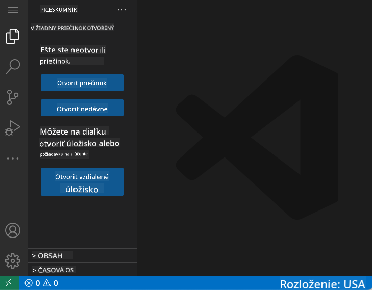
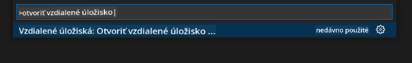
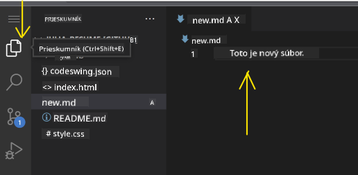
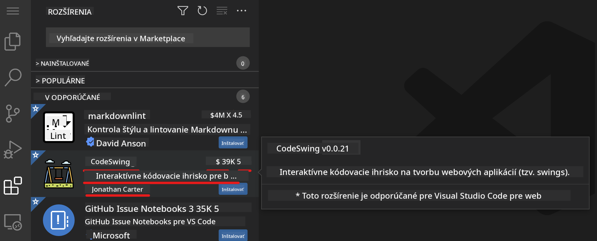
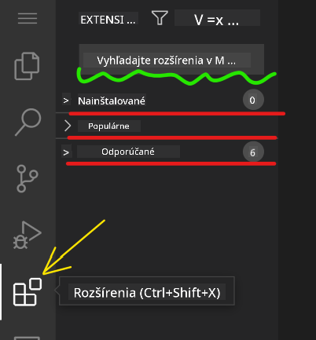
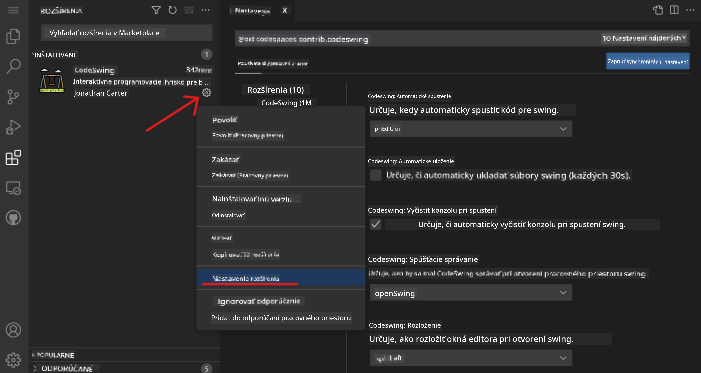

<!--
CO_OP_TRANSLATOR_METADATA:
{
  "original_hash": "1ba61d96a11309a2a6ea507496dcf7e5",
  "translation_date": "2025-08-29T11:17:03+00:00",
  "source_file": "8-code-editor/1-using-a-code-editor/README.md",
  "language_code": "sk"
}
-->
# Používanie editora kódu

Táto lekcia pokrýva základy používania [VSCode.dev](https://vscode.dev), webového editora kódu, aby ste mohli upravovať svoj kód a prispievať do projektu bez nutnosti inštalácie čohokoľvek na vašom počítači.

## Ciele učenia

V tejto lekcii sa naučíte:

- Používať editor kódu v projekte
- Sledovať zmeny pomocou verzionovacieho systému
- Prispôsobiť editor pre vývoj

### Predpoklady

Predtým, než začnete, budete si musieť vytvoriť účet na [GitHub](https://github.com). Prejdite na [GitHub](https://github.com/) a vytvorte si účet, ak ho ešte nemáte.

### Úvod

Editor kódu je nevyhnutný nástroj na písanie programov a spoluprácu na existujúcich projektoch. Keď pochopíte základy editora a naučíte sa využívať jeho funkcie, budete ich vedieť aplikovať pri písaní kódu.

## Začíname s VSCode.dev

[VSCode.dev](https://vscode.dev) je editor kódu na webe. Na jeho používanie nemusíte nič inštalovať, stačí ho otvoriť ako akúkoľvek inú webovú stránku. Na začiatok otvorte nasledujúci odkaz: [https://vscode.dev](https://vscode.dev). Ak nie ste prihlásení do [GitHub](https://github.com/), postupujte podľa pokynov na prihlásenie alebo si vytvorte nový účet a prihláste sa.

Po načítaní by mal editor vyzerať podobne ako na tomto obrázku:



Existujú tri hlavné sekcie, odľava doprava:

1. _Panel aktivít_, ktorý obsahuje ikony, ako lupa 🔎, ozubené koleso ⚙️ a niekoľko ďalších.
2. Rozšírený panel aktivít, ktorý predvolene zobrazuje _Prieskumníka_, nazývaného _bočný panel_.
3. Nakoniec oblasť kódu napravo.

Kliknite na každú z ikon, aby ste zobrazili rôzne menu. Po dokončení kliknite na _Prieskumníka_, aby ste sa vrátili na začiatok.

Keď začnete vytvárať kód alebo upravovať existujúci kód, bude sa to diať v najväčšej oblasti napravo. Túto oblasť budete používať aj na vizualizáciu existujúceho kódu, čo si vyskúšate ďalej.

## Otvorenie GitHub repozitára

Prvým krokom je otvorenie GitHub repozitára. Existuje niekoľko spôsobov, ako otvoriť repozitár. V tejto sekcii si ukážeme dva rôzne spôsoby, ako môžete otvoriť repozitár a začať pracovať na zmenách.

### 1. Pomocou editora

Použite samotný editor na otvorenie vzdialeného repozitára. Ak prejdete na [VSCode.dev](https://vscode.dev), uvidíte tlačidlo _"Open Remote Repository"_:


Môžete tiež použiť príkazovú paletu. Príkazová paleta je vstupné pole, kde môžete napísať akékoľvek slovo, ktoré je súčasťou príkazu alebo akcie, aby ste našli správny príkaz na vykonanie. Použite menu v ľavom hornom rohu, potom vyberte _View_ a následne _Command Palette_, alebo použite nasledujúcu klávesovú skratku: Ctrl-Shift-P (na MacOS Command-Shift-P).



Po otvorení menu napíšte _open remote repository_ a vyberte prvú možnosť. Zobrazia sa viaceré repozitáre, ktorých ste súčasťou alebo ktoré ste nedávno otvorili. Môžete tiež použiť úplnú URL adresu GitHub repozitára. Použite nasledujúcu URL adresu a vložte ju do poľa:

```
https://github.com/microsoft/Web-Dev-For-Beginners
```

✅ Ak ste úspešní, všetky súbory tohto repozitára sa načítajú v textovom editore.

### 2. Použitím URL adresy

Môžete tiež použiť URL adresu na načítanie repozitára. Napríklad, úplná URL adresa aktuálneho repozitára je [https://github.com/microsoft/Web-Dev-For-Beginners](https://github.com/microsoft/Web-Dev-For-Beginners), ale môžete nahradiť doménu GitHub za `VSCode.dev/github` a načítať repozitár priamo. Výsledná URL adresa by bola [https://vscode.dev/github/microsoft/Web-Dev-For-Beginners](https://vscode.dev/github/microsoft/Web-Dev-For-Beginners).

## Úprava súborov

Keď máte repozitár otvorený v prehliadači/vscode.dev, ďalším krokom je vykonanie aktualizácií alebo zmien v projekte.

### 1. Vytvorenie nového súboru

Môžete buď vytvoriť súbor v existujúcom priečinku, alebo ho vytvoriť v koreňovom adresári/priečinku. Na vytvorenie nového súboru otvorte umiestnenie/adresár, do ktorého chcete súbor uložiť, a vyberte ikonu _'New file ...'_ na paneli aktivít _(vľavo)_, zadajte názov a stlačte Enter.


### 2. Úprava a uloženie súboru v repozitári

Používanie vscode.dev je užitočné, keď chcete rýchlo aktualizovať svoj projekt bez nutnosti načítania akéhokoľvek softvéru lokálne. Na aktualizáciu kódu kliknite na ikonu 'Prieskumník', ktorá sa tiež nachádza na paneli aktivít, aby ste zobrazili súbory a priečinky v repozitári. Vyberte súbor, aby ste ho otvorili v oblasti kódu, vykonajte zmeny a uložte.



Keď dokončíte aktualizáciu projektu, vyberte ikonu _`source control`_, ktorá obsahuje všetky nové zmeny, ktoré ste vykonali v repozitári.

Na zobrazenie zmien, ktoré ste vykonali v projekte, vyberte súbor(y) v priečinku `Changes` na rozšírenom paneli aktivít. Tým sa otvorí 'Working Tree', kde vizuálne uvidíte zmeny, ktoré ste vykonali v súbore. Červená farba označuje vynechanie projektu, zatiaľ čo zelená znamená pridanie.


Ak ste spokojní so zmenami, ktoré ste vykonali, prejdite na priečinok `Changes` a kliknite na tlačidlo `+`, aby ste zmeny pripravili na commit. Príprava znamená, že zmeny sú pripravené na odoslanie do GitHub.

Ak však nie ste spokojní s niektorými zmenami a chcete ich zrušiť, prejdite na priečinok `Changes` a vyberte ikonu `undo`.

Potom zadajte `commit message` _(popis zmeny, ktorú ste vykonali v projekte)_, kliknite na ikonu `check`, aby ste commitovali a odoslali zmeny.

Keď skončíte s prácou na projekte, vyberte ikonu `hamburger menu` v ľavom hornom rohu, aby ste sa vrátili do repozitára na github.com.


## Používanie rozšírení

Inštalácia rozšírení vo VSCode vám umožňuje pridávať nové funkcie a prispôsobené možnosti vývojového prostredia vo vašom editore na zlepšenie pracovného toku. Tieto rozšírenia tiež pomáhajú pridávať podporu pre viaceré programovacie jazyky a často sú buď všeobecné rozšírenia, alebo jazykovo orientované rozšírenia.

Na prehliadanie zoznamu všetkých dostupných rozšírení kliknite na ikonu _`Extensions`_ na paneli aktivít a začnite písať názov rozšírenia do textového poľa označeného _'Search Extensions in Marketplace'_. Zobrazí sa zoznam rozšírení, z ktorých každé obsahuje **názov rozšírenia, meno vydavateľa, jednovetový popis, počet stiahnutí** a **hodnotenie hviezdičkami**.



Môžete tiež zobraziť všetky predtým nainštalované rozšírenia rozbalením priečinka _`Installed`_, populárne rozšírenia používané väčšinou vývojárov v priečinku _`Popular`_ a odporúčané rozšírenia pre vás buď od používateľov v rovnakom pracovnom priestore, alebo na základe vašich nedávno otvorených súborov v priečinku _`Recommended`_.



### 1. Inštalácia rozšírení

Na inštaláciu rozšírenia zadajte jeho názov do vyhľadávacieho poľa a kliknite naň, aby ste zobrazili ďalšie informácie o rozšírení v oblasti kódu, keď sa objaví na rozšírenom paneli aktivít.

Môžete buď kliknúť na _modré tlačidlo inštalácie_ na rozšírenom paneli aktivít, aby ste ho nainštalovali, alebo použiť tlačidlo inštalácie, ktoré sa zobrazí v oblasti kódu, keď vyberiete rozšírenie na načítanie ďalších informácií.


### 2. Prispôsobenie rozšírení

Po inštalácii rozšírenia možno budete musieť upraviť jeho správanie a prispôsobiť ho podľa svojich preferencií. Na to vyberte ikonu Extensions, a tentoraz sa vaše rozšírenie objaví v priečinku _Installed_, kliknite na _**ikonu ozubeného kolesa**_ a prejdite na _Extensions Setting_.



### 3. Správa rozšírení

Po inštalácii a používaní rozšírenia vám vscode.dev ponúka možnosti správy rozšírenia podľa rôznych potrieb. Napríklad môžete:

- **Deaktivovať:** _(Dočasne deaktivujete rozšírenie, keď ho už nepotrebujete, ale nechcete ho úplne odinštalovať.)_

    Vyberte nainštalované rozšírenie na rozšírenom paneli aktivít > kliknite na ikonu ozubeného kolesa > vyberte 'Disable' alebo 'Disable (Workspace)' **ALEBO** Otvorte rozšírenie v oblasti kódu a kliknite na modré tlačidlo Disable.

- **Odinštalovať:** Vyberte nainštalované rozšírenie na rozšírenom paneli aktivít > kliknite na ikonu ozubeného kolesa > vyberte 'Uninstall' **ALEBO** Otvorte rozšírenie v oblasti kódu a kliknite na modré tlačidlo Uninstall.

---

## Zadanie
[Vytvorte webovú stránku životopisu pomocou vscode.dev](https://github.com/microsoft/Web-Dev-For-Beginners/blob/main/8-code-editor/1-using-a-code-editor/assignment.md)

## Prehľad a samostatné štúdium

Prečítajte si viac o [VSCode.dev](https://code.visualstudio.com/docs/editor/vscode-web?WT.mc_id=academic-0000-alfredodeza) a niektorých jeho ďalších funkciách.

---

**Upozornenie**:  
Tento dokument bol preložený pomocou služby na automatický preklad [Co-op Translator](https://github.com/Azure/co-op-translator). Aj keď sa snažíme o presnosť, upozorňujeme, že automatické preklady môžu obsahovať chyby alebo nepresnosti. Pôvodný dokument v jeho pôvodnom jazyku by mal byť považovaný za autoritatívny zdroj. Pre dôležité informácie sa odporúča profesionálny ľudský preklad. Nezodpovedáme za akékoľvek nedorozumenia alebo nesprávne interpretácie vyplývajúce z použitia tohto prekladu.